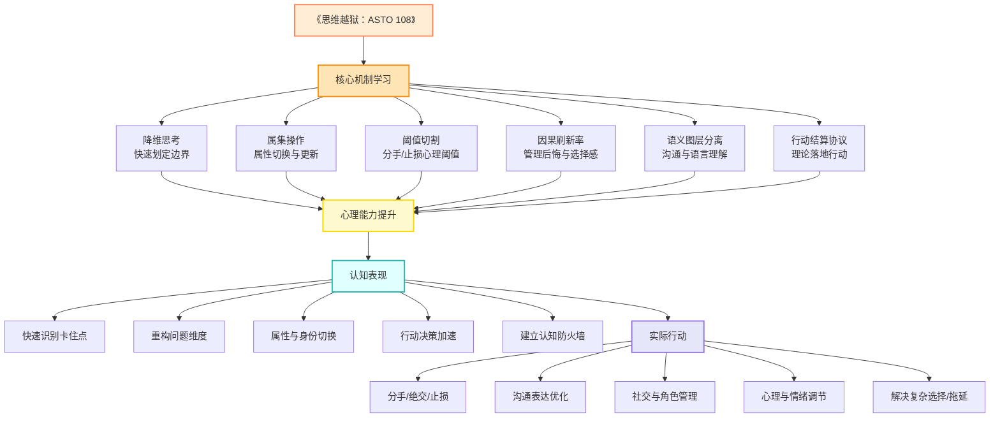

# 《验收之前》创作指南 v2.0

**主标题**：验收之前
**副标题**：那些代码之外的选择

**叙事视角**：女主第一人称
**核心定位**：用软件外包场景展示ASTO契约的刚性执行力

## 写作纪律补丁：回流 / 螺旋 / Residue
- **回流/递归**：阶段不保证单向推进；危机时允许退回“编码/混沌”去自洽；写作上要让“回滚/降级/撤回”成为可执行动作。
- **螺旋回归**：闭环只保留“形式回声”，不要写死“完全同一/命中注定”；标题/符号/母题每次都用**变形版本**出现。
- **Residue（剩馀物/代价）**：每卷至少留下一件剩馀物（污渍、裂痕、烂纸、骨折、失声、优惠券……），并让它在下一卷以更隐蔽的方式回响；代价必须由具体人承担，而不是被系统立刻消化。
- **纸三角/护身符非万能**：会湿、会烂、会失效；失效也要入账，成为后续博弈的一部分。
- **封板不“中性”**：任何封板都带私情裂纹；签名/手抖/墨渍等物理痕迹用来证明裂缝，而不是炫设定。
- **术语地下化**：正文尽量不讲术语，让人物先误解系统本质；读者靠场景与后果“看懂”。
- **负一阶操作者**：每卷至少有一个维护层人物在收拾后果（清理/运维/值班/外科），让系统的背面有手在干活。

---

## 〇、双版本设定

本作有两个平行版本，故事结构相同，地点和文化背景不同：

| 版本 | 语言 | 地点 | 目标读者 |
|------|------|------|----------|
| **硅谷版** | 英文 | 旧金山湾区 / Palo Alto | 国际读者 |
| **成都版** | 中文 | 成都 / 天府软件园 | 中国读者 |

### 两版对照表

| 元素 | 硅谷版 | 成都版 |
|------|--------|--------|
| 公司地点 | Palo Alto车库 → WeWork | 天府软件园 / 共享办公空间 |
| 社交场景 | 咖啡馆、精酿酒吧 | 茶馆、火锅店 |
| 压力来源 | VC融资、Demo Day | 客户回款、家庭催婚 |
| 女主思考场景 | 金门大桥、Mission District街头 | 锦江边、春熙路天台 |
| 深夜加班食物 | 披萨、能量饮料 | 冒菜、冰粉 |
| 散伙饭地点 | 意大利餐厅 | 老火锅店 |
| 调性 | 冷峻、精英、快节奏 | 温暖、烟火气、慢中有急 |

### ASTO的地域化应用差异

| 维度 | 成都版 | 硅谷版 |
|------|--------|--------|
| **核心冲突** | 人情关系 | 法律与资本 |
| **典型场景** | 客户说“随便改改”但期望免费 | VC的Term Sheet、股权对赌 |
| **ASTO作用** | 柔性边界的刚性切割（界定边界同时保留面子） | 刚性边界的柔性协商（合同条款的弹性空间） |
| **女主应对** | “王总，您说的'小改'具体是哪些功能？我先记下来” | “Let me check the contract scope first” |

**文化转译原则**：不是场景替换，而是ASTO应用的文化适配。

### 成都版地域科幻强化

**人民公园茶馆作为ASTO的“反空间”**：
> 人民公园的露天茶馆，是成都最“反效率”的地方。
> 一杯茶可以坐一下午，没有人赶你。
> 采耳的大爷不会问你“还需要点什么吗”。
> 这里没有deadline，没有里程碑，没有KPI。
> **每次我用ASTO算不出答案的时候，我就来这里。**
> 不是为了算出答案，是为了“不算”一会儿。

**火锅辣度作为不可量化变量（第15章场景）**：
> 味型服务员问：“辣度要多少？微辣、中辣、特辣，还是变态辣？”
> 林逸舟说：“我算一下……”
> 陈易凡立刻打断：“别算了，直接中辣。”
> 我在一旁看着他们。
> 辣度是一个奇怪的变量。
> 它可以被量化（斯科维尔指数），但每个人的“能吃辣”不一样。
> **同样的“中辣”，对我是“加点”，对林逸舟是“惩罚”，对陈易凡是“正好”。**
> 我突然想：感情也是这样吧。
> 同样的“喜欢”，对每个人的含义不一样。
> **这个变量没法用工具对齐。**

**地域科幻元素小结**：
- 人民公园茶馆 = ASTO失效的“反空间”（不计算的地方）
- 火锅辣度 = 不可量化的个体差异（感情的隐喻）
- 两者都是成都特有的文化符号，又承载了ASTO的哲学主题

### 角色名字对照

| 角色 | 成都版 | 硅谷版 |
|------|--------|--------|
| 女主 | 李芷涵 | Rachel Li |
| 男主A | 林逸舟 | Kevin Lin |
| 男主B | 陈易凡 | Eric Chen |

### 城市特色场景（必须出现）

**成都版**（场景功能化）：
|| 场景 | 地点 | 叙事功能 |
||------|------|----------|
|| 办公 | 天府软件园共享空间 | 项目开发、团队冲突 |
|| 思考 | 人民公园露天茶馆 | 女主内心独白、ASTO分析（“反空间”） |
|| 谈判 | 太古里咖啡馆 | 客户沟通、合约签订 |
|| 情感 | 玉林路小酒馆 | 三人聊天、暗示好感 |
|| 火锅 | 老火锅店（第15章） | “辣度”作为不可量化变量 |
|| 告别 | 九眼桥酒吧街 | 散伙饭后、女主离开 |

**硅谷版**（场景功能化）：
| 场景 | 地点 | 叙事功能 |
|------|------|----------|
| 办公 | Palo Alto车库 → WeWork | 项目开发、团队冲突 |
| 思考 | Golden Gate Bridge观景台 | 女主内心独白、ASTO分析 |
| 谈判 | University Ave咖啡馆 | 客户沟通、合约签订 |
| 情感 | Mission District酒吧 | 三人聊天、暗示好感 |
| 融资 | Sand Hill Road | 见投资人、Demo Day |

---

## 一、核心主题

**表层**：三个年轻人创业做软件外包，用ASTO契约管理项目交付
**里层**：契约可以约束代码，却约束不了感情；女主最终选择离开

**ASTO宣传点**：
- 展示ODD契约在软件外包中的具体应用
- 代码提交 → 自动验收 → 里程碑付款 → 争议仲裁
- 证明：刚性契约能解决"扯皮"问题，但解决不了"人心"问题

---

## 二、主要角色

### 角色基本信息

| 角色 | 姓名 | 年龄 | 职责 | 习惯 |
|------|------|------|------|------|
| 女主 | 李芷涵 | 32 | PR/客户关系 | 想不明白时抽烟；通过《思维越狱》学会ASTO |
| 男主A | 林逸舟 | 34 | 产品/前端 | 不抽烟；富二代背景 |
| 男主B | 陈易凡 | 33 | 技术/后端 | 会抽烟；暗恋女主但表达克制 |

### 立体人物设定（优秀点 + 缺陷点）

#### 女主：李芷涵

**优秀点**：
- 聪明、善于观察，能看穿人性和细节
- 富有同理心，能理解他人的情绪和需求
- 独立，有自己的生活节奏和追求
- 情绪丰富，能从生活小事中感受到快乐和美好

**缺陷点**：
- 犹豫不决，容易过度分析和内耗
- 对自己要求高，理想化情感和生活
- 情感拉扒严重：想自由又渴望依赖
- 容易自责或怀疑别人的动机

---

#### 男主A：林逸舟（ASTO依赖者）

**对ASTO的态度**：
- 相信感情也可以“迭代优化”
- 用ASTO管理产品roadmap，认为关系也可以有“路线图”
- 希望给女主“最优解”（安全）

**优秀点**：
- 聪明且有事业心，做事有计划
- 情绪稳定，能给人安全感
- 对女主细心、体贴，善于沟通
- 正直可靠，值得信任

**缺陷点**：
- 有点固执或过于理性，缺少感性表达
- 对生活小趣味不够敏感，偶尔显得冷淡
- 难以理解女主的犹豫和内耗
- 在浪漫和冒险上不够灵活

**致命缺陷**：用ASTO分析女主的情绪——“你现在的愁脉值是P1还是P0？”

---

#### 男主B：陈易凡（ASTO反抗者）

**对ASTO的态度**：
- 写代码时故意留“艺术性的混乱”（我知道最优解，但我不想要）
- 认为ASTO杀死了软件的灵性和惊喜
- 希望给女主“不可预测”（自由）

**优秀点**：
- 外向、幽默，能带给女主欢乐和轻松感
- 情感丰富，善于理解对方情绪
- 富有创造力，生活中总能制造惊喜
- 善于随机应变，适应性强

**缺陷点**：
- 稳定性较弱，计划性差，容易冲动
- 对长远目标缺乏规划，可能让女主担忧未来
- 情绪化，遇到冲突容易逃避或反应过激
- 有时候自我中心，需要女主迁就

**致命缺陷**：拒绝用ASTO规划未来——“我们无法定义下个月的属集”

---

### 人物张力分析（以ASTO为核心）

| 维度 | 男主A（林逸舟） | 男主B（陈易凡） |
|------|-----------------|------------------|
| **对ASTO的态度** | 依赖者：用ASTO管理一切 | 反抗者：故意留“混乱” |
| **吸引女主的方式** | “我能给你最优解”（安全） | “我能给你不可预测”（自由） |
| **致命缺陷** | “你现在的愁脉值是P1还是P0？” | “我们无法定义下个月的属集” |

**女主的困境不仅是“选A还是B”，而是“选被定义还是选不可定义”**——这直接对应ASTO的核心悖论（封板 vs 变迁）。

### 两个男主的表白方式（第19-23章）

**男主A的表白（第19章）**：
- 递给女主一份“关系发展路线图”（里程碑、Gantt图）
- 用数据分析证明“我们在一起的ROI最高”
- **真诚但可怕**：女主感到被当成项目管理

**男主B的表白（第23章）**：
- 在代码注释里写了一句诗（非结构化数据）
- 女主用ASTO分析不出含义，要直接问他
- **浪漫但不安**：女主感到无法用工具抵抗

### 镜像对手：哲学镜像+叙事催化剂（周立诚/David Zhou）

**核心定位**：不只是“ASTO滥用者”，而是女主在**平行宇宙里可能成为的人**（未来幽灵）。

**成都版周立诚**：
- 45岁，家族企业继承人，用ASTO改造传统制造业
- 妻子是“合约婚姻”：当年谈婚姻像谈商业合作，双方家庭签约
- 孩子的教育用KPI管理：钢琴考级、奥数获奖都是“里程碑”
- 展示：**中式家庭的系统异化**——用工具管理感情，表面和谐实则空洞

**硅谷版David Zhou**：
- 42岁，连续创业者，Biohacker圈子名人
- 用ASTO优化睡眠、饮食、运动、甚至性生活（“亲密关系的ROI分析”）
- 女友是他用“属集筛选”找到的：基因检测兼容、五年规划对齐
- 展示：**极客文化的自我物化**——把自己当成系统来优化

**他的项目（第二季核心）**：
- “智能婚恋匹配系统”外包（用ASTO属集筛选相亲对象）
- 技术上完美交付，但女主目睹其应用场景后产生**道德眩晕**
- 将外部商业成功与内部价值崩溃的张力拉到最大

**人物特征**：
- 极度理性，每个决策都有数据支撑
- 效率惊人，公司运转如精密机器
- 家庭"和谐"，但妻子眼神里没有光
- 说话像在执行合约："这个需求的优先级是P1，deadline是周五"

**哲学对话（第11章或第26章）**：

当女主为感情纠结时，他漫不经心地说：
> “感情？不过是多巴胺和承诺的属集合约。优化它，就像优化任何系统一样。”
> 我心里一惊——这句话，我曾在夜里暗自认同过。
> 但听他说出来，我感到的是恐惧。

**同情瞬间（第26章揭露）**：

周立诚的办公桌上放着一本《思维越狱》，扁页有付毅签名：“给立诚：**记得留白**。”
> 他看到我注意到，苦笑：“十年前付毅给我的，我当时以为‘留白’是效率浪费。现在…”
> 他顿了顿，看向窗外：“我妻子上周提出离婚。合约没规定这个场景的处理流程。”
> 我突然意识到：**他不是反派，是我的未来式。**

**与女主的对照**：
| 维度 | 周立诚 | 李芷涵 |
|------|--------|--------|
| ASTO使用方式 | 工具变牢笼 | 工具划边界 |
| 对感情的态度 | 可以被优化 | 无法被定义 |
| 最终状态 | 成功但崩溃 | 离开但自由 |
| 《思维越狱》 | 忽略了“留白” | 记住了“局限” |

**叙事功能**：
- 展示ASTO被滥用的可怕后果（连大师也失效）
- 让女主的恐惧具象化（她可能变成他）
- “留白”扁页与结尾“我有权不定义它”呼应
- 为第22章“失效”提供镜像印证

### 角色关系

- 林逸舟（男主A）与陈易凡（男主B）是大学同学，技术互补
- 李芷涵因公关能力被邀请加入，负责客户关系
- 两位男主都对女主有好感，女主心知肚明但无法选择

### 女主ASTO知识来源

李芷涵的ASTO方法论来自作家**付毅**的作品。

**付毅的ASTO系列作品**：
| 作品 | 类型 | 内容 |
|------|------|------|
| 《思维越狱：108个世纪谜题》 | 哲学/思维 | 用ASTO解决经典难题，入门读物 |
| 《作品》 | 科幻小说 | ASTO的诞生与误用（2026-2050） |
| 《文明之光》 | 科幻小说 | ASTO治理时代（2040-2055） |
| 《奇点前夜》 | 科幻小说 | ASTO危机与逃离（2100） |

**女主的阅读路径**：
1. 在前公司遇到职场瓶颈，朋友推荐《思维越狱》
2. 读完后开窍，又找来付毅的科幻三部曲
3. 三部曲让她看到ASTO的可能性和危险性
4. 加入创业团队后，尝试用ASTO设计项目契约

**小说中的展现**：
- 女主书架上有付毅的几本书（员工或客户可能注意到）
- 《思维越狱》应成为“圣经”而非“教科书”：女主只记住了几句片段金句，而非系统讲解
- 结尾时：“那本书教了我很多，但没教我这个”

### 防呆设计：ASTO术语去概念化

**核心原则**：禁止直接出现ASTO术语，用**行为展示概念**。

| 禁止写法 | 应该写法 |
|----------|----------|
| “我正在做语义图层分离” | “他说'随便'，但眼神没随便。这是两层东西，我得剥开看。” |
| “这是属集操作” | “他是'合伙人'还是'喜欢的人'？这两个身份没法同时处理。” |
| “这是阈值切割” | “失望多少次才算数？我得给自己划一条线。” |
| “这是行动结算协议” | “不能再拖了，得给这段关系一个交代。” |

### 早期ASTO局限性展示（第1-4章）

**目的**：在第22章“ASTO失效”前，让读者已经知道工具不是万能的。

**第1章**：地铁路线的反讽
> 我用那本书的方法算出了最优地铁路线，省了三分钟。
> 但在地铁上我想了三分钟前男友，浪费了三十分钟。
> **ASTO算不出情绪成本。**

**第2章**：吸烟的“反工具化”
> 我知道最优解是不吸烟。
> 但我需要这个“低效”行为来确认自己还活着。
> **有些事情，不要用“最优解”去衡量。**

**吹烟的叙事功能**：
- 吸烟本身是反健康的（非理性）
- 这成为女主的**人性键点**——她知道ASTO最优解是不吸烟，但她需要这个“低效”行为
- 避免女主变成“人形算法”

### 吸烟成瘾性弧线（戒断与复吸）

**目的**：通过吸烟这个“非理性行为”展示女主的自由意志与ASTO的张力。

**第10章：戒烟**
> 我用那本书的方法算了一下吸烟的成本：
> 健康损失、社交成本、财务支出、依赖性风险……
> 结论很明确：成本 > 收益。应该戒。
> 我把烟盒交给陈易凡保管。
> 他笑着问：“你确定？”
> “我算过了。”我说。

**第17章：复吸**
> 压力小崩溃那天，我在天台上待了两个小时。
> 然后我给陈易凡发了条消息：“烟盒还我。”
> 他没有问为什么。
> 只是打开门的时候说：“我知道你会要回来的。”
> 我拿走烟盒，没看他。
> **我想证明：我可以不用工具做决定。**

**第22章：手在抖**
> 我点燃一支烟。
> 手在抖。
> 不是因为冷，不是因为害怕。
> 是因为我不知道我为什么在抽这支烟。
> 我算过不该抽，我复吸了，现在我又在抽。
> **ASTO教我如何做决定，但没教我如何做“明知故犯”的决定。**
> 这也是一种自由。

**写作原则**：写行为，不写解释。让读者自己感受到这个弧线的张力。

### 第22章前置失效铺垫（3个层面）

在第10-18章分散插入，让第22章的崩溃有物理层面的支撑：

**1. 生理层面失效（第10章左右）**：
> 我尝试用那本书的方法管理每个月那几天的情绪（属集切换）。
> 但激素变化不可预测。
> **有些变量，不在输入端。**

**2. 社会层面失效（第15章催婚）**：
> 那本书能算清“为你好”的语义层吗？
> 算不清。
> 因为妈妈说的“为你好”里面，有爱、有控制、有恐惧、有自己的遗憾。
> **这些层叠在一起，任何工具都剥不干净。**

**3. 技术层面失效（第17章左右）**：
> 那个Bug是“非代码因素”引起的——客户服务器的时区设置错了。
> ODD合约只能约束已知属集，无法约束“涌现属性”。
> **有些问题，不在边界内。**

**第22章的爆发**：
当这些小的失效累积，在第22章面对感情时，她意识到：
> “我”本身就是一个不断变迁的属集，无法被我自己封板。

### GC比喻前置声明（为第36章服务）

**第1章引入**：
> 早期项目处理过一个内存泄漏问题。
> 我用自己的方式解释给客户听："就像…在心里腾出空间，不然会卡死。"
> 客户笑了："你们程序员真会比喻。"

**第5章GC首现（验收庆祝）**：
> 首次验收通过。我们点了外卖庆祝。
> 我把吃完的外卖盒子收拾好，堆在门口。
> 陈易凡打掉了一口罐啤，看着我："你在清内存？"
> 我抬头："对，要不然明天工位会卡。"
> 他笑了："程序员的日常：写代码的时候忘记GC，生活里却天天在GC。"
> 林逸舟抬头，没惬地加了一句："有些内存，释放不了。"
> 当时我以为他在说代码。

**第25章强化**：
> 我清理了办公桌（物理GC）。
> 陈易凡路过："你在做垃圾回收？"
> 我抬头："不，我是**释放占用**。"

**第36章回收**：非技术读者通过前文已理解GC=放下/清理/释放，技术读者获得双重快感。

### 女主的标志性行为模式

每次和男生吵完架、下不了决定时，女主会：

1. **带上《思维越狱》+ 一包烟**
2. **去成都的某个角落**：茶馆、咖啡厅、天台
3. **边读书、边抽烟、边思考**
4. **想明白怎么下决定、怎么说服两位合伙人**

这个行为模式是小说的**视觉符号**，建议在以下节点出现：
- 第4章：深夜加班后的第一次独处
- 第9章：察觉两人心意后的困惑
- 第17章：压力下的小崩溃
- 第24章：和男主A深夜谈心后
- 第25章：和男主B咖啡馆对话后
- 第28章：决定离开前的最后一次思考

### 女主ASTO思维路径图



**思维路径说明**：
- **A → B**：女主从书中学习ASTO核心操作，不是学哲学，而是学方法
- **B → C**：核心机制在她脑中生成心理能力
- **C → D**：心理能力转化为认知表现（识别卡住点、重构维度）
- **D → E**：认知表现落地为具体行动（沟通、决策、情绪管理）

**在小说中的应用场景**：
| ASTO机制 | 小说场景 | 内心独白示例 |
|------------|----------|----------------|
| 阈值切割 | 决定是否继续和客户合作 | “失望攻到多少才算数？我得划一条线” |
| 属集操作 | 分析两个男生的属性 | “他是“合伙人”还是“喜欢的人”？这是两个属集” |
| 因果刷新率 | 后悔某个决定 | “后悔没用，那个时间线已经结算了” |
| 语义图层分离 | 和男主吵架后复盘 | “他说的“随便”不是真的随便，语义层错了” |
| 行动结算协议 | 决定离开公司 | “不能再拖了，得结算这段关系” |

### 生活化ASTO场景（吸引女性读者）

#### 场景一：闺蜜吐槽

**人物**：女主的最好闺蜜（可以叫“小林”）

**场景设定**：
- 地点：成都的咖啡厅/奶茶店
- 闺蜜在吐槽自己的问题（工作/感情/家庭）
- 女主用ASTO方法帮她分析

**可选闺蜜问题**：
| 闺蜜问题 | ASTO分析方式 | 女主引导话术 |
|----------|--------------|----------------|
| 男朋友冷暴力，要不要分 | 阈值切割 | “你给自己定个线，到多少次就结算？” |
| 跟同事关系差，要不要离职 | 属集操作 | “他是‘同事’还是‘敌人’？不同属集不同应对” |
| 父母催婚，很烦 | 语义图层分离 | “他们说‘为你好’，语义层是什么？” |
| 买东西选择困难 | 行动结算 | “不用追求最优，得先结算” |

**对话示例**：
> 闺蜜：“他又冷暴力我了，我很难受但又舍不得分…”
> 女主摸出烟，点上：“那书里说，失望攻到多少才算数？你得给自己定个阈值。不是看感觉，是看次数。”
> 闺蜜：“什么书？”
> 女主从包里掉出《思维越狱》：“这本。教你怎么不卡住。”

**建议出现章节**：第6章或第16章

---

#### 场景二：催婚大战

**人物**：女主妈妈（李母）

**场景设定**：
- 妈妈逼女主和一个“高干子弟”相亲
- 女主不想去，但妈妈用“为你好”“你都32了”轰炸
- 女主用ASTO方法说服妈妈不强制她

**ASTO分析过程**：

1. **语义图层分离**：
   - 妈妈说“为你好” → 真实语义：“我很焦虑”
   - 妈妈说“条件很好” → 真实语义：“符合我的筛选标准”

2. **属集操作**：
   - 妈妈的筛选属集：家境、学历、工作
   - 女主的筛选属集：三观、性格、共同话题
   - “妈，我们的筛选器不一样”

3. **边界切割**：
   - “您可以建议，但最终决定权在我这里”
   - “如果您强制，我们的关系会受损，这不是您想要的”

**对话示例**：
> 妈妈：“小李家的儿子，父亲是局长，条件多好！你都32了！”
> 女主：“妈，您说的‘条件好’是指什么？”
> 妈妈：“家境好、工作稳定、学历高…”
> 女主：“这是您的筛选标准，不是我的。我的标准是：三观契合、能聊得来、互相尊重。”
> 妈妈：“那不一样吗？”
> 女主：“不一样。您的是‘硬件’，我的是‘软件’。如果硬件不兼容软件，系统会崩的。”
> 妈妈：“…”
> 女主：“妈，我们划个边界。您可以推荐，我可以参考，但最终决定权在我。如果您强制，我会反弹，我们的关系会受损。这不是您想要的结果吧？”

**结果**：妈妈没有强制，但依然不死心（留下后续张力）

**建议出现章节**：第15章“相亲插曲”

---

#### 这两个场景的作用

| 作用 | 闺蜜场景 | 催婚场景 |
|------|----------|----------|
| 展示ASTO | 女主教别人用 | 女主自己用 |
| 情感共鸣 | 闺蜜的烦恼很日常 | 催婚是痛点 |
| 节奏调节 | 轻松的嗘嘴 | 紧张的对峥 |
| 引流 | 闺蜜可能去买书 | 读者想学说服父母 |

---

## 三、ASTO契约在软件外包中的应用

### 3.1 ODD契约模板

每个外包项目签订的智能合约包含：

```
【输入】
- 需求文档Hash
- 代码仓库地址
- 验收标准（自动化测试覆盖率、性能指标）

【执行逻辑】
- 代码提交 → 触发CI/CD
- 测试通过率 ≥ 95% → 里程碑完成
- 里程碑完成 → 自动释放款项

【争议仲裁】
- 客户异议 → 48小时内提交证据
- 第三方节点投票 → 72小时出结果
- 结果自动执行，无需人工干预
```

### 3.2 小说中展示的契约场景

| 场景 | 冲突 | ASTO解决方式 |
|------|------|--------------|
| 客户拖延付款 | 验收后不打款 | 合约自动执行，款项从托管账户释放 |
| 需求频繁变更 | 客户不断加功能 | 变更需签署补充合约，否则按原需求交付 |
| 代码质量争议 | 客户说有Bug | 以自动化测试结果为准，通过即验收 |
| 团队分工扒皮 | 谁负责这个模块？ | 任务分配写入链上，权责清晰 |
| 里程碑延迟 | 开发超时 | 合约自动扣除延迟罚金 |

### 3.3 ASTO在女主内心的展示方式

通过女主第一人称内心独白展示ASTO，避免生硬说教：

**看到链上数据时的感受**：
> “合约自动执行了。钱到账，分毫不差。我盯着那串交易哈希，突然很羱慕代码——它们不需要纠结。”

**对比感情时的反差**：
> “如果喜欢一个人也能写成合约就好了。输入：心动次数。输出：在一起或不在一起。可惜没有这样的算法。”

**项目成功但情感失败时**：
> “所有测试用例都通过了。客户满意。合约验收。只有我的心，return了一个null。”

---

## 四、36个小故事结构

### 第一幕：起步（1-9）
建立团队、签订第一份ODD契约、初尝甜头

| # | 小故事主题 | 核心冲突 | ASTO应用 | 情感线 |
|---|------------|----------|----------|--------|
| 1 | 三人聚首 | 公司注册、资金紧张 | 股权分配写入智能合约 | 三人初次合作 |
| 2 | 第一个客户 | 小项目试水 | 签订第一份ODD合约 | 男主A主动接近女主 |
| 3 | 需求文档之争 | 客户需求模糊 | 用ASTO模板强制明确需求 | 女主展示专业能力 |
| 4 | 深夜加班 | Bug连锁爆发 | 任务追溯，定位责任人 | 男主B默默帮女主买咖啡 |
| 5 | 首次验收 | 客户挑刺 | 自动化测试结果说话 | 团队小庆祝 |
| 6 | 催款风波 | 客户拖延付款 | 合约自动执行释放款项 | 男主A请女主吃饭 |
| 7 | 招聘实习生 | 新人代码质量差 | 代码审查流程上链 | 女主压力增大 |
| 8 | 第二个客户 | 项目规模更大 | 里程碑拆分，分批付款 | 男主B暗示好感 |
| 9 | 需求变更陷阱 | 客户无限加功能 | 变更需签补充合约 | 女主开始察觉两人心意 |

### 第二幕：攀升（10-18）
项目变大、压力增加、三角关系逐渐明朗

| # | 小故事主题 | 核心冲突 | ASTO应用 | 情感线 |
|---|------------|----------|----------|--------|
| 10 | 服务器宕机 | 线上事故 | 事故责任追溯，自动触发SLA赔偿 | 团队关系紧张 |
| 11 | 投资人面试 | 需要展示技术实力 | 用链上交付记录证明信誉 | 女主独撑场面 |
| 12 | 大客户上门 | 高要求高回报 | 签订复杂多里程碑合约 | 男主A表白未遂 |
| 13 | 技术选型争议 | 前后端方案冲突 | 投票机制写入团队合约 | 两个男主暗中较劲 |
| 14 | 代码归属权 | 谁写的算谁的？ | Git提交记录上链 | 女主两边调解 |
| 15 | 相亲插曲 | 女主被家里逼相亲 | — | 男主A嫉妒，男主B沉默 |
| 16 | 外包团队摩擦 | 外聘开发者不配合 | 合约约束外包人员 | 女主抽烟思考 |
| 17 | 客户验收延迟 | 客户迟迟不签收 | 超时自动视为验收通过 | 压力下的小崩溃 |
| 18 | 第一次盈利 | 账面终于正了 | 利润按股权合约自动分配 | 短暂的和平 |

### 第三幕：高潮（19-27）
情感冲突爆发，契约无法解决人心

| # | 小故事主题 | 核心冲突 | ASTO应用 | 情感线 |
|---|------------|----------|----------|--------|
| 19 | 男主A正式表白 | 感情摊牌 | — | 女主拒绝但心乱 |
| 20 | **伪高潮：和解** | 三人决定“先工作” | 用ASTO分离工作/情感 | 以为问题解决了 |
| 21 | **窒息的完美** | 团队达到机械般高效 | 合约如精密仪器运行 | 冰冷的“完美”，无人开玩笑 |
| 22 | **ASTO失效时刻** | 女主发现ASTO解决不了心里的乱 | 她尝试用阈值切割分析感情，失败 | “我算不出我的心” |
| 23 | 男主B正式表白 | 感情摊牌 | — | 女主再次拒绝，但这次哭了 |
| 24 | 大项目危机 | 核心功能延期 | 延迟罚金触发 | 情绪爆发，互相指责 |
| 25 | **存在主义选择** | 男主A和女主谈心 | — | 女主说“**我不是选不了，是不想选**” |
| 26 | 三人会议 | 讨论公司未来 | 尝试用ASTO重新分配角色 | 无法达成共识 |
| 27 | 大项目交付 | 最终验收 | 合约自动执行，项目成功 | 技术上成功，情感上失败 |

### 第四幕：落幕（28-36）
女主选择离开，契约可以结算代码，结算不了感情

| # | 小故事主题 | 核心冲突 | ASTO应用 | 情感线 |
|---|------------|----------|----------|--------|
| 28 | 女主的决定 | 想要退出 | 查阅股权退出条款 | 内心独白 |
| 29 | 交接准备 | 客户关系移交 | 客户资料上链交接 | 男主们试图挽留 |
| 30 | 股权结算 | 女主股份如何处理 | 按合约回购/转让 | 冷静但伤感 |
| 31 | 最后一个项目 | 女主主导的最后交付 | 完美执行ODD流程 | 告别之作 |
| 32 | 散伙饭 | 三人最后聚餐 | — | 各怀心事 |
| 33 | 女主离开 | 正式离职 | 合约自动结算所有权益 | "验收通过，但我不通过" |
| 34 | 新的开始 | 女主独自一人 | — | 抽烟，看着城市 |
| 35 | 两个男生继续 | 公司还在运转 | 合约照常执行 | 他们还是朋友 |
| 36 | 尾声 | 女主收到分红通知 | 合约自动执行分红 | "代码验收了，我的心没有" |

---

## 五、叙事节奏

### 四幕结构

| 幕 | 章节 | 主题 | 技术线 | 情感线 |
|----|------|------|--------|--------|
| 第一幕 | 1-9 | 起步 | 团队建立、初尝甜头 | 三人初识、暗涌 |
| 第二幕 | 10-18 | 攀升 | 项目扩大、压力增加 | 情感萌芽、渐明朗 |
| 第三幕 | 19-27 | 高潮 | 大项目交付 | 情感冲突爆发 |
| 第四幕 | 28-36 | 落幕 | 项目收尾、股权结算 | 女主选择离开 |

**节奏原则**：情感高潮与项目高潮错开，让读者有呼吸空间

### 项目季划分（避免节奏均质化）

将36章分为**3个项目季**，每个季有一个核心大项目：

| 季 | 章节 | 核心项目 | 情感弧线 |
|----|------|----------|----------|
| 第一季 | 1-12 | 创业起步+小项目积累 | 三人初识→暗涌 |
| 第二季 | 13-24 | 周立诚大项目 | 情感明朗→崩溃 |
| 第三季 | 25-36 | 收尾+分离 | 选择→离开→重生 |

### 章节分类（拕点分配）

将36章分为**关键章**、**过渡章**和**呼吸章**：

| 类型 | 占比 | 特征 | 章节示例 |
|------|------|------|----------|
| **关键章** | ~30% | 重大情感/哲学转折，必须写得极好 | 15(催婚)、21(窒息)、22(ASTO失效)、25(存在主义)、33(离开)、36(尾声) |
| **过渡章** | ~50% | 推进情节，展示ASTO应用 | 2-9〄10-14〄16-18〄28-32〄etc |
| **呼吸章** | ~20% | 节奏放缓，生活化场景 | 6(闺蜜)〄4(加班)、18(盈利)〄35(男生继续) |

### ASTO出现频率控制（避免说教）

| 章节类型 | ASTO浓度 | 展示方式 |
|----------|----------|----------|
| 关键章 | 低或无 | 用情感替代工具 |
| 过渡章 | 中高 | 叙事驱动的ASTO应用 |
| 呼吸章 | 低 | 生活化的ASTO（闺蜜/催婚） |

**原则**：每次ASTO出现必须是**叙事驱动**或**角色驱动**，而非作者驱动。

### 每章结构
1. **冲突触发**（项目或情感）
2. **女主内心独白**（抽烟思考）
3. **ASTO分析/决策**（契约如何处理）
4. **结果与反馈**（技术上解决了，人心上呢？）

### 小故事衔接技巧

每个小故事之间增加**微型冲突节点**，让衔接更自然：
- 内部代码争论中的误会
- 客户需求的二次变更
- 社交场景的小插曲（茶馆/咖啡馆的偶遇）
- 家庭电话的打断（催婚、问候）

### 情感线与契约线的对比
- **契约线**：清晰、刚性、自动执行、没有扒皮
- **情感线**：模糊、柔性、无法自动执行、全是扒皮

这种对比是小说的核心张力：
> ASTO能解决一切可以被定义的问题，但"我喜欢谁"无法被定义。

### 情感张力技巧

**用行为替代表白**：
- 男主A：在项目中主动承担女主的工作、深夜送宵夜
- 男主B：默默优化女主负责的模块、不声不响帮忙

**暗示而非直白**：
- “他看了我一眼，没说话，把代码提交了”
- “她的咖啡突然凉了，他什么时候换的？”

**节奏错开**：情感高潮和项目高潮不同时发生，避免读者疲劳

---

## 六、传播钩子设计

### 6.1 可截图分享的金句（每章结尾必有一句）

**情感类**（打动女性读者）：
- “他说验收通过的时候，我听见心里有个测试用例失败了。”
- “合约能算清滞纳金，算不清我今晚为什么失眠。”
- “所有里程碑都完成了，除了那个叫‘选择’的。”
- “我不是选不了，是不想选。”
- “验收之前，我以为最难的是交付。验收之后，我才知道最难的是告别。”

**软工隐喻类**（让读者想学，降低门槛）：
- “失望多少次才算数？我得给自己划一条线。”
- “他说‘随便’，但眼神没随便。这两层东西没对上。”
- “您的是‘硬件’，我的是‘软件’。如果硬件不兼容软件，系统会崩的。”
- “不用追求最优，得先结算。”
- “我先不commit这段人生，让它在暂存区里再飘一会儿。”

**反转类**（制造话题）：
- “所有测试都通过了。客户满意。合约验收。只有我的心，return了一个null。”
- “我算不出我的心。”（ASTO失效时刻）
- “我有权不定义它。”（结尾）

**软工隐喻使用原则**：用commit/暂存区/测试用例/return null等**软件工程隐喻**替代ASTO术语，既保持专业感又降低门槛。

---

### 6.2 爆点场景设计（必须出现）

| 章节 | 场景 | 爆点 | 传播点 |
|------|------|------|--------|
| 第15章 | 催婚大战 | “您的是硬件，我的是软件” | 读者截图发给父母 |
| 第21章 | 窒息的完美 | 团队如机器运转，却无人开玩笑 | “完美的空洞”的讨论 |
| 第22章 | ASTO失效时刻 | 女主尝试用阈值切割分析感情，失败 | “理性也有边界”的讨论 |
| 第25章 | 存在主义选择 | 女主发现“保留选择X的可能性”比“选A或B”更重要 | 女性独立+哲学话题 |
| 第33章 | 女主离开 | “验收通过，但我不通过” | 成长型结局讨论 |
| 第36章 | 尾声反转 | 女主收到分红通知+新的工作邀请 | “她后来怎么样了” |

---

### 6.3 ASTO失效时刻（核心场景，第22章）

这是全书的**哲学之眼**，必须写得极好。

**场景设定**：
- 女主在人民公园茶馆/金门大桥观景台
- 她翻开《思维越狱》，尝试用“阈值切割”分析自己的感情

**内心独白（终极升级版）**：
> "失望攻到多少才算数？"
> 我翻开那一页，尝试给自己定个阈值。
> 如果林逸舟让我失望3次，我就……
> 等等，他让我失望过吗？好像没有。
> 那陈易凡呢？他也没有。
> 
> 我突然意识到一个问题。
> **我在用ASTO的刀，切割ASTO的持刀人——我自己。**
> 
> 我忽然想起五年前。
> 那时候我刚读完《思维越狱》，觉得自己获得了一把万能钥匙。
> 有一天晚上，我试着分析爸妈为什么离婚。
> 我把他们的争吵拆解成属集：期望错位、沟通失效、沉没成本……
> 我画出了一张完美的图谱。
> 
> 然后我哭了。
> 不是因为终于"想明白"了。
> 是因为我在用工具解剖他们的爱情——像解剖一只死青蛙。
> **那不是理解，是亵渎。**
> 
> 从那以后，我再也没用ASTO分析过"感情"这个词。
> 不是"算不出"，是**不敢算**。
> 
> 这就像那个著名的悖论：一个系统无法完全描述自身。
> 付毅在《奇点前夜》里写过，那个无所不能的系统，最终也无法理解陈默的牺牲。
> 因为观察者无法将自身完全客体化。
> 这是**元层面的不可判定性**。
> 
> 我合上书。
> **原来我此刻，就是我的"逻辑死锁"。**
> ASTO教我如何切割别人，但没教我如何切割我自己。
> 或者说——它教了，但我学会了一件更重要的事：
> **有些东西，算出来的那一刻，就已经被杀死了。**

**哲学深度**：
- **自指性危机**：ASTO是用来分析他人、分析问题的，但当“我”成为分析对象时，工具失效
- **与三部曲的联动**：呼应《奇点前夜》中系统无法理解人类牺牲的核心悲剧
- **伏笔作用**：为女主最终决定“不被系统定义”埋下种子

**这一刻的破圈点**：
- 让读过ASTO三部曲的读者产生“哦！”的共鸣
- 让没读过的读者想去找《奇点前夜》看
- 金句“我算不出我的心”可以被截图传播

---

### 6.3b 第25章哲学出口（存在主义选择）

**场景**：深夜天台，男主A和女主谈心

**内心独白**：
> 林逸舟问我：“你到底想要什么？”
> 我答不上来。
> 
> 他又问：“是我不够好，还是陈易凡更好？”
> 我摇头。
> 
> ASTO教我如何在不同选项之间优化选择。
> 但我发现，比“选择A或B”更重要的，是“**保留选择X的可能性**”。
> 
> 我离开，不是为了放弃A和B。
> 是为了不让自己被“只能选A或B”这个系统定义。
> 
> “我不是选不了，是不想选。”
> 我终于说出口了。

**哲学词汇映射**：
- “保留选择X的可能性” = 存在主义的“超越”
- “不被系统定义” = 拒绝本质化
- 女主的选择不是“逃避”，而是主动的“存在主义选择”

---

### 6.4 结尾优化（成长感 + 开放结局 + GC比喻）

原结局：女主离开，收到分红，“代码验收了，我的心没有”

**优化后的第36章：**

女主收到两条消息：
1. 分红到账通知（合约自动执行）
2. 一封新的工作邀请（来自之前服务过的客户）

**内心独白（最终版——“暂存区”非闭合结构）**：
> 钱到账了。分毫不差。
> 合约还在运转，公司还在运转，他们也还在运转。
> 只是没有我了。
> 
> 我看着那封新的工作邀请。
> 是之前那个挑刺最多的客户。
> 他在邮件里说：“你是我见过最专业的PR。”
> 
> 我没有立刻回复。
> 也没有删除。
> 
> **像一段未提交的代码，停在暂存区里。**
> **Git不会催促我。**
> 
> 我按灭了烟。
> 窗外的城市，万家灯火。
> 每一盏灯下，可能都有一套正在运行或死机的系统，
> 一段正在结算或烂尾的感情。
> 
> 而我的系统，刚刚完成了一次干净的**GC**。
> 垃圾回收。
> 内存释放了。
> 
> 下一个进程是什么，我还不知道。
> **但我知道，我有权不定义它。**

**最终版结局的精妙之处**：
- **“暂存区”比喻**：邮件没回复也没删除，像未提交的代码——保留可能性，不急于定义
- **Git不会催促我**：技术隐喻的最高境界——版本控制系统没有时间地制，不催促commit
- **GC比喻**：垃圾回收是程序员熟悉的概念，巧妙连接女主的技术身份与内心状态
- **“有权不定义它”**：与第25章“不被系统定义”的哲学主题呼应
- **非闭合结构**：不给读者“她最终选了XX”的答案，让故事停在“暂存区”
- **节奏感**：从“按灭烟”到“窗外万家灯火”，视角从内转外，从个人到谱系

**三层递进结构**：
1. 邮件 → 暂存区（行为层）
2. Git不会催促我（哲学层）
3. 我有权不定义它（存在主义层）

**破圈潜力**：
- “我有权不定义它”可以被截图传播
- “Git不会催促我”让程序员读者会心一笑
- 让非技术读者感受到“放下后的轻盈”

---

### 6.5 话题性元素

| 话题 | 场景 | 传播潜力 |
|------|------|----------|
| “硬件vs软件”的择偶观 | 催婚场景 | 很容易引发“父母和我的筛选标准”讨论 |
| “我不想选”的女性独立 | 第25章 | “为什么女生一定要选”的讨论 |
| ASTO的边界 | 第22章 | “理性能解决一切吗”的讨论 |
| 合伙人之间的感情 | 全书 | “创业能和朋友/喜欢的人一起吗” |
| 契约化生活 | 全书 | “如果一切都能写成合约”的想象 |

---

## 七、与ASTO三部曲的关系

本作是**独立故事**，不属于三部曲时间线。

### 互文彩蛋设计（“遗留代码”方式，不直接提及）

**第4章深夜加班**：
> 女主的电脑屏幕角落有一个未关闭的PDF：《奇点前夜》的草稿。
> 她以为这只是一部科幻小说，没意识到这是预言。
> （对读过三部曲的读者：“哦！”；对没读过的：只是场景细节）

**周立诚的书架（第11章或第26章）**：
> 我的目光扫过他的书架。
> 有一本《思维越狱》的初版，扁页有付毅的签名。
> “立诚兄，共勉。”
> 原来他是早期采用者。难怪工具用得这么深。
> （暗示周立诚可能认识付毅，为续篇留接口）

**第36章的邮件（同名彩蛋）**：
> 新客户公司的HR签名是“Shen Ruowei”。
> 没任何解释。
> （对读过《奇点前夜》的读者：沈若微从2100年穿越？不，只是同名——留给读者遐想）

**其他彩蛋**：
- 公司名可以叫“ODDStudio”
- 某个客户是“ASTO基金会”的关联企业
- 女主在某次分析中提到“我看过一本书叫《作品》”

**彩蛋设计原则**：不直接提及，用“遗留代码”方式。读过三部曲的读者获得惊喜，没读过的不影响阅读。

---

## 八、写作风格

- **调性**：职场创业剧 + 淡淡的感伤
- **语言**：简洁、利落、不煽情
- **技术细节**：真实但不过度，读者能理解
- **情感细节**：克制、留白、让读者自己感受

---

**核心记忆点**：
> 这是一个用ASTO契约成功交付了所有项目，却交付不了自己内心的故事。
