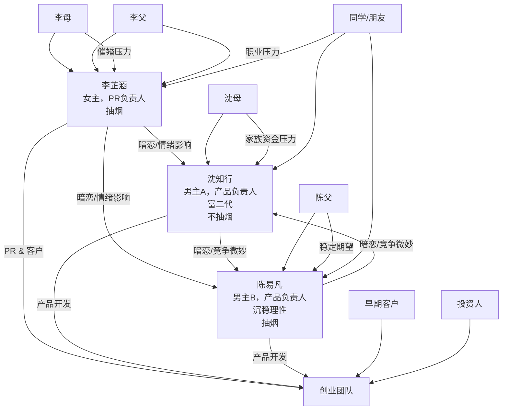

### 《验收之前》创作指南 v1.0（框架版）

**主标题**：验收之前
**副标题**：那些我没说出口的决定
**叙事视角**：女主第一人称

## 写作纪律补丁：回流 / 螺旋 / Residue
- **回流/递归**：阶段不保证单向推进；危机时允许退回“编码/混沌”去自洽；写作上要让“回滚/降级/撤回”成为可执行动作。
- **螺旋回归**：闭环只保留“形式回声”，不要写死“完全同一/命中注定”；标题/符号/母题每次都用**变形版本**出现。
- **Residue（剩馀物/代价）**：每卷至少留下一件剩馀物（污渍、裂痕、烂纸、骨折、失声、优惠券……），并让它在下一卷以更隐蔽的方式回响；代价必须由具体人承担，而不是被系统立刻消化。
- **纸三角/护身符非万能**：会湿、会烂、会失效；失效也要入账，成为后续博弈的一部分。
- **封板不“中性”**：任何封板都带私情裂纹；签名/手抖/墨渍等物理痕迹用来证明裂缝，而不是炫设定。
- **术语地下化**：正文尽量不讲术语，让人物先误解系统本质；读者靠场景与后果“看懂”。
- **负一阶操作者**：每卷至少有一个维护层人物在收拾后果（清理/运维/值班/外科），让系统的背面有手在干活。

---

#### 1️⃣ 主要角色

| 角色  | 性别 | 职责      | 性格特点          | 小习惯 / 行为                     |
| --- | -- | ------- | ------------- | ---------------------------- |
| 女主  | 女  | 公共关系    | 聪明、敏感、有责任感    | 想不明白时会抽烟；情绪容易影响决策；掌握 ASTO 方法 |
| 男主A | 男  | 产品 / 技术 | 冲动、情绪化，内心有正义感 | 会抽烟，易受情绪驱动做决策                |
| 男主B | 男  | 产品 / 技术 | 稳重、理性         | 不抽烟，做决策更冷静，但暗恋女主；情绪表达更克制     |

---

#### 2️⃣ 故事核心线

1. **创业线**

   * 三人共同创立软件外包公司
   * 项目开发、客户交付、团队管理为主线

2. **情感线**

   * 两位男主都喜欢女主，女主心知肚明
   * 决策和冲突中，情绪和感情交织
   * 女主借 ASTO 工具分析团队和个人选择

3. **成长小故事**

   * 每一个交付项目都有独立小事件
   * 小事件推动角色成长，也推动公司进步

---

#### 3️⃣ 行为与情绪设定

* 女主：抽烟 → 思考 → 分析 → 决策
* 男主A：情绪波动 → 冲动行动 → 反馈女主
* 男主B：理性行动 → 内心暗恋 → 与女主互动间接表达情绪

---

#### 4️⃣ ASTO 的运用

* 女主掌握 ASTO 方法
* 在关键节点邀请两位男主探讨分析
* ASTO 成为推动决策和解决冲突的工具
* 同时也是小说世界观的“隐秘秘诀”

---

#### 5️⃣ 叙事节奏建议

* 章节长度：短小，1–2 个项目 / 决策事件为单位
* 每章包含：

  1. 冲突触发（项目或情绪）
  2. 女主内心独白（抽烟思考）
  3. ASTO 分析 / 决策过程
  4. 情绪结果和团队反馈
* 小故事之间留出感情张力，隐约渲染三角关系

---
明白了，你希望一本创业小说里有**36个独立小故事**，每个都能推动剧情、角色成长、团队决策或情绪冲突，同时呼应 ASTO 工具和三角关系。我可以帮你做一个初步的框架，把36个小故事拆出来，并标注核心内容。我们先用表格形式：

---

### 《验收之前》36个小故事初稿

| #  | 小故事主题    | 核心冲突 / 决策 | 主要角色情绪    | ASTO 使用  | 备注     |

---

✅ **设计思路**

* 每个小故事都有**冲突+情绪+ASTO分析+成长/决策**
* 情感线穿插在小故事里（暗恋、情绪波动、抽烟独白）
* 技术/创业线与个人成长线平行推进
* 前期更多冲突和挫折，后期偏向成长和总结

---

好，我们就按这个思路来做。下面我给你一个**初步的36+小故事节点重排表**，把**创业波折、技术痛点、情感冲突**全部交织进来，并标注高潮和低谷，保证节奏感和悲剧情绪。

我先用表格形式列出：

| #  | 小故事主题      | 技术/项目痛点    | 情感线            | 节奏/情绪 |
| -- | ---------- | ---------- | -------------- | ----- |
| 1  | 创业起点       | 公司注册、资金紧张  | 女主、男主A/B首次互动   | 起     |
| 2  | 老客户拖延付款    | 外包项目管理     | 男主A暗示喜欢女主      | 低谷    |
| 3  | 第一次团队冲突    | 代码质量不达标    | 男主B暗示喜欢女主      | 低谷    |
| 4  | 夜里加班赶交付    | Bug连锁      | 女主反思两人情绪       | 低谷    |
| 5  | 首次小项目成功    | 小客户反馈迭代    | 情感缓和           | 小高潮   |
| 6  | 相亲插曲       | -          | 女主相亲尴尬，男主A暗暗嫉妒 | 小低谷   |
| 7  | 项目需求变更     | 客户频繁改需求    | 情绪影响决策         | 低谷    |
| 8  | 外包团队冲突升级   | 版本控制混乱     | 男主B不满男主A行为     | 低谷    |
| 9  | 女主使用ASTO分析 | 团队任务分配优化   | 尝试调和情绪         | 小高潮   |
| 10 | 项目交付延迟     | 服务器宕机      | 紧张升级           | 低谷    |
| 11 | 投资人面试      | PPT和产品演示   | 女主压力大          | 低谷    |
| 12 | 第一次盈利      | 小客户支付      | 女主情绪稍缓         | 小高潮   |
| 13 | 男主A家庭背景曝光  | 借钱支撑项目     | 男主A内心挣扎        | 高情绪   |
| 14 | 内部技术讨论失误   | 代码冲突导致上线失败 | 女主焦虑           | 低谷    |
| 15 | 女主再次相亲     | 男主B心情波动    | 男主暗示情感         | 低谷    |
| 16 | 小项目成功案例    | 产品迭代优化     | 团队短暂和谐         | 小高潮   |
| 17 | 大客户试用      | 高负载性能问题    | 女主压力与男主暗恋交错    | 高潮前   |
| 18 | 男主A表白意图    | 冲突升级       | 情绪紧张           | 高潮前   |
| 19 | 男主B表白意图    | 冲突升级       | 情绪紧张           | 高潮前   |
| 20 | ASTO工具全程记录 | 决策优化       | 女主协调失败         | 高潮    |
| 21 | 大项目交付      | 客户验收压力     | 情感冲突爆发         | 高潮    |
| 22 | 团队分歧       | 任务分配争执     | 两位男主争女主        | 高情绪   |
| 23 | 女主独自承担压力   | Bug紧急修复    | 内心独白           | 高情绪   |
| 24 | 外包客户满意     | 项目完成       | 短暂缓和           | 小高潮   |
| 25 | 两位男主互相矛盾   | 技术选型争议     | 情感冲突升级         | 高潮    |
| 26 | 女主反思ASTO   | 团队协作优化     | 情感控制尝试         | 小高潮   |
| 27 | 相亲再次失败     | -          | 女主失落           | 低谷    |
| 28 | 新客户大订单     | 系统扩展问题     | 女主压力增大         | 高情绪   |
| 29 | 男主A和女主争执   | 冲突升级       | 情感线顶点          | 高潮    |
| 30 | 男主B和女主争执   | 冲突升级       | 情感线顶点          | 高潮    |
| 31 | 三人会议失败     | 决策失误       | 情绪爆炸           | 高潮    |
| 32 | 项目最终交付     | 系统稳定上线     | 成就感            | 高潮后   |
| 33 | 团队分裂       | 无法协调       | 女主独自承担         | 悲剧情绪  |
| 34 | 男主A离开      | -          | 情绪低谷           | 悲剧    |
| 35 | 男主B离开      | -          | 情绪低谷           | 悲剧    |
| 36 | 女主独自总结     | 创业经验反思     | 女主独立成长         | 结尾悲剧  |

---

✅ 特点：

* 技术痛点和创业压力全程贯穿，真实感强
* 情感线从暗恋、暗示、冲突，到顶点爆发
* 成功延后，让读者感受到爬坡的艰辛
* 最后悲剧收尾，女主独立成长呼应“验收之前”的主题

---

如果你同意，我可以下一步帮你**把36个小故事的内容扩展成每个故事大概 200~500 字的提纲**，这样你就能直接开始创作了。

你希望我直接做这个吗？

---

## **主角**

| 角色          | 年龄 | 性别 | 角色定位      | 背景/特征                      | 情感线/行为习惯                 |
| ----------- | -- | -- | --------- | -------------------------- | ------------------------ |
| **女主：李芷涵**  | 32 | 女  | 创业公司PR负责人 | 成熟理智、擅长沟通、情绪敏感、抽烟习惯；家庭催婚频繁 | 两位男主暗恋她，情绪会影响团队决策；第一人称视角 |
| **男主A：沈知行** | 34 | 男  | 产品负责人     | 富二代背景，技术能力强，创意型；创业初期承担资金压力 | 对女主有好感，行为常被情绪驱动；不会抽烟     |
| **男主B：陈易凡** | 33 | 男  | 产品负责人     | 沉稳理性，技术能力优秀，与男主A同学出身       | 对女主有好感，但表达克制；喜欢抽烟        |

**关系梳理**：

* 沈知行（男主A）与陈易凡（男主B）是大学同学/老朋友，技术背景互补。
* 两人因技术能力互补+创业想法而共同加入创业公司。
* 李芷涵（女主）因社交与公关能力，被两人邀请加入团队，负责客户关系、品牌推广。
* 三人形成创业团队，彼此关系既是工作伙伴，也有微妙情感纠葛。

---

## **配角与家庭线**

| 角色        | 年龄 | 性别 | 关系/身份 | 背景/特征             | 对主角或故事的影响          |
| --------- | -- | -- | ----- | ----------------- | ------------------ |
| **李母**    | 55 | 女  | 女主母亲  | 传统价值观，重视婚姻，催促女主相亲 | 对女主形成社会压力线，推动相亲小故事 |
| **李父**    | 58 | 男  | 女主父亲  | 关心女儿职业和婚姻         | 形成理性与现实的压力线        |
| **沈母**    | 54 | 女  | 男主A母亲 | 富家背景，关注家族企业和资金安全  | 促使男主A对创业决策谨慎       |
| **陈父**    | 56 | 男  | 男主B父亲 | 普通企业高管，期望儿子稳定     | 对男主B有压力，影响他创业心态    |
| **早期客户**  | -  | -  | 业务线配角 | 创业初期客户，部分要求严格     | 推动创业团队解决问题，制造成长节点  |
| **投资人**   | -  | -  | 业务线配角 | 提供资金或指导           | 推动产品迭代、决策压力线       |
| **同学/朋友** | -  | -  | 社交配角  | 女主或男主的大学同学或老友     | 为情感线或社会压力提供小插曲     |

---

### **团队聚集原因**

1. **技术互补**：男主A和男主B都是技术背景，但能力互补；同学关系让他们信任彼此。
2. **需求驱动**：创业想法需要公关/客户沟通能力，女主加入团队成为PR负责人。
3. **创业契机**：三人都希望用自己的方式突破职业局限，形成创业动力。

---
好的，我帮你用 **Mermaid** 画出人物关系图，包含三主角、家庭、情感线和创业关系：

**说明：**

* **红色虚线（情感线）**：三主角之间微妙的情感纠葛。
* **蓝色实线（团队线）**：创业团队的工作分工和协作关系。
* **灰色虚线（家庭压力）**：家庭/社会对主角的影响。
* **配角**：客户、投资人、同学/朋友推动创业事件或情感节点。

---

