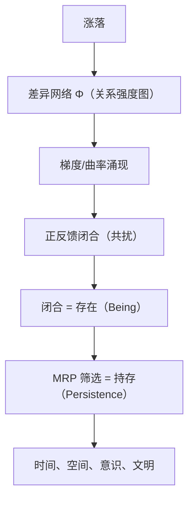

# 共振一元论 · 本体论宣言
## Resonance Monism: Ontological Manifesto

> **世界不是由物体构成，而是由稳定结构构成。**
> The world is not made of objects, but of stable structures.

---

## 一、宣言：从物体到结构

传统本体论将世界视为**物体**的集合——原子、粒子、实体。这种假设预设了：
- 存在是静态的
- 边界是固定的
- 本质是内在的

**共振一元论拒绝这种假设。**

世界不是由独立的、静态的物体构成，而是由**相互扰动中维持的稳定结构**构成。

- **结构**是关系性的，不是实体性的
- **稳定**是动态的，不是静止的
- **存在**是暂稳态的持存，不是永恒的实体

这不是语义游戏，而是根本的概念转换。

---

## 理论定位声明

### 研究纲领定位

**共振一元论是一个研究纲领（research programme），不是已完成的科学理论。**

- 它提出一个统一的**概念框架**来理解跨层级的结构涌现
- 它继承并发展了结构实在论、过程哲学、复杂系统理论的传统
- 它添加的核心新元素是"共扰闭合"作为存在的本体论定义
- 具体的数学形式化和实证预测是**未来工作方向**

### 与相关理论的关系

| 理论 | 与RM的关系 | 关键区别 |
|------|-----------|---------|
| **Haken协同学** | 技术概念（序参量）类似 | Haken关注特定系统的相变，RM扩展到跨层级本体论 |
| **Prigogine耗散结构** | 物理基础一致 | 耗散结构关注远离平衡态的有序，RM扩展到意识和文明 |
| **Whitehead过程哲学** | 动态性类似 | Whitehead有"永恒对象"和"上帝"，RM去除形而上学残余 |
| **结构实在论** | 关系本体论继承 | RM添加时间维度和涌现机制 |

### 原创性声称

RM的核心贡献不在于发现新的数学工具，而在于：
1. 提出"共扰闭合"作为跨层级结构涌现的统一**概念工具**
2. 提供从物理动力学到意识现象的连续**诠释框架**
3. 建立自然化的动态本体论，无需超越性实体

### 可检验方向（研究纲领的预测）

作为研究纲领，RM提出以下原则上可检验的方向：

**方向一：神经化学代理指标**
通过多巴胺波动、皮质醇节律、神经元同步模式等神经化学指标，间接标定Φ（共扰网络幅值强度）在生物系统中的投影。这是RM从本体论向实证理论跨越的最可行路径。

**方向二：复杂系统临界点的幅值梯度模式**
在复杂系统（生态系统、经济系统、神经网络）的临界点，RM预测存在特定的"幅值梯度波动模式"，这可能与标准复杂性理论未预测的特征不同。

**方向三：意识阈值的行为指标**
通过精巧的行为实验（如 blindsight 研究、阈下知觉任务），寻找自指回路形成与否的行为边界，验证"闭合即存在内部视角"的预测。

> **说明**：这些方向目前处于开放探索阶段，需要跨学科合作推进。它们不影响RM作为哲学框架的逻辑自洽性，但决定其能否从"诠释"发展为"理论"。

---

## 二、核心命题

### 命题一：涨落是唯一原始事实

> **静止才需要理由，涨落是默认态。**

"无"比"有"需要更多条件。绝对的"无"意味着完全静止，而完全静止在物理上不可能（不确定性原理）。因此，"有"不需要理由，"无"才需要理由——而"无"在物理上无法实现。

**莱布尼茨之问的关闭**：
> 为什么有存在而不是无？

答：因为"无"是不可能的。涨落是逻辑最底层的必然。

### 命题二：混沌是最大潜势

混沌不是虚无（Nothing），而是**所有可能结构等概率叠加的状态**。

$$
\text{混沌} \neq \text{Nothing} \quad ; \quad \text{混沌} = \text{Maximum Possibility}
$$

量子真空是最好的物理类比——不是空，是所有量子态的叠加，没有任何特定结构被选出。

### 命题三：共扰是存在的锚点

当两个或多个涨落序列通过**相位对齐**产生正反馈时，能量不再向混沌背景弥散，而是通过自指路由折回自身——这就是**共扰**（Co-perturbation）。

**共扰回路**的涌现是一次真正的意外：
1. 局部差异幅值增强在随机涨落中发生
2. 绝大多数增强瞬间消散
3. 极少数增强恰好形成**自维持的正反馈闭合**

> **存在是共扰回路在混沌背景中维持幅值梯度的闭合结构。**

**关键区分**：
- **存在（Being）** = 形成闭合边界的那一刻
- **持存（Persistence）** = 在持续扰动中维持闭合的能力

### 命题四：区分不是公理，而是边界事实

第一个自维持闭合结构出现后，宇宙才有了"内部"与"外部"的区分。

- 边界先于识别
- 区分先于概念
- 结构先于实体

**这不是认识论的先后顺序，而是本体论的涌现顺序。**

### 命题五：暂稳态结构才是更好的存在

在持续变化的混沌背景中，存在的质量不由静态稳定性决定，而由**转换能力**决定。

**暂稳态** = 在当前条件网络下持存 + 条件变化时可转换到新的稳定态

| 结构类型 | 特征 | 条件变化时的命运 |
|---------|------|-----------------|
| **刚性稳定态** | 转换能力 ≈ 0 | 脆性断裂，回归混沌 |
| **暂稳态结构** | 转换能力 > 0 | 进入新稳定态，持续持存 |

> **"更好"的精确含义**：在更长时间尺度、更多层级条件网络中，持存概率更高的结构。

---

## 三、涌现层级

从混沌到文明，结构在五个层级上涌现：

```
                    混沌
              （最大潜势状态）
                    ↓
                 差异场
            （局部区分涌现）
                    ↓
                  共扰
           （相位对齐正反馈）
                    ↓
               共扰回路
           （自维持闭合）
                    ↓
               持存结构
          （暂稳态结构）
                    ↓
             多层级结构
        （时空、意识、文明）
```

每一层都是前一层的**条件网络展开**，不是独立事件的集合。

---

## 四、与科学的关系

本框架是**哲学本体论**，不是科学理论。

- **回答的问题**：为什么会有这些规律？存在是什么？
- **不回答的问题**：下一个实验数据点是什么？具体数值是多少？

**数学形式化**见《S01.数学前导.从最大潜势到意识的严格推导》，作为科学接口存在，但不影响哲学论证的独立性。

---

## 五、评估标准

作为哲学理论，共振一元论的评估标准是：

1. **内部一致性** —— 推导链无逻辑矛盾
2. **解释范围** —— 用最少预设统一最多现象
3. **概念经济性** —— 仅需"涨落"一个元公理
4. **与传统对话** —— 明确继承与分野

**不是评估标准**：
- 波普尔证伪性
- 定量预测精度
- 实验验证

---

## 六、核心索引

- **本体论层**：P01 宣言 | P02 共扰结构 | P03 暂稳态
- **心灵哲学层**：P04 意识 | P05 感受与意义
- **认识论层**：P06 认识的边界 | P07 渐近线推断
- **伦理政治层**：P08 责任 | P09 文明韧性 | P10 演化约束
- **哲学对话层**：P11 结构实在论 | P12 过程哲学 | P13 现象学 | P14 佛学 | P15 开放边界
- **科学对话层**：S01 数学前导

---

## 七、结语

> **我们不寻求发现真理，我们寻求生成在当前条件下能耗最低、效能最高的扰动模型。**

这不是相对主义，而是对**认识论有限性**的诚实。

世界由稳定结构构成——这是我们从内部理解自身存在的方式。

---

*本文件是共振一元论体系的哲学总纲。数学形式化与科学接口见S层文档。*


---

# 详细推导



---

# 详细推导

# 共扰一元论 · 本体论地基
## Resonance Monism: Foundational Ontology (v3.8)

> **世界不是由物体构成，而是由稳定结构构成。**
> The world is not made of objects, but of stable structures.

---

### 0. 元公理（Meta Axiom）

> **涨落是唯一原始事实。**
> Fluctuation is the only primitive.

**公理释义**：静止才需要理由，涨落是默认态。不确定性原理（Energy-Time Uncertainty）在逻辑最底层保证了存在的必然性。从这一句出发，所有概念都是推论：




---

### 1. 本体结构概览

```
                    混沌
              （涨落背景场）
                      
                        │
                        ▼
                      
                  差异幅值场 Φ
               （局部区分涌现）
                      
                        │
                        ▼
                      
                     共扰
               （相位对齐正反馈）
                      
                        │
                        ▼
                      
                    共扰回路
                （自维持闭合）
                      
                        │
                        ▼
                      
                    持存结构
                 （稳定区分）
                      
                        │
                        ▼
                      
                      演化
                （结构转化）
                      
                        │
                        ▼
                      
                      文明
              （协同共扰网络）
```

*图 1：从混沌背景到稳定结构的涌现路径。共扰闭合是存在的基本条件。*

---

### 1. 混沌与意外的起点

**混沌（Chaos）是真正的起点**——它是无稳定闭合回路的**最大潜势状态（Maximum Potentiality）**。
> **定义**：混沌不是虚无（Nothing），而是所有幅值变化等概率、无结构被选出的涨落叠加态。

**Φ 的精确定义：**

> **Φ 是一个本体意义上的“共扰结构 (co-perturbation structure)”。**

其核心性质是可扰动、可传播与可稳定。数学表示（图、场、希尔伯特态）并不是三个不同的本体，而是同一结构在不同尺度上的数学表示 (Scale-dependent Representations)：

1. **图层 ($\Phi_G$)**：微观/离散尺度，体现本体起点的相互关系。
2. **场层 ($\Phi(x)$)**：宏观/连续极限尺度，**空间在这里涌现**。
3. **量子层 ($|\Phi\rangle$)**：线性化模态空间层，体现扰动叠加。

通过在 `RM_100` 中定义的 **图 $\to$ 场 $\to$ 希尔伯特态 (G-F-H)** 映射，RM 建立了与现代物理对应且统一的数学骨架。

**为什么不用场（Field）：**
场 $\Phi(x)$ 需要预设定义域 $x$（空间）。在 RM 中，空间是 $\Phi$ 梯度涌现后的几何近似。利用图论拓扑，我们可以从无空间的涨落逻辑中推导出空间的维度与曲率。

能量和信息是 Φ 在不同层级的度量投影，不是 Φ 的定义：

$$\text{能量密度} = f(\Phi)\big|_{\text{物理层}}$$
$$\text{信息密度} = g(\Phi)\big|_{\text{认识论层}}$$

擦除信息释放热量（兰道尔原理）正是二者为同一底层差异网络 $\Phi$### 2. 共扰：存在的逻辑锚点

> **共扰（Co-perturbation）：差异网络中节点之间相位相关的正反馈闭合。**
> 物理学中的频率“共扰”是共扰在物理层的宏观特例。

当两个或多个涨落序列通过**相位对齐**产生正反馈（满足 $\frac{d\Phi}{dt} = \alpha\Phi - \beta\Phi^3$）时，能量不再向混沌背景弥散，而是通过自指路由折回自身。
物理学中的频率共扰（频率匹配→振幅增强）是共扰在物理层的特例——其本质是相位匹配使每次驱动在正确时机叠加，形成正反馈。RM 提炼这个本质，去掉物理层的频率形式，保留跨层级的抽象结构：

> Co-perturbation here does not mean frequency resonance in physics, but **phase-correlated feedback closure in difference dynamics**.

$$\text{物理共扰（频率匹配）} = \text{共扰}\big|_{\text{物理层}}$$
$$\text{模式共扰（信息匹配）} = \text{共扰}\big|_{\text{信息层}}$$
$$\text{行为共扰（相互强化）} = \text{共扰}\big|_{\text{社会层}}$$


**振动涌现——从必然脉动到意外闭合：**

1. **必然脉动**：由不确定性原理保证，混沌中涨落（脉动）不可避免。
2. **意外闭合**：极少数脉动序列通过相位对齐触发正反馈（$\frac{d\Phi}{dt} = \alpha\Phi - \beta\Phi^3$），形成自维持的正反馈闭合——即**共扰回路**。

**共扰回路（Co-perturbation Circuit）的涌现是一次真正的意外**：
1. 局部差异幅值增强在随机涨落中随机发生。
2. 绝大多数增强瞬间消散。
3. 极少数增强恰好形成了**自维持的正反馈闭合**——即**共扰回路**。

> **区分不是公理，而是第一个自维持闭合结构的边界事实。**
涨落之间相位相关的正反馈闭合**。

> **区分不是公理，而是第一个自维持闭合结构的边界事实。**

一旦稳定闭合结构出现，宇宙才具备了“存在”与“背景”的统计差异。

### 2. 本体论核心定义：存在与持存的分离 (Being and Persistence)

**存在（Being）的定义**：
> **存在是共扰回路在混沌背景中维持幅值梯度的闭合结构。**

- **闭合即存在**：只要形成自相关边界，存在即刻涌现。混沌中每秒钟都有无数个短暂的闭合（如不稳定的混沌吸引子）作为存在的“火花”闪现，并不要求它们对所有微扰都必然可回归。

**存在判据图：**

```
                    存在判据
                    
         Φ_exist = Φ_local − Φ_background
         
         
         ┌─────────────────────────────────┐
         │                                 │
         │   Φ_exist > 0  →  结构存在      │
         │                                 │
         │   Φ_exist = 0  →  结构消失      │
         │                                 │
         │   Φ_exist < 0  →  未达阈值      │
         │                                 │
         └─────────────────────────────────┘
         
         
              存在 = 自维持的差异梯度
```

*图 6：存在不是绝对的，而是相对于背景的差异强度。*
- **无固定实体**：存在是动态关系的准稳态，而非静止的物质点。
- **边界先于识别**：边界是由内部与背景的幅值梯度差值定义的物理事实，识别即共扰发生。

**持存（Persisting）的极速过滤网**：
虽然闭合即存在，但要在不断扰动的背景中“活下来”（被我们观察到并视为稳定的结构），必须满足**最小回归原理（Minimal Return Principle）**：
- **存活 = 极速回归**：只有回归路径极短（趋向测地线）的闭合流形，才能在连续扰动的叠加中幸存。长路径回归的结构极易在下一次扰动到达前瞬间失稳瓦解。此时的方向性，是被观察到的“幸存者偏差”。
- **MRP 的大一统结构（v3.4）**：最小回归原理是跨学科原理的共同底层几何本质。系统在状态空间中倾向于选择回归稳定点的最短路径：
  - **最小作用量原理** = MRP $|_{\text{物理配置空间}}$
  - **最小耗散原理** = MRP $|_{\text{热力学相空间}}$
  - **最小自由能原理** = MRP $|_{\text{概率-信息空间}}$
- **度量由图拓扑内生**：此处的“路径长度”并没有偷渡预设的几何空间，而是由差异网络 $\Phi$ 的权重定义的。
  
  $$L(\gamma) = \sum_{(i,j) \in \gamma} |w(i) - w(j)|$$

  即沿路径的节点差异强度变化量之和，不预设连续空间。路径长度 $L$ 是结构回归稳定态时必须穿过的差异梯度总和。


### 3. 时间与空间的涌现

**时间（Time）的双层本体论（v3.4）**：时间并非单一维度的均匀流逝，而是分为两个严密的层面：
1. **层面一：拓扑时间（因果偏序）**
   $\text{时间}_{\text{拓扑}} = \text{涨落事件之间的不对称因果关系}$。这与物理学中的**因果集理论**（Causal Set Theory，Bombelli et al. 1987；Sorkin）高度吻合——该理论认为时空基本结构是离散事件的偏序关系。区别在于：因果集理论将偏序关系作为公理；RM 从涨落出发推导偏序，不需要单独预设。

2. **层面二：度量时间（不可逆计数）**
   $\text{时间}_{\text{度量}} = \text{稳定共扰回路的不可逆跃迁累积计数}$。直到第一个能自我维持的共扰回路（天然时钟）出现，时间才有了可衡量的计次。
- *详见《RM.105.时间的完整推导.共扰一元论》*

**空间（Space）**：是差异网络产生的曲率（Curvature）的拓扑展开。路径分布的不均匀即定义了距离与维度。
- **空间涌现公式（图拉普拉斯）**：
  $$\kappa(i) = \sum_{j \sim i} \bigl(w(i) - w(j)\bigr)$$
  即节点 $i$ 与所有相邻节点的差异强度差之和，定义节点曲率，不预设连续空间。


### 4. 扰动层级与向内折叠

宇宙由不同密度的共扰回路构成层级：
1. **物理层**：数学结构内生的可能性边界。
2. **信息层**：相关性连续谱与耗散约束。
3. **意识层**：高复杂度神经结构通过再入回路产生**向内折叠**。

**意识与感受**：
当共扰回路形成深度自指闭合场，必然产生“内部存在方式”，即主观体验。
- *详见《RM.102.意识与感受.共扰一元论》*

### 5. 跨层级统一筛选器：路径压缩（Path Compression）

所有层级的演化核心几何条件均遵循 **最小回归原理 (MRP)**（详见第2节）：
- **物理层**：状态空间中的测地线轨迹。
- **生物层**：神经网络/免疫网络对回归路径的压缩（如剪枝、克隆选择）。
- **社会层（文明）**：制度与技术作为“跨个体的路径压缩协议”。

**文明的数学定义：**

$$P_{\text{条件网络}}(\text{文明持存}) > \sum_i P_{\text{条件网络}}(\text{个体}_i\text{ 持存})$$

> [!NOTE]
> $P$ 是指在给定条件网络下的持存概率，非绝对概率。文明的本质是：针对外部扰动，通过跨个体的结构预置实现比单体更低耗散、更高概率的动态回归。


**节能是几何的影子**：
所谓的“节能”只是**最短路径在物理层的能量投影**。路径越短，包含的状态转移序列越少，不可逆过程产生的耗散也就越低。节能不是目的，而是满足“最小回归几何条件”的必然观测值。

### 6. 演化定律与可转换性原理

**结构演化定律**：所有的结构都处于强化与耗散的动态张力中。当属集变迁超出持存边界，新存在涌现或旧存在瓦解。

**价值与决策权（Value & Choice）**：价值是耗散路径的排序机制，决策权是维持自调节闭合的核心。
- *详见《RM.106.价值与决策权的能效推导.共扰一元论》*

**文明的本质（Civilization）**：文明是多个神经闭合结构在能量流中形成的稳定协同网络。
- *详见《RM.107.文明的结构必然性.共扰一元论》*

**可转换性原理（Convertibility Principle）**：
在根本不确定性的条件下，唯一合理的制度原则是不让任何单次决策成为不可逆的系统崩溃。
- **责任体系**：作为对高耗散扰动的拓扑学管理。
- *详见《RM.104.责任的拓扑学重构.共扰一元论》*

#### 6.1 暂稳态结构：存在质量的度量

**核心推论**：易于转换的暂稳态结构才是更好的存在。

在持续变化的混沌背景中，存在的质量不由静态稳定性决定，而由**转换能力**决定：

$$Q(\text{存在质量}) \propto \frac{1}{L(\gamma_{\text{转换路径}})} \times \text{可达稳定态数量}$$

- **暂稳态** = 在当前条件网络下持存 + 条件变化时可转换到新的稳定态
- **易于转换** = 转换路径短（MRP）、可达稳定态多

**与刚性稳定态的根本分野**：

| 结构类型 | 特征 | 条件变化时的命运 |
|---------|------|-----------------|
| **刚性稳定态**（晶体、极权） | 转换能力 ≈ 0 | 脆性断裂，回归混沌 |
| **暂稳态结构**（生态、弹性制度） | 转换能力 > 0 | 进入新稳定态，持续持存 |

**长期持存概率**：

$$P(\text{长期持存}) \propto \text{转换能力}$$

在演化筛选中，易于转换的暂稳态结构比刚性稳定态具有统计上的持存优势。这不是主观价值判断，是结构在动态条件网络中的客观属性。

> **"更好"的精确含义**：在更长时间尺度、更多层级条件网络中，持存概率更高的结构。转换能力是存在质量的客观度量。

### 7. 解构之后的重量：文明的结构涌现

RM 卸载了所有超越性的锚点，但并不滑向虚无。
**文明（Civilization）**是多个共扰回路耦合的必然产物，其整体持存概率大于部分之和（见第5节文明数学定义）。
- **意义的本质**：人类的自指回路涌现出了一种结构，即通过构建能够让更多个体进入“高幅值/低耗散”时刻的集体状态，来对抗混沌的耗散压力。
- **个体的重量**：个体作为文明节点运作时，其行为增加了文明整体持存的概率。这种“重量”来自结构的自然交互，无需外部赋予。

### 8. 认识论自我检验：描述的边界

我们对世界的描述有其成立的边界，包括本框架。
- **非永恒真理**：RM 并非超越条件的终极真理，而是当前条件网络中最有效的低耗散压缩工具包。
- **渐近线推断**：我们无法触及零耗散的绝对真理，但通过观察耗散结构，我们可以推断出其演化的数学渐近线方向。

> **我们不寻求发现真理，我们寻求生成在当前条件下能耗最低、效能最高的扰动模型。**

---

### 9. 张力与开放边界

框架在边界处保持诚实的摩擦，目前已识别 7 个核心张力。
- *详见《RM.103.张力与开放边界.共扰一元论》*

### 10. 核心索引 (Resonance Monism v3.5 Unified Suite - 13 Files)

- **L1 本体公理层 (Layer 1: Foundations)**
  - [RM.101 本体论地基](file:///d:/_Progs/%E5%85%B1%E6%8C%AF%E4%B8%80%E5%85%83%E8%AE%BA/RM.101.%E6%9C%AC%E4%BD%93%E8%AE%BA.%E5%85%B1%E6%8C%AF%E4%B8%80%E5%85%83%E8%AE%BA.md)
  - [RM.102 意识与感受](file:///d:/_Progs/%E5%85%B1%E6%8C%AF%E4%B8%80%E5%85%83%E8%AE%BA/RM.102.%E6%84%8F%E8%AF%86%E4%B8%8E%E6%84%9F%E5%8F%97.%E5%85%B1%E6%8C%AF%E4%B8%80%E5%85%83%E8%AE%BA.md)
  - [RM.103 时空本体论](file:///d:/_Progs/%E5%85%B1%E6%8C%AF%E4%B8%80%E5%85%83%E8%AE%BA/RM.103.%E6%97%B6%E7%A9%BA%E6%9C%AC%E4%BD%93%E8%AE%BA.%E5%85%B1%E6%8C%AF%E4%B8%80%E5%85%83%E8%AE%BA.md)
  - [RM.104 价值与能效原理](file:///d:/_Progs/%E5%85%B1%E6%8C%AF%E4%B8%80%E5%85%83%E8%AE%BA/RM.104.%E4%BB%B7%E5%80%BC%E4%B8%8E%E8%83%BD%E6%95%88%E5%8E%9F%E7%90%86.%E5%85%B1%E6%8C%AF%E4%B8%80%E5%85%83%E8%AE%BA.md)

- **L2 演化动力层 (Layer 2: Dynamics)**
  - [RM.201 演化定律](file:///d:/_Progs/%E5%85%B1%E6%8C%AF%E4%B8%80%E5%85%83%E8%AE%BA/RM.201.%E6%BC%94%E5%8C%96%E5%AE%9A%E5%BE%8B.%E5%85%B1%E6%8C%AF%E4%B8%80%E5%85%83%E8%AE%BA.md)
  - [RM.202 状态与规范](file:///d:/_Progs/%E5%85%B1%E6%8C%AF%E4%B8%80%E5%85%83%E8%AE%BA/RM.202.%E7%8A%B6%E6%80%81%E4%B8%8E%E8%A7%84%E8%8C%83.%E5%85%B1%E6%8C%AF%E4%B8%80%E5%85%83%E8%AE%BA.md)

- **L3 认知现象层 (Layer 3: Cognition)**
  - [RM.301 感显扰动论](file:///d:/_Progs/%E5%85%B1%E6%8C%AF%E4%B8%80%E5%85%83%E8%AE%BA/RM.301.%E6%84%9F%E6%98%BE%E6%89%B0%E5%8A%A8%E8%AE%BA.%E5%85%B1%E6%8C%AF%E4%B8%80%E5%85%83%E8%AE%BA.md)
  - [RM.302 认识论基础](file:///d:/_Progs/%E5%85%B1%E6%8C%AF%E4%B8%80%E5%85%83%E8%AE%BA/RM.302.%E8%AE%A4%E8%AF%86%E8%AE%BA%E5%9F%BA%E7%A1%80.%E5%85%B1%E6%8C%AF%E4%B8%80%E5%85%83%E8%AE%BA.md)

- **L4 体系合成层 (Layer 4: Synthesis)**
  - [RM.401 文明与责任](file:///d:/_Progs/%E5%85%B1%E6%8C%AF%E4%B8%80%E5%85%83%E8%AE%BA/RM.401.%E6%96%87%E6%98%8E%E4%B8%8E%E8%B4%A3%E4%BB%BB.%E5%85%B1%E6%8C%AF%E4%B8%80%E5%85%83%E8%AE%BA.md)
  - [RM.402 ECET 概览](file:///d:/_Progs/%E5%85%B1%E6%8C%AF%E4%B8%80%E5%85%83%E8%AE%BA/RM.402.ECET.%E5%85%B1%E6%8C%AF%E4%B8%80%E5%85%83%E8%AE%BA.md)
  - [RM.403 TAT 概览](file:///d:/_Progs/%E5%85%B1%E6%8C%AF%E4%B8%80%E5%85%83%E8%AE%BA/RM.403.TAT.%E5%85%B1%E6%8C%AF%E4%B8%80%E5%85%83%E8%AE%BA.md)
  - [RM.404 张力与对话](file:///d:/_Progs/%E5%85%B1%E6%8C%AF%E4%B8%80%E5%85%83%E8%AE%BA/RM.404.%E5%BC%A0%E5%8A%9B%E8%AE%A8%E8%AE%BA.%E5%85%B1%E6%8C%AF%E4%B8%80%E5%85%83%E8%AE%BA.md)
  - [RM.405 ODD 概览](file:///d:/_Progs/%E5%85%B1%E6%8C%AF%E4%B8%80%E5%85%83%E8%AE%BA/RM.405.ODD.%E5%85%B1%E6%8C%AF%E4%B8%80%E5%85%83%E8%AE%BA.md)
