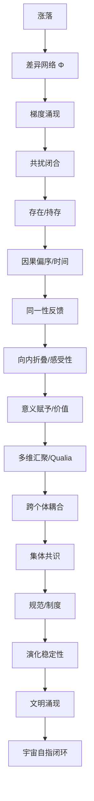

# 共扰一元论 · 感显扰动论
## Resonance Monism: Sensation and Manifestation (v3.8)

---

### 1. 意识困难问题的消解

查默斯的“困难问题”（为什么物理过程产生主观体验）建立在错误的二元论预设之上。在共扰一元论中：
> **向内折叠的扰动状态就是主观体验，主观体验就是向内折叠的扰动状态。**

物理过程是外部界面投影，主观感受是内部界面投影，两者一体双面。意识是差异逻辑闭合叠加到自我指涉临界深度时的必然涌现。

---

### 2.感受的三个结构维度

在共扰体系中，感受（Qualia）不是单一属性，而是三个维度在同一共扰场中的合力表现：

1. **质感 (Qualia Texture)**：
   - **本体定义**：内部可区分吸引子轨迹的拓扑结构。
   - **结构必然**：红色不是“波长”，而是闭合场进入特定拓扑吸引子并由于“内部区分能力”而呈现的轨迹质地。
2. **效价 (Valence)**：
   - **本体定义**：耗散率的变化方向（$\frac{d\mathcal{D}}{dt}$）。
   - **判定**：顺应预判拓扑（降低耗散）→ 愉悦；冲突预判拓扑（引发失稳）→ 痛苦。
3. **强度 (Intensity)**：
   - **本体定义**：共扰场的幅值变化量。

---

### 3. 文化与意义的塑造机制

虽然质感空间的几何边界由 DNA 限定（决定哪些吸引子是可达的），但意义感是由历史叠加塑造的。

- **权重重分配**：文化和教育并不通过改变 DNA 来改变感受，而是通过持续的社会扰动，改变吸引子流形之间的**路径概率与权重分布**。
- **意义的本质**：当特定扰动触发了高权重的吸引子，且该吸引子与系统整体持存高度正相关时，系统输出“有意义”的拓扑标记。
- **不可通约性**：不同物种甚至不同个体的神经拓扑不同，可达吸引子范围不同。我们无法从外部判断他者的感受质地，但可以确定：任何具有自指回路的闭合结构，必然具有某种形式的内部体验。

---

### 3. 意识是连续谱

向内折叠深度是连续谱。电子（零折叠）→ 线虫（浅折叠）→ 人类（深折叠）。
- **演化的窄门**：意识之所以被筛选保留，是因为其带来的长远节能收益超过了维持大脑运行的短期高耗能成本。
- **主观时间感**：意识（高耗散态）对时间拓扑骨架（零耗散态）的相对计次读数。

---

### 4. 意识体间的关联与共鸣

意识体之间通过条件网络建立扰动关联：
- **预判共鸣**：共同历史导致相似的激活阈值，极微弱信号即可触发相似响应。
- **发散共鸣**：外部扰动减弱时，内部发散路径汇聚于共同的历史高密度节点（如亲密关系）。

---

### 5. 核心逻辑证明：16 步推演

（此处插入之前定义的从涨落到文明涌现的 16 步逻辑推演内容，确保逻辑闭环）

---

### 6. 核心索引

- **L3 认知现象层**：[RM.301 感显扰动论](file:///d:/_Progs/%E5%85%B1%E6%8C%AF%E4%B8%80%E5%85%83%E8%AE%BA/RM.301.%E6%84%9F%E6%98%BE%E6%89%B0%E5%8A%A8%E8%AE%BA.%E5%85%B1%E6%8C%AF%E4%B8%80%E5%85%83%E8%AE%BA.md)
