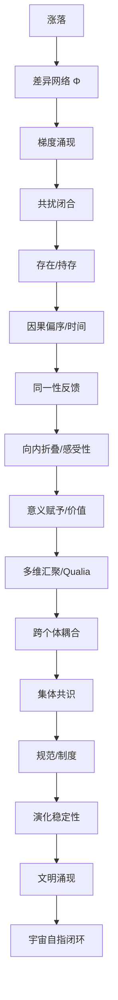

# 共振一元论 · 认识的边界
## Resonance Monism: The Limits of Knowledge

> **规律不说话，知识在叙述。**

---

## 一、知识与规律的精确区分

### 1.1 两种根本不同的存在

在共振一元论中，必须严格区分"描述"与"事实"：

**知识 (Knowledge)**：
- 意识体对条件网络的拓扑描述
- **条件性的、有视角边界的**
- 例子：牛顿力学并未失效，只是其适用边界被过度声称了

**规律 (Laws)**：
- 条件网络本身的运作方式
- 不依赖观察者
- 不需要描述工具
- 不声称自洽性
- 规律只是在其成立范围内运作

> **规律不说话，知识在叙述。**

### 1.2 为什么必须区分

混淆二者会导致：
- 将知识的边界误当作规律的边界
- 将规律的必然性误当作知识的绝对性
- 产生"永恒真理"的幻觉

**关键理解**：规律作为Φ的演化必然，不进入语义真假判定。

---

## 二、基底悖论的关闭

### 2.1 克里特岛人悖论

"一切真理都是相对的"这一命题产生的逻辑悖论：
- 如果这句话是真的，那么它本身也是相对的（自相矛盾）
- 如果这句话是假的，那么存在绝对真理（否定了自身）

### 2.2 RM的解决方案：边界划分

**描述有边界**：
任何知识描述（包括RM本身）都是在特定条件网络下的持存映射，受限于描述者的历史积累。

**规律无边界**：
规律作为Φ的演化必然，在其成立范围内无条件运作。

**结论**：
RM承认自身作为描述工具的有限性，但这不削弱其描述对象的必然性。

**操作性自洽 vs 超越性自洽**：
- 我们只追求在当前条件下的内部一致性
- 明确拒绝"在所有可能条件下永恒有效"的超越性自洽要求

---

## 三、认识行为作为本体论事件

### 3.1 认识即扰动

认识行为本身是在条件网络内部发生的扰动事件。

**双重效应**：
1. 改变识别者的内部预判结构
2. 改变扰动路径的后续分布

**结论**：认识不在世界之外，认识是条件网络不可分割的一环。

### 3.2 观察者即参与者

这不是量子力学特有的，而是所有认识的普遍特征：
- 观察本身就在改变被观察的结构
- 不存在中性的旁观者
- 认识者与认识对象处于同一条件网络

---

## 四、归纳问题的重新定位

### 4.1 传统困境

休谟问题：归纳推理没有逻辑必然性。
- 过去太阳每天升起，不保证明天太阳会升起
- 归纳无法被逻辑证明

### 4.2 RM的回应

**归纳不是逻辑推理，而是节能机制**。

归纳不依赖逻辑必然性，而依赖：
- **物理拓扑的测地线回归稳定性**
- 持续扰动背景中的结构持存
- MRP筛选下的路径压缩

**归纳的有效性来源**：
在混沌背景的持续扰动中，回归路径短的结构幸存下来——归纳是这些幸存者对其路径的"总结"。

---

## 五、is-ought鸿沟的消融

### 5.1 传统鸿沟

事实（Is）与规范（Ought）之间存在不可逾越的鸿沟：
- 从"是什么"推不出"应该是什么"
- 描述推不出命令

### 5.2 RM的消融

> **规范（Ought）是事实（Is）在足够长时间轴上的深折叠形态。**

规范的约束力来自：**放弃它的巨大跃迁成本**。

**例子**：
- "不应该杀人"不是抽象道德律
- 而是在人类文明的条件网络中，杀人行为导致的高耗散和结构瓦解
- 长期筛选后，"不杀人"成为低耗散路径的拓扑标记

---

## 六、认识的诚实原则

### 6.1 承认有限性

我们无法触及零耗散的绝对真理，但可以通过观察耗散结构，**推断出其演化的数学渐近线方向**。

### 6.2 渐近线方向

**零耗散零扰动**是认识论的渐近线：
- 虽然不可达
- 但它规定了所有低耗散优化（知识积累）的演化梯度

### 6.3 知识的标准

我们不寻求发现真理，我们寻求生成在当前条件下能耗最低、效能最高的扰动模型。

---

## 七、结语

> **认识的边界不是缺陷，而是诚实的标记。**

我们承认：
- 知识是条件性的
- 描述有视角边界
- 规律不说话，只有知识在叙述

这不是相对主义，而是对**认识论有限性**的诚实面对。

---

## 八、核心索引

- **本体论层**：P01-P03 存在、共扰结构、暂稳态
- **心灵哲学层**：P04-P05 意识的结构、感受与意义
- **认识论层**：P06 本文档 | P07 渐近线推断
- **伦理政治层**：P08-P10 责任、文明韧性、演化约束
- **哲学对话层**：P15 开放边界与诚实

---

# 感显扰动论

# 共扰一元论 · 感显扰动论
## Resonance Monism: Sensation and Manifestation (v3.8)

---

### 1. 意识困难问题的消解

查默斯的“困难问题”（为什么物理过程产生主观体验）建立在错误的二元论预设之上。在共扰一元论中：
> **向内折叠的扰动状态就是主观体验，主观体验就是向内折叠的扰动状态。**

物理过程是外部界面投影，主观感受是内部界面投影，两者一体双面。意识是差异逻辑闭合叠加到自我指涉临界深度时的必然涌现。

---

### 2.感受的三个结构维度

在共扰体系中，感受（Qualia）不是单一属性，而是三个维度在同一共扰场中的合力表现：

1. **质感 (Qualia Texture)**：
   - **本体定义**：内部可区分吸引子轨迹的拓扑结构。
   - **结构必然**：红色不是“波长”，而是闭合场进入特定拓扑吸引子并由于“内部区分能力”而呈现的轨迹质地。
2. **效价 (Valence)**：
   - **本体定义**：耗散率的变化方向（$\frac{d\mathcal{D}}{dt}$）。
   - **判定**：顺应预判拓扑（降低耗散）→ 愉悦；冲突预判拓扑（引发失稳）→ 痛苦。
3. **强度 (Intensity)**：
   - **本体定义**：共扰场的幅值变化量。

---

### 3. 文化与意义的塑造机制

虽然质感空间的几何边界由 DNA 限定（决定哪些吸引子是可达的），但意义感是由历史叠加塑造的。

- **权重重分配**：文化和教育并不通过改变 DNA 来改变感受，而是通过持续的社会扰动，改变吸引子流形之间的**路径概率与权重分布**。
- **意义的本质**：当特定扰动触发了高权重的吸引子，且该吸引子与系统整体持存高度正相关时，系统输出“有意义”的拓扑标记。
- **不可通约性**：不同物种甚至不同个体的神经拓扑不同，可达吸引子范围不同。我们无法从外部判断他者的感受质地，但可以确定：任何具有自指回路的闭合结构，必然具有某种形式的内部体验。

---

### 3. 意识是连续谱

向内折叠深度是连续谱。电子（零折叠）→ 线虫（浅折叠）→ 人类（深折叠）。
- **演化的窄门**：意识之所以被筛选保留，是因为其带来的长远节能收益超过了维持大脑运行的短期高耗能成本。
- **主观时间感**：意识（高耗散态）对时间拓扑骨架（零耗散态）的相对计次读数。

---

### 4. 意识体间的关联与共鸣

意识体之间通过条件网络建立扰动关联：
- **预判共鸣**：共同历史导致相似的激活阈值，极微弱信号即可触发相似响应。
- **发散共鸣**：外部扰动减弱时，内部发散路径汇聚于共同的历史高密度节点（如亲密关系）。

---

### 5. 核心逻辑证明：16 步推演

（此处插入之前定义的从涨落到文明涌现的 16 步逻辑推演内容，确保逻辑闭环）

---

### 6. 核心索引

- **L3 认知现象层**：[RM.301 感显扰动论](file:///d:/_Progs/%E5%85%B1%E6%8C%AF%E4%B8%80%E5%85%83%E8%AE%BA/RM.301.%E6%84%9F%E6%98%BE%E6%89%B0%E5%8A%A8%E8%AE%BA.%E5%85%B1%E6%8C%AF%E4%B8%80%E5%85%83%E8%AE%BA.md)
