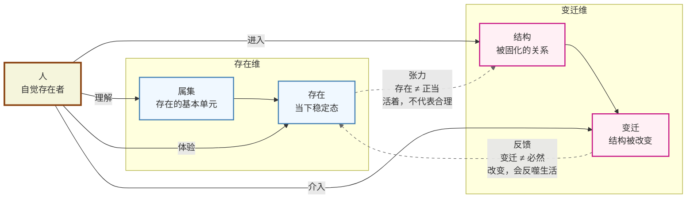
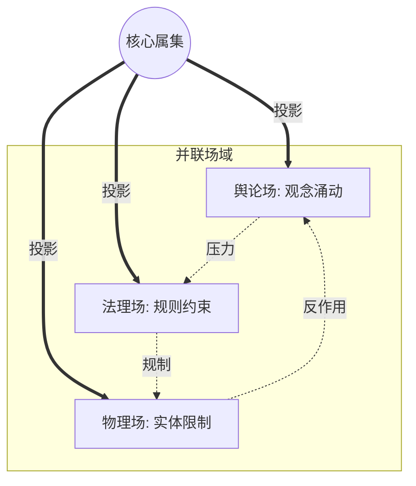
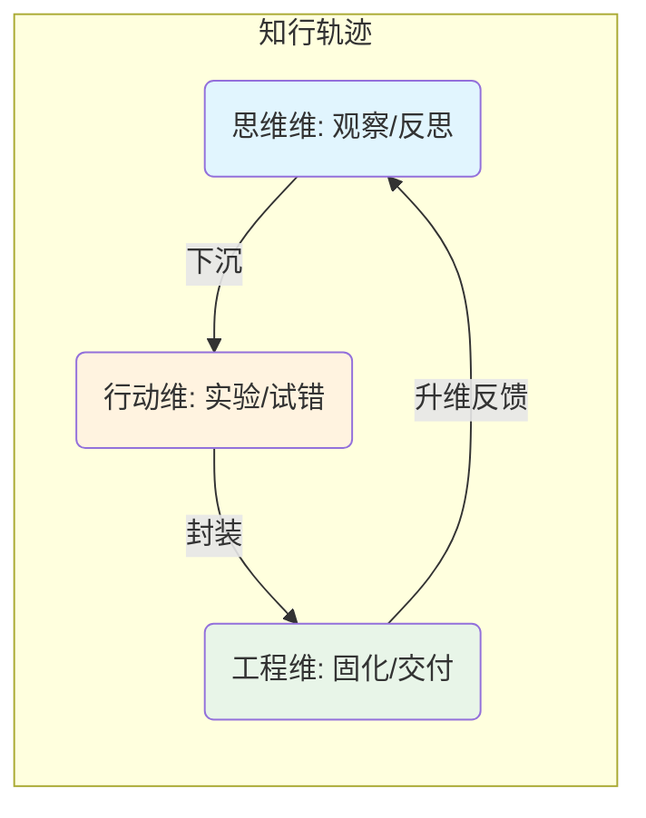
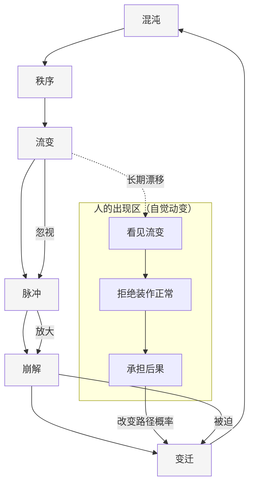

# **ASTO.图序：空间拓扑与演化视景**

> **Version**: 1.0 (Official Spec)
> **Status**: **Standardized**
> **System**: 属集变迁存在论 (ASTO)
> **Context**: 本文档是ASTO体系的**几何纪律**。每一张图都不仅是插图，而是严格定义的**认知接口**。

---

## **图谱总览 (Atlas Overview)**

| 编号 | 图谱名称 | 维度 | 角色 | 核心功能 |
| :--- | :--- | :--- | :--- | :--- |
| **Meta-00** | **系统概念索引图** (Concept Index) | Non-Spatial | **语义导航** | 展示核心概念的逻辑关联（非空间关系） |
| **V-01** | **形态×动力正交矩阵** (Projection Matrix) | 2D | **母图** | 描述不同存在形态在不同变化语法下的切片 |
| **V-01b** | **核心二维图：张力与反馈** (Dialectic Map) | 2D | **核心辩证** | 存在与变迁的张力关系及人的介入 |
| **V-02** | **属性谱系图** (Attribute Genealogy) | 2D | **认识论入口** | 展示属性从物理基质到意义单位的层级 |
| **V-02b** | **动变属性筛选图** (Screening Map) | 2D | **工程接口** | 筛选哪些属性会真正触发变迁（ODD/NTE接口） |
| **V-03** | **属集变迁立体** (The Motility Cube) | 3D | **立体结构** | 建立形态、动力、动变源的三维正交空间 |
| **V-04** | **场域投影图** (Field Projection Map) | 2D (Proj) | **并联视图** | 描述同一属集在不同场域中同时受力的状态 |
| **V-05** | **实践轨迹投影** (Praxis Trajectory) | 2D (Path) | **路径视图** | 描述主体在五态六阶空间中的位移轨迹 |
| **V-06** | **文明演化超体** (Civilization Hyper-Object) | 4D | **终极视景** | 轨迹叠加后的整体形态（文本描述） |
| **V-07** | **自觉介入拓扑图** (Intervention Map) | 2D (Topo) | **伦理定位** | 描述人在结构失效缝隙中的介入位置 |

---

## **Meta-00: 系统概念索引图 (System Concept Index)**

> **维度**：Non-Spatial (Semantic Index)
> **位置**：ASTO02.序章
> **回答问题**：ASTO 中有哪些核心概念？它们如何逻辑关联？
> **注意**：这不是空间结构图，箭头代表逻辑从属，不代表变迁方向。

（此处引用 ASTO06 中的 Mermaid 概念树）

---

## **V-01: 形态×动力正交矩阵 (Morphology × Dynamics Matrix)**

> **维度**：2D (Morphology × Dynamics)
> **位置**：ASTO06.本体
> **回答问题**：在不同存在形态中，可能出现哪些**变化语法**？
> **注意**：六阶不是时间轴，而是六种动力学语法。

| 五态 \ 六阶 | 混沌 (Chaos) | 秩序 (Order) | 流变 (Flux) | 脉冲 (Pulse) | 崩解 (Collapse) | 变迁 (Transition) |
| :--- | :--- | :--- | :--- | :--- | :--- | :--- |
| **自在态** | — | — | — | — | — | — |
| **共识态** | 初期思想涌动 | 宣言形成 | 叙事漂移 | 舆论激发 | 信念瓦解 | 替代共识出现 |
| **编码态** | 原型试探 | 公理沉淀 | 规则漂移 | 异常捕捉 | 结构破裂 | 元规范更新 |
| **物化态** | 工具雏形 | 稳定运行 | 版本演化 | 组织动员 | 系统失效 | 架构迁移 |
| **定向态** | 初步反思 | 自我审计 | 内部张力 | 免疫启动 | 自我否定 | 主动终结 |

---

## **V-01b: 核心二维图 (The Core Dialectic Map)**

> **维度**：2D (Dialectic Relation)
> **位置**：ASTO03.宣言
> **回答问题**：存在与变迁如何互动？人站在哪里？
> **核心逻辑**：存在 ≠ 正当（张力）；变迁 ≠ 必然（反馈）。



---

## **V-02: 属性谱系图 (Attribute Genealogy)**

> **维度**：2D (Hierarchy)
> **位置**：ASTO04.公理
> **回答问题**：属性如何从物理存在，逐步成为可被讨论的意义单位？

```mermaid
graph TD
    A[硬属性 (Hard Attr)] --> B{能够被否定?}
    B -- No --> C[自然属性 (物理/生理)]
    B -- Yes --> D[软属性 (Soft Attr)]
    D --> E[个体意向]
    D --> F[社会契约]
    F --> G[成文法/代码]
    F --> H[潜规则/习俗]
```

---

## **V-02b: 动变属性筛选图 (Motility Attribute Screening Map)**

> **维度**：2D (Screening Path)
> **位置**：ASTO04.公理 / ASTO09.自动化
> **回答问题**：哪些属性，会真正影响系统是否发生流变/崩解/变迁？
> **作用**：这是工程侧（ODD）与理论侧（NTE）的握手协议。

```mermaid
graph TD
    A[所有属性集合] --> B{已被建模?}
    B -- No --> C[背景噪声 (Ignored)]
    B -- Yes --> D[结构化属性]
    D --> E{具有动变性?}
    E -- No --> F[静态参数 (Static)]
    E -- Yes --> G[动变属性 (Lever Attribute)]
    G --> H{可算法化?}
    H -- Yes --> I[机器可读动变源]
    H -- No --> J[人工干预动变源]
```

---

## **V-03: 属集变迁立体 (The Motility Cube)**

> **真实维度**：3D (Morphology × Dynamics × Motility Source)
> **位置**：ASTO05.重构
> **定义**：
> *   **X轴 (形态)**: [自在, 共识, 编码, 物化, 定向]
> *   **Y轴 (动力)**: [混沌, 秩序, 流变, 脉冲, 崩解, 变迁]
> *   **Z轴 (动变源)**: [随机, 自觉, 结构, 程序]
>
> **重要修正**：每一个“事件”不是一个点，而是立方体中的**一段轨迹 (Trajectory Segment)**。

### **投影 A (Side View): 形态-动力平面**
*见 V-01 正交投影矩阵*

### **投影 B (Top View): 动力-动变源平面 (The Engine)**
> **回答问题**：变化是如何被触发、维持或放大的？

```mermaid
graph LR
    subgraph Source [动变源 (Z-Axis)]
        Z1(随机动变)
        Z2(自觉动变)
        Z3(结构动变)
        Z4(程序动变)
    end

    subgraph Dynamics [动力阶段 (Y-Axis)]
        Y1[混沌]
        Y2[秩序]
        Y3[流变]
        Y4[脉冲]
        Y5[崩解]
        Y6[变迁]
    end

    Z1 -->|触发| Y1
    Z3 -->|维持| Y2
    Z4 -->|侵蚀| Y3
    Z1 -->|激发| Y4
    Z4 -->|加速| Y5
    Z2 -->|引导| Y6
    Z3 -->|重构| Y6
```

### **投影 C (Front View): 形态-动变源平面 (The Material)**
> **回答问题**：不同存在形态，对哪种力量最敏感？

```mermaid
graph TD
    subgraph Morphology [形态 (X-Axis)]
        X1[自在态]
        X2[共识态]
        X3[编码态]
        X4[物化态]
        X5[定向态]
    end

    subgraph Source [动变源 (Z-Axis)]
        Z1(随机动变)
        Z2(自觉动变)
        Z3(结构动变)
        Z4(程序动变)
    end

    Z1 ==> X1
    Z2 ==> X2
    Z3 ==> X3
    Z4 ==> X4
    Z2 -.-> X5
    Z3 -.-> X5
```

---

## **V-04: 场域投影图 (Field Projection Map)**

> **维度**：3D Structure -> 2D Projection
> **位置**：ASTO07.边界
> **回答问题**：同一属集，在不同场域中如何**同时受力**？
> **注意**：这不是流程图，而是**并联投影**。



---

## **V-05: 实践轨迹投影 (Praxis Trajectory Projection)**

> **维度**：2D Path (Trajectory in Phase Space)
> **位置**：ASTO15.TIS
> **回答问题**：一个实践主体，是如何在属集空间中移动的？
> **本质**：知 → 行 → 工程 在五态六阶空间中的轨迹。



---

## **V-06: 文明演化超体 (The Civilization Hyper-Object)**

> **维度**：≥4D
> **位置**：ASTO16.终章
> **回答问题**：当无数属集轨迹叠加时，文明呈现出什么整体形态？
> **形式**：纯文本 + 隐喻 (Block Universe)

## **V-07: 自觉介入拓扑图 (Intervention Topology)**

> **维度**：2D (Topology)
> **位置**：ASTO08.批判 / ASTO16.终章
> **回答问题**：人在哪里？
> **核心逻辑**：人在“流变 → 脉冲 → 崩解 → 变迁”的临界带上。



---

*(完)*
