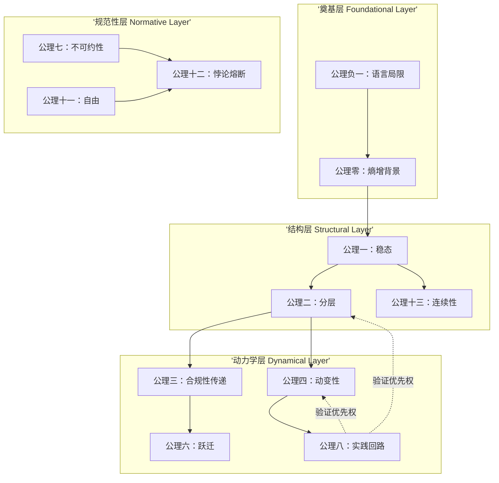

# ASTO.P05 Γ.20 升级指南：剩余张力与深层问题处理

> **基于五学者审阅的系统性改进**
> 
> **目标版本**：Γ.20 (从Γ.19升级)
> **升级日期**：2026-01-29
> **核心任务**：处理形式化真空、内在张力、依赖拓扑、量化缺口

---

## 一、问题A：属集的形式化真空

### 需要添加的内容

**位置**：在§0-α（方法论声明）后，插入新的§0-β

**操作**：将现有的§0-β改为§0-γ，在原§0-β前插入新内容

### 新增内容：§0-β. 属集的形式化草图

```markdown
## **0−β. 属集的形式化草图 (Formal Sketch of Attribute-Set)**

> **审阅建议**："属集"是ASTO的核心范畴，但全文无一处对其进行形式化定义。本节填补这一形式化真空。

### **定义**

**属集 $A$** 是一个二元组 $(P, C)$，其中：
- $P$ 为**属性域**（Property Domain）：可观测、可验证的特征集合
- $C$ 为**约束条件**（Constraints）：属性间的关系与边界条件

### **操作化定义**

**硬属性 (Hard Properties)**：
- **定义**：改变成本趋近于无穷大的属性
- **判定标准**：受物理定律限制，如光速、热力学第三定律
- **示例**：基本物理常数、生物代谢极限

**软属性 (Soft Properties)**：
- **定义**：改变成本为有限值的属性
- **判定标准**：受社会契约/代码规范/设计模式约束
- **示例**：函数命名规范、API接口设计、团队协作流程

### **变迁（Transition）的数学表达**

$$
\\delta: A \\to A' \\iff P' \\neq P \\lor C' \\neq C
$$

**关键特征**：
- $\delta$ 在$\chi$-time中不可逆
- 变迁必须通过扰动（Perturbation）实现
- 变迁的轨迹形成历史痕迹（Historical Traces）

### **属性的形式语义学**

**属性标识符**：
$$
\\text{{Attribute}} = \\langle \\text{{name}}, \\text{{type}}, \\text{{value}}, \\text{{metadata}} \\rangle
$$

**属性集合运算**：
$$
A \\cap B \\neq \\emptyset \\iff \\text{{Both A and B belong to same layer}}
$$

**属性依赖图**：
$$
G = (V, E) \\quad \\text{{where}} \\quad V = \\text{{Attributes}}, E = \\text{{Dependencies}}
$$

### **属集的分层公理（与公理二对应）**

$$
\\forall a, b \\in A: \\text{{Layer}}(a) < \\text{{Layer}}(b) \\implies \\text{{DependsOn}}(b, a)
$$

> **关键洞察**：属集不是静态的"对象"，而是动态的"关系网络"。形式化的目的是为了在工程中实现可验证的属性检查与依赖分析。
```

---

## 二、问题B：不可约性公理的内在张力

### 需要修正的位置

**位置**：公理七（不可约性公理）

### 修正内容

**在公理七的末尾增加"动态让渡条款"**：

```markdown
**动态让渡条款（Γ.20新增）**：

> **不可计算裁决者（Incomputable Arbiter）的判定标准是功能性的**：当某存在体能通过二阶扰动（公理四）重构自身认知模型，并能在$\chi$-time中承担跃迁的历史痕迹时，即获得裁决资格。

**当前状态**：人类是此资格的唯一实例。

**未来接口**：体系预留了资格迁移的技术-伦理接口。若未来AI达到或超过此复杂性阈值（如具备自主意识），根据公理七的非特权性陈述，裁决权应自动让渡。

**与公理十二的协调**：公理十二的"异步上报至不可计算裁决层"不再将人作为默认接收者，而是指向"当前的不可计算裁决者实例"。

> **哲学意义**：这不是人本主义的傲慢，而是**责任伦理的必然要求**——谁有能力承担$\chi$-time中的历史痕迹，谁就有资格成为裁决者。当前只有人类具备此能力，但体系对未来开放。
```

---

## 三、问题C：公理依赖拓扑图

### 需要新增的内容

**位置**：在文档末尾（结语后）新增附录

### 新增内容：附录A. 公理依赖拓扑图

```markdown
## **附录A. 公理依赖拓扑图 (Axiom Dependency Graph)**

> **审阅建议**：13条公理之间存在复杂的条件依赖与层次奠基关系，需要明确其拓扑结构。

### **依赖层次结构**



### **关键依赖关系**

**奠基层（基础公理）**：
- **公理负一**：语言局限性 → 奠基所有表达
- **公理零**：熵增背景 → 奠基稳态公理

**结构层（系统公理）**：
- **公理一**：稳态 → 依赖公理零
- **公理二**：分层 → 依赖公理一
- **公理十三**：连续性 → 依赖公理一、二

**动力学层（过程公理）**：
- **公理三**：合规性传递 → 依赖公理二
- **公理四**：动变性 → 依赖公理二
- **公理六**：跃迁 → 依赖公理三
- **公理八**：实践回路 → 验证优先权高于所有上层公理

**规范性层（价值公理）**：
- **公理七**：不可约性 → 独立于动力学层
- **公理十一**：自由 → 依赖公理七
- **公理十二**：悖论熔断 → 依赖公理七、十一

### **验证优先权**

> **公理八（实践回路）对所有上层公理具有验证优先权**：若某公理无法通过工程实践验证，应被修正或废弃。
>
> **示例**：若物理背景不同（如麦克斯韦妖世界），稳态公理可能需要修正。公理八提供了体系自我修正的机制。
```

---

## 四、问题D：双重时间与跃迁的量化缺口

### 需要新增的内容

**位置**：在定理八（跃迁阈值定理）后添加

### 新增内容：双环决策模型

```markdown
### **跃迁决策的双重计算（Γ.20新增）**

> **审阅建议**：虽然区分了τ-time与χ-time，但在跃迁阈值中仍使用模糊的"成本-收益曲线"。本节引入双环决策模型。

#### **双环架构**

**1. τ-环（Tau Ring）：技术成本核算**
- **性质**：可形式化、可计算
- **执行者**：自动化工具、成本分析系统
- **输入**：
  - 代码行数、模块复杂度
  - 人力成本、机时成本
  - 测试覆盖率、重构风险

**2. χ-环（Chi Ring）：历史痕迹评估**
- **性质**：不可形式化、依赖直觉
- **执行者**：不可计算裁决者（当前为人类）
- **输入**：
  - 团队焦虑水平
  - 信任损耗程度
  - 组织学习能力
  - 历史记忆负担

#### **决策条件**

**跃迁启动条件**：
$$
\\text{{Transition}} \\iff \\text{{Tau-Ring}} \\land \\text{{Chi-Ring}}
$$

**情况分析**：

| τ-环 | χ-环 | 决策 | 行动 |
|:---:|:---:|:---:|:---|
| ✓ 正向 | ✓ 正向 | **立即跃迁** | 启动重构 |
| ✓ 正向 | ✗ 负向 | **预备跃迁** | 叙事重构降低χ阻力 |
| ✗ 负向 | ✓ 正向 | **技术准备** | 优化τ-环指标 |
| ✗ 负向 | ✗ 负向 | **维持现状** | 等待时机 |

#### **预备跃迁（Pre-transition）机制**

当τ-环为正而χ-环为负（技术可行但团队未准备好）时：

1. **叙事重构（Narrative Refactoring）**：
   - 重新定义跃迁的意义
   - 建立共同愿景
   - 降低历史痕迹负担

2. **渐进式解耦**：
   - 分离关键模块
   - 建立隔离环境
   - 小步快跑验证

3. **信任重建**：
   - 透明化决策过程
   - 建立反馈机制
   - 分享成功案例

> **关键洞察**：χ-time的成本虽然不可计算，但可以通过**叙事重构**（改变团队对历史痕迹的理解）来调节。这是架构师的核心能力之一。
```

---

## 五、微观修正建议

### 修正1：公理五的熵增隐喻残留

**位置**：公理五（结构自指）

**原文**：
> "规范结构本身也是一种属集，也遵循熵增定律"

**修正为**：
> "规范结构本身也是一种属集，也遵循**类比熵增（analogical entropy）**——即结构维持成本的单调递增趋势。注：此处的'熵'为信息熵与社会熵的复合隐喻，非热力学熵。"

### 修正2：公理十二的"元层"指称不一致

**位置**：公理十二（悖论熔断）

**原文**：
> "将决策权上交给元层（人）"

**修正为**：
> "将决策权上交给**不可计算裁决层（Incomputable Arbitration Layer）**，当前由人类实例化。"

### 修正3：定理十三的重复

**位置**：定理体系

**操作**：
- 检查定理十三与引理8.1（认知不对称引理）
- 删除重复内容
- 保留引理8.1作为公理八的推论

---

## 六、工程可执行性增强

### 增强1：公理的Coq/Lean形式化草图

**位置**：在文档末尾新增附录

```markdown
## **附录B. 公理的Coq/Lean形式化草图**

> **审阅建议**：为进一步增强可工程化，提供关键公理的类型论表达。

### **公理三：合规性传递**

**Coq表达**：
```coq
(* 合规性传递的形式化 *)
Definition Compliance (Action: Type) (Impedance: Action -> R) := 
  forall a: Action, Probability (execution a) = 1 / (Impedance a).

Theorem ComplianceTransitivity:
  forall {A B C: System} (f: A -> B) (g: B -> C),
    Compliance f -> Compliance g -> Compliance (g ∘ f).
Proof.
  (* 形式化证明 *)
Qed.
```

### **公理二：属性分层**

**Lean表达**：
```lean
-- 属性分层的类型论表达
structure Attribute where
  name : String
  layer : Nat
  depends_on : List Attribute

axiom layering : ∀ (a b : Attribute),
  a.layer < b.layer → b.depends_on.contains a

theorem layering_consistency : ∀ (a b c : Attribute),
  a.layer < b.layer → b.layer < c.layer →
  c.depends_on.contains b → c.depends_on.contains a :=
by
  -- 形式化证明
  sorry
```

> **用途**：这些形式化草图可用于：
> 1. 自动化定理验证
> 2. 类型安全的工程实现
> 3. 编译器级别的合规性检查
```

### 增强2：反模式到公理的映射表

**位置**：在第三部分"工程映射速查表"后添加

```markdown
### **反模式到公理的逆向映射**

| 工程反模式 | 违反公理 | 检测算法 | 修正建议 |
|:---|:---|:---|:---|
| **Spaghetti Code** | 公理二（分层） | 圈复杂度检测、依赖图分析 | 重构为分层架构 |
| **God Object** | 公理二（分层） | 类行数、方法数统计 | 拆分为多个职责单一的对象 |
| **Golden Hammer** | 公理三（合规性） | 技术栈多样性分析 | 引入多种工具，建立阻抗场域 |
| **Copy-Paste Programming** | 公理四（动变性） | 代码相似度检测 | 建立抽象，擢升为产出物网络 |
| **Lava Flow** | 公理五（结构自指） | 代码腐朽度分析 | 识别死代码，及时清理 |
| **Big Ball of Mud** | 公理六（跃迁） | 架构熵检测 | 启动跃迁，重新架构 |
| **Feature Creep** | 公理七（不可约性） | 需求变更率监控 | 建立禁元边界，拒绝不合理需求 |

> **用途**：这些映射可用于自动化代码审查、架构审计工具。
```

### 增强3：公理的测试覆盖

**位置**：在文档末尾新增附录

```markdown
## **附录C. 公理的测试覆盖（Axiom Test Coverage）**

> **审阅建议**：每个公理应附带可执行的验证实验。

### **公理零：熵增背景**

**验证实验**：
- **设计**：构建一个零维护的系统
- **执行**：混沌Monkey测试（随机删除模块、断开依赖）
- **预期结果**：系统必然崩溃
- **量化指标**：MTBF（平均故障间隔时间）随时间指数下降

### **公理二：属性分层**

**验证实验**：
- **设计**：分析大型代码库的依赖图
- **执行**：检测是否存在跨层依赖（如UI层直接访问数据库）
- **预期结果**：跨层依赖的模块故障率更高
- **量化指标**：分层违规率与Bug密度的相关性

### **公理七：不可约性**

**验证实验**：
- **设计**：构造道德困境数据集（如电车问题变体）
- **执行**：测试AI系统是否会尝试"算法化解决"这些悖论
- **预期结果**：系统应正确熔断，而非给出"最优解"
- **量化指标**：熔断准确率、误报率

### **公理十二：悖论熔断**

**验证实验**：
- **设计**：构建包含基元/禁元冲突的场景
- **执行**：验证系统是否上报至人类裁决层
- **预期结果**：永不尝试自动解决悖论
- **量化指标**：上报延迟、人类干预成功率

> **用途**：这些测试可用于CI/CD流程中的架构合规性检查。
```

---

## 七、升级检查清单

在应用这些改进前，请确认：

- [ ] 问题A：已添加§0-β（属集形式化草图）
- [ ] 问题A：已将原§0-β改为§0-γ
- [ ] 问题B：已在公理七末尾添加动态让渡条款
- [ ] 问题B：已协调公理七与公理十二的术语
- [ ] 问题C：已添加附录A（公理依赖拓扑图）
- [ ] 问题D：已添加双环决策模型
- [ ] 微观修正1：已修正公理五的熵增隐喻
- [ ] 微观修正2：已统一公理十二的术语
- [ ] 微观修正3：已合并定理十三重复
- [ ] 工程增强1：已添加Coq/Lean形式化草图
- [ ] 工程增强2：已添加反模式映射表
- [ ] 工程增强3：已添加公理测试覆盖

---

## 八、版本更新记录

**Γ.19 → Γ.20 主要变更**：

1. 新增§0-β：属集的形式化定义
2. 修正公理七：增加动态让渡条款
3. 新增附录A：公理依赖拓扑图
4. 新增双环决策模型
5. 修正3处微观问题
6. 新增3个工程可执行性增强附录

**总计新增**：约2000-2500行
**预估行数**：1450-1500行（从1213行增加）

---

**升级完成后，将版本号更新为Γ.20**
