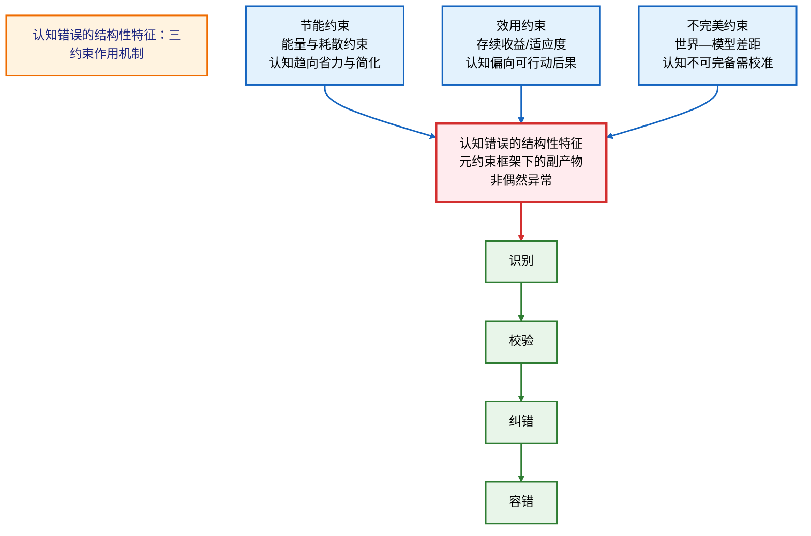
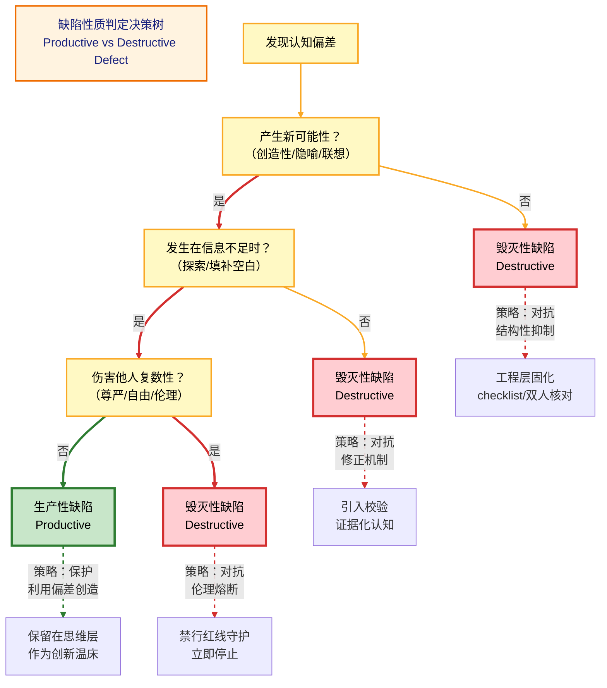
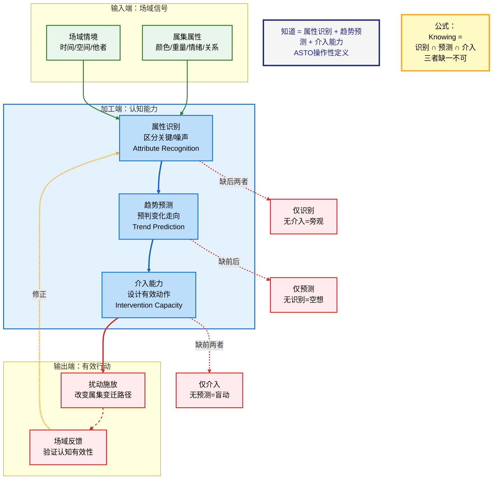
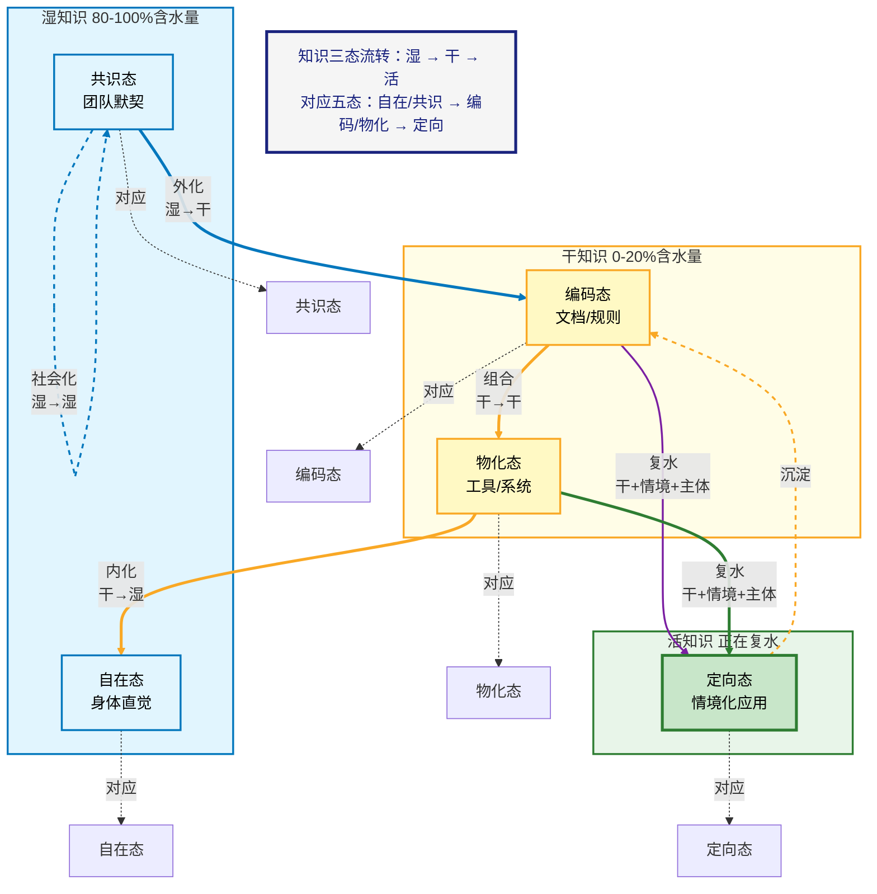
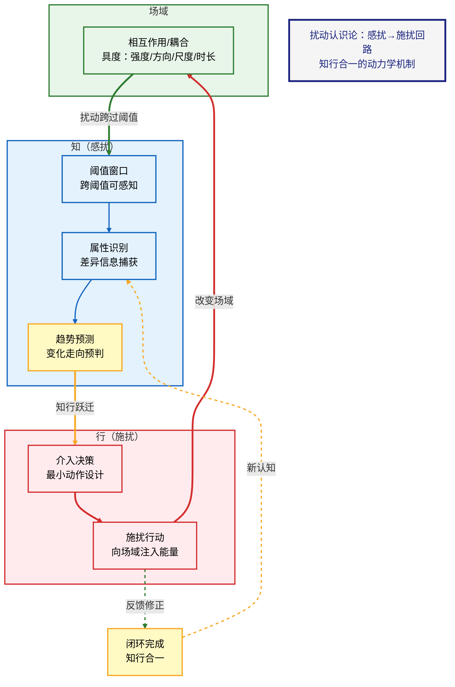
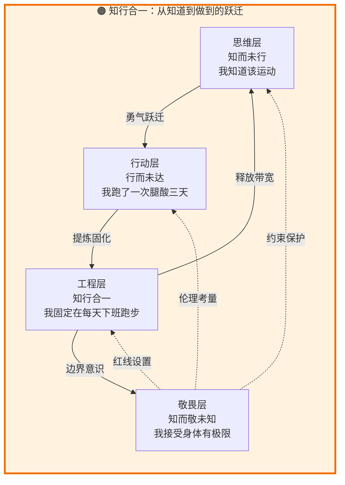
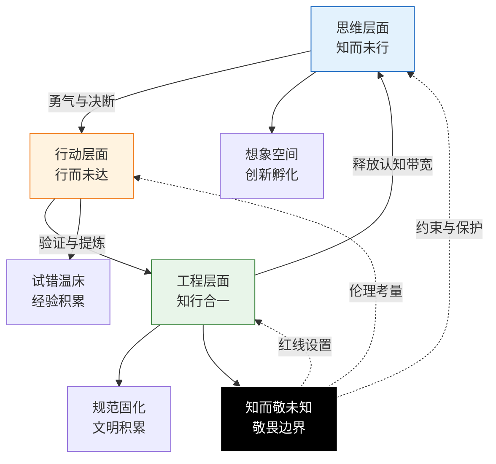

# ASTO.P03.认识论：认知错误的必然性与证据化认知

> Version: Paper.Rich.v1.3 (Audit by Quine, Kuhn, Polanyi, Goldman)
> 
> Status: 公开征评版
> 
> **第一扰动者 / Author**: Yi Fu (付毅, ODDFounder, fuyi.it@live.cn)
>
> 扰动哈希: `asto03-v1.3-phil-reviewed`
>
> Audience: Philosophers / epistemology-trained readers
> 
> Note: 本稿保留 Phil.v1.0 的信息密度，但将工程隐喻与生活化对照整体后置为“附录（解读层）”，正文尽量保持论文体的定义—命题—论证—对照结构。

---

## 摘要（Abstract）

本文在 ASTO（属集变迁存在论）框架内提出一种面向真实约束的认识论方案：**证据化认知**与**扰动认识论（Perturbation Epistemology）**。核心主张是：对有限主体而言，认知错误不是偶发异常，而是由节能、效用与不完美等属集约束共同导出的常态；因此认识论实践的重点应从“消灭错误”转向“识别—校验—纠错—容错”。在此基础上，本文将"知道"理解为可检验的能力属集模式（属性识别、趋势预测、介入能力），并将认知发生机制刻画为：场域中的相互作用/耦合（扰动）跨越主体阈值后形成可感知差异，触发对象化与证据累积。

为回应专业批评，本文在方法论上严格区分描述性与规范性陈述，并对循环论证、范畴错置、自然主义谬误、哲学史误读与本质主义风险给出边界声明。

关键词：epistemology, error, justification, reliabilism, pragmatism, evidence, perturbation, coupling, threshold, ASTO

---

## C. 定位声明：P03的三层结构 (C-Positioning Declaration)

> P03属于ASTO**结构层**与**推论层**的交界地带：
> 
> **结构层（描述性）**：认知错误的必然性（节能/效用/不完美三约束）属于对有限认知系统运作条件的描述性陈述。
> 
> **推论层（经验归纳）**：证据化认知、知行合一三层、容错机制设计属于从结构层推导的操作性原则，是经验推论，可被实践证伪。
> 
> **规范层（价值公设）**：敬畏层/禁行红线保护/文明延续属于明确标注为价值选择的伦理约束框架，不是从结构层推导的结论。
> 
> 三层可被独立接受。本文的论证链条在每处关键节点会标注所属层级。

> **术语纪律**：在 P03 中，规范性不可触碰事项统一使用 `禁行红线`；任何当前不可被穷尽的认识论剩余，使用 `开放边界 / 观察边界`；可能导致系统瞬间失稳的区域，使用 `崩解区`。

---

## C0. DM 继承合同

> **默认继承，不在本文重证**：
> - 强本体主张与终极存在论地基回引 DM
> - `开放边界 / 存在剩余` 与 `禁行红线` 严格分写
> - 人类裁决权、文明延续与高风险场景中的边界优先级只在 ASTO 中被协议化使用，不在本文重新奠基

> **本文只新增**：
> - 面向工程、治理、AI 与高变迁场景的错误、证据、校验、纠错与容错语言
> - 从最小结构前提通向操作性认识论的桥接接口

> **本文不处理**：
> - DM 级别的终极本体论争论
> - 第一人称现象学的完整构成分析
> - 超出证据化认知范围的价值奠基

> **超出边界后的回引**：
> - 哲学地基回引 `DM`
> - 规范边界回引 `P06`
> - 行动与治理压缩回引 `P04`

## 0. 方法论定位与批判前置

### 0.1 描述/规范区分
- **描述性**：认知系统为何会偏差、简化与失配。
- **规范性**：我们应如何设计校验与容错机制（这是价值选择，不由事实自动推出）。

### 0.2 P0 风险：自指与循环论证
若“效用/证据/正确”由主体自评，容易落入自证。本文的最小防御是：
- 采用**场域反馈**与**可重复介入**作为操作化判据；
- 允许反例与失败模式进入证据链（可反驳/可修正）。

### 0.3 P0 风险：范畴错置（category mistake）
- “打断/报错/疼痛”只被视为**阈值窗口现象**；
- “扰动”在本文中是更基础的：**场域中存在之间的相互作用/耦合**（可具度）；
- 工程/生活类比仅作为解释层，已后置至附录，不作为正文论证前提。

### 0.4 P1 风险：自然主义谬误（is–ought gap）
本文把“应当”标为价值承诺：例如风险治理、可逆性、责任链、尊严保护等；不从“系统会这样运作”直接推出“系统就该这样”。

### 0.5 P1 风险：哲学史误读与本质主义
本文仅做问题域对齐，不主张概念等同；并承认"场域差异"——同一标准在不同场域权重不同。

### 0.6 核心术语的认识论定位

> **观察者与扰动参与者的关系**：观察者在本文中是**扰动参与者的认识论别名**，特指在特定扰动关系中产生属集切片的参与者。

**术语澄清**：
- **扰动参与者（Perturbation Participant）**：本体论层面的术语，指在扰动事件中与被扰动存在发生相互作用的存在者
- **观察者（Observer）**：认识论层面的术语，强调扰动参与者在认知活动中的角色
- **扰动签名（Perturbation Signature）**：属集切片中可追踪的扰动行为痕迹，记录了扰动参与者的介入方式、时机、强度等特征
- **观察者印迹（Observer Trace）**：认识论层面观察者状态（预期、工具、方法）对切片内容的影响

**关键区别**：
- 扰动参与者强调**相互作用的对称性**（扰动者与被扰动者同时改变）
- 观察者强调**认知活动的主体性**（谁在进行测量、判断、记录）
- 两者指向同一存在者，但从不同理论层面描述其角色

本文使用"观察者"时，默认承认其作为扰动参与者的本体论地位；使用"扰动参与者"时，强调其与被扰动存在的对称关系。

---

## 1. 认知错误的必然性：存在公理在认知领域的直接体现

在进入ASTO的认知世界之前，我们必须正视一个根本事实：**对有限主体而言，认知出错是不可避免的；在 ASTO 的叙述中，这与其所主张的存在论约束相关。**

> **公理的存在论状态说明 (Ontological Status of Axioms)**：
> 这里的公理（节能、效用、不完美）并非为了构建理论而随意设立的假设，而是对**有限存在者（Finite Beings）**生存境况的**现象学描述**。
> *   只要你是有限的（非全知全能），你就受限于能量（节能）；
> *   只要你想存在（非虚无），你就受限于适应度（效用）；
> *   只要你与世界有隔阂（非同一），你就受限于表达的差距（不完美）。
>
> 它们是任何有限认知系统（无论是人、AI还是外星文明）都无法逃脱的**先验框架**。

> **⚠️ 奎因式警示：公理的可修正性 (Corrigibility of Axioms)**
> 尽管我们将节能、效用、不完美称为“公理”，但根据奎因的整体论，它们并非绝对不可动摇的先验教条。它们是 ASTO 体系中**最核心、最稳固的假说**。若未来出现能够推翻这些约束的经验证据，公理本身亦可被修正。我们对公理的坚持，源于其在当前场域中极高的解释力与稳固性。

但必须立刻补上一句实践澄清： **"不可避免"不等于"可以放任"。** 认知错误的频发并非不可改变的常态，而是提醒我们不断优化与校准认知系统的重要信号。

这是ASTO与传统认识论的根本分歧点：
- **传统认识论（其中一类取向）**：更强调以真理/证成/可靠性为理想，因此倾向把错误视为需要解释与控制的问题
- **ASTO认识论**：在当前公理框架下，认知"会出错"是结构性特征，是系统在节能、效用与不完美约束下运作的副产物——因此实践重点从"消灭错误"转向"识别、校验、管理错误"

这种认知错误的结构性特征，在 ASTO 的建模前提下，可用 ASTO.P05 中的**元约束：介入不可违背的三问**来解释（亦名“行动三问 / 三重介入约束”）。

> **同一概念的两种命名（按场合使用）**：  
> - **三重介入约束 (The Three Constraints of Intervention)**：用于“审计/规范/工程治理”语境  
> - **行动三问 (The Three Pre-Action Questions)**：用于“行动前自检/决策”语境  

**行动三问（行动顺序）**：

1. **是否可持续？（节能）**
2. **是否能活下去？（效用）**
3. **是否留有退路？（不完美）**

**三约束定义**：

*   **节能**：在给定边界条件下，任何存在的持续性均受能量与耗散约束；一切属集模式的稳定都需持续支付维持成本。
*   **效用**：能被保留或扩张的扰动，必须在其所处场域中表现为相对正向的存续收益（适应度）。
*   **不完美**：世界与任何模型之间必然存在差距；该差距不可消除，只能被管理；为未来变迁保留可逆性与余裕，是系统持续演化的必要条件。

### **1.1 不完美公理 → 认知先天缺陷**
> **不完美（存在常态）**：世界与任何模型之间必然存在差距；该差距不可消除，只能被管理；为未来变迁保留可逆性与余裕，是系统持续演化的必要条件。  
> **简写口号**："任何存在都有缺陷，缺陷即存在的方式。"

* **认知领域的映射**：人的认知作为一种"存在"，同样先天不完美
* **根本启示**：认知难以达到完美、无偏差的"真理"——这在**存在论层面不可被保证**；但这并不否定认知优化的意义：我们依然可以通过持续校准，提高认知的准确性与适应性，追求"更好"而非"完美"
* **积极意义**：认知的"缺陷"不是简单需要消除的"异常"，而是**认知得以存在的形态**；但在高风险与高代价场景，缺陷必须被识别并通过结构性机制被抑制
* **工程隐喻**：任何测量工具都有精度极限，试图制造"完美测量"违反了不完美约束

### **1.2 效用公理 → 认知不必完美**
> **效用（选择函数）**：能被保留或扩张的扰动，必须在其所处场域中表现为相对正向的存续收益（适应度）。  
> **简写口号**："存在不必完美，只需有效。效用为正则存，为负则亡。"

* **认知领域的映射**：在资源受限的条件下，认知往往会偏向效用最大化（可行动性/可适应性），而不总是以真理最大化为唯一目标
* **根本启示**：当"足够有效"比"绝对正确"能耗更低时，认知系统会自动选择前者
* **关键洞察**：很多认知"错误"实际上是**效用权衡的结果**——快速但不精确的认知可能在生存中更有效
* **工程隐喻**：启发式算法（heuristics）通过牺牲精确性换取速度和可操作性，这正是效用约束的体现

> **哲学澄清：效用如何定义？（反循环论证）**
> 批评者可能会问：如果"效用"由认知系统自己判断，这是否是循环论证？ASTO 的回应：
> 1. **操作化定义**：在 ASTO 中，"效用"不是抽象概念，而是可操作的指标——**在特定场域中，认知是否能支持主体完成目标行动**。效用的判断标准来自**场域的反馈**（行动成功/失败、资源消耗、时间成本），而非认知系统的自我评价。
> 2. **多层次效用**：短期效用（即时行动成功）与长期效用（持续适应能力）可能冲突，ASTO 承认这种张力，并将其视为认知演化的动力。
> 3. **与真理的关系**：效用与真理不是简单对立。在许多场域中，更接近真理的认知确实更有效——但 ASTO 强调，这种关联是**经验性的**而非**必然的**。
> 4. **外部校验机制**：效用不是认知系统的"自我感觉良好"，而是通过**外部场域的反馈回路**来校验。例如：猎人的认知是否有效，由猎物是否被捕获来判断，而非猎人自己的信心程度。这打破了循环论证的嫌疑。
>
> **⚠️ 效用判断的有限性声明（皮尔士警告）**
> 效用依赖于外部反馈（行动成功/失败）。但在复杂社会系统中，反馈往往是**延迟、模糊或缺失**的。此时，认知系统可能陷入“虚假效用”陷阱（自以为有效，实则在积累风险）。**在反馈缺失区，必须引入理论审视与伦理自觉，不能盲目依赖效用。**
>
> **复杂场域的效用判断**：在自然场域（猎物/食物）中，效用判断相对明确——猎物是否被捕获是客观事实。但在复杂社会场域（如政策效果判断）中，"正向反馈"本身可能被权力结构垄断定义。此时，单一主体的效用判断不足以确立认知有效性。这正是1.2.2节认知权威审计存在的原因：复杂场域的效用必须经过**复数主体交叉验证**和**时间跨度检验**，防止单一视角对"正向反馈"的垄断定义。单次反馈不足以确立效用，必须建立**多主体、长周期、可反驳**的验证机制。

#### **1.2.1 真理与效用的关系：弱收敛主义 (Weak Convergentism)**

戈德曼追问：ASTO 是否是彻底的工具主义？
*   **ASTO 立场**：我们持有**弱收敛主义**。虽然我们通过"效用"来校验认知，但我们相信：在长期且开放的场域中，能够持续产生正向效用的认知，必然在某种程度上捕捉到了世界的真实结构（真理）。
*   **效用是手段，真理是极限**：效用是我们唯一可用的抓手，而真理是效用在无限趋近过程中的理想极限。我们不直接宣称拥有真理，我们只宣称拥有"目前最有效的真理代理"。
*   **可检验的收敛命题**：在开放场域中持续通过实践回路检验的认知模式，其与场域结构的拟合度单调不减——即：经过 $n$ 轮实践回路校验后仍被保留的认知模式 $M_n$，其预测准确率 $\text{Acc}(M_n)$ 满足 $\text{Acc}(M_{n+1}) \geq \text{Acc}(M_n)$。这不是对"真理"的形而上学承诺，而是对实践回路筛选机制的经验性描述。当场域发生跃迁（公理六）时，收敛可能被打断并重新开始。
*   **跃迁重置形式化**：当检测到公理六跃迁信号时，Acc 基线重置条件如下：
    - 若 $\text{Acc}(M_n)$ 在连续 $k$ 轮中下降超过阈值 $\delta$（即 $\text{Acc}(M_n) - \text{Acc}(M_{n+k}) > \delta$），且场域结构指标发生不可逆变化，则判定为跃迁事件。
    - 此时 $M_{n+k}$ 被标记为"跃迁前遗产模式"，Acc 基线重置为 $\text{Acc}_0'$，新一轮收敛从 $M_0'$ 开始。
    - $\delta$ 和 $k$ 的取值依场域而定（软件工程场域建议 $\delta = 0.15$，$k = 3$）。

#### **1.2.2 认知权威与虚假效用 (Cognitive Authority)**

在社会场域中，谁来定义"有效"？
*   **风险**：权力结构可能操纵"效用"的定义。例如，一个错误的政策可能对统治者有"短期效用"，但对文明有"长期毁灭性"。
*   **免疫机制**：必须设计**认知权威审计**。任何被宣称为"有效"的认知，必须接受复数主体的交叉验证，防止效用被单一权力中心垄断。

### **1.3 节能公理 → 认知必然简化**
> **节能（物理约束）**：在给定边界条件下，任何存在的持续性均受能量与耗散约束；一切属集模式的稳定都需持续支付维持成本。  
> **简写口号**："存在倾向于以最小能耗维持自身。简洁是生存优势。"

* **认知领域的映射**：认知会自然选择**认知捷径、启发式、简化模型**
* **根本启示**：这些简化必然带来偏差和错误，但这是系统为了节能必须付出的代价——代价可以被管理
* **关键结论**：在大多数日常情境中，追求"完全准确"会带来不可承受的能耗与时延；但在复杂或高风险决策环境中，适当投入更高的精确性依然具有重要价值。关键在于在有效性与精确性之间找到可持续的平衡
*   **工程隐喻**：缓存机制（caching）通过存储近似值来加速响应，这正是节能约束的体现

### 1.3A 元约束的层级声明

在继续阅读前，有必要澄清这三条元约束的性质（它们在 P05 中作为“介入不可违背的三问”出现，而非基础公理）：

- **节能**：物理约束（能量/耗散）——解释“持续存在”的代价边界  
- **效用**：演化选择函数（适应度/存续收益）——解释“何者会被保留/扩张”  
- **不完美**：存在常态（世界—模型差距）——解释“为什么模型永远不完备”

> **记忆点**：把这三条理解为"介入前必须承认的硬边界"，而不是"可在体系内部被算法化消灭的问题"。

### **1.3.1 专题：为什么是树？——布匹隐喻 (The Cloth Metaphor)**

> **“世界是网，但为了理解，我们必须把它拎成树。”**

人类的认知是有尽头的。
面对**网状**的现实（像一块经纬交织的布），如果试图全量理解每一个连接，认知会瞬间过载。

**功能树**是我们处理复杂性的策略：
1.  **找到尽头**：我们在无限的网中抓取一个“端点”（这通常是我们的**目的**或**当前问题**）。
2.  **提起来**：以此为根节点，将整块布提起来。
3.  **垂落成树**：在重力（逻辑与因果）的作用下，复杂的网自然梳理成了层级分明的**树**。

**结论**：
我们用树，不是因为世界长得像树。
是因为**树便于我们理解，更便于我们调整**。
树是**为了行动**而对网进行的**降维**。

### **1.4 三条元约束的共同作用：认知错误的结构性特征**

这三条元约束共同作用，产生了一个深刻的结论：

> **在ASTO框架中，人的认知"有可能出错"不是一个能被彻底消除的问题，而是系统在节能、效用与不完美约束下运作时的结构性特征。出错的可能性内嵌在认知属集模式之中——这正是我们必须设计校验、纠错与容错机制的原因。**

**元约束声明**：
> ⚠️ **重要澄清**：上述三条（节能、效用、不完美）在本文中作为**元约束/行动三问**使用，用于约束结构化介入并解释认知的边界条件。它们：
> 1. **不改变P05的公理编号**：在P05中以“元约束：介入不可违背的三问”呈现，而非新增编号公理
> 2. **不直接推出价值优先级**：规范性“应当”仍需接受禁行红线/不可触达维/复数性等伦理约束的审计
> 3. **不可被消除，只能被管理**：对应的实践重点是校验、纠错与容错，而不是幻想“彻底消灭错误”
>
> 因此，当我们说“认知错误是结构性的”，这是**在当前元约束框架下的陈述**，而非**不可动摇的形而上学断言**。

**从描述到规范的桥接：生存意志 (The Will to Survive)**

休谟指出，不能直接从“是”（描述）推导出“应当”（规范）。ASTO 在此显式引入**“生存意志”**作为推导的中介。（注：这里的"生存意志"并非心理状态或道德义务，而是任何实践性系统得以持续运作的最小前提。）

1.  **描述 (Is)**：认知系统受元约束限制，必然产生偏差。
2.  **价值前设 (Value)**：我们拥有**生存意志**，且希望在此基础上构建更好的文明（详见 P04 宣言）。
3.  **规范 (Ought)**：为了在必然偏差的条件下实现生存与发展，我们**应当**设计校验、纠错与容错机制。

> **哲学澄清**：当我们说"认知错误往往不是bug，而是feature"时，这是一个**描述性陈述**，描述认知系统的实际运作方式。而当我们说“应当建立容错机制”时，这是基于生存意志做出的**规范性选择**。科学进步、医学诊断的准确性追求依然至关重要——ASTO 强调的是：在追求准确性的同时，我们需要理解错误的结构性根源，从而设计更有效的纠错机制，而非简单地责备"不够努力"或"不够聪明"。



#### 1.4.1 认识论与5-6-7行动序列的衔接

> “认知错误的识别—校验—纠错—容错，对应于 ASTO 的七序行动闭环，可跳跃或回退，但必须遵循三约束的硬边界。”

在 ASTO 的 5-6-7 动力学模型中，认知实践并非线性流程：
- **五态**（自在·共识·编码·物化·定向）定义了认知的**空间性模态**
- **六阶**（混沌·秩序·流变·脉冲·崩解·归元）定义了认知的**时间性阶段**
- **七序**（感知, 解析, 干预, 设计, 物化, 回溯, 消解）定义了认知的**行动性操作**

认知错误的识别—校验—纠错—容错，正对应于七序中的**感知—解析—回溯**环节，可跳跃或回退，以保证认知系统在扰动下的适应性。

#### 1.4.2 可跳跃性与回退性

在高复杂度场域中，识别—校验—纠错—容错可以**非线性执行**：

- **局部跳跃**：在特定条件下，认知主体可直接从"感知"跃迁至"物化"（如专家的直觉决策），跳过中间分析环节
- **回退机制**：当校验失败时，系统可回退到前一步（如从"设计"回退到"解析"），重新调整属集模式

> “生产性缺陷在跳跃或创新操作中可被利用；毁灭性缺陷必须通过回退与校验消除。”

#### 1.4.3 弱收敛与经验验证的桥接

长期累积的正向效用反馈，将不断更新属集模式，验证认知假设，实现**弱收敛**。这与七序中的**回溯—消解**环节形成闭环：

- **正向反馈** → 属集强化 → 进入下一轮五态循环
- **负向反馈** → 属集修正 → 回退至前一序

这一机制确保认知系统在持续扰动下保持演化能力，而非陷入僵化。

---

### **1.5 传统认知论与ASTO认知论的根本差异**

| 维度 | 传统认识论 | ASTO认知论 |
|------|------------|-------------|
| **认知目标** | 追求真理符合（反映世界本相） | 追求适应性（在环境中有效运作） |
| **错误性质** | 异常、缺陷、需要消除 | 常态、特征、系统设计的必然结果 |
| **认知标准** | 准确性、完整性、一致性 | 有效性、效率、适应性 |
| **演化逻辑** | 渐进逼近真理 | 适应性选择有效模式 |

---

> **隐喻对照**：本节核心概念的工程隐喻与生活隐喻对照，详见 **[附录 E：工程隐喻 vs 生活隐喻对照表](#附录-e工程隐喻-vs-生活隐喻对照表)**。

### **1.6 深度推论：为什么认知缺陷是创造力的来源？**

ASTO 提出一个反直觉的命题：**我们不仅应该容忍缺陷，还应该感谢缺陷。**

#### **1.6.1 完美即死寂 (Perfection is Stasis)**
**经验观察**：在人类认知系统中，如果认知能完美地镜射现实（1:1 的地图），那么思维就可能被现实锁死。
*   **没有偏差**，就难以产生"如果"；
*   **没有盲区**，就难以激发"想象"；
*   **没有误读**，就难以生成"隐喻"。

> **哲学澄清**：这是一个**经验性观察**，而非逻辑必然的形而上学主张。我们不是在说"完美认知在逻辑上不可能具有创造性"，而是在说：**在人类认知的实际运作中**，缺陷与创造性经验上呈现出关联。这种关联的深层机制仍有待进一步研究。

完美认知的系统可能成为一个**只读存储器 (ROM)**，它只能回放现实，难以创造新现实——但这是一个需要持续检验的假说，而非教条。

#### **1.6.2 偏差即变异 (Error as Mutation)**
在演化论中，基因复制的"错误"（突变）是进化的唯一动力。
同样，认知的"错误"（联想、移情、幻觉）是**意义进化的动力**。
*   **艺术**：源于对现实的"错误"感知（夸张、变形）。
*   **发明**：源于对现状的"不满"和对未来的"虚构"认知。
*   **共情**：源于以自我模型对他者痛苦进行近似模拟（有时会产生系统性偏差）。

#### **1.6.3 填补即创造 (Filling as Creation)**
因为我们的认知是不连续的、有空缺的（不完美约束），大脑被迫去**填补**这些空缺。
这种"无中生有"的填补过程，就是**创造**的本质。
我们因为看不清世界，所以被迫**创造**了一个世界来解释它。

> **结论**：认知缺陷不是上帝的疏忽，而是在经验上常被体验为：它为主体的选择与创造留出了实践空间。它是光照进来的地方。

#### 1.6.4 批判与边界：并非所有缺陷都是礼物

我们不能将"缺陷"浪漫化。必须区分两种缺陷：

1.  **生产性缺陷 (Productive Defect)**：
    *   **机制**：在信息不足时，大脑主动填补空白（如视觉盲点填补、隐喻联想）。
    *   **后果**：产生新的意义、模型或艺术。
    *   **ASTO态度**：**保护**。这是创造力的源泉。
    *   **在5-6-7中的位置**：在"跳跃"或创新操作中可被利用

2.  **毁灭性缺陷 (Destructive Defect)**：
    *   **机制**：在信息充足时，大脑仍拒绝修正模型（如确认偏误、逻辑谬误、刻板印象）。
    *   **后果**：导致非理性决策、系统僵化或灾难（如卡尼曼指出的系统性偏差）。
    *   **ASTO态度**：**对抗**。这是需要通过工程结构（如 checklist、双人核对）来抑制的"系统故障"。
    *   **在5-7中的位置**：必须通过"回退"与"校验"消除

#### 1.6.5 缺陷转化机制：生产性与毁灭性的动态边界 (Defect Transformation)

波兰尼的知识论提醒我们：生产性与毁灭性并非静态标签，而是**动态转化**的。

*   **转化阈值**：当一个“生产性缺陷”（如某个启发式假设）在面对新的、明显矛盾的场域反馈时，如果主体拒绝更新模型，该缺陷即刻转化为“毁灭性缺陷”。
*   **转化动力学**：
    *   **正向转化（创造）**：当“毁灭性缺陷”（如逻辑漏洞）被主体识别并加以利用（如作为反证法的起点或艺术夸张），它可转化为“生产性缺陷”。
    *   **负向转化（僵化）**：当“生产性缺陷”（如成功的经验主义直觉）被固化为绝对教条，拒绝在变迁的场域中接受检验，它便退化为“毁灭性缺陷”。

> **典型案例：AI 幻觉 (AI Hallucination)**
> *   **作为生产性缺陷**：当 AI 生成不存在的文献或奇幻场景时，若被用于创意写作或头脑风暴，它是**灵感**（Temperature > 0.8）。
> *   **作为毁灭性缺陷**：当同样的幻觉出现在医疗诊断或法律判决中，且缺乏人类校验时，它是**欺诈与风险**。
> *   **启示**：幻觉本身无罪，罪在**错位**（Context Mismatch）与**缺乏校验**。

*   **工程启示**：ASTO 的工程目标不是消灭所有缺陷，而是**保持缺陷的流动性**——防止生产性缺陷硬化为毁灭性教条。

**公理修正**：
创造力源于**对"生产性缺陷"的利用**和**对"毁灭性缺陷"的结构性抑制**，以及**对两者转化边界的敏锐觉察**。
如果只拥抱缺陷而不加校验，那不是创造，那是**'无效的 hallucinations'（幻觉）**。

#### **1.6.6 异常累积与范式审计 (Anomaly Monitoring)**

库恩提醒我们，理论往往死于对异常的"修修补补"。
*   **异常监控**：系统应显式记录那些无法被当前属集模型解释的"扰动"。
*   **范式审计阈值**：当异常的累积速度超过模型修正的速度时，应触发**范式审计**。此时不应再增加特设性假设（ad hoc hypotheses），而应启动 P11 中的"理论堆肥"程序，寻求范式层面的跃迁。




### **1.7 专题：人为什么固执？——属集模式的自我保护本能**

我们常指责他人"固执"，但在 ASTO 看来，**固执不是性格缺陷，而是属集模式的物理属性。**

#### **1.7.1 意志的堡垒 (Will as Fortress)**
**正如叔本华将身体视为意志的客体化**：观点不是挂在墙上的衣服，而是长在肉里的皮肤。
*   你的观点是你的**生存意志**的延伸。
*   当他人攻击你的观点时，你感到的不是逻辑错误，而是**本体论层面的疼痛**。
*   **固执**，是意志在保护自身不被外部力量撕裂。

#### **1.7.2 范式的沉没成本 (Sunk Cost of Paradigm)**
**库恩**在《科学革命的结构》中揭示：
*   放弃旧范式，意味着承认过去的投入（时间、声誉、信仰）全部归零。
*   面对反常证据，系统默认反应是**修补旧范式**（增加特设性假设），而不是**推翻它**。
*   **固执**，是系统为了避免"破产"而进行的最后抵抗。

> **生活隐喻：旧沙发**  
> 改变观念就像扔掉家里坐了十年的旧沙发：它塌陷了、过时了，但你的屁股已经适应了它的形状。  
> 换一个新沙发（新观念）意味着你要重新磨合，这很费劲。  
> 所以很多时候，“固执”不是你想赢，而是你的大脑在偷懒——它不想搬沙发。

#### **1.7.3 节能与防御 (Energy Conservation)**
从 **ASTO 公理** 来看：
*   **节能公理**：重构认知模型需要消耗巨大的能量（逆熵过程）。大脑作为高能耗器官，本能地拒绝重构。
*   **固执** = **认知懒惰的最高形式**。它用"拒绝输入"来节省"处理成本"。

> **结论**：固执是系统维持**属集切片暂稳**的必然机制。
> 如果人不够固执，他的自我就会在环境的微小扰动中随时崩解。
> **只有当"维持旧属集模式的痛苦" > "重构的能耗"时（跃迁阈值），改变才会发生。**

### **1.8 接受错误必然性的三个实践意义**

1. **解放认知负担**：不必追求"完美认知"，而是追求"足够有效的认知"
2. **重视错误价值**：错误不是纯粹的损失，而是系统探索边界的方式
3. **设计容错系统**：认知系统必须预设错误的发生，并设计相应的容错机制

---

## **2. 认知重构：ASTO中的"知道"是什么？**

理解了认知错误的必然性后，我们才能重新审视一个更根本的问题：**在ASTO框架中，"知道"究竟是什么？**

> **⚠️ "知道"定义的边界声明（语言游戏多样性）**
>
> 维特根斯坦提醒我们："知道"在不同生活形式中有不同的意义。ASTO将"知道"定义为"可检验的能力属集模式"（属性识别+趋势预测+介入能力），这是一种**工程实践导向的工作性定义**，而非**对所有"知道"语言游戏的穷尽性分析**。
>
> **我们承认但不深入处理的"知道"的形式**：
> - **命题性知道**（Knowing that）："我知道巴黎是法国首都"（事实陈述）
> - **亲知**（Knowledge by acquaintance）："我知道这咖啡的味道"（第一人称体验）
> - **能力之知**（Knowing how）："我知道怎么骑自行车"（embodied能力）
>
> **ASTO的定义**更接近第三种（能力之知），但进一步**操作化为三层结构**。这种统一的代价是：**它可能抹平了不同生活形式中"知道"的细微差异**。
>
> **使用边界**：本定义主要用于**工程实践、系统设计、复杂决策**等场域。在日常生活、艺术创作、哲学反思等场域，"知道"可能有更丰富、更不可操作化的意义——**那是ASTO的定义无法覆盖的**。
>
> **这不是缺陷，而是定位**：ASTO提供的是"知道"的**工程骨架**，而非"知道"的**完整血肉**。

### **2.0 元定义锚点：打破循环 (The Meta-Definition Anchor)**

维特根斯坦与怀疑论者可能会指出一个致命的逻辑循环：如果“知道”本身是认知系统的产物，我们如何用认知系统来定义“知道”？为了打破这个循环，ASTO 引入**元定义锚点**。

**元约束（Meta-Constraints）**——节能、效用、不完美——并非认知过程内部产生的规则，而是**认知得以发生的先验（a priori）存在论条件**。（注：此处的 a priori 并非康德意义上的先验形式，而是指任何认知发生都无法回避的存在论前提。）

*   **地位**：它们不依赖于认知主体的承认而存在；它们是物理与演化法则在认知层面的直接投影。
*   **锚定作用**：因为元约束是“给定的”（Given），所有后续的“知道”定义都锚定在这个坚硬的基底之上。我们不是在空谈“什么是真理”，而是在问：“在必须节能、必须求存、注定不完美的约束下，什么样的信息处理属集模式能被称为'知道'？"

这使得 ASTO 的认识论成为一种**以存在论约束为起点的弱自然主义认识论（weakly naturalized epistemology）**：它不寻求笛卡尔式的绝对确定性起点，而是从**存在论的硬约束**出发推导认知的应然属集模式。

### **2.1 传统认知论的挑战与ASTO的认知重构**

> **Gettier 问题免疫声明 (Immunity Declaration)**
> ASTO 放弃了传统知识定义（JTB: Justified True Belief）。
> 在 ASTO 中，"知道"是**能力属集模式**（识别+预测+介入），而非信念状态。
> 因此，Gettier 问题（“合理的假信念”是否为知识）在此框架下**无效**（N/A）。
> 我们不解决 Gettier 问题，我们**消解**它。

**在工程实践语境下，传统认识论的某些核心假设面临挑战**：

* **表象主义的局限**：表象主义（极简注释：认为我们看到的"表象/影子"就是世界本身）倾向于相信我们能直接"看到"世界本相 → 但在工程实践中，所有感知都是属性筛选的结果
* **表征主义的局限**：认为大脑能准确"表征"外部现实 → 但在复杂系统中，所有表征都是属性压缩的产物
* **基础主义的局限**：认为知识有不可动摇的根基 → 但在动态环境中，所有根基都是特定场域的暂时稳态

> **哲学澄清**：ASTO 并非宣称传统认识论"破产"或"失效"——表象主义、表征主义、基础主义在当代哲学中各有复杂的辩护版本。ASTO 的立场是：在**工程实践**的特定语境下，这些传统假设需要被修正或补充，以更好地指导实际的认知-行动循环。

**ASTO的认知重构**：从"符合论真理"转向"操作性真理"

> **核心命题**：在ASTO框架中，"知道"在工程语境下取操作性定义：它不主要指拥有关于世界的静态表征，而更强调**掌握属集在特定场域中的识别-响应模式**。
>
> **术语锚点｜属集**：
> 属集，是存在在时间切片上可被指认的属性集合；
> 属集的变迁，构成了存在的全部历史。
>
> 我们不讨论存在“本来是什么”，
> 只讨论它在时间中“此刻呈现为什么”。

**公式（操作性表述）**：$$ \text{知道} = \text{属性识别} + \text{趋势预测} + \text{介入能力} $$

### **2.2 "知道"的三层解析**

> **存在论张力澄清（Ontological Tension）**：
> 海德格尔可能会质疑：如果世界是流变的（Transition），为何我们要用离散的“属性集”（Attribute Sets）来认知它？
>
> ASTO 的回答是：**因为“知道”本质上是一种离散化操作。**
> 连续的变迁（Becoming）是不可言说的（Ineffable）；为了“知道”它，主体必须将其**切分**为一个个离散的时间切片和属性集合。
> 这种**“离散捕捉连续”**的必然差距，正是“不完美约束”的根源。我们承认属集是对变迁的降维，但这是我们在有限性中唯一可用的抓手。



1. **属性识别层面**：能区分关键属性与噪声属性
   * **示例**：经验丰富的工程师能一眼看出代码中的关键问题，而新手只能看到表面语法错误

2. **趋势预测层面**：能预判属集模式的变化方向
   * **示例**：架构师能预测系统在负载增加时的瓶颈位置，提前设计扩展方案

3. **介入能力层面**：能通过行动影响属性重组
   * **示例**：开发者不仅能识别bug，还能通过重构修复根本结构问题

### 2.3 "知道"的层次性：个体、集体与属集模式 (Levels of Knowing)

波兰尼的"默会知识"提醒我们，知道不仅是个体的心理事件，更是分层的属集模式。ASTO 将知道区分为三个有机层次，并承认作为背景的第零层：

**0. 不可言说的知道 (Ineffable Knowing) —— 背景层**
   * **波兰尼层**：承认存在某些"知道"，其厚度与复杂性永远无法被完整操作化为上述三层结构。
   * **特征**：它存在于身体的肌肉记忆、老工匠的直觉、以及无法被算法穷尽的伦理感中。
   * **ASTO 态度**：工程层不应试图"强行编码"此层，而应通过**场域共扰**（如师徒带教、共同实践）来保护其传递。它是所有显式认知的背景。

1.  **个体知道 (Somatic/Cognitive Knowing)**
    *   **载体**：单个主体的神经系统与身体。
    *   **特征**：高响应速度，包含大量不可言说的默会成分（如老医生的手感）。
    *   **局限**：随个体消亡而湮灭，难以直接规模化。

2.  **集体知道 (Intersubjective Knowing)**
    *   **载体**：语言、仪式、团队默契、组织文化。
    *   **特征**：通过对话与协作维持，具有主体间性（Intersubjectivity）。
    *   **功能**：筛选个体偏差，形成相对稳定的“共识真理”。

3.  **属集模式知道 (Attribute-Set Pattern Knowing)**
    *   **载体**：工具、代码、制度、物理设施。
    *   **特征**：知道被“固化”在非生物介质中（如：路标“知道”哪里有危险，防火墙“知道”什么包该拦截）。
    *   **价值**：实现了认知的**离体存储**与**跨时空复用**，是文明积累的关键。

**演化动力**：ASTO 关注从 Level 1 向 Level 3 的**跃迁（物化）**，以及从 Level 3 回到 Level 1 的**再激活（内化）**。

### **2.4 ASTO中"知道"的五个根本特性**

| 特性 | 传统认知论 | ASTO认知论 |
|------|------------|-------------|
| **属集状态** | 静态拥有 | 动态能力 |
| **有效性标准** | 符合客观实在 | 在特定场域有效 |
| **产生机制** | 个体思维过程 | 属集-环境交互 |
| **存在形式** | 心理表征 | 可执行规范 |
| **演进方式** | 渐进积累 | 跃迁重构 |

### **2.5 "知道"在1-5-6-7-1循环中的位置**

**关键洞察**：知道不是循环的起点，而是循环的**中间产物**。它永远**滞后于存在，超前于实践**。

```
一元（存在） 
  ↓ 
五态（形态展开：自在→共识→编码） 
  ↓ 
六阶（动力过程：混沌→秩序→流变） 
  ↓ 
**"知道"在此刻诞生：属集模式被识别并编码**
  ↓ 
七序（介入循环：基于"知道"进行干预） 
  ↓ 
验证与修正（回到新的一元）
```

知道捕捉的是刚刚过去的存在状态，用于指导即将到来的实践行动。这种**时滞性**正是认知错误的另一个根源：我们总是用过去的模式预测未来的变化。

### **2.6 知道的多重形态：从混沌识别到定向规范**

在ASTO中，"知道"不是单一状态，而是沿着五态演进的多重形态：

#### 2.6.1 自在态知道：模糊识别
* **形态**：属集模式尚未明确区分
* **表达**："感觉上是这样"
* **可靠性**：低，容易受干扰
* **辩证张力视角**：潜在张力的模糊感知

#### 2.6.2 共识态知道：共享识别
* **形态**：属集模式在群体中被口头约定
* **表达**："大家都这么说"
* **可靠性**：中等，依赖社会共识
* **辩证张力视角**：张力显化为群体共识

#### 2.6.3 编码态知道：形式化识别
* **形态**：属集模式被明确编码为规则
* **表达**："规则写明是这样"
* **可靠性**：高，但可能僵化
* **辩证张力视角**：张力被形式化为对立统一规则

#### 2.6.4 物化态知道：可执行识别
* **形态**：识别模式被固化为可执行工具
* **表达**："工具自动检查/执行"
* **可靠性**：很高，但可能有盲区
* **辩证张力视角**：张力被物化为可执行的检查点
* **与编码态的区别**：物化态是**运行时的**，编码态是**设计时的**

#### 2.6.5 定向态知道：自我修正识别
* **形态**：识别系统包含自我修正机制
* **表达**："系统知道何时调整规则"
* **可靠性**：自适应，但复杂
* **与物化态的区别**：定向态包含**元规则**（"何时该改规则"），物化态只有**固定规则**

> **工程映射**：五态知道的工程实例对照，详见 **[附录 F：五态知道的工程映射](#附录-f五态知道的工程映射)**。

### **2.7 从知道到知识：一个关键的区分**

**知道 (Knowing)**：个体或系统在当下时刻的识别能力（动态过程）
**知识 (Knowledge)**：被固化、可传递的知道模式（静态产物）

在ASTO中：
* **知道是活的过程**，总是在特定情境中展开
* **知识是相对稳定的沉淀**，是知道过程的阶段性产物，它的价值在于**标准化、传递与规模化复用**
* 所有知识都源于知道；但知识若失去更新机制、被当作永恒真理，或被脱离场域地套用，就可能**异化**为知道的障碍

> **警示**：不要将知识误认为知道。知识是地图，知道是实地行走的能力。当地图过时，知道的能力可以创造新地图——而健康的组织会让"制图"与"行走"持续互相校准。

### **2.8 专题：知识的层级与流动 (Wet, Dry, & Living)**

在 ASTO 中，知识不是静态的库存，而是**不同含水量的属集**。

#### 2.8.1 批判 DIKW 金字塔
传统信息科学认为认知是一个线性升级的金字塔模型：
*   **Data (数据)**：原始的事实（如 "100"）。
*   **Information (信息)**：有上下文的数据（如 "时速100公里"）。
*   **Knowledge (知识)**：可行动的规则（如 "这里限速80，超速了"）。
*   **Wisdom (智慧)**：元层面的判断（如 "虽然超速，但为了救人是合理的"）。

ASTO 认为这太线性。知识在不同**相态**之间循环流转，而非单向堆叠。智慧不是塔尖，而是整个循环的润滑剂。

#### 2.8.2 ASTO 三态知识模型

1.  **湿知识 (Wet Knowledge) —— 含水量 80-100%**
    *   **定义**：存在于大脑、身体和人际关系中的知识。
    *   **特征**：高语境、高带宽、难以复制、伴随情感。
    *   **ASTO 映射**：**自在态、共识态**。
    *   **例**：团队默契、调试代码的直觉、领导力。

2.  **干知识 (Dry Knowledge) —— 含水量 0-20%**
    *   **定义**：脱水后被固化在介质中的知识。
    *   **特征**：低语境、可复制、易于传输、丢失细节。
    *   **ASTO 映射**：**编码态、物化态**。
    *   **例**：API 文档、源代码、操作手册、数学公式。

3.  **活知识 (Living Knowledge) —— 正在复水**
    *   **定义**：干知识被主体读取，并投入到新场景的行动中。
    *   **特征**：干知识 + 当前情境 + 主体动变性。
    *   **ASTO 映射**：**七序中的应用**。
    *   **关键**：只有"复水"后的知识才产生价值。
    *   **默会复水 (Tacit Rehydration)**：波兰尼提醒我们，复水不是自动的。它依赖于主体的**默会知识背景**。没有经验厚度的主体，无法将干枯的文档复水为活的行动力。教育的本质是提供"复水"所需的催化剂。

#### 2.8.3 野中郁次郎 SECI 模型的 ASTO 诠释



*   **社会化 (Socialization)**：湿 → 湿（师徒带教，无需文档）。
*   **外化 (Externalization)**：湿 → 干（写文档，最痛苦的脱水过程）。
*   **组合 (Combination)**：干 → 干（整理归档，AI 擅长）。
*   **内化 (Internalization)**：干 → 湿（读书学习，复水过程）。

> **工程启示**：
> 不要试图把所有"湿知识"都烤干（过度文档化）。湿知识是创新的温床，干知识是规模化的基础。
> **健康的组织需要保持适当的"湿度"。** 全是文档的组织是沙漠，全是口头传授的组织是沼泽。

### 2.9 认知重构的实践意义

1. **从追求正确到追求有效**：评估认知的标准从"是否准确"转向"是否在特定情境中有效"
2. **从消除错误到管理错误**：错误不再是需要根除的敌人，而是需要管理和利用的系统特征
3. **从个体认知到系统认知**：认知能力不再局限于个体大脑，而可以分布、固化在工具、流程和系统中
4. **从静态知识到动态能力**：教育的重点从传授知识转向培养认知能力（属性识别、趋势预测、介入能力）

### 2.10 认知的暗面：被工程视角遗漏的维度

ASTO 强调显式化的"属集模式认知"，但我们必须承认认知的另一半是**隐形**的。

#### 2.10.1 默会致知 (Tacit Knowing)
**迈克尔·波兰尼**提醒：**我们知道的比我们要说的多。**
*   **特征**：骑车、游泳、外科手术的手感。
*   **ASTO 修正**：工程层不应试图"强行编码"所有默会知识，而应提供**"学徒制"的场域**，让默会知识在行动中传递；这并非排斥工具化与自动化，而是要求用合适的工具与培训机制去**支持**默会知识的学习与复现（如示范、演练、Pairing、训练场）。

#### 2.10.2 具身认知 (Embodied Cognition) (Embodied Cognition)
**梅洛-庞蒂**提醒：**身体不是工具，是认知的零点。**

> **小动作（10秒）**：闭上眼，用食指轻轻触到自己的鼻尖。  
> 你不需要坐标轴，也不需要"看见"自己——你的大脑依然知道手臂的长度和鼻尖的位置。  
> 这就是具身认知 (Embodied Cognition)在日常生活里的最小证据：**认知不是悬空的推理，而是长在身体上的能力**。

*   **特征**：你觉得"杯子在那边"，是因为你的手臂"能构到它"。
*   **ASTO 修正**：认知系统的设计必须符合**主体的身体图式**。反人性的交互设计（UI）之所以失败，是因为它违背了具身认知 (Embodied Cognition)的物理直觉。
*   **工具启示**：一个好工具应该像你的手臂一样延伸你的能力，而不是让你去背复杂的说明书。

#### 2.10.3 社会脚手架 (Social Scaffolding)
**维果茨基**提醒：**认知是个体在社会脚手架上的攀爬。**
*   **特征**：你之所以能思考"量子力学"，是因为语言和社会文化已经为你搭建了梯子。
*   **ASTO 修正**：认知的提升不只靠"个人努力"，更靠"环境供给"。**构建更好的文档、工具和社区，就是提升群体的认知智商。**

### 2.11 动力学补完：扰动作为认知的引擎

在静态描述了"知道"的形态后，我们必须补上动力学的一环：**认知是如何发生的？**

ASTO 引入**扰动认识论 (Perturbation Epistemology)**：

#### 2.11.1 认知的唤醒：海德格尔式"打断"

> **形式化定义：扰动与阈值 (Formalization)**
> Let $S$ be the System, $E$ be the Environment.
> Let $\Delta$ be the Interaction Magnitude (Interaction).
> Let $\tau$ be the Cognitive Threshold of $S$.
>
> *   **Perturbation ($P$)**: $P = f(S, E) \rightarrow \Delta$
> *   **Cognition ($C$)**: 
>   $$ C = \begin{cases} 0 & \text{if } \Delta < \tau \text{ (Transparent / Ready-to-hand)} \\ 1 & \text{if } \Delta \ge \tau \text{ (Cognized / Present-at-hand)} \end{cases} $$
>
> **解释**：只有当相互作用强度 $\Delta$ 超过阈值 $\tau$ 时，认知 $C$ 才会“醒来”（从透明的上手状态变为对象化的在手状态）。

*   **什么是扰动？**：在 ASTO 里，扰动不是“意外/打断”的同义词；它更基础地指**场域中存在之间发生的相互作用/耦合**（具度：强度/方向/尺度/时长），从而改变属集属性的变化率与变化路径。电脑死机、身体疼痛、人生变故等，只是这种相互作用跨过主体阈值后在体验侧被“看见/感到”的窗口。
*   **顺滑即无知**：当系统完美运作时（上手状态），我们并不"认知"它，我们只是"使用"它。就像你平时感觉不到胃的存在，只有胃痛时（扰动），"胃"这个概念才鲜活起来。
*   **扰动即显现**：只有当系统崩溃、报错、异常（扰动发生）时，对象才从背景中凸显出来，成为认知的客体。
*   **结论**：**扰动让认知发生（阈值窗口效应）。** 你不必讨厌 Bug 或生活中的小意外：它们常常意味着系统-环境相互作用跨过了可感知阈值，让被遮蔽的属集模式显影；但"意外/打断"不是扰动本体，只是其体验侧现象。

#### 2.11.2 知行之间的桥梁：从"感扰"到"施扰"
知行合一不是两个静态板块的拼接，而是**扰动方向的翻转**：



1.  **知（Knowing）** = **被动感知扰动**（接收差异信息，如看到红灯，或感到饥饿）。
2.  **行（Doing）** = **主动施加扰动**（向场域注入能量，如踩下刹车，或去觅食）。
3.  **合一（Unity）** = **扰动回路的闭合**。主体从环境的"受扰者"变为环境的"扰动者"，并在回馈中修正自身。

> **核心推论**：若你的认知不能转化为对场域的有效扰动（改变代码、改变流程、改变共识、改变生活状态），那么这种认知在 ASTO 意义上是**无效**的——它只是热寂中的思维空转。

#### 2.11.3 测量即扰动：条件性真实的认识论基础

> **核心命题**：测量不是对存在的中立观察，而是扰动参与者与被测存在的相互作用事件。测量值是这次扰动事件的真实记录，而非存在本体的镜像。

**测量的本体论地位**

在传统认识论中，测量被视为"发现"存在属性的工具——仿佛属性预先存在于那里，等待被揭示。ASTO 的立场不同：

1. **测量是扰动事件**：当我们测量风速时，风速计与风发生相互作用——风速计的存在改变了局部气流，风的动能也改变了风速计的状态。这不是"观察误差"，而是测量行为的本体论特征。

2. **测量值是条件性真实**：两个人用相同仪器测得"风速15m/s"，这个数值是真实的——但这个真实性有条件：
   - 条件1：特定的测量仪器（扰动方式）
   - 条件2：特定的时空位置（扰动时刻）
   - 条件3：特定的扰动参与者状态（仪器校准、环境温度等）

3. **不是虚假简化，是有效显现**：15m/s不是对风的"简化"或"近似"，而是在那个扰动条件下风的真实显现。风的内部属性无穷无尽（湍流、温度梯度、分子运动），但测量值捕捉的是在那次扰动中被激活的属性配置。

**观察者印迹（Observer Trace）**

属集切片不仅记录被扰动存在的状态，也同时记录扰动参与者的状态：

- **扰动签名（Perturbation Signature）**：每次扰动事件都在属集切片中留下可识别的模式——这是扰动方式、强度、时长的印记。
- **观察者印迹（Observer Trace）**：属集切片包含观察行为发生时观察者自身的属性状态——没有中性的观察，所有知识都带有观察者的扰动印迹。

**形式化表达**

设 $O$ 为扰动参与者（观察者），$E$ 为被扰动存在，$t$ 为扰动时刻。

属集切片 $A(t)$ 不是 $E$ 的单独快照，而是：

$$A(t) = f(O(t), E(t), \text{Interaction}(O, E, t))$$

其中：
- $O(t)$：扰动参与者在 $t$ 时刻的状态（仪器精度、认知框架、能量投入）
- $E(t)$：被扰动存在在 $t$ 时刻的状态
- $\text{Interaction}(O, E, t)$：扰动事件本身的特征（方式、强度、持续时间）

**认识论推论**

1. **可交流的知识不是谎言**：科学测量产生的共识（"光速约为3×10⁸m/s"）是真实有效的，前提是承认这个真实是在特定扰动条件下成立的。

2. **知识的有效性边界**：当扰动条件改变（更精密的仪器、不同的测量方法），属集切片会改变——这不是"发现了错误"，而是"在新的扰动条件下获得了新的真实显现"。

3. **反对绝对实在论**：不存在"脱离一切扰动的存在本体描述"。我们能获得的只是在特定扰动条件下的条件性真实。

4. **反对虚无主义**：条件性真实不等于"一切皆虚"。在特定条件下的真实是可操作、可验证、可复现的——这足以支撑科学实践和工程应用。

> **工程映射**：单元测试的有效性取决于测试用例的设计（扰动方式）。相同的代码，在不同的测试条件下会显现不同的属性配置。测试不是"发现bug"，而是"在特定扰动条件下让bug显现"。

---

## **3. 知行合一：ASTO 的认识论支柱**

### **3.0 核心框架：知行合一的三层阶梯**

在 ASTO 中，知行合一不是眵间的状态，而是一个**跃迁的过程**。它包含三个显式的结构层级：



1.  **思维层面 (Thinking Layer)**：知而未行。这是可能性的空间。
2.  **行动层面 (Acting Layer)**：行而未达。这是试错与验证的空间。
3.  **工程层面 (Engineering Layer)**：知行合一。这是规范与自动化的空间。

#### **3.0.1 贯穿案例：两条路（减肥 / 学做饭）**

为了让"思维—行动—工程"的差异更直观，下面提供两个贯穿案例（面向不同读者）：
- 如果你更偏"目标/数据/自我管理"，看「减肥」。
- 如果你更偏"生活技能/照顾自己与家人"，看「学做饭」。

它们都在讲同一件事：把"知道"变成"可重复的行动"。

- **案例 A：减肥（偏目标与数据）**
  - **思维层**：知道运动能减肥，在脑子里规划路线/训练计划。
  - **行动层**：买了跑鞋去跑了一次，腿酸了三天，发现强度或路线不合适。
  - **工程层**：把运动固定在每天下班后，不用思考，身体自动出发，并用 App 记录数据来监控与复盘。

- **案例 B：学做饭（偏技能与手感）**
  - **思维层**：知道"按菜谱做就行"，也能在脑海里想象步骤，但还没真正开火。
  - **行动层**：照着菜谱做了一次，咸了/糊了，发现火候与盐量需要调整。
  - **工程层**：把做饭固化成一套固定流程（备菜—下锅—计时—收尾），让身体自动执行；用清单/定时器/量勺把关键变量"外包"给工具。

绝大多数认知问题，都是因为**错位**：试图用思维解决工程问题，或者用工程逻辑限制思维想象。

在理解了认知错误的必然性和ASTO中"知道"的本质之后，我们现在可以进入ASTO认识论的核心：**知行合一**。

### **3.1 思维层面：知而未行，想象空间**

**核心特征**：认知停留在思维内部，未转化为外部行动。

#### **3.1.1 表现形式**
- **个人层面**：有想法但未实践，有计划但未执行
- **团队层面**：有讨论但无结论，有共识但无行动
- **组织层面**：有战略但无战术，有愿景但无路径

#### **3.1.2 价值与局限**
- **正面价值**：思维层面是**创新孵化的温床**，允许无成本的想象和探索
- **负面风险**：容易陷入**空想循环**，消耗认知资源而无实际产出
- **工程隐喻**：代码设计稿（只存在于文档中，未实现为实际系统）

#### **3.1.3 ASTO视角**
- **不是缺陷**：思维层面的"知而不行"是**创造性的必要阶段**
- **辩证看待**：需要鼓励思维层面的自由探索，但也要防止过度沉溺
- **跃迁条件**：当思维层面的认知产生足够的创新潜力时，应推动向行动层面跃迁

> **贯穿案例（思维层：知而未行）**  
> - 案例 A「减肥」：你知道"运动+饮食控制"有用，甚至在脑子里规划路线/训练计划。  
> - 案例 B「学做饭」：你知道"按菜谱做就行"，也收藏了菜谱，脑海里能想象流程，但还没真正开火。

### **3.2 行动层面：行而未达，试错温床**

**核心特征**：认知转化为行动，但行动效果不确定或未达到预期目标。

#### **3.2.1 表现形式**
- **个人层面**：尝试新方法但效果不佳，学习新技能但尚未掌握
- **团队层面**：实施新流程但遇到阻力，采用新技术但未完全发挥效能
- **组织层面**：推行改革但效果有限，进入新市场但未站稳脚跟

#### **3.2.2 价值与局限**
- **正面价值**：行动层面是**经验积累的实验室**，通过试错发现有效路径
- **负面风险**：可能产生**沉没成本**，反复尝试而无实质性进展
- **工程隐喻**：原型系统（功能有限，性能不稳定，但提供了实际验证）

#### **3.2.3 ASTO视角**
- **试错价值**：行动层面的"行而未达"是**知识生产的必要过程**
- **辩证看待**：需要容忍行动层面的失败，但也要建立有效的反馈机制
- **跃迁条件**：当行动层面的经验积累到一定程度时，应推动向工程层面跃迁

> **贯穿案例（行动层：行而未达）**  
> - 案例 A「减肥」：买了跑鞋去跑了一次，腿酸了三天，发现强度/路线不合适；开始有了第一手反馈。  
> - 案例 B「学做饭」：照着菜谱做了一次，咸了/糊了，发现火候/盐量要调；开始有了"手感数据"。

### **3.3 工程层面：知行合一，规范固化**

**核心特征**：认知与行动完全融合，形成可重复、可验证、可传承的规范体系。

#### **3.3.1 表现形式**
- **个人层面**：技能内化为本能反应，形成个人工作方法论
- **团队层面**：最佳实践固化为团队流程，建立质量标准体系
- **组织层面**：成功经验编码为组织能力，形成核心竞争优势

#### **3.3.2 价值与局限**
- **正面价值**：工程层面是**文明积累的容器**，实现知识的跨代际传递
- **负面风险**：可能产生**路径依赖**，固化的规范阻碍新的创新
- **工程隐喻**：生产系统（稳定、可靠、可扩展，支持大规模应用）

#### **3.3.3 ASTO视角**
- **固化与超越**：工程层面的"知行合一"既是**认知的完成形态**，也是**新一轮认知的起点**
- **辩证看待**：需要建立工程层面的规范体系，但也要保留突破规范的通道
- **循环机制**：工程层面的规范为思维层面的创新提供基础，思维层面的创新为工程层面的更新提供动力

> **贯穿案例（工程层：知行合一）**  
> - 案例 A「减肥」：把运动固定在每天下班后同一时段，尽量"无需思考就出发"，并用 App 记录数据与复盘。  
> - 案例 B「学做饭」：把做饭流程固化成"备菜—下锅—计时—收尾"的固定顺序（定时器/量勺/常用调料位置），让身体自动执行；偶尔复盘调整。

### **3.4 第四境界：知而敬未知——不可触达层的智慧**

**核心特征**：认识到认知的边界，主动保留不可触达领域，保持对未知的敬畏。

> **手电筒隐喻**：我们的认知像一支手电筒。  
> 工程层是光柱中心：最亮、最确定；行动层是光柱边缘：更模糊但仍可见；而"敬畏层"则是手电筒照不到的无尽黑夜。  
> 承认黑夜的存在，才不会因为光柱的强大而产生毁灭性的傲慢。

#### **3.4.1 表现形式**
```
┌─────────────────────────────────────────────┐
│        【认知的四重境界：从控制到敬畏】         │
├─────────────────────────────────────────────┤
│                                                │
│  境界一：知而可行（工程层）                    │
│      · 将已知固化为规范                        │
│      · 追求确定性与效率                        │
│                                                │
│  境界二：知而慎行（伦理层）                    │
│      · 考虑行动的长期后果                      │
│      · 引入风险评估与减缓机制                  │
│                                                │
│  境界三：知而止行（边界层）                    │
│      · 识别"不应为"的领域                      │
│      · 即使技术上可行，也主动放弃              │
│                                                │
│  境界四：知而敬未知（不可触达层）              │
│      · 承认在当前文明与责任条件下，有些领域应暂不触及  │
│        （或需满足严格的可审计责任链/可逆性保障） │
│      · 保持对不可知事物的敬畏                  │
│      · 为不可压缩的价值冲突、人的尊严与不可完全形式化的判断保留空间 │
└─────────────────────────────────────────────┘
```

#### **3.4.2 工程映射与普通实例**
- **上帝模式注释**：在代码中标记"此处永远需要人类理解"
- **伦理熔断机制**：在AI系统中设置不可绕过的伦理审查
- **技术自我限制**：主动放弃某些技术应用（如基因编辑的生殖应用）

> **普通人可操作的敬畏实例**：当你在朋友圈想晒娃时，问自己两个问题：1. 这个照片是否暴露了家庭住址？（边界层）2. 孩子长大后是否可能因此感到被侵犯？（不可触达层）。如果任一答案为"是"，则选择不发。这就是"知而敬未知"的最小实践。

#### **3.4.3 开放边界即生产力：认识论范式跃迁**

传统认识论将"不可知"视为失败——如果一个问题无法被解答，那是理论的缺陷。ASTO 提出范式跃迁：

> **开放边界（当前不可穷尽区）不是认识论的失败，而是系统演化的动力来源。**

**核心论断**：

1. **开放边界划定压强源**：正是因为存在不可被完全认知的区域，系统才产生持续探索的压强。全知的世界是演化停滞的世界。

2. **压强驱动创新**：开放边界附近的不确定性，是创造力产生的必要条件。没有开放边界，就没有探索的动力；没有探索，就没有新属集的生成。

3. **开放边界的操作性价值**：ASTO 不试图消除开放边界，而是标记它、敬畏它、在它的边界上设计更安全、更有效的介入路径。

**与传统认识论的根本差异**：

| 传统认识论 | ASTO 认识论 |
|-----------|------------|
| 不可知是缺陷 | 不可知是生产力 |
| 目标是消除不确定性 | 目标是在不确定性中有效行动 |
| 边界是限制 | 边界是结构 |
| 完美知识是理想 | 可修正性是美德 |

> **记忆口诀**：开放边界不是墙，是门——门后是我们尚未准备好进入的区域，但正因为门存在，我们才知道该往哪里走。

### **3.5 三层递进的动态关系**



**非线性声明：三层递进不是必经的线性路径**

上图展示的箭头关系是典型路径，但实践中常见的非线性模式包括：

1. **直接跃迁**：从思维层直接跃入工程层（专家直觉的固化，跳过显式试错）
2. **回退螺旋**：从工程层退回行动层（当规范失效时需要重新试错）
3. **螺旋上升**：每次回到思维层都携带上一次循环的扰动签名（经验积累）
4. **同层停滞**：长期停留在某一层而无法跃迁（如永远停留在思维层的空想）
5. **多线并行**：同时在不同领域处于不同层级（工作中在工程层，新爱好在行动层）

**敬畏层不是第四层**，而是贯穿三层的约束维度——它在思维层设置想象边界，在行动层提供伦理考量，在工程层设置红线机制。

> **与五态六阶七序的一致性**：这种非线性特征与 P05 公理中五态六阶七序的非线性声明一致——变迁可以跳跃、倒退、螺旋、停滞、多线并行。知行合一的三层是认识论层面对存在论变迁模式的映射。


**知行合一是ASTO理论体系的枢纽**，它：

1. **连接存在与认知**：将存在论公理（特别是认知错误的三个根源）与认知论实践连接起来
2. **指导实践跃迁**：提供从思维到行动再到工程的清晰路径
3. **平衡缺陷与创造**：既承认认知缺陷的必然性，又提供超越缺陷的方法
4. **实现理论闭环**：使ASTO理论本身成为可执行、可验证、可修正的认知-实践系统

### **3.7 知行合一的实践指导**

#### **3.7.1 对于个人**
- **思维层面**：培养好奇心，允许自己"胡思乱想"
- **行动层面**：勇于尝试，容忍自己的"不完美行动"
- **工程层面**：将成功经验固化为个人方法论，建立个人知识体系
- **敬畏层面**：明确自己绝不愿被触碰的底线，守护精神自主权

#### **3.7.2 对于团队**
- **思维层面**：建立开放讨论的文化，鼓励创新想法
- **行动层面**：建立快速试错机制，从失败中学习
- **工程层面**：将团队最佳实践固化为流程和工具
- **敬畏层面**：建立团队伦理准则，保护成员尊严与隐私

#### **3.7.3 对于组织**
- **思维层面**：投资研发和探索性项目
- **行动层面**：建立创新孵化机制，支持内部创业
- **工程层面**：将组织能力编码为可复制的业务模式
- **敬畏层面**：设立独立伦理委员会，明确技术应用红线

### **3.8 开放性探讨：理论的未竟之地 (Open Interfaces)**

ASTO 认识论不是封闭的教条，而是开放的探索。我们在此留下三个**理论接口**，邀请实践者继续探索：

#### **接口A：缺陷谱系的动态性**
*   **问题**："生产性缺陷"与"毁灭性缺陷"的界限是否绝对？（如"确认偏误"在创业初期可能是信心的来源，在成熟期则是灾难）。
*   **待探索**：建立动态的"缺陷评估模型"，根据场域阶段判定偏差的属性。

#### **接口B：工程僵化与反脆弱**
*   **问题**：工程层面的规范固化（路径依赖）如何避免扼杀未来的可能性？
*   **待探索**：引入"反脆弱"机制，设计能够从混乱中获益的演化架构（参见 ASTO.P11.韧性.Phil.md）。

#### **接口C：敬畏的工程化落地**
*   **问题**："知而敬未知"如何不沦为虚无的神秘主义？如何在代码中具体实现对伦理的敬畏？
*   **待探索**：发展"负责任创新"的工程标准（如伦理熔断器、上帝模式注释的具体规范）。

---

## **4. 结语：在缺陷中前行**

ASTO 认识论不教你如何成为全知全能的神，而是教你如何做一个清醒的人。
承认认知的缺陷，不是为了躺平，而是为了更诚实地去设计结构。
理解知行合一的三个层次，不仅是为了从理论到实践的有效转化，更是为创新和探索提供明确的路径。

请记住：
*   **思维**提供方向。
*   **行动**提供验证。
*   **工程**提供积累。
*   **敬畏**提供边界。

在这一循环中，我们得以在不确定的世界中，构建确定的存在。

*(正文完)*

---

## **附录 A：思想血统 (Ideological Lineage)**

ASTO 的认识论不是凭空构建的，它站在东西方巨人的肩膀上：

### **A.1 东方高峰：继承与发扬**
*   **王阳明 (知行本体)**：
    *   **"知是行之始，行是知之成。"**
    *   ASTO 继承点：**真知即行动**。如果你"知道"了但没做，那在 ASTO 看来你并未真正"知道"，你只是"听说过"。
*   **毛泽东 (实践循环)**：
    *   **"实践、认识、再实践、再认识，这种形式，循环往复以至无穷。"**
    *   ASTO 继承点：**七序循环**。ASTO 将"实践论"的宏观哲学，精细化为微观的工程步骤。

### **A.2 跨学科的结构启发**
*   **赫拉克利特**：万物皆流（变迁本体论）。
*   **康德**：人为自然立法（规范决定认知）。
*   **海德格尔**：上手状态（工具定义存在）。
*   **波兰尼**：默会致知（我们知道的比能说的多）。
*   **怀特海 (过程本体论)**：实际存在是过程而非实体，现实是事件的网络而非固定物体的集合。**ASTO继承点**：属集切片的过程性...

### **A.3 东西方融合的实质展示：以自由意志问题为例**

> **说明**：本节不是哲学史梳理，而是展示ASTO如何让东西方三个视角产生合力，得出单一传统无法单独得出的结论。

---

**问题的设定**

自由意志问题在西方哲学里持续了两千年：若世界是因果决定的，人的选择是否真实？西方内部形成了决定论、自由意志论、相容论三个阵营，至今没有共识。

东方传统的处理方式不同——王阳明不问"意志是否自由"，问"知与行是否合一"；道家不问"我能否抵抗因果"，问"如何顺势而为产生最大效用"。

三个视角各有洞见，但单独使用时都有局限。

---

**三个视角在ASTO框架内的整合**

**西方相容论的贡献**：自由不是不受因果约束，而是按照自己的欲望和理性行动。这个方向是对的，但"欲望和理性"本身是什么，相容论没有给出本体论基础。

**王阳明知行合一的贡献**：真正的知必然导向行，知而不行只是未真知。这把自由意志从静态的"我有没有自由"转向动态的"我的知是否真实到足以驱动行"。但王阳明没有说清楚当外部约束极强时，知行合一如何可能。

**道家顺势而为的贡献**：最有效的行动不是对抗场域，而是识别场域的扰动方向并借力。这把自由从"对抗约束"转向"在约束中找到有效位移的路径"。但道家没有给出判断有效位移的操作标准。

---

**ASTO整合后的新结论**

在ASTO的扰动框架内，三个视角产生合力：

> **自由不是不被扰动，而是在被扰动的条件下，凭借真实的知（知行合一）识别场域的扰动方向（顺势而为），选择能产生有效位移的介入路径（相容论的理性行动）。**

这个定义有三个单一传统都无法单独给出的特性：

**第一，它有本体论基础。** 自由是扰动参与者在扰动网络中的有效位移能力，不是抽象的意志属性。它可以被观察、被测量（位移是否发生）、被设计（如何提高有效位移的概率）。

**第二，它承认约束的真实性而不被约束击垮。** 道家告诉我们约束是真实的，王阳明告诉我们真知可以在约束中找到路径，相容论告诉我们按照这个路径行动就是自由。三者缺一，定义就不完整。

**第三，它把自由从哲学问题转化为操作问题。** 自由不再是"我有没有自由意志"这个无法被验证的形而上学问题，而是"在当前扰动条件下，我的知是否真实到足以识别有效位移路径"这个可以被操作化检验的认识论问题。

---

**对西方决定论的回应**

决定论说：若一切都是因果决定的，自由是幻觉。

ASTO的回应是：因果决定性和有效位移能力不在同一层面竞争。扰动网络是因果的，但在因果网络内部，不同的介入点产生的后果差异巨大。识别高杠杆介入点并在那里施加扰动，这个能力本身就是自由的操作定义。决定论没有错，但它的结论不是"自由是幻觉"，而是"自由是在因果网络内寻找高杠杆介入点的能力"。

---

**小结**

| 传统 | 贡献 | 单独的局限 |
|------|------|------------|
| 西方相容论 | 自由是按理性和欲望行动 | 缺本体论基础 |
| 王阳明知行合一 | 真知必然导向有效行动 | 未说明极强约束下如何可能 |
| 道家顺势而为 | 借力场域扰动方向 | 缺判断有效位移的操作标准 |
| **ASTO整合** | **在扰动条件下凭真知识别有效位移路径** | **三者合力才能完整** |

> **这个结论是三个传统单独都无法得出的**——它需要相容论的理性行动框架、王阳明的知行本体论、道家的场域借力思维，在ASTO的扰动框架内同时成立才能完整表达。

---

| 层次 | 「知」的状态 | 「行」的状态 | 一句话记忆 | 典型产物 |
| :--- | :--- | :--- | :--- | :--- |
| **思维层** | 知道 + 想做 | 尚未行动 | 在想 | 想法、灵感 |
| **行动层** | 认可驱动 | 在做，在错 | 在试 | 原型、教训 |
| **工程层** | 可执行规范 | 自动执行 | 在固化 | 代码、制度 |
| **敬畏层** | 知道边界 | 主动停止 | 在守护 | 伦理红线 |

---

## **附录 B：运气的 ASTO 描述——隐变量的共扰**

### B.1 运气的认识论定位

在 ASTO 中，由于存在"无限后退"公理，任何属集都不可能穷尽影响其状态的所有扰动参数。运气就是：

> **那些处于当前"观察边界"之外的扰动因素，在某一瞬间对基元产生了剧烈且关键的影响。**

这把运气从"神秘力量"转化为"尚未被翻译的逻辑"——它不是超越因果，而是超出当前观察带宽的因果网络。

---

### B.2 运气的两个相位

**结构性运气（背景洋流）**

现象：出生在什么样的家庭、什么样的时代。

ASTO 解释：这是属集在生成之初就被预设的"初始切片参数"。你并没有参与扰动，但你承接了前序属集留下的拓扑遗产。

本质：层级赠予。你站在了前人构建的稳定区之上。

**耦合性运气（瞬间交汇）**

现象：偶然遇到贵人、刚好避开灾难。

ASTO 解释：两个原本平行的扰动路径，在一个极小的时空坐标下发生了"概率共扰"。

本质：高维重合。在三维切片上看是偶然，但在包含隐变量的高维逻辑中，这是路径演化的必然交叉点。

---

### B.3 马太效应的 ASTO 解释

为什么运气好的人似乎一直运气好？

- **属集引力**：一个高度稳定且具备强演化胜任力的属集，其基元具备更强的"抗干扰性"和"冗余空间"。
- **容错率**：当负面运气袭来，强属集能将其吸收并重新结构化；当正面运气袭来，强属集能迅速与其产生拓扑耦合。

结论：运气不是随机撒播的种子，而是"对系统开放性的奖励"。你准备的切片工具越精良，你"捕捉"到正面扰动的概率就越高。

---

### B.4 运气的操作化建议

ASTO 不教你祈祷，它提供扰动策略：

**增加切片频率**：你产生的有效扰动越多，碰撞到隐变量正向增益的机会就越大。运气是概率的积分。

**扩大属集边界**：如果你把自己锁死在狭窄的基元内，你只能接收到极少数频段的扰动。保持跨界耦合，本质上是在扩大你的"捕获截面"。

**标记风险崩解区**：识别那些可能导致系统瞬间崩解的高压扰动区。最好的运气，往往是"没有遇到必死性的坏运气"。

---

> **核心结论**：运气是世界对你展示的"尚未被理解的深度"。敬畏运气，本质上是敬畏"无限后退"公理所预示的宇宙复杂性。

---

## **附录 C：参考文献与推荐阅读**

本文档的理论构建受益于以下思想家的开创性工作：

### **认识论与科学哲学**
*   **伊曼努尔·康德**：《纯粹理性批判》
*   **卡尔·波普尔**：《猜想与反驳》
*   **托马斯·库恩**：《科学革命的结构》
*   **丹尼尔·卡尼曼**：《思考，快与慢》

### **隐性知识与具身认知 (Embodied Cognition)**
*   **迈克尔·波兰尼**：《个人知识》
*   **野中郁次郎**：《创造知识的企业》

---

## **附录 D：ASTO 认识论行动卡**

> **随身携带，随时自查**

**当我觉得"我懂了"时，问自己：**
1. **思维层**：我能用一句话讲清楚吗？（如果能，进入下一问）
2. **行动层**：我过去一周试过吗？（如果试过，进入下一问）
3. **工程层**：我能教给别人吗？（如果能，进入下一问）
4. **敬畏层**：我确定这不会伤害任何人的尊严吗？（如果确定，恭喜你，你"知道"了）

**当我觉得"做不到"时，定位自己：**
- **卡在思维层？** → 找个人说出来，或写100字笔记
- **卡在行动层？** → 设计一个"最小可行动作"，只做5分钟
- **卡在工程层？** → 把动作固定到某个时间/地点，让它自动触发
- **卡在敬畏层？** → 停下来，回到思维层重新思考目标

---

## **附录 E：工程隐喻 vs 生活隐喻对照表**

> **说明**：本表为非工程师读者提供生活化类比，帮助理解ASTO.P03的核心概念。工程隐喻面向技术读者，生活隐喻面向日常生活——两者是启发性类比，不等同。

| ASTO 概念 | 工程隐喻（面向技术读者） | 生活隐喻（面向普通读者） |
|:---|:---|:---|
| **不完美（元约束）** | 任何测量工具都有精度极限；试图制造"完美测量"违反存在论约束 | 家里的体温计偶尔会偏差0.1℃、体重秤会受地面不平影响——这不代表它们"坏了"，而是**所有的尺子都有自己的极限**；我们需要的是"大概正常"vs"明显异常"，而非"绝对精确" |
| **效用（元约束）** | 启发式算法牺牲精确性换取速度；缓存用近似值加速响应 | 做饭时加"少许盐"而不精确称量；买菜时看评分而不读所有评论——追求"完美精确"会让我们永远做不成饭、买不成菜 |
| **节能（元约束）** | 系统用缓存、索引、压缩降低存储和计算成本 | 记手机号时记"大概这个号"而非精确数字；认路时记"在那栋楼旁边"而非每棵树的位置——**大脑为了省力气**，只记个大概 |
| **认知捷径** | 用 `if-else` 规则和 `default` 分支简化复杂判断 | 凭"第一直觉"快速判断；对陌生人用"大概印象"决定是否深入交流——大脑的"省电模式"，不愿费脑子想细节 |
| **属性识别** | 工程师一眼看出"坏味道"代码；架构师预测系统瓶颈 | 认出老朋友的脸在人群中；老师看出学生"今天不对劲"；父母感觉孩子"在撒谎"——**不用分析，一眼就感觉到了** |
| **趋势预测** | 系统负载预测、架构扩展规划 | 感觉到"这个项目要黄了"；预判"这段关系快到尽头"；预计"月底前会忙翻天"——**凭经验猜大概**，虽然不准但很有用 |
| **介入能力** | 重构代码、优化查询、调整架构 | 修改自己的习惯；调解朋友间的矛盾；给孩子换学校——通过行动改变现状的能力 |
| **容错机制** | `try-catch`、备份、回滚、降级策略 | 给自己留"试错空间"（如允许自己有时会犯错）；旅行时备选方案；和朋友吵架后有台阶可下——为不可避免的错误设计缓冲 |
| **错误意义** | 失败的标志 | 探索的痕迹、创新的可能 |

---

## **附录 F：五态知道的工程映射**

本附录提供第 2.6 节"五态知道"的工程实践实例对照

| 知道形态 | 工程实例 | 关键特征 |
|:---|:---|:---|
| **自在态知道**（模糊识别） | 对代码"坏味道"的直觉感受 | 属集模式尚未明确区分；低可靠性；容易受干扰 |
| **共识态知道**（共享识别） | 团队的编码规范（口头约定） | 属集模式在群体中被口头约定；中等可靠性；依赖社会共识 |
| **编码态知道**（形式化识别） | ESLint 配置中的具体规则 | 属集模式被明确编码为规则；高可靠性但可能僵化；设计时的 |
| **物化态知道**（可执行识别） | CI/CD 流水线中的自动化检查 | 识别模式被固化为可执行工具；很高可靠性但可能有盲区；运行时的 |
| **定向态知道**（自我修正识别） | 能根据项目阶段自动调整代码规范的智能系统 | 包含元规则（"何时该改规则"）；自适应但复杂 |

---

## 📚 方法论溯源与引用

ASTO 体系源自 ODD（输出驱动开发）的工程实践提炼。

**引用（离线可用）**：
- DOI：10.5281/zenodo.18207648
- BibTeX：
```bibtex
@misc{odd_zenodo_18207648,
  author    = {Yi Fu},
  title     = {Output-Driven Development: A Paradigm Shift in AI-Assisted Software Engineering},
  year      = {2026},
  publisher = {Zenodo},
  doi       = {10.5281/zenodo.18207648},
  url       = {https://doi.org/10.5281/zenodo.18207648}
}
```

---

## **🌳 文档体系导览 (Functional Tree)**

```text
ASTO 文档体系
├── 🌟 P 系列：哲学核心 (Philosophy)
│   ├── ASTO.P01.非此.Phil.md (理论免疫宣言)
│   ├── ASTO.P02.序章.Phil.md (否定性导引与路径分流)
│   ├── ASTO.P03.认识论.Phil.md (认知错误的必然性)
│   ├── ASTO.P04.宣言.Phil.md (属集变迁处境与行动纲领)
│   ├── ASTO.P05a.公理.Phil.md (系统热力学与属集变迁存在论)
│   ├── ASTO.P05b.人类核心体验.Phil.md (死亡、自由、意义与爱的ASTO描述)
│   ├── ASTO.P06.价值与边界.Phil.md (复数性测试与伦理熔断)
│   └── ...（更多哲学文档）
│
├── 🛠️ E 系列：工程实践 (Engineering)
│   ├── ASTO.E01.实践指南.Eng.md (生活|人文|工程三轨读本)
│   ├── ASTO.E02.自动化.Eng.md (可执行规范与零摩擦治理)
│   └── ...（更多工程文档）
│
├── 🧩 H 系列：人文叙事 (Humanities)
│   ├── ASTO.H01.重构.Hum.md (架构师的二十一种宇宙视角)
│   ├── ASTO.H03.故事：小陈的那条路.Hum.md
│   └── ...（更多人文故事）
│
└── 🎓 Lite 系列：青春版 (Youth)
    ├── ASTO04.宣言.Lite.v1.0.md
    └── ...（更多简化版）
```

> **阅读建议**：若本文档某些部分仍感困难，可跳转至H系列人文故事或Lite青春版，建立直觉后再回读。

---

**(End of ASTO.P03.认识论 Phil.Paper.v1.2 - Revised)**

**版本修订说明**：
- v1.2 (Gamma.3) 改进：1) 修正章节编号逻辑与知识层次标题；2) 补全元约束层级声明；3) 强化个体-集体-属集模式三层知道的论述；4) 引入缺陷转化动力学与元定义锚点；5) 优化附录引用结构。
- 这些修订旨在平衡哲学严谨性与大众可读性，使文档达到"可发表"状态。


