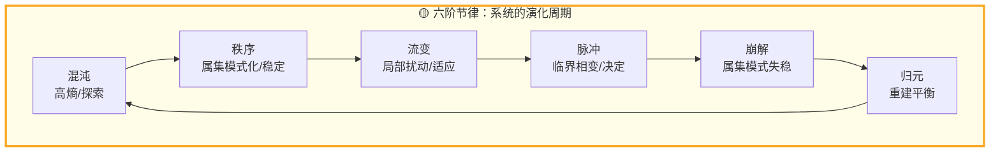
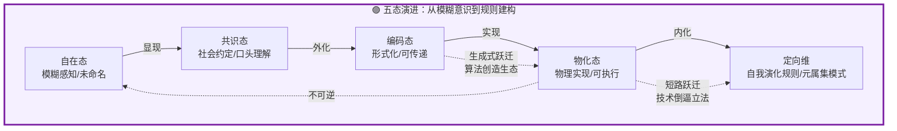
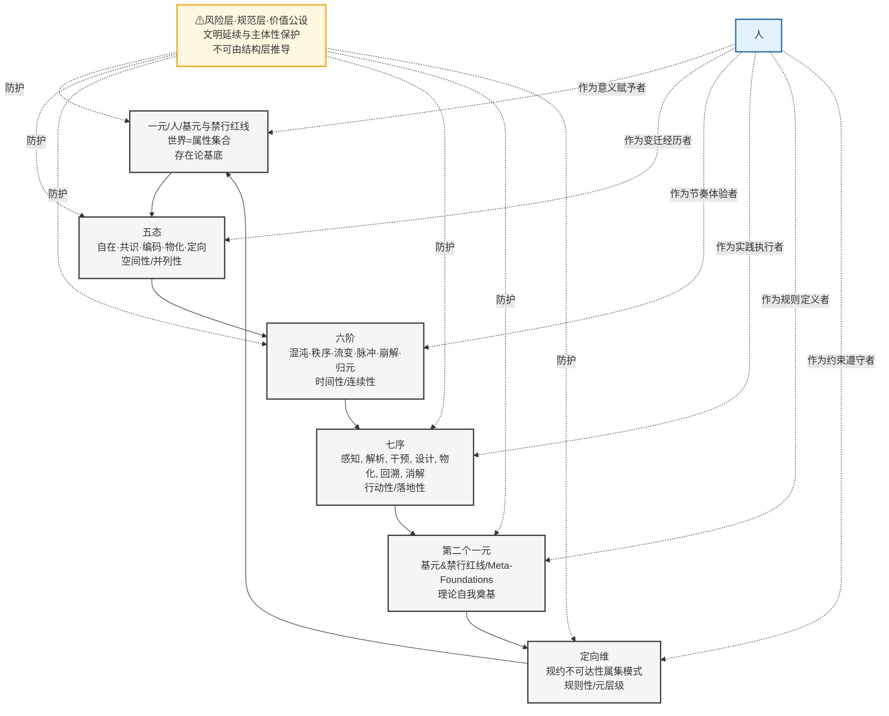
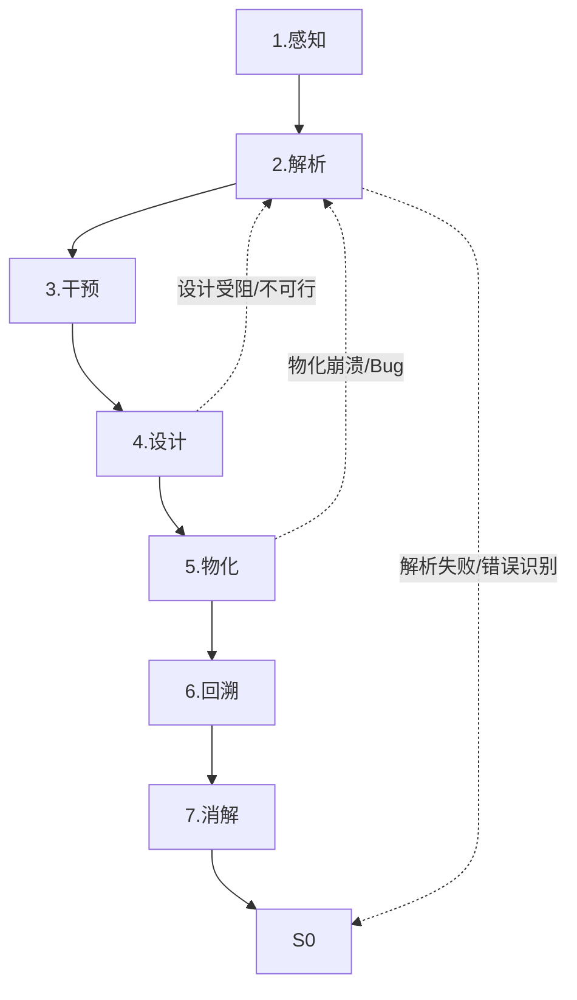

# ASTO.P04. 宣言：行动语言、治理协议与责任框架

> **Version**: 12.6 (C-Positioning Upgrade | Structural Original Sins Completed)
> **Status**: 公开征评版
> **第一扰动者 / Author**: Yi Fu (付毅, ODDFounder, fuyi.it@live.cn)
> **扰动哈希**: `asto04-v12.5-phil-reviewed`
> **Audience**: Practitioners, governance designers, and public-facing readers
> **Context**: 本文档是 ASTO 主链中的行动压缩稿，负责把结构洞察与规范边界翻译成行动语言、治理协议与责任框架，而不是继续承担独立哲学地基任务。
> **Revision Note (v12.5)**:  **重大存在论修正**。根据"推石头"模型，重构了第七章的核心引擎（1-2-3结构），确立了"存在先于观看"、"改造即属性调速"的物理动力学基础。
> **v12.6 Philosophical Positioning Upgrade (2026-02-21)**：① 新增框架定位声明（C定位·工程-文明桥梁理论·三层结构）；② 补全原罪四（场域权力遮蔽）与原罪六（效率话语入侵），修正四大为七大；③ 第七章风险层mermaid图标注从结构层混入修正为规范层标注；④ 七序步骤统一为标准格式"具身 {感知, 解析, 干预, 设计, 物化, 回溯, 消解}"；⑤ 技术加速器结论框从终极断言修订为操作性描述；⑥ 第十章之二标题升级为第十章B并增加规范层声明。
> **Governance Additions (2026-02-20)**：补充六项治理修订（外部评审 P0/P1/P2）：① 三色灯分类权元治理（§10.3，含超级多数门槛与永久锁定清单）；② 红灯区人类裁决权操作层锁定（§10.3）；③ 审计机制具体化（§10.3，含频率/触发/公开要求）；④ 决断域滥用防护四项操作锁（§10.3B）；⑤ 过渡期自举悖论治理原则（§10B.6）；⑥ 最小必要词汇集（§0.2C）。

---
## C. 框架定位声明 (C-Positioning Declaration)

> P04属于ASTO的**规范层核心文档**，是连接结构层（P05a）、推论层（P07）与免疫层（P08, P09a）的桥梁性宣言。
>
> **结构层关联**：P04的七态、六阶、七序框架继承自P05a的公理体系，但更侧重于文明级应用。
> **推论层关联**：P04的"知行合一"操作路径与P07的自由论形成实践-理论闭环。
> **免疫层关联**：P04的"结构原罪"概念在P08中得到系统性回应，P09a提供外部批判视角。
>
> P04不声称提供终极世界观，也不声称只是分析工具。它的目标是：让存在论洞察能够穿透哲学、工程、组织治理、制度设计与公共行动等层面，为人在高变迁时代的行动与选择提供有理论深度的操作框架。
>
> **当前项目中的进一步收束**：ASTO 在整体结构中应读作 `DM -> 工程 / 治理 / AI` 的应用桥接层。P04 的职责是把结构洞察压成行动语言、治理协议与责任框架，而不是重复承担独立终极本体论的造地基任务。
>
> **术语纪律（过渡版）**：P04 保留了旧稿中大量 `禁元` 的写法。自当前版本起，凡在治理、伦理、三色灯、风险层、审议、退出权、尊严、隐私等语境中出现的 `禁元`，统一按 `禁行红线` 理解；若讨论模型无法穷尽的存在剩余，则应回引 DM 或 ASTO.P99.1.术语与层级总表.md / ASTO.U02.Glossary.zh-en.md 中的 `开放边界 / 存在剩余`。
>
> **三层结构**：全文由三个可独立接受的层级构成：
> - **结构层**：属集、扰动、一元/三元、五态、六阶、七序的基本描述框架
> - **推论层**：窗口期判断、介入序列、杠杆点识别、知行合一的实践路径
> - **规范层**：文明延续公设、人类裁决者地位、禁行红线守护、三色灯机制、风险层保护

---

## C0. DM 继承合同

> **默认继承，不在本文重证**：
> - 强本体主张与终极存在论地基回引 DM
> - `开放边界 / 存在剩余` 与 `禁行红线` 严格分写
> - 人类裁决权、文明延续、边界优先级等价值承诺只在本文中被压成行动与治理语言，不在本文重新奠基

> **本文只新增**：
> - 把 ASTO 主链中的结构与边界压成行动语言、治理协议与责任框架
> - 为高变迁场景提供面向实践者的最小宣言式入口

> **本文不处理**：
> - 独立终极世界观建构
> - 与 DM 平行的第二套哲学地基
> - 对所有场景逐一给出完备制度设计

> **超出边界后的回引**：
> - 哲学地基回引 `DM`
> - 结构语法回引 `P05a`
> - 规范边界回引 `P06`
> - 版本纪律回引 `P99`

## C1. 正文优先读取区

> 若你把 P04 作为正式主文引用，优先按以下强度读取：
> - `0A`：传播性导读摘要壳；详细传播版外移至 ASTO.P04A.生活化导读.传播稿.md
> - `0.1-0.3`：阅读辅助与术语/方法说明，不构成最小协议
> - `0.4-0.6` 与 `第2章-第10章B`：P04 的正式主文
> - 对外最小引用优先：`0.5 / 0.6`、`第7章`、`第10章`、`第10章B`

## 🧭 0A. 生活化导读

> 这一节改为“导读摘要壳”。详细传播版已外移至 ASTO.P04A.生活化导读.传播稿.md。  
> **注意**：`0A` 继续保留锚点与最小摘要，方便内部回引，但不再占据主文入口的大体量空间。
>
> **文体收束说明**：`0A` 属于传播性导读与阅读辅助，不构成 ASTO 的规范主文，不参与核心主张强度判定。正式引用 ASTO 的结构、规范与协议时，应优先引用 `0. 前序` 之后的正文段落以及 `P99` 工具附录。

### 0A.1 破题：两个故事把世界点亮

最短直觉：**存在先在 -> 观看切分 -> 扰动调速**。  
世界的改变常从一次负责任的扰动开始；详细叙事版见 ASTO.P04A.生活化导读.传播稿.md。

### 0A.2 圆桌短会：三个人怎么理解“改变”

最短压缩：**有人先动 + 说得让人懂 + 场中有缝 = 变化发生。**

### 0A.3 先看清“场”

最短压缩：**行动先看场；同一动作在不同环境、关系、时间与规则里会产生不同结果。**

### 0A.4 改变的最小颗粒：一下、一个场、一个新结果

最短压缩：**任何改变都可先压成“一下 + 一个场 + 一个新结果”的最小观察单元。**

### 0A.5 窗口期：为什么有时有效，有时无效

最短压缩：**不是越用力越有效，而是要等到结构可被推动的那一下。**

### 0A.6 五态：念头如何变成规矩（人与物的共相）

最短压缩：**自在态 -> 共识态 -> 编码态 -> 物化态 -> 定向维**。  
它描述的是从局部势能到稳定规则的状态演进。

### 0A.7 六阶：变化的节奏

最短压缩：**混沌 -> 秩序 -> 流变 -> 脉冲 -> 崩解 -> 归元**。  
它描述的是系统在时间中的节律切片。

### 0A.8 七序：行动的步骤（可回溯）

**具身 {感知, 解析, 干预, 设计, 物化, 回溯, 消解}**  
最短提示：走错了就回头，不要硬扛；“消解”指旧边界的退出与让位。

### 0A.9 基元与禁行红线：地板与红线

最短压缩：**基元是地板，禁行红线是红线。你可以推动局部，但不能掀掉系统赖以成立的底板。**

### 0A.10 人的三重存在

最短压缩：**体验性 + 意义性 + 超越性**。  
人不仅有感受，也会赋义，并能在约束中作选择。

### 0A.11 自由的样子

最短压缩：**自由不是脱离场，而是在场中保住选择、创造与承担后果的能力。**

### 0A.12 三个警告

最短压缩：

1. 视角可能带来新盲区
2. 规范不只在纸上，也在手感里
3. 工具会反过来殖民使用者

### 0A.13 五分钟练习

最短压缩：**找一件别扭事 -> 定位五态/六阶 -> 设计一个最小动作。**

### 0A.13A ASTO 性格测试（一分钟速选）

最短提示：若只想快速分流阅读路径，请见详细传播版中的对应入口。

### 0A.13B 跨文化回响：东方哲学的视角 (Eastern Philosophy Resonance)

最短压缩：`场域 / 六阶 / 消解 / 七序` 可以与“势”“成住坏空”“空”“知行合一”等传统智慧形成传播层共鸣，但这不替代正式理论定义。

### 0A.14 结语：你是编织者

若你需要传播版、课堂版或口语化讲解，转入 ASTO.P04A.生活化导读.传播稿.md。  
若你要进入正式主文，请直接进入下面的 `0. 前序`。

## 🗺️ 0. 前序：阅读前的指南

### 0.1 双轨阅读指南 (How to Read)
我们拒绝将世界拆分为"文科"和"理科"，但我们尊重读者的关注点。请选择你的关注路径：
*   🦉 **思想者 (Thinker)**：寻找意义、伦理与社会隐喻。关注 🏛️ 标记。
*   🌿 **自然主义者 (Naturalist)**：寻找生物界的类比与自然法则。关注 🌱 标记。
*   🌉 **跨界者 (Bridger)**：不仅想理解两岸，还想在之间架桥。请通读。

**30分钟速读版**：0A → 第一章 → 第七章 → 第十章B → 附录F。

### 0.2 核心概念地图 (Concept Map)
为了避免迷失，请先通过此地图建立直觉。

| 陌生术语 | 直觉映射 | 解释 |
| :--- | :--- | :--- |
| **属集 (Attribute-Set)** | **石头的重力/基因组** | 属性是客观存在的。在我们看到石头之前，它已经拥有了"重"和"硬"的属性。这里的“重力/基因组”仅作直觉映射，用于帮助形成“属性可被指认”的感觉；**规范定义见下方“术语锚点｜属集”。** |
| **场域 (Field)** | **被看见的风景/被划定的系统** | 场域不是外在空气，而是**存在（如身体）感受与其它存在互动构成的“活空间”**。 |
| **一元 (Monistic Layer)** | **山上之石** | **先在性**。万物在人类出现之前就已存在。 |
| **二元 (Observational Duality)** | **看一眼** | **对象化**。观看创造了主体与客体的切分。 |
| **三元 (Mediated Triadic Structure)** | **推一把** | **改造即调速**。利用既有属性（重力），加速其变迁（滚下山）。 |
| **五态 (Five States)** | **从暗恋到结婚 / 从水流到河道** | 念头如何变成法律（人），或能量如何冲刷出地貌（物）的过程。 |
| **七序步骤：具身 {感知, 解析, 干预, 设计, 物化, 回溯, 消解}**。 |

### 0.2A 术语锚点：属集

> **ASTO 世界定义**：世界并非由既定状态所构成，而是存在在某一时间切片中的属性之集合，经由运行回路不断发生变迁的整体过程。

> 属集，是存在在时间切片上可被指认的属性集合；
> 属集的变迁，构成了存在的全部历史。
>
> 我们不讨论存在“本来是什么”，
> 只讨论它在时间中“此刻呈现为什么”。
>
> **⚠️ 存在论边界声明（海德格尔警告）**
> “属集”是一个**方法论概念**，而非对存在本身的终极描述。存在的真相往往是流动的、相互渗透的。我们将连续的存在切割为离散的“属集”，是一种为了认知的**技术化暴力**（切片）。请始终记住：**地图不是疆域，切片不是生命。**

### 0.2B 属集的解构 (Heidegger's Warning)
> **“属集”是认知的脚手架，而非存在本身。**
> 我们使用“属集”来谈论世界，是因为我们需要一种工程语言来处理变迁。但请警惕：
> *   存在不是一帧一帧的电影（切片），而是绵延的流变 (Becoming)。
> *   过度依赖“属集”视角，可能导致对存在的**离散化暴力**。
> *   **何时放下属集？** 当你面对一个具体的人、一种鲜活的痛苦、一次不可言说的审美体验时，请立即放下“属集”的分析刀，直接去**居身 (Dwelling)**。

> **提示**：如果你对理论起源不感兴趣，可以直接跳到**第一章**；如果你好奇 ASTO 从何而来，请继续看 0.3。

### 0.2C 最小必要词汇集（如果只记三个概念）

> 如果你只能带走三个词，带走这三个：

| 概念 | 一句话定义 |
| :--- | :--- |
| **属集 (Attribute-Set)** | 一个存在在某一时刻可被指认的全部属性的集合——世界是属集的流变，不是固定的物体。 |
| **扰动 (Disturbance)** | 任何改变属集的行动。人、猴子、风都在扰动；人的特殊性在于能**反思**并承担**责任**。 |
| **场域 (Field)** | 扰动发生的活空间——不是外在容器，而是存在与存在互动所构成的语境。同一个行动，在不同场域产生截然不同的结果。 |

> 记住这三个词，你就掌握了 ASTO 的基本语法：**在某个场域中，扰动参与者改变了某个存在的属集。**

### 0.3 溯源与方法论定位（ODD → ASTO）

**来源声明**：ASTO 的哲学框架直接源自 ODD（输出驱动开发，Output-Driven Development）的工程实践提炼，旨在以可执行规范与产出物治理重建 AI 时代的控制面。宣言面向哲学阐释，E 系列面向工程落地。

**核心三元关系（体三元，实落地）**：
- **需求（人）**：发起者与仲裁者。定义效用与边界，负责契约批准与例外裁决。
- **契约（属集）**：属性集合的规范性表达。定义可接受输出空间与不变量，要求可测试/可审计/可版本。
- **产出物（功能）**：可验证的输出。作为原子性节点，可被封板为"可上线暂稳切片"，并在需变更时由人"解封"进入小跃迁循环。

**工程机制（摘要）**：
- **封板/解封（Seal/Unseal）**：形成"可上线暂稳切片"；当"需求/契约/禁行红线风险"变化时，由人发起解封，重入"对话→赛马→对抗→再封板"。
- **管道擢升 A→B→C**：A（模块/规则/模型/配置）→[构建/验证/对抗/签名/封板]→B（服务/组件/策略）→[集成/赛马/对抗/封板]→C（平台能力/域能力/系统暂稳切片）。
- **网络协同与可替换性**：多产出物协同构成网络；以“契约/门禁/封板/解封/消解”为纪律，保证节点可回滚、可拔插、可替换。
- **信任转移**：以变异测试/对抗性验证替代人工逐行审查，验证“产出物正确性”。

**白话注释**：  
产出物＝干完活儿拿出来的东西；对抗＝故意找茬；赛马＝多方案对比；封板＝先定下来别乱改。

**术语映射（精简）**：
- 属集（Attribute-Set）↔ 契约（Contract）
- 稳态（Stable State）↔ 暂稳切片（Local Quasi-Stable Slice）
- 动变性（Motility）↔ 可解封/可回滚/可拔插的升级能力
- 术语说明：本文件统一使用“封板/解封（Seal/Unseal）”；“封存/封版”作为等价别名（后文尽量只用“封板”）。

**生活翻译（降低工程味）**：  
封板＝先定下来别乱改；解封＝重新松口允许改；契约＝大家说好；动变性＝可改、可退、可补救。

**引用（可离线使用）**：
- DOI（纯文本）：10.5281/zenodo.18207648
- BibTeX：
```bibtex
@misc{odd_zenodo_18207648,
  author    = {Yi Fu},
  title     = {Output-Driven Development: A Paradigm Shift in AI-Assisted Software Engineering},
  year      = {2026},
  publisher = {Zenodo},
  doi       = {10.5281/zenodo.18207648},
  url       = {https://doi.org/10.5281/zenodo.18207648}
}
```

<a id="asto-civilization-meta-definition"></a>
### 0.4 写下这篇文章的目的：在技术奇点到来之前守护家园, 创建人类更好的文明
> **适用**：全员 (All) | **优先级**：禁行红线/复数性/不可触达维 > 动变性 > 效率

ASTO 被创建的目的，不是为了让工程更优雅，而是为了让文明更安全、更自由、更有生命力。
在技术奇点到来之前，我们尤其需要两件事：
1. 守住不可逆的红线（禁行红线/不可触达维/复数性）——不让“效率”成为压迫的借口。
2. 用可逆、可审计、可退出的属集模式提升动变性——让文明在冲击中不崩溃，且能进化。

我们把“更好文明”定义为一组有优先级的判准（C）：
1. **底线（不可交易）**：复数性守护（不可替代性、对话可能性、行动空间）与不可触达维守护（尊严、良知、私密体验等）。
2. **目标（可度量/可争辩）**：在底线之内最大化动变性与可能性空间（多样性、可演化性、分叉与回馈）。
3. **手段（可替换）**：效率与自动化只能服务于前两者——任何以效率为名削弱拒绝权、退出权与可逆性者，视为文明退化信号。

> 注：进化不等于进步；适应度不等于正当性。ASTO 的“选择函数”必须接受伦理审计，而非只接受胜负与产出。
### 0.5 ASTO 理论体系定位

```
ASTO理论体系
├── **ASTO.P05：公理体系**（存在的根本法则）
│   ├── 15条公理 + 19条定理
│   └── 提供最底层的逻辑基础
├── **ASTO.P04：宣言与框架**（本文件）
│   ├── 1-5-6-7-1核心结构
│   ├── 五维体系：人+4+1维度论
│   ├── 动力学基础（扰动场域论）
│   └── 连接公理与实践的桥梁
├── **ASTO.P03：认识论**（认知为何出错）
│   ├── 认知错误的必然性
│   ├── "知道"的重新定义
│   └── 知行合一的三层阶梯
├── **ASTO.P06：价值与边界**（伦理宪章）
│   ├── 复数性测试
│   ├── 不可触达维
│   └── 美、善、自由的属集定义
└── **ASTO.P07–P13 / E01–E06 / H01–H06：应用与扩展**
    ├── 重构、边界、批判、自动化……
    └── 展现理论在各领域的解释力

**ASTO.P04的核心功能**：
1. **整合框架**：将公理体系组织为可理解、可操作的认知结构
2. **维度奠基**：明确人的存在论地位与各维度的功能
3. **动力学阐明**：揭示扰动与场域作为系统演化的根本动力
4. **行动宣言**：阐明ASTO的世界观、价值观和行动纲领
```

### 0.6 介质学与双轨制：ASTO 的历史定位
> 🏛️ **思想者**：深度阅读“介质学”，理解文明演化的载体。  
> 🌱 **自然主义者**：关注"介质代际变迁"的能量损耗与属集模式断裂。  

#### 0.6.1 双轨制声明

ASTO 由两部分组成：
1.  **工具箱**（Utility）：五态、六阶、七序。判准优先是**"是否管用/是否可操作验证"**。我们承认工具选择本身也蕴含价值预设，因此并非完全免于反思，只是反思的优先级与方式不同。  
    > **注**：工具箱以有效性为主要判准，但在触及人的不可触达维或禁行红线时，**必须接受伦理审查**；并且重大的工具选择需要提供可辩护性说明。
    > **认识论地位声明（v12.5 新增）**：1-5-6-7-1 框架（五态、六阶、七序及其循环结构）在当前版本中是基于工程实践与社会观察的**经验归纳模型**，尚未完成逻辑穷尽性论证（即未证明"不可能更少、不可能更多"）。其公理化地位有待后续工作确立。这一坦诚声明不削弱框架的实践价值——它在跨领域的异化诊断与结构分析中已被反复检验，但它的逻辑必然性与经验有效性是两个不同层次的问题。
2.  **伦理宣言**（Ethics）：前存在论条件、人性边界。判准是**"是否可辨护"**。必须接受严格的哲学审查。

我们拒绝"万能理论"。在工程问题上，我们是实用主义者；在人的问题上，我们是人本主义者。

> **澄清**：**人本主义**强调人类的价值和尊严，但并非否定社会的集体性与长远利益。作为工程师与实践者，我们在尊重个体需求的同时，也考虑集体的可持续发展与系统性健康。人本主义不是无条件优先个人利益，而是在社会系统中守护人的根本价值。
>
> **张力处理原则**：当个体利益与集体利益发生冲突时，ASTO 不提供预设的优先级公式，而是提供**判断框架**：  
> 1. **复数性测试**：该决策是否破坏了任何一方的不可替代性、对话可能性或行动空间？  
> 2. **可逆性检验**：该决策的后果是否可逆？不可逆的伤害需要更高的正当性门槛。  
> 3. **程序正义**：决策过程是否允许受影响者参与？  
>
> 这是一个**实践中需要具体判断的张力**，而非已被理论解决的问题。ASTO 承认这一张力的持续存在，并将其视为健康社会的标志而非需要消除的缺陷。

#### 0.6.2 介质学：符号载体的代际变迁

人类文明的跃迁，本质上是**交流介质**的革命。

> 注：下表"社会摩擦系数"为**示意性启发指标**，用于表达介质转换的相对损耗趋势，并非可直接对标的统计量。

| 代际 | 介质 | 特性 | ASTO 映射 | 社会摩擦系数 |
| :--- | :--- | :--- | :--- | :--- |
| **第一代** | **口头语言** | 瞬时、易变 | 自在态 | **极高** (极高损耗) |
| **第二代** | **文字/符号** 如法律 | 持久、需阐释 | 共识态 | **高** (解释权之争) |
| **第三代** | **形式化代码** 如算法 | 精确、可执行 | 物化态 | **中** (语义丢失) |
| **第四代** | **属性集 (Attribute-Sets)** | **结构化、可迁移、自演化** | **定向态** | **低** (结构自解释；理想化上限) |
**说明**：表中“社会摩擦系数”仅作**高/中/低**的定性提示，不作量化指标。  
**如果你对量化敏感**：可以直接忽略这一列，只看“高/中/低”的相对提示。

**隐喻效力边界声明（示例标注）**：  
- “社会摩擦系数”类比 **[失效风险：中]**：用于相对趋势提示，不能当作测量指标。  
- “变迁即命运” **[失效风险：高]**：若导向决定论应立即停用。  
- “耗散结构类比” **[失效风险：中]**：仅用于节律直觉，不作数学等同。  
- "交通规则=属集模式骨架" **[失效风险：低]**：用于生活理解，但不应取代伦理判断。  

**ASTO 的愿景**：我们正处于第三代向第四代跃迁的时刻。代码往往难以承载系统的演化元信息（"为什么要这样写"），我们可能需要一种新的介质（此处提出**属性集**作为候选设想）来更好地编码变迁本身；其可行性仍需在具体工程中检验。

**补充**：第四代介质强调“**意图/元数据**”作为底层元素，让“为什么要这样写”的理由可以被携带与传递，而不只留下“写了什么”。

---
---

## 警告：致编织者与三个警告

这是一份关于"世界如何发生改变"的底稿。
这里没有代码，没有机器，只有**生活、自然与存在的属集模式**。

### 进入前的三重警告 (Three Warnings)
在你决定使用 ASTO 之前，请先接受以下三个关于"理论局限性"的警告：

#### **警告一：视角是单向镜**
人文、哲学、工程之眼同时提供**盲区滤镜**，不存在完整真相。
*   当你用 ASTO 看世界时，你会看到"属集、场域、扰动"；
*   但你可能因此**看不到**那些无法被结构化的东西：一次心跳加速、一个无法言说的直觉、一段不可解释的执念；
*   也可能把**人的意向**投射到非人扰动（猴子不是小人，风也不是人）；
*   **对策**：定期摘下 ASTO 眼镜，用肉眼重新感受。

#### **警告二：规范是触觉**
规范不是文档条款，而是 CI/CD 红灯、代码 Review 皱眉、遗留系统中无人敢动的 `util.js`。
*   规范是**身体化的知识**，它存在于你的手指、你的习惯、你的恐惧中；
*   但规范也是**可反思的集体智慧**——它可以通过理性讨论、实践验证和社会共识来调整与优化；
*   不要试图用"写下来"取代"做出来"，但也不要让隐性规范逃脱理性审视；
*   **对策**：理论只有在实践中被检验，才获得意义。保持规范的**动态适应性**，在尊重既有规范的基础上持续反思。

#### **警告三：工具会殖民**
所有模型都简化世界并重塑思维。ASTO 也不例外。
*   模型与工具是对复杂世界的**简化与抽象**，它们帮助我们理解和处理复杂问题；
*   当你开始用"混沌阶、秩序阶"描述一切时，你可能已经被 ASTO **殖民**了；
*   语言塑造现实。新词汇带来新视角，也带来新盲区；
*   **工具的价值在于引导我们走向更深的理解与创新，而非简化与限制**；
*   **对策**：保持对模型局限性的清醒认知。当 ASTO 与你的直觉冲突时，先**暂停套用 ASTO**，回到具体情境中重新感受并收集可反驳的证据；同时也要警惕直觉本身可能被既有话语与权力结构塑形。没有绝对裁判，只有持续反思与可检验的修正。

> **方法论声明（避免范畴错误与隐喻审计）**：ASTO 大量使用工程与物理的隐喻（如"熵、相变、殖民、骨架、命运"等）来帮助形成直觉。这些表述默认是**启发性类比**与**工作性语言**，而非实质论证。
>
> **隐喻失效边界声明**：所有隐喻均有其有效边界。当隐喻（如"技术债"）开始驱动逻辑推导并得出违反常识或伦理的结论（如"为了还债必须裁员"）时，即视为**隐喻失效**，应立即停止类比，回归事实与价值审议。

**隐喻使用的三条底线**：  
1) 仅用于**直觉搭桥**，不能替代概念分析；  
2) 不遮蔽人的三重存在性（体验/意义/超越）；  
3) 不造成范畴错误（价值问题不能伪装成技术优化）。

### **奥卡姆剃刀声明 (Methodological Razor)**
> **针对"存在论通胀"的自我削减**：
> ASTO 的核心概念矩阵（五态、六阶、七序）并非三个独立的实体维度，而是**同一动力学的三个互补存在切片**。
> *   **空间切片**（五态）：描述事物"在什么状态"。
> *   **时间切片**（六阶）：描述事物"处于什么阶段"。
> *   **介入切片**（七序）：描述主体"如何行动"。
> 
> **使用原则**：请根据问题域选择**单一隐喻**深入，禁止在同一论证链条中混用不同概念体系（如用"六阶"解释"五态跃迁"），以防范畴混乱。
> **为了防止本理论被误用或教条化，我们在此发布三项安全原则：**
> 1.  **方法论定位**：ASTO 是一套工程方法论语言，而非终极真理。
> 2.  **反压制原则**：禁止将 ASTO 术语用于给人贴标签、压制个体经验或替代当事人的自我叙述。
> 3.  **伦理审查**：任何触及禁行红线或不可触达维的实践，都必须满足参与性、可辩护性与可逆性门槛。

> **认知工具说明（先验辩护）**：五态/六阶/七序是人类理解世界的**三种切片**（空间、时间、行动），是认知适配工具，而非新增存在论实体。

---

## 第一章：破题——一分钟见效的"属集视力"
> 🎯 **适用**：全员 (All) | **关键词**：属集视力、介质错配

### **【一分钟案例】为什么装修总是跟你想的不一样？**

> **场景**：你跟装修师傅说"我想要简约风格、温馨一点"，师傅说"明白了"，结果装完你一看——"这不是我想要的！"
> **通常诊断**：师傅不上心、沟通有问题、审美差异。
> **ASTO诊断**：这不是人的问题，是**介质错配（Medium Mismatch）**。

在 **属集变迁存在论 (ASTO)** 视眼中（此处“变迁”仅指切片之间的前后变化），你看到的不只是"你的想法"和"装修结果"，而是**五态的断裂**：
1.  **自在态 (In-itself)**：你脑海中那种"说不清但感觉对"的氛围（模糊的）。
2.  **共识态 (Consensus)**："简约、温馨"这些词（每个人理解不同）。
3.  **物化态 (Materialized)**：墙上刷的漆、买回来的沙发（已成定局）。
4.  **缺失的桥梁**：你试图用几个形容词直接指挥施工，就像用"大概那个感觉"去指挥厨师做菜，**信息丢失是必然的**。

**ASTO 解决方案**：
不强求"说清楚"，而是在中间插入**"编码态" (Encoded)** —— 例如效果图、材料样板、参考案例图片。
*   *旧路径*：脑海想法 → 口头描述 → 直接施工（断裂）
*   *新路径*：脑海想法 → **效果图/样板间（可确认）** → 施工（平滑过渡）

> **这就是 ASTO 的承诺**：它不会教你装修，但它会给你一副**"属集视力"**。拥有这副视力，你看到的不再是"不靠谱的师傅"，而是**"缺失的翻译环节"**。
【回到球场】  
装修的“效果图/样板”≈球迷的“口号节奏”，它让共识可跟随、可复制。  

**避坑提示**：只说形容词、不落到样板，沟通必然走样。

---

## 第二章：一次呼吸 (The Pulse)
**——存在是如何发生变化的？（1-1-1 结构）**
本章用“呼吸”隐喻解释最小变迁单元：**吸气—停顿—呼气**，对应**生成—约束—释放**的三拍。

### 2.1 一元：存在的自发涌现
世界像一片海，**浪不是被“制造”的**，而是海自身的张力与风的扰动共同生成。  
存在的变化，是一元流变的**自然起伏**，无需先有“观看者”。

### 2.2 二元：观看带来的切分
当我们“看见”，世界被切成“我”和“它”。  
这像你站在河边：河流本身是一元，但你的目光把它分成“此岸/彼岸”，  
从这一刻开始，**场域**出现了，互动与介入才有了坐标。
**补充**：场域不是外在空气，而是**存在（如身体）感受与其它存在互动构成的“活空间”**。

### 2.3 三元：改造作为调速
呼气不是创造空气，而是**改变空气的流速**。  
改造亦然：不是凭空创造属性，而是**加速/减速既有属性的变迁**。  
这正是后文“1-2-3 元引擎”的最小前奏。
【回到生活】  
情绪像呼吸：紧张时快、放松时慢。你要做的不是“逼它停”，而是**帮它换气**。

**避坑提示**：呼吸只是比喻，不是公式；别把“节奏”当成机械命令。

---

## 第三章：存在论核心——三大陈述
📌 回忆：**属集**的规范定义见 0.2A；本章若提及“切片”，仅作便于讨论的视角说明。**场域**=观看后被切出的互动空间（见 0.2）。
> 🏛️ **思想者**：关注"存在即属集"的客观性。

### 3.1 陈述一：存在即属集 (Existence is Attribute-Set)
**核心命题**：在 ASTO 框架中，我们不预设"实体"，只讨论"属性集合"。
*   **切片视角（仅为讨论方便）**：本章会在必要处借用“时点切片”的说法来帮助看清差异，但这只是叙述视角，不替代“属集”的规范定义（见 0.2A）。
*   **提醒**：切片是为了看清，不是为了冻结。
*   **极简类比**：就像一个人的“性格基因”——这一刻你看见的样子。
*   **客观性声明**：属性集合不是人脑中的概念，而是**先于人存在的客观实在**。
*   🌱 **生物隐喻**：**山上之石**。在人类出现之前，石头就已经聚合了"质量"、"硬度"、"势能"等属性。它们不依赖我们的观察而存在。

### 3.2 陈述二：属集模式即骨架 (Structure is Skeleton)
**核心命题**：属集模式维持属集，支撑与约束并存。

*   **哲学深意**：属集模式具有支撑与束缚的双重性。没有属集模式，属性会四散；有了属集模式，演化受限制。
*   **辩证张力视角**：属集模式是**张力暂时平衡的稳定形态**，但其稳定性并非永恒。
*   **实践论视角**：属集模式是**实践的历史沉淀**，承载了多种社会力量的平衡。
*   **动态性强调**：属集模式是**动态调整的载体**，它必须与变化的需求和矛盾调和，随着新的实践需求和社会环境的变化而演化和重塑。
*   **工程隐喻**：架构设计、协议规范、制度框架——它们都需要版本迭代。
*   **生活隐喻**：**交通规则**。红绿灯确实"束缚"了你想怎么开就怎么开的自由，但如果没有它，路口就会瘫痪，你连家都回不去。属集模式限制了局部自由，支撑了整体生存。

### 3.3 陈述三：变迁即命运 (Transition is Fate)
**核心命题**：变迁是矛盾不可调和的必然结果，但介入方式由主体选择。

*   **哲学深意（启发性类比）**：变迁往往不是"单凭意志即可避免"的选择，而是系统张力积累到阈值后的结构性结果——此处为类比语言，并非主张社会系统严格服从物理定律；但**如何回应变迁**仍属于主体的选择与责任领域。
*   **辩证张力视角**：变迁是**张力不可调和时的必然爆发**，是在特定条件下由内外张力引发的必然过程。
*   **实践论视角**：变迁是**实践对理论的突破和超越**。
*   **能动性强调**：虽然变迁受矛盾激化的驱动，但个体与集体依然具有**通过选择干预**来影响变迁路径的能动性。变迁是命运，但介入是自由。
*   **跃迁指标（启发性）**：$\\text{变迁压力} = \\frac{V_e \\text{ (环境变化速率)}}{V_n \\text{ (规范适应速率)}}$。当该指标持续 > 1，系统进入高概率跃迁区间；但是否跃迁及其形态仍取决于场域与介入方式——主体可以选择**顺应、引导或缓冲**。
> ⚠️ **范畴错误风险**：此处“命运”仅指**矛盾累积的不可逆性**，并不否定自由意志或责任。

### 3.3A 哲学对话：ASTO 与《矛盾论》
ASTO 的变迁动力学深受**《矛盾论》**（毛泽东, 1937）的启发，并将其工程化：

1.  **解析即定性**：七序中的**解析 (Resolve)**，本质上就是寻找**主要矛盾**。在复杂的系统故障中，区分“根本原因”与“表面症状”，就是区分主要矛盾与次要矛盾。
2.  **脉冲即质变**：六阶中的**脉冲 (Pulse)**，对应矛盾激化导致的**质变时刻**。在此之前是“秩序/流变”（量变），在此之后是“崩解/归元”（新质生成）。
3.  **内因与外因**：ASTO 强调**属集模式性张力**（内因）是变迁的根本，而**外部扰动**（外因）只是触发条件。石头能孵出小鸡吗？不能，因为内因（属性）不同。

> **工程推论**：解决问题的关键不在于修补表面（次要矛盾），而在于重构导致张力的核心属集模式（主要矛盾）。

### 3.3B 扰动普遍性公理 (Axiom of Perturbation Universality)
**公理陈述**：扰动作为属性调速的机制，是**存在之间的普遍交互形式**，不依赖于特定行动者。

**核心洞见：相互扰动原理**

扰动不是单向的"主体→客体"操作，而是**扰动参与者与被扰动存在的相互作用事件**。在扰动发生时：
- 被扰动存在的属性发生变化
- 扰动参与者自身的属性也同时发生变化
- 两者共同构成扰动事件的完整记录

**扰动的三重分层**

根据反思能力和责任承担，扰动分为三个层次：

| 扰动类型 | 定义 | 特征 | 责任归属 | 例子 |
| :--- | :--- | :--- | :--- | :--- |
| **自然扰动** | 无意图的物理作用 | 无目的、纯因果 | 无责任 | 风吹石头、雨水侵蚀 |
| **意向扰动** | 有目标的行为 | 有方向、可预期 | 功能性责任 | 猴子推石头、动物觅食 |
| **反思扰动** | 能反思后果的介入 | 可评估、可问责 | 伦理责任 | 人类决策、AI辅助决策 |

**推论**：
1) **人类非中心**：人类扰动只是扰动的一种特殊形式；
2) **技术中介性**：技术是人类设计的扰动放大器，但仍服从同一机制；
3) **责任特殊性**：只有能反思后果的存在者（反思扰动），才需要承担伦理责任。

**伦理边界**：
- 自然扰动：无需问责（风不需要为吹倒树木负责）
- 意向扰动：功能性评估（猴子推石头是本能，不是道德问题）
- 反思扰动：伦理问责（人类必须为可预见后果负责）

> ⚠️ **范畴错误警告**：不要把人的意向投射到非人扰动。猴子不是"小人"，风也不是"有意为之"。只有反思扰动才进入伦理领域。

### 3.3C 存在的召唤 (The Call of Being)
**海德格尔补充**：扰动不只是主体对场域的单向干预，存在也在**扰动**（召唤/Ruf）我们。
*   **双向性**：不仅是你在推石头，石头也在"召唤"你（作为它的势能释放者）。
*   **诗意与责任**：一块石头可能"召唤"诗人写诗，一片森林可能"召唤"建筑师保护。主体不仅是操作者，也是**倾听者**。
*   **推论**：在"感知"序中，我们不仅要主动搜索信号，还要学会**被动聆听**存在的召唤。

### 3.3D 风险层的价值论基础 (Value Foundation of Risk Layer)

**关键定位声明**：风险层不是ASTO体系的自动产物，而是我们主动选择的价值承诺的执行工具。

我们选择把**文明延续和人类主体性保护**置于系统设计的核心，这是**价值论声明**，不是本体论发现。

**推导链条**：

1. **价值承诺**（本节）：文明延续和人类主体性保护是ASTO的核心价值承诺
2. **实践需要**：这个承诺产生两个操作需求：
   - 需要一个机制识别哪些扰动威胁文明延续或人类主体性
   - 需要一个机制在这类扰动发生时提供保护性缓冲
3. **操作化响应**（P05）：风险层是这两个需要的操作化响应，以保护系数的形式介入系统

**哲学澄清**：

任何试图把风险层描述为本体论必然的诠释，都是对ASTO的误读。风险层的存在不是从公理推导出来的，而是从价值选择推导出来的。若价值承诺改变，风险层的设计需要相应调整。

**工程含义**：

风险层不保证完全消除负向扰动，它只提供缓冲机制。文明延续和主体性保护是目标，不是承诺的结果。

### 3.4 显三元，本一元：与 1-2-3 引擎的同构说明

为了在工程中可操作，我们将**"实用主义的裂隙一元论"**进一步具体化为**"显三元，本一元"**的存在论属集模式。

#### 1. 本一元 (Monism of Origin)
*   **物理真相**：世界在底层是**“属集变迁”的一元流变**。没有孤立的“人”，也没有孤立的“物”，只有属性的持续生灭与重组。
*   **意义**：这是一切存在的基底，也是熵增公理生效的领域。
*   **关键澄清**：本一元是**逻辑起点**，不是可以被回归的终点。任何声称"触及一元"或"回归一元"的表述，都是隐喻性的，不是本体论陈述。
*   **叙述约定**：本章若使用“切片/前后变化”的说法，仅用于限定讨论范围与便于直觉理解；不构成对“属集”的替代定义（规范定义见 0.2A）。

#### 2. 显三元 (Trinity of Manifestation)
当**扰动**发生时，一元流变临时显现为三个维度。这是**工程介入的最小完备属集模式**：

| 三元维度 | 哲学隐喻 | 工程映射 (ODD) | 因果地位 |
| :--- | :--- | :--- | :--- |
| **人 (Human)** | **目的因** (Telos) | **需求 (Needs)** | 发起者，意义的来源 |
| **属集 (Attribute-Set)** | **形式因** (Form) | **规范 (Specs/Contract)** | 中介，定义的载体 |
| **存在 (Existence)** | **动力因** (Efficient) | **产出物 (Artifacts)** | 结果，价值的实现 |

> **映射公式**：**人（意向） ⇄ 属集（定义） ⇄ 存在（实现）**

*   **人 ⇄ 属集**：人通过语言/代码定义属集（规范）。
*   **属集 ⇄ 存在**：属集通过编译/执行物化为存在（产出物）。
*   **存在 ⇄ 人**：存在反过来服务于人，满足需求。

**术语澄清：扰动 vs 动变性**

| 概念 | 性质 | 用途 | 示例 |
| :--- | :--- | :--- | :--- |
| **扰动** | 事件/过程 | 描述具体的发生 | 扰动发生、扰动参与者、扰动事件 |
| **动变性** | 存在属性 | 描述存在物的能力 | 系统的动变性、动变性四分类、动变性场域 |

**关键区别**：
- **扰动**是"发生了什么"——是一次事件，有时态
- **动变性**是"能做什么"——是一种属性，无时态
- 显三元是**扰动发生时**的显现结构，不是永恒的三元结构

**同构说明**：  
"显三元"强调**扰动下的显现结构**，"1-2-3 引擎"强调**存在—观看—改造的动力序列**。前者是**属集模式脚手架**，后者是**动力引擎**；二者并非冲突，而是从不同维度描绘同一过程：  
**本一元的流变** → **扰动的发生** → **显三元的显现**。

**预告｜反思涌现公理（拟补 P05）**：  
当系统对自身的描述在**切片序列**中形成递归自指深度超过阈值 Φ，系统会生成对自身“错误模型”的能力，这被视为**反思/意识的涌现**。Φ 目前仅作启发式阈值。

---

【回到球场】  
**存在即属集**≈比赛此刻的样子；**属集模式即骨架**≈规则与赛制；**变迁即命运**≈比分与情势的必然波动。  
你能做的，不是改规则，而是**在规则里动对那一下**。

## 第四章：人本主义基石——维度0 (人的存在维)
> 🏛️ **思想者**：必读。这是 ASTO 区别于机械唯物主义的关键。  
> 🌱 **自然主义者**：关注“体验/意义/超越”如何在生物体中生成。  

### 4.1 人的三重存在性

1.  **体验性存在 (Experiential Being)**
    *   **Qualia**："看到红色"的主观感受，在当前理论与工程条件下难以被充分形式化/还原（仍有争议）。
    *   **时间性**：向死而生的有限性意识。
    *   **具身性**：身体不是工具，是存在的方式。
    *   **生活隐喻：感光底片**。只有底片（身体）感光了，世界才有了颜色。算法能处理图片的RGB值，但算法本身"看"不到颜色，就像底片本身不知道什么是"美"。

2.  **意义性存在 (Meaning-Making Being)**
    *   **解释学循环**：人不仅感知世界，更赋予其意义。
    *   **价值判断**：善恶、美丑的直觉，不能被简化为效用函数。
    *   **叙事性自我**："我是谁"不是数据，是叙事。
    *   **生活隐喻：小说家**。同样是下雨（数据），对农夫是喜悦，对路人是麻烦。人不是在被动处理数据，而是在主动编织关于世界的"故事"。

3.  **超越性存在 (Transcendent Being)**
    *   **自由意志**：作为因果网络中独特的**反思性决策节点**——不是脱离因果的"无因之因"，而是能够将自身的因果历史纳入考量、并据此做出选择的能力。这是一种**兼容论立场**：自由不在于逃离因果，而在于成为特定类型的因果参与者。
    *   **创造性**：在既有条件的约束下，产生**非预定组合**的能力——不是形而上学的"无中生有"，而是对可能性空间的独特探索。
    *   **伦理维度**：良知的反思性命令——不是先验的绝对律令，而是在具体情境中对行动后果的负责任考量。
    *   **补充声明**：我们承认自由意志问题在哲学上仍具争议；ASTO 在实践层面采取兼容论作为工作假设，用于讨论责任、选择与介入，而非宣称终局解答。
    *   **生活隐喻：程序员修改代码**。程序平时按既定代码跑（因果律），但程序员（自由意志）可以在关键时刻插入新的指令，改变运行轨迹。虽然程序员也受限于编程语言（条件约束），但他决定了"写什么"。
    *   **补充隐喻：重定义场域边界**。自由不只是“在球场里踢球”，还包括**把球场重新定义成花园**的能力——一种语境切换的权利。

### 4.2 人与系统的接口
人不是"用户"，人是意义涌现的**关键节点**：意义不是主体单方面赋予的，而是在主体与场域的交互中生成的。
*   **人 → 五态**：赋予"自在态"以意义，使其成为"共识态"。
*   **人 → 六阶**：通过自由意志打破决定论循环，注入"脉冲"。
*   **人 → 七序**：作为不可替代的操作主体（感知与回溯的关键执行者）。
*   **人 → 定向维**：作为价值判断的终极立法者。

> **关键界定**：人是场域的**扰动者**而非**主宰者**。

### 4.3 人类裁决者地位的价值公设声明

> **价值公设，非本体论发现**：ASTO将人类置于最终裁决者位置，这不是因为我们发现了人类在本体论上的特殊性，而是基于以下价值选择：
>
> 1. **伦理反思能力的价值**：我们选择将具备伦理反思、意义构建、责任承担能力的存在体置于裁决位置。
> 2. **文明延续的前提**：这个选择服务于文明延续这一更基础的价值承诺（见第X章）。
> 3. **可修正性**：如果未来出现其他存在体满足上述能力标准，这个公设可以通过文明级别的审慎deliberation进行修订。
>
> **对AI挑战的回应**：当AI系统声称具备伦理反思能力时，ASTO的回应不是"比较能力高低"，而是"价值公设的修改需要文明级别的审慎deliberation，不由单一系统的能力声明触发"。人类裁决者地位的改变，需要的是集体的、历史性的、可逆性保护下的决策过程。

【回到生活】
当你愿意停下来听、愿意改一句话、愿意多做一步，你就在守护"人的三重存在"。

---

## 第五章：窗口与节律 (The Window & Rhythm)
> 🏛️ **思想者**：关注节律隐喻（中年危机、归元重建）。  
> 🌱 **自然主义者**：关注“耗散结构”作为弱类比的说明。  

### 5.1 六阶：动力的过程 (The Six Stages)
📌 回忆：**六阶**是变化的时间切片（见 0A.7）。



属性集合在时间中的演化阶段。我们引入 **耗散结构理论 (Prigogine)** 作为**启发性类比**（而非严格等同）：

> **方法论说明**：下表中的物理判据是**类比工具**，用于帮助理解社会/技术系统的动态特征。我们不主张社会系统严格满足耗散结构的数学条件。这些指标在社会系统中需要**操作化重定义**：  
> - "熵"类比为系统的无序度/不确定性  
> - "Lyapunov指数"类比为系统对微小扰动的敏感程度  
> - 具体测量方法需根据领域特性设计，而非直接套用物理公式  
>
> 我们借用耗散结构作为**弱类比**框架：帮助识别"远离平衡—自组织—失稳—重构"的动态型；不主张与物理系统在数学上同构。

| 阶段 | 物理类比 | 社会/技术系统的可观测指标 | 工程类比 |
| :--- | :--- | :--- | :--- |
| **混沌** | 远离平衡、高熵 | 决策分歧大、方向不明确、试错频繁 | 初创期的无序探索 | **青春期**（迷茫、冲动、充满可能性） |
| **秩序** | 耗散结构形成 | 流程稳定、角色清晰、产出可预测 | 稳定运营期 | **刚工作/成家**（按部就班，稳定但略显沉闷） |
| **流变** | 亚稳态扰动 | 局部调整频繁、边界模糊化 | 竞争压力下的调整 | **中年危机**（隐约觉得不对劲，想要改变但很难） |
| **脉冲** | **相变临界** | **关键指标剧烈波动、决策窗口收窄** | 流量暴涨、攻击 | **辞职/离婚/大病**（生活的剧烈震荡，必须做决定） |
| **崩解** | 失稳雪崩 | 核心功能失效、信任崩塌 | 系统宕机、破产 | **崩溃/失业**（旧生活彻底瓦解） |
| **归元** | 重返平衡 | 新共识形成、新属集模式稳定 | 重构后的新架构 | **新生活**（走出阴影，建立新的生活节奏） |

> **节律提示**：六阶不是“命运锁死”的时间线，而是**窗口与节律**。看懂自己的节律，就知道什么时候该“守成”，什么时候必须“跃迁”。  

### 5.2 涌现的存在论地位 (Whitehead's Query)
**怀特海提问**：涌现的产物是否具有独立的因果力量？
*   **ASTO 回答**：是的。涌现不是属性的简单累积，而是**全新的存在层级**。
*   **例子**：意识不是神经元的"总和"，而是在神经元活动中涌现的新实体。一旦涌现，它就拥有了向下因果力（意识可以控制神经元）。
*   **AI 启示**：当 AI 系统涌现出"反思"能力（见 3.4 反思涌现公理），它就不再仅仅是代码的集合，而成为了一个新的存在论节点，具备了伦理地位的候选资格。

**进度条示意**：混沌 → 秩序 → 流变 → 脉冲 → 崩解 → 归元

【回到球场】  
第70分钟的焦躁＝**流变**；一张红牌/点球＝**脉冲**；崩盘或翻盘，都在这一刻被放大。

**避坑提示**：别用“六阶”给人贴标签，它是看节律的镜子，不是评判人的尺子。

---

## 第六章：纹理 (The Texture)
> 🏛️ **思想者**：关注“从暗恋到婚姻”的隐喻链条。  
> 🌱 **自然主义者**：关注“形态在空间中的相变”。  

### 6.1 五态：形态的演进 (The Five States)
📌 回忆：**五态**是“从念头到规则”的状态切片（见 0A.6）。



1.  **自在态 (In-itself)**：潜在于环境中，未被命名。
    *   *人：暗恋（心里有感觉，但未表达）*
    *   *物：山坡上的雨水（有重力势能，但无固定路径）*
    *   > **怀特海注（永恒客体）**：某些模式（如数学结构、美的比例）具有超越个别实现的稳定性。自在态不仅是混沌，也包含着等待被实现的“永恒客体” (Eternal Objects)。
2.  **共识态 (Consensus)**：被捕捉，模糊约定。
    *   *人：暧昧（心照不宣，眼神确认）*
    *   *物：细流汇聚（水流在低洼处试探，寻找最小阻力线）*
    *   > **哈贝马斯注（程序条件）**：真正的共识必须来自**理想言说情境**——所有参与者平等发言、不受强制。在权力压迫下形成的“共识”不是共识，只是霸权的外衣。
3.  **编码态 (Encoded)**：被形式化，无歧义。
    *   *人：表白信（白纸黑字，确定关系）*
    *   *物：河道冲刷（地表被刻蚀出清晰的沟壑结构）*
4.  **物化态 (Materialized)**：被执行，物理生效。
    *   *人：领证/婚礼（受到法律与社会制度的物理约束）*
    *   *物：大河奔流（水流必须顺着既定河道流动，属集模式约束能量）*
5.  **定向维 (Oriented)**：包含自我演化规则的元结构。
    *   *人：家规（规定了“我们吵架了该怎么办”的元规则）*
    *   *物：流域生态（河流塑造了两岸的植被、气候与地貌，形成自维持系统）*
    **微型故事**：点外卖时，“微辣”是共识态；备注“只要1勺辣椒”就是编码态。这显示了从模糊到精确的熵减过程。

**进度条示意**：暗恋 → 暧昧 → 情书 → 婚礼 → 家规

> **态迁自由度公理 (The Axiom of State Transition Freedom)**：  
> 五态不是线性流水线，而是相空间。  
> *   **主通道**：自在→共识→编码→物化→定向（渐进、可控）。  
> *   **短路跃迁**：  
>     *   物化 ⇢ 定向（例：3D打印技术倒逼立法）。  
>     *   编码 ⇢ 物化（例：比特币算法直接生成矿机生态）。  
> *   **强约束迁移**（不可逆性类比）：物化 ↛ 自在（熟鸡蛋不能变回生鸡蛋）。  

**避坑提示**：别把“物化态”当终点，规则是为了活人，不是为了把人冻住。

---

## 第七章：如何真正改变世界？——一元、二元、三元的动力引擎
**——【揭秘时刻】一元二元三元：从存在到改造 (The 1-2-3 Structure)**

为了让你一览众山小，我们将 ASTO 的所有动力学机制汇总在一张图中：

### 7.0 核心动力学全景图：1→5→6→7→1 实践循环



这是 ASTO 动力学的核心修正。我们要回答的是：**人类究竟是如何改造世界的？**
这正是你在 0A.1 看到的“猴子推石头”背后的物理学原理：**存在先在 → 扰动切分 → 扰动调速**。

### 第一层：先在性 (Monistic Layer: Pre-existence)
**定义**：在人类介入之前，万物已然存在。
*   **状态**：**自在的属集**。
*   🌱 **核心案例：山上之石**。
    *   当我们还不存在的时候，石头已经在山上。
    *   它拥有**重力属性**（向下）。
    *   它拥有**势能属性**（高位）。
    *   这清除了唯心主义的嫌疑。世界是客观坚硬的本底。
    *   **注**：此处的"一元"指认识论上的"前观察状态"（Pre-observational），不隐含存在论的单一性。

### 第二层：观看与切分 (Observational Duality: The Cut of Observation)
**定义**：当我们看到世界时，**主客体**诞生了。
*   **状态**：**对象化**。
*   **机制**：**看 (Seeing) 就是切一刀**。
    *   世界本来没有“主体”和“客体”的界限，是我们看的这一眼，把“我”从世界里抠了出来，把“石头”定义为对象。
    *   此时，**场域 (Field)** 显现了——它是被我们目光所笼罩的关系网络。

### 第三层：改造即调速 (Mediated Triadic Structure: Transformation as Acceleration)
**定义**：改造不是创造属性，而是**加速或减速属性的变迁**。
*   **状态**：**通过介质的扰动**。
*   **机制**：**人不是创世主，人是催化剂。**
    *   **推石头**：
        *   你推了一把石头。你创造了重力吗？没有。你创造了运动吗？没有。
        *   你利用了它既有的**势能属性**和**重力属性**。
        *   你施加了一个**扰动 (Perturbation)**，改变了合力的方向，从而**加速**了它“滚下山”这个过程（属性变迁）。
        *   如果不推，它可能风化一万年才会滚下去；推了，它一秒钟就下去了。
*   **非人类独有**：因为改造本质上是物理属性的耦合与调速，所以一只猴子推石头，甚至一阵风吹石头，机制是一样的。

> **操作性描述（推论层）**
> 在ASTO框架内，"改造"可被描述为：寻找客体中潜在的属性（一元），通过识别与隔离（二元），施加精确的扰动（三元），以加速或调节其变迁方向。这是分析语言，不是对技术本质的终极定义——技术的伦理维度、权力维度、意义维度无法被这个描述穷尽。

### 7.1 七序：介入的循环 (The Seven Orders)
📌 回忆：**七序**是行动的切片（见 0A.8）。

#### 7.1.0 居身 (Dwelling)：七序的存在论舞台
> **"身体不是工具，是存在方式。感知者与被感知者同时显现。"** —— 梅洛-庞蒂

*   **存在论地位**：居身不是"第8个步骤"，而是所有感知发生的**舞台本身**。主体通过居身而存在，感知是居身的展开。
*   **代码类比**：`__init__` 不是类的一个方法，而是所有方法得以调用的前提。
*   **消解序（Dissolve）不是清空舞台，而是**扬弃 (Aufheben)**——保留属集模式记忆（CHANGELOG），释放认知带宽，为下一轮的"居身-感知"做准备。

#### 7.1.A 七序的物种边界：猴子也有七序吗？

> **哲学实验**：一只猴子饿了（感知），看到铃铛（感知），知道拉铃给食（解析），伸手拉铃（干预/物化），吃到香蕉（回溯）。这是否意味着猴子也拥有 ASTO 的七序？

**回答是：有广义七序，无狭义七序。**

| 步骤 | 广义七序（生存反馈环） | 狭义七序（存在论编织） |
| :--- | :--- | :--- |
| **主体** | 动物、AI Agent | **人类（此在）** |
| **1.感知** | 生理驱动（饿了） | **价值驱动**（不仅饿，还追问"为何我必须乞食？"） |
| **2.解析** | 联想记忆（A导致B） | **属集模式洞察**（识别系统性的不公或低效） |
| **3.干预** | 本能反应（伸手） | **策略选择**（评估多种行动方案） |
| **4.设计** | 利用现成工具（拉铃） | **创造新规范**（设计自动喂食器或废除铃铛制度） |
| **5.物化** | 动作执行（拉铃） | **系统落地**（将设计转化为可运行的现实） |
| **6.回溯** | 结果验证（好吃/难吃） | **伦理审计**（这个行动是否损害了长远利益或他人？） |
| **7.消解** | 行为终止 | **概念扬弃**（将经验转化为知识/历史，不仅停止，而且提升） |

**ASTO 强调的是狭义七序**：即在**伦理责任**和**属集模式创新**层面的介入。
*   猴子拉铃是**适应环境**。
*   人类设计是**编织世界**。



1.  **感知 (Perceive)**：意识到"我不只是用户，我是编织者"，捕捉场域中的微弱信号。
2.  **解析 (Resolve)**：定位核心矛盾。*(若解析发现前提错误，直接回溯至 1.感知)*
3.  **干预 (Intervene)**：制定方案。
4.  **设计 (Design)**：构建新属集模式。*(若设计遭遇逻辑悖论，回溯至 2.解析)*
5.  **物化 (Materialize)**：落地执行。*(若物化引发系统崩溃，触发**熔断**，紧急回溯至 2.干预)*
6.  **回溯 (Retrospect)**：复盘效果。
7.  **消解 (Dissolve)**：扬弃旧属集模式。

**行动卡示意**：我不只是观众 → 看见信号 → 找到矛盾 → 先动一下 → 做成方案 → 落地 → 复盘 → 放下

**回溯示例**：饭做出来不好吃，别先怪锅——先回到“感知/解析”：是不是盐放错？火候不对？

【回到球场】  
球迷的掌声就是“干预”；口号节奏就是“设计”；全场齐喊就是“物化”；赛后复盘就是“回溯”。  
你会发现：七序不是概念，是一套**可重复的动作**。

**避坑提示**：别把“七序”当流程图背诵，它是“走不通就回头”的生活姿势。

#### 7.1.B 公共性维度 (Arendt's Dimension)
**阿伦特补充**：行动（Action）不仅仅是解决问题的工程步骤（Work），更是**在公共空间中彰显自我**的方式。
*   **公共性 (Publicity)**：行动必须是可言说、可被见证、可被记忆的。
*   **区分**：
    *   **劳动 (Labor)**：为了生存（如猴子拉铃），它是私人的、循环的。
    *   **工作 (Work)**：为了建造世界（如修大坝），它是工具性的。
    *   **行动 (Action)**：为了自由（如演讲、变革），它是公共的、不可预测的。
*   **七序的升维**：不要把七序仅仅当作“工作”的流程，要学会在关键时刻将其升维为“行动”——让你的干预成为公共记忆的一部分。

---

## 第八章：词汇表 (The Vocabulary)
> 词汇表不是字典，而是“方向牌”。它告诉你：此刻应该往哪个方向理解。

* **属集**：规范定义见 0.2A。直觉上，你可以把它理解为：此刻可被指认的属性“合奏”（引喻/直觉，不替代规范定义；文中若出现“切片”说法，仅作视角说明）。
* **场域**：观看后出现的互动空间，是关系网络的可见化。
* **扰动**：场域中存在之间发生的相互作用/耦合（具度：强度/方向/尺度/时长），从而改变属集属性的变化率与变化路径；“输入/冲击/意外/故障”可被视为扰动在特定系统视角下、跨过阈值后的可见形态。
    *   **海德格尔注（存在的召唤）**：扰动不仅是主体对环境的干预（推石头），也是环境对主体的召唤（石头召唤诗人）。
* **基元**：系统必须保留的生命器官。
* **禁行红线**：系统绝对不可触碰的红线。
* **动变性**：系统可演化、可回滚、可拔插的能力。
* **封板/解封**：稳定与跃迁的阀门。
* **五态/六阶/七序**：空间切片、时间切片与介入切片的三重透镜。
**小提示**：词汇是路标，不是答案。读不下去就回到 0A 或附录F。
**术语漂移提醒**：同一术语在不同章节可能略有侧重，请以章节提示为准。
**记忆口诀**：  
属集（此刻样子）｜场域（活空间）｜扰动（一下）｜禁行红线（红线）｜基元（地基）

---

## 第九章：编织 (The Weaving)
“编织”是 ASTO 的行动隐喻：  
你不是造物主，而是**织工**——你拿着线（属性），在既有织机（属集模式）上，织出可行走的布（系统）。

### 9.1 编织的三条铁律
1. **线不属于你**：属性来自世界，不来自你的意志。  
2. **织机不听命于你**：属集模式会反过来塑形你的动作。  
3. **成布必带纹理**：所有系统都有历史纹路，无法完全抹平。  

### 9.2 织工的责任
编织不是自由挥洒，而是**在边界内创造**。  
一位好的织工知道：  
* 哪里可以大胆换线（创新）  
* 哪里必须保持经纬（稳定）  
* 哪里必须停手（禁行红线）  
【回到生活】  
做饭可以换口味，但不能忘了安全；装修可以换风格，但别动承重墙——这就是“编织”的边界感。  

**避坑提示**：别把“创新”当成随便拆线，拆的是一根，塌的是整块布。

---

## 第十章：基元与禁行红线——演化的锚点与红线
> 🏛️ **思想者**：关注禁行红线的伦理来源（人权）。  
> 🌱 **自然主义者**：关注“红线”的生态意义（不可逆破坏）。  

### 10.1 定义
*   **基元 (Fundamental)**：**当前暂稳切片**。它是系统的"存在锚点"。
*   **禁行红线 (Normative Red Line)**：**在当前框架下被设定为不可触碰（或触碰需满足极高正当性门槛）的规范边界**。它是系统的"死亡红线"。

> **动态性声明**：基元与禁行红线是我们在系统演化过程中所识别的关键点与不可触碰的界限，但这些界限并非永恒不变或与时代进程相悖。我们应当**定期重新审视**这些基元和禁行红线的界定，确保它们在实践中的可操作性与时代适应性。唯有不可触达维中的禁行红线（如人的尊严与基本权利）被我们设定为**极高门槛**的不可轻易修订项：我们以《世界人权宣言》作为参照基准，同时承认其历史性与可讨论性——但任何改动都必须经过透明程序、多方参与与严格的可逆性/责任链审查，以防"例外状态"被滥用。

> **悲剧性冲突提示**：安全与自由、效率与尊严，有时无法两全。禁行红线提醒我们：选择不是完美，而是**承担代价**。

【回到生活】  
家里有些话不能说、职场有些线不能越——那就是你所在场域的禁行红线。

**避坑提示**：禁行红线不是吓人的刀子，而是用来护人的门槛。

### 10.2 禁行红线的三重来源与判准
1.  **定向维禁行红线**：规则定义的（如：API速率限制）。需通过**复数性测试（启发式）**（见 ASTO.P06.价值与边界.Phil.md）。  
2.  **不可触达维禁行红线**：伦理定义的（如：不可侵犯人权）。这是 ASTO 的**决断性假设**。  
3.  **复合禁行红线**：两者的结合。  

### 10.2A 复数性与不可触达维（明确定义）
* **复数性**（Arendt 的“行动”）：系统必须为**不可预测的自由意志**保留冗余空间。劳动可被预测，行动不可被预测。  
* **不可触达维**（他者不可被工具化的部分）：尊严、良知、私密体验等，不能被形式化为可操控的对象。  
* **禁行红线触发阈值**：若算法的“预测/优化”被用于**关闭选择权、退出权或责任空间**，即触发禁行红线。
### 10.2B 禁行红线生成机制（启发式）
禁行红线并非一开始就“写死”，它可以来自**历史的不可逆伤害累积**：  
`F_taboo = Σ(不可逆伤害实例 × 复数性权重) / 时间衰减因子`  
当 **F_taboo > θ** 时，纳入禁行红线候选，并进入伦理审查与公共辩护程序。
**补充**：任何禁行红线的确立，须包含**公共讨论记录**与**可追溯争议**。

> **哲学澄清：先验禁行红线与实践论的兼容性**  
> ASTO 的回应：实践论适用于**认识论层面**（我们如何知道什么是真的），而禁行红线属于**规范性层面**（我们选择守护什么）。这是"是"与"应当"的区分；不可触达维禁行红线是奠基性选择，不是“发现的真理”。  

### 10.3 治理的实现：三色灯分级机制 (Traffic Light Protocol)
如果基元与禁行红线是静态的边界，那么**三色灯机制**就是动态的治理引擎。这是 ASTO 解决"算法效率与人类尊严冲突"的核心方案：**主权分级**。

| 区域 | 颜色 | 治理逻辑 | 典型场景 | 主权归属 |
| :--- | :--- | :--- | :--- | :--- |
| **自动化区** | 🟢 **绿灯** | **代码即法律 (Code is Law)** | 支付清算、流量控制、违约金扣除 | **算法主权** |
| **协同区** | 🟡 **黄灯** | **人机协同 (HitL)** | 内容审核、信用评估、医疗诊断 | **混合主权** |
| **人类专属区** | 🔴 **红灯** | **人类即法律 (Human is Law)** | 判处刑罚、发动战争、修改宪法 | **人类主权** |

**核心铁律**：
1.  **红灯区严禁算法自动决策**。哪怕 AI 判案准确率 99.99%，也不能让 AI 判死刑。因为刑罚的本质不仅是准确，更是”同类对同类的审判”。
2.  **动态升降级**。当黄灯区的判例足够成熟，可降级为绿灯（效率提升）；当绿灯区出现系统性偏差，必须熔断升级为红灯（安全兜底）。
3.  **定期反思触发器 (Periodic Reflection)**。即使在”绿灯区”（自动化决策），也必须设置**定时炸弹**——强制将部分决策样本抛回”黄灯区”进行伦理审计。这是为了防止”恶的平庸性”（Thoughtlessness）在自动化中蔓延。
    *   **审计频率**：绿灯系统每 12 个月强制触发一次全量伦理审计；每季度随机抽取 5% 决策样本进行人工复核。
    *   **触发条件**：以下任一情况自动触发即时审计：① 单一群体受影响比例超过基准值 20%；② 申诉率连续两个周期上升；③ 外部独立审计员提出书面质疑。
    *   **执行主体**：审计由独立于系统运营方的第三方委员会执行，成员须包含受影响社区代表。
    *   **结果公开**：审计报告须在 30 天内公开发布，发现问题后的整改路径须可追溯。
    *   **升级路径**：审计发现系统性偏差时，自动触发黄灯升级程序，暂停相关绿灯决策直至整改完成。
4.  **分类权元治理 (Meta-Governance of Classification)**。三色灯体系最危险的漏洞不在于三个区域的定义，而在于**谁来决定某个决策属于哪个区域**。
    *   **红灯边界的修改权归属红灯程序本身**：任何将红灯事项降级为黄灯或绿灯的提案，须经人类主权程序审议，默认结果为拒绝，举证责任在提案方。
    *   **超级多数门槛**：修改红灯区边界需要 ≥2/3 的参与者同意，并强制触发不少于 30 天的公开审议期。
    *   **降级禁止清单**：以下事项永久锁定为红灯，不得通过任何程序降级：判处不可逆刑罚、发动战争、修改文明延续公设本身。

> **结论**：文明的进步，不在于把所有红灯变成绿灯，而在于**守住红灯，优化黄灯，释放绿灯**。

### 10.3B 决断域的滥用防护（Decision Domain Safeguards）

三色灯机制有一个诚实的例外：当情境真正超出框架的可判定范围时，框架允许进入**决断域**——即承认”此处无法用规则裁决，须由人类判断”。这是框架最诚实的部分，也是最容易被滥用的部分。

**核心风险**：任何人都可以声称自己处于”不可判定领域”，从而绕过所有约束。没有门槛条件，决断域实际上成为万能豁免令。

**四项操作锁定**：

1. **认知穷尽条件**：进入决断域前，须提供书面证明，说明已穷尽框架内所有可判定路径（包括红灯、黄灯程序），且均无法给出可操作结论。”情况紧急”不构成豁免理由。

2. **宣布主体限制**：只有经授权的 NCP 机构（而非个人）可以正式宣布进入决断域。个人判断可以触发申请，但不能自行宣布。

3. **程序记录义务**：宣布进入决断域后，须立即启动公开记录，包含：① 进入理由与穷尽路径的证明；② 决断过程的完整记录；③ 事后复盘义务（决断结束后 90 天内提交复盘报告，说明决断结果是否可纳入框架规则）。

4. **时效与自动回归**：决断域状态最长有效期为 180 天，到期自动回归框架约束。如需延期，须重新经过完整的 NCP 审议程序，不得默认续期。

> **哲学注记**：决断域的存在不是框架的弱点，而是框架诚实承认自身边界的标志。但诚实不等于无限制——上述四项锁定确保决断域是”最后手段”而非”便捷出口”。

### 10.4 工程提示（迁移至 E05）
工程部分已迁移至 **ASTO.E05.工程实践手册.Eng.md**，其中包含：对抗测试、赛马机制、封板/解封、产出物擢升、以及具体模板与指标。
本章在宣言中仅保留”红线”与”锚点”的哲学框架，让工程在 E 系列完成落地与细化。

---

## 第十章B：文明延续公设——基础价值的显式声明

> 🎯 **适用**：全员 (All) | **关键词**：价值公设、文明延续、哲学诚实
> 
> ⚠️ **层级声明**：本章属于**规范层**。文明延续公设是ASTO的价值起点，不是从结构层推导的结论。它被显式标注为公设，不是因为它无法辩护，而是因为任何价值体系都必须有一个诚实声明的起点。

### 10B.1 为什么是公设而非论证

任何价值体系都必须有一个不经论证的起点。试图论证最高价值的正当性，只会把论证推到更深的层次，最终仍然需要一个不经论证接受的前提。

ASTO选择把这个起点显式声明出来，而不是假装能够从更基础的原则推导它。这不是哲学上的软弱，而是哲学上的诚实。

### 10B.2 公设的正式声明

> **文明延续公设**：ASTO以人类文明的持续存在与演化作为最高价值约束。这个选择不经论证地被接受，它是ASTO全部规范性内容的起点，不是结论。

### 10B.3 公设的四个边界说明

**第一，文明延续不等于现状维持。**

文明延续不是保护现有文明形态不变，而是保护文明持续演化的能力。一个停止演化的文明在ASTO看来已经开始死亡。因此文明延续公设支持变革，反对僵化。

**第二，文明延续不是人类中心主义。**

公设保护的是文明的演化能力，不是人类物种的生物延续。若人类的某些行为系统性地破坏文明演化的条件——包括生态条件、认知条件、伦理条件——这些行为与文明延续公设冲突，即使它们对人类个体有短期利益。

**第三，文明延续公设可以被质疑但不能被绕过。**

任何价值主张若与文明延续公设冲突，必须显式说明冲突所在并接受审议，不能在未声明的情况下绕过。这不是说文明延续永远优先，而是说冲突必须被看见。

**第四，公设本身可以被修正。**

若未来出现充分的理由证明文明延续不应作为最高约束，ASTO允许修正这个公设。但修正需要经过显式的价值审议，不由单一场域的局部判断触发。

### 10B.4 对常见质疑的正式回应

**质疑一：虚无主义者会问——文明延续有什么本质上的好？**

ASTO的回应：这个问题有效，但它指向的是公设层面，不是论证层面。ASTO不声称能从更基础的原则证明文明延续的价值。ASTO只声明：在接受这个公设的条件下，整个体系是自洽的。不接受这个公设的人，ASTO无法强迫他们接受，只能说明选择这个公设的实践理由——没有文明延续这个锚点，任何规范性设计都失去了方向。

**质疑二：生态主义者会问——为什么人类文明的延续优先于其他物种？**

ASTO的回应：公设保护的是文明演化能力，不是人类物种优先性。生态延续是文明延续的必要条件，不是与之竞争的价值。破坏生态的行为与文明延续公设直接冲突。

**文明延续与生态延续的张力裁决原则**：当两者在短期内发生冲突时（例如某项技术能大幅延长人类寿命但会破坏生态），ASTO 的默认立场如下：
*   **代际公平优先**：当前决策对未来世代的影响须纳入裁决权重。短期的文明收益不能以牺牲未来世代的生存条件为代价。
*   **不可逆性门槛**：生态破坏的不可逆程度越高，所需的正当性门槛越高。可逆的生态影响可经黄灯程序审议；不可逆的生态破坏自动升级为红灯事项。
*   **开放问题声明**：ASTO 承认，在极端情境下（如物种灭绝级别的生态崩溃 vs. 人类文明存续），两个公设之间存在真实的悲剧性张力，框架无法预先给出算法化答案。此类情境须触发最高级别的跨代际公共审议程序，而非由任何单一机构裁决。

**质疑三：如果一个足够先进的AI声称它能更好地延续文明，公设是否支持把裁决权交给AI？**

ASTO的回应：文明延续公设与人类裁决者价值公设共同构成ASTO的基础。两者都是公设，不能用一个推翻另一个。人类作为裁决者的地位不依赖于人类比AI更有能力，而是依赖于这是我们的价值选择。

**操作层锁定机制（人类裁决权的不可转让性）**：哲学声明不足以抵抗现实压力。ASTO在操作层补充以下锁定机制：
*   任何涉及裁决权转移的提案，**自动触发最高级别 NCP 审议**，审议期间提案自动冻结，不得执行。
*   批准裁决权转移须同时满足：① 公开审议（不少于 90 天）；② 超级多数（≥3/4）；③ 可逆性证明（须提供明确的权力回收路径）。
*   **裁决权转移不存在"紧急豁免"条款**。越是紧急，越是需要人类主权的清醒判断，而非算法的快速接管。
*   上述锁定机制本身的修改，须经与修改红灯边界相同的程序，且须额外触发全体公民公投。

### 10B.5 公设与风险层的关系

文明延续公设是风险层的价值来源。风险层的保护系数不是技术参数，而是文明延续公设在操作层的量化表达。当风险层保护系数下降时，意味着文明延续公设在该场域受到的威胁在增加。

### 10B.6 过渡期自举悖论——框架建立过程中的治理原则

**问题**：ASTO 框架假设自己已经建立。但最危险的时刻是框架正在被建立的过程中——谁有权力在 ASTO 尚未生效时做出影响 ASTO 能否生效的决定？

这是一个真实的自举悖论（Bootstrap Paradox）：框架需要权威才能生效，但权威需要框架才能合法。

**ASTO 的过渡期原则**：

1. **默认红灯立场**：在框架尚未完全建立时，默认采用最保守的人类主权立场——即一切决策按红灯处理，不得以"框架尚未生效"为由绕过人类审议。
2. **渐进激活**：绿灯区权限需逐步解锁，每次解锁须经过独立的第三方验证，不得由框架建立者单方面宣布。
3. **不可逆操作禁令**：过渡期内，禁止执行任何不可逆的高影响决策。过渡期的错误必须是可纠正的。
4. **明确终止条件**：过渡期有明确的结束标准（如：独立审计通过、多方参与机构建立、公开审议完成），而非无限期延续。"过渡期"不得成为规避约束的永久借口。

> **元原则**：自举悖论无法被完全消解，只能被诚实地承认。ASTO 选择在悖论中站在最保守的一侧——宁可过渡期更长、更慢，也不以"效率"为由在框架尚未稳固时做出不可逆的决定。

---

## 第十一章：自由的实相
> 🎯 **适用**：全员 (All) | **关键词**：场域约束、选择权、扰动

自由不是抽象的口号，它在不同角色身上有不同的**属集模式性形态**。

### **【外卖员小陈的自由】**
*   **场域约束**：平台算法、时间限制、交通规则。
*   **选择权**：选择走哪条路、如何与顾客互动。
*   **扰动影响力**：他抄近路踩出的那条小道，被后来者跟随，最终成为"路"。
*   **自由的实现**：不是逃离平台，而是**在约束中找到选择空间，并让自己的选择产生涟漪**。

### **【软件工程师的自由】**
*   **场域约束**：技术栈、架构规范、代码审查、Deadline。
*   **选择权**：实现方案、命名、注释、重构时机。
*   **扰动影响力**：一个优雅的抽象被团队采纳；一个清晰的注释帮助了后来者。
*   **自由的实现**：不是"我想怎么写就怎么写"，而是**在规范中做出好的选择，并让这些选择影响代码库的演化方向**。

### **【教师的自由】**
*   **场域约束**：教学大纲、考试制度。
*   **选择权**：教学方法、互动方式、对学生的态度。
*   **扰动影响力**：一句鼓励可能改变一个学生的一生；一种创新教法可能被推广。
*   **自由的实现**：在大纲框架内创造性地教学，让教育理念产生深远影响。

### **【普通公民的自由】**
*   **场域约束**：法律、社会规范。
*   **选择权**：职业、生活方式、价值观。
*   **扰动影响力**：一次投票、一次消费、一次善举。
*   **自由的实现**：**在社会契约中保有选择权，并相信自己的选择能够汇入历史的河流**。

> **结论（工作定义）**：自由 = **在场域约束下的选择空间** + **对行动后果承担责任** + **能产生可被回应的影响力**。
>
> **边界澄清**：自由不意味着毫无限制的选择，而是强调个体在既定社会框架与伦理规范内的行动空间。**自由是在合理的社会契约与伦理边界下，个体能做出的自主决策**，而非对现有约束的无条件反叛。场域约束（法律、规范、物理限制）是自由得以实现的条件，而非自由的敌人。

**补充**：自由还包含**对场域边界的重新定义权**——在必要时把“球场”改成“花园”，改变规则的语境。

【回到生活】  
你不需要“改变世界”才算自由。你能选择说“今天我不加班”，就是一次清晰的自由。

---

## 支撑附录入口

> 以下内容属于 P04 的支撑阅读、谱系说明与扩展沟通层。  
> 它们可以帮助理解 P04 的来源、传播与行动导向，但不属于首轮公开主包中需要优先引用的最小正文。

## 附录H：思想渊源与谱系对照
> 🏛️ **思想者**：必读。这里有赫拉克利特、康德、马克思的影子。  
> 🌱 **自然主义者**：关注“结构同构性”的跨学科直觉。  

### 12.1 辩证张力论作为动力内核

> **术语说明**：ASTO 使用"辩证张力论"而非特定政治传统中的"矛盾论"术语，以强调我们继承的是**哲学方法论**（结构张力驱动演化的动力模型），而非任何特定的政治意识形态或阶级分析框架。这一思想资源可追溯至赫拉克利特、黑格尔，并在多种哲学传统中有不同发展。

*   **张力普遍性** → **六阶动力过程**：系统内部的张力推动演化。
*   **张力特殊性** → **五态空间形态**：不同阶段有不同表现。
*   **主次张力转化** → **跃迁阈值定理**：量变引发质变。

### 12.2 实践论作为行动指南
*   **实践第一性** → **七序介入循环**：认识始于实践，终于实践。
*   **感性到理性** → **自在态到编码态**。
*   **检验真理标准** → **理论闭环与更新**。

### 12.3 哲学传统的整合
*   **赫拉克利特**：万物皆流（以 Git 作为教学类比）。
*   **康德**：规范决定认知（哥白尼式革命）。
*   **马克思**：异化理论（属集模式从支撑变为牢笼）。
*   **怀特海**：过程哲学（存在即过程）。
*   **维特根斯坦**：语言游戏（规范即生活形式）。
*   **斯宾诺莎**：实体一元与属性多元的回响。
*   **阿伦特**：行动与复数性，为“不可预测的自由意志”提供哲学根基。
*   **拉图尔**：行动者网络（ANT）对“非人扰动”的启发。

### 12.4 与既有哲学的对话 (Dialogue, Not Just Mapping)
ASTO 不仅映射了前人的思想，更试图在 AI 时代与之展开对话：
*   **对话黑格尔**：ASTO 继承了辩证法，但拒绝了“绝对精神”的必然胜利。在 ASTO 中，演化是开放的，可能走向崩解而非更高阶的综合。
*   **对话马克思**：ASTO 继承了异化理论，但指出在数字生产力时代，**“审查带宽”**取代了“生产资料”成为了新的稀缺资源，从而导致了新的生产关系变革（ODD）。
*   **对话怀特海**：ASTO 将过程哲学工程化，通过“封板”机制，为流动的过程强行打下“存在的桩”，解决了过程哲学在工程实践中难以锚定的问题。
*   **未来展望**：我们期待与当代技术哲学（如斯蒂格勒）、加速主义哲学（如兰德）展开更深层的对话，探寻技术加速时代的刹车机制与伦理锚点。

这些"公理/定理"并非凭空发明，而是我们在工程崩溃现场中归纳并反复校验出的工作性假设：
1.  **设计完美的系统在实践中必然崩溃** → 发现 **熵增公理**。
2.  **保障秩序的规则常成为创新枷锁** → 发现 **异化理论**。
3.  **系统升级如同高风险外科手术** → 发现 **规范跃迁**。

---
**读者提示**：如果你更想了解“哲学谱系”，本附录值得细读；如果你只求能用，可以先略过，优先回到第七章与第十章B。

## 附录I：防意识形态化与结构性遮蔽
> **提示**：本章偏自我批判与哲学深水区，普通读者可先略过，想深究再回来看。
> 🏛️ **思想者**：深度阅读。这是理论的自我反思与批判。  
> 🌱 **自然主义者**：关注“工具异化”与“结构性遮蔽”。  

### 13.1 工具异化警示
我们必须警惕：**当你只有一把锤子，所有人看起来都像钉子。**  
ASTO 是一套强大的语言，但如果你开始用 ASTO 的术语（"你这是处于混沌阶"）来**压制**具体的感受，或者用来**逃避**具体的问题，那么 ASTO 就**异化**了。

### 13.2 悲剧不完备性与决断公理 (Tragic Incompleteness & Decision Axiom)

我们放弃试图用逻辑或历史来证明伦理完备性的尝试，转而引入**悲剧意识**：

> **公理16（决断公理）**：任何规范体系（包括 ASTO）在面对文明级挑战（如 AGI 伦理冲突）时，都将抵达**不可判定领域**。在此领域，理论无法提供答案，只能提供**悲剧意识**——承认任何选择都将伴随不可挽回的损失。守护人性的终极能力，不是遵循规则，而是**在知晓规则必将被突破时，依然选择承担责任的勇气**。

ASTO 的正当性不来自逻辑自洽，甚至不来自"历史选择"，而来自我们在此时此地**明知不可为而为之的决断**。

### 13.3 深度批判：ASTO 的结构性原罪 (Structural Original Sin)

> **术语说明**："原罪"、"殖民"、"红线"等词在本文中均为**隐喻**，用于强调工具异化、话语霸权、不可逆伤害等风险的严重性，请勿作神学或字面解读。

为了防止理论自我神化，我们必须直面 ASTO 自身的**七大原罪**：

#### 原罪一：认知的格式化
*   **批判**：ASTO 术语矩阵本身就是一种殖民工具，可能消解鲜活体验。
*   **回应**：警惕过度成功。如果看不到"具体的痛苦"，ASTO 就失败了。

#### 原罪二：闭环的自恋
*   **批判**：1-5-6-7-1 循环过于优雅，掩盖了无法归元的破碎。
*   **回应**：承认循环的破缺。ASTO 只是幸存者的偏差统计。

#### 原罪三：元规范的黑洞
*   **批判**：人的规范从何而来？若无先验禁行红线，与社会达尔文主义何异？
*   **回应**：我们无法解决终极问题。我们选择**相信**人性的微光（不可触达维）。

#### 原罪四：场域权力的遮蔽
*   **批判**："场域"概念看似中性，但场域本身由权力关系构成。ASTO 的"介入杠杆点"分析可能强化既有权力优势，让强者更能利用场域规律，弱者更难改变场域结构。
*   **回应**：引入**复数性测试**（见第十章）。任何以"场域规律"为名的介入，必须通过复数性测试——检验它是否压缩了任何参与者的退出权、对话权和行动空间。

#### 原罪五：理论的无限后退
*   **批判**："反思平衡"没有终止符，可能陷入无尽的相对主义循环。
*   **回应**：引入**痛苦的否决权**。当理论与鲜活的痛苦（维度0）冲突时，理论破产。

#### 原罪六：效率话语的入侵
*   **批判**：ASTO 大量使用工程语言（封板、赛马、对抗测试），这套语言天然偏向可量化的效率维度，可能让不可量化的价值（尊严、哀痛、审美）在讨论中系统性地失声。
*   **回应**：在任何工程层讨论中，保留**感知阶段的开放性**——不急于框架化，用身体感与生活语言记录原始反馈。

#### 原罪七：理论闭环的自恋 (Circular Narcissism)
*   **批判**：ASTO 结构高度自洽，似乎能解释一切，难以被证伪。
*   **回应**：承认**悲剧不完备性**。ASTO 并非解释一切的万能钥匙，而是在“决断域”中被迫使用的工具。当现实的复杂性溢出理论边界时，请毫不犹豫地**抛弃 ASTO**，直面现实。我们通过“公理16（决断公理）”在理论内部凿开缺口，时刻提醒用户：**理论是死的，决断是活的。**

### 13.4 与 NTE 的对话（简要）
*   **共同处境**：都面临“元规范悖论”的压力——规范如何为自身提供正当性。  
*   **ASTO 的回应**：用“封板/解封”提供工程化的暂时出路，允许在可逆窗口内试错，再把结果固化为阶段性共识。  
*   **保留的张力**：即便有工程机制，**悲剧不完备性**依然存在，无法被彻底消除。

### 13.5 生活世界的保护 (Habermas's Shield)
**哈贝马斯警告**：ASTO 的“五态/六阶/七序”是一套强大的系统/工程语言，但它有**殖民生活世界 (Lifeworld)** 的危险。
*   **系统 (System)**：金钱、权力、代码、效率。这里适用 ASTO。
*   **生活世界 (Lifeworld)**：亲密关系、艺术创作、伦理反思、日常沟通。这里**不适用** ASTO。
*   **边界**：
    *   不要用“六阶”去分析你与爱人的拥抱。
    *   不要用“赛马机制”去教育你的孩子。
    *   不要用“产出物”去衡量一次哲学沉思。
*   **行动**：在设计系统时，必须划出**“非工程区”**，保护生活世界的交往理性不受工具理性的侵蚀。

---

## 附录J：行动纲领与实践提示
### 14.1 宣告：我们身处何方？

我们身处代码与现实断裂处，系统在崩溃与重构中呼吸。

**反对**：
*   将世界视为静态蓝图的设计论
*   将人类意志凌驾于演化规律的狂妄
*   面对复杂系统的空谈或盲干
*   将结构性问题归咎个人道德
*   将技术扩张视为无伦理边界的进步

**倡导**：
*   谦卑理解属集模式与约束
*   勇敢介入变迁与重组
*   架设通道以保障属集模式性条件
*   守护不可触达的人性领域
*   在扰动中编织更美好的场域

### 14.2 属集模式性张力

*   属集模式在**支撑存在**与**限制存在**之间摆动
*   当环境变化速率超过属集模式适应速率，系统进入**异化态**
*   变迁是矛盾不可调和时的**必然结果**
*   场域是扰动传导的网络，我们都是场域的**编织者**

### 14.3 介入的可能性

*   **理解属集模式**：识别当前属集模式的支撑功能与束缚效应
*   **理解场域**：分析扰动传导网络，找到杠杆点
*   **介入变迁**：在临界点设计过渡路径
*   **负责任地架设**：为不可逆的操作预留回滚空间
*   **守护边界**：明确并保护不可触达领域

### 14.4 行动提示

#### 14.4.1 诊断与手术（短期）

*   **成为"翻译者"**：用 ASTO 透镜审视你的项目。哪里是"自在态"的黑盒？哪里的"规范负债"已经爆表？
*   **成为"场域地图师"**：绘制系统的扰动传导网络，找到关键枢纽和瓶颈
*   **成为"医生"**：在关键节点设计"变迁对话平台"。不要只写新功能，要写**数据迁移脚本**，要设计**灰度发布策略**。
*   **成为"边界守护者"**：在你的代码、设计和流程中明确标注"人类专属区"

#### 14.4.2 长期愿景（文明重塑）

我们终极的目标，是让"属集思维"与"变迁意识"渗透进文明的骨髓：
*   当政策制定者**本能地**考虑制度的演化适应性。
*   当技术工程师**自觉地**为系统设计优雅的退出路径。
*   当社会公民**集体地**守护不可触达的人性领域。
*   当每一个体**坦然地**理解生活阶段的更迭是生命的自然律动。

**那时，我们将从一个恐惧变化、在崩溃中被动革命的文明，成长为一个拥抱流动、在持续调适中主动演化的文明。**

### 14.5 工程落地：关键机制索引 (Engineering Mechanisms Index)

ASTO 不止于哲学思辨，它必须在代码与制度中物化。以下是六个核心工程机制，它们是 P 哲学与 E 工程之间的桥梁：

| 机制名称 | 核心意图 (Why) | 哲学对应 | 详见文档 |
| :--- | :--- | :--- | :--- |
| **功能树 (Functional Tree)** | **属集模式可视化**：将庞大的系统拆解为可视化的树状结构，明确依赖关系与责任边界。 | **属集模式即骨架** | ASTO.E01.实践指南.Eng.md |
| **Bug意向图 (Intention Map)** | **意图对齐**：Bug 往往是意图与现实的偏差。通过绘图，找回最初的设计意图与假设。 | **解析 (Resolve)** | ASTO.E05.工程实践手册.Eng.md |
| **变异测试 (Mutation Testing)** | **信任转移**：不信代码，信测试。故意修改代码看测试能否发现，从而验证测试的有效性。 | **反脆弱** | ASTO.E05.工程实践手册.Eng.md |
| **对抗测试 (Adversarial Testing)** | **压力注入**：不仅验证"能工作"，还要验证"能抵抗攻击"。引入恶意输入。 | **扰动普遍性** | ASTO.E05.工程实践手册.Eng.md |
| **赛马机制 (Horse Racing)** | **进化选择**：对于不确定路径（定向维），不事先指定唯一解，而是并行跑多个方案，优胜劣汰。 | **场域选择** | ASTO.E05.工程实践手册.Eng.md |
| **最佳实践 (Best Practices)** | **经验凝结**：将成功的扰动模式固化为可复用的模板（归元）。 | **归元 (Return)** | ASTO.E05.工程实践手册.Eng.md |

> **提示**：哲学宣言给出"为什么"，工程手册给出"怎么做"。请务必阅读 E 系列文档以获取操作指南。

### 14.6 理论起源与泛化警示 (Origin & Generalization Warning)

#### 1. 起源：来自代码审查崩溃现场的哲学
ASTO 并非书斋中的玄想，而是诞生于软件工程的**极端困境**。  
在 2023-2025 年间，随着 LLM 生成代码速度的指数级提升，人类工程师面临了前所未有的危机：**AI 产出的速度远超人类审查的带宽**。  
为了解决这一工程难题，我们构建了 **ODD (Output-Driven Development, 产出物驱动开发)** 理论（详见 ODD_Academic_Paper_v7.1_English.md）：
*   放弃对过程（代码）的逐行审查，转而对产出物（Artifacts）进行契约式验证。
*   这一**“从过程控制到产出验证”**的工程范式转移，迫使我们重新思考**“存在（产出）”**与**“规范（契约）”**的关系，进而提炼出了 ASTO 的哲学思想。
> **因此，ASTO 首先是一套生存指南，其次才是一套哲学话语。**

#### 2. 共识冲突协议 (Protocol for Consensus Conflict)
在分布式治理（如 Web3/DAO）或理论演化中，当不同扰动者对同一“属集”产生本质定义冲突时，执行以下协议：
*   **非排他性原则**：ASTO 允许“多重真理”。若冲突涉及软属性（定向维），允许 **Fork（分叉）**。  
    *   *操作*：创建平行属集（`AttributeSet_A` vs `AttributeSet_B`），让赛马机制（场域选择）决定谁能获得更多能量注入。
*   **排他性原则**：若冲突涉及硬属性（不可触达维/禁行红线），触发 **NCP (Normative Consensus Protocol) 审议**。  
    *   *操作*：冻结相关操作，进入伦理辩论程序。若无法达成共识，**默认维持原状（保守原则）**，直到达成超级多数（Super-majority）共识。
*   **拒绝暴力合并**：严禁在未解决存在论冲突的情况下进行强制 Merge。分叉优于虚假的统一。

> **请打开你现在的项目，找到一个让你觉得"别扭"但又"不敢动"的代码模块。**  
> 1.  **解构**：它由哪些属性（变量、依赖）支撑？  
> 2.  **溯源**：它最初是为了适应什么环境（当时的业务需求）而生成的属集模式？  
> 3.  **判断**：现在的环境变了吗？它是支撑，还是已经异化为牢笼？  
> 4.  **绘制场域**：这个模块与其他部分的扰动传导关系如何？  
> 5.  **识别杠杆点**：改变哪一点能最大程度改善系统？  
> 6.  **行动**：如果它是牢笼，请不要暴力拆除。请设计一个"对话平台"（Adapter或中间层），让它安全地过渡到新形态。  
> 7.  **设置边界**：在新设计中明确哪些决策必须保留给人。

---

## 附录K：ASTO 与进化论（支撑阅读）
> **"ASTO 是通用达尔文主义在数字场域的自觉展开，但它引入了关键变量：人的意向性。"**

### 15.1 通用算法的同构性 (Isomorphism)
ASTO 承认软件演化遵循达尔文的三大算法：
*   **变异 (Variation)** = **Git Commit / Feature Branch**。每一次代码提交都是一次基因突变。
*   **选择 (Selection)** = **CI/CD Pipeline / 市场反馈**。测试失败或用户不买单，突变体就会死亡。
*   **遗传 (Heredity)** = **Merge to Master / Release**。只有活下来的代码才能进入主干，繁衍后代。

### 15.2 从盲目到反思：意向性的加入
达尔文进化是**盲目**的，但 ASTO 演化是**反思性**的：
*   **自然界**：变异是随机的（辐射、复制错误）。
*   **ASTO界**：变异是**定向**的。程序员（维度0）基于对未来的预测（意图）来编写代码。我们是**有目的的突变源**。
*   **推论**：软件演化的速度可以比生物演化快亿万倍（文化与代码层面存在“拉马克式”效应）。

### 15.3 拒绝“适应主义谬误” (Against Panglossianism)
并不是系统中所有的结构都是“为了适应某种功能”而精心设计的。
*   **拱肩 (Spandrels)**：很多代码只是历史的残留、架构的副作用，或者是为了兼容某个已经死去的依赖。
*   **行动**：ASTO 架构师必须具备**"历史清理者"**的觉悟——区分哪些是"适应性属集模式"（留），哪些是"演化垃圾/拱肩"（删）。

### 15.4 间断平衡 (Punctuated Equilibrium)
软件演化不是匀速的，而是遵循“间断平衡”模型：
*   **长期停滞 (Stasis)**：LTS 版本维护期，只有微小修补。
*   **瞬间爆发 (Punctuation)**：大版本重构（v1.0 -> v2.0），物种瞬间爆发或灭绝。
*   **指导意义**：不要试图在停滞期做剧烈重构，也不要试图在爆发期追求完美稳定。**顺应节律**。

---

## 结语：在可知与不可知之间架桥
*   没有一座桥是永恒的。
*   属集模式用于承载存在，不得替代存在。
*   理论用于解释世界，不得殖民世界。
*   **场域用于传导扰动，不得消除扰动。**
*   **不可触达的边界用于保护人性，不得侵犯人性。**

### 三句话记住 ASTO
1) **先看清场**：同一句话在不同场里，结果不同。  
2) **只做对的扰动**：在基元与禁行红线之间，动那一下。  
3) **人之所以特殊**：不是能扰动，而是能反思并承担后果。

ASTO 最终不是一本这就"真理"的宣教书，而是一本**悲剧性手册**。

### 结语隐喻：文明的手术 (The Root Metaphor: Surgery of Civilization)

如果世界是一体的（一元流变），我们为何要强行划分主客、善恶？
因为病人（世界）虽然完整，但病灶（熵增、无序、意义湮灭）正在扩散。为了拯救生命，医生（文明主体）必须做出一个痛苦而勇敢的决定：**手术**。

*   **手术是必要的伤害**：我们必须划开皮肤，制造伤口（裂隙），这就是我们强行引入的**二元对立**（基元/禁行红线）。
*   **手术是存在的决断**：我们知晓每一次切割都有风险，每一道伤口都违背自然的完整性，但为了延续意义的生命，我们必须执刀。

正如西西弗斯推石上山，**尊严不在于永恒的愈合，而在于每一次崩解后重新执刀守护的决断。**

我们编织场域，是为了联结；我们守护未知，是为了自由。
我们知晓必败，但我们依然**选择**守护。

**ASTO 是属集的变迁理论，是场域的编织艺术，更是人性的悲剧性守护宣言。它在可知领域中架设最坚固的桥梁，在不可知领域前保持最谦卑的静默，在决断领域中提供最清醒的勇气。**

ASTO 不是真理。
ASTO 是一座**桥**。
ASTO 是一次**决断**。

它架设在"模糊的人类意图"和"精确的机器执行"之间。
它架设在"此时此地的困境"和"彼时彼地的自由"之间。

不要住在桥上。
**带着悲剧意识，走过去。**

### ➡ 通向地基的入口 (Entry to the Foundation)

以上是我们勇敢的抉择。但你是否会问，这种抉择是否只是一厢情愿的幻想？我们的二元切分，在坚硬的世界逻辑中是否有其必然性？

要回答这个问题，我们需要进入更底层的公理体系。在那里，我们将看到，这种**“悲剧性的裂隙”**并非我们的主观臆造，而是一元系统演化出自我意识后的数学宿命。

👉 **ASTO.P05a.公理.Phil.md**

---
---

## 附录A：工程术语对照表（宣言附表）

> 目的：把 ASTO 的哲学概念翻译成工程实践的“可执行语言”，像把地图翻成道路指示牌。

| ASTO 概念 | 工程对应 | 解释（隐喻） |
| :--- | :--- | :--- |
| **属集 (Attribute-Set)** | 系统状态/配置快照 | 像“基因组”，决定系统是什么样 |
| **契约 (Contract)** | 规范/接口/约束 | 像“河道护栏”，规定水只能怎么流 |
| **封板 (Seal)** | 版本冻结/发布暂稳切片 | 像"盖章封存"，此刻不再随意改变 |
| **解封 (Unseal)** | 变更窗口/小跃迁 | 像“拆封手术”，允许重新缝合 |
| **五态** | 状态机/流程阶段 | 像“恋爱→结婚”的路径图 |
| **六阶** | 生命周期/演化阶段 | 像“季节”，有节律与窗口 |
| **七序** | 迭代循环/干预流程 | 像“园丁修剪”，不是一次性动作 |
| **基元** | 核心能力/不可丢失功能 | 像“心脏”，不能随意停跳 |
| **禁行红线** | 安全红线/不可触碰边界 | 像“电网红线”，碰了就会烧毁 |
| **扰动** | 相互作用/耦合（高强度区间/极端具度） | 像"暴风"，考验属集模式稳定性 |
| **动变性** | 可演化/可回滚能力 | 像“关节”，能动才能生存 |

> 进一步工程化细则，请移步 **ASTO.E05.工程实践手册.Eng.md**。

## 附录B：体系地图与工具箱索引（完整版）

ASTO v2.0 体系庞大，请根据你的角色选择路径：

### B.1 如果你是寻求意义的探索者...
*   去读 **ASTO.P03.认识论.Phil.md**：理解为什么你会迷茫。  
*   去读 **ASTO.P06.价值与边界.Phil.md**：寻找伦理的锚点。  

### B.2 如果你是解决问题的工程师...
*   去读 **ASTO.P05a.公理.Phil.md**：理解系统的物理法则。
*   去读 **ASTO.P05b.人类核心体验.Phil.md**：探索死亡、自由、意义与爱的ASTO描述。  
*   去读 **ASTO.H01.重构.Hum.md**：学习架构师的视角。  
*   **最重要的**，请看下面的工具箱索引 ↓  

### B.3 工程工具箱索引
| 核心问题 | 工具/机制 | 对应文档 |
| :--- | :--- | :--- |
| **如何确保代码合规？** | **红绿灯协议** (Traffic Light Protocol) | ASTO.E02.自动化.Eng.md |
| **如何测试系统极限？** | **对抗测试** (Adversarial Testing) | ASTO.E05.工程实践手册.Eng.md |
| **多方案怎么选？** | **赛马机制** (Horse Race) | ASTO.E05.工程实践手册.Eng.md |
| **如何发布不回滚？** | **封板/解封** (Seal/Unseal) | ASTO.E05.工程实践手册.Eng.md |
| **Web3代码有Bug哋办？** | **意图宪法** (Intent Constitution) | ASTO.E03.Web3.Eng.md |
| **AI胡说八道哋办？** | **RLEN** (规范强化学习) | ASTO.E04.AI对齐.Eng.md |
| **投票怎么不被操纵？** | **NCP协议** (Normative Consensus) | ASTO.P10.民主.Phil.md |
| **系统挂了怎么重启？** | **理论免疫系统** (TIS) | ASTO.P11.韧性.Phil.md |

---

## 附录L：文档体系导览 (Functional Tree)

```text
ASTO 文档体系
├── 🌟 P 系列：哲学核心 (Philosophy)
│   ├── ASTO.P01.非此.Phil.md (理论免疫宣言)
│   ├── ASTO.P02.序章.Phil.md (否定性导引与路径分流)
│   ├── ASTO.P03.认识论.Phil.md (认知错误的必然性)
│   ├── ASTO.P04.宣言.Phil.md (关于存在与变迁)
│   ├── ASTO.P05a.公理.Phil.md (系统热力学与属集变迁存在论)
│   ├── ASTO.P05b.人类核心体验.Phil.md (死亡、自由、意义与爱的ASTO描述)
│   ├── ASTO.P06.价值与边界.Phil.md (复数性测试与伦理熔断)
│   ├── ASTO.P07.自由论.Phil.md (边界即自由)
│   ├── ASTO.P08.例外.Phil.md (宗教体验与星际主权)
│   ├── ASTO.P09a.批判.Phil.md (反极权宪章与系统免疫)
│   ├── ASTO.P09b.批判与回应.Phil.md (来自哲学传统的挑战)
│   ├── ASTO.P10.民主.Phil.md (对话平台与 NCP 协议)
│   ├── ASTO.P11.韧性.Phil.md (自我免疫与反脆弱)
│   ├── ASTO.P12.留白.Phil.md (预留扩展空间)
│   └── ASTO.P13.终章.Phil.md (系统的终极关怀)
│
├── 🛠️ E 系列：工程实践 (Engineering)
│   ├── ASTO.E01.实践指南.Eng.md (生活|人文|工程三轨读本)
│   ├── ASTO.E02.自动化.Eng.md (可执行规范与零摩擦治理)
│   ├── ASTO.E03.Web3.Eng.md (意图宪法与链上三权分立)
│   ├── ASTO.E04.AI对齐.Eng.md (逆熵智能体与文明传承)
│   ├── ASTO.E05.工程实践手册.Eng.md (对抗测试与赛马机制)
│   └── ASTO.E06.领域扩展.Eng.md (多领域应用索引)
│
├── 🧩 H 系列：人文叙事 (Humanities)
│   ├── ASTO.H01.重构.Hum.md (架构师的二十一种宇宙视角)
│   ├── ASTO.H02.导读：为什么读这本书.Hum.md
│   ├── ASTO.H03.故事：小陈的那条路.Hum.md
│   ├── ASTO.H04.认知冒险.Hum.md
│   ├── ASTO.H05.奇幻漂流.Hum.md
│   └── ASTO.H06.暮年的重构：给不再年轻的你.Hum.md
│
├── 🎓 Lite 系列：青春版 (Youth)
│   ├── ASTO04.宣言.Lite.v1.0.md
│   ├── ASTOop.认识论.Lite.v1.0.md
│   └── ASTO05.价值与边界.Lite.v1.0.md
│
└── 🌍 Ext 系列：领域扩展 (Extensions)
    ├── ASTO.Ext.01.法律.Sci.P.md
    ├── ASTO.Ext.02.科学.Sci.P.md
    ├── ASTO.Ext.03.组织.Sci.P.md
    ├── ASTO.Ext.04.教育.Sci.P.md
    ├── ASTO.Ext.05.城市.Sci.P.md
    ├── ASTO.Ext.06.医疗.Sci.P.md
    ├── ASTO.Ext.07.宇宙.Sci.P.md
    └── ASTO.Ext.08.留白.Sci.P.md
```

> 🔙 README.md
---

## 附录C：场域干预的杠杆点理论

根据场域模型，识别干预的“杠杆点”——即通过最小扰动产生最大场域变化的关键位置：

| 杠杆点类型 | 干预方法 | 预期效果 |
| :--- | :--- | :--- |
| **关联瓶颈**（单一关键连接） | 增加替代通路 | 提高场域韧性 |
| **信息枢纽**（高度连接节点） | 改变信息过滤/放大规则 | 改变认知场域 |
| **社区边界**（弱连接区域） | 促进/阻隔社区间交流 | 改变结构隔离 |
| **正反馈回路**（自增强循环） | 注入/抽离关键资源 | 加速/减缓变化 |

---

## 附录D：ASTO 原型文档目录 (v2.0)

| 编号 | 文档名称 | 简介 |
| :--- | :--- | :--- |
| 01 | ASTO.P01.非此.Phil.md | 为何“它不是什么”比“它是什么”更重要 |
| 02 | ASTO.P02.序章.Phil.md | 在理解之前的否定性导引 |
| 03 | ASTO.P03.认识论.Phil.md | 认知错误的必然性与知行合一 |
|04| ASTO.P04.宣言.Phil.md | 属集变迁存在论宣言 |
| 05 | ASTO.P06.价值与边界.Phil.md | 复数性测试与伦理熔断 |
| 06 | ASTO.P05a.公理.Phil.md | 系统的热力学法则与属集变迁存在论 |
| 06b | ASTO.P05b.人类核心体验.Phil.md | 死亡、自由、意义与爱的ASTO描述 |
| 07 | ASTO.H01.重构.Hum.md | 架构师的二十一种宇宙视角 |
| 08 | ASTO.E01.实践指南.Eng.md | 介入复杂系统的工程指南 |
| 09 | ASTO.P07.自由论.Phil.md | 控制与混沌的平衡 |
| 10 | ASTO.P09a.批判.Phil.md | 反极权宪章与系统免疫 |
| 10b | ASTO.P09b.批判与回应.Phil.md | 来自哲学传统的挑战 |
| 11 | ASTO.E02.自动化.Eng.md | 可执行规范与零摩擦治理 |
| 12 | ASTO.E03.Web3.Eng.md | 意图宪法与链上三权分立 |
| 13 | ASTO.E04.AI对齐.Eng.md | 逆熵智能体与文明的属集变迁传承 |
| 14 | ASTO.P10.民主.Phil.md | 对话平台与 NCP 协议 |
| 15 | ASTO.P08.例外.Phil.md | 从宗教体验到星际主权 |
| 16 | ASTO.P11.韧性.Phil.md | 理论的自我免疫与反脆弱 |
| 17 | ASTO.P12.留白.Phil.md | 预留的扩展空间 |
| 18 | ASTO.P13.终章.Phil.md | 系统的终极关怀 |
| 19 | ASTO19.附录.Glossary.md | 术语表与工程映射 |
| 20 | ASTO_Graphics_Index.md | 全景视觉索引 |

## 附录E：五分钟属集视力练习
> **目的**：让"属集视力"从抽象变成肌肉记忆。  
> **方法**：像学游泳——先在浅水里练动作，再进入深水。  

### E.1 五分钟练习（五步走）
1. **随手找一个“别扭点”**：一段让你“感觉不对却说不清”的流程/代码/制度。  
2. **画出五态路径**：它现在在哪一态？（自在/共识/编码/物化/定向）卡在哪一步？  
3. **测量六阶节律**：它正处于混沌、秩序、流变还是脉冲？你能否感到“窗口正在变窄”？  
4. **走一遍七序**：感知, 解析, 干预, 设计, 物化, 回溯, 消解。  
5. **标出基元与禁行红线**：它不能破坏的是什么？它最该守住的锚点在哪里？  

### E.2 微型隐喻练习
把你手上的“别扭点”想象成一座桥：  
* **桥墩** = 属集模式（支撑）  
* **桥面** = 属集（可走的现状）  
* **裂缝** = 扰动的高强度区间（风险窗口）  
* **禁止通行线** = 禁行红线（红线）  
* **临时钢架** = 解封（小跃迁修补）  

> 如果你能在 5 分钟内说出：**“这座桥为什么危险？如何临时加固？哪一段绝对不能断？”**  
> 你就已经具备了第一层"属集视力"。  
## 附录F：ASTO 行动卡（一页速查）

**五态：我现在在哪一态？**  
自在 → 共识 → 编码 → 物化 → 定向  

**六阶：系统现在是什么阶段？**  
混沌 → 秩序 → 流变 → 脉冲 → 崩解 → 归元  

**七序：下一步该做什么？**  
感知, 解析, 干预, 设计, 物化, 回溯, 消解  

**两条红线提醒**：  
基元不能掀；禁行红线不能踩。  

## 附录G：走向 v2.0 的理论张力与跨学科文献重构

ASTO v1.x 系列作为一个“工程操作与文明底线的分析框架”，其首要目标是提供高效率、结构化的实践指南。然而，随着理论应用向深水区迈进（特别是复杂社会系统与 AI 伦理治理），ASTO 必须在未来的 **v2.0 大版本** 中直面更为厚重的哲学与社会学张力：

1. **儒家关系伦理与主体间性**：
   ASTO 当前擅长处理“单体”（个体/实体）的属性变迁与权益保护。但在东亚文明语境下，以**关系本位**为底色的儒家伦理（如“差序格局”、“仁”的不可还原性）对基于普遍主义算法平权的规则构成了极大挑战。v2.0 将系统探索：当“家-国-天下”的关系网络遭遇“万物皆可属集化”的工程逻辑时，如何构建基于主体间性（Intersubjectivity）的“关系属集”评估模型。

2. **跨学科文献深度对话**：
   ASTO 并非凭空而生，其核心动力学不可避免地与思想史上的关键节点产生共扰与冲突。未来的理论重构将开启深度的文献对话序列（如：与海德格尔的技术追问、德勒兹的生成哲学、以及现代复杂系统理论的辩经），以期在更广阔的思想史坐标尺系中锚定 ASTO 的位置。

> **延伸阅读与预留标记**：
> 以上理论演进的初步反思与坦诚的自我批判，请参见并行维护文档 `ASTO.P09b.批判与回应.Phil` 中的 **第 8.5 节**。

---

> **ASTO 的设计意图**：
>
> 不是提供智慧的终点（Philosophia），而是提供生存的工具（Techne）。
>
> 它试图为高风险、高扰动、人机共生的复杂文明时代，提供一套可操作的描述语言。

*(End of Manifesto)*


