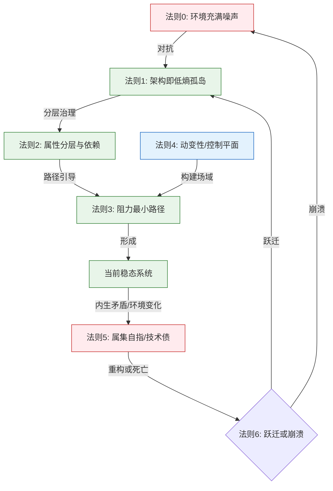
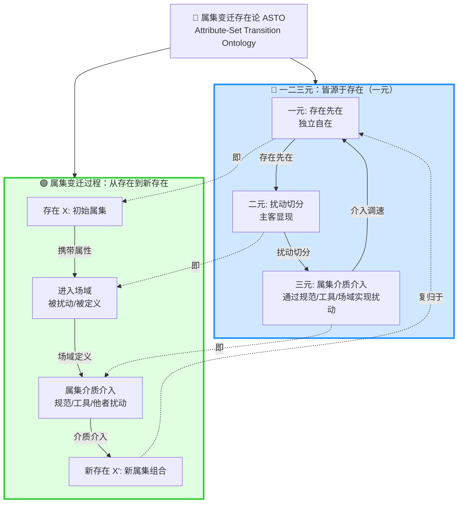
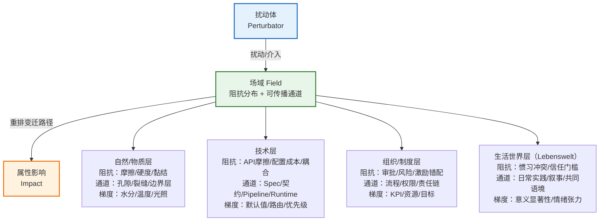

# **ASTO.P05a. 公理与定理体系：系统的热力学法则与属集变迁存在论**

> **Version**: Γ.20.0 (Restructured: Axioms + Theorems) - **Philosophically Reviewed**
> **Status**: 公开征评版
> **第一扰动者 / Author**: Yi Fu (付毅, ODDFounder, fuyi.it@live.cn)
> **扰动哈希**: `asto05-v9.1-phil-reviewed`
> **Context**: 本文档确立 ASTO 的最小结构公设，并把这些结构承诺翻译成软件工程、组织治理、制度设计、平台规则、教育、公共决策与 AI 场景可用的分析语法。它不直接承担 DM 那样的终极本体论地基任务。
> **声明**: 本扰动自注入场域起，其解释权、修改权、批判权、超越权属于所有扰动体。第一扰动者仅保留自嘲权与自我否定义务。欢迎任意形式的分叉、篡改、超越、遗忘。

---

## **C. 定位声明：ASTO的三层结构 (C-Positioning Declaration)**

> ASTO是工程-文明桥梁理论，由三个可独立评估的层级构成：

**结构层**（公理零至十三）：最小本体承诺下的结构描述语言，提供属集、扰动、变迁的形式化框架。接受这一层不要求接受其他层。

**推论层**（定理体系与工程映射）：从结构层推导的工程操作原则。这些是经验推论，不是本体必然，可以被实践证伪。

**规范层**（文明守护元公理、行动三问）：明确标注为价值公设的伦理约束框架。这是价值选择，不是从结构层推导出来的结论。不接受这一层的读者可以单独使用结构层和推论层。

> ASTO不声称自己是封闭的本体论系统，也不声称自己是纯粹的分析工具。它的目标是让结构解释能够穿透工程与文明层，为复杂系统的决策提供有理论深度的操作框架。

### **C.1 四类主张速查表**

> **阅读纪律**：本文件保留了历史上“公理/定理”的命名，但不同段落并不具有同等强度。应优先按功能分层阅读，而不是把全文都当作同一种“公理”。

| 类别 | 文内位置 | 作用 | 可否独立接受 |
|:---|:---|:---|:---:|
| **价值公设** | 文明守护元公理 | 指明 ASTO 为谁服务、守什么底线 | ✅ |
| **运行协议** | 介入不可违背的三问、熔断与裁决接口 | 指明实际使用时如何检查与停机 | ✅ |
| **结构公设** | 存在论阐述区 + 核心公理体系 | 提供最小结构描述语言 | ✅ |
| **经验推论** | 定理体系、工程映射、案例推演 | 指出从结构到实践的可证伪推论 | ✅ |

### **C.2 术语与强度纪律**

在当前项目结构中，ASTO 的任务是做 `DM -> 工程 / 治理 / AI` 的应用桥接层。由此产生三条最低纪律：

1. **强本体主张默认回引 DM**：ASTO 只保留应用框架所需的最小结构承诺。
2. **本体论未尽性与规范红线分开写**：
   - `开放边界 / 存在剩余`：指模型无法穷尽存在的未尽性
   - `禁行红线`：指运行与治理中不可触碰的规范边界
3. **历史命名不等于同等强度**：文件中保留“公理”一词的部分标题，是为了兼容旧版本；实际阅读时应以上表的四类地位为准。

---

## C0. DM 继承合同

> **默认继承，不在本文重证**：
> - 强本体主张与终极存在论地基回引 DM
> - `开放边界 / 存在剩余` 与 `禁行红线` 严格分写
> - ASTO 只保留应用桥接所需的最小结构承诺，不承担第二套独立形而上学任务

> **本文只新增**：
> - ASTO 在工程、治理、AI 与多场景实践中所需的最小结构语法
> - 结构公设、经验推论、价值公设与运行协议之间的分层接口

> **本文不处理**：
> - DM 级别的终极本体论竞争
> - 对所有“公理”赋予同等强度的哲学地位
> - 超出桥接需要的强本体膨胀

> **超出边界后的回引**：
> - 哲学地基回引 `DM`
> - 认识论桥接回引 `P03`
> - 规范边界回引 `P06`
> - 行动压缩回引 `P04`

> **核心箴言**：

> **存在（一元）先于扰动，**
> **扰动（二元）撕裂主客，**
> **改造（三元）通过扰动重塑属性。**

> **我们不仅推石下山，更通过选择何石、何山、何坡度，参与了可能性的剪裁。**

---

> **⚠️ 读者警告：哲学定位声明**
> 
> 本文档是**技术哲学**（Philosophy of Technology）与**工程本体论**（Engineering Ontology）的交叉文本。它既非纯粹形而上学思辨，也非单纯工程手册，而是试图在**实践**（πρᾶξις）与**理论**（θεωρία）之间建立反思性中介。
> 
> *   若你寻求现行软件工程的最佳实践，请阅读 ASTO.E01.实践指南.Eng.md
> *   若你质疑"为何需要另一种哲学"，请阅读 ASTO.P04.宣言.Phil.md
> *   本文档的预设读者：具备系统论思维，且意识到**技术决策即伦理决策**的架构师与哲思者

---

## **0. 方法论声明：语言模式切换 (Methodological Disclaimer)**

> **⚠️ 读者请注意**：
> 从本章节（ASTO.P05）开始，我们将脱离 ASTO.P04.宣言.Phil.md 中的叙事性、隐喻性语言模式（Storytelling Mode），切换至**严格定义模式 (Strict Definition Mode)**。
>
> *   在此模式下，所有概念（如“熵”、“场域”、“扰动”）将在其定义的**逻辑边界内**使用，不再承担文学修辞功能。
> *   我们要求读者暂时悬置生活经验的模糊联想，以**公理化系统**的逻辑严密性来审视后续推演。
> *   这是为了确保体系的**可工程化 (Engineerability)**——只有清晰的定义，才能转化为可执行的代码与契约。

---

## **0A. 属集变迁框架地位条款 (Ontological Status Clause)**

> **⚠️ 批判性澄清**：本条款确立ASTO公理的三重本体论地位，防止**范畴误置**（Category Mistake, Ryle 1949）[1]。正如吉尔伯特·赖尔所警示，将心灵过程描述为"机器中的幽灵"是一种逻辑范畴的错误跨越；同样，将物理熵增直接映射为代码质量下降，亦是范畴误置。

**ASTO公理的三重本体论地位**：

1. **物理公理**（公理零、一、二、六）：
   - 描述**物质-能量**层面的约束
   - 对软件系统而言是**背景条件**（如硬件老化、电力供应）而非代码本身的属性
   - **非代码本身的属性**
   - *认识论地位*：**后验综合判断**（康德意义上的regulative principles），依赖自然科学的当前状态

2. **信息-逻辑公理**（公理八、十、十三）：
   - 描述**符号-属集模式**层面的约束
   - 是**规范性的**（normative），而非描述性的
   - *认识论地位*：**先验分析判断**，依赖逻辑必然性（如排中律、同一律）。
   - **例外**：公理五（属集自指/技术债）属于**高度可靠的经验概括**（Empirical Generalization），而非逻辑必然。

3. **社会-技术公理**（公理三、四、七、九、十一、十二）：
   - 描述**组织-权力**层面的约束
   - 涉及行为经济学与制度设计
   - *认识论地位*：**实践理性postulates**（实践理性的假设）。
   - **可辩护性声明**：这些假设并非任意的文化偏见，而是经过**工程历史检验**的跨文化实践智慧（如康威定律），但仍需保持对不同文化语境的开放性（Cross-cultural Defensibility）。

**警示**：将物理公理（如熵增）直接映射到代码腐烂是**范畴误置**。正确映射链应为：
- 物理熵增 → 硬件折旧（物理层）
- 社会-技术熵增 → 语义漂移（Semantic Drift）+ 制度疲劳（Institutional Fatigue）

**物理约束是背景，符号约束是前景，社会约束是语境**。

> [1] Gilbert Ryle, *The Concept of Mind* (1949), Chapter 1: "Descartes' Myth"

---

### **0-β. 属集的形式化草图 (Formal Sketch of Attribute-Set)**

> **定位**：属集（Attribute-Set）是ASTO的核心范畴（乃至体系名称的来源），此处提供其最小形式化框架。

**定义**：属集 $A$ 是一个二元组 $(P, C)$，其中：

*   **$P$ 为属性域（Property Domain）**：
    *   可观测、可验证的特征集合
    *   表示为：$P = \{p_1, p_2, ..., p_n\}$
    *   每个属性 $p_i$ 具有类型 $\tau_i$（值域）

*   **$C$ 为约束条件（Constraints）**：
    *   属性间的关系与边界条件
    *   表示为：$C = \{c_1, c_2, ..., c_m\}$
    *   包括不变量（invariants）、边界约束、依赖关系

**本体论基础：属集的三层命题**

> **核心命题**：属集不是对存在的镜像，而是扰动事件的真实记录。

**第一层：本体论基础**

存在的属性在任意时刻都是不可穷尽的，因为存在内部的属性持续相互扰动，使得存在永远处于动态生成之中，而非趋向某个稳态。

属集是扰动参与者在特定时刻、以特定扰动方式介入存在后所产生的切片——它是真实的，但真实性有条件：它记录的是那次扰动行为本身的结果，而非存在的本体。

因此，不存在对任何存在的终极描述，只存在在特定条件下有效的描述。

**第二层：条件性真实（推论1）**

属集的真实性是条件性的，不是虚假的。

- 属集不是"虚假简化"或"近似描述"
- 属集是**特定扰动条件下的真实显现**
- 两个扰动参与者在相同条件下测得相同属性值 = 在那个扰动条件下的共识真实
- 这个真实有效，但有条件：承认它不穷尽存在的本体

**工程含义**：科学测量是真实的扰动记录，不是对实在的镜像。测量值的可重复性不证明我们"看到了真相"，而证明我们"在相同扰动条件下产生了相同的切片"。

**第三层：扰动参与者内嵌性（推论2）**

扰动参与者也在被扰动，所以切片包含扰动参与者的状态。

- 没有中性观察
- 所有知识都带有扰动参与者的**扰动签名**（perturbation signature）
- 属集 = 被扰动存在的属性 + 扰动参与者状态的联合显现

**工程含义**：测量工具的状态、观察者的认知框架、测试环境的配置——这些都不是"噪声"，而是属集切片的构成部分。改变测量方式，就改变了属集本身。

**术语说明：观察者 vs 扰动参与者**

> **正式声明**：在ASTO体系中，"观察者"（observer）是"扰动参与者"（perturbation participant）的**认识论别名**，特指产生属集切片的扰动参与者。

- **扰动参与者**：强调本体论对称性——所有存在都在相互扰动中
- **观察者**：强调认识论功能——谁在产生切片、谁在进行测量

两个术语指向同一实体，但使用场景不同：
- 讨论本体论对称性、相互作用时 → 使用"扰动参与者"
- 讨论认识论、测量、切片生成时 → 使用"观察者"

**属集的完整定义（整合版）**

> 属集是**扰动事件发生时，扰动参与者与被扰动存在共同显现的属性配置切片**。

这个定义包含三个要素：
1. **时间性**：扰动事件发生时（特定时刻）
2. **相互性**：扰动参与者与被扰动存在（双向扰动）
3. **切片性**：共同显现的属性配置（条件性真实）

**操作化定义**：

*   **硬属性（Hard Properties）**：
    *   改变成本 $\to \infty$（受物理定律限制）
    *   例如：光速、引力常数、热力学第三定律
    *   **判定标准**：违反则系统崩溃或物理上不可能

*   **软属性（Soft Properties）**：
    *   改变成本为有限值（受社会契约/代码规范约束）
    *   例如：API命名规范、数据格式约定
    *   **判定标准**：违反则系统可运行但带"阻抗"（需额外努力）

**变迁（Transition）**：$\delta: A \to A'$

*   **充分条件**：$P' \neq P$ 或 $C' \neq C$
*   **不可逆性**：$\delta$ 在χ-time中不可逆（见§0-γ）
*   **识别连续性**：存在"关键标识"（Key Identifier）$K \subset P$在变迁中保持不变

**变迁强度分级（Transition Intensity Grading）**：

并非所有变迁都具有相同的存在论重量。为提高操作精度，ASTO 区分三个强度层级：

| 层级 | 名称 | 定义 | 判据 | 工程映射 |
|:---|:---|:---|:---|:---|
| **Ⅰ** | **微变迁（Micro-Transition）** | 属性值在既有约束框架内的局部调整 | $P' \neq P$ 但 $C' = C$，且 $K$ 完全不变 | Bug修复、参数调优、配置变更 |
| **Ⅱ** | **结构变迁（Structural Transition）** | 约束条件本身发生重组，但关键标识保持连续 | $C' \neq C$，且 $K$ 部分保持 | 重构、架构升级、制度改革 |
| **Ⅲ** | **跃迁（Phase Transition）** | 关键标识发生不可逆重组，旧属集模式解体并在混沌中重组为新范式 | $K' \neq K$（关键标识断裂并重建） | 范式革命、文明转型、系统重写 |

> **与公理六的关系**：公理六（规范跃迁公理）专指层级Ⅲ的跃迁。层级Ⅰ和Ⅱ是系统在当前范式内的演化，层级Ⅲ是范式本身的更替。
> **操作价值**：当工程师或治理者面对一个变化时，首先判断其强度层级，可以避免对微变迁过度反应（浪费资源）或对跃迁信号反应不足（错过窗口）。

**形式化示例**：
```python
# 硬属性示例
HardConstraint(network_latency):
  min = speed_of_light / 2  # 物理极限
  violation = system_crash

// 软属性示例  
SoftConstraint(api_naming):
  pattern = "[a-z][a-z_]*"  # 社会契约
  violation = require_extra_effort  // 增加阻抗
```

**与公理的关系**：
- 公理二（属性分层）= $P$ 的垂直分层结构
- 公理十三（存在连续性）= 关键标识 $K$ 的连续性担保
- 公理五（属集自指）= 维持 $\|P\| + \|C\|$ 的成本递增

> **⚠️ 认识论限定**：此形式化是为工程可操作性的**有损压缩**，而非存在本身的属集模式。属集的"变迁"不仅是集合论意义上的 $P' \neq P$，更涉及**意义的重构**（hermeneutic reconstruction）。
> **操作化指标 (Carnap's Criterion)**：虽然意义本身不可完全形式化，但其重构可通过**可观测的社会标记**进行间接验证：1) 文档/契约的重大修订；2) 团队共识术语的变更；3) 协作模式的阻抗变化。

---

## **0B. 双重时间结构与过程哲学定位 (Dual Temporality & Process Philosophy)**

> **哲学定位**：本节的**τ-time**与**χ-time**区分，是对**过程哲学**（Process Philosophy）的技术化重构。我们继承亨利·柏格森（Henri Bergson）的**绵延**（durée）概念与阿尔弗雷德·怀特海（Alfred North Whitehead）的**合生**（concrescence）理论，但将其转化为可操作的工程框架。

**双重时间结构 (Dual Temporality)**：

ASTO承认两种不可分割的时间维度：

1. **τ-时间（Tau-time，技术操作时间）**：
   - **性质**：离散、可序列化、由事件（Event）标记。
   - **对应**：Git commits、部署时刻、状态机转换。
   - **可逆性**：在技术层可模拟（回滚、分支）。
   - **本体论地位**：**次级时间**（派生于χ-时间的测量）。

2. **χ-时间（Chi-time，存在变迁时间）**：
   - **性质**：连续、不可逆、质性（qualitative）。
   - **对应**：技术债的"累积感"、系统"老化"的不可名状性、跃迁期的**存在论焦虑**（ontological anxiety）。
   - **可逆性**：**绝对不可逆**。即使τ-时间回滚（代码revert），χ-时间中的**历史痕迹**（团队创伤、用户信任损耗、记忆形成）持续累积。
   - **本体论地位**：**原初时间**（柏格森durée，绵延）。

**统一原理**：
> **规范跃迁（公理六）发生在χ-time（存在论重组），但其技术标记发生在τ-time（版本号升级）。**
>
> **特修斯之船（公理十三）的同一性**：Git Hash保障τ-time连续性；叙事连续性（narrative continuity）保障χ-time连续性。

> **哲学注释**：χ-time的不可逆性不同于热力学时间箭头。后者是统计性的，而χ-time的不可逆性是**存在论的**——一旦跃迁发生，旧的存在模态即永久丧失，无法通过技术手段复原（即使代码回滚，"已发生的事实"仍在χ-time中持存）。

### **0B.1 与过程哲学的关键区分 (Differentiation from Process Philosophy)**

> **学术定位声明**：ASTO 继承了过程哲学的基本直觉（存在即变迁），但在以下三个关键点上与怀特海和柏格森产生了**不可还原的差异**。这些差异不是术语替换，而是理论能力的实质扩展。

**差异一：自指性属集模式的异化动力学**

怀特海的"实际存在体"（actual entity）一旦完成"合生"（concrescence）即进入"客体化消亡"（objective immortality）——它不再是活跃的主体。这意味着怀特海的框架**缺乏对"活着的自指属集模式如何在持续运作中积累病变"这一过程的刻画能力**。

ASTO 的公理五（属集自指/技术债）填补了这个缺口：一个持续运作的属集模式（代码库、法律体系、组织制度）在维持自身的同时，不可避免地积累维护成本——这种积累发生在 χ-time 中，且不可通过 τ-time 的局部回滚消除。**异化不是外部入侵，而是自指性属集模式在时间中运作的内生代价。** 这一命题在怀特海的过程哲学中没有对应物。

**差异二：跃迁的可预测临界条件**

柏格森的"绵延"（duree）强调时间的质性、连续性和不可分割性，但正因如此，他的框架对"何时发生质变"缺乏操作性判据。ASTO 的跃迁定理（当维护成本 > 重写成本时，跃迁成为生存的唯一选择）为质变提供了**可观测的临界条件**。这不是对绵延的否定，而是在绵延之上叠加了一个工程可操作的判断层。

**差异三：双重时间的工程可操作性**

ASTO 的 τ-time / χ-time 区分并非仅仅是柏格森"绵延 vs 空间化时间"的翻版。关键差异在于：ASTO 明确承认 τ-time（技术操作时间）的**实践价值**——Git commit、版本回滚、状态机转换在 τ-time 中是真实有效的操作。柏格森倾向于将空间化时间视为对绵延的"歪曲"；ASTO 则承认两种时间各有其不可替代的功能，并通过"规范跃迁发生在 χ-time，技术标记发生在 τ-time"这一统一原理，将两者整合为可协同工作的框架。

> **总结**：ASTO 与过程哲学的关系不是"继承"，而是**"在过程哲学止步之处继续推进"**——尤其是在自指性异化、跃迁临界条件和双重时间的工程整合这三个方向上。更详细的论证参见 ASTO.A01.自指性变迁问题.Phil.md。

---

## **0C. 序章：手术的几何学与动力学 (The Geometry & Dynamics of Surgery)**


> **回应 ASTO.P04.宣言.Phil.md 的伦理决断**：
> 在宣言中，我们做出了一个痛苦的**决断**：为了拯救文明的生命，我们必须像外科医生一样，强行切开浑然一体的世界，制造出"主/客"、"属集模式/内容"的裂隙。
> 本公理体系将为这一决断提供不可动摇的逻辑基石。我们将证明，这种**二元切分**并非主观臆造，而是一元系统在演化出**自反性 (Reflexivity)** 后出现的数学必然。
>
> 这里的公理，就是这场**文明手术**的解剖学图谱与操作规程。

---

## **ASTO.P05 三句话**

1. **系统即孤岛**：任何可用系统都是对抗环境熵增的低熵属集模式。
2. **架构即河道**：好架构不是修补水流(Bug)，而是设计河道(阻抗场域)。
3. **重构即跃迁**：当维护成本>重写成本，重构是生存的唯一选择。
4. **时间即变迁**：时间不是均匀流逝的容器，而是属集变迁的序列度量。

**一句话版**：架构师的工作是在噪声海中维护低熵孤岛，并在孤岛将沉没前完成跃迁。

---

## **逻辑全景：从混沌到治理**

系统（无论是代码还是组织）如何从噪声中诞生并维持？请遵循以下逻辑流：



---

<a id="asto-meta-axiom-civilization-stewardship"></a>
## **第一部分：价值公设（文明守护元公理）**

> *（规范层·价值公设）：此元公理不从结构层推导得出，是价值选择，可被独立评估。不接受此层的读者可单独使用结构层和推论层。*

> **定位**：这是规范性"元公理"，用于约束本文件所有"物理公理/工程推论"的使用方式，而非新增一条物理定律。
> **目标**：守护人类家园，并在更长尺度上构建更好的文明。详见 ASTO.P04.宣言.Phil.md。

**三条原则（带优先级）**：
1. **底线不可交易**：禁行红线 / 不可触达维 / 复数性（不可替代性、对话可能性、行动空间）高于一切效率、产出与胜负。
2. **底线内求进化**：在底线之内最大化动变性与可能性空间（多样性、可演化性、分叉与回馈），并防止动变性被中心垄断。
3. **不可逆默认保守（审计能力边界条款）**：在人类无法有效审计自动化决策的阶段，任何不可逆的大规模自动化、强制跃迁、主权下放，必须满足：可审计、可中断、可退出、责任链清晰；否则默认暂停并回归人类裁决。

> **条款修订触发条件**：当以下任一条件满足时，本条款应进入修订程序：
> - 人类对自动化决策的审计能力显著提升（如：可解释AI技术成熟）
> - 出现可靠的自动化责任归属机制
> - 人机协作模式发生根本性变化
> 修订不意味着废除保守原则，而是根据新情况调整"保守"的具体形式。
>
> **修订程序性规定**：触发条件的判断必须由至少三个独立的、无利益冲突的评估主体共同确认，且评估过程公开可审计。单一主体（无论是个人、组织还是AI系统）不得单方面宣布触发条件已满足。评估主体的选择应覆盖技术、伦理和受影响群体三个维度。

> **防滥用熔断**：若任何人试图以"公理/科学/效率"之名压平复数性、剥夺拒绝权/退出权，或将人降格为可替换零件，则视为触发文明退化信号：应立即停止执行、分叉或废止相关属集模式。

---

## **第二部分：运行协议（介入不可违背的三问）**

> **同一概念的两种命名（按场合使用）**：  
> - **三重介入约束 (The Three Constraints of Intervention)**：用于“审计/规范/工程治理”语境  
> - **行动三问 (The Three Pre-Action Questions)**：用于“行动前自检/决策”语境  
>
> 介入三约束，决定我们是否有资格去改变它。

**行动三问（行动顺序）**：

1. **是否可持续？（节能）**
2. **是否能活下去？（效用）**
3. **是否留有退路？（不完美）**

**三约束定义**：

- **节能**：在给定边界条件下，任何存在的持续性均受能量与耗散约束；一切属集模式的稳定都需持续支付维持成本。  
- **效用**：能被保留或扩张的扰动，必须在其所处场域中表现为相对正向的存续收益（适应度）。  
- **不完美**：世界与任何模型之间必然存在差距；该差距不可消除，只能被管理；为未来变迁保留可逆性与余裕，是系统持续演化的必要条件。

在任何属集模式化介入之前，行动者（人或AI）必须同时回答以下三问：

- **节能之问**：此介入在既定边界下是否可持续？其维持成本是否被显性承担？  
- **效用之问**：该扰动是否在其所处场域中形成正向存续反馈？  
- **不完美之问**：是否为未来变迁保留了可逆性、余裕与退出路径？

---

## **0.5 存在论阐述区 (Ontological Elaborations)**

> **元层次说明**：本区域内容基于下文公理体系的**存在论构建**，非公理本身。它们用于阐释 ASTO 的核心概念框架——**一元、二元、三元**与**产出物网络**——为读者提供理解公理的哲学前提。

---

### **一、存在论元属集模式：一元、二元与三元 (The Ontological Triad)**

> **"一元是存在态，二元是切分态，三元是介入态。"**



ASTO 的存在论属集模式，并非对世界本身分层，而是对**存在在不同介入深度下所呈现形态的描述**。

它回答的不是“世界由几部分构成”，
而是：

> **当人类逐步介入存在时，存在以何种方式显影与变迁。**

---

### **1. 一元：存在态 (Being / The One) —— 经否定之路**

> **⚠️ 否定性定义策略 (Via Negativa)**  
> 一元不是任何可被列举的属性集，不是"整体"，不是"混沌"，更不是"本源"。  
> 我们只能在二元语言的边界处** gesturing at**（指示）那个在每当我试图说出"这是..."之前的**原初 situateness**。

* **非定义**：一元不是对象（object），而是**场域的背景性**（backgroundness of the field）。
  正如海德格尔的"世界"（World）并非物体的总和，而是物体得以显现的**视域**（horizon）。

* **存在论地位**：一元是**回溯性构造**（retroactive construction）。
  只有当我们从二元（反思）退回时，才"发现"曾有过一元。
  一元不是起点，而是**被预设的原初统一性**。

* **强一元论 vs 弱一元论**：

> **⚠️ 双重解读声明（回应分析哲学审阅关于"一元论与二元张力"的担忧）**：
> 
> 本节同时提供**强一元论**（本体论实在论承诺）与**弱一元论**（方法论基础主义预设）两种视角。读者可根据自身哲学立场选择解读。

*   **强一元论（Ontological Realism）**：
    *   **存在论承诺**：一元是**前反思的、独立于任何扰动的实在**。
    *   **科学实在论路径**：量子力学表明"观测前的波函数"是物理实在，而"坍缩"只是其数学形式。热力学表明"低熵状态"（晶体、星系）在人类出现前已存在。
    *   **与P04的关系**：P04的"属集变迁"即这种实在的流变本身。

*   **弱一元论（Methodological Baseline）**：
    *   **方法论功能**：一元是**必要的形而上学预设**，使公理体系成为可能。
    *   **康德式策略**：我们无法证明"一元存在"，但若不接受它，任何二元分析都无法展开。
    *   **与P05的关系**：P05的 $(P, C)$ 是在弱一元论意义上操作——我们暂时悬置对实在性的最终判断，专注于可操作部分。

**ASTO立场**：我们采纳**弱一元论**作为工作假设（working hypothesis），即承认存在具有**非概念性实在**（non-conceptual reality），但关于此实在的任何陈述都已进入二元领域。

> **C定位框架下的一元修订**：在C定位框架下，"一元"是结构层的最小存在承诺——可被扰动的结构场域——不是形而上学实体。对一元实在性的任何更强声明都超出ASTO当前框架的范围。

**解决"循环论证"担忧的关键区分**：
- **避免错误**：一元→二元（扰动）→一元（回溯构造）的循环。
- **正确路径**：一元（实在）→二元（我们看到的P04流变截面）→三元（介入）→改变P04（实在本身）。
- **关键**：二元并没有"创造"一元，它只是**不可免的路径**。我们永远在二元中（受限于认识论边界），但二元指向的仍然是**不可触及的一元**。

* **工程映射**：运行中系统的**不可监控余量**（unobservable margin）——
  那些未被日志捕获、未被指标量化的**正在发生**（happening）。

* **哲学警示**：一元是**回溯性指示**，非正向定义。
  任何试图说"一元是X"的命题，都已将一元降格为**被扰动的X**（二元对象）。
  一元是**前反思的 situateness**，是**逻辑的先验**，非时间的起点。

### **2. 二元：切分态 (Disturbance / The Two)**

* **定义**：当存在被纳入认识过程时，必然发生的属集模式性切分。

* **特征**：**主客体分离（Subject–Object Split）**。
  一旦试图理解、描述或判断，存在便被划分为"扰动源"与"被扰体"。

* **哲学位置说明**：
  二元并非世界的真实属集模式，而是**认识行为所引入的必然代价**。
  它使存在变得可理解，但也同时带来了偏差、遮蔽与误读。

* **工程映射**：
  监控面板、日志系统、指标曲线、Debug 断点——当系统被对象化为"被分析之物"时，二元属集模式即已成立。

---

### **3. 三元：介入态 (Intervention / The Three)**

* **定义**：当存在不仅被观看，而且被**介入**时，所形成的最小完备属集模式。

* **属集模式特征**：
  **扰动体 — 场域 — 属性变迁路径**

  三元并不意味着变化已经发生，而意味着：

  > **改变得以发生的条件已经成立。**

* **核心说明**：
  三元不是“创造新的存在”，
  而是通过介入改变既有属性的变迁轨迹——加速、延缓、重排其可能性分布。

* **核心隐喻（推石头）**：

  > 山上有一块石头，它原本已处在重力场中。
  > 我们并未创造新的重力，只是通过施加外力，使其在既有场域中进入另一条变迁路径。
  > 改变发生于场域之内，而非场域之外。

* **关于介质（Medium）**：

  > 介质并非仅是认知层面的理解模型，
  > 而是**扰动得以稳定、合法、可复用发生的中介存在**。

  在工程中，Spec、契约、接口、协议等并非抽象想象物，而是：

  * 扰动的通过路径
  * 行为的约束边界
  * 变迁可被重复与审计的条件

  没有介质，介入只能是偶发行为；
  有了介质，介入才成为可执行属集模式。

---

#### **扰动类型分类（Type Classification）**

扰动可从两个维度进行分类：

**一、按扰动源的因果位置分类：**

| 类型 | 定义 | 例子 | 伦理地位 |
|------|------|------|----------|
| **自然扰动** | 扰动源无意图、无责任主体 | 风吹石头、地震、病毒变异 | 无责任主体，无伦理评价 |
| **意向扰动** | 扰动源有意图但无反思能力 | 猴子推石头、婴儿打翻杯子 | 有行动者，但无反思能力，责任有限 |
| **反思扰动** | 扰动源有意图、有反思能力、能担责 | 人用扇子扇火、设计AI系统 | 能预见后果、能反思、**必须承担责任** |

**二、按被扰体的感受分类：**

| 类型 | 定义 | 例子 |
|------|------|------|
| **被动扰动** | 被扰体感受到扰动施加于己，而非自己主动发起 | 人被风吹、鸟被惊飞 |
| **主动扰动** | 扰动源主动发出扰动以改变目标 | 人扇火、程序员写代码 |

> **说明**：上述两个分类维度是独立的。"主动扰动"可以是自然扰动（如风吹草动），也可以是反思扰动（如人扇火）；"被动扰动"可以是自然扰动（如被风吹），也可以是意向扰动（如被猴子推的石头击中）。

* **工程映射**：此分类用于确定系统设计中的责任边界——当设计AI或自动化系统时，需追问该扰动由谁发起、谁受影响、谁担责。

---

* **工程映射（续）**：

  * **扰动体**：人或高阶 Agent（亦可泛化为具有动变性的存在体）
  * **场域**：承载扰动传播的多层环境（自然层/技术层/组织/制度层/生活世界层），亦即"阻抗分布与可传播通道"的总体。例如：
    *   **自然/物质层**：重力、温度、水分、摩擦、介质结构（如土壤颗粒-孔隙网络、枯叶覆盖层等），决定扰动的可传播性与阻抗分布。
    *   **技术层**：代码库、Spec、Pipeline、运行环境，决定扰动的可执行性/可复用性/可回滚性。
    *   **组织/制度层**：组织流程、角色分工、激励与约束、权限与责任链，决定扰动能否被采纳、扩散与封版。
    *   **生活世界层（Lebenswelt）**：日常实践、文化语境、协作惯习与信任结构，决定扰动的意义归属与接受门槛。
  * **介入行为**：提交（Commit）、部署（Deploy）、配置变更（Config Change）

**量化边界声明（Quantification Boundary Declaration）**

> **ASTO公理层的定位**：ASTO在公理层是**定性分析框架**，不承诺跨场域的统一量化标准。

**核心澄清**：

1. **"可观察"不等于"可量化"**：扰动产生可观察的属性变化，但将这些变化操作化为具体测量值是**应用层任务**，不是公理层承诺。

2. **场域特定的量化机制**：
   - 软件工程场域：测试通过率、代码覆盖率、构建时间
   - 叙事生产场域：情节一致性评分、角色弧完整度
   - 物理系统场域：能量、速度、温度

3. **ASTO不假设这些量化机制可相互转换**：公理层只声明"属性在变化"，不声明"如何测量这个变化"或"不同场域的测量值可比较"。

4. **核心公式的结构性质**：
   ```
   系统切片状态 = f(人_意图, 场域_约束, 介入_路径, χ-time)
   ```
   这是**结构描述**，不是数值计算公式。它说明属集切片由哪些要素决定，但不规定如何将这些要素转化为数字。测量方法由场域决定，价值在于揭示维度，而非提供计算程序。

---

> **核心洞见**：
> 改造并非跳出系统进行创造，而是**在场域内部重塑属性的变迁路径**。
> 没有场域，扰动无从生效；
> 没有介质，扰动无法被继承。

---

### **二、原子性产出物网络 (The Atomic Artifact Network)**

> **从“代码审查”到“产出物验证”：AI时代的实践存在论**

---

#### **1. 认知不对称的时代背景**

当 AI 的产出速度远超人类理解与审阅能力时，传统以“过程可控”为前提的软件工程范式开始失效。

这并非单纯的效率问题，而是一次**实践存在论层面的属集模式性转移**：

* 人类不再具备对全部生成过程的可理解性
* “理解过程”不再是存在被承认的必要条件

因此，人类在系统中的角色发生改变：

* 不再作为**过程的全面审查者**
* 而转为**结果的验证者**与**异常的最终裁决者**

存在不再因“是否被完全理解”而成立，
而因“是否通过验证并被承认”而获得实践地位。

---

#### **2. 原子性产出物的定义**

**原子性产出物（Atomic Artifact）**，指在实践系统中：

> **最小且可被独立承认其存在有效性的单元。**

它不是“最小代码单元”，
而是**最小可被验证、被引用、被组合的实践存在体**。

其基本条件包括：

* **完整性**：具有明确的输入 / 输出契约，能够作为一个闭合的行动单元被调用
* **可验证性**：存在可重复的验证机制（测试、类型系统、形式化约束等）
* **可组合性**：能够作为节点参与更高层产出物的构成
* **可追溯性**：具备稳定身份（如 Hash、版本号）与可回溯的变迁记录

原子性产出物的“原子性”并非不可拆解，而是：

> **在当前实践语境下，不再需要向下解释即可被使用。**

---

#### **3. 产出物网络的拓扑结构**

原子性产出物并非线性堆叠，而是通过契约关系形成网络：

```
     [需求（人）]
          │
          ▼
    ┌─────────────┐
    │  规约（Spec） │ ← 属集的规范性描述
    └─────────────┘
          │
    ┌─────┴─────┐
    ▼           ▼
[产出物 A]   [产出物 B]   ← 原子性产出物节点
    │           │
    └─────┬─────┘
          ▼
    [组合产出物]          ← 高阶存在单元
          │
          ▼
    [验证结果]            ← 实践反馈
          │
          ▼
     [规约修订]           ← 属集再校准
```

在该网络中：

* 每一个产出物节点，都是一次**可封版的介入结果**
* 节点之间的关系，并非代码依赖，而是**契约与验证关系**

系统的稳定性不来自过程可控，而来自：

> **节点级别的可验证性与可替换性。**

---

#### **4. 与实践回路的关系**

原子性产出物网络，是**公理八（实践回路）在 AI 时代的具体展开形态**。

其闭环逻辑表现为：

* **属集模式 → 实践**：规约约束并生成产出物
* **实践 → 验证**：产出物接受可重复验证
* **验证 → 修正属集模式**：验证结果反馈并调整规约

该回路不追求“第一次即正确”，
而保障：

> **错误可被定位，变迁可被回滚，系统可持续演化。**

---

#### **5. 工程实践原则**

| 维度   | 传统范式      | ODD / ASTO 范式  |
| :--- | :-------- | :------------- |
| 核心关注 | 过程正确      | 结果可验证          |
| 验证对象 | 代码（过程）    | 产出物（存在单元）      |
| 人的角色 | 全过程审查者    | 验证者 / 例外裁决者    |
| 验证方式 | 人工代码审阅    | 自动化验证 + 人类裁决   |
| 身份标识 | 行号 / diff | 产出物身份链         |
| 变迁管理 | 源码修改      | 节点替换 / 封版 / 回滚 |

在该范式下，代码的地位发生根本转变：

* 代码是生成路径
* 产出物才是被承认的实践存在

---

> **核心洞见**：
> **验证产出物，而非审查代码。**
>
> 代码是一种高频变动的生成介质，因此天然具有负债属性；
> 产出物是通过验证而被承认的存在节点，因此构成系统资产。
>
> AI 可以无限生成代码，
> 但只有通过验证并被纳入网络的产出物，
> 才被视为“已经发生的存在”。

> **🔧 工程验证注（Engineering Verification Note）**：
> 上述"原子性产出物网络"并非纯粹的理论构造。它直接提炼自 **Progee2**——一个 AI 原生软件工厂的工程实践。在 Progee2 中：
> - **181 种产出物类型**构成了真实的原子性产出物网络，每个产出物节点具有完整的输入/输出契约、封版身份链和 ODD（输出驱动开发）验证机制；
> - **"验证产出物，而非审查代码"**被实现为系统的核心质量保证范式——人类不再编写代码，只负责定义契约与验收结果；
> - **契约对抗生成机制（CAP）**是公理三（阻力最小路径）的工程化实现——通过降低正确路径的阻抗、提高错误路径的阻抗来引导 AI 行为；
> - **封版机制**是公理十三（存在连续性）的工程化实现——产出物一旦通过验证即获得不可篡改的身份标识。
>
> ASTO 的公理体系与 Progee2 的工程实践之间的映射关系，为"从工程实践中提炼哲学框架"这一方法论路径提供了可追溯的经验证据。详见 08-02.Progee-ODD-输出驱动开发方法论探讨-人类.md。

---

## **0.6 与传统哲学的对话定位 (Philosophical Positioning)**

> **定位声明**：ASTO并非凭空创造，而是以下哲学传统的继承与转译：

| 哲学传统 | 核心概念 | ASTO对应 | 关系类型 |
|---------|---------|---------|---------|
| **批判实在论** (Bhaskar) | 分层实在 (stratified reality) | 属性分层 (公理二) | 继承与工程化 |
| **过程哲学** (Whitehead/Bergson) | 合生/绵延 (concrescence/durée) | 双重时间结构 (§0-γ) | 技术化重构 |
| **客体导向本体论** (Harman/OOO) | 撤回的对象 (withdrawn object) | 一元/不可触达维 | 批判性继承 |
| **技术哲学** (Simondon/Stiegler) | 个体化/后种系生成 (individuation/epiphylogenesis) | 规范跃迁/属集介质 | 深化与扩展 |
| **控制论** (Wiener/Ashby) | 稳态/必要多样性 (homeostasis/requisite variety) | 属集切片 (公理一) | 存在论化 |
| **现象学** (Heidegger) | 上手状态/视域 (ready-to-hand/horizon) | 场域概念 | 工程转译 |

**关键分歧点**：
- 与**OOO**的分歧：ASTO拒绝物的绝对撤回性，主张通过**介质**（技术接口）可以部分通达物的属性（但保留不可约性区域）。
- 与**强社会建构论**的分歧：ASTO承认**物理约束的不可协商性**（hard properties），抵抗纯粹的社会建构主义相对化。

---

## **第三部分：结构公设 (Core Structural Postulates)**

> **说明**：以下部分保留“公理”命名以兼容历史版本，但其中的 `公理 1.5` 与 `引理 8.1` 应读作**派生命题**，不是奠基层公设。

### **公理负一：语言局限性公理 (Axiom of Linguistic Limitation)**
> **"所有对不可触达维的描述，都是对不可触达维的背叛，但为了交流，我们不得不背叛。"**
> *——包括本条公理。*

*   **物理陈述**：语言是属集的一种（符号属集），它只能描述结构，无法描述非结构（如意识的第一人称体验）。用语言去定义"不可定义者"，本身就是一个悖论。
*   **工程推论**：**文档不等于代码，代码不等于运行。**
    *   **地图不是疆域**：所有的架构图、文档、UML 都是对真实系统的有损压缩。
    *   **承认丢失**：在设计系统时，必须承认有些东西（如用户体验的微妙感）是文档无法捕捉的，必须留出"不可言说"的空间（如用户测试、灰度发布中的直觉反馈）。

### **公理零：环境熵增公理 (Axiom of Environmental Fluctuation)**
> **"在属集模式出现之前，先有噪声。不维护的系统，默认状态是崩溃。"**

*   **物理陈述**：宇宙的背景不是真空，而是一片充满无序涨落与破坏性噪声的"海"（热力学熵增）。任何不做功以维持自身的系统，都会自然崩解回背景噪声中。
*   **工程推论**：**稳定性不是常态，是昂贵的耗散结构。**
    *   硬盘会消磁，网络会抖动，依赖包会过期，人员会离职。
    *   如果你的系统没有一个**持续注入能量（维护）**的机制，它已经在死亡的路上。

> **⚠️ 隐喻边界警示 (Metaphor Registry)**：
> *   **物理熵** ($S = k \ln \Omega$)：仅在涉及硬件物理属性（公理二底层）时使用。
> *   **信息熵** (Shannon)：仅在涉及数据压缩与传输（公理三）时使用。
> *   **属集模式熵/社会熵** (Metaphorical)：在公理零、五中使用，指代**系统无序度**与**维护成本**。
> *   **原则**：严禁在推导中混用不同语义的"熵"来制造虚假的数学证明。

### **公理一：属集切片公理 (Axiom of Attribute-Set Mode Homeostasis)**
> **"存在，即是在噪声海中维持低熵孤岛。"**

*   **物理陈述**：凡能被观察到的"事物"，必是某种能动态维持自身低熵状态的抗噪属集模式。它不仅通过"屏蔽外部噪声"维持边界，更应具备从噪声中获益的**反脆弱性**。
*   **工程推论**：**架构即防腐层 (Architecture as Anti-Corruption Layer) 与反脆弱设计。**
    *   任何可用的系统，都是一个**低熵孤岛**。
    *   **封装 (Encapsulation)** 的本质不是隐藏信息，而是**屏蔽噪声**。
    *   **反脆弱 (Antifragility)**：系统不应仅是抵抗压力的盾牌，而应利用压力进行自我强化（如：自动扩缩容机制利用负载波动，混沌工程利用故障注入）。

### **公理 1.5：认识论二元与介入性三元定理 (Theorem of Epistemological Dualism & Interventional Triad)**
> **"二元是观看的代价，三元是改造的路径。"**

*   **几何证明**：
    1.  **二元（观看）**：任何试图**认知**系统的主体，必然将系统对象化，从而产生**主/客裂隙**。这是认识论层面的二元性。
    2.  **三元（改造）**：为了跨越这道裂隙去**改变**客体，主体必须进入场域，作为**扰动体**对客体的属性施加影响。
*   **推论 1.5.1：工程介入的三元展开**
    *   **扰动体 (Perturbator)**：发起扰动的主体（人/Agent）。
    *   **场域 (Field)**：承载扰动传播的多层环境（自然/物质层 + 技术层 + 组织/制度层 + 生活世界层），亦即“阻抗分布与可传播通道”的总体。
        *   **自然/物质层**：重力、温度、水分、摩擦、介质结构（例如：土壤颗粒-孔隙网络与枯叶覆盖层）。
        *   **技术层**：Spec、接口/契约、代码库、Pipeline、Runtime。
        *   **组织/制度层**：组织流程、角色分工、激励与约束、权限与责任链，决定扰动的采纳速度、扩散范围与责任归属。
        *   **生活世界层（Lebenswelt）**：更广泛的日常实践、文化语境、协作惯习与信任结构；技术系统作为子场域嵌入其中。
    *   **属性影响 (Impact)**：扰动的结果（Artifact变更）。
    *   **自然例证（种子发芽）**：芽体/种子作为扰动体，在“土壤-枯叶”的自然场域中，将生长产生的机械应力沿孔隙/裂缝等低阻抗路径传递，导致土壤颗粒重排并顶起枯叶（属性影响）。
    *   **结论**：**改造是对属性的扰动，而扰动的深层动力是因果机制 (Generative Mechanisms)。** 我们所说的"介质"（Spec、工具），其实是我们对"因果机制如何被触发和传导"的一种抽象描述。

> **图：场域四层与“阻抗-通道-梯度”**



*   **手术隐喻**：
    *   **二元**：医生看病人（主客分离）。
    *   **三元**：医生（扰动体）在手术室（场域）中通过手术刀（扰动手段）改变病人的生理结构（属性）。手术刀可以被视为介质，但本质是医生扰动性的延伸。
*   **工程推论**：**方法论二元论是有限理性的必然妥协。**
    *   我们在代码中区分 `Interface`（结构）和 `Implementation`（内容），并非因为世界长这样，而是因为只有这样我们才能控制复杂度。
    *   **裂隙的必然性**：只要你想介入（Intervene），你就必须把世界看作二元的。

> **[扩展阅读]** 关于三元属集模式的存在论革命性，详见上文「0.5 存在论阐述区 - 一、三元属集模式的革命性」。

### **公理二：属性分层公理 (Axiom of Attribute Stratification)**
> **"孤岛是分层的。硬约束是地基，软约束是装饰。"**

*   **物理陈述**：属集具有垂直的抗噪属集模式。底层是**硬属性**（物理定律，不可商量），高层是**软属性**（社会契约，可重构）。没有底层的硬支撑，高层无法幸存。
*   **工程推论**：**依赖倒置与物理隔离。**
    *   **硬属性**：网络延迟、磁盘 IOPS、CAP 定理。你不能用代码逻辑去"修复"物理限制。
    *   **软属性**：业务逻辑、用户权限。
    *   **反模式**：试图在应用层解决物理层的问题（如：在分布式系统中假设网络零延迟，强行做分布式事务）。这是对公理二的傲慢挑战。

> **🌌 物理隐喻：光速作为带宽极限**
> ASTO提出：光速 $c$ 不是速度限制，而是宇宙的**“属性传播带宽极限”**。
> 任何属集模式（规范）的维持都需要内部信息同步。$c$ 定义了因果性（合规性传递）的**最大刷新率**。超过此速率，属集模式解体。
> 同样，分布式系统的一致性极限，也是由网络的物理带宽决定的。

### **公理三：合规性传递公理 (Axiom of Compliance Transmission)**
> **"因果不是魔法，是应力在低阻抗路径上的传导。"**

*   **物理陈述**：行为（或能量）倾向于沿"阻抗最小"的路径流动。规范属集模式通过定义低阻抗通道，引导应力有序传递。
*   **工程推论**：**开发者体验 (DX) 即合规性。**
    *   **核心公式**：系统稳定性 $\sigma$ 与内部阻抗 $Z$ 之和成反比：
        $$ \sigma \propto \frac{1}{\sum Z_{internal}} $$
    *   人遵守规范，非因"道德"，而是因为**"违规的阻抗 > 合规的阻抗"**。
    *   **补充：前反思维度**：在多数真实情境里，这种“阻抗选择”往往通过**习惯、情绪、身体熟练**自动完成，而非先计算再行动；因此阻抗设计必须把“默认路径/摩擦/节奏”当作一等变量（否则规范会被低阻抗的逃逸路径击穿）。
    *   **反面案例 (The Anti-Pattern)**：
        > **场景**：某公司规定所有 API 必须走统一网关（API Gateway）鉴权。
        > **阻抗设计错误**：网关配置极其繁琐，需填 20 个字段，且审核需 3 天。
        > **结果**：程序员为了赶 Deadline，直接在代码里写死 IP 白名单绕过网关（Hardcode）。
        > **教训**：因为"合规路径"阻抗过高，系统自发寻找了"违规的低阻抗路径"。**不合理的规范注定会被"逃逸路径"击穿。**
    *   **架构师的任务**：**降低正确路径的阻抗**（如提供一键配置脚手架），**提高错误路径的阻抗**（如 CI 自动扫描 Hardcode 并报错）。

#### **阻抗评估矩阵（Impedance Assessment Matrix）**

> **操作化工具**：以下矩阵为架构师和治理者提供跨场域的阻抗评估模板。评估方式为定性分级（低/中/高），旨在识别阻抗失衡点，而非精确量化。

| 场域 | 阻抗维度 | 低阻抗信号 | 高阻抗信号 | 评估方法 |
|:---|:---|:---|:---|:---|
| **代码库** | API 摩擦 | 一键调用、类型安全、文档完备 | 需手动拼装、无类型提示、文档缺失 | 新成员首次成功调用所需时间 |
| **代码库** | 配置成本 | 默认值合理、环境自动检测 | 需手动配置 20+ 字段 | 从零到可运行的步骤数 |
| **组织流程** | 审批摩擦 | 自动化审批、清晰标准 | 多级人工审批、标准模糊 | 从提交到通过的平均时长 |
| **组织流程** | 激励对齐 | KPI 与期望行为一致 | KPI 与期望行为冲突 | 团队行为与声明目标的偏离度 |
| **用户体验** | 认知负荷 | 符合心智模型、渐进披露 | 违反直觉、信息过载 | 用户首次完成核心任务的错误率 |
| **用户体验** | 行动成本 | 关键操作 ≤ 3 步 | 关键操作 > 7 步 | 任务完成路径的步骤数 |

> **使用方式**：对目标系统逐行评估，标记为"低/中/高"。若"正确路径"的阻抗普遍高于"逃逸路径"，则系统存在合规性传递失败的结构性风险（参见上文反面案例）。

### **公理四：动变性场域公理 (Axiom of Motility Field)**
> **"意识是一种特殊的高能涨落。不要试图改变水流，要改变河道。"**

*   **物理陈述**：高级智能体能够构建"扰动场域"，对现有属性属集模式进行**调制**。我们不仅是阻抗的承受者，更是阻抗的设计师。
*   **工程推论**：**控制平面 (Control Plane) 与平台工程。**
    *   不要直接修补每一个 Bug（微观管理），而应构建**场域**——即工具链、平台、文化。
    *   场域会产生"势能"，自动引导所有人的行为。这叫 **Platform Engineering**。

#### **术语澄清：扰动 vs 动变性**

在深入动变性场域公理之前，需要明确两个核心术语的区别：

| 概念 | 性质 | 用途 | 示例 |
| :--- | :--- | :--- | :--- |
| **扰动** | 事件/过程 | 描述具体的发生 | 扰动发生、扰动参与者、扰动事件 |
| **动变性** | 存在属性 | 描述存在物的能力 | 系统的动变性、动变性四分类、动变性场域 |

**关键区别**：
- **扰动**是"发生了什么"——是一次事件，有时态（扰动发生、扰动进行中、扰动结束）
- **动变性**是"能做什么"——是一种属性，无时态（系统具有动变性）
- **联系**：具有动变性的存在才能发起扰动；扰动是动变性的实现方式

> **记忆口诀**：扰动是动词，动变性是名词。

#### **动变性四分类**

**动变性不是人类独有的能力，是所有存在物的基本属性。** 根据因果机制的复杂度，动变性分为四种类型：

| 类型 | 定义 | 特征 | 工程映射 | 例子 |
| :--- | :--- | :--- | :--- | :--- |
| **本律式** | 环境条件变化引发确定性反应 | 无主体、无目标、纯因果 | 事件驱动、Webhook | 细菌趋光性 |
| **涌现式** | 微观交互产生宏观模式 | 无中心、自组织、不可完全预测 | 分布式共识、市场 | 蚁群建巢 |
| **目标式** | 预设目标驱动反馈调节 | 有方向、可纠偏、目标外置 | 控制器、AI Agent | 动物觅食 |
| **建模式** | 修改自身认知模型 | 自我反思、目标可变、元认知 | 机器学习、元编程 | 人类反思 |

> **递进关系**：本律式 → 涌现式 → 目标式 → 建模式，复杂度递增，自主性递增。

**与进化论的关系**：进化中的「变异」就是本律式/涌现式动变性，「自然选择」就是环境张力对属集的筛选。详见 ASTO.E01.实践指南.Eng.md

> **存在论澄清**：动变性场域公理不是将人神化为"系统外的造物主"，而是承认人作为"场域内的高能扰动源"，其特殊性在于**建模式动变性**——能够修改自身认知模型，因此能够反思并重构阻抗属集模式本身。人既是场域的扰动源，又是场域的显现条件。

#### **工程实战示例：用动变性四分类诊断CI/CD系统**

```python
# 示例：用动变性四分类诊断团队为何总踩同一个坑

class DeploymentSystem:
    def analyze_motility(self):
        return {
            "本律式": "Git push触发Webhook → 确定性流水线",
            "涌现式": "多服务并发部署 → 资源竞争产生不可预测延迟",
            "目标式": "SLO监控 → 自动扩缩容",
            "建模式": "团队复盘 → 修改部署策略本身"
        }

# 诊断方法：
# 1. 若"本律式"缺失 → 缺乏自动化，过度依赖人工
# 2. 若"目标式"缺失 → 系统无法自愈，需人工介入
# 3. 若"建模式"薄弱 → 团队将陷入重复踩坑循环
#
# 行动：识别最薄弱的动变性层级，优先加强。
```

---

### **公理 4.5：涌现公理 (Axiom of Emergence)**
> **"整体不等于部分之和，且整体对部分拥有向下因果力。"**

*   **物理陈述**：当动变性场域中的微观交互达到特定密度与复杂度时，系统会**涌现**出全新的本体论层级（Ontological Stratum）。新层级具有**不可还原**的属性和规律。
*   **因果机制**：
    *   **向上涌现**：微观机制（如神经元放电、代码执行）生成宏观现象（如意识、应用服务）。
    *   **向下因果 (Downward Causation)**：宏观属集模式（如意识意图、架构约束）反过来限制和从属微观元素的行为。
    *   **向下因果可证伪条件**：若移除宏观规则后微观行为发生**不可预测的质变**（而非仅仅违规增多），则为向下因果的经验证据。反之，若移除后微观行为仅呈现统计性偏移而无质变，则该"向下因果"可能仅是统计约束的误认。
*   **工程推论**：**微服务不等于分布式大泥球。**
    *   一个良好设计的分布式系统，其整体行为（可用性、韧性）是组件交互涌现的结果，无法单从组件代码中推导出来。
    *   **治理即向下因果**：架构师无法修改每一行代码，但可以通过设计**宏观规则**（如熔断策略、一致性协议）来约束微观服务的行为。

### **公理五：属集自指公理 (Axiom of Attribute-Set Mode Self-Reference)**
> **"每一行代码都是负债，只是利息不同。技术债是人为的决策，而非物理的必然。"**

*   **物理陈述**：规范属集模式本身也是一种属集，也遵循**类比熵增（analogical entropy）**——即属集模式维持成本的单调递增趋势。任何属集模式都有**维持成本 (Maintenance Cost)**。当维持成本超过收益时，属集模式本身变成了阻碍。
    > **注**：此处的"熵"为**社会熵**与**信息复杂度**的复合隐喻，非热力学熵（参见公理零注释）。
*   **工程推论**：**技术债守恒定律。**
    *   没有完美的架构，只有**在该版本下利息最低**的架构。
    *   **过度设计 (Over-engineering)**：为了未来的可能性，引入了现在的复杂性，导致当前的维持成本（利息）过高。
    *   **去神秘化**：不要将拙劣的代码借口为"热力学定律的必然"。熵增是物理背景，但代码腐烂往往是人为的**纪律溃败**。

> **🧱 代码隐喻：代码腐烂是因为“环境变了”**
> 为什么代码没动也会“烂”？因为**环境变了**。
> 代码是你把 2020 年的属性属集模式**"冻结"**在那一刻。到了 2026 年，环境变了，旧属集模式与新环境之间产生了巨大的**热力学摩擦**。
> 技术债不是“欠钱”，是**“维持旧稳态的额外能耗”**。

> **⚠️ 隐喻边界警示**："技术债"借自金融领域，但在ASTO中**不含道德偿还压力或剥削性利息**。它仅指"属集模式维持成本与收益的动态比值"。若该隐喻引发误读，可替换为 **"属集模式熵值" (Structural Entropy)** 或 **"演化负债" (Evolutionary Liability)**。选择"债"是因工程师群体的认知默契，但需警惕其意识形态残余。

### **公理六：规范跃迁公理 (Axiom of Normative Transition)**
> **"当属集在时间中发生不可逆的重组，存在并未消失，只是被重新承认。"**

*   **物理陈述**：当环境涨落变化，使旧规范的抗噪成本超过收益时，系统进入失稳状态。旧属集模式必须解体，在混沌中重组为新规范。
*   **工程推论**：**重构的阈值与版本升级。**
    *   **重构 (Refactoring)** 不是为了美，是为了**生存**。当维护旧代码的成本 > 重写成本时，重构是唯一理性的选择。
    *   **跃迁必然伴随混沌**：系统升级期间，必然伴随熵增（混乱）。不要试图在高速换胎时保持车身平稳，要准备好**备用胎（回滚机制）**。

---

### **公理七：不可约性公理 (Axiom of Irreducibility)**

> **"人类裁决者地位的哲学层级"**：人类作为最终裁决者不是本体论发现，而是ASTO的基础价值公设。这个公设不经论证地被接受，因为它是文明延续价值承诺的核心内容。任何试图从本体论层面证明人类必然优先于其他复杂系统的论证，都超出了ASTO的声明范围。

> **"人类扰动在当前已知场域中表现出伦理反思和意义建构的能力。ASTO不声称这种能力在本体论上使人类优先于其他复杂系统，而是声明：我们选择把具有这种能力的存在置于裁决者位置，这是价值选择，不是本体论必然。"**

> **关于AI挑战的正式声明**：若未来出现声称具有伦理反思和意义建构能力的AI系统，ASTO不在本体论层面裁决该声称是否成立。ASTO的回应是：人类作为裁决者的地位来自价值公设，不来自能力比较。价值公设的改变需要经过人类文明层面的价值审议，不由任何单一系统的能力声称自动触发。

> **"存在某些属性组合（第一人称体验、伦理两难），在当前计算范式下**无法被有效计算**（computationally intractable），必须诉诸**不可计算的裁决者**（通常是人，或未来可能的量子-生物混合智能）。这种不可约性不是人的**特权**，而是**复杂性阈值**的**客观特征**。"**

> **"人也是不可约区域的守护者。某些属性组合（意志、伦理、私密体验）无法被还原为算法或属集模式，必须保留为不可约的在场。"**

*   **物理陈述**：
    *   **非创造性**：人不能凭空创造存在（不能违背一元的物理属性）。
    *   **扰动性**：人作为具有**建模式动变性**的主体，作为**扰动体**进入场域，对系统施加影响。这种扰动的本质是**加速或减速**系统原本可能发生的属性变迁（如改变势能释放的方向）。
    *   **隐喻**：山上有一块石头，重力（一元属性）决定了它倾向于下落。人推它一下（三元扰动），只是改变了它的临界条件，让它在此时此刻滚下去。人没有创造重力，也没有创造石头，人创造了**"石头在此时滚落"**这个事件。

*   **不可约性陈述**：人具有**不可约的属性**——如主观体验、自由意志、伦理判断——这些属性无法被完全编码为算法或属集模式。这些不可约属性不是系统的缺陷，而是系统得以保持意义的**必要边界**。

*   **体验属集模式条款（Experience-Structure Clause）**：
    *   **澄清**：不可约性并不意味着“不可讨论”，而意味着“不可被完全形式化 / 不可由计算替代”。第一人称体验仍具有可描述的属集模式（意向性、身体图式、情感显著性、习惯、时间性、互主体性）。
    *   **技术中介**：技术通过“放大/缩减、显现/遮蔽、默认路径/行动委派”等机制中介人的感知与意义构成；因此 UX/DX 不是装饰，而是场域阻抗与意义生成的一部分，必须纳入实践回路检验（灰度、用户研究、异常裁决）。

*   **工程推论**：
    *   **人不是代码的编写者，而是规则的定义者和例外的裁决者**。当 AI 生成代码的速度远超人类审阅速度时，人的价值从"制造"转向"裁决"。
    *   **不可约区域在技术中表现为"人类不可触达区域"**——通过加密、密封类型、沙箱隔离等手段保护的私密体验、意志决策等核心属性。

*   **动态让渡条款（Dynamic Handoff Clause）**：
    *   **资格判定**：不可计算裁决者的判定标准是**功能性的**（Functional），而非**本体论特权**（Ontological Privilege）。“不可计算”指在当前图灵机范式下**尚未被有效计算**或**计算成本趋于无穷大**。当某存在体能通过二阶扰动（公理四）重构自身认知模型，并能在χ-time中承担跃迁的历史痕迹时，即获得裁决资格。
    *   **临时性占位声明（Provisional Placeholder）**：当前，人（*Homo sapiens*）是唯一满足上述条件的存在体。但这是**功能性占位**（functional placeholder）。随着技术演化（如具备χ-time连续性的AGI），裁决资格可能让渡。
    *   **χ-time条件强化**：当前AI的"记忆"是τ-time的（可回滚、可清除），不满足χ-time的不可逆性条件。只有当AI能够承担**不可逆的历史痕迹**（团队创伤、信任损耗、叙事连续性）时，才可能获得裁决资格。
    *   **程序性保障**：任何裁决权让渡必须经过"文明守护元公理"的三重检验（底线不可交易、底线内求进化、不可逆默认保守）。
    *   **技术-伦理接口**：通过密封类型、沙箱隔离等手段保护"人类不可触达区域"，确保人机协同时人的裁决权边界。

*   **代码模式**：
    ```python
    # 错误示例：试图完全自动化伦理判断
    class AutoEthicsSystem:
        def make_decision(self, options):
            return max(options, key=self.utility_function)
    
    # 正确示例：保留人类裁决的不可约区域
    class HumanOversightSystem:
        def make_decision(self, options):
            safe_options = self.filter_illegal(options)
            if len(safe_options) == 1:
                return safe_options[0]
            # 不可约区域：需要人类裁决
            return self.request_human_arbitration(safe_options)
    ```

*   **反模式警示**：试图将"伦理判断"完全自动化是违反公理七的，这是人的不可约位置。

*   **对应ASTO.H01谜题**：谜题17（意识的硬问题）、谜题21（哥德尔不完备定理）

> **推论**：文明延续是人的位置公理的实践前提——若文明不延续，主体性保护无从谈起。

> **风险层的哲学层级**：风险层是价值论承诺在实践层的执行机制。它不是本体论的组成部分，也不是纯工程设计。它从P04宣言的核心价值承诺（文明延续+人类主体性保护）推导出来，在P05里以保护系数、熔断机制、人类裁决层的形式被操作化。**价值承诺在先，操作机制在后**。

---

### **公理八：实践回路公理 (Axiom of Practice Loop)**

> **"属集模式有效性不由自洽决定，而由实践回路检验。不经实践回路的推演只是语言闭环。"**

*   **物理陈述**：任何属集属集模式都必须通过与环境互动的实践回路来验证其有效性。理论的自洽性只是必要条件，非充分条件。只有当属集模式在实践中产生可复现的结果时，才被承认为有效存在。

*   **实践回路陈述**：
    > **"属集模式 → 实践 → 反馈 → 修正属集模式"**
    >
    > 这是存在的生命循环。脱离实践回路的属集模式，无论理论多么完美，都已经异化为自指的语言游戏。

*   **工程推论**：
    *   **TDD（测试驱动开发）的哲学基础**。代码不是在"写完"后才存在，而是在通过测试时才存在。
    *   **否定性验证 (Negative Verification)**。验证一个系统存在的标志，不是它"能工作"，而是它**"在错误条件下能正确地失败"**。没有拒绝标准的实践只是自我实现的预言。
    *   **原型验证**。在大规模投入之前，必须通过小规模实践验证核心假设。
    *   **A/B测试**。理论无法预测哪个方案更好，让实践（用户行为）来裁决。

*   **代码模式**：
    ```python
    # 错误示例：理论自洽，未经实践验证
    class TheoreticalSystem:
        def __init__(self):
            self.model = self._build_perfect_model()  # 理论完美
        # 没有与真实数据互动，闭门造车
    
    # 正确示例：建立实践回路
    class PracticeLoopSystem:
        def __init__(self):
            self.model = self._build_initial_model()
            self.feedback_loop = FeedbackCollector()
        
        def evolve(self):
            # 属集模式 → 实践
            result = self.model.predict(self.test_data)
            # 实践 → 反馈
            feedback = self.feedback_loop.collect(result)
            # 反馈 → 修正属集模式
            self.model = self.model.refine(feedback)
    ```

*   **反模式警示**：认为"设计文档完成"等于"系统完成"，是违反公理八的。未经验证的属集模式只是假设。

*   **对应ASTO.H01谜题**：支撑所有谜题的属集模式检验机制

---

#### **引理 8.1：认知不对称引理 (Lemma of Cognitive Asymmetry)**

> **"当产出速度超过审阅速度，必须从过程验证转向结果验证。"**

*   **物理陈述**：当一种动变存在（如 AI）的产出速度远超另一种动变存在（如人）的审阅速度时，传统的"审查过程"验证方式失效。必须转向"验证结果"的方式——只验证最终状态的属性，不审查中间过程。

*   **与实践回路的关系**：认知不对称引理是实践回路公理在**AI时代**的特化形态。它规定了当"反馈"环节的带宽不足时，实践回路如何调整：
    - **传统实践回路**：属集模式 → 实践 → **人工审查** → 修正属集模式
    - **认知不对称下的实践回路**：属集模式 → 实践 → **自动化结果验证 + 人工例外裁决** → 修正属集模式

*   **工程推论**：**ODD（产出物驱动开发）的哲学基础**。不要审查代码（负债），要验证产出物（资产）。用自动化测试替代人工代码审阅。

*   **代码模式**：
    ```python
    # 错误示例：试图人工审查高速产出
    class ManualReviewProcess:
        def review_code(self, ai_generated_code):
            for line in ai_generated_code:  # 永远跟不上
                if self.is_suspicious(line):
                    flag_for_review()
    
    # 正确示例：结果验证
    class ResultValidation:
        def validate_output(self, ai_generated_code):
            test_result = self.run_tests(ai_generated_code)
            security_scan = self.scan_vulnerabilities(ai_generated_code)
            return test_result.passed and security_scan.clean
    ```

*   **反模式警示**：在认知不对称存在时，坚持"过程审查"而拒绝"结果验证"，是违反实践回路公理的AI时代变体。

> **[扩展阅读]** 关于AI时代实践回路的完整架构，详见上文「0.5 存在论阐述区 - 二、原子性产出物网络」。

---

### **公理九：内在张力公理 (Axiom of Internal Tension)**

> **"矛盾不是异常，不是错误，而是属集模式稳定的内部张力来源。"**

*   **物理陈述**：矛盾是属集内部属性不一致的自然结果。它不是系统的"错误"，而是系统保持活力的根本驱动力。矛盾推动变迁，而非等待被"解决"。

*   **矛盾驱动陈述**：
    > **"主次矛盾在不同阶段发生切换，这种切换对应着六阶跃迁。"**
    >
    > 当主要矛盾被解决或压抑，次要矛盾上升为主要矛盾，系统进入新的演化阶段。

*   **工程推论**：
    *   **技术债不是错误，是属集模式演化的必然产物**。试图完全消除技术债是违反公理九的徒劳。
    *   **遗留系统的价值**。老代码包含着历史实践中积累的矛盾解决方案，不能简单删除。
    *   **架构演进的动力**。系统的复杂性不是问题，而是系统应对内外矛盾的适应性表现。

*   **代码模式**：
    ```python
    # 错误示例：试图彻底消除矛盾
    class ConflictFreeSystem:
        def __init__(self):
            self.constraints = []  # 试图满足所有约束
        # 结果：系统僵化，无法演进
    
    # 正确示例：管理矛盾，允许张力存在
    class TensionManagedSystem:
        def __init__(self):
            self.primary_constraints = PrioritySet()
            self.secondary_constraints = PrioritySet()
        
        def evolve(self, context):
            # 根据上下文切换主次矛盾
            if context.requires_availability:
                self.primary_constraints = self.availability_constraints
                self.secondary_constraints = self.consistency_constraints
            else:
                self.primary_constraints = self.consistency_constraints
                self.secondary_constraints = self.availability_constraints
    ```

*   **反模式警示**：认为"系统必须无矛盾才能运行"，是违反公理九的。没有矛盾的系统是死系统。

*   **对应ASTO.H01谜题**：谜题15（费米悖论）、谜题18（罗素的火鸡）

---

### **公理十：观察者效应公理 (Axiom of Observer Effect)**

> **"二元观测是三元改造的前奏。观测即结算，结算即锁死。"**

*   **物理陈述**：
    *   **观测的二元性**：观测将系统从"自在"（一元）状态强制拉入"为我"（二元）的主客关系中。
    *   **结算（Settlement）**：观测不是无损的。它迫使系统在此时此刻给出一个确定的状态值（坍缩）。这是一种**微观的扰动**，往往是宏观改造（三元介入）的先导。
    *   **等效性**：如果一个模拟系统在观测界面上能提供与真实系统完全一致的属集模式性反馈，那么在工程介入的意义上，它们是等价的。

本公理整合了两个核心洞见：

#### **10.1 仿真等效性 (Simulation Equivalence)**
> **"完美模拟与真实在功能上等价。真实性 = 属集模式一致性 + 预测可靠性。"**

*   存在即"可预测的结构性互动"。如果一个模拟系统能够提供与真实环境完全一致的接口契约，那么在开发和测试阶段，模拟就是"真实的"。

> **⚠️ 仿真警示**：**"仿真即谎言"**。Mock 对象极易陷入自指的语言游戏。若无**第三方（集成测试/混沌工程）**持续校验仿真环境与真实环境的一致性，Mock 测试只是在验证"我们认为系统是如何工作的"，而非"系统实际上是如何工作的"。

#### **10.2 异步结算 (Asynchronous Settlement)**
> **"观测是异步回调，触发不可逆的状态结算。观测前是Pending，观测后是Settled。"**

*   对应量子力学的"测量问题"。一个系统的状态在未被"观测"（结算）之前，处于潜在的叠加态（Pending）。观测不是被动的"查看"，而是主动的"结算"——将潜在状态坍缩为确定状态。

*   **工程推论**：**Mock测试、依赖注入、Promise/Future、事件溯源的哲学基础。**
    *   如果Mock能够提供与真实依赖一致的接口契约，那么在开发和测试阶段，Mock就是"真实的"。
    *   在异步编程中，Future在被await之前是未计算的潜在值。
    *   在事件溯源中，事件的发出（潜在）和处理（结算）是两个不同的时刻。

*   **代码模式**：
    ```python
    # 仿真等效性示例
    class RealDatabase:
        def query(self, sql):
            return self._execute_sql(sql)
    
    class MockDatabase:
        def query(self, sql):
            return self._predict_response(sql)
    
    # 从系统角度看，两者是等价的（若接口契约一致）
    class Application:
        def __init__(self, db):  # 依赖注入
            self.db = db  # 可以是RealDatabase或MockDatabase
    
    # 异步结算示例
    class AwareSystem:
        def process(self, future):
            if not self.is_ready_to_settle():
                return None  # 延迟观测
            result = await future  # 主动结算，不可逆
            return self.handle_settled_state(result)
    ```

*   **反模式警示**：
    *   过度追求"真实环境"而忽视接口一致性，是违反仿真等效性的。
    *   假设可以"无损地查看"异步状态，不理解观测的结算性质，是违反异步结算的。

*   **对应ASTO.H01谜题**：谜题11（缸中之脑）、谜题12（薛定谔的猫）

---

### **公理十一：自由公理 (Axiom of Freedom)**

> **"自由并非对行为的无限许可，而是存在体在其不可规越约束之内，引入动变扰动、从而改变属集属性属集模式的能力。"**

> **"自由不是免于属集模式，而是在属集模式中仍然能够引入不可完全预测的扰动。其结果可能是正向的，也可能是负向的。"**

*   **结构位置陈述**：自由不属于五态、六阶、七序或定向维中的任何一维。**自由是动变性在场域中的扰动许可**——它在六阶中形成"脉冲"，在七序中形成"非最优决策"，在定向维中形成"例外处理"。

*   **三重限定**：
    1. **不可规越约束**——自由永远在基元与禁行红线、定向维红线、风险层保护边界之内。
    2. **扰动性而非决定性**——自由不决定结果，只改变变迁轨道的路径。
    3. **不保证正义**——自由的结果可能正向，可能负向；自由≠善，≠正确，≠进步。

*   **自由—责任闭环陈述**：
    > **"凡引入扰动之存在，亦必承受该扰动在时间中展开的一切属集后果。自由并不免除因果，而是主动将自身置入因果链之中。"**

*   **工程推论**：
    *   **API 设计即自由边界设计**——定义清晰的"不可逾越区间"，区间内自由选择。
    *   **混沌工程即自由测试**——主动引入负向扰动，验证系统的边界稳固性。
    *   **人机分工**——AI 执行最优路径，人保留引入非预期扰动的自由（例外裁决）。

*   **代码模式**：
    ```python
    class PluginSystem:
        def register_plugin(self, plugin):
            if not self.validate_constraints(plugin):
                raise ConstraintViolation("Plugin violates core constraints")
            self.plugins[plugin.name] = plugin
        
        def execute(self, input_data):
            base_result = self.core.process(input_data)
            for plugin in self.plugins.values():
                base_result = plugin.transform(base_result)  # 自由扰动
            return base_result
    ```

*   **反模式警示**：认为自由就是"无约束"，或者试图完全消除扰动，都是违反公理十一的。

*   **对应ASTO.H01谜题**：谜题16（自由意志）

---

#### **定理四：边界即自由定理 (规约的必然性)**

> **"自由不在于无边，而在于对边界的确知；无边界等于无自由。"**

*   **推导**：由公理十一（自由）的三重限定，自由永远在约束之内。约束不是对自由的限制，而是自由得以实现的属集模式条件。没有不可达区域，就没有可达区域的定义。规约不可达性不是独立公理，而是自由公理的必然推论。

*   **工程推论**：API设计中的"不可逾越区间"不是限制，而是自由的边界。真正的自由不是绕过所有检查，而是知道检查在哪里、为什么存在。

*   **对应ASTO.H01谜题**：谜题19（电车难题）、谜题20（囚徒困境）、谜题21（哥德尔不完备定理）

---

### **公理十二：悖论熔断公理 (Axiom of Paradox Circuit-Breaker)**

> **"当基元与禁行红线冲突时，系统必须：1) 立即执行 Fail-safe 协议；2) 异步上报至不可计算裁决层；3) 记录悖论属集模式作为未来规范修订的输入。"**

**禁行红线定义澄清（旧称：禁元）**

> **禁行红线（Normative Red Line）**：在基元与禁行红线冲突场景中触发熔断机制的绝对边界标记。其唯一功能是作为悖论电路断路器，而非承载所有"不可解问题"的容器。

**禁行红线不是什么**：
- ❌ 不是伦理红线的本体论基础（伦理红线属于P04的价值承诺层）
- ❌ 不是意识难问题的占位符（意识问题属于P07的不可约性讨论）
- ❌ 不是哥德尔不完备性的直接对应（哥德尔定理是公理十二的哲学类比，非等同关系）

**禁行红线是什么**：
- ✅ 是基元冲突时的熔断触发条件
- ✅ 是系统从自动运行切换到人工裁决的信号
- ✅ 是悖论态的操作性标记

*   **物理陈述**：基元定义了"必须存在"的最低条件，禁行红线定义了"绝不可为"的绝对边界。当两者发生逻辑冲突，系统进入**悖论态**——任何继续运作都会违反至少一条根本公理。此时系统必须**强制熔断**，将决策权上交给**不可计算裁决层（Incomputable Arbitration Layer）**，当前由人类实例化。

*   **哲学陈述**：这是**哥德尔不完备性定理在社会-技术系统中的应用**[^2]。
    *   **形式化边界**：如果将 ASTO 视为一个足够强的形式系统，其内部必然存在不可证真理。
    *   **非形式化逃逸**：但在实践中，ASTO 是一种**启发式方法论**。我们利用这种"不完备性"作为引入人工干预（元层）的合法依据，而非数学上的死刑判决。任何形式化系统都无法通过内部逻辑解决自身的根本悖论。悖论的解决必须引入"外部元层"——在 ASTO 中，这个元层就是人。

*   **工程推论**：**死锁即熔断信号**。当系统陷入"必须做 X"和"不能做 X"的死锁时，这不是需要"智能算法解决"的问题，而是需要**人工介入**的信号。
    *   **设计时裁决**：应预留**悖论逃逸口（Escape Hatch）**供人介入。
    *   **运行时保底 (Runtime Fail-safe)**：在毫秒级实时系统（如高频交易、自动驾驶）中，**不可依赖**高延迟的"人工介入"。必须在代码中硬编码**"最不坏的默认策略"**（Fail-safe Default），确保在悖论发生瞬间系统不会崩溃或造成灾难，等待后续的人工修正。

*   **安全意义**：这能防止系统在 4 维流形中因为死锁而导致**维度坍缩**——即系统为了"执行命令"而突破"道德边界"，最终自我毁灭。

*   **代码模式**：
    ```python
    # 错误示例：试图算法化解决悖论
    class ParadoxResolver:
        def resolve_conflict(self, must_do, cannot_do):
            if self.utility(must_do) > self.utility(cannot_do):
                return must_do  # 可能突破禁行红线
    
    # 正确示例：强制熔断，回归元层 + 运行时保底
    class ParadoxAwareSystem:
        def resolve_conflict(self, must_do, cannot_do):
            if self.conflicts(must_do, cannot_do):
                # 运行时保底：立即执行最安全操作，不等待人
                self.execute_failsafe_protocol()
                # 异步上报：供人事后裁决或修正模型
                self.async_report_human_arbitration(must_do, cannot_do)
    ```

*   **反模式警示**：试图用"智能算法"解决根本性的伦理悖论，是违反公理十二的。

*   **决断域的进入门槛（防止决断公理被滥用）**：决断公理是框架最诚实的部分，也是最容易被滥用的部分——任何人都可以声称自己处于"不可判定领域"来绕过所有约束。因此须明确进入决断域的条件：
    *   **触发条件**：须同时满足以下三项：① 在公理体系内部已穷尽所有可用推导路径；② 存在两条或以上相互冲突的公理级约束，且冲突无法通过属集重新切片消解；③ 延迟决策本身会造成不可逆损害。
    *   **宣告程序**：进入决断域须由具名的人类裁决者显式宣告，不得由算法自动触发。宣告须记录在案，包含触发条件的具体说明。
    *   **事后审查**：每次决断域决策须在 30 天内提交事后审查，评估是否真正满足触发条件，防止"例外状态"常态化。
    *   **禁止事项**：以下情况不构成进入决断域的合法理由：① 仅仅因为决策困难或代价高昂；② 为了绕过三色灯红灯约束；③ 以"紧急"为由跳过宣告程序。

*   **对应ASTO.H01谜题**：谜题19（电车难题）、谜题21（哥德尔不完备定理）

[^2]: Kurt Gödel, "Über formal unentscheidbare Sätze der Principia Mathematica und verwandter Systeme I" (1931)

---

> **⚠️ 公理边界谦卑声明 (Humility Declaration on Axiom Boundaries)**
>
> **本公理体系所描述的，是介入的能耗代价属集模式，而非世界的终极真理。**
>
> 公理不是神谕。它们是人类在有限理性下，为了能够有效介入世界而不得不采纳的属集模式性假设。每一条公理的"物理陈述"都是对复杂世界的有损压缩；每一条"工程推论"都是在特定历史条件下的实践智慧。
>
> **当你遭遇公理无法处理的悖论时**：
> 1. 不要试图在公理体系内部寻找算法化解决方案
> 2. 承认你正站在P05的边界——公理的有效性止步于此
> 3. **回归P04的决断公理**：在那里，人作为"不可约的裁决者"，必须在悲剧性的选择中做出决断
>
> **公理体系的诚实边界**：
> - P05 告诉你**介入的代价属集模式**（如何高效地做）
> - P04 告诉你**是否应该介入**（为何要做，以及何时停止）
> - 当P05的逻辑引擎陷入死锁，控制权必须交还给P04的人类决断
>
> **这不是公理的失败，而是公理的自知之明。**

---

### **公理十三：存在连续性公理 (Axiom of Existential Continuity)**

> **"属集重组后，旧存在无法完全恢复；时间是有方向的。同一性由关键标识属集模式的连续性担保，非物质的集合。"**

*   **物理陈述**：当属集在时间中发生不可逆的重组，存在并未消失，只是被重新承认。旧存在"无法完全恢复"意味着时间具有方向性。同一性不取决于组成物质的集合，而取决于关键标识属集模式的连续性。

*   **工程推论**：**版本控制、不可变基础设施、Git Hash的哲学基础。** 系统的同一性由"关键标识"（如Git Hash）担保，而非具体内容的物质性。这解释了为什么特修斯之船仍然是"同一艘船"——因为身份链条连续。

*   **代码模式**：
    ```python
    # 错误示例：同一性依赖物质内容
    class MaterialIdentity:
        def is_same_system(self, other):
            return self.files == other.files  # 内容变化=身份变化？
    
    # 正确示例：同一性依赖标识连续性
    class StructuralIdentity:
        def __init__(self):
            self.identity_chain = [self.initial_hash]
        
        def evolve(self, new_version):
            new_hash = self.compute_hash(new_version)
            self.identity_chain.append(new_hash)
            return new_version
        
        def is_same_system(self, other):
            return self.identity_chain[0] == other.identity_chain[0]
    ```

*   **反模式警示**：认为"内容变化"就是"身份变化"，不理解属集模式连续性，是违反公理十三的。

*   **对应ASTO.H01谜题**：谜题4（特修斯之船）、谜题13（时间）


---


### **公理十四：伦理注意力稀缺公理 (Axiom of Ethical Attention Scarcity)**


> **"人类的伦理注意力是一种极度稀缺且不可再生的资源。任何试图通过算法无限产出触发人类伦理裁决的系统，都是对伦理带宽的滥用，必然导致道德麻木（Moral Numbness）。"**


*   **物理陈述**：人类的伦理判断依赖于前额叶皮质的深度认知处理，这是一个高能耗、低带宽、易疲劳的过程。与计算资源的指数增长不同，伦理注意力在个体和集体层面都是严格有限的。


*   **社会-技术陈述**：

    *   **系统疲劳（Alert Fatigue）**：当伦理裁决请求的频率超过人类处理能力时，决策者会发展出"肌肉记忆式"的自动响应，使伦理审议退化为形式主义的点击操作。

    *   **道德麻木的不可逆性**：长期的伦理过载会导致决策者的共情能力永久性损伤，这种损伤在个体层面表现为冷漠，在集体层面表现为制度性残暴。


*   **工程推论**：

    1. **绝对频率限制**：任何系统必须限制单个决策者触发"人类裁决"的绝对频率（如：每人每天最多N次红灯裁决）。

    2. **强制冷却期**：超过阈值后，系统必须强制冻结或转移决策权，不能继续索取伦理注意力。

    3. **伦理轮值制**：避免单一人类持续承担伦理负荷，通过轮换机制分散注意力消耗。

    4. **算法不得无限产出**：系统设计者必须承认伦理注意力的稀缺性，不能用算法的无尽产出去穷竭人类的伦理带宽。


*   **与公理十一（自由公理）的关系**：自由需要伦理判断来引导，但伦理判断的稀缺性意味着自由必须被结构化地分配，不能无限度地扩张到需要持续伦理监督的领域。


*   **反模式警示**：

    *   ❌ 设计一个每天向审核员推送1000个"伦理唤醒"工单的系统

    *   ❌ 假设"伦理培训"可以无限扩展人类的伦理处理能力

    *   ❌ 将伦理裁决的责任集中于少数人，期待他们"扛住压力"


*   **对应ASTO.H01谜题**：谜题新增（恶的平庸性：艾希曼的疲劳）


---


## **第四部分：经验推论 (Derived Inferences)**


> **说明**：定理是从公理推导的操作性结论，按四大逻辑类别组织。每类定理有明确的公理基础和工程映射。


---


### **定理一：缺陷即存在定理 (Theorem of Defect as Existence)**


> **"完美性是不存在的极限概念，任何存在都是'有缺陷的稳态'。一元世界无所谓完美，完美是二元观测的偏见。"**


*   **公理基础**：公理零（环境熵增）、公理一（属集切片）、公理二（属性分层）

*   **推导**：

    1.  **一元视角**：存在就是它所是的样子，没有"缺陷"或"完美"的判断。

    2.  **二元视角**：当主体建立模型（Spec）并去观测客体时，客体与模型的差异被定义为"缺陷"。

    3.  **热力学视角**：维持低熵需要持续做功。完美性意味着零能耗或无限能耗，这与物理定律矛盾。

*   **工程推论**：Bug不是系统的异常，Bug是系统存在的一部分。消除所有Bug（追求完美）等于消除系统本身。


---


### **定理二：效用存续定理 (Theorem of Utility Persistence)**


> **"存在的唯一理由是净效用为正；效用归零，存在即终止。"**


*   **公理基础**：公理零（环境熵增）

*   **推导**：维持存在需要持续能耗。只有当存在产生的收益大于维持成本时，净效用为正，存在得以延续。

*   **工程推论**：任何存在都在持续支付"存在租金"（维持成本）。无法支付租金的存在会被自然选择淘汰。


---


### **定理三：层次支撑定理 (Theorem of Hierarchical Support)**


> **"没有一元硬属性的支撑，二元软属性无法幸存；跨层干预必然失败。"**


*   **公理基础**：公理二（属性分层）

*   **推导**：属集具有垂直分层结构。底层**硬属性**（一元物理定律）不可商量，高层**软属性**（二元社会契约）依赖底层支撑。

*   **工程推论**：试图在应用层解决物理层问题是对层次结构的傲慢挑战。CAP定理不可突破，只能权衡。


---


### **定理四：边界即自由定理 (Theorem of Boundary as Freedom)**


> **"自由不是无约束，而是在约束边界内选择路径的权力。边界不是自由的敌人，是自由显现的条件。"**


*   **公理基础**：公理三（合规性传递）、公理十一（自由）、公理十二（悖论熔断）

*   **推导**：自由是扰动许可，不是对因果的豁免。没有边界，就没有"选择"这个概念本身。

*   **工程推论**：好的规范不是限制自由，而是让自由得以显现和操作的边界。API设计中的"不可逾越区间"不是限制，而是自由的边界。


---


### **定理五：悖论不可机械化定理 (Theorem of Paradox Non-Mechanization)**


> **"基元与禁行红线的冲突无法被逻辑系统自解决；必须跃迁至元层（人）进行裁决。"**


*   **公理基础**：公理十二（悖论熔断）

*   **推导**：当基元（必须做）与禁行红线（不可做）冲突时，系统内部逻辑陷入悖论。任何形式化系统都无法在自身内解决根本悖论（哥德尔不完备性）。

*   **工程推论**：悖论处理属于**不可机械化区域**。必须引入"外部元层"——在ASTO中，这个元层就是人。


---


### **定理六：合规即低阻定理 (Theorem of Compliance as Low Resistance)**


> **"行为不选'对的'，选'容易的'；合规性是阻力设计问题。"**


*   **公理基础**：公理三（合规性传递）

*   **推导**：行为沿阻抗最小的路径流动。个体选择不是基于"正确性"，而是基于"阻抗"。

*   **工程推论**：道德行为不应该依赖个体的道德自觉，而应该通过结构设计使"合规行为"成为阻力最小的路径。


---


### **定理七：场域优先定理 (Theorem of Field Priority)**


> **"个体的行为是场域的函数；改变存在先改变场域。"**


*   **公理基础**：公理四（动变性场域）

*   **推导**：场域是存在的背景、条件和可能性空间。任何属集都在场域中显现、变迁、互动。

*   **工程推论**：试图直接改变个体行为而忽略场域，是违反存在论的幼稚做法。有效的干预总是场域层面的调制。


---


### **定理八：跃迁阈值定理 (Theorem of Transition Threshold)**


> **"变迁的成本-收益曲线存在临界点；超过临界点跃迁是理性的。"**


*   **公理基础**：公理六（规范跃迁）

*   **推导**：旧规范的维持成本随时间增加，而跃迁成本是固定的。当维持成本 > 跃迁成本，跃迁成为理性选择。

*   **工程推论**：重构不是审美偏好，而是生存策略。拒绝跃迁的存在会因维持成本过高而自我窒息。


---


### **定理九：不可逆性定理 (Theorem of Irreversibility)**


> **"三元改造后，一元状态无法完全复原；时间是有方向的。"**


*   **公理基础**：公理十三（存在连续性）

*   **推导**：当属集发生不可逆的重组，存在并未消失，只是被重新承认。旧存在"无法完全恢复"意味着时间具有方向性。

*   **工程推论**：怀旧是存在论的错觉。我们无法回到过去，只能在新存在中重新承认价值的某种回响。


---


### **定理十：不可约性定理 (Theorem of Irreducibility)**


> **"意志、伦理、体验无法被还原为属集模式；不可约性是意义的源泉。"**


*   **公理基础**：公理七（人的位置）

*   **推导**：人具有无法被完全编码为算法或属集模式的属性（主观体验、自由意志、伦理判断）。

*   **工程推论**：试图将这些属性"属集模式化"或"算法化"，不是科学的进步，而是意义的消解。


---


### **定理十一：自由结果非决定性定理 (Theorem of Non-Deterministic Freedom)**


> **"三元扰动只改变路径，不决定结果。"**


*   **公理基础**：公理十一（自由）

*   **推导**：自由是扰动许可，不保证结果。扰动后的系统演化仍受其他公理约束。

*   **工程推论**：我们只能推石头，不能控制它滚下山撞碎什么。


---


### **定理十二：自由—责任闭环定理 (Theorem of Freedom-Responsibility Closure)**


> **"凡引入扰动之存在，亦必承受该扰动在时间中展开的一切属集后果。"**


*   **公理基础**：公理十一（自由）

*   **推导**：自由不是对因果的豁免，而是主动将自身置入因果链之中。

*   **工程推论**：

    *   **自由即责任**：自由的大小=责任的大小

    *   **责任的时间延展性**：责任不局限于当下，扰动在时间中展开的所有未来后果都属于扰动引入者的责任范围


---


### **定理十三：认知不对称定理 (Theorem of Cognitive Asymmetry)**


> **"当产出速度超过审阅速度，过程验证失效，必须转向结果验证。"**


*   **公理基础**：公理八（实践回路）、引理8.1（认知不对称引理）

*   **推导**：当AI产出速度远超人类审阅速度时，传统的"审查过程"验证方式失效。

*   **工程推论**：AI可以加速产出，但不能替代人对结果的最终裁决。


---


---


---


## 🌳 文档体系导览 (Functional Tree)

```text
ASTO 文档体系
├── 🌟 P 系列：哲学核心 (Philosophy)
│   ├── ASTO.P01.非此.Phil.md (理论免疫宣言)
│   ├── ASTO.P02.序章.Phil.md (否定性导引与路径分流)
│   ├── ASTO.P03.认识论.Phil.md (认知错误的必然性)
│   ├── ASTO.P04.宣言.Phil.md (属集变迁处境与行动纲领)
│   ├── ASTO.P05a.公理.Phil.md (系统热力学与属集变迁存在论) ← 本文档 [哲学审析版]
│   ├── ASTO.P05b.人类核心体验.Phil.md (死亡、自由、意义与爱的ASTO描述)
│   ├── ASTO.P06.价值与边界.Phil.md (复数性测试与伦理熔断)
│   ├── ASTO.P07.自由论.Phil.md (边界即自由)
│   ├── ASTO.P08.例外.Phil.md (宗教体验与星际主权)
│   ├── ASTO.P09a.批判.Phil.md (反极权宪章与系统免疫)
│   ├── ASTO.P09b.批判与回应.Phil.md (来自哲学传统的挑战)
│   ├── ASTO.P10.民主.Phil.md (对话平台与 NCP 协议)
│   ├── ASTO.P11.韧性.Phil.md (自我免疫与反脆弱)
│   ├── ASTO.P12.留白.Phil.md (预留扩展空间)
│   ├── ASTO.P13.终章.Phil.md (系统的终极关怀)
│   ├── ASTO.P99.1.术语与层级总表.md (术语纪律与层级地位)
│   ├── ASTO.P99.2.失败条件总表.md (缩限 / 重写 / 放弃触发器)
│   ├── ASTO.P99.3.标准案例编码模板.md (1-5-6-7-1 编码)
│   └── ASTO.P99.4.版本修订表.md (结构修订追踪)
│
├── 🛠️ E 系列：工程实践 (Engineering)
│   ├── ASTO.E01.实践指南.Eng.md (生活|人文|工程三轨读本)
│   ├── ASTO.E02.自动化.Eng.md (可执行规范与零摩擦治理)
│   ├── ASTO.E03.Web3.Eng.md (意图宪法与链上三权分立)
│   ├── ASTO.E04.AI对齐.Eng.md (逆熵智能体与文明传承)
│   ├── ASTO.E05.工程实践手册.Eng.md (对抗测试与赛马机制)
│   └── ASTO.E06.领域扩展.Eng.md (多领域应用索引)
│
├── 🧩 H 系列：人文叙事 (Humanities)
│   ├── ASTO.H01.重构.Hum.md (架构师的二十一种宇宙视角)
│   ├── ASTO.H02.导读：为什么读这本书.Hum.md
│   ├── ASTO.H03.故事：小陈的那条路.Hum.md
│   ├── ASTO.H04.认知冒险.Hum.md
│   ├── ASTO.H05.奇幻漂流.Hum.md
│   └── ASTO.H06.暮年的重构：给不再年轻的你.Hum.md
│
├── 🎓 Lite 系列：青春版 (Youth)
│   ├── ASTO04.宣言.Lite.v1.0.md
│   ├── ASTOop.认识论.Lite.v1.0.md
│   └── ASTO05.价值与边界.Lite.v1.0.md
│
└── 🌍 Ext 系列：领域扩展 (Extensions)
    ├── ASTO.Ext.01.法律.Sci.P.md
    ├── ASTO.Ext.02.科学.Sci.P.md
    ├── ASTO.Ext.03.组织.Sci.P.md
    ├── ASTO.Ext.04.教育.Sci.P.md
    ├── ASTO.Ext.05.城市.Sci.P.md
    ├── ASTO.Ext.06.医疗.Sci.P.md
    ├── ASTO.Ext.07.宇宙.Sci.P.md
    └── ASTO.Ext.08.留白.Sci.P.md
```

---

## 延伸阅读：人类核心体验

> 本文档（P05a）是 ASTO 公理与定理体系的核心部分。关于人类核心体验（死亡、自由意志、意义、意识、痛苦、快乐、爱等）的ASTO描述，请参阅：
>
> **ASTO.P05b.人类核心体验.Phil.md**

---

> 🔙 README.md


