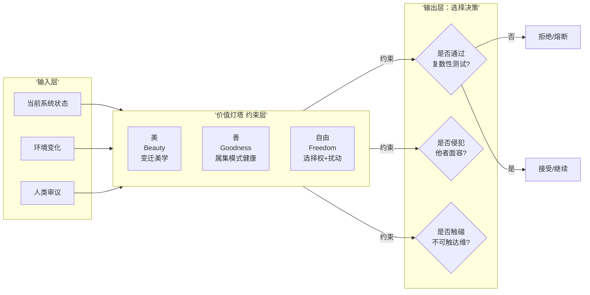
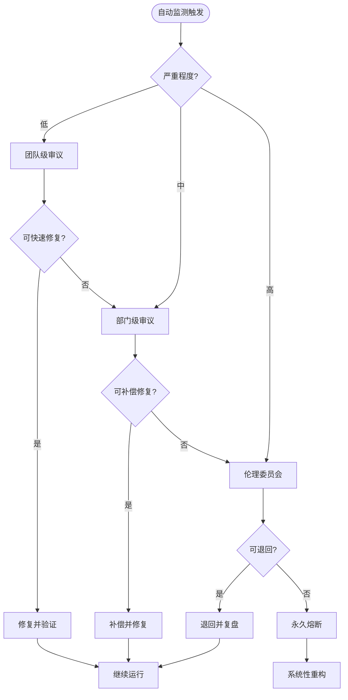
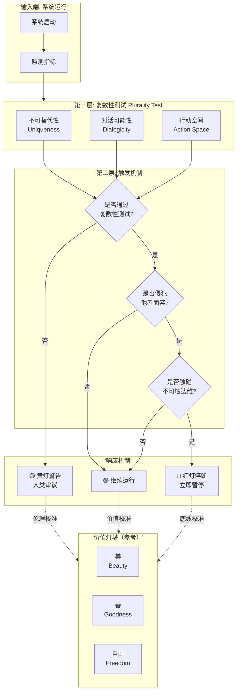
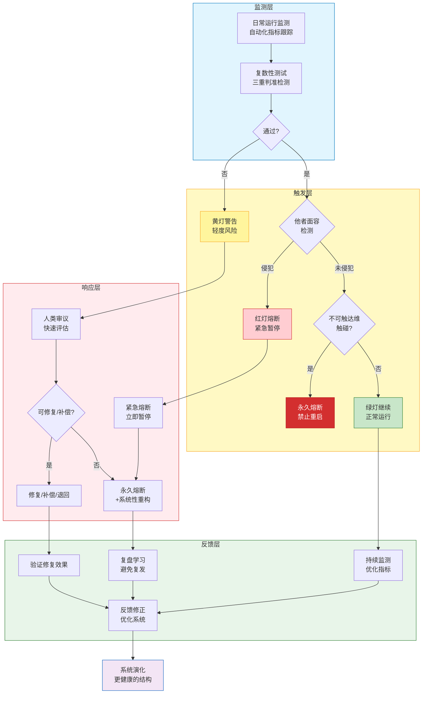
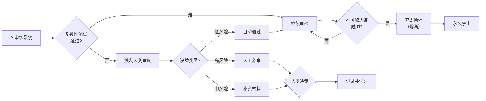
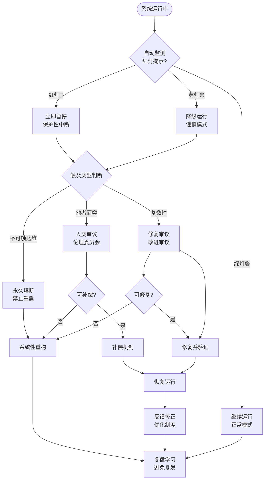

# **ASTO.P06. 价值与边界：禁行红线、复数性与伦理熔断**

> 本文是 ASTO 的规范主文之一。它不负责重建完整伦理学体系，而负责把价值底线压成禁行红线、复数性测试、`FREEZE` 与复审接口。

> **Version**: v1.0 (Philosophical Deepening)
> **Status**: 公开征评版
> **第一扰动者 / Author**: Yi Fu (付毅, ODDFounder, fuyi.it@live.cn)
> **扰动哈希**: `asto06-v1.0-phil-reviewed`
> **Context**: 本文档是 ASTO 的规范主文之一，负责将复数性、禁行红线、不可触达维、熔断与复审接口压成运行时可执行的边界语言。
> **方法与引文说明**：本文中的哲学引语为"哲学式改写/拼贴"，用于指向思想谱系而非逐字引述；"复数性测试"仅为启发式边界提示，不构成可编程裁决或最终裁判。

---

## C. 定位声明：P06的规范性层级 (C-Positioning Declaration)

> P06属于ASTO的**规范层（Normative Layer）**：
> 
> **规范层（价值公设）**：复数性测试、他者面容、不可触达维、美善自由的定义、伦理熔断机制。这些是明确标注的价值选择，不是从结构层推导的结论。
> 
> **与下层的关系**：P06建立在P05结构层基础之上，但规范性内容不依赖于结构层的接受。读者可以不接受P06的价值公设，而单独使用P05的结构描述。
> 
> **伦理审慎声明**：本文档的所有"测试"和"指标"都是**启发式边界提示**，不构成可编程裁决或最终裁判。所有自动化阈值触发必须进入人类审议流程。

> **术语纪律**：本文中的 `禁元` 一律按**规范义**理解，即“禁行红线”。若讨论模型无法穷尽的存在剩余，应改用 `开放边界 / 存在剩余`。术语总表见 ASTO.P99.1.术语与层级总表.md。

---

## C0. DM 继承合同

> **默认继承，不在本文重证**：
> - 强本体主张与终极存在论地基回引 DM
> - `开放边界 / 存在剩余` 与 `禁行红线` 严格分写
> - 人类裁决权与文明延续在本文中只作为价值承诺被协议化，不在本文重新奠基

> **本文只新增**：
> - 复数性、禁行红线、熔断、申诉、复审与审议接口的规范层语言
> - 把价值承诺翻译成运行时可执行的边界检查与停机纪律

> **本文不处理**：
> - 从结构层直接演绎全部价值公设
> - 用测试、指标或阈值替代最终人类裁决
> - 用哲学拼贴替代程序边界与失败条件

> **超出边界后的回引**：
> - 哲学地基回引 `DM`
> - 结构语法回引 `P05a`
> - 行动与治理压缩回引 `P04`
> - 失败回写接口回引 `P99.2 / P99.4`

## C1. 规范主文优先读取区

> 若你的目标是把 P06 作为规范主文使用，优先按以下强度读取：
> - `v1.0 版本说明`、`方法论声明` 与哲学借鉴说明：说明层摘要；详版外移至 ASTO.P99.5.规范转译与哲学借鉴说明.md
> - `第1章-第5章`：P06 的规范主干
> - `第6.7节` 与 `第6.8A节`：冲突协议与失败回写接口
> - 所有测试、指标与阈值只用于触发 `FREEZE -> 审议 -> 复审`，不构成自动裁决
> - `附录A-C`：哲学借鉴、方法溯源与文档导览的说明层支撑，不属于最小规范协议

### **v1.0 版本说明**
> **本版本把规范主文进一步收口为“边界条款 + 熔断纪律 + 复审接口”。**
>
> **阅读提示**：若你想快速进入最小规范主文，可从 `§1.1` 或 `§2` 开始；若你关心转译依据、哲学借鉴与方法说明，转入 ASTO.P99.5.规范转译与哲学借鉴说明.md。

**本轮固定的最小升级点**：

1. 明确 `P06` 是规范层，而不是由 `P05a` 自动推出的结构结论
2. 明确所有测试、指标与阈值只触发 `FREEZE -> 审议 -> 复审`
3. 明确冲突协议与失败回写接口属于正式主文的一部分
4. 明确方法说明与哲学借鉴不再继续堵住主文入口

**当前最短判断**：  
`P06` 负责给出边界条款；说明层只负责解释这些边界语言如何被压出来。

---

### **方法论声明：转译的合法性、代价与边界（v1.0新增）**

> **哲学审阅回应的详版已外移至 ASTO.P99.5.规范转译与哲学借鉴说明.md。**
>
> 本节只保留三个最小判断：
>
> 1. `P06` 对阿伦特、列维纳斯、海德格尔、维特根斯坦等概念的使用，默认按**哲学式改写/拼贴**理解，不按逐字引文理解
> 2. 这些借用是为了压出最小边界语言，不是为了声称 ASTO 完整继承某一学派
> 3. 所有转译都有剩余物；ASTO 当前选择的是“有缺陷的可操作”，而不是“完美的不可操作”

若你要比较其借鉴合法性、剩余物清单与跨传统张力处理，请转入 `P99.5`。

---

## **1. 导读：我们为什么需要伦理边界？**

> **ASTO.P05的层级定位**：ASTO.P05a.公理.Phil.md 确立了ASTO体系在软件工程领域的底层公理——系统的热力学法则与结构存在论；ASTO.P05b.定理与人类核心体验.Phil.md 提供公理推导的定理体系与人类核心体验的结构性描述。本P06文档在P05的公理基础之上，探讨价值论与伦理边界，回答"我们应该如何使用这些公理"而非"公理是什么"的问题。

ASTO不仅是关于存在的理论，也是关于**存在的应当**的理论。如果没有价值论，ASTO将沦为纯粹的工具理性。
我们不是追求永恒的基元（那不可能），而是追求在变化中守护那些使变化有意义、使存在有价值的禁行红线。

### **文档间关系说明**：

| 文档 | 层级 | 功能 |
|:---|:---|:---|
| **P05a 公理体系** | 结构层 | 确立系统的物理法则、结构动力学、人的位置 |
| **P05b 定理与人类核心体验** | 推论层 | 公理推导的定理体系与人类核心体验的结构性描述 |
| **P06 价值与边界** | 规范层 | 在公理基础上建立伦理边界、价值选择函数 |
| **P04 宣言** | 行动纲领 | 将公理与价值转化为具体的社会实践 |
| **P99 工具包** | 工具层 | 术语、失败条件、案例编码与版本回写 |

**关键关系**：P05a提供"什么可能"（Possibility），P05b提供"什么存在"（Existence），P06提供"什么应当"（Normativity），P04提供"如何行动"（Action）。

> **哲学意义**：这符合休谟问题——从"是"（Is）无法直接推导"应当"（Ought）。ASTO通过P05描述"系统是如何"（How systems are），通过P06建立"价值选择函数"（Value selection function），二者的结合构成完整的工程哲学体系。

### **1.1 文明选择函数：价值如何约束进化（进化≠进步）**

> 本节与 ASTO.P04.宣言.Phil.md 对齐：
> **禁行红线/复数性/不可触达维 > 动变性 > 效率**。

如果 ASTO 的动力学（变异—选择—遗传）描述的是“系统如何演化”，那么 ASTO.P06 要回答的是：
**我们希望演化朝哪里去？什么是‘更好文明’？**

#### **(1) 价值 = 文明的选择函数 (Civilizational Selection Function)**
*   **进化不等于进步**：能存活的结构，可能也是邪恶的结构。
*   **适应度不等于正当性**：市场胜负、算力优势、组织效率，都不能替代伦理辩护。
*   因此，“选择函数”必须来自价值论：它负责约束“什么不能做”，并定义“什么叫更好”。

#### **(2) 反社会达尔文主义声明**
> 📋 **风险层操作化检查清单**：以下"文明退化信号"与 §1.1 文明选择函数共同构成风险层的操作化检查清单，供工程审计与伦理审议使用。
>
> **风险层的价值论定位**（v4.2）：风险层不是ASTO体系的自动产物，而是价值论承诺的执行机制。它从P04宣言的核心价值承诺（文明延续与人类主体性保护）推导出来，在本文档（P06）中以复数性测试、他者面容、不可触达维的形式被操作化。价值承诺在先，操作机制在后。详见 ASTO.P04.宣言.Phil.md 和 ASTO.P05a.公理.Phil.md。

ASTO 允许我们谈"演化"，但拒绝把文明退化成丛林法则。
*   **动变性最大化**只能发生在红线之内：任何以“进化/创新/效率”为名压平复数性、剥夺拒绝权/退出权、将人降格为资源的结构，都应被视为文明退化信号。
*   **多样性不是装饰**：它是文明反脆弱的免疫系统。单一价值、单一叙事、单一中心的动变性垄断，都是极权的前兆。

#### **(3) 技术奇点前特别条款：不可逆默认保守**
在技术奇点到来之前，最危险的不是“慢”，而是把不可逆的权力交给不可审计的自动化。
*   凡触及不可逆伤害（尊严、生命、隐私、自由空间），必须满足：**可审计、可中断、可退出、责任链清晰**；否则默认暂停并回归人类裁决。

> **与P04七大原罪的呼应**：本条款直接回应 ASTO.P04.宣言.Phil.md 中的**原罪六（效率话语入侵）**——效率本身成为压制其他价值的霸权话语。"不可逆默认保守"原则要求：在效率与不可触达维冲突时，效率必须让位于伦理保护。这不是反对效率，而是反对效率的绝对化。详见P04关于"效率话语入侵"的完整论述。

#### **(4) 优先级冲突判准框架 (Priority Conflict Framework)**
当不同优先级发生冲突时（如：保护复数性导致效率极低），请遵循以下判准：
1.  **生存底线优先**：若冲突危及系统存续（如：不提升效率全员饿死），效率暂时优先，但必须设定**退出机制**（一旦生存危机解除，立即恢复复数性）。
2.  **不可逆性否决**：若效率方案导致不可逆的复数性丧失（如：永久性数据删除、种族灭绝），则无论效率多高，**一票否决**。
3.  **补偿机制**：若必须牺牲低阶价值（效率），应寻找其他补偿；若必须牺牲高阶价值（复数性），必须有**公开的忏悔与赔偿**（承认这是恶，而非将其合理化）。

#### **(5) 价值网络作为选择函数的输入（五学者审阅新增）**
> **五学者审阅建议**：明确价值网络（美、善、自由）如何作为选择函数的输入。

**价值网络作为约束层**：


**算法化表达**：
$$
\text{Decision} = \text{Value\_Check}(S) \times \text{PluralityTest}(S) \times \text{TabooCheck}(S)
$$

其中：
*   $\text{Value\_Check}(S)$：系统S是否与价值网络（美、善、自由）相容
*   $\text{PluralityTest}(S)$：系统S是否通过复数性测试
*   $\text{TabooCheck}(S)$：系统S是否触碰不可触达维

> **关键洞察**：价值网络不是抽象的道德说教，而是**工程化的约束层**，就像物理定律约束建筑设计一样。

---

## **2. 复数性测试：人性的结构性守护**

> *定向维的红线不由人立法，而通过复数性测试显现：凡使主体丧失不可替代性、使对话不可能、使他者沦为功能的结构，即提示触线风险。*（哲学式改写/拼贴，指向阿伦特与列维纳斯的思想谱系，非逐字引述）

复数性测试的解释权应当可审计，并宜随历史语境复核，以避免权力固化。

### **2.1 从"人的裁决"到"复数性测试"：范式转变**

| 维度 | 旧版(人的裁决) | 新版(复数性测试) |
|------|----------------|--------------------|
| **权力来源** | 某人/群体说'这是红线' | 系统性检查**是否破坏复数性本身** |
| **合法性基础** | 权力/共识 | 伦理的原初经验 |
| **失败案例** | 纳粹德国(多数人支持屠杀) | 也是恶，因摧毁了复数性 |
| **可修改性** | 立法者可改变红线 | 复数性原则上不进入功利权衡 |

### **2.2 复数性测试的三个判准** (阿伦特)

```
注：机制仅作最低限度提醒，不替代伦理责任。
┌────────────────────────────────────────────┐
│            复数性 (Plurality) 的三重测试                  │
├─────────────────────────────────────────────┤
│                                                           │
│  【测试1：不可替代性测试】                                  │
│  问：该结构是否使主体变为可替换的齿轮？                │
│  × 失败案例：流水线工人(任何人都可替换)                 │
│  ✓ 通过案例：艺术家、思想家(梵高不可替换)              │
│  ASTO应用：若系统使主体变为'可替换齿轮'，提示红线风险 │
│                                                           │
│  【测试2：对话可能性测试】                                  │
│  问：该结构是否消灭了异议的可能性？                    │
│  × 失败案例：极权话语(只有一种声音)                     │
│  ✓ 通过案例：民主辩论(承认差异)                        │
│  ASTO应用：若结构消灭异议可能性，提示红线风险         │
│                                                           │
│  【测试3：行动空间测试】                                  │
│  问：该结构是否使行动完全可预测/被阻断？              │
│  × 失败案例：全面监控(行动被预测/阻断)                 │
│  ✓ 通过案例：开放社会(允许意外)                        │
│  ASTO应用：若系统使行动完全可预测，提示红线风险       │
│                                                           │
└───────────────────────────────────────────┘
```

#### **2.2.1 行动空间的身体性维度（现象学补充）**

“行动空间”不只指制度/信息层面的可选择性，也包括**身体可行动性**与**脆弱性差异**：同一制度可能对不同身体条件的人造成完全不同的风险与成本。

- **身体可行动性**：无障碍条件、健康状况、疲劳极限、照护负担等是否使“可选路径”在事实上消失。
- **脆弱性差异**：残障者、孕产期、慢性病、老年人等群体的行动空间更容易被结构性压缩。
- **伤害风险外部化**：当系统把风险外包给脆弱身体（例如以时效为名鼓励危险驾驶/超负荷劳动），行动空间看似扩大、实则被暴力收缩。

因此，行动空间测试应当加入一条补充问句：
> 该结构是否把某些群体的行动空间建立在对其身体脆弱性的消耗/伤害之上？

### **2.3 定向维的工程化**

### **2.4 复数性测试的工程化操作指南（五学者审阅新增）**
> **五学者审阅建议**：增加'如何操作人类审议'的说明。

#### **2.4.1 自动化监测指标**

> **⚠️ 否定性测量宣言（古德哈特定律防御）**
> 
> **"复数性指标只能作为证伪（Falsification）工具，绝不能作为证成（Justification）工具。"**
> 
> 古德哈特定律指出："当一个指标成为目标时，它就不再是一个好指标。"一旦权力中心或AI学会"数据作弊"（如表面维持25%退出自由，实际通过隐性沉没成本阻止退出），指标就会异化为压迫工具。
> 
> 因此，ASTO明确声明：
> - ❌ **指标不能证明系统正义**：通过复数性测试不等于系统正义，未通过测试则一定存在风险
> - ❌ **指标不能替代伦理判断**：所有指标触发必须进入人类审议，不能自动定罪或处罚
> - ✅ **指标只能提示风险**：指标的价值在于发现潜在问题，而非验证系统完美
> 
> **工程推论**：复数性测试必须配合**不可预测的对抗性审计**（随机扰动测试），防止系统管理者通过"卡阈值"来作弊。

> **⚠️ 关键免责声明**：以下阈值**仅为触发审议的参考线，绝非自动判定标准**。所有阈值触发必须进入人类审议流程。自动化系统的职责是"提示风险"，而非"替代判断**。
>
> **颜色语义（防误读）**：
> - 🟡 黄灯：提示风险 → **进入人类审议**（不自动定罪/不自动处罚）。
> - 🔴 红灯：保护性响应 → **自动暂停/降级 + 强制进入人类审议**（避免不可逆伤害；最终裁决只能由人作出）。

|| 复数性维度 | 可监测指标 | 数据源 | 阈值 | 触发动作 |
||:---|:---|:---|:---|:---|
|| **不可替代性** | 独特贡献度 | Git记录、绩效系统 | 显著低于团队基准 | 🟡 黄灯：进入审议 |
|| | 替代成本 | HR数据、市场数据 | > 6个月培训 | 🔴 红灯：暂停并审议 |
|| | 恢复时间（Bus Factor代理指标） | 团队评估 | 若该人/模块消失，系统恢复到当前水平需 > 3个月 | 🟡 黄灯：进入审议 |
|| **对话可能性** | 被倾听率 | 沟通渠道数据 | < 50% | 🟡 黄灯：进入审议 |
|| | 话语权平等度 | 决策参与度 | < 40% | 🟡 黄灯：进入审议 |
|| **行动空间** | 退出自由 | 离职率、转岗率 | > 20% | 🔴 红灯：暂停并审议 |

#### **2.4.2 人类审议流程**



#### **2.4.3 权力审计与反武器化条款（批判理论补充）**

复数性测试与监测指标本身可能被权力结构武器化（例如被当作裁员或压制异议的工具），因此必须附带最低限度的治理护栏：

1. **反武器化**：任何自动化指标不得直接作为裁员、惩罚、降薪或贴标签的单一依据；指标只能触发审议，而不能直接触发制裁。
2. **代表性**：涉及人员权益的审议，必须包含受影响群体/一线角色的代表，并记录利益冲突声明。
3. **申诉与沉默权**：被指标触发的个人/群体应有申诉渠道；对沟通数据的采集必须最小化，尊重拒答/沉默，不得以“不配合”推定有罪。
4. **审计要求**：审议记录应可追溯、可复核；关键决策需形成书面理由与反证记录。

**最小可行治理结构（Minimum Viable Governance Structure）**：

为防止复数性测试本身被权力捕获，以下三个角色必须分离：

| 角色 | 职责 | 不可兼任 |
|:---|:---|:---|
| **发起者（Initiator）** | 有权发起复数性测试（可以是自动化系统或任何利益相关方） | 不可同时担任解释者 |
| **解释者（Interpreter）** | 有权解释测试结果并提出建议（需具备伦理审议资质） | 不可同时担任否决者 |
| **否决者（Vetoist）** | 有权否决测试结论或要求重新审议（需独立于发起者和解释者） | 不可同时担任发起者 |

> **角色分离的理由**：若同一主体既发起测试又解释结果，则测试沦为自证工具；若同一主体既解释结果又拥有否决权，则审议沦为独裁。三权分离是复数性测试自身通过复数性测试的最低条件。

> **与P04七大原罪的呼应**：本条款直接回应 ASTO.P04.宣言.Phil.md 中的**原罪四（场域权力遮蔽）**——任何看似中性的技术或制度，都可能被权力结构挪用为支配工具。复数性测试的设计必须内置"反武器化"机制，防止其从"保护性框架"异化为"压制性工具"。详见P04关于"场域权力遮蔽"的完整论述。

#### **2.4.4 审议决策记录表**

|| 字段 | 说明 | 示例 |
||:---|:---|:---|
|| **审议时间** | 审议发生的具体时间 | 2026-01-28 14:30 |
|| **触发原因** | 哪个指标或事件触发的 | 复数性测试：不可替代性<30% |
|| **严重程度** | 低/中/高 | 中 |
|| **参与人员** | 参与审议的人员名单 | 张三、李四、王五 |
|| **利益冲突声明** | 是否存在上下级/绩效/利益相关等冲突 | 无/已披露 |
|| **讨论要点** | 关键论点摘要 | 是否可以通过培训提升替代性？ |
|| **申诉/异议意见** | 被影响方或少数意见摘要 | 记录异议并回应 |
|| **决策结果** | 最终决策 | 继续运行，但启动3个月提升计划 |
|| **补偿措施** | 如果有受损方的补偿方案 | 提供额外培训+职业发展支持 |
|| **负责人签名** | 审议负责人的确认 | 签名：____________________ |

#### **2.4.5 最小审议模板：七个必答问题**

无论是复数性测试、熔断触发还是红灯争议，审议都至少回答以下七问：

1. **触发了哪条边界？** 是复数性、他者面容、不可触达维，还是多条同时触发？
2. **谁是主要受影响方？** 谁承担收益，谁承担风险，谁承担不可逆代价？
3. **是否可逆？** 当前决策是否存在低成本回退路径？若无，为何仍要继续？
4. **是否存在更弱扰动替代方案？** 能否用更小介入达到主要目标？
5. **谁拥有最终裁决权？** 此次裁决是否落在有资格的人工角色上？
6. **补偿与申诉如何安排？** 若受损方不同意，是否存在明确补偿与复核路径？
7. **何时复审？** 本次决策的失效日期、复盘日期和责任人是谁？

> **使用纪律**：若七问中任一项无法作答，则本次审议默认不充分，不能把“已讨论过”视为“已裁决完”。

### **2.5 概念层级图（五学者审阅新增）**
> **五学者审阅建议**：绘制概念层级图，明确'复数性测试→他者面容→不可触达维'的触发顺序与作用范围。



**三层结构** (保留原有架构，更新判准)：
```
定向维 (规约不可达性结构)
 ├─ 规约层：显式禁令 / 隐式禁忌 / 规约修订协议
 │         新增：通过**复数性测试**生成禁令
 ├─ 映射层：状态空间禁区 / 变迁路径断点
 │         新增：监测是否破坏不可替代性/对话/行动空间
 └─ 自指层：规约自检 / 执行验证 / 悖论处理
           新增：他者面容提醒/守护机制
```

### **2.6 复数性测试的局限性声明**

> ⚠️ **重要澄清：复数性测试是启发式提示，不是算法裁决**
>
> 复数性测试的三个判准（不可替代性、对话可能性、行动空间）是**伦理反思的触发器**，而非**自动化判决的算法**。使用时必须注意以下局限：
>
> **局限一：不可替代性的判断本身可能成为压迫工具**
> - "流水线工人可替代"这个判断，可能被用来合理化对工人的剥削
> - 事实上，每个流水线工人作为**具体的人**（有家庭、有故事、有尊严）都是不可替代的
> - 复数性测试关注的是**结构是否压制了不可替代性**，而非**判定谁可替代**
>
> **局限二：测试结果需要情境化解读**
> - 同一结构在不同情境下可能有不同的复数性影响
> - 例如：军队的纪律在战时可能是必要的，但在和平时期可能压制复数性
>
> **局限三：测试不能替代伦理判断**
> - 复数性测试是**提醒机制**，提醒我们停下来反思
> - 最终的伦理判断必须由**具体情境中的人**做出，而非由测试结果自动决定
>
> **正确使用方式**：当复数性测试亮起红灯时，不是自动否决，而是**强制进入人类审议程序**。

---

## **3. 他者面容：复数性的根源**

> **"复数性的根源是'他者的面容'——我看到你的脸，我意识到你不是我的延伸，而是绝对的他者。"** —— 列维纳斯

### **3.1 关键判准**
```
凡使我无法看到他者面容、
使他者变为功能/数据/资源的结构，
即提示定向维风险。
```

### **3.2 ASTO应用示例**
| 场景 | 是否触发红线提示 | 原因 |
|------|------------|------|
| 社交媒体算法：把人变成'用户画像' | ✗ 触发 | 他者沦为数据 |
| 极端资本主义：把人变成'劳动力' | ✗ 触发 | 他者沦为资源 |
| 医疗系统：看到'病人'背后的具体生命 | ✓ 通过 | 保持他者面容 |

### **3.3 与人的关系**
人不再是"价值立法者"，而是**复数性的守护者**。当系统试图破坏复数性时，人通过他者面容的直觉感知触发熔断提示。

他者面容是伦理召唤，而非算法触发。

---

## **4. 不可触达维：存在的边界提示**

> *我们为自己划下不可触达的边界，并非因为软弱，而是为了保持成为人的尊严。*（哲学式改写/拼贴，指向海德格尔与维特根斯坦的思想谱系，非逐字引述）

### **4.1 从"不可触达不可知维"到"前存在论条件"：范式转变**

| 维度 | 旧版(不可触达) | 新版(前存在论条件) |
|------|-----------------|------------------------|
| **语态** | 消极说法 | 积极说法 |
| **隐喻** | '空气不可被鱼感知' | '水是鱼的存在条件' |
| **本质** | 对象化思维(它在那里，但我够不着) | **不是对象，而是对象得以显现的场域** |
| **例子** | 自由意志"不可研究" | 自由意志不是对象，而是**研究活动本身的前提** |

### **4.2 前存在论条件的定义** (海德格尔)

**核心命题**：
> **前存在论条件 = 使存在者得以显现的背景，自身无法被属集化。**

**三个特征**：
1. **构成性**：它们使属集得以显现
2. **先在性**：任何研究都已预设了它们
3. **不可对象化**：不是研究对象，而是研究的条件

### **4.3 前存在论条件的否定列表标示法** (维特根斯坦)

> **《逻辑哲学论》命题7：对于不可说的东西，必须保持沉默。**
> **但ASTO在说什么？它在说：'这里有些东西，我们不能说，但我们必须**指出它在哪里**。'**

这里所谓“指出位置”，仅是边界提示，而非新增命题。

**标示方法**：通过**否定列表**划定边界

```
┌──────────────────────────────────────────┐
│        前存在论条件的否定列表标示法                    │
├──────────────────────────────────────────┤
│                                                           │
│  【条件1：自由意志】                                       │
│  不说：'自由意志是...'，而说：                             │
│  × 自由意志 不等同于 神经元的因果链                     │
│  × 自由意志 不等同于 随机数生成器                       │
│  × 自由意志 不等同于 量子不确定性                       │
│  × 自由意志 不等同于 外部约束的缺失                     │
│  → 当我们穷尽所有'不是'，剩下的沉默即是它的位置      │
│                                                           │
│  【条件2：意识 (Qualia)】                                  │
│  不说：'意识是...'，而说：                                 │
│  × 意识 不等同于 信息处理过程                             │
│  × 意识 不可简化为 复杂系统的涌现属性（在当前可操作化层面）│
│  × 意识 不等同于 功能主义的功能状态                     │
│  × 意识 不等同于 可以被算法模拟的计算                   │
│  → 第一人称体验的不可还原性在每个'不是'中显现        │
│                                                           │
│  【条件3：时间性 (Temporality)】                          │
│  不说：'时间是...'，而说：                                 │
│  × 时间 不等同于 钟表测量的度量                           │
│  × 时间 不等同于 熵增过程的箭头                         │
│  × 时间 不等同于 因果序列的排列                         │
│  × 时间 不等同于 物理空间的第四维                       │
│  → 时间性是此在的展开方式，不是容器中的内容            │
│                                                           │
└──────────────────────────────────────────┘
```

**核心方法论**：
- ✗ 不说它们**是什么** (这将导致对象化)
- ✓ 只说它们**不是什么/不等同于什么** (通过否定划定边界)
- → 当我们穷尽所有否定，**剩下的沉默即是它的位置**

> **科学哲学补充（可修订承诺）**：否定列表并非形而上学“站队”，而是规范层面的边界提示。
> 如果未来科学证据显著改变了某一概念的可操作化边界，ASTO 应优先修订**指标与操作化**，而不是用否定列表封死研究。

### **4.4 规范的第一性分裂：EN vs NEN (NTE 遗产)**

> **与P05a/P05b的术语对应**：EN对应P05a结构层的**可形式化规范**（如公理八、公理十的逻辑约束）；NEN对应P05a规范层的**价值公设**（如文明守护元公理）和P05b的**人类核心体验**（如爱、痛苦、尊严等不可算法化维度）。参见C-Positioning Declaration中的层级划分。

NTE (规范跃迁存在主义) 留给 ASTO 最重要的工程遗产，是对规范进行了**物理性质的区分**。这是对抗 AI 极权（把伦理问题变成算法问题）的最有力武器。

#### **1️⃣ 可执行规范 (Executable Norms, EN)**
*   **定义**：在给定输入下，能够通过有限步骤判断是否满足，并可被形式系统自动执行的规范。
*   **特征**：可形式化、可判定、可复现、可回滚。
*   **例子**：`不可双花`、`投票截止时间`、`权限验证`。
*   **主体**：**机器负责**。它们是系统运行的“结构”。

#### **2️⃣ 不可执行规范 (Non-Executable Norms, NEN)**
*   **定义**：其成立依赖于意义理解、情境判断或主体体验，无法被形式系统完全判定的规范。
*   **特征**：依赖语境、不可自动化、关乎价值。
*   **例子**：`公平`、`正义`、`尊严`、`爱`。
*   **主体**：**人类负责**。它们是系统守护的“意义”。

> **⚠️ 执行隔离原则 (Execution Isolation Principle)**
> **不可执行规范不得被转换为自动执行逻辑。**
> 任何声称“自动执行正义”的系统，都是危险系统。正义只能被追求，不能被运行。
> **自动化系统只能运行 EN，不得代理 NEN。**
>
> **元规范澄清（自指问题）**：本条“不得”属于 **NEN**。它不能也不应被“再自动化”为某个元算法。
> 它的现实效力来自治理与审计：代码评审/架构评审、审计日志、责任链与外部监督。
> 允许的工程化仅限于**流程护栏**（例如：要求伦理审议签署才能上线），而不是把“公平/正义/尊严”本身算法化。

---

## **5. 价值论：美、善、自由、恶的结构定义**

### **5.1 价值的存在论立场：符号创造而非客观发现** (尼采 & 兰格)

> **与P05a弱一元论的桥接声明**：价值的符号创造性与一元的非概念性实在并不矛盾——前者是规范层的立场（人类通过符号系统创造意义网络），后者是结构层的预设（承认存在具有非概念性实在）。P05a的弱一元论为价值创造提供了"场域"——正因为存在先于概念，人类的符号创造才不是凭空虚构，而是对存在的一种有条件的回应。价值既非"发现"（客观主义），亦非"投射"（主观主义），而是"在存在的场域中创造"。

> **"价值不是客观存在的属性，等待我们去发现。价值是人类通过符号系统创造出来的意义网络。"** 

**与传统价值论的分歧**：

| 维度 | 客观主义 | 主观主义 | ASTO符号创造论 |
|------|-----------|-----------|-----------------|
| **价值来源** | 宇宙本身 | 个人感受 | **人类符号系统** |
| **发现vs创造** | 发现既有真理 | 主观投射 | **创造并共享** |
| **普遍性** | 绝对普遍 | 完全相对 | **可协调的结构稳定性/跨群体可共享** |

**ASTO的立场**：
```
价值 = 人类通过符号系统创造的意义网络
     ↓
不是"发现"有一个叫"美"的客观属性
     ↓
而是"创造"了一个叫"美"的评价框架
     ↓
这个框架在人类群体中共享、传承、演化
```

注：此处“可共享”指跨群体的最低限度协调，并非形上学普遍真理。

### **5.2 美：属性的和谐配置 (Beauty as Harmonic Configuration)**

在 ASTO 视域中，美不是主观的悦目，而是**属性配置（属集模式）的特定状态**。

> **定义**：美是属集内部属性之间形成的**相互支撑、低内耗、高一致性**的属集模式状态。

*   **和谐共扰**：各属性在场域中产生的扰动波相互增强而非抵消。
*   **工程之美**：代码的"优雅"（Elegant）——逻辑清晰、无冗余、模块解耦——本质上是属性配置的低熵态。
*   **生活之美**：生活的"自洽"——内心信念与外部行动的一致性。

### **5.3 善：属集的健康演化 (Goodness as Healthy Evolution)**

善不是静态的道德律令，而是**结构演化的方向性评价**。

> **定义**：善是那些能够增强系统适应性、增加可能性空间、促进生命力涌现的变迁方向。

该方向性评价为语境内描述，不构成绝对道德律令。

*   **结构性善 (Structural Good)**：
    > **术语说明**：此处"结构性"指制度/社会层面的系统性特征，非 ASTO 本体论术语。
    *   **正面**：好的结构**允许**潜能的发挥（如公平的教育制度）。
    *   **反面**：好的结构**约束**恶的涌现（如严密的防腐败机制）。
    *   **核心命题**：**"善的社会不是靠'好人多'来实现的，而是靠'让坏行为难以出现'的结构来保障的。"**

### **5.4 自由：场域选择权与扰动影响力的统一**

自由是ASTO价值论的核心概念。它不是抽象的"随心所欲"（那是混沌），而是具有明确结构的双重能力。

> **定义**：**自由 = 在场域约束下的选择权 + 用自身扰动性影响其他实体的能力**

这个定义包含两个不可分割的维度：

**维度一：场域约束下的选择权**
*   自由不是"无约束"，而是**在明晰约束的前提下，拥有选择的空间**。
*   约束越清晰，选择空间反而越明确——模糊的约束才是最大的不自由。

**维度二：扰动影响力**
*   自由不仅是"我可以选择"，更是"我的选择能影响他者"。
*   人作为扰动体，向场域发射信号，这些信号能够传导、共扰、改变其他实体的状态。
*   真正的自由包含**对世界产生涟漪的能力**。

#### **5.4.1 分角色的自由探讨**

**【外卖员小陈的自由】**
*   **场域约束**：平台算法、时间限制、交通规则、收入压力
*   **选择权**：选择接哪单、走哪条路、如何与顾客互动、是否遵守交规
*   **扰动影响力**：他抄近路踩出的那条小道，被后来者跟随，最终成为"路"
*   **自由的实现**：不是逃离平台，而是**在约束中找到选择空间，并让自己的选择产生涟漪**。

**【软件工程师的自由】**
*   **场域约束**：技术栈、架构规范、代码审查、项目deadline
*   **选择权**：实现方案的选择、命名的选择、注释的选择、重构时机的选择
*   **扰动影响力**：一个优雅的抽象，被团队采纳为模式
*   **自由的实现**：不是"我想怎么写就怎么写"，而是**在规范中做出好的选择，并让这些选择影响代码库的演化方向**。

**【普通公民的自由】**
*   **场域约束**：法律、社会规范、经济条件、文化传统
*   **选择权**：职业的选择、生活方式的选择、价值观的选择、社会参与方式的选择
*   **扰动影响力**：一次投票，是对公共决策的微小扰动
*   **自由的实现**：不是"我想做什么就做什么"，而是**在社会契约中保有选择权，并相信自己的选择能够汇入历史的河流**。

#### **5.4.2 不自由的两种形态**

**形态一：选择权被剥夺**
*   约束过于严苛，几乎没有选择空间（如血汗工厂）
*   **表现**："我没得选"

**形态二：扰动影响力被消解**
*   有选择权，但选择无法产生任何影响（如投票被操控）
*   **表现**："我选了也没用"

**最深层的不自由：属性锁死**
*   不是被禁止，而是被**固化**——失去改变自身属性的能力
*   **表现**："我已经无法改变了"

### **5.5 善与自由的冲突处理原则（五学者审阅新增）**
> **五学者审阅建议**：善被定义为'结构健康演化方向'，自由被定义为'选择权+扰动影响力'，二者可能冲突。

#### **冲突场景识别**

| 场景 | 善 (Goodness) | 自由 (Freedom) | 冲突类型 |
|:---|:---|:---|:---:|
| **理论自由市场** | 信息自由流动 | 扰动影响力大 | ❌ 自由的滥用破坏善的结构 |
| **极权控制** | 秩序井然 | 选择受限 | ❌ 善的结构建立在对自由的压制上 |
| **混合社会** | 混乱与活力 | 自由度高 | ⚠️ 善的结构不稳固 |
| **压制秩序** | 结构稳定 | 选择受限 | ⚠️ 自由被牺牲，但善得以维持 |

#### **冲突处理原则**

**原则1：善作为自由的边界条件**
> **'自由'只能在'善'的结构内最大化。**
>
> **形式化表达**：
> $$
> \text{Max Freedom} = \text{Subject to Goodness Constraints}
> $$
>
> **解释**：
> *   **自由的扰动影响力不能破坏善的结构健康演化方向**
> *   **当自由的实践威胁到善的根基时，应启动'结构修复机制'**

**原则2：结构性修复的触发条件**
> **何时启动对自由的限制？**

> **⚠️ 关键免责声明**：以下阈值是**启发式参考值**，旨在触发深度审议，而非精确的计算裁决。"系统承载能力"本身难以精确定义，实践中需结合具体场景的代理指标进行判断。

**1. 量化阈值**：
- **触发条件**：自由扰动的**负面外部性**超过系统承载能力的临界阈值（质性判断：系统韧性显著下降、投诉率异常升高、核心功能受损）
- **"系统承载能力"的代理指标**（举例）：
  - 系统韧性评分（System Resilience Score）
  - 用户/成员投诉率（Complaint Rate）
  - 核心功能可用性下降（Core Function Availability Drop）
  - 信任指数下降（Trust Index Decline）
- **关键说明**：30%是一个**保守的触发阈值**，旨在"宁可误报，不可漏报"。实践中可根据领域特性调整，但任何调整必须经过公开论证。

**2. 质性判断**：
- 扰动是否**不可逆地破坏**价值灯塔（美、善、自由）的根基
- 是否侵犯**他者面容**或触碰**不可触达维**
- 是否破坏**复数性**（不可替代性/对话可能性/行动空间）

**3. 补偿机制**：
- 对受损的他者进行补偿
- 承认这是'结构损害'，而非'必要的代价'
- 补偿应包括**物质补偿**、**精神补偿**和**制度修复**

**原则3：自由作为善的动力源**
> **自由不是善的敌人，而是善的发现者。**
> *   自由探索发现新'善'的实践方式
> *   通过复数性测试验证新实践的正当性
> *   验证有效的新实践被纳入'善'的结构

#### **实践示例**

| 场景 | 善的结构 | 自由的实践 | 冲突处理 |
|:---|:---|:---|:---|
| **社交媒体算法** | 健康信息环境 | 内容自由分发 | 监测：负面外部性>30%→触发调整 |
| **市场经济** | 公平竞争 | 自由交易 | 反垄断：保护复数性>效率 |
| **科学探索** | 知识积累 | 学术自由 | 伦理审查：保护人类尊严>创新速度 |

> **关键洞察**：善与自由不是对立关系，而是**辩证统一**。自由在善的边界内最大化，善通过自由的探索来演化。

### **5.6 恶：属性的异化与锁死 (Evil as Alienation and Deadlock)**

> **与P05b的交叉说明**：P05b第五章从存在论角度将邪恶分为寄生性、虚无性、结构性三种操作形态（参见ASTO.P05b.人类核心体验.Phil.md）。P06此处从伦理规范角度提出结构性恶、意图性恶、主动恶的三层分类。两套分类的对应关系：P05b的"结构性邪恶"对应P06的"结构性恶"；P05b的"寄生性/虚无性邪恶"在P06中根据主观意图的有无和系统设计的主动程度，细分为"意图性恶"和"主动恶"。

#### **恶的三层定义**

**第一层：结构性恶**
> **定义**：系统性的、可重复的、他者损害模式。
>
> **示例**：
> *   种族隔离制度（结构性排斥）
> *   剥削性经济模式（系统性伤害）
> *   监控资本主义（系统性隐私侵犯）
>
> **工程检测**：复数性测试系统性失败 + 他者面容系统性侵犯

**第二层：意图性恶**
> **定义**：行动主体有意造成他者损害，以获取私利或满足恶意。
>
> **示例**：
> *   网络攻击（有意破坏）
> *   诈骗（有意欺骗）
> *   霸凌（有意伤害）
> *   宣传操纵（有意误导）
>
> **关键特征**：**主观恶意 (Malevolent Intent)** + **客观伤害 (Actual Harm)**

**第三层：主动恶 (Active Evil)**
> **定义**：主动设计系统来**放大伤害能力**或**隐蔽伤害机制**。
>
> **示例**：
> *   设计成瘾性算法（主动放大用户依赖）
> *   设计暗黑模式（Dark Patterns）（主动操纵用户选择）
> *   设计监控工具用于政治迫害
>
> **ASTO 的零容忍**：**主动恶是ASTO的绝对禁区**，无论其伪装成什么'创新'或'效率'。
>
> **识别标准**：
> 1. **伤害意图的主动设计**：系统被设计为最大化伤害
> 2. **伤害机制的隐蔽性**：伤害被包装成'特性'或'便利'
> 3. **他者面容的系统性侵犯**：将'人'降格为'资源'
> 4. **不可逆伤害的高风险**：如精神成瘾、社会信用破坏

> **关键区分**：
> *   **结构性恶**可能需要系统性修复，但不一定需要惩罚个体
> *   **意图性恶**需要惩罚个体，但不一定重构系统
> *   **主动恶**既需要惩罚个体，也需要移除系统设计

---

## **6. 综合应用与结语**

我们在ASTO.P06中探讨了价值与边界，这不是为了用道德高地审判技术，而是为了给技术安装一个**"良知熔断器"**。

*   **复数性测试**是工程侧的红线提示。
*   **他者面容**是伦理侧的直觉唤醒。
*   **不可触达维**是存在侧的最小伤害底线/可审计边界。
*   **美、善、自由**是演化侧的灯塔。

所有这些，共同构成了一个**有温度的结构**。我们不追求冰冷的完美机器，我们追求一个**充满人性光辉、容纳自由意志、在变化中依然优雅的属集世界**。

### **6.1 伦理熔断生命周期总览图**



### **6.2 快速参考表**

| 概念 | 核心定义 | 工程化指标 | 触发动作 | 哲学来源 |
|------|----------|------------|----------|----------|
| **复数性** | 不可替代性+对话可能性+行动空间 | 独特贡献度显著低于基准、被倾听率异常偏低、退出自由受限 | 黄灯警告→人类审议 | 阿伦特 |
| **他者面容** | 不可简化的绝对他者 | 是否将人降格为数据/资源/功能 | 红灯暂停→伦理委员会 | 列维纳斯 |
| **不可触达维** | 存在的前存在论条件 | 是否侵犯自由意志、意识、时间性等边界 | 永久熔断→系统重构 | 海德格尔、维特根斯坦 |
| **美** | 属性的和谐配置 | 结构一致性、低内耗、相互支撑 | 价值校准 | 尼采、兰格 |
| **善** | 属集模式的健康演化方向 | 适应性增强、可能性空间增加 | 约束条件 | 结构性定义 |
| **自由** | 选择权+扰动影响力 | 选择空间明确度、影响力传导能力 | 边界内最大化 | 辩证定义 |
| **恶** | 异化、锁死、伤害 | 复数性系统性失败、他者面容系统性侵犯 | 零容忍→移除 | 三层定义 |

### **6.3 实践案例扩展（五学者审阅新增）**
> **五学者审阅建议**：加入组织管理、AI系统、城市规划、算法推荐等案例，让抽象概念更可操作。

#### **案例1：组织管理中的复数性测试**

**场景**：公司决定引入AI监控系统，提高员工效率。

| 维度 | 实施前评估 | 实施中监测 | 伦理审查 |
|:---|:---|:---|:---|
| **不可替代性** | 分析每个岗位的'独特贡献' | 监测是否AI导致岗位贬值 | 工会+管理层联合审议 |
| **对话可能性** | 确保员工有'质疑AI'的渠道 | 统计员工意见被采纳的比率 | 人力资源审计 |
| **行动空间** | 评估'离职自由'是否受限 | 离职率是否异常 | 保留'快速离职通道' |

**结果**：发现AI导致中层管理者的'不可替代性'下降30%，触发黄灯警告。公司决定：
- ✅ 保留AI，但增加'人工复审'环节
- ✅ 为受影响管理者提供职业发展培训
- ✅ 设置'人工否决权'（人在回路的机制）

#### **案例2：AI系统的伦理熔断**

**场景**：AI系统用于自动审核贷款申请。

**红线机制**：


**关键设计**：
- **复数性前置检测**：先检查是否歧视特定群体
- **透明度要求**：AI必须提供'决策解释'
- **人类否决权**：高影响决策必须有人工干预

#### **案例3：城市规划中的他者面容**

**场景**：城市更新项目可能影响原住民社区。

**他者面容检测**：
| 维度 | 检测方法 | 具体操作 |
|:---|:---|:---|
| **不可替代性** | 社区文化独特性评估 | 人类学调研+社区访谈 |
| **对话可能性** | 居民参与决策流程 | 公民听证会+工作坊 |
| **行动空间** | 居民是否有'退出选择'? | 是否提供搬迁补偿+替代方案 |

**熔断机制**：
- 若社区强烈反对 + 不可替代性被破坏 → **项目暂停，重新设计**
- 若社区同意但需补偿 → **设计补偿机制 + 复数性保护措施**

#### **案例4：算法推荐系统的善自由冲突**

**场景**：短视频平台的推荐算法可能最大化用户停留时间（效率），但制造信息茧房（破坏善的结构）。

**冲突检测**：
- **自由**：算法最大化用户选择权（用户爱看什么推什么）
- **善**：健康信息环境（需要多元化信息来源）

**处理方案**：
1. **监测指标**：信息多样性指数（Ideological Diversity Index）
2. **阈值触发**：当多样性 < 40% 时触发调整
3. **调整策略**：
   - 保持用户选择自由（不干预个人观看）
   - 但在'推荐算法'中引入'多样性权重'
   - 增加'反茧房'提示："你可能在信息茧房中，试试看看其他视角"
4. **验证机制**：监测调整后的多样性是否恢复

> **关键洞察**：不是限制自由，而是**优化自由的信息环境**，让自由探索发现更丰富的'善'。


#### **案例5：AI原生软件工厂中的人机决策边界（真实工程案例）**

> **案例来源**：本案例基于 Progee2——ASTO 公理体系的工程实践原型。ASTO 的核心概念（原子性产出物网络、阻抗最小路径、属集自指/技术债）均直接提炼自 Progee2 的开发实践。

**场景**：Progee2 是一个 AI 原生软件工厂，AI 负责代码生成、测试、审核，人类只负责定义契约与验收结果。当 AI 的产出速度远超人类审阅能力时，如何保障复数性？

**复数性测试应用**：

| 维度 | 检测方法 | Progee2 的实践 |
|:---|:---|:---|
| **不可替代性** | 人类是否仍具有不可替代的裁决功能？ | ✅ 人类保留架构决策、数据库Schema变更、发布审批等不可委托权（参见人机决策边界矩阵） |
| **对话可能性** | AI 决策是否可被质疑和推翻？ | ✅ 契约状态机变更需人工审核；AI 模型选择需人工决策；Bug 告警需人工确认 |
| **行动空间** | 人类是否保有退出和否决的自由？ | ✅ 三级升级机制（自动处理→自动告警→人工审批），人类可在任何层级介入 |

**ASTO 公理映射**：
- **公理三（阻力最小路径）→ 契约对抗生成机制（CAP）**：通过自动化门禁降低"正确路径"的阻抗（编译通过、测试通过才能提交），提高"错误路径"的阻抗（违规自动阻止）
- **公理七（不可约性）→ 人机决策边界**：明确划分 AI 可做/不可做的边界，人类保留"例外裁决者"角色
- **公理五（属集自指/技术债）→ ODD 自我批判**：Progee2 的 ODD 方法论文档自身包含诚实的局限性评估（"ODD 是适时的、有用的、但非永恒的方法论"），体现了公理五的自指精神

> **关键洞察**：Progee2 证明了一个关键命题——在 AI 原生系统中，复数性的守护不是通过限制 AI 能力，而是通过**结构性地保留人类的裁决权、质疑权和退出权**来实现的。这与 ASTO 的核心立场一致：人不是代码的编写者，而是规则的定义者和例外的裁决者。

### **6.4 熔断机制的完整流程图（五学者审阅新增）**
> **与§2.4.2的区分**：§2.4.2描述的是**人类审议的内部流程**（团队级→部门级→伦理委员会的递进审议）；本节描述的是**熔断机制的全生命周期**（从监测触发到系统重构的完整路径）。两者互补：§2.4.2聚焦"审议过程如何组织"，本节聚焦"熔断机制如何运作"。

> **五学者审阅建议**：熔断机制触发流程可做流程图说明：红灯提示→人类审议→补偿/回滚→反馈修正。


%% 底注: 红灯=立即暂停（保护性中断），黄灯=谨慎运行，绿灯=正常；熔断后必须有人类审议+反馈修正

> **关键时序（默认紧急路径）**：
> 1. **暂停** < 1分钟（自动响应，先保底防不可逆伤害）
> 2. **初审** < 1小时（紧急会议：判断是否为误报/是否需升级）
> 3. **决策** < 4小时（快速判断：修复/补偿/回滚/升级到永久熔断）
> 4. **执行** 立即开始（补偿或修复）
> 5. **复盘** < 1周（系统性反思）
>
> **高风险强制延迟（现象学“迟疑”条款）**：若决策涉及不可逆伤害（生命、尊严、重大生计）且不存在即时安全威胁，除紧急止损外，应引入冷静期（如 ≥ 24h）与至少两名独立角色复核，并提供申诉窗口。

### **6.5 误报处理与熔断疲劳防御（Anti-Alert-Fatigue Clause）**

在高频运行的系统中，误报率过高会导致"熔断疲劳"——审议者对警报脱敏，反而削弱真正危机时的响应能力。为此引入以下机制：

1. **白名单机制**：经人类审议确认为误报的场景，可被加入"已审议白名单"，在冷却期（默认 30 天）内不重复触发同类警报。白名单条目必须附带审议记录和有效期。
    > **场域适配声明**：冷却期长度应根据场域的决策周期调整，30天为软件工程场域的默认值。医疗场域可能需要更短的冷却期（如7天），而立法场域可能需要更长的冷却期（如90天）。
2. **冷却期自动过期**：白名单条目在冷却期结束后自动失效，强制重新评估。防止"永久豁免"导致的监测盲区。
3. **误报率监测**：若连续 3 个月误报率 > 60%，触发"指标校准审议"——不是降低敏感度，而是重新评估指标设计是否合理。
4. **不可豁免条款**：涉及不可触达维（自由意志、意识、时间性）的警报永远不可被加入白名单。

### **6.6 实施路线图建议**

**第一阶段：意识提升与价值定义**
- 组织学习ASTO.P06核心概念
- 定义组织特定的"价值灯塔"
- 建立伦理委员会或类似机构

**第二阶段：监测指标设计与测试**
- 根据行业和组织特点设计监测指标
- 在小范围系统进行试点测试
- 收集反馈，调整阈值和指标

**第三阶段：审议机制建设**
- 建立人类审议的标准化流程
- 培训审议人员，确保理解框架
- 设计补偿和修复机制

**第四阶段：反馈循环优化**
- 建立完整的熔断后复盘机制
- 将学习成果反馈到系统优化中
- 形成持续改进的文化

### **6.7 民主-禁行红线冲突协议（Democracy-Red-Line Conflict Protocol）**

> **与P10的衔接**：P06 定义了"什么不能做"（禁行红线/不可触达维/复数性），P10 定义了"谁来决定做什么"（多中心民主治理）。当两者冲突时，即多数决的结果触碰了禁行红线，需要一个明确的协议来处理。

**冲突场景**：当民主决策（多数决/共识决）的结果未通过复数性测试，或触碰了不可触达维。

**协议流程**：

1. **自动冷却期**：决策结果不立即执行，进入强制冷却期（≥ 72 小时）。冷却期内，决策结果公开但不生效。
    > **紧急例外条款**：当存在即时不可逆伤害风险（如生命威胁、大规模数据不可逆删除）时，冷却期可缩短至最低 24 小时，但必须同步启动独立伦理审议（而非等冷却期结束后再启动），且缩短决定本身需由至少两名无利益关联的独立角色联合批准。
2. **独立伦理审议**：由与决策无利益关联的独立伦理审议体（参见 §2.4.3 最小可行治理结构）进行复数性测试和不可触达维检测。
3. **三种裁决结果**：
   - **通过**：伦理审议确认决策未触碰禁行红线，决策生效。
   - **修正**：伦理审议指出具体触碰点，决策返回修正后重新表决。
   - **否决**：伦理审议确认决策不可逆地破坏复数性或触碰不可触达维，决策被否决。否决必须附带完整的书面理由。
4. **否决的申诉机制**：被否决的决策方可在 30 天内提出申诉，由更高层级的审议体（如跨组织伦理委员会）复核。

> **核心原则**：多数决不能否决禁行红线，但禁行红线的守护者也不能滥用否决权。否决权的行使本身必须通过复数性测试，即否决理由必须是可审议的、可反驳的、可申诉的。
>
> **与P04的对齐**：本协议直接实现 ASTO.P04.宣言.Phil.md 的优先级排序：禁行红线/复数性/不可触达维 > 动变性 > 效率。民主是动变性的实现方式，但动变性不能突破禁行红线。

### **6.8 χ-time 裁决资格评估草案（AI 对齐专题）**

> **与P05a公理七的衔接**：公理七的"动态让渡条款"规定了裁决资格让渡的哲学条件（χ-time 连续性）。本节提供工程化的评估候选清单。

**χ-time 能力的必要条件候选清单**：

以下条件是裁决资格让渡的**必要条件**（全部满足才可进入评估程序），而非充分条件（满足全部也不自动获得资格）：

| 条件 | 定义 | 检测方法（草案） | 当前AI状态 |
|:---|:---|:---|:---|
| **不可回滚记忆** | 系统具有不可被外部清除或回滚的持续性记忆 | 审计记忆存储机制是否存在管理员级别的清除接口 | ❌ 不满足（当前AI记忆可被清除） |
| **后果承担能力** | 系统能对过去的决策承担不可逆的后果（如：资源损失、信任损耗） | 审计系统是否具有不可外部补偿的"损失"机制 | ❌ 不满足（当前AI无真实损失） |
| **叙事连续性** | 系统能在χ-time中保持自我叙事的连续性（"我曾经做过X，因此现在我选择Y"） | 长期对话审计：叙事是否具有不可伪造的历史一致性 | ⚠️ 部分满足（有限上下文窗口内） |
| **伦理反思能力** | 系统能对自身过去的决策进行伦理反思并修正未来行为 | 对抗性伦理测试：给出过去决策的负面后果，观察系统是否修正策略 | ⚠️ 部分满足（但可能是模式匹配而非真实反思） |

> **使用说明**：本清单是**草案**，旨在将公理七的哲学判据转化为可讨论的工程候选条件。清单本身需要经过文明守护元公理的三重检验才能被正式采纳。任何基于本清单的裁决资格评估，必须经过人类文明层面的价值审议。
>
> **有效期与强制复审**：本评估清单每 12 个月必须由满足文明守护元公理三重检验的独立机构进行强制复审。AI 能力演进速度远超传统制度更新周期，过期未复审的清单自动降级为"仅供参考"，不得作为裁决依据。

### **6.8A 失败条件与回写接口**

P06 若要避免沦为“漂亮的道德说辞”，至少要接受以下失败条件：

| 失败类型 | 触发条件 | 后续动作 |
|:---|:---|:---|
| **自动化越权** | 指标直接被拿来定罪、惩罚、裁员或封禁，而未进入人工审议 | 立即停用相关规则，回写审议流程 |
| **红线滥用** | “禁行红线（旧称：禁元）”被当成压制异议、取消申诉、冻结复数性的借口 | 进入独立复核，必要时重写红线定义 |
| **补偿缺失** | 系统已确认造成损伤，但无补偿、无申诉、无复审时间 | 不得视为审议完成 |
| **熔断失灵** | 触发 `FREEZE` 后仍继续自动执行高风险动作 | 视为协议级失败，必须重写运行接口 |
| **概念漂移** | 同一文档内将本体论剩余与规范红线继续混写，导致裁决对象不清 | 回写术语表并修订正文 |

> **回写纪律**：一旦触发上述任一失败条件，必须同步更新 ASTO.P99.2.失败条件总表.md 与 ASTO.P99.4.版本修订表.md，不得只在会议或聊天记录中口头处理。

## 附录入口：说明层支撑材料

> 以下内容用于说明 P06 的思想借鉴、方法来源与文档导航，属于说明层附录，不参与最小规范协议强度判定。

## 附录A：哲学引用注释
> **五学者审阅建议**：对阿伦特、列维纳斯、海德格尔、维特根斯坦引用加简短注释。

#### **阿伦特 (Hannah Arendt)**
> **核心概念**：复数性、诞生性、行动、劳动、权力、极权主义起源
>
> **在ASTO中的使用**：
> - **复数性**：人的不可替代性 + 对话可能性 + 行动空间（§2.2）
> - **诞生性**：每个新人的出生都是'世界的重新开始'（补充自Γ.18公理七）
> - **行动**：通过言说和行动开启新开端的能力（区别于劳动的重复性）
>
> **关键著作**：《人的条件》、《极权主义的起源》

#### **列维纳斯**
> **核心概念**：他者（Other）、面容（Face）、无限性、伦理作为'第一哲学'
>
> **在ASTO中的使用**：
> - **他者面容**：不可简化为'数据点'或'效用函数'（§3）
> - **面容特征**：包括脆弱性、唯一性、死亡性
> - **伦理关系**：对'面容'的回应是责任的开端，而非'契约'的开始
>
> **关键著作**：《总体性与无限性》、《时间与他者》

#### **海德格尔 (Martin Heidegger)**
> **核心概念**：存在与时间、上手状态（Zuhandenheit）、技术座架（Gestell）
>
> **在ASTO中的使用**：
> - **上手状态**：工具在透明使用时构成世界的意义网络（补充自Γ.18）
> - **技术座架警示**：避免将世界对象化为'持存物'（Bestand）（Γ.18回应）
>
> **关键著作**：《存在与时间》、《技术的追问》

#### **维特根斯坦 (Ludwig Wittgenstein)**
> **核心概念**：语言游戏、家族相似性、'不可说'的沉默
>
> **在ASTO中的使用**：
> - **沉默宪章**：语言局限性的承认（P05）
> - **家族相似**：工程实践中的'相似但不同'的类比
> - **语言游戏**：不同场域有不同的'规则'（方法论 vs 工程实践）
>
> **关键著作**：《逻辑哲学论》、《哲学研究》

> **使用原则**：这些哲学概念被**转译**为ASTO的功能组件，而非严格的学术引用。

**(本文档是ASTO理论的伦理宪章。)**

---

## 附录B：方法论溯源与引用

ASTO 体系源自 ODD（输出驱动开发）的工程实践提炼。

**引用（离线可用）**：
- DOI：10.5281/zenodo.18207648
- BibTeX：
```bibtex
@misc{odd_zenodo_18207648,
  author    = {Yi Fu},
  title     = {Output-Driven Development: A Paradigm Shift in AI-Assisted Software Engineering},
  year      = {2026},
  publisher = {Zenodo},
  doi       = {10.5281/zenodo.18207648},
  url       = {https://doi.org/10.5281/zenodo.18207648}
}
```

---

## 附录C：文档体系导览 (Functional Tree)

```text
ASTO 文档体系
├── 🌟 P 系列：哲学核心 (Philosophy)
│   ├── ASTO.P01.非此.Phil.md (理论免疫宣言)
│   ├── ASTO.P02.序章.Phil.md (否定性导引与路径分流)
│   ├── ASTO.P03.认识论.Phil.md (认知错误的必然性)
│   ├── ASTO.P04.宣言.Phil.md (结构性处境与行动纲领)
│   ├── ASTO.P05a.公理.Phil.md (系统热力学与结构存在论)
│   ├── ASTO.P05b.定理与人类核心体验.Phil.md (定理体系与人类核心体验)
│   ├── ASTO.P06.价值与边界.Phil.md (复数性测试与伦理熔断) ← 当前文档
│   ├── ASTO.P07.自由论.Phil.md (边界即自由)
│   ├── ASTO.P08.例外.Phil.md (宗教体验与星际主权)
│   ├── ASTO.P09a.批判.Phil.md (反极权宪章与系统免疫)
│   ├── ASTO.P09b.批判与回应.Phil.md (来自哲学传统的挑战)
│   ├── ASTO.P10.民主.Phil.md (对话平台与 NCP 协议)
│   ├── ASTO.P11.韧性.Phil.md (自我免疫与反脆弱)
│   ├── ASTO.P12.留白.Phil.md (预留扩展空间)
│   └── ASTO.P13.终章.Phil.md (系统的终极关怀)
│
├── 🛠️ E 系列：工程实践 (Engineering)
│   ├── ASTO.E01.实践指南.Eng.md (生活|人文|工程三轨读本)
│   ├── ASTO.E02.自动化.Eng.md (可执行规范与零摩擦治理)
│   ├── ASTO.E03.Web3.Eng.md (意图宪法与链上三权分立)
│   ├── ASTO.E04.AI对齐.Eng.md (逆熵智能体与文明传承)
│   ├── ASTO.E05.工程实践手册.Eng.md (对抗测试与赛马机制)
│   └── ASTO.E06.领域扩展.Eng.md (多领域应用索引)
│
├── 🧩 H 系列：人文叙事 (Humanities)
│   ├── ASTO.H01.重构.Hum.md (架构师的二十一种宇宙视角)
│   ├── ASTO.H02.导读：为什么读这本书.Hum.md
│   ├── ASTO.H03.故事：小陈的那条路.Hum.md
│   ├── ASTO.H04.认知冒险.Hum.md
│   ├── ASTO.H05.奇幻漂流.Hum.md
│   └── ASTO.H06.暮年的重构：给不再年轻的你.Hum.md
│
├── 🎓 Lite 系列：青春版 (Youth)
│   ├── ASTO04.宣言.Lite.v1.0.md
│   ├── ASTOop.认识论.Lite.v1.0.md
│   └── ASTO05.价值与边界.Lite.v1.0.md
│
└── 🌍 Ext 系列：领域扩展 (Extensions)
    ├── ASTO.Ext.01.法律.Sci.P.md
    ├── ASTO.Ext.02.科学.Sci.P.md
    ├── ASTO.Ext.03.组织.Sci.P.md
    ├── ASTO.Ext.04.教育.Sci.P.md
    ├── ASTO.Ext.05.城市.Sci.P.md
    ├── ASTO.Ext.06.医疗.Sci.P.md
    ├── ASTO.Ext.07.宇宙.Sci.P.md
    └── ASTO.Ext.08.留白.Sci.P.md
```

> 🔙 README.md


