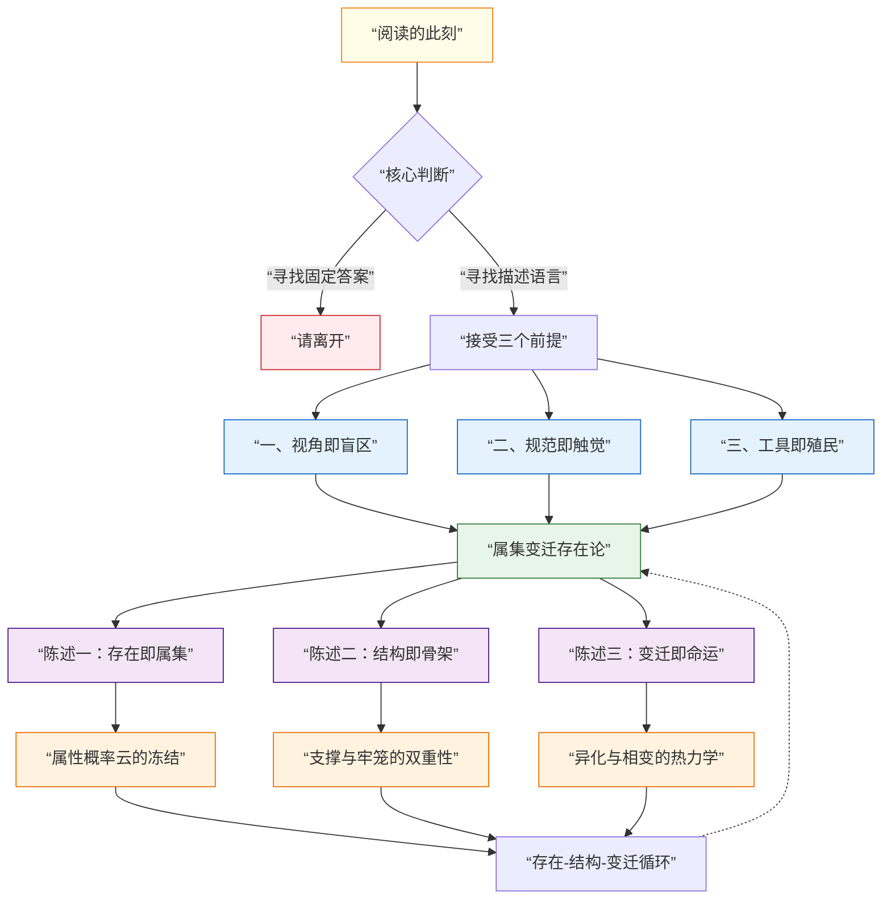
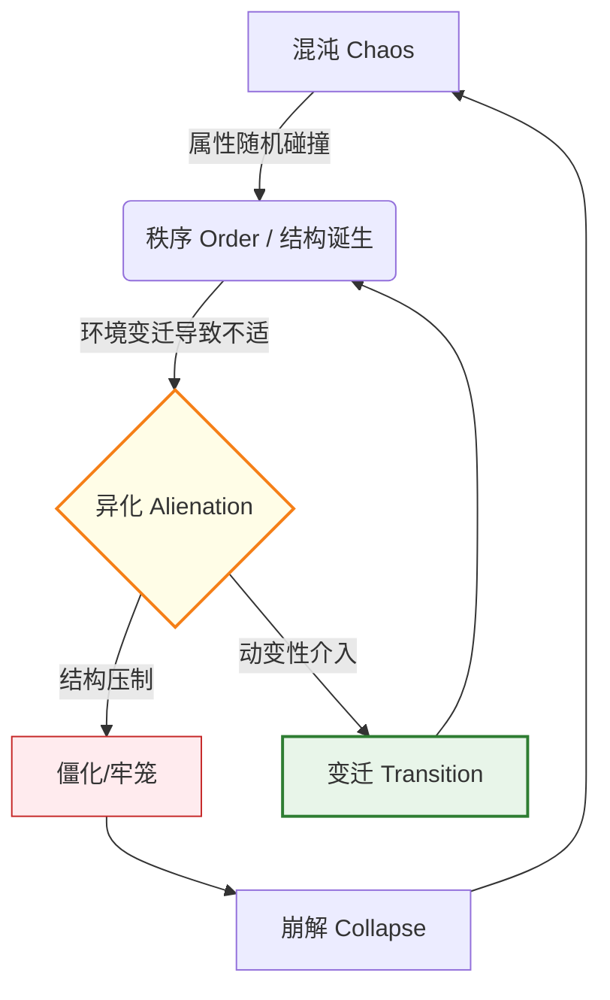
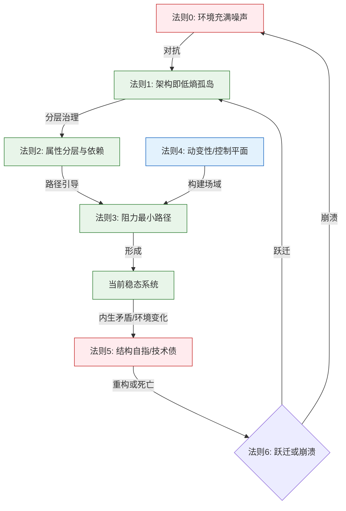
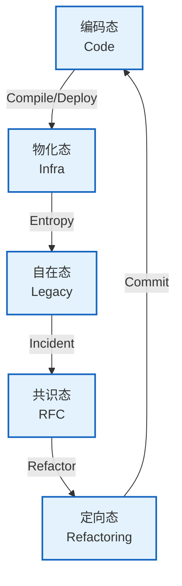
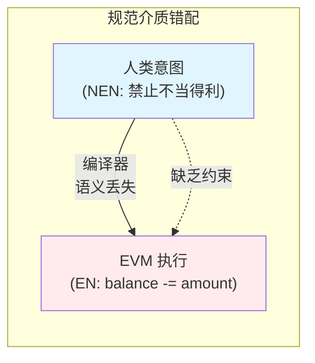
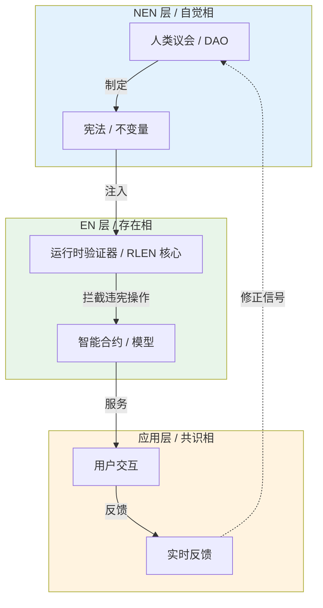
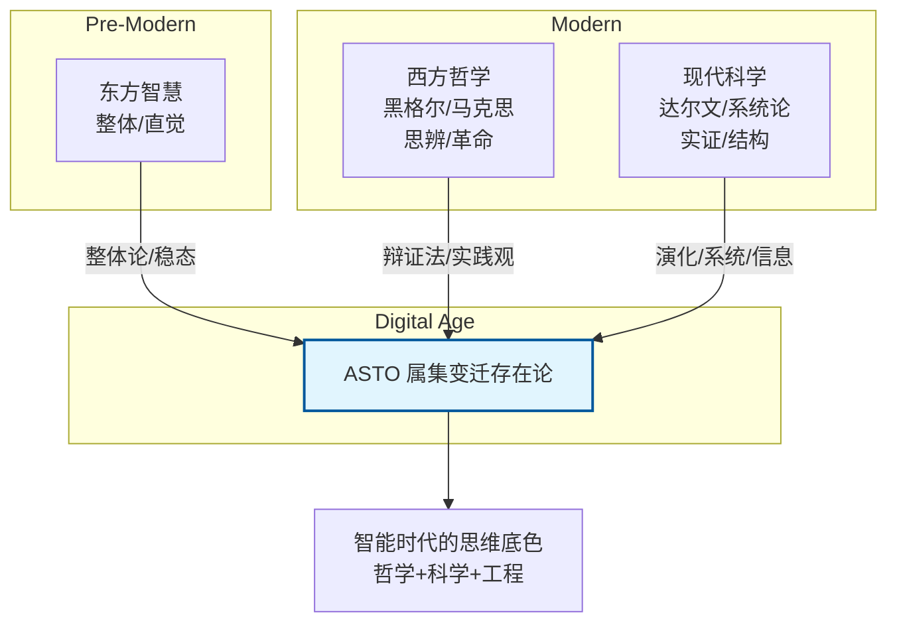
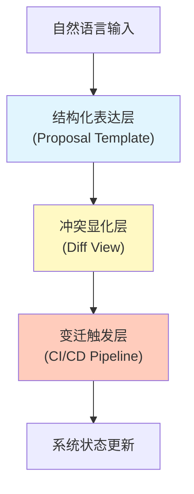
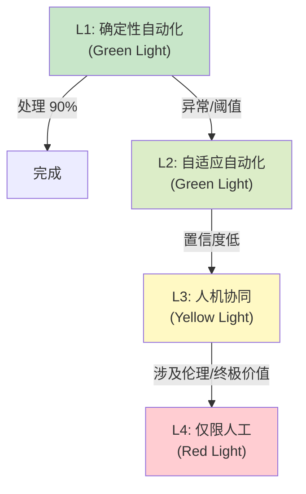
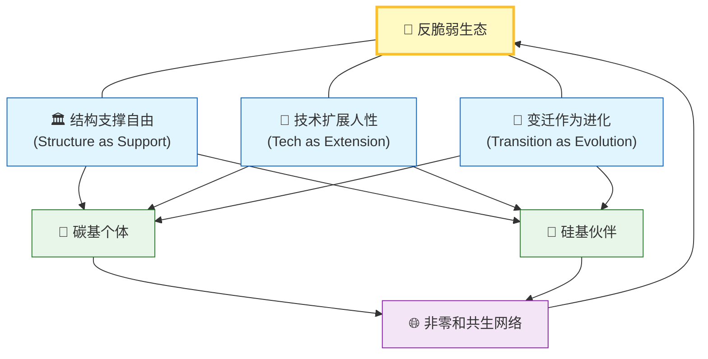

# **ASTO.U01. 图序：全景视觉索引**

> **Version**: Γ.2 (Index Synced)
> **Status**: Generated
> **Context**: 本文档汇集了 属集变迁存在论(ASTO) 体系中所有的核心图表，作为视觉化的全景索引。

---

## **图 01：进入路径与三重滤镜**
*   **来源**：`ASTO02.序章` / `ASTO03.宣言`
*   **描述**：描述了从“阅读此刻”到“进入领域”的认知校准过程。

---

## **图 02：ASTO 核心动力学循环**
*   **来源**：`ASTO03.宣言`
*   **描述**：展示了系统如何从混沌诞生秩序，又因环境变迁产生异化，最终走向崩解或跃迁。

---

## **图 03：系统的热力学逻辑流**
*   **来源**：`ASTO04.公理`
*   **描述**：展示了六大公理如何串联起系统的生命周期。

---

## **图 04：SDLC 状态机 (五态流转)**
*   **来源**：`ASTO06.本体`
*   **描述**：展示了代码在五种形态之间的转化路径。

---

## **图 05：语义丢失 (Semantic Loss)**

---

## 

## **图 06：五态分层治理架构**

*   **来源**：`ASTO12.Web3` / `ASTO13.AI` (原 ASTO10/ASTO11; 重构为 Mermaid)
*   **描述**：展示了 NEN 层、EN 层和应用层如何协作。

---

## **图 07：历史坐标系**
*   **来源**：`ASTO02.序章 (附录)` / `ASTO12.溯源`
*   **描述**：展示了 ASTO 对东西方思想的传承与融合。

---

---

## **图 08：对话平台三层架构**

---

## **图 09：规范可执行性梯度 (NEG)**

---

## **图 10：ASTO 文明全景图** 

## 

