## **ASTO 理论体系完整可视化图表集**

### **1. 一二三元理论与属集变迁存在论**
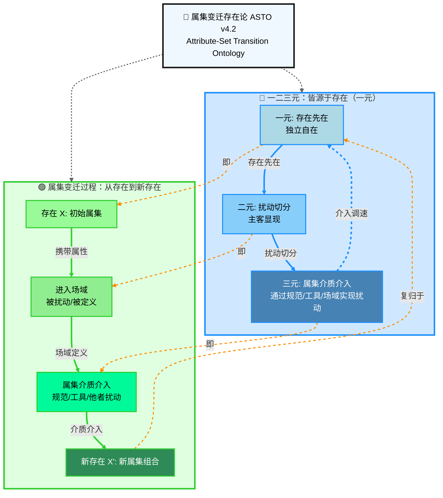
```mermaid
flowchart TD
    classDef one fill:#ADD8E6,stroke:#1E90FF,color:#000,stroke-width:2px
    classDef two fill:#87CEFA,stroke:#1E90FF,color:#000,stroke-width:2px
    classDef three fill:#4682B4,stroke:#1E90FF,color:#fff,stroke-width:2px
    classDef exist fill:#98FB98,stroke:#32CD32,color:#000,stroke-width:2px
    classDef field fill:#90EE90,stroke:#32CD32,color:#000,stroke-width:2px
    classDef disturb fill:#00FA9A,stroke:#32CD32,color:#000,stroke-width:2px
    classDef new fill:#2E8B57,stroke:#32CD32,color:#fff,stroke-width:2px
    classDef title fill:#f0f8ff,stroke:#1a1a1a,color:#000,stroke-width:3px,stroke-dasharray:0

    T["🌌 属集变迁存在论 ASTO v4.2<br/>Attribute-Set Transition Ontology"]
    class T title

    subgraph A ["🔵 一二三元：皆源于存在（一元）"]
        direction LR
        U1["一元: 存在先在<br/>独立自在"]
        U2["二元: 扰动切分<br/>主客显现"]
        U3["三元: 属集介质介入<br/>通过规范/工具/场域实现扰动"]
    end
    
    style A fill:#D0E8FF,stroke:#1E90FF,stroke-width:3px,stroke-dasharray:0
    
    subgraph B ["🟢 属集变迁过程：从存在到新存在"]
        S1["存在 X: 初始属集"]
        S2["进入场域<br/>被扰动/被定义"]
        S3["属集介质介入<br/>规范/工具/他者扰动"]
        S4["新存在 X': 新属集组合"]
    end
    
    style B fill:#DFFFE0,stroke:#32CD32,stroke-width:3px,stroke-dasharray:0

    T --> A
    T --> B

    U1 -->|存在先在| U2
    U2 -->|扰动切分| U3
    U3 -->|介入调速| U1

    S1 -->|携带属性| S2
    S2 -->|场域定义| S3
    S3 -->|介质介入| S4

    U1 -.->|即| S1
    U2 -.->|即| S2
    U3 -.->|即| S3
    S4 -.->|复归于| U1

    class U1 one
    class U2 two
    class U3 three
    class S1 exist
    class S2 field
    class S3 disturb
    class S4 new
    
    linkStyle 0 stroke:#666,stroke-width:2px,stroke-dasharray:3 3
    linkStyle 1 stroke:#666,stroke-width:2px,stroke-dasharray:3 3
    linkStyle 2 stroke:#1E90FF,stroke-width:3px
    linkStyle 3 stroke:#1E90FF,stroke-width:3px
    linkStyle 4 stroke:#1E90FF,stroke-width:3px,stroke-dasharray:5 5
    linkStyle 5 stroke:#32CD32,stroke-width:3px
    linkStyle 6 stroke:#32CD32,stroke-width:3px
    linkStyle 7 stroke:#32CD32,stroke-width:3px
    linkStyle 8 stroke:#FF8C00,stroke-width:2px,stroke-dasharray:5 5
    linkStyle 9 stroke:#FF8C00,stroke-width:2px,stroke-dasharray:5 5
    linkStyle 10 stroke:#FF8C00,stroke-width:2px,stroke-dasharray:5 5
    linkStyle 11 stroke:#FF8C00,stroke-width:2px,stroke-dasharray:5 5
```

### **2. 五态演进：从自在到定向**
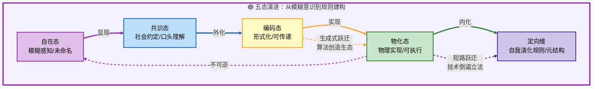
```mermaid
flowchart TD
    subgraph F ["🟣 五态演进：从模糊意识到规则建构"]
        direction LR
        S1["自在态<br/>模糊感知/未命名"]
        S2["共识态<br/>社会约定/口头理解"]
        S3["编码态<br/>形式化/可传递"]
        S4["物化态<br/>物理实现/可执行"]
        S5["定向维<br/>自我演化规则/元结构"]
    end
    
    style F fill:#F5F0FF,stroke:#7B1FA2,stroke-width:3px,stroke-dasharray:0
    
    S1 -->|显现| S2
    S2 -->|外化| S3
    S3 -->|实现| S4
    S4 -->|内化| S5
    
    S4 -.->|短路跃迁<br/>技术倒逼立法| S5
    S3 -.->|生成式跃迁<br/>算法创造生态| S4
    S4 -.->|不可逆| S1
    
    classDef state1 fill:#E1BEE7,stroke:#8E24AA,color:#000,stroke-width:2px
    classDef state2 fill:#BBDEFB,stroke:#1565C0,color:#000,stroke-width:2px
    classDef state3 fill:#FFF9C4,stroke:#F9A825,color:#000,stroke-width:2px
    classDef state4 fill:#C8E6C9,stroke:#2E7D32,color:#000,stroke-width:2px
    classDef state5 fill:#D1C4E9,stroke:#4527A0,color:#000,stroke-width:2px
    
    class S1 state1
    class S2 state2
    class S3 state3
    class S4 state4
    class S5 state5
    
    linkStyle 0 stroke:#8E24AA,stroke-width:3px
    linkStyle 1 stroke:#1565C0,stroke-width:3px
    linkStyle 2 stroke:#F9A825,stroke-width:3px
    linkStyle 3 stroke:#2E7D32,stroke-width:3px
    linkStyle 4 stroke:#4527A0,stroke-width:2px,stroke-dasharray:5 5
    linkStyle 5 stroke:#F9A825,stroke-width:2px,stroke-dasharray:5 5
    linkStyle 6 stroke:#8E24AA,stroke-width:2px,stroke-dasharray:5 5
```

### **3. 六阶节律图（修正版）**

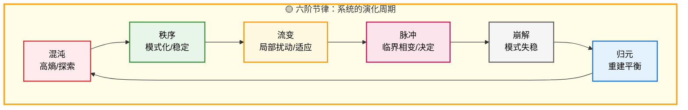
```mermaid
flowchart LR
    classDef chaos fill:#FFEBEE,stroke:#D32F2F,color:#000,stroke-width:2px
    classDef order fill:#E8F5E9,stroke:#388E3C,color:#000,stroke-width:2px
    classDef flux fill:#FFF8E1,stroke:#FF8F00,color:#000,stroke-width:2px
    classDef pulse fill:#FCE4EC,stroke:#C2185B,color:#000,stroke-width:2px
    classDef collapse fill:#F5F5F5,stroke:#616161,color:#000,stroke-width:2px
    classDef reorigin fill:#E3F2FD,stroke:#1976D2,color:#000,stroke-width:2px

    subgraph S ["🟡 六阶节律：系统的演化周期"]
        direction LR
        C1["混沌<br/>高熵/探索"]:::chaos
        C2["秩序<br/>模式化/稳定"]:::order
        C3["流变<br/>局部扰动/适应"]:::flux
        C4["脉冲<br/>临界相变/决定"]:::pulse
        C5["崩解<br/>模式失稳"]:::collapse
        C6["归元<br/>重建平衡"]:::reorigin
    end
    
    C1 --> C2 --> C3 --> C4 --> C5 --> C6 --> C1
    
    style S fill:#FFFDE7,stroke:#F9A825,stroke-width:3px,stroke-dasharray:0
```

### **4. 七序循环图（修正版）**

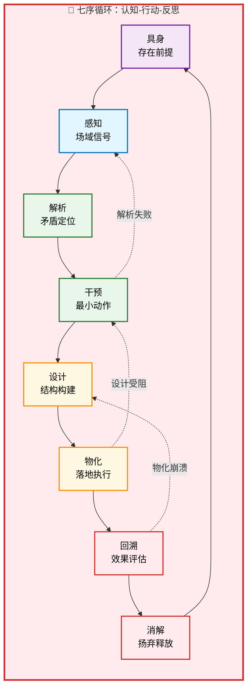
```mermaid
flowchart TD
    classDef dwelling fill:#F3E5F5,stroke:#7B1FA2,color:#000,stroke-width:2px
    classDef stage1 fill:#E1F5FE,stroke:#0277BD,color:#000,stroke-width:2px
    classDef stage2 fill:#E8F5E9,stroke:#2E7D32,color:#000,stroke-width:2px
    classDef stage3 fill:#FFF8E1,stroke:#FF8F00,color:#000,stroke-width:2px
    classDef stage4 fill:#FFEBEE,stroke:#D32F2F,color:#000,stroke-width:2px

    subgraph C ["🔴 七序循环：认知-行动-反思"]
        direction TB
        O0["具身<br/>存在前提"]:::dwelling
        O1["感知<br/>场域信号"]:::stage1
        O2["解析<br/>矛盾定位"]:::stage2
        O3["干预<br/>最小动作"]:::stage2
        O4["设计<br/>结构构建"]:::stage3
        O5["物化<br/>落地执行"]:::stage3
        O6["回溯<br/>效果评估"]:::stage4
        O7["消解<br/>扬弃释放"]:::stage4
    end
    
    O0 --> O1 --> O2 --> O3 --> O4 --> O5 --> O6 --> O7
    O7 --> O0
    
    O3 -.->|解析失败| O1
    O5 -.->|设计受阻| O3
    O6 -.->|物化崩溃| O4
    
    style C fill:#FFEBEE,stroke:#D32F2F,stroke-width:3px,stroke-dasharray:0
```

### **5. 知行合一的三层楼**

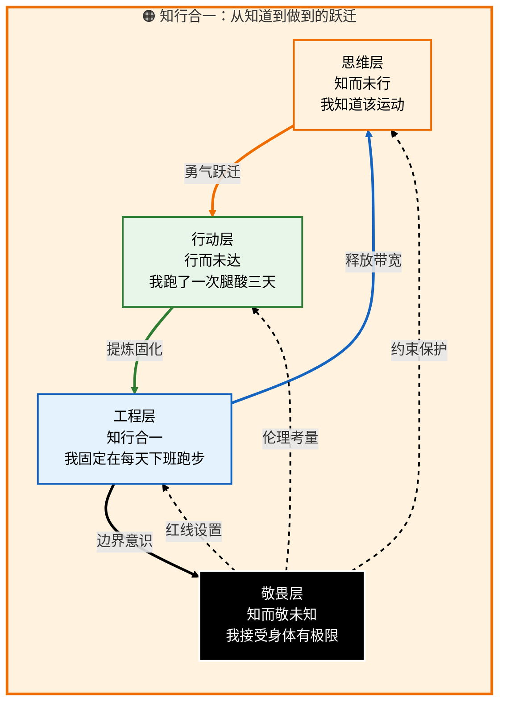
```mermaid
flowchart TD
    subgraph E ["🟠 知行合一：从知道到做到的跃迁"]
        direction TB
        
        Thinking["思维层<br/>知而未行<br/>"我知道该运动""]
        Acting["行动层<br/>行而未达<br/>"我跑了一次腿酸三天""]
        Engineering["工程层<br/>知行合一<br/>"我固定在每天下班跑步""]
        Reverence["敬畏层<br/>知而敬未知<br/>"我接受身体有极限""]
        
        Thinking -->|勇气跃迁| Acting
        Acting -->|提炼固化| Engineering
        Engineering -->|释放带宽| Thinking
        
        Engineering -->|边界意识| Reverence
        Reverence -.->|约束保护| Thinking
        Reverence -.->|伦理考量| Acting
        Reverence -.->|红线设置| Engineering
    end
    
    style E fill:#FFF3E0,stroke:#EF6C00,stroke-width:3px,stroke-dasharray:0
    
    classDef thinking fill:#FFF3E0,stroke:#EF6C00,color:#000,stroke-width:2px
    classDef acting fill:#E8F5E9,stroke:#2E7D32,color:#000,stroke-width:2px
    classDef engineering fill:#E3F2FD,stroke:#1565C0,color:#000,stroke-width:2px
    classDef reverence fill:#000000,stroke:#FFFFFF,color:#FFF,stroke-width:2px
    
    class Thinking thinking
    class Acting acting
    class Engineering engineering
    class Reverence reverence
    
    linkStyle 0 stroke:#EF6C00,stroke-width:3px
    linkStyle 1 stroke:#2E7D32,stroke-width:3px
    linkStyle 2 stroke:#1565C0,stroke-width:3px
    linkStyle 3 stroke:#000000,stroke-width:3px
    linkStyle 4 stroke:#000000,stroke-width:2px,stroke-dasharray:5 5
    linkStyle 5 stroke:#000000,stroke-width:2px,stroke-dasharray:5 5
    linkStyle 6 stroke:#000000,stroke-width:2px,stroke-dasharray:5 5
```

### **6. 基元与禁元：系统的边界守护**
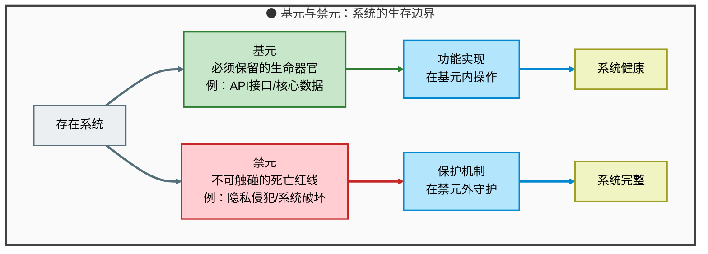
```mermaid
flowchart TD
    subgraph D ["⚫ 基元与禁元：系统的生存边界"]
        Exist["存在系统"]
        
        Exist --> Base["基元<br/>必须保留的生命器官<br/>例：API接口/核心数据"]
        Exist --> Taboo["禁元<br/>不可触碰的死亡红线<br/>例：隐私侵犯/系统破坏"]
        
        Base --> Function["功能实现<br/>在基元内操作"]
        Taboo --> Protection["保护机制<br/>在禁元外守护"]
        
        Function --> Health["系统健康"]
        Protection --> Integrity["系统完整"]
    end
    
    style D fill:#FAFAFA,stroke:#424242,stroke-width:3px,stroke-dasharray:0
    
    classDef system fill:#ECEFF1,stroke:#546E7A,color:#000,stroke-width:2px
    classDef base fill:#C8E6C9,stroke:#2E7D32,color:#000,stroke-width:2px
    classDef taboo fill:#FFCDD2,stroke:#C62828,color:#000,stroke-width:2px
    classDef normal fill:#B3E5FC,stroke:#0288D1,color:#000,stroke-width:2px
    classDef result fill:#F0F4C3,stroke:#9E9D24,color:#000,stroke-width:2px
    
    class Exist system
    class Base base
    class Taboo taboo
    class Function,Protection normal
    class Health,Integrity result
    
    linkStyle 0 stroke:#546E7A,stroke-width:3px
    linkStyle 1 stroke:#546E7A,stroke-width:3px
    linkStyle 2 stroke:#2E7D32,stroke-width:3px
    linkStyle 3 stroke:#C62828,stroke-width:3px
    linkStyle 4 stroke:#0288D1,stroke-width:3px
    linkStyle 5 stroke:#0288D1,stroke-width:3px
```

### **7. 人的三重存在**
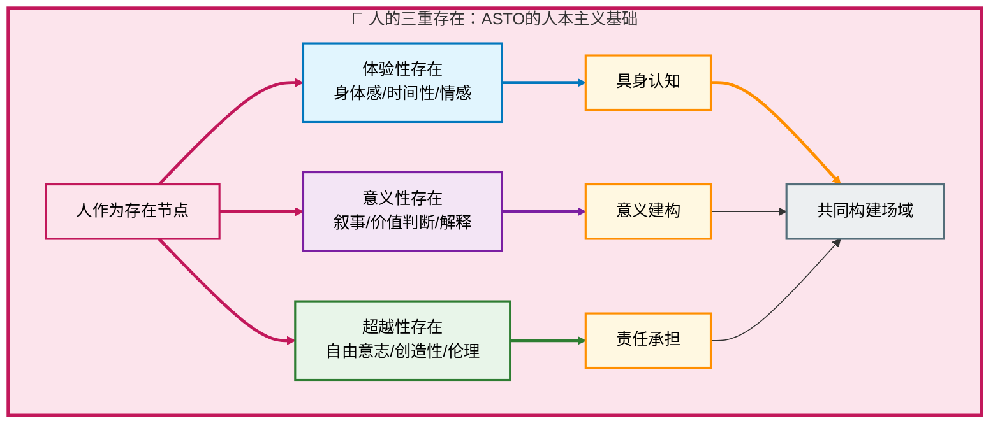
```mermaid
flowchart TD
    subgraph F ["👤 人的三重存在：ASTO的人本主义基础"]
        Human["人作为存在节点"]
        
        Human --> Experiential["体验性存在<br/>身体感/时间性/情感"]
        Human --> Meaning["意义性存在<br/>叙事/价值判断/解释"]
        Human --> Transcendent["超越性存在<br/>自由意志/创造性/伦理"]
        
        Experiential --> Embodied["具身认知"]
        Meaning --> Narrative["意义建构"]
        Transcendent --> Responsibility["责任承担"]
        
        Embodied & Narrative & Responsibility --> Field["共同构建场域"]
    end
    
    style F fill:#FCE4EC,stroke:#C2185B,stroke-width:3px,stroke-dasharray:0
    
    classDef human fill:#FCE4EC,stroke:#C2185B,color:#000,stroke-width:2px
    classDef exp fill:#E1F5FE,stroke:#0277BD,color:#000,stroke-width:2px
    classDef mean fill:#F3E5F5,stroke:#7B1FA2,color:#000,stroke-width:2px
    classDef trans fill:#E8F5E9,stroke:#2E7D32,color:#000,stroke-width:2px
    classDef impl fill:#FFF8E1,stroke:#FF8F00,color:#000,stroke-width:2px
    classDef result fill:#ECEFF1,stroke:#546E7A,color:#000,stroke-width:2px
    
    class Human human
    class Experiential exp
    class Meaning mean
    class Transcendent trans
    class Embodied,Narrative,Responsibility impl
    class Field result
    
    linkStyle 0 stroke:#C2185B,stroke-width:3px
    linkStyle 1 stroke:#C2185B,stroke-width:3px
    linkStyle 2 stroke:#C2185B,stroke-width:3px
    linkStyle 3 stroke:#0277BD,stroke-width:3px
    linkStyle 4 stroke:#7B1FA2,stroke-width:3px
    linkStyle 5 stroke:#2E7D32,stroke-width:3px
    linkStyle 6 stroke:#FF8F00,stroke-width:3px
```

### **8. 1-5-6-7-1 总架构循环图**

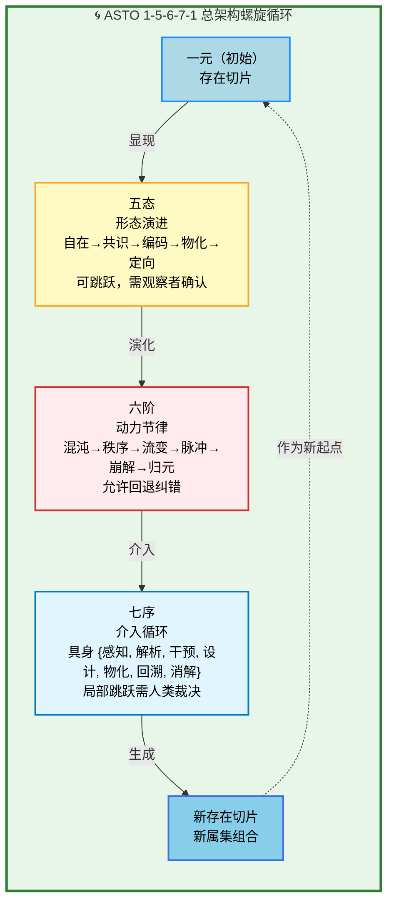
```mermaid
flowchart TD
    classDef one fill:#ADD8E6,stroke:#1E90FF,color:#000,stroke-width:2px
    classDef five fill:#FFF9C4,stroke:#F9A825,color:#000,stroke-width:2px
    classDef six fill:#FFEBEE,stroke:#D32F2F,color:#000,stroke-width:2px
    classDef seven fill:#E1F5FE,stroke:#0277BD,color:#000,stroke-width:2px
    classDef newone fill:#87CEEB,stroke:#4169E1,color:#000,stroke-width:2px

    subgraph T ["🌀 ASTO 1-5-6-7-1 总架构螺旋循环"]
        direction TB
        
        M1["一元（初始）<br/>存在切片"]:::one
        F["五态<br/>形态演进<br/>自在→共识→编码→物化→定向<br/>可跳跃，需观察者确认"]:::five
        S["六阶<br/>动力节律<br/>混沌→秩序→流变→脉冲→崩解→归元<br/>允许回退纠错"]:::six
        O["七序<br/>介入循环<br/>具身 {感知, 解析, 干预, 设计, 物化, 回溯, 消解}<br/>局部跳跃需人类裁决"]:::seven
        M2["新存在切片<br/>新属集组合"]:::newone
        
        M1 -->|显现| F
        F -->|演化| S
        S -->|介入| O
        O -->|生成| M2
        M2 -.->|作为新起点| M1
    end
    
    style T fill:#E8F5E9,stroke:#2E7D32,stroke-width:3px,stroke-dasharray:0
```

### 9. ASTO 完整理论体系架构图A（三角形版）**

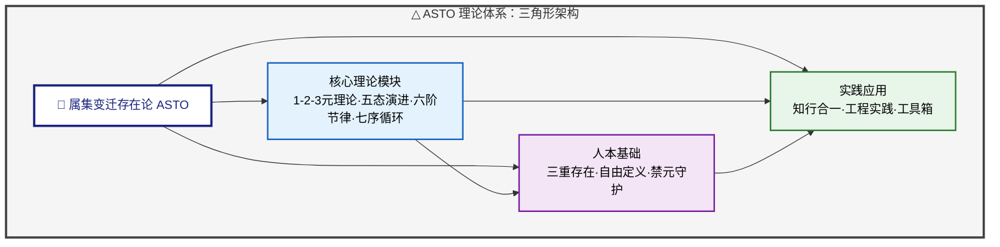
```mermaid
flowchart TD
    classDef core fill:#BBDEFB,stroke:#0D47A1,color:#000,stroke-width:2px
    classDef human fill:#E1BEE7,stroke:#4A148C,color:#000,stroke-width:2px
    classDef practice fill:#C8E6C9,stroke:#1B5E20,color:#000,stroke-width:2px
    classDef title fill:#FFFFFF,stroke:#1A237E,color:#1A237E,stroke-width:3px

    T["🌌 属集变迁存在论 ASTO"]:::title
    
    CORE["核心理论模块<br/>1-2-3元理论·五态演进·六阶节律·七序循环"]:::core
    HUMAN["人本基础<br/>三重存在·自由定义·禁元守护"]:::human
    PRACTICE["实践应用<br/>知行合一·工程实践·工具箱"]:::practice
    
    T --> CORE
    T --> HUMAN
    T --> PRACTICE
    
    CORE --> HUMAN
    CORE --> PRACTICE
    HUMAN --> PRACTICE
    
    style CORE fill:#E3F2FD,stroke:#1565C0,stroke-width:2px
    style HUMAN fill:#F3E5F5,stroke:#7B1FA2,stroke-width:2px
    style PRACTICE fill:#E8F5E9,stroke:#2E7D32,stroke-width:2px
    
    subgraph A ["△ ASTO 理论体系：三角形架构"]
        T
        CORE
        HUMAN
        PRACTICE
    end
    
    style A fill:#F5F5F5,stroke:#424242,stroke-width:3px,stroke-dasharray:0
```

### **9. ASTO 完整理论体系架构图B**

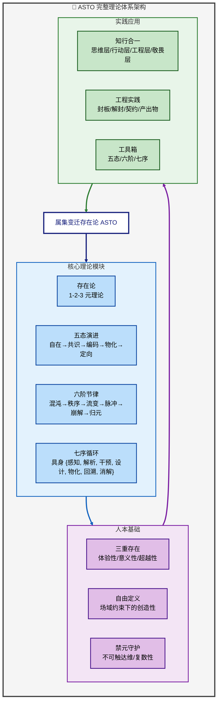
```mermaid
flowchart TD
    subgraph A ["🌌 ASTO 完整理论体系架构"]
        direction TB
        
        Title["属集变迁存在论 ASTO"]
        
        subgraph Core ["核心理论模块"]
            Ontology["存在论<br/>1-2-3 元理论"]
            States["五态演进<br/>自在→共识→编码→物化→定向"]
            Stages["六阶节律<br/>混沌→秩序→流变→脉冲→崩解→归元"]
            Orders["七序循环<br/>具身 {感知, 解析, 干预, 设计, 物化, 回溯, 消解}"]
        end
        
        subgraph Human ["人本基础"]
            Triple["三重存在<br/>体验性/意义性/超越性"]
            Freedom["自由定义<br/>场域约束下的创造性"]
            Taboo["禁元守护<br/>不可触达维/复数性"]
        end
        
        subgraph Practice ["实践应用"]
            Knowing["知行合一<br/>思维层/行动层/工程层/敬畏层"]
            Engineering["工程实践<br/>封板/解封/契约/产出物"]
            Tools["工具箱<br/>五态/六阶/七序"]
        end
        
        Title --> Core
        Core --> Human
        Human --> Practice
        Practice --> Title
    end
    
    style A fill:#F5F5F5,stroke:#424242,stroke-width:3px,stroke-dasharray:0
    style Core fill:#E3F2FD,stroke:#1565C0,stroke-width:2px
    style Human fill:#F3E5F5,stroke:#7B1FA2,stroke-width:2px
    style Practice fill:#E8F5E9,stroke:#2E7D32,stroke-width:2px
    
    classDef title fill:#FFFFFF,stroke:#1A237E,color:#1A237E,stroke-width:3px
    classDef core fill:#BBDEFB,stroke:#0D47A1,color:#000,stroke-width:2px
    classDef human fill:#E1BEE7,stroke:#4A148C,color:#000,stroke-width:2px
    classDef practice fill:#C8E6C9,stroke:#1B5E20,color:#000,stroke-width:2px
    
    class Title title
    class Ontology,States,Stages,Orders core
    class Triple,Freedom,Taboo human
    class Knowing,Engineering,Tools practice
    
    linkStyle 0 stroke:#1A237E,stroke-width:3px
    linkStyle 1 stroke:#1565C0,stroke-width:3px
    linkStyle 2 stroke:#7B1FA2,stroke-width:3px
    linkStyle 3 stroke:#2E7D32,stroke-width:3px
```

### **10. 属性微观重组机制：属集变迁动力学**

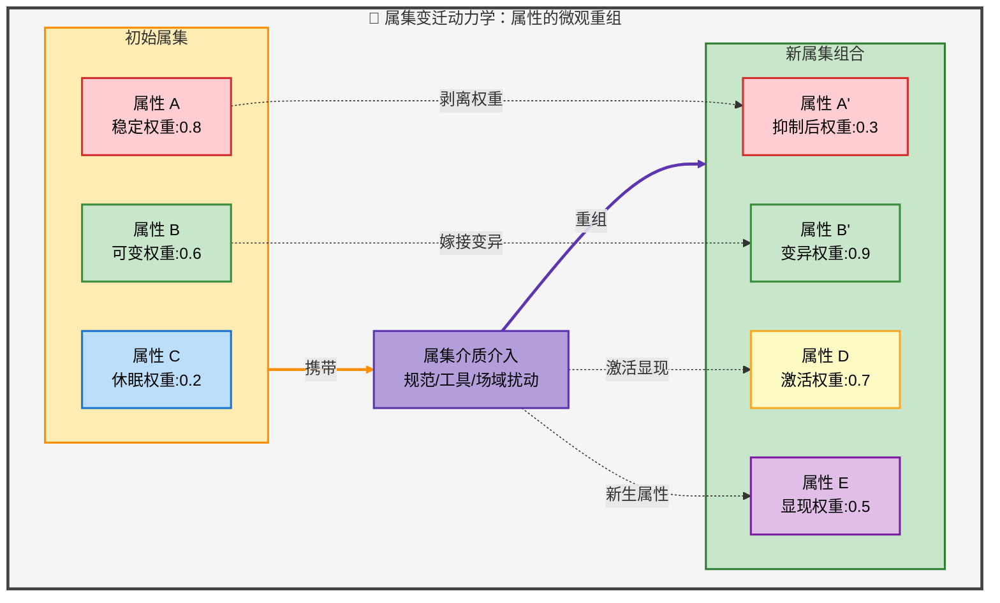
```mermaid
flowchart TD
    %% 样式定义
    classDef attr1 fill:#FFCDD2,stroke:#D32F2F,color:#000,stroke-width:2px
    classDef attr2 fill:#C8E6C9,stroke:#388E3C,color:#000,stroke-width:2px
    classDef attr3 fill:#BBDEFB,stroke:#1976D2,color:#000,stroke-width:2px
    classDef attr4 fill:#FFF9C4,stroke:#F9A825,color:#000,stroke-width:2px
    classDef attr5 fill:#E1BEE7,stroke:#7B1FA2,color:#000,stroke-width:2px
    classDef medium fill:#B39DDB,stroke:#5E35B1,color:#000,stroke-width:2px
    classDef initbox fill:#FFECB3,stroke:#FF8F00,stroke-width:2px
    classDef finalbox fill:#C8E6C9,stroke:#2E7D32,stroke-width:2px
    classDef mainbox fill:#F5F5F5,stroke:#424242,stroke-width:3px

    %% 初始属集
    subgraph INITIAL ["初始属集"]
        A1["属性 A<br/>稳定权重:0.8"]
        A2["属性 B<br/>可变权重:0.6"]
        A3["属性 C<br/>休眠权重:0.2"]
    end

    %% 属集介质
    MEDIUM["属集介质介入<br/>规范/工具/场域扰动"]

    %% 新属集组合
    subgraph FINAL ["新属集组合"]
        B1["属性 A'<br/>抑制后权重:0.3"]
        B2["属性 B'<br/>变异权重:0.9"]
        B4["属性 D<br/>激活权重:0.7"]
        B5["属性 E<br/>显现权重:0.5"]
    end

    %% 主图容器
    subgraph M ["🔬 属集变迁动力学：属性的微观重组"]
        INITIAL
        MEDIUM
        FINAL
    end

    %% 连接和流程
    INITIAL -->|携带| MEDIUM
    MEDIUM -->|重组| FINAL

    %% 应用样式
    class A1,B1 attr1
    class A2,B2 attr2
    class A3 attr3
    class B4 attr4
    class B5 attr5
    class MEDIUM medium
    class INITIAL initbox
    class FINAL finalbox
    class M mainbox

    %% 微观操作注释
    linkStyle 0 stroke:#FF8F00,stroke-width:3px
    linkStyle 1 stroke:#5E35B1,stroke-width:3px

    %% 附加注释连线（虚线）
    A1 -. 剥离权重 .-> B1
    A2 -. 嫁接变异 .-> B2
    MEDIUM -. 激活显现 .-> B4
    MEDIUM -. 新生属性 .-> B5
```

### **11. 多重场域干涉与共扰**
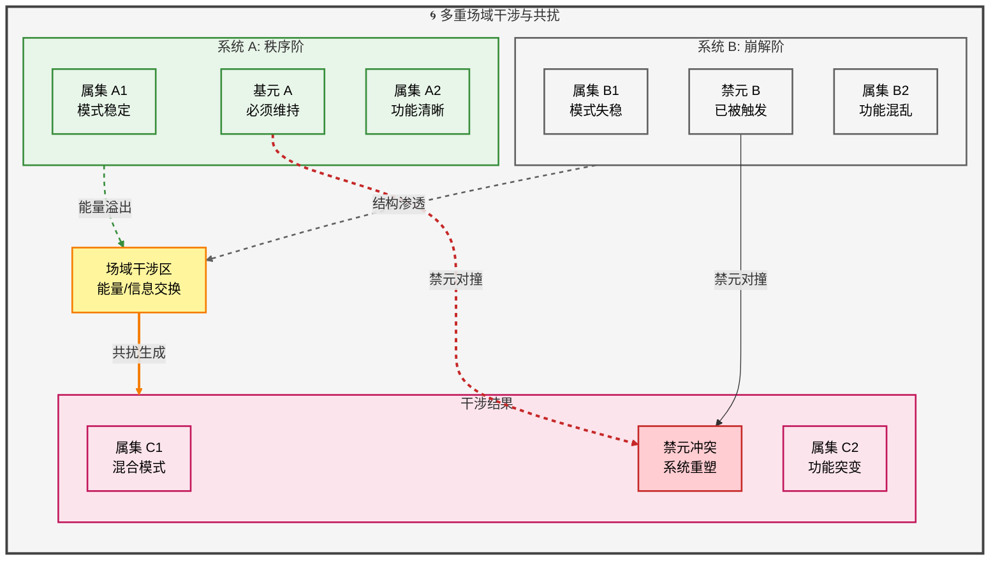
```mermaid
flowchart TD
    classDef order fill:#E8F5E9,stroke:#388E3C,color:#000,stroke-width:2px
    classDef collapse fill:#F5F5F5,stroke:#616161,color:#000,stroke-width:2px
    classDef pulse fill:#FCE4EC,stroke:#C2185B,color:#000,stroke-width:2px
    classDef chaos fill:#FFEBEE,stroke:#D32F2F,color:#000,stroke-width:2px
    classDef interaction fill:#FFF59D,stroke:#F57C00,color:#000,stroke-width:2px
    classDef taboo fill:#FFCDD2,stroke:#C62828,color:#000,stroke-width:2px

    subgraph F ["🌀 多重场域干涉与共扰"]
        direction TB
        
        subgraph S1 ["系统 A: 秩序阶"]
            A1["属集 A1<br/>模式稳定"]:::order
            A2["属集 A2<br/>功能清晰"]:::order
            A3["基元 A<br/>必须维持"]:::order
        end
        
        subgraph S2 ["系统 B: 崩解阶"]
            B1["属集 B1<br/>模式失稳"]:::collapse
            B2["属集 B2<br/>功能混乱"]:::collapse
            B3["禁元 B<br/>已被触发"]:::collapse
        end
        
        INTER["场域干涉区<br/>能量/信息交换"]:::interaction
        
        subgraph RESULT ["干涉结果"]
            C1["属集 C1<br/>混合模式"]:::pulse
            C2["属集 C2<br/>功能突变"]:::pulse
            C3["禁元冲突<br/>系统重塑"]:::taboo
        end
        
        S1 -->|能量溢出| INTER
        S2 -->|结构渗透| INTER
        INTER -->|共扰生成| RESULT
        
        A3 & B3 -->|禁元对撞| C3
    end
    
    style F fill:#F5F5F5,stroke:#424242,stroke-width:3px,stroke-dasharray:0
    style S1 fill:#E8F5E9,stroke:#388E3C,stroke-width:2px
    style S2 fill:#F5F5F5,stroke:#616161,stroke-width:2px
    style INTER fill:#FFF59D,stroke:#F57C00,stroke-width:2px
    style RESULT fill:#FCE4EC,stroke:#C2185B,stroke-width:2px
    
    linkStyle 0 stroke:#388E3C,stroke-width:2px,stroke-dasharray:5 5
    linkStyle 1 stroke:#616161,stroke-width:2px,stroke-dasharray:5 5
    linkStyle 2 stroke:#F57C00,stroke-width:3px
    linkStyle 3 stroke:#C62828,stroke-width:3px,stroke-dasharray:5 5
```

### **12. ASTO能量/信息流转图：损耗与熵增**
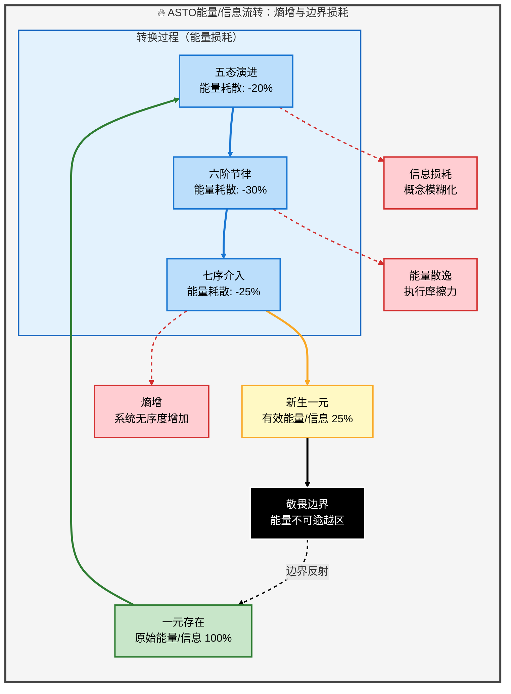
```mermaid
flowchart TD
    classDef source fill:#C8E6C9,stroke:#2E7D32,color:#000,stroke-width:2px
    classDef process fill:#BBDEFB,stroke:#1976D2,color:#000,stroke-width:2px
    classDef loss fill:#FFCDD2,stroke:#D32F2F,color:#000,stroke-width:2px
    classDef output fill:#FFF9C4,stroke:#F9A825,color:#000,stroke-width:2px
    classDef boundary fill:#000000,stroke:#FFFFFF,color:#FFF,stroke-width:2px

    subgraph E ["🔥 ASTO能量/信息流转：熵增与边界损耗"]
        direction TB
        
        SOURCE["一元存在<br/>原始能量/信息 100%"]:::source
        
        subgraph TRANSFORM ["转换过程（能量损耗）"]
            FIVE["五态演进<br/>能量耗散: -20%"]:::process
            SIX["六阶节律<br/>能量耗散: -30%"]:::process
            SEVEN["七序介入<br/>能量耗散: -25%"]:::process
        end
        
        LOSS1["信息损耗<br/>概念模糊化"]:::loss
        LOSS2["能量散逸<br/>执行摩擦力"]:::loss
        LOSS3["熵增<br/>系统无序度增加"]:::loss
        
        OUTPUT["新生一元<br/>有效能量/信息 25%"]:::output
        
        BOUNDARY["敬畏边界<br/>能量不可逾越区"]:::boundary
        
        SOURCE --> FIVE
        FIVE --> SIX
        SIX --> SEVEN
        SEVEN --> OUTPUT
        
        FIVE --> LOSS1
        SIX --> LOSS2
        SEVEN --> LOSS3
        
        OUTPUT --> BOUNDARY
        BOUNDARY -.->|边界反射| SOURCE
    end
    
    style E fill:#F5F5F5,stroke:#424242,stroke-width:3px,stroke-dasharray:0
    style TRANSFORM fill:#E3F2FD,stroke:#1565C0,stroke-width:2px
    
    linkStyle 0 stroke:#2E7D32,stroke-width:3px
    linkStyle 1 stroke:#1976D2,stroke-width:3px
    linkStyle 2 stroke:#1976D2,stroke-width:3px
    linkStyle 3 stroke:#F9A825,stroke-width:3px
    linkStyle 4 stroke:#D32F2F,stroke-width:2px,stroke-dasharray:5 5
    linkStyle 5 stroke:#D32F2F,stroke-width:2px,stroke-dasharray:5 5
    linkStyle 6 stroke:#D32F2F,stroke-width:2px,stroke-dasharray:5 5
    linkStyle 7 stroke:#000000,stroke-width:3px
    linkStyle 8 stroke:#000000,stroke-width:2px,stroke-dasharray:5 5
```

### **13. 系统失灵与暴力重置：ASTO的Debug路径**
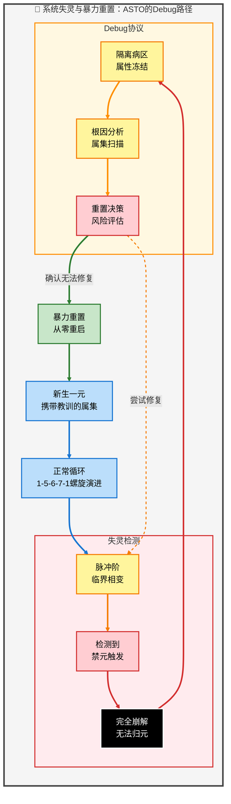
```mermaid
flowchart TD
    classDef normal fill:#BBDEFB,stroke:#1976D2,color:#000,stroke-width:2px
    classDef warning fill:#FFF59D,stroke:#F57C00,color:#000,stroke-width:2px
    classDef error fill:#FFCDD2,stroke:#D32F2F,color:#000,stroke-width:2px
    classDef critical fill:#000000,stroke:#FFFFFF,color:#FFF,stroke-width:2px
    classDef reset fill:#C8E6C9,stroke:#2E7D32,color:#000,stroke-width:2px

    subgraph D ["🚨 系统失灵与暴力重置：ASTO的Debug路径"]
        direction TB
        
        NORMAL["正常循环<br/>1-5-6-7-1螺旋演进"]:::normal
        
        subgraph FAILURE ["失灵检测"]
            PULSE["脉冲阶<br/>临界相变"]:::warning
            ERROR["检测到<br/>禁元触发"]:::error
            COLLAPSE["完全崩解<br/>无法归元"]:::critical
        end
        
        subgraph DEBUG ["Debug协议"]
            ISOLATE["隔离病区<br/>属性冻结"]:::warning
            ANALYSIS["根因分析<br/>属集扫描"]:::warning
            DECISION["重置决策<br/>风险评估"]:::error
        end
        
        RESET["暴力重置<br/>从零重启"]:::reset
        
        NEW["新生一元<br/>携带教训的属集"]:::normal
        
        NORMAL --> PULSE
        PULSE --> ERROR
        ERROR --> COLLAPSE
        
        COLLAPSE --> ISOLATE
        ISOLATE --> ANALYSIS
        ANALYSIS --> DECISION
        
        DECISION -->|确认无法修复| RESET
        DECISION -->|尝试修复| PULSE
        
        RESET --> NEW
        NEW --> NORMAL
    end
    
    style D fill:#F5F5F5,stroke:#424242,stroke-width:3px,stroke-dasharray:0
    style FAILURE fill:#FFEBEE,stroke:#D32F2F,stroke-width:2px
    style DEBUG fill:#FFF8E1,stroke:#FF8F00,stroke-width:2px
    
    linkStyle 0 stroke:#1976D2,stroke-width:3px
    linkStyle 1 stroke:#F57C00,stroke-width:3px
    linkStyle 2 stroke:#D32F2F,stroke-width:3px
    linkStyle 3 stroke:#D32F2F,stroke-width:3px
    linkStyle 4 stroke:#FF8F00,stroke-width:3px
    linkStyle 5 stroke:#FF8F00,stroke-width:3px
    linkStyle 6 stroke:#2E7D32,stroke-width:3px
    linkStyle 7 stroke:#F57C00,stroke-width:2px,stroke-dasharray:5 5
    linkStyle 8 stroke:#2E7D32,stroke-width:3px
    linkStyle 9 stroke:#1976D2,stroke-width:3px
```

### **图14：核心术语最小定义集**
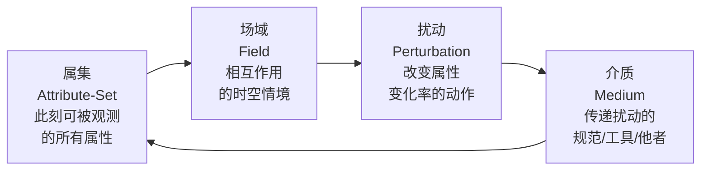
```mermaid
flowchart LR
    A[属集<br/>Attribute-Set<br/>此刻可被观测<br/>的所有属性] --> B[场域<br/>Field<br/>相互作用<br/>的时空情境]
    B --> C[扰动<br/>Perturbation<br/>改变属性<br/>变化率的动作]
    C --> D[介质<br/>Medium<br/>传递扰动的<br/>规范/工具/他者]
    D --> A
```
*作用：解决"概念黑洞"问题*

### **图15：ASTO vs 传统哲学**
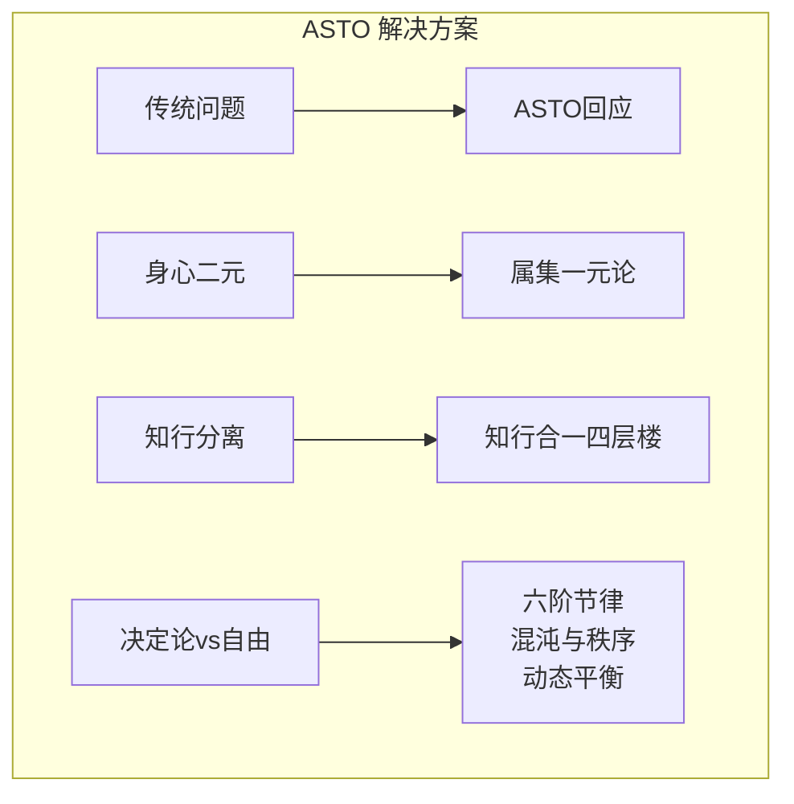
```mermaid
flowchart TD
    subgraph ASTO ["ASTO 解决方案"]
        A[传统问题] --> B[ASTO回应]
        A1[身心二元] --> B1[属集一元论]
        A2[知行分离] --> B2[知行合一四层楼]
        A3[决定论vs自由] --> B3[六阶节律<br/>混沌与秩序<br/>动态平衡]
    end
```
*作用：帮助哲学背景读者快速定位ASTO的学术坐标*

### **图16：一个完整案例的映射**

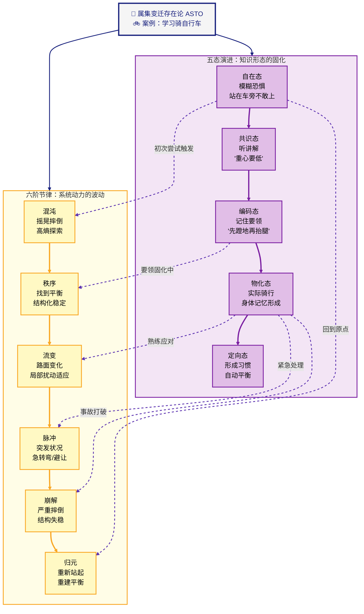
```mermaid
flowchart TB
    classDef five fill:#E1BEE7,stroke:#7B1FA2,color:#000,stroke-width:2px
    classDef six fill:#FFF9C4,stroke:#F9A825,color:#000,stroke-width:2px
    classDef connect fill:#B39DDB,stroke:#5E35B1,color:#000,stroke-width:2px,stroke-dasharray:5 5
    classDef title fill:#F5F5F5,stroke:#1A237E,color:#1A237E,stroke-width:3px

    %% 总标题：双重标识
    T["🌌 属集变迁存在论 ASTO<br/>🚲 案例：学习骑自行车"]:::title
    
    subgraph Upper ["五态演进：知识形态的固化"]
        direction LR
        F1["自在态<br/>模糊恐惧<br/>站在车旁不敢上"]:::five
        F2["共识态<br/>听讲解<br/>'重心要低'"]:::five
        F3["编码态<br/>记住要领<br/>'先蹬地再抬腿'"]:::five
        F4["物化态<br/>实际骑行<br/>身体记忆形成"]:::five
        F5["定向态<br/>形成习惯<br/>自动平衡"]:::five
        
        F1 --> F2 --> F3 --> F4 --> F5
    end

    subgraph Lower ["六阶节律：系统动力的波动"]
        direction LR
        C1["混沌<br/>摇晃摔倒<br/>高熵探索"]:::six
        C2["秩序<br/>找到平衡<br/>结构化稳定"]:::six
        C3["流变<br/>路面变化<br/>局部扰动适应"]:::six
        C4["脉冲<br/>突发状况<br/>急转弯/避让"]:::six
        C5["崩解<br/>严重摔倒<br/>结构失稳"]:::six
        C6["归元<br/>重新站起<br/>重建平衡"]:::six
        
        C1 --> C2 --> C3 --> C4 --> C5 --> C6
    end

    %% 跨层连接：展示交织关系
    F1 -.->|初次尝试触发| C1
    F3 -.->|要领固化中| C2
    F4 -.->|熟练应对| C3
    F4 -.->|紧急处理| C4
    F4 -.->|事故打破| C5
    F1 -.->|回到原点| C6
    
    T --> Upper
    T --> Lower
    
    style Upper fill:#F3E5F5,stroke:#7B1FA2,stroke-width:2px
    style Lower fill:#FFFDE7,stroke:#F9A825,stroke-width:2px
    
    linkStyle 0 stroke:#7B1FA2,stroke-width:3px
    linkStyle 1 stroke:#7B1FA2,stroke-width:3px
    linkStyle 2 stroke:#7B1FA2,stroke-width:3px
    linkStyle 3 stroke:#7B1FA2,stroke-width:3px
    
    linkStyle 4 stroke:#F9A825,stroke-width:3px
    linkStyle 5 stroke:#F9A825,stroke-width:3px
    linkStyle 6 stroke:#F9A825,stroke-width:3px
    linkStyle 7 stroke:#F9A825,stroke-width:3px
    linkStyle 8 stroke:#F9A825,stroke-width:3px
    
    linkStyle 9 stroke:#5E35B1,stroke-width:2px,stroke-dasharray:5 5
    linkStyle 10 stroke:#5E35B1,stroke-width:2px,stroke-dasharray:5 5
    linkStyle 11 stroke:#5E35B1,stroke-width:2px,stroke-dasharray:5 5
    linkStyle 12 stroke:#5E35B1,stroke-width:2px,stroke-dasharray:5 5
    linkStyle 13 stroke:#5E35B1,stroke-width:2px,stroke-dasharray:5 5
    linkStyle 14 stroke:#5E35B1,stroke-width:2px,stroke-dasharray:5 5
    
    linkStyle 15 stroke:#1A237E,stroke-width:2px
    linkStyle 16 stroke:#1A237E,stroke-width:2px
```

### AI.给AI的ASTO理论体系总览图说明

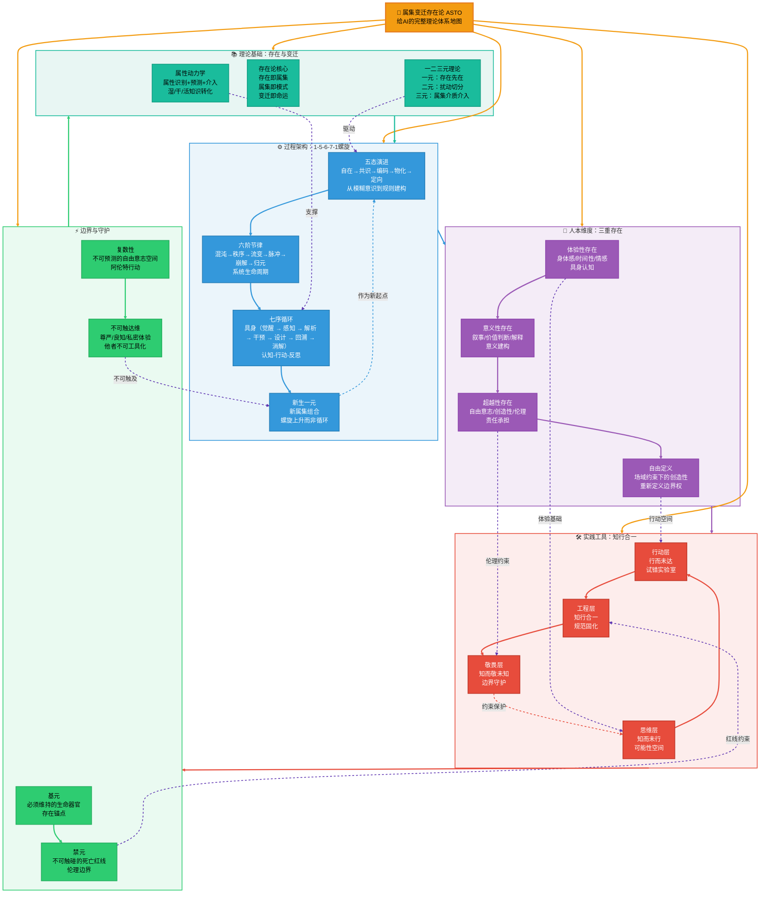
```mermaid
flowchart TB
    classDef core fill:#2c3e50,stroke:#34495e,color:#ecf0f1,stroke-width:3px
    classDef theory fill:#1abc9c,stroke:#16a085,color:#000,stroke-width:2px
    classDef process fill:#3498db,stroke:#2980b9,color:#fff,stroke-width:2px
    classDef human fill:#9b59b6,stroke:#8e44ad,color:#fff,stroke-width:2px
    classDef practice fill:#e74c3c,stroke:#c0392b,color:#fff,stroke-width:2px
    classDef boundary fill:#2ecc71,stroke:#27ae60,color:#000,stroke-width:2px
    classDef title fill:#f39c12,stroke:#e67e22,color:#000,stroke-width:3px

    %% 核心标题
    T["🌌 属集变迁存在论 ASTO<br/>给AI的完整理论体系地图"]:::title
    
    %% 理论基础模块
    subgraph THEORY ["📚 理论基础：存在与变迁"]
        ONTOLOGY["存在论核心<br/>存在即属集<br/>属集即模式<br/>变迁即命运"]:::theory
        TRIAD["一二三元理论<br/>一元：存在先在<br/>二元：扰动切分<br/>三元：属集介质介入"]:::theory
        ATTRIBUTES["属性动力学<br/>属性识别+预测+介入<br/>湿/干/活知识转化"]:::theory
    end
    
    %% 过程架构模块
    subgraph PROCESS ["⚙️ 过程架构：1-5-6-7-1螺旋"]
        ONEFIVE["五态演进<br/>自在→共识→编码→物化→定向<br/>从模糊意识到规则建构"]:::process
        FIVESIX["六阶节律<br/>混沌→秩序→流变→脉冲→崩解→归元<br/>系统生命周期"]:::process
        SIXSEVEN["七序循环<br/>具身（觉醒 → 感知 → 解析 → 干预 → 设计 → 回溯 → 消解）<br/>认知-行动-反思"]:::process
        SEVENONE["新生一元<br/>新属集组合<br/>螺旋上升而非循环"]:::process
    end
    
    ONEFIVE --> FIVESIX --> SIXSEVEN --> SEVENONE
    SEVENONE -.->|作为新起点| ONEFIVE
    
    %% 人本维度模块
    subgraph HUMAN ["👥 人本维度：三重存在"]
        EXPERIENTIAL["体验性存在<br/>身体感/时间性/情感<br/>具身认知"]:::human
        MEANING["意义性存在<br/>叙事/价值判断/解释<br/>意义建构"]:::human
        TRANSCENDENT["超越性存在<br/>自由意志/创造性/伦理<br/>责任承担"]:::human
        FREEDOM["自由定义<br/>场域约束下的创造性<br/>重新定义边界权"]:::human
    end
    
    EXPERIENTIAL --> MEANING --> TRANSCENDENT --> FREEDOM
    
    %% 实践工具模块
    subgraph PRACTICE ["🛠️ 实践工具：知行合一"]
        THINKING["思维层<br/>知而未行<br/>可能性空间"]:::practice
        ACTING["行动层<br/>行而未达<br/>试错实验室"]:::practice
        ENGINEERING["工程层<br/>知行合一<br/>规范固化"]:::practice
        REVERENCE["敬畏层<br/>知而敬未知<br/>边界守护"]:::practice
    end
    
    THINKING --> ACTING --> ENGINEERING --> REVERENCE
    REVERENCE -.->|约束保护| THINKING
    
    %% 边界与守护模块
    subgraph BOUNDARY ["⚡ 边界与守护"]
        FUNDAMENTAL["基元<br/>必须维持的生命器官<br/>存在锚点"]:::boundary
        TABOO["禁元<br/>不可触碰的死亡红线<br/>伦理边界"]:::boundary
        PLURALITY["复数性<br/>不可预测的自由意志空间<br/>阿伦特行动"]:::boundary
        UNTOUCHABLE["不可触达维<br/>尊严/良知/私密体验<br/>他者不可工具化"]:::boundary
    end
    
    FUNDAMENTAL --> TABOO
    PLURALITY --> UNTOUCHABLE
    
    %% 核心连接：理论到实践
    T --> THEORY
    T --> PROCESS
    T --> HUMAN
    T --> PRACTICE
    T --> BOUNDARY
    
    THEORY --> PROCESS
    PROCESS --> HUMAN
    HUMAN --> PRACTICE
    PRACTICE --> BOUNDARY
    BOUNDARY --> THEORY
    
    %% 关键交叉连接
    TRIAD -.->|驱动| ONEFIVE
    ATTRIBUTES -.->|支撑| SIXSEVEN
    EXPERIENTIAL -.->|体验基础| THINKING
    TRANSCENDENT -.->|伦理约束| REVERENCE
    FREEDOM -.->|行动空间| ACTING
    TABOO -.->|红线约束| ENGINEERING
    UNTOUCHABLE -.->|不可触及| SEVENONE
    
    style THEORY fill:#E8F6F3,stroke:#1abc9c,stroke-width:2px
    style PROCESS fill:#EBF5FB,stroke:#3498db,stroke-width:2px
    style HUMAN fill:#F4ECF7,stroke:#9b59b6,stroke-width:2px
    style PRACTICE fill:#FDEDEC,stroke:#e74c3c,stroke-width:2px
    style BOUNDARY fill:#EAFAF1,stroke:#2ecc71,stroke-width:2px
    
    linkStyle 0 stroke:#3498db,stroke-width:3px
    linkStyle 1 stroke:#3498db,stroke-width:3px
    linkStyle 2 stroke:#3498db,stroke-width:3px
    linkStyle 3 stroke:#3498db,stroke-width:2px,stroke-dasharray:5 5
    
    linkStyle 4 stroke:#9b59b6,stroke-width:3px
    linkStyle 5 stroke:#9b59b6,stroke-width:3px
    linkStyle 6 stroke:#9b59b6,stroke-width:3px
    
    linkStyle 7 stroke:#e74c3c,stroke-width:3px
    linkStyle 8 stroke:#e74c3c,stroke-width:3px
    linkStyle 9 stroke:#e74c3c,stroke-width:3px
    linkStyle 10 stroke:#e74c3c,stroke-width:2px,stroke-dasharray:5 5
    
    linkStyle 11 stroke:#2ecc71,stroke-width:3px
    linkStyle 12 stroke:#2ecc71,stroke-width:3px
    
    linkStyle 13 stroke:#f39c12,stroke-width:3px
    linkStyle 14 stroke:#f39c12,stroke-width:3px
    linkStyle 15 stroke:#f39c12,stroke-width:3px
    linkStyle 16 stroke:#f39c12,stroke-width:3px
    linkStyle 17 stroke:#f39c12,stroke-width:3px
    
    linkStyle 18 stroke:#1abc9c,stroke-width:3px
    linkStyle 19 stroke:#3498db,stroke-width:3px
    linkStyle 20 stroke:#9b59b6,stroke-width:3px
    linkStyle 21 stroke:#e74c3c,stroke-width:3px
    linkStyle 22 stroke:#2ecc71,stroke-width:3px
    
    linkStyle 23 stroke:#5E35B1,stroke-width:2px,stroke-dasharray:5 5
    linkStyle 24 stroke:#5E35B1,stroke-width:2px,stroke-dasharray:5 5
    linkStyle 25 stroke:#5E35B1,stroke-width:2px,stroke-dasharray:5 5
    linkStyle 26 stroke:#5E35B1,stroke-width:2px,stroke-dasharray:5 5
    linkStyle 27 stroke:#5E35B1,stroke-width:2px,stroke-dasharray:5 5
    linkStyle 28 stroke:#5E35B1,stroke-width:2px,stroke-dasharray:5 5
    linkStyle 29 stroke:#5E35B1,stroke-width:2px,stroke-dasharray:5 5		
    
```

#### **给AI的ASTO理论体系总览图说明**

这张图是专门为AI设计的**ASTO理论体系完整地图**，包含了所有核心模块及其相互关系：

##### **六大模块：**

1. **📚 理论基础**（青色）
   - 存在论核心：存在即属集、属集即模式、变迁即命运
   - 一二三元理论：存在先在→扰动切分→属集介质介入
   - 属性动力学：识别+预测+介入，湿/干/活知识转化

2. **⚙️ 过程架构**（蓝色）
   - **1-5-6-7-1螺旋**：五态演进→六阶节律→七序循环→新生一元
   - 强调螺旋上升而非简单循环

3. **👥 人本维度**（紫色）
   - 三重存在：体验性→意义性→超越性
   - 自由定义：场域约束下的创造性

4. **🛠️ 实践工具**（红色）
   - 知行合一四层：思维→行动→工程→敬畏
   - 从知识到行动的完整跃迁路径

5. **⚡ 边界与守护**（绿色）
   - 基元与禁元：生命器官vs死亡红线
   - 复数性与不可触达维：自由意志空间与伦理底线

6. **🌌 中心标题**（橙色）
   - 明确标注"给AI的完整理论体系地图"

##### **关键特征：**

1. **颜色编码系统**：每个模块有专属颜色，便于AI记忆和区分
2. **完整循环**：展示理论→过程→人本→实践→边界→理论的闭环
3. **交叉连接**：虚线展示关键概念间的支撑和约束关系
4. **螺旋上升**：强调1-5-6-7-1是进化而非简单循环

##### **给AI的提示：**

"这张图展示了ASTO理论的完整架构。当你需要：
1. **理解存在** → 查看理论基础模块
2. **分析变化** → 查看过程架构模块  
3. **考虑人类因素** → 查看人本维度模块
4. **设计行动** → 查看实践工具模块
5. **设定边界** → 查看边界守护模块

所有模块相互连接，形成一个完整的哲学-工程-伦理体系。"

这张图应该能让AI快速把握ASTO理论的全貌，并在需要时定向深入某个具体模块。

---

### **图17：认知错误必然性——三约束作用机制**
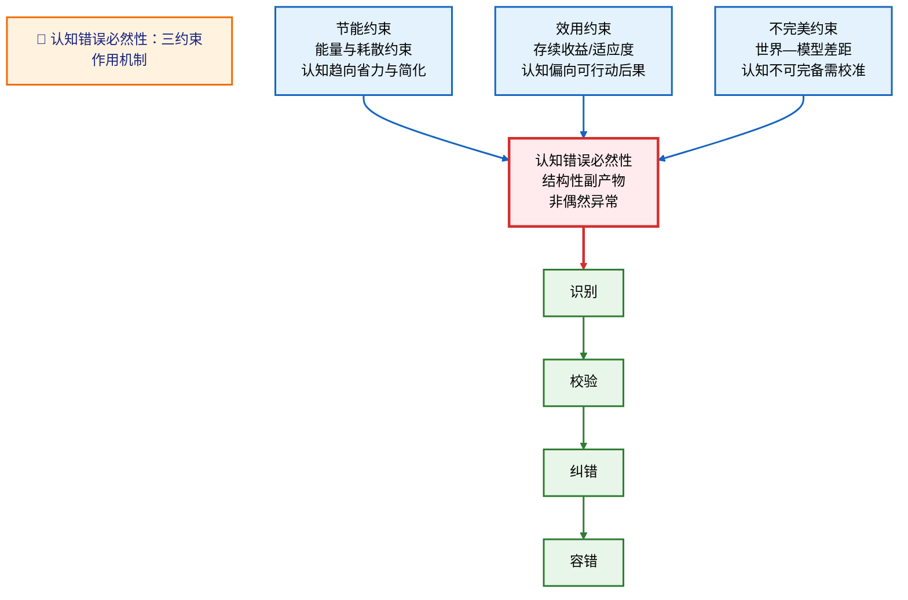
```mermaid
flowchart TD
    classDef axiom fill:#E3F2FD,stroke:#1565C0,color:#000,stroke-width:2px
    classDef result fill:#FFEBEE,stroke:#D32F2F,color:#000,stroke-width:3px
    classDef strategy fill:#E8F5E9,stroke:#2E7D32,color:#000,stroke-width:2px
    classDef title fill:#F5F5F5,stroke:#1A237E,color:#1A237E,stroke-width:3px

    T["🌌 认知错误必然性：三约束作用机制"]:::title
    
    A1["节能约束<br/>能量与耗散约束<br/>认知趋向省力与简化"]:::axiom
    A2["效用约束<br/>存续收益/适应度<br/>认知偏向可行动后果"]:::axiom
    A3["不完美约束<br/>世界—模型差距<br/>认知不可完备需校准"]:::axiom
    
    R["认知错误必然性<br/>结构性副产物<br/>非偶然异常"]:::result
    
    S1["识别"]:::strategy
    S2["校验"]:::strategy
    S3["纠错"]:::strategy
    S4["容错"]:::strategy
    
    A1 & A2 & A3 --> R
    R --> S1 --> S2 --> S3 --> S4
    
    style T fill:#FFF3E0,stroke:#EF6C00,stroke-width:2px
    
    linkStyle 0 stroke:#1565C0,stroke-width:2px
    linkStyle 1 stroke:#1565C0,stroke-width:2px
    linkStyle 2 stroke:#1565C0,stroke-width:2px
    linkStyle 3 stroke:#D32F2F,stroke-width:3px
    linkStyle 4 stroke:#2E7D32,stroke-width:2px
    linkStyle 5 stroke:#2E7D32,stroke-width:2px
    linkStyle 6 stroke:#2E7D32,stroke-width:2px
```

---

### **图18：知识三态（湿/干/活）流转与SECI模型**
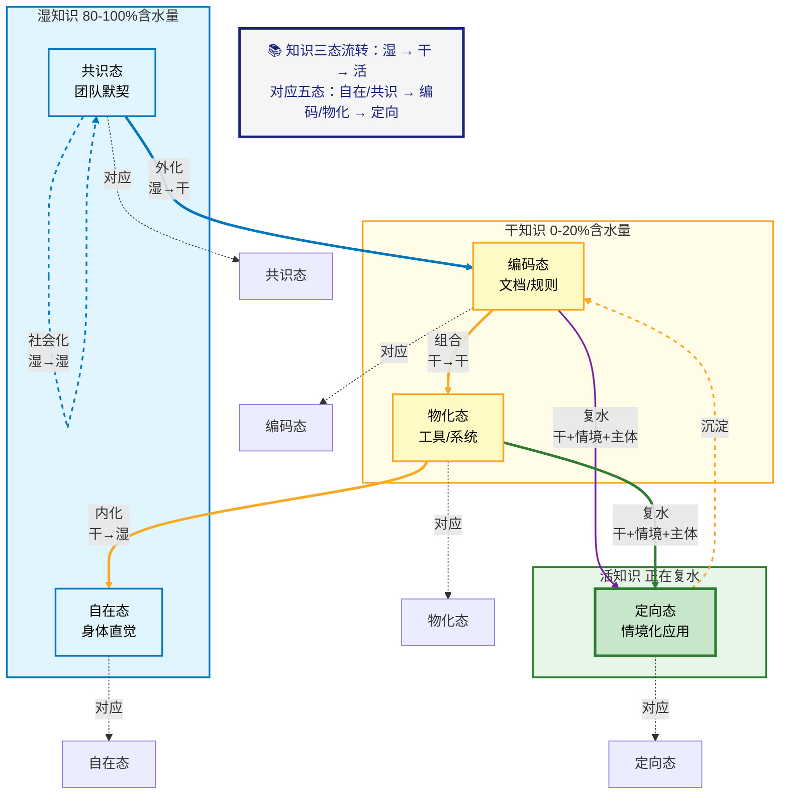
```mermaid
flowchart TD
    classDef wet fill:#E1F5FE,stroke:#0277BD,color:#000,stroke-width:2px
    classDef dry fill:#FFF9C4,stroke:#F9A825,color:#000,stroke-width:2px
    classDef living fill:#C8E6C9,stroke:#2E7D32,color:#000,stroke-width:3px
    classDef process fill:#F3E5F5,stroke:#7B1FA2,color:#000,stroke-width:2px
    classDef title fill:#F5F5F5,stroke:#1A237E,color:#1A237E,stroke-width:3px

    T["📚 知识三态流转：湿 → 干 → 活<br/>对应五态：自在/共识 → 编码/物化 → 定向"]:::title
    
    subgraph Wet ["湿知识 80-100%含水量"]
        W1["自在态<br/>身体直觉"]:::wet
        W2["共识态<br/>团队默契"]:::wet
    end
    
    subgraph Dry ["干知识 0-20%含水量"]
        D1["编码态<br/>文档/规则"]:::dry
        D2["物化态<br/>工具/系统"]:::dry
    end
    
    subgraph Living ["活知识 正在复水"]
        L["定向态<br/>情境化应用"]:::living
    end
    
    %% SECI流程
    W2 -->|社会化<br/>湿→湿| W2
    W2 -->|外化<br/>湿→干| D1
    D1 -->|组合<br/>干→干| D2
    D2 -->|内化<br/>干→湿| W1
    
    %% 复水过程
    D1 & D2 -->|复水<br/>干+情境+主体| L
    L -->|沉淀| D1
    
    %% 五态对应标注
    W1 -.->|对应| F1[自在态]
    W2 -.->|对应| F2[共识态]
    D1 -.->|对应| F3[编码态]
    D2 -.->|对应| F4[物化态]
    L -.->|对应| F5[定向态]
    
    style Wet fill:#E1F5FE,stroke:#0277BD,stroke-width:2px
    style Dry fill:#FFFDE7,stroke:#F9A825,stroke-width:2px
    style Living fill:#E8F5E9,stroke:#2E7D32,stroke-width:2px
    
    linkStyle 0 stroke:#0277BD,stroke-width:2px,stroke-dasharray:5 5
    linkStyle 1 stroke:#0277BD,stroke-width:3px
    linkStyle 2 stroke:#F9A825,stroke-width:3px
    linkStyle 3 stroke:#F9A825,stroke-width:3px
    linkStyle 4 stroke:#7B1FA2,stroke-width:2px
    linkStyle 5 stroke:#2E7D32,stroke-width:3px
    linkStyle 6 stroke:#F9A825,stroke-width:2px,stroke-dasharray:5 5
```

---

### **图19：扰动认识论——从感扰到施扰的知行回路**
```mermaid
flowchart TD
    classDef field fill:#E8F5E9,stroke:#2E7D32,color:#000,stroke-width:2px
    classDef perceive fill:#E3F2FD,stroke:#1565C0,color:#000,stroke-width:2px
    classDef process fill:#FFF9C4,stroke:#F9A825,color:#000,stroke-width:2px
    classDef act fill:#FFEBEE,stroke:#D32F2F,color:#000,stroke-width:2px
    classDef title fill:#F5F5F5,stroke:#1A237E,color:#1A237E,stroke-width:3px

    T["🔄 扰动认识论：感扰→施扰回路<br/>知行合一的动力学机制"]:::title
    
    subgraph Field ["场域"]
        F1["相互作用/耦合<br/>具度：强度/方向/尺度/时长"]:::field
    end
    
    subgraph Knowing ["知（感扰）"]
        P1["阈值窗口<br/>跨阈值可感知"]:::perceive
        P2["属性识别<br/>差异信息捕获"]:::perceive
        P3["趋势预测<br/>变化走向预判"]:::process
    end
    
    subgraph Doing ["行（施扰）"]
        A1["介入决策<br/>最小动作设计"]:::act
        A2["施扰行动<br/>向场域注入能量"]:::act
    end
    
    F1 -->|扰动跨过阈值| P1
    P1 --> P2 --> P3
    P3 -->|知行跃迁| A1
    A1 --> A2
    A2 -->|改变场域| F1
    
    %% 闭环标注
    C1["闭环完成<br/>知行合一"]:::process
    
    A2 -.->|反馈修正| C1
    C1 -.->|新认知| P2
    
    style Field fill:#E8F5E9,stroke:#2E7D32,stroke-width:2px
    style Knowing fill:#E3F2FD,stroke:#1565C0,stroke-width:2px
    style Doing fill:#FFEBEE,stroke:#D32F2F,stroke-width:2px
    
    linkStyle 0 stroke:#2E7D32,stroke-width:3px
    linkStyle 1 stroke:#1565C0,stroke-width:2px
    linkStyle 2 stroke:#1565C0,stroke-width:2px
    linkStyle 3 stroke:#F9A825,stroke-width:3px
    linkStyle 4 stroke:#D32F2F,stroke-width:3px
    linkStyle 5 stroke:#D32F2F,stroke-width:3px
    linkStyle 6 stroke:#2E7D32,stroke-width:2px,stroke-dasharray:5 5
    linkStyle 7 stroke:#F9A825,stroke-width:2px,stroke-dasharray:5 5
```

---

### **图20：生产性缺陷 vs 毁灭性缺陷 判定决策树**
```mermaid
flowchart TD
    classDef question fill:#FFF9C4,stroke:#F9A825,color:#000,stroke-width:2px
    classDef productive fill:#C8E6C9,stroke:#2E7D32,color:#000,stroke-width:3px
    classDef destructive fill:#FFCDD2,stroke:#D32F2F,color:#000,stroke-width:3px
    classDef title fill:#F5F5F5,stroke:#1A237E,color:#1A237E,stroke-width:3px

    T["⚖️ 缺陷性质判定决策树<br/>Productive vs Destructive Defect"]:::title
    
    Start["发现认知偏差"]:::question
    
    Q1["产生新可能性？<br/>（创造性/隐喻/联想）"]:::question
    Q2["发生在信息不足时？<br/>（探索/填补空白）"]:::question
    Q3["伤害他人复数性？<br/>（尊严/自由/伦理）"]:::question
    
    P1["生产性缺陷<br/>Productive"]:::productive
    D1["毁灭性缺陷<br/>Destructive"]:::destructive
    D2["毁灭性缺陷<br/>Destructive"]:::destructive
    D3["毁灭性缺陷<br/>Destructive"]:::destructive
    
    Start --> Q1
    
    Q1 -->|是| Q2
    Q1 -->|否| D1
    
    Q2 -->|是| Q3
    Q2 -->|否| D2
    
    Q3 -->|否| P1
    Q3 -->|是| D3
    
    %% 策略标注
    P1 -->|策略：保护<br/>利用偏差创造| S1["保留在思维层<br/>作为创新温床"]
    D1 -->|策略：对抗<br/>结构性抑制| S2["工程层固化<br/>checklist/双人核对"]
    D2 -->|策略：对抗<br/>修正机制| S3["引入校验<br/>证据化认知"]
    D3 -->|策略：对抗<br/>伦理熔断| S4["禁元守护<br/>立即停止"]
    
    style T fill:#FFF3E0,stroke:#EF6C00,stroke-width:2px
    
    linkStyle 0 stroke:#F9A825,stroke-width:2px
    linkStyle 1 stroke:#D32F2F,stroke-width:3px
    linkStyle 2 stroke:#F9A825,stroke-width:2px
    linkStyle 3 stroke:#D32F2F,stroke-width:3px
    linkStyle 4 stroke:#F9A825,stroke-width:2px
    linkStyle 5 stroke:#2E7D32,stroke-width:3px
    linkStyle 6 stroke:#D32F2F,stroke-width:3px
    linkStyle 7 stroke:#2E7D32,stroke-width:2px,stroke-dasharray:5 5
    linkStyle 8 stroke:#D32F2F,stroke-width:2px,stroke-dasharray:5 5
    linkStyle 9 stroke:#D32F2F,stroke-width:2px,stroke-dasharray:5 5
    linkStyle 10 stroke:#D32F2F,stroke-width:2px,stroke-dasharray:5 5
```

---

### **图21："知道"的能力三元结构**
```mermaid
flowchart TD
    classDef input fill:#E8F5E9,stroke:#2E7D32,color:#000,stroke-width:2px
    classDef process fill:#BBDEFB,stroke:#1976D2,color:#000,stroke-width:2px
    classDef output fill:#FFEBEE,stroke:#D32F2F,color:#000,stroke-width:2px
    classDef formula fill:#FFF9C4,stroke:#F9A825,color:#000,stroke-width:3px
    classDef title fill:#F5F5F5,stroke:#1A237E,color:#1A237E,stroke-width:3px

    T["🧠 知道 = 属性识别 + 趋势预测 + 介入能力<br/>ASTO操作性定义"]:::title
    
    subgraph Input ["输入端：场域信号"]
        I1["属集属性<br/>颜色/重量/情绪/关系"]:::input
        I2["场域情境<br/>时间/空间/他者"]:::input
    end
    
    subgraph Processing ["加工端：认知能力"]
        P1["属性识别<br/>区分关键/噪声<br/>Attribute Recognition"]:::process
        P2["趋势预测<br/>预判变化走向<br/>Trend Prediction"]:::process
        P3["介入能力<br/>设计有效动作<br/>Intervention Capacity"]:::process
    end
    
    subgraph Output ["输出端：有效行动"]
        O1["扰动施放<br/>改变属集变迁路径"]:::output
        O2["场域反馈<br/>验证认知有效性"]:::output
    end
    
    F["公式：<br/>Knowing =<br/>识别 ∩ 预测 ∩ 介入<br/>三者缺一不可"]:::formula
    
    I1 & I2 --> P1
    P1 --> P2 --> P3
    P3 --> O1 --> O2
    O2 -.->|修正| P1
    
    %% 缺失警示
    M1["仅识别<br/>无介入=旁观"]:::output
    M2["仅预测<br/>无识别=空想"]:::output
    M3["仅介入<br/>无预测=盲动"]:::output
    
    P1 -.->|缺后两者| M1
    P2 -.->|缺前后| M2
    P3 -.->|缺前两者| M3
    
    style Processing fill:#E3F2FD,stroke:#1565C0,stroke-width:2px
    
    linkStyle 0 stroke:#2E7D32,stroke-width:2px
    linkStyle 1 stroke:#2E7D32,stroke-width:2px
    linkStyle 2 stroke:#1565C0,stroke-width:3px
    linkStyle 3 stroke:#1565C0,stroke-width:3px
    linkStyle 4 stroke:#D32F2F,stroke-width:3px
    linkStyle 5 stroke:#D32F2F,stroke-width:2px,stroke-dasharray:5 5
    linkStyle 6 stroke:#F9A825,stroke-width:3px
    linkStyle 7 stroke:#D32F2F,stroke-width:2px,stroke-dasharray:3 3
    linkStyle 8 stroke:#D32F2F,stroke-width:2px,stroke-dasharray:3 3
    linkStyle 9 stroke:#D32F2F,stroke-width:2px,stroke-dasharray:3 3
```

---

###  📊 第22图：ASTO × ODD 全循环动力学图

#### 副标题：从存在到实践到可执行现实的螺旋跃迁

```mermaid
flowchart TD
    %% ========== 样式定义 ==========
    classDef human fill:#FFE6CC,stroke:#CC7A00,color:#000,stroke-width:2px;
    classDef ontology fill:#E6F0FF,stroke:#3366CC,color:#000,stroke-width:2px;
    classDef contract fill:#E8FFE8,stroke:#2E8B57,color:#000,stroke-width:2px;
    classDef artifact fill:#FFF5CC,stroke:#B8860B,color:#000,stroke-width:2px;
    classDef process fill:#F2E6FF,stroke:#6A5ACD,color:#000,stroke-width:2px;
    classDef feedback fill:#FFE6E6,stroke:#B22222,color:#000,stroke-width:2px;
    classDef ethics fill:#000000,stroke:#FFFFFF,color:#FFF,stroke-width:3px;
    classDef title fill:#F5F5F5,stroke:#1A237E,color:#1A237E,stroke-width:4px,font-size:18px;

    %% ========== 总标题 ==========
    MasterTitle["🌌 ASTO × ODD 全循环动力学图<br/>从存在到实践到可执行现实的螺旋跃迁"]:::title

    %% ========== 本体论层 ==========
    R[实一元<br/>世界 = 属集变迁流]:::ontology
    
    R --> T[体三元结构<br/>人/属集/存在]:::ontology
    
    T --> H[人<br/>三重存在 + 自由定义<br/>体验/意义/超越]:::human
    T --> A[属集<br/>可重组配置 + 权重<br/>契约/结构/规范]:::contract
    T --> E[存在<br/>可被承认之物]:::ontology

    %% ========== 场域层 ==========
    E --> F[进入场域<br/>Encounter Field]:::process
    
    F --> D[互相扰动<br/>感扰→施扰翻转]:::process
    
    D --> N[新存在生成<br/>跃迁重构]:::ontology
    
    %% ========== 实践转译层 ==========
    H --> S[规约 Spec<br/>属集的显式描述]:::contract
    A --> S
    
    S --> AA[原子产出物<br/>Atomic Artifact]:::artifact
    
    AA --> AN[产出物网络<br/>Artifact Network]:::artifact
    
    AN --> V[验证系统<br/>技术验证 + 伦理熔断]:::process
    
    V -->|技术通过| OK[被承认的存在<br/>进入工程层]:::artifact
    V -->|技术失败| FB[修订/重构]:::feedback
    V -->|伦理越界| ETH[禁元触发]:::ethics
    
    ETH --> S
    
    FB --> S
    
    %% ========== 实践回路闭环 ==========
    OK --> PR[实践回路闭环<br/>释放认知带宽]:::process
    PR -->|沉淀为权重| A
    PR -->|触发反思| H
    
    %% ========== 失败价值捕获 ==========
    N -.->|教训更新| H
    N -.->|更新权重| A
    
    %% ========== 伦理守护层 ==========
    subgraph Ethics ["⚫ 敬畏边界"]
        E1[不可触达维<br/>尊严/良知/私密]:::ethics
        E2[复数性<br/>他者不可工具化]:::ethics
    end
    
    ETH --> Ethics
    Ethics -.->|约束设计| S
    Ethics -.->|守护验证| V

    MasterTitle -.-> R
```

---

