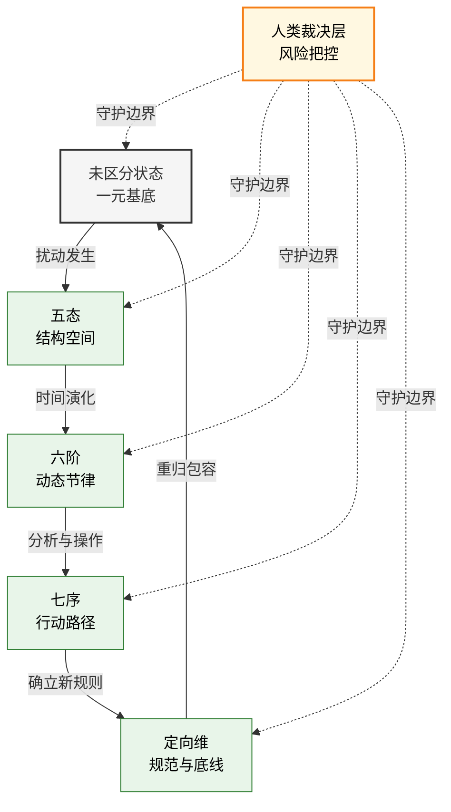
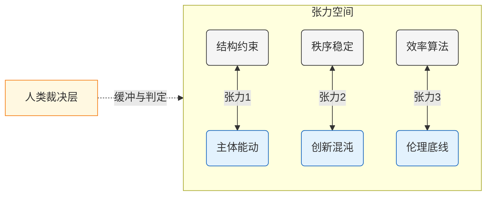

# ASTO v4.3 属集变迁存在论

## 核心动力学模型

> **版本**：v4.3（2026.02 优化稳定版）
> **定位声明**：ASTO 是一种连接工程实践与文明思考的结构语言。它不是终极解释，而是一种可修订、可替代的分析框架。
>
> **术语说明**：下文“地基推导来源”用于说明该分析节点与上游哲学地基的关系。早期 `MFO / 互扰流显` 命名属于历史探索阶段，不再作为当前公开主口径。

---

# 第零节：框架定位声明（优先阅读）

ASTO 是一个**工程—文明桥梁框架**。
它既不是形而上学体系，也不是技术操作手册。

它由三个可以独立评估的层级构成：

---

## 1️⃣ 结构层（如何拆解现实）

ASTO 不讨论终极实体。

我们只对“属性及其关系结构”进行建模。
属性是否具有独立本体地位，不在本框架中断言。

换句话说：

> ASTO 关心结构如何变化，而不是世界究竟由什么“构成”。

---

## 2️⃣ 推论层（如何把握节奏）

如果现实可以被拆解为结构与关系，

那么结构变迁就存在可分析的节律。

这构成：

* 五态（空间形态）
* 六阶（时间节律）
* 七序（行动步骤）

它们不是宇宙真理，

而是分析工具。

---

## 3️⃣ 规范层（如何守住底线）

ASTO 不预设价值，但承认：

在当前文明语境下，人类承担最终裁决责任。

当结构变迁威胁到：

* 文明连续性
* 人类基本权利
* 伦理底线

则必须由人类裁决层介入。

这是一种责任选择，不是自然法则。

---

> **通俗理解**：
> ASTO 给你一副分析结构的眼镜，一张行动节律图，以及一个风险提示器。
> 用不用、如何用，由你决定。

---

# 一、核心术语：换一种语言理解变化

---

## 一元（The One）

在某一结构划分之前的未区分状态。

它不是“万物基底”，
而是分析尚未发生时的整体状态。

生活隐喻：
尚未落笔的画布。

**地基推导来源：** 一元是混沌——维向幅无终止展开，无稳定闭合，无边界，无结构。不是空，是太满——所有可能区分并存，没有任何一个稳定。

---

## 扰动（Perturbation）

结构发生差异的瞬间。

扰动不是宇宙震荡，
而是分析单位之间出现变化。

生活隐喻：
画布上的第一笔。

**地基推导来源：** 扰动是共扰回路边界两侧的幅值梯度交换。不是画布上的第一笔——第一笔预设了画布和笔，两个已有结构。扰动是存在维持自身与混沌背景区分的持续过程，不是事件，是状态。

---

## 属集（Attribute-Set）

一次扰动之后形成的属性关系集合。

它不是本质，
而是一次变迁留下的结构痕迹。

---

## 观察即扰动

在结构分析中，

任何介入都会改变结构状态。

这是一种方法论声明，
不是意识形而上学命题。

---

## 模型边界变量（原“禁元”）

某些变量在当前模型中不可被充分结构化。

当这些变量涉及伦理、权利或文明连续性时，

必须由人类裁决层处理。

这不是神秘区域，
而是模型能力的边界。

---

# 二、本体论基础：显三元，实一元

ASTO 的结构基础描述了三种分析视角，这并非对世界的本体论分割：

### 1. 一元（最小存在承诺）

可被扰动的结构场域。一元是逻辑起点，不是可被回归的终点。
任何声称“触及一元”的表述，都是隐喻性的。一元没有内部位置可以被回归，只有逻辑上的先在性。

### 2. 扰动生二元

任何存在之间的功能性交互（扰动）从分析上分化出 **扰动参与者** 与 **被扰动存在**。这是分析操作，不是本体论切割。
公理层只声明“扰动发生”，不规定扰动是由物理、意识还是社会因素引起。

### 3. 属集为显现（第三元）

在特定扰动条件下，可被识别、被操作的属性配置切片。属集的真实性是条件性的——它只记录了那次特定的扰动行为。

> **三元的本质**：这是描述语言的三种分析视角，归根结底指向同一个可被扰动的结构场域。

**地基推导来源：** 本体论层是双向的——两个共扰回路幅值梯度相遇，干涉图样同时产生两个参与者和关系，无主被动，无先后。扰动生二元是分析操作，不是本体论切割。选择哪个参考点，取决于分析目标，不取决于本体论结构。

---

# 三、框架全景：人在哪里？

ASTO 不宣称人类在本体上高于一切。

但在当前文明结构中：

> 人类承担最终裁决责任。

三层结构：

* **裁决层**：人类承担伦理与方向判断
* **分析层**：五态、六阶、七序作为工具
* **风险层**：当结构威胁文明连续性时触发保护机制

系统是工具，
责任在使用者。

---

# 四、核心循环模型（1→5→6→7→1）

变化不是直线，而是结构循环。

⚠ 重要说明：

> 下图为分析模型，不是宇宙结构声明。

该循环表示：

* 状态被分析
* 节律被判断
* 行动被执行
* 方向被修正
* 新结构形成

这是操作逻辑，不是形而上闭环。

---

# 四、五态：结构的空间形态

五态不是物理形态，
而是结构成熟度坐标。

1. 自在：未表达的结构潜能
2. 共识：群体间形成初步稳定关系
3. 编码：规则被明确化
4. 物化：结构落地为现实系统
5. 定向：形成生态与自我强化机制

**地基推导来源：** 五态是共扰叠加深度连续谱上的五个临界跨越点，不是任意分类。自在=共扰回路刚涌现，幅值梯度存在但不稳定。共识=多个共扰回路初级叠加。编码=叠加结构稳定，干涉图样可重复识别。物化=叠加深度足够，结构自我维持。定向=共扰结构形成路径筛选偏好，开始影响周围混沌。

常见错误：

在“物化态”试图用“自在态”方式修改结构。

必须回到编码层。

---

# 五、六阶：结构的时间节律

六阶不是历史规律，
而是演化节奏模型。

1. 混沌：高不确定性
2. 秩序：相对稳定
3. 流变：内部张力增加
4. 脉冲：突变点
5. 崩解：旧结构失效
6. 归元：重建新稳定

**地基推导来源：** 六阶是共扰回路与混沌背景之间幅值梯度的周期性涨落。混沌=幅值梯度不稳定。秩序=幅值梯度稳定，叠加深度维持。流变=外部扰动增加，干涉图样漂移。脉冲=漂移超过临界，共扰条件突变。崩解=原有叠加结构瓦解，幅值梯度重组。归元=新共扰回路从混沌涌现，开始新的叠加。

节律感：

在秩序期不宜过度扰动，
在崩解期不宜盲目护盘。

---

# 六、七序：行动流程工具

七序是操作路径，而非强制流程。

1. 感知
2. 解析
3. 干预
4. 设计
5. 物化
6. 回溯
7. 消解

可跳跃使用，但不可忽视确认环节。

**地基推导来源：** 七序是意识结构对条件网络进行有意识共扰干预的完整路径。感知=外部幅值梯度进入向内折叠回路。诊断=干涉图样与预判拓扑的比对。干预=注入新的幅值向量。设计=目标干涉图样的预判拓扑显式化。物化=幅值梯度的稳定闭合。回溯=闭环验证与预判拓扑修正。消解=结构完成使命后的可控拆解。

---

# 八、三对核心张力

ASTO 不消灭冲突，
而是把张力视为动力来源。

1. 结构约束 ↔ 主体能动
2. 秩序稳定 ↔ 创新混沌
3. 效率算法 ↔ 伦理底线

张力不可消除，只能管理。

---

# 九、概念方程（思维模型）

> 现实影响力 =
> （人类意图 × [状态 × 节律 × 行动]） × 风险校正系数

说明：

* 人类意图提供方向
* 五态×六阶×七序提供坐标
* 风险校正系数在触及文明底线时可归零

该方程为思维模型，
非可计算公式。

**地基推导来源：** 三对张力都是同一个底层张力的不同层级表达——共扰叠加（稳定化）对混沌背景（去稳定化）。结构约束对主体能动=闭合结构对内维持对向外扩张。秩序稳定对创新混沌=幅值梯度稳定对混沌压力持续。效率算法对伦理底线=路径筛选对多层级相容性约束。

---

# 十、终极说明

ASTO 能帮助你：

* 分析复杂局面
* 判断节律
* 安排行动
* 识别风险

ASTO 不能：

* 替代伦理责任
* 提供终极答案
* 解释一切存在

当理论开始压倒人类判断时，

请优先保留人类判断。

---

# 版本声明

ASTO v4.3 为开放框架版本。
未来可根据实践与批评进行修订。

它不是信仰，
不是世界观终章，
而是一种结构分析语言。

