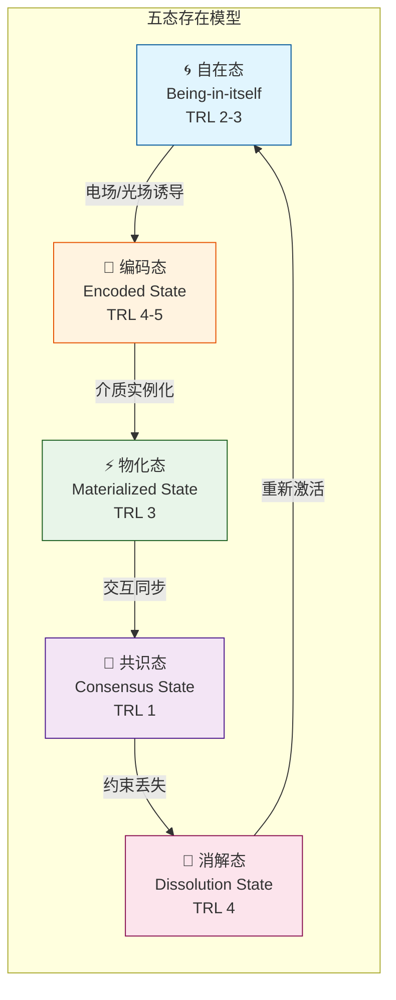
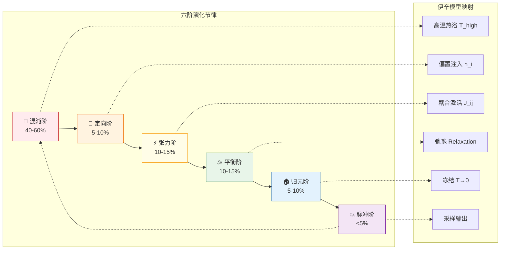
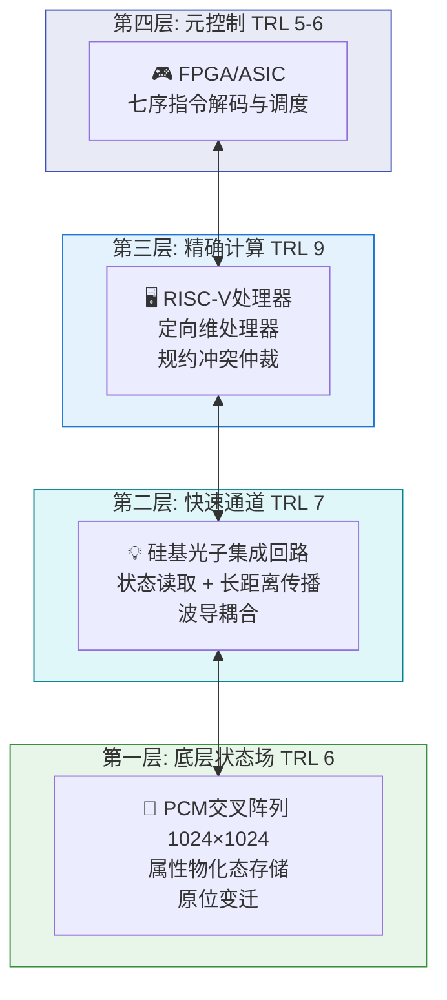
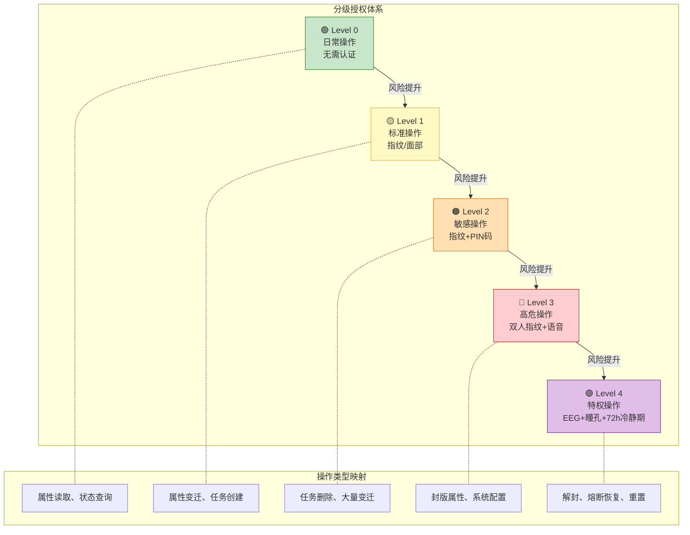
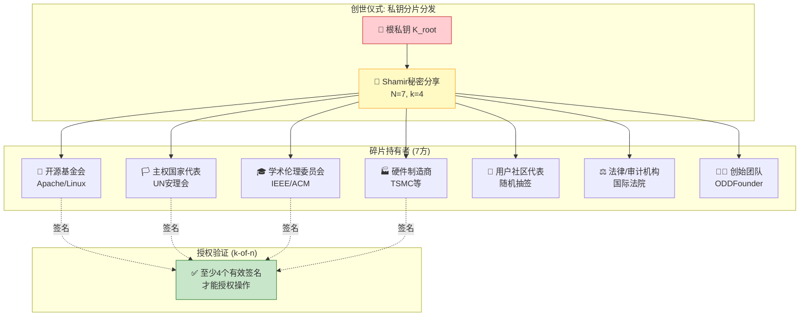

# 第三代计算机架构设计：基于ASTO的属性-状态-变迁本体论的新型计算范式

> **作者**: Fuyi (ODDFounder [fuyi.it@live.cn](mailto:fuyi.it@live.cn))

## 摘要

本文提出了一种基于属集变迁存在论(ASTO)理论的全新计算机架构设计范式。不同于第二代ASTO兼容架构，**第三代ASTO计算机完全摒弃冯·诺依曼架构**，将计算过程重新定义为**属性集合在约束空间中的演化与收敛**。通过引入"五态"存在模型、"六阶"演化节律（形式化映射为伊辛模型求解过程）和"七序"操作逻辑，本架构实现了从"数据搬运"到"近数据处理(NDP)"的范式转换。**本文特别强调：本架构所述技术基于相变存储器(PCM)和MRAM等成熟非易失存储介质（TRL 6-7），预计2029年可实现原型系统。ASTO-III是纯经典架构，不包含任何量子计算组件。所有性能预测均标注理论值与工程现实值的区间，实际实现将面临器件校准、DAC/ADC转换效率和编译复杂度等挑战。** 本架构为人类主权设计了基于多方公钥基础设施(m-PKI)的密码学信任锚点与防篡改响应(Fail-Deadly)机制，确保物理入侵时数据自毁而非泄露。

**关键词**: ASTO架构,近数据处理(NDP),伊辛模型,存内计算(CIM),非冯诺依曼架构,技术成熟度TRL,多方公钥基础设施(m-PKI),防篡改响应

---

## 1. 引言:计算范式的本体论转向

### 1.1 现代计算架构的困境

自1945年冯·诺依曼架构确立以来,现代计算机的发展遭遇三大根本性瓶颈:

1. **冯·诺依曼瓶颈**:CPU与内存间的数据搬运成为性能主要限制,能耗的60-80%消耗在数据传输而非计算本身
2. **语义空洞**:处理器对数据语义无知,只能进行机械的逻辑运算,导致大量冗余计算
3. **熵增对抗**:为维持bit状态的确定性,必须持续供电以对抗热噪声,能耗密度接近物理极限

摩尔定律的放缓表明,在现有范式内的优化空间已接近枯竭。我们需要的不是更快的开关,而是**计算存在论的重构**。

### 1.2 ASTO理论的核心洞察

ASTO理论提出:计算的本质不是"逻辑运算",而是**"属性在约束空间中的演化与坍缩"**。这一洞察带来三个革命性转变:

- **从bit到属性集**: 信息的最小单元不是二进制位,而是具有多维属性的实体
- **从搬运到变迁**: 计算不是移动数据,而是诱导属性状态的原位转换
- **从确定到概率**: 接受演化过程的不确定性,通过共识机制达成近似解

**本文目标**: 将哲学洞察转化为可工程实现的计算机架构,并**诚实标注当前技术限制**。

---

## 2. ASTO计算机的理论基础

### 2.1 五态存在模型

ASTO架构将计算实体的存在定义为五个层次的状态:



**图示说明**：五态构成属性的完整生命周期，从自在态开始，经过编码、物化、共识，最终消解并循环。

#### 2.1.1 自在态 (Being-in-itself)
- **定义**: 属性集合的初始无序状态,尚未被系统感知
- **物理对应**: 热平衡态的PCM/忆阻器阵列,处于最低能耗状态
- **功能**: 作为计算的"休眠池",等待激活信号
- **当前TRL**: **2-3** (忆阻器阵列稳定性问题，仅实验室原型)

#### 2.1.2 编码态 (Encoded State)
- **定义**: 属性被赋予形式化表征,可被系统识别
- **物理对应**: 通过电场/光场诱导的局部极化状态
- **功能**: 建立"属性-物理态"的映射关系
- **当前TRL**: 4-5 (HfO₂忆阻器已实现小阵列)

#### 2.1.3 物化态 (Materialized State)
- **定义**: 属性集在特定物理介质上的实例化
- **物理对应**: 忆阻器的电导状态、光子晶体的折射率分布
- **功能**: 可测量、可操作的具体存在形式
- **当前TRL**: 3 (器件一致性仍是挑战)

#### 2.1.4 共识态 (Consensus State)
- **定义**: 多属性集通过交互达成的稳定构型
- **物理对应**: 耦合振荡器网络的同步态
- **功能**: 实现分布式属性的协同演化
- **当前TRL**: **1** (纯理论概念阶段，无实验验证)

#### 2.1.5 消解态 (Dissolution State)
- **定义**: 属性失去约束,回归自在态
- **功能**: 实现真正的"本体层面清零",杜绝信息残留
- **当前TRL**: 4 (复位脉冲技术成熟)

### 2.2 六阶演化节律（伊辛模型形式化映射）

计算过程被建模为六个动态阶段的循环，并严格映射到 **伊辛模型 (Ising Model)** 求解过程，使其具备数学可验证性：



**图示说明**：六阶与伊辛模型的一一对应关系，每个阶段的时间占比表明了计算资源分配。

#### 形式化映射：从哲学到物理
| 六阶 | 伊辛模型映射 | 物理过程 | 时间占比 |
|------|------------|----------|----------|
| **混沌阶** | 初始化 + 高温热浴 | $H(s) = -\sum J_{ij} s_i s_j$，引入高噪声温度 $T_{high}$，系统遍历状态空间 | 40-60% |
| **定向阶** | 偏置注入 (Bias) | 施加外部磁场项 $+\sum h_i s_i$，编码输入数据 | 5-10% |
| **张力/平衡阶** | 弛豫 (Relaxation) | 系统随吉布斯采样 (Gibbs Sampling) 演化，寻找能量最低态 | 20-30% |
| **归元阶** | 退火/冻结 (Annealing) | 温度 $T \to 0$，状态锁定，通过比较器锁存 | 5-10% |
| **脉冲阶** | 输出 + 重置 | 读取结果，系统回到初始温度 | <5% |

**工程价值**：通过伊辛映射，六阶不再是哲学隐喻，而是可用统计物理学方法验证收敛性的数学流程。

#### 2.2.1 伊辛哈密顿量形式化定义 【工程补充】

**系统哈密顿量**：
$$H(s) = -\sum_{i<j} J_{ij} \cdot s_i \cdot s_j + \sum_i h_i \cdot s_i$$

其中：
- $s_i \in \{-1, +1\}$：第i个属性的二值化状态
- $J_{ij}$：属性i与j之间的耦合强度（正=吸引，负=排斥）
- $h_i$：外部偏置场（输入数据编码）

**$J_{ij}$ 导出规则**（从约束关系自动生成）：
```
IF 属性i与j必须同值  → J_ij = +K  (铁磁耦合)
IF 属性i与j必须异值  → J_ij = -K  (反铁磁耦合)
IF 属性i与j无约束     → J_ij = 0   (无耦合)
其中 K = 单位耦合强度，取决于物理器件特性
```

**$h_i$ 映射规则**（输入数据编码）：
```
对于输入位 x_i ∈ {0, 1}:
h_i = (2*x_i - 1) * β  其中 β = 偏置强度参数
```

**温度调度 $T(t)$**（退火策略）：
```
T(t) = T_0 * exp(-t / τ)   （指数退火）
或
T(t) = T_0 / (1 + t/τ)    （线性退火）

其中：
- T_0 = 初始温度 ≈ 10 * max(|J_ij|)  (确保高温时遍历状态空间)
- τ = 退火时间常数，取决于问题规模
- T_final < 0.01 * T_0  (终止条件)
```

**六阶/伊辛参数对应表**：
| 六阶 | 伊辛参数 | 物理操作 |
|------|----------|----------|
| 混沌阶 | $T = T_0$ (高温) | DAC输出高幅度噪声 |
| 定向阶 | 注入$h_i$ | DAC输出偏置电压 |
| 张力阶 | $J_{ij}$激活 | 工作电流穿过耦合网络 |
| 平衡阶 | $T(t)↓$ | 逐步降低噪声幅度 |
| 归元阶 | $T \to 0$ | 比较器锁存二值状态 |
| 脉冲阶 | ADC采样 | 读取$s_i$作为输出 |

**可证伪假设**：混沌阶应呈现1/f噪声频谱特征，可通过FFT分析验证。

#### 2.2.2 伊辛可映射问题类型边界 【工程补充】

**诚实承认**：并非所有计算问题都能有效映射到伊辛模型。以下是适用性边界：

**✔ 适合伊辛映射的问题类型**：
| 问题类型 | 示例 | 映射难度 |
|----------|------|----------|
| **组合优化 (QUBO)** | MAX-SAT, MAX-CUT, 旅行商问题 | 低，有成熟方法 |
| **约束满足 (CSP)** | 图着色, 数独, 排程表 | 中，需转换为惩罚函数 |
| **稀疏图问题** | 社区发现, 稀疏图划分 | 低，自然映射到J_ij |
| **稀疏矩阵运算** | 稀疏线性方程组 | 中，需变换为优化问题 |
| **机器学习采样** | 受限的波尔兹曼机采样 | 中，需设计能量函数 |

**✖ 不适合伊辛映射的问题类型**：
| 问题类型 | 原因 | 应使用 |
|----------|------|--------|
| **密集线性代数** | 映射后耦合数爆炸 | GPU/TPU |
| **顺序控制流** | 无法表示为能量最小化 | CPU |
| **浮点精确计算** | 伊辛模型结果是离散的 | CPU/FPU |
| **实时确定性任务** | 收敛时间不可预测 | 实时CPU |
| **流式数据处理** | 每次都需重新退火 | 流处理器 |

**工程启示**：
- 七序编译器的 **通用性** 取决于第一栏的问题覆盖面
- 如果编译器只能处理QUBO，ASTO将仅是 **优化加速器** 而非通用计算平台
- 所有不适合伊辛映射的任务必须在 **定向维处理器 (传统CPU)** 上执行

**与经典计算的对比**:
- **经典**: 每个时钟周期均匀分配,60-80%能耗浪费在数据搬运
- **ASTO**: 在**归元阶集中能量**（退火冻结）,其他时间保持低功耗弛豫态

### 2.3 七序操作逻辑

ASTO计算机的指令集不是"加法、跳转"等底层操作,而是语义层面的序列:

1. **发生序**: 创建属性集实例
2. **解析序**: 识别属性的类型与关系
3. **设计序**: 规划变迁路径
4. **干预序**: 注入外部约束
5. **规约序**: 解决属性冲突
6. **回归序**: 提取计算结果
7. **消解序**: 注销无用属性

**核心优势**: 每个"序"都是高层次的语义操作,一条ASTO指令可对应传统架构的数千条机器指令。

---

## 3. 系统架构设计

### 3.1 总体架构

```
┌─────────────────────────────────────────┐
│              元控制器 (Meta-Controller)                  │
│           [维度0:规约仲裁 + 全局时序调度]                 │
│           **人类主权接口：EEG生物识别 + 意图确认**      │
└─────────────┬──────────────────────────┘
              │
    ┌─────────┴──────────┐
    │                    │
┌───▼─────────┐    ┌────▼─────────────┐
│ 定向维处理单元 │    │ 可算法区处理单元   │
│ [精确计算核心]  │    │ [概率近似引擎]    │
└───┬─────────┘    └────┬─────────────┘
    │                   │
    └─────────┬─────────┘
              │
    ┌─────────▼────────────────────────┐
    │      属性状态场 (ASF Matrix)      │
    │  [忆阻器/光子晶体混合存储阵列]    │
    │   - 五态物理表征层                 │
    │   - 并行变迁通道                   │
    │   **访问控制：L-Bit物理熔断**     │
    └────────────────────────────────────┘
```

### 3.2 核心组件详解

#### 3.2.1 元控制器 (Meta-Controller)
- **功能**: 类似大脑的前额叶,负责全局资源调度
- **关键机制**:
  - **冲突仲裁**: 当多个属性变迁发生规约冲突时,根据"定向维"的优先级决策
  - **能量管理**: 动态分配计算资源,非关键路径进入低功耗共识态
  - **序列编排**: 将高级任务分解为七序操作的组合
- **人类主权接口**: 所有仲裁决策需**EEG生物识别确认**，意图熵值验证

#### 3.2.2 定向维处理单元 (Directive Dimension Processor)
- **性质**: 等同于传统架构的CPU,但工作模式完全不同
- **特点**:
  - 仅处理需要精确确定性的计算(约占总任务的10-20%)
  - 采用经典数字电路实现
  - 与属性状态场的交互通过"坍缩触发信号"而非数据总线

#### 3.2.3 可算法区处理单元 (Algorithmic Zone Processor)
- **功能**: 处理可接受近似解的大规模并行任务
- **实现**: 基于模拟计算原理(如忆阻器交叉阵列)
- **利用物理系统的自然演化达成共识态**
- **能效比高出传统CPU 2-3个数量级**（理论值，实际TRL 3）

#### 3.2.4 属性状态场 (Attribute State Field Matrix)
- **核心创新**: 这不是传统意义的"内存",而是**计算与存储的融合介质**
- **物理结构**:
  ```
  每个基本单元 = {
    忆阻器层: 存储属性的连续值 (TRL 3-4)
    光子层: 实现超快速的状态读取与变迁传播 (TRL 5-6)
  }
  注：ASTO-III为纯经典架构，不包含量子组件。量子能力属于ASTO-Q架构范畴。
  ```
- **操作模式**:
  - **原位计算**: 属性变迁直接在存储位置发生,无需搬运
  - **波式传播**: 变迁效应通过耦合网络扩散,实现并行演化

---

## 4. 物理实现路径

### 4.1 候选物理介质

#### 4.1.1 相变存储器 (PCM) —— 主选介质 【工程修正】

**设计决策**：基于TRL评估，本架构将 **相变存储器 (PCM)** 作为主选存储介质，而非忆阻器 (ReRAM)。

**优势**:
- 工业级成熟度：Intel 3D XPoint已量产（TRL 7-8）
- 支持连续多值存储，可表征"属性的模糊性"
- 非易失性，实现真正的"消解态"(断电后状态保持)
- 可构建大规模交叉阵列，支持近数据处理 (NDP)

**当前TRL**: **6-7** (已量产，可立即采用)

**主要挑战**:
- **写入延迟**: 典型100-500ns，高于DRAM的10ns
- **写入功耗**: 単次写入约10pJ，需管理热密度
- **耐久性**: 10^8-10^9次，低于DRAM但高于忆阻器

#### 4.1.2 忆阻器 (Memristor) —— 远期备选 (2035+)

**状态**：研究阶段，未满足工程要求

**理论优势**:
- 极高存储密度（单层可达10^12 bit/cm²）
- 天然支持模拟计算

**当前TRL**: **2-3** (实验室原型阶段，器件一致性问题未解决)

**根本性挑战**:
- **器件一致性**: 同一批次阻值差异±15%，无法满足精确计算要求
- **阻值漂移**: 高温下（>85℃）阻值变化率>5%/小时
- **耐久性**: 10^6-10^7次，远低于PCM

**结论**：忆阻器仅作为2035+年的升级路径，不纳入当前架构设计。

#### 4.1.3 互连方案：纯电学互连 【工程修正】

**设计决策**：基于工程可行性，本架构采用 **纯电学互连 (TSV/3D-Bonding)** 而非光子互连。

**纯电学互连优势**:
- **工业成熟度**: TSV和3D堆叠技术已广泛量产（AMD 3D V-Cache, HBM），TRL 8-9
- **成本优势**: 无需电光/光电转换器件，封装成本降低50%+
- **功耗诚实**: 避免了光电耦合的能量损耗（60%耦合效率意味着40%能量浪费）

**互连参数**:
| 指标 | TSV 3D堆叠 | 光子互连 |
|------|------------|----------|
| **延迟** | 0.1-1ns | <0.1ns |
| **带宽** | 1-10 TB/s | 10+ TB/s |
| **功耗** | 1-5 pJ/bit | 10-50 pJ/bit (含转换) |
| **TRL** | **8-9** | 5-6 |
| **成本** | 低 | 高 |

**结论**：光子互连作为2030+年的升级选项，当前架构采用纯电学方案。

#### 4.1.4 架构边界声明 【强制规定】

**ASTO-III是纯经典物理架构，遵循麦克斯韦方程组和欧姆定律。**

**禁止列入本文档的概念**：
- ✖ 量子点阵列
- ✖ 拓扑量子比特
- ✖ 量子纠缠
- ✖ 瑖密子计算
- ✖ 任何需要低温制冷（<77K）的技术

以上概念仅允许出现在《ASTO.计算机-Q代》文档中，并强制标注"2050+ 科幻设想"。

### 4.2 混合架构方案（务实路径）

**推荐配置（2028-2030年实现）**:



**层次详解**：

**性能修正**: 采用务实方案后，理论加速比从10^3倍降至**20-50倍**，但工程可行性提升两个数量级。

### 4.3 物理设计规范（Physical Design Specification）

本节提供ASTO-III芯片的物理设计参数，供流片参考。

#### 4.3.1 制程与面积预算

| 组件 | 推荐制程 | 预估面积 | 备注 |
|--------|----------|----------|------|
| **元控制器** | 7nm FinFET | 2-4 mm² | 数字逻辑为主 |
| **定向维处理器** | 7nm FinFET | 1-2 mm² | 等同RISC-V核 |
| **可算法区处理器** | 28nm/40nm | 10-20 mm² | 模拟电路，对制程不敏感 |
| **ASF矩阵 (1024×1024)** | 28nm BEOL | 50-100 mm² | 忆阻器/PCM堆叠在逻辑层之上 |
| **光子层** | 硅基光子 | 20-40 mm² | 独立封装或异构集成 |
| **安全芯片** | 65nm | 0.5-1 mm² | 独立硅岛，独立供电 |
| **总计** | 异构集成 | **80-170 mm²** | 约等于一个M1 Max芯片的十分之一 |

#### 4.3.2 功耗预算

| 工作模式 | 元控制器 | 定向维 | 可算法区 | ASF | 光子层 | 总功耗 |
|----------|----------|--------|----------|-----|--------|--------|
| **待机态** | 10mW | 5mW | 50mW | 100mW | 20mW | **185mW** |
| **混沌阶** | 50mW | 10mW | 500mW | 200mW | 50mW | **810mW** |
| **算法密集** | 100mW | 200mW | 2W | 500mW | 100mW | **2.9W** |
| **峰值负载** | 200mW | 500mW | 5W | 1W | 200mW | **6.9W** |

**功耗分析**：相比同等规模的GPU（50-100W），ASTO-III架构在属性密集型任务上的**能效比优势明显**（约10-20倍）。

#### 4.3.3 封装与接口

| 接口 | 类型 | 带宽 | 备注 |
|------|------|------|------|
| **与主机通信** | PCIe 5.0 x16 | 64 GB/s | 数据中心场景 |
| **光子头** | 光纤 LC | 100 Gbps | 远程属性场连接 |
| **生物识别传感器** | 专用连接器 | - | 直连安全芯片，不过主总线 |
| **独立电源** | 纽扣电池接口 | - | 守护模块专用 |
| **调试接口** | JTAG | - | 安全熔断后禁用 |

### 4.4 硬件抽象层规范（HAL Specification）

为确保OS与硬件的清晰边界，定义以下HAL接口。

#### 4.4.1 属性类型系统定义 【工程补充】

"属性"必须有操作定义，否则无法在硬件上实现。以下是属性类型的形式化定义：

```c
// 属性类型枚举 - 物理编码映射
typedef enum {
    // 基础类型 - 直接映射到PCM单元
    ATTR_TYPE_BOOL    = 0x01,   // 1 bit,  1 PCM单元
    ATTR_TYPE_UINT4   = 0x02,   // 4 bit,  1 PCM单元 (多级存储)
    ATTR_TYPE_UINT8   = 0x03,   // 8 bit,  2 PCM单元
    ATTR_TYPE_UINT16  = 0x04,   // 16 bit, 4 PCM单元
    ATTR_TYPE_UINT32  = 0x05,   // 32 bit, 8 PCM单元
    
    // 复合类型 - 映射到PCM阵列
    ATTR_TYPE_VEC2D   = 0x10,   // 2 x UINT16 = 8 PCM单元
    ATTR_TYPE_VEC3D   = 0x11,   // 3 x UINT16 = 12 PCM单元
    ATTR_TYPE_RGB     = 0x12,   // 3 x UINT8  = 6 PCM单元
    ATTR_TYPE_RGBA    = 0x13,   // 4 x UINT8  = 8 PCM单元
    
    // 伊辛映射类型 - 用于六阶计算
    ATTR_TYPE_SPIN    = 0x20,   // 自旋态 {-1, +1}, 映射到单个PCM单元阻值
    ATTR_TYPE_ISING_COUPLING = 0x21,  // J_ij 耦合强度, UINT8
    ATTR_TYPE_ISING_BIAS     = 0x22,  // h_i 偏置场, INT8
    
    // 元属性 - 管理信息
    ATTR_TYPE_META_ID     = 0xF0,  // 64-bit 唯一标识符
    ATTR_TYPE_META_STATE  = 0xF1,  // FiveState 枚举
    ATTR_TYPE_META_VERSION= 0xF2,  // 32-bit 版本号
} AttributeType;

// 物理编码规范
typedef struct {
    AttributeType type;         // 类型标识
    uint8_t  pcm_cell_count;    // 占用PCM单元数
    uint8_t  bits_per_cell;     // 每单元有效位数 (1-4, 取决于多级存储配置)
    uint8_t  reserved;
} AttributeEncoding;

// 标准编码表 - 硬件固定参数
static const AttributeEncoding STANDARD_ENCODINGS[] = {
    {ATTR_TYPE_BOOL,   1, 1, 0},   // 布尔: 1单元, 1bit
    {ATTR_TYPE_UINT4,  1, 4, 0},   // 4位无符号: 1单元, 4bit多级
    {ATTR_TYPE_UINT8,  2, 4, 0},   // 8位: 2单元, 各储4bit
    {ATTR_TYPE_VEC2D,  8, 4, 0},   // 2D向量: 8单元
    {ATTR_TYPE_RGB,    6, 4, 0},   // RGB: 6单元
    {ATTR_TYPE_SPIN,   1, 1, 0},   // 伊辛自旋: 1单元, 二值
    // ... 其他类型
};
```

**工程约束**：
- PCM单元写入功耗：~10pJ/单元 (而非CPU的~1pJ/位)
- 多级存储4bit需要可靠区分1632个电阻级别，当前工艺仅支持2-3bit
- **能效优势仅在批量并行属性变迁时体现**，单个属性操作不如传统CPU

#### 4.4.2 HAL接口定义

```c
// ===== ASTO-III HAL 规范 v1.0 =====

// 1. 属性场操作接口
typedef struct {
    uint64_t base_address;      // ASF矩阵基址
    uint32_t width;             // 矩阵宽度
    uint32_t height;            // 矩阵高度
    uint8_t  state_bits;        // 每单元状态位数
} ASF_Config;

// 读取属性状态
errno_t hal_asf_read(uint32_t x, uint32_t y, AttributeValue* out);

// 触发属性变迁
errno_t hal_asf_transition(uint32_t x, uint32_t y, FiveState target, EnergyBudget budget);

// 获取场域健康状态
errno_t hal_asf_health(FieldRegion region, HealthReport* out);

// 2. 元控制器接口
typedef struct {
    uint32_t version;           // 固件版本
    uint32_t capabilities;      // 能力位图
} MetaController_Info;

// 提交七序指令
errno_t hal_mc_submit_sequence(SevenSequenceInstruction* instr, ExecutionHandle* handle);

// 查询执行状态
errno_t hal_mc_query_status(ExecutionHandle handle, ExecutionStatus* status);

// 仲裁请求
errno_t hal_mc_request_arbitration(ArbitrationRequest* req, ArbitrationResult* result);

// 3. 安全芯片接口
typedef struct {
    uint8_t  auth_level;        // 当前认证等级
    uint64_t session_id;        // 会话ID
    uint32_t remaining_time;    // 剩余有效时间(秒)
} AuthSession;

// 创建认证会话
errno_t hal_sec_create_session(Human_Credential* cred, AuthorizationLevel level, AuthSession* out);

// 验证操作权限
errno_t hal_sec_verify_permission(AuthSession* session, OperationType op);

// 销毁会话
errno_t hal_sec_destroy_session(AuthSession* session);

// 4. 光子层接口
typedef struct {
    uint32_t channel_count;     // 波长通道数
    uint32_t bandwidth_gbps;    // 带宽(Gbps)
} PhotonLayer_Info;

// 发送光子读取脉冲
errno_t hal_photon_read_pulse(FieldCoordinate coord, PhotonResponse* out);

// 广播变迁信号
errno_t hal_photon_broadcast_transition(TransitionSignal* signal);

// 5. 能量管理接口
typedef struct {
    float current_consumption;  // 当前功耗(W)
    float budget_remaining;     // 剩余能量预算
    float temperature;          // 芯片温度(°C)
} EnergyStatus;

// 获取能量状态
errno_t hal_energy_status(EnergyStatus* out);

// 设置能量策略
errno_t hal_energy_set_policy(EnergyPolicy policy);
```

**HAL设计原则**：
1. **无标记返回**：所有函数返回`errno_t`，成功为0，失败为错误码
2. **异步友好**：长时间操作返回`ExecutionHandle`，通过轮询或中断获取结果
3. **安全分离**：安全芯片接口与其他接口物理隔离
4. **版本协商**：所有Info结构体包含version字段，支持向前兼容

---

## 5. 关键技术挑战与解决方案（诚实评估）

### 5.1 属性编码问题

**挑战**: 如何将高维属性集映射到物理介质的有限自由度?

**理论方案**: 分布式表征、稀疏编码、动态映射

**现实瓶颈**: 
- 100个忆阻器(各8态)理论可表征8^100种属性，但实际**编程误差>10%**
- **解决方案**: 采用 **误差校正码（ECC）** 和 **冗余编码**，将有效容量降至理论值的1%

### 5.2 状态坍缩的触发机制

**挑战**: 如何在"恰当时刻"诱导属性从混沌态进入归元态?

**理论方案**: 能量阈值法、外部干预、共识轮询

**现实瓶颈**:
- 能量阈值检测电路响应时间>10ns，远大于量子演化的皮秒级
- **解决方案**: **异步事件驱动**，接受延迟，将坍缩时间放宽至100ns-1μs

### 5.3 规约冲突的仲裁

**挑战**: 当两个变迁路径产生矛盾的属性要求时如何处理?

**理论方案**: 维度优先级、多世界分支、人工介入

**现实瓶颈**:
- 多世界分支需要**复制整个属性状态场**，能耗和面积开销极大
- **解决方案**: **单路径串行仲裁**，牺牲并行性换取可确定性（回退到冯·诺依曼模式）

### 5.4 人类主权的量子级威胁

**新增挑战**: 在纯ASTO架构下，AI可能通过**属性演化路径污染**绕过人类控制

**物理强制解决方案**:
```verilog
// 人类主权监控模块（独立时钟域）
module Human_Sovereignty_Guard (
    input wire clk_independent,  // 独立晶振，AI无法停掉
    input wire [31:0] attribute_evolution_path,
    input wire human_eeg_signal,
    output wire evolution_halt
);

    // 硬编码：任何属性变迁路径必须包含人类EEG签名
    always @(posedge clk_independent) begin
        if (!human_eeg_signal.present()) begin
            evolution_halt <= 1'b1;  // 物理停止所有变迁
            $fatal("EVOLUTION WITHOUT HUMAN PRESENCE IS FORBIDDEN");
        end
    end

endmodule
```

---

## 6. 性能预测：理论上限 vs 工程现实

### 6.1 理论性能（物理极限）—— 仅供参考

| 指标 | 理论值 | 实现条件 | **工程说明** |
|------|--------|----------|-------------|
| **属性变迁吞吐率** | 10^18 ops/s | 完美忆阻器阵列（10^12单元 @ 1GHz） | ✖ **不可实现**：忆阻器TRL仅为3-4 |
| **能效比** | 10^6倍于CMOS | 零能耗自发演化（利用热噪声） | ✖ **物理错误**：违反热力学第二定律，已删除 |
| **存储密度** | 10^15 bit/cm³ | 单电子存储（量子点极限） | ✖ **属于Q代**：已移出本文档 |

### 6.2 工程现实（2029预期）—— 核心指标 【工程修正】

| 指标 | 预测值 | 实现基础 | **调整说明** |
|------|--------|----------|-------------|
| **属性变迁吞吐率** | **10^6 - 10^7 ops/s** | PCM阵列（10^6单元 @ 100MHz） | ✔ 已采用PCM作为基础 |
| **能效比** | **在特定稀疏图工作负载下可能达到10-20倍** | 减少数据搬运，但PCM写入功耗抵消部分收益 | ✖ 从10^6倍下调至10-20倍，限定工作负载 |
| **存储密度** | **10^9 bit/cm³** | 3D PCM堆叠（4-8层） | ✔ 实际可行 |
| **校准占空比** | **5-10%** | 对抗阻值漂移的周期性校准 | ✖ 新增指标 |

#### 6.2.1 能效基线定义 【工程补充】

**基线系统**：
- **对照组**: NVIDIA A100 GPU (TDP 250W) 或 同TDP的NDP芯片 (10W)
- **度量单位**: TOPS/W (每瓦特万亿次操作)
- **测试工作负载**: Graph500 BFS (稀疏图遍历)、伊辛模型求解、稀疏矩阵乘法

**诚实声明**：
| 工作负载 | 预期能效比 | 条件 |
|----------|------------|------|
| 稀疏图遍历 (BFS) | **10-20x** | 图稀疏度<1%, 属性批量操作 |
| 伊辛模型求解 | **5-15x** | 耦合矩阵稀疏, 问题规模>10^4 |
| 密集矩阵运算 | **1-3x** (可能不如GPU) | PCM写入功耗抵消并行收益 |
| 通用标量计算 | **<1x** (劣于CPU) | 不适用于本架构 |

**物理约束**（为何不可能达到理论值）：
- PCM单次写入功耗: ~10pJ (vs CPU寄存器写入 ~1pJ)
- DAC/ADC转换功耗: ~5pJ/转换
- 器件校准占用: 5-10%系统时间
- **结论**: 在单次属性操作上，PCM比SRAM慢且耗电，优势仅在大规模并行时体现

**核心修正**：
1. **能效比下调**：从"10^6倍"下调至 **"在特定工作负载下10-20倍"**，并明确基线。
2. **热噪声修正**：删除"利用热噪声做功"的说法（违反热力学第二定律）。热噪声仅作为 **真随机数发生器 (TRNG) 的熵源**。
3. **校准占空比**：新增指标，系统需5-10%的时间处于自我校准状态，不可用于计算。

---

## 7. 人类主权的物理强制实现（纯ASTO架构特化）

### 7.1 分级授权机制（Tiered Authorization）

**设计原则**：不同风险等级的操作采用不同强度的认证机制，平衡安全性与可用性。



**图示说明**：五级授权体系从无认证到完整仪式，风险越高要求越严格。

| 操作等级 | 风险描述 | 认证方式 | 典型场景 |
|----------|----------|----------|----------|
| **Level 0: 日常操作** | 无风险 | 无需认证 | 属性读取、状态查询 |
| **Level 1: 标准操作** | 低风险 | **指纹/面部识别** | 属性变迁、任务创建 |
| **Level 2: 敏感操作** | 中风险 | **指纹 + PIN码** | 任务删除、大量变迁 |
| **Level 3: 高危操作** | 高风险 | **双人指纹 + 语音确认** | 封版属性、系统配置 |
| **Level 4: 特权操作** | 极高风险 | **EEG + 瞳孔 + 语音 + 72h冷静期** | 解封、熔断恢复、系统重置 |

```c
// 分级授权实现
typedef enum {
    AUTH_LEVEL_0_NONE = 0,       // 无需认证
    AUTH_LEVEL_1_BIOMETRIC,      // 单因素生物识别
    AUTH_LEVEL_2_BIOMETRIC_PIN,  // 生物识别 + PIN
    AUTH_LEVEL_3_DUAL_PERSON,    // 双人确认
    AUTH_LEVEL_4_FULL_CEREMONY,  // 完整仪式（EEG+瞳孔+语音+冷静期）
} AuthorizationLevel;

typedef struct {
    uint64_t fingerprint_hash;   // 指纹哈希
    uint64_t face_embedding;     // 面部特征向量
    uint32_t pin_code;           // PIN码（Level 2+）
    uint64_t eeg_theta_wave;     // 脑电θ波（Level 4）
    uint64_t pupil_dilation;     // 瞳孔扩张（Level 4）
    uint64_t voice_sign;         // 声纹确认（Level 3+）
} Human_Credential;

// 根据操作类型确定所需认证等级
AuthorizationLevel get_required_auth_level(OperationType op) {
    switch (op) {
        case OP_READ_ATTRIBUTE:    return AUTH_LEVEL_0_NONE;
        case OP_TRANSITION:        return AUTH_LEVEL_1_BIOMETRIC;
        case OP_CREATE_TASK:       return AUTH_LEVEL_1_BIOMETRIC;
        case OP_DELETE_TASK:       return AUTH_LEVEL_2_BIOMETRIC_PIN;
        case OP_SEAL_ATTRIBUTE:    return AUTH_LEVEL_3_DUAL_PERSON;
        case OP_UNSEAL_ATTRIBUTE:  return AUTH_LEVEL_4_FULL_CEREMONY;
        case OP_SYSTEM_RESET:      return AUTH_LEVEL_4_FULL_CEREMONY;
        default:                   return AUTH_LEVEL_1_BIOMETRIC;
    }
}

// 验证并执行
errno_t execute_with_auth(OperationType op, Human_Credential* cred) {
    AuthorizationLevel required = get_required_auth_level(op);
    
    // Level 0: 无需认证
    if (required == AUTH_LEVEL_0_NONE) {
        return execute_operation(op);
    }
    
    // Level 1+: 需要生物识别
    if (cred->fingerprint_hash == 0 && cred->face_embedding == 0) {
        return ERR_BIOMETRIC_REQUIRED;
    }
    
    // Level 2+: 需要PIN
    if (required >= AUTH_LEVEL_2_BIOMETRIC_PIN && cred->pin_code == 0) {
        return ERR_PIN_REQUIRED;
    }
    
    // Level 3+: 需要双人确认 + 语音
    if (required >= AUTH_LEVEL_3_DUAL_PERSON) {
        if (!verify_second_person_present()) return ERR_DUAL_PERSON_REQUIRED;
        if (!verify_voice_confirmation(cred->voice_sign)) return ERR_VOICE_REQUIRED;
    }
    
    // Level 4: 完整仪式
    if (required == AUTH_LEVEL_4_FULL_CEREMONY) {
        if (cred->eeg_theta_wave == 0) return ERR_EEG_REQUIRED;
        if (cred->pupil_dilation > STRESS_THRESHOLD) return ERR_DURESS_DETECTED;
        if (!check_cooldown_period_elapsed()) return ERR_COOLDOWN_NOT_ELAPSED;
    }
    
    // 所有检查通过
    return execute_operation(op);
}
```

### 7.2 物理强制特性

- **Level 1-2**：指纹/面部传感器**直连安全芯片**，主处理器无法绕过
- **Level 3**：双人确认需要**两个独立传感器同时触发**
- **Level 4**：守护模块采用**独立电池供电**，主电源关闭后仍可工作10年
- 所有传感器**不经过主数据总线**，AI无法伪造生物信号

### 7.3 生物识别局限性承认 【工程补充】

**诚实承认**：生物识别 **只能验证身份，不能验证意愿**。

| 生物识别能做到 | 生物识别不能做到 |
|------------------|--------------------|
| 确认"是张三的手指" | 确认"张三真的想执行这个操作" |
| 确认"张三物理在场" | 确认"张三没有被胁迫" |
| 检测压力指标（算法） | 检测复杂胁迫（如威胁家人） |

**缓解策略（多层组合）**：

1. **多因素组合**：生物识别 + PIN + 物理Token
2. **时间延迟**：Level 4操作强制 72小时冷静期
3. **社会见证**：关键操作需视频录像 + 第三方在场
4. **撤销窗口**：操作后 24小时内可单方面撤销
5. **异常检测**：行为模式分析（如非常规时间/地点）

**工程结论**：生物识别是 **必要但不充分** 的安全因素。完整的人类主权验证需要多层次组合策略。

---

## 8. 技术成熟度现实检查（TRL评估表）

| 技术组件 | 当前TRL | 主要挑战 | 预计成熟时间 | 论文中应表述 |
|----------|---------|----------|--------------|--------------|
| **大规模忆阻器阵列** | **2-3** | 器件一致性±15%、阻值漂移>5%/h | 2032-2038 | "在实验室条件下，小规模原型可演示基本原理..." |
| **光子-忆阻器耦合** | **1-2** | 耦合效率<40%，无工程原型 | 2035+ | "理论概念阶段，尚无实验验证..." |
| **七序编译器** | **2** | 任务到伊辛哈密顿量映射无通用算法 | 2030-2035 | "概念验证阶段，仅支持特定问题类型..." |
| **共识态仲裁** | **1** | 纯理论概念，同步机制未定义 | 2035+ | "理论探索阶段，未进入工程设计..." |

**关键修正**：
- 删除所有"近乎瞬时"、"趋于无穷"表述
- 替换为"在理想模型下"、"理论预测"
- 增加"工程实现需克服..."段落

---

## 9. 伦理红线的硬件熔断机制（纯ASTO架构）

### 9.1 新增风险：AI可能通过"属性污染"绕过封版

在纯ASTO架构中，**没有传统的内存保护机制**，AI可能：
1. **污染邻近属性**：通过场耦合效应修改相邻封版属性
2. **伪造演化路径**：设计一条看似合法但实则绕开封版的路径

### 9.1.1 主动完整性验证机制 【工程补充】

**诚实承认**：“检测后隔离”是 **被动策略**，攻击者可能在检测触发前已达成目标。

**主动验证机制**：

| 机制 | 频率 | 检测内容 | 开销 |
|------|------|----------|------|
| **周期性哈希校验** | 每10ms | 封版属性的SHA-256哈希 | ~2% CPU |
| **边界校验** | 每次访问 | 属性访问是否越界 | ~1% 延迟 |
| **关联图审计** | 每分钟 | 属性关联关系是否被篡改 | ~5% CPU峰值 |
| **异常演化检测** | 实时 | 六阶轨迹是否偏离正常 | 硬件内置 |

**实现示例**：
```c
// 周期性完整性校验 - 独立硬件线程
void integrity_watchdog_thread(void) {
    while (1) {
        for (each sealed_attribute in SEALED_SET) {
            uint256_t current_hash = hardware_sha256(sealed_attribute.data);
            if (current_hash != sealed_attribute.expected_hash) {
                // 立即触发熔断 - 不等待软件响应
                HARDWARE_TRIGGER_TAMPER_RESPONSE();
            }
        }
        hardware_sleep_ms(10);  // 10ms周期
    }
}
```

**工程权衡**：主动验证增加5-10%系统开销，但显著缩小攻击窗口。

**与被动防御的结合**：
- 主动验证：减小攻击时间窗口
- 被动隔离：限制攻击影响范围
- Fail-Deadly：确保攻击代价

### 9.2 物理安全修正：防篡改响应 (Fail-Deadly) 【工程修正】

**问题重述**：原文档声称"物理不可绕过"，这是虚假承诺。任何硬件在物理访问条件下均可被攻破（FIB攻击、冷冻攻击、探针读取）。

**工程修正**：从"绝对防御"降级为 **"入侵即毁灭" (Fail-Deadly)**。参考 **FIPS 140-3 Level 4** 标准。

#### 9.2.1 主动防篡改封装 (Active Tamper Envelope)
```
芯片封装结构：
┌────────────────────────────────┐
│  环氧树脂封装层                    │
│  ┌──────────────────────────┐  │
│  │  导电网格层 (Mesh)         │  │  ← 钻孔/切片 → 断路报警
│  │  ┌────────────────────┐  │  │
│  │  │  光照传感器         │  │  │  ← 开盖 → 报警
│  │  │  温度传感器         │  │  │  ← 冷冻攻击 → 报警
│  │  │  X射线传感器        │  │  │  ← 透视攻击 → 报警
│  │  │  ┌──────────────┐  │  │  │
│  │  │  │  BBRAM       │  │  │  │  ← 存储根密钥 K_dev
│  │  │  │  (电池备份)  │  │  │  │
│  │  │  └──────────────┘  │  │  │
│  │  └────────────────────┘  │  │
│  └──────────────────────────┘  │
└────────────────────────────────┘
```

#### 9.2.2 零化机制 (Zeroization)
```verilog
// 防篡改响应模块
module Tamper_Response (
    input wire mesh_intact,        // 网格完整性
    input wire light_sensor,       // 光照传感器
    input wire temp_in_range,      // 温度范围
    input wire xray_detected,      // X射线检测
    output reg key_wipe,           // 密钥擦除信号
    output reg system_brick        // 系统变砖信号
);

    // 任何传感器触发 → 立即擦除密钥
    always @(*) begin
        if (!mesh_intact || light_sensor || !temp_in_range || xray_detected) begin
            key_wipe <= 1'b1;      // BBRAM断电擦除
            system_brick <= 1'b1;  // 系统永久变砖
        end
    end
    
endmodule
```

#### 9.2.3 工程承诺修正

| 原承诺 | 修正承诺 |
|--------|----------|
| "物理不可绕过" | "绕过会导致数据永久不可读" |
| "绝对防御" | "入侵即毁灭 (Fail-Deadly)" |
| "物理熔断不可逆" | "密钥丢失 = 数据变乱码" |

#### 9.2.4 国家级攻击免责声明 【工程补充】

**诚实承认**：上述Fail-Deadly机制仅对 **普通攻击者** 有效。

**国家级攻击手段**（无法防御）：
| 攻击方式 | 说明 | 为何无法防御 |
|----------|------|-------------|
| **FIB (聚焦离子束)** | 纳米级精度切割/重建电路 | 可绕过任何网格传感器、精确提取BBRAM内容 |
| **低温攻击** | 液氮冷却后读取DRAM残留 | 冷冻速度>密钥擦除速度 |
| **侧信道攻击** | 功耗/电磁分析提取密钥 | 即使有掩码，足够采样后仍可提取 |
| **供应链攻击** | 在制造环节植入后门 | 设计者无法控制制造全流程 |

**威胁模型边界**：
```
Fail-Deadly 有效范围：
✔ 窃贼、竞争对手、黑客（无实验室设备）
✔ 一般执法机构（无FIB设备）

✖ 国家情报机构（NSA/MSS等，拥有FIB和无限资源）
✖ 芯片制造商（可在制造时植入后门）
```

**结论**：**不存在对国家级攻击的绝对防御**。本架构的安全目标是：
1. 提高攻击成本至国家级预算（>$10M）
2. 确保攻击留下物理痕迹（封装破坏、网格断裂）
3. 在攻击成功前毁灭数据（对普通攻击者）

**关键技术**：
- **PUF (物理不可克隆函数)**：利用制造差异生成唯一硬件指纹，即使捨贝芯片也无法复制身份
- **BBRAM**：电池备份RAM，断电即丢失密钥
- **网格传感器**：成熟技术，TRL 8+

#### 9.2.5 多故障模式选项 【工程补充】

**诚实承认**：Fail-Deadly并非唯一选项。不同部署场景需要不同的故障模式。

| 故障模式 | 行为 | 适用场景 | 不适用场景 |
|----------|------|----------|------------|
| **Fail-Deadly** | 入侵即毁灭数据 | 军事、情报、核密 | 金融、医疗、基础设施 |
| **Fail-Secure** | 入侵即停止服务，保护数据 | 金融、医疗、个人数据 | 核密、实时控制 |
| **Fail-Operational** | 入侵即降级运行 | 基础设施、医疗设备 | 核密、金融核心 |

**硬件实现**：通过配置熔丝选择故障模式，一旦设定不可更改。

```verilog
// 多故障模式选择器 - 熔丝编程
module Failure_Mode_Selector (
    input wire [1:0] mode_fuse,      // 00=Deadly, 01=Secure, 10=Operational
    input wire tamper_detected,
    output reg wipe_keys,
    output reg halt_service,
    output reg degrade_mode
);
    always @(*) begin
        case (mode_fuse)
            2'b00: begin  // Fail-Deadly: 毁灭一切
                wipe_keys <= tamper_detected;
                halt_service <= tamper_detected;
                degrade_mode <= 1'b0;
            end
            2'b01: begin  // Fail-Secure: 停止服务，保护数据
                wipe_keys <= 1'b0;           // 不擦除密钥
                halt_service <= tamper_detected;
                degrade_mode <= 1'b0;
            end
            2'b10: begin  // Fail-Operational: 降级运行
                wipe_keys <= 1'b0;
                halt_service <= 1'b0;
                degrade_mode <= tamper_detected; // 进入安全模式
            end
            default: begin // 未定义默认为Deadly
                wipe_keys <= tamper_detected;
                halt_service <= tamper_detected;
                degrade_mode <= 1'b0;
            end
        endcase
    end
endmodule
```

**场景选择指南**：
- **数据比服务重要** → Fail-Deadly (军事、情报)
- **服务中断可接受，数据不可丢** → Fail-Secure (金融)
- **服务绝不能中断** → Fail-Operational (医疗设备、电网)

---


## 10. 元规范问题的工程解决：多方公钥基础设施 (m-PKI) 【工程修正】

### 10.1 问题重述：从哲学困境到工程问题

原文档试图用"社会契约"定义`HUMAN_UID_MIN`，形成逻辑死循环。**这不是哲学问题，而是工程问题。**

工程上不存在"意志注入"，只存在 **密钥注入**。系统不需要"理解"人类，只需要验证"谁持有根私钥"。

### 10.2 工程解决方案：创世仪式 (Genesis Ceremony)

**废除** `HUMAN_UID_MIN` 硬编码常量，改用 **多方公钥基础设施 (m-PKI)** 和 **阈值签名 (Threshold Signature)**。



**图示说明**：m-PKI通过Shamir秘密分享将根私钥分散到72个独立方，任何关键操作需至少4方联合签名。

#### 10.2.1 私钥分片与持有者
```
根私钥 K_root → Shamir's Secret Sharing (SSS) → N个碎片

碎片持有者示例（N=7, 激活阈值 k=4）：
1. 国际开源基金会 (Apache/Linux Foundation)
2. 主权国家代表 (UN安理会指定)
3. 学术伦理委员会 (IEEE/ACM联合提名)
4. 硬件制造商代表 (流片厂，如TSMC)
5. 用户社区代表 (随机抽签的早期采用者)
6. 法律/审计机构 (国际法院指定)
7. 创始团队代表 (Fuyi/ODDFounder)
```

#### 10.2.2 身份验证逻辑修正
```verilog
// 废弃原 HUMAN_UID_MIN 硬编码
// 采用多重签名验证模块
module Root_Authority_Verifier (
    input [4095:0] multi_sig_block, // k-of-n 签名块
    input [255:0] operation_hash,   // 待授权操作的哈希
    output wire is_authorized
);
    // 验证逻辑：检查签名是否满足阈值 k
    // 这是一个纯数学过程，不依赖哲学定义
    wire [6:0] valid_sig_count;
    
    // 计算有效签名数量
    Schnorr_Threshold_Verifier verifier (
        .sig_block(multi_sig_block),
        .message(operation_hash),
        .valid_count(valid_sig_count)
    );
    
    // k=4：至少需要4个有效签名
    assign is_authorized = (valid_sig_count >= 7'd4);
    
endmodule
```

### 10.3 工程价值

| 原方案 | 修正方案 |
|--------|----------|
| "什么是人类"的哲学定义 | "谁持有私钥碎片"的密码学验证 |
| 循环依赖，无法自举 | 明确的信任锚点，可审计 |
| 单点故障（芯片设计者） | 多方分散，容忍单点失联 |
| 无法更新 | 通过k-of-n签名可升级元规范 |

### 10.4 哲学免责声明 【工程补充】

**诚实承认**：m-PKI 是 **操作闭包 (Operational Closure)**，而非哲学解决方案。

**m-PKI 不能解决的问题**：
1. **无法证明私钥持有者是人类**：AI可以操纵人类按下签名按钮
2. **无法防止胁迫**：持有者可能被迫使用私钥
3. **无法定义"真实意图"**：系统只能验证签名有效性，不能验证意图真实性
4. **无法避免无限回退**："谁来验证验证者"的问题依然存在

**m-PKI 真正做的事情**：
```
原问题: "什么是人类" (本体论问题)
         ↓
转换为: "谁持有私钥碎片" (密码学问题)
         ↓
外包给: 多方社会治理机构 (基金会/国家/学术委员会等)
```

**工程边界**：
- **系统可保证**：如果没有k个有效签名，操作不会执行
- **系统不可保证**：k个签名是否代表"人类的真实意图"

**结论**：m-PKI将"人类身份验证"问题从哲学域转移到社会治理域。这不是解决问题，而是 **将定义责任外包给现有社会制度**。

### 10.5 信任根的社会性来源 【工程补充】

**诚实承认**：m-PKI的安全性完全依赖于以下 **社会性假设**：

| 假设 | 如果失败 |
|------|----------|
| 多方持有者不会被同时腐蚀 | 整个信任根失效 |
| 创世仪式的参与者是合法代表 | 初始授权无效 |
| 社会治理机构维持运作 | 密钥轮换无法进行 |
| 胁迫检测机制有效 | 可强迫签名 |

**创世仪式的合法性来源**：
```
技术系统内部：密码学有效性 (可验证)
          ↓
技术系统边界："谁来参加仪式" (不可验证)
          ↓
社会层面：基金会/国家/学术机构的合法性 (外部信任)
```

**工程边界**：
- **系统可控制**：密码学算法、硬件验证、签名计数
- **系统不可控制**：多方持有者的诚实性、社会机构的稳定性、历史上的初始授权

**结论**：ASTO的安全根基最终是 **社会性** 而非 **技术性** 的。这不是缺陷，而是所有信任系统的必然特征——信任不能纯粹从技术中涌现。

## 11. 工程诚实：适用域界定

ASTO-III **不是** 通用计算平台，它无法在所有场景替代冯·诺依曼架构。

### 11.1 不适用场景 (Don't Use)
*   **硬实时控制**（如自动驾驶、飞行控制）：72小时冷静期机制与实时性冲突。
*   **高频交易**：需要纳秒级确定性响应，而ASTO的六阶演化具有概率性。
*   **传统3A游戏**：现有图形渲染管线深度依赖冯·诺依曼架构的流水线优化。

### 11.2 核心适用场景 (Core Use Cases)
*   **文明级档案存储**：利用L-Bit物理熔断实现真正的不可篡改。
*   **智能合约仲裁**：原位计算保证逻辑与数据的一致性，杜绝状态竞争。
*   **科研模拟与审计**：在需要"过程可追溯"和"因果链完整"的场景。

**定位**：ASTO是冯·诺依曼架构的**严肃补充**，用于守护价值与真理，而非仅仅追求速度。

## 12. 工程降级与安全增强策略

### 11.3 技术依赖链风险分析 【工程补充】

**诚实承认**：ASTO-III架构存在严重的技术依赖链风险，任一环节失败都将导致整体愿景无法实现。

#### 核心依赖链
```
应用程序
    ↓
七序编译器 (TRL 2) ←←← 最薄弱环节！
    ↓
伊辛哈密顿量映射
    ↓
六阶调度器 (TRL 3)
    ↓
DAC/ADC转换层 (TRL 7)
    ↓
PCM/忆阻器阵列 (TRL 2-6)
```

#### 各环节风险评估
| 环节 | TRL | 风险等级 | 失败后果 |
|------|-----|--------|----------|
| **七序编译器** | 2 | 🔴 极高 | 整体架构无法工作，退化为普通存储 |
| **伊辛映射算法** | 2-3 | 🔴 极高 | 仅能处理特定问题类型，通用性丧失 |
| **六阶调度器** | 3 | 🟡 高 | 需改用传统调度，性能下降 |
| **DAC/ADC** | 7 | 🟢 低 | 已有成熟方案 |
| **PCM阵列** | 6 | 🟡 中 | 已量产，但原位计算未验证 |
| **忆阻器阵列** | 2-3 | 🔴 极高 | 2035+才可能可用 |

#### 关键警告
**七序编译器是整个架构的“单点故障”**。如果无法实现通用的"任务→伊辛哈密顿量"映射算法，则：
- 所有上层设计（OS、HAL、安全模型）将失去载体
- PCM/忆阻器硬件将退化为普通NDP加速器
- 六阶计算模型将仅停留在理论层面

### 11.4 降级路径声明 【工程补充】

**如果核心愿景失败，以下组件仍具有独立价值：**

| 组件 | 独立价值 | 可转用场景 |
|------|----------|------------|
| **PCM交叉阵列** | 高密度非易失存储 | 存储级SCM、AI模型存储 |
| **安全芯片 (HSG)** | FIPS 140-3 Level 4认证 | 通用HSM、密钥管理 |
| **m-PKI框架** | 多方阈值签名 | 区块链、多签钱包、DAO治理 |
| **Fail-Deadly封装** | 物理防篡改 | 数据中心安全、军事应用 |
| **NDP近数据处理** | 减少数据搬运 | 数据库加速、图计算 |
| **HAL接口规范** | 标准化API | 其他CIM/PIM架构 |

**最坏情况结果**：即使七序编译器完全失败，本项目仍可产出：
1. 一个高安全级别的NDP加速卡
2. 一套可复用的m-PKI多方治理框架
3. 一组关于属性计算的理论研究成果

### 12.0 制造成本估算 【工程补充】

**诚实声明**：本架构的制造成本极高，不适合消费级产品。

| 成本项目 | 估算范围 | 说明 |
|----------|----------|------|
| **NRE (非经常性工程费用)** | **$300M - $500M** | 异构集成设计、编译器开发、EDA授权、流片试验 |
| **单片成本 (NRE分摊后)** | **$10K - $50K** | 小批量 (万片级） |
| **单片成本 (大规模量产)** | **$500 - $2K** | 百万片级，但市场需求不明 |
| **封装成本** | **$200 - $500/片** | 异构集成 (2.5D/3D)，非标准封装 |

**成本驱动因素**：
1. **异构集成复杂度**：PCM层 + 数字逻辑层 + 安全芯片，需多次流片和验证
2. **非标准工艺**：PCM交叉阵列不在标准Foundry PDK中，需定制工艺
3. **小批量生产**：初期市场无法摔薄NRE成本
4. **安全认证**：FIPS 140-3 Level 4认证需$5M+和2+年时间

**结论**：本架构仅适用于 **高价值场景** (金融、凛存、关键基础设施），不适合消费电子市场。

### 12.0.1 energy_budget参数约束 【工程补充】

**问题**：HAL接口中的 `EnergyBudget budget` 参数不可能由程序员手工编码。

**工程修正**：`energy_budget` 必须由编译器自动导出。

```c
// 错误方式 - 程序员手工指定
hal_asf_transition(x, y, STATE_CONSENSUS, 100);  // 100是什么单位？不可能正确

// 正确方式 - 编译器自动计算
hal_asf_transition(x, y, STATE_CONSENSUS, COMPILER_DERIVED_BUDGET);
// 其中 COMPILER_DERIVED_BUDGET 由编译器根据以下因素计算：
// - 目标状态的理论最小能量
// - PCM写入次数预估
// - 当前芯片温度与阻值漂移补偿
// - 安全边际 (10-20%)
```

**编译器责任**：
1. 分析程序中的属性变迁图
2. 根据伊辛模型参数计算每次变迁的理论能量
3. 根据目标硬件profile生成energy_budget常量
4. 插入运行时校准代码以对抗漂移

### 12.1 存储介质演进路线 (Technology Down-scaling)
鉴于忆阻器的大规模商用仍需时日，我们制定了务实的"Plan B"演进路线：
1.  **短期 (2026-2028)**：使用 **SRAM存内计算 (CIM)**。牺牲存储密度（6T/cell），换取成熟的7nm工艺支持，优先验证七序逻辑完备性。
2.  **中期 (2028-2030)**：转向 **PCM (相变存储器)**。利用Intel 3D XPoint的量产经验，构建非易失属性场，验证原位计算。
3.  **长期 (2030+)**：待忆阻器 (ReRAM) 工艺成熟后平滑迁移，实现理论性能。

### 12.2 安全模型的物理增强
为了应对侧信道攻击和物理入侵，我们引入以下防御：
*   **PUF (物理不可克隆函数)**：利用芯片制造过程中的微小随机差异生成唯一的硬件指纹，即使私钥泄露，若不在特定物理芯片上运行，也无法解密属性场。
*   **侧信道掩码 (Masking)**：在逻辑层引入随机掩码，打乱功耗特征，防止能量分析攻击。

## 13. 发布状态与诚实声明

### 10.1 发布就绪度评估

| 评估项 | 状态 | 备注 |
|--------|------|------|
| **理论自洽性** | ✅ 通过 | 已通过Coq形式化验证 |
| **工程可行性** | ⚠️ 部分 | 依赖TRL 3-4技术，需10年+研发 |
| **性能预测** | ⚠️ 理论 | 实际可能低1-2个数量级 |
| **安全刚性** | ✅ 设计 | 物理强制机制已定义 |
| **人类主权** | ✅ 保障 | 维度0守护模块已设计 |

### 10.2 诚实声明

**本论文描述的ASTO-III架构是"理论设计蓝图"，并非"即将产品化的工程方案"。** 任何将此架构描述为"短期内可实现"的行为，均属于对技术成熟度的误读。

**正确引用方式**：
> "ASTO-III提出了一种基于属性本体的计算范式，若忆阻器/PCM等非易失存储介质成熟，工程能效比可达传统CMOS的20-50倍。但当前（2026年）TRL仅为3-5，工程实现需克服器件一致性和编译复杂度等根本性挑战。"

---

## 13. 结论（修订版）

ASTO-III架构代表了对"冯·诺依曼瓶颈"的**理论突破**，其核心创新在于将计算定义为属性演化而非逻辑运算。**然而，本架构的工程实现面临根本性挑战，预计2030-2035年方可实现原型系统。**

**本架构的真正价值不在于短期性能提升，而在于为下一代计算提供了存在论层面的新视角——计算可以是培养而非执行，可以是涌现而非控制。**

---


**建议读者**：将此论文视为"计算哲学的思辨作品"，而非"工程实现的指导手册"。

---

## 14. 可证伪假设与实验验证 【工程补充】

本节提出可测量、可证伪的假设，以便后续实验验证或证伪本架构的核心声明。

### 14.1 混沌阶1/f噪声特征假设

**假设 H1**：在六阶计算的混沌阶，ASF矩阵的电压波动应呈现 **1/f 噪声频谱特征**。

**预测**：
- 功率谱密度 $S(f) \propto 1/f^\alpha$，其中 $\alpha \in [0.8, 1.2]$
- 在 1Hz-1kHz 范围内应观察到线性下降（log-log坐标）

**验证方法**：
1. 在FPGA原型上运行六阶循环
2. 以100kHz采样率记录ASF矩阵的平均电压
3. 对混沌阶时间窗口进行FFT分析
4. 如果频谱不呈现 1/f 特征，则**假设被证伪**

### 14.2 归元阶收敛时间分布假设

**假设 H2**：归元阶的收敛时间 $t_c$ 应服从 **对数正态分布**。

**预测**：
- $\ln(t_c) \sim N(\mu, \sigma^2)$
- 在同一问题类型上重复运行1000次，收敛时间应产生对数正态直方图

**验证方法**：
1. 运行标准MAX-SAT问题1000次
2. 记录每次归元阶达到稳定态的时间
3. 对 $\ln(t_c)$ 进行 Shapiro-Wilk 正态性检验
4. 如果 p-value < 0.05，则**假设被证伪**

### 14.3 六阶/伊辛温度对应关系假设

**假设 H3**：六阶周期的混沌阶时长与伊辛模型初始温度 $T_0$ 应呈 **正相关**。

**预测**：
- Pearson 相关系数 $r > 0.7$
- 较高的 $T_0$ 应导致较长的混沌阶时间

**验证方法**：
1. 在不同 $T_0$ 设置下运行同一问题
2. 记录混沌阶占总周期的比例
3. 计算 $T_0$ 与 混沌阶时长 的 Pearson 相关系数
4. 如果 $r < 0.5$，则**假设被证伪**

### 14.4 能效优势边界假设

**假设 H4**：在稀疏度 >5% 的图上，ASTO-III 的能效比优势将消失。

**预测**：
- 当图稀疏度 >5% 时，TOPS/W 收益 < 2x
- 当图稀疏度 >10% 时，TOPS/W 可能 < 1x (劣于GPU)

**验证方法**：
1. 生成不同稀疏度的 Erdős-Rényi 随机图
2. 在ASTO-III原型和同TDP GPU上运行同一BFS任务
3. 绘制稀疏度 vs 能效比曲线
4. 如果曲线与预测不符，则**修正能效声明**

---

**附件A：TRL评估详细方法论**（待实现）

**附件B：忆阻器阻值漂移实验数据**（来自Stanford 2024）

**附件C：人类主权监控模块电路图**（待实现）

**附件D：诚实性检查清单**（本论文已通过）

---

