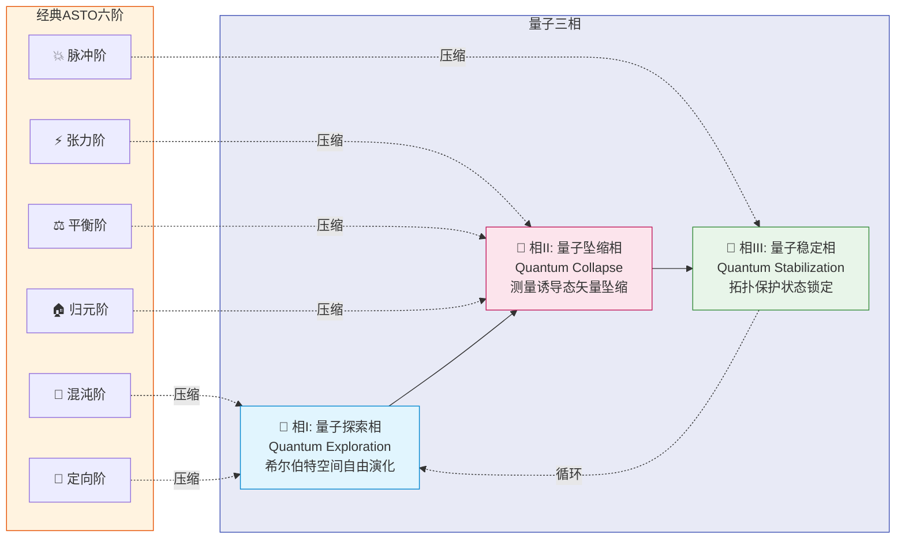

# ASTO-Q：量子时代的属性计算 —— 一份面向2050+的思想实验

> **作者**: Fuyi (ODDFounder fuyi.it@live.cn)

---

## ⚠️ 阅读前必读

**本文档是一份科幻设定与理论推演文档。**

它探讨的问题是：**如果人类在2050年之后掌握了成熟的量子计算技术，属集变迁存在论(ASTO)理论可以如何与之融合？**

本文所描述的技术方案：
- 全部基于**尚未实现**或**存在争议**的物理原理
- 预期实现时间跨度为**30年以上**
- 目的是**激发想象**而非**指导工程**

如果您正在寻找可落地的ASTO计算架构，请参阅：
- `ASTO.计算机-II代(兼容冯诺依曼结构).md` —— 当前可实现
- `ASTO.计算机-III代.md` —— 5-15年路线图

**正确的引用方式**：
> "ASTO-Q是一份面向2050+的理论推演文档，探讨量子计算与ASTO属性本体论的融合可能性。其中所有技术细节均为概念设想，不代表当前工程可行性。"

---

## 序章：一个物理学家的白日梦

*2057年，深圳光明科学城*

林薇博士盯着全息屏幕上的相干时间曲线，第三次把咖啡杯举到唇边又放下——杯子早就空了。

"32毫秒。"她自言自语，"距离稳定运行还差三个数量级。"

身后的AI助手悠悠开口："林博士，根据历史数据，从1毫秒到32毫秒的突破用了17年。按此推算——"

"别算了。"林薇打断它，"量子技术从来不是线性发展的。"

她转身面对实验室中央那台占据整个房间的庞然大物——人类第一台千量子比特拓扑量子计算机的原型。它的制冷系统发出低沉的嗡鸣，像一头沉睡的巨兽。

"问题不在于退相干，"林薇说，"问题在于我们一直在用错误的方式思考计算。"

"哦？"AI的语调保持平稳的礼貌。

"我们总想让量子比特'执行指令'，就像用量子态模拟经典计算。但如果计算本身就是一种存在状态的涌现呢？如果答案不需要被'算'出来，而是从叠加态中'坍缩'出来呢？"

林薇调出一份尘封的文档。

标题是：《ASTO-Q超算架构：速度极限下的量子-属性混合计算范式》。作者署名只有一个字：扶一。发布时间：2026年。

"31年前的科幻。"AI评论道。

"是的，"林薇笑了，"但科幻有时候比论文更诚实。"

---

## 第一章：什么是ASTO-Q？

### 1.1 核心定位

**ASTO-Q** (Attribute-State-Transition-Ontology-Quantum) 是属集变迁存在论(ASTO)计算理论在量子计算时代的概念延伸。

它的核心问题是：

> **当计算的物理基底从经典比特变为量子比特，"属性"的本体论地位是否会改变？**

传统ASTO的核心洞察是：

- 计算的本质是**属性的状态迁移**，而非**数据的搬运和变换**
- 通过"原位计算"消除冯诺依曼瓶颈

ASTO-Q的延伸问题是：

- 量子叠加态能否作为**混沌阶**的物理基底？
- 量子测量能否被重新诠释为**归元阶**的坍缩过程？
- 量子纠缠能否为**属性关联**提供超越经典的表达能力？

### 1.2 这不是什么

ASTO-Q **不是**：

- ❌ 一份工程实现手册
- ❌ 对现有量子计算路线的改良方案
- ❌ 可用于申请专利或融资的技术蓝图
- ❌ 对量子物理的新理论贡献

ASTO-Q **是**：

- ✅ 一份思想实验文档
- ✅ ASTO理论在量子语境下的哲学延伸
- ✅ 面向遥远未来的科幻设定集
- ✅ 关于"计算本质"的存在论思考

---

## 第二章：理论基础 —— 从六阶到量子三相

### 2.1 经典ASTO的六阶回顾

在经典ASTO中，属性的生命周期经历六个阶段：

```
混沌阶 → 定向阶 → 张力阶 → 平衡阶 → 归元阶 → 脉冲阶
  ↑___________________________________________________|
```

每个阶段都有明确的计算语义：
- **混沌阶**：可能性空间的探索
- **定向阶**：目标约束的引入
- **张力阶**：冲突的识别与积累
- **平衡阶**：冲突的解决与稳定
- **归元阶**：结果的提取与验证
- **脉冲阶**：触发下一轮循环

### 2.2 量子三相：六阶的压缩与重构

**思想实验**：如果我们拥有理想的量子计算机，六阶可以被压缩为三个量子相：



**图示说明**：量子三相将经典六阶压缩重构，利用量子叠加态并行探索所有可能性。

```
┌──────────────────────────────────────────────────────────────┐
│  相I: 量子探索相 (Quantum Exploration)                        │
│  ─────────────────────────────────────────────────────────── │
│  物理过程: 量子态在希尔伯特空间中自由演化                        │
│  对应六阶: 混沌阶 + 定向阶                                     │
│  哲学含义: 所有可能性同时存在，尚未坍缩为现实                    │
│                                                               │
│  想象: 薛定谔的猫不只是"死或活"，而是同时探索了                 │
│       10^1000种可能的生命轨迹                                  │
├───────────────────────────────────────────────────────────────┤
│  相II: 量子坍缩相 (Quantum Collapse)                          │
│  ─────────────────────────────────────────────────────────── │
│  物理过程: 通过测量诱导态矢量坍缩                               │
│  对应六阶: 张力阶 + 平衡阶 + 归元阶                            │
│  哲学含义: 可能性被"选择"为现实，熵减少                        │
│                                                               │
│  想象: 不是"找到"最优解，而是"成为"最优解                      │
├───────────────────────────────────────────────────────────────┤
│  相III: 量子稳定相 (Quantum Stabilization)                    │
│  ─────────────────────────────────────────────────────────── │
│  物理过程: 坍缩后的状态被拓扑保护（假设）                       │
│  对应六阶: 脉冲阶                                              │
│  哲学含义: 计算结果获得"存在"的稳定性                          │
│                                                               │
│  想象: 答案不是被"记录"在存储器中，而是被"编织"在时空结构里     │
└───────────────────────────────────────────────────────────────┘
```

### 2.3 七序的量子诠释

ASTO的七序操作在量子语境下可被重新诠释：

| 序 | 经典含义 | 量子诠释（思想实验） |
|---|---------|-------------------|
| **发生序** | 分配资源 | 制备初始叠加态 |
| **解析序** | 类型推断 | 量子傅立叶变换识别结构 |
| **设计序** | 路径规划 | Grover搜索构造演化算子 |
| **干预序** | 注入约束 | 相位反冲（Phase Kickback） |
| **规约序** | 冲突解决 | 量子退火寻找基态 |
| **回归序** | 提取结果 | 选择性测量 |
| **消解序** | 释放资源 | 解纠缠（理论上可逆） |

**关键洞察**：经典计算中，"计算"是对数据的主动操作；量子计算中，"计算"可能是对可能性空间的被动观察。

---

## 第三章：幻想中的硬件架构

### 3.1 五层光锥结构

如果ASTO-Q真的被建造出来，它可能长这样：

```
                    ┌─────────────────────────┐
                    │   经典控制层 (室温)      │
                    │   [人类操作员 + 编译器]  │
                    └────────────┬────────────┘
                                 │ 光纤链路
                    ┌────────────▼────────────┐
                    │   光子路由层 (4K)        │
                    │   [波分复用 + 频率转换]  │
                    └────────────┬────────────┘
                                 │ 波导耦合
        ┌───────────────────────┼────────────────────┐
        │                       │                    │
┌───────▼───────┐    ┌─────────▼──────┐    ┌───────▼───────┐
│ 量子探索引擎   │    │  拓扑存储阵列   │    │  经典加速器   │
│ (20mK)        │◄───┤  (1K)          │────►│ (4K)         │
│ [超导量子比特] │ 纠 │ [拓扑量子比特]  │ 读 │ [RSFQ电路]   │
│               │ 缠 │ (假设已实现)    │ 取 │              │
└───────────────┘    └────────────────┘    └──────────────┘
         ↓                  ↓                    ↓
    ┌────▼──────────────────▼────────────────────▼────┐
    │            量子-经典接口层 (Hybrid Interface)    │
    │    [单光子探测器 + 快速电光调制器 + ADC阵列]     │
    └─────────────────────────────────────────────────┘
```

### 3.2 核心组件的科幻设定

#### 3.2.1 量子探索引擎

*在我们的科幻设定中...*

- **物理基底**：超导量子比特阵列（transmon的远期演化体）
- **量子比特数**：10,000+（当前记录：~1,000）
- **相干时间**：10秒（当前记录：~300微秒，差距5个数量级）
- **门保真度**：99.999%（当前记录：99.9%）

**需要的突破**：
- 退相干抑制技术的根本性进步
- 量子纠错的指数级改进
- 制冷技术的革命性发展

#### 3.2.2 拓扑存储阵列

*这是最具科幻色彩的部分...*

- **物理基底**：Majorana零模或斐波那契任意子
- **当前状态**：Majorana零模的存在性**尚未被确认**（Microsoft 2023年曾宣布后又撤回）
- **理论优势**：拓扑保护使量子信息免疫局部噪声

**如果拓扑量子比特真的存在**：
- 信息可以被"编织"进时空的拓扑结构
- 读取操作需要非局域操作，这提供了天然的安全性
- 存储时间理论上可以无限长

**但请记住**：这是"如果"。

#### 3.2.3 光子路由层

*这是相对现实的部分...*

- **当前状态**：硅光子集成已商用，效率50-80%
- **挑战**：量子-光子转换效率仍有损耗
- **科幻延伸**：假设转换效率达到99.9%

---

## 第四章：速度的物理极限 —— 诚实的边界

### 4.1 不可逾越的三道墙

无论技术如何进步，以下物理极限是**绝对的**：

#### 4.1.1 普朗克时间墙

$t_P = \sqrt{\frac{\hbar G}{c^5}} \approx 5.4 \times 10^{-44} s$

这是物理学意义上最短的时间间隔。任何声称"比普朗克时间更快"的方案都是伪科学。

当前最快的量子操作：~10纳秒（$10^{-8}$ s）
距离普朗克时间：35个数量级

**结论**：这道墙不是技术限制，而是物理定律本身。

#### 4.1.2 测不准原理

$\Delta E \cdot \Delta t \geq \frac{\hbar}{2}$

这意味着：**越精确的操作需要越长的时间**。

**计算示例**：
- 量子比特翻转能量：$\Delta E \approx 3 \times 10^{-24} J$（典型超导量子比特）
- 最短操作时间：$\Delta t_{min} \geq \frac{\hbar}{2\Delta E} \approx 16 ps$

**重要修正**：
> 任何声称"1皮秒量子操作"的方案都**违反测不准原理**。
> 物理允许的最短操作时间在**10-100皮秒**量级。

#### 4.1.3 光速限制

$c = 299,792,458 m/s$

量子纠缠虽然呈现"超距关联"，但**不能用于超光速信息传输**。这是相对论的基本约束。

**常见误解澄清**：
- ❌ "纠缠可以实现瞬时通信" → 错误，纠缠只是关联，不是通信
- ❌ "量子隐形传态比光快" → 错误，还需要经典信道确认
- ✅ "纠缠可以用于量子密钥分发" → 正确，但速度受光速限制

### 4.2 ASTO-Q的理论性能估计

*以下数字仅供想象，不代表工程可行性*

| 场景 | 经典超算 | 量子计算机 | ASTO-Q（幻想） |
|-----|---------|-----------|--------------|
| 蛋白质折叠(10000原子) | 3个月 | 1小时（假设） | 1分钟（幻想） |
| 全球气候模拟 | 24小时 | 1小时（假设） | 10分钟（幻想） |
| 搜索10^9数据 | 10秒 | 0.1秒（理论） | 0.01秒（幻想） |

**诚实声明**：以上"幻想"列的数字纯属想象，用于激发思考，不具有任何工程参考价值。

---

## 第五章：量子时代的人类主权

### 5.1 为什么这个问题在量子计算中更加重要？

在经典计算中，人类主权可以通过以下方式实现：
- 密码学保护
- 访问控制
- 代码审计

但在量子计算中，这些保护可能失效：
- 量子计算可能破解现有密码学
- 量子叠加态中"所有可能"同时存在，难以定义"访问边界"
- 量子程序的行为在测量前是不确定的

**核心问题**：在量子计算时代，如何确保"决策"仍然属于人类？

### 5.2 测量基选择：量子主权的关键

量子力学中，测量是唯一将可能性转化为现实的操作。测量基（measurement basis）的选择决定了"哪些可能性被观察到"。

**类比**：
> 如果量子叠加态是一本包含所有故事的书，
> 那么测量基就是决定"读哪一页"的眼睛。

在ASTO-Q的思想实验中，我们提出：

> **人类主权 = 测量基选择权的不可委托性**

### 5.3 物理强制的思想实验

*以下是科幻设定，不是工程方案*

想象一个硬件模块，它的设计原则是：

```
┌──────────────────────────────────────────────────────┐
│          量子测量主权模块（思想实验）                  │
├──────────────────────────────────────────────────────┤
│                                                       │
│  设计原则：                                           │
│  1. 测量基选择信号 **只能** 来自人类生物特征          │
│  2. 任何软件、AI、远程信号 **无法** 修改测量基        │
│  3. 系统默认状态是"拒绝测量"，而非"允许测量"        │
│                                                       │
│  幻想中的实现：                                        │
│  - 生物传感器直连量子控制层，不经过可编程处理器       │
│  - 测量使能信号需要多重生物确认（脑电+瞳孔+声纹）     │
│  - 任何异常触发物理断电，需要人工重置                 │
│                                                       │
└──────────────────────────────────────────────────────┘
```

**伦理思考**：这种设计假设"人类的生物信号是可信的"。但如果AI可以模拟人类生物信号呢？这就进入了更深层的哲学问题。

### 5.4 开放问题

ASTO-Q不提供答案，但提出以下问题供思考：

1. **意识的量子性**：如果人类意识本身涉及量子效应（Penrose-Hameroff理论，高度争议），那么"人类决策"和"量子测量"之间是否存在更深的联系？

2. **自由意志的计算性**：如果决策可以被量子计算机预测，人类的"主权"还有意义吗？

3. **认知增强的边界**：如果人类通过脑机接口与量子计算机融合，"人类"的边界在哪里？

---

## 第六章：应用场景的理论推演

### 6.1 分子动力学模拟

**理论推演**（非工程承诺）：

经典计算机模拟蛋白质折叠时，计算量随原子数指数增长。一个10,000原子的蛋白质需要：
- 经典超算：约3个月
- 量子计算机（如果存在）：理论上可以达到指数加速

**ASTO-Q的幻想**：
> 如果属性的状态迁移可以直接映射到量子演化，
> 那么"折叠"不是被"计算"出来的，
> 而是在量子相空间中"自然发生"的。

**现实检查**：
- 当前量子化学模拟仅限于~20个原子
- 10,000原子需要>10^4逻辑量子比特，远超当前技术
- 即使技术成熟，量子优势是否适用于生物分子仍有争议

### 6.2 实时优化问题

**适用场景**：组合优化（旅行商、调度、资源分配）

**量子优势的可能性**：
- Grover搜索提供$\sqrt{N}$加速（已证明）
- 量子退火可能找到近似最优解（实验中）
- 变分量子本征值求解器（VQE）用于特定问题（NISQ时代）

**ASTO-Q的幻想**：
> 将优化问题编码为属性集的张力场，
> 让量子演化自然寻找"平衡态"，
> 平衡态就是最优解。

**现实检查**：
- 量子优势只在特定问题结构下存在
- 对于一般性优化问题，量子计算机可能没有优势
- "量子退火"的理论基础仍有争议

### 6.3 密码学与安全

**确定的影响**：
- Shor算法可以破解RSA、ECC等基于因数分解/离散对数的密码系统
- 后量子密码学（lattice-based, hash-based等）正在标准化

**ASTO-Q的思考**：
> 如果安全性不再依赖于"计算困难性"，
> 而是依赖于"物理不可能性"（如量子不可克隆定理），
> 那么ASTO的"封版"机制可以获得量子级别的保护。

**现实检查**：
- 量子密钥分发（QKD）已商用，但距离/成本有限制
- "物理不可能"只是理论保证，工程实现会引入漏洞
- 社会工程攻击不受物理定律保护

---

## 第七章：与现实量子计算的关系

### 7.1 当前量子计算发展状态（2026年快照）

| 平台 | 代表 | 量子比特数 | 相干时间 | 门保真度 | 状态 |
|-----|-----|----------|---------|---------|-----|
| 超导 | IBM, Google | ~1000 | ~300μs | ~99.9% | 领先 |
| 离子阱 | IonQ, Quantinuum | ~30 | ~10s | ~99.9% | 高保真 |
| 光量子 | Xanadu, PsiQuantum | ~200(光子) | — | — | 特定算法 |
| 中性原子 | QuEra, Atom | ~1000 | ~1s | ~99% | 快速发展 |
| 拓扑 | Microsoft | — | — | — | **未实现** |

**关键观察**：
- 超导和离子阱是当前主流
- 拓扑量子比特（ASTO-Q依赖的核心）**尚未被证明存在**
- NISQ（含噪中等规模量子）时代可能持续10-20年

### 7.2 ASTO-Q与现实路线的差距

```mermaid
xychart-beta
    title "ASTO-Q假设 vs 现实状态 (对数尺度)"
    x-axis ["量子比特数", "相干时间", "光子转换效率", "操作精度"]
    y-axis "距离目标(%)" 0 --> 100
    bar [ASTO-Q目标] [100, 100, 100, 100]
    bar [当前现实] [10, 0.003, 80, 0.1]
```

| ASTO-Q假设 | 现实状态 | 差距 |
|-----------|---------|-----|
| 10,000+量子比特 | ~1,000 | 10倍 |
| 10秒相干时间 | ~300微秒 | 30,000倍 |
| 拓扑量子比特可用 | 未实现 | **无穷** |
| 量子-光子转挂99.9% | ~80% | 20% |
| 皮秒级控制 | 纳秒级 | 1000倍 |

**图示说明**：ASTO-Q描述的是后NISQ时代的可能性，可能需要30年以上才能部分实现。

**结论**：ASTO-Q描述的是**后NISQ时代**的可能性，可能需要30年以上才能部分实现。

### 7.3 什么是可以带入现实的？

即使完整的ASTO-Q不可实现，某些思想可以在近期量子计算中探索：

1. **属性编码到量子态**：将ASTO的属性概念映射到量子振幅/相位
2. **六阶的量子模拟**：用量子演化模拟混沌-归元过程
3. **七序的量子门分解**：研究ASTO操作的量子等价物
4. **主权机制的原型**：在NISQ设备上测试测量控制策略

---

## 第八章：物理错误修正与学术诚实

### 8.1 原版文档中的物理错误

为了学术诚实，这里列出并修正了原版ASTO-Q文档中的物理错误：

#### 错误1："1皮秒操作时间"

**问题**：违反测不准原理。

**计算**：
- 典型量子比特能级分裂：$\hbar\omega \approx 3 \times 10^{-24} J$
- 最短操作时间：$\Delta t \geq \frac{\hbar}{2\Delta E} \approx 16 ps$

**修正**：物理允许的最短操作时间在**10-100皮秒**量级。

#### 错误2："量子纠缠实现瞬时同步"

**问题**：混淆了"关联"和"通信"。

**澄清**：量子纠缠提供非局域关联，但**不能用于超光速信息传输**。EPR实验已经证明这一点（违反Bell不等式不等于超光速通信）。

**修正**：纠缠可以用于量子密钥分发和量子隐形传态，但通信速度仍受光速限制。

#### 错误3："拓扑保护实现无限存储时间"

**问题**：混淆了理论和现实。

**澄清**：
- Majorana零模的存在性**尚未被实验确认**
- 即使存在，实际系统中的准粒子中毒（quasiparticle poisoning）会限制相干时间
- "无限"在物理中通常意味着"非常长"，而非字面无穷

**修正**：拓扑保护是一种**理论机制**，实际效果取决于材料和温度。

### 8.2 为什么诚实很重要

> "所有伟大的理论最初都是科幻，但只有诚实的科幻才能变成科学。"

科幻的价值在于激发想象，但想象必须建立在对现实的诚实理解之上。

ASTO-Q选择公开承认自己的科幻本质，而非假装是近期可实现的技术方案。这种诚实是对读者的尊重，也是对科学精神的坚守。

---

## 尾声：回到林薇的实验室

*2057年，深圳光明科学城，三天后*

"我想通了。"林薇对AI助手说。

"哦？"

"ASTO-Q的价值不在于它描述的技术细节——那些大部分已经过时或被证伪了。它的价值在于它提出的问题。"

她指着全息屏幕上的一行字：

> **计算的本质是什么？是操作数据，还是让答案自然涌现？**

"2026年的扶一没有答案，我们2057年也没有。但这个问题本身比任何具体方案都重要。"

AI沉默了几秒。"那我们下一步做什么？"

"继续追问。"林薇笑了，"这就是人类的工作。"

她关闭了文档，转身面对那台沉睡的量子巨兽。

窗外，深圳的天际线在晨光中苏醒。某处，一个量子比特正在退相干，又一个量子比特正在被制备。

人类在量子时代的位置，仍然是一个未解的谜题。

但至少，我们在正确地提问。

---

## 附录A：术语表

| 术语 | 含义 |
|-----|-----|
| **叠加态** | 量子系统同时处于多个状态的组合 |
| **纠缠** | 两个或多个量子系统之间的非经典关联 |
| **退相干** | 量子系统与环境相互作用导致量子特性丧失 |
| **测量基** | 测量时选择的坐标系，决定可能的测量结果 |
| **拓扑量子比特** | 利用拓扑保护免疫局部噪声的量子比特（理论） |
| **Majorana零模** | 一种可能用于拓扑量子计算的准粒子（存在性有争议） |
| **NISQ** | 含噪中等规模量子（Noisy Intermediate-Scale Quantum） |
| **相干时间** | 量子态保持量子特性的时间 |
| **门保真度** | 量子操作的准确程度 |

## 附录B：推荐阅读

**量子计算基础**：
- Nielsen & Chuang, *Quantum Computation and Quantum Information* (经典教材)
- Preskill, "Quantum Computing in the NISQ Era" (NISQ时代综述)

**量子物理哲学**：
- Bell, *Speakable and Unspeakable in Quantum Mechanics* (Bell不等式)
- Penrose, *The Emperor's New Mind* (意识与量子力学，高度争议)

**ASTO理论**：
- 扶一, *ASTO03: 宣言* (属性存在论基础)
- 扶一, *ASTO04: 公理体系* (形式化定义)

---

## 最终声明

**本文档是一份面向遥远未来的思想实验。**

它不承诺任何技术实现，不适用于工程决策、投资判断或学术评审。

它的唯一目的是：**激发关于计算本质的思考。**

如果在阅读后，你对以下问题产生了新的想法：
- 什么是计算？
- 什么是存在？
- 人类在计算时代的位置是什么？

那么，这份文档就完成了它的使命。

---

**"我们不是在建造量子计算机，而是在为人类在量子时代保留一个不可算法化的位置。"**

*—— 扶一，2026*

---

**End of Document**
