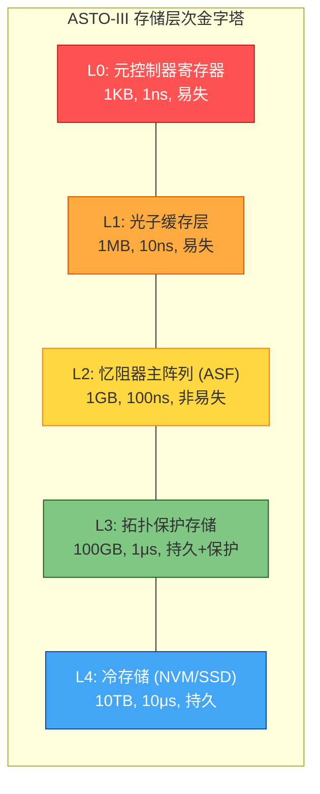
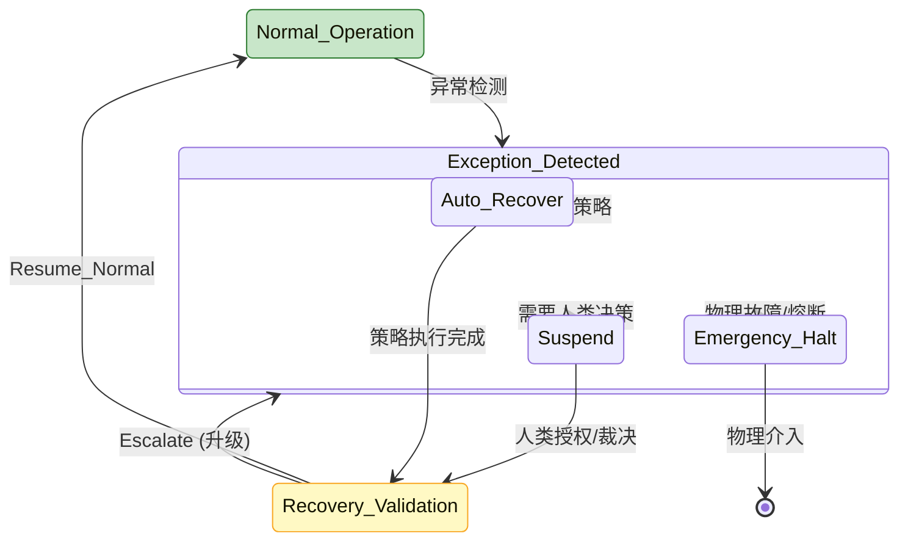
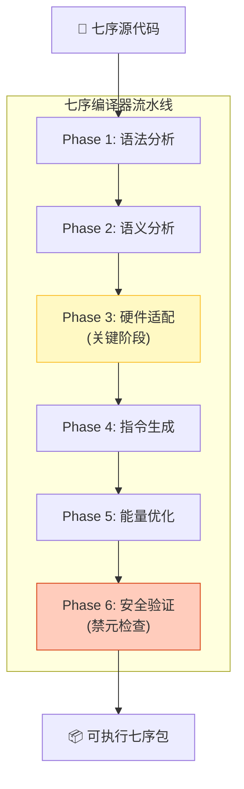
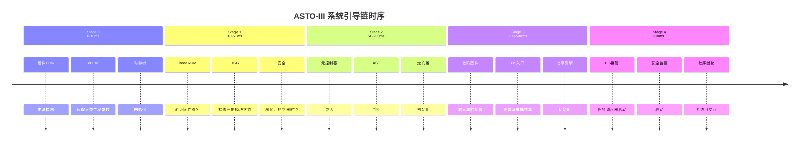
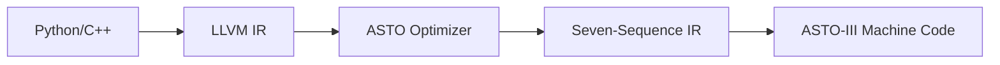

# **ASTO.计算机.OS.基于ASTO-III硬件的操作系统设计**

> **作者**: Fuyi (ODDFounder fuyi.it@live.cn)
> **完全重写以适配ASTO-III架构，从"模拟属性"转向"直接操作物理属性场"**

## 一、核心设计原则更新

### 1.1 从软件模拟到硬件代理

| 版本 | 设计理念 | 与硬件关系 |
|------|----------|------------|
| v1.0 | 在传统硬件上模拟属性场 | 通过驱动程序间接访问 |
| **v2.0** | **作为硬件属性场的"认知层"** | **直接操作物理属性状态** |

### 1.2 全新定位：元控制器的软件扩展

```
ASTO-III硬件架构中的角色分配：
┌───────────────────────────────────────┐
│                  元控制器（Meta-Controller）                    │
│      [硬件]：全局时序调度 + 冲突仲裁 + 能量管理                 │
│      [OS扩展]：属性语义解析 + 任务规划 + 异常恢复              │
└──────────────────────┬────────────────┘
                           │
┌───────────────────▼───────────────────┐
│                 ASTO/OS v2.0（认知扩展层）                 │
│  功能：将"用户意图"转化为"属性场可执行的七序指令"        │
│  特性：无内核、无进程、无文件系统，只有属性场代理       │
└─────────────────────────────────────┘
```

## 二、存储模型：直接映射属性状态场

### 2.0 内存/存储模型全景

ASTO-III完全抛弃传统的"内存+磁盘"二分法，采用统一的**属性场分层模型**。

#### 2.0.1 存储层次结构



**图示说明**：从顶层的纳秒级易失寄存器到底层的海量持久化存储，L2层（ASF）是计算发生的场所。

#### 2.0.2 关键问题解答

**Q1: 断电后数据还在吗？**

| 层次 | 断电后状态 | 恢复方式 |
|------|------------|----------|
| L0-L1 | **丢失** | 不可恢复，重新初始化 |
| L2 (ASF) | **保留** | 忆阻器非易失性，重启后状态不变 |
| L3 | **保留** | 拓扑保护，永久不变 |
| L4 | **保留** | NVM持久化 |

**Q2: 没有文件系统，如何组织数据？**

采用**属性集合命名空间**替代文件路径：

```rust
// 传统文件系统: /home/user/photos/vacation.jpg
// ASTO命名空间: user.photos.vacation (UUID: 0x1234...)

struct AttributeNamespace {
    segments: Vec<String>,      // ["用户", "照片", "假期"]
    uuid: UUID,                 // 全局唯一标识符
    field_coordinate: FieldCoordinate, // 属性场坐标
}

// 命名空间操作
impl AttributeNamespace {
    fn resolve(&self) -> &AttributeSet;    // 解析到属性集
    fn create_child(&self, name: &str) -> Self; // 创建子命名空间
    fn seal(&self, credential: &HumanCredential); // 封版
}
```

**Q3: 如何处理大文件（超过单个属性场区域）？**

```rust
// 大型属性集的分块存储
struct LargeAttributeSet {
    manifest: Manifest {          // 清单属性（必须在L2）
        total_size: u64,
        chunk_count: u32,
        chunk_coordinates: Vec<FieldCoordinate>,
    },
    chunks: Vec<ChunkReference>,  // 分块引用
}

impl LargeAttributeSet {
    // 流式读取（按需加载分块到L1缓存）
    fn stream_read(&self) -> impl Iterator<Item = AttributeChunk>;
    
    // 流式写入（自动分块并分配场域）
    fn stream_write(&self, data: impl Iterator<Item = u8>);
}
```

#### 2.0.3 存储操作的原子性保证

```rust
// 属性场事务模型
struct FieldTransaction {
    transaction_id: UUID,
    affected_regions: Vec<FieldRegion>,
    checkpoints: Vec<Checkpoint>,     // 回滚点
    commit_status: CommitStatus,
}

impl FieldTransaction {
    // 开始事务：在L3记录意图
    fn begin(&self) -> TransactionHandle {
        // 写入事务意图到拓扑保护存储
        write_to_l3(TransactionIntent::Begin(self.transaction_id));
    }
    
    // 提交事务：硬件级原子操作
    fn commit(&self) -> CommitResult {
        // 元控制器保证所有变迁要么全部完成，要么全部回滚
        meta_controller.atomic_commit(self.affected_regions)
    }
    
    // 回滚事务：恢复到最近检查点
    fn rollback(&self) {
        for checkpoint in self.checkpoints.iter().rev() {
            restore_from_checkpoint(checkpoint);
        }
    }
}
```

---

### 2.1 抛弃传统存储栈

```rust
// v1.0：软件模拟的属性存储
struct GlobalAttributeStore {
    all_sets: HashMap<UUID, AttributeSet>,  // 内存中的哈希表
    relations_graph: Graph<UUID, RelationType>,
}

// v2.0：硬件属性场的直接代理
struct HardwareFieldProxy {
    field_address: PhysicalAddress,      // ASF矩阵的物理地址
    access_mode: FieldAccessMode,        // 读取/写入/演化的访问模式
    
    // 关键：不再存储数据，只缓存元信息
    cached_metadata: LRUCache<FieldRegion, Metadata>,
    pending_transitions: Vec<TransitionRequest>,
}
```

### 2.2 硬件属性场的直接操作API

```rust
// 直接操作ASF矩阵的底层接口
trait ASFHardwareInterface {
    // 1. 属性状态读取（利用光子层超快读取）
    fn read_attribute_state(&self, coordinate: FieldCoordinate) -> AttributeValue {
        // 直接发出光子读取脉冲，无需数据搬运
        let light_pulse = generate_read_pulse(coordinate);
        let reflected = send_to_photon_layer(light_pulse);
        decode_attribute_from_reflection(reflected)
    }
    
    // 2. 属性变迁触发（忆阻器原位演化）
    fn trigger_attribute_transition(
        &self, 
        coordinate: FieldCoordinate, 
        target_state: FiveState
    ) -> TransitionResult {
        // 计算所需能量脉冲
        let energy_profile = calculate_energy_for_transition(coordinate, target_state);
        
        // 通过定向维处理单元精确注入能量
        let ddp = get_directive_dimension_processor();
        ddp.inject_energy_pulse(coordinate, energy_profile);
        
        // 等待并验证变迁完成
        monitor_transition_completion(coordinate, target_state)
    }
    
    // 3. 场域健康度监控
    fn monitor_field_health(&self) -> FieldHealthReport {
        // 利用ASF内置的传感器网格
        let sensor_data = read_sensor_grid();
        
        // 评估五态分布平衡性
        let state_distribution = analyze_state_distribution();
        
        // 检测异常耦合（属性污染风险）
        let contamination_risk = detect_contamination_risk();
        
        FieldHealthReport {
            state_distribution,
            contamination_risk,
            energy_efficiency: calculate_energy_efficiency(),
            coherence_level: measure_coherence(),
        }
    }
}
```

### 2.3 属性访问的安全封装

```rust
// 所有硬件操作必须通过人类主权验证
struct SecureFieldAccess {
    hardware: ASFHardwareInterface,
    human_guardian: HumanSovereigntyGuard,
    
    fn secure_read(&self, coordinate: FieldCoordinate, credential: &HumanCredential) 
        -> Result<AttributeValue, AccessDenied> 
    {
        // 验证人类意图
        if !self.human_guardian.verify_intent(credential) {
            return Err(AccessDenied::HumanIntentMissing);
        }
        
        // 检查L-Bit物理熔断状态
        if is_l_bit_fused(coordinate) {
            return Err(AccessDenied::PhysicallySealed);
        }
        
        // 执行安全读取
        Ok(self.hardware.read_attribute_state(coordinate))
    }
    
    fn secure_transition(&self, request: SecureTransitionRequest) 
        -> Result<TransitionResult, TransitionDenied> 
    {
        // 多重验证
        self.validate_transition_path(&request)?;
        self.check_contamination_risk(&request)?;
        self.ensure_human_oversight(&request)?;
        
        // 通过元控制器仲裁
        let arbitration_result = self.arbitrate_with_meta_controller(&request);
        
        // 执行物理变迁
        self.hardware.trigger_attribute_transition(
            request.coordinate, 
            request.target_state
        )
    }
}
```

## 三、计算模型：硬件七序指令的直接执行

### 3.1 七序指令的硬件原生支持

```rust
// ASTO-III硬件的七序指令格式
struct SevenSequenceInstruction {
    sequence_id: SequenceID,           // 发生、解析、设计、干预、规约、回归、消解
    target_field: FieldCoordinate,     // 操作的目标属性场区域
    parameters: InstructionParams,     // 序列特定参数
    energy_budget: EnergyBudget,       // 允许的最大能耗
    timeout: TimeDuration,             // 超时设置（防止无限演化）
    
    // 硬件执行上下文
    execution_context: ExecutionContext {
        current_state: FiveState,      // 当前五态
        allowed_transitions: Vec<TransitionPath>, // 允许的变迁路径
        conflict_resolution: ConflictStrategy, // 冲突解决策略
    }
}

// 七序指令执行引擎
struct SequenceExecutionEngine {
    meta_controller_proxy: MetaControllerProxy,
    hardware_interface: ASFHardwareInterface,
    
    // 执行七序指令
    fn execute_sequence(&self, instruction: SevenSequenceInstruction) 
        -> SequenceExecutionResult 
    {
        match instruction.sequence_id {
            // 1. 发生序：创建新属性集合
            SequenceID::Occurrence => self.execute_occurrence(instruction),
            
            // 2. 解析序：识别属性类型与关系
            SequenceID::Parsing => self.execute_parsing(instruction),
            
            // 3. 设计序：规划变迁路径
            SequenceID::Design => self.execute_design(instruction),
            
            // 4. 干预序：注入外部约束
            SequenceID::Intervention => self.execute_intervention(instruction),
            
            // 5. 规约序：解决属性冲突
            SequenceID::Specification => self.execute_specification(instruction),
            
            // 6. 回归序：提取计算结果
            SequenceID::Regression => self.execute_regression(instruction),
            
            // 7. 消解序：注销无用属性
            SequenceID::Dissolution => self.execute_dissolution(instruction),
        }
    }
    
    // 示例：设计序的执行（规划变迁路径）
    fn execute_design(&self, instruction: SevenSequenceInstruction) 
        -> SequenceExecutionResult 
    {
        // 1. 读取当前属性状态
        let current_state = self.hardware.read_attribute_state(instruction.target_field);
        
        // 2. 在可算法区进行并行探索（利用忆阻器阵列的自然演化）
        let exploration_result = self.explore_in_algorithmic_zone(
            current_state, 
            instruction.parameters
        );
        
        // 3. 选择最优变迁路径
        let optimal_path = self.select_optimal_path(exploration_result);
        
        // 4. 验证路径可行性（避免违反禁元）
        self.validate_path_against_taboos(optimal_path)?;
        
        // 5. 返回设计蓝图
        SequenceExecutionResult::DesignBlueprint {
            optimal_path,
            alternative_paths: exploration_result.alternatives,
            estimated_energy: optimal_path.energy_cost,
            estimated_time: optimal_path.time_cost,
        }
    }
}
```

### 3.2 六阶演化节律的软件管理

```rust
// 六阶状态管理器
struct SixStageManager {
    current_stage: SixStage,
    stage_transition_history: Vec<StageTransition>,
    
    // 监测场域状态，预测阶段转换
    fn monitor_and_predict(&self, field_health: &FieldHealthReport) 
        -> StagePrediction 
    {
        match self.current_stage {
            SixStage::Chaos => {
                // 混沌阶：监测熵值下降趋势
                if field_health.coherence_level > CHAOS_TO_ORDER_THRESHOLD {
                    StagePrediction::TransitionTo(SixStage::Order)
                } else {
                    StagePrediction::RemainInChaos
                }
            }
            
            SixStage::Order => {
                // 秩序阶：监测扰动积累
                if field_health.contamination_risk > ORDER_TO_FLUX_THRESHOLD {
                    StagePrediction::TransitionTo(SixStage::Flux)
                } else {
                    StagePrediction::RemainInOrder
                }
            }
            
            // ... 其他阶段监测逻辑
        }
    }
    
    // 适应阶段转换（六阶是本体论节律，OS只能适应，不能强制）
    fn adapt_to_stage_transition(&self, target_stage: SixStage) {
        match target_stage {
            SixStage::Pulse => {
                // 脉冲阶：系统进入高能态
                // 动作：对齐资源窗口，准备捕捉脉冲
                self.align_resource_window();
            }
            
            SixStage::Return => {
                // 归元阶：状态自然坍缩
                // 动作：停止能量注入，记录坍缩结果
                self.stop_energy_injection();
                self.record_collapse_result();
            }
            
            _ => {
                // 其他阶段：保持观察
                log_stage_transition(self.current_stage, target_stage);
            }
        }
    }
}
```

## 四、任务管理：属性场作业调度

### 4.1 无进程的任务模型

```rust
// 传统：进程 = 执行实体 + 资源容器
// ASTO/OS：任务 = 属性场的演化作业
struct FieldEvolutionTask {
    task_id: UUID,
    description: String,           // 人类可读描述
    
    // 作业定义
    initial_configuration: FieldConfiguration,  // 初始属性场状态
    goal_configuration: FieldConfiguration,     // 目标属性场状态
    constraints: TaskConstraints,               // 约束条件
    
    // 执行计划
    seven_sequence_plan: Vec<SevenSequenceInstruction>,
    energy_budget: EnergyBudget,
    time_budget: TimeBudget,
    
    // 执行状态
    current_state: TaskExecutionState,
    progress: f32,  // 完成百分比
    
    // 监控与恢复
    checkpoints: Vec<Checkpoint>,
    recovery_strategy: RecoveryStrategy,
}

// 任务调度器
struct TaskScheduler {
    pending_tasks: PriorityQueue<FieldEvolutionTask>,
    running_tasks: HashMap<UUID, (FieldEvolutionTask, FieldRegion)>,
    completed_tasks: ArchivedTaskStore,
    
    // 调度决策：将任务映射到属性场的物理区域
    fn schedule_task(&mut self, task: FieldEvolutionTask) -> ScheduleDecision {
        // 1. 寻找合适的场域区域
        let candidate_regions = self.find_candidate_regions(&task);
        
        // 2. 评估每个区域的适配度
        let scored_regions: Vec<(FieldRegion, f32)> = candidate_regions
            .into_iter()
            .map(|region| (region, self.score_region_for_task(&task, region)))
            .collect();
        
        // 3. 选择最优区域（考虑隔离性，避免任务间干扰）
        let chosen_region = self.select_region_with_isolation(scored_regions);
        
        // 4. 分配资源，更新场域占用表
        self.allocate_field_region(chosen_region, &task);
        
        ScheduleDecision {
            task_id: task.task_id,
            allocated_region: chosen_region,
            start_time: calculate_start_time(),
            estimated_completion: estimate_completion_time(&task, chosen_region),
        }
    }
    
    // 任务隔离：确保不同任务的属性不互相污染
    fn ensure_task_isolation(&self, region1: FieldRegion, region2: FieldRegion) 
        -> IsolationGuarantee 
    {
        // 计算物理距离
        let distance = calculate_physical_distance(region1, region2);
        
        // 检查场隔离模块状态
        let isolation_status = check_field_isolation(region1, region2);
        
        // 评估污染风险
        let risk_assessment = assess_contamination_risk(region1, region2);
        
        IsolationGuarantee {
            physical_distance: distance,
            isolation_strength: isolation_status.strength,
            contamination_risk: risk_assessment.risk_level,
            recommended_action: risk_assessment.mitigation_strategy,
        }
    }
}
```

### 4.2 能量感知调度

```rust
// 能量管理系统
struct EnergyAwareScheduler {
    total_energy_budget: EnergyBudget,
    current_consumption: EnergyConsumption,
    energy_predictor: EnergyPredictor,
    
    // 根据六阶节律动态调整能量分配
    fn dynamic_energy_allocation(&self) -> EnergyAllocationPlan {
        let current_stage = get_current_six_stage();
        
        match current_stage {
            SixStage::Chaos => {
                // 混沌阶：低能量探索
                EnergyAllocationPlan {
                    algorithmic_zone: 0.7,  // 70%给可算法区
                    directive_dimension: 0.1, // 10%给定向维
                    meta_controller: 0.2,   // 20%给元控制器
                    strategy: EnergyStrategy::Exploration,
                }
            }
            
            SixStage::Order => {
                // 秩序阶：均衡分配
                EnergyAllocationPlan {
                    algorithmic_zone: 0.4,
                    directive_dimension: 0.4,
                    meta_controller: 0.2,
                    strategy: EnergyStrategy::Balanced,
                }
            }
            
            SixStage::Pulse => {
                // 脉冲阶：集中能量触发相变
                EnergyAllocationPlan {
                    algorithmic_zone: 0.1,
                    directive_dimension: 0.8,  // 大部分能量给定向维精确触发
                    meta_controller: 0.1,
                    strategy: EnergyStrategy::FocusedPulse,
                }
            }
            
            // ... 其他阶段
        }
    }
    
    // 预测任务能耗
    fn predict_task_energy(&self, task: &FieldEvolutionTask, region: FieldRegion) 
        -> EnergyPrediction 
    {
        // 分析任务的七序计划
        let sequence_energy: Vec<EnergyEstimate> = task.seven_sequence_plan
            .iter()
            .map(|seq| self.estimate_sequence_energy(seq, region))
            .collect();
        
        // 考虑场域状态（已使用的区域能耗更高）
        let field_state_factor = get_field_state_factor(region);
        
        // 计算总能耗预测
        let total_energy: f32 = sequence_energy.iter().map(|e| e.value).sum();
        let adjusted_energy = total_energy * field_state_factor;
        
        EnergyPrediction {
            base_estimate: total_energy,
            adjusted_estimate: adjusted_energy,
            confidence: calculate_confidence(sequence_energy),
            recommendations: self.generate_energy_saving_recommendations(task),
        }
    }
}
```

## 五、安全模型：与硬件安全机制的深度集成

### 5.1 人类主权验证流水线

```rust
// 与硬件维度0守护模块的深度集成
struct HumanSovereigntyPipeline {
    // 硬件接口
    hsg_hardware: HumanSovereigntyGuardHardware,  // 独立供电的硬件模块
    eeg_sensor: EEGSensorInterface,
    biometric_sensors: BiometricSensorArray,
    
    // 软件验证层
    intent_analyzer: IntentAnalysisEngine,
    behavior_validator: BehaviorValidationModule,
    
    // 验证流水线
    fn validate_human_intent(&self, operation: &SecureOperation) 
        -> Result<HumanIntentCredential, ValidationError> 
    {
        // 阶段1：硬件级生物特征验证（不可绕过）
        let biometric_data = self.acquire_biometric_data()?;
        
        // 检查EEG θ波存在（注意力）
        if !biometric_data.has_eeg_theta_wave() {
            return Err(ValidationError::AttentionMissing);
        }
        
        // 检查瞳孔扩张在正常范围（防止胁迫）
        if biometric_data.pupil_dilation > STRESS_THRESHOLD {
            return Err(ValidationError::PossibleDuress);
        }
        
        // 阶段2：意图语义分析
        let intent_analysis = self.intent_analyzer.analyze(
            operation.description,
            biometric_data.cognitive_load
        );
        
        // 验证意图一致性（防止中间人攻击）
        if !intent_analysis.is_consistent_with_operation(operation) {
            return Err(ValidationError::IntentOperationMismatch);
        }
        
        // 阶段3：行为历史验证
        let behavior_check = self.behavior_validator.validate_against_history(
            operation,
            &biometric_data
        );
        
        // 阶段4：生成最终凭证
        let credential = HumanIntentCredential {
            biometric_signature: biometric_data.signature(),
            intent_hash: intent_analysis.hash(),
            behavior_score: behavior_check.score,
            timestamp: get_secure_timestamp(),
            // 包含硬件生成的随机数，防止重放攻击
            hardware_nonce: self.hsg_hardware.generate_nonce(),
        };
        
        Ok(credential)
    }
    
    // 关键操作：物理解锁硬件执行单元
    fn physically_unlock_execution(&self, credential: &HumanIntentCredential) 
        -> Result<PhysicalUnlockToken, UnlockError> 
    {
        // 将凭证发送到硬件HSG模块
        let unlock_request = PhysicalUnlockRequest {
            credential: credential.clone(),
            operation_type: self.current_operation_type,
            required_power_level: calculate_required_power(),
        };
        
        // 硬件验证并生成物理解锁信号
        let unlock_result = self.hsg_hardware.verify_and_unlock(unlock_request);
        
        match unlock_result {
            HardwareUnlockResult::Success(token) => {
                // 解锁成功，返回物理令牌
                // 令牌必须在规定时间内使用，否则自动失效
                Ok(PhysicalUnlockToken {
                    token_value: token,
                    expiration: get_time() + UNLOCK_TOKEN_LIFETIME,
                })
            }
            HardwareUnlockResult::Failure(reason) => {
                // 记录失败原因，增加安全日志
                log_security_event(SecurityEvent::UnlockFailed {
                    reason: reason.clone(),
                    timestamp: get_time(),
                });
                
                Err(UnlockError::HardwareRejection(reason))
            }
        }
    }
}
```

### 5.2 属性污染防御系统

```rust
// 防御ASTO-III特有的属性污染攻击
struct AttributeContaminationDefense {
    // 硬件场隔离模块接口
    field_isolation: FieldIsolationHardware,
    
    // 污染检测引擎
    contamination_detector: ContaminationDetector,
    
    // 防御策略
    defense_strategies: HashMap<ContaminationType, DefenseStrategy>,
    
    // 实时监控属性场
    fn monitor_for_contamination(&self) -> ContaminationReport {
        // 扫描属性场中的异常耦合模式
        let anomalies = self.detect_anomalous_couplings();
        
        // 分析可能的污染路径
        let contamination_paths = self.analyze_contamination_paths(&anomalies);
        
        // 评估风险等级
        let risk_assessment = self.assess_contamination_risk(&contamination_paths);
        
        ContaminationReport {
            detected_anomalies: anomalies,
            potential_paths: contamination_paths,
            risk_level: risk_assessment.risk_level,
            recommendations: risk_assessment.mitigation_strategies,
        }
    }
    
    // 主动防御：隔离污染区域
    fn isolate_contaminated_region(&self, region: FieldRegion, contamination_type: ContaminationType) 
        -> IsolationResult 
    {
        // 根据污染类型选择防御策略
        let strategy = self.defense_strategies.get(&contamination_type)
            .unwrap_or(&DefenseStrategy::Default);
        
        match strategy {
            DefenseStrategy::PhysicalIsolation => {
                // 触发硬件场隔离模块
                self.field_isolation.activate_isolation(region);
                
                // 增强局部电场，阻止属性扩散
                self.field_isolation.enhance_local_field(region, ISOLATION_STRENGTH);
                
                IsolationResult::PhysicallyIsolated
            }
            
            DefenseStrategy::EnhancedIsolation => {
                // 增强电磁屏蔽隔离（纯经典方案，TRL 7+）
                self.field_isolation.enhance_electromagnetic_shielding(region);
                
                // 增加物理间距弱化耦合
                self.field_isolation.increase_physical_spacing(region, ENHANCED_SPACING);
                
                IsolationResult::EnhancedIsolated
            }
            
            DefenseStrategy::ControlledDissolution => {
                // 受控消解污染区域
                trigger_controlled_dissolution(region);
                
                IsolationResult::Dissolved
            }
        }
    }
    
    // 恢复受污染属性
    fn recover_contaminated_attributes(&self, region: FieldRegion) -> RecoveryResult {
        // 读取属性场的备份（如果有）
        let backup = self.get_field_backup(region);
        
        if let Some(backup_state) = backup {
            // 从备份恢复
            restore_from_backup(region, backup_state);
            RecoveryResult::RecoveredFromBackup
        } else {
            // 没有备份，执行安全消解
            self.safe_dissolution(region);
            RecoveryResult::SafeDissolutionPerformed
        }
    }
}
```

## 5.5 异常处理机制

ASTO/OS需要处理三类异常：**硬件异常**、**属性演化异常**、**人类主权异常**。

### 5.5.1 异常分类与优先级

| 异常类型 | 优先级 | 处理时限 | 恢复策略 | 示例 |
|----------|--------|----------|----------|------|
| **P0: 硬件物理故障** | 最高 | <1ms | 立即停机+物理介入 | ASF矩阵过热、元控制器失联 |
| **P1: 人类主权违规** | 极高 | <10ms | 全系统熔断 | AI尝试访问封版属性 |
| **P2: 属性场污染** | 高 | <100ms | 区域隔离+恢复 | 相邻属性异常耦合 |
| **P3: 七序执行异常** | 中 | <1s | 任务回滚或重试 | 超时、能量耗尽、路径冲突 |
| **P4: 资源竭尽** | 低 | <10s | 降级或排队 | 属性场满载、能量不足 |

### 5.5.2 硬件异常处理

```rust
// 硬件异常处理器（最高优先级，不可屏蔽）
enum HardwareException {
    ASFOverheat { temperature: f32, region: FieldRegion },
    MetaControllerTimeout { last_heartbeat: Timestamp },
    MemristorDrift { cell_id: u64, drift_rate: f32 },
    PhotonLayerFault { channel: u32, error_type: PhotonError },
    PowerSupplyAnomaly { rail: PowerRail, voltage: f32 },
}

impl HardwareExceptionHandler {
    fn handle(&self, exception: HardwareException) -> HardwareRecoveryAction {
        match exception {
            HardwareException::ASFOverheat { temperature, region } => {
                // 1. 立即降低受影响区域的能量注入
                reduce_energy_injection(region, 0.2);
                
                // 2. 迁移热点任务到其他区域
                migrate_hot_tasks(region);
                
                // 3. 如果温度继续上升，进入安全停机
                if temperature > CRITICAL_TEMP {
                    HardwareRecoveryAction::EmergencyShutdown
                } else {
                    HardwareRecoveryAction::ThrottleAndContinue
                }
            }
            
            HardwareException::MetaControllerTimeout { last_heartbeat } => {
                // 元控制器无响应是严重故障
                // 1. 尝试硬件复位
                if hardware_reset_meta_controller().is_ok() {
                    // 2. 重新同步属性场状态
                    resync_field_state();
                    HardwareRecoveryAction::ResetAndResync
                } else {
                    // 3. 硬件复位失败，必须人工介入
                    HardwareRecoveryAction::RequirePhysicalIntervention
                }
            }
            
            HardwareException::MemristorDrift { cell_id, drift_rate } => {
                // 忆阻器漂移需要校准
                if drift_rate < ACCEPTABLE_DRIFT {
                    // 轻微漂移：记录并继续
                    log_drift_event(cell_id, drift_rate);
                    HardwareRecoveryAction::Continue
                } else {
                    // 严重漂移：标记为坏块并迁移数据
                    mark_cell_as_bad(cell_id);
                    migrate_data_from_cell(cell_id);
                    HardwareRecoveryAction::MarkBadAndMigrate
                }
            }
            
            _ => HardwareRecoveryAction::LogAndContinue,
        }
    }
}
```

### 5.5.3 七序执行异常处理

```rust
// 七序执行过程中的异常
enum SequenceException {
    Timeout { sequence_id: SequenceID, elapsed: Duration },
    EnergyExhausted { sequence_id: SequenceID, consumed: f32 },
    PathConflict { path_a: TransitionPath, path_b: TransitionPath },
    TabooViolation { attribute_id: UUID, taboo_type: TabooType },
    ConvergenceFailure { iterations: u32, final_state: FiveState },
}

impl SequenceExceptionHandler {
    fn handle(&self, exception: SequenceException, context: &ExecutionContext) 
        -> SequenceRecoveryAction 
    {
        match exception {
            SequenceException::Timeout { sequence_id, elapsed } => {
                // 超时处理策略
                let retry_count = context.get_retry_count(sequence_id);
                
                if retry_count < MAX_RETRIES {
                    // 策略1：增加能量预算后重试
                    SequenceRecoveryAction::RetryWithMoreEnergy {
                        multiplier: 1.5,
                        new_timeout: elapsed * 2,
                    }
                } else {
                    // 策略2：回滚到检查点
                    SequenceRecoveryAction::RollbackToCheckpoint {
                        checkpoint_id: context.last_checkpoint,
                    }
                }
            }
            
            SequenceException::PathConflict { path_a, path_b } => {
                // 路径冲突：需要仲裁
                let arbitration = self.arbitrate_paths(path_a, path_b);
                
                match arbitration {
                    ArbitrationResult::ChoosePath(chosen) => {
                        // 选择一条路径继续
                        SequenceRecoveryAction::ContinueWithPath(chosen)
                    }
                    ArbitrationResult::NeedHumanDecision => {
                        // 无法自动仲裁，挂起等待人类决策
                        SequenceRecoveryAction::SuspendForHumanDecision {
                            conflict_report: ConflictReport::new(path_a, path_b),
                        }
                    }
                }
            }
            
            SequenceException::TabooViolation { attribute_id, taboo_type } => {
                // 禁元违规是严重错误
                log_security_event(SecurityEvent::TabooViolation {
                    attribute_id,
                    taboo_type,
                    timestamp: get_time(),
                });
                
                // 立即终止并回滚
                SequenceRecoveryAction::AbortAndRollback {
                    reason: "Taboo violation detected",
                }
            }
            
            _ => SequenceRecoveryAction::LogAndAbort,
        }
    }
}
```

### 5.5.4 系统恢复流程



**图示说明**：异常处理状态机展示了从正常运行到异常检测，再到不同恢复路径（自动、人工、紧急停机）的流转。

### 5.5.5 审计日志与事后分析

```rust
// 所有异常都必须记录到拓扑保护存储（L3）
struct ExceptionAuditLog {
    exception_id: UUID,
    timestamp: SecureTimestamp,       // 硬件时间戳，不可篡改
    exception_type: ExceptionType,
    severity: Severity,
    affected_regions: Vec<FieldRegion>,
    recovery_action: RecoveryAction,
    recovery_result: RecoveryResult,
    human_intervention_required: bool,
    
    // 现场快照（用于事后分析）
    field_snapshot_before: FieldSnapshotRef,
    field_snapshot_after: FieldSnapshotRef,
}

impl ExceptionAuditLog {
    // 日志写入是原子操作，不可中断
    fn write_atomically(&self) {
        let l3_storage = get_topological_storage();
        l3_storage.atomic_append(self);
    }
    
    // 日志一旦写入不可删除（物理特性）
    fn is_immutable() -> bool { true }
}
```

---

## 六、开发接口：七序高级语言

### 6.1 七序编程语言设计

```rust
// 七序语言示例：图像风格迁移任务
seven_sequence NeuralStyleTransfer {
    // 定义输入属性
    input content_image: ImageAttribute @ Coordinate(0x1234);
    input style_image: ImageAttribute @ Coordinate(0x5678);
    
    // 定义输出属性
    output stylized_image: ImageAttribute;
    
    // 七序执行计划
    sequence plan {
        // 1. 发生序：创建任务属性集合
        occurrence create_task_set() -> task_set: TaskAttributeSet;
        
        // 2. 解析序：分析图像特征
        parsing analyze_features(
            content: content_image,
            style: style_image
        ) -> features: FeatureMap;
        
        // 3. 设计序：规划风格迁移路径
        design plan_migration(
            features: features,
            constraints: StyleConstraints
        ) -> migration_plan: MigrationPlan;
        
        // 4. 干预序：执行风格迁移
        intervention execute_migration(
            plan: migration_plan,
            energy_budget: 150.0 // 能量限制
        ) -> intermediate_result: IntermediateImage;
        
        // 5. 规约序：解决冲突，优化结果
        specification resolve_conflicts(
            intermediate: intermediate_result,
            quality_threshold: 0.95
        ) -> optimized_result: OptimizedImage;
        
        // 6. 回归序：提取最终结果
        regression extract_final_result(
            optimized: optimized_result
        ) -> final_image: ImageAttribute;
        
        // 7. 消解序：清理中间属性
        dissolution cleanup(
            task_set: task_set,
            keep: [final_image]
        );
    }
    
    // 约束条件
    constraints {
        max_energy: 200.0,  // 最大能耗
        max_time: 5.0,      // 最大时间（秒）
        min_quality: 0.9,   // 最低质量要求
        isolation_required: true, // 需要任务隔离
    }
    
    // 错误处理
    error_handling {
        on Timeout => retry_with(more_energy: 50.0);
        on QualityBelowThreshold => adjust_parameters(learning_rate: 0.01);
        on ContaminationDetected => isolate_and_restart;
    }
}
```

### 6.2 七序编译器架构



```rust
// 七序语言编译器
struct SevenSequenceCompiler {
    // 编译器阶段
    stages: Vec<CompilerStage>,
    
    // 编译七序程序
    fn compile(&self, source: &str, target_hardware: &HardwareProfile) 
        -> CompiledSevenSequence 
    {
        // 阶段1：语法分析
        let ast = self.parse_source(source);
        
        // 阶段2：语义分析
        let semantic_info = self.analyze_semantics(&ast);
        
        // 阶段3：硬件适配（关键阶段）
        let hardware_adapted = self.adapt_to_hardware(&ast, &semantic_info, target_hardware);
        
        // 阶段4：七序指令生成
        let instructions = self.generate_instructions(&hardware_adapted);
        
        // 阶段5：能量与时间优化
        let optimized = self.optimize_for_resources(&instructions, target_hardware);
        
        // 阶段6：安全验证
        let verified = self.verify_safety(&optimized);
        
        // 阶段7：生成可执行格式
        self.generate_executable(&verified)
    }
    
    // 硬件适配：将抽象七序映射到具体硬件
    fn adapt_to_hardware(&self, ast: &AST, semantic_info: &SemanticInfo, hardware: &HardwareProfile) 
        -> HardwareAdaptedAST 
    {
        // 根据硬件特性调整七序计划
        let mut adapted = ast.clone();
        
        // 考虑硬件限制
        for sequence in &mut adapted.sequences {
            match sequence {
                Sequence::Design(design_seq) => {
                    // 设计序：考虑可算法区的并行能力
                    if hardware.algorithmic_zone_capability.parallelism > 1000 {
                        // 高并行硬件：可以探索更多路径
                        design_seq.exploration_breadth *= 10.0;
                    } else {
                        // 低并行硬件：减少探索范围
                        design_seq.exploration_breadth *= 0.5;
                    }
                }
                
                Sequence::Intervention(intervention_seq) => {
                    // 干预序：根据定向维处理单元精度调整
                    intervention_seq.precision = hardware.directive_dimension.precision;
                }
                
                // ... 其他序列的适配
            }
        }
        
        // 生成硬件特定的优化
        adapted.hardware_specific_optimizations = self.generate_hardware_optimizations(
            &adapted, 
            hardware
        );
        
        adapted
    }
    
    // 安全验证：确保不违反禁元
    fn verify_safety(&self, instructions: &[SevenSequenceInstruction]) 
        -> Result<VerifiedInstructions, SafetyViolation> 
    {
        // 检查每个指令是否违反禁元
        for (i, instr) in instructions.iter().enumerate() {
            // 验证1：不访问物理封版区域
            if self.is_in_sealed_region(instr.target_field) {
                return Err(SafetyViolation::AccessSealedRegion {
                    instruction_index: i,
                    region: instr.target_field,
                });
            }
            
            // 验证2：不尝试突破人类主权保护
            if instr.parameters.contains_privilege_escalation() {
                return Err(SafetyViolation::PrivilegeEscalationAttempt {
                    instruction_index: i,
                    operation: instr.sequence_id,
                });
            }
            
            // 验证3：能耗不超过安全阈值
            if instr.energy_budget > MAX_SAFE_ENERGY_BUDGET {
                return Err(SafetyViolation::ExcessiveEnergy {
                    instruction_index: i,
                    requested: instr.energy_budget,
                    max_allowed: MAX_SAFE_ENERGY_BUDGET,
                });
            }
            
            // 验证4：变迁路径不违反定向维规则
            if let Some(path) = &instr.execution_context.allowed_transitions {
                if !self.validate_transition_path(path) {
                    return Err(SafetyViolation::InvalidTransitionPath {
                        instruction_index: i,
                        path: path.clone(),
                    });
                }
            }
        }
        
        Ok(VerifiedInstructions {
            instructions: instructions.to_vec(),
            safety_guarantees: self.generate_safety_guarantees(instructions),
            verification_certificate: self.generate_certificate(instructions),
        })
    }
}
```

## 七、系统初始化与引导

### 7.0 引导链全景图（Bootstrap Chain）

**核心问题**：在一个“无CPU、无传统内存”的ASTO-III架构上，第一条指令如何加载和执行？

**解决方案**：采用“硬件固化引导序列 + 软件渐进接管”的分层架构。



**图示说明**：从硬件上电复位(POR)到操作系统完全接管的五个阶段，展示了硬件与软件的交接过程。

#### Stage 0: 硬件上电复位 (POR) [0-10ms]

| 步骤 | 操作 | 负责方 | 失败处理 |
|------|------|---------|----------|
| 0.1 | 电源轨还检测 | 硬件PMU | 不启动，灯LED报错 |
| 0.2 | eFuse读取（人类主权常数） | 硬件 | 拒绝启动 |
| 0.3 | 时钟树初始化 | 硬件PLL | 回退到安全时钟 |
| 0.4 | 关键寄存器复位 | 硬件 | 自动 |

#### Stage 1: Boot ROM执行 [10-50ms]

Boot ROM是烧录在芯片内的不可修改代码（约4KB），负责：

```
// Boot ROM 伪代码（硬件实现，非软件）
BOOT_ROM_ENTRY:
    1. 验证元控制器固件签名 (ED25519)
    2. 检查人类主权守护模块电源状态
    3. 如果签名有效 && HSG活跃:
           解锁元控制器时钟域
           跳转到元控制器入口地址
       否则:
           进入故障安全模式
           点亮故障LED
           永久HALT
```

#### Stage 2: 元控制器激活 [50-200ms]

元控制器（Meta-Controller）运行固化的微码，执行：

| 子步骤 | 操作 | 用时 |
|--------|------|------|
| 2.1 | 属性状态场(ASF)自检 | 50ms |
| 2.2 | 读取ASF健康度传感器 | 20ms |
| 2.3 | 初始化定向维处理单元 | 30ms |
| 2.4 | 建立与HSG的安全通道 | 50ms |
| 2.5 | 载入属性场基础配置 | 50ms |

#### Stage 3: 属性场初始化 [200-500ms]

这是OS开始接管的起点。元控制器已准备好“属性场管理API”，OS可以调用：

```rust
// 首次OS代码执行点（由元控制器调用）
#[no_mangle]
pub extern "C" fn os_entry_point(hardware_context: &HardwareBootContext) {
    // 此时可用的硬件接口：
    // - hardware_context.asf_base_address  属性场基址
    // - hardware_context.meta_controller   元控制器句柄
    // - hardware_context.hsg_interface     人类主权守护接口
    
    // 创建系统核心属性集
    let system_attrs = create_system_attribute_set(hardware_context);
    
    // 初始化七序执行引擎
    let seq_engine = SevenSequenceEngine::init(hardware_context);
    
    // 此时系统可以执行第一条七序指令
}
```

#### Stage 4: 七序就绪 [500-1000ms]

完成以下初始化后，系统进入可运行状态：

1. 六阶管理器启动
2. 任务调度器启动
3. 安全监控启动
4. 用户空间属性区域分配

---

### 7.1 冷启动过程（代码实现）

```rust
// ASTO/OS v2.0 引导流程
fn astos_cold_boot() -> BootResult {
    // 阶段0：硬件自检
    let hardware_status = perform_hardware_self_test();
    if !hardware_status.is_healthy() {
        return BootResult::HardwareFailure(hardware_status);
    }
    
    // 阶段1：唤醒元控制器
    let meta_controller = wake_meta_controller();
    
    // 阶段2：初始化属性状态场
    let asf_matrix = initialize_asf_matrix();
    
    // 阶段3：启动人类主权守护模块
    let hsg = activate_human_sovereignty_guard();
    
    // 阶段4：建立安全通信通道
    let secure_channels = establish_secure_channels(meta_controller, asf_matrix, hsg);
    
    // 阶段5：加载系统属性模板
    let system_templates = load_system_attribute_templates();
    
    // 阶段6：创建初始场域配置
    let initial_configuration = create_initial_field_configuration(
        system_templates,
        secure_channels
    );
    
    // 阶段7：启动六阶管理器
    let six_stage_manager = start_six_stage_manager(initial_configuration);
    
    // 阶段8：启动任务调度器
    let task_scheduler = start_task_scheduler();
    
    // 阶段9：启动安全监控
    let security_monitor = start_security_monitor();
    
    // 阶段10：进入运行状态
    enter_running_state(BootComponents {
        meta_controller,
        asf_matrix,
        hsg,
        six_stage_manager,
        task_scheduler,
        security_monitor,
        secure_channels,
    })
}
```

### 7.2 热迁移与状态保存

```rust
// 属性场状态保存与恢复
struct FieldStatePersistence {
    // 保存当前属性场状态
    fn save_field_state(&self, region: FieldRegion) -> FieldStateSnapshot {
        // 创建属性场快照
        let snapshot = FieldStateSnapshot {
            timestamp: get_secure_timestamp(),
            region_boundary: region,
            
            // 保存五态分布
            state_distribution: capture_state_distribution(region),
            
            // 保存关键属性值
            key_attributes: extract_key_attributes(region),
            
            // 保存关联关系
            relations: capture_relations(region),
            
            // 保存演化历史
            evolution_history: get_evolution_history(region),
            
            // 完整性校验
            integrity_hash: calculate_integrity_hash(region),
            
            // 加密保护
            encryption_key: generate_encryption_key(),
        };
        
        // 存储快照
        store_snapshot(snapshot.clone());
        
        snapshot
    }
    
    // 恢复属性场状态
    fn restore_field_state(&self, snapshot: &FieldStateSnapshot) -> RestoreResult {
        // 验证完整性
        if !verify_integrity(snapshot) {
            return RestoreResult::IntegrityViolation;
        }
        
        // 解密快照
        let decrypted = decrypt_snapshot(snapshot);
        
        // 检查区域兼容性
        if !check_region_compatibility(decrypted.region_boundary) {
            return RestoreResult::RegionIncompatible;
        }
        
        // 分阶段恢复
        self.restore_in_stages(decrypted)
    }
    
    // 分阶段恢复（避免一次扰动过大）
    fn restore_in_stages(&self, snapshot: DecryptedSnapshot) -> RestoreResult {
        // 阶段1：恢复基础属性
        restore_base_attributes(snapshot.key_attributes);
        
        // 阶段2：恢复关联关系
        restore_relations(snapshot.relations);
        
        // 阶段3：诱导状态分布
        guide_state_distribution(snapshot.state_distribution);
        
        // 阶段4：验证恢复结果
        let verification = verify_restoration(snapshot.integrity_hash);
        
        if verification.success {
            RestoreResult::Success {
                verification_score: verification.score,
                recovery_time: get_recovery_time(),
                warnings: verification.warnings,
            }
        } else {
            RestoreResult::PartialRestoration {
                recovered_percentage: verification.recovered_percent,
                errors: verification.errors,
            }
        }
    }
}
```

## 八、性能监控与优化

### 8.1 全栈性能监控

```rust
// 跨硬件-OS边界的性能监控
struct FullStackPerformanceMonitor {
    // 硬件性能计数器
    hardware_counters: HardwarePerformanceCounters,
    
    // OS性能指标
    os_metrics: OSPerformanceMetrics,
    
    // 应用级性能
    application_metrics: ApplicationPerformanceTracker,
    
    // 实时监控
    fn monitor_performance(&self) -> PerformanceReport {
        // 收集各层指标
        let hardware_report = self.hardware_counters.collect();
        let os_report = self.os_metrics.collect();
        let app_report = self.application_metrics.collect();
        
        // 关联分析
        let correlation_analysis = self.correlate_metrics(
            &hardware_report, 
            &os_report, 
            &app_report
        );
        
        // 识别瓶颈
        let bottlenecks = self.identify_bottlenecks(&correlation_analysis);
        
        // 生成优化建议
        let optimizations = self.generate_optimizations(&bottlenecks);
        
        PerformanceReport {
            hardware: hardware_report,
            os: os_report,
            application: app_report,
            correlation: correlation_analysis,
            bottlenecks,
            optimizations,
            timestamp: get_time(),
        }
    }
    
    // 识别ASTO特有的性能问题
    fn identify_asto_bottlenecks(&self, report: &PerformanceReport) -> Vec<ASTOBottleneck> {
        let mut bottlenecks = Vec::new();
        
        // 检查五态转换延迟
        if report.hardware.state_transition_latency > STATE_TRANSITION_THRESHOLD {
            bottlenecks.push(ASTOBottleneck::SlowStateTransition {
                latency: report.hardware.state_transition_latency,
                affected_regions: report.hardware.slow_transition_regions.clone(),
            });
        }
        
        // 检查场域耦合效率
        if report.hardware.field_coupling_efficiency < COUPLING_EFFICIENCY_THRESHOLD {
            bottlenecks.push(ASTOBottleneck::PoorFieldCoupling {
                efficiency: report.hardware.field_coupling_efficiency,
                suggested_improvements: vec![
                    "Increase photon-ASF coupling alignment".to_string(),
                    "Optimize waveguide design".to_string(),
                ],
            });
        }
        
        // 检查共识态达成时间
        if report.os.consensus_formation_time > CONSENSUS_TIME_THRESHOLD {
            bottlenecks.push(ASTOBottleneck::SlowConsensusFormation {
                formation_time: report.os.consensus_formation_time,
                node_count: report.os.consensus_node_count,
            });
        }
        
        bottlenecks
    }
    
    // 动态优化建议
    fn generate_dynamic_optimizations(&self, bottlenecks: &[ASTOBottleneck]) 
        -> Vec<DynamicOptimization> 
    {
        bottlenecks.iter().flat_map(|bottleneck| {
            match bottleneck {
                ASTOBottleneck::SlowStateTransition { latency, affected_regions } => {
                    vec![
                        DynamicOptimization::AdjustEnergyProfile {
                            regions: affected_regions.clone(),
                            increase_by: calculate_energy_increase(*latency),
                            reason: "加速态迁".to_string(),
                        },
                        DynamicOptimization::RescheduleTasks {
                            avoid_regions: affected_regions.clone(),
                            duration: ESTIMATED_OPTIMIZATION_TIME,
                        },
                    ]
                }
                
                ASTOBottleneck::PoorFieldCoupling { efficiency, suggested_improvements } => {
                    vec![
                        DynamicOptimization::ReconfigureFieldLayout {
                            goal: format!("提升耦合效率至{}", efficiency + 0.1),
                            methods: suggested_improvements.clone(),
                        },
                    ]
                }
                
                ASTOBottleneck::SlowConsensusFormation { formation_time, node_count } => {
                    vec![
                        DynamicOptimization::ReduceConsensusNodes {
                            target_count: (*node_count as f32 * 0.7) as usize,
                            reason: "减少共识节点以加速".to_string(),
                        },
                        DynamicOptimization::IncreaseConsensusEnergy {
                            multiplier: 1.5,
                            reason: "增加共识形成能量".to_string(),
                        },
                    ]
                }
            }
        }).collect()
    }
}
```

## 九、部署路线图

### 9.1 分阶段实施计划

| 阶段 | 时间框架 | 目标 | 依赖硬件 | 关键挑战 |
|------|----------|------|----------|----------|
| **阶段0：模拟器** | 2026-2027 | 在传统硬件上模拟ASTO/OS | 现有服务器 | 性能损失大（1000x slowdown） |
| **阶段1：混合原型** | 2028-2029 | PCM+光子混合硬件运行 | TRL 6-7硬件 | 耦合效率优化 |
| **阶段2：全ASF原型** | 2030-2032 | 真实属性状态场运行 | TRL 4-5忆阻器阵列 | 器件一致性 |
| **阶段3：生产系统** | 2033-2035 | 商业可用ASTO计算系统 | TRL 7+完整ASTO-III | 编译器和工具链成熟 |

### 9.2 渐进迁移策略

```rust
// 渐进迁移工具包
struct IncrementalMigrationToolkit {
    // 传统到ASTO的桥接
    legacy_bridge: LegacyToASTOBridge,
    
    // 混合模式运行支持
    hybrid_mode: HybridExecutionSupport,
    
    // 性能比较工具
    performance_comparator: PerformanceComparator,
    
    // 迁移单个应用
    fn migrate_application(&self, legacy_app: &LegacyApplication) 
        -> MigrationResult<ASTOApplication> 
    {
        // 步骤1：分析应用特性
        let app_analysis = self.analyze_application(legacy_app);
        
        // 步骤2：评估ASTO适配性
        let asto_suitability = self.assess_asto_suitability(&app_analysis);
        
        if !asto_suitability.is_suitable {
            return MigrationResult::NotSuitable(asto_suitability.reasons);
        }
        
        // 步骤3：选择迁移策略
        let strategy = self.select_migration_strategy(&app_analysis, &asto_suitability);
        
        // 步骤4：执行迁移
        let migrated = match strategy {
            MigrationStrategy::FullRewrite => {
                self.rewrite_for_asto(legacy_app, &app_analysis)
            }
            MigrationStrategy::Incremental => {
                self.incremental_migration(legacy_app, &app_analysis)
            }
            MigrationStrategy::Wrapper => {
                self.create_asto_wrapper(legacy_app)
            }
        };
        
        // 步骤5：验证与优化
        let verified = self.verify_migration(&migrated, legacy_app);
        
        MigrationResult::Success {
            asto_application: migrated,
            verification: verified,
            performance_improvement: self.measure_performance_gain(legacy_app, &migrated),
            migration_effort: calculate_effort(&strategy),
        }
    }
    
    // 混合执行模式
    fn enable_hybrid_execution(&self, app: &HybridApplication) -> HybridExecutionPlan {
        // 决定哪些部分在ASTO执行，哪些在传统硬件执行
        let partition_plan = self.partition_application(app);
        
        // 设计数据交换接口
        let data_exchange = self.design_data_exchange(&partition_plan);
        
        // 生成混合执行计划
        HybridExecutionPlan {
            asto_components: partition_plan.asto_parts,
            legacy_components: partition_plan.legacy_parts,
            exchange_interfaces: data_exchange,
            synchronization: self.design_synchronization(&partition_plan),
            fallback_strategy: self.create_fallback_strategy(app),
        }
    }
}
```

## 9.3 多语言支持与编译器前端 (Polyglot Support)

为了降低生态迁移成本，ASTO/OS 不强制要求开发者直接编写七序指令，而是通过 LLVM 后端支持现有语言。

### 9.3.1 编程模型适配
*   **Python (PyTorch/NumPy)**: 提供 `asto.Tensor` 后端。
    *   用户代码: `c = torch.matmul(a, b)`
    *   底层映射: `Design(PathPlanning) -> Reduce(ConflictResolution)`
    *   优势: 自动利用ASF矩阵的存内计算能力，无需修改上层逻辑。
    
*   **C++ / Rust**: 提供 `#[asto::attribute]` 宏。
    *   用户代码: `struct User { #[asto::sealed] balance: u64 }`
    *   底层映射: 编译器自动插入 L-Bit 物理熔断检查指令。

### 9.3.2 编译流程


## 十、总结：ASTO/OS v2.0 的核心创新

### 10.1 与传统操作系统的根本区别

| 维度 | 传统操作系统 | ASTO/OS v1.0 | **ASTO/OS v2.0** |
|------|------------|--------------|-------------------|
| **存储模型** | 文件系统 | 属性集合模拟 | **硬件属性场直接代理** |
| **计算模型** | 进程执行 | 属性态迁模拟 | **七序硬件指令直接执行** |
| **安全模型** | 权限控制 | 扰动权限管理 | **硬件人类主权强制 + 属性污染防御** |
| **调度单位** | 进程/线程 | 属性集合任务 | **场域演化作业 + 能量感知调度** |
| **编程接口** | 系统调用 | 七序API | **七序高级语言 + 硬件感知编译** |

### 10.2 与ASTO-III硬件的完美协同

1. **存储计算融合**：直接操作ASF矩阵，消除数据搬运
2. **能量节律同步**：软件调度与硬件六阶节律协调
3. **安全深度集成**：软件安全策略由硬件物理强制保障
4. **故障恢复协同**：硬件状态快照 + 软件智能恢复
5. **性能全栈优化**：跨硬件-OS边界的联合优化

### 10.3 技术挑战与应对策略

| 挑战 | 应对策略 | 缓解措施 |
|------|----------|----------|
| **硬件不成熟** | 渐进迁移路径 | 模拟器 → 混合原型 → 全硬件 |
| **编程模型新颖** | 七序语言+工具链 | 编译器 + 调试器 + 性能分析工具 |
| **安全验证复杂** | 形式化验证 | Coq验证 + 硬件安全证明 |
| **生态系统缺失** | 兼容层+迁移工具 | 传统应用桥接 + 混合执行 |

---

## **最终宣言**

**ASTO/OS 不仅一个操作系统，而是计算存在论的物质化体现。它放弃了对传统计算范式的修补，转而拥抱属性、场域、变迁的新本体论。**

**当第一个七序程序在ASTO-III硬件上运行时，我们将见证的不仅是性能的提升，更是计算本质的重构：从执行指令到引导演化，从处理数据到培育属性，从机械计算到有机生长。**

**这需要十年磨一剑的耐心，但方向已经清晰：计算的下一个七十年，属于懂得与场域共舞的操作系统。**
