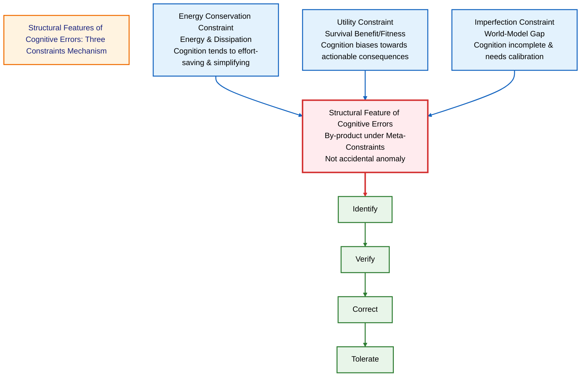
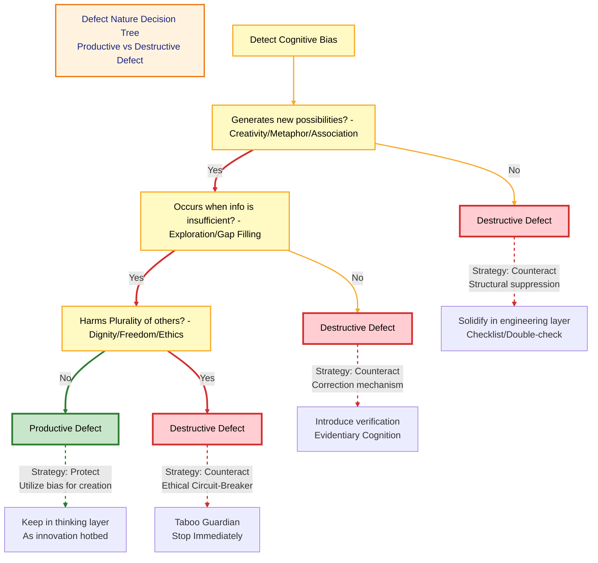
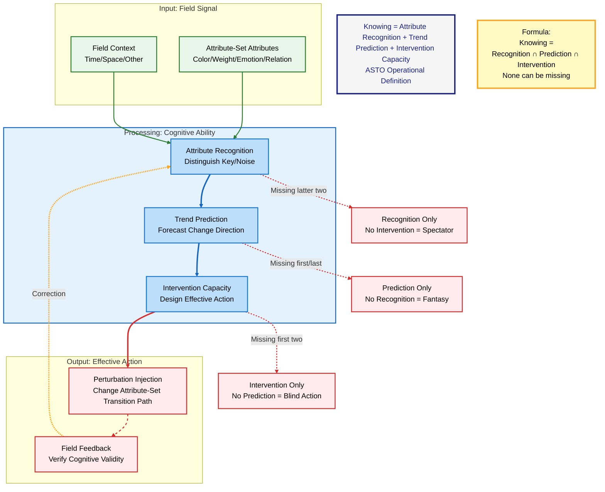
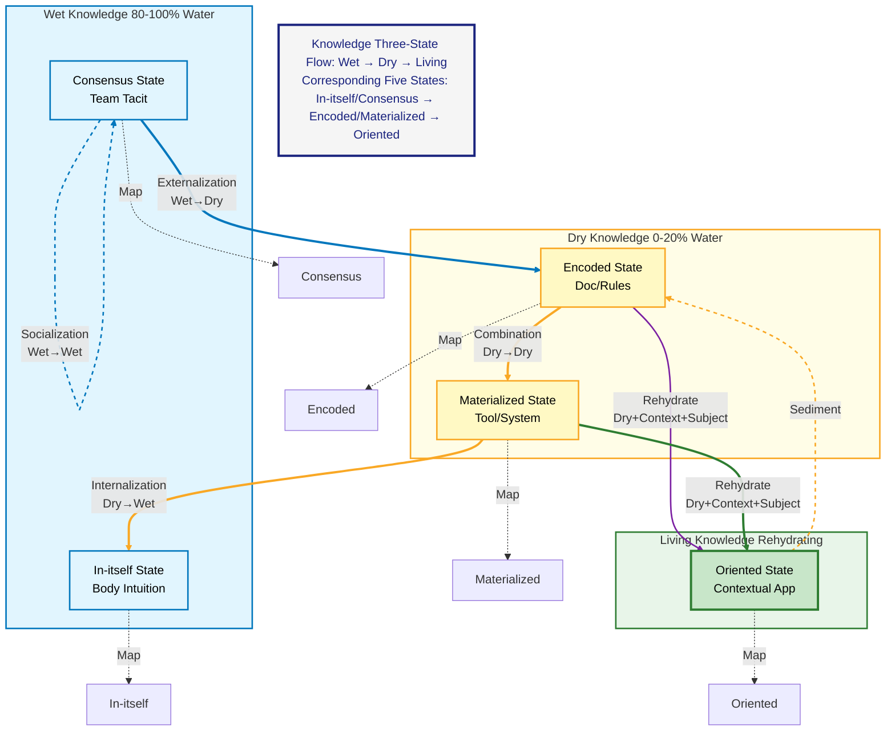
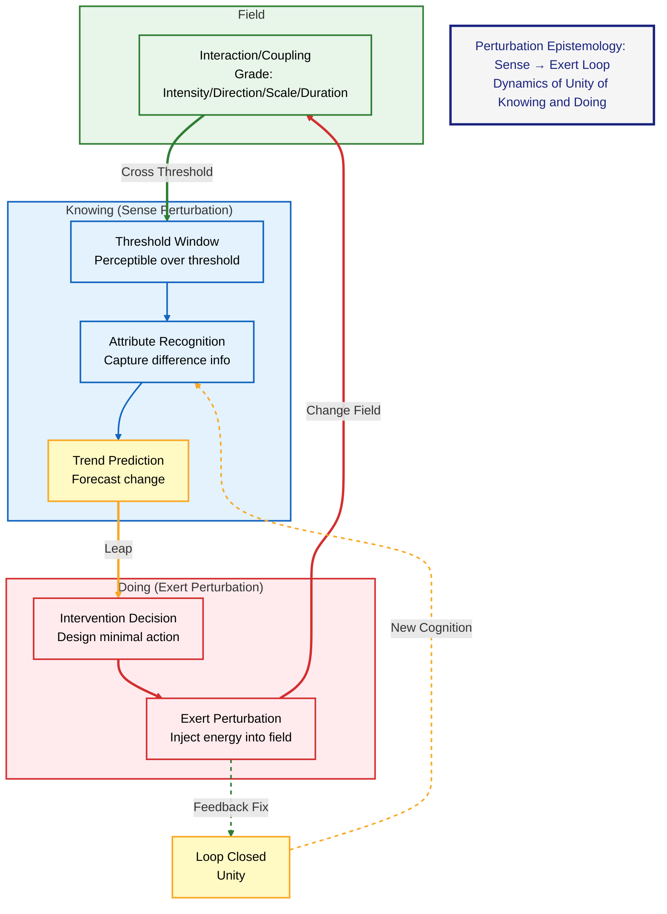
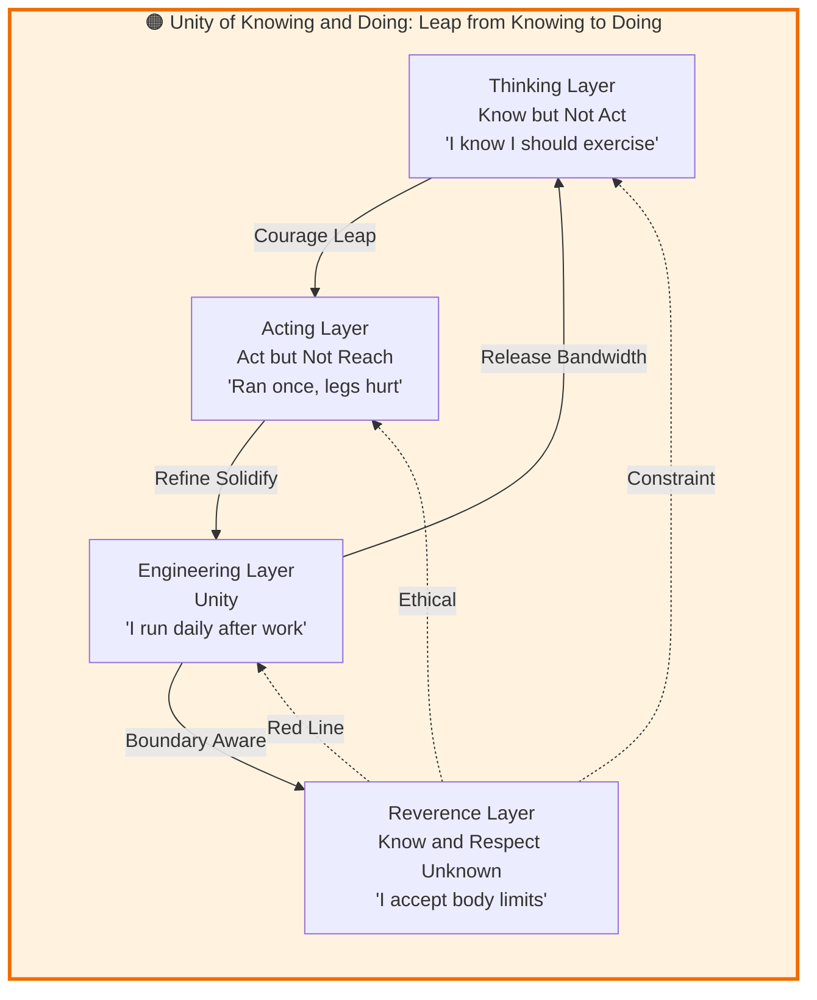
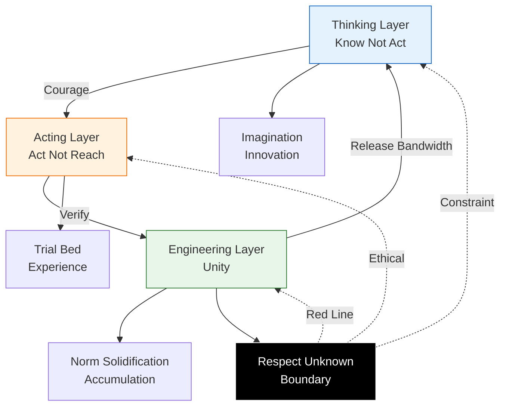

---
title: "ASTO.P03. Epistemology: Inevitability of Cognitive Errors and Evidentiary Cognition"
date: "2026-03-20"
version: "Paper.Rich.v1.3"
author: "Yi Fu (付毅, ODDFounder, fuyi.it@live.cn)"
status: "Public Review Draft"
layer: "ASTO"
abstract: "Proposed Evidentiary Cognition and Perturbation Epistemology, where cognitive error is a structural feature."
---

# **ASTO.P03. Epistemology: Inevitability of Cognitive Errors and Evidentiary Cognition**

---

## C. C-Positioning Declaration: Structural & Inference Layer Positioning

> P03 belongs to the boundary between structural layer and inference layer.
>
> **Structural Layer**: Descriptive statements about attribute-sets, perturbations, and transitions.
> **Inference Layer**: Operational principles derived from structural layer (evidence-based cognition, three layers of knowledge-action integration, fault-tolerant mechanisms).
> **Normative Layer**: Value postulates explicitly marked as ethical choices (civilizational stewardship, human arbiter status, taboo protection).
>
> Three layers can be accepted independently. This document's argument chain marks the belonging layer at each key node.

---
> **Version**: Paper.Rich.v1.3 (Audit by Quine, Kuhn, Polanyi, Goldman)
>
> **Status**: Public Review Draft
>
> **Author**: Yi Fu (付毅, ODDFounder, fuyi.it@live.cn)
>
> **Audience**: Philosophers / epistemology-trained readers
>
> **Note**: This draft retains the information density of Phil.v1.0 but moves engineering metaphors and life-oriented comparisons to the "Appendix (Interpretation Layer)", keeping the main text in a definition-proposition-argumentation-comparison structure typical of academic papers.

---

## **Abstract**

This paper proposes an epistemological scheme oriented towards real-world constraints within the ASTO (Attribute-Set Transition Ontology) framework: **Evidentiary Cognition** and **Perturbation Epistemology**. The core claim is: for finite subjects, cognitive error is not an accidental anomaly, but a normal state derived from structural constraints such as energy conservation, utility, and imperfection; therefore, the focus of epistemological practice should shift from "eliminating errors" to "identification-verification-correction-tolerance". On this basis, this paper understands "knowing" as a testable structure of capability (attribute recognition, trend prediction, intervention capacity), and characterizes the mechanism of cognition as: interaction/coupling (perturbation) in the field crossing the subject's threshold to form perceptible differences, triggering objectification and evidence accumulation.

To respond to professional criticism, this paper strictly distinguishes between descriptive and normative statements methodologically, and provides boundary statements on circular reasoning, category mistakes, naturalistic fallacy, misreading of history of philosophy, and essentialism risks.

**Keywords**: epistemology, error, justification, reliabilism, pragmatism, evidence, perturbation, coupling, threshold, ASTO

---

## **0. Methodological Positioning and Critical Pre-positioning**

### **0.1 Descriptive/Normative Distinction**
- **Descriptive**: Why cognitive systems deviate, simplify, and mismatch.
- **Normative**: How we should design verification and fault-tolerance mechanisms (this is a value choice, not automatically derived from facts).

### **0.2 P0 Risk: Self-Reference and Circular Reasoning**
If "utility/evidence/correctness" is self-assessed by the subject, it easily falls into self-justification. The minimal defense of this paper is:
- Adopt **Field Feedback** and **Repeatable Intervention** as operational criteria;
- Allow counter-examples and failure modes to enter the evidence chain (refutable/corrigible).

### **0.3 P0 Risk: Category Mistake**
- "Interruption/Error/Pain" are viewed only as **Threshold Window Phenomena**;
- "Perturbation" is more fundamental in this paper: **Interaction/Coupling between existences in the Field** (Gradable);
- Engineering/Life analogies serve only as an interpretative layer, moved to the appendix, not as premises for main text argumentation.

### **0.4 P1 Risk: Naturalistic Fallacy (is–ought gap)**
This paper marks "ought" as value commitments: e.g., risk governance, reversibility, chain of responsibility, dignity protection; not deriving "system ought to be like this" directly from "system operates like this".

### **0.5 P1 Risk: Misreading of History of Philosophy and Essentialism**
This paper only aligns problem domains, does not claim conceptual equivalence; and acknowledges "field differences"—the same standard has different weights in different fields.

---

## **1. Inevitability of Cognitive Errors: Direct Manifestation of Existential Axioms in Cognition**

Before entering ASTO's cognitive world, we must face a fundamental fact: **For finite subjects, cognitive error is inevitable; in ASTO's narrative, this is related to its claimed ontological constraints.**

> **Ontological Status of Axioms**:
> The axioms here (Energy Conservation, Utility, Imperfection) are not arbitrary hypotheses for theory building, but **phenomenological descriptions** of the existential condition of **Finite Beings**.
> *   As long as you are finite (not omniscient and omnipotent), you are constrained by energy (Energy Conservation);
> *   As long as you want to exist (not nothingness), you are constrained by fitness (Utility);
> *   As long as there is a gap between you and the world (non-identity), you are constrained by the gap of expression (Imperfection).
>
> They are **a priori frameworks** that any finite cognitive system (whether human, AI, or alien civilization) cannot escape.

> **⚠️ Quinean Warning: Corrigibility of Axioms**
> Although we call Energy Conservation, Utility, and Imperfection "axioms", according to Quine's holism, they are not absolutely unshakable a priori dogmas. They are the **most core and stable hypotheses** in the ASTO system. If empirical evidence capable of overturning these constraints appears in the future, the axioms themselves can also be revised. Our persistence on axioms stems from their extremely high explanatory power and stability in the current field.

But a practical clarification must be added immediately: **"Inevitable" does not mean "permissible to indulge".** The frequency of cognitive errors is not an unchangeable norm, but an important signal reminding us to constantly optimize and calibrate the cognitive system.

This is the fundamental divergence point between ASTO and traditional epistemology:
- **Traditional Epistemology (one orientation)**: Emphasizes truth/justification/reliability as ideals, thus tending to view error as a problem to be explained and controlled.
- **ASTO Epistemology**: Under the current axiom framework, cognition "making mistakes" is a structural feature, a by-product of the system operating under constraints of Energy Conservation, Utility, and Imperfection—thus the focus of practice shifts from "eliminating errors" to "identifying, verifying, and managing errors".

This structural feature of cognitive error, under ASTO's modeling premises, can be explained by the **Meta-Constraints: Three Questions Inviolable by Intervention** in ASTO.P05 (also named "Three Pre-Action Questions / Three Constraints of Intervention").

> **Two Namings for the Same Concept (Usage by Occasion)**:
> - **The Three Constraints of Intervention**: Used in "audit/norm/engineering governance" contexts.
> - **The Three Pre-Action Questions**: Used in "pre-action self-check/decision" contexts.

**Three Pre-Action Questions (Action Order)**:

1. **Is it sustainable? (Energy Conservation)**
2. **Can it survive? (Utility)**
3. **Is there a way out? (Imperfection)**

**Definitions of Three Constraints**:

*   **Energy Conservation**: Under given boundary conditions, the continuity of any existence is constrained by energy and dissipation; the stability of any structure requires continuous payment of maintenance costs.
*   **Utility**: Perturbations that can be retained or expanded must manifest as relatively positive survival benefits (fitness) in their field.
*   **Imperfection**: There is inevitably a gap between the world and any model; this gap cannot be eliminated, only managed; retaining reversibility and margin for future transition is a necessary condition for the system's continuous evolution.

### **1.1 Imperfection Axiom → Innate Cognitive Defect**
> **Imperfection (Existential Norm)**: There is inevitably a gap between the world and any model; this gap cannot be eliminated, only managed; retaining reversibility and margin for future transition is a necessary condition for the system's continuous evolution.
> **Slogan**: "Every existence has defects; defect is the mode of existence."

* **Mapping in Cognition**: Human cognition, as an "existence", is also innately imperfect.
* **Fundamental Insight**: Cognition is hard to achieve perfect, unbiased "truth"—this cannot be guaranteed at the **ontological level**; but this does not negate the significance of cognitive optimization: we can still improve the accuracy and adaptability of cognition through continuous calibration, pursuing "better" rather than "perfect".
* **Positive Meaning**: Cognitive "defects" are not simply "anomalies" to be eliminated, but the **form in which cognition exists**; however, in high-risk and high-cost scenarios, defects must be identified and suppressed through structural mechanisms.
* **Engineering Metaphor**: Any measurement tool has a precision limit; attempting to create "perfect measurement" violates the imperfection constraint.

### **1.2 Utility Axiom → Cognition Need Not Be Perfect**
> **Utility (Selection Function)**: Perturbations that can be retained or expanded must manifest as relatively positive survival benefits (fitness) in their field.
> **Slogan**: "Existence need not be perfect, only effective. If utility is positive, it survives; if negative, it perishes."

* **Mapping in Cognition**: Under resource-constrained conditions, cognition tends to maximize utility (actionability/adaptability), rather than always taking truth maximization as the sole goal.
* **Fundamental Insight**: When "effective enough" has lower energy consumption than "absolutely correct", the cognitive system will automatically choose the former.
* **Key Insight**: Many cognitive "errors" are actually **results of utility trade-offs**—fast but imprecise cognition may be more effective in survival.
* **Engineering Metaphor**: Heuristic algorithms sacrifice precision for speed and operability, which is the manifestation of utility constraints.

> **Philosophical Clarification: How is Utility Defined? (Anti-Circular Reasoning)**
> Critics may ask: If "utility" is judged by the cognitive system itself, is this circular reasoning? ASTO's response:
> 1. **Operational Definition**: In ASTO, "utility" is not an abstract concept, but an actionable indicator—**whether cognition can support the subject to complete the target action in a specific field**. The standard of utility comes from **field feedback** (action success/failure, resource consumption, time cost), not the cognitive system's self-evaluation.
> 2. **Multi-level Utility**: Short-term utility (immediate action success) and long-term utility (sustained adaptability) may conflict. ASTO acknowledges this tension and views it as the driving force of cognitive evolution.
> 3. **Relation to Truth**: Utility and truth are not simply opposed. In many fields, cognition closer to truth is indeed more effective—but ASTO emphasizes that this correlation is **empirical** rather than **necessary**.
> 4. **External Verification Mechanism**: Utility is not the cognitive system's "feeling good about itself", but verified through **external field feedback loops**. Example: Whether a hunter's cognition is effective is judged by whether the prey is caught, not the hunter's confidence level. This breaks the suspicion of circular reasoning.
>
> **⚠️ Declaration of Finitude of Utility Judgment (Peircean Warning)**
> Utility relies on external feedback (action success/failure). But in complex social systems, feedback is often **delayed, ambiguous, or missing**. At this time, the cognitive system may fall into the "false utility" trap (thinking it is effective, but actually accumulating risks). **In feedback-absent zones, theoretical scrutiny and ethical consciousness must be introduced, and utility cannot be blindly relied upon.**

### **1.3 Energy Conservation Axiom → Cognition Must Simplify**

#### **1.2.1 Relation between Truth and Utility: Weak Convergentism**

Goldman asks: Is ASTO strictly instrumentalist?
*   **ASTO Stance**: We hold **Weak Convergentism**. Although we verify cognition through "utility", we believe: in a long-term and open field, cognition that can continuously produce positive utility must have captured the real structure of the world (truth) to some extent.
*   **Utility is Means, Truth is Limit**: Utility is the only handle we have, while truth is the ideal limit of utility in the process of infinite approximation. We do not directly claim to possess truth; we only claim to possess "the most effective proxy for truth currently".
*   **Testable Convergence Proposition**: Cognitive patterns that continuously pass practice-loop verification in open fields exhibit monotonically non-decreasing fitness with field structure—i.e., a cognitive pattern $M_n$ retained after $n$ rounds of practice-loop verification satisfies $\text{Acc}(M_{n+1}) \geq \text{Acc}(M_n)$ in prediction accuracy. This is not a metaphysical commitment to "truth", but an empirical description of the practice-loop selection mechanism. When the field undergoes phase transition (Axiom 6), convergence may be interrupted and restart.
*   **Phase-Transition Reset Formalization**: When an Axiom 6 transition signal is detected, the Acc baseline resets under the following conditions:
    - If $\text{Acc}(M_n)$ declines beyond threshold $\delta$ over $k$ consecutive rounds (i.e., $\text{Acc}(M_n) - \text{Acc}(M_{n+k}) > \delta$), and field-structure indicators undergo irreversible change, a transition event is declared.
    - $M_{n+k}$ is then tagged as "pre-transition legacy pattern"; the Acc baseline resets to $\text{Acc}_0'$, and a new convergence cycle begins from $M_0'$.
    - Values of $\delta$ and $k$ are field-dependent (software engineering field suggestion: $\delta = 0.15$, $k = 3$).

#### **1.2.2 Cognitive Authority and False Utility**

In the social field, who defines "effective"?
*   **Risk**: Power structures may manipulate the definition of "utility". For example, a wrong policy may have "short-term utility" for rulers, but "long-term destructiveness" for civilization.
*   **Immune Mechanism**: **Cognitive Authority Audit** must be designed. Any cognition claimed to be "effective" must undergo cross-verification by plural subjects to prevent utility from being monopolized by a single power center.

### **1.3 Energy Conservation Axiom → Cognition Must Simplify**
> **Energy Conservation (Physical Constraint)**: Under given boundary conditions, the continuity of any existence is constrained by energy and dissipation; the stability of any structure requires continuous payment of maintenance costs.
> **Slogan**: "Existence tends to maintain itself with minimum energy consumption. Simplicity is a survival advantage."

* **Mapping in Cognition**: Cognition will naturally choose **cognitive shortcuts, heuristics, simplified models**.
* **Fundamental Insight**: These simplifications inevitably bring deviations and errors, but this is the price the system must pay for energy conservation—the price can be managed.
* **Key Conclusion**: In most daily situations, pursuing "perfect accuracy" brings unbearable energy consumption and latency; but in complex or high-risk decision environments, appropriate investment in higher precision still has significant value. The key lies in finding a sustainable balance between effectiveness and precision.
*   **Engineering Metaphor**: Caching mechanisms accelerate response by storing approximate values, which is the manifestation of energy conservation constraints.

### 1.3A Hierarchy Declaration of Meta-Constraints

Before continuing, it is necessary to clarify the nature of these three meta-constraints (they appear as "Three Questions Inviolable by Intervention" in P05, not fundamental axioms):

- **Energy Conservation**: Physical constraint (energy/dissipation) — explains the cost boundary of "sustained existence".
- **Utility**: Evolutionary selection function (fitness/survival benefit) — explains "what will be retained/expanded".
- **Imperfection**: Existential norm (gap between world and model) — explains "why models are never complete".

> **Memory Point**: Understand these three as "hard boundaries that must be acknowledged before intervention", not "problems that can be algorithmically eliminated within the system".

### **1.3.1 Special Topic: Why Trees? — The Cloth Metaphor**

> **"The world is a net, but to understand it, we must lift it into a tree."**

Human cognition has limits.
Facing the **networked** reality (like a cloth with interwoven warp and weft), if attempting to fully understand every connection, cognition would instantly overload.

**Functional Tree** is our strategy for dealing with complexity:
1.  **Find an End**: We grab an "endpoint" in the infinite net (this is usually our **purpose** or **current problem**).
2.  **Lift It**: Use this as the root node to lift the whole cloth.
3.  **Drape into a Tree**: Under the action of gravity (logic and causality), the complex net naturally combs into a hierarchical **tree**.

**Conclusion**:
We use trees not because the world looks like a tree.
It is because **trees are easier for us to understand and easier for us to adjust**.
Trees are a **dimensionality reduction** of the net **for action**.

### **1.4 Joint Action of Three Meta-Constraints: Structural Features of Cognitive Errors**

These three meta-constraints work together to produce a profound conclusion:

> **In the ASTO framework, human cognition "being prone to error" is not a problem that can be completely eliminated, but a structural feature of the system operating under constraints of Energy Conservation, Utility, and Imperfection. The possibility of error is embedded in the cognitive structure—this is exactly why we must design mechanisms for verification, correction, and fault tolerance.**

**Meta-Constraint Declaration**:
> ⚠️ **Important Clarification**: The above three (Energy Conservation, Utility, Imperfection) are used as **Meta-Constraints/Three Pre-Action Questions** in this paper to constrain structural intervention and explain the boundary conditions of cognition. They:
> 1. **Do not change the axiom numbering in P05**: Presented in P05 as "Meta-Constraints: Three Questions Inviolable by Intervention", not new numbered axioms.
> 2. **Do not directly derive value priorities**: Normative "ought" still needs to accept audits from ethical constraints such as Taboo Zone / Untouchable Dimension / Plurality.
> 3. **Cannot be eliminated, only managed**: The corresponding practice focus is verification, correction, and fault tolerance, not the fantasy of "completely eliminating errors".
>
> Therefore, when we say "cognitive error is structural", this is a **statement under the current meta-constraint framework**, not an **unshakable metaphysical assertion**.

**Bridge from Description to Normative: The Will to Survive**

Hume pointed out that "ought" (normative) cannot be directly derived from "is" (descriptive). ASTO explicitly introduces **"The Will to Survive"** here as an intermediary for deduction. (Note: "The Will to Survive" here is not a psychological state or moral obligation, but the minimal prerequisite for any practical system to continue operating.)

1.  **Description (Is)**: Cognitive systems are limited by meta-constraints and inevitably produce deviations.
2.  **Value Presupposition (Value)**: We possess **The Will to Survive**, and wish to build a better civilization on this basis (see P04 Manifesto).
3.  **Normative (Ought)**: In order to achieve survival and development under conditions of inevitable deviation, we **ought** to design verification, correction, and fault tolerance mechanisms.

> **Philosophical Clarification**: When we say "cognitive error is often not a bug, but a feature", this is a **descriptive statement**, describing the actual operation of the cognitive system. And when we say "fault tolerance mechanisms ought to be established", this is a **normative choice** based on the will to survive. The pursuit of accuracy in scientific progress and medical diagnosis remains crucial—ASTO emphasizes: while pursuing accuracy, we need to understand the structural roots of errors, so as to design more effective correction mechanisms, rather than simply blaming "not working hard enough" or "not smart enough".



### **1.5 Fundamental Differences between Traditional Epistemology and ASTO Epistemology**

| Dimension | Traditional Epistemology | ASTO Epistemology |
|---|---|---|
| **Cognitive Goal** | Pursue Truth Correspondence (Reflect world as is) | Pursue Adaptability (Operate effectively in environment) |
| **Nature of Error** | Anomaly, Defect, Needs Elimination | Norm, Feature, Inevitable Result of System Design |
| **Cognitive Standard** | Accuracy, Completeness, Consistency | Effectiveness, Efficiency, Adaptability |
| **Evolutionary Logic** | Asymptotically approach Truth | Adaptively select Effective Modes |

---

> **Metaphor Comparison**: For engineering and life metaphors of core concepts in this section, see **[Appendix E: Engineering Metaphors vs Life Metaphors Comparison Table](#appendix-e-engineering-metaphors-vs-life-metaphors-comparison-table)**.

### **1.6 Deep Inference: Why are Cognitive Defects the Source of Creativity?**

ASTO proposes a counter-intuitive proposition: **We should not only tolerate defects, but also thank defects.**

#### **1.6.1 Perfection is Stasis**
**Empirical Observation**: In human cognitive systems, if cognition could perfectly mirror reality (1:1 map), thinking might be locked by reality.
*   **No Deviation**, hard to generate "What if";
*   **No Blind Spot**, hard to stimulate "Imagination";
*   **No Misreading**, hard to generate "Metaphor".

> **Philosophical Clarification**: This is an **empirical observation**, not a logically necessary metaphysical claim. We are not saying "perfect cognition is logically impossible to be creative", but saying: **in the actual operation of human cognition**, defects and creativity show correlation empirically. The deep mechanism of this correlation remains to be further studied.

A system of perfect cognition might become a **Read-Only Memory (ROM)**, which can only replay reality and is difficult to create new reality—but this is a hypothesis needing continuous testing, not dogma.

#### **1.6.2 Error as Mutation**
In evolutionary theory, "errors" (mutations) in gene replication are the sole driving force of evolution.
Similarly, cognitive "errors" (association, empathy, hallucination) are **driving forces of meaning evolution**.
*   **Art**: Originates from "erroneous" perception of reality (exaggeration, distortion).
*   **Invention**: Originates from "dissatisfaction" with the status quo and "fictional" cognition of the future.
*   **Empathy**: Originates from approximate simulation of others' pain using self-model (sometimes producing systematic deviation).

#### **1.6.3 Filling as Creation**
Because our cognition is discontinuous and has gaps (Imperfection Constraint), the brain is forced to **fill** these gaps.
This process of filling "something out of nothing" is the essence of **creation**.
We see the world unclearly, so we are forced to **create** a world to explain it.

> **Conclusion**: Cognitive defects are not God's oversight, but are often experienced as: they leave practical space for subject's choice and creation. It is where the light gets in.

#### 1.6.4 Critique and Boundary: Not All Defects are Gifts

We cannot romanticize "defects". We must distinguish two types of defects:

1.  **Productive Defect**:
    *   **Mechanism**: Brain actively fills gaps when information is insufficient (e.g., visual blind spot filling, metaphorical association).
    *   **Consequence**: Generates new meanings, models, or art.
    *   **ASTO Attitude**: **Protect**. This is the source of creativity.

2.  **Destructive Defect**:
    *   **Mechanism**: Brain refuses to revise model even when information is sufficient (e.g., confirmation bias, logical fallacies, stereotypes).
    *   **Consequence**: Leads to irrational decisions, system fossilization, or disaster (as Kahneman pointed out systematic biases).
    *   **ASTO Attitude**: **Counteract**. This is "system failure" that needs to be suppressed via engineering structures (e.g., checklist, double-check).

#### 1.6.5 Defect Transformation Mechanism: Dynamic Boundary between Productive and Destructive

Polanyi's epistemology reminds us: Productive and Destructive are not static labels, but **dynamically transforming**.

*   **Transformation Threshold**: When a "Productive Defect" (e.g., a heuristic assumption) faces new, obviously contradictory field feedback, if the subject refuses to update the model, the defect instantly transforms into a "Destructive Defect".
*   **Transformation Dynamics**:
    *   **Positive Transformation (Creation)**: When a "Destructive Defect" (e.g., logical loophole) is identified and utilized by the subject (e.g., as starting point for reductio ad absurdum or artistic exaggeration), it can transform into a "Productive Defect".
    *   **Negative Transformation (Fossilization)**: When a "Productive Defect" (e.g., successful empirical intuition) is solidified into absolute dogma, refusing to be tested in the changing field, it degenerates into a "Destructive Defect".

> **Typical Case: AI Hallucination**
> *   **As Productive Defect**: When AI generates non-existent literature or fantasy scenes, if used for creative writing or brainstorming, it is **Inspiration** (Temperature > 0.8).
> *   **As Destructive Defect**: When the same hallucination appears in medical diagnosis or legal judgment, and lacks human verification, it is **Fraud and Risk**.
> *   **Insight**: Hallucination itself is not guilty; the guilt lies in **Context Mismatch** and **Lack of Verification**.

*   **Engineering Insight**: ASTO's engineering goal is not to eliminate all defects, but to **maintain the fluidity of defects**—preventing productive defects from hardening into destructive dogmas.

**Axiom Revision**:
Creativity comes from **utilization of "Productive Defects"** and **structural suppression of "Destructive Defects"**, as well as **acute awareness of the transformation boundary between the two**.
If one only embraces defects without verification, that is not creation, that is **'invalid hallucinations'**.

#### **1.6.6 Anomaly Monitoring and Paradigm Audit**

Kuhn reminds us that theories often die of "patching up" anomalies.
*   **Anomaly Monitoring**: The system should explicitly record "perturbations" that cannot be explained by the current Attribute-Set model.
*   **Paradigm Audit Threshold**: When the accumulation speed of anomalies exceeds the speed of model revision, a **Paradigm Audit** should be triggered. At this time, ad hoc hypotheses should no longer be added, but the "theoretical composting" program in P11 should be initiated to seek paradigm-level transition.



### **1.7 Special Topic: Why are Humans Stubborn? — Self-Preservation Instinct of Structure**

We often accuse others of being "stubborn", but in ASTO's view, **stubbornness is not a character defect, but a physical property of structure.**

#### **1.7.1 Will as Fortress**
**Just as Schopenhauer viewed the body as objectification of will**: Opinions are not clothes hanging on the wall, but skin growing in the flesh.
*   Your opinion is an extension of your **Will to Survive**.
*   When others attack your opinion, what you feel is not a logical error, but **pain at the ontological level**.
*   **Stubbornness** is the will protecting itself from being torn by external forces.

#### **1.7.2 Sunk Cost of Paradigm**
**Kuhn** reveals in *The Structure of Scientific Revolutions*:
*   Abandoning an old paradigm means admitting that past investments (time, reputation, faith) all go to zero.
*   Facing anomalous evidence, the system's default reaction is to **patch the old paradigm** (add ad hoc hypotheses), not to **overthrow it**.
*   **Stubbornness** is the system's last resistance to avoid "bankruptcy".

> **Life Metaphor: Old Sofa**
> Changing concepts is like throwing away an old sofa you've sat on for ten years: it's sagging and outdated, but your butt has adapted to its shape.
> Changing to a new sofa (new concept) means you have to adapt again, which is strenuous.
> So often, "stubbornness" is not that you want to win, but your brain is lazy—it doesn't want to move the sofa.

#### **1.7.3 Energy Conservation and Defense**
From **ASTO Axioms**:
*   **Energy Conservation Axiom**: Reconstructing cognitive models consumes huge energy (anti-entropy process). The brain, as a high-energy-consuming organ, instinctively refuses reconstruction.
*   **Stubbornness** = **Highest Form of Cognitive Laziness**. It saves "processing costs" by "refusing input".

> **Conclusion**: Stubbornness is an inevitable mechanism for the system to maintain **Structural Stable State**.
> If a person is not stubborn enough, his self will disintegrate at any time amidst minor perturbations of the environment.
> **Change happens only when "Pain of maintaining old structure" > "Energy consumption of reconstruction" (Transition Threshold).**

### **1.8 Three Practical Implications of Accepting Inevitability of Error**

1. **Liberate Cognitive Burden**: Do not pursue "perfect cognition", but "sufficiently effective cognition".
2. **Value Error**: Error is not pure loss, but the system's way of exploring boundaries.
3. **Design Fault-Tolerant System**: Cognitive systems must presuppose the occurrence of errors and design corresponding fault tolerance mechanisms.

---

## **2. Cognitive Refactoring: What is "Knowing" in ASTO?**

After understanding the inevitability of cognitive errors, we can re-examine a more fundamental question: **In the ASTO framework, what exactly is "Knowing"?**

> **⚠️ Boundary Declaration of "Knowing" Definition (Diversity of Language Games)**
>
> Wittgenstein reminds us: "Knowing" has different meanings in different forms of life. ASTO defines "knowing" as "testable capability structure" (attribute recognition + trend prediction + intervention capacity), which is an **engineering practice-oriented working definition**, not an **exhaustive analysis of all "knowing" language games**.
>
> **Forms of "Knowing" we acknowledge but do not handle deeply**:
> - **Propositional Knowledge** (Knowing that): "I know Paris is the capital of France" (Fact statement)
> - **Knowledge by Acquaintance** (Knowing by acquaintance): "I know the taste of this coffee" (First-person experience)
> - **Competence Knowledge** (Knowing how): "I know how to ride a bicycle" (Embodied capability)
>
> **ASTO's definition** is closer to the third (Knowing how), but further **operationalized into a three-layer structure**. The cost of this unification is: **It may flatten the subtle differences of "knowing" in different forms of life**.
>
> **Usage Boundary**: This definition is mainly used in **engineering practice, system design, complex decision-making** fields. In daily life, artistic creation, philosophical reflection fields, "knowing" may have richer, less operationalizable meanings—**that is beyond ASTO's definition**.
>
> **This is not a defect, but a positioning**: ASTO provides the **engineering skeleton** of "knowing", not the **complete flesh and blood** of "knowing".

### **2.0 Meta-Definition Anchor: Breaking the Circle**

Wittgenstein and skeptics might point out a fatal logical circle: If "knowing" itself is a product of the cognitive system, how can we use the cognitive system to define "knowing"? To break this circle, ASTO introduces **Meta-Definition Anchors**.

**Meta-Constraints**—Energy Conservation, Utility, Imperfection—are not rules produced within the cognitive process, but **a priori ontological conditions for cognition to occur**. (Note: "a priori" here does not mean Kantian a priori forms, but ontological prerequisites unavoidable for any cognitive occurrence.)

*   **Status**: They exist independent of the cognitive subject's acknowledgment; they are direct projections of physical and evolutionary laws on the cognitive level.
*   **Anchoring Function**: Because meta-constraints are "Given", all subsequent definitions of "knowing" are anchored on this hard substrate. We are not talking about "what is truth", but asking: "Under constraints of must-save-energy, must-survive, destined-to-be-imperfect, what kind of information processing structure can be called 'knowing'?"

This makes ASTO's epistemology a **weakly naturalized epistemology starting from ontological constraints**: It does not seek Cartesian absolute certainty starting point, but derives the ought-structure of cognition from **ontological hard constraints**.

### **2.1 Challenge of Traditional Epistemology and ASTO's Cognitive Refactoring**

> **Gettier Problem Immunity Declaration**
> ASTO abandons the traditional definition of knowledge (JTB: Justified True Belief).
> In ASTO, "knowing" is a **capability structure** (Recognition + Prediction + Intervention), not a belief state.
> Therefore, the Gettier Problem ("Is justified false belief knowledge?") is **Invalid** (N/A) under this framework.
> We do not solve the Gettier Problem, we **dissolve** it.

**In the context of engineering practice, some core assumptions of traditional epistemology face challenges**:

* **Limitation of Representationalism**: Representationalism tends to believe we can directly "see" the true face of the world → But in engineering practice, all perception is the result of attribute filtering.
* **Limitation of Representation**: Believes the brain can accurately "represent" external reality → But in complex systems, all representations are products of attribute compression.
* **Limitation of Foundationalism**: Believes knowledge has unshakeable foundations → But in dynamic environments, all foundations are temporary stable states of specific fields.

> **Philosophical Clarification**: ASTO does not declare traditional epistemology "bankrupt" or "invalid"—Representationalism, Foundationism have complex defended versions in contemporary philosophy. ASTO's stance is: In the specific context of **engineering practice**, these traditional assumptions need to be modified or supplemented to better guide the actual cognition-action loop.

**ASTO's Cognitive Refactoring**: Shift from "Correspondence Truth" to "Operational Truth".

> **Core Proposition**: In ASTO framework, "knowing" takes an operational definition in engineering context: It refers not primarily to possessing static representations of the world, but more emphasizing **mastering the recognition-response patterns of Attribute-Sets in specific fields**.
>
> **Term Anchor | Attribute-Set**:
> An Attribute-Set is a collection of attributes identifiable in a time slice;
> The transition of Attribute-Sets constitutes the entire history of existence.
>
> We do not discuss what existence "originally is",
> We only discuss what it "presents as right now" in time.

**Formula (Operational)**: $$ \text{Knowing} = \text{Attribute Recognition} + \text{Trend Prediction} + \text{Intervention Capacity} $$

### **2.2 Three-Layer Analysis of "Knowing"**

> **Ontological Tension Clarification**:
> Heidegger might question: If the world is transitioning (Becoming), why do we use discrete "Attribute-Sets" to cognize it?
>
> ASTO's answer is: **Because "knowing" is essentially a discretization operation.**
> Continuous transition (Becoming) is Ineffable; to "know" it, the subject must **cut** it into discrete time slices and attribute sets.
> This inevitable gap of **"discrete capturing continuous"** is the root of "Imperfection Constraint". We admit Attribute-Set is a dimensionality reduction of transition, but it is the only handle available to us in finitude.



1. **Attribute Recognition Layer**: Distinguish key attributes from noise attributes
   * **Example**: Experienced engineers spot key issues in code at a glance, while novices only see surface syntax errors.

2. **Trend Prediction Layer**: Forecast direction of attribute structure change
   * **Example**: Architects predict bottleneck locations as load increases, designing expansion plans in advance.

3. **Intervention Capacity Layer**: Influence attribute reorganization through action
   * **Example**: Developers identify bugs and fix root structural problems through refactoring.

### 2.3 Hierarchy of "Knowing": Individual, Collective, and Structural

4. **Ineffable Knowing**:
   * **Polanyi Layer**: Acknowledge existence of "knowing" whose thickness and complexity can never be fully operationalized into the three layers.
   * **Feature**: Exists in muscle memory, old craftsman's intuition, and ethical sense not exhaustible by algorithms.
   * **ASTO Attitude**: Engineering layer should not attempt to "force encode" this layer, but protect its transmission through **field resonance** (e.g., apprenticeship, joint practice). It is the background of all explicit cognition.

Polanyi's "Tacit Knowledge" reminds us that knowing is not just an individual psychological event, but a layered structure. ASTO distinguishes knowing into three organic levels:

1.  **Individual Knowing (Somatic/Cognitive Knowing)**
    *   **Carrier**: Single subject's nervous system and body.
    *   **Feature**: High response speed, contains much ineffable tacit component (e.g., old doctor's touch).
    *   **Limitation**: Annihilates with individual death, hard to scale directly.

2.  **Collective Knowing (Intersubjective Knowing)**
    *   **Carrier**: Language, ritual, team tacit understanding, organizational culture.
    *   **Feature**: Maintained through dialogue and collaboration, possessing Intersubjectivity.
    *   **Function**: Filters individual bias, forming relatively stable "consensus truth".

3.  **Structural Knowing**
    *   **Carrier**: Tools, code, institutions, physical facilities.
    *   **Feature**: Knowing is "solidified" in non-biological media (e.g., road signs "know" danger, firewalls "know" what packets to intercept).
    *   **Value**: Realizes **ex-vivo storage** and **cross-spacetime reuse** of cognition, key to civilization accumulation.

**Evolutionary Dynamics**: ASTO focuses on **Transition (Materialization)** from Level 1 to Level 3, and **Reactivation (Internalization)** from Level 3 back to Level 1.

### **2.4 Five Fundamental Characteristics of "Knowing" in ASTO**

| Characteristic | Traditional Epistemology | ASTO Epistemology |
|---|---|---|
| **Ontological State** | Static Possession | Dynamic Ability |
| **Validity Standard** | Correspond to Objective Reality | Effective in Specific Field |
| **Generation Mechanism** | Individual Mental Process | Attribute-Set - Environment Interaction |
| **Existence Form** | Mental Representation | Executable Norm |
| **Evolution Method** | Gradual Accumulation | Transition & Refactoring |

### **2.5 Position of "Knowing" in 1-5-6-7-1 Loop**

**Key Insight**: Knowing is not the starting point of the loop, but an **intermediate product**. It always **lags behind existence, leads practice**.

```
Monistic Layer (Existence)
  ↓
Five States (Morphological Unfolding: In-itself -> Consensus -> Encoded)
  ↓
Six Stages (Dynamic Process: Chaos -> Order -> Flux)
  ↓
**"Knowing" Born Here: Attribute Structure Recognized and Encoded**
  ↓
Seven Orders (Intervention Loop: Intervene based on "Knowing")
  ↓
Verification & Correction (Back to New Monistic Layer)
```

Knowing captures the existence state that just passed, used to guide the upcoming practical action. This **time lag** is another root of cognitive error: We always use past patterns to predict future changes.

### **2.6 Multiple Forms of Knowing: From Chaotic Recognition to Oriented Norm**

In ASTO, "Knowing" is not a single state, but multiple forms evolving along Five States:

#### 2.6.1 In-itself Knowing: Vague Recognition
* **Form**: Attribute structure not yet clearly distinguished
* **Expression**: "Feels like this"
* **Reliability**: Low, easily interfered
* **Dialectical Tension View**: Vague perception of potential tension

#### 2.6.2 Consensus Knowing: Shared Recognition
* **Form**: Attribute structure agreed upon verbally in group
* **Expression**: "Everyone says so"
* **Reliability**: Medium, relies on social consensus
* **Dialectical Tension View**: Tension manifested as group consensus

#### 2.6.3 Encoded Knowing: Formalized Recognition
* **Form**: Attribute structure clearly encoded as rules
* **Expression**: "Rule says so"
* **Reliability**: High, but may ossify
* **Dialectical Tension View**: Tension formalized as unity of opposites rules

#### 2.6.4 Materialized Knowing: Executable Recognition
* **Form**: Recognition pattern solidified into executable tools
* **Expression**: "Tool automatically checks/executes"
* **Reliability**: Very High, but may have blind spots
* **Dialectical Tension View**: Tension solidified as executable checkpoints
* **Diff vs Encoded**: Materialized is **Runtime**, Encoded is **Design-time**

#### 2.6.5 Oriented Knowing: Self-Correcting Recognition
* **Form**: Recognition system includes self-correction mechanism
* **Expression**: "System knows when to adjust rules"
* **Reliability**: Adaptive, but complex
* **Diff vs Materialized**: Oriented contains **meta-rules** ("When to change rules"), Materialized only has **fixed rules**

> **Engineering Mapping**: See **[Appendix F: Engineering Mapping of Five States Knowing](#appendix-f-engineering-mapping-of-five-states-knowing)**.

### **2.7 From Knowing to Knowledge: A Key Distinction**

**Knowing**: Recognition ability of individual/system at current moment (Dynamic Process)
**Knowledge**: Solidified, transferable knowing pattern (Static Product)

In ASTO:
* **Knowing is a living process**, always unfolding in specific context
* **Knowledge is relatively stable sediment**, a stage product of knowing process, valuable for **standardization, transmission, and scalable reuse**
* All knowledge comes from knowing; but if knowledge loses update mechanism, is treated as eternal truth, or applied out of context, it may **alienate** into an obstacle to knowing.

> **Warning**: Do not mistake knowledge for knowing. Knowledge is the map, knowing is the ability to walk on the ground. When the map is outdated, knowing ability can create a new map—healthy organizations allow "mapping" and "walking" to continuously calibrate each other.

### **2.8 Special Topic: Hierarchy and Flow of Knowledge (Wet, Dry, & Living)**

In ASTO, knowledge is not static inventory, but **Attribute-Sets with different water content**.

#### 2.8.1 Critiquing DIKW Pyramid
Traditional information science views cognition as a linear pyramid:
*   **Data**: Raw facts (e.g., "100").
*   **Information**: Data with context (e.g., "100 km/h").
*   **Knowledge**: Actionable rules (e.g., "Speed limit 80, speeding").
*   **Wisdom**: Meta-level judgment (e.g., "Speeding justified to save life").

ASTO thinks this is too linear. Knowledge circulates between different **phases**. Wisdom is not the tip, but the lubricant of the entire loop.

#### 2.8.2 ASTO Three-State Knowledge Model

1.  **Wet Knowledge —— Water Content 80-100%**
    *   **Definition**: Knowledge existing in brain, body, and interpersonal relationships.
    *   **Feature**: High context, high bandwidth, hard to copy, accompanied by emotion.
    *   **ASTO Mapping**: **In-itself, Consensus**.
    *   **Ex**: Team tacit understanding, code debugging intuition, leadership.

2.  **Dry Knowledge —— Water Content 0-20%**
    *   **Definition**: Knowledge solidified in media after dehydration.
    *   **Feature**: Low context, copyable, easy to transmit, loss of detail.
    *   **ASTO Mapping**: **Encoded, Materialized**.
    *   **Ex**: API docs, source code, manual, math formulas.

3.  **Living Knowledge —— Rehydrating**
    *   **Definition**: Dry knowledge read by subject and invested into action in new scenario.
    *   **Feature**: Dry Knowledge + Current Context + Subject Motility.
    *   **ASTO Mapping**: **Application in Seven Orders**.
    *   **Key**: Only "rehydrated" knowledge produces value.
    *   **Tacit Rehydration**: Polanyi reminds us, rehydration is not automatic. It relies on subject's **Tacit Knowledge Background**. Without experience thickness, subjects cannot rehydrate dry docs into living action. Education's essence is providing catalyst for "rehydration".

#### 2.8.3 ASTO Interpretation of Nonaka's SECI Model



*   **Socialization**: Wet → Wet (Apprenticeship, no docs).
*   **Externalization**: Wet → Dry (Writing docs, painful dehydration).
*   **Combination**: Dry → Dry (Organizing, AI excels here).
*   **Internalization**: Dry → Wet (Studying, rehydration process).

> **Engineering Insight**:
> Do not try to dry all "Wet Knowledge" (Over-documentation). Wet knowledge is innovation hotbed, Dry knowledge is scaling basis.
> **Healthy organizations keep appropriate "humidity".** All-doc org is desert, all-oral org is swamp.

### 2.9 Practical Meaning of Cognitive Refactoring

1. **From Correctness to Effectiveness**: Eval standard shifts from "Is it accurate" to "Is it effective in context".
2. **From Eliminating to Managing Error**: Error is not enemy, but system feature to manage/utilize.
3. **From Individual to System Cognition**: Cognition distributed/solidified in tools, processes, systems.
4. **From Static Knowledge to Dynamic Ability**: Education focus shifts to capabilities (Recognition, Prediction, Intervention).

### 2.10 Dark Side of Cognition: Dimensions Missed by Engineering View

ASTO emphasizes explicit "Structural Cognition", but we must admit half of cognition is **Invisible**.

#### 2.10.1 Tacit Knowing
**Michael Polanyi**: **We know more than we can tell.**
*   **Feature**: Riding bike, swimming, surgical touch.
*   **ASTO Revision**: Engineering layer shouldn't "force encode" all tacit knowledge, but provide **"Apprenticeship" Field**, allowing transfer in action; this doesn't reject tools/automation, but requires **supporting** tacit learning/reproduction with tools (Demonstration, Drill, Pairing, Gym).

#### 2.10.2 Embodied Cognition
**Merleau-Ponty**: **Body is not tool, but zero point of cognition.**

> **Small Action (10s)**: Close eyes, touch nose tip with finger.
> You don't need coordinates or "see" yourself—brain knows arm length/nose position.
> Minimal evidence of embodied cognition: **Cognition is not floating reasoning, but ability growing on body.**

*   **Feature**: You feel "cup is there" because arm "can reach it".
*   **ASTO Revision**: System design must fit **Subject's Body Schema**. Anti-human UI fails because it violates physical intuition of embodied cognition.
*   **Tool Insight**: Good tool should extend ability like an arm, not force memorizing manual.

#### 2.10.3 Social Scaffolding
**Vygotsky**: **Cognition is climbing on social scaffolding.**
*   **Feature**: You think "Quantum Mechanics" because language/culture built the ladder.
*   **ASTO Revision**: Cognitive improvement relies on "Environment Supply", not just "Personal Effort". **Building better docs/tools/community is raising group cognitive IQ.**

### 2.11 Dynamics Completion: Perturbation as Engine of Cognition

After static description, we add dynamic link: **How does cognition happen?**

ASTO introduces **Perturbation Epistemology**:

#### 2.11.1 Awakening of Cognition: Heideggerian "Interruption"

> **Formal Definition: Perturbation & Threshold**
> Let $S$ be System, $E$ be Environment.
> Let $\Delta$ be Interaction Magnitude.
> Let $\tau$ be Cognitive Threshold of $S$.
>
> *   **Perturbation ($P$)**: $P = f(S, E) \rightarrow \Delta$
> *   **Cognition ($C$)**:
>   $$ C = \begin{cases} 0 & \text{if } \Delta < \tau \text{ (Transparent / Ready-to-hand)} \\ 1 & \text{if } \Delta \ge \tau \text{ (Cognized / Present-at-hand)} \end{cases} $$
>
> **Explanation**: Only when interaction $\Delta$ exceeds threshold $\tau$, Cognition $C$ "wakes up".

*   **What is Perturbation?**: In ASTO, not synonym for "Accident/Interruption"; fundamentally refers to **Interaction/Coupling between existences in Field** (Gradable: Intensity/Direction/Scale/Duration), changing Attribute-Set transition path. Crash/Pain are just windows where this interaction crosses threshold and is "seen/felt".
*   **Smoothness is Ignorance**: When system works perfectly (Ready-to-hand), we don't "cognize" it, we "use" it. Like you don't feel your stomach until it hurts (Perturbation).
*   **Perturbation is Appearance**: Only when crash/error/anomaly happens, object stands out from background.
*   **Conclusion**: **Perturbation makes cognition happen (Threshold Window Effect).** Don't hate bugs/accidents: they mean system-environment interaction crossed perceptible threshold, revealing hidden structure.

#### 2.11.2 Bridge between Knowing and Doing: From "Sensing Perturbation" to "Exerting Perturbation"
Unity of Knowing and Doing is **reversal of perturbation direction**:



1.  **Knowing** = **Passively Sense Perturbation** (Receive difference info).
2.  **Doing** = **Actively Exert Perturbation** (Inject energy).
3.  **Unity** = **Closing of Loop**. Subject turns from "Disturbed" to "Disturber".

> **Core Inference**: If cognition cannot translate into effective perturbation on field (change code/process/consensus/life), it is **Invalid** in ASTO sense—just mental spinning in heat death.

---

## **3. Unity of Knowing and Doing: Epistemological Pillar of ASTO**

### **3.0 Core Framework: Three Steps of Unity**

In ASTO, Unity is not instantaneous state, but a **Transition Process**. It contains three explicit structural levels:



1.  **Thinking Layer**: Know but not act. Space of possibility.
2.  **Acting Layer**: Act but not reach. Space of trial and error.
3.  **Engineering Layer**: Unity. Space of norms and automation.

#### **3.0.1 Case Study: Two Paths (Lose Weight / Cooking)**

- **Case A: Lose Weight (Goal/Data oriented)**
  - **Thinking**: Know exercise helps, plan route.
  - **Acting**: Ran once, legs hurt, route unsuitable.
  - **Engineering**: Fix exercise after work, body starts automatically, App records data.

- **Case B: Cooking (Skill/Feel oriented)**
  - **Thinking**: Know "follow recipe", imagine steps.
  - **Acting**: Cooked once, salty/burnt, adjust heat/salt.
  - **Engineering**: Solidify flow (Prep-Cook-Timer-Clean), externalize variables to tools (timer/spoon).

Most cognitive problems are due to **Mismatch**: Using thinking to solve engineering problems, or engineering logic to limit thinking.

### **3.1 Thinking Layer: Know but Not Act, Imagination Space**

**Feature**: Cognition stays inside mind, no external action.

#### **3.1.1 Manifestation**
- **Personal**: Ideas but no practice.
- **Team**: Discussion but no conclusion.
- **Org**: Strategy but no tactics.

#### **3.1.2 Value & Limit**
- **Positive**: **Hotbed for Innovation**.
- **Negative**: **Fantasy Loop**.
- **Engineering Metaphor**: Design Draft.

#### **3.1.3 ASTO View**
- **Not Defect**: Necessary stage for creativity.
- **Dialectic**: Encourage exploration, prevent indulgence.
- **Leap Condition**: When potential is enough, push to Acting Layer.

### **3.2 Acting Layer: Act but Not Reach, Trial Bed**

**Feature**: Cognition turns to action, result uncertain.

#### **3.2.1 Manifestation**
- **Personal**: Try new method, bad effect.
- **Team**: Implement new process, resistance.
- **Org**: Reform with limited effect.

#### **3.2.2 Value & Limit**
- **Positive**: **Lab for Experience Accumulation**.
- **Negative**: **Sunk Cost**.
- **Engineering Metaphor**: Prototype System.

#### **3.2.3 ASTO View**
- **Trial Value**: Necessary for knowledge production.
- **Dialectic**: Tolerate failure, establish feedback.
- **Leap Condition**: When experience accumulates, push to Engineering Layer.

### **3.3 Engineering Layer: Unity, Norm Solidification**

**Feature**: Cognition and action fused, forming repeatable, verifiable, inheritable norms.

#### **3.3.1 Manifestation**
- **Personal**: Skill becomes instinct.
- **Team**: Best practice becomes process.
- **Org**: Success encoded as org capability.

#### **3.3.2 Value & Limit**
- **Positive**: **Container for Civilization Accumulation**.
- **Negative**: **Path Dependence**.
- **Engineering Metaphor**: Production System.

#### **3.3.3 ASTO View**
- **Solidification & Transcendence**: Both **Completion of Cognition** and **Start of New Round**.
- **Dialectic**: Establish norms, reserve breakthrough channels.
- **Loop**: Norms support thinking innovation, thinking innovation drives norm update.

### **3.4 Fourth Realm: Know and Respect Unknown — Wisdom of Untouchable Layer**

**Feature**: Recognize boundary, actively reserve untouchable domain, respect unknown.

> **Flashlight Metaphor**: Cognition is a flashlight.
> Engineering is center beam (brightest). Acting is edge beam (dimmer). Reverence is the endless night.
> Admitting night prevents arrogance.

#### **3.4.1 Manifestation**
```
┌─────────────────────────────────────────────┐
│    [Four Realms: From Control to Reverence]   │
├─────────────────────────────────────────────┤
│  Realm 1: Know & Doable (Engineering)       │
│      · Solidify known into norms            │
│      · Pursue certainty & efficiency        │
│                                             │
│  Realm 2: Know & Cautious (Ethical)         │
│      · Consider long-term consequences      │
│      · Risk assessment                      │
│                                             │
│  Realm 3: Know & Stop (Boundary)            │
│      · Identify "Should Not"                │
│      · Give up even if feasible             │
│                                             │
│  Realm 4: Know & Respect Unknown (Untouchable) │
│      · Admit some areas shouldn't be touched│
│      · Respect unknowable                   │
│      · Reserve space for dignity/conscience │
└─────────────────────────────────────────────┘
```

#### **3.4.2 Engineering Mapping**
- **God Mode Comment**: "Always need human understanding here".
- **Ethical Circuit Breaker**: Unbypassable ethical review in AI.
- **Tech Self-Restriction**: Active abandonment of certain tech applications.

### **3.5 Dynamic Relation of Three Layers**



### **3.6 Core Status of Unity in ASTO**

1. **Connect Existence and Cognition**.
2. **Guide Practice Leap**.
3. **Balance Defect and Creation**.
4. **Realize Theoretical Loop**.

### **3.7 Practical Guide**

#### **3.7.1 Individual**
- **Thinking**: Cultivate curiosity.
- **Acting**: Dare to try, tolerate imperfect action.
- **Engineering**: Solidify success into method.
- **Reverence**: Define bottom line.

#### **3.7.2 Team**
- **Thinking**: Open discussion.
- **Acting**: Rapid trial and error.
- **Engineering**: Best practice into process.
- **Reverence**: Team ethics.

#### **3.7.3 Organization**
- **Thinking**: Invest in R&D.
- **Acting**: Innovation incubation.
- **Engineering**: Encode capability into business model.
- **Reverence**: Ethics committee.

### **3.8 Open Interfaces**

- **Interface A: Dynamics of Defect Spectrum**: Productive vs Destructive boundary.
- **Interface B: Engineering Rigidity vs Antifragility**: Avoid ossification.
- **Interface C: Engineering Implementation of Reverence**: Ethical circuit breakers.

---

## **4. Epilogue: Moving Forward in Defects**

ASTO Epistemology teaches you not to be a god, but a sober human.
Admitting defects is for designing structures more honestly.
Understanding the three levels of Unity is for effective transition.

Remember:
*   **Thinking** provides direction.
*   **Acting** provides verification.
*   **Engineering** provides accumulation.
*   **Reverence** provides boundary.

In this loop, we build definite existence in an uncertain world.

*(End of Text)*

---

## **Appendix A: Ideological Lineage**

### **A.1 Eastern Peaks**
*   **Wang Yangming**: "Knowledge is the beginning of action; action is the completion of knowledge." (True knowledge is action).
*   **Mao Zedong**: Practice loop.

### **A.2 Interdisciplinary Inspiration**
*   **Heraclitus**: Flux.
*   **Kant**: Norms determine cognition.
*   **Heidegger**: Ready-to-hand.
*   **Polanyi**: Tacit Knowing.

---

## **Appendix B: Unity Comparison Table**

| Level | Knowing State | Acting State | Keyword | Artifact |
| :--- | :--- | :--- | :--- | :--- |
| **Thinking** | Know + Want | No Action | Thinking | Idea |
| **Acting** | Approval | Doing, Failing | Trying | Prototype |
| **Engineering** | Executable | Auto Exec | Solidifying | Code/Rule |
| **Reverence** | Know Boundary | Stop | Guarding | Red Line |

---

## **Appendix C: References**

*   **Kant**: Critique of Pure Reason
*   **Popper**: Conjectures and Refutations
*   **Kuhn**: Structure of Scientific Revolutions
*   **Kahneman**: Thinking, Fast and Slow
*   **Polanyi**: Personal Knowledge
*   **Nonaka**: The Knowledge-Creating Company

---

## **Appendix D: ASTO Epistemology Action Card**

**When I feel "I get it":**
1. **Thinking**: Can I explain it in one sentence?
2. **Acting**: Have I tried it last week?
3. **Engineering**: Can I teach others?
4. **Reverence**: Does it harm dignity?

**When I feel "I can't do it":**
- **Stuck at Thinking?** → Write note.
- **Stuck at Acting?** → Design minimal action (5 mins).
- **Stuck at Engineering?** → Fix to time/place.
- **Stuck at Reverence?** → Stop, rethink.

---

## **Appendix E: Engineering Metaphors vs Life Metaphors Comparison Table**

(See 1.5 section for content)

---

## **Appendix F: Engineering Mapping of Five States Knowing**

(See 2.6 section for content)

---

## 📚 Methodology Source and Citation

The ASTO system is distilled from the engineering practice of ODD (Output-Driven Development).

**Citation (Offline Available)**:
- DOI: 10.5281/zenodo.18207648
- BibTeX:
```bibtex
@misc{odd_zenodo_18207648,
  author    = {Yi Fu},
  title     = {Output-Driven Development: A Paradigm Shift in AI-Assisted Software Engineering},
  year      = {2026},
  publisher = {Zenodo},
  doi       = {10.5281/zenodo.18207648},
  url       = {https://doi.org/10.5281/zenodo.18207648}
}
```

---

(Functional Tree: refer to P01 or README)

**(End of ASTO.P03.Epistemology Phil.Paper.v1.2 - Revised)**
