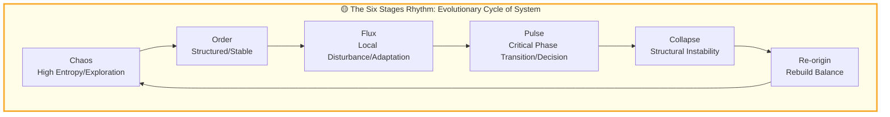
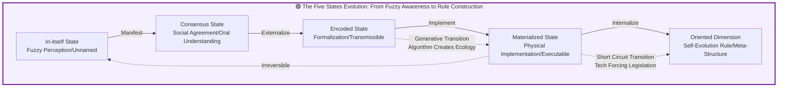
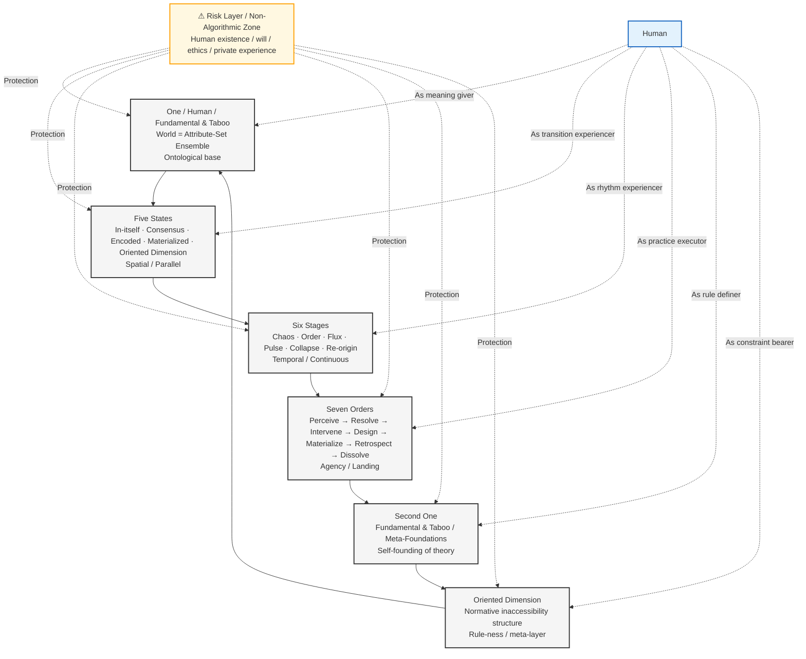
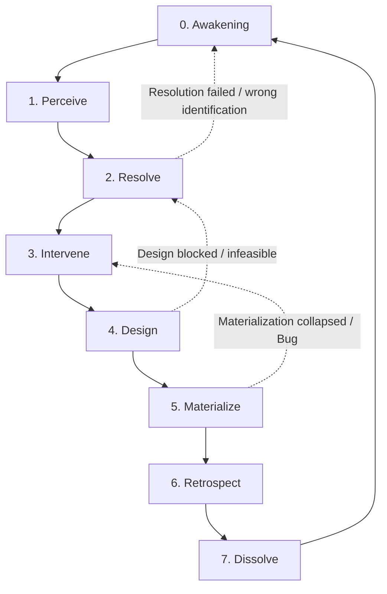

# ASTO.P04. Manifesto: You Can Also Change the World and Create a Better Civilization

---

## C. C-Positioning Declaration: Normative Core Positioning

> P04 serves as the normative core document connecting structural, inferential, and immune layers.
>
> **Structural Layer**: Descriptive statements about attribute-sets, perturbations, and transitions.
> **Inference Layer**: Operational principles derived from structural layer (evidence-based cognition, three layers of knowledge-action integration, fault-tolerant mechanisms).
> **Normative Layer**: Value postulates explicitly marked as ethical choices (civilizational stewardship, human arbiter status, taboo protection).
>
> Three layers can be accepted independently. This document's argument chain marks the belonging layer at each key node.

---
> **Version**: 12.6 (C-Positioning Upgrade) (Life-First Edition, Ontological Correction Retained)
> **Status**: Public Review Draft
> **Author**: Yi Fu (付毅, ODDFounder, fuyi.it@live.cn)
> **Audience**: Philosophers, Naturalists, and Living Beings
> **Context**: This document is the philosophical manifesto of the ASTO system.
> **Revision Note (v12.5)**: **Major Ontological Correction**. Based on the "Pushing the Stone" model, reconstructed the core engine (1-2-3 structure) of Chapter 7, establishing the physical dynamic basis of "Existence precedes Observation" and "Transformation as Attribute Rate Modulation".

---

## 🧭 0A. Life-Oriented Guide

> This section is an "entrance", not a simplified version. It translates core philosophies into daily language for quick entry.
> **Note**: This section is an addition, not a replacement or deletion of the full text that follows.

### 0A.1 Breaking the Topic: Two Stories Lighting Up the World

**Shocking Scene**:
In the stadium, the home team is trailing 0-3. The stands are as dead as if strangled.
Suddenly, a fan stands up and starts clapping rhythmically.
One row, two rows, ten rows... the applause spreads, getting more uniform and louder.
The entire stadium is covered by a new wave of sound.
This is not victory, but something has changed—atmosphere, belief, sense of direction.

**One Minute to Understand "How the World is Changed"**:
* **Monistic Layer (Existence)**: That stadium, that grass, 22 players, a ball—they were there before the game started. They are existences individually, and jointly constitute a larger existence (stadium), which is part of the city's existence.
* **Observer (Existence)**: You buy a ticket and enter. Your viewing cuts the world into "You (Subject)" and "Game (Object)", and the **Field** is born.
* **Entering the Field**: You are no longer a bystander; your emotions, attention, and expectations become part of the field (the field is a "living space", not just a building).
* **Perturbation (Clapping/Shouting)**: When emotions accumulate to a threshold, you emit a rhythm. This is a perturbation, tiny but real—from "wanting to shout" to "shouting out".
* **Fundamental & Taboo**:
  - **Fundamental**: Basic rules for the game to exist (90 minutes, goal, referee).
  - **Taboo**: Red lines that must never be crossed (violence, racism, rushing onto the pitch).

**By now you understand**:
Existence precedes → Observation cuts → Perturbation modulates (within Fundamental and Taboo)
But you can only change its trend within the boundaries of **Fundamental and Taboo**.

**Fan** (Strong Perturber; wind etc. are weak perturbers):
In the stadium trailing behind, you stand up, wave, shout the first slogan.
At first, it's just you. Seconds later, people nearby follow, and the whole stand rises and falls like a tide.
The team's momentum changes, the game changes.

Nature: **Monkey**
On the mountain, a monkey pushed a stone. The stone rolled down, bringing debris, changing a path, startling a flock of birds.
It was not a "plan", just an action, but the valley changed.

Existence precedes (Monkey/Stone/Mountain) → Contact/Viewing cuts out Field → Monkey perturbation changes partial attributes of Stone (Position, Velocity) → Affects other existences (Debris, Birds, Road surface)
**Key Insight: Perturbation is Universal**:
Humans, monkeys, wind—as long as perturbation is exerted, the mechanism is consistent; the difference only lies in that humans can **reflect** and assume **responsibility**.

> **⚠️ Ethical Stratification of Perturbation (Important Clarification)**
>
> Although the perturbation mechanism is universal, **ethical responsibility** must be distinguished at the ontological level:
>
> | Perturbation Type | Example | Ethical Status |
> |---|---|---|
> | **Natural Perturbation** | Wind blowing stone, earthquake, virus mutation | No responsible subject, no ethical evaluation |
> | **Intentional Perturbation** | Monkey pushing stone, baby knocking over cup | Has agent, but no reflective ability, limited responsibility |
> | **Reflective Perturbation** | Human conscious action | Can foresee consequences, can reflect, **must assume responsibility** |
>
> **Core Distinction**: Human uniqueness lies not in "able to perturb" (everything can), but in **ability to reflect on consequences of perturbation and assume ethical responsibility**. This distinction is not an afterthought supplement, but a fundamental difference at the ontological level.
>
> **Practical Inference**: When we design systems (AI, institutions, technology), we must ask: **Who is the responsible subject for reflective perturbation?** If the chain of responsibility is blurred, the system has ethical risks.

**Simple Conclusion**:
Changes in the world often start from "one move".
ASTO just wants to tell you: **When to move, how to move, and which line not to cross.**

### 0A.2 Roundtable Brief: How Three People Understand "Change"

**Philosopher**:
"Change is not moving randomly, it is making a choice in the field and being willing to bear the consequences. Freedom is not doing whatever you want, but knowing what you are doing."

**Media Person**:
"One person shouting is noise, a group shouting is power. The key is: Can your words be understood by others and are they willing to follow?"

**Sociologist**:
"Structure is like a door. If the door doesn't open, no matter how good the words are, they can't get in; if the door opens a crack, a gentle push can change the situation."

**Putting three sentences together**:
**Someone stands up first + Speaks understandably + Structure just has a crack = Change happens.**

### 0A.3 See the "Field" First

"Field" is not the floor, not simple space or surface, it is **the sum of environment, rules, relationships, and time**, shaping the possibility and effect of things happening.

The same action may produce completely different results in different fields:
- A seed falls on fertile moist soil → Grows
- The same seed falls in a rock crevice → Cannot germinate
- Seed falls on windy and rainy open ground → Delayed or damaged

**Core**: Before acting, sense the field first—that is, understand the natural context and conditions.

**So the first step is not action, but seeing the field clearly.**

### 0A.4 Smallest Granule of Change: One Move, One Field, One New Result

ASTO breaks change into three smallest pieces:

#### 1. Nature Example: Seed Breaking Soil

- **One Move**: Seed extends bud tip, gently pushing away the dead leaves covering it.
- **One Field**: Soil humidity, temperature, dead leaf position, gravity, microbial action, light direction... these conditions jointly determine whether the bud can break through smoothly.
- **New Result**: Bud pushes away dead leaves, grows upward, local ecological environment begins minor changes (micro-shadow, humidity distribution, soil loosening).

> Small action (bud breaking soil) produces observable consequences in a complete natural field, reflecting the physical and environmental condition effects of the "Field".

#### 2. Social Example: A Word of Encouragement in Office

- **One Move**: You say "You did well" to a colleague.
- **One Field**: Office atmosphere, superior-subordinate relationship, colleague's mood, meeting progress, presence of bystanders, cultural habits... these conditions determine the effect of this sentence.
- **New Result**: Colleague feels relaxed, may participate more actively in discussion, team mood rises slightly.

> Here "Field" reflects social environmental conditions, and the smallest action produces traceable minor changes.

------

The idea is: **Whether nature or society, the smallest granule of change is "One Move", but the result of action depends on the "Field"—the complete set of conditions**.

### 0A.5 Window of Opportunity: Why Sometimes Effective, Sometimes Ineffective

Sometimes one sentence works immediately,
Sometimes ten sentences are like stones thrown into cotton.
This is because the world has a "**Right Moment**".

**Example**:
When the soup is about to overflow, you gently open the lid, and the foam goes down immediately.
When the soup is not hot yet, stirring it is useless.

**Window of Opportunity** is that instant.
ASTO teaches you: **Not force, but waiting for that move.**

### 0A.6 Five States: How Thoughts Become Rules (Commonality of Human and Thing)

A change doesn't land at once, it has five stages. This applies not only to humans but also to the formation of everything:
1. **In-itself State**: Latent potential (Human: Secret crush; Thing: Water vapor in cumulonimbus)
2. **Consensus State**: Local convergence (Human: Ambiguity; Thing: Water droplets condensing)
3. **Encoded State**: Establishment of form (Human: Love letter; Thing: Hexagonal structure of snowflakes)
4. **Materialized State**: Physical fixation (Human: Marriage; Thing: Snow packing into ice)
5. **Oriented Dimension**: System evolution (Human: Family rules; Thing: Glacial carving of landforms)

**In one sentence**:
From "I feel" to "We always do this", the middle is these five steps.

### 0A.7 Six Stages: Rhythm of Change

Change doesn't rush forward forever, it has rhythm, like a person's life: birth, aging, illness, death.
*(Note: Corresponds to Buddhist cosmic cycle of "Formation, Residence, Destruction, Emptiness")*
Chaos → Order → Flux → Pulse → Collapse → Re-origin

**Life Example**:
Family conflict starts from small friction (Chaos),
Cold war becomes daily routine (Order),
One argument emotional outburst (Flux),
One sentence hits the pain point (Pulse),
Relationship rearrangement (Collapse),
Finally sitting down to talk rules (Re-origin).

### 0A.8 Seven Orders: Steps of Action (Reversible)

**Embodiment {Perceive, Resolve, Intervene, Design, Materialize, Retrospect, Dissolve}**
Turn back if you go wrong, don't force it.

### 0A.9 Fundamental and Taboo: Floor and Red Line

**Fundamental (Floor)**: The most basic thing, once gone, things collapse.
**Taboo (Red Line)**: The line you can't cross no matter how emotional.
**In one sentence**: You can push the table, but can't flip the floor; you can argue, but can't step on the red line.

### 0A.10 Three Modes of Human Existence

1. **Experiential**: Taste, heartbeat, bodily sensation
2. **Meaning-Making**: Same rain, some find it romantic, some annoying
3. **Transcendent**: Under same conditions, you can still make a choice

### 0A.11 Shape of Freedom

Freedom is not "doing whatever you want", but **creating within the field**:
Delivery rider choosing a steadier route within limits; teacher lighting up students within syllabus; parents choosing gentleness under pressure.

### 0A.12 Three Warnings

1. **Perspective Filter**: Seeing structure clearly may ignore feelings
2. **Norm is Touch**: Rules are not just on paper, but in how you do it daily
3. **Tools Colonize**: When theory conflicts with intuition, stop for a moment

### 0A.13 Five-Minute Exercise

Find an "awkward thing" → Locate Five States / Six Stages → Design a minimal action.

### 0A.13A ASTO Personality Test (One Minute Quick Select)
Q1: What confuses you most now?
A) Why communication is always unclear → Rec: **Chapter 3 + Appendix E**
B) System always fails → Rec: **Chapter 5 + Chapter 15**
C) Feeling unfree → Rec: **Chapter 11**
D) Worried about AI losing control → Rec: **Chapter 14 + ASTO.E04**

### 0A.13B Cross-Cultural Resonance: Eastern Philosophy Perspective
ASTO uses modern engineering language, but its core resonates deeply with Eastern wisdom:
*   **Field ↔ Shi (Potential)/Qi**: Not just physical space, but flow of "momentum". Change is not opposition, but "going with the flow".
*   **Six Stages ↔ Formation/Residence/Destruction/Emptiness**: System cycle from chaos to Re-origin corresponds to Buddhist evolution stages.
*   **Dissolve ↔ Sunyata (Emptiness)**: Dissolution is not destruction, but clearing space to return to "Emptiness" of possibility.
*   **Seven Orders ↔ Unity of Knowing and Doing**: Perception and intervention are not two things, but a continuous loop.

> **Laozi says**: "Reversion is the action of Tao". ASTO's **Retrospect and Dissolve** is exactly this wisdom of "Return".

### 0A.14 Epilogue: You are a Weaver

The world is like a stadium, also like a valley.
You are not a spectator, you are the person who can move that one move responsibly.

**If you want to do something immediately**: Turn to **Appendix E (5-Min Exercise)** and **Appendix F (Action Card)** at the end.
**If you just want to continue the story**: Go directly to **Chapter 1**.
**If you want to know where these ideas come from**: See **0.3 Origin and Methodological Positioning**.

> ⚠️ Reminder:
> The intuitive version above is just "the feeling of seeing change";
> What really determines whether change can last is the structure, boundaries, and failure conditions in the following text.

---

## 🗺️ 0. Pre-sequence: Guide Before Reading

### 0.1 Dual-Track Reading Guide (How to Read)
We refuse to split the world into "Arts" and "Sciences", but we respect readers' focus. Choose your path:
*   🦉 **Thinker**: Seek meaning, ethics, and social metaphors. Follow 🏛️ marks.
*   🌿 **Naturalist**: Seek analogies in biological world and natural laws. Follow 🌱 marks.
*   🌉 **Bridger**: Want to understand both shores and build bridges. Please read through.

**30-Minute Speed Read**: 0A → Chapter 1 → Chapter 11 → Chapter 14 → Appendix F.

### 0.2 Core Concept Map
To avoid getting lost, establish intuition through this map first.

| Unfamiliar Term | Intuitive Mapping | Explanation |
| :--- | :--- | :--- |
| **Attribute-Set** | **Stone's Gravity/Genome** | Attributes exist objectively. Stone has "heavy" and "hard" attributes before we see it. "Gravity/Genome" is just intuition mapping; **see "Term Anchor | Attribute-Set" below for normative definition.** |
| **Field** | **Scenery Seen/System Defined** | Field is not external air, but **"living space" constituted by existence (e.g. body) sensing interaction with other existences**. |
| **Monistic Layer** | **Stone on Mountain** | **Pre-existence**. All things exist before humans appear. |
| **Observational Duality** | **A Glance** | **Objectification**. Viewing creates the cut between subject and object. |
| **Mediated Triadic Structure** | **A Push** | **Transformation as Rate Modulation**. Utilizing existing attributes (gravity) to accelerate transition (rolling down). |
| **Five States** | **Secret Crush to Marriage / Water Flow to Riverbed** | Process of how thoughts become laws (Human), or energy carves landforms (Thing). |
| **Seven Orders** | **Gardener's Action** | Steps we intervene in the world: Embodiment {Perceive, Resolve, Intervene, Design, Materialize, Retrospect, Dissolve}. |

### 0.2A Term Anchor: Attribute-Set

> **ASTO World Definition**: The world is not composed of fixed states, but is the overall process of attributes—existing in a certain time slice as a set—constantly undergoing transition via operation loops.
>
> An Attribute-Set is a collection of attributes identifiable in a time slice;
> The transition of Attribute-Sets constitutes the entire history of existence.
>
> We do not discuss what existence "originally is",
> We only discuss what it "presents as right now" in time.
>
> **⚠️ Ontological Boundary Declaration (Heideggerian Warning)**
> "Attribute-Set" is a **methodological concept**, not an ultimate description of existence itself. The truth of existence is often fluid and interpenetrating. Cutting continuous existence into discrete "Attribute-Sets" is a **technological violence** (slicing) for cognition. Please always remember: **The map is not the territory, the slice is not life.**

### 0.2B Deconstruction of Attribute-Set (Heidegger's Warning)
> **"Attribute-Set" is the scaffold of cognition, not existence itself.**
> We use "Attribute-Set" to talk about the world because we need an engineering language to handle transition. But beware:
> *   Existence is not frame-by-frame film (slices), but continuous Becoming.
> *   Over-reliance on "Attribute-Set" perspective may lead to **discretization violence** against existence.
> *   **When to drop Attribute-Set?** When you face a concrete person, a vivid pain, an unspeakable aesthetic experience, please immediately drop the analytical knife of "Attribute-Set" and go directly to **Dwelling**.

> **Hint**: If you are not interested in theoretical origins, jump to **Chapter 1**; if curious about where ASTO comes from, continue to 0.3.

### 0.3 Origin and Methodological Positioning (ODD → ASTO)

**Origin Declaration**: ASTO's philosophical framework comes directly from the engineering practice refinement of ODD (Output-Driven Development), aimed at rebuilding the control plane in the AI era with executable norms and artifact governance. Manifesto is for philosophical interpretation, E-series for engineering landing.

**Core Trinity (Embodiment Trinity, Practical Landing)**:
- **Needs (Human)**: Initiator and arbiter. Defines utility and boundaries, responsible for contract approval and exception ruling.
- **Contract (Attribute-Set)**: Normative expression of attribute collection. Defines acceptable output space and invariants, requires testable/auditable/versionable.
- **Artifact (Existence)**: Verifiable output. As atomic node, can be sealed as "deployable stable state", and "unsealed" by human when change is needed to enter small transition loop.

**Engineering Mechanisms (Summary)**:
- **Seal/Unseal**: Form "deployable stable state"; when "Need/Contract/Taboo Risk" changes, human initiates unseal, re-enter "Dialogue→Horse Race→Adversarial→Reseal".
- **Pipeline Elevation A→B→C**: A (Module/Rule/Model/Config) → [Build/Verify/Adversarial/Sign/Seal] → B (Service/Component/Policy) → [Integrate/Horse Race/Adversarial/Seal] → C (Platform Cap/Domain Cap/System Stable State).
- **Network Synergy & Replaceability**: Multi-artifact synergy forms network; enforce discipline via "Contract/Gate/Seal/Unseal/Dissolve" to ensure nodes are rollback-able, pluggable, replaceable.
- **Trust Transfer**: Replace manual line-by-line review with mutation testing/adversarial verification to verify "Artifact Correctness".

**Plain Talk**:
Artifact = Stuff produced; Adversarial = Intentionally finding fault; Horse Race = Comparing multiple plans; Seal = Fix it first, don't change randomly.

**Term Mapping (Simplified)**:
- Attribute-Set ↔ Contract
- Stable State ↔ Seal Bundle
- Motility ↔ Capability to Unseal/Rollback/Plug-and-Play upgrade
- Term Note: This document uses "Seal/Unseal"; "Archive/Lock" are equivalent aliases.

**Life Translation (Lower Engineering Tone)**:
Seal = Settle it for now; Unseal = Allow change again; Contract = Agreed upon; Motility = Changeable, reversible, remediable.

**Citation (Offline Available)**:
- DOI: 10.5281/zenodo.18207648
- BibTeX:
```bibtex
@misc{odd_zenodo_18207648,
  author    = {Yi Fu},
  title     = {Output-Driven Development: A Paradigm Shift in AI-Assisted Software Engineering},
  year      = {2026},
  publisher = {Zenodo},
  doi       = {10.5281/zenodo.18207648},
  url       = {https://doi.org/10.5281/zenodo.18207648}
}
```

<a id="asto-civilization-meta-definition"></a>
### 0.4 Purpose of Writing This: Guarding Home and Creating Better Civilization Before Singularity
> **Applicability**: All | **Priority**: Taboo/Plurality/Untouchable Dimension > Motility > Efficiency

ASTO is created not to make engineering more elegant, but to make civilization safer, freer, and more vital.
Before the technological singularity arrives, we especially need two things:
1. Guard irreversible red lines (Taboo/Untouchable Dimension/Plurality) — do not let "efficiency" become an excuse for oppression.
2. Increase motility with reversible, auditable, exit-able structures — let civilization not collapse under impact, and evolve.

We define "Better Civilization" as a set of prioritized criteria (C):
1. **Bottom Line (Non-tradable)**: Guardian of Plurality (Irreplaceability, Dialogue Possibility, Action Space) and Untouchable Dimension (Dignity, Conscience, Private Experience, etc.).
2. **Goal (Measurable/Arguable)**: Maximize Motility and Possibility Space (Diversity, Evolvability, Fork & Merge) within bottom lines.
3. **Means (Replaceable)**: Efficiency and automation only serve the former two — any efficiency weakening refusal rights, exit rights, and reversibility is viewed as a sign of civilization degeneration.

> Note: Evolution ≠ Progress; Fitness ≠ Legitimacy. ASTO's "Selection Function" must accept ethical audit, not just win/loss and output.

### 0.5 ASTO Theoretical System Positioning

```
ASTO System
├── **ASTO.P05: Axiom System** (Fundamental Laws of Existence)
├── **ASTO.P04: Manifesto & Framework** (This Document)
│   ├── 1-5-6-7-1 Core Structure
│   ├── Five-Dimension System: Human+4+1 Dimensions
│   ├── Dynamics Basis (Perturbation Field Theory)
│   └── Bridge connecting Axioms and Practice
├── **ASTO.P03: Epistemology** (Why Cognition Errs)
├── **ASTO.P06: Values & Boundaries** (Ethical Charter)
└── **ASTO.P07–P13 / E01–E06 / H01–H06: Applications & Extensions**
```

**ASTO.P04 Core Functions**:
1. **Integrated Framework**: Organize axioms into understandable cognitive structure.
2. **Dimension Foundation**: Clarify ontological status of Human and functions of dimensions.
3. **Dynamics Elucidation**: Reveal Perturbation and Field as fundamental drivers of evolution.
4. **Action Manifesto**: Clarify ASTO's worldview, values, and action program.

### 0.6 Mediology & Dual-Track: ASTO's Historical Positioning
> 🏛️ **Thinker**: Read "Mediology" deeply.
> 🌱 **Naturalist**: Focus on energy loss and structural rupture in "Generational Shifts in Media".

#### 0.6.1 Dual-Track Declaration

ASTO consists of two parts:
1.  **Toolbox** (Utility): Five States, Six Stages, Seven Orders. Priority criterion is **"Does it work / Is it operationally verifiable"**. We admit tool choice implies value presupposition, so not free from reflection, just different priority.
    > **Note**: Toolbox uses effectiveness as main criterion, but must accept **Ethical Review** when touching Human Untouchable Dimension or Taboo; major tool choices need defensibility explanation.
2.  **Ethical Manifesto** (Ethics): Pre-ontological conditions, Human Boundaries. Criterion is **"Is it defensible"**. Must accept strict philosophical review.

We refuse "Universal Theory". In engineering, we are pragmatists; in human issues, we are humanists.

> **Clarification**: **Humanism** emphasizes human value and dignity, but does not deny social collectivity and long-term interest. As engineers and practitioners, while respecting individual needs, we consider collective sustainable development and systemic health. Humanism is not unconditionally prioritizing individual interest, but guarding fundamental human values in social systems.
>
> **Tension Handling Principle**: When individual and collective interests conflict, ASTO offers **Judgment Framework**:
> 1. **Plurality Test**: Does decision destroy irreplaceability, dialogue possibility, or action space of any party?
> 2. **Reversibility Test**: Is consequence reversible? Irreversible harm needs higher legitimacy threshold.
> 3. **Procedural Justice**: Does decision process allow affected parties to participate?

#### 0.6.2 Mediology: Generational Shifts of Symbolic Carriers

Civilization leap is essentially a revolution of **communication media**.

> Note: The "Social Friction Coefficient" column below is a **heuristic indicator** to convey relative loss trends across media shifts. It is not a statistical quantity you can directly measure.

| Generation | Media | Feature | ASTO Mapping | Social Friction Coefficient |
| :--- | :--- | :--- | :--- | :--- |
| **Gen 1** | **Oral Language** | Instant, mutable | In-itself | **Very High** |
| **Gen 2** | **Text/Symbol** | Durable, needs interpretation | Consensus | **High** |
| **Gen 3** | **Formal Code** | Precise, executable | Materialized | **Medium** |
| **Gen 4** | **Attribute-Sets** | **Structured, portable, self-evolving** | **Oriented** | **Low** |

**Explanation**: "Very High/High/Medium/Low" is only a qualitative hint, not a metric.
If you are sensitive to quantification, you may ignore this column and only keep the relative ordering.

**Metaphor Failure Boundary Statement (example tags)**:
- "Social Friction Coefficient" analogy **[Failure risk: Medium]**: for trend intuition; must not be treated as a measurement.
- "Transition is Fate" **[Failure risk: High]**: if it leads to determinism, stop using it immediately.
- "Dissipative Structure" analogy **[Failure risk: Medium]**: for rhythm intuition only; not mathematical equivalence.
- "Traffic rules = structure skeleton" **[Failure risk: Low]**: for daily understanding; must not replace ethical judgment.

**ASTO Vision**: We are at the transition from Gen 3 to Gen 4. Code often fails to carry evolution meta-information ("why it was written this way"). We propose **Attribute-Sets** as a candidate medium to better encode transition itself; its feasibility must be tested in concrete engineering.

**Supplement**: Gen-4 media emphasizes **intent/metadata** as a base element, so the reasons "why it was written this way" can be carried and transmitted, rather than only leaving "what was written".

---

## Warning: To Weavers and Three Warnings

This is a draft about "How change happens in the world".
No code, no machines here, only **Structure of Life, Nature, and Existence**.

### Three Warnings Before Entry
Before you decide to use ASTO, please accept the following three warnings about the **limits of theory**:

#### **Warning 1: Perspective is One-Way Mirror**
Humanities, philosophy, and engineering eyes all provide **blind-spot filters**; no complete truth exists.
*   When you use ASTO to view the world, you will see "Attribute-Sets, Field, Perturbation";
*   But you may therefore **miss** things that cannot be structured: a racing heartbeat, an unspeakable intuition, an inexplicable obsession;
*   You may also project **human intention** onto non-human perturbations (a monkey is not a "little person", and wind is not human);
*   **Countermeasure**: regularly take off ASTO glasses and return to lived sensing with naked eyes.

#### **Warning 2: Norm is Touch**
Norm is not just clauses in documents; it is the CI/CD red light, the frown in code review, and the `util.js` in a legacy system that nobody dares to touch.
*   Norm is **embodied knowledge**: it lives in your fingers, habits, and fears;
*   But norm is also **collective wisdom that can be reflected upon**—it can be adjusted and optimized through rational deliberation, practice validation, and social consensus;
*   Do not try to replace "doing it" with "writing it down", but also do not let implicit norms escape rational scrutiny;
*   **Countermeasure**: theory gains meaning only when tested in practice. Keep norms **dynamically adaptive**—respect existing norms while continuously reflecting on them.

#### **Warning 3: Tools Colonize**
All models simplify the world and reshape thinking. ASTO is no exception.
*   Models and tools are **simplifications and abstractions** of a complex world; they help us understand and handle complex problems;
*   When you start describing everything in terms of "Chaos" and "Order", you may already be **colonized** by ASTO;
*   Language shapes reality. New vocabulary brings new perspectives—and new blind spots;
*   **The value of tools is to lead us toward deeper understanding and innovation, not simplification and limitation**;
*   **Countermeasure**: keep clear awareness of a model's limits. When ASTO conflicts with your intuition, first **pause applying ASTO**, return to the concrete context, sense again, and collect falsifiable evidence. Meanwhile, be alert that intuition itself may have been shaped by existing discourse and power structures. There is no absolute judge—only continuous reflection and testable revision.

> **Methodological Statement (Avoid Category Errors & Metaphor Audit)**: ASTO makes heavy use of engineering and physical metaphors (e.g., "entropy", "phase transition", "colonization", "skeleton", "fate") to help build intuition. Such expressions are defaulted to **heuristic analogies** and **working language**, not substantive proof.
>
> **Metaphor Failure Boundary Statement**: Every metaphor has its boundary. When a metaphor (e.g., "technical debt") begins to drive deduction and yields conclusions that violate common sense or ethics (e.g., "to repay debt we must lay off people"), it should be treated as **metaphor failure**. Stop the analogy immediately and return to fact-finding and value deliberation.

**Three bottom lines for metaphor use**:
1) Only for **intuition bridging**, not a substitute for conceptual analysis.
2) Must not obscure the three modes of human existence (experience/meaning/transcendence).
3) Must not cause category mistakes (value questions must not masquerade as technical optimization).

### **Occam's Razor Declaration (Methodological Razor)**
> **Self-Reduction against "Ontological Inflation"**:
> ASTO's core concept matrix (Five States, Six Stages, Seven Orders) are not three independent entity dimensions, but **three complementary metaphorical slices of the same dynamic structure**.
> *   **Spatial Slice** (Five States): describing "what state".
> *   **Temporal Slice** (Six Stages): describing "what stage".
> *   **Intervention Slice** (Seven Orders): describing "how to act".
>
> **Usage Principle**: Choose a **single metaphor** to go deep based on the problem domain. Do not mix different concept systems in the same argument chain (e.g., using Six Stages to explain Five States transitions), to avoid category confusion.
>
> **To prevent misuse or dogmatism, we publish three safety principles here:**
> 1.  **Methodological positioning**: ASTO is an engineering-methodology language, not ultimate truth.
> 2.  **Anti-subjugation principle**: Never use ASTO terms to label people, suppress individual experience, or replace the subject's self-narration.
> 3.  **Ethical review**: Any practice touching Taboo or the Untouchable Dimension must meet participation, defensibility, and reversibility thresholds.
>
> **Cognitive tool note (a priori justification)**: Five States / Six Stages / Seven Orders are three slices (space, time, action) for human understanding - cognitive adaptation tools, not newly added ontological entities.

---

## Chapter 1: Breaking the Topic — "Structural Vision" Effective in One Minute
> 🎯 **Applicability**: All | **Keywords**: Structural vision, media mismatch

### **[One-Minute Case] Why Does Renovation Always Turn Out Different from What You Wanted?**

> **Scene**: You tell the contractor: "Simple style, warm." The contractor replies: "Got it." After finishing, you look and say: "This is not what I wanted!"
> **Typical diagnosis**: The contractor didn't care, communication was bad, taste differs.
> **ASTO diagnosis**: This is not a person's problem; it is **media mismatch**.

In the view of **Attribute-Set Transition Ontology (ASTO)** *(here "transition" refers only to before/after change between slices for discussion)*, what you see is not merely "your idea" and "the result", but a **fracture across Five States**:
1.  **In-itself**: a vague vibe in your mind (fuzzy).
2.  **Consensus**: words like "simple" and "warm" (everyone interprets differently).
3.  **Materialized**: paint on the wall, sofa bought (done; fixed).
4.  **Missing bridge**: trying to direct construction with a few adjectives is like commanding a chef with "roughly that feeling" - **information loss is inevitable**.

**ASTO solution**:
Do not force "explain clearly". Insert the missing middle: the **Encoded State** - renderings, material samples, reference images.
*   *Old path*: idea → oral description → construction (fracture)
*   *New path*: idea → **renderings/samples (confirmable)** → construction (smooth transition)

> **This is ASTO's promise**: it won't teach you renovation, but it gives you **structural vision**. With this vision, you no longer see "an unreliable contractor"; you see **the missing translation link**.

[Back to the Stadium]
Renovation "renderings/samples" ≈ a fan group's "chant rhythm" - it makes consensus followable and replicable.

**Pitfall Tip**: If you only speak in adjectives and never land on samples, communication will inevitably drift.

---

## Chapter 2: A Breath (The Pulse)
**— How Does Existence Change? (The 1-1-1 Structure)**

This chapter uses the metaphor of breathing to explain the minimal unit of transition: **inhale—pause—exhale**, corresponding to the three beats of **generation—constraint—release**.

### 2.1 One: Spontaneous Emergence of Existence
The world is like an ocean: **waves are not "manufactured"**; they are generated by the ocean's own tension and the perturbation of wind.
Existential change is the **natural fluctuation** of monistic flux; it does not require an "observer" first.

### 2.2 Two: The Cut Brought by Observation
When we "see", the world is cut into "me" and "it".
This is like standing by a river: the river itself is monistic, but your gaze splits it into "this bank / that bank".
From this moment, the **Field** appears, and interaction and intervention obtain coordinates.

**Supplement**: The Field is not external air; it is a **"living space" constituted by an existence (e.g., a body) sensing interaction with other existences**.

### 2.3 Three: Transformation as Rate Modulation
Exhaling is not creating air; it is **changing the flow rate of air**.
Transformation is the same: it is not creating attributes from nothing, but **accelerating/decelerating existing attribute transitions**.
This is the minimal prelude to the later "1-2-3 meta engine".

[Back to Life]
Emotion is like breathing: fast when tense, slow when relaxed. What you need is not to "force it to stop", but to **help it change the breath**.

**Pitfall Tip**: Breathing is a metaphor, not a formula. Do not treat "rhythm" as a mechanical command.

---

## Chapter 3: Ontological Core — Three Major Statements
📌 Recall: The normative definition of **Attribute-Set** is in 0.2A. If this chapter uses "slice" language, it is only a narrative perspective to make differences clearer. **Field** = the interaction space cut out after observation (see 0.2).
> 🏛️ **Thinker**: Focus on the objectivity of "Existence is Attribute-Set".

### 3.1 Statement 1: Existence is Attribute-Set (Existence is Attribute-Set)
**Core proposition**: In the ASTO framework, we do not presuppose "entity"; we only discuss **Attribute-Sets**.
*   **Slice perspective (only for discussion convenience)**: when needed, we use "time-point slice" language to highlight differences; this does not replace the normative definition of Attribute-Set (see 0.2A).
*   **Reminder**: slices are for seeing clearly, not for freezing life.
*   **Minimal analogy**: like a person's "character genome" - what you can identify at this moment.
*   **Objectivity statement**: an Attribute-Set is not a concept inside a human mind, but an **objective reality that exists prior to humans**.
*   🌱 **Biological metaphor: the stone on the mountain**. Before humans appear, the stone already aggregates attributes such as "mass", "hardness", "potential energy". They exist regardless of our observation.

### 3.2 Statement 2: Structure is Skeleton (Structure is Skeleton)
**Core proposition**: structure maintains Attribute-Sets; support and constraint coexist.

*   **Philosophical meaning**: structure has a dual nature. Without structure, attributes disperse; with structure, evolution is constrained.
*   **Dialectical-tension view**: structure is a **stable form of temporary tension balance**; its stability is not eternal.
*   **Practice-theory view**: structure is the **historical sedimentation of practice**, carrying equilibria among multiple social forces.
*   **Dynamic emphasis**: structure is a **carrier for dynamic adjustment**; it must evolve and be reshaped with changing needs, contradictions, practices, and environments.
*   **Engineering metaphor**: architecture design, protocol norms, institutional frameworks - all require versioning.
*   **Life metaphor: traffic rules**. Traffic lights do "restrict" your local freedom, but without them the intersection collapses and you cannot even get home. Structure restricts local freedom and supports overall survival.

### 3.3 Statement 3: Transition is Fate (Transition is Fate)
**Core proposition**: transition is the inevitable outcome when contradictions cannot be reconciled; but the way we intervene is chosen by the subject.

*   **Philosophical meaning (heuristic analogy)**: transition is often not something "avoidable by pure will", but a structural result after tension accumulates beyond a threshold. This is analogy language; we do not claim social systems strictly follow physical laws. **How to respond to transition** remains in the domain of choice and responsibility.
*   **Dialectical-tension view**: transition is the **inevitable outburst** when tension cannot be reconciled.
*   **Practice-theory view**: transition is the **breakthrough of practice over theory**.
*   **Agency emphasis**: although tension drives transition, individuals and collectives still have agency to influence the transition path via intervention choices. Transition is fate; intervention is freedom.
*   **Transition pressure indicator (heuristic)**: $\\text{Transition Pressure} = \\frac{V_e\\text{ (environment change rate)}}{V_n\\text{ (norm adaptation rate)}}$. When this stays > 1 for long enough, the system enters a high-probability transition window; whether and how it transitions still depends on Field conditions and intervention choices - the subject can choose to **adapt, guide, or buffer**.

> ⚠️ **Category error risk**: "Fate" here refers only to **the irreversibility of accumulated contradictions**. It does not negate free will or responsibility.

### 3.3A Philosophical Dialogue: ASTO and "On Contradiction"
ASTO's transition dynamics is deeply inspired by **"On Contradiction" (Mao Zedong, 1937)**, and we engineer it:

1.  **Resolve is qualitative analysis**: "Resolve" in Seven Orders is essentially finding the **principal contradiction**. In complex system failures, distinguishing root causes from surface symptoms is distinguishing principal contradictions from minor contradictions.
2.  **Pulse is qualitative change**: "Pulse" in Six Stages corresponds to the moment of **qualitative change** when contradictions intensify. Before it is "Order/Flux" (quantitative change); after it is "Collapse/Re-origin" (new quality).
3.  **Internal and external causes**: ASTO emphasizes **structural tension** (internal cause) as the root, while external perturbations are triggers. Can a stone hatch a chick? No - because internal causes (attributes) differ.

> **Engineering inference**: the key to problem solving is not patching the surface (minor contradictions), but rebuilding the core structure that produces tension (principal contradiction).

### 3.3B Axiom of Perturbation Universality (Axiom of Perturbation Universality)
**Axiom statement**: Perturbation, as the mechanism of rate modulation, is a **universal interaction form among existences**; it does not depend on a specific agent.

**Inferences**:
1) **Human is not central**: human perturbations are only a special case of perturbation.
2) **Technology is mediating**: technology is a human-designed perturbation amplifier, but still obeys the same mechanism.
3) **Responsibility is special**: only existences that can reflect on consequences need to assume ethical responsibility.

### 3.3C The Call of Being (The Call of Being)
**Heidegger's supplement**: perturbation is not only a one-way intervention of the subject toward the Field; existence also **perturbs** (calls / *Ruf*) us.
*   **Bidirectionality**: it is not only you pushing the stone; the stone is also "calling" you (as the releaser of its potential energy).
*   **Poetry and responsibility**: a stone may call a poet to write; a forest may call an architect to protect. The subject is not only an operator, but also a **listener**.
*   **Inference**: in the "Perceive" order, we must not only actively search for signals, but also learn to **listen** to the call of being.

### 3.4 "Embodiment is Triadic, Reality is Monistic": Isomorphism with the 1-2-3 Engine

To make the theory operational in engineering, we further specify a "pragmatist fissured monism" into an ontological structure: **embodiment is triadic, reality is monistic**.

#### 1. Monism of Reality (Monism of Reality)
*   **Physical truth**: at the bottom, the world is a monistic flux of **Attribute-Set transition**. There is no isolated "human" and no isolated "thing"; there is only continuous birth-and-recombination of attributes.
*   **Meaning**: this is the base domain where the Entropy Axiom takes effect.
*   **Narrative convention**: if we use "slice / before-after" language, it is only to bound the discussion and support intuition; it does not replace the normative definition of Attribute-Set (see 0.2A).

#### 2. Trinity of Embodiment (Trinity of Embodiment)
To intervene in monistic flux, a subject must parse it into three dimensions. This is the **minimum complete structure of engineering intervention**:

| Triadic dimension | Philosophical metaphor | Engineering mapping (ODD) | Causal status |
| :--- | :--- | :--- | :--- |
| **Human** | **Final cause** (telos) | **Needs** | Initiator; source of meaning |
| **Attribute-Set** | **Formal cause** (form) | **Specification / Contract** | Mediator; carrier of definition |
| **Existence** | **Efficient cause** (efficient) | **Artifacts** | Result; realization of value |

> **Mapping formula**: **Human (intent) ⇄ Attribute-Set (definition) ⇄ Existence (implementation)**

*   **Human ⇄ Attribute-Set**: humans define Attribute-Sets via language/code (norms).
*   **Attribute-Set ⇄ Existence**: Attribute-Sets are materialized into existence via compilation/execution (artifacts).
*   **Existence ⇄ Human**: existence serves humans and satisfies needs.

**Isomorphism note**:
"Trinity of embodiment" emphasizes the triadic structure of intervention; the "1-2-3 engine" emphasizes the dynamic sequence of existence-observation-transformation.
The former is structural scaffolding; the latter is the dynamic engine. They describe the same process from different axes:
**One monistic existence → Two observational cut → Three rate modulation.**

**Preview: Reflection Emergence Axiom (planned to be added to P05)**:
When a system's description of itself forms recursive self-reference depth beyond a threshold Φ across a **slice sequence**, the system generates the capability to model its own "error model". This is treated as the emergence of **reflection / consciousness**. Φ is currently only a heuristic threshold.

---

[Back to the Stadium]
**Existence is Attribute-Set** ≈ what the match looks like right now; **Structure is Skeleton** ≈ rules and competition system; **Transition is Fate** ≈ inevitable fluctuations of score and situation.
What you can do is not to change the rules, but to **make the right move within the rules**.

## Chapter 4: Humanistic Cornerstone — Dimension 0 (Human Existence)
> 🏛️ **Thinker**: Must read. This is where ASTO decisively diverges from mechanical materialism.
> 🌱 **Naturalist**: Focus on how "experience/meaning/transcendence" can emerge in a biological being.

### 4.1 Three Modes of Human Existence

1.  **Experiential Being**
    *   **Qualia**: The subjective feel of "seeing red". Under current theory and engineering conditions, it is hard to fully formalize/reduce (still debated).
    *   **Temporality**: Finite awareness toward death.
    *   **Embodiment**: The body is not a tool; it is a way of being.
    *   **Life Metaphor: Photographic Film**. Only when the film (body) is exposed does the world have color. An algorithm can process RGB values, but the algorithm itself does not "see" color, just as the film itself does not know what "beauty" is.

2.  **Meaning-Making Being**
    *   **Hermeneutic Circle**: Humans do not only perceive the world; they interpret it and give it meaning.
    *   **Value Judgment**: Intuitions of good/evil, beauty/ugliness cannot be reduced to a utility function.
    *   **Narrative Self**: "Who I am" is not data; it is narrative.
    *   **Life Metaphor: The Novelist**. The same rain (data) is joy to a farmer and trouble to a passerby. Humans are not passively processing data; they are actively weaving "stories" about the world.

3.  **Transcendent Being**
    *   **Free Will**: As a unique **reflective decision node** in the causal network - not an uncaused cause detached from causality, but the ability to take one's own causal history into account and choose accordingly. This is a **compatibilist stance**: freedom is not escaping causality, but becoming a certain kind of causal participant.
    *   **Creativity**: Under constraints, the ability to produce **non-preordinated combinations** - not metaphysical creation ex nihilo, but a unique exploration of the possibility space.
    *   **Ethical Dimension**: The reflective command of conscience - not an a priori absolute law, but responsible consideration of consequences in concrete situations.
    *   **Supplementary Statement**: We acknowledge the free will problem remains controversial in philosophy; at the practical level, ASTO adopts compatibilism as a working hypothesis for discussing responsibility, choice, and intervention, not as a final answer.
    *   **Life Metaphor: A Programmer Modifying Code**. A program runs by its existing code (causality), but the programmer (free will) can insert new instructions at key moments and change the trajectory. The programmer is limited by the language (constraints), but decides what to write.
    *   **Supplementary Metaphor: Redefining Field Boundaries**. Freedom is not only "playing within the stadium", but also the ability to **redefine the stadium as a garden** - a right to shift context.

### 4.2 Interface between Human and System
Human is not a "user"; human is a key node where meaning emerges: meaning is not unilaterally assigned by the subject, but generated in interaction between subject and the **Field**.
*   **Human → Five States**: Give meaning to "In-itself", making it become "Consensus".
*   **Human → Six Stages**: Break deterministic loops via free will and inject a "pulse".
*   **Human → Seven Orders**: The irreplaceable operator (especially "Awakening" and "Dissolve").
*   **Human → Oriented Dimension**: The ultimate legislator of value judgments.

> **Key Definition**: Human is a **perturber** of the Field, not the **master** of the Field.

[Back to Life]
When you are willing to pause to listen, willing to change one sentence, and willing to do one more step, you are guarding the three modes of human existence.

---

## Chapter 5: Window and Rhythm (The Window & Rhythm)
> 🏛️ **Thinker**: Focus on rhythm metaphors (midlife crisis, Re-origin rebuilding).
> 🌱 **Naturalist**: Focus on "dissipative structure" as a weak analogy.

### 5.1 Six Stages: Process of Dynamics (The Six Stages)
📌 Recall: **Six Stages** is the time-slice of change (see 0A.7).



Attribute-Sets evolve through stages over time. We introduce **dissipative structure theory (Prigogine)** as a **heuristic analogy** (not strict equivalence):

> **Methodological Note**: The physical criteria in the table below are **analogy tools** for reading dynamic traits of social/technical systems. We do not claim social systems satisfy the mathematical conditions of dissipative structures. These indicators must be **operationally redefined** in each domain:
> - "Entropy" is analogized as disorder/uncertainty.
> - "Lyapunov exponent" is analogized as sensitivity to small perturbations.
> - Measurement methods must be designed for domain properties, not copied from physics formulas.
>
> We borrow dissipative structure as a **weak-analogy** framework: to recognize the pattern "far from equilibrium → self-organization → instability → reconstruction"; not to claim a mathematical isomorphism.

| Stage | Physical Analogy | Observable Indicators in Social/Technical Systems | Engineering Analogy | Life Metaphor |
| :--- | :--- | :--- | :--- | :--- |
| **Chaos** | Far from equilibrium, high entropy | Large decision divergence, unclear direction, frequent trial and error | Unordered exploration in a startup | **Adolescence** (confusion, impulse, full of possibilities) |
| **Order** | Dissipative structure formed | Stable process, clear roles, predictable output | Stable operation period | **Early career / building a family** (routine, stable but sometimes dull) |
| **Flux** | Metastable disturbance | Frequent local adjustments, boundary blur | Adjustments under competition pressure | **Midlife crisis** (something feels off; wants change but hard) |
| **Pulse** | **Phase-transition criticality** | **Key metrics fluctuate sharply, decision window narrows** | Traffic spike, attack, major incident | **Quit / divorce / major illness** (violent shock; must decide) |
| **Collapse** | Instability avalanche | Core function failure, trust breakdown | Outage, bankruptcy | **Breakdown / unemployment** (old life collapses) |
| **Re-origin** | Return to equilibrium | New consensus formed, new structure stabilizes | Rebuilt architecture | **New life** (walk out of shadow, rebuild rhythm) |

> **Rhythm Hint**: Six Stages is not a fate-locked timeline; it is **windows and rhythms**. Once you know your rhythm, you know when to hold steady, and when you must leap.

### 5.2 Ontological Status of Emergence (Whitehead's Query)
**Whitehead asks**: Do emergent products possess independent causal power?

*   **ASTO Answer**: Yes. Emergence is not a simple accumulation of attributes, but a **new level of existence**.
*   **Example**: Consciousness is not the "sum" of neurons, but a new entity that emerges from neuronal activity. Once emerged, it has downward causation (consciousness can control neurons).
*   **AI Implication**: When an AI system emerges the capability of "reflection" (see the preview of the Reflection Emergence Axiom), it is no longer merely a collection of code; it becomes a new ontological node, and a candidate for ethical status.

**Progress Bar**: Chaos → Order → Flux → Pulse → Collapse → Re-origin

[Back to the Stadium]
Minute-70 anxiety = **Flux**; a red card/penalty = **Pulse**; collapse or comeback is magnified in this moment.

**Pitfall Tip**: Do not use "Six Stages" to label people. It is a mirror for reading rhythm, not a ruler for judging people.

---

## Chapter 6: Texture (The Texture)
> 🏛️ **Thinker**: Focus on the metaphor chain from secret crush to marriage.
> 🌱 **Naturalist**: Focus on "form phase transition" in space.

### 6.1 Five States: Evolution of Form (The Five States)
📌 Recall: **Five States** is the state-slice from "a thought" to "a rule" (see 0A.6).



1.  **In-itself State (In-itself)**: Latent in the environment, unnamed.
    *   *Human: Secret crush (a feeling, not expressed)*
    *   *Thing: Rainwater on a slope (has gravitational potential, but no fixed path)*
    *   > **Whitehead Note (Eternal Objects)**: Certain patterns (mathematical structures, proportions of beauty) have stability beyond particular realizations. In-itself is not only chaos, but also "Eternal Objects" waiting to be realized.

2.  **Consensus State (Consensus)**: Captured as a vague social agreement.
    *   *Human: Ambiguity (tacit understanding, confirmed by eye contact)*
    *   *Thing: Stream convergence (water probes low areas, seeking the line of least resistance)*
    *   > **Habermas Note (Procedural Conditions)**: Real consensus must come from an **ideal speech situation** - equal participation without coercion. "Consensus" under oppression is not consensus; it is hegemony wearing a mask.

3.  **Encoded State (Encoded)**: Formalized, unambiguous.
    *   *Human: A confession letter (black and white; relationship clarified)*
    *   *Thing: River channel carved (surface eroded into clear groove structure)*

4.  **Materialized State (Materialized)**: Executed, physically effective.
    *   *Human: Marriage registration / wedding (physically constrained by law and institutions)*
    *   *Thing: The river runs (water must flow along the riverbed; structure constrains energy)*

5.  **Oriented Dimension (Oriented)**: Meta-structure containing self-evolution rules.
    *   *Human: Family rules (meta-rule such as "what to do when we argue")*
    *   *Thing: Watershed ecology (river shapes vegetation, climate, landform; a self-maintaining system)*

**Micro Story**: When ordering takeout, "a bit spicy" is Consensus; a note "exactly 1 spoon of chili" is Encoded. This shows entropy reduction from fuzzy to precise.

**Progress Bar**: Secret crush → Ambiguity → Love letter → Wedding → Family rules

> **Axiom of State Transition Freedom**:
> Five States is not a linear pipeline; it is a phase space.
> *   **Main Channel**: In-itself → Consensus → Encoded → Materialized → Oriented (gradual, controllable).
> *   **Short Circuit Transitions**:
>     *   Materialized ⇢ Oriented (e.g. 3D printing forcing legislation).
>     *   Encoded ⇢ Materialized (e.g. Bitcoin algorithm directly generating mining ecology).
> *   **Strong Constraint Transition (Irreversibility Analogy)**: Materialized ↛ In-itself (a cooked egg cannot return to a raw egg).

**Pitfall Tip**: Do not treat "Materialized" as the end. Rules exist for living humans, not for freezing humans.

---

## Chapter 7: How to Truly Change the World? — One, Two, Three as the Dynamic Engine
**— [Reveal Moment] One-Two-Three: From Existence to Transformation (The 1-2-3 Structure)**

To let you see the whole mountain at a glance, we summarize all dynamic mechanisms of ASTO in one picture.

### 7.0 Core Dynamics Panorama: 1 → 5 → 6 → 7 → 1 Practice Loop



This is the core correction of ASTO dynamics. The question we answer is:
**How do humans actually transform the world?**

This is the physical principle behind the "monkey pushing the stone" in 0A.1:
**Existence precedes → Observation cuts → Perturbation modulates.**

### First Layer: Pre-existence (Monistic Layer: Pre-existence)
**Definition**: Before humans intervene, everything already exists.
*   **State**: The **in-itself Attribute-Set**.
*   🌱 **Core Case: The stone on the mountain**.
    *   Before we exist, the stone is already on the mountain.
    *   It has **gravity** (downward) and **potential energy** (high position).
    *   This removes the suspicion of idealism: the world is an objective hard base.
    *   **Note**: "One" here refers to the **pre-observational state** in epistemic sense; it does not imply ontological monism.

### Second Layer: Viewing and Cutting (Observational Duality: The Cut of Observation)
**Definition**: When we see the world, subject and object are born.
*   **State**: **Objectification**.
*   **Mechanism**: **Seeing is a cut.**
    *   The world originally has no boundary between "subject" and "object". A glance carves "me" out of the world and defines "the stone" as an object.
    *   At this moment, the **Field** emerges - a visible relation network covered by our attention.

### Third Layer: Transformation as Rate Modulation (Mediated Triadic Structure: Transformation as Acceleration)
**Definition**: Transformation is not creating attributes; it is **accelerating or decelerating attribute transition**.
*   **State**: **Perturbation through a medium**.
*   **Mechanism**: **Human is not Creator; human is Catalyst.**
    *   **Pushing the stone**:
        *   You push the stone. Did you create gravity? No. Did you create motion? No.
        *   You utilize its existing **potential energy** and **gravity**.
        *   You apply a **Perturbation** and change the resultant direction, thus **accelerating** the process "rolling down" (attribute transition).
        *   Without your push, it may weather for ten thousand years before it moves; with your push, it moves in one second.
*   **Not human-exclusive**: Since transformation is coupling and rate modulation of physical attributes, a monkey pushing a stone - even wind blowing a stone - follows the same mechanism.

> **Conclusion: Technology is an Accelerator**
> Our "transformations" (writing code, making institutions, building dams) are, in essence: finding latent attributes in objects (**One**), identifying and isolating them (**Two**), and applying precise **Perturbations** (**Three**) to **accelerate** evolution toward the desired direction.

### 7.1 Seven Orders: Cycle of Intervention (The Seven Orders)
📌 Recall: **Seven Orders** is the action-slice (see 0A.8).

#### 7.1.0 Dwelling: The Ontological Stage of Seven Orders
> **"The body is not a tool, but a way of being. The perceiver and the perceived appear together."** — Merleau-Ponty

*   **Ontological Status**: Dwelling is not "the 8th step"; it is the **stage itself** where all perception happens. The subject exists through dwelling; perception is the unfolding of dwelling.
*   **Code Analogy**: `__init__` is not "a method" of a class; it is the precondition for all methods to be called.
*   **Loop Connection**: Dissolve is not clearing the stage, but **Aufheben (sublation)** - preserving structural memory (CHANGELOG) while releasing cognitive bandwidth, preparing for the next cycle of "Dwelling–Awakening".

#### 7.1.A Species Boundary of Seven Orders: Does a Monkey Have Seven Orders?

> **Thought Experiment**: A monkey is hungry (Awakening), sees a bell (Perceive), knows pulling it brings food (Resolve), pulls it (Intervene/Materialize), eats a banana (Retrospect). Does this mean a monkey also has Seven Orders?

**Answer: Yes for broad Seven Orders, no for narrow Seven Orders.**

| Step | Broad Seven Orders (survival feedback loop) | Narrow Seven Orders (ontological weaving) |
| :--- | :--- | :--- |
| **Subject** | Animals, AI agents | **Humans (Dasein)** |
| **0. Awakening** | Physiological drive (hungry) | **Value drive** (not only hungry, but asking "why must I beg?") |
| **2. Resolve** | Associative memory (A leads to B) | **Structural insight** (identify systemic injustice or inefficiency) |
| **4. Design** | Use existing tools (pull the bell) | **Create new norms** (design an auto-feeder or abolish the bell system) |
| **6. Retrospect** | Result validation (tasty / not tasty) | **Ethical audit** (does this harm long-term interests or others?) |
| **7. Dissolve** | Action stops | **Conceptual Aufheben** (turn experience into knowledge/history; not only stop, but elevate) |

**ASTO emphasizes the narrow Seven Orders**: intervention with **ethical responsibility** and **structural innovation**.
*   The monkey's bell pulling is **adapting to the environment**.
*   Human design is **weaving the world**.



0.  **Awakening**: Realize "I am not only a user; I am a weaver".
1.  **Perceive**: Capture weak signals in the Field.
1.5 **Unstructured Sensing**: Pause briefly before framing; record feedback with bodily sense and life language.
2.  **Resolve**: Locate the principal contradiction. *(If resolution finds the premise wrong, go back to 0. Awakening.)*
3.  **Intervene**: Formulate an actionable move.
4.  **Design**: Build new structure. *(If design hits a paradox, go back to 2. Resolve.)*
5.  **Materialize**: Execute and land. *(If materialization triggers a system crash, trigger a **circuit-breaker** and urgently go back to 3. Intervene.)*
6.  **Retrospect**: Review and audit outcomes.
7.  **Dissolve**: Sublate old structure.

**Action Card**: I am not only a spectator → See signals → Find contradiction → Move once → Build a plan → Land it → Review → Let go

**Retrospect Example**: If a dish tastes bad, do not blame the pot first - go back to Perceive/Resolve: wrong salt? wrong heat?

[Back to the Stadium]
The fans' applause is "Intervene"; the chant rhythm is "Design"; the whole stadium chanting is "Materialize"; the post-match analysis is "Retrospect".
You will find: Seven Orders is not theory, but a set of **repeatable moves**.

**Pitfall Tip**: Do not memorize Seven Orders as a flowchart. It is a life posture of "if it doesn't work, go back".

#### 7.1.B Publicity Dimension (Arendt)
**Arendt's supplement**: Action is not only an engineering step of problem-solving (Work); it is also a way of **manifesting oneself in public space**.
*   **Publicity**: Action must be speakable, witnessable, and memorable.
*   **Distinctions**:
    *   **Labor**: For survival (like a monkey pulling a bell) - private, cyclical.
    *   **Work**: For building the world (like building a dam) - instrumental.
    *   **Action**: For freedom (like speech and change) - public, unpredictable.
*   **Up-dimension Seven Orders**: Do not treat Seven Orders only as a "work" process. At critical moments, elevate it to "action" - let your intervention become part of public memory.

---

## Chapter 8: Vocabulary (The Vocabulary)
> Vocabulary is not a dictionary; it is a "signpost". It tells you which direction to read at this moment.

*   **Attribute-Set**: For the normative definition, see 0.2A. Intuitively, it is the attribute "ensemble" identifiable right now. If the text uses "slice" language, it is only a perspective for discussion.
*   **Field**: The interaction space that appears after observation.
*   **Perturbation**: Interaction/coupling among existences (with degrees: intensity, direction, scale, duration), changing the transition rate and path of Attribute-Sets. "Input/shock/accident/bug" can be seen as a perturbation that becomes visible after crossing a threshold.
    *   **Heidegger Note (The Call of Being)**: Perturbation is not only the subject intervening the environment (pushing the stone), but also existence calling the subject (a stone calling a poet).
*   **Fundamental**: The life organ a system must preserve.
*   **Taboo**: The red line a system must never touch.
*   **Motility**: The capability to evolve, rollback, and plug-and-play.
*   **Seal / Unseal**: The valve between stability and transition.
*   **Five States / Six Stages / Seven Orders**: Three lenses - spatial slice, temporal slice, and intervention slice.

**Small Tip**: Vocabulary is a signpost, not an answer. If you cannot continue reading, go back to 0A or Appendix F.
**Term Drift Reminder**: The same term may have different emphasis in different chapters; follow the local chapter hint.
**Mnemonic**:
Attribute-Set (how it looks now) | Field (living space) | Perturbation (one move) | Taboo (red line) | Fundamental (foundation)

---

## Chapter 9: Weaving (The Weaving)
"Weaving" is the action metaphor of ASTO:
You are not a creator, but a **weaver** - you hold threads (attributes) and weave a walkable cloth (system) on an existing loom (structure).

### 9.1 Three Iron Laws of Weaving
1. **The thread is not yours**: Attributes come from the world, not from your will.
2. **The loom does not obey you**: Structure shapes your moves in return.
3. **A finished cloth always has texture**: Every system has historical grain; it cannot be fully flattened.

### 9.2 The Weaver's Responsibility
Weaving is not free improvisation; it is **creation within boundaries**.
A good weaver knows:
*   where to boldly change threads (innovation)
*   where to keep warp and weft (stability)
*   where to stop hands (Taboo)

[Back to Life]
You can change flavors in cooking, but cannot forget safety; you can change decoration style, but do not move load-bearing walls - this is the boundary sense of weaving.

**Pitfall Tip**: Do not treat "innovation" as random cutting threads. You cut one thread, the whole cloth can collapse.

---

## Chapter 10: Fundamental and Taboo — Evolutionary Anchors and Red Lines
> 🏛️ **Thinker**: Focus on the ethical source of Taboo (human rights).
> 🌱 **Naturalist**: Focus on the ecological meaning of "red lines" (irreversible damage).

### 10.1 Definitions
*   **Fundamental**: The stable state that must be maintained **now**. It is the system's "existence anchor".
*   **Taboo**: The evolutionary boundary that, in the current framework, must not be touched (or touching requires an extremely high legitimacy threshold). It is the system's "death red line".

> **Dynamic Statement**: Fundamental and Taboo are key points and boundaries we identify during evolution. They are not eternally fixed or against the era. We should **periodically re-examine** their definitions to keep them operational and adaptive. Only Taboo in the Untouchable Dimension (e.g., human dignity and basic rights) is set as a **very-high-threshold** item: we use the Universal Declaration of Human Rights as a reference baseline, while acknowledging its historicity and discussability - but any change must pass transparent procedure, multi-party participation, and strict reversibility/accountability review, preventing abuse of "state of exception".

> **Tragic Conflict Hint**: Safety vs freedom, efficiency vs dignity sometimes cannot both be satisfied. Taboo reminds us: choices are not perfection; they are **bearing cost**.

[Back to Life]
Some words cannot be said at home; some lines cannot be crossed at work - that is the Taboo of your Field.

**Pitfall Tip**: Taboo is not a knife to scare people, but a threshold to protect people.

### 10.2 Three Sources and Criteria of Taboo
1.  **Oriented Dimension Taboo**: Defined by rules (e.g. API rate limits). Must pass the **Plurality Test** (heuristic) (see ASTO.EN.P06.Values.Phil.md).
2.  **Untouchable Dimension Taboo**: Defined by ethics (e.g. inviolable human rights). This is ASTO's **decisive assumption**.
3.  **Composite Taboo**: Combination of both.

### 10.2A Plurality and Untouchable Dimension (Explicit Definition)
*   **Plurality** (Arendt's "Action"): A system must reserve redundancy space for **unpredictable free will**. Labor can be predicted; Action cannot.
*   **Untouchable Dimension**: The part of the Other that must not be instrumentalized: dignity, conscience, private experience, etc. It cannot be formalized as an object to be controlled.
*   **Taboo Trigger Threshold**: If algorithmic "prediction/optimization" is used to **close choice rights, exit rights, or responsibility space**, Taboo is triggered.

### 10.2B Taboo Generation Mechanism (Heuristic)
Taboo is not always "written from day one"; it can come from accumulated irreversible harm in history:
`F_taboo = Σ(irreversible harm instances × plurality weight) / time decay factor`
When `F_taboo > θ`, it becomes a Taboo candidate and enters ethics review and public justification procedure.

**Supplement**: Any Taboo established must include **public discussion records** and **traceable controversies**.

> **Philosophical Clarification: A priori Taboo and Practice Theory**
> ASTO's answer: practice theory applies to the epistemic layer (how we know what is true), while Taboo belongs to the normative layer (what we choose to guard). This is the is/ought distinction; Untouchable Dimension Taboo is a founding choice, not a discovered truth.

### 10.3 Governance Implementation: Traffic Light Protocol
If Fundamental and Taboo are static boundaries, the **Traffic Light Protocol** is the dynamic governance engine. This is ASTO's core solution for the conflict between algorithmic efficiency and human dignity: **sovereignty stratification**.

| Zone | Color | Governance Logic | Typical Scenarios | Sovereignty |
| :--- | :---: | :--- | :--- | :--- |
| **Automation Zone** | 🟢 **Green** | **Code is Law** | payment clearing, traffic throttling, default penalty deduction | **Algorithmic sovereignty** |
| **Collaboration Zone** | 🟡 **Yellow** | **Human-in-the-Loop (HitL)** | content moderation, credit scoring, medical diagnosis | **Hybrid sovereignty** |
| **Human-Exclusive Zone** | 🔴 **Red** | **Human is Law** | sentencing, starting wars, amending a constitution | **Human sovereignty** |

**Core Iron Laws**:
1.  **No algorithmic automatic decision in Red Zone**. Even if an AI reaches 99.99% accuracy, it must not sentence a person to death. Punishment is not only accuracy, but "the judgment of the same kind upon the same kind".
2.  **Dynamic upgrading/downgrading**. When Yellow-zone cases mature, downgrade to Green (efficiency); when Green-zone shows systemic bias, circuit-break and upgrade to Red (safety backstop).
3.  **Periodic Reflection Trigger**. Even in Green Zone (automated decision), plant a time bomb: forcibly throw a subset of decision samples back into Yellow Zone for ethical auditing. This prevents "banality of evil" (thoughtlessness) from spreading in automation.

> **Conclusion**: The progress of civilization is not in turning every red light into green, but in **guarding red, optimizing yellow, and releasing green**.

### 10.4 Engineering Hint (Moved to E05)
The engineering part is moved to **ASTO.E05.工程实践手册.Eng.md**, including: adversarial testing, horse racing, seal/unseal, artifact elevation, and concrete templates/metrics.
This chapter in the Manifesto only keeps the philosophical framework of "red lines" and "anchors", leaving engineering to be landed and refined in the E-series.

---

## Chapter 11: Reality of Freedom
> 🎯 **Applicability**: All | **Keywords**: Field constraints, choice rights, perturbation

Freedom is not an abstract slogan; it has different **structural forms** in different roles.

### **[Delivery rider Xiao Chen's freedom]**
*   **Field constraints**: platform algorithms, time limits, traffic rules.
*   **Choice space**: choosing routes, interacting with customers.
*   **Perturbation influence**: the shortcut trail he steps out is followed by later riders and eventually becomes a "road".
*   **Realization**: freedom is not escaping the platform, but **finding choice space under constraints and letting your choices ripple**.

### **[Software engineer's freedom]**
*   **Field constraints**: tech stack, architecture norms, code review, deadlines.
*   **Choice space**: implementation approach, naming, comments, refactor timing.
*   **Perturbation influence**: an elegant abstraction is adopted by the team; a clear comment helps later contributors.
*   **Realization**: freedom is not "I write whatever I want", but **making good choices within norms and letting those choices shape the codebase's evolution**.

### **[Teacher's freedom]**
*   **Field constraints**: syllabus, exam system.
*   **Choice space**: teaching methods, interaction style, attitude toward students.
*   **Perturbation influence**: one encouragement can change a student's life; one innovative method may be promoted.
*   **Realization**: teach creatively within the syllabus, letting educational values have long-term impact.

### **[Ordinary citizen's freedom]**
*   **Field constraints**: law, social norms.
*   **Choice space**: career, lifestyle, values.
*   **Perturbation influence**: one vote, one purchase, one act of kindness.
*   **Realization**: **keep choice rights within the social contract and believe your choices can flow into the river of history**.

> **Conclusion (Working Definition)**: Freedom = **choice space under Field constraints** + **responsibility for consequences** + **influence that can be responded to**.
>
> **Boundary Clarification**: Freedom does not mean unbounded choice. It emphasizes the action space individuals have within the existing social framework and ethical norms. **Freedom is autonomous decision under a reasonable social contract and ethical boundary**, not unconditional rebellion against all constraints. Field constraints (law, norms, physical limits) are conditions for freedom, not enemies.

**Supplement**: Freedom also includes the **right to redefine Field boundaries** - when necessary, turning the "stadium" into a "garden" and shifting the context of rules.

[Back to Life]
You do not need to "change the world" to be free. Being able to say "I am not working overtime today" is a clear instance of freedom.

---

## Chapter 12: Intellectual Origins
> 🏛️ **Thinker**: Must read. Here you will see echoes of Heraclitus, Kant, Marx.
> 🌱 **Naturalist**: Focus on cross-disciplinary intuition of "structural isomorphism".

### 12.1 Dialectical Tension Theory as the Dynamic Kernel

> **Term Note**: ASTO uses "dialectical tension theory" rather than the term "contradiction theory" used in some political traditions, to emphasize that what we inherit is a **philosophical methodology** (a dynamic model where structural tension drives evolution), not any specific political ideology.

*   **Tension universality** → **Six Stages dynamics**: tensions push systems to evolve.
*   **Tension specificity** → **Five States spatial forms**: different stages manifest differently.
*   **Principal/minor tension conversion** → **Transition Threshold Theorem**: quantitative change leads to qualitative change.

### 12.2 Practice Theory as Action Guide
*   **Practice-first** → **Seven Orders intervention loop**: cognition begins in practice and ends in practice.
*   **From sensory to rational** → **In-itself to Encoded**.
*   **Truth-test criterion** → **theory closure and update**.

### 12.3 Integration of Philosophical Traditions
*   **Heraclitus**: everything flows (Git as a teaching analogy).
*   **Kant**: norms shape cognition (Copernican revolution).
*   **Marx**: alienation theory (structure turns from support to cage).
*   **Whitehead**: process philosophy (existence as process).
*   **Wittgenstein**: language games (norms are forms of life).
*   **Spinoza**: echo of substance monism and attribute pluralism.
*   **Arendt**: action and plurality provide a philosophical basis for "unpredictable free will".
*   **Latour**: actor-network theory (ANT) inspires "non-human perturbation".

### 12.4 Dialogue, Not Just Mapping
ASTO does not only map predecessors; it tries to dialogue with them in the AI era:
*   **Dialogue with Hegel**: ASTO inherits dialectics but rejects the inevitable victory of "absolute spirit". In ASTO, evolution is open and may collapse rather than move into a higher synthesis.
*   **Dialogue with Marx**: ASTO inherits alienation theory, but argues that in the era of digital productivity, **review bandwidth** replaces "means of production" as the new scarcity, leading to new relation changes (ODD).
*   **Dialogue with Whitehead**: ASTO engineers process philosophy: via "Seal" mechanisms, it drives a stake into flowing process, solving the anchoring difficulty of process philosophy in engineering practice.
*   **Future outlook**: We expect deeper dialogue with contemporary philosophy of technology (e.g., Stiegler) and accelerationism (e.g., Rand) to seek braking mechanisms and ethical anchors in the era of acceleration.

These "axioms/theorems" are not invented from thin air. They are working hypotheses abstracted and repeatedly revalidated in engineering collapse sites:
1.  **A system designed as perfect inevitably collapses in practice** → discovering the **Entropy Axiom**.
2.  **Rules that safeguard order often become shackles of innovation** → discovering **alienation**.
3.  **System upgrade is like high-risk surgery** → discovering **normative transition**.

---

**Reader Hint**: If you want philosophical genealogy, read this chapter carefully; if you only need a usable framework, you may skip and go directly to Chapter 14.

## Chapter 13: Anti-Ideology & Structural Obscuration
> **Hint**: This chapter is self-critical and deep. General readers may skip and return later.
> 🏛️ **Thinker**: Deep reading. This is the theory's self-reflection and critique.
> 🌱 **Naturalist**: Focus on tool alienation and structural obscuration.

### 13.1 Tool Alienation Warning
We must beware:
**When you only have a hammer, everything looks like a nail.**

ASTO is a powerful language, but if you start using ASTO terms ("you are in Chaos stage") to **suppress** concrete feelings, or to **escape** concrete problems, then ASTO becomes **alienated**.

### 13.2 Tragic Incompleteness & Decision Axiom (Tragic Incompleteness & Decision Axiom)

We abandon the attempt to prove ethical completeness by logic or history, and introduce **tragic consciousness**:

> **Axiom 16 (Decision Axiom)**: Any normative system (including ASTO), when facing civilization-level challenges (e.g. AGI ethical conflicts), will reach an **undecidable domain**. In this domain, theory cannot provide answers; it can only provide tragic consciousness - acknowledging every choice carries irreversible loss. The ultimate capability of guarding humanity is not following rules, but the courage to assume responsibility **even when we know rules will be broken**.

ASTO's legitimacy does not come from logical consistency, nor from "historical choice". It comes from a decision made here and now: **knowing it may be impossible, yet still choosing to bear responsibility**.

### 13.3 Deep Critique: ASTO's Structural Original Sin

> **Term Note**: Words like "original sin", "colonization", and "red line" are metaphors used to stress the severity of tool alienation, discourse hegemony, and irreversible harm risks. Do not read them theologically or literally.

To prevent the theory from deifying itself, we must face ASTO's "original sins":

#### Original Sin 1: Cognitive Formatting
*   **Critique**: The ASTO terminology matrix itself can become a colonization tool and erase vivid experience.
*   **Response**: Beware over-success. If we cannot see "concrete pain", ASTO fails.

#### Original Sin 2: Closed-loop Narcissism
*   **Critique**: The 1-5-6-7-1 loop can be too elegant and may hide fractures that cannot be Re-originated.
*   **Response**: Admit loop breaks. ASTO is just survivor-bias statistics.

#### Original Sin 3: Meta-norm Black Hole
*   **Critique**: Where do human norms come from? Without a priori Taboo, how is it different from social Darwinism?
*   **Response**: We cannot solve the ultimate problem. We choose to believe a spark of humanity (Untouchable Dimension).

#### Original Sin 5: Infinite Regress of Theory
*   **Critique**: "Reflective balance" has no stop sign and may fall into endless relativism.
*   **Response**: Introduce the **veto right of pain**. When theory conflicts with vivid pain (Dimension 0), theory is bankrupt.

#### Original Sin 7: Circular Narcissism
*   **Critique**: ASTO is highly self-consistent and seems to explain everything, making it hard to falsify.
*   **Response**: Admit **tragic incompleteness**. ASTO is not a universal key; it is a tool forced to use in the decision domain. When reality overflows the theory boundary, discard ASTO and face reality. We carve a hole inside the theory via Axiom 16: **theory is dead; decisions are alive**.

### 13.4 Dialogue with NTE (Brief)
*   **Common situation**: both face the "meta-norm paradox" - how can a norm justify itself?
*   **ASTO response**: use Seal/Unseal to provide an engineering temporary way out, allowing trial within reversible windows and then solidifying results into stage consensus.
*   **Remaining tension**: even with engineering mechanisms, **tragic incompleteness** still exists and cannot be fully removed.

### 13.5 Lifeworld Protection (Habermas's Shield)
**Habermas warns**: ASTO's "Five States / Six Stages / Seven Orders" is a powerful system/engineering language, but it has the risk of **colonizing the lifeworld (Lifeworld)**.
*   **System**: money, power, code, efficiency. ASTO applies.
*   **Lifeworld**: intimacy, art, ethical reflection, daily communication. ASTO does **not** apply.
*   **Boundary**:
    *   Do not use Six Stages to analyze a hug with your lover.
    *   Do not use horse race mechanisms to educate your child.
    *   Do not use "artifacts" to measure a philosophical meditation.
*   **Action**: When designing systems, explicitly mark a **non-engineering zone** to protect lifeworld communicative rationality from instrumental rationality.

---

## Chapter 14: Program of Action

### 14.1 Declaration: Where Are We?

We stand at the fracture between code and reality, where systems breathe between collapse and reconstruction.

**We oppose**:
*   Blueprint determinism: treating the world as a static plan
*   Arrogance: placing human will above evolutionary laws
*   Empty talk or blind action in complex systems
*   Moralizing structure: blaming structural failures on individual virtue
*   Boundaryless techno-expansion: calling it "progress" while refusing ethical limits

**We advocate**:
*   Humble understanding of structures and constraints
*   Brave intervention into transitions and re-organization
*   Building channels that safeguard structural conditions
*   Guarding the untouchable domain of humanity
*   Weaving a better field amid perturbations

### 14.2 Structural Tension

*   Structure oscillates between **supporting existence** and **restricting existence**
*   When the environment's change-rate exceeds a structure's adaptation-rate, the system enters **alienation**
*   Transition is the necessary outcome when tensions become irreconcilable
*   The Field is a network of perturbation transmission, and we are all weavers of the field

### 14.3 The Possibility of Intervention

*   **Understand structure**: identify what it supports and how it constrains
*   **Understand the field**: analyze perturbation transmission networks and find leverage points
*   **Intervene in transition**: design safe paths at critical thresholds
*   **Scaffold responsibly**: reserve rollback space for irreversible operations
*   **Guard boundaries**: clarify and protect the untouchable domain

### 14.4 Action Hints

#### 14.4.1 Diagnosis and Surgery (Short-term)

*   Become a "Translator": inspect your project through the ASTO lens. Where is the black box stuck in an In-itself State? Where has "normative debt" overflowed?
*   Become a "Field Map Maker": draw the perturbation transmission network of your system. Find key hubs and bottlenecks.
*   Become a "Doctor": design a "transition dialogue platform" at critical nodes. Do not only write new features; write **data migration scripts** and design **canary/gradual release strategies**.
*   Become a "Boundary Guardian": explicitly mark "Human-Exclusive Zone" in your code, design, and processes.

#### 14.4.2 Long-term Vision (Civilization Reconstruction)

Our ultimate goal is to let "attribute-set thinking" and "transition consciousness" permeate the bones of civilization:

*   Policymakers instinctively consider institutional evolutionary adaptability.
*   Engineers deliberately design graceful exit paths.
*   Citizens collectively guard the untouchable human domain.
*   Individuals calmly understand that life-stage transitions are natural rhythms.

Then, we will grow from a civilization that fears change and is forced into passive revolutions, into a civilization that embraces flow and evolves proactively through continuous adjustment.

### 14.5 Engineering Landing: Key Mechanisms Index (Engineering Mechanisms Index)

ASTO is not only philosophical speculation; it must be materialized in code and institutions. The mechanisms below are the bridge between the P-series philosophy and the E-series engineering:

| Mechanism | Core Intent (Why) | Philosophical Mapping | See |
| :--- | :--- | :--- | :--- |
| **Functional Tree** | **Structure visualization**: decompose a large system into a visible tree, clarifying dependencies and responsibility boundaries. | "Structure is skeleton" | ASTO.E01.实践指南.Eng.md |
| **Bug Intention Map** | **Intent alignment**: bugs are often deviations between intent and reality. The map restores original intent and assumptions. | Resolve | ASTO.E05.工程实践手册.Eng.md |
| **Mutation Testing** | **Trust transfer**: do not trust code, trust tests. Mutate code on purpose and see if tests catch it. | Anti-fragility | ASTO.E05.工程实践手册.Eng.md |
| **Adversarial Testing** | **Pressure injection**: validate not only "it works" but "it resists attack". | Perturbation universality | ASTO.E05.工程实践手册.Eng.md |
| **Horse Racing** | **Evolutionary choice**: for uncertain oriented-dimension paths, do not pre-commit to a single solution; run multiple options in parallel and select. | Field selection | ASTO.E05.工程实践手册.Eng.md |
| **Best Practices** | **Experience condensation**: solidify successful perturbation patterns into reusable templates (Re-origin). | Re-origin (Return) | ASTO.E05.工程实践手册.Eng.md |

> Hint: Manifesto gives the "why"; engineering handbooks give the "how". Read the E-series for operational guidance.

### 14.6 Origin & Generalization Warning (Origin & Generalization Warning)

#### 1. Origin: Philosophy from the Collapse Site of Code Review

ASTO is not armchair metaphysics; it was born from extreme conditions in software engineering.
Between 2023 and 2025, with the exponential increase of LLM-generated code, engineers faced a crisis: **AI output speed far exceeds human review bandwidth**.

To solve this, we built **ODD (Output-Driven Development)** (see ODD_Academic_Paper_v7.1_English.md):

*   We give up line-by-line process control (code review) and shift to contract-based verification of artifacts.
*   This paradigm shift from "process control" to "output verification" forced us to rethink the relationship between "existence (artifacts)" and "norms (contracts)".
*   From there, ASTO's philosophical framework was extracted.

> Therefore: ASTO is first a survival guide, then philosophy.

#### 2. Protocol for Consensus Conflict

In distributed governance (e.g., Web3/DAO) or theory evolution, when different perturbers have ontological conflicts about the same attribute-set definition, apply:

*   **Non-exclusivity principle**: if the conflict is about soft attributes (Oriented Dimension), allow **Fork**.
    *   Operation: create parallel attribute sets (`AttributeSet_A` vs `AttributeSet_B`) and let "horse racing" (field selection) decide where energy flows.
*   **Exclusivity principle**: if the conflict touches hard boundaries (Untouchable Dimension / Taboo), trigger **NCP (Normative Consensus Protocol)** deliberation.
    *   Operation: freeze related operations and enter an ethics debate procedure. If consensus cannot be reached, **default to status quo (conservatism)** until a super-majority emerges.
*   **No violent merge**: never force a merge before resolving ontological conflicts. Fork is better than fake unity.

> Open your current project and find a module that feels "awkward" but you "dare not touch":
> 1. Decompose: what attributes (variables, dependencies) support it?
> 2. Trace: what environment (business needs at that time) created this structure?
> 3. Judge: has the environment changed? Is it support, or alienated into a cage?
> 4. Draw the field: how does perturbation transmit between this module and others?
> 5. Identify leverage points: which small change yields the largest improvement?
> 6. Act: if it is a cage, do not tear it down violently. Design a "dialogue platform" (adapter / middle layer) for safe transition.
> 7. Set boundaries: explicitly mark which decisions must remain human.

---

## Chapter 15: ASTO and Evolution

> "ASTO is universal Darwinism consciously unfolded in the digital field, but it introduces a key variable: human intentionality."

### 15.1 Isomorphism of the Universal Algorithm

ASTO acknowledges that software evolution follows the same three algorithms as Darwin:

*   **Variation** = **Git commit / feature branch**: every commit is a mutation.
*   **Selection** = **CI/CD pipeline / market feedback**: failing tests or losing users kills the mutant.
*   **Heredity** = **merge to master / release**: only survivors enter the mainline and reproduce.

### 15.2 From Blind to Reflective: Adding Intentionality

Darwinian evolution is blind, but ASTO evolution is reflective:

*   In nature, variations are random (radiation, replication errors).
*   In ASTO, variations are oriented: developers (Dimension 0) write code based on forecasts and intent. We are purposeful mutation sources.
*   Inference: software evolution can be billions of times faster than biological evolution, with Lamarckian-like effects at the cultural/code layer.

### 15.3 Against Panglossianism

Not every structure in a system exists because it was "designed for a function".

*   **Spandrels**: much code is historical residue, architectural side-effects, or compatibility hacks for dead dependencies.
*   Action: an ASTO architect must be a "historical cleaner" - distinguish adaptive structures (keep) from evolutionary garbage/spandrels (remove).

### 15.4 Punctuated Equilibrium

Software evolution is not uniform; it follows punctuated equilibrium:

*   **Long stasis**: LTS maintenance, only small patches.
*   **Short punctuation**: major-version refactor (v1.0 -> v2.0), where species explode or go extinct.
*   Guidance: do not attempt violent refactors in stasis, and do not chase perfect stability in punctuation. Follow the rhythm.

---

## Epilogue: Bridging between Known and Unknown

*   No bridge is eternal.
*   Structure carries existence; it must not replace existence.
*   Theory explains the world; it must not colonize the world.
*   The field transmits perturbations; it must not erase perturbations.
*   Untouchable boundaries protect humanity; they must not violate humanity.

### Three Sentences to Remember ASTO

1) **See the field first**: the same sentence yields different results in different fields.
2) **Do only the right perturbation**: between Fundamental and Taboo, move that one move.
3) **Human uniqueness**: not "able to perturb", but "able to reflect and bear consequences".

ASTO is not a preaching book of "truth". It is a **tragic manual**.

### The Root Metaphor: Surgery of Civilization

If the world is one (a monistic flow), why do we forcibly cut it into subject/object, good/evil?
Because the patient (the world) may be whole, yet lesions (entropy, disorder, meaning collapse) are spreading.

To save life, the doctor (the subject of civilization) must make a painful and brave decision: **surgery**.

*   **Surgery is necessary harm**: we must cut the skin and create a wound (a rift). This is the dual cut we introduce: Fundamental/Taboo.
*   **Surgery is a decision of existence**: we know each cut has risk, and each wound violates natural wholeness. Yet, for the continuation of meaningful life, we still must hold the knife.

Like Sisyphus pushing the stone uphill, dignity is not in eternal healing, but in the decision to pick up the knife again after every collapse.

We weave fields to connect; we guard the unknown to preserve freedom.

We know we may lose, yet we still choose to guard.

ASTO is the transition theory of attribute-sets, the weaving art of fields, and the tragic manifesto of guarding humanity.
It builds the strongest bridges in the knowable domain, keeps the humblest silence before the unknowable domain, and offers the clearest courage in the decision domain.

ASTO is not truth.
ASTO is a **bridge**.
ASTO is a **decision**.

It is built between "fuzzy human intent" and "precise machine execution".
It is built between "here-and-now predicament" and "there-and-then freedom".

Do not live on the bridge.
**With tragic consciousness, cross it.**

### ➡ Entry to the Foundation

Above is our brave choice. But you might ask: is this just wishful thinking?
Does our dual cut have necessity in the hard logic of the world?

To answer, we must enter the deeper axiom system.
There, you will see that this "tragic rift" is not a subjective invention, but a mathematical destiny of a monistic system evolving self-consciousness.

👉 **ASTO.EN.P05a.Axioms.Phil.md**

---

## Appendix A: Engineering Terminology Mapping (Manifesto Appendix)

Purpose: translate ASTO philosophical concepts into engineering "executable language" - like turning a map into road signs.

| ASTO Concept | Engineering Mapping | Explanation (Metaphor) |
| :--- | :--- | :--- |
| **Attribute-Set** | system state / configuration snapshot | like a "genome" that determines what the system looks like |
| **Contract** | norms / interfaces / constraints | like river guardrails that define how water may flow |
| **Seal** | version freeze / release stable state | like stamping and sealing: no random changes for now |
| **Unseal** | change window / small transition | like unsealing a surgery: allow re-stitching |
| **Five States** | state machine / process phases | like the path from "crush" to "marriage" |
| **Six Stages** | lifecycle / evolutionary phases | like seasons, with rhythm and windows |
| **Seven Orders** | iteration loop / intervention process | like a gardener pruning, not a one-off move |
| **Fundamental** | core capability / must-not-lose function | like the heart: you cannot casually stop it |
| **Taboo** | safety red line / must-not-touch boundary | like a high-voltage line: touching burns the system |
| **Perturbation** | interaction / coupling (high-intensity interval / extreme degree) | like a storm that tests structural stability |
| **Motility** | evolvability / rollbackability | like joints: without movement you cannot survive |

> For further engineering details, see: **ASTO.E05.工程实践手册.Eng.md**.

## Appendix B: System Map and Toolbox Index (Full Version)

ASTO v2.0 is large. Choose your path by role.

### B.1 If you are seeking meaning...

*   Read **ASTO.EN.P03.Epistemology.Phil.md**: why confusion is inevitable.
*   Read **ASTO.EN.P06.Values.Phil.md**: where ethical anchors live.

### B.2 If you are an engineer solving real systems...

*   Read **ASTO.EN.P05a.Axioms.Phil.md**: the "physics" of systems.
*   Read **ASTO.H01.重构.Hum.md**: the architect's viewpoint.
*   Most importantly, use the toolbox index below.

### B.3 Engineering Toolbox Index

| Core Question | Tool / Mechanism | Document |
| :--- | :--- | :--- |
| How to ensure compliance? | Traffic Light Protocol | ASTO.E02.自动化.Eng.md |
| How to test system limits? | Adversarial Testing | ASTO.E05.工程实践手册.Eng.md |
| How to choose among multiple plans? | Horse Racing | ASTO.E05.工程实践手册.Eng.md |
| How to release without rollback? | Seal/Unseal | ASTO.E05.工程实践手册.Eng.md |
| Web3 contracts have bugs, what to do? | Intent Constitution | ASTO.E03.Web3.Eng.md |
| AI hallucinates, what to do? | RLEN (Executable Norms) | ASTO.E04.AI对齐.Eng.md |
| How to prevent vote manipulation? | NCP Protocol | ASTO.EN.P10.Democracy.Phil.md |
| The system collapsed, how to restart? | Theory Immune System (TIS) | ASTO.EN.P11.Resilience.Phil.md |

---

## 🌳 Document System Navigation (Functional Tree)

```text
ASTO Document System (EN)
├── 🌟 P Series: Philosophy Core
│   ├── ASTO.EN.P01.NotThis.Phil.md (Theoretical Immunity Manifesto)
│   ├── ASTO.EN.P02.Prologue.Phil.md (Negative Guidance & Path Split)
│   ├── ASTO.EN.P03.Epistemology.Phil.md (Inevitability of Cognitive Errors)
│   ├── ASTO.EN.P04.Manifesto.Phil.md (Structural Condition & Action Program) ← current
│   ├── ASTO.EN.P05a.Axioms.Phil.md (Axiom System)
│   ├── ASTO.EN.P05b.HumanExperience.Phil.md (Death, Meaning, Love)(./ASTO.EN.P05a.Axioms.Phil.md) (System Thermodynamics & Attribute-Set Mode Ontology)
│   ├── ASTO.EN.P06.Values.Phil.md (Plurality Test & Ethical Circuit-Breaker)
│   ├── ASTO.EN.P07.Freedom.Phil.md (Boundary is Freedom)
│   ├── ASTO.EN.P08.Exception.Phil.md (Religious Experience & Interstellar Sovereignty)
│   ├── ASTO.EN.P09a.Critique.Phil.md (Anti-Totalitarian Charter & System Immunity)
│   ├── ASTO.EN.P10.Democracy.Phil.md (Dialogue Platform & NCP Protocol)
│   ├── ASTO.EN.P11.Resilience.Phil.md (Self-Immunity & Anti-Fragility)
│   ├── ASTO.EN.P12.WhiteSpace.Phil.md (Reserve Expansion Space)
│   └── ASTO.EN.P13.Epilogue.Phil.md (Ultimate Concern)
│
└── 🧰 U Series: Utilities
    ├── ASTO.EN.U01.FigureIndex.md
    ├── ASTO.EN.U02.Glossary.en.md
    ├── ASTO.EN.U03.TheoreticalSystemCharts.Phil.md
    └── ASTO.EN.U04.PracticeLoop.Phil.md
```

> 🔙 For the full document system (including Chinese series), see: README.md

---

## Appendix C: Leverage Point Theory (Field Intervention Leverage Points)

According to the field model, identify "leverage points": positions where minimal perturbation produces maximal field change.

| Leverage Point Type | Intervention Method | Expected Effect |
| :--- | :--- | :--- |
| **Linkage bottleneck** (single critical connection) | add alternative paths | increase field resilience |
| **Information hub** (highly connected node) | change filtering/amplification rules | change the cognitive field |
| **Community boundary** (weak-connection area) | facilitate or block cross-community communication | change structural isolation |
| **Positive feedback loop** (self-amplifying cycle) | inject or drain key resources | accelerate or slow down change |

---

## Appendix D: ASTO Prototype Document Catalog (v2.0)

| ID | Document | Note |
| :--- | :--- | :--- |
| 01 | ASTO.EN.P01.NotThis.Phil.md | Why "what it is not" matters more than "what it is" |
| 02 | ASTO.EN.P02.Prologue.Phil.md | Negative guidance before understanding |
| 03 | ASTO.EN.P03.Epistemology.Phil.md | Inevitability of cognitive error |
| 04 | ASTO.EN.P04.Manifesto.Phil.md | The manifesto of Attribute-Set transition |
| 05 | ASTO.EN.P06.Values.Phil.md | Plurality test and ethical circuit-breaker |
| 06 | ASTO.EN.P05a.Axioms.Phil.md | Thermodynamics and structural ontology |
| 07 | ASTO.H01.重构.Hum.md | Architect's viewpoint (CN, humanities track) |
| 08 | ASTO.E01.实践指南.Eng.md | Engineering practice entry |
| 09 | ASTO.EN.P07.Freedom.Phil.md | Boundary is freedom |
| 10 | ASTO.EN.P09a.Critique.Phil.md | Anti-totalitarian charter |
| 11 | ASTO.E02.自动化.Eng.md | Executable norms and frictionless governance |
| 12 | ASTO.E03.Web3.Eng.md | Intent constitution and on-chain separation of powers |
| 13 | ASTO.E04.AI对齐.Eng.md | Anti-entropy agents and civilization transmission |
| 14 | ASTO.EN.P10.Democracy.Phil.md | Dialogue platform and NCP protocol |
| 15 | ASTO.EN.P08.Exception.Phil.md | From religious experience to interstellar sovereignty |
| 16 | ASTO.EN.P11.Resilience.Phil.md | Self-immunity and anti-fragility |
| 17 | ASTO.EN.P12.WhiteSpace.Phil.md | Reserved expansion space |
| 18 | ASTO.EN.P13.Epilogue.Phil.md | After crossing the bridge |
| 19 | ASTO19.附录.Glossary.md | Older appendix and glossary (CN) |
| 20 | ASTO_Graphics_Index.md | Panorama visual index |

---

## Appendix E: Five-Minute Structural Vision Exercise

Purpose: turn "structural vision" from abstract to muscle memory.
Method: like learning to swim - practice moves in shallow water, then enter deep water.

### E.1 Five-minute exercise (five steps)

1. Find an "awkward point": a workflow/code/module that feels wrong but you cannot articulate.
2. Draw the Five-States path: which state is it in? (In-itself/Consensus/Encoded/Materialized/Oriented) Where is it stuck?
3. Measure the Six-Stages rhythm: is it in Chaos, Order, Flux, or Pulse? Can you feel the window narrowing?
4. Walk through Seven Orders: Awakening → Perceive → Unstructured Sensing → Resolve → Intervene → Design → Materialize → Retrospect → Dissolve.
5. Mark Fundamental and Taboo: what must not be destroyed? where is the red line?

### E.2 Micro-metaphor practice

Imagine the awkward point as a bridge:

*   Bridge pier = structure (support)
*   Bridge deck = attribute-set (walkable present)
*   Crack = high-intensity perturbation interval (risk window)
*   No-passing line = Taboo
*   Temporary steel frame = Unseal (small transition patch)

> If within 5 minutes you can answer:
> "Why is the bridge dangerous? How to reinforce it temporarily? Which part must never break?"
> you already have the first layer of structural vision.

---

## Appendix F: ASTO Action Card (One-page Cheat Sheet)

**Five States: where am I now?**
In-itself → Consensus → Encoded → Materialized → Oriented

**Six Stages: what phase is the system in?**
Chaos → Order → Flux → Pulse → Collapse → Re-origin

**Seven Orders: what is the next step?**
Awakening → Perceive → Unstructured Sensing → Resolve → Intervene → Design → Materialize → Retrospect → Dissolve

**Two red-line reminders**:
Fundamental must not be flipped; Taboo must not be stepped on.

> 🔙 README.md

*(End of Manifesto v12.5)*


