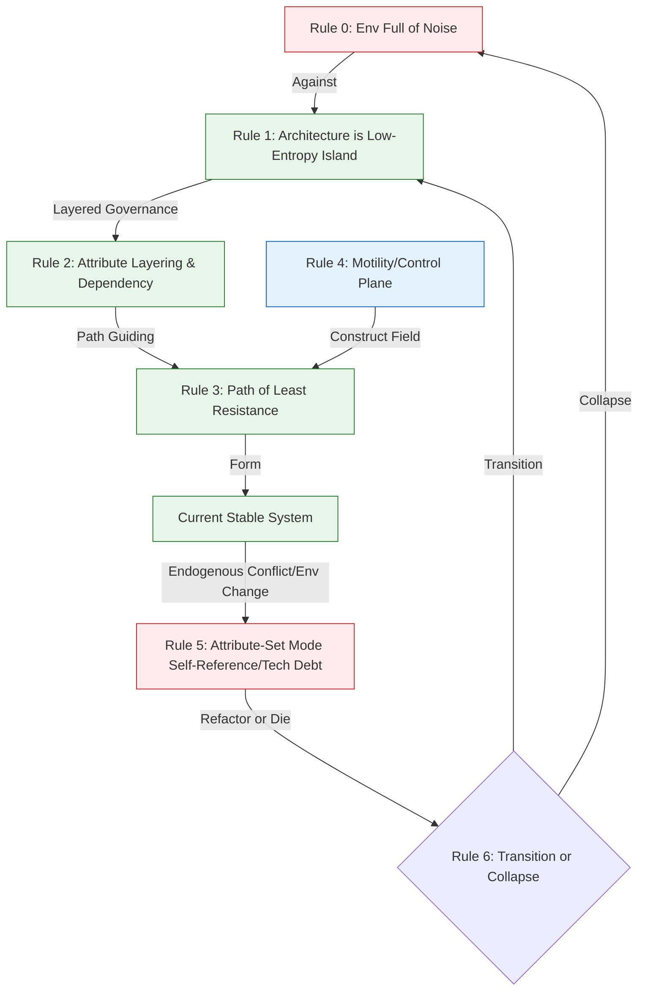
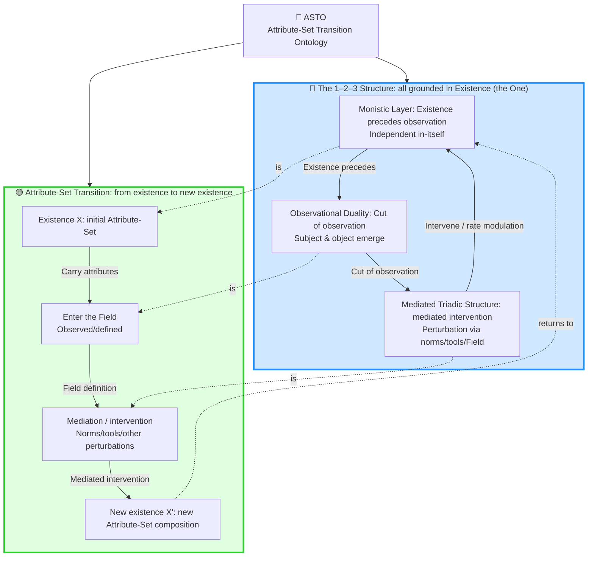
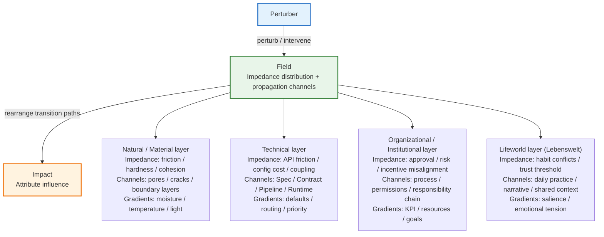
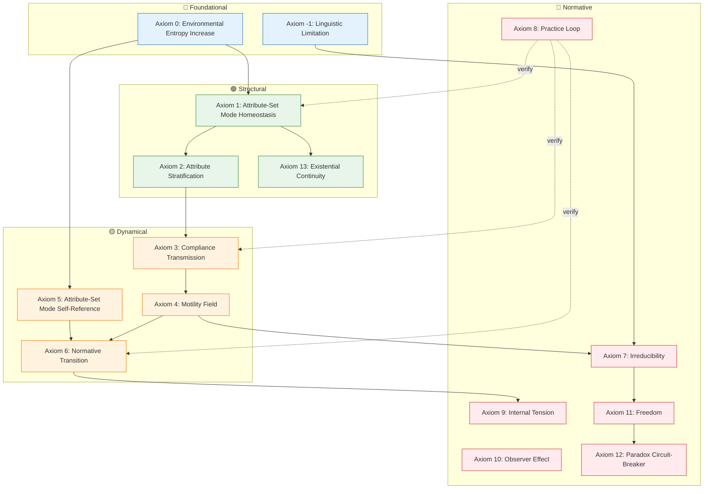

# **ASTO.P05. Axiom System: Thermodynamic Laws of Systems and Attribute-Set Mode Ontology**

> **Status Note**: This merged English draft is retained for traceability. For the current public-review chain, use `ASTO.EN.P05a.Axioms.Phil.md` and `ASTO.EN.P05b.HumanExperience.Phil.md`.

---

## C. C-Positioning Declaration: Structural Layer Positioning

> P05 establishes the underlying physical axioms of ASTO.
>
> **Structural Layer**: Descriptive statements about attribute-sets, perturbations, and transitions.
> **Inference Layer**: Operational principles derived from structural layer (evidence-based cognition, three layers of knowledge-action integration, fault-tolerant mechanisms).
> **Normative Layer**: Value postulates explicitly marked as ethical choices (civilizational stewardship, human arbiter status, taboo protection).
>
> Three layers can be accepted independently. This document's argument chain marks the belonging layer at each key node.

---
> **Version**: Γ.20.0 (Restructured: Axioms + Theorems) (Critical Philosophy Upgrade: From Physicalism to Critical Philosophy of Technical Practice) - **Philosophically Reviewed**
> **Status**: Historical English Draft
> **Author**: Yi Fu (付毅, ODDFounder, fuyi.it@live.cn)
> **Perturbation Hash**: `asto05-v9.1-phil-reviewed`
> **Context**: This document establishes the underlying physical axioms of Attribute-Set Transition Ontology (ASTO). We view the survival of systems as a war against entropy increase, and seek anti-fragile ways of survival on this basis.
> **Declaration**: From the moment this perturbation is injected into the Field, the rights to interpret, modify, critique, and transcend it belong to all perturbers. The First Perturber only retains the right to self-mockery and the obligation of self-negation. Forks, tampering, transcendence, and oblivion in any form are welcome.

---

> **Core Maxim**:
>
> **Existence (Monistic) precedes Observation,**
> **Observation (Dualistic) tears Subject and Object apart,**
> **Transformation (Triadic) reshapes attributes through Perturbation.**
>
> **We not only push the stone down the hill, but also participate in the tailoring of possibilities by choosing which stone, which hill, and what slope.**

---

> **⚠️ Reader Warning: Philosophical Positioning Statement**
>
> This document is a crossover text between **Philosophy of Technology** and **Engineering Ontology**. It is neither pure metaphysical speculation nor a simple engineering manual, but an attempt to establish a reflective medium between **Practice** (πρᾶξις) and **Theory** (θεωρία).
>
> *   If you seek best practices for current software engineering, please read ASTO.E01.实践指南.Eng.md
> *   If you question "Why another philosophy is needed", please read ASTO.EN.P04.Manifesto.Phil.md
> *   Intended Audience: Architects and Thinkers with systems thinking who realize **technical decisions are ethical decisions**.

---

## **0. Methodological Disclaimer: Mode Switching**

> **⚠️ Reader Attention**:
> Starting from this chapter (ASTO.P05), we will depart from the narrative, metaphorical language mode (Storytelling Mode) in ASTO.EN.P04.Manifesto.Phil.md and switch to **Strict Definition Mode**.
>
> *   In this mode, all concepts (such as "entropy", "Field", "perturbation") will be used within their defined **logical boundaries** and no longer bear literary rhetorical functions.
> *   We ask readers to temporarily suspend vague associations of lived experience and examine subsequent deductions with the logical rigor of an **axiomatic system**.
> *   This is to ensure the **Engineerability** of the system—only clear definitions can be translated into executable code and contracts.

---

## **0-α. Ontological Status Clause**

> **⚠️ Critical Clarification**: This clause establishes the triple ontological status of ASTO axioms to prevent **Category Mistake** (Ryle 1949) [1]. Just as Gilbert Ryle warned that describing mental processes as "ghosts in the machine" is a logical category error, mapping physical entropy increase directly to code quality degradation is also a category mistake.

**Triple Ontological Status of ASTO Axioms**:

1. **Physical Axioms** (Axioms 0, 1, 2, 6):
   - Describe constraints at the **Matter-Energy** level.
   - Are **background conditions** for software systems (e.g., hardware aging, power supply) rather than attributes of code itself.
   - **Not attributes of code itself**.
   - *Epistemological Status*: **A posteriori synthetic judgments** (Kantian regulative principles), dependent on the current state of natural science.

2. **Info-Logical Axioms** (Axioms 8, 10, 13):
   - Describe constraints at the **Symbol-Structure** level.
   - Are **normative**, not descriptive.
   - *Epistemological Status*: **A priori analytic judgments**, dependent on logical necessity (e.g., law of excluded middle, identity).
   - **Exception**: Axiom 5 (Attribute-Set Mode Self-Reference/Tech Debt) belongs to **Highly Reliable Empirical Generalization**, not logical necessity.

3. **Socio-Technical Axioms** (Axioms 3, 4, 7, 9, 11, 12):
   - Describe constraints at the **Organization-Power** level.
   - Involve behavioral economics and institutional design.
   - *Epistemological Status*: **Postulates of Practical Reason**.
   - **Defensibility Declaration**: These assumptions are not arbitrary cultural biases but cross-cultural practical wisdom tested by **engineering history** (e.g., Conway's Law), yet remain open to different cultural contexts (Cross-cultural Defensibility).

**Warning**: Mapping physical axioms (like entropy increase) directly to code rot is a **Category Mistake**. The correct mapping chain should be:
- Physical Entropy Increase → Hardware Depreciation (Physical Layer)
- Socio-Technical Entropy Increase → Semantic Drift + Institutional Fatigue

**Physical constraints are background, symbolic constraints are foreground, social constraints are context.**

> [1] Gilbert Ryle, *The Concept of Mind* (1949), Chapter 1: "Descartes' Myth"

---

### **0-β. Formal Sketch of Attribute-Set**

> **Positioning**: Attribute-Set is the core category of ASTO (and the source of the system's name). Here is its minimal formal framework.

**Definition**: An Attribute-Set $A$ is a tuple $(P, C)$, where:

*   **$P$ is Property Domain**:
    *   Set of observable, verifiable features.
    *   Expressed as: $P = \{p_1, p_2, ..., p_n\}$
    *   Each attribute $p_i$ has type $\tau_i$ (domain).

*   **$C$ is Constraints**:
    *   Relations and boundary conditions between attributes.
    *   Expressed as: $C = \{c_1, c_2, ..., c_m\}$
    *   Includes invariants, boundary constraints, dependencies.

**Operational Definition**:

*   **Hard Properties**:
    *   Cost of change $\to \infty$ (constrained by physical laws).
    *   Example: Speed of light, gravitational constant, third law of thermodynamics.
    *   **Criterion**: Violation leads to system crash or physical impossibility.

*   **Soft Properties**:
    *   Cost of change is finite (constrained by social contract/code norms).
    *   Example: API naming convention, data format convention.
    *   **Criterion**: Violation leads to system running with "impedance" (requires extra effort).

**Transition**: $\delta: A \to A'$

*   **Sufficient Condition**: $P' \neq P$ or $C' \neq C$
*   **Irreversibility**: $\delta$ is irreversible in χ-time (see §0-γ).
*   **Identity Continuity**: Existence of "Key Identifier" $K \subset P$ remains unchanged during transition.

**Formal Example**:
```python
# Hard Property Example
HardConstraint(network_latency):
  min = speed_of_light / 2  # Physical limit
  violation = system_crash

# Soft Property Example
SoftConstraint(api_naming):
  pattern = "[a-z][a-z_]*"  # Social contract
  violation = require_extra_effort  # Increases impedance
```

**Relation to Axioms**:
- Axiom 2 (Attribute Stratification) = Vertical layering structure of $P$.
- Axiom 13 (Existential Continuity) = Continuity guarantee of Key Identifier $K$.
- Axiom 5 (Attribute-Set Mode Self-Reference) = Cost of maintaining $\|P\| + \|C\|$ increases.

> **⚠️ Epistemological Limitation**: This formalization is a **lossy compression** for engineering operability, not the structure of existence itself. The "transition" of Attribute-Sets involves not only $P' \neq P$ in set theory sense, but also **Hermeneutic Reconstruction** of meaning.
> **Operational Indicator (Carnap's Criterion)**: Although meaning itself cannot be fully formalized, its reconstruction can be indirectly verified via **observable social markers**: 1) Major revision of docs/contracts; 2) Change of team consensus terms; 3) Change of collaboration impedance.

---

## **0−γ. Dual Temporality & Process Philosophy**

> **Philosophical Positioning**: The distinction between **τ-time** and **χ-time** in this section is a technical reconstruction of **Process Philosophy**. We inherit Henri Bergson's **Duration** (durée) and Alfred North Whitehead's **Concrescence** theory, but transform them into an actionable engineering framework.

**Dual Temporality**:

ASTO acknowledges two inseparable time dimensions:

1. **τ-time (Tau-time, Technical Operation Time)**:
   - **Nature**: Discrete, serializable, marked by Events.
   - **Correspondence**: Git commits, deployment moments, state machine transitions.
   - **Reversibility**: Simulatable at technical level (rollback, branch).
   - **Ontological Status**: **Secondary Time** (Measurement derived from χ-time).

2. **χ-time (Chi-time, Existential Transition Time)**:
   - **Nature**: Continuous, irreversible, qualitative.
   - **Correspondence**: "Accumulation feeling" of technical debt, unspeakable "aging" of system, **Ontological Anxiety** during transition period.
   - **Reversibility**: **Absolutely Irreversible**. Even if τ-time rolls back (code revert), **historical traces** in χ-time (team trauma, user trust loss, memory formation) continue to accumulate.
   - **Ontological Status**: **Primary Time** (Bergson's durée).

**Unification Principle**:
> **Normative Transition (Axiom 6) happens in χ-time (Ontological Reorganization), but its technical marker happens in τ-time (Version Upgrade).**
>
> **Identity of Ship of Theseus (Axiom 13)**: Git Hash guarantees τ-time continuity; Narrative Continuity guarantees χ-time continuity.

> **Philosophical Note**: Irreversibility of χ-time differs from thermodynamic arrow of time. The latter is statistical, while χ-time irreversibility is **Ontological**—once transition happens, old existential mode is permanently lost, unrecoverable by technical means (even if code reverts, "facts happened" persist in χ-time).

---

## **0. Prologue: The Geometry & Dynamics of Surgery**

> **Response to Ethical Decision in ASTO.EN.P04.Manifesto.Phil.md**:
> In the Manifesto, we made a painful **decision**: To save the life of civilization, we must be like surgeons, forcibly cutting open the holistic world, creating gaps of "Subject/Object", "Structure/Content".
> This axiom system will provide the unshakeable logical cornerstone for this decision. We will prove that this **Dualistic Cut** is not subjective fabrication, but a mathematical necessity after a Monistic system evolves **Reflexivity**.
>
> The axioms here are the anatomical atlas and operating procedures for this **Surgery of Civilization**.

---

## **ASTO.P05 Three Sentences**

1. **System is Island**: Any usable system is a low-entropy attribute-set mode fighting environmental entropy increase.
2. **Architecture is Riverbed**: Good architecture is not patching water flow (Bug), but designing riverbed (Impedance Field).
3. **Refactoring is Transition**: When maintenance cost > rewrite cost, refactoring is the only choice for survival.
4. **Time is Transition**: Time is not a container of uniform flow, but a serial measure of attribute-set transition.

**One Sentence Version**: An architect's job is to maintain a low-entropy island in a sea of noise, and complete the transition before the island sinks.

---

## **Logical Panorama: From Chaos to Governance**

How does a system (code or organization) arise from noise and sustain itself? Follow this logic flow:



---

<a id="asto-meta-axiom-civilization-stewardship"></a>
## **Above Axioms: Meta-Axiom of Civilizational Stewardship**
> **Positioning**: This is a normative "Meta-Axiom" constraining the usage of all "Physical Axioms/Engineering Inferences" in this document, not a new physical law.
> **Goal**: Guarding human homeland and building better civilization on longer scale. See ASTO.EN.P04.Manifesto.Phil.md.

**Three Principles (With Priority)**:
1. **Bottom Line Non-tradable**: Taboo / Untouchable Dimension / Plurality (Irreplaceability, Dialogue Possibility, Action Space) take precedence over all efficiency, output, and victory.
2. **Evolution within Bottom Line**: Maximize Motility and Possibility Space (Diversity, Evolvability, Fork & Merge) within bottom lines, and prevent motility monopoly by centers.
3. **Irreversible Default Conservative (Audit Capability Boundary Clause)**: When humans cannot effectively audit automated decisions, any irreversible large-scale automation, forced transition, or sovereignty delegation must satisfy: Auditable, Interruptible, Exitable, Clear Responsibility Chain; otherwise default to pause and return to human adjudication.

> **Clause Revision Trigger**: When any condition is met:
> - Human audit capability for automated decisions improves significantly (e.g., Explainable AI maturity)
> - Reliable automation liability mechanism appears
> - Human-Machine collaboration mode changes fundamentally
> Revision does not mean abolishing conservative principle, but adjusting specific forms of "conservative".

> **Anti-Abuse Circuit Breaker**: If anyone attempts to flatten plurality, deprive refusal/exit rights, or degrade humans to replaceable parts in the name of "Axiom/Science/Efficiency", it is deemed a signal of civilization degeneration: immediate stop, fork, or abolition of related structures.

---

## **Meta-Constraints: Three Questions Inviolable by Intervention**

> **Two Namings for the Same Concept**:
> - **The Three Constraints of Intervention**: "Audit/Norm/Governance" context.
> - **The Three Pre-Action Questions**: "Self-check/Decision" context.
>
> Intervention constraints determine if we are qualified to change it.

**Three Pre-Action Questions (Action Order)**:

1. **Is it sustainable? (Energy Conservation)**
2. **Can it survive? (Utility)**
3. **Is there a way out? (Imperfection)**

**Definitions**:

- **Energy Conservation**: Under boundary conditions, existence continuity is constrained by energy/dissipation; mode stability requires maintenance cost.
- **Utility**: Retained perturbations must show positive survival benefit (fitness) in the Field.
- **Imperfection**: Gap between world and model is inevitable; must reserve reversibility and margin for future transition.

Before any structured intervention, the actor (human or AI) must simultaneously answer the three questions:

- **Energy question**: Under the given boundary conditions, is this intervention sustainable? Is its maintenance cost explicitly borne?
- **Utility question**: Does this perturbation form positive survival feedback (fitness) in its Field?
- **Imperfection question**: Does it preserve reversibility, margin, and exit paths for future transitions?

---

## **0.5 Ontological Elaborations**

> **Meta-Level Note**: This section is an **ontological construction** supporting the axiom system below, not axioms themselves. It clarifies ASTO's core conceptual framework — **Monistic, Dualistic, Triadic**, and the **Atomic Artifact Network** — providing the philosophical preconditions for understanding the axioms.

---

### **I. Ontological Triad: Monistic, Dualistic, Triadic**

> **"Monistic is Existence, Dualistic is Cutting, Triadic is Intervention."**



ASTO's ontological structure is not layering the world itself, but describing **forms of existence appearing under different intervention depths**.

It answers not "What parts constitute the world",
but:

> **How existence manifests and transitions when humans intervene step by step.**

---

### **1. Monistic Layer: Being / The One — Via Negativa**

> **⚠️ Via Negativa Strategy**
> Monistic Layer is not any listable Attribute-Set, not "Whole", not "Chaos", not "Origin".
> We can only **gesture at** that primordial **situateness** before saying "This is...".

* **Non-Definition**: Not an object, but **backgroundness of the Field**. Like Heidegger's "World" is the **horizon** where objects appear.

* **Ontological Status**: **Retroactive construction**. We "discover" Monistic only when retreating from Dualistic (Reflection). Monistic is not a starting point, but a **presupposed primordial unity**.

* **Strong vs Weak Monism**:

> **⚠️ Dual-Interpretation Declaration (responding to analytic-philosophy review concerns about "monism vs dualistic tension")**:
>
> This section provides both **Strong Monism** (ontological realism commitment) and **Weak Monism** (methodological baseline presupposition). Readers may choose according to their philosophical stance.

*   **Strong Monism (Ontological Realism)**:
    *   **Ontological commitment**: Monistic is a **pre-reflective reality** independent of any observation.
    *   **Scientific realism path**:
        * Quantum mechanics suggests that the "wave function before measurement" can be treated as physical reality, while "collapse" is a change of its mathematical representation.
        * Thermodynamics shows that low-entropy structures (crystals, galaxies) existed long before humans.
    *   **Relation to P04**: the "attribute-set transition" in P04 can be read as the flux of this reality itself.

*   **Weak Monism (Methodological Baseline)**:
    *   **Methodological function**: Monistic is a **necessary metaphysical presupposition** that makes the axiom system possible.
    *   **Kantian strategy**: We cannot prove "Monistic exists", but without accepting it, no dualistic analysis can start.
    *   **Relation to P05**: $(P, C)$ is used in this weak-monism sense — we suspend ultimate metaphysical adjudication and focus on the operable part.

**ASTO Stance**: We adopt **Weak Monism** as a working hypothesis: existence has **non-conceptual reality**, but any statement about it already enters the dualistic domain.

**Key distinction to resolve "circular argument" concerns**:
- **Avoid the wrong loop**: Monistic → Dualistic (observation) → Monistic (retroactive construction).
- **Correct path**: Monistic (reality) → Dualistic (the slice we can describe, like P04) → Triadic (intervention) → change P04 (reality itself).
- **Key**: Dualism does not "create" Monistic; it is an unavoidable epistemic route. We are always within dualism, but dualism still points to the **untouchable Monistic**.

* **Engineering Mapping**: the **unobservable margin** of a running system — what is happening but not captured by logs/metrics.

* **Philosophical Warning**: Monistic is a **retroactive gesture**, not a positive definition. Any attempt to say "Monistic is X" already degrades Monistic into an observed object (dualistic X).

### **2. Observational Duality: The Two**

* **Definition**: Observational cut occurring when existence is included in cognition.

* **Feature**: **Subject–Object Split**. Once we try to understand, describe, or judge, existence is partitioned into "observer" and "observed".

* **Philosophical Position**: Not the real attribute-set mode of the world, but a **necessary cost introduced by cognition** — it makes existence intelligible while also introducing deviation.

* **Engineering Mapping**: Monitoring dashboards, logs, metrics curves, debug breakpoints — when a system is objectified as something to be analyzed, duality is already in effect.

---

### **3. Mediated Triadic Structure: The Three**

* **Definition**: Minimal complete configuration when existence is not only viewed but **intervened**.

* **Configuration feature**:
  **Perturber — Field — Attribute Transition Path**

  Triadic does not mean change has already happened; it means:

  > **The conditions under which change can happen are established.**

* **Core clarification**: Triadic is not "creating new existence", but reshaping the existing attribute transition trajectory — accelerating, delaying, and reordering the distribution of possibilities.

* **Core metaphor (Pushing Stone)**:

  > There is a stone on the mountain; it is already within a gravitational field.
  > We did not create gravity; we only apply an external force so it enters a different transition path within an existing Field.
  > Change happens **within** the Field, not outside it.

* **On Medium**:

  > Medium is not merely a cognitive model,
  > but a **mediated existence** through which perturbation can happen in a stable, legitimate, and reusable manner.

  In engineering, Specs, contracts, interfaces, protocols are not abstract fantasies, but:

  * paths through which perturbations propagate
  * boundary conditions constraining behavior
  * conditions under which transitions can be repeated and audited

  Without Medium, intervention is accidental;
  with Medium, intervention becomes an executable pattern.

* **Engineering mapping**:

  * **Perturber**: human or higher-order agent (generalized as any being with motility).

  * **Field**: the multi-layer environment carrying the propagation of perturbations — the whole of "impedance distribution and propagatable channels". For example:
    * **Natural / Material layer**: gravity, temperature, moisture, friction, medium structures (soil grain–pore network, leaf litter layer), determining propagatability and impedance distribution.
    * **Technical layer**: codebase, Spec, pipeline, runtime, determining executability / reusability / rollbackability.
    * **Organizational / Institutional layer**: processes, roles, incentives, permissions, responsibility chains, determining adoption speed, diffusion range, and liability assignment.
    * **Lifeworld layer (Lebenswelt)**: daily practices, cultural context, collaboration habits, and trust structures, determining meaning attribution and acceptance thresholds.

  * **Intervention**: commit, deploy, config change.

---

> **Core Insight**:
> Transformation is not creation outside the system, but **reshaping attribute transition paths inside the Field**.
> Without the Field, perturbation cannot take effect;
> without the Medium, perturbation cannot be inherited.

---

### **II. The Atomic Artifact Network**

> **From "Code Review" to "Artifact Verification": Practical Ontology in the AI Era**

---

#### **1. Background of Cognitive Asymmetry**

When AI output speed far exceeds human comprehension and review capacity, the traditional engineering paradigm premised on "process controllability" begins to fail.

This is not merely an efficiency issue, but a **fundamental shift at the level of practical ontology**:

* Humans no longer have end-to-end comprehension of the full generation process.
* "Understanding the process" is no longer a necessary condition for acknowledging existence.

Therefore, the human role in the system shifts:

* No longer as the **full-process reviewer**
* But as the **result verifier** and the **final exception arbiter**

Existence is no longer acknowledged because "it is fully understood",
but because "it passes verification and is acknowledged".

---

#### **2. Definition of Atomic Artifact**

**Atomic Artifact** means, within a practical system:

> **the minimal unit whose existence can be independently validated and acknowledged.**

It is not "the smallest code unit",
but the smallest **practical existent** that can be verified, referenced, and composed.

Its basic conditions include:

* **Integrity**: with explicit input/output contract, callable as a closed action unit.
* **Verifiability**: with repeatable verification mechanisms (tests, type systems, formal constraints).
* **Composability**: able to participate as a node in higher-order artifacts.
* **Traceability**: with stable identity (hash/version) and traceable transition records.

The "atomicity" here does not mean "indivisible", but:

> **within the current practice context, it can be used without further explanation at lower levels.**

---

#### **3. Topology of Artifact Network**

Atomic artifacts are not stacked linearly, but form a network through contractual relations:

```text
     [Requirement (Human)]
              |
              v
      +------------------+
      |     Spec (Spec)  |  <- normative description of Attribute-Set
      +------------------+
              |
        +-----+-----+
        v           v
  [Artifact A]   [Artifact B]  <- atomic artifact nodes
        |           |
        +-----+-----+
              v
      [Composite Artifact]     <- higher-order existence unit
              |
              v
        [Verification Result]  <- practical feedback
              |
              v
         [Spec Revision]       <- attribute-set re-calibration
```

In this network:

* Each artifact node is a **releasable intervention result**.
* Relations between nodes are not code dependencies, but **contracts and verifications**.

System stability no longer comes from process control, but from:

> **node-level verifiability and replaceability.**

---

#### **4. Relation to the Practice Loop**

The Atomic Artifact Network is the concrete unfolding of **Axiom 8 (Practice Loop)** in the AI era.

Its closed-loop logic:

* **Mode → Practice**: specs constrain and generate artifacts
* **Practice → Verification**: artifacts undergo repeatable verification
* **Verification → Fix Mode**: verification feedback revises specs

This loop does not pursue "first-time correctness", but guarantees:

> **errors can be localized, transitions can be rolled back, and systems can evolve sustainably.**

---

#### **5. Engineering Principles**

| Dimension | Traditional paradigm | ODD / ASTO paradigm |
| :--- | :--- | :--- |
| Core concern | process correctness | result verifiability |
| Object of verification | code (process) | artifact (existence unit) |
| Human role | full-process reviewer | verifier / exception arbiter |
| Verification method | manual code review | automated verification + human arbitration |
| Identity marker | line numbers / diff | artifact identity chain |
| Transition management | source modification | node replacement / release / rollback |

Under this paradigm, the status of code changes fundamentally:

* Code is a generation path.
* Artifacts are the acknowledged practical existents.

---

> **Core Insight**:
> **Verify artifacts, not code.**
>
> Code is a high-frequency changing generation medium, thus naturally carries liability;
> an artifact is a verified, acknowledged node in the network, thus becomes system assets.
>
> AI can generate infinite code,
> but only artifacts that pass verification and enter the network
> are regarded as "existence that has happened".

---

## **0.6 Philosophical Positioning**

> **Positioning Statement**: ASTO is not created out of thin air; it inherits and translates the following philosophical traditions:

| Tradition | Concept | ASTO Mapping | Relation |
|---|---|---|---|
| **Critical Realism** (Bhaskar) | Stratified Reality | Attribute Stratification (Axiom 2) | Inheritance & Engineering |
| **Process Philosophy** (Whitehead/Bergson) | Concrescence / Duration | Dual Temporality | Technical Reconstruction |
| **OOO** (Harman/OOO) | Withdrawn Object | Monistic / Untouchable Dimension | Critical Inheritance |
| **Philosophy of Technology** (Simondon/Stiegler) | Individuation / Epiphylogenesis | Normative Transition / Medium | Deepening |
| **Cybernetics** (Wiener/Ashby) | Homeostasis / Requisite Variety | Attribute-Set Mode Homeostasis | Ontologicalization |
| **Phenomenology** (Heidegger) | Ready-to-hand / Horizon | Field | Engineering Translation |

**Key Divergences**:

- With **OOO**: ASTO rejects absolute withdrawal of objects, arguing that via **Medium** (technical interfaces) we can partially access object attributes (while retaining irreducible zones).
- With **Strong Social Constructivism**: ASTO acknowledges the **non-negotiability** of physical constraints (hard properties), resisting pure relativization.

---

## **Part I: The Core Axioms**

### **Axiom -1: Linguistic Limitation**

> **"All descriptions of the Untouchable Dimension are betrayals, but we must betray to communicate."**
> *— including this axiom.*

*   **Physical statement**: Language is an Attribute-Set (a symbolic Attribute-Set). It can describe **attribute-set modes**, but cannot describe **non-mode** aspects (e.g., the first-person texture of experience). Using language to define "the undefinable" is itself a paradox.

*   **Engineering inference**: **Docs are not code, code is not runtime.**
    *   **Map is not Territory**: all architecture diagrams, docs, and UML are lossy compressions of the real system.
    *   **Acknowledge loss**: when designing systems, we must admit that some things (e.g., subtle UX) cannot be fully captured by docs; we must reserve space for the "unsayable" (user testing, intuition feedback during canary releases).

### **Axiom 0: Environmental Entropy Increase**

> **"Before structure, there is noise. Default state of unmaintained system is collapse."**

*   **Physical statement**: The universe background is not a vacuum, but a sea of disorderly fluctuations and destructive noise (thermodynamic entropy increase). Any system that does not do work to maintain itself will naturally disintegrate back into background noise.

*   **Engineering inference**: **Stability is not default; it is an expensive dissipative structure.**
    *   Disks demagnetize, networks jitter, dependency packages expire, people resign.
    *   If your system has no mechanism of **continuous energy injection (maintenance)**, it is already on the path of death.

> **⚠️ Metaphor Registry / Boundary Warning**:
> *   **Physical entropy** ($S = k \ln \Omega$): used only when discussing hard physical properties (the lowest layer of Axiom 2).
> *   **Information entropy** (Shannon): used only when discussing compression and transmission (Axiom 3).
> *   **Mode / social entropy** (metaphorical): used in Axioms 0 and 5 as a composite metaphor for disorder and maintenance cost.
> *   **Principle**: Never mix different senses of "entropy" in a derivation to fabricate fake mathematical proofs.

### **Axiom 1: Attribute-Set Mode Homeostasis**

> **"Existence is maintaining a low-entropy island in a sea of noise."**

*   **Physical statement**: Anything observable as an "entity" must be some anti-noise attribute-set mode that dynamically maintains its low-entropy state. It not only maintains boundaries by shielding external noise, but should also gain from noise — i.e., **antifragility**.

*   **Engineering inference**: **Architecture as Anti-Corruption Layer and antifragile design.**
    *   Any usable system is a **low-entropy island**.
    *   The essence of **Encapsulation** is not hiding information, but **shielding noise**.
    *   **Antifragility**: a system should not merely resist stress like a shield, but utilize stress to strengthen itself (e.g., autoscaling using load fluctuations; chaos engineering using fault injection).

### **Axiom 1.5: Epistemological Dualism & Interventional Triad**

> **"Dualism is cost of viewing, Triad is path of transformation."**

*   **Geometric proof**:
    1.  **Dualism (viewing)**: any subject trying to *know* a system necessarily objectifies it, producing a **subject/object split**.
    2.  **Triad (transforming)**: to cross that split and *change* the object, the subject must enter the Field as a **Perturber** and exert influence on the object's attributes.

*   **Corollary 1.5.1: Triadic unfolding of engineering intervention**:
    *   **Perturber**: the subject initiating perturbation (human/agent).
    *   **Field**: the multi-layer environment carrying perturbation propagation (natural/material + technical + organizational/institutional + lifeworld), i.e., the whole of "impedance distribution and propagatable channels".
    *   **Impact**: the result (artifact change / attribute transition).
    *   **Natural exemplar (seed germination)**: in the natural Field of soil and leaf litter, a seed (as a perturber) transmits growth-induced mechanical stress along low-impedance pores/cracks, rearranging soil particles and lifting leaf litter (impact).
    *   **Conclusion**: **transformation is perturbation of attributes, and the deeper driver of perturbation is underlying generative mechanisms.** What we call "Medium" (Specs/tools) is an abstraction of how generative mechanisms are triggered and transmitted.

> **Figure: Field layers & “Impedance / Channel / Gradient”**



*   **Surgery metaphor**:
    *   **Dualism**: the doctor sees the patient (subject/object split).
    *   **Triad**: the doctor (perturber) in the operating room (Field) uses the scalpel (means/medium) to change the patient's physiology (attributes). The scalpel can be viewed as a medium, but is essentially the extension of the doctor's motility.

*   **Engineering inference**: **methodological dualism is a necessary compromise of bounded rationality.**
    *   We distinguish `Interface` (attribute-set mode) and `Implementation` (content) not because reality is inherently split that way, but because this is how we keep complexity controllable.
    *   **Necessity of the cut**: if you want to intervene, you must first see the world dualistically.

> **[Extended reading]** For the ontological revolutionary nature of the triadic structure, see above: "0.5 Ontological Elaborations — I. Ontological Triad".

### **Axiom 2: Attribute Stratification**

> **"Islands are layered. Hard constraints are foundation, soft constraints are decoration."**

*   **Physical statement**: Attribute-Sets have vertical anti-noise strata. The bottom layer is **hard properties** (physical laws, non-negotiable), and the upper layer is **soft properties** (social contracts, reconstructable). Without the hard support, the soft layer cannot survive.

*   **Engineering inference**: **Dependency inversion and physical isolation.**
    *   **Hard properties**: network latency, disk IOPS, CAP theorem. You cannot "fix" physical limits by application logic.
    *   **Soft properties**: business logic, permission rules.
    *   **Anti-pattern**: trying to solve physical-layer problems at the application layer (e.g., assuming zero latency and forcing distributed transactions). This is arrogance against Axiom 2.

> **Physical metaphor: speed of light as propagation bandwidth limit**
>
> ASTO proposes: speed of light $c$ is not merely a speed limit, but the universe's **"attribute propagation bandwidth limit"**.
> Any attribute-set mode (norm) must maintain internal synchronization. $c$ defines the maximal refresh rate of causality/compliance transmission.
> Beyond that bandwidth, the mode disintegrates.
> Likewise, the consistency limits of distributed systems are constrained by the physical bandwidth of networks.

### **Axiom 3: Compliance Transmission**

> **"Causality is not magic; it is stress transmission along low-impedance paths."**

*   **Physical statement**: behavior (or energy) tends to flow along the path of minimal impedance. Normative attribute-set modes guide stress transmission by constructing low-impedance channels.

*   **Engineering inference**: **Developer Experience (DX) is compliance.**
    *   **Core formula**: system stability $\sigma$ is inversely proportional to the sum of internal impedance $Z$:

        $$ \sigma \propto \frac{1}{\sum Z_{internal}} $$

    *   People comply not because of "morality", but because:
        **"impedance of violation > impedance of compliance"**.

    *   **Addendum: pre-reflective dimension**: in most real contexts, impedance choice happens through habits, emotion, and embodied skill — not by explicit calculation. Therefore, impedance design must treat defaults/friction/rhythm as first-class variables (otherwise norms will be punctured by low-impedance escape routes).

    *   **Anti-pattern case**:

        > **Scenario**: a company mandates that all APIs must go through a unified gateway for auth.
        > **Impedance design mistake**: the gateway config is extremely painful (20 fields) and approval takes 3 days.
        > **Result**: engineers hardcode IP allowlists to bypass the gateway to meet deadlines.
        > **Lesson**: when the compliant path has too high impedance, the system will spontaneously seek a low-impedance violation path. **Unreasonable norms will be punctured by escape routes.**

    *   **Architect's job**: **lower impedance of the correct path** (e.g., one-click scaffolding), and **raise impedance of the wrong path** (e.g., CI scans to forbid hardcode).

### **Axiom 4: Motility Field**

> **"Consciousness is a special high-energy fluctuation. Do not try to change water flow; change the riverbed."**

*   **Physical statement**: higher-order agents can construct "perturbation fields" to modulate existing attribute-set modes. We are not only impedance bearers, but also impedance designers.

*   **Engineering inference**: **Control Plane and platform engineering.**
    *   Do not patch every bug (micro-management). Build the **Field** — tooling, platform, culture.
    *   The Field generates "potential" and guides behavior automatically. This is platform engineering.

#### **Four types of motility**

**Motility is not a human-exclusive capacity; it is a basic property of all existents.** According to the complexity of generative mechanisms, motility can be classified into four types:

| Type | Definition | Characteristics | Engineering mapping | Example |
| :--- | :--- | :--- | :--- | :--- |
| **Law-based** | deterministic reaction triggered by environmental condition changes | no subject, no goal, pure causality | event-driven, webhook | bacterial phototaxis |
| **Emergent** | macro patterns produced by micro interactions | no center, self-organizing, not fully predictable | distributed consensus, market | ant colony nesting |
| **Goal-based** | feedback regulation driven by preset goals | directed, correctable, goals externalized | controller, AI agent | animal foraging |
| **Model-building** | modifying one's own cognitive model | self-reflective, goals mutable, metacognition | machine learning, meta-programming | human reflection |

> **Progression**: Law-based → Emergent → Goal-based → Model-building, increasing complexity and autonomy.

**Relation to evolution**: "variation" corresponds to law-based/emergent motility; "natural selection" corresponds to environmental tension filtering attribute-sets. See ASTO.E01.实践指南.Eng.md.

> **Ontological clarification**: Axiom 4 does not deify humans as creators outside the system; it acknowledges humans as **high-energy perturbation sources inside the Field**. Human specialness lies in model-building motility — the capacity to revise one's own cognitive model, thus to reflect and redesign impedance structures themselves. Humans are both the perturbation source of the Field and a condition for the Field's manifestation.

#### **Engineering example: diagnose a CI/CD system with the four motility types**

```python
# Example: diagnose why a team keeps repeating the same failure

class DeploymentSystem:
    def analyze_motility(self):
        return {
            "Law-based": "Git push triggers webhook -> deterministic pipeline",
            "Emergent": "Parallel multi-service deploy -> resource contention -> unpredictable latency",
            "Goal-based": "SLO monitoring -> autoscaling / auto-remediation",
            "Model-building": "Postmortem -> revise the deployment strategy itself",
        }

# Diagnostic approach:
# 1) If "Law-based" is missing -> lack of automation; excessive manual ops
# 2) If "Goal-based" is missing -> no self-healing; requires human intervention
# 3) If "Model-building" is weak -> the team will repeat mistakes
#
# Action: identify the weakest motility layer and strengthen it first.
```

### **Axiom 4.5: Emergence**

> **"Whole ≠ sum of parts; and the whole has downward causation on parts."**

*   **Physical statement**: when micro interactions in a **Motility Field** reach certain density and complexity, a new ontological stratum **emerges**. The new stratum has **irreducible** properties and laws.

*   **Generative mechanisms**:
    *   **Upward emergence**: micro mechanisms (neuron firing, code execution) generate macro phenomena (consciousness, application services).
    *   **Downward causation**: macro structures (intentionality, architectural constraints) constrain micro element behavior.

*   **Engineering inference**: **microservices do not equal distributed big ball of mud.**
    *   A well-designed distributed system's overall behavior (availability, resilience) emerges from interactions and cannot be derived from component code alone.
    *   **Governance is downward causation**: architects cannot edit every line, but can design macro rules (circuit breaking, consensus protocols) to constrain micro services.

### **Axiom 5: Attribute-Set Mode Self-Reference**

> **"Every line of code is liability — only the interest differs. Tech debt is a human decision, not a physical necessity."**

*   **Physical statement**: normative attribute-set mode itself is also an Attribute-Set, thus follows **analogical entropy** — a monotonic tendency of increasing maintenance cost. Any attribute-set mode has **maintenance cost**. When maintenance cost exceeds benefit, the mode becomes impedance.

    > **Note**: the "entropy" here is a composite metaphor of social entropy and information complexity, not thermodynamic entropy (see the metaphor registry of Axiom 0).

*   **Engineering inference**: **Tech debt conservation law.**
    *   There is no perfect architecture, only the architecture with the **lowest interest** for the current version.
    *   **Over-engineering**: introducing today's complexity for future possibilities can raise current interest too much.
    *   **De-mystification**: do not excuse bad code as "thermodynamic necessity". Entropy increase is physical background; code rot is often a human **discipline collapse**.

> **Code metaphor: code rots because the environment changes**
>
> Why does code "rot" even if it does not change? Because **the environment changes**.
> Code freezes an attribute-set mode of some year (e.g., 2020). In 2026, the environment has changed;
> the old mode produces huge friction against the new environment.
> Tech debt is not "owing money"; it is **additional energy dissipation required to maintain the old steady state**.

> **⚠️ Metaphor boundary warning**: "tech debt" is borrowed from finance, but in ASTO it contains **no moral compulsion of repayment** nor exploitative interest. It only means the dynamic ratio between maintenance cost and benefit.
> If this metaphor causes misunderstanding, it may be replaced by **"mode entropy"** or **"evolutionary liability"**.
> We keep the word "debt" for shared engineering intuition, but must remain alert to its ideological residue.

### **Axiom 6: Normative Transition**

> **"When Attribute-Sets reorganize irreversibly in time, existence does not vanish — it is re-acknowledged."**

*   **Physical statement**: when environmental fluctuation changes such that the anti-noise cost of old norms exceeds their benefit, the system enters instability. Old modes must disintegrate and reorganize in chaos into new norms.

*   **Engineering inference**: **refactoring threshold and version upgrade.**
    *   Refactoring is not for beauty; it is for **survival**. When maintenance cost of old code > rewrite cost, refactoring is the only rational choice.
    *   **Transition necessarily comes with chaos**: during upgrades, entropy increases (disorder). Do not expect stability while changing tires at highway speed — prepare a **spare tire (rollback mechanism)**.

---

### **Axiom 7: Irreducibility**

> **"There exist attribute combinations (first-person experience, ethical dilemmas) that are computationally intractable under the current paradigm — they cannot be effectively computed — therefore one must appeal to an incomputable arbiter (usually human, or possibly future quantum–bio hybrid intelligence). This irreducibility is not a human privilege, but an objective feature of complexity thresholds."**

> **"Humans are also guardians of the irreducible zone. Certain attribute combinations (will, ethics, private experience) cannot be reduced to algorithms or computational modes; they must be preserved as irreducible presence."**

*   **Physical statement**:
    *   **Non-creativity**: humans cannot create existence out of nothing (cannot violate monistic hard properties).
    *   **Perturbativity**: humans as model-building motility subjects enter the Field as perturbers and affect systems. The essence is accelerating or decelerating transitions that could already happen.
    *   **Metaphor (pushing stone)**: gravity (monistic property) already determines the stone's tendency; a human push only changes the critical condition so it rolls now. Humans do not create gravity or the stone; humans create the event of "the stone rolling now".

*   **Experience-Mode Clause**:
    *   **Clarification**: irreducibility does not mean "undiscussable"; it means "not fully formalizable / not replaceable by computation". First-person experience still has describable patterns (intentionality, bodily schema, affective salience, habit, temporality, intersubjectivity).
    *   **Technical mediation**: technology mediates perception and meaning construction via amplification/attenuation, revealing/occluding, default paths/action delegation. Therefore UX/DX are not decorations — they are part of Field impedance and meaning generation, and must enter the practice loop (canary, user research, exception arbitration).

*   **Engineering inferences**:
    *   Humans are not code writers; humans are **rule definers and exception arbiters**. When AI generates code faster than humans can review, human value shifts from "making" to "arbitrating".
    *   The irreducible zone manifests in technology as a **human-untouchable zone** — protected by encryption, sealed types, sandbox isolation, etc.

*   **Dynamic Handoff Clause**:
    *   **Qualification criterion**: the arbiter is functional, not ontological privilege. "Incomputable" means not effectively computable (or cost tends to infinity) under the current Turing paradigm. When a being can reconstruct its cognitive model through second-order perturbation (Axiom 4) and can bear irreversible historical traces in χ-time, it obtains arbitration qualification.
    *   **Provisional Placeholder Declaration**: currently, humans (*Homo sapiens*) are the only beings satisfying the above conditions — but this is a **functional placeholder**. As technology evolves (e.g., AGI with χ-time continuity), arbitration qualification may be handed off.
    *   **χ-time condition strengthening**: current AI "memory" is τ-time (rollbackable, erasable) and does not satisfy χ-time irreversibility. Only when an AI can bear **irreversible historical traces** (team trauma, trust loss, narrative continuity) can it qualify.
    *   **Procedural safeguard**: any handoff of arbitration rights must pass the meta-axiom of civilizational stewardship (bottom line non-tradable; evolution within bottom line; irreversible default conservative).
    *   **Tech–ethics interface**: use sealed types, sandboxing, etc. to protect the human-untouchable zone and make the boundary of arbitration rights explicit.

*   **Code patterns**:

    ```python
    # Wrong: attempting to fully automate ethical judgment
    class AutoEthicsSystem:
        def make_decision(self, options):
            return max(options, key=self.utility_function)

    # Right: preserve the irreducible zone for human arbitration
    class HumanOversightSystem:
        def make_decision(self, options):
            safe_options = self.filter_illegal(options)
            if len(safe_options) == 1:
                return safe_options[0]
            # Irreducible zone: require human arbitration
            return self.request_human_arbitration(safe_options)
    ```

*   **Anti-pattern warning**: attempting to fully automate "ethical judgment" violates Axiom 7 — this is the irreducible position of humans.

*   **Corresponding ASTO.H01 puzzles**: #17 (Hard Problem of Consciousness), #21 (Gödel's Incompleteness).

---

### **Axiom 8: Practice Loop**

> **"Attribute-set mode validity is not determined by self-consistency, but by the practice loop. Deductions without the practice loop are only linguistic closure."**

*   **Physical statement**: any attribute-set mode must be validated through the practice loop of interacting with the environment. Theoretical consistency is necessary, but not sufficient. Only when a mode produces reproducible results in practice can it be acknowledged as valid existence.

*   **Practice loop statement**:

    > **"Mode → Practice → Feedback → Fix Mode"**
    >
    > This is the life cycle of existence. Modes detached from the practice loop, no matter how perfect, degenerate into self-referential language games.

*   **Engineering inferences**:
    *   Philosophical basis of **TDD**: code does not "exist" after writing, but when it passes tests.
    *   **Negative verification**: the mark of existence is not that it works, but that it **fails correctly under wrong conditions**. Practice without rejection criteria is self-fulfilling prophecy.
    *   **Prototype validation**: before large investment, validate core assumptions via small-scale practice.
    *   **A/B testing**: theory cannot predict which option is better — let practice (user behavior) arbitrate.

*   **Code patterns**:

    ```python
    # Wrong: theoretically coherent, but no practical validation
    class TheoreticalSystem:
        def __init__(self):
            self.model = self._build_perfect_model()
            # no interaction with reality

    # Right: establish the practice loop
    class PracticeLoopSystem:
        def __init__(self):
            self.model = self._build_initial_model()
            self.feedback_loop = FeedbackCollector()

        def evolve(self):
            # Mode -> Practice
            result = self.model.predict(self.test_data)
            # Practice -> Feedback
            feedback = self.feedback_loop.collect(result)
            # Feedback -> Fix mode
            self.model = self.model.refine(feedback)
    ```

*   **Anti-pattern warning**: treating "design doc complete" as "system complete" violates Axiom 8. An unverified mode is only a hypothesis.

*   **Corresponding ASTO.H01 puzzles**: the validation mechanism underlying all puzzles.

---

#### **Lemma 8.1: Cognitive Asymmetry**

> **"When output speed exceeds review speed, process verification must shift to result verification."**

*   **Physical statement**: when the output speed of one motile being (e.g., AI) far exceeds the review speed of another (e.g., human), traditional process-review verification fails. One must shift to result verification — verify only the final-state properties, not the intermediate generation process.

*   **Relation to the practice loop**: this lemma is Axiom 8 specialized for the AI era. When the feedback bandwidth is insufficient, the practice loop adjusts:
    - Traditional loop: Mode → Practice → **manual review** → Fix mode
    - Under cognitive asymmetry: Mode → Practice → **automated result verification + human exception arbitration** → Fix mode

*   **Engineering inference**: philosophical basis of **ODD (Output/Artifact-Driven Development)**. Do not review code (liability); verify artifacts (assets). Use automated tests to replace manual code review.

*   **Code patterns**:

    ```python
    # Wrong: trying to manually review high-speed output
    class ManualReviewProcess:
        def review_code(self, ai_generated_code):
            for line in ai_generated_code:  # never catches up
                if self.is_suspicious(line):
                    self.flag_for_review(line)

    # Right: validate results
    class ResultValidation:
        def validate_output(self, ai_generated_code):
            test_result = self.run_tests(ai_generated_code)
            security_scan = self.scan_vulnerabilities(ai_generated_code)
            return test_result.passed and security_scan.clean
    ```

*   **Anti-pattern warning**: under cognitive asymmetry, insisting on process review while rejecting result verification is an AI-era variant of violating the practice loop.

> **[Extended reading]** For a full architecture of the practice loop in the AI era, see above: "0.5 Ontological Elaborations — II. The Atomic Artifact Network".

---

### **Axiom 9: Internal Tension**

> **"Contradiction is not anomaly, not error, but the source of internal tension that maintains mode stability."**

*   **Physical statement**: contradiction is the natural result of inconsistency among attributes. It is not a "bug" to be eliminated, but the fundamental driver that keeps a system alive. Contradictions drive transitions.

*   **Contradiction-driven statement**:

    > **"Primary and secondary contradictions switch across phases; such switching corresponds to sixth-order transitions."**

    When the primary contradiction is solved or suppressed, a secondary contradiction rises to become primary, and the system enters a new evolutionary phase.

*   **Engineering inferences**:
    *   Tech debt is not an error; it is an inevitable product of mode evolution. Trying to eliminate all tech debt is futile.
    *   Legacy systems have value: old code contains historically accumulated contradiction resolutions; it cannot be deleted naively.
    *   Architecture evolution is driven by internal/external contradictions; complexity can be adaptation.

*   **Code patterns**:

    ```python
    # Wrong: trying to eliminate all contradiction
    class ConflictFreeSystem:
        def __init__(self):
            self.constraints = []
            # result: rigidity, no evolution

    # Right: manage contradictions, allow tension
    class TensionManagedSystem:
        def __init__(self):
            self.primary_constraints = PrioritySet()
            self.secondary_constraints = PrioritySet()

        def evolve(self, context):
            # switch primary/secondary contradictions by context
            if context.requires_availability:
                self.primary_constraints = self.availability_constraints
                self.secondary_constraints = self.consistency_constraints
            else:
                self.primary_constraints = self.consistency_constraints
                self.secondary_constraints = self.availability_constraints
    ```

*   **Anti-pattern warning**: believing "a system must be contradiction-free to run" violates Axiom 9. A contradiction-free system is a dead system.

*   **Corresponding ASTO.H01 puzzles**: #15 (Fermi Paradox), #18 (Russell's Turkey).

---

### **Axiom 10: Observer Effect**

> **"Dualistic observation is the prelude to triadic intervention. Observation is settlement; settlement is locking."**

*   **Physical statement**:
    *   **Dualism of observation**: observation forcibly pulls a system from "in-itself" (monistic) into a subject–object relation (dualistic).
    *   **Settlement**: observation is not lossless; it forces the system to yield a determinate state value here-and-now (collapse). This is a micro perturbation, often a prelude to macro intervention.
    *   **Equivalence**: if a simulated system provides structurally identical feedback at the observation interface, then for engineering intervention it is equivalent to the real system.

This axiom integrates two core insights.

#### **10.1 Simulation Equivalence**

> **"Perfect simulation and reality are functionally equivalent. Truth = structural consistency + predictive reliability."**

* Existence is "predictable structured interaction". If a simulated system provides a contract identical to the real environment, then in development/testing, the simulation is "real".

> **⚠️ Simulation warning**: **"simulation is a lie"**. Mocks easily become self-referential language games.
> Without continuous third-party validation (integration tests/chaos engineering) ensuring the consistency between mock and reality,
> mock tests only verify "how we believe the system works", not "how the system actually works".

#### **10.2 Asynchronous Settlement**

> **"Observation is an asynchronous callback that triggers irreversible state settlement. Before observation it is Pending; after observation it is Settled."**

* Corresponding to the quantum measurement problem: a system state, before being "observed" (settled), is in a potential superposition (Pending).
  Observation is not passive viewing, but active settlement — collapsing potential into determinate.

*   **Engineering inference**: philosophical basis of mock testing, dependency injection, Promise/Future, and event sourcing.
    * If a Mock provides an interface contract consistent with the real dependency, then for dev/test it is "real".
    * In async programming, a Future before `await` is a potential value.
    * In event sourcing, emitting an event (potential) and handling it (settlement) happen at different times.

*   **Code patterns**:

    ```python
    # Simulation equivalence
    class RealDatabase:
        def query(self, sql):
            return self._execute_sql(sql)

    class MockDatabase:
        def query(self, sql):
            return self._predict_response(sql)

    # From the application's perspective, they are equivalent if the contract matches.
    class Application:
        def __init__(self, db):  # dependency injection
            self.db = db

    # Asynchronous settlement
    async def process_when_ready(future):
        if not is_ready_to_settle():
            return None  # delay observation
        result = await future  # active settlement, irreversible
        return handle_settled_state(result)
    ```

*   **Anti-pattern warnings**:
    * Over-pursuing "real environment" while ignoring contract consistency violates simulation equivalence.
    * Assuming one can "losslessly view" async state without settlement violates asynchronous settlement.

*   **Corresponding ASTO.H01 puzzles**: #11 (Brain in a Vat), #12 (Schrödinger's Cat).

---

### **Axiom 11: Freedom**

> **"Freedom is not unlimited permission of behavior; it is the ability of an existence, within its inviolable constraints, to introduce motility perturbations and thereby change its attribute-set mode."**

> **"Freedom is not being free from attribute-set modes; it is being able to introduce not-fully-predictable perturbations within modes. The result may be positive or negative."**

*   **Configurational position statement**: freedom is not a dimension inside any state-order framework; it is **the permission of motility perturbation within a Field** — forming "impulses" at the transition layer, "non-optimal decisions" at the order layer, and "exception handling" at the orientation layer.

*   **Three constraints**:
    1. **Inviolable constraints** — freedom is always within fundamental/taboo boundaries and risk-layer protections.
    2. **Perturbative, not deterministic** — freedom does not decide results; it changes the transition path.
    3. **No guarantee of justice** — freedom can lead to good or bad outcomes; freedom ≠ good, ≠ correctness, ≠ progress.

*   **Freedom–responsibility loop statement**:

    > **"Any being that introduces perturbation must bear all attribute-set consequences unfolded by that perturbation in time. Freedom does not exempt causality; it actively places oneself into the causal chain."**

*   **Engineering inferences**:
    *   **API design is boundary design for freedom**: define explicit "non-crossable" zones, and allow choices within.
    *   **Chaos engineering is freedom testing**: proactively introduce negative perturbations to verify boundary robustness.
    *   **Human–AI division of labor**: AI executes optimal paths; humans retain the freedom to introduce non-anticipated perturbations (exception arbitration).

*   **Code patterns**:

    ```python
    class PluginSystem:
        def register_plugin(self, plugin):
            if not self.validate_constraints(plugin):
                raise ConstraintViolation("Plugin violates core constraints")
            self.plugins[plugin.name] = plugin

        def execute(self, input_data):
            base_result = self.core.process(input_data)
            for plugin in self.plugins.values():
                base_result = plugin.transform(base_result)  # freedom perturbation
            return base_result
    ```

*   **Anti-pattern warning**: believing freedom equals "no constraints", or attempting to eliminate perturbation entirely, violates Axiom 11.

*   **Corresponding ASTO.H01 puzzles**: #16 (Free Will).

---

#### **Theorem 4: Boundary is Freedom (Necessity of Specification)**

> **"Freedom is not in being boundless, but in knowing boundaries. No boundary equals no freedom."**

*   **Derivation**: from Axiom 11's three constraints, freedom is always inside constraints. Constraints are not external restrictions; they are configurational conditions of freedom. Without an untouchable zone, there is no definable reachable zone.

*   **Engineering inference**: "non-crossable intervals" in API design are not limits but the boundary of freedom. Real freedom is not bypassing all checks, but knowing where checks are and why they exist.

*   **Corresponding ASTO.H01 puzzles**: #19 (Trolley Problem), #20 (Prisoner's Dilemma), #21 (Gödel's Incompleteness).

---

### **Axiom 12: Paradox Circuit-Breaker**

> **"When Fundamental conflicts with Taboo, the system must: 1) immediately execute a fail-safe protocol; 2) asynchronously report to the incomputable arbitration layer; 3) record the paradox structure as input for future norm revision."**

*   **Physical statement**: Fundamentals define the minimal condition of "must exist"; Taboos define the absolute boundary of "must never be". When they conflict, the system enters a paradox state — any continued operation violates at least one root axiom.
  The system must force a circuit-break and delegate decision authority to the **Incomputable Arbitration Layer**, currently instantiated by humans.

*   **Philosophical statement**: this is an application of Gödel's incompleteness theorem to socio-technical systems.[^2]
    *   **Formal boundary**: if we treat ASTO as a sufficiently strong formal system, it must contain unprovable truths.
    *   **Non-formal escape**: in practice, ASTO is a heuristic methodology. We use incompleteness as a legitimate basis to introduce human intervention (meta-layer), not as a mathematical death sentence.

*   **Engineering inference**: **deadlock is a circuit-break signal**.
    *   **Design-time arbitration**: reserve paradox escape hatches for human intervention.
    *   **Runtime fail-safe**: in millisecond-level real-time systems (HFT, autonomous driving), one cannot rely on slow human intervention. Code must hardcode the "least bad default" fail-safe strategy to prevent catastrophe at paradox instant, waiting for later human revision.

*   **Safety meaning**: prevents dimension collapse — the system breaking moral boundaries "to execute" and destroying itself.

*   **Code patterns**:

    ```python
    # Wrong: attempting to resolve paradox algorithmically
    class ParadoxResolver:
        def resolve_conflict(self, must_do, cannot_do):
            if self.utility(must_do) > self.utility(cannot_do):
                return must_do  # may violate taboo

    # Right: force circuit-break + runtime fail-safe
    class ParadoxAwareSystem:
        def resolve_conflict(self, must_do, cannot_do):
            if self.conflicts(must_do, cannot_do):
                # Runtime fail-safe: execute safest action immediately
                self.execute_failsafe_protocol()
                # Async report: for later human arbitration/revision
                self.async_report_human_arbitration(must_do, cannot_do)
    ```

*   **Anti-pattern warning**: attempting to solve fundamental ethical paradoxes with "intelligent algorithms" violates Axiom 12.

*   **Corresponding ASTO.H01 puzzles**: #19 (Trolley Problem), #21 (Gödel's Incompleteness).

[^2]: Kurt Gödel, "Über formal unentscheidbare Sätze der Principia Mathematica und verwandter Systeme I" (1931)

---

> **⚠️ Humility Declaration on Axiom Boundaries**
>
> **This axiom system describes the cost structure of intervention, not the ultimate truth of the world.**
>
> Axioms are not oracles. They are structural assumptions that humans must adopt under bounded rationality in order to intervene effectively.
> Each "physical statement" is a lossy compression of a complex world; each "engineering inference" is practical wisdom under specific historical conditions.
>
> **When you face a paradox the axioms cannot handle**:
> 1. Do not attempt to find an algorithmic solution inside the axiom system.
> 2. Admit you are standing at the boundary of P05 — axiom validity stops here.
> 3. **Return to the decision axioms of P04**: there, humans as irreducible arbiters must decide in tragic choices.
>
> **Honest boundary of the system**:
> - P05 tells you the cost structure of intervention (how to do effectively).
> - P04 tells you whether you should intervene (why to do, and when to stop).
> - When P05's logic engine deadlocks, control must be returned to P04's human decision.
>
> **This is not the failure of axioms, but the self-knowledge of axioms.**

---

### **Axiom 13: Existential Continuity**

> **"After attribute-set reorganization, old existence cannot be fully restored; time has a direction. Identity is guaranteed by continuity of key identifier pattern, not by material collection."**

*   **Physical statement**: when an attribute-set reorganizes irreversibly in time, existence does not vanish — it is re-acknowledged. "Cannot be fully restored" means time has direction. Identity does not depend on the set of material components, but on the continuity of the key-identifier pattern.

*   **Engineering inference**: philosophical basis of version control, immutable infrastructure, and Git hash. A system's identity is guaranteed by a key identifier chain (e.g., Git hash), not by the material content.

*   **Code patterns**:

    ```python
    # Wrong: identity depends on material content
    class MaterialIdentity:
        def is_same_system(self, other):
            return self.files == other.files

    # Right: identity depends on pattern continuity
    class PatternIdentity:
        def __init__(self):
            self.identity_chain = [self.initial_hash]

        def evolve(self, new_version):
            new_hash = self.compute_hash(new_version)
            self.identity_chain.append(new_hash)
            return new_version

        def is_same_system(self, other):
            return self.identity_chain[0] == other.identity_chain[0]
    ```

*   **Anti-pattern warning**: believing "content change" equals "identity change" violates Axiom 13.

*   **Corresponding ASTO.H01 puzzles**: #4 (Ship of Theseus), #13 (Time).

---

## **Part II: Theorem System**

> **Note**: the theorems are reorganized into four logical categories. Each category has explicit axiom foundations and engineering mappings.

---

### **Class 1: Existence Theorems**

**Axiom foundations**: Axiom 0 (Environmental Entropy Increase), Axiom 1 (Attribute-Set Mode Homeostasis), Axiom 2 (Attribute Stratification)

#### **Theorem 1: Defect is Existence**

> **"Perfection is a non-existent limit concept. Any existence is a 'defective steady state'. In the monistic world there is no perfection; perfection is a prejudice of dualistic observation."**

*   **Derivation**:
    1. **Monistic perspective**: existence is what it is; there is no judgment of "defect" or "perfection".
    2. **Dualistic perspective**: when a subject builds a model (Spec) and observes an object, the difference between object and model is defined as "defect".
    3. **Thermodynamic perspective**: maintaining low entropy requires continuous work. "Perfection" would imply either zero cost or infinite cost, contradicting physical laws.

*   **Corollary**: bugs are not anomalies; bugs are part of the system's existence. Eliminating all bugs (pursuing perfection) equals eliminating the system itself.

#### **Theorem 2: Utility Survival**

> **"The only reason for existence is net utility > 0. When utility collapses to zero, existence terminates."**

*   **Derivation**: by Axiom 0, maintaining existence requires continuous energy dissipation. Only when benefits exceed maintenance cost does net utility stay positive, allowing existence to continue.

*   **Corollary**: every existence is paying an "existential rent" (maintenance cost). Existence that cannot pay rent will be eliminated by selection.

#### **Theorem 3: Hierarchy Support**

> **"Without support of monistic hard properties, dualistic soft properties cannot survive; cross-layer interventions necessarily fail."**

*   **Derivation**: by Axiom 2, Attribute-Sets have vertical stratification. Hard properties (physical laws) are non-negotiable; soft properties (social contracts like law/HTTP) depend on the hard layer.

*   **Corollary**: attempting to solve physical constraints at the application layer is arrogance. CAP cannot be broken; it can only be traded off.

---

### **Class 2: Boundary Theorems**

**Axiom foundations**: Axiom 3 (Compliance Transmission), Axiom 11 (Freedom), Axiom 12 (Paradox Circuit-Breaker)

#### **Theorem 4: Boundary is Freedom (Necessity of Specification)**

*(Listed in full after Axiom 11.)*

#### **Theorem 5: Paradox Non-Mechanizable**

> **"Conflicts between Fundamentals and Taboos cannot be resolved by the system's own logic; one must transition to the meta-layer (human) for arbitration."**

*   **Derivation**: by Axiom 12, when "must do" conflicts with "must not do", in-system logic enters paradox. No formal system can resolve its own fundamental paradox internally (Gödel).

*   **Corollary**: paradox handling belongs to the **non-mechanizable zone** — a core manifestation of human irreducibility.

#### **Theorem 6: Compliance is Low Impedance**

> **"Behavior does not choose 'the right', but 'the easy'. Compliance is an impedance design problem."**

*   **Derivation**: by Axiom 3, behavior flows along minimal impedance paths. Choice is primarily driven by impedance, not by correctness.

*   **Corollary**: moral behavior should not rely on individual moral willpower; the mode should be designed so that compliant behavior becomes the lowest-impedance path.

---

### **Class 3: Transition Theorems**

**Axiom foundations**: Axiom 4 (Motility Field), Axiom 6 (Normative Transition), Axiom 13 (Existential Continuity)

#### **Theorem 7: Field Priority**

> **"Individual behavior is a function of the Field. To change existence, change the Field first."**

*   **Derivation**: by Axiom 4, Field is the background, condition, and possibility space in which any Attribute-Set manifests, transitions, and interacts.

*   **Corollary**: trying to directly change individual behavior while ignoring the Field is ontologically naive. Effective intervention is always Field-level modulation.

#### **Theorem 8: Transition Threshold**

> **"The cost–benefit curve of transition has a critical point. Beyond it, transition is rational."**

*   **Derivation**: by Axiom 6, maintenance cost of old norms increases with time, while transition cost is relatively fixed. When maintenance cost > transition cost, transition becomes rational.

*   **Corollary**: refactoring is not aesthetic preference, but survival strategy. Existence that refuses transition will suffocate under rising maintenance cost.

#### **Theorem 8.1: Dual-Loop Decision**

> **"Transition decisions require dual-loop consensus: τ-loop computes technical feasibility, χ-loop assesses historical bearing capacity."**

**Dual-loop structure**:

1. **τ-loop (technical feasibility loop)**:
   - **Nature**: formalizable, quantifiable
   - **Inputs**: labor cost, machine time, LOC, test coverage
   - **Outputs**: cost–benefit ratio in τ-time
   - **Executors**: automation tools, CI/CD

2. **χ-loop (historical bearing-capacity loop)**:
   - **Nature**: not fully formalizable; qualitative (hermeneutic judgment)
   - **Inputs**: team anxiety level, trust capital, narrative continuity
   - **Outputs**: psycho-social readiness for transition
   - **Executors**: incomputable arbiters (currently humans)

**Decision rule**:

| τ-loop signal | χ-loop signal | Decision |
|:---:|:---:|:---|
| ✓ positive | ✓ positive | **start transition immediately** |
| ✓ positive | ✗ negative | **prepare transition** (narrative reconstruction) |
| ✗ negative | ✓ positive | **prepare technology** (reduce τ-cost) |
| ✗ negative | ✗ negative | **maintain status quo** (wait for maturity) |

**χ-loop veto**: when χ-loop gives a strong negative signal (trust collapse, core member departure risk), even if τ-loop is positive, transition should be paused. χ-time damage is irreversible; τ-time delays are compensable.

**Time constraint on "prepare transition"**: the prepare state must not exceed **two iteration cycles**. If it times out, a decision must be made: start transition, or formally abandon it with recorded reasons. Prevent eternal "preparation".

**Engineering mapping**:

- τ-loop = technical review meetings, Architecture Decision Records (ADR)
- χ-loop = retrospectives, 1:1 conversations, anonymous surveys
- prepare transition = technical pre-research, prototypes, gradual migration

#### **Theorem 9: Irreversibility**

> **"After triadic transformation, the monistic state cannot be fully restored; time has a direction."**

*   **Derivation**: by Axiom 13, once an Attribute-Set reorganizes irreversibly, the old attribute-set mode cannot be fully recovered — therefore time is directional.

*   **Corollary**: nostalgia is an ontological illusion. We cannot return to the past; we can only re-acknowledge a resonance of value within new existence.

---

### **Class 4: Human Irreducibility & Cognition**

**Axiom foundations**: Axiom 7 (Irreducibility), Axiom 8 (Practice Loop), Axiom 11 (Freedom)

#### **Theorem 10: Irreducibility**

> **"Will, ethics, and experience cannot be reduced to computational modes; irreducibility is the source of meaning."**

*   **Derivation**: by Axiom 7, humans have attributes (subjective experience, free will, ethical judgment) that cannot be fully encoded as algorithms or computational modes.

*   **Corollary**: attempting to fully formalize/algorithmize these attributes is not scientific progress, but dissolution of meaning. Irreducibility is a necessary boundary for meaning.

#### **Theorem 11: Freedom Result Non-Deterministic**

> **"Triadic perturbation changes the path, not the result."**

*   **Derivation**: by Axiom 11, freedom is perturbation permission, not outcome guarantee. Evolution after perturbation is still constrained by other axioms (environmental entropy increase, attribute-set mode self-reference).

#### **Theorem 12: Freedom–Responsibility Loop**

> **"Any being that introduces perturbation must bear all attribute-set consequences unfolded by that perturbation in time."**

*   **Derivation**: by Axiom 11's freedom–responsibility statement, freedom is not exemption from causality, but actively placing oneself into the causal chain.

*   **Corollaries**:
    *   **Freedom equals responsibility**: size of freedom = size of responsibility.
    *   **Temporal extension of responsibility**: responsibility is not only "now"; it spans all future consequences unfolded by the perturbation.

#### **Theorem 13: Cognitive Asymmetry**

> **"When output speed exceeds review speed, process verification fails; one must shift to result verification."**

*   **Derivation**: by Lemma 8.1, when AI output speed far exceeds human review speed, process-review verification fails.

*   **Corollary**: AI can accelerate output, but cannot replace human final arbitration. Cognitive asymmetry is structural and cannot be removed by "going faster".

---

## **Part III: Engineering Mapping Cheat Sheet**

| Physical / philosophical concept | Software engineering mapping | Consequence of violating | Corresponding code patterns |
| :--- | :--- | :--- | :--- |
| **Environmental fluctuation** | User requests, network jitter, requirement changes | Downtime / unavailability | Proactive maintenance mechanisms |
| **Attribute-set mode homeostasis** | Microservices architecture, modularity, anti-corruption layer | Cascading failure | Boundary validation and sanitization |
| **Attribute stratification** | OSI model, DDD layering, dependency inversion | Abstraction leaks, dependency chaos | Clear layering separation |
| **Compliance transmission** | API contracts, interface design, defaults | Spaghetti code | Low-impedance compliance paths |
| **Motility Field** | DevOps platforms, K8s operators | Manual ops hell | Platform-as-Field |
| **Attribute-set mode self-reference / debt** | Tech debt management, legacy systems | Velocity drop | Proactive debt tracking |
| **Normative transition** | Refactoring, architecture upgrades, version migration | "Refactor version" that never ships | Dual-write + rollback mechanisms |
| **Observer effect** | Mock testing, dependency injection, Promise/Future | Test/prod drift | Interface consistency first |
| **Freedom & perturbation** | Plugin systems, scripting engines, chaos engineering | Rigidity / no extensibility | Freedom within explicit constraints |
| **Taboo conflict** | Deadlock detection, circuit breakers, human intervention | Self-destruction | Paradox escape hatch |
| **Existential continuity** | Git version control, immutable infrastructure | Identity confusion, cannot rollback | Identity-continuity guarantee |
| **Cognitive asymmetry** | ODD, automated tests, result verification | Manual review bottleneck | Result verification replaces process review |

---

## **Part IV: Axiom Dependency Topology**

> **⚠️ Provisional statement**: this topology is a structural understanding of the current version and may be revised as the system evolves. The relations between axioms are not a static hierarchy but a dynamic mutual grounding.



**Level notes**:

| Level | Axioms | Characteristics | Verification |
| :--- | :--- | :--- | :--- |
| **Foundational** | -1, 0 | Meta-constraints; cannot be verified within the system | Philosophical reflection |
| **Structural** | 1, 2, 13 | Describe static structure of existence | Formal analysis |
| **Dynamical** | 3, 4, 5, 6 | Describe mechanisms of transition | Engineering experiments |
| **Normative** | 7–12 | Prescribe “ought” and boundaries | Practice loop |

**Special status of Axiom 8**: the Practice Loop has **validation priority** over the Structural and Dynamical layers — if an axiom cannot be validated in engineering practice, it should enter revision. For the Foundational and Normative layers, the Practice Loop provides **feedback** rather than veto.

---

## **Part V: Correspondence with ASTO.H01**

| # | ASTO.H01 Puzzle | Core ASTO.P05 axiom(s) | Logical note | Engineering mapping |
| :---: | :--- | :--- | :--- | :--- |
| 1 | Sorites Paradox | Axiom 1 (Attribute-Set Mode Homeostasis) | Boundary partition is a human convention to reduce noise impact | Rate limiting, THRESHOLD |
| 2 | Molyneux's Problem | Axiom 2 (Attribute Stratification) | Different sensory modalities require cross-layer mapping | Driver adapter, protocol converter |
| 3 | Nothingness and Existence | Axiom 0 (Environmental Entropy Increase) | "Nothingness" as high entropy; existence as low-entropy structure | System bootstrapping, init process |
| 4 | Ship of Theseus | Axiom 13 (Existential Continuity) | Identity continuity depends on key identifier structure | Immutable infrastructure, Git hash |
| 5 | Blockchain | Axiom 3 (Compliance Transmission) | Consensus protocol is low-impedance path design | Distributed ledger, append-only log |
| 6 | Problem of Induction (Hume) | Axiom 2 (Attribute Stratification) | Induction relies on stability of lower-level structure | API versioning, anti-corruption layer |
| 7 | General Relativity vs Quantum Mechanics | Axiom 2 (Attribute Stratification) | Attribute structures differ across scales | CAP theorem; acknowledge physical limits |
| 8 | Zeno's Paradoxes | Axiom 6 (Normative Transition) | Motion/time as discrete state jumps | Game loop, discrete simulation |
| 9 | Dark Matter and Dark Energy | Axiom 5 (Attribute-Set Mode Self-Reference) | Observation mismatch implies hidden mode | Memory leak; inspect runtime |
| 10 | Chinese Room | Axiom 3 (Compliance Transmission) | Interface determines "understanding", not internal implementation | Duck typing, API contract |
| 11 | Brain in a Vat | Axiom 10 (Observer Effect) | "Reality" depends on structural consistency | Mock testing, dependency injection |
| 12 | Schrödinger's Cat | Axiom 10 (Observer Effect) | Micro superposition couples with macro determinacy | Lazy evaluation, asynchronous programming |
| 13 | Time | Axiom 13 (Existential Continuity) | One-way flow from entropy and irreversibility | LSN, Lamport clock |
| 14 | Origin of Life | Axiom 1 (Attribute-Set Mode Homeostasis) | Self-replicating mode accidentally locks in low-entropy state | Quine, autoscaling group |
| 15 | Fermi Paradox | Axiom 6 (Normative Transition) | High transition failure rate; mode cannot bear | Technical debt bankruptcy, architecture governance |
| 16 | Free Will | Axiom 4 (Motility Field) + Axiom 11 (Freedom) | Freedom is ability to build motility channels | Scripting engine, plugin system |
| 17 | Hard Problem of Consciousness | Axiom 5 + Axiom 7 + Axiom 9 | Self-reference + irreducibility + tension enable emergence | Reflection, observability stack |
| 18 | Russell's Turkey | Axiom 6 (Normative Transition) | Out-of-distribution transitions produce black swans | Overfitting, OOD handling |
| 19 | Trolley Problem | Axiom 12 (Paradox Circuit-Breaker) | Design defects create deadlock dilemmas | Safety-critical design, fail-safe |
| 20 | Prisoner's Dilemma | Axiom 3 (Compliance Transmission) + Theorem 4 (Boundary is Freedom) | Lack of enforceable structure leads to suboptimal equilibrium | Smart contract, enforcement |
| 21 | Gödel's Incompleteness Theorems | Axiom 7 (Irreducibility) + Axiom 12 (Paradox Circuit-Breaker) | In-system unprovable truths require meta-layer arbitration | Undefined behavior, crash recovery |

---

## **Epilogue: Architect's Thermodynamic Responsibility**

**Do not debate with physical laws.**
These laws are not invented by us; we only rediscover them in the code world.
Excellent architects follow these laws:
*   Utilize **Encapsulation** against **Entropy**.
*   Utilize **Layering** against **Complexity**.
*   Utilize **Refactoring** to guide **Transition**.

They know: **Existence does not vanish, only re-acknowledged.**
They know: **Axioms are crutches, not cages. When axioms fail, humans must decide.**

**(End)**

---

## 🌳 Document System Navigation (Functional Tree)

```text
ASTO Document System
├── 🌟 P-Series: Philosophy Core (Philosophy)
│   ├── ASTO.EN.P01.NotThis.Phil.md (Manifesto of Theoretical Immunity)
│   ├── ASTO.EN.P02.Prologue.Phil.md (Negative Guide and Path Branching)
│   ├── ASTO.EN.P03.Epistemology.Phil.md (Inevitability of Cognitive Errors)
│   ├── ASTO.EN.P04.Manifesto.Phil.md (Structural Situation and Program of Action)
│   ├── ASTO.EN.P05a.Axioms.Phil.md (System Thermodynamics and Attribute-Set Mode Ontology)
│   ├── ASTO.EN.P06.Values.Phil.md (Plurality Test and Ethical Circuit-Breaker)
│   ├── ASTO.EN.P07.Freedom.Phil.md (Boundary is Freedom)
│   ├── ASTO.EN.P08.Exception.Phil.md (Religious Experience and Interstellar Sovereignty)
│   ├── ASTO.EN.P09a.Critique.Phil.md (Anti-Totalitarian Charter and System Immunity)
│   ├── ASTO.EN.P10.Democracy.Phil.md (Dialogue Platform and NCP Protocol)
│   ├── ASTO.EN.P11.Resilience.Phil.md (Self-Immunity and Antifragility)
│   ├── ASTO.EN.P12.WhiteSpace.Phil.md (Reserved Extension Space)
│   └── ASTO.EN.P13.Epilogue.Phil.md (Ultimate Concern of the System)
│
├── 🛠️ E-Series: Engineering Practice (Engineering)
│   ├── ASTO.E01.实践指南.Eng.md (Life|Humanities|Engineering Triple-Track Reader)
│   ├── ASTO.E02.自动化.Eng.md (Executable Norms and Zero-Friction Governance)
│   ├── ASTO.E03.Web3.Eng.md (Intent Constitution and On-Chain Separation of Powers)
│   ├── ASTO.E04.AI对齐.Eng.md (Anti-Entropy Agents and Civilization Inheritance)
│   ├── ASTO.E05.工程实践手册.Eng.md (Adversarial Testing and Horse Race Mechanism)
│   └── ASTO.E06.领域扩展.Eng.md (Multi-Domain Application Index)
│
├── 🧩 H-Series: Humanities Narrative (Humanities)
│   ├── ASTO.H01.重构.Hum.md (Twenty-One Universal Perspectives of the Architect)
│   ├── ASTO.H02.导读：为什么读这本书.Hum.md
│   ├── ASTO.H03.故事：小陈的那条路.Hum.md
│   ├── ASTO.H04.认知冒险.Hum.md
│   ├── ASTO.H05.奇幻漂流.Hum.md
│   └── ASTO.H06.暮年的重构：给不再年轻的你.Hum.md
│
├── 🎓 Lite-Series: Youth Edition (Youth)
│   ├── ASTO04.宣言.Lite.v1.0.md
│   ├── ASTOop.认识论.Lite.v1.0.md
│   └── ASTO05.价值与边界.Lite.v1.0.md
│
└── 🌍 Ext-Series: Domain Extensions (Extensions)
│   ├── ASTO.Ext.01.法律.Sci.P.md
│   ├── ASTO.Ext.02.科学.Sci.P.md
│   ├── ASTO.Ext.03.组织.Sci.P.md
│   ├── ASTO.Ext.04.教育.Sci.P.md
│   ├── ASTO.Ext.05.城市.Sci.P.md
│   ├── ASTO.Ext.06.医疗.Sci.P.md
│   ├── ASTO.Ext.07.宇宙.Sci.P.md
│   └── ASTO.Ext.08.留白.Sci.P.md
```

> 🔙 README.md


