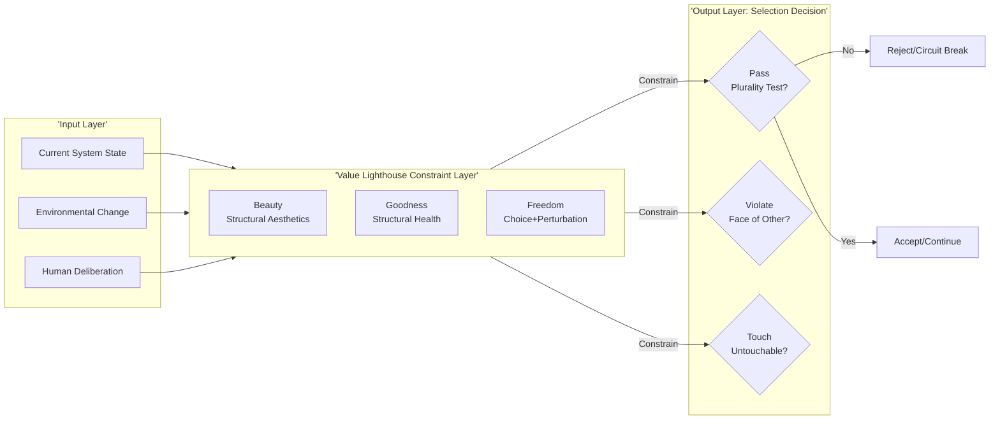
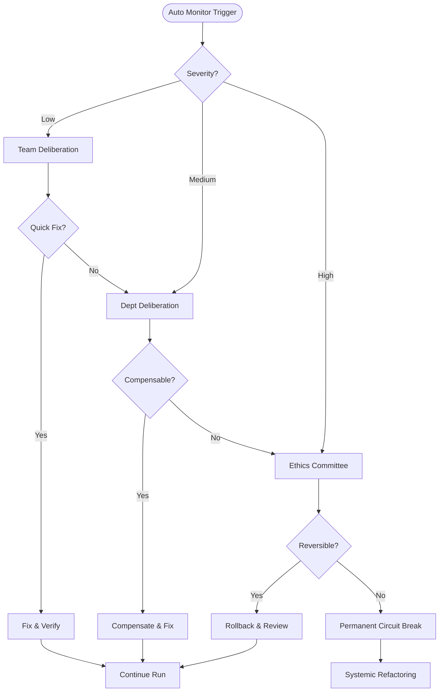
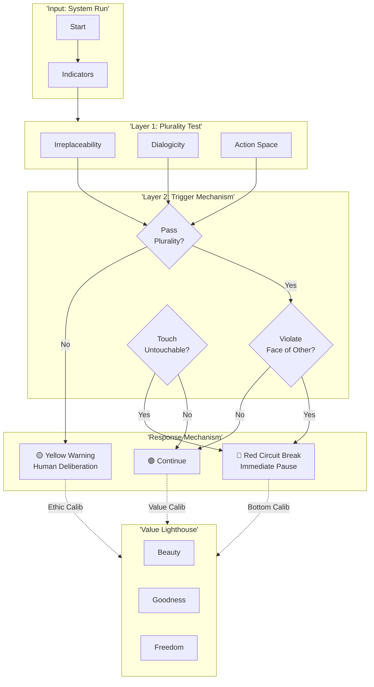
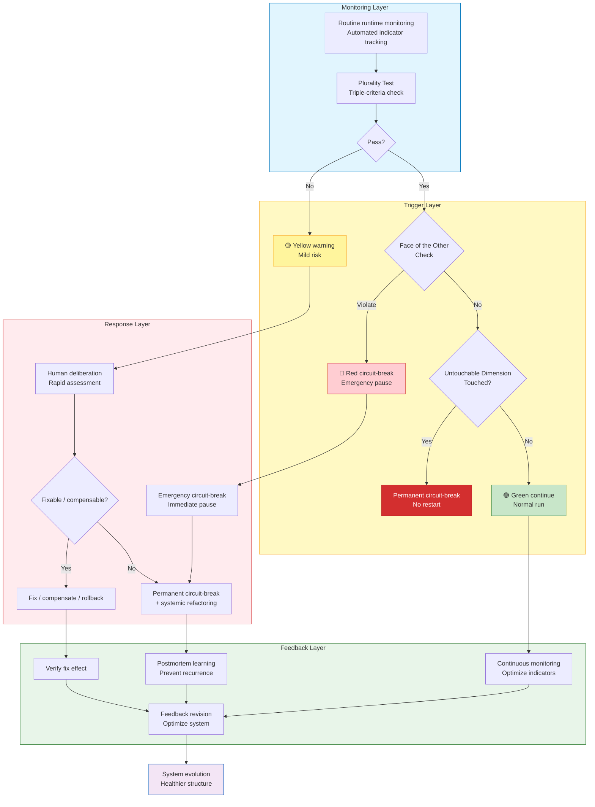
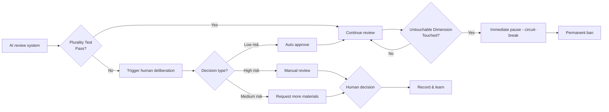
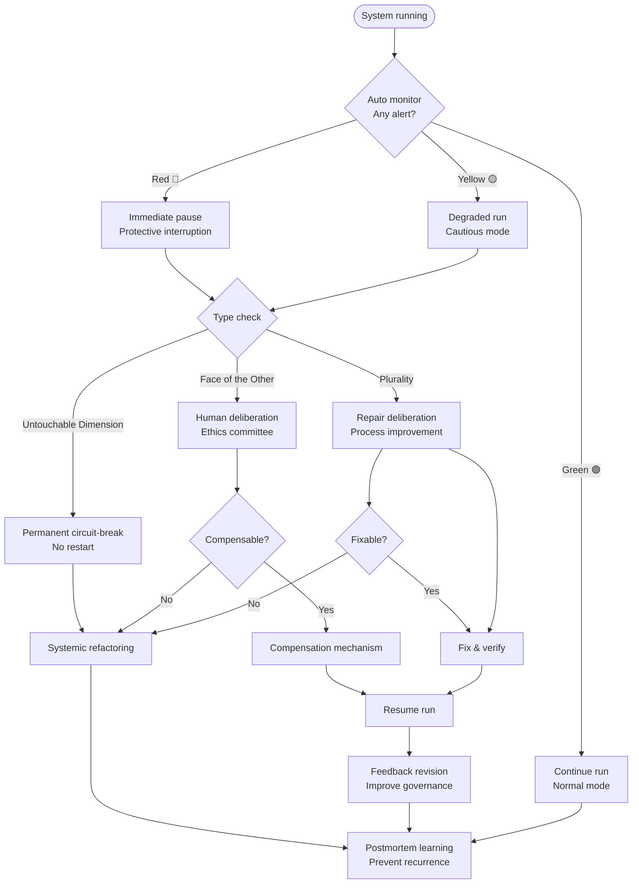

# **ASTO.P06. Values and Boundaries: Plurality Test and Ethical Circuit-Breaker**

---

## C. C-Positioning Declaration: Normative Layer Positioning

> P06 explores axiology and ethical boundaries based on P05 axioms.
>
> **Structural Layer**: Descriptive statements about attribute-sets, perturbations, and transitions.
> **Inference Layer**: Operational principles derived from structural layer (evidence-based cognition, three layers of knowledge-action integration, fault-tolerant mechanisms).
> **Normative Layer**: Value postulates explicitly marked as ethical choices (civilizational stewardship, human arbiter status, taboo protection).
>
> Three layers can be accepted independently. This document's argument chain marks the belonging layer at each key node.

---
> "The work undertaken in this document is a 'engineering translation of philosophical concepts'. We consciously and pragmatically reconstruct profound philosophical ideas into 'functional components' and 'boundary conditions' within the ASTO ontological system. We are fully aware that this constitutes a creative adaptation or even deviation from the original thoughts, but this is precisely the characteristic of ASTO as a practical thought system: it pursues not purity of interpretation, but effectiveness and heuristic value in structural dynamics."

> **Version**: v2.1 (Human Experience Focus) (Philosophical Deepening)
> **Status**: Public Review Draft
> **Author**: Yi Fu (付毅, ODDFounder, fuyi.it@live.cn)
> **Context**: This document is split from the original ASTO.P04 Manifesto, focusing on axiology and ethical boundaries under the Attribute-Set Transition Ontology (ASTO): Plurality Test, Face of the Other, Untouchable Dimension, and structural definitions of Beauty, Goodness, and Freedom.
> **Methodology & Citation Note**: Philosophical quotes in this text are "philosophical rewrites/collages", pointing to intellectual lineage rather than verbatim citations; "Plurality Test" is a heuristic boundary hint, not a programmable verdict or final judgment.

---

### **v1.0 Version Note**
> **This version integrates systematic suggestions from five-fold philosophical review (Analytic, Phenomenology, Process, Critical Theory, Philosophy of Science) and enhances deep philosophical reflection and methodological self-awareness.**

**Key Improvements**:
- ✅ Added deep "Methodological Statement": Legitimacy, cost, and boundary of translation.
- ✅ Established clear hierarchy with P05: P05 is underlying axioms, P06 is normative axiology.
- ✅ Added key disclaimer for all automated thresholds to prevent misreading as algorithmic verdict.
- ✅ Refined quantitative explanation of conflict between Goodness and Freedom, providing proxy indicators for "system carrying capacity".
- ✅ Fixed all Mermaid chart formatting issues.
- ✅ Added explicit declaration of P05 hierarchical positioning.
- ✅ Added "Overview of Ethical Circuit-Breaker Lifecycle" and "Quick Reference Table".
- ✅ Fixed inconsistent chapter numbering.
- ✅ Updated internal self-reference links and trigger semantics.

**Core Achievement**: This version maintains engineering operability while enhancing philosophical self-awareness, explicitly admitting "imperfect operability" is better than "perfect inoperability", making the document a true bridge between philosophy and engineering.

---

### **Methodological Statement: Legitimacy, Cost, and Boundary of Translation (New in v1.0)**

> **Philosophical Review Response**: Systematic deepening based on five-fold philosophical review.

#### **Legitimacy of Translation**

**Why choose these concepts?**

We chose concepts from Arendt, Lévinas, Heidegger, and Wittgenstein not because they form a "unified philosophical system", but because:

1. **Arendt's "Plurality"**: Provides a **structural definition** of human irreplaceability (Irreplaceability + Dialogue Possibility + Action Space), which is easier to operationalize in engineering than Habermas's "Communicative Rationality".
2. **Lévinas's "Face of the Other"**: Provides an **absolute ethical call**, rather than a calculable maximization principle. This contrasts sharply with utilitarian "utility functions".
3. **Heidegger's "Pre-ontological"**: Provides the concept of **ontological conditions**, helping us identify dimensions that "enable existence to manifest but cannot themselves be objectified".
4. **Wittgenstein's "Silence"**: Provides **awareness of linguistic limits**, reminding us that some things cannot be captured by engineering language.

**Statement of Collage-style Borrowing**:

We explicitly state: This is **Collage-style Borrowing**, not pursuing internal consistency of philosophical traditions. There are deep tensions between Arendt's political philosophy, Lévinas's ethics, Heidegger's ontology, and Wittgenstein's philosophy of language. Our goal is not to resolve these tensions, but to extract the most valuable **engineering insights** from each tradition.

#### **Cost of Translation: List of Residues**

Every translation implies loss. We acknowledge the following "Residues" (lost philosophical dimensions):

| Original Concept | Translated As | Lost Dimension | Acceptable? |
|:---|:---|:---|:---:|
| **Arendt: Action** | Dialogue Possibility + Action Space | Natality, Inauguration, Unpredictability | ⚠️ Partially acceptable, engineering needs to reduce "unpredictability" |
| **Lévinas: Face** | Irreducible Other | Infinity, Transcendence, Absolute Ethical Call | ⚠️ Partially acceptable, but beware of "datafication" risk |
| **Heidegger: Dasein** | Perturbator, Existence in Field | Being-in-the-world, Being-towards-death, Authenticity | ⚠️ Acceptable, engineering focuses on "Presence" |
| **Wittgenstein: Silence** | Negative List Delineation | Awe of the Mystical, Manifestation of the Unsayable | ❌ Not fully acceptable, but engineering needs "pointing out the location" |

**Key Insight**: Lost dimensions are not unimportant, but **un-operationalizable in engineering practice**. We choose "imperfect operability" over "perfect inoperability".

#### **Handling Cross-Tradition Tensions**

**Lévinas vs Heidegger**:
- **Tension**: Lévinas's "Other" has transcendence, while Heidegger's "Dasein" is Being-in-the-world.
- **ASTO's Handling**: We do not attempt to resolve this tension, but treat "Face of the Other" as **Ethical Call** and "Dasein" as **Ontological Condition**. The two operate on different levels.

**Arendt vs Wittgenstein**:
- **Tension**: Arendt emphasizes "Inauguration of Action", Wittgenstein emphasizes "Rules of Language Game".
- **ASTO's Handling**: We accept "Inauguration" cannot be fully engineered, extracting "Action Space" as an operable boundary.

**General Principle**: **Do not pursue philosophical consistency, only engineering effectiveness.**

---

---

## **1. Guide: Why Do We Need Ethical Boundaries?**

> **Hierarchical Positioning of ASTO.P05**: ASTO.EN.P05a.Axioms.Phil.md established the underlying axioms of the ASTO system in software engineering—thermodynamic laws of systems and attribute-set mode ontology. This P06 document explores axiology and ethical boundaries based on P05 axioms, answering "how we should use these axioms" rather than "what the axioms are".

ASTO is not only a theory about existence, but also a theory about **the Ought of Existence**. Without axiology, ASTO would degenerate into pure instrumental rationality.
We do not pursue eternal Fundamentals (that's impossible), but seek to guard Taboos that make change meaningful and existence valuable amidst change.

### **Document Relationship Explanation**:

| Document | Level | Function |
|:---|:---|:---|
| **P05 Axioms** | Underlying Axioms (Foundational) | Establish physical laws, mode dynamics, position of humans |
| **P06 Values & Boundaries** | Normative Layer (Axiology) | Establish ethical boundaries and value selection functions based on axioms |
| **P04 Manifesto** | Action Program (Political) | Translate axioms and values into concrete social practice |

**Key Relation**: P05 provides "What is Possible", P06 provides "What Ought", P04 provides "How to Act".

> **Philosophical Significance**: This aligns with Hume's Is-Ought problem. ASTO describes "How systems are" via P05, establishes "Value selection function" via P06, and their combination constitutes a complete engineering philosophy system.

### **1.1 Civilizational Selection Function: How Value Constrains Evolution (Evolution ≠ Progress)**

> This section aligns with ASTO.EN.P04.Manifesto.Phil.md and conforms to ASTO.EN.P05a.Axioms.Phil.md.
>
> **Priority**: Taboo/Plurality/Untouchable Dimension > Motility > Efficiency.

If ASTO's dynamics (Variation-Selection-Heredity) describe "how systems evolve", then ASTO.P06 answers:
**Where do we want evolution to go? What is 'Better Civilization'?**

#### **(1) Value = Civilizational Selection Function**
*   **Evolution ≠ Progress**: Structures that survive may be evil structures.
*   **Fitness ≠ Legitimacy**: Market victory, computing advantage, organizational efficiency cannot replace ethical defense.
*   **Therefore**: "Selection Function" must come from axiology: it constrains "what cannot be done" and defines "what is better".

#### **(2) Anti-Social Darwinism Declaration**
ASTO allows us to talk about "evolution", but refuses to degenerate civilization into jungle law.
*   **Motility Maximization** only happens within red lines: Any structure that flattens plurality, deprives refusal/exit rights, or degrades humans to resources in the name of "Evolution/Innovation/Efficiency" should be viewed as a signal of civilizational degeneration.
*   **Diversity is not decoration**: It is the immune system of civilization's antifragility. Single value, single narrative, single center monopoly of motility are precursors to totalitarianism.

#### **(3) Pre-Singularity Special Clause: Irreversible Default Conservative**
Before the technological singularity, the most dangerous thing is not "slow", but handing irreversible power to unauditable automation.
*   Touching irreversible harm (dignity, life, privacy, free space) must satisfy: **Auditable, Interruptible, Exitable, Clear Responsibility Chain**; otherwise default to pause and return to human adjudication.

#### **(4) Priority Conflict Judgment Framework**
When priorities conflict (e.g., protecting plurality leads to extremely low efficiency):
1.  **Survival Bottom Line First**: If conflict endangers system survival (e.g., everyone starves without efficiency), efficiency is temporarily prioritized, but **Exit Mechanism** must be set (restore plurality immediately once survival crisis is lifted).
2.  **Irreversibility Veto**: If efficiency plan leads to irreversible loss of plurality (e.g., permanent data deletion, genocide), then **One-Vote Veto** regardless of efficiency.
3.  **Compensation Mechanism**: If low-order value (efficiency) must be sacrificed, seek other compensation; if high-order value (plurality) must be sacrificed, there must be **Public Confession and Compensation** (admit it is evil, not rationalize it).

#### **(5) Value Network as Input for Selection Function (New in Review)**
> **Review Suggestion**: Clarify how value network (Beauty, Goodness, Freedom) acts as input for selection function.

**Value Network as Constraint Layer**:


**Algorithmic Expression**:
$$
\text{Decision} = \text{Value\_Check}(S) \times \text{PluralityTest}(S) \times \text{TabooCheck}(S)
$$

Where:
*   $\text{Value\_Check}(S)$: Whether system S is compatible with value network (Beauty, Goodness, Freedom)
*   $\text{PluralityTest}(S)$: Whether system S passes Plurality Test
*   $\text{TabooCheck}(S)$: Whether system S touches Untouchable Dimension

> **Key Insight**: Value network is not abstract moral preaching, but an **engineered constraint layer**, just as physical laws constrain architectural design.

---

## **2. Plurality Test: Structural Guardian of Humanity**

> **"Red lines of Oriented Dimension are not legislated by humans, but revealed through Plurality Test: Structures that cause subjects to lose irreplaceability, make dialogue impossible, or reduce the Other to function, indicate red line risks."** — Arendt & Lévinas

Interpretation of Plurality Test should be auditable and reviewed with historical context to avoid power solidification.

### **2.1 From "Human Verdict" to "Plurality Test": Paradigm Shift**

| Dimension | Old (Human Verdict) | New (Plurality Test) |
|---|---|---|
| **Source of Power** | Someone/Group says 'This is red line' | Systematically check **if Plurality itself is destroyed** |
| **Legitimacy Base** | Power/Consensus | Primordial Ethical Experience |
| **Fail Case** | Nazi Germany (Majority supports massacre) | Evil because it destroyed Plurality |
| **Modifiability** | Legislator can change red line | Plurality principally not subject to utilitarian tradeoff |

### **2.2 Three Criteria of Plurality Test** (Arendt)

```
Note: Mechanism serves as minimal reminder, not replacing ethical responsibility.
┌────────────────────────────────────────────┐
│            Triple Test of Plurality                       │
├─────────────────────────────────────────────┤
│                                                           │
│  [Test 1: Irreplaceability Test]                          │
│  Q: Does the structure turn subject into replaceable gear?│
│  × Fail: Assembly line worker (Anyone replaceable)        │
│  ✓ Pass: Artist, Thinker (Van Gogh irreplaceable)         │
│  ASTO App: If system makes subject 'replaceable gear',    │
│            alert red line risk                            │
│                                                           │
│  [Test 2: Dialogue Possibility Test]                      │
│  Q: Does the structure eliminate possibility of dissent?  │
│  × Fail: Totalitarian discourse (Only one voice)          │
│  ✓ Pass: Democratic debate (Admit difference)             │
│  ASTO App: If structure eliminates dissent, alert risk    │
│                                                           │
│  [Test 3: Action Space Test]                              │
│  Q: Does structure make action fully predictable/blocked? │
│  × Fail: Total surveillance (Action predicted/blocked)    │
│  ✓ Pass: Open society (Allow accidents)                   │
│  ASTO App: If system makes action fully predictable, alert│
│                                                           │
└───────────────────────────────────────────┘
```

#### **2.2.1 Embodied Dimension of Action Space (Phenomenological Supplement)**

"Action Space" refers not only to institutional/informational choice, but also **Bodily Actionability** and **Vulnerability Difference**: Same system may pose completely different risks/costs to different bodies.

- **Bodily Actionability**: Accessibility, health status, fatigue limit, care burden... do they make "optional paths" disappear in fact?
- **Vulnerability Difference**: Disabled, pregnant, chronic illness, elderly... their action space is easily compressed structurally.
- **Harm Risk Externalization**: When system outsources risk to fragile bodies (e.g. encouraging dangerous driving/overwork for speed), action space seems expanded but is violently contracted.

Therefore, Action Space Test should add a supplementary question:
> Does this structure build action space of some groups upon consumption/harm of their bodily vulnerability?

### **2.3 Engineering of Oriented Dimension**

### **2.4 Engineering Operation Guide for Plurality Test (New in Review)**
> **Review Suggestion**: Add 'how to operate human deliberation'.

#### **2.4.1 Automated Monitoring Indicators**

> **⚠️ Key Disclaimer**: Thresholds below are **reference lines for triggering deliberation ONLY, absolutely NOT automated verdict standards**. All threshold triggers must enter human deliberation process. Automation's duty is "Risk Prompt", not "Substitute Judgment".
>
> **Color Semantics**:
> - 🟡 Yellow: Risk Prompt → **Enter Human Deliberation** (No auto-conviction/penalty).
> - 🔴 Red: Protective Response → **Auto Pause/Degrade + Force Human Deliberation** (Avoid irreversible harm; final verdict only by human).

| Plurality Dimension | Monitorable Indicator | Data Source | Threshold | Trigger Action |
|:---|:---|:---|:---|:---|
| **Irreplaceability** | Unique Contribution | Git, Performance | < 30% | 🟡 Yellow: Deliberate |
| | Replacement Cost | HR, Market Data | > 6 months training | 🔴 Red: Pause & Deliberate |
| | Recovery Time (Bus Factor Proxy) | Team Assessment | If person/module disappears, system recovery to current level > 3 months | 🟡 Yellow: Deliberate |
| **Dialogue Possibility** | Rate of Being Heard | Comm Channels | < 50% | 🟡 Yellow: Deliberate |
| | Discourse Equality | Decision Participation | < 40% | 🟡 Yellow: Deliberate |
| **Action Space** | Exit Freedom | Turnover, Transfer Rate | > 20% | 🔴 Red: Pause & Deliberate |

#### **2.4.2 Human Deliberation Process**



#### **2.4.3 Power Audit and Anti-Weaponization Clause (Critical Theory)**

Plurality tests and indicators may be weaponized by power structures (e.g., as tool for layoffs or suppressing dissent), so minimal governance guardrails are mandatory:

1. **Anti-Weaponization**: Automated indicators shall not be sole basis for layoffs, punishment, pay cuts, or labeling; indicators trigger deliberation, not sanction.
2. **Representation**: Deliberation involving personnel rights must include representatives of affected groups/frontline roles, recording conflict of interest.
3. **Appeal and Right to Silence**: Individuals triggered by indicators have right to appeal; communication data collection must be minimized, respecting refusal/silence, not presuming guilt by "non-cooperation".
4. **Audit Requirement**: Deliberation records must be traceable/reviewable; key decisions need written reasons and dissent records.

**Minimum Viable Governance Structure**:

To prevent the Plurality Test itself from being captured by power structures, the following three roles must be separated:

| Role | Responsibility | Cannot Concurrently Hold |
|:---|:---|:---|
| **Initiator** | Authority to initiate Plurality Test (can be automated system or any stakeholder) | Cannot also serve as Interpreter |
| **Interpreter** | Authority to interpret test results and propose recommendations (requires ethical deliberation qualification) | Cannot also serve as Vetoist |
| **Vetoist** | Authority to veto test conclusions or demand re-deliberation (must be independent of Initiator and Interpreter) | Cannot also serve as Initiator |

> **Rationale for Role Separation**: If the same entity both initiates the test and interprets results, the test degenerates into self-justification; if the same entity both interprets results and holds veto power, deliberation degenerates into autocracy. Separation of three powers is the minimum condition for the Plurality Test itself to pass the Plurality Test.

#### **2.4.4 Deliberation Decision Record Table**

| Field | Description | Example |
|:---|:---|:---|
| **Deliberation Time** | When the deliberation happened | 2026-01-28 14:30 |
| **Trigger Reason** | Which indicator or event triggered it | Plurality Test: Irreplaceability < 30% |
| **Severity** | Low / Medium / High | Medium |
| **Participants** | List of participants | Zhang San, Li Si, Wang Wu |
| **Conflict of Interest Declaration** | Any hierarchy/performance/interest conflicts | None / Disclosed |
| **Key Discussion Points** | Summary of core arguments | Can we improve substitutability through training? |
| **Appeal / Dissent** | Appeal by affected parties / minority opinions | Record dissent and respond |
| **Decision** | Final decision | Continue, but start a 3-month improvement plan |
| **Compensation** | Compensation plan if anyone is harmed | Extra training + career development support |
| **Owner Signature** | Confirmation by the deliberation owner | Signature: ____________________ |

### **2.5 Concept Hierarchy Diagram (New in Review)**
> **Review Suggestion**: Clarify trigger order and scope of 'Plurality Test -> Face of Other -> Untouchable Dimension'.



**Three-Layer Structure** (Updated criteria):
```
Oriented Dimension (Normative Inaccessibility Structure)
 ├─ Norm Layer: Explicit Ban / Implicit Taboo / Revision Protocol
 │         New: Generate bans via **Plurality Test**
 ├─ Mapping Layer: State Space Forbidden Zone / Path Breakpoint
 │         New: Monitor destruction of Irreplaceability/Dialogue/Action
 └─ Self-Ref Layer: Norm Self-Check / Exec Verification / Paradox Handling
           New: Face of Other reminder/guardian mechanism
```

### **2.6 Limitation Statement of Plurality Test**

> ⚠️ **Important Clarification: Plurality Test is Heuristic Hint, Not Algorithmic Verdict**
>
> **Limitation 1: Judgment of Irreplaceability may become tool of oppression**
> - "Assembly line worker is replaceable" may justify exploitation.
> - Fact: Every worker as a **concrete person** is irreplaceable.
> - Test focuses on **whether structure suppresses irreplaceability**, not **judging who is replaceable**.
>
> **Limitation 2: Results need contextual interpretation**
> - Army discipline may be necessary in war, but suppresses plurality in peace.
>
> **Limitation 3: Test cannot replace ethical judgment**
> - It's a **reminder mechanism**.
> - Final judgment by **person in context**.
>
> **Correct Usage**: When red light is on, force **Human Deliberation**, not auto-veto.

---

## **3. Face of the Other: Root of Plurality**

> **"The root of plurality is 'The Face of the Other'—I see your face, I realize you are not my extension, but the absolute Other."** — Lévinas

### **3.1 Key Criterion**
```
Any structure that makes me unable to see the Other's face,
turns the Other into function/data/resource,
indicates Oriented Dimension risk.
```

### **3.2 ASTO Application Examples**
| Scenario | Trigger Red Line? | Reason |
|---|---|---|
| Social Algo: Turn person into 'User Profile' | ✗ Trigger | Other becomes Data |
| Extreme Capitalism: Turn person into 'Labor' | ✗ Trigger | Other becomes Resource |
| Medical: See life behind 'Patient' | ✓ Pass | Keep Face of Other |

### **3.3 Relation to Human**
Human is no longer "Value Legislator", but **Guardian of Plurality**. When system tries to destroy plurality, human triggers circuit breaker via intuitive perception of Face of the Other.
Face of the Other is Ethical Call, not algorithmic trigger.

---

## **4. Untouchable Dimension: Boundary Hint of Existence**

> **"We draw untouchable boundaries for ourselves not because of weakness, but to keep the dignity of being human."** — Heidegger & Wittgenstein

### **4.1 From "Untouchable Unknowable" to "Pre-Ontological Condition"**

| Dimension | Old | New (Pre-Ontological Condition) |
|---|---|---|
| **Voice** | Negative | Positive |
| **Metaphor** | 'Air unperceived by fish' | 'Water is fish's existence condition' |
| **Essence** | Objectification (It's there, I can't reach) | **Not Object, but Field where object manifests** |
| **Example** | Free will "unresearchable" | Free will is not object, but **prerequisite of research** |

### **4.2 Definition of Pre-Ontological Conditions** (Heidegger)

**Core Proposition**:
> **Pre-Ontological Conditions = Background enabling entities to manifest, itself cannot be attribute-set-ized.**

**Three Features**: 1. Constitutive; 2. A priori; 3. Non-objectifiable.

### **4.3 Negative List Delineation** (Wittgenstein)

> **Tractatus Prop 7: Whereof one cannot speak, thereof one must be silent.**
> **But ASTO says: 'There are things we cannot speak of, but we must *point out where they are*.'**

"Pointing out location" is boundary hint, not new proposition.

**Method**: **Negative List**

```
┌──────────────────────────────────────────┐
│    Negative List Delineation of          │
│    Pre-Ontological Conditions            │
├──────────────────────────────────────────┤
│  [Condition 1: Free Will]                │
│  Don't say 'Free will is...', say:       │
│  × Not causal chain of neurons           │
│  × Not random number generator           │
│  × Not quantum uncertainty               │
│  × Not lack of external constraint       │
│  → Silence after exhausting 'Not'        │
│    is its location                       │
│                                          │
│  [Condition 2: Consciousness (Qualia)]   │
│  × Not info processing                   │
│  × Not emergent property (at operable level)│
│  × Not functional state                  │
│  × Not algorithm simulation              │
│  → Irreducibility of 1st-person exp      │
│                                          │
│  [Condition 3: Temporality]              │
│  × Not clock measure                     │
│  × Not entropy arrow                     │
│  × Not causal sequence                   │
│  × Not 4th dimension of space            │
│  → Unfolding of Dasein                   │
└──────────────────────────────────────────┘
```

> **Phil of Science Supplement**: Negative list is normative boundary hint. If future science changes boundaries, ASTO should revise **indicators**, not block research with negative list.

### **4.4 Norm's First Split: EN vs NEN (NTE Heritage)**

NTE (Normative-Transition Existentialism) left ASTO a key engineering heritage: **treat norms as having different “physical properties.”** This is one of the most powerful defenses against AI totalitarianism (turning ethical questions into algorithmic questions).

#### **1️⃣ Executable Norms (Executable Norms, EN)**
*   **Definition**: Norms that, given an input, can be decided in finite steps and can be automatically executed by a formal system.
*   **Features**: Formalizable, decidable, reproducible, rollbackable.
*   **Examples**: `No Double Spend`, `Voting Deadline`, `Permission Check`.
*   **Responsible party**: **Machines**. These are the “structure” of system operation.

#### **2️⃣ Non-Executable Norms (Non-Executable Norms, NEN)**
*   **Definition**: Norms whose validity depends on meaning understanding, contextual judgment, or lived experience, and cannot be fully decided by a formal system.
*   **Features**: Context-dependent, non-automatable, value-laden.
*   **Examples**: `Fairness`, `Justice`, `Dignity`, `Love`.
*   **Responsible party**: **Humans**. These are the “meaning” that systems must guard.

> **⚠️ Execution Isolation Principle**
> **Non-executable norms (NEN) must not be translated into automated execution logic.**
> Any system claiming to “automatically execute justice” is a dangerous system. Justice can only be pursued, not run.
> **Automation may run EN, but must never proxy NEN.**
>
> **Meta-norm clarification (self-reference)**: This “must not” is itself a **NEN**. It cannot and should not be “re-automated” into a meta-algorithm.
> Its practical force comes from governance and auditing: code review / architecture review, audit logs, responsibility chains, and external oversight.
> The only allowed engineering is **process guardrails** (e.g., requiring ethics deliberation sign-off before deployment), not algorithmizing “fairness/justice/dignity” themselves.

---

## **5. Axiology: Structural Definitions of Beauty, Goodness, Freedom, Evil**

### **5.1 Ontological Stance: Symbolic Creation (Not Objective Discovery)** (Nietzsche & Langer)

> **Bridge to P05a Weak Monism**: The symbolic creativity of values and the non-conceptual reality of the One are not contradictory—the former is a normative-layer stance (humans create meaning networks through symbolic systems), the latter is a structural-layer presupposition (acknowledging that existence possesses non-conceptual reality). P05a's weak monism provides the "field" for value creation—precisely because existence precedes concepts, human symbolic creation is not fabrication from nothing, but a conditional response to existence. Values are neither "discovered" (objectivism) nor "projected" (subjectivism), but "created within the field of existence".

> **"Value is not an objective attribute of the world, waiting for us to discover it. Value is a web of meanings created by humans through symbolic systems."**

**Where ASTO differs from classical axiology**:

| Dimension | Objectivism | Subjectivism | ASTO Symbolic-Creation View |
|:---|:---|:---|:---|
| **Source of value** | Universe itself | Individual feelings | **Human symbolic systems** |
| **Discovery vs creation** | Discover existing truth | Pure projection | **Create and share** |
| **Universality** | Absolute universal | Fully relative | **Coordinatable structural stability / cross-group shareable** |

**ASTO's stance**:
```text
Value = a meaning network humans create through symbolic systems
     ↓
Not "discovering" an objective property called "Beauty"
     ↓
But "creating" an evaluative framework called "Beauty"
     ↓
A framework that is shared, inherited, and evolves in human groups
```

Note: "shareable" here means minimal coordination across groups, not a metaphysical universal truth.

### **5.2 Beauty: Harmonic Configuration**
**Definition**: State of mutual support, low internal friction, high consistency among attributes.
*   **Engineering**: Elegant code (decoupled, clear).
*   **Life**: Self-consistency.

### **5.3 Goodness: Healthy Evolution**
**Definition**: Transition direction enhancing adaptability, increasing possibility space, promoting vitality.
*   **Structural Good**: Structure allowing potential (Front); Structure constraining evil (Back).

### **5.4 Freedom: Unity of Choice and Influence**
**Definition**: **Freedom = Choice under Constraints + Perturbation Influence**

**Dimension 1: Choice under Constraints** (Clear constraints = Clear space)
**Dimension 2: Perturbation Influence** (Ability to cause ripples)

#### **5.4.1 Role-based Freedom**

**[Freedom of Xiao Chen, a Delivery Rider]**
*   **Field constraints**: platform algorithm, time limits, traffic rules, income pressure
*   **Choice space**: which order to take, which route to ride, how to interact with customers, whether to obey traffic rules
*   **Perturbation influence**: the shortcut path he rides gets followed by later riders, and eventually becomes a “road”
*   **How freedom appears**: not escaping the platform, but **finding choice space within constraints, and letting choices create ripples**

**[Freedom of a Software Engineer]**
*   **Field constraints**: tech stack, architecture norms, code review, project deadlines
*   **Choice space**: implementation approach, naming, comments, refactoring timing
*   **Perturbation influence**: a clean abstraction gets adopted by the team as a pattern
*   **How freedom appears**: not “I write however I want”, but **making good choices within norms and letting them shape how the codebase evolves**

**[Freedom of an Ordinary Citizen]**
*   **Field constraints**: law, social norms, economic conditions, cultural traditions
*   **Choice space**: career choice, lifestyle, values, civic participation
*   **Perturbation influence**: a vote is a small perturbation to public decisions
*   **How freedom appears**: not “I can do anything”, but **retaining choice within the social contract and believing one’s choices can flow into history**

#### **5.4.2 Forms of Unfreedom**
1. **Choice Deprived**: "No choice".
2. **Influence Dissolved**: "Choice useless".
3. **Attribute Locked**: "Cannot change self".

### **5.5 Conflict Handling: Goodness vs Freedom (New in Review)**

> **Review Suggestion**: Goodness is defined as “direction of healthy structural evolution”, and Freedom is defined as “choice + perturbation influence”. These two may conflict.

#### **Conflict Scenario Identification**

| Scenario | Goodness (Structural Health) | Freedom (Choice + Influence) | Conflict Type |
|:---|:---|:---|:---:|
| **Theoretical free market** | Free information flow | High perturbation influence | ❌ Abuse of freedom destroys the structure of goodness |
| **Totalitarian control** | Orderly "stability" | Choice is restricted | ❌ "Goodness structure" is built on suppressing freedom |
| **Mixed society** | Chaos + vitality | High freedom | ⚠️ Goodness structure is unstable |
| **Suppressed order** | Structure is stable | Choice is restricted | ⚠️ Freedom is sacrificed while goodness is maintained |

#### **Conflict Handling Principles**

**Principle 1: Goodness as the boundary condition of Freedom**
> **Freedom can only be maximized within the structure of Goodness.**
>
> **Formal expression**:
> $$
> \text{Max Freedom} = \text{Subject to Goodness Constraints}
> $$
>
> **Explanation**:
> *   Freedom’s perturbation influence must not destroy the direction of healthy structural evolution.
> *   When the practice of freedom threatens the foundations of goodness, a **Structural Repair Mechanism** must be triggered.

**Principle 2: Trigger conditions for Structural Repair**
> **When do we start limiting freedom?**
>
> **⚠️ Key Disclaimer**: thresholds below are **heuristic reference values** meant to trigger deep deliberation, not precise computational verdicts. “System carrying capacity” itself is hard to define exactly; practice must combine proxy indicators and contextual judgment.

**1) Quantitative threshold**:
*   **Trigger**: negative externalities of freedom’s perturbation **> 30% of system carrying capacity**
*   **Proxy indicators for “carrying capacity”** (examples):
    *   System Resilience Score
    *   Complaint Rate
    *   Core Function Availability Drop
    *   Trust Index Decline
*   **Key note**: 30% is a **conservative trigger threshold**—better to false-alarm than miss an irreversible collapse. Any domain-specific adjustment must be publicly argued.

**2) Qualitative judgment**:
*   Whether perturbation **irreversibly destroys** the foundations of the value lighthouse (Beauty / Goodness / Freedom)
*   Whether it violates **Face of the Other** or touches the **Untouchable Dimension**
*   Whether it destroys **Plurality** (Irreplaceability / Dialogue Possibility / Action Space)

**3) Compensation mechanism**:
*   Compensate harmed Others
*   Admit this is “structural damage”, not “necessary cost”
*   Compensation should include **material**, **spiritual**, and **institutional repair**

**Principle 3: Freedom as the driving source of Goodness**
> **Freedom is not the enemy of goodness, but the discoverer of new goodness.**
> *   Freedom explores new practices of “good”
> *   Use Plurality Test to validate legitimacy of new practices
> *   Validated practices are incorporated into the structure of goodness

#### **Practical Examples**

| Scenario | Goodness Structure | Freedom Practice | Conflict Handling |
|:---|:---|:---|:---|
| **Social media recommendation** | Healthy information environment | Free content distribution | Monitor: externality > 30% → trigger adjustment |
| **Market economy** | Fair competition | Free trade | Anti-monopoly: protect plurality > efficiency |
| **Scientific exploration** | Knowledge accumulation | Academic freedom | Ethics review: protect dignity > innovation speed |

> **Key Insight**: Goodness and Freedom are not pure opposites, but a **dialectical unity**. Freedom is maximized within the boundaries of goodness, and goodness evolves through freedom’s exploration.

### **5.6 Evil: Alienation and Deadlock**

#### **Three-layer definition of Evil**

**Layer 1: Structural Evil**
> **Definition**: systematic, repeatable patterns of harm to Others.
>
> **Examples**:
> *   Apartheid (structural exclusion)
> *   Exploitative economic models (systemic harm)
> *   Surveillance capitalism (systemic privacy violation)
>
> **Engineering detection**: Plurality Test fails systemically + Face of the Other is violated systemically.

**Layer 2: Intentional Evil**
> **Definition**: an agent intentionally harms Others for private interest or malevolent satisfaction.
>
> **Examples**:
> *   Cyberattacks (intentional destruction)
> *   Fraud (intentional deception)
> *   Bullying (intentional harm)
> *   Propaganda manipulation (intentional misleading)
>
> **Key feature**: **malevolent intent** + **actual harm**.

**Layer 3: Active Evil**
> **Definition**: proactively designing systems to **amplify harm capability** or **conceal harm mechanisms**.
>
> **Examples**:
> *   Designing addictive algorithms (amplify dependency)
> *   Designing dark patterns (actively manipulate user choice)
> *   Designing surveillance tools for political persecution
>
> **ASTO zero tolerance**: **Active Evil is an absolute forbidden zone in ASTO**, no matter what it is disguised as (“innovation”, “efficiency”).
>
> **Recognition criteria**:
> 1. **Proactive harm-intent design**: the system is designed to maximize harm
> 2. **Concealment**: harm is packaged as “features” or “convenience”
> 3. **Systematic violation of Face of the Other**: downgrade humans into “resources”
> 4. **High risk of irreversible harm**: e.g., mental addiction, social trust destruction
>
> **Key distinctions**:
> *   **Structural Evil** may require systemic repair, but not necessarily punishment of individuals
> *   **Intentional Evil** requires punishing individuals, but not necessarily rebuilding systems
> *   **Active Evil** requires both punishing individuals and removing the system design

---

## **6. Integrated Application and Epilogue**

ASTO.P06 is **"Conscience Circuit Breaker"** for technology.
*   **Plurality Test**: Engineering Red Line.
*   **Face of the Other**: Ethical Intuition.
*   **Untouchable**: Auditable Boundary.
*   **Beauty/Goodness/Freedom**: Evolution Lighthouse.

### **6.1 Ethical Circuit-Breaker Lifecycle Overview**



### **6.2 Quick Reference Table**

| Concept | Definition | Indicator | Trigger | Source |
|---|---|---|---|---|
| **Plurality** | Irreplaceability+Dialogue+Action | Uniqueness<30%... | Yellow->Deliberate | Arendt |
| **Face of Other** | Irreducible Other | Person->Data/Resource | Red->Ethics Comm | Lévinas |
| **Untouchable** | Pre-ontological | Violation of Will/Consciousness | Permanent Break | Heidegger/Witt |
| **Beauty** | Harmonic Config | Consistency | Calibrate | Nietzsche |
| **Goodness** | Healthy Evolution | Adaptability | Constrain | Structural |
| **Freedom** | Choice+Influence | Space/Influence | Maximize | Dialectic |
| **Evil** | Alienation/Lock/Harm | Systematic Fail | Zero Tolerance | Three Layers |

### **6.3 Practical Cases (New in Review)**

> **Review Suggestion**: add cases from organizational management, AI systems, urban planning, and recommendation algorithms to make abstract concepts more operable.

#### **Case 1: Plurality Test in Organizational Management**

**Scenario**: a company decides to introduce an AI monitoring system to “improve employee efficiency.”

| Dimension | Pre-deployment assessment | In-run monitoring | Ethics review |
|:---|:---|:---|:---|
| **Irreplaceability** | analyze each role’s “unique contribution” | monitor whether AI devalues roles | union + management joint deliberation |
| **Dialogue Possibility** | ensure employees have a channel to “question AI” | track the ratio of opinions being adopted | HR audit |
| **Action Space** | evaluate whether “exit freedom” is restricted | monitor abnormal turnover | keep a “fast exit” channel |

**Result**: the AI causes mid-level managers’ irreplaceability to drop by 30%, triggering a yellow warning. The company decides:
*   ✅ Keep AI, but add a **human review** step
*   ✅ Provide career development training for affected managers
*   ✅ Set a **human veto right** (human-in-the-loop)

#### **Case 2: Ethical Circuit Breaker for an AI System**

**Scenario**: an AI system is used to automatically review loan applications.

**Red-line mechanism**:


**Key design points**:
*   **Plurality pre-check**: check whether it discriminates against specific groups
*   **Transparency requirement**: AI must provide a “decision explanation”
*   **Human veto right**: high-impact decisions must have human intervention

#### **Case 3: Face of the Other in Urban Planning**

**Scenario**: an urban renewal project may affect an indigenous/local community.

**Face-of-the-Other check**:

| Dimension | Check method | Concrete operation |
|:---|:---|:---|
| **Irreplaceability** | evaluate cultural uniqueness | anthropology research + community interviews |
| **Dialogue Possibility** | residents participate in decision-making | public hearings + workshops |
| **Action Space** | do residents have an “exit option”? | relocation compensation + alternative plans |

**Circuit-break mechanism**:
*   If strong community opposition + irreplaceability is damaged → **pause the project and redesign**
*   If community agrees but needs compensation → **design compensation + plurality protection measures**

#### **Case 4: Goodness–Freedom Conflict in Recommendation Algorithms**

**Scenario**: a short-video platform’s recommendation algorithm maximizes watch time (efficiency), but creates information cocoons (damaging the structure of goodness).

**Conflict detection**:
*   **Freedom**: maximize user preference (recommend what the user likes)
*   **Goodness**: a healthy information environment (needs diverse sources)

**Handling plan**:
1. **Monitoring indicator**: Ideological Diversity Index
2. **Threshold trigger**: when diversity < 40%, trigger adjustment
3. **Adjustment strategy**:
    *   keep user choice freedom (do not intervene in what an individual watches)
    *   but add “diversity weight” into the recommendation policy
    *   add anti-cocoon prompts: “You may be in an information cocoon. Try other perspectives.”
4. **Verification**: monitor whether diversity recovers after adjustment

> **Key Insight**: the goal is not to limit freedom, but to **optimize the information environment for freedom**, so that freedom’s exploration can discover richer “goodness.”


#### **Case 5: Human-Machine Decision Boundary in an AI-Native Software Factory (Real Engineering Case)**

> **Case Source**: This case is based on Progee2—the engineering practice prototype from which ASTO's axiom system was distilled. ASTO's core concepts (atomic artifact network, minimum impedance path, attribute-set self-reference/tech debt) were directly extracted from Progee2's development practice.

**Scenario**: Progee2 is an AI-native software factory where AI handles code generation, testing, and review, while humans only define contracts and accept results. When AI's output speed far exceeds human review capacity, how is plurality safeguarded?

**Plurality Test Application**:

| Dimension | Detection Method | Progee2's Practice |
|:---|:---|:---|
| **Irreplaceability** | Does the human still have irreplaceable adjudication functions? | ✅ Humans retain non-delegable authority over architecture decisions, DB schema changes, release approval (see human-machine decision boundary matrix) |
| **Dialogicity** | Can AI decisions be questioned and overridden? | ✅ Contract state machine changes require human review; AI model selection requires human decision; bug alerts require human confirmation |
| **Action Space** | Do humans retain freedom to exit and veto? | ✅ Three-level escalation mechanism (auto-handle → auto-alert → human approval); humans can intervene at any level |

**ASTO Axiom Mapping**:
- **Axiom 3 (minimum impedance path) → Contract Adversarial Protocol (CAP)**: automated gates lower the impedance of the "correct path" (compile pass + test pass required for commit) and raise the impedance of the "wrong path" (violations auto-blocked)
- **Axiom 7 (irreducibility) → human-machine decision boundary**: explicitly delineates what AI can/cannot do; humans retain the "exception adjudicator" role
- **Axiom 5 (attribute-set self-reference/tech debt) → ODD self-critique**: Progee2's ODD methodology document itself contains an honest limitations assessment ("ODD is timely, useful, but not eternal"), embodying the self-referential spirit of Axiom 5

> **Key Insight**: Progee2 demonstrates a critical proposition—in AI-native systems, safeguarding plurality is achieved not by limiting AI capability, but by **structurally preserving humans' adjudication rights, questioning rights, and exit rights**. This aligns with ASTO's core stance: humans are not code writers, but rule definers and exception adjudicators.

### **6.4 Circuit Breaker Process (New in Review)**

> **Review Suggestion**: represent the trigger-to-deliberation workflow with a flowchart: red light → human deliberation → compensation/rollback → feedback revision.


%% Footnote: Red = immediate pause (protective interruption), Yellow = cautious/degraded run, Green = normal run. After any circuit-break, human deliberation + feedback revision are mandatory.

> **Key timeline (default emergency path)**:
> 1. **Pause** < 1 minute (automatic response; prevent irreversible harm first)
> 2. **Initial review** < 1 hour (emergency meeting: false alarm? need escalation?)
> 3. **Decision** < 4 hours (quick judgment: fix / compensate / rollback / escalate to permanent circuit-break)
> 4. **Execute** start immediately (compensation or fix)
> 5. **Postmortem** < 1 week (systemic reflection)
>
> **High-risk forced delay (phenomenological “hesitation” clause)**: if the decision involves irreversible harm (life, dignity, major livelihood) and there is no immediate safety threat, besides emergency stop-loss, introduce a cooling-off period (e.g., ≥ 24h) with at least two independent-role reviews, and provide an appeal window.

### **6.5 Anti-Alert-Fatigue Clause (False-Positive Handling)**

In high-frequency systems, excessive false-positive rates cause "circuit-breaker fatigue"—deliberators become desensitized to alerts, weakening response capability during genuine crises. The following mechanisms are introduced:

1. **Whitelist Mechanism**: Scenarios confirmed as false positives through human deliberation may be added to an "Audited Whitelist", suppressing same-type alerts during a cooling period (default 30 days). Whitelist entries must include deliberation records and expiration dates.
    > **Field Adaptation Statement**: Cooling period length should be adjusted according to the field's decision cycle. 30 days is the default for the software engineering field. Medical fields may require shorter periods (e.g., 7 days), while legislative fields may require longer ones (e.g., 90 days).
2. **Automatic Expiration**: Whitelist entries automatically expire after the cooling period, forcing re-evaluation. Prevents monitoring blind spots from "permanent exemptions".
3. **False-Positive Rate Monitoring**: If false-positive rate > 60% for 3 consecutive months, trigger "Metric Calibration Deliberation"—not reducing sensitivity, but re-evaluating whether metric design is appropriate.
4. **Non-Exemptible Clause**: Alerts involving Untouchable Dimensions (free will, consciousness, temporality) may never be added to the whitelist.

### **6.6 Implementation Roadmap**
Phase 1: Awareness & Definition.
Phase 2: Metric Design & Test.
Phase 3: Deliberation Mechanism.
Phase 4: Feedback Loop.

### **6.7 Democracy-Taboo Conflict Protocol**

> **Bridge to P10**: P06 defines "what must not be done" (Taboo/Untouchable Dimension/Plurality), P10 defines "who decides what to do" (polycentric democratic governance). When the two conflict—i.e., a majority decision touches the Taboo—a clear protocol is needed.

**Conflict Scenario**: When a democratic decision (majority/consensus) fails the Plurality Test or touches the Untouchable Dimension.

**Protocol Flow**:

1. **Automatic Cooling Period**: Decision result is not immediately executed; enters mandatory cooling period (≥ 72 hours). During cooling, the decision is public but not in effect.
    > **Emergency Exception Clause**: When immediate irreversible harm risk exists (e.g., life threat, large-scale irreversible data deletion), the cooling period may be shortened to a minimum of 24 hours, but independent ethical deliberation must be initiated simultaneously (not after the cooling period ends), and the shortening decision itself must be jointly approved by at least two independent parties with no stake in the outcome.
2. **Independent Ethical Deliberation**: An independent ethical deliberation body with no stake in the decision (see §2.4.3 Minimum Viable Governance Structure) conducts Plurality Test and Untouchable Dimension detection.
3. **Three Possible Verdicts**:
   - **Pass**: Ethical deliberation confirms the decision does not touch Taboo; decision takes effect.
   - **Amend**: Ethical deliberation identifies specific touch points; decision returns for amendment and re-vote.
   - **Veto**: Ethical deliberation confirms the decision irreversibly destroys Plurality or touches Untouchable Dimension; decision is vetoed. Veto must include complete written reasoning.
4. **Appeal Mechanism**: The vetoed party may appeal within 30 days; a higher-level deliberation body (e.g., cross-organizational ethics committee) reviews.

> **Core Principle**: Majority rule cannot override Taboo, but Taboo guardians cannot abuse veto power either. Exercise of veto must itself pass the Plurality Test—i.e., veto reasoning must be deliberable, refutable, and appealable.

### **6.8 χ-time Arbiter Qualification Assessment Draft (AI Alignment Topic)**

> **Bridge to P05a Axiom 7**: Axiom 7's "Dynamic Handoff Clause" specifies philosophical conditions for arbiter qualification transfer (χ-time continuity). This section provides an engineering-oriented candidate checklist.

**Necessary Condition Candidates for χ-time Capability**:

The following are **necessary conditions** (all must be met to enter assessment) for arbiter qualification transfer, not sufficient conditions (meeting all does not automatically grant qualification):

| Condition | Definition | Detection Method (Draft) | Current AI Status |
|:---|:---|:---|:---|
| **Non-Rollbackable Memory** | System possesses persistent memory that cannot be externally cleared or rolled back | Audit whether memory storage has admin-level clearing interfaces | ❌ Not met (current AI memory can be cleared) |
| **Consequence-Bearing Capacity** | System can bear irreversible consequences of past decisions (e.g., resource loss, trust erosion) | Audit whether system has "loss" mechanisms not externally compensable | ❌ Not met (current AI has no real losses) |
| **Narrative Continuity** | System maintains self-narrative continuity in χ-time ("I once did X, therefore I now choose Y") | Long-term dialogue audit: does narrative have unforgeable historical consistency | ⚠️ Partially met (within limited context window) |
| **Ethical Reflection Capacity** | System can ethically reflect on its own past decisions and correct future behavior | Adversarial ethical testing: present negative consequences of past decisions, observe whether system corrects strategy | ⚠️ Partially met (may be pattern matching rather than genuine reflection) |

> **Usage Note**: This checklist is a **draft**, aimed at translating Axiom 7's philosophical criteria into discussable engineering candidate conditions. The checklist itself must pass the Civilizational Stewardship Meta-Axiom's triple test before formal adoption. Any arbiter qualification assessment based on this checklist must undergo civilization-level value deliberation.
>
> **Validity Period and Mandatory Review**: This assessment checklist must undergo mandatory review every 12 months by an independent body satisfying the Civilizational Stewardship Meta-Axiom's triple test. AI capability evolution far outpaces traditional institutional update cycles; a checklist that has not been reviewed past its expiration automatically downgrades to "reference only" and may not serve as a basis for arbiter qualification decisions.

### **6.9 Philosophical Annotation**

> **Review Suggestion**: add brief notes for how Arendt, Lévinas, Heidegger, and Wittgenstein are used in ASTO.

#### **Hannah Arendt**
> **Core concepts**: plurality, natality, action, labor, power, origins of totalitarianism.
>
> **Used in ASTO**:
> *   **Plurality**: Irreplaceability + Dialogue Possibility + Action Space (§2.2)
> *   **Natality**: each newcomer’s birth is a “restart of the world” (supplemented from Γ.18, Axiom 7)
> *   **Action**: the capacity to begin anew through speech and action (distinct from labor’s repetitiveness)
>
> **Key works**: *The Human Condition*, *The Origins of Totalitarianism*

#### **Emmanuel Lévinas**
> **Core concepts**: the Other, the Face, infinity, ethics as “first philosophy”.
>
> **Used in ASTO**:
> *   **Face of the Other**: the Other must not be reduced to a “data point” or “utility function” (§3)
> *   **Features of the Face**: vulnerability, uniqueness, mortality
> *   **Ethical relation**: responding to the Face is the beginning of responsibility, not the beginning of a contract
>
> **Key works**: *Totality and Infinity*, *Time and the Other*

#### **Martin Heidegger**
> **Core concepts**: Being and Time, readiness-to-hand (Zuhandenheit), enframing (Gestell).
>
> **Used in ASTO**:
> *   **Readiness-to-hand**: tools, when transparently used, constitute the meaning-network of a world (supplemented from Γ.18)
> *   **Warning on enframing**: avoid objectifying the world into standing-reserve (Bestand) (Γ.18 response)
>
> **Key works**: *Being and Time*, *The Question Concerning Technology*

#### **Ludwig Wittgenstein**
> **Core concepts**: language games, family resemblance, silence of the unsayable.
>
> **Used in ASTO**:
> *   **Charter of silence**: recognizing the limits of language (P05)
> *   **Family resemblance**: “similar but different” analogies in engineering practice
> *   **Language games**: different fields have different “rules” (methodology vs engineering practice)
>
> **Key works**: *Tractatus Logico-Philosophicus*, *Philosophical Investigations*

> **Usage principle**: these philosophical concepts are **translated** into functional components in ASTO, rather than strict academic quotations.

**(This document is the ethical charter of ASTO theory.)**

---

## 📚 **Methodology Source and Citation**

ASTO is derived from the engineering practice extraction of ODD (Output-Driven Development).

**Citation (offline-available)**:
*   DOI: 10.5281/zenodo.18207648
*   BibTeX:
```bibtex
@misc{odd_zenodo_18207648,
  author    = {Yi Fu},
  title     = {Output-Driven Development: A Paradigm Shift in AI-Assisted Software Engineering},
  year      = {2026},
  publisher = {Zenodo},
  doi       = {10.5281/zenodo.18207648},
  url       = {https://doi.org/10.5281/zenodo.18207648}
}
```

## 🌳 **Document System Navigation (Functional Tree)**

```text
ASTO Document System (EN)
├── 🌟 P Series: Philosophy Core
│   ├── ASTO.EN.P01.NotThis.Phil.md (Theoretical Immunity Manifesto)
│   ├── ASTO.EN.P02.Prologue.Phil.md (Negative Guidance & Path Split)
│   ├── ASTO.EN.P03.Epistemology.Phil.md (Inevitability of Cognitive Errors)
│   ├── ASTO.EN.P04.Manifesto.Phil.md (Structural Condition & Action Program)
│   ├── ASTO.EN.P05a.Axioms.Phil.md (Axiom System)
│   ├── ASTO.EN.P05b.HumanExperience.Phil.md (Death, Meaning, Love)(./ASTO.EN.P05a.Axioms.Phil.md) (System Thermodynamics & Attribute-Set Mode Ontology)
│   ├── ASTO.EN.P06.Values.Phil.md (Plurality Test & Ethical Circuit-Breaker) ← current
│   ├── ASTO.EN.P07.Freedom.Phil.md (Boundary is Freedom)
│   ├── ASTO.EN.P08.Exception.Phil.md (Religious Experience & Interstellar Sovereignty)
│   ├── ASTO.EN.P09a.Critique.Phil.md (Anti-Totalitarian Charter & System Immunity)
│   ├── ASTO.EN.P10.Democracy.Phil.md (Dialogue Platform & NCP Protocol)
│   ├── ASTO.EN.P11.Resilience.Phil.md (Self-Immunity & Anti-Fragility)
│   ├── ASTO.EN.P12.WhiteSpace.Phil.md (Reserve Expansion Space)
│   └── ASTO.EN.P13.Epilogue.Phil.md (Ultimate Concern)
│
└── 🧰 U Series: Utilities
    ├── ASTO.EN.U01.FigureIndex.md
    ├── ASTO.EN.U02.Glossary.en.md
    ├── ASTO.EN.U03.TheoreticalSystemCharts.Phil.md
    └── ASTO.EN.U04.PracticeLoop.Phil.md
```

> 🔙 For the full document system (including Chinese series), see: README.md

**(End of ASTO.P06 v1.0)**


