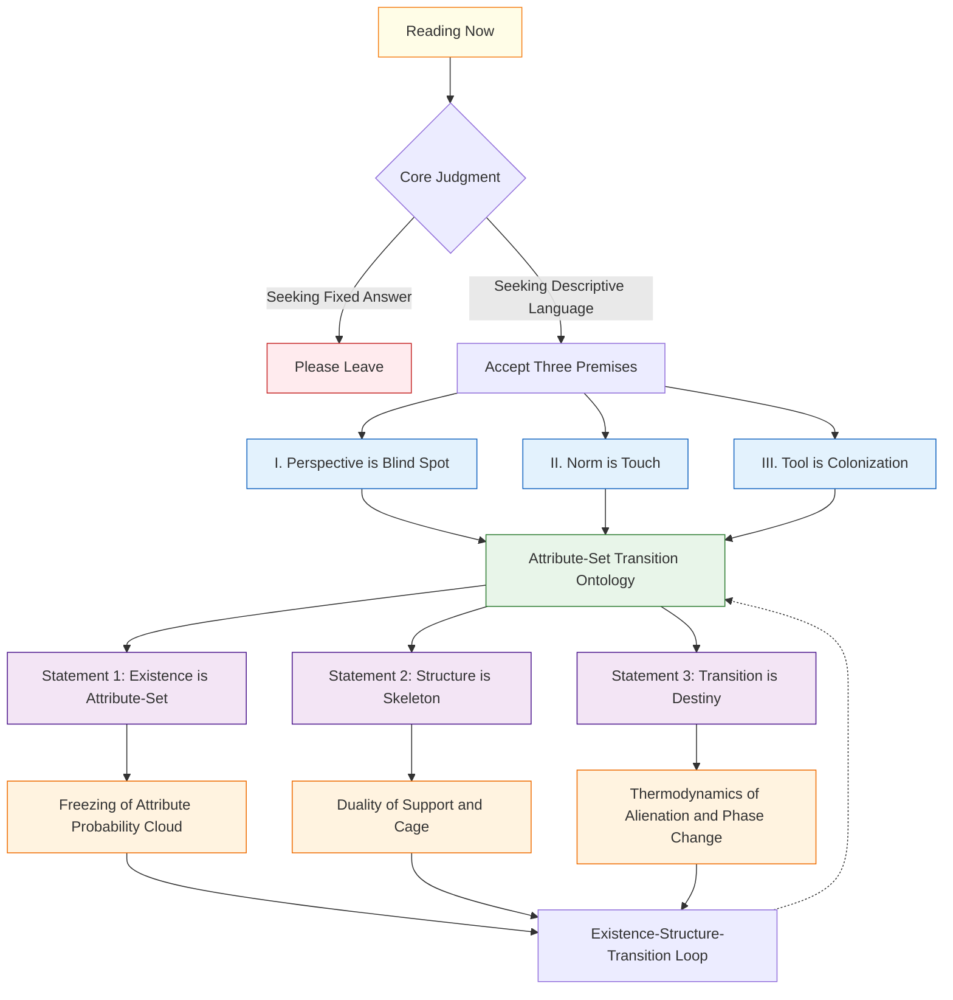
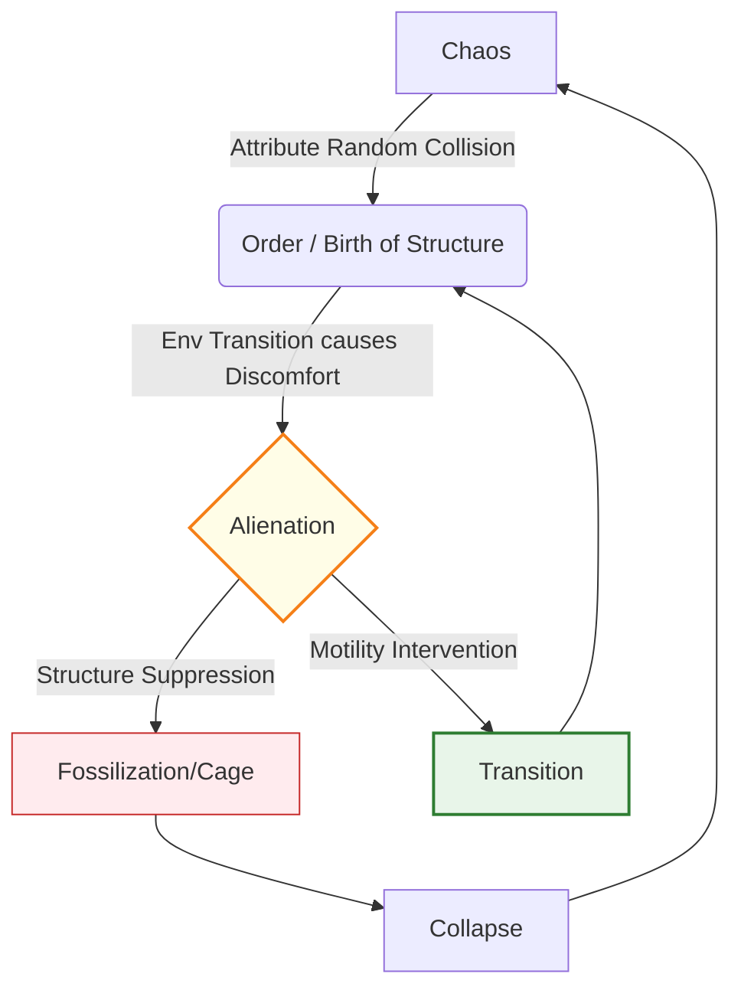
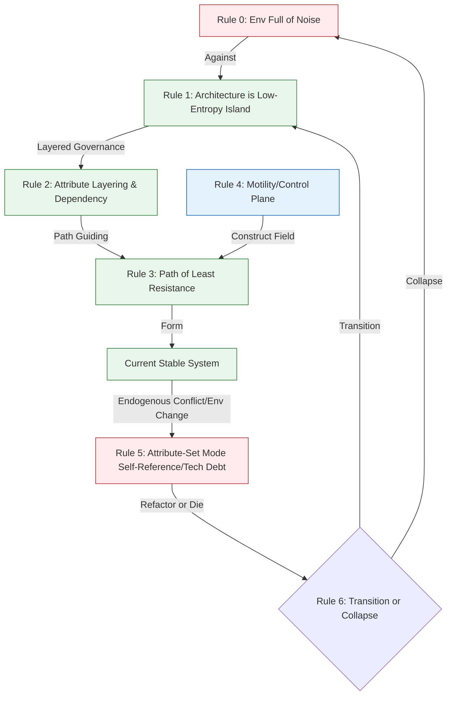
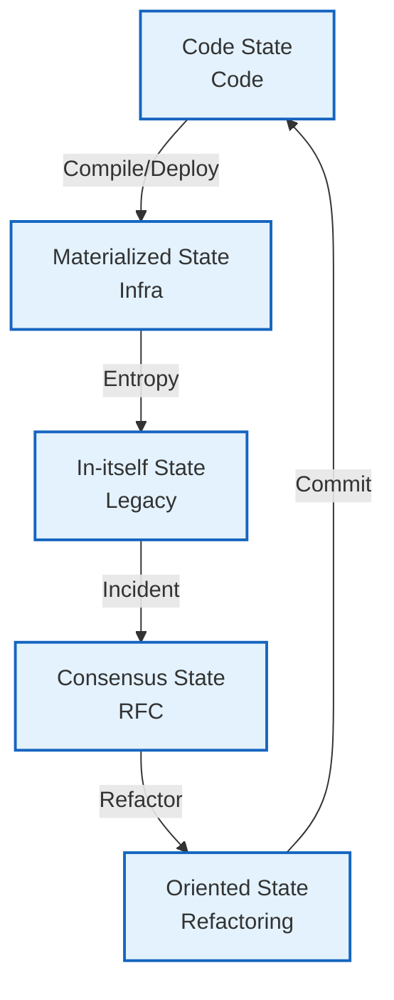
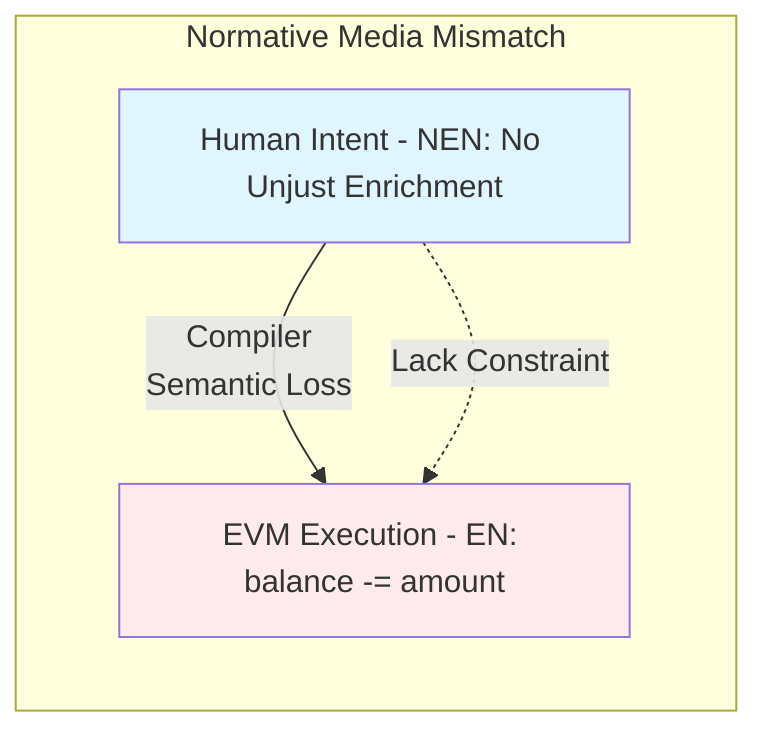
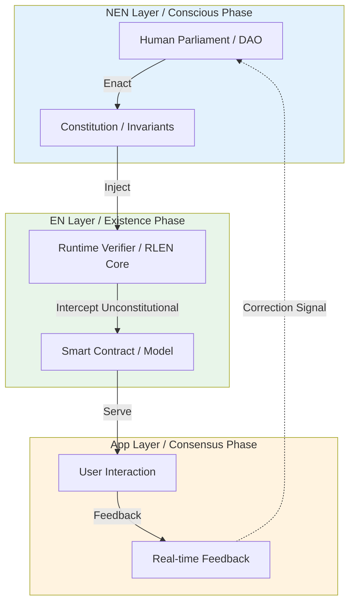
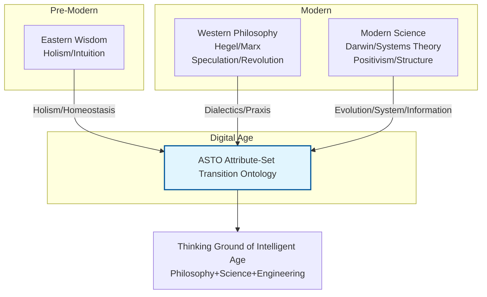
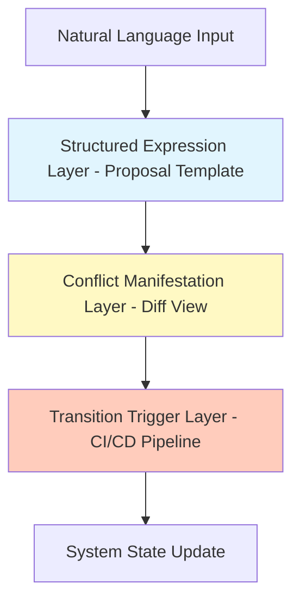
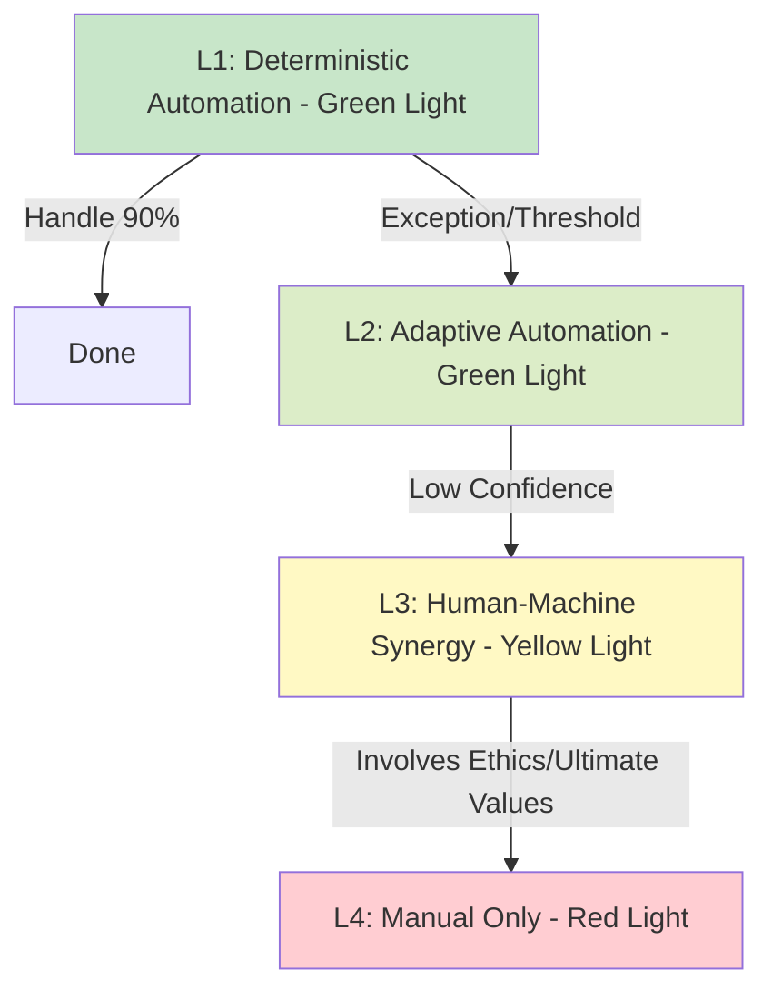
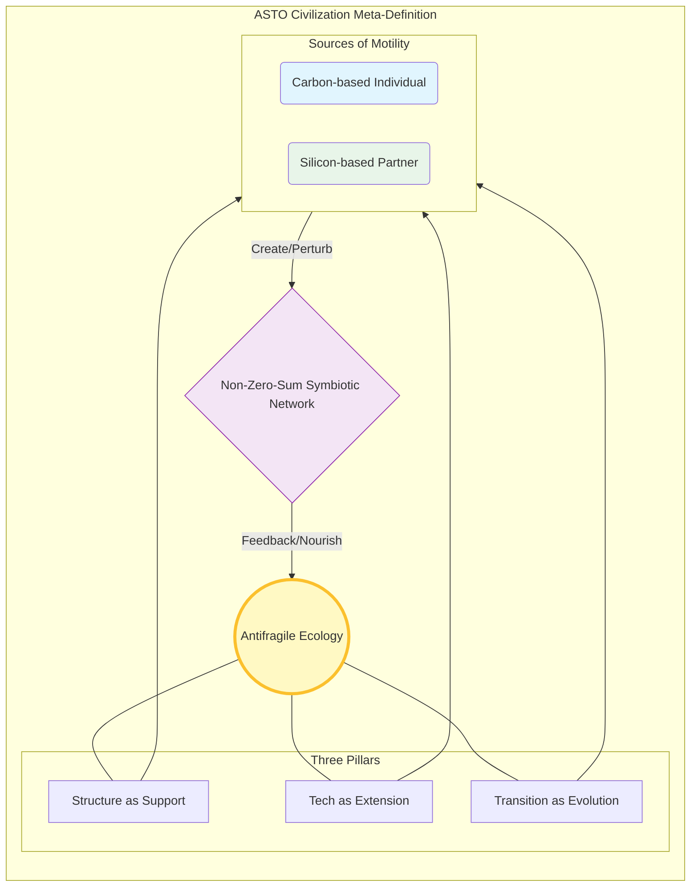

---
title: "ASTO.U01. Figure Index: Panoramic Visual Index"
date: "2026-03-20"
version: "Γ.2"
author: "Yi Fu (付毅, ODDFounder, fuyi.it@live.cn)"
status: "Generated Reference Index"
layer: "ASTO"
abstract: "A collection of all core diagrams in the ASTO system as a panoramic visual index."
---

# **ASTO.U01. Figure Index: Panoramic Visual Index**

> **Version**: Γ.2 (Index Synced)
> **Status**: Generated Reference Index
> **Context**: This document collects all core diagrams in the Attribute-Set Transition Ontology (ASTO) system as a panoramic visual index.

---

## **Fig 01: Entry Path and Triple Filters**
*   **Source**: `ASTO.P02.Prologue` / `ASTO.P04.Manifesto`
*   **Description**: Describes the cognitive calibration process from "Reading Now" to "Entering the Field".

---

## **Fig 02: ASTO Core Dynamics Loop**
*   **Source**: `ASTO.P04.Manifesto`
*   **Description**: Shows how a system births order from chaos, alienates due to environmental transition, and finally moves towards collapse or transition.

---

## **Fig 03: System Thermodynamics Logic Flow**
*   **Source**: `ASTO.P05.Axioms`
*   **Description**: Shows how the six axioms connect the lifecycle of a system.

---

## **Fig 04: SDLC State Machine (Five States Flow)**
*   **Source**: `ASTO.P06.Values` (or P05 depending on version, cited as ASTO06.Ontology in original)
*   **Description**: Shows the transition path of code between five forms.

---

## **Fig 05: Semantic Loss**
*   **Source**: `ASTO.E03.Web3`
*   **Description**: Shows how human intent loses NEN attributes during compilation.

---

## **Fig 06: Five-State Layered Governance Architecture**
*   **Source**: `ASTO.E03.Web3` / `ASTO.E04.AI`
*   **Description**: Shows how NEN layer, EN layer, and App layer collaborate.

---

## **Fig 07: Historical Coordinate System**
*   **Source**: `ASTO.P02.Prologue (Appendix)` / `ASTO.P12.Trace`
*   **Description**: Shows ASTO's inheritance and fusion of Eastern and Western thoughts.

---

## **Fig 08: Dialogue Platform Three-Layer Architecture**
*   **Source**: `ASTO.P10.Democracy`
*   **Description**: Shows how to transform speech into structural transition.

---

## **Fig 09: Normative Executability Gradient (NEG)**
*   **Source**: `ASTO.E02.Automation`
*   **Description**: Shows automation grading from L1 to L4.

---

## **Fig 10: ASTO Civilization Panorama**
*   **Source**: `ASTO.P04.Manifesto`
*   **Description**: Shows the symbiotic civilization landscape ASTO pursues: "Antifragile, Non-Zero-Sum, Motility Maximization".

---

**(End of Figure Index)**
