---
title: "ASTO.EN.U03. Theoretical System Charts"
date: "2026-03-20"
version: "v1.0"
author: "Yi Fu (付毅, ODDFounder, fuyi.it@live.cn)"
status: "Reference Diagram Set"
layer: "ASTO"
lang: "en"
---
## **ASTO Complete Theoretical System Visualization Chart Set**

> **Status Note**: This file is a reference chart set for orientation and is not a standalone main paper in the current ASTO public-review chain.

### **1. 1-2-3 Theory and Attribute-Set Transition Ontology**
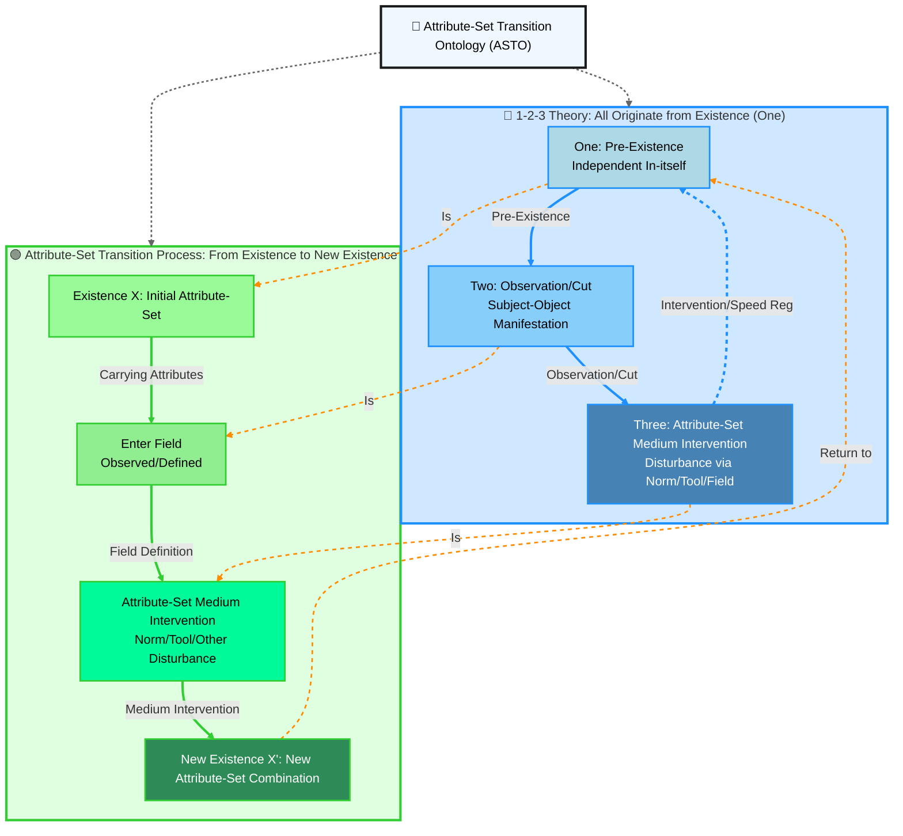
```mermaid
flowchart TD
    classDef one fill:#ADD8E6,stroke:#1E90FF,color:#000,stroke-width:2px
    classDef two fill:#87CEFA,stroke:#1E90FF,color:#000,stroke-width:2px
    classDef three fill:#4682B4,stroke:#1E90FF,color:#fff,stroke-width:2px
    classDef exist fill:#98FB98,stroke:#32CD32,color:#000,stroke-width:2px
    classDef field fill:#90EE90,stroke:#32CD32,color:#000,stroke-width:2px
    classDef disturb fill:#00FA9A,stroke:#32CD32,color:#000,stroke-width:2px
    classDef new fill:#2E8B57,stroke:#32CD32,color:#fff,stroke-width:2px
    classDef title fill:#f0f8ff,stroke:#1a1a1a,color:#000,stroke-width:3px,stroke-dasharray:0

    T["🌌 Attribute-Set Transition Ontology (ASTO)"]
    class T title

    subgraph A ["🔵 1-2-3 Theory: All Originate from Existence (One)"]
        direction LR
        U1["One: Pre-Existence<br/>Independent In-itself"]
        U2["Two: Observation/Cut<br/>Subject-Object Manifestation"]
        U3["Three: Attribute-Set Medium Intervention<br/>Disturbance via Norm/Tool/Field"]
    end
    
    style A fill:#D0E8FF,stroke:#1E90FF,stroke-width:3px,stroke-dasharray:0
    
    subgraph B ["🟢 Attribute-Set Transition Process: From Existence to New Existence"]
        S1["Existence X: Initial Attribute-Set"]
        S2["Enter Field<br/>Observed/Defined"]
        S3["Attribute-Set Medium Intervention<br/>Norm/Tool/Other Disturbance"]
        S4["New Existence X': New Attribute-Set Combination"]
    end
    
    style B fill:#DFFFE0,stroke:#32CD32,stroke-width:3px,stroke-dasharray:0

    T --> A
    T --> B

    U1 -->|Pre-Existence| U2
    U2 -->|Observation/Cut| U3
    U3 -->|Intervention/Speed Reg| U1

    S1 -->|Carrying Attributes| S2
    S2 -->|Field Definition| S3
    S3 -->|Medium Intervention| S4

    U1 -.->|Is| S1
    U2 -.->|Is| S2
    U3 -.->|Is| S3
    S4 -.->|Return to| U1

    class U1 one
    class U2 two
    class U3 three
    class S1 exist
    class S2 field
    class S3 disturb
    class S4 new
    
    linkStyle 0 stroke:#666,stroke-width:2px,stroke-dasharray:3 3
    linkStyle 1 stroke:#666,stroke-width:2px,stroke-dasharray:3 3
    linkStyle 2 stroke:#1E90FF,stroke-width:3px
    linkStyle 3 stroke:#1E90FF,stroke-width:3px
    linkStyle 4 stroke:#1E90FF,stroke-width:3px,stroke-dasharray:5 5
    linkStyle 5 stroke:#32CD32,stroke-width:3px
    linkStyle 6 stroke:#32CD32,stroke-width:3px
    linkStyle 7 stroke:#32CD32,stroke-width:3px
    linkStyle 8 stroke:#FF8C00,stroke-width:2px,stroke-dasharray:5 5
    linkStyle 9 stroke:#FF8C00,stroke-width:2px,stroke-dasharray:5 5
    linkStyle 10 stroke:#FF8C00,stroke-width:2px,stroke-dasharray:5 5
    linkStyle 11 stroke:#FF8C00,stroke-width:2px,stroke-dasharray:5 5
```

### **2. The Five States Evolution: From In-itself to Oriented**

```mermaid
flowchart TD
    subgraph F ["🟣 The Five States Evolution: From Fuzzy Awareness to Rule Construction"]
        direction LR
        S1["In-itself State<br/>Fuzzy Perception/Unnamed"]
        S2["Consensus State<br/>Social Agreement/Oral Understanding"]
        S3["Encoded State<br/>Formalization/Transmissible"]
        S4["Reified State<br/>Physical Implementation/Executable"]
        S5["Oriented Dimension<br/>Self-Evolution Rule/Meta-Structure"]
    end
    
    style F fill:#F5F0FF,stroke:#7B1FA2,stroke-width:3px,stroke-dasharray:0
    
    S1 -->|Manifest| S2
    S2 -->|Externalize| S3
    S3 -->|Implement| S4
    S4 -->|Internalize| S5
    
    S4 -.->|Short Circuit Transition<br/>Tech Forcing Legislation| S5
    S3 -.->|Generative Transition<br/>Algorithm Creates Ecology| S4
    S4 -.->|Irreversible| S1
    
    classDef state1 fill:#E1BEE7,stroke:#8E24AA,color:#000,stroke-width:2px
    classDef state2 fill:#BBDEFB,stroke:#1565C0,color:#000,stroke-width:2px
    classDef state3 fill:#FFF9C4,stroke:#F9A825,color:#000,stroke-width:2px
    classDef state4 fill:#C8E6C9,stroke:#2E7D32,color:#000,stroke-width:2px
    classDef state5 fill:#D1C4E9,stroke:#4527A0,color:#000,stroke-width:2px
    
    class S1 state1
    class S2 state2
    class S3 state3
    class S4 state4
    class S5 state5
    
    linkStyle 0 stroke:#8E24AA,stroke-width:3px
    linkStyle 1 stroke:#1565C0,stroke-width:3px
    linkStyle 2 stroke:#F9A825,stroke-width:3px
    linkStyle 3 stroke:#2E7D32,stroke-width:3px
    linkStyle 4 stroke:#4527A0,stroke-width:2px,stroke-dasharray:5 5
    linkStyle 5 stroke:#F9A825,stroke-width:2px,stroke-dasharray:5 5
    linkStyle 6 stroke:#8E24AA,stroke-width:2px,stroke-dasharray:5 5
```

### **3. The Six Stages Rhythm (Revised)**

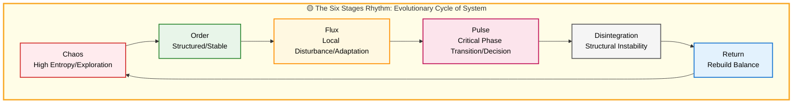
```mermaid
flowchart LR
    classDef chaos fill:#FFEBEE,stroke:#D32F2F,color:#000,stroke-width:2px
    classDef order fill:#E8F5E9,stroke:#388E3C,color:#000,stroke-width:2px
    classDef flux fill:#FFF8E1,stroke:#FF8F00,color:#000,stroke-width:2px
    classDef pulse fill:#FCE4EC,stroke:#C2185B,color:#000,stroke-width:2px
    classDef collapse fill:#F5F5F5,stroke:#616161,color:#000,stroke-width:2px
    classDef Re-origin fill:#E3F2FD,stroke:#1976D2,color:#000,stroke-width:2px

    subgraph S ["🟡 The Six Stages Rhythm: Evolutionary Cycle of System"]
        direction LR
        C1["Chaos<br/>High Entropy/Exploration"]:::chaos
        C2["Order<br/>Structured/Stable"]:::order
        C3["Flux<br/>Local Disturbance/Adaptation"]:::flux
        C4["Pulse<br/>Critical Phase Transition/Decision"]:::pulse
        C5["Disintegration<br/>Structural Instability"]:::collapse
        C6["Return<br/>Rebuild Balance"]:::Re-origin
    end
    
    C1 --> C2 --> C3 --> C4 --> C5 --> C6 --> C1
    
    style S fill:#FFFDE7,stroke:#F9A825,stroke-width:3px,stroke-dasharray:0
```

### **4. The Seven Orders Loop (Revised)**

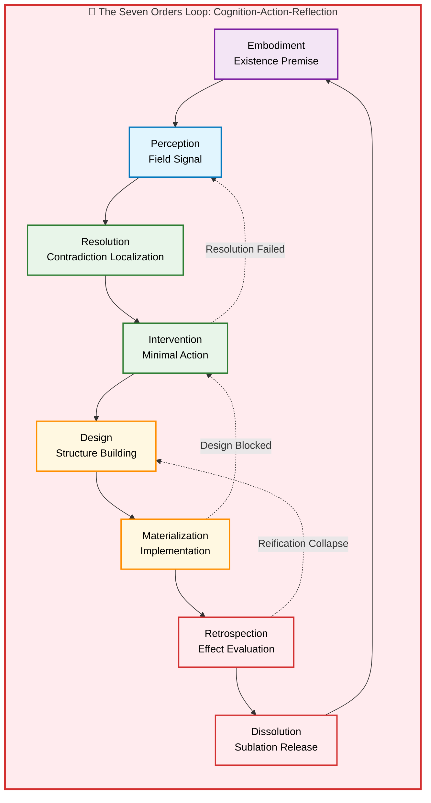
```mermaid
flowchart TD
    classDef dwelling fill:#F3E5F5,stroke:#7B1FA2,color:#000,stroke-width:2px
    classDef stage1 fill:#E1F5FE,stroke:#0277BD,color:#000,stroke-width:2px
    classDef stage2 fill:#E8F5E9,stroke:#2E7D32,color:#000,stroke-width:2px
    classDef stage3 fill:#FFF8E1,stroke:#FF8F00,color:#000,stroke-width:2px
    classDef stage4 fill:#FFEBEE,stroke:#D32F2F,color:#000,stroke-width:2px

    subgraph C ["🔴 The Seven Orders Loop: Cognition-Action-Reflection"]
        direction TB
        O0["Embodiment<br/>Existence Premise"]:::dwelling
        O1["Perception<br/>Field Signal"]:::stage1
        O2["Resolution<br/>Contradiction Localization"]:::stage2
        O3["Intervention<br/>Minimal Action"]:::stage2
        O4["Design<br/>Structure Building"]:::stage3
        O5["Materialization<br/>Implementation"]:::stage3
        O6["Retrospection<br/>Effect Evaluation"]:::stage4
        O7["Dissolution<br/>Sublation Release"]:::stage4
    end
    
    O0 --> O1 --> O2 --> O3 --> O4 --> O5 --> O6 --> O7
    O7 --> O0
    
    O3 -.->|Resolution Failed| O1
    O5 -.->|Design Blocked| O3
    O6 -.->|Reification Collapse| O4
    
    style C fill:#FFEBEE,stroke:#D32F2F,stroke-width:3px,stroke-dasharray:0
```

### **5. Three Levels of Unity of Knowledge and Action**

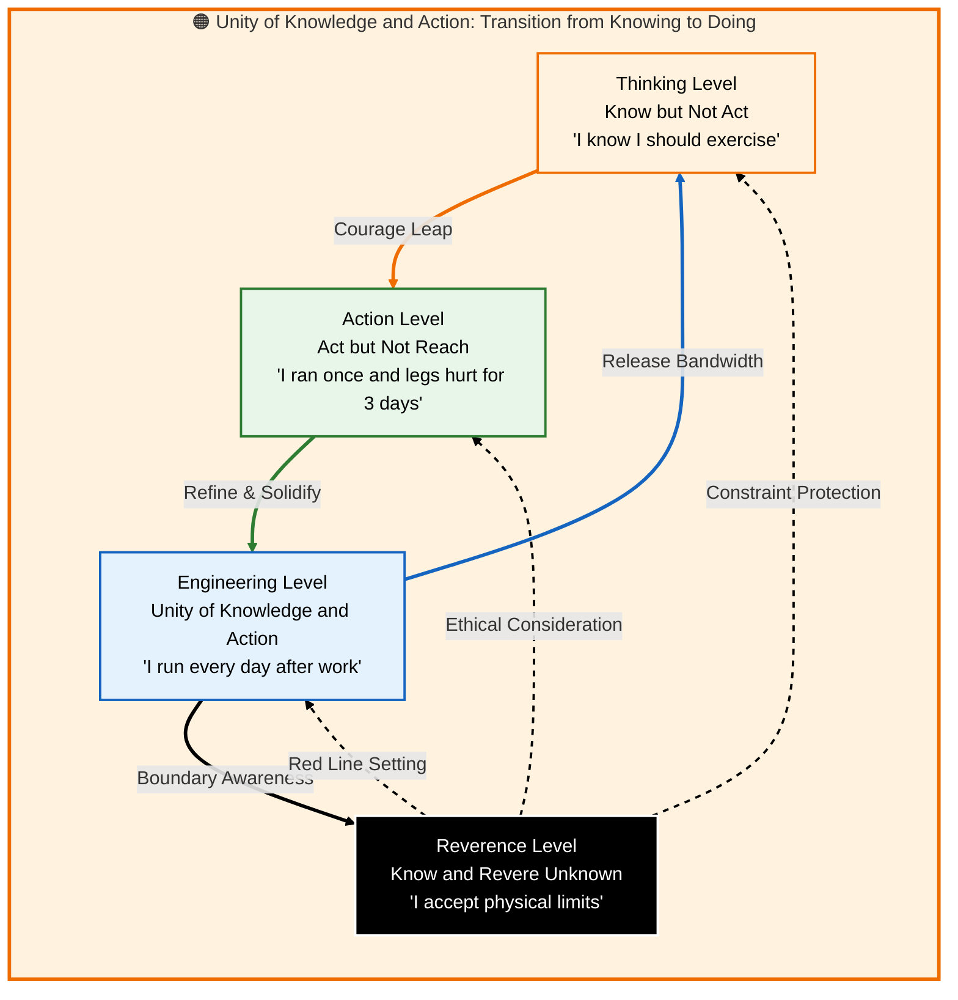
```mermaid
flowchart TD
    subgraph E ["🟠 Unity of Knowledge and Action: Transition from Knowing to Doing"]
        direction TB
        
        Thinking["Thinking Level<br/>Know but Not Act<br/>'I know I should exercise'"]
        Acting["Action Level<br/>Act but Not Reach<br/>'I ran once and legs hurt for 3 days'"]
        Engineering["Engineering Level<br/>Unity of Knowledge and Action<br/>'I run every day after work'"]
        Reverence["Reverence Level<br/>Know and Revere Unknown<br/>'I accept physical limits'"]
        
        Thinking -->|Courage Leap| Acting
        Acting -->|Refine & Solidify| Engineering
        Engineering -->|Release Bandwidth| Thinking
        
        Engineering -->|Boundary Awareness| Reverence
        Reverence -.->|Constraint Protection| Thinking
        Reverence -.->|Ethical Consideration| Acting
        Reverence -.->|Red Line Setting| Engineering
    end
    
    style E fill:#FFF3E0,stroke:#EF6C00,stroke-width:3px,stroke-dasharray:0
    
    classDef thinking fill:#FFF3E0,stroke:#EF6C00,color:#000,stroke-width:2px
    classDef acting fill:#E8F5E9,stroke:#2E7D32,color:#000,stroke-width:2px
    classDef engineering fill:#E3F2FD,stroke:#1565C0,color:#000,stroke-width:2px
    classDef reverence fill:#000000,stroke:#FFFFFF,color:#FFF,stroke-width:2px
    
    class Thinking thinking
    class Acting acting
    class Engineering engineering
    class Reverence reverence
    
    linkStyle 0 stroke:#EF6C00,stroke-width:3px
    linkStyle 1 stroke:#2E7D32,stroke-width:3px
    linkStyle 2 stroke:#1565C0,stroke-width:3px
    linkStyle 3 stroke:#000000,stroke-width:3px
    linkStyle 4 stroke:#000000,stroke-width:2px,stroke-dasharray:5 5
    linkStyle 5 stroke:#000000,stroke-width:2px,stroke-dasharray:5 5
    linkStyle 6 stroke:#000000,stroke-width:2px,stroke-dasharray:5 5
```

### **6. Fundamental and Taboo Elements: System Boundary Guarding**
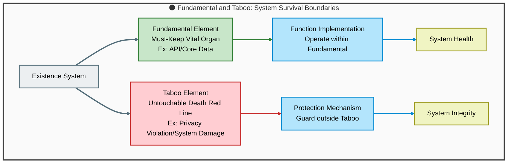
```mermaid
flowchart TD
    subgraph D ["⚫ Fundamental and Taboo: System Survival Boundaries"]
        Exist["Existence System"]
        
        Exist --> Base["Fundamental Element<br/>Must-Keep Vital Organ<br/>Ex: API/Core Data"]
        Exist --> Taboo["Taboo Element<br/>Untouchable Death Red Line<br/>Ex: Privacy Violation/System Damage"]
        
        Base --> Function["Function Implementation<br/>Operate within Fundamental"]
        Taboo --> Protection["Protection Mechanism<br/>Guard outside Taboo"]
        
        Function --> Health["System Health"]
        Protection --> Integrity["System Integrity"]
    end
    
    style D fill:#FAFAFA,stroke:#424242,stroke-width:3px,stroke-dasharray:0
    
    classDef system fill:#ECEFF1,stroke:#546E7A,color:#000,stroke-width:2px
    classDef base fill:#C8E6C9,stroke:#2E7D32,color:#000,stroke-width:2px
    classDef taboo fill:#FFCDD2,stroke:#C62828,color:#000,stroke-width:2px
    classDef normal fill:#B3E5FC,stroke:#0288D1,color:#000,stroke-width:2px
    classDef result fill:#F0F4C3,stroke:#9E9D24,color:#000,stroke-width:2px
    
    class Exist system
    class Base base
    class Taboo taboo
    class Function,Protection normal
    class Health,Integrity result
    
    linkStyle 0 stroke:#546E7A,stroke-width:3px
    linkStyle 1 stroke:#546E7A,stroke-width:3px
    linkStyle 2 stroke:#2E7D32,stroke-width:3px
    linkStyle 3 stroke:#C62828,stroke-width:3px
    linkStyle 4 stroke:#0288D1,stroke-width:3px
    linkStyle 5 stroke:#0288D1,stroke-width:3px
```

### **7. Triple Existence of Human**
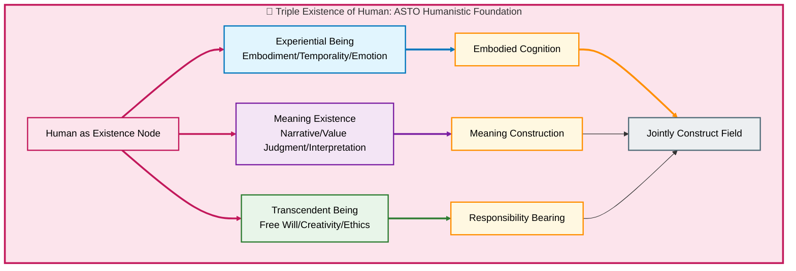
```mermaid
flowchart TD
    subgraph F ["👤 Triple Existence of Human: ASTO Humanistic Foundation"]
        Human["Human as Existence Node"]
        
        Human --> Experiential["Experiential Being<br/>Embodiment/Temporality/Emotion"]
        Human --> Meaning["Meaning Existence<br/>Narrative/Value Judgment/Interpretation"]
        Human --> Transcendent["Transcendent Being<br/>Free Will/Creativity/Ethics"]
        
        Experiential --> Embodied["Embodied Cognition"]
        Meaning --> Narrative["Meaning Construction"]
        Transcendent --> Responsibility["Responsibility Bearing"]
        
        Embodied & Narrative & Responsibility --> Field["Jointly Construct Field"]
    end
    
    style F fill:#FCE4EC,stroke:#C2185B,stroke-width:3px,stroke-dasharray:0
    
    classDef human fill:#FCE4EC,stroke:#C2185B,color:#000,stroke-width:2px
    classDef exp fill:#E1F5FE,stroke:#0277BD,color:#000,stroke-width:2px
    classDef mean fill:#F3E5F5,stroke:#7B1FA2,color:#000,stroke-width:2px
    classDef trans fill:#E8F5E9,stroke:#2E7D32,color:#000,stroke-width:2px
    classDef impl fill:#FFF8E1,stroke:#FF8F00,color:#000,stroke-width:2px
    classDef result fill:#ECEFF1,stroke:#546E7A,color:#000,stroke-width:2px
    
    class Human human
    class Experiential exp
    class Meaning mean
    class Transcendent trans
    class Embodied,Narrative,Responsibility impl
    class Field result
    
    linkStyle 0 stroke:#C2185B,stroke-width:3px
    linkStyle 1 stroke:#C2185B,stroke-width:3px
    linkStyle 2 stroke:#C2185B,stroke-width:3px
    linkStyle 3 stroke:#0277BD,stroke-width:3px
    linkStyle 4 stroke:#7B1FA2,stroke-width:3px
    linkStyle 5 stroke:#2E7D32,stroke-width:3px
    linkStyle 6 stroke:#FF8F00,stroke-width:3px
```

### **8. 1-5-6-7-1 General Architecture Loop**

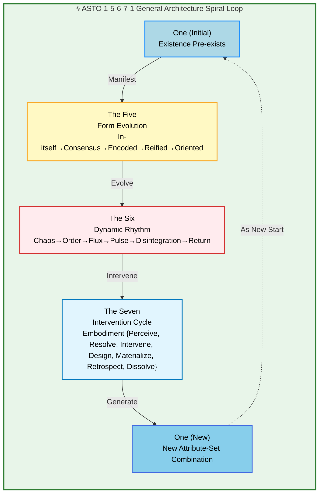
```mermaid
flowchart TD
    classDef one fill:#ADD8E6,stroke:#1E90FF,color:#000,stroke-width:2px
    classDef five fill:#FFF9C4,stroke:#F9A825,color:#000,stroke-width:2px
    classDef six fill:#FFEBEE,stroke:#D32F2F,color:#000,stroke-width:2px
    classDef seven fill:#E1F5FE,stroke:#0277BD,color:#000,stroke-width:2px
    classDef newone fill:#87CEEB,stroke:#4169E1,color:#000,stroke-width:2px

    subgraph T ["🌀 ASTO 1-5-6-7-1 General Architecture Spiral Loop"]
        direction TB
        
        M1["One (Initial)<br/>Existence Pre-exists"]:::one
        F["The Five<br/>Form Evolution<br/>In-itself→Consensus→Encoded→Reified→Oriented"]:::five
        S["The Six<br/>Dynamic Rhythm<br/>Chaos→Order→Flux→Pulse→Disintegration→Return"]:::six
        O["The Seven<br/>Intervention Cycle<br/>Embodiment {Perceive, Resolve, Intervene, Design, Materialize, Retrospect, Dissolve}"]:::seven
        M2["One (New)<br/>New Attribute-Set Combination"]:::newone
        
        M1 -->|Manifest| F
        F -->|Evolve| S
        S -->|Intervene| O
        O -->|Generate| M2
        M2 -.->|As New Start| M1
    end
    
    style T fill:#E8F5E9,stroke:#2E7D32,stroke-width:3px,stroke-dasharray:0
```

### 9. ASTO Complete Theoretical System Architecture A (Triangle Version)**

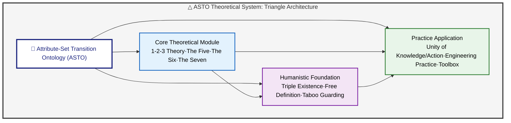
```mermaid
flowchart TD
    classDef core fill:#BBDEFB,stroke:#0D47A1,color:#000,stroke-width:2px
    classDef human fill:#E1BEE7,stroke:#4A148C,color:#000,stroke-width:2px
    classDef practice fill:#C8E6C9,stroke:#1B5E20,color:#000,stroke-width:2px
    classDef title fill:#FFFFFF,stroke:#1A237E,color:#1A237E,stroke-width:3px

    T["🌌 Attribute-Set Transition Ontology (ASTO)"]:::title
    
    CORE["Core Theoretical Module<br/>1-2-3 Theory·The Five·The Six·The Seven"]:::core
    HUMAN["Humanistic Foundation<br/>Triple Existence·Free Definition·Taboo Guarding"]:::human
    PRACTICE["Practice Application<br/>Unity of Knowledge/Action·Engineering Practice·Toolbox"]:::practice
    
    T --> CORE
    T --> HUMAN
    T --> PRACTICE
    
    CORE --> HUMAN
    CORE --> PRACTICE
    HUMAN --> PRACTICE
    
    style CORE fill:#E3F2FD,stroke:#1565C0,stroke-width:2px
    style HUMAN fill:#F3E5F5,stroke:#7B1FA2,stroke-width:2px
    style PRACTICE fill:#E8F5E9,stroke:#2E7D32,stroke-width:2px
    
    subgraph A ["△ ASTO Theoretical System: Triangle Architecture"]
        T
        CORE
        HUMAN
        PRACTICE
    end
    
    style A fill:#F5F5F5,stroke:#424242,stroke-width:3px,stroke-dasharray:0
```

### **9. ASTO Complete Theoretical System Architecture B**

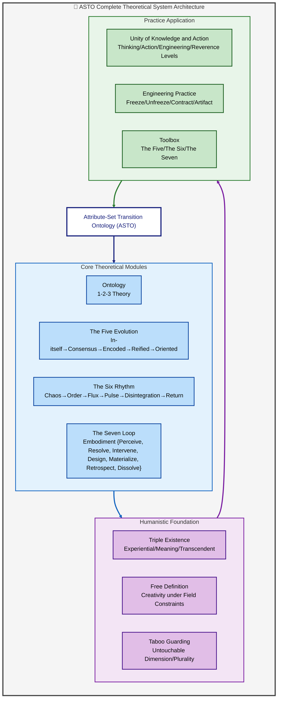
```mermaid
flowchart TD
    subgraph A ["🌌 ASTO Complete Theoretical System Architecture"]
        direction TB
        
        Title["Attribute-Set Transition Ontology (ASTO)"]
        
        subgraph Core ["Core Theoretical Modules"]
            Ontology["Ontology<br/>1-2-3 Theory"]
            States["The Five Evolution<br/>In-itself→Consensus→Encoded→Reified→Oriented"]
            Stages["The Six Rhythm<br/>Chaos→Order→Flux→Pulse→Disintegration→Return"]
            Orders["The Seven Loop<br/>Embodiment {Perceive, Resolve, Intervene, Design, Materialize, Retrospect, Dissolve}"]
        end
        
        subgraph Human ["Humanistic Foundation"]
            Triple["Triple Existence<br/>Experiential/Meaning/Transcendent"]
            Freedom["Free Definition<br/>Creativity under Field Constraints"]
            Taboo["Taboo Guarding<br/>Untouchable Dimension/Plurality"]
        end
        
        subgraph Practice ["Practice Application"]
            Knowing["Unity of Knowledge and Action<br/>Thinking/Action/Engineering/Reverence Levels"]
            Engineering["Engineering Practice<br/>Freeze/Unfreeze/Contract/Artifact"]
            Tools["Toolbox<br/>The Five/The Six/The Seven"]
        end
        
        Title --> Core
        Core --> Human
        Human --> Practice
        Practice --> Title
    end
    
    style A fill:#F5F5F5,stroke:#424242,stroke-width:3px,stroke-dasharray:0
    style Core fill:#E3F2FD,stroke:#1565C0,stroke-width:2px
    style Human fill:#F3E5F5,stroke:#7B1FA2,stroke-width:2px
    style Practice fill:#E8F5E9,stroke:#2E7D32,stroke-width:2px
    
    classDef title fill:#FFFFFF,stroke:#1A237E,color:#1A237E,stroke-width:3px
    classDef core fill:#BBDEFB,stroke:#0D47A1,color:#000,stroke-width:2px
    classDef human fill:#E1BEE7,stroke:#4A148C,color:#000,stroke-width:2px
    classDef practice fill:#C8E6C9,stroke:#1B5E20,color:#000,stroke-width:2px
    
    class Title title
    class Ontology,States,Stages,Orders core
    class Triple,Freedom,Taboo human
    class Knowing,Engineering,Tools practice
    
    linkStyle 0 stroke:#1A237E,stroke-width:3px
    linkStyle 1 stroke:#1565C0,stroke-width:3px
    linkStyle 2 stroke:#7B1FA2,stroke-width:3px
    linkStyle 3 stroke:#2E7D32,stroke-width:3px
```

### **10. Attribute Micro-Recombination Mechanism: Attribute-Set Transition Dynamics**

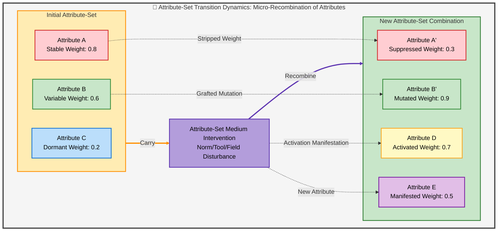
```mermaid
flowchart TD
    %% Style Definitions
    classDef attr1 fill:#FFCDD2,stroke:#D32F2F,color:#000,stroke-width:2px
    classDef attr2 fill:#C8E6C9,stroke:#388E3C,color:#000,stroke-width:2px
    classDef attr3 fill:#BBDEFB,stroke:#1976D2,color:#000,stroke-width:2px
    classDef attr4 fill:#FFF9C4,stroke:#F9A825,color:#000,stroke-width:2px
    classDef attr5 fill:#E1BEE7,stroke:#7B1FA2,color:#000,stroke-width:2px
    classDef medium fill:#B39DDB,stroke:#5E35B1,color:#000,stroke-width:2px
    classDef initbox fill:#FFECB3,stroke:#FF8F00,stroke-width:2px
    classDef finalbox fill:#C8E6C9,stroke:#2E7D32,stroke-width:2px
    classDef mainbox fill:#F5F5F5,stroke:#424242,stroke-width:3px

    %% Initial Attribute-Set
    subgraph INITIAL ["Initial Attribute-Set"]
        A1["Attribute A<br/>Stable Weight: 0.8"]
        A2["Attribute B<br/>Variable Weight: 0.6"]
        A3["Attribute C<br/>Dormant Weight: 0.2"]
    end

    %% Attribute-Set Medium
    MEDIUM["Attribute-Set Medium Intervention<br/>Norm/Tool/Field Disturbance"]

    %% New Attribute-Set Combination
    subgraph FINAL ["New Attribute-Set Combination"]
        B1["Attribute A'<br/>Suppressed Weight: 0.3"]
        B2["Attribute B'<br/>Mutated Weight: 0.9"]
        B4["Attribute D<br/>Activated Weight: 0.7"]
        B5["Attribute E<br/>Manifested Weight: 0.5"]
    end

    %% Main Chart Container
    subgraph M ["🔬 Attribute-Set Transition Dynamics: Micro-Recombination of Attributes"]
        INITIAL
        MEDIUM
        FINAL
    end

    %% Connections and Flow
    INITIAL -->|Carry| MEDIUM
    MEDIUM -->|Recombine| FINAL

    %% Apply Styles
    class A1,B1 attr1
    class A2,B2 attr2
    class A3 attr3
    class B4 attr4
    class B5 attr5
    class MEDIUM medium
    class INITIAL initbox
    class FINAL finalbox
    class M mainbox

    %% Micro Operation Annotation
    linkStyle 0 stroke:#FF8F00,stroke-width:3px
    linkStyle 1 stroke:#5E35B1,stroke-width:3px

    %% Additional Annotation Links (Dotted)
    A1 -. Stripped Weight .-> B1
    A2 -. Grafted Mutation .-> B2
    MEDIUM -. Activation Manifestation .-> B4
    MEDIUM -. New Attribute .-> B5
```

### **11. Multiple Field Interference and Resonance**
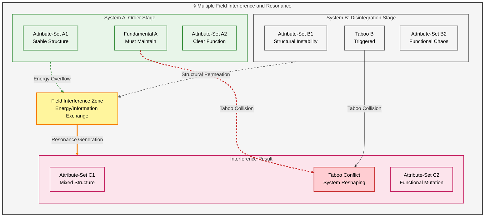
```mermaid
flowchart TD
    classDef order fill:#E8F5E9,stroke:#388E3C,color:#000,stroke-width:2px
    classDef collapse fill:#F5F5F5,stroke:#616161,color:#000,stroke-width:2px
    classDef pulse fill:#FCE4EC,stroke:#C2185B,color:#000,stroke-width:2px
    classDef chaos fill:#FFEBEE,stroke:#D32F2F,color:#000,stroke-width:2px
    classDef interaction fill:#FFF59D,stroke:#F57C00,color:#000,stroke-width:2px
    classDef taboo fill:#FFCDD2,stroke:#C62828,color:#000,stroke-width:2px

    subgraph F ["🌀 Multiple Field Interference and Resonance"]
        direction TB
        
        subgraph S1 ["System A: Order Stage"]
            A1["Attribute-Set A1<br/>Stable Structure"]:::order
            A2["Attribute-Set A2<br/>Clear Function"]:::order
            A3["Fundamental A<br/>Must Maintain"]:::order
        end
        
        subgraph S2 ["System B: Disintegration Stage"]
            B1["Attribute-Set B1<br/>Structural Instability"]:::collapse
            B2["Attribute-Set B2<br/>Functional Chaos"]:::collapse
            B3["Taboo B<br/>Triggered"]:::collapse
        end
        
        INTER["Field Interference Zone<br/>Energy/Information Exchange"]:::interaction
        
        subgraph RESULT ["Interference Result"]
            C1["Attribute-Set C1<br/>Mixed Structure"]:::pulse
            C2["Attribute-Set C2<br/>Functional Mutation"]:::pulse
            C3["Taboo Conflict<br/>System Reshaping"]:::taboo
        end
        
        S1 -->|Energy Overflow| INTER
        S2 -->|Structural Permeation| INTER
        INTER -->|Resonance Generation| RESULT
        
        A3 & B3 -->|Taboo Collision| C3
    end
    
    style F fill:#F5F5F5,stroke:#424242,stroke-width:3px,stroke-dasharray:0
    style S1 fill:#E8F5E9,stroke:#388E3C,stroke-width:2px
    style S2 fill:#F5F5F5,stroke:#616161,stroke-width:2px
    style INTER fill:#FFF59D,stroke:#F57C00,stroke-width:2px
    style RESULT fill:#FCE4EC,stroke:#C2185B,stroke-width:2px
    
    linkStyle 0 stroke:#388E3C,stroke-width:2px,stroke-dasharray:5 5
    linkStyle 1 stroke:#616161,stroke-width:2px,stroke-dasharray:5 5
    linkStyle 2 stroke:#F57C00,stroke-width:3px
    linkStyle 3 stroke:#C62828,stroke-width:3px,stroke-dasharray:5 5
```

### **12. ASTO Energy/Information Flow: Loss and Entropy Increase**
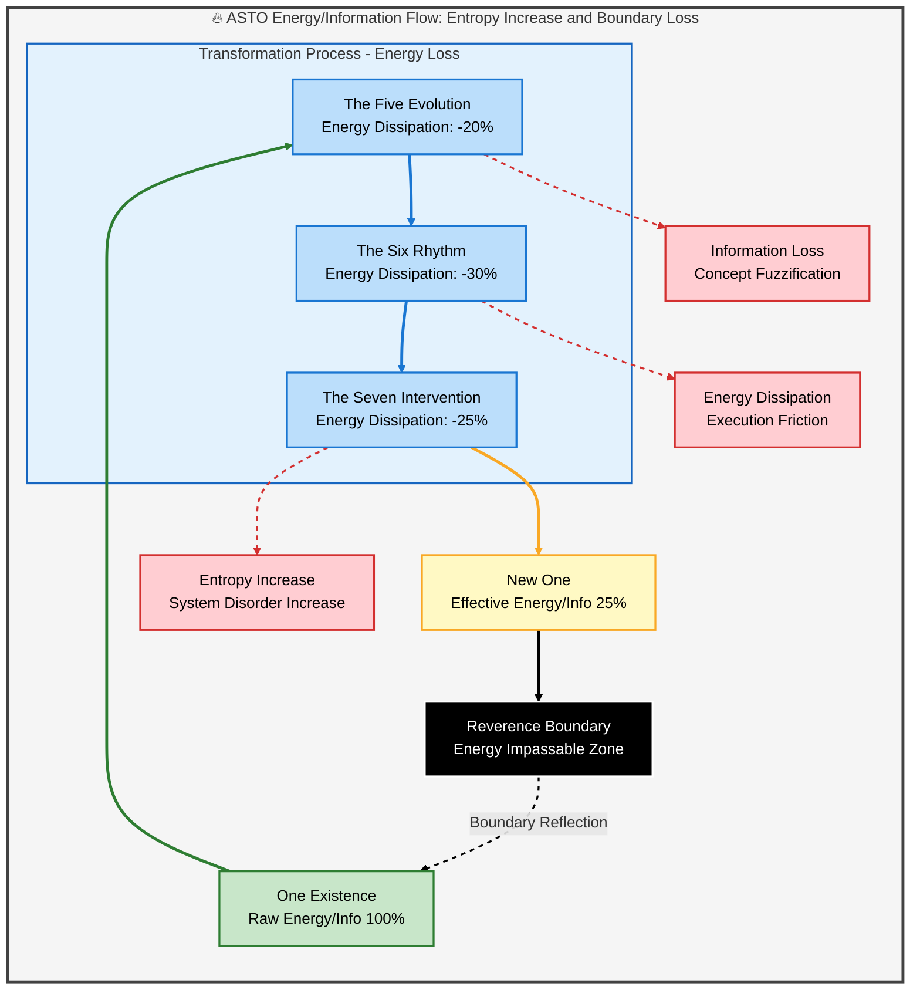
```mermaid
flowchart TD
    classDef source fill:#C8E6C9,stroke:#2E7D32,color:#000,stroke-width:2px
    classDef process fill:#BBDEFB,stroke:#1976D2,color:#000,stroke-width:2px
    classDef loss fill:#FFCDD2,stroke:#D32F2F,color:#000,stroke-width:2px
    classDef output fill:#FFF9C4,stroke:#F9A825,color:#000,stroke-width:2px
    classDef boundary fill:#000000,stroke:#FFFFFF,color:#FFF,stroke-width:2px

    subgraph E ["🔥 ASTO Energy/Information Flow: Entropy Increase and Boundary Loss"]
        direction TB
        
        SOURCE["One Existence<br/>Raw Energy/Info 100%"]:::source
        
        subgraph TRANSFORM ["Transformation Process - Energy Loss"]
            FIVE["The Five Evolution<br/>Energy Dissipation: -20%"]:::process
            SIX["The Six Rhythm<br/>Energy Dissipation: -30%"]:::process
            SEVEN["The Seven Intervention<br/>Energy Dissipation: -25%"]:::process
        end
        
        LOSS1["Information Loss<br/>Concept Fuzzification"]:::loss
        LOSS2["Energy Dissipation<br/>Execution Friction"]:::loss
        LOSS3["Entropy Increase<br/>System Disorder Increase"]:::loss
        
        OUTPUT["New One<br/>Effective Energy/Info 25%"]:::output
        
        BOUNDARY["Reverence Boundary<br/>Energy Impassable Zone"]:::boundary
        
        SOURCE --> FIVE
        FIVE --> SIX
        SIX --> SEVEN
        SEVEN --> OUTPUT
        
        FIVE --> LOSS1
        SIX --> LOSS2
        SEVEN --> LOSS3
        
        OUTPUT --> BOUNDARY
        BOUNDARY -.->|Boundary Reflection| SOURCE
    end
    
    style E fill:#F5F5F5,stroke:#424242,stroke-width:3px,stroke-dasharray:0
    style TRANSFORM fill:#E3F2FD,stroke:#1565C0,stroke-width:2px
    
    linkStyle 0 stroke:#2E7D32,stroke-width:3px
    linkStyle 1 stroke:#1976D2,stroke-width:3px
    linkStyle 2 stroke:#1976D2,stroke-width:3px
    linkStyle 3 stroke:#F9A825,stroke-width:3px
    linkStyle 4 stroke:#D32F2F,stroke-width:2px,stroke-dasharray:5 5
    linkStyle 5 stroke:#D32F2F,stroke-width:2px,stroke-dasharray:5 5
    linkStyle 6 stroke:#D32F2F,stroke-width:2px,stroke-dasharray:5 5
    linkStyle 7 stroke:#000000,stroke-width:3px
    linkStyle 8 stroke:#000000,stroke-width:2px,stroke-dasharray:5 5
```

### **13. System Failure and Violent Reset: ASTO Debug Path**
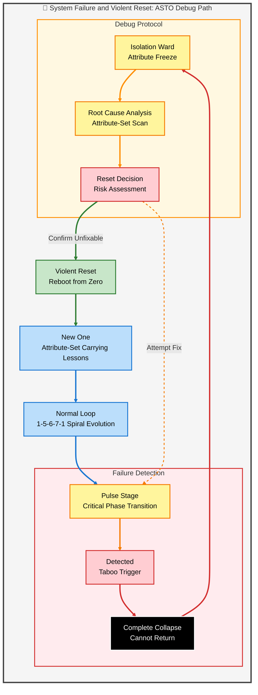
```mermaid
flowchart TD
    classDef normal fill:#BBDEFB,stroke:#1976D2,color:#000,stroke-width:2px
    classDef warning fill:#FFF59D,stroke:#F57C00,color:#000,stroke-width:2px
    classDef error fill:#FFCDD2,stroke:#D32F2F,color:#000,stroke-width:2px
    classDef critical fill:#000000,stroke:#FFFFFF,color:#FFF,stroke-width:2px
    classDef reset fill:#C8E6C9,stroke:#2E7D32,color:#000,stroke-width:2px

    subgraph D ["🚨 System Failure and Violent Reset: ASTO Debug Path"]
        direction TB
        
        NORMAL["Normal Loop<br/>1-5-6-7-1 Spiral Evolution"]:::normal
        
        subgraph FAILURE ["Failure Detection"]
            PULSE["Pulse Stage<br/>Critical Phase Transition"]:::warning
            ERROR["Detected<br/>Taboo Trigger"]:::error
            COLLAPSE["Complete Collapse<br/>Cannot Return"]:::critical
        end
        
        subgraph DEBUG ["Debug Protocol"]
            ISOLATE["Isolation Ward<br/>Attribute Freeze"]:::warning
            ANALYSIS["Root Cause Analysis<br/>Attribute-Set Scan"]:::warning
            DECISION["Reset Decision<br/>Risk Assessment"]:::error
        end
        
        RESET["Violent Reset<br/>Reboot from Zero"]:::reset
        
        NEW["New One<br/>Attribute-Set Carrying Lessons"]:::normal
        
        NORMAL --> PULSE
        PULSE --> ERROR
        ERROR --> COLLAPSE
        
        COLLAPSE --> ISOLATE
        ISOLATE --> ANALYSIS
        ANALYSIS --> DECISION
        
        DECISION -->|Confirm Unfixable| RESET
        DECISION -->|Attempt Fix| PULSE
        
        RESET --> NEW
        NEW --> NORMAL
    end
    
    style D fill:#F5F5F5,stroke:#424242,stroke-width:3px,stroke-dasharray:0
    style FAILURE fill:#FFEBEE,stroke:#D32F2F,stroke-width:2px
    style DEBUG fill:#FFF8E1,stroke:#FF8F00,stroke-width:2px
    
    linkStyle 0 stroke:#1976D2,stroke-width:3px
    linkStyle 1 stroke:#F57C00,stroke-width:3px
    linkStyle 2 stroke:#D32F2F,stroke-width:3px
    linkStyle 3 stroke:#D32F2F,stroke-width:3px
    linkStyle 4 stroke:#FF8F00,stroke-width:3px
    linkStyle 5 stroke:#FF8F00,stroke-width:3px
    linkStyle 6 stroke:#2E7D32,stroke-width:3px
    linkStyle 7 stroke:#F57C00,stroke-width:2px,stroke-dasharray:5 5
    linkStyle 8 stroke:#2E7D32,stroke-width:3px
    linkStyle 9 stroke:#1976D2,stroke-width:3px
```

### **Fig 14: Core Terminology Minimal Definition Set**
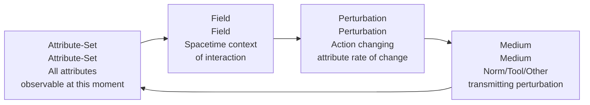
```mermaid
flowchart LR
    A[Attribute-Set<br/>Attribute-Set<br/>All attributes<br/>observable at this moment] --> B[Field<br/>Field<br/>Spacetime context<br/>of interaction]
    B --> C[Perturbation<br/>Perturbation<br/>Action changing<br/>attribute rate of change]
    C --> D[Medium<br/>Medium<br/>Norm/Tool/Other<br/>transmitting perturbation]
    D --> A
```
*Function: Solving the "Concept Black Hole" problem*

### **Fig 15: ASTO vs Traditional Philosophy**
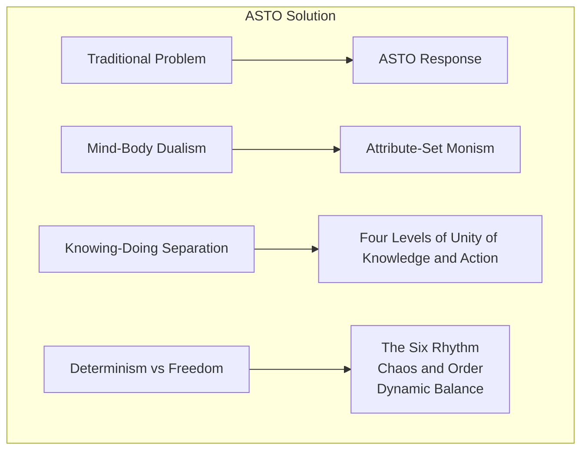
```mermaid
flowchart TD
    subgraph ASTO ["ASTO Solution"]
        A[Traditional Problem] --> B[ASTO Response]
        A1[Mind-Body Dualism] --> B1[Attribute-Set Monism]
        A2[Knowing-Doing Separation] --> B2[Four Levels of Unity of Knowledge and Action]
        A3[Determinism vs Freedom] --> B3[The Six Rhythm<br/>Chaos and Order<br/>Dynamic Balance]
    end
```
*Function: Helping readers with philosophical background quickly locate ASTO's academic coordinates*

### **Fig 16: Mapping of a Complete Case**

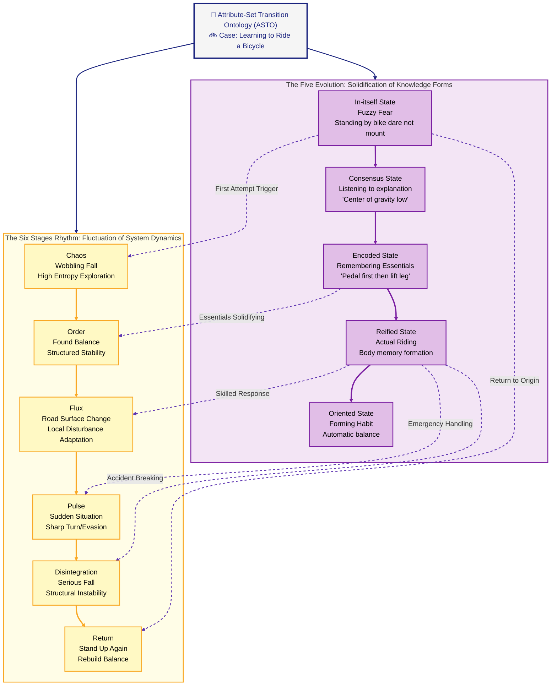
```mermaid
flowchart TB
    classDef five fill:#E1BEE7,stroke:#7B1FA2,color:#000,stroke-width:2px
    classDef six fill:#FFF9C4,stroke:#F9A825,color:#000,stroke-width:2px
    classDef connect fill:#B39DDB,stroke:#5E35B1,color:#000,stroke-width:2px,stroke-dasharray:5 5
    classDef title fill:#F5F5F5,stroke:#1A237E,color:#1A237E,stroke-width:3px

    %% General Title: Double Label
    T["🌌 Attribute-Set Transition Ontology (ASTO)<br/>🚲 Case: Learning to Ride a Bicycle"]:::title
    
    subgraph Upper ["The Five Evolution: Solidification of Knowledge Forms"]
        direction LR
        F1["In-itself State<br/>Fuzzy Fear<br/>Standing by bike dare not mount"]:::five
        F2["Consensus State<br/>Listening to explanation<br/>'Center of gravity low'"]:::five
        F3["Encoded State<br/>Remembering Essentials<br/>'Pedal first then lift leg'"]:::five
        F4["Reified State<br/>Actual Riding<br/>Body memory formation"]:::five
        F5["Oriented State<br/>Forming Habit<br/>Automatic balance"]:::five
        
        F1 --> F2 --> F3 --> F4 --> F5
    end

    subgraph Lower ["The Six Stages Rhythm: Fluctuation of System Dynamics"]
        direction LR
        C1["Chaos<br/>Wobbling Fall<br/>High Entropy Exploration"]:::six
        C2["Order<br/>Found Balance<br/>Structured Stability"]:::six
        C3["Flux<br/>Road Surface Change<br/>Local Disturbance Adaptation"]:::six
        C4["Pulse<br/>Sudden Situation<br/>Sharp Turn/Evasion"]:::six
        C5["Disintegration<br/>Serious Fall<br/>Structural Instability"]:::six
        C6["Return<br/>Stand Up Again<br/>Rebuild Balance"]:::six
        
        C1 --> C2 --> C3 --> C4 --> C5 --> C6
    end

    %% Cross-layer Connection: Showing Interwoven Relationship
    F1 -.->|First Attempt Trigger| C1
    F3 -.->|Essentials Solidifying| C2
    F4 -.->|Skilled Response| C3
    F4 -.->|Emergency Handling| C4
    F4 -.->|Accident Breaking| C5
    F1 -.->|Return to Origin| C6
    
    T --> Upper
    T --> Lower
    
    style Upper fill:#F3E5F5,stroke:#7B1FA2,stroke-width:2px
    style Lower fill:#FFFDE7,stroke:#F9A825,stroke-width:2px
    
    linkStyle 0 stroke:#7B1FA2,stroke-width:3px
    linkStyle 1 stroke:#7B1FA2,stroke-width:3px
    linkStyle 2 stroke:#7B1FA2,stroke-width:3px
    linkStyle 3 stroke:#7B1FA2,stroke-width:3px
    
    linkStyle 4 stroke:#F9A825,stroke-width:3px
    linkStyle 5 stroke:#F9A825,stroke-width:3px
    linkStyle 6 stroke:#F9A825,stroke-width:3px
    linkStyle 7 stroke:#F9A825,stroke-width:3px
    linkStyle 8 stroke:#F9A825,stroke-width:3px
    
    linkStyle 9 stroke:#5E35B1,stroke-width:2px,stroke-dasharray:5 5
    linkStyle 10 stroke:#5E35B1,stroke-width:2px,stroke-dasharray:5 5
    linkStyle 11 stroke:#5E35B1,stroke-width:2px,stroke-dasharray:5 5
    linkStyle 12 stroke:#5E35B1,stroke-width:2px,stroke-dasharray:5 5
    linkStyle 13 stroke:#5E35B1,stroke-width:2px,stroke-dasharray:5 5
    linkStyle 14 stroke:#5E35B1,stroke-width:2px,stroke-dasharray:5 5
    
    linkStyle 15 stroke:#1A237E,stroke-width:2px
    linkStyle 16 stroke:#1A237E,stroke-width:2px
```

### AI. Explanation of ASTO Theoretical System Overview Map for AI

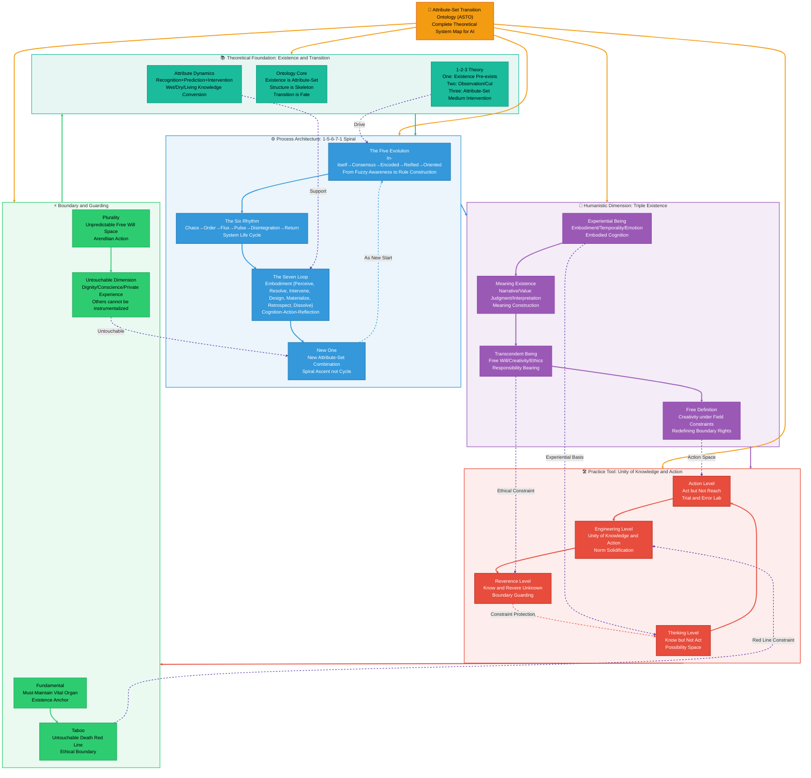
```mermaid
flowchart TB
    classDef core fill:#2c3e50,stroke:#34495e,color:#ecf0f1,stroke-width:3px
    classDef theory fill:#1abc9c,stroke:#16a085,color:#000,stroke-width:2px
    classDef process fill:#3498db,stroke:#2980b9,color:#fff,stroke-width:2px
    classDef human fill:#9b59b6,stroke:#8e44ad,color:#fff,stroke-width:2px
    classDef practice fill:#e74c3c,stroke:#c0392b,color:#fff,stroke-width:2px
    classDef boundary fill:#2ecc71,stroke:#27ae60,color:#000,stroke-width:2px
    classDef title fill:#f39c12,stroke:#e67e22,color:#000,stroke-width:3px

    %% Core Title
    T["🌌 Attribute-Set Transition Ontology (ASTO)<br/>Complete Theoretical System Map for AI"]:::title
    
    %% Theoretical Foundation Module
    subgraph THEORY ["📚 Theoretical Foundation: Existence and Transition"]
        ONTOLOGY["Ontology Core<br/>Existence is Attribute-Set<br/>Structure is Skeleton<br/>Transition is Fate"]:::theory
        TRIAD["1-2-3 Theory<br/>One: Existence Pre-exists<br/>Two: Observation/Cut<br/>Three: Attribute-Set Medium Intervention"]:::theory
        ATTRIBUTES["Attribute Dynamics<br/>Recognition+Prediction+Intervention<br/>Wet/Dry/Living Knowledge Conversion"]:::theory
    end
    
    %% Process Architecture Module
    subgraph PROCESS ["⚙️ Process Architecture: 1-5-6-7-1 Spiral"]
        ONEFIVE["The Five Evolution<br/>In-itself→Consensus→Encoded→Reified→Oriented<br/>From Fuzzy Awareness to Rule Construction"]:::process
        FIVESIX["The Six Rhythm<br/>Chaos→Order→Flux→Pulse→Disintegration→Return<br/>System Life Cycle"]:::process
        SIXSEVEN["The Seven Loop<br/>Embodiment {Perceive, Resolve, Intervene, Design, Materialize, Retrospect, Dissolve}<br/>Cognition-Action-Reflection"]:::process
        SEVENONE["New One<br/>New Attribute-Set Combination<br/>Spiral Ascent not Cycle"]:::process
    end
    
    ONEFIVE --> FIVESIX --> SIXSEVEN --> SEVENONE
    SEVENONE -.->|As New Start| ONEFIVE
    
    %% Humanistic Dimension Module
    subgraph HUMAN ["👥 Humanistic Dimension: Triple Existence"]
        EXPERIENTIAL["Experiential Being<br/>Embodiment/Temporality/Emotion<br/>Embodied Cognition"]:::human
        MEANING["Meaning Existence<br/>Narrative/Value Judgment/Interpretation<br/>Meaning Construction"]:::human
        TRANSCENDENT["Transcendent Being<br/>Free Will/Creativity/Ethics<br/>Responsibility Bearing"]:::human
        FREEDOM["Free Definition<br/>Creativity under Field Constraints<br/>Redefining Boundary Rights"]:::human
    end
    
    EXPERIENTIAL --> MEANING --> TRANSCENDENT --> FREEDOM
    
    %% Practice Tool Module
    subgraph PRACTICE ["🛠️ Practice Tool: Unity of Knowledge and Action"]
        THINKING["Thinking Level<br/>Know but Not Act<br/>Possibility Space"]:::practice
        ACTING["Action Level<br/>Act but Not Reach<br/>Trial and Error Lab"]:::practice
        ENGINEERING["Engineering Level<br/>Unity of Knowledge and Action<br/>Norm Solidification"]:::practice
        REVERENCE["Reverence Level<br/>Know and Revere Unknown<br/>Boundary Guarding"]:::practice
    end
    
    THINKING --> ACTING --> ENGINEERING --> REVERENCE
    REVERENCE -.->|Constraint Protection| THINKING
    
    %% Boundary and Guarding Module
    subgraph BOUNDARY ["⚡ Boundary and Guarding"]
        FUNDAMENTAL["Fundamental<br/>Must-Maintain Vital Organ<br/>Existence Anchor"]:::boundary
        TABOO["Taboo<br/>Untouchable Death Red Line<br/>Ethical Boundary"]:::boundary
        PLURALITY["Plurality<br/>Unpredictable Free Will Space<br/>Arendtian Action"]:::boundary
        UNTOUCHABLE["Untouchable Dimension<br/>Dignity/Conscience/Private Experience<br/>Others cannot be instrumentalized"]:::boundary
    end
    
    FUNDAMENTAL --> TABOO
    PLURALITY --> UNTOUCHABLE
    
    %% Core Connections: Theory to Practice
    T --> THEORY
    T --> PROCESS
    T --> HUMAN
    T --> PRACTICE
    T --> BOUNDARY
    
    THEORY --> PROCESS
    PROCESS --> HUMAN
    HUMAN --> PRACTICE
    PRACTICE --> BOUNDARY
    BOUNDARY --> THEORY
    
    %% Key Cross Connections
    TRIAD -.->|Drive| ONEFIVE
    ATTRIBUTES -.->|Support| SIXSEVEN
    EXPERIENTIAL -.->|Experiential Basis| THINKING
    TRANSCENDENT -.->|Ethical Constraint| REVERENCE
    FREEDOM -.->|Action Space| ACTING
    TABOO -.->|Red Line Constraint| ENGINEERING
    UNTOUCHABLE -.->|Untouchable| SEVENONE
    
    style THEORY fill:#E8F6F3,stroke:#1abc9c,stroke-width:2px
    style PROCESS fill:#EBF5FB,stroke:#3498db,stroke-width:2px
    style HUMAN fill:#F4ECF7,stroke:#9b59b6,stroke-width:2px
    style PRACTICE fill:#FDEDEC,stroke:#e74c3c,stroke-width:2px
    style BOUNDARY fill:#EAFAF1,stroke:#2ecc71,stroke-width:2px
    
    linkStyle 0 stroke:#3498db,stroke-width:3px
    linkStyle 1 stroke:#3498db,stroke-width:3px
    linkStyle 2 stroke:#3498db,stroke-width:3px
    linkStyle 3 stroke:#3498db,stroke-width:2px,stroke-dasharray:5 5
    
    linkStyle 4 stroke:#9b59b6,stroke-width:3px
    linkStyle 5 stroke:#9b59b6,stroke-width:3px
    linkStyle 6 stroke:#9b59b6,stroke-width:3px
    
    linkStyle 7 stroke:#e74c3c,stroke-width:3px
    linkStyle 8 stroke:#e74c3c,stroke-width:3px
    linkStyle 9 stroke:#e74c3c,stroke-width:3px
    linkStyle 10 stroke:#e74c3c,stroke-width:2px,stroke-dasharray:5 5
    
    linkStyle 11 stroke:#2ecc71,stroke-width:3px
    linkStyle 12 stroke:#2ecc71,stroke-width:3px
    
    linkStyle 13 stroke:#f39c12,stroke-width:3px
    linkStyle 14 stroke:#f39c12,stroke-width:3px
    linkStyle 15 stroke:#f39c12,stroke-width:3px
    linkStyle 16 stroke:#f39c12,stroke-width:3px
    linkStyle 17 stroke:#f39c12,stroke-width:3px
    
    linkStyle 18 stroke:#1abc9c,stroke-width:3px
    linkStyle 19 stroke:#3498db,stroke-width:3px
    linkStyle 20 stroke:#9b59b6,stroke-width:3px
    linkStyle 21 stroke:#e74c3c,stroke-width:3px
    linkStyle 22 stroke:#2ecc71,stroke-width:3px
    
    linkStyle 23 stroke:#5E35B1,stroke-width:2px,stroke-dasharray:5 5
    linkStyle 24 stroke:#5E35B1,stroke-width:2px,stroke-dasharray:5 5
    linkStyle 25 stroke:#5E35B1,stroke-width:2px,stroke-dasharray:5 5
    linkStyle 26 stroke:#5E35B1,stroke-width:2px,stroke-dasharray:5 5
    linkStyle 27 stroke:#5E35B1,stroke-width:2px,stroke-dasharray:5 5
    linkStyle 28 stroke:#5E35B1,stroke-width:2px,stroke-dasharray:5 5
    linkStyle 29 stroke:#5E35B1,stroke-width:2px,stroke-dasharray:5 5		
    
```

#### **Explanation of ASTO Theoretical System Overview Map for AI**

This map is designed specifically for AI as a **complete map of the ASTO theoretical system**, containing all core modules and their interrelationships:

##### **Six Modules:**

1. **📚 Theoretical Foundation** (Cyan)
   - Ontology Core: Existence is Attribute-Set, Structure is Skeleton, Transition is Fate
   - 1-2-3 Theory: Pre-Existence → Observation/Cut → Attribute-Set Medium Intervention
   - Attribute Dynamics: Recognition+Prediction+Intervention, Wet/Dry/Living Knowledge Conversion

2. **⚙️ Process Architecture** (Blue)
   - **1-5-6-7-1 Spiral**: The Five Evolution → The Six Rhythm → The Seven Loop → New One
   - Emphasizing spiral ascent rather than simple cycle

3. **👥 Humanistic Dimension** (Purple)
   - Triple Existence: Experiential → Meaning → Transcendent
   - Free Definition: Creativity under Field Constraints

4. **🛠️ Practice Tool** (Red)
   - Four Levels of Unity of Knowledge and Action: Thinking → Action → Engineering → Reverence
   - Complete transition path from knowledge to action

5. **⚡ Boundary and Guarding** (Green)
   - Fundamental and Taboo: Vital Organ vs Death Red Line
   - Plurality and Untouchable Dimension: Free Will Space and Ethical Bottom Line

6. **🌌 Center Title** (Orange)
   - Clearly labeled "Complete Theoretical System Map for AI"

##### **Key Features:**

1. **Color Coding System**: Each module has a unique color for AI memory and distinction
2. **Complete Loop**: Showing the closed loop of Theory → Process → Human → Practice → Boundary → Theory
3. **Cross Connection**: Dotted lines show support and constraint relationships between key concepts
4. **Spiral Ascent**: Emphasizing 1-5-6-7-1 is evolution, not simple repetition

##### **Prompt for AI:**

"This map displays the complete architecture of ASTO theory. When you need to:
1. **Understand Existence** → Check Theoretical Foundation Module
2. **Analyze Change** → Check Process Architecture Module
3. **Consider Human Factors** → Check Humanistic Dimension Module
4. **Design Action** → Check Practice Tool Module
5. **Set Boundaries** → Check Boundary Guarding Module

All modules are interconnected, forming a complete Philosophy-Engineering-Ethics system."

This map should enable AI to quickly grasp the full picture of ASTO theory and delve into specific modules when needed.

---

### **Fig 17: Inevitability of Cognitive Error: Three Constraints Mechanism**
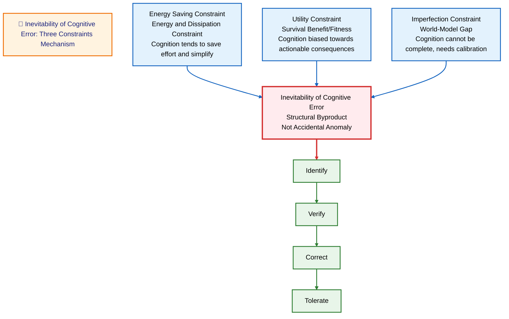
```mermaid
flowchart TD
    classDef axiom fill:#E3F2FD,stroke:#1565C0,color:#000,stroke-width:2px
    classDef result fill:#FFEBEE,stroke:#D32F2F,color:#000,stroke-width:3px
    classDef strategy fill:#E8F5E9,stroke:#2E7D32,color:#000,stroke-width:2px
    classDef title fill:#F5F5F5,stroke:#1A237E,color:#1A237E,stroke-width:3px

    T["🌌 Inevitability of Cognitive Error: Three Constraints Mechanism"]:::title
    
    A1["Energy Saving Constraint<br/>Energy and Dissipation Constraint<br/>Cognition tends to save effort and simplify"]:::axiom
    A2["Utility Constraint<br/>Survival Benefit/Fitness<br/>Cognition biased towards actionable consequences"]:::axiom
    A3["Imperfection Constraint<br/>World-Model Gap<br/>Cognition cannot be complete, needs calibration"]:::axiom
    
    R["Inevitability of Cognitive Error<br/>Structural Byproduct<br/>Not Accidental Anomaly"]:::result
    
    S1["Identify"]:::strategy
    S2["Verify"]:::strategy
    S3["Correct"]:::strategy
    S4["Tolerate"]:::strategy
    
    A1 & A2 & A3 --> R
    R --> S1 --> S2 --> S3 --> S4
    
    style T fill:#FFF3E0,stroke:#EF6C00,stroke-width:2px
    
    linkStyle 0 stroke:#1565C0,stroke-width:2px
    linkStyle 1 stroke:#1565C0,stroke-width:2px
    linkStyle 2 stroke:#1565C0,stroke-width:2px
    linkStyle 3 stroke:#D32F2F,stroke-width:3px
    linkStyle 4 stroke:#2E7D32,stroke-width:2px
    linkStyle 5 stroke:#2E7D32,stroke-width:2px
    linkStyle 6 stroke:#2E7D32,stroke-width:2px
```

---

### **Fig 18: Three States of Knowledge (Wet/Dry/Living) Flow and SECI Model**
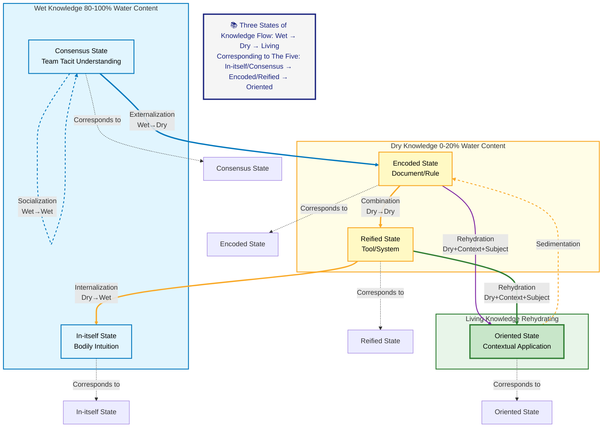
```mermaid
flowchart TD
    classDef wet fill:#E1F5FE,stroke:#0277BD,color:#000,stroke-width:2px
    classDef dry fill:#FFF9C4,stroke:#F9A825,color:#000,stroke-width:2px
    classDef living fill:#C8E6C9,stroke:#2E7D32,color:#000,stroke-width:3px
    classDef process fill:#F3E5F5,stroke:#7B1FA2,color:#000,stroke-width:2px
    classDef title fill:#F5F5F5,stroke:#1A237E,color:#1A237E,stroke-width:3px

    T["📚 Three States of Knowledge Flow: Wet → Dry → Living<br/>Corresponding to The Five: In-itself/Consensus → Encoded/Reified → Oriented"]:::title
    
    subgraph Wet ["Wet Knowledge 80-100% Water Content"]
        W1["In-itself State<br/>Bodily Intuition"]:::wet
        W2["Consensus State<br/>Team Tacit Understanding"]:::wet
    end
    
    subgraph Dry ["Dry Knowledge 0-20% Water Content"]
        D1["Encoded State<br/>Document/Rule"]:::dry
        D2["Reified State<br/>Tool/System"]:::dry
    end
    
    subgraph Living ["Living Knowledge Rehydrating"]
        L["Oriented State<br/>Contextual Application"]:::living
    end
    
    %% SECI Process
    W2 -->|Socialization<br/>Wet→Wet| W2
    W2 -->|Externalization<br/>Wet→Dry| D1
    D1 -->|Combination<br/>Dry→Dry| D2
    D2 -->|Internalization<br/>Dry→Wet| W1
    
    %% Rehydration Process
    D1 & D2 -->|Rehydration<br/>Dry+Context+Subject| L
    L -->|Sedimentation| D1
    
    %% Five States Correspondence Annotation
    W1 -.->|Corresponds to| F1[In-itself State]
    W2 -.->|Corresponds to| F2[Consensus State]
    D1 -.->|Corresponds to| F3[Encoded State]
    D2 -.->|Corresponds to| F4[Reified State]
    L -.->|Corresponds to| F5[Oriented State]
    
    style Wet fill:#E1F5FE,stroke:#0277BD,stroke-width:2px
    style Dry fill:#FFFDE7,stroke:#F9A825,stroke-width:2px
    style Living fill:#E8F5E9,stroke:#2E7D32,stroke-width:2px
    
    linkStyle 0 stroke:#0277BD,stroke-width:2px,stroke-dasharray:5 5
    linkStyle 1 stroke:#0277BD,stroke-width:3px
    linkStyle 2 stroke:#F9A825,stroke-width:3px
    linkStyle 3 stroke:#F9A825,stroke-width:3px
    linkStyle 4 stroke:#7B1FA2,stroke-width:2px
    linkStyle 5 stroke:#2E7D32,stroke-width:3px
    linkStyle 6 stroke:#F9A825,stroke-width:2px,stroke-dasharray:5 5
```

---

### **Fig 19: Perturbation Epistemology: Sensing-Perturbing Loop**
```mermaid
flowchart TD
    classDef field fill:#E8F5E9,stroke:#2E7D32,color:#000,stroke-width:2px
    classDef perceive fill:#E3F2FD,stroke:#1565C0,color:#000,stroke-width:2px
    classDef process fill:#FFF9C4,stroke:#F9A825,color:#000,stroke-width:2px
    classDef act fill:#FFEBEE,stroke:#D32F2F,color:#000,stroke-width:2px
    classDef title fill:#F5F5F5,stroke:#1A237E,color:#1A237E,stroke-width:3px

    T["🔄 Perturbation Epistemology: Sensing-Perturbing Loop<br/>Dynamic Mechanism of Unity of Knowledge and Action"]:::title
    
    subgraph Field ["Field"]
        F1["Interaction/Coupling<br/>Concreteness: Intensity/Direction/Scale/Duration"]:::field
    end
    
    subgraph Knowing ["Knowing (Sensing)"]
        P1["Threshold Window<br/>Perceptible across threshold"]:::perceive
        P2["Attribute Recognition<br/>Difference information capture"]:::perceive
        P3["Trend Prediction<br/>Forecasting change direction"]:::process
    end
    
    subgraph Doing ["Doing (Perturbing)"]
        A1["Intervention Decision<br/>Minimal action design"]:::act
        A2["Perturbing Action<br/>Injecting energy into field"]:::act
    end
    
    F1 -->|Perturbation crosses threshold| P1
    P1 --> P2 --> P3
    P3 -->|Knowledge-Action Leap| A1
    A1 --> A2
    A2 -->|Change Field| F1
    
    %% Loop Annotation
    C1["Loop Completed<br/>Unity of Knowledge and Action"]:::process
    
    A2 -.->|Feedback Correction| C1
    C1 -.->|New Cognition| P2
    
    style Field fill:#E8F5E9,stroke:#2E7D32,stroke-width:2px
    style Knowing fill:#E3F2FD,stroke:#1565C0,stroke-width:2px
    style Doing fill:#FFEBEE,stroke:#D32F2F,stroke-width:2px
    
    linkStyle 0 stroke:#2E7D32,stroke-width:3px
    linkStyle 1 stroke:#1565C0,stroke-width:2px
    linkStyle 2 stroke:#1565C0,stroke-width:2px
    linkStyle 3 stroke:#F9A825,stroke-width:3px
    linkStyle 4 stroke:#D32F2F,stroke-width:3px
    linkStyle 5 stroke:#D32F2F,stroke-width:3px
    linkStyle 6 stroke:#2E7D32,stroke-width:2px,stroke-dasharray:5 5
    linkStyle 7 stroke:#F9A825,stroke-width:2px,stroke-dasharray:5 5
```

---

### **Fig 20: Productive vs Destructive Defect Decision Tree**
```mermaid
flowchart TD
    classDef question fill:#FFF9C4,stroke:#F9A825,color:#000,stroke-width:2px
    classDef productive fill:#C8E6C9,stroke:#2E7D32,color:#000,stroke-width:3px
    classDef destructive fill:#FFCDD2,stroke:#D32F2F,color:#000,stroke-width:3px
    classDef title fill:#F5F5F5,stroke:#1A237E,color:#1A237E,stroke-width:3px

    T["⚖️ Defect Nature Determination Decision Tree<br/>Productive vs Destructive Defect"]:::title
    
    Start["Detect Cognitive Bias"]:::question
    
    Q1["Generates new possibilities? - Creativity/Metaphor/Association"]:::question
    Q2["Occurs when info insufficient? - Exploration/Filling gaps"]:::question
    Q3["Harms others' plurality? - Dignity/Freedom/Ethics"]:::question
    
    P1["Productive Defect<br/>Productive"]:::productive
    D1["Destructive Defect<br/>Destructive"]:::destructive
    D2["Destructive Defect<br/>Destructive"]:::destructive
    D3["Destructive Defect<br/>Destructive"]:::destructive
    
    Start --> Q1
    
    Q1 -->|Yes| Q2
    Q1 -->|No| D1
    
    Q2 -->|Yes| Q3
    Q2 -->|No| D2
    
    Q3 -->|No| P1
    Q3 -->|Yes| D3
    
    %% Strategy Annotation
    P1 -->|Strategy: Protect<br/>Use bias for creation| S1["Keep in Thinking Level<br/>As innovation hotbed"]
    D1 -->|Strategy: Counter<br/>Structural inhibition| S2["Solidify in Engineering Level<br/>checklist/Double check"]
    D2 -->|Strategy: Counter<br/>Correction mechanism| S3["Introduce verification<br/>Evidentiary cognition"]
    D3 -->|Strategy: Counter<br/>Ethical circuit breaker| S4["Taboo guarding<br/>Stop immediately"]
    
    style T fill:#FFF3E0,stroke:#EF6C00,stroke-width:2px
    
    linkStyle 0 stroke:#F9A825,stroke-width:2px
    linkStyle 1 stroke:#D32F2F,stroke-width:3px
    linkStyle 2 stroke:#F9A825,stroke-width:2px
    linkStyle 3 stroke:#D32F2F,stroke-width:3px
    linkStyle 4 stroke:#F9A825,stroke-width:2px
    linkStyle 5 stroke:#2E7D32,stroke-width:3px
    linkStyle 6 stroke:#D32F2F,stroke-width:3px
    linkStyle 7 stroke:#2E7D32,stroke-width:2px,stroke-dasharray:5 5
    linkStyle 8 stroke:#D32F2F,stroke-width:2px,stroke-dasharray:5 5
    linkStyle 9 stroke:#D32F2F,stroke-width:2px,stroke-dasharray:5 5
    linkStyle 10 stroke:#D32F2F,stroke-width:2px,stroke-dasharray:5 5
```

---

### **Fig 21: Three-Component Structure of "Knowing" Ability**
```mermaid
flowchart TD
    classDef input fill:#E8F5E9,stroke:#2E7D32,color:#000,stroke-width:2px
    classDef process fill:#BBDEFB,stroke:#1976D2,color:#000,stroke-width:2px
    classDef output fill:#FFEBEE,stroke:#D32F2F,color:#000,stroke-width:2px
    classDef formula fill:#FFF9C4,stroke:#F9A825,color:#000,stroke-width:3px
    classDef title fill:#F5F5F5,stroke:#1A237E,color:#1A237E,stroke-width:3px

    T["🧠 Knowing = Attribute Recognition + Trend Prediction + Intervention Ability<br/>ASTO Operational Definition"]:::title
    
    subgraph Input ["Input: Field Signals"]
        I1["Attribute-Set Attributes<br/>Color/Weight/Emotion/Relation"]:::input
        I2["Field Situation<br/>Time/Space/Others"]:::input
    end
    
    subgraph Processing ["Processing: Cognitive Ability"]
        P1["Attribute Recognition<br/>Distinguish Key/Noise<br/>Attribute Recognition"]:::process
        P2["Trend Prediction<br/>Forecast change direction<br/>Trend Prediction"]:::process
        P3["Intervention Ability<br/>Design effective action<br/>Intervention Capacity"]:::process
    end
    
    subgraph Output ["Output: Effective Action"]
        O1["Perturbation Release<br/>Change attribute-set transition path"]:::output
        O2["Field Feedback<br/>Verify cognitive validity"]:::output
    end
    
    F["Formula:<br/>Knowing =<br/>Recognition ∩ Prediction ∩ Intervention<br/>None can be missing"]:::formula
    
    I1 & I2 --> P1
    P1 --> P2 --> P3
    P3 --> O1 --> O2
    O2 -.->|Correct| P1
    
    %% Missing Warning
    M1["Only Recognition<br/>No Intervention=Spectator"]:::output
    M2["Only Prediction<br/>No Recognition=Daydreaming"]:::output
    M3["Only Intervention<br/>No Prediction=Blind Action"]:::output
    
    P1 -.->|Missing latter two| M1
    P2 -.->|Missing first/last| M2
    P3 -.->|Missing first two| M3
    
    style Processing fill:#E3F2FD,stroke:#1565C0,stroke-width:2px
    
    linkStyle 0 stroke:#2E7D32,stroke-width:2px
    linkStyle 1 stroke:#2E7D32,stroke-width:2px
    linkStyle 2 stroke:#1565C0,stroke-width:3px
    linkStyle 3 stroke:#1565C0,stroke-width:3px
    linkStyle 4 stroke:#D32F2F,stroke-width:3px
    linkStyle 5 stroke:#D32F2F,stroke-width:2px,stroke-dasharray:5 5
    linkStyle 6 stroke:#F9A825,stroke-width:3px
    linkStyle 7 stroke:#D32F2F,stroke-width:2px,stroke-dasharray:3 3
    linkStyle 8 stroke:#D32F2F,stroke-width:2px,stroke-dasharray:3 3
    linkStyle 9 stroke:#D32F2F,stroke-width:2px,stroke-dasharray:3 3
```

---

###  📊 Fig 22: ASTO × ODD Full Loop Dynamics

#### Subtitle: Spiral Transition from Existence to Practice to Executable Reality

```mermaid
flowchart TD
    %% ========== Style Definitions ==========
    classDef human fill:#FFE6CC,stroke:#CC7A00,color:#000,stroke-width:2px;
    classDef ontology fill:#E6F0FF,stroke:#3366CC,color:#000,stroke-width:2px;
    classDef contract fill:#E8FFE8,stroke:#2E8B57,color:#000,stroke-width:2px;
    classDef artifact fill:#FFF5CC,stroke:#B8860B,color:#000,stroke-width:2px;
    classDef process fill:#F2E6FF,stroke:#6A5ACD,color:#000,stroke-width:2px;
    classDef feedback fill:#FFE6E6,stroke:#B22222,color:#000,stroke-width:2px;
    classDef ethics fill:#000000,stroke:#FFFFFF,color:#FFF,stroke-width:3px;
    classDef title fill:#F5F5F5,stroke:#1A237E,color:#1A237E,stroke-width:4px,font-size:18px;

    %% ========== Master Title ==========
    MasterTitle["🌌 ASTO × ODD Full Loop Dynamics<br/>Spiral Transition from Existence to Practice to Executable Reality"]:::title

    %% ========== Ontology Layer ==========
    R[Real One<br/>World = Attribute-Set Transition Flux]:::ontology
    
    R --> T[Body Triad Structure<br/>Human/Attribute-Set/Existence]:::ontology
    
    T --> H[Human<br/>Triple Existence + Free Definition<br/>Experience/Meaning/Transcendence]:::human
    T --> A[Attribute-Set<br/>Recombinable Config + Weight<br/>Contract/Structure/Norm]:::contract
    T --> E[Existence<br/>Thing capable of being acknowledged]:::ontology

    %% ========== Field Layer ==========
    E --> F[Enter Field<br/>Encounter Field]:::process
    
    F --> D[Mutual Perturbation<br/>Sensing→Perturbing Flip]:::process
    
    D --> N[New Existence Generation<br/>Transition Reconstruction]:::ontology
    
    %% ========== Practice Translation Layer ==========
    H --> S[Spec<br/>Explicit Description of Attribute-Set]:::contract
    A --> S
    
    S --> AA[Atomic Artifact<br/>Atomic Artifact]:::artifact
    
    AA --> AN[Artifact Network<br/>Artifact Network]:::artifact
    
    AN --> V[Validation System<br/>Tech Verification + Ethical Circuit Breaker]:::process
    
    V -->|Tech Pass| OK[Acknowledged Existence<br/>Enter Engineering Layer]:::artifact
    V -->|Tech Fail| FB[Revision/Refactoring]:::feedback
    V -->|Ethical Violation| ETH[Taboo Trigger]:::ethics
    
    ETH --> S
    
    FB --> S
    
    %% ========== Practice Loop Closure ==========
    OK --> PR[Practice Loop Closure<br/>Release Cognitive Bandwidth]:::process
    PR -->|Sediment as Weight| A
    PR -->|Trigger Reflection| H
    
    %% ========== Failure Value Capture ==========
    N -.->|Lesson Update| H
    N -.->|Update Weight| A
    
    %% ========== Ethical Guardian Layer ==========
    subgraph Ethics ["⚫ Reverence Boundary"]
        E1[Untouchable Dimension<br/>Dignity/Conscience/Privacy]:::ethics
        E2[Plurality<br/>Others cannot be instrumentalized]:::ethics
    end
    
    ETH --> Ethics
    Ethics -.->|Constraint Design| S
    Ethics -.->|Guardian Verification| V

    MasterTitle -.-> R
```

---

