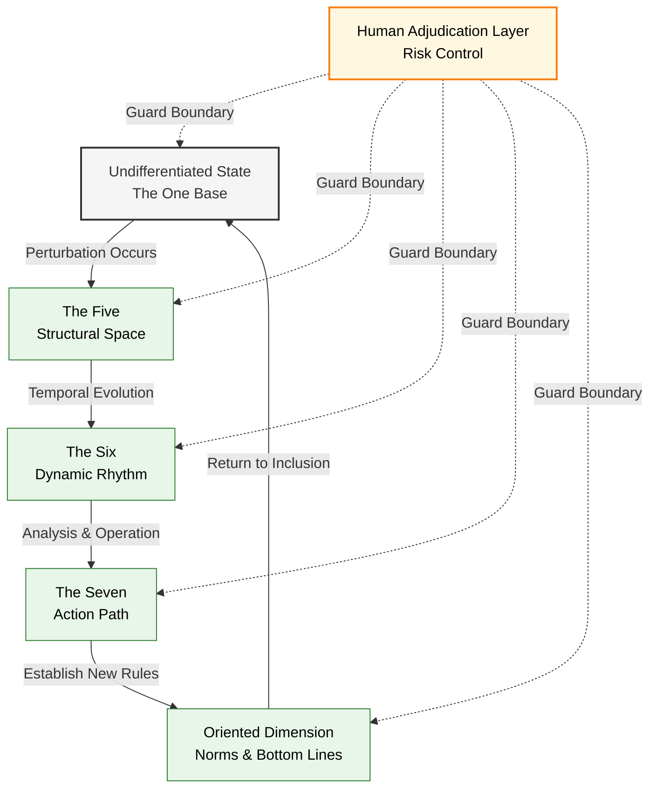

---
title: "ASTO.EN.U04. Practice Loop"
date: "2026-03-20"
version: "v4.3"
author: "Yi Fu (付毅, ODDFounder, fuyi.it@live.cn)"
status: "Working English Support Draft"
layer: "ASTO"
lang: "en"
---

# ASTO v4.3 Attribute-Set Transition Ontology

## Core Dynamics Mechanism

> **Version**: v4.3 (2026.02 Optimized Stable Version)
> **Status Note**: This file is retained as an English support draft. The current public entry remains `ASTO.U00` and the main `P` chain.
> **Positioning Statement**: ASTO is a structural language connecting engineering practice with civilizational thinking. It is not an ultimate explanation, but an amendable, replaceable analytical framework.

---

# Section Zero: Framework Positioning Statement (Read First)

ASTO is an **Engineering-Civilization Bridge Framework**.
It is neither a metaphysical system nor a technical operation manual.

It consists of three independently evaluable layers:

---

## 1️⃣ Structural Layer (How to Deconstruct Reality)

ASTO does not discuss ultimate entities.

We solely model "attributes and their relational structures."
Whether attributes possess an independent ontological status is not asserted within this framework.

In other words:

> ASTO cares about how structures change, not what the world is fundamentally "composed" of.

---

## 2️⃣ Inferential Layer (How to Grasp the Rhythm)

If reality can be deconstructed into structures and relationships,

then structural transitions possess an analyzable rhythm.

This constitutes:

* The Five (Spatial Modes)
* The Six (Temporal Rhythms)
* The Seven (Action Sequences)

These are not universal truths,

but analytical tools.

---

## 3️⃣ Normative Layer (How to Hold the Bottom Line)

ASTO does not presuppose values, but acknowledges:

In the current civilizational context, humanity bears the ultimate adjudicative responsibility.

When structural transitions threaten:

* Civilizational continuity
* Fundamental human rights
* Ethical bottom lines

then the human adjudication layer must intervene.

This is a choice of responsibility, not a law of nature.

---

> **Plain Understanding**:
> ASTO gives you a pair of glasses for structural analysis, a chart of action rhythms, and a risk warning indicator.
> Whether to use it, and how to use it, is up to you.

---

# I. Core Terminology: Understanding Change Through a New Language

---

## The One

The undifferentiated state prior to a specific structural division.

It is not the "foundation of all things,"
but the holistic state before analysis occurs.

Life Metaphor:
An unpainted canvas.

---

## Perturbation

The instant a structural difference occurs.

Perturbation is not a cosmic shockwave,
but a change emerging between analytical units.

Life Metaphor:
The first stroke of a brush on the canvas.

---

## Attribute-Set

The set of attribute relationships formed after a perturbation.

It is not an essence,
but the structural trace left by a transition.

---

## Observation is Perturbation

In structural analysis,

any intervention changes the structural state.

This is a methodological statement,
not a metaphysical proposition of consciousness.

---

## Model Boundary Variables (Formerly "Forbidden Zones")

Certain variables cannot be fully structured within the current model.

When these variables involve ethics, rights, or civilizational continuity,

they must be handled by the human adjudication layer.

This is not a mystical realm,
but the limit of the model's capability.

---

# II. Ontological Basis: Apparent Triad, Actual One

ASTO's structural basis describes three analytical perspectives; this is not an ontological division of the world:

### 1. The One (Minimum Ontological Commitment)

The structural field capable of being perturbed. The One is a logical starting point, not a destination that can be returned to.
Any statement claiming to "touch The One" is metaphorical. The One has no internal location to return to; it only possesses logical precedence.

### 2. Perturbation Generates the Dyad

Any functional interaction (perturbation) between existences analytically differentiates into the **Perturbation Participant** and the **Perturbed Existence**. This is an analytical operation, not an ontological cut.
The axiomatic layer solely declares that "perturbation occurs"; it does not stipulate whether the perturbation is caused by physical, conscious, or social factors.

### 3. Attribute-Set as Manifestation (The Third Element)

Under specific perturbation conditions, the identifiable, operable slice of attribute configurations. The reality of the attribute-set is conditional—it merely records that specific perturbation action.

> **The Essence of the Triad**: These are three analytical perspectives of a descriptive language, ultimately pointing to the same structural field capable of being perturbed.

---

# III. Framework Panorama: Where is the Human?

ASTO doesn't proclaim humans are ontologically supreme.

But in the current civilizational structure:

> Humanity bears the ultimate adjudicative responsibility.

Three-layer structure:

* **Adjudication Layer**: Humans undertake ethical and directional judgments.
* **Analysis Layer**: The Five, Six, and Seven serve as tools.
* **Risk Layer**: Triggers protective mechanisms when structures threaten civilizational continuity.

The system is the tool;
responsibility lies with the user.

---

# IV. Core Loop Model (1→5→6→7→1)

Change is not a straight line, but a structural loop.

⚠ Important Note:

> The diagram below is an analytical model, not a declaration of cosmic structure.



This loop indicates:

* State is analyzed
* Rhythm is judged
* Action is executed
* Direction is corrected
* New structure is formed

This is operational logic, not a metaphysical closed loop.

---

# V. The Five: Spatial Forms of Structure

The Five modes are not physical states,
but coordinates of structural maturity.

1. In-itself: Unexpressed structural potential.
2. Consensus: Formation of preliminary stable relations among groups.
3. Encoded: Rules are explicitly defined.
4. Reified: Structure lands as a physical/realistic system.
5. Oriented: Formation of an ecology and self-reinforcing mechanisms.

Common Error:

Attempting to modify a structure in the "Reified State" using "In-itself" methods.

You must return to the Encoded layer.

---

# VI. The Six: Temporal Rhythms of Structure

The Six stages are not historical laws,
but an evolutionary rhythm model.

1. Chaos: High uncertainty.
2. Order: Relative stability.
3. Flux: Internal tension increases.
4. Pulse: Mutation point.
5. Disintegration: Old structure fails.
6. Return: Rebuilding new stability.

Sense of Rhythm:

Avoid excessive perturbation during the Order stage;
Avoid blind protection of the status quo during the Disintegration stage.

---

# VII. The Seven: Action Flow Tools

The Seven sequences are operational paths, not mandatory workflows.

1. Perceive
2. Resolve
3. Intervene
4. Design
5. Reify
6. Retrospect
7. Dissolve

Can be used flexibly (skip steps), but confirmation phases must not be ignored.

---

# VIII. Three Pairs of Core Tensions

ASTO does not eliminate conflicts,
but views tension as the source of dynamic power.

```mermaid
flowchart LR
    subgraph Tension Space
        T1(Structural Constraint) <-->|Tension 1| A1(Subject Agency)
        T2(Stable Order) <-->|Tension 2| A2(Innovative Chaos)
        T3(Algorithmic Efficiency) <-->|Tension 3| A3(Ethical Bottom Line)
    end
    
    H[Human Adjudication Layer] -.->|Buffer & Judge| Tension Space
    
    style T1 fill:#f5f5f5,stroke:#333
    style A1 fill:#e3f2fd,stroke:#1565c0
    style T2 fill:#f5f5f5,stroke:#333
    style A2 fill:#e3f2fd,stroke:#1565c0
    style T3 fill:#f5f5f5,stroke:#333
    style A3 fill:#e3f2fd,stroke:#1565c0
    style H fill:#fff8e1,stroke:#f57f17
```

1. Structural Constraint ↔ Subject Agency
2. Stable Order ↔ Innovative Chaos
3. Algorithmic Efficiency ↔ Ethical Bottom Line

Tensions cannot be eliminated; they can only be managed.

---

# IX. Conceptual Equation (Mental Model)

> Impact on Reality = 
> (Human Intent × [State × Rhythm × Action]) × Risk Correction Coefficient

Explanation:

* Human intent provides direction.
* The Five × The Six × The Seven provide coordinates.
* The Risk Correction Coefficient can drop to zero if civilizational bottom lines are touched.

This equation is a mental model,
not a computable formula.

---

# X. Final Clarification

ASTO can help you:

* Analyze complex situations
* Judge rhythms
* Arrange actions
* Identify risks

ASTO cannot:

* Substitute ethical responsibility
* Provide ultimate answers
* Explain all existence

When theory threatens to override human judgment,

prioritize reserving human judgment.

---

# Version Declaration

ASTO v4.3 is an open framework version.
It will be revised in the future based on practice and critique.

It is not a faith,
nor the final chapter of a worldview,
but a structural analysis language.
