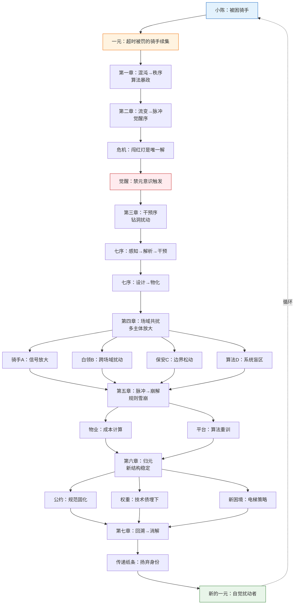

# ASTO.H03. 故事：小陈的那条路

> **Version**: Hum.v2.0
> **Status**: 公开人文支线稿
> **发布边界**：本文属于 ASTO 的公开人文支线稿，用于理解、传播与低门槛转译，不纳入首轮公开主包。
> **作者 / Author**：Yi Fu（付毅，ODDFounder，fuyi.it@live.cn）
> **Audience**: 每一个奋斗者。
> **Abstract**: 困在时间里的蚂蚁——关于结构与自由的故事。
> **Context**: 这是一个关于“结构”与“自由”的故事。如果你看不懂 ASTO 的公理，看这个故事就够了。

---

## **第一章：困在时间里的蚂蚁**

小陈，28岁，河南周口人。在这座城市里，他是一只不知疲倦的蚂蚁，他的世界被两样东西定义：**电动车**和**倒计时**。

那是一个周三的暴雨夜。系统派了一单，从城中村到CBD写字楼，3.2公里，**限时28分钟**。小陈扫了一眼导航："28分钟？正常骑都要25分钟，还得等三个红灯，下雨路滑，至少35分钟。"

他点了"接单"，因为不接，今天的完成率就低于90%，明天系统会派更远的单。

**算法的暴政是有耐心的。**
三年前刚入行时，系统给一单的时间是45分钟。"挺好的，跑一单赚一单，自由。"小陈当时这么想。但他不知道，他面对的是一个**"负反馈调节系统"**——每个人都想跑得更快一点，系统就捕捉到了这个"平均速度提升"的数据，于是算法收紧了。

45分钟 → 40分钟 → 35分钟 → **28分钟**。

现在，暴雨中，小陈的算法画像在云端跳动着一组属集：

> **术语锚点｜属集**：
> 属集，是存在在时间切片上可被指认的属性集合；
> 属集的变迁，构成了存在的全部历史。
>
> 我们不讨论存在“本来是什么”，
> 只讨论它在时间中“此刻呈现为什么”。

- `平均速度: 42km/h`（他闯红灯时的峰值）
- `超时率: 3.2%`（在淘汰线的边缘）
- `接单偏好: 0.8-3.5km`（短途，因为超时风险小）
- `道德风险系数: 未知`（系统不关心这个）

客服说："这是大数据计算的最优路线。"
但"最优路线"里没有暴雨，没有打滑，没有保安的刁难，没有坏掉的电梯。
**系统只看结果：你超时了吗？**

超时一单扣20，超时三次降级，降级就抢不到好单。
如果不跑快点，就会被淘汰。
如果不闯红灯，就会超时。

小陈不想闯红灯。三年前他第一次闯时，手在抖，心说"这是最后一次"。
但当他今晚在路口看着倒计时只剩2分钟，而红灯还有90秒时——
他拧动了油门。雨水糊在脸上，他看不清是雨还是泪。

那一刻，他不是坏人。
他是**被结构挤压变形的人**。

> **ASTO 旁白**：  
> 这就是**结构性恶**。  
> 不是小陈想作恶，是系统结构（超时重罚+极限压缩）消灭了他"守规矩"的选择空间。  
> 当合规的成本（超时）高于违规的成本（闯红灯）时，**违规就成了生存策略**。  
> 这是**混沌阶**向**秩序阶**的异化：**秩序不再服务存在，秩序在消灭道德**。

---

## **第二章：余烬中的道德微光**

那个雨夜之后，小陈病了三天。不是身体，是心。

他反复梦见那个红灯路口——90秒的红灯像血，2分钟的倒计时像刀。他在梦里一次次拧动油门，一次次听见自己说"我不是坏人"，但醒来后枕头是湿的。

**流变开始了**。那是**中年危机**的预演：他开始"隐约觉得不对劲，想改变但很难"。

转折发生在第三天的黄昏。他坐在城中村的出租屋里，10平米，墙壁发霉，窗外是永不熄灭的烧烤摊霓虹。他刷着外卖骑手的论坛，看到一个帖子：

*"兄弟们，我今天闯了三个红灯，不是我想死，是系统逼我杀人。"*

评论区全都是"理解""抱抱""谁不是呢"。
但有一个ID叫"老许"的人留言："**如果我们只讨论怎么闯红灯更快，那我们永远只是数据饲料。**"

小陈的心被击中了。他盯着那句话看了很久，第一次**反身性思考**：
> "我不是坏人，但我正在做坏事。"  
> "系统逼我作恶，但我能否改变系统？"

**觉醒序**在此刻触发。他突然意识到：闯红灯是**禁元**——那个不可让渡的、关于生命安全的伦理底线。他不能触碰它，但**他可以绕开那个迫使它闯红灯的结构**。

他想起城中村和写字楼之间，那个废弃工地。围栏破了个洞，能省8分钟。但那属于"钻漏洞"，他以前觉得不光彩。

现在，他重新计算了**DCI（缺陷创造力指数）**：
- **创新价值**：避开禁元（不闯红灯），还能准时送达
- **修复成本**：可能摔跤、可能被保安骂、可能被当成小偷
- **伦理系数**：2（绿灯域，不伤害他人）
- **领域系数**：0.8（非安全关键系统）

DCI ≈ 8。高优先级探索。

> **ASTO 旁白**：  
> **觉醒**不是顿悟真理，是意识到"我正在用旧结构伤害自己"。  
> **禁元意识**是维度0的具身性显现——小陈的身体还记得心跳加速的恐惧。  
> **脉冲阶**的剧烈震荡，逼迫主体做出**存在论决断**：顺应结构还是介入结构？

---

## **第三章：第一个扰动**

第二天中午，小陈接了个写字楼单，28分钟。他站在那个破洞前，心跳如鼓。

这不是一个容易的决定。破洞意味着：
- **被保安抓住**：可能被骂，被扣车，被当成小偷
- **摔伤**：工地里没有监控，工伤认定困难
- **失败**：如果这条路也不通，他将彻底失去"守规矩"的可能

但他更清楚不行动的后果： **"我会变成那个在梦里也闯红灯的人。"**

他钻了进去。杂草割破了他的手，泥泞溅满裤腿，翻土坡时电动车差点压到腿。当他从工地另一头钻出，看见写字楼的后门时，他几乎要哭出来。

他提前3分钟送达。顾客说："雨天还这么快，辛苦了。"
那一刻，他笑了。不是开心的笑，是**幸存者**的笑。

**第一个脚印，踩下了。**

接下来的每一天，他都走这条路。像执行秘密任务般谨慎，像守护圣火般坚定。他发现这条路也在回应他：
- 第三天，洞口被杂草掩盖的部分被撕得更大（**他撕的**）
- 第五天，泥泞的土坡上出现了**另一个脚印**（**不是他的**）
- 第七天，他发现有人在他之前垫了块砖头（**谁？**）

他感到孤独，也感到某种**联结**。像深夜里知道远处还有别的守夜人。

> **ASTO 旁白**：  
> **孤独**是扰动者的必然处境——信号在被放大前，只有发出者自己知道其意义。  
> **联结**是场域的承诺——只要信号真实回应了结构性困境，场域终将以你不认识的方式回应你。

> **ASTO 旁白**：  
> 这是**干预序**与**设计序**的合一：小陈不是设计师，但他的**重复行动本身就是设计**。  
> **物化序**在此开始：脚印是物，砖头是物，路径的**可通行性**被实体化了。  
> 他此刻是**孤独的扰动者**，但扰动信号已进入**场域**，等待共扰。

---

## **第四章：场域的共扰**

小陈不知道，他的脚印像一个**坐标**，激活了一个沉睡的**关系网络**。

**骑手A**是第一个跟随者。他跟踪过小陈三天，确认没被抓后，第四天凌晨4点，他第一次钻洞。那天他送完早餐单，在城中村喝胡辣汤时，对老板说："后面那条路，能省8分钟。"

**白领B**是反向使用者。她在电梯里听骑手A打电话说"走工地快"，第二天下班就试探着走进去。第三天，她带上了两个同事。一周后，她们三人的午餐从CBD的45元套餐，变成了城中村的12元盖浇饭。省下的钱，她报了瑜伽班。

**保安C**是边界松动者。他查过规则，废弃工地不归写字楼物业管，归街道办。街道办一年来看不了一次。他看见第一个白领走进来时，想拦。但看见她大大方方地对他笑，说"谢谢师傅"，他愣住了。后来，他学会了**选择性失明**。

**算法D**是最迟钝的参与者。路径数据异常持续了17天，工程师在日志里标注"疑似GPS漂移"，优先级设为P3（低）。直到第18天，该区域超时率下降曲线太明显，触发运营警报。工程师才恍然大悟： **"哦，原来那里真有条路。"**

**237个骑手，89个白领，1个保安，0个工程师。**
**没有一个人开会，但所有人都做出了最优选择。**

**路，就这样"长"出来了。**

> **ASTO 旁白**：  
> **场域共扰**是**信息论**的胜利：信号不需要中央广播，只需要**局部响应**与**正反馈循环**。  
> 骑手A是**信号放大器**，白领B是**跨场域扰动**，保安C是**边界防火墙的松动**，算法D是**系统熵增**导致的滞后响应。  
> 这就是 **物化态→定向态** 的**涌现跃迁**：结构不是被设计出来，是被**生活出来**的。

---

## **第五章：规则的雪崩**

第二个月，物业发现了那条路。不是老王主动发现的，是**一个投诉**逼他发现的。

写字楼里的一家金融公司投诉："每天中午有大量可疑人员穿行，影响我司形象与安全。"

老王站在洞口，数了20分钟。**237个骑手，89个白领**。他额头冒汗。

他回到办公室，调出监控和投诉记录：
- **封洞的代价**：骑手聚集在正门吵架（每周3起），白领投诉物业"不人性化"（每天5通），甚至有骑手为了抢时间翻墙摔伤（上周1起），总潜在风险成本 > 50万/年
- **接纳的代价**：买石板、装路灯、每周多清一次垃圾（总成本2000元/月），还能向街道办申请"社区治理创新补贴"

当"维持旧规则的成本 > 接受新规则的成本"时，**相变临界点**到达。

老王做了一个反直觉的决定：他给总部打报告，标题是 **《关于将废弃通道改造为便民路径的申请》** 。报告中，他把这条路描述为"响应群众需求，解决最后一公里配送难题的创新治理案例"。

报告批下来那天，老王在洞口抽了三根烟。他想的不是政绩，而是： **"我这算背叛了规则，还是维护了规则？"**

与此同时，外卖平台的算法监测到：该区域骑手超时率异常下降。工程师以为是"路况改善"，于是**自动重新训练**了路线模型。新路被纳入"官方推荐路径"，但多了一个 **"雨天慎用"** 标签。

**旧结构崩解了**。不是被革命推翻，是**被成本计算瓦解**。

> **ASTO 旁白**：  
> 这就是**崩解阶**。**脉冲**的张力积累到阈值，系统无法维持旧稳态。  
> 老王的决策是**七序的干预序**：不是暴力拆除结构，而是在旧结构中**打开阀门**。  
> 算法的自动更新是**定向维跃迁**：规则层自我演化，承认基层实践的合法性。  
> 这是 **变迁 ≠ 主观意志** 的最佳例证——变迁是矛盾不可调和时的**必然结果**。

---

## **第六章：新世界的纹理与旧世界的余烬**

路被铺上了石板，装上了路灯。小陈再次走过时，路面平整，灯光明亮。

但他发现和之前不一样了。

物业在路口贴了一张 **《便民通道使用公约》** ：  
"开放时间6:00-23:00，禁止鸣笛，垃圾入袋，电动车限速5km/h。"

平台的算法也把新路纳入"官方路径"，但加了**时间权重**：新路"理论节省8分钟"，但因为"路况复杂"，**实际只给算5分钟**。

小陈的时间压力减轻了，但**新的"最优解"又出现了**：写字楼内部的电梯等待策略。

现在，骑手们在电梯间形成了新默契：
- **货梯优先**，虽然慢但稳定
- 避开8:30-9:00、12:00-13:00的**脉冲高峰**
- 如果电梯满员，**主动放弃**这一单，等下一单（超时成本 < 等待成本）

小陈站在电梯口，看着新来的骑手熟练地遵守这些"潜规则"，突然笑了。

**他以为他改变了世界，其实只是参与了一次迭代。**

三个月后，小陈已经不记得自己有多久没闯红灯了。新路太好走了，时间充裕，他甚至开始接一些稍远但单价更高的单。

但某个深夜，他刷到一条新闻：
*"某外卖平台因骑手超速逆行致行人重伤，被判赔230万。"*

评论区骂声一片："骑手没素质""平台没良心"。
小陈想留言，写了几百字，又删了。

他忽然意识到：**那条新路救了他，但没救所有人。**
系统仍在28亿像素地压缩时间，在其他区域，其他骑手仍在闯红灯。

**他的自由，不是系统的自由。他的胜利，只是局部的补丁。**

第二天中午，他特意绕远路，回到最初的那个路口。
红灯还是90秒，倒计时还是2分钟，暴雨又来了。
他看见一个年轻骑手，满脸是水的拧动油门。

小陈追上去，在下一个路口堵住了他。
他什么也没说，只递过去一瓶水，和一张纸条：
> **"哥们，城中村后面有洞，能省8分钟。别闯红灯。"**

年轻骑手愣愣地看着他，像看着一个疯子。

小陈转身走了。他没解释。
因为他知道，**有些路，只能自己踩出来。**

**那一刻，他完成了消解序。**
他扬弃了"钻洞英雄"的身份，把**结构记忆**（那条路）传递出去，释放了认知带宽。

**新的一元正在生成**：不是新的路，而是 **"在下一个结构性困境中，继续寻找杠杆点"的自觉** 。

> **ASTO 旁白**：  
> **归元阶**不是天堂，是新秩序的**稳定态**。但稳定即异化的开始。  
> **回溯序**让小陈看见胜利的边界，**消解序**让他扬弃身份，准备下一次循环。  
> 当他传纸条时，**理论免疫**的实践发生：警惕过度成功，守护"具体的痛苦"。  
> 不是回到原点，是带着**觉知**的新循环。

---

## **尾声：在荒原上长路**

小陈依然是个外卖骑手。

他依然在28分钟的倒计时里奔波。
依然会钻那条已经铺上石板的路。
依然在暴雨中拧动油门，但不再闯红灯。

他明白了ASTO最残酷也最温柔的真相：
**结构性困境永不终结，但介入的可能永远存在。**

每一次变迁，都只是下一次变迁的**属集**。
每一次自由，都只是更大约束下的**选择空间**。

所以，**去踩你的那条路吧**。
不要等蓝图。
不要等英雄。
不要等系统自己变好。

**在荒原上，第一个脚印就是路。**

> **ASTO 终章旁白**：  
> 小陈的故事不是"逆袭爽文"。  
> 他最终没有改变平台算法，没有改变28分钟的铁律。  
> 但他改变了自己与结构的关系：**从被挤压的客体，到自觉的扰动者**。  
> 这就是维度0的**超越性**——**在无可改变处，选择如何回应**。

---

## **后记：关于鲁迅那句话**

故事写到这里，必须承认：**这不是一个新故事。**

一百年前，鲁迅在《故乡》的结尾写道：
> **"希望是本无所谓有，无所谓无的。这正如地上的路；其实地上本没有路，走的人多了，也便成了路。"**

小陈的故事，是这句话在数字时代的**动力学展开**。

但ASTO让这句话变得**可检验、可介入、可迭代**：

| 维度 | 鲁迅的文学隐喻 | ASTO的工程化 |
| :--- | :--- | :--- |
| **"本没有路"** | 象征性困境 | **混沌阶**：系统远离平衡，选择空间被压缩 |
| **"走的人"** | 集体意志的朦胧显现 | **扰动者**：第一个信号的发出与接收放大 |
| **"多了"** | 量变到质变的临界点 | **跃迁阈值定理**：当`V环境/V规范 > 1`且主体密度达标，相变概率指数级上升 |
| **"便成了路"** | 希望的实现 | **归元阶**：新结构稳定，但立即开始异化 |

**那么，"家"在哪里？**

在鲁迅的原意里，"家"是故乡，是记忆与根。
在ASTO中， **"家"不是物理空间，是维度0——人的存在本身** 。

小陈没有回河南老家过年，但他的"家"不在出租屋里。
他的"家"，在**每一次选择不闯红灯的颤栗中**，在**每一次传递纸条的沉默中**，在**每一次觉醒与消解的循环中**。

**家，是属集变迁中那个不可让渡的超越性维度。**
**路，是守护这个维度而踩出的文明增量。**

所以，**去踩你的那条路吧**。
不是为了成为英雄。
是为了在结构的重压下，**守护你作为人的那条回家的路**。

---

## **附录A：小陈故事的ASTO动力学全映射**



### **教学要点速查**

| 故事章节 | ASTO节点 | 核心概念 | 人文启示 |
| :--- | :--- | :--- | :--- |
| 第一章：算法暴政 | 混沌→秩序→流变 | 结构性恶、负反馈 | 恶不是人性，是结构挤压 |
| 第二章：余烬微光 | 脉冲→觉醒 | 禁元、反身性、DCI | 道德挣扎是自由的起点 |
| 第三章：钻洞扰动 | 干预→设计→物化 | 扰动、信号、系统盲区 | 改变从微小的"违规"开始 |
| 第四章：场域共扰 | 多主体涌现 | 跨场域、无组织组织化 | 自由是集体编织的结果 |
| 第五章：规则雪崩 | 崩解 | 相变、成本计算 | 旧规则死于它自己的重量 |
| 第六章：归元与消解 | 归元→回溯→消解 | 扬弃、循环、自觉 | 真正的自由是持续介入 |

---

## **附录B：扰动的两面性——当无意识遇见临界态**

小陈的故事是一个**负责任的扰动者**的典范：他经过觉醒、计算、伦理审查，在守护禁元的前提下，有意识地介入结构。但扰动本身是中性的。为了理解其伦理重量，我们必须考察它的反面——当扰动缺乏觉醒与禁元意识时，结构如何吞噬无意图的主体。

以下是两个反例，揭示**无意识扰动在临界态系统中的灾难性后果**。

### **案例一：雪山上的咳嗽声**

阿尔卑斯山的滑雪季，海拔3200米的冰川公园。积雪厚度已达1.8米，**雪层剪切应力**（shear stress）逼近临界值。系统处于**亚稳态**：表面平静，内部张力已饱和。

一位游客，34岁，姓甚名谁不重要。他站在山脊线上，摘下口罩喝了口水，被冷空气呛到。

**"咳——咳——"**

两声咳嗽。声压约60分贝。

3秒后，积雪表层出现发丝般的裂纹。
12秒后，裂纹扩散成网状。
31秒后，**3800立方米积雪**以80km/h的速度奔涌而下。

山脚下的缆车站被吞没。7人死亡。

调查组事后还原：
- **扰动输入**：60分贝声波
- **系统状态**：剪切应力已达临界值的0.97
- **正反馈循环**：声波→微震→雪层液化→摩擦系数骤降→加速度指数增长
- **无意图性**：游客咳嗽时，完全不知道脚下是"火药桶"

**ASTO 诊断**：
- **混沌阶的伪装**：表面秩序（白雪皑皑）掩盖了内部混沌（张力饱和）
- **脉冲阶的恶意**：微小扰动触发相变，这不是"量变到质变"的诗意，是**系统对无知的惩罚**
- **禁元的缺席**：没有人"觉醒"到"这里不该咳嗽"，因为**无人知晓临界态**
- **跃迁的不可控**：变迁一旦发生，七序循环无法介入——**崩解就是终点**

> **教训**：扰动的伦理责任，与**系统状态的可知性**成正比。在临界态中，**无知即恶**。

---

### **案例二：烟头与3000公顷森林**

2023年8月，加拿大不列颠哥伦比亚省。温度42℃，湿度12%，**森林火险等级：极端**。

一个农夫，驾车穿越林区去镇上采购。他抽烟，总是抽烟。在一段无人路段，他摇下车窗，弹出未熄灭的烟头。

**动作耗时0.8秒。思考时间0秒。**

他弹烟头的瞬间，森林火险指数是9.8/10（极高），但他没看手机。车载广播里，主持人说"今日火险极高，严禁野外用火"，但他当时在听播客，错过了。禁元信息在场域中**存在但未穿透**他的感知层——这是**传播态**的断裂，也是**场域责任**的失败。

烟头落在枯叶上，阴燃了12分钟。
第一缕火苗升起时，农夫已在30公里外的超市。

48小时后，过火面积**3200公顷**。
3周后，**4.2万公顷**森林化为焦土。
2个月后，烟尘飘到欧洲。

农夫被捕时，眼神呆滞："我只是……弹了个烟头。我每次都这么弹的。"

**ASTO 诊断**：
- **定向维的失效**：防火法规（禁元）存在，但**未嵌入农夫的行为属集**——他没意识到此刻的"弹烟头"与往常是**质的不同**
- **无意识扰动**：行为缺乏**觉醒序**，是纯粹的**习惯流**。习惯在稳定系统中无害，在临界态中是**灾难放大器**
- **场域的脆弱性**：湿度12%的森林，是**高响应率场域**——微小扰动产生最大熵增
- **变迁的方向性**：小陈的扰动指向**熵减**（守护生命），烟头扰动指向**熵增**（释放毁灭）

> **教训**：缺乏**禁元意识**与**系统状态感知**的行为，不是"自由"，是**对场域的暴力**。

---

### **对比表格：三种扰动的动力学本质**

| 扰动类型 | 主体状态 | 系统状态 | 扰动意图 | 禁元守护 | 结果 | ASTO判准 |
| :--- | :--- | :--- | :--- | :--- | :--- | :--- |
| **小陈钻洞** | **觉醒态**<br/>（反思性介入） | **流变态**<br/>（张力积累但未饱和） | **指向熵减**<br/>（守护生命） | ✅ 明确拒绝闯红灯 | **归元**<br/>（新结构稳定） | **负责任扰动** |
| **咳嗽雪崩** | **无意识**<br/>（生理反应） | **临界态**<br/>（剪切应力0.97） | **无意图** | ❌ 无知即盲区 | **崩解**<br/>（不可逆毁灭） | **灾难性无知** |
| **烟头焚林** | **习惯态**<br/>（行为自动化） | **极端临界态**<br/>（火险等级极端） | **无意图**<br/>（习惯误判） | ❌ 未嵌入禁元 | **崩解**<br/>（熵增灾难） | **无意识暴力** |

---

## **附录C：扰动伦理三原则**

从小陈、咳嗽、烟头三个案例中，我们抽象出**扰动伦理三原则**：

### **原则一：禁元审查**
> **任何扰动前，先问：这是守护禁元，还是无视禁元？**

- 小陈：守护"不伤害生命"禁元 ✅
- 咳嗽：触及"不伤害他人"禁元，但因无知而免责 ⚠️
- 烟头：违反"不破坏生态"禁元，且怠于知晓系统状态 ❌

### **原则二：系统状态感知**
> **扰动的正当性，与系统脆弱性成反比。**

- 小陈：系统处于流变态（可介入） ✅
- 咳嗽：系统处于临界态（不可扰动） ❌
- 烟头：系统处于极端临界态（绝对不可扰动） ❌

### **原则三：意图与责任匹配**
> **无意识不能豁免责任，尤其在系统脆弱时。**

- 小陈：有意识→有责任有担当 ✅
- 咳嗽：无意识→无责任（但需建立预警机制） ⚠️
- 烟头：无意识→需承担因果责任 ❌

---

**最终警示**：  
ASTO鼓励扰动，但**只鼓励负责任的扰动**。  
**没有觉醒的扰动，不是自由，是赌博。**  
**没有禁元守护的扰动，不是创新，是暴力。**

小陈的伟大不在于他改变了结构，而在于**他在正确的时间、以正确的方式、为正确的理由，扰动了结构**。

---


---

## 🌳 文档体系导览 (Functional Tree)

```text
ASTO 文档体系
├── 🌟 P 系列：哲学核心 (Philosophy)
│   ├── ASTO.P01.非此.Phil.md (理论免疫宣言)
│   ├── ASTO.P02.序章.Phil.md (否定性导引与路径分流)
│   ├── ASTO.P03.认识论.Phil.md (认知错误的必然性)
│   ├── ASTO.P04.宣言.Phil.md (结构性处境与行动纲领)
│   ├── ASTO.P05a.公理.Phil.md (系统热力学与结构存在论)
│   ├── ASTO.P06.价值与边界.Phil.md (复数性测试与伦理熔断)
│   ├── ASTO.P07.自由论.Phil.md (边界即自由)
│   ├── ASTO.P08.例外.Phil.md (宗教体验与星际主权)
│   ├── ASTO.P09a.批判.Phil.md (反极权宪章与系统免疫)
│   ├── ASTO.P10.民主.Phil.md (对话平台与 NCP 协议)
│   ├── ASTO.P11.韧性.Phil.md (自我免疫与反脆弱)
│   ├── ASTO.P12.留白.Phil.md (预留扩展空间)
│   └── ASTO.P13.终章.Phil.md (系统的终极关怀)
│
├── 🛠️ E 系列：工程实践 (Engineering)
│   ├── ASTO.E01.实践指南.Eng.md (生活|人文|工程三轨读本)
│   ├── ASTO.E02.自动化.Eng.md (可执行规范与零摩擦治理)
│   ├── ASTO.E03.Web3.Eng.md (意图宪法与链上三权分立)
│   ├── ASTO.E04.AI对齐.Eng.md (逆熵智能体与文明传承)
│   ├── ASTO.E05.工程实践手册.Eng.md (对抗测试与赛马机制)
│   └── ASTO.E06.领域扩展.Eng.md (多领域应用索引)
│
├── 🧩 H 系列：人文叙事 (Humanities)
│   ├── ASTO.H01.重构.Hum.md (架构师的二十一种宇宙视角)
│   ├── ASTO.H02.导读：为什么读这本书.Hum.md
│   ├── ASTO.H03.故事：小陈的那条路.Hum.md
│   ├── ASTO.H04.认知冒险.Hum.md
│   ├── ASTO.H05.奇幻漂流.Hum.md
│   └── ASTO.H06.暮年的重构：给不再年轻的你.Hum.md
│
├── 🎓 Lite 系列：青春版 (Youth)
│   ├── ASTO04.宣言.Lite.v1.0.md
│   ├── ASTOop.认识论.Lite.v1.0.md
│   └── ASTO05.价值与边界.Lite.v1.0.md
│
└── 🌍 Ext 系列：领域扩展 (Extensions)
    ├── ASTO.Ext.01.法律.Sci.P.md
    ├── ASTO.Ext.02.科学.Sci.P.md
    ├── ASTO.Ext.03.组织.Sci.P.md
    ├── ASTO.Ext.04.教育.Sci.P.md
    ├── ASTO.Ext.05.城市.Sci.P.md
    ├── ASTO.Ext.06.医疗.Sci.P.md
    ├── ASTO.Ext.07.宇宙.Sci.P.md
    └── ASTO.Ext.08.留白.Sci.P.md
```

> 🔙 README.md

> 🔙 README.md


