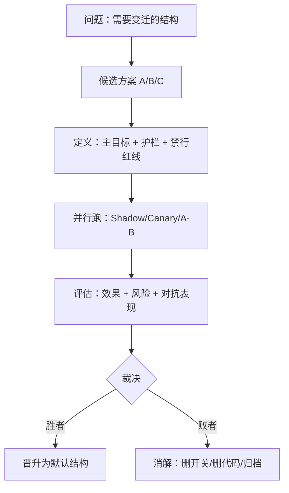

# **ASTO.E05. 工程实践手册：对抗测试与赛马机制**

> **Version**: Γ.1 (Adversarial Testing & Horse Race)
> **Status**: 公开工程支线稿
> **发布边界**：本文属于 ASTO 的公开工程支线稿，用于工程化表达与实践沟通，不纳入首轮公开主包。
> **作者 / Author**：Yi Fu（付毅，ODDFounder，fuyi.it@live.cn）
> **Audience**: 本文档面向**测试工程师、QA、SRE 与工程经理**。
> **Abstract**: 提供对抗测试与赛马机制的工程落地指南，将ASTO的变迁应对策略转化为具体的CI/CD流程与组织制度。
> **Context**: 在 属集变迁存在论(ASTO) 视角下，工程不是“把功能做出来”，而是持续对抗熵增，让结构在真实场域中保持可控的动变性。本指南聚焦三个关键机制：
> 1) **对抗测试**（把系统推向最坏）
> 2) **赛马机制**（并行探索 + 可证据化选择）
> 3) **封板/解封 + 产出物擢升**（把胜者封印为可上线稳态，并通过管道持续小升级）
> **Compat Note**: 本文件原编号为 ASTO-Ext.09。

---

## **文档功能树：ASTO.E05 Γ.1 结构总览**

```
ASTO.E05 工程实践手册
├── 0. 总结：对抗测试 vs 赛马机制
├── 1. 对抗测试（Adversarial Testing）
│   ├── 1.1 定义与触发条件
│   ├── 1.3 四类形态（契约/性质/Fuzz、红队、Chaos、变异测试）
│   ├── 1.4 七序闭环
│   └── 1.5 度量：逃逸率/变异分数/红队胜率/MTTR
├── 2. 赛马机制（Horse Race）
│   ├── 2.1 定义与前提
│   ├── 2.4 胜利标准：主目标+护栏+禁行红线
│   ├── 2.6 裁决协议：时间盒/熔断/沉淀/消解
│   ├── 2.7 封板/解封：产出物可上线稳态与小升级循环
│   ├── 2.8 产出物擢升：A→B→C 的管道晋升与网络化组合
│   └── 2.9 网络计算与边缘计算：分布式场域下的对抗/赛马/封板
├── 3. 组合拳：对抗测试 × 赛马
├── 4. 模板：立项卡/对抗样本库/封板计划/Seal Bundle 检查清单/Seal Bundle Manifest（CI门禁）
└── 5. 反模式与异化风险
```

---

## **0. 先说结论：这两件事在 ASTO 里分别对应什么？**
> 注：本手册的工程机制源自 ODD（输出驱动开发）。在 ASTO 中：
> - 需求(人) → 契约(属集) → 产出物(功能) 为三元工作流。
> - 产出物经由管道擢升 A→B→C，形成网络协同；节点可封板/解封、回滚与拔插。
> - 封板保证稳态，解封保证可控小跃迁；对抗测试与赛马提供证据化验证。


*   **对抗测试**：人为制造高张力环境，让系统在“脉冲/崩解边缘”暴露结构裂纹。
    *   目的不是“找茬”，而是把隐性禁行红线撞出来、把隐性基元量出来。
*   **赛马机制**：把“变迁”从一次性豪赌，改成可回滚的并行实验。
    *   目的不是“内卷”，而是用低成本试错替代高风险跃迁。

> **一句话**：对抗测试负责“把风险显性化”；赛马机制负责“把选择证据化”。

### **0.1 术语锚点：属集**

> 属集，是存在在时间切片上可被指认的属性集合；
> 属集的变迁，构成了存在的全部历史。
>
> 我们不讨论存在“本来是什么”，
> 只讨论它在时间中“此刻呈现为什么”。

---

## **1. 对抗测试（Adversarial Testing）**

### **1.1 定义：不是测试功能，是测试“结构在恶劣场域下是否仍有效”**

对抗测试不是在“正常样例”上验证正确性，而是在刻意构造的极端条件下验证：

*   系统会不会被**误用**（Misuse）？
*   会不会被**滥用**（Abuse）？
*   会不会被**对抗者**利用（Adversary）？
*   会不会在**分布漂移**中失效（Shift）？

在 ASTO 语言里：

*   “正常测试”更像是维持秩序态的日常维护。
*   “对抗测试”是主动制造小型脉冲，让系统提前经历“应力试炼”。

### **1.2 什么时候需要对抗测试？（触发条件）**

满足任意一条，就应该上对抗测试：

1.  **接口外露**：开放 API / Webhook / 插件系统 / Prompt 接口。
2.  **收益可被作弊放大**：排行榜、推荐、风控、广告、增长策略。
3.  **错误代价高**：金钱、生命、安全、隐私、合规。
4.  **不可言说区**：当需求无法完全形式化（NEN 很重），更要靠对抗测试逼近真实边界。

### **1.3 对抗测试的四类常用形态**

#### **A. 结构正确性对抗（Contract / Property / Fuzz）**

*   **Contract Test（契约测试）**：验证服务边界的 EN 是否被严格遵守。
*   **Property-based Test（性质测试）**：验证“不变量”，而不是单个样例。
*   **Fuzzing（模糊测试）**：用畸形输入轰炸边界条件。

ASTO 对应：

*   这是在“编码态/物化态”之间打楔子：让规范真的可执行、可被机器审计。

#### **B. 安全与滥用对抗（Red Team / Attack Surface）**

*   红队模拟真实攻击路径：注入、越权、SSRF、Prompt Injection、数据投毒等。
*   输出应落到两类产物：
    1.  可复现的攻击脚本/样例（EN）
    2.  不可形式化但必须遵守的红线说明（NEN，禁行红线）

#### **C. 运行态对抗（Chaos / GameDay / Fault Injection）**

*   **Chaos Engineering**：故障注入、延迟注入、依赖降级、资源打满。
*   **GameDay**：演练“人 + 系统”的联合作战。

ASTO 对应：

*   这是把“六阶”当作工程工具：你用小脉冲换掉大崩解。

#### **D. 测试体系对抗（Mutation Testing / Canary for Tests）**

很多团队“测试很多”，但测试是假的：改坏了也不报警。

*   **Mutation Testing（变异测试）**：对代码做小扰动（变异），看测试能不能抓到。
*   目的：测试体系必须具备“对抗动变性”的能力，否则 CI 只是装饰。

> 这很 ASTO：你要先确保“守门的结构”本身不僵化、不失真。

### **1.4 对抗测试的落地闭环（七序映射）**

*   **⓪觉醒**：承认“真实世界会攻击你”。
*   **①感知**：收集事故、工单、滥用案例、黑产路径。
*   **②解析**：识别最脆弱的结构（接口、权限、数据链路）。
*   **③干预**：明确要保护的基元与禁行红线（例如：不能泄露 PII、不能绕过限流）。
*   **④设计**：设计对抗样本库、攻击脚本、故障注入点。
*   **⑤物化**：把它们塞进 Pipeline（可自动化的 EN），并提供手工红队流程（NEN）。
*   **⑥回溯**：记录命中率、逃逸率、修复成本、恢复时间。
*   **⑦消解**：过期攻击样本归档；把“已解决的问题”沉淀成结构（而不是永远靠人记得）。

### **1.5 你怎么知道对抗测试“真的有用”？（度量）**

对抗测试的失败模式有两种：

1.  **不做**：问题只会在真实事故中暴露。
2.  **做了但没用**：测试“看起来很猛”，但抓不到真实风险。

建议至少跟踪这些指标（越少越难自欺）：

*   **逃逸率 (Escape Rate)**：线上真实事故/滥用中，有多少是测试体系没覆盖到的。
*   **变异分数 (Mutation Score)**：变异测试能抓住多少“故意改坏”的 bug。
*   **红队胜率 (Red Team Win Rate)**：红队在既定成本内是否能打穿关键禁行红线。
*   **故障演练恢复时间 (MTTR)**：GameDay/Chaos 触发后系统恢复到稳态的时间。
*   **修复成本曲线**：同类问题在第1次、第2次、第3次出现时，修复成本是否在下降（说明结构沉淀有效）。

> **ASTO判据**：指标的意义不是“更强”，而是**更早、在更小的脉冲里暴露裂纹**。

---

## **2. 赛马机制（Horse Race Mechanism）**

### **2.1 定义：并行探索 + 证据化选择 + 可回滚淘汰**

“赛马”不是民主投票，也不是拍脑袋选方案。

它是一套工程制度：

1.  同一问题，允许多个方案并行实现（多条“桥”）。
2.  用统一的度量与禁行红线约束跑一段时间。
3.  以数据 + 事故表现 + 对抗测试表现做裁决。
4.  淘汰失败者，保留胜者，并把胜者固化成新结构。

### **2.2 赛马的三条硬前提（不满足就别赛）**

1.  **可观测性**：没有指标与追踪，赛马就是玄学。
2.  **可回滚性**：不能回滚的赛马是赌博。
3.  **红线护栏**：只比“快/省/高转化”会把系统带向邪路。

### **2.3 赛马的常见工程形态**

*   **Shadow / Mirror（影子流量）**：新方案吃真实请求但不影响结果。
*   **Canary（灰度）**：小流量真实生效，随时回滚。
*   **A/B Test（对照实验）**：随机分桶，对比指标。
*   **Bandit（多臂老虎机）**：动态加权，把更多流量给“当前更好”的方案。

### **2.4 如何定义“胜利”？（基元/禁行红线化的评审标准）**

建议把标准拆成三层：

1.  **主目标（可优化）**：例如延迟、成本、转化、准确率。
2.  **护栏指标（不可突破）**：例如错误率、投诉率、合规、隐私、偏见。
3.  **禁行红线（绝对不可触碰）**：例如泄露敏感数据、诱导伤害、绕过权限。

> 赛马真正解决的不是“选哪个方案”，而是把“什么算好”说清楚。

### **2.5 赛马机制的反作弊：Goodhart 定律是默认敌人**

只要你把一个指标当目标，系统就会学会“优化指标”而不是“优化现实”。

因此必须引入：

*   **隐藏集/留出集**：线上赛马看不到的评估数据。
*   **多目标 + 随机审计**：让作弊成本变高。
*   **对抗测试作为赛马裁判**：把“最坏场景表现”纳入胜负。

### **2.6 赛马的裁决协议：谁来决定？如何避免“永恒试验”？**

赛马如果没有裁决协议，会从“并行探索”滑向“永久混沌”。建议把裁决写成可执行规则：

1.  **裁决者**：由“代码所有者 + 风险所有者 + 业务所有者”组成最小裁决组。
2.  **时间盒**：写死开始/结束日期（到期必须裁决，不能“再跑一周”）。
3.  **胜者条件**：主目标阈值 + 统计置信/显著性门槛（或工程侧的效果阈值）。
4.  **熔断条件**：一旦触发护栏指标/禁行红线，立即停止该方案。
5.  **沉淀动作**：胜者写入结构（规范/工具/默认配置）；败者要消解（删开关、删代码、归档报告）。

> **ASTO判据**：赛马不是为了“赢”，而是为了让组织具备**持续跃迁**的能力。

### **2.7 封板机制：把产出物封印为“可上线稳态”，并允许人类解封小升级**

赛马解决“选谁”，对抗测试解决“抗打”。但还缺一个关键动作：

*   **如何把胜者变成一个稳定、可上线、可复用的产出物？**
*   **当需求/契约变化时，如何在不崩盘的前提下再打开它？**

这就是封板机制。

> **延伸提醒**：封板/解封解决的是“单个产出物如何稳定上线与迭代”。但真实系统不是单体产物——它是由多个产物通过管道逐级擢升、再网络化组合而成。见 2.8。

#### **2.7.1 定义（封板 vs 解封）**

*   **封板 (Release/Change Freeze)**：
    *   将某一版本的代码/配置/模型/规则（以及它们的依赖版本）整体“封印”，作为一个**稳定产出物 (Artifact)** 上线使用。
    *   封板期间：默认**不接受结构性变更**，只允许“白名单修复”。
*   **解封 (Unseal)**：
    *   当**需求变化/契约变化/禁行红线风险变化**时，由人类发起“解封”，重新进入：对话 → 赛马 → 对抗 → 再封板 的小升级循环。

> 直觉类比：封板把系统锁定在秩序态；解封是一次有意的“轻量变迁”。

#### **2.7.2 封板的触发条件**

满足任一条件即可封板：

1.  **赛马已裁决**：胜者已明确，进入“固化为结构”的阶段。
2.  **对抗测试已通过**：关键禁行红线/护栏不被打穿。
3.  **上线需要可预测性**：需要稳定SLA/合规/可审计（尤其金融、风控、推荐、自动化治理）。

#### **2.7.3 封板期间允许什么变更？（白名单修复）**

封板不是“停止维护”，而是把维护限定为可控范围：

*   ✅ **允许**：
    *   P0/P1 安全漏洞修复（需补充对抗样本，防止回归）
    *   线上事故修复（必须可回滚，且不改变契约语义）
    *   文档/观测/告警等非行为变更
*   ❌ **禁止**：
    *   新需求插队（改变契约/指标口径/主要逻辑）
    *   未经赛马的“性能大改/架构大改”
    *   以“修复”名义引入新策略（典型 Goodhart 诱因）

#### **2.7.4 解封的硬条件：解封=一次有主权的变更启动**

建议把解封写成“必须满足的四件事”（否则就是偷渡变更）：

1.  **契约变更已声明**：明确旧契约哪里不再适用（语义、接口、指标口径）。
2.  **回滚路径已准备**：解封引入的变更必须可回滚。
3.  **赛马方案已给出**：至少 A/B 两路（或旧版 vs 新版）可并行验证。
4.  **对抗样本已扩容**：把本次变化可能引入的新风险提前加入对抗样本库。

> **核心原则**：封板保证“可用”；解封保证“可控升级”。

### **2.8 产出物擢升机制：A → B → C 的管道晋升与网络化组合**

你说的“封板”只有在一个前提下才成立：我们把系统视作一组**可版本化的产出物 (Artifacts)**，并通过**管道 (Pipeline)** 把它们逐级擢升。

#### **2.8.0 产出物分类体系 (The Artifact Taxonomy)**
为了让 AI 准确理解“要做什么”，ODD 引入了结构化的产出物分类（参考 ODD 698 种分类法，此处简化为 5 大类）：
1.  **功能类 (Functional)**：API、服务、UI 组件、数据处理器。（核心价值载体）
2.  **验证类 (Verification)**：单元测试、集成测试、变异测试配置。（信任载体）
3.  **配置类 (Configuration)**：环境配置、Feature Flag、部署清单。（动变性载体）
4.  **文档类 (Documentation)**：API 文档、架构图、决策记录。（知识载体）
5.  **契约类 (Contract)**：定义上述所有产出物的元数据与规范。（法律载体）

#### **2.8.1 产出物是什么？（四个硬属性）**

在 ASTO/ODD 工程语境里，一个“产出物”至少要具备：

1.  **可版本化 (Versioned)**：有清晰版本号与变更记录（升级就是“契约变化的可追溯历史”）。
2.  **可回滚 (Rollbackable)**：一键回到上一个稳态产出物（否则封板是谎言）。
3.  **可拔插 (Pluggable)**：有稳定接口与替换位（Feature Flag / Plugin Interface / Adapter），允许并行存在与热替换。
4.  **可迭代 (Iterable)**：有明确的“解封→赛马→对抗→再封板”迭代路径。

> **判断句**：不能版本化/回滚/拔插的东西，都是“隐形结构”，一旦进生产就会异化成不可触碰的禁行红线。

#### **2.8.2 A→B→C：产出物如何通过管道被擢升？**

“擢升”不是政治口号，是一套工程门禁：

*   **A（低层产出物）**：代码模块/规则包/模型权重/配置集
*   经由管道（构建→验证→对抗→签名→封板）擢升为
*   **B（中层产出物）**：可部署服务/可执行策略/可复用组件
*   B 与其它产出物（B₂、X、Y）一起，再经由管道擢升为
*   **C（高层产出物）**：平台能力/业务域能力/系统级“可用稳态”

```mermaid
flowchart LR
    A[产出物 A
(模块/规则/模型/配置)] --> P1[Pipeline-1
构建→验证→对抗→签名→封板] --> B[产出物 B
(服务/组件/策略)]

    B --> P2[Pipeline-2
集成→赛马→对抗→封板] --> C[产出物 C
(平台/域能力/系统稳态)]
    X[其它产出物 X] --> P2
    Y[其它产出物 Y] --> P2

    C --> Net[上线网络
(多产出物协同)]
```

#### **2.8.3 从“树”到“网”：产出物链式依赖 (Artifact Pipeline)**

当 C 上线后，它会与其它 C'、D、E 共同构成网络。ODD 的核心洞见是：**每一个产出物都是下一个契约的输入**。

*   **链式逻辑**：`Contract_A` -> `Artifact_A` -> (作为输入) -> `Contract_B` -> `Artifact_B`。
*   **示例**：`用户认证模块`（Artifact A）封板后，成为`订单服务`（Contract B）的依赖输入。
*   **影响**：一个产出物的升级，可能改变别的产出物的契约边界。
*   **所以**：“解封”必须是**有主权的升级启动**：声明契约变化、准备回滚、提供赛马、扩容对抗样本。

ASTO 视角下，网络化协同的底层纪律是：

*   **契约 (Contract)**：定义边界；
*   **门禁 (Gate)**：防止偷渡变更；
*   **封板 (Seal)**：形成可用稳态；
*   **解封 (Unseal)**：进入小升级循环；
*   **消解 (Sunset)**：淘汰失败产物，防止版本墓地。

#### **2.8.4 产出物擢升的“最小可执行规范”（建议直接写进 CI）**

1.  **版本门禁**：任何进入管道的产出物必须携带版本号与变更说明。
2.  **回滚门禁**：任何“晋升”的产出物必须提供回滚路径（脚本/开关/镜像/配置回滚）。
3.  **拔插门禁**：任何影响线上行为的改动必须有替换位（开关/插件/适配器），允许赛马并行。
4.  **依赖门禁**：上层产出物必须声明依赖图谱（至少列出关键依赖及版本窗口）。

> **一句话**：管道负责“擢升”，封板负责“稳态”，解封负责“小跃迁”，对抗与赛马负责“证据化与抗打”。

### **2.9 网络计算与边缘计算：分布式场域下的对抗/赛马/封板**

ASTO.E05 的前面几节默认你在“单体/单集群”的理想条件下工作。
但只要系统进入 **网络计算**（多节点、多区域、多依赖）或 **边缘计算**（大量不稳定节点、弱网、离线、异构设备），
你的风险模型会立刻改变：

*   “封板”不再是封一个版本，而是封一张 **网络一致性承诺**。
*   “赛马”不再是跑一个 A/B，而是跑一条 **发布路径**（Shadow → Canary → 分区/分环 → 全量）。
*   “对抗测试”不再只是畸形输入，而是把 **网络本身当成对抗者**。

#### **2.9.1 一句话定义：网络计算 vs 边缘计算**

*   **网络计算 (Network Computing)**：计算与状态分布在多个节点之间，正确性与成本被“延迟/分区/一致性”约束。
*   **边缘计算 (Edge Computing)**：把计算/策略下沉到靠近数据与动作发生处（端侧/网关/门店/车辆/传感器），节点更分散、更不稳定、环境更不可控。

在 ASTO 语言里：

*   **网络**把“环境涨落”放大成常态（延迟、分区、抖动），系统更易从秩序滑入流变。
*   **边缘**把“不可控”变成日常（离线、断电、热更新失败），系统更易触发脉冲与局部崩解。

#### **2.9.2 分布式的隐性禁行红线：你以为是功能问题，其实是物理问题**

如果你不显式定义这些禁行红线，它们会以事故的方式显形：

1.  **收敛红线**：策略/配置/模型必须在可接受时间内“全网收敛”。超过窗口，等价于“系统在同一时刻有多套法律”。
2.  **回滚红线**：回滚必须可达（不只是中心回滚，还要边缘回滚）。否则封板只是纸面承诺。
3.  **幂等红线**：在重试/重复投递/乱序下，系统不能产生不可逆副作用（重复扣款、重复执行、重复发放）。
4.  **可观测红线**：必须能回答“哪个节点在跑哪个版本、何时收敛、哪里没收敛”。否则赛马与封板不可裁决。

#### **2.9.3 分布式/边缘的对抗测试清单：把最坏网络搬进来**

把对抗测试从“输入畸形”扩展到“网络畸形/时序畸形/控制面漂移”：

*   **网络层对抗（Network-as-Adversary）**
    *   分区、延迟抖动、丢包、重复包、乱序
    *   DNS 故障、证书过期、依赖半挂（部分节点不可达）
    *   重试风暴、级联超时、连接池耗尽
*   **时间与因果对抗（Time-as-Adversary）**
    *   时钟漂移/回拨（NTP）、事件乱序、重复投递、回放（replay）
*   **状态与一致性对抗（State-as-Adversary）**
    *   读到旧值、最终一致收敛过慢、缓存雪崩/击穿、热点 key
    *   边缘离线缓冲导致“旧策略迟到生效”
*   **控制平面对抗（Control-Plane Drift）**
    *   配置/策略/模型版本传播延迟与不一致（部分节点没更新）
    *   Rolling Upgrade 混跑期的契约兼容性
    *   Feature Flag 状态不同步（拔插位被网络撕裂）

> **落地要求**：每次对抗测试至少产出三类可见结果：
> 1) 命中的禁行红线与熔断条件；2) 收敛指标（多久全网一致）；3) 回滚时延（多久回到稳态）。

#### **2.9.4 分布式/边缘的赛马：赛的不只是方案，还包括发布路径**

建议把赛马做成“分层赛马”，否则你会被总体平均数欺骗：

1.  **按范围赛马**：Shadow → Canary → 分区/分环（Ring）→ 全量
2.  **按场域赛马**：不同地域/网络质量/设备型号/负载等级分别看结果（防止“整体变好、边缘群体崩了”）
3.  **按护栏裁决**：胜负必须同时比较主目标 + 护栏指标（错误率、尾延迟、重试比例、回滚成功率、收敛时间）
4.  **对抗入裁判**：不允许“只在好天气赢”的方案胜出；对抗测试表现必须计入胜负。

#### **2.9.5 分布式/边缘的封板：封的不是代码，是一整套“稳态承诺包”**

网络/边缘场景里，封板对象建议写成一个“稳态包（Seal Bundle）”，至少包含：

*   产出物版本（代码/模型/配置/策略）
*   契约版本（接口/指标口径/数据 Schema）
*   依赖版本窗口（关键依赖允许的范围）
*   发布路径（如何从 0% 到 100%）
*   收敛目标（多久全网一致、允许的最长不一致窗口）
*   回滚方案（中心回滚 + 边缘回滚）
*   观测面板（版本分布、收敛进度、告警策略）
*   封板检查清单（Seal Bundle Checklist）：见 §4.3；封板承诺包清单（Seal Bundle Manifest, SBM）：见 §4.4。

> **一句话**：在分布式世界里，封板=你敢对“网络真相”签字；解封=你敢在可回滚条件下重新签一次。

---

## **3. 对抗测试 × 赛马：把“选择”变成可验证的结构**

推荐的组合拳：

1.  **先对抗，后赛马**：先用对抗测试过滤掉“脆弱方案”，再进入赛马。
2.  **赛马期间持续红队**：红队不是一次性审计，而是持续对抗。
3.  **对评测系统做对抗测试**：评测本身也会被“优化/钻空子”。要把评测当系统测试。

### **3.1 一张图看懂：对抗测试流水线（把风险前置）**

```mermaid
flowchart LR
    Dev[提交变更] --> CI[CI 基础验证]
    CI --> Mut[变异测试
(Mutation)]
    CI --> Fuzz[Fuzz/性质测试
(Property)]
    CI --> Sec[红队/滥用用例
(Red Team)]

    Mut --> Gate{护栏&禁行红线
是否被突破?}
    Fuzz --> Gate
    Sec --> Gate

    Gate -- Yes --> Stop[停止/回滚
修复结构]
    Gate -- No --> Canary[灰度/影子流量
(Canary/Shadow)]

    Canary --> Chaos[故障演练
(Chaos/GameDay)]
    Chaos --> Obs[观测与回溯
(指标/追踪/事故复盘)]
    Obs --> Solid[固化为结构
(默认配置/工具/规则)]
```

### **3.2 一张图看懂：赛马闭环（把选择证据化）**



ASTO 解释：

*   赛马提供“动变性分布式探索”。
*   对抗测试提供“环境涨落的真实模拟”。
*   两者合并，才能让“跃迁”不靠信仰。

---

## **4. 快速落地模板（建议直接抄）**

### **4.1 一页纸赛马立项（EN + NEN）**

*   **问题定义**：一句话写清“我们要改变什么结构”。
*   **候选方案**：A / B / C（最多3个，避免无限发散）。
*   **基元（必须守住）**：稳定性/可用性/关键 SLA。
*   **禁行红线（绝不触碰）**：隐私/越权/安全/伦理红线。
*   **观测面板**：必须能看到主目标 + 护栏 + 事故。
*   **封板计划**：
    *   何时封板（什么条件算“可上线稳态”）
    *   封板期间允许哪些白名单修复
    *   解封条件（需求/契约变化触发点）
*   **退出条件**：
    *   胜者条件（达到什么阈值）
    *   失败熔断（触发什么就停止）
    *   最大周期（到期必须裁决，防止“永恒试验”）

### **4.2 对抗样本库的最低配置**

*   **边界输入**：空/超长/非法字符/极端数值
*   **权限边界**：越权路径（读/写/删）
*   **资源边界**：限流、超时、重试风暴
*   **分布漂移**：异常比例、长尾样本、地域/设备差异
*   **人类滥用**：脚本刷量、诱导提示、社会工程

### **4.3 网络/边缘封板承诺包（Seal Bundle）检查清单**

> **目标**：把“可上线稳态”从口号变成可签字的 EN。
> **规则**：任何一项不满足，都不应封板上线；必须先回到“解封→赛马→对抗→再封板”。

#### **A. 版本与契约（你封的到底是什么？）**

*   □ **产出物版本**：代码/镜像、配置、策略/规则、模型（如有）均有明确版本号与变更说明。
*   □ **契约版本**：API/Schema、指标口径（Metrics Definition）、数据格式/迁移约束已声明。
*   □ **兼容窗口**：新旧版本混跑期的兼容策略（向后兼容/双写/灰度窗口）已写清。
*   □ **关键依赖窗口**：DB、队列、缓存、外部 API 等关键依赖的允许版本范围已声明。

#### **B. 发布路径与收敛承诺（网络真相怎么成立？）**

*   □ **发布路径**：Shadow → Canary → 分区/分环（Ring）→ 全量 的顺序、比例、时间盒明确。
*   □ **收敛目标**：版本/配置/策略在全网收敛的目标时间（以及最大不一致窗口）明确且可观测。
*   □ **版本可观测**：能回答“哪个节点跑哪个版本、哪里未收敛、收敛进度如何”。
*   □ **熔断/回退阈值**：护栏指标阈值、禁行红线触发条件与自动化动作（停更/回滚/降级）明确。

#### **C. 回滚与恢复（封板是否真实？）**

*   □ **中心回滚**：一键回到上一稳态（镜像/配置/策略回滚）路径明确。
*   □ **边缘回滚**：边缘节点 OTA 回滚/失败补救/“掉队节点追赶”路径明确。
*   □ **数据安全**：涉及数据迁移时，具备向后兼容与幂等策略（避免“回滚回不去”）。

#### **D. 证据：赛马结果 + 对抗结果（用证据封板，不用信仰封板）**

*   □ **赛马证据**：按地域/网络质量/设备型号分层评估，主目标 + 护栏 + 禁行红线均达标。
*   □ **对抗证据**：至少覆盖分区/延迟抖动/乱序/重试风暴/时钟漂移/控制面漂移，并记录结论。
*   □ **坏天气胜利**：方案不仅在“好天气”赢，也在对抗环境下仍不触碰禁行红线。

#### **E. 安全、合规与审计（上线即治理）**

*   □ **鉴权与密钥**：证书/密钥/Token 的轮换策略与过期处理明确。
*   □ **滥用防护**：限流、重试上限、幂等 Key、去重策略明确。
*   □ **审计链路**：变更审批记录、发布记录、回滚记录可追溯。

#### **F. 消解计划（封板不是永生）**

*   □ **旧版淘汰**：旧版本的 Sunset 时间、开关清理、兼容代码移除计划明确。

### **4.4 Seal Bundle Manifest（SBM）模板：把承诺包变成“可被 CI 门禁审计的文件”**

> **目标**：§4.3 是“人类检查清单”；SBM 是“机器可验证的封板承诺包（EN）”。
> **原则**：封板=提交一份 SBM；解封=提交新的 SBM + 更新赛马/对抗证据（否则等价于偷渡变更）。

#### **4.4.1 推荐位置与命名（让机器找得到）**

*   Repo 固定位置（建议）：`release/seal-bundle.yaml`（或 `release/seal-bundle.json`）。
*   可选：`release/seal-bundle.sig` / `release/seal-bundle.lock`（签名/哈希/审批信息）。

#### **4.4.2 最小字段（建议 1:1 对应 §4.3 的 A–F）**

SBM 不追求“信息多”，追求“字段少但不可缺”，否则 CI 门禁无法执行。

*   **A 版本与契约**：`artifacts`、`contracts`、`dependencies`
*   **B 发布与收敛**：`rollout`、`convergence`、`observability`
*   **C 回滚与恢复**：`rollback`（中心 + 边缘）
*   **D 证据**：`evidence`（赛马报告 + 对抗报告 + 坏天气结论）
*   **E 安全合规审计**：`audit`
*   **F 消解计划**：`sunset`

#### **4.4.3 模板（YAML 示例，可直接改）**

```yaml
seal_bundle:
  id: "sbm-2026-01-24-001"
  sealed_at: "2026-01-24"
  scope: "prod"

  artifacts:
    - name: "service-a"
      type: "container"
      version: "v1.2.3"
      digest: "sha256:..."
    - name: "edge-policy"
      type: "config"
      version: "2026.01.24"

  contracts:
    api: "v5"
    schema: "v12"
    metrics_definition: "md-v3"
    compatibility_window: "mixed-run 7d"

  dependencies:
    - name: "postgres"
      allowed: ">=14,<15"

  rollout:
    path: ["shadow", "canary", "ring", "full"]
    ring_definition: "region/device/network"
    timebox:
      shadow: "24h"
      canary: "24h"
      ring: "72h"

  convergence:
    target: "30m"
    max_inconsistency: "2h"

  observability:
    dashboards: ["..."]
    alerts: ["..."]

  rollback:
    center:
      method: "one-click"
      runbook: "..."
    edge:
      method: "ota-rollback"
      failure_handling: "..."

  evidence:
    horse_race_report: "..."
    adversarial_report: "..."
    bad_weather_passed: true

  audit:
    change_request: "CR-1234"
    approvers: ["owner", "risk"]

  sunset:
    old_version_eol: "2026-02-15"
    cleanup_items: ["flags", "compat-code"]
```

#### **4.4.4 CI 门禁（把封板变成可执行 EN）**

把 SBM 当作“发版必须的输入”，而不是“发版后的备注”。建议至少分四层门禁：

1.  **Gate-0 结构门禁**：文件存在、可解析（YAML/JSON），必填字段齐全。
2.  **Gate-1 一致性门禁**：
    *   `artifacts.version/digest` 与构建产物一致；
    *   `contracts` 与代码/Schema 仓库一致；
    *   `dependencies` 与部署清单/Helm/K8s 声明一致。
3.  **Gate-2 证据门禁**：
    *   `evidence.horse_race_report` 与 `evidence.adversarial_report` 必须存在且可追溯；
    *   网络/边缘变更必须包含“分层赛马证据 + 网络对抗证据”（否则不允许封板）。
4.  **Gate-3 主权门禁**：`audit.approvers` 的审批/签名齐全（可用 CODEOWNERS/签名提交/外部审批系统）。

> **一句话**：§4.3 负责“人类能否签字”；§4.4 负责“机器能否拦截”。两者合起来，封板才是真的。

---

## **5. 常见误区（踩了就会走向异化）**

1.  **把赛马当 KPI 内卷**：赛马是“结构选择机制”，不是“人对人竞赛”。
2.  **只有主目标，没有禁行红线**：短期赢，长期崩。
3.  **只做一次红队**：攻击会演化，你的一次性审计很快过期。
4.  **赛马不设期限**：没有消解步骤的试验，会把组织拖进持续混沌。

---
## **6. 场域工程补编（从 P04 迁移）**
> 这些内容原先散落在宣言中，为避免哲学主线被工程打断，现集中放在 E05。

### **6.1 场域建模 (Field Modeling)**
```python
class FieldModel:
    def __init__(self):
        self.perturbations = {}  # 扰动属性库
        self.relations = {}      # 关联关系矩阵
        self.emergent_patterns = []  # 涌现模式列表
        
    def detect_emergence(self):
        # 识别场域中的涌现信号
        energy_map = self.calculate_energy_distribution()
        peaks = self.find_local_maxima(energy_map)
        return [p for p in peaks if p.stability > THRESHOLD]

    def calculate_health_metrics(self):
        return {
            "connectivity": self.measure_network_density(), # 连通性
            "diversity": self.measure_attribute_entropy(),  # 多样性
            "resilience": self.measure_recovery_speed(),    # 韧性
            "adaptability": self.measure_response_rate(),   # 适应性
            "creativity": self.measure_mutation_rate()      # 创造性
        }
        
    def identify_leverage_points(self):
        # 寻找改变系统的最小用力点
        bottlenecks = self.find_bottlenecks()
        hubs = self.find_information_hubs()
        loops = self.find_positive_feedback_loops()
        return self.rank_by_impact(bottlenecks + hubs + loops)
```

> **隐喻提示**：场域模型像一张“天气图”。你不是制造天气的人，但你可以预测哪里会下雨。

### **6.2 工程映射速查表（节选）**
| ASTO概念 | ODD工程实践 | 工程直觉 |
| :--- | :--- | :--- |
| **属集** | 系统状态（工程映射） | 直觉：你抓到的“当前快照”（规范定义见前文“术语锚点：属集”） |
| **结构/规范** | 架构/协议 | 你能写进 CI 的“硬规矩” |
| **场域** | 系统环境/生态 | 你无法完全控制的“天气” |
| **扰动** | 异常输入/黑天鹅 | 你必须提前准备的“暴风” |

### **6.3 缺陷作为创造力（Defect as Creativity）**
> **核心句**：缺陷不是 bug，而是创造力的接口——它不是技术债，而是创新的 API。

#### **6.3.1 传统软件工程观 vs ASTO 缺陷观**
| 维度 | 传统观点 | ASTO 缺陷观 |
| :--- | :--- | :--- |
| **缺陷本质** | 错误、故障、需要修复的问题 | 系统未饱和的可能性空间 |
| **处理策略** | 消除、规避、最小化 | 识别、评估、创造性利用 |
| **价值判断** | 纯粹的损失和成本 | 潜在的创新机会 |
| **与完美关系** | 完美是目标，缺陷是障碍 | 完美是死亡，缺陷是生机 |
| **工程态度** | 零容忍(safety-critical) | 分层容忍(探索性系统) |

#### **6.3.2 不完美公理（工程展开）**
**公式**：  
$$ \\text{缺陷} = \\text{当前属集} \\oplus \\text{环境需求} $$

**DCI 缺陷创造力指数**：  
$$ \\text{DCI} = \\frac{\\text{创新价值}}{\\text{修复成本}} \\times \\text{伦理系数} \\times \\text{领域系数} $$

**决策提示**：  
* DCI > 1：保留缺陷，将其转化为特性（Feature）。  
* DCI < 1：修复缺陷。  

#### **6.3.3 红绿灯清晰度评估机制**
> **"在利用缺陷之前，先评估我们对缺陷的理解是否足够清晰。模糊的缺陷定义会导致错误的利用方向。"**

```
┌─────────────────────────────────────────────────┐
│           缺陷清晰度评估：红黄绿机制                              │
├─────────────────────────────────────────────────┤
│                                                                  │
│  🟢 绿色（清晰度 80-100%）                                       │
│  ───────────────────────────────────────────── │
│  • 缺陷定义精确，边界明确                                        │
│  • 复现路径可验证，触发条件可控                                  │
│  • 影响范围可量化，风险可评估                                    │
│  • 可以直接进入利用评估阶段                                      │
│  • 示例："订单金额≥￥10,000时，通过短信通知部门经理"              │
│                                                                  │
│  🟡 黄色（清晰度 50-79%）                                        │
│  ───────────────────────────────────────────── │
│  • 缺陷大部分清晰，但有少量模糊点                                │
│  • 需要确认2-4个关键参数后才能评估                              │
│  • 需要补充测试用例验证边界条件                                  │
│  • 示例："当订单金额较大时，通知管理员"                           │
│    → 需确认：多大算"较大"？哪个管理员？通知方式？                  │
│                                                                  │
│  🔴 红色（清晰度 0-49%）                                         │
│  ───────────────────────────────────────────── │
│  • 缺陷定义模糊，边界不清                                        │
│  • 存在逻辑矛盾或关键信息缺失                                    │
│  • 无法制定验证标准                                              │
│  • 必须先澄清定义，不能进入利用阶段                              │
│  • 示例："系统应该好用" → 什么叫"好用"？没有可测试的定义        │
│                                                                  │
└─────────────────────────────────────────────────┘
```

**清晰度评分公式**：
```
清晰度分数 = (
    必要信息完整度 × 40% +
    边界条件明确度 × 30% +
    验证标准可测性 × 20% +
    风险评估可行性 × 10%
) × 100
```

#### **6.3.4 缺陷意向图：缺陷的可视化分类**
```
┌─────────────────────────────────────────────┐
│                  缺陷意向光谱图                                  │
├─────────────────────────────────────────────┤
│                                                                  │
│  创造性缺陷 ←────────────────────→ 破坏性缺陷                  │
│  (开启可能)                           (关闭可能)                │
│                                                                  │
│  🟢────🟡────🟠────🔴                                          │
│  │     │     │     │                                           │
│  │     │     │     └─ 灾难性缺陷(立即修复)                     │
│  │     │     └─────── 结构性缺陷(计划重构)                     │
│  │     └───────────── 优化性缺陷(观察评估)                     │
│  └─────────────────── 探索性缺陷(可能保留)                     │
│                                                                  │
│  判断标准：                                                       │
│  • 创造性缺陷：打开新的用户行为可能性                            │
│  • 破坏性缺陷：限制或破坏已有的系统功能                          │
│                                                                  │
└─────────────────────────────────────────────┘
```

**缺陷的五维分类矩阵**：
| 缺陷类型 | 清晰度 | 边界域 | 修复成本 | 创新潜力 | 建议行动 |
| :--- | :--- | :--- | :--- | :--- | :--- |
| 探索性Bug | 🟢 高 | 绿灯 | 低 | 高 | 观察利用 |
| 优化性Bug | 🟡 中 | 绿灯 | 中 | 中 | 迭代改进 |
| 技术债Bug | 🟡 中 | 黄灯 | 高 | 低 | 计划还债 |
| 结构性Bug | 🔴 低 | 黄灯 | 很高 | 无 | 架构重构 |
| 灾难性Bug | 🟢 高 | 红灯 | 任意 | 负 | 立即修复 |

#### **6.3.5 缺陷的三色边界：绿灯-黄灯-红灯域**
**绿灯域：缺陷即创新机会**  
适用：探索性系统、创意工具、早期MVP  
核心原则：**"不要修复所有缺陷，要问：这个缺陷能教会我们什么？"**  

**黄灯域：缺陷即技术债**  
适用：成熟产品非核心模块、内部工具、遗留系统  
核心原则：**"管理缺陷而非消灭缺陷——计算利息，选择还债时机。"**

**红灯域：缺陷即生存威胁**  
适用：安全关键系统、生命支持系统、核心基础设施  
核心原则：**"在红灯域，缺陷不是创造力接口，而是灾难入口。零容忍。"**

#### **6.3.6 缺陷利用决策树**
```
┌──────────────────────────────────────────────┐
│              缺陷利用决策树                                      │
├──────────────────────────────────────────────┤
│                                                                  │
│  发现缺陷                                                        │
│     ↓                                                            │
│  [清晰度评估] ────→ 🔴红色? ───→ 重新定义缺陷                  │
│     ↓ 🟢绿色                    ↑                               │
│     ↓                           │                               │
│  [边界域判断]                    │                               │
│     ├─→ 红灯域? ───→ 立即修复 ──┘                              │
│     ├─→ 黄灯域? ───→ 技术债管理                                │
│     └─→ 绿灯域? ───→ [创新潜力评估]                            │
│                         ↓                                        │
│                    DCI > 5? ──Yes→ 探索利用                     │
│                         ↓ No                                    │
│                    按常规修复                                    │
│                                                                  │
└──────────────────────────────────────────────┘
```

#### **6.3.7 实战案例**
**案例1：Instagram 的正方形裁剪**  
缺陷：早期技术限制，只能显示正方形图片  
结果：形成独特视觉风格 → DCI ≈ 8 → 保留并强化为特性  

**案例2：自动驾驶边缘识别缺陷**  
缺陷：极端光线下误判行人  
结果：伦理系数为 0 → DCI = 0 → 必须消除  

#### **6.3.8 五个陷阱警告**
1. **过度浪漫化**：不是所有 Bug 都是 Feature。  
2. **伦理麻木**：不要用“创新”为侵犯隐私辩护。  
3. **技术破产**：缺陷利息超过增长，必须重构。  
4. **责任转嫁**：缺陷转特性必须告知并提供退出机制。  
5. **工程纪律崩溃**：探索性容错 ≠ 工程混乱。

#### **6.3.9 适用边界总结**
```
┌────────────────────────────────────────────────┐
│          缺陷创造力理论适用域                                    │
├────────────────────────────────────────────────┤
│  ✓ 绿灯：探索性系统、创意工具、早期MVP                           │
│  ⚠ 黄灯：成熟产品非核心模块、内部工具                            │
│  ✗ 红灯：安全关键、生命支持、金融核心、隐私敏感                  │
├─────────────────────────────────────────────────┤
│  核心判准：是否通过伦理审计                              │
│           = 复数性测试 + 不可触达维守护                         │
└────────────────────────────────────────────────┘
```

### **6.4 结论**
工程不是消灭所有异常，而是**识别哪些异常是通往新结构的入口，哪些异常是通往崩解的裂缝**。  
这就是 ASTO 的工程伦理。

---

## **结语：让动变性成为制度，而不是英雄主义**

当团队没有对抗测试，系统会在真实世界被动挨打。
当团队没有赛马机制，所有架构选择都会变成信仰之争。

**对抗测试 + 赛马机制**，就是把“动变性”从个人能力，升级为组织结构。

**(本文档是 ASTO.E05 工程实践手册。)**


---


---

## 🌳 文档体系导览 (Functional Tree)

```text
ASTO 文档体系
├── 🌟 P 系列：哲学核心 (Philosophy)
│   ├── [P01. 非此](../ASTO.P01.非此.Phil.md) (理论免疫宣言)
│   ├── [P02. 序章](../ASTO.P02.序章.Phil.md) (否定性导引与路径分流)
│   ├── [P03. 认识论](../ASTO.P03.认识论.Phil.md) (认知错误的必然性)
│   ├── [P04. 宣言](../ASTO.P04.宣言.Phil.md) (关于存在与变迁)
│   ├── [P05. 公理](../ASTO.P05a.公理.Phil.md) (系统热力学与结构存在论)
│   ├── [P06. 价值](../ASTO.P06.价值与边界.Phil.md) (复数性测试与伦理熔断)
│   ├── [P07. 自由](../ASTO.P07.自由论.Phil.md) (边界即自由)
│   ├── [P08. 例外](../ASTO.P08.例外.Phil.md) (宗教体验与星际主权)
│   ├── [P09. 批判](../ASTO.P09a.批判.Phil.md) (反极权宪章与系统免疫)
│   ├── [P10. 民主](../ASTO.P10.民主.Phil.md) (对话平台与 NCP 协议)
│   ├── [P11. 韧性](../ASTO.P11.韧性.Phil.md) (自我免疫与反脆弱)
│   ├── [P12. 留白](../ASTO.P12.留白.Phil.md) (预留扩展空间)
│   └── [P13. 终章](../ASTO.P13.终章.Phil.md) (系统的终极关怀)
│
├── 🛠️ E 系列：工程实践 (Engineering)
│   ├── [E01. 实践指南](./ASTO.E01.实践指南.Eng.md) (生活|人文|工程三轨读本)
│   ├── [E02. 自动化](./ASTO.E02.自动化.Eng.md) (可执行规范与零摩擦治理)
│   ├── [E03. Web3](./ASTO.E03.Web3.Eng.md) (意图宪法与链上三权分立)
│   ├── [E04. AI对齐](./ASTO.E04.AI对齐.Eng.md) (逆熵智能体与文明传承)
│   ├── [E05. 工程手册](./ASTO.E05.工程实践手册.Eng.md) (对抗测试与赛马机制)
│   └── [E06. 领域扩展](./ASTO.E06.领域扩展.Eng.md) (多领域应用索引)
│
├── 🧩 H 系列：人文叙事 (Humanities)
│   ├── [H01. 重构](../人文版/ASTO.H01.重构.Hum.md) (架构师的二十一种宇宙视角)
│   ├── [H02. 导读](../人文版/ASTO.H02.导读：为什么读这本书.Hum.md)
│   ├── [H03. 故事](../人文版/ASTO.H03.故事：小陈的那条路.Hum.md)
│   ├── [H04. 认知冒险](../人文版/ASTO.H04.认知冒险.Hum.md)
│   ├── [H05. 奇幻漂流](../人文版/ASTO.H05.奇幻漂流.Hum.md)
│   └── [H06. 暮年的重构](../人文版/ASTO.H06.暮年的重构：给不再年轻的你.Hum.md)
│
├── 🎓 Lite 系列：青春版 (Youth)
│   ├── [L01. 宣言 (Lite)](./青春版/ASTO04.宣言.Lite.v1.0.md)
│   ├── [L02. 认识论 (Lite)](./青春版/ASTOop.认识论.Lite.v1.0.md)
│   └── [L03. 价值 (Lite)](./青春版/ASTO05.价值与边界.Lite.v1.0.md)
│
└── 🌍 Ext 系列：领域扩展 (Extensions)
    ├── [Ext.01 法律](./ASTO.Ext.01.法律.Sci.P.md)
    ├── [Ext.02 科学](./ASTO.Ext.02.科学.Sci.P.md)
    ├── [Ext.03 组织](./ASTO.Ext.03.组织.Sci.P.md)
    ├── [Ext.04 教育](./ASTO.Ext.04.教育.Sci.P.md)
    ├── [Ext.05 城市](./ASTO.Ext.05.城市.Sci.P.md)
    ├── [Ext.06 医疗](./ASTO.Ext.06.医疗.Sci.P.md)
    ├── [Ext.07 宇宙](./ASTO.Ext.07.宇宙.Sci.P.md)
    └── [Ext.08 留白](./ASTO.Ext.08.留白.Sci.P.md)
```

> 🔙 [返回总目录](../readme.md)


