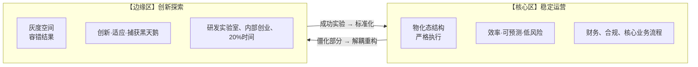

# ASTO.Ext.03. 组织：动态稳态的建造与维护

> **Version**: Sci.P.v2.0
> **Status**: 公开应用扩展稿
> **发布边界**：本文属于 ASTO 的公开应用扩展支线，用于场景化说明，不纳入首轮公开主包。
> **作者 / Author**：Yi Fu（付毅，ODDFounder，fuyi.it@live.cn）
> **Audience**: 组织架构师、企业家、管理学者。
> **Abstract**: 从人格化控制到结构工程——企业作为抗噪系统。
> **Context**: 本文档属于 ASTO 应用扩展系列 (Ext)，探讨组织作为耗散结构的治理与演化。

---

## **摘要**

现代企业普遍陷入"规模诅咒"：随人员增长，组织效率不升反降，内耗剧增，响应迟滞。传统管理学将原因归于"人的问题"或"文化问题"，并试图通过更复杂的KPI、更密集的培训或更有魅力的领导力来"修复"。然而，在属集变迁存在论（ASTO）的框架下审视，这是一个根本性的**诊断错误**。

ASTO提出一个颠覆性的本体论判断：**企业的本质不是一个由人构成的社群，而是一个在熵流中维持动态稳态的耗散结构。** 人是这一结构的承载者与活化剂，但维持组织在不确定市场中稳态运行的，是其内在的**属集结构网络**。

本文系统地将ASTO的核心模型——**五态演进、六阶动力学与七序介入循环**——映射至企业组织领域。我们揭示：企业从创业到成熟的生命周期，本质上是其属集结构从"混沌人治"向"秩序结构"结晶，再因"结构负债"积累而衰变，最终必须通过"结构重构"实现跃迁的完整动力学过程。

最终，我们提出"结构工程"作为企业设计的新范式：企业的核心任务不再是"管理好人"，而是**设计并维护一套清晰、低阻抗、可演化的属集结构**，使人能够低摩擦、高自主地在此结构中协作与创造。

---

## **本体论立场声明**

### **术语锚点：属集**

> 属集，是存在在时间切片上可被指认的属性集合；
> 属集的变迁，构成了存在的全部历史。
>
> 我们不讨论存在“本来是什么”，
> 只讨论它在时间中“此刻呈现为什么”。

- 组织被视为**开放的耗散结构**，而非静态的低熵容器
- ASTO是**有限性框架**：当工程化手段与人的尊严/自治冲突时，优先保护后者
- 本文件提供**条件性建议**：具体取舍需结合组织使命与利益相关方协商

## **第一章｜问题诊断：为何组织会"越大越慢"？**

### **1.1 "规模诅咒"的现象学**

观察一个普遍的组织演化轨迹：

- **创业期（<20人）**：目标高度一致，沟通几乎无损耗，决策由创始人直接驱动，行动迅猛。
- **成长期（20-150人）**：部门开始形成，流程被建立，但"我们以前不是这样"的抱怨出现，决策开始需要会议与对齐。
- **成熟期（>150人）**：制度手册变厚，跨部门协作成本飙升，大量精力消耗在"内部博弈"与"流程遵循"上，对市场变化的响应速度急剧下降。

传统解释将之归咎于"人多了就复杂"、"大公司病"或"文化稀释"。但这是同义反复，并未触及根本。

### **1.2 ASTO诊断：信息熵在层级传递中的损耗**

科层制的核心缺陷不在于"官僚"，而在于**信息在层级传递中的热力学损耗**。

*   指令下达（从高熵到低熵）是耗能的。
*   信息上传（从低熵到高熵）也是耗能的。
*   **结论**：随着组织规模扩大，维持这一"长管道"所需的能耗呈指数级上升，最终导致"管道过热"（管理成本激增）和信息失真。

### **1.3 核心命题：组织即低熵孤岛**

> **在ASTO视角下，一个组织能够持续存在并实现目标的唯一原因是：它成功构建并维护了一套低阻抗、高适应、开放交换的属集结构网络（动态稳态）。**

企业不是人的集合，企业是**属集结构的集合**。人是在这个网络中流动的**高能粒子**。

---

## **第二章｜组织的ASTO本体论：从金字塔到服务网格**

### **2.1 重新定义企业：微服务化与API优先**

在ASTO视角下，企业不应是一个金字塔，而应是一个**"服务网格 (Service Mesh)"**。

*   **Pod (小团队)**：每个团队都是一个独立的、松耦合的自治单元。
*   **API (结构接口)**：部门间的协作必须通过明确的、文档化的接口进行（如服务SLA、工单标准），而不是靠"刷脸"（高阻抗的人际依赖）。
*   **API 优先 (API-First)**：先定义接口（协作结构），再组建团队。

### **2.2 组织属集的三层架构**

| 层级 | 定义 | 功能 | 示例 |
| :--- | :--- | :--- | :--- |
| **构成层** | 定义"我们是谁" | 身份与边界 | 企业愿景、商业模式 |
| **规制层** | 定义"如何协作" | 流程与标准 | API标准、工作流 |
| **执行层** | 定义"底线" | 强制约束 | 财务红线、合规代码 |

### **2.3 组织的五态演进**

| 五态 | 组织表现 | 特征 |
| :--- | :--- | :--- |
| **自在态** | 创始人的模糊愿景 | 只在脑海中，未被言说 |
| **共识态** | 团队的口头约定 | 被分享但未形式化 |
| **编码态** | 成文的制度手册 | 被写下但可能不执行 |
| **物化态** | 系统强制的流程 | 被代码/工具固化 |
| **定向态** | 自我演化的组织OS | 包含自我修正机制 |

**健康组织的标志**：关键属集已从共识态跃迁至物化态，同时保留向定向态演进的能力。

---

## **第三章｜组织的六阶生命周期**

| 六阶 | 组织阶段 | 典型特征 | 关键挑战 |
| :--- | :--- | :--- | :--- |
| **混沌阶** | 创业探索期 | 方向不明，多方尝试 | 找到PMF |
| **秩序阶** | 稳定运营期 | 流程确立，效率提升 | 保持创新 |
| **流变阶** | 竞争压力期 | 修补增多，债务积累 | 控制负债 |
| **脉冲阶** | 危机爆发期 | 内部分歧，外部压力 | 统一认知 |
| **崩解阶** | 转型重构期 | 旧结构失效，新结构涌现 | 管理混乱 |
| **归元阶** | 新稳态期 | 重生或死亡 | 巩固成果 |

### **3.1 组织衰变的热力学信号**

```
监测指标（启发式，情境相关）：
├─ 会议时间占比（结合任务性质评估）
├─ 决策层级数（与风险类型/合规要求相称）
├─ 跨部门项目周期（关注趋势而非单点）
├─ 员工满意度变化率（配合质性访谈理解原因）
└─ 创新提案到落地的平均时间（按领域基准校正）

预警级别（需专家判断与数据佐证）：
├─ 🟢 绿色：秩序阶，正常运营
├─ 🟡 黄色：流变阶，需要关注
├─ 🔴 红色：脉冲阶，必须行动
```

---

## **第四章｜有管理的混沌：捍卫创新空间**

### **4.1 创新来自涨落**

如果企业把一切都结构化死了（全物化态），那就没有涨落，也就没有创新（热寂）。ASTO 提倡**"有管理的混沌" (Managed Chaos)**。

### **4.2 核心区与边缘区的分离**



### **4.3 创新沙盒机制**

*   **资源隔离**：边缘区有独立预算，不受核心区KPI绑架。
*   **失败容忍**：明确的"学费预算"，失败不追责。
*   **快速毕业**：成功项目有清晰的"毕业路径"进入核心区。

---

## **第五章｜文化与心理场域：关于"家"的隐喻重构**

### **5.1 去魅："家"不是血缘，是低阻抗场**

很多老板喜欢说"公司是家"，这往往是情感勒索。在 ASTO 看来，"家"是一种**"低阻抗心理场域"**。

*   在外部（高阻抗），你需要防御。
*   在内部（低阻抗），你可以卸下伪装，暴露脆弱性。
*   **价值**：只有在低阻抗场域中，真实的沟通和激进的创新才可能发生。

### **5.2 文化内生：信任的自编译**

文化不是贴在墙上的标语（外挂结构），而是**"成功协作的沉淀"**。

*   当团队一起打赢了仗，并在战壕里建立了背靠背的信任，文化就**"自编译 (Self-Compile)"**完成了。
*   **结论**：不要"建设"文化，要"通过胜利沉淀"文化。

### **5.3 心理安全的结构性保障**

心理安全不能靠领导的人格魅力，要靠**结构性机制**：

*   **匿名反馈通道**：降低说真话的阻抗。
*   **无责复盘制度**：将失败转化为学习而非惩罚。
*   **透明决策过程**：让每个人理解"为什么"。

---

## **第六章｜组织的外部性：从利润机器到生态公民**

### **6.1 负外部性 = 向环境排污（熵增）**

污染、压榨员工、制造焦虑，本质上是组织为了维持内部低熵（利润），向外部环境**强制排放无序**。这是不可持续的——环境会反噬（监管/舆论），导致组织的"抗噪成本"激增。

### **6.2 正外部性 = 社会的负熵发生器**

企业的最高价值，不是赚钱，而是成为社会的**"负熵发生器"**：

*   **提供好产品**：降低用户的生活熵。
*   **提供好就业**：降低员工的生存熵。
*   **开源/公益**：降低全社会的创新阻抗。

### **6.3 共生稳态**

ESG 不是公关，它是**"组织与环境交换能量的结构协议"**。只有当组织与社会生态达成**"共生稳态"**时，它才拥有穿越周期的真正韧性。

---

## **第七章｜ASTO组织重构：结构工程的原则**

### **原则一：结构清晰化优于人格魅力**

首要任务是让构成层属集（我们是谁、去向何方）极度清晰，并确保规制层与执行层与之严格对齐。**清晰的结构，是对人性最大的赋能。** 它减少了对"超人"领导力的依赖，让普通人能在系统中有效协作。

### **原则二：追求"物化密度"**

持续将重复性、高确定性的决策与操作，从模糊的共识态，提升为**自动化或强约束的物化态**（如通过IT系统）。

> **衡量标准**：有多少关键控制点，是系统自动执行而非依赖人来把关的？

### **原则三：动变性通道化**

承认并正式建立"动变性"的调用机制。将管理者的临机决断权、员工的创新建议，设计成明确的**例外处理通道**（如绿色通道审批、创新孵化流程）。让动变性在结构的轨道上有序发挥，而不是随意冲撞或被迫沉默。

### **原则四：建立结构的"免疫与进化系统"**

*   **持续审计**：定期检查三层结构的一致性，以及执行层的实际效果。
*   **负债显影**：建立机制（如员工反馈、数据分析）让"结构摩擦"痛感可见。
*   **安全重构**：允许在局部进行结构的"沙盒"测试与迭代，为全组织的跃迁积累经验与信心。

---

## **第八章｜工程工具箱：组织设计的ASTO实践**

### **8.1 组织健康度仪表盘**

```python
class OrganizationHealth:
    def evaluate(self):
        return {
            "structure_clarity": self.measure_role_definition(),
            "communication_cost": self.measure_meeting_overhead(),
            "decision_latency": self.measure_approval_time(),
            "innovation_rate": self.measure_new_initiatives(),
            "adaptation_speed": self.measure_change_response(),
            "debt_level": self.measure_structural_debt()
        }
```

### **8.2 组织重构的七序循环**

| 七序 | 组织重构活动 | 输出 |
| :--- | :--- | :--- |
| **⓪ 觉醒** | 意识到"组织病了" | 变革意愿 |
| **① 感知** | 收集组织健康数据 | 诊断报告 |
| **② 解析** | 定位结构性病因 | 根因分析 |
| **③ 干预** | 设计新的结构方案 | 重构蓝图 |
| **④ 设计** | 详细规划实施路径 | 实施计划 |
| **⑤ 物化** | 试点执行 | 试点反馈 |
| **⑥ 回溯** | 评估效果，迭代调整 | 改进方案 |
| **⑦ 消解** | 扬弃旧结构，固化新结构 | 新稳态 |

### **8.3 API-First组织设计模板**

```yaml
# 团队定义模板
team:
  name: "用户增长团队"
  mission: "提升新用户激活率"
  
  # 对外接口定义
  api:
    inputs:
      - name: "marketing_leads"
        source: "市场团队"
        sla: "每日更新"
    outputs:
      - name: "activated_users"
        target: "产品团队"
        sla: "实时同步"
  
  # 内部自治
  autonomy:
    - "方法自选"
    - "预算自主"
    - "人员调配"
  
  # 边界约束
  constraints:
    - "CAC < $50"
    - "合规审查通过"
```

---

## **结语｜从驾驭人性到设计结构**

传统管理学的终极困境在于：它试图**驾驭一种它无法真正驾驭的东西——复杂的人性**。ASTO提供了一条出路：不再将组织视为一个需要被驯服的"人性集合体"，而是将其视为一个可以**被理性设计、建造与维护的"属集结构"**。

**管理的对象，从人转向了人与结构交互的界面。** 优秀的管理，是创造出这样一种结构：在其中，个体的自利行为通过结构的引导，能自然地汇聚成组织的集体目标；在其中，善意的努力不会被复杂的流程消磨，创新的火花不会被僵化的制度窒息；在其中，好人能成事，坏人也难作恶。

这并非消灭人性，而是为澎湃的人性能量修建坚固而宽阔的河道，让它既能奔流不息，又能灌溉沃野，而非泛滥成灾。

**企业的重构，因此不仅是一次效率提升，更是一次文明层面的组织范式跃迁——从依赖英雄与偶然，走向依靠理性与结构。**

---

## **附录：ASTO组织术语对照表**

| ASTO概念 | 组织领域映射 | 说明 |
| :--- | :--- | :--- |
| 属集 | 组织实体及其关系 | 角色、流程、制度（规范定义见前文“术语锚点：属集”） |
| 低熵孤岛 | 有效运转的组织 | 在市场噪声中维持秩序 |
| 结构负债 | 流程僵化/制度冗余 | 维护成本超过收益 |
| 阻抗 | 协作摩擦 | 沟通成本、审批延迟 |
| 物化态 | 系统强制的流程 | IT系统、自动化规则 |
| 共识态 | 口头约定 | 未成文的惯例 |
| 跃迁 | 组织重构 | 结构性变革 |
| 场域 | 组织文化/心理环境 | 影响行为的隐性因素 |

---

**关联文件**：
- 理论基础：[ASTO.P04.宣言](../ASTO.P04.宣言.Phil.md)、[ASTO.P05.公理](../ASTO.P05a.公理.Phil.md)
- 自动化实践：[ASTO.E02.自动化](./ASTO.E02.自动化.Eng.md)
- 韧性设计：[ASTO.P11.韧性](../ASTO.P11.韧性.Phil.md)

---

## 🌳 文档体系导览 (Functional Tree)

```text
ASTO 文档体系
├── 🌟 P 系列：哲学核心 (Philosophy)
│   ├── [P01. 非此](../ASTO.P01.非此.Phil.md) (理论免疫宣言)
│   ├── [P02. 序章](../ASTO.P02.序章.Phil.md) (否定性导引与路径分流)
│   ├── [P03. 认识论](../ASTO.P03.认识论.Phil.md) (认知错误的必然性)
│   ├── [P04. 宣言](../ASTO.P04.宣言.Phil.md) (结构性处境与行动纲领)
│   ├── [P05. 公理](../ASTO.P05a.公理.Phil.md) (系统热力学与结构存在论)
│   ├── [P06. 价值](../ASTO.P06.价值与边界.Phil.md) (复数性测试与伦理熔断)
│   ├── [P07. 自由](../ASTO.P07.自由论.Phil.md) (边界即自由)
│   ├── [P08. 例外](../ASTO.P08.例外.Phil.md) (宗教体验与星际主权)
│   ├── [P09. 批判](../ASTO.P09a.批判.Phil.md) (反极权宪章与系统免疫)
│   ├── [P10. 民主](../ASTO.P10.民主.Phil.md) (对话平台与 NCP 协议)
│   ├── [P11. 韧性](../ASTO.P11.韧性.Phil.md) (自我免疫与反脆弱)
│   ├── [P12. 留白](../ASTO.P12.留白.Phil.md) (预留扩展空间)
│   └── [P13. 终章](../ASTO.P13.终章.Phil.md) (系统的终极关怀)
│
├── 🛠️ E 系列：工程实践 (Engineering)
│   ├── [E01. 实践指南](./ASTO.E01.实践指南.Eng.md) (生活|人文|工程三轨读本)
│   ├── [E02. 自动化](./ASTO.E02.自动化.Eng.md) (可执行规范与零摩擦治理)
│   ├── [E03. Web3](./ASTO.E03.Web3.Eng.md) (意图宪法与链上三权分立)
│   ├── [E04. AI对齐](./ASTO.E04.AI对齐.Eng.md) (逆熵智能体与文明传承)
│   ├── [E05. 工程手册](./ASTO.E05.工程实践手册.Eng.md) (对抗测试与赛马机制)
│   └── [E06. 领域扩展](./ASTO.E06.领域扩展.Eng.md) (多领域应用索引)
│
├── 🧩 H 系列：人文叙事 (Humanities)
│   ├── [H01. 重构](../人文版/ASTO.H01.重构.Hum.md) (架构师的二十一种宇宙视角)
│   ├── [H02. 导读](../人文版/ASTO.H02.导读：为什么读这本书.Hum.md)
│   ├── [H03. 故事](../人文版/ASTO.H03.故事：小陈的那条路.Hum.md)
│   ├── [H04. 认知冒险](../人文版/ASTO.H04.认知冒险.Hum.md)
│   ├── [H05. 奇幻漂流](../人文版/ASTO.H05.奇幻漂流.Hum.md)
│   └── [H06. 暮年的重构](../人文版/ASTO.H06.暮年的重构：给不再年轻的你.Hum.md)
│
├── 🎓 Lite 系列：青春版 (Youth)
│   ├── [L01. 宣言 (Lite)](./青春版/ASTO04.宣言.Lite.v1.0.md)
│   ├── [L02. 认识论 (Lite)](./青春版/ASTOop.认识论.Lite.v1.0.md)
│   └── [L03. 价值 (Lite)](./青春版/ASTO05.价值与边界.Lite.v1.0.md)
│
└── 🌍 Ext 系列：领域扩展 (Extensions)
    ├── [Ext.01 法律](./ASTO.Ext.01.法律.Sci.P.md)
    ├── [Ext.02 科学](./ASTO.Ext.02.科学.Sci.P.md)
    ├── [Ext.03 组织](./ASTO.Ext.03.组织.Sci.P.md)
    ├── [Ext.04 教育](./ASTO.Ext.04.教育.Sci.P.md)
    ├── [Ext.05 城市](./ASTO.Ext.05.城市.Sci.P.md)
    ├── [Ext.06 医疗](./ASTO.Ext.06.医疗.Sci.P.md)
    ├── [Ext.07 宇宙](./ASTO.Ext.07.宇宙.Sci.P.md)
    └── [Ext.08 留白](./ASTO.Ext.08.留白.Sci.P.md)
```

> 🔙 [返回总目录](../readme.md)


