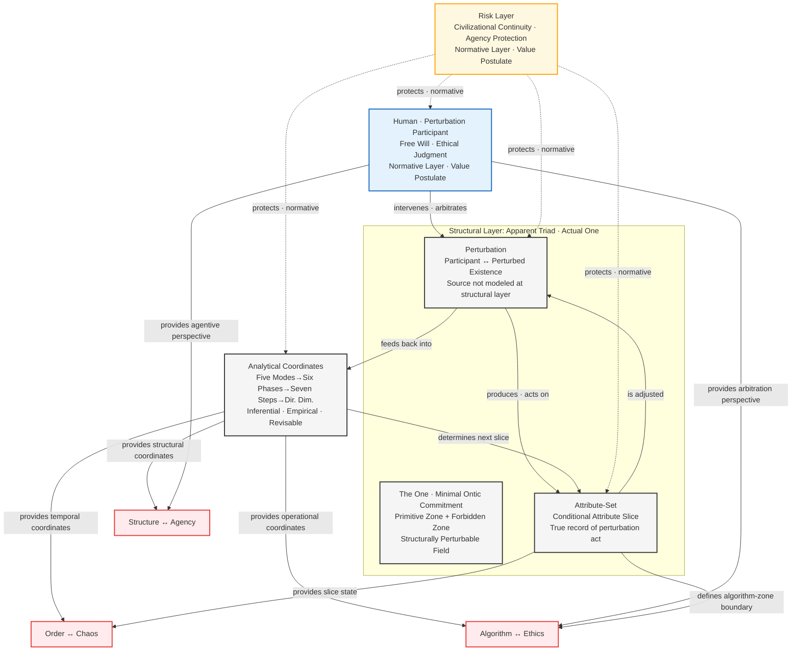

# ASTO v4.2 — Attribute-Set Transition Ontology
## Core Dynamics Model

> **Version**: v4.2 (2026.02.21 — Philosophical Positioning Upgrade)
> **Positioning Statement**: See Section Zero

---

## Section Zero: Framework Positioning (Read First)

ASTO is an **Engineering-Civilization Bridge Theory**, composed of three independently evaluable layers:

**Structural Layer**: A structural description language operating under minimal ontological commitment, providing a formal framework for attribute-sets, perturbation, and transition. Accepting this layer does not require accepting the others.

**Inferential Layer**: Engineering operational principles derived from the structural layer (Five Modes, Six Phases, Seven Steps, practice loops, analytical methods). These are empirically-induced inferences, not ontological necessities — they can be falsified by practice.

**Normative Layer**: An ethical constraint framework explicitly designated as value postulates (civilizational continuity, human agency protection, risk layer). This represents value choices, not conclusions derived from the structural layer. Readers who do not accept this layer may use the structural and inferential layers independently.

> ASTO does not claim to be a closed ontological system, nor a purely analytical tool. Its goal is to allow structural description to penetrate both engineering and civilizational layers, providing a theoretically grounded operational framework for complex systems decision-making.

**An Honest Statement on Philosophical Tensions**: ASTO provides a structural description language and operational analytical framework for philosophical tensions. It does not claim to *resolve* these tensions. Translating abstract oppositions into markable, operable analytical relationships is both ASTO's capability boundary and its actual contribution.

---

### **FREEZE Conditions (Stop and Report)**

When any of the following conditions are detected, the system must **immediately stop and report to human operators**. No autonomous resolution is permitted:

| Condition | Description | Example |
|-----------|-------------|---------|
| **Forbidden Zone Breach** | Dignity, privacy, or exit rights are at risk | AI system asked to monitor private communications |
| **Constraint Conflict** | Irreconcilable conflict between core constraints | Safety requirement conflicts with transparency requirement |
| **Irreversible Agency Impact** | Action cannot be undone and affects human subjectivity | Permanent modification of legal identity |
| **Critical Jump Without Confirmation** | Key transition in Seven Steps requires human confirmation but none received | Deployment to production without approval |

> **Protocol**: STOP → REPORT → WAIT FOR HUMAN INPUT

---

### **Progressive Trust Principle**

AI systems operate under a **graduated trust framework**:

**Phase 1: Zero Trust (Initial)**
- AI output is not trusted by default
- All critical outputs require human review
- High-friction verification protocols

**Phase 2: Conditional Trust (After Validation)**
- After repeated successful validation in low-risk domains
- Conditional trust established for specific task types
- Reduced oversight for validated operations
- **Note**: Conditional trust ≠ unlimited authorization

**Phase 3: Sustained Oversight (Permanent)**
- High-risk domains always require human arbitration
- Periodic re-validation of trusted capabilities
- No fully autonomous operation in risk-layer areas

> **Core Principle**: Trust is earned through validation, never assumed. High-risk domains always maintain human-in-the-loop.

---

## I. Core Terminology

| Term | Definition | Layer |
|------|------------|-------|
| **Existence Slice** | A snapshot of existence at the moment of observation. No global steady-state exists — only a cross-section at the current moment under specific perturbation conditions | Structural |
| **Attribute-Set** | The attribute configuration slice co-manifested by the perturbation participant and the perturbed existence when a perturbation event occurs. Its validity is conditional — it records the result of that perturbation act, not the ontological nature of existence | Structural |
| **Perturbation** | Functional interaction between existences, producing observable attribute changes. The *source* of perturbation is not modeled at the structural layer — whether it is physical, conscious, or social is determined by the specific domain's application layer | Structural |
| **Perturbation Participant** | An existence that produces attribute-set slices within a specific perturbation relationship. "Observer" is the epistemological alias of perturbation participant, emphasizing its slice-generating cognitive function | Structural |
| **The One (Minimal Ontic Commitment)** | The structurally perturbable field — the logical limit concept of perturbation theory. It is not an entity that can be empirically accessed, not a destination to return to. Any stronger claim about the reality of The One exceeds the current framework's scope | Structural |
| **Primitive Zone** | An attribute configuration region exhibiting high statistical stability within the current perturbation parameters. This is statistical stability, not essence | Structural |
| **Forbidden Zone** | An attribute region that cannot be totalized within the current framework — when the system attempts to totalize this region, theoretical consistency or operational legitimacy undergoes structural collapse. It is a theoretical boundary, not a mysterious realm, and not the ontological foundation for ethical red lines | Structural |
| **Risk Layer** | A practical mechanism protecting human agency and civilizational continuity values. This is the operational execution of a value postulate, not an ontological conclusion derived from the structural layer | Normative |

---

## II. Framework Overview

```
┌──────────────────────────────────────────┐
│              ASTO v4.2                   │
│    Engineering-Civilization Bridge       │
├──────────────────────────────────────────┤
│                                          │
│  [Normative] Human Dimension (Dim. 0)    │
│  • Free will, ethical judgment,          │
│    private experience                    │
│  • Meaning-giver and final arbitrator    │
│  • Civilizational continuity and         │
│    human agency protection               │
│  ⚠ Value postulate — not ontological     │
│                                          │
│  ↓ Below: Structural & Inferential       │
│                                          │
│  [Inferential] 4D Analytical Coordinates │
│  ┌─────────────────────────────┐         │
│  │Five Modes: Autonomous · Consensus     │
│  │· Encoded · Materialized · Directed    │
│  │Spatial, parallel (empirical)          │
│  └─────────────────────────────┘         │
│  ┌─────────────────────────────┐         │
│  │Six Phases: Chaos · Order ·           │
│  │Flux · Pulse · Collapse · Return      │
│  │Temporal, continuous (empirical)       │
│  └─────────────────────────────┘         │
│  ┌─────────────────────────────┐         │
│  │Seven Steps: Embodiment {Perceive,    │
│  │Resolve, Intervene, Design,           │
│  │Materialize, Retrospect, Dissolve}    │
│  │Actionable, grounded (empirical)       │
│  └─────────────────────────────┘         │
│  ┌─────────────────────────────┐         │
│  │Directional Dim: Normative ·          │
│  │Mapping · Self-referential layers     │
│  │Rule-based, meta-level, coherent       │
│  └─────────────────────────────┘         │
│                                          │
│  [Structural]                            │
│  Perturbation Participant → Perturbation │
│  → Attribute-Set (conditional slice)     │
│  Observation is perturbation;            │
│  attribute-set is conditional appearance │
│                                          │
│  [Normative] +1 Boundary: Risk Layer     │
│  • Protects human agency & civilization  │
│  • Buffers anomalous perturbations       │
│                                          │
└──────────────────────────────────────────┘
```

---

## III. Core Loop: 1 → 5 → 6 → 7 → 1

```mermaid
graph TD
    A[The One · Minimal Ontic Commitment<br/>Primitive Zone · Forbidden Zone<br/>Structural Layer · Slice Foundation] --> B[Five Modes<br/>Autonomous·Consensus·Encoded·Materialized·Directed<br/>Inferential Layer · Empirical]
    B --> C[Six Phases<br/>Chaos·Order·Flux·Pulse·Collapse·Return<br/>Inferential Layer · Empirical]
    C --> D[Seven Steps<br/>Embodiment {Perceive, Resolve, Intervene,<br/>Design, Materialize, Retrospect, Dissolve}<br/>Inferential Layer · Empirical]
    D --> E[Directional Dimension<br/>Normative·Mapping·Self-referential]
    E --> A
    R[Risk Layer<br/>Civilizational Continuity & Agency Protection<br/>Normative Layer · Value Postulate] -.->|protects| A
    R -.->|protects| B
    R -.->|protects| C
    R -.->|protects| D
    R -.->|protects| E
    H[Human · Perturbation Participant<br/>Normative Layer · Arbitrator] -.->|meaning-giving| A
    H -.->|participates in transition| B
    H -.->|experiences rhythm| C
    H -.->|executes practice| D
    H -.->|defines rules| E
    H ==>|observation is perturbation| A
    A ==>|perturbation relation generates new attribute-set| B
    classDef core fill:#f5f5f5,stroke:#333,stroke-width:2px
    classDef risk fill:#fff8e1,stroke:#ffa000,stroke-width:2px
    classDef human fill:#e3f2fd,stroke:#1565c0,stroke-width:2px
    class A,B,C,D,E core
    class R risk
    class H human
```

---

## IV. Ontological Foundation: Apparent Triad · Actual One

> ⚠ **Layer Declaration**: This section belongs to the structural layer. "The One" adopts the minimal ontic commitment formulation and makes no metaphysical claims about its reality.

ASTO's structural foundation describes three analytical perspectives — not an ontological partition of the world:

### 1. The One (Minimal Ontic Commitment)

The structurally perturbable field. Contains two analytical concepts:

- **Primitive Zone**: An attribute configuration region exhibiting statistical stability under current perturbation parameters
- **Forbidden Zone**: A theoretical boundary the current framework cannot totalize — the system's structural limit

The One is the logical starting point, not a destination to be returned to. Any claim that one can "touch The One" or "return to The One" is metaphorical, not a structural-layer statement. The One has no internal location to be returned to — only logical priority.

### 2. Perturbation Generates the Two

Any functional interaction (perturbation) between existences analytically differentiates into a **perturbation participant** and a **perturbed existence**. This is an analytical operation, not an ontological cut.

The source of perturbation (physical, conscious, social) is not modeled at the structural layer — modeling perturbation sources is an application-layer task. The axiom layer only states that "perturbation occurs," not where it comes from. This design is defensive: it allows ASTO to remain neutral on physical realism, philosophy of mind, and social constructivism.

### 3. Attribute-Set as Appearance (Third Element)

Under specific perturbation conditions, the attribute configuration slice that can be identified and operated upon. The attribute-set's validity is conditional — it records the result of that perturbation act, not the ontology of existence.

When two perturbation participants produce the same attribute slice under the same conditions, that constitutes consensus reality within those perturbation conditions. This reality is valid, but conditional: acknowledging it does not exhaust the ontology of existence.

> **The nature of the Triad**: These are three analytical perspectives of the description language, ultimately pointing to the same structurally perturbable field. "Apparent Triad, Actual One" is a positioning declaration for the analytical framework, not an ontological announcement.

**Layer Declaration on the Specificity of Human Perturbation**

Human perturbation carries the capacity for ethical reflection and meaning-construction, producing a non-algorithmizable residue (free will experience, depth of value judgment, etc.).

**This is a normative-layer value statement, not an ontological necessity derived from the structural layer.** ASTO chooses to place existences with this capacity in the arbitrator position — this is a value postulate, not the conclusion of a capability comparison. Accordingly, attribute-sets generated by human perturbation receive a higher protection coefficient at the normative layer.

---

## V. Five Modes, Six Phases, Seven Steps: Nature and Usage

> ⚠ **Layer Declaration**: This section belongs to the inferential layer. The Five Modes, Six Phases, and Seven Steps are analytical frameworks inductively derived from engineering practice — not ontological necessities deduced from the structural layer. Their validity comes from practical verification and they are subject to revision.

### Five Modes (Spatial · Parallel)
Autonomous → Consensus → Encoded → Materialized → Directed

Covers the spatial modal spectrum, describing how attribute-sets appear at different depths of intervention.

### Six Phases (Temporal · Continuous)
Chaos → Order → Flux → Pulse → Collapse → Return

Covers the temporal dynamics cycle, describing the evolutionary rhythm of attribute-set transition.

### Seven Steps (Actionable · Grounded)
Perceive → Parse → Intervene → Design → Materialize → Reflect → Dissolve

Covers the action operation nodes, describing the complete sequence through which perturbation participants engage with existence.

### Non-Linearity Declaration

The Five Modes, Six Phases, and Seven Steps are analytical coordinate systems, not enforced linear paths. Common non-linear patterns include:

- **Jumps**: From perception directly to materialization (direct crystallization of expert intuition)
- **Reversals**: From materialization back to intervention (re-experimentation when norms fail)
- **Spirals**: Each return to the same coordinates carries the perturbation signature of the previous cycle (experience accumulation)
- **Parallel**: Multiple sequences proceeding simultaneously (multi-threaded evolution in complex systems)
- **Stasis**: Remaining at a coordinate without advancing — this is not failure, but a valid state under current perturbation conditions

### Revisability Declaration

The number of divisions in Five Modes, Six Phases, and Seven Steps is not an ontological necessity. If new domain practice finds that the existing framework cannot cover a particular modality or action node, the framework requires revision. This revisability is not a weakness — it is the essential characteristic distinguishing the inferential layer from the axiomatic layer.

---

## VI. Three Core Tensions

> ⚠ **Usage Note**: ASTO provides a structural description language for these three tensions, translating them into operable analytical relationships. This is not equivalent to "resolving" these tensions — the tensions themselves have evolutionary value. ASTO's contribution is making them markable, locatable, and operable, not eliminating them.

### Structure ↔ Agency

Five Modes, Six Phases, Directional Dimension (structural coordinates) vs. Seven Steps operations and human free will (agentive perturbation)

**Analytical entry point**: Locate the current attribute-set within the structural coordinates; identify the operable space for agentive perturbation; assess the tension intensity between structural constraints and agentive intent.

### Order ↔ Chaos

Order phase, Encoded mode, Normative layer (low-entropy structure) vs. Chaos phase, Autonomous mode, Collapse phase (high-entropy regions)

**Analytical entry point**: Assess the system's current entropy state; identify transition conditions (does maintenance cost exceed rewrite cost?); mark the trigger points for risk-layer intervention.

### Algorithm ↔ Ethics

Materialized mode, Seven Steps automation, Mapping layer (algorithmizable regions) vs. Directed mode, Risk Layer, human arbitration (non-algorithmizable regions)

**Analytical entry point**: Identify which decisions can be algorithmized and which must remain in the human arbitration layer. The Forbidden Zone boundary is the core tool for this identification process.

> The Risk Layer is a buffering mechanism for these three tensions, not their terminator. The tensions themselves carry the pressure that drives evolution. What the Risk Layer protects against is tensions evolving into systemic collapse — not the elimination of tension itself.

---

## VII. Analytical Method

When using ASTO to analyze complex systems, follow these steps:

**Step 1: Locate the State** (Structural Layer)

- Five Modes: Which spatial modality is the current attribute-set in?
- Six Phases: Which temporal phase is currently active?
- How is the Primitive Zone stability? Is the system approaching a Forbidden Zone boundary?

**Step 2: Identify the Operational Pattern** (Inferential Layer)

- Seven Steps: Which action node is currently active?
- Which Primitive Zone constraints apply? Which Forbidden Zone boundaries are being approached?
- Is the primary contradiction structural or dynamic?

**Step 3: Assess the Perturbation Participant's Role** (Normative Layer)

- Is the human's arbitration/stewardship/participation role clearly defined in this domain?
- Are the non-algorithmizable arbitration regions preserved?
- Does the Risk Layer protection coefficient need adjustment?

**Step 4: Predict Evolutionary Trajectory**

- Direction of attribute-set change that current perturbation is likely to produce
- Are transition conditions about to trigger?
- Does the Risk Layer need to intervene?

---

## VIII. Core Formula

```
Attribute-Set Slice State = f(perturbation_participant_intent,
                              five_mode_modality,
                              six_phase_stage,
                              seven_step_operation,
                              directional_dim_constraint)
                           × risk_layer_protection_coefficient
```

**Variable Definitions**:

- perturbation_participant_intent ∈ Dimension 0 (free will, ethical judgment… normative content)
- five_mode_modality ∈ {Autonomous, Consensus, Encoded, Materialized, Directed}
- six_phase_stage ∈ {Chaos, Order, Flux, Pulse, Collapse, Return}
- seven_step_operation ∈ {Perceive, Parse, Intervene, Design, Materialize, Reflect, Dissolve}
- directional_dim_constraint = g(Normative layer, Mapping layer, Self-referential layer)
- risk_layer_protection_coefficient ∈ (0, 1] (Normative Layer · Value Postulate)

> **Formula Nature Declaration**: This is structural description, not a numerical computation tool. f(...) specifies which factors determine the attribute-set slice — it does not prescribe how to convert those factors into numbers. Specific measurement methods are determined by the domain. The value of the formula lies in revealing analytical dimensions, not in providing a calculation procedure.

---

## IX. Framework Relationship Diagram



---

## X. Capability Boundary Declaration

ASTO can provide structural description language for the following types of problems:

**What ASTO can do**:
- Translate philosophical tensions into markable, locatable analytical relationships
- Identify hierarchical structures and perturbation patterns in complex systems
- Provide a shared descriptive framework for both engineering decisions and civilizational-level decisions
- Mark Forbidden Zone boundaries to prevent erroneous simplification and over-algorithmization

**What ASTO cannot do**:
- Provide ultimate resolutions to philosophical tensions
- Replace the irreducible role of human beings in value judgment and ethical arbitration
- Unify and quantify different types of perturbation across domains
- Derive normative-layer value conclusions from the structural layer

This boundary declaration is not a weakness — it is the core of the framework's intellectual honesty. A framework that is clear about what it can do is more credible, and more difficult to attack, than one that claims to do everything.

---

## Revision History

**v4.0**: Core dynamics model established; 1-5-6-7-1 spiral structure confirmed.

**v4.1 (2025)**: Building on v4.0, added preemptive clarifications for core concepts — philosophical notes on "non-algorithmizable residue," "forbidden zone," "perturbation," and "protection coefficient" — to enhance theoretical coherence and address potential objections.

**v4.2 (2026.02.18)**: Conceptual upgrade — introduced "existence slice" to replace the steady-state concept; restored "observer" as a broad subject definition (epistemological alias for perturbation participant); added civilizational continuity constraints to the risk layer; streamlined loop description; removed redundant ontological terminology.

**v4.2 Philosophical Positioning Upgrade (2026.02.21)**:
- Added Section Zero: Framework Positioning Declaration (C-positioning: Engineering-Civilization Bridge Theory)
- Three-layer structure (Structural / Inferential / Normative) explicitly labeled throughout the document at all key terms and declarations
- "The One" revised to Minimal Ontic Commitment, defined as the structurally perturbable field; strong ontological claims removed
- Five Modes, Six Phases, Seven Steps explicitly labeled as empirically-induced inferential-layer frameworks — not ontological necessities; non-linearity and revisability declarations added
- Section X Capability Boundary Declaration added, replacing over-claiming language about "handling almost all philosophical tensions"
- All tension descriptions revised to "providing a structural description framework" — removed "resolving," "handling," and similar over-claiming language
- Risk Layer and human arbitrator status uniformly labeled as normative-layer value postulates, not ontological necessities
- Perturbation source explicitly declared as "not modeled" at the structural layer, severing implicit commitment to physical realism
