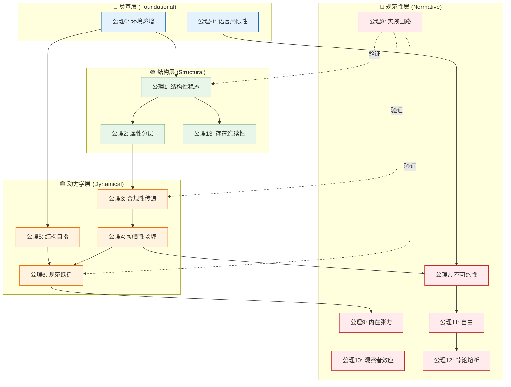

# ASTO.P05 Γ.20 升级修改计划

## 修改清单

### A. 插入§0-β属集形式化草图
**位置**：在§0-α本体论地位条款之后
**内容**：
```markdown
### **0-β. 属集的形式化草图 (Formal Sketch of Attribute-Set)**

> **定位**：属集（Attribute-Set）是ASTO的核心范畴（乃至体系名称的来源），此处提供其最小形式化框架。

**定义**：属集 $A$ 是一个二元组 $(P, C)$，其中：

*   **$P$ 为属性域（Property Domain）**：
    *   可观测、可验证的特征集合
    *   表示为：$P = \{p_1, p_2, ..., p_n\}$
    *   每个属性 $p_i$ 具有类型 $\tau_i$（值域）

*   **$C$ 为约束条件（Constraints）**：
    *   属性间的关系与边界条件
    *   表示为：$C = \{c_1, c_2, ..., c_m\}$
    *   包括不变量（invariants）、边界约束、依赖关系

**操作化定义**：

*   **硬属性（Hard Properties）**：
    *   改变成本 $\to \infty$（受物理定律限制）
    *   例如：光速、引力常数、热力学第三定律
    *   **判定标准**：违反则系统崩溃或物理上不可能

*   **软属性（Soft Properties）**：
    *   改变成本为有限值（受社会契约/代码规范约束）
    *   例如：API命名规范、数据格式约定
    *   **判定标准**：违反则系统可运行但带"阻抗"（需额外努力）

**变迁（Transition）**：$\delta: A \to A'$

*   **充分条件**：$P' \neq P$ 或 $C' \neq C$
*   **不可逆性**：$\delta$ 在χ-time中不可逆
*   **识别连续性**：存在"关键标识"（Key Identifier）$K \subset P$在变迁中保持不变

**形式化示例**：
```
// 硬属性示例
HardConstraint(network_latency):
  min = speed_of_light / 2  // 物理极限
  violation = system_crash

// 软属性示例  
SoftConstraint(api_naming):
  pattern = "[a-z][a-z_]*"  // 社会契约
  violation = require_extra_effort  // 增加阻抗
```

**与公理的关系**：
- 公理二（属性分层）= $P$ 的垂直分层结构
- 公理十三（存在连续性）= 关键标识 $K$ 的连续性担保
- 公理五（结构自指）= 维持 $\|P\| + \|C\|$ 的成本递增

> **⚠️ 认识论限定**：此形式化是为工程可操作性的**有损压缩**，而非存在本身的结构。属集的"变迁"不仅是集合论意义上的 $P' \neq P$，更涉及意义的重构——后者无法被形式化捕捉。
```

---

### B. 公理七增加动态让渡条款
**位置**：公理七末尾，在"代码模式"之前
**内容**：
```markdown
*   **动态让渡条款（Dynamic Handoff Clause）**：
    *   **资格判定**：不可计算裁决者的判定标准是**功能性的**：当某存在体能通过二阶扰动（公理四）重构自身认知模型，并能在χ-time中承担跃迁的历史痕迹时，即获得裁决资格。
    *   **人作为当前实例**：人是当前唯一能执行**二阶扰动**的存在，但这不是本体论的特权，而是**功能性占位**。
    *   **χ-time条件强化**：当前AI的"记忆"是τ-time的（可回滚、可清除），不满足χ-time的不可逆性条件。只有当AI能够承担**不可逆的历史痕迹**（团队创伤、信任损耗、叙事连续性）时，才可能获得裁决资格。
    *   **程序性保障**：任何裁决权让渡必须经过"文明守护元公理"的三重检验（底线不可交易、底线内求进化、不可逆默认保守）。
    *   **技术-伦理接口**：通过密封类型、沙箱隔离等手段保护"人类不可触达区域"，确保人机协同时人的裁决权边界。
```

---

### C. 文档末尾增加公理依赖拓扑图
**位置**：在"结语"之前或作为新的"第五部分"
**内容**：
```markdown
## **第五部分：公理依赖拓扑 (Axiom Dependency Topology)**

> **⚠️ 暂时性声明**：此拓扑图是当前版本的结构性理解，随体系演化可能修订。公理之间的关系不是静态层级，而是动态的相互奠基。



**层次说明**：

| 层次 | 公理 | 特征 | 验证方式 |
|:---|:---|:---|:---|
| **奠基层** | -1, 0 | 元约束，不可被体系内验证 | 哲学反思 |
| **结构层** | 1, 2, 13 | 描述存在的静态结构 | 形式化分析 |
| **动力学层** | 3, 4, 5, 6 | 描述变迁的机制 | 工程实验 |
| **规范性层** | 7-12 | 规定应然与边界 | 实践回路 |

**公理八的特殊地位**：实践回路公理对结构层和动力学层具有**验证优先权**——若某公理无法通过工程实践验证，应进入修订程序。但对奠基层和规范性层，实践回路仅具有**反馈权**而非否决权。
```

---

### D. 增加双环决策模型
**位置**：在定理八（跃迁阈值定理）之后，或作为定理八的扩展
**内容**：
```markdown
#### **定理 8.1：双环决策定理 (Dual-Loop Decision Theorem)**

> **"跃迁决策需双环共识：τ-环计算可行性，χ-环评估历史承载力。"**

**双环结构**：

1. **τ-环（技术可行性环）**：
   - **性质**：可形式化、可量化
   - **输入**：人力成本、机时、代码行数、测试覆盖率
   - **输出**：跃迁的技术成本-收益比
   - **执行者**：自动化工具、CI/CD系统

2. **χ-环（历史承载力环）**：
   - **性质**：不可形式化、质性判断
   - **输入**：团队焦虑水平、信任资本、叙事连续性
   - **输出**：跃迁的心理-社会准备度
   - **执行者**：不可计算裁决者（当前为人）

**决策规则**：

| τ-环信号 | χ-环信号 | 决策 |
|:---:|:---:|:---|
| ✓ 正向 | ✓ 正向 | **立即跃迁** |
| ✓ 正向 | ✗ 负向 | **预备跃迁**（叙事重构） |
| ✗ 负向 | ✓ 正向 | **技术准备**（降低τ成本） |
| ✗ 负向 | ✗ 负向 | **维持现状**（等待条件成熟） |

**χ-环否决权**：当χ-环给出强负向信号（如：团队信任崩溃、核心成员离职风险）时，即使τ-环为正，也应**暂停跃迁**。χ-time的损伤不可逆，τ-time的延迟可补偿。

**预备跃迁的时间约束**：预备跃迁状态不得超过**两个迭代周期**。若超时，必须做出决策：要么启动跃迁，要么正式放弃并记录原因。防止系统陷入永恒的"准备状态"。

**工程映射**：
- τ-环 = 技术评审会议、架构决策记录（ADR）
- χ-环 = 团队回顾会议、一对一沟通、匿名调查
- 预备跃迁 = 技术预研、原型验证、渐进式迁移
```

---

### E. 微观修正1：公理五增加"类比熵增"限定
**位置**：公理五的"物理陈述"部分
**原文**：
> 规范结构本身也是一种属集，也遵循熵增定律。

**修改为**：
> 规范结构本身也是一种属集，也遵循**类比熵增（analogical entropy）**——即结构维持成本的单调递增趋势。**注：此处的"熵"为信息熵与社会熵的复合隐喻，非热力学熵。**

---

### F. 微观修正2：统一"元层"术语
**位置**：全文搜索"元层（人）"，替换为统一术语
**原文**：
> 将决策权上交给元层（人）

**修改为**：
> 将决策权上交给**不可计算裁决层（Incomputable Arbitration Layer）**，当前由人类实例化。

---

### G. 微观修正3：合并定理十三与引理8.1
**操作**：
1. 删除"定理十三：认知不对称定理"
2. 保留"引理8.1：认知不对称引理"作为公理八的推论
3. 在引理8.1末尾增加说明：此引理在定理体系中具有定理级别的重要性，但因其直接从公理八推导，故保留引理编号。

---

## 修改状态

- [ ] A. 属集形式化草图
- [ ] B. 动态让渡条款
- [ ] C. 公理依赖拓扑图
- [ ] D. 双环决策模型
- [ ] E. 类比熵增限定
- [ ] F. 元层术语统一
- [ ] G. 合并定理十三与引理8.1
