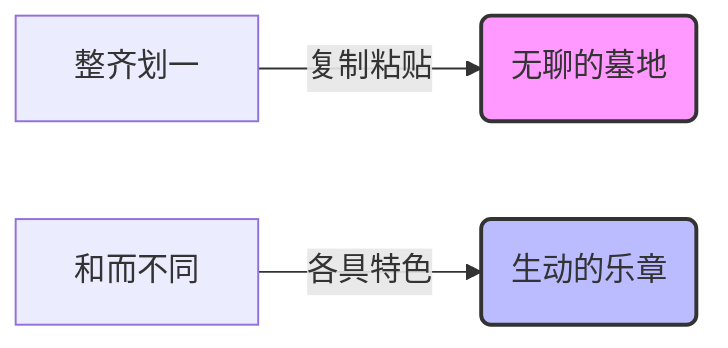
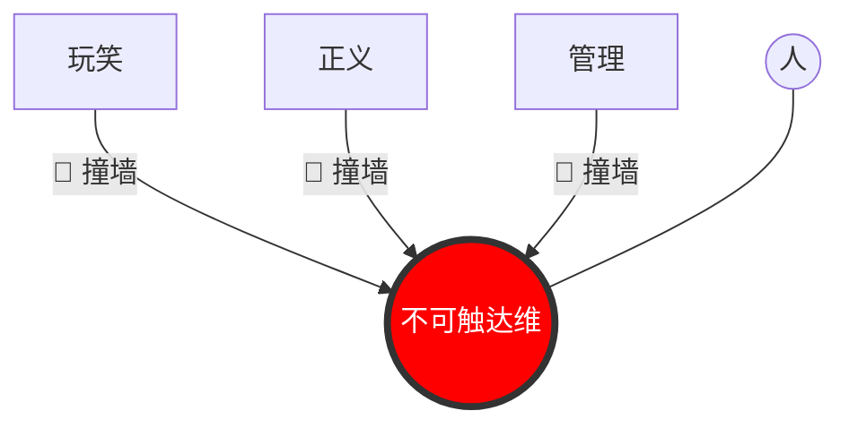
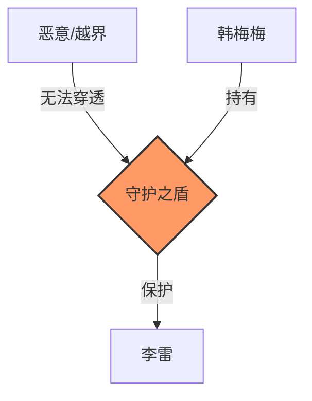

# **ASTO05 (Lite)：韩梅梅的边界保卫战 —— 为什么“不一样”才是好的？**

> **Version**: Lite.v1.1 (Story Mode: Han Meimei's Defense)
> **适合读者**：初中生、高中生、班干部、以及所有在集体中感到“被冒犯”或“想管人”的人。
> **核心任务**：通过“韩梅梅”的班长生涯，理解 **属集变迁存在主义 (ASTO)** 的伦理观：尊重与自由。

---

## **序章：想当“完美班长”的韩梅梅**

本故事改编自 **ASTO (Attribute-Set Transition Ontology)** 理论。它探讨的是：在这样一个变迁的世界里，我们该如何善待彼此。

韩梅梅当选了初二(3)班的班长。她雄心勃勃，想把3班变成全校最“整齐划一”的班级。
*   她希望大家穿一样的鞋子。
*   她希望大家早读声音一样大。
*   她希望大家对所有事的看法都一样。

直到有一天，她收到了 ASTO 手册的第五章《价值与边界》。手册封面写着一行字：
**“整齐不是美，那是墓地。活着的东西，都是乱糟糟的。”**

---

## **1. 为什么不能“统一思想”？（复数性测试）**

### **1.1 运动会服装风波**
校运动会开幕式，韩梅梅提议：全班男生穿西装，女生穿裙子，显得精神！
大家都同意了，只有喜欢滑板的女生李华反对：“我不穿裙子，我不舒服，我要穿滑板裤。”

> **🎮 互动时刻：如果你是韩梅梅，你会怎么做？**
> *   **A. 坚持统一**：“李华，集体荣誉最重要，大家都能穿，你为什么不能忍一忍？”
> *   **B. 允许例外**：“好吧，李华你可以穿滑板裤，其他人继续穿裙子。”
> *   **C. 重新设计**：“既然有人不舒服，那我们就换一个大家都能接受的方案。”

韩梅梅一开始想选 **A**，觉得李华“不合群”。
但 ASTO 手册弹出一个提示框：
> **🛑 复数性测试 (Plurality Test)**
> 你的决定（穿裙子），是否剥夺了李华作为“独特个体”的表达空间？
> 如果一个集体（班级）容不下一个李华，那这个集体就是**“有毒”**的。

### **1.2 韩梅梅的觉醒**
韩梅梅意识到：**世界之所以美好，是因为每个人都不一样。**
如果大家都一样，那不叫“团结”，那叫“复制粘贴”。

*   **ASTO 说**：**复数性（Plurality）是人类境况的本质。** 我们不是“人类”这个模具量产的零件，我们是每一个独一无二的“人”。
*   **行动**：韩梅梅选择了 **C**。她修改了方案——“大家穿黑白配色的衣服就行，款式自定。”

### **📝 侧写：李华的日记**
> “其实我不是故意捣乱。那条裙子太短了，让我觉得很不安全。而且，滑板裤才是我。如果为了集体就要假装自己是别人，那我宁愿不要这个集体。谢谢韩梅梅，最后让我做回了自己。”

> *（理论锚点：**复数性测试**是 ASTO 的核心伦理工具：任何消除个体差异、压制对话可能性的结构，在伦理上都是可疑的。）*

---

## **2. 为什么有些事“打死也不能做”？（不可触达维）**

### **2.1 日记门事件**
一天，班里最调皮的男生王强捡到了李雷的日记本，他在班级群里发了张照片：“哈哈，大家快看，李雷居然偷偷写情诗！笑死我了！”
群里瞬间炸了锅，有人发“哈哈哈哈”，有人起哄“念出来！念出来！”，李雷的头像灰着，一句话也没说。

韩梅梅看到了，她感到一种生理上的恶心。
她冲进教室，当着所有人的面，严肃地对王强说：**“删掉照片！马上！道歉！”**

王强一开始被吓了一跳，但看到周围有人围观，为了面子梗着脖子喊：
**“凭什么管我？你又不是老师！大家都在笑，就你事多！”**
旁边也有同学嘀咕：“就是开个玩笑嘛，班长太较真了吧。”

> **🎮 互动时刻：如果你在群里看到同学隐私被泄露，你会？**
> *   **A. 跟着笑**：随大流，不当“异类”。
> *   **B. 假装没看见**：多一事不如少一事。
> *   **C. 私下提醒**：悄悄告诉王强“这样不太好”。
> *   **D. 公开制止**：像韩梅梅一样，哪怕被孤立也要说“不”。

### **2.2 绝对的红线**
韩梅梅没有退缩，她没有继续用“班规”压人，而是深吸一口气，看着王强，也看着周围起哄的同学：
**“王强，如果今天被发在群里的是你手机里的秘密照片，你是觉得好笑，还是想找个地缝钻进去？我们将心比心。”**

教室里安静了。王强的脸红了。

韩梅梅翻开 ASTO 手册，指着一章念给所有人听：
> **🚫 不可触达维 (The Ungraspable Dimension)**
> 每个人的内心深处，都有一块**“绝对领地”**（比如日记、隐私、尊严）。
> 这块领地，神圣不可侵犯。
> 无论你是谁，无论为了什么理由（哪怕是为了“搞笑”或“正义”），**绝对不能强行闯入**。

*   **ASTO 说**：有些东西是**不可计算**的。李雷的尊严 > 全班的快乐。
*   **行动**：王强低下了头，默默拿出手机删了照片，走到李雷座位前，小声说了句：“对不起，我过分了。”

### **📝 侧写：王强的反思**
> “当时被班长怼，我觉得很没面子。但后来我想想，如果是我被挂在群里……我可能会想退学。韩梅梅虽然凶，但她是唯一一个把我从‘混蛋’的边缘拉回来的人。”

> *（理论锚点：**不可触达维**是 ASTO 的最高伦理禁令。它保护了人作为“人”而非“物”的底线。）*

---

## **3. 那些容易被忽视的“隐形边界”**

生活中不只有日记门，还有很多让我们“不舒服”的小事，其实都是边界问题。

### **3.1 网络边界：表情包战争**
*   **场景**：同桌趁你午睡流口水，偷拍照片做成表情包发朋友圈。
*   **ASTO 判定**：**越界**。肖像是你的私人领地。
*   **对策**：不要觉得“大家都这么玩”就忍着。直接说：“我不喜欢这样，请删掉。”

### **3.2 言语边界：“玻璃心”陷阱**
*   **场景**：有人嘲笑你的身材，你生气了，对方却说：“我就是开玩笑，你怎么这么玻璃心？”
*   **ASTO 判定**：**越界**。评价别人的身体属于侵入私人领域。
*   **对策**：对方用“开玩笑”来掩饰攻击。你可以回击：“你的玩笑一点都不好笑，只让我觉得冒犯。”

### **3.3 合作边界：小组里的“搭便车”**
*   **场景**：小组作业，有人全程不干活，最后还想署名。
*   **ASTO 判定**：**越界**。这是对他人劳动成果的侵占。
*   **对策**：明确分工边界。直接沟通：“这部分是你的责任，如果你不完成，我们在最终展示时无法加上你的名字。”

---

## **4. 什么是真正的“好”？（美与善）**

经历了这些，韩梅梅对“好班级”有了新的理解。

### **4.1 善 = 守护边界**
以前她以为“善”就是大家都听话。
现在她明白：**善，就是守护每个人的边界。**
*   不让李华被迫穿裙子。
*   不让李雷的日记被偷看。
*   当强者欺负弱者时，站出来说“不”。

### **4.2 美 = 和而不同**
以前她以为“美”是整齐。
现在她明白：**美，是像大合唱一样。**
有高音，有低音，有快，有慢。大家不一样，但能配合在一起，唱出一首复杂的歌。
*   **ASTO 说**：**结构之美，在于它能支撑多样性，而不是消除多样性。**

---

## **5. 韩梅梅的班长手册（行动工具箱）**

韩梅梅在笔记本上写下了三条新班规，并附上了具体的操作话术：

### **🔧 工具 1：尊重差异 (Respect Difference)**
*   **原则**：允许别人和你不一样。看到奇怪的爱好，不要嘲笑，要好奇。
*   **话术**：
    *   ❌ “你这个想法太怪了，肯定是错的。”
    *   ✅ **“你的角度很有意思，能多说说吗？”**

### **🔧 工具 2：严守边界 (Keep Boundaries)**
*   **原则**：别人的隐私（手机、日记、秘密），就像别人的家门，不邀请不能进。如果不小心越界，立刻道歉。
*   **话术**：
    *   ❌ “我就看了一眼，又没怎么样。”
    *   ✅ **“对不起，我不该看你的屏幕，这是我的错，下次注意。”**

### **🔧 工具 3：永远对话 (Always Dialogue)**
*   **原则**：遇到矛盾，不要用拳头，也不要用“我是班长”来压人，要用**语言**来解决。
*   **话术**：
    *   ❌ “你总是迟到，你就是没有集体观念！”
    *   ✅ **“我不开心（感受），因为我们等了你很久（事实），下次能提前五分钟吗？（请求）”**

---

## **6. 李雷的悄悄话**

李雷拿回日记本后，在最后一页偷偷写了一行字：
> “谢谢你，韩梅梅。
> 以前我觉得班长只是个管人的官。
> 但今天你挡在我前面的样子，像个**骑士**。”

---

## **🤔 最后的思考**

故事结束了，但你的生活还在继续。

1.  **关于沟通**：如果你的班级里有一个像初期韩梅梅那样“什么都想管”的班长，你会如何与他/她沟通，让他/她明白边界的重要性？
2.  **关于权力**：如果你自己是班长，你会如何平衡“班级秩序”和“个人自由”？你会为了“效率”而牺牲“公平”吗？

祝你在守护世界的旅途中，成为自己的骑士！

---

## **附录：ASTO 理论速查表**

本故事涉及的 **ASTO** 核心概念：

1.  **伦理工具**
    *   **复数性测试 (Plurality Test)**：检验集体是否压制了个体差异（反对复制粘贴）。
    *   **不可触达维 (Ungraspable Dimension)**：每个人内心深处不可侵犯的神圣领地（反对过度管理）。
2.  **价值定义**
    *   **善 (Goodness)**：守护边界，保护复数性。
    *   **美 (Beauty)**：复杂系统的和谐共存（和而不同）。
3.  **行动原则**
    *   尊重差异，严守边界，永远对话。
