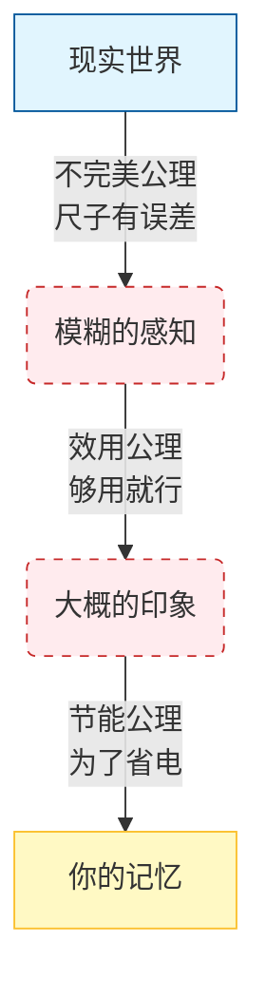
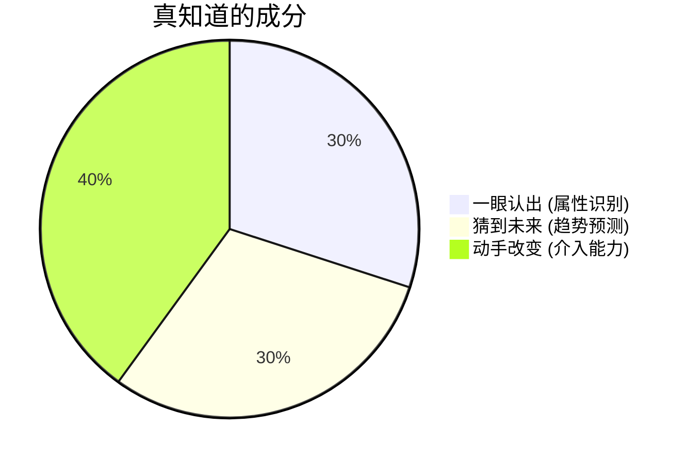
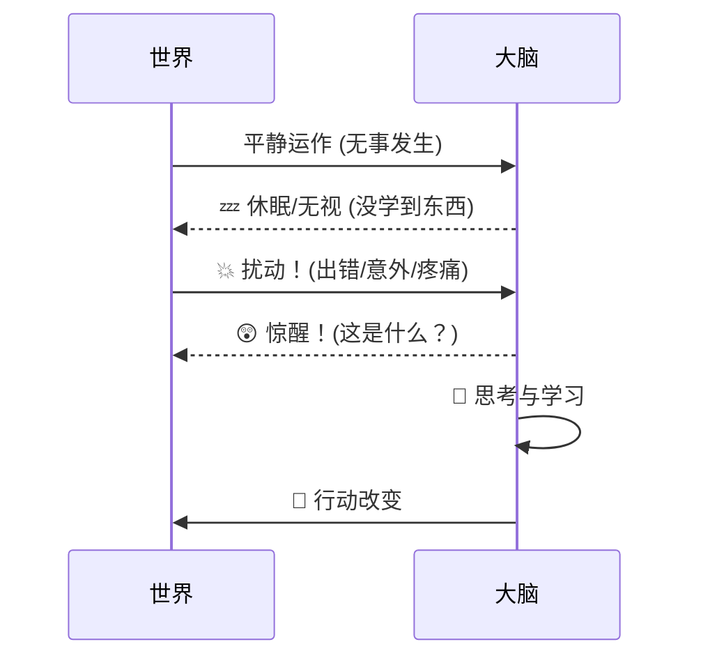

# **ASTO03 (Lite)：大脑的省电模式与认知冒险**

> **Version**: Lite.v1.1 (Story Mode: Han Meimei's Adventure)
> **适合读者**：初中生、非技术背景的普通读者、对“为什么我总犯错”感到好奇的人。
> **核心任务**：通过主角“韩梅梅”的冒险，揭示 **属集变迁存在主义 (ASTO)** 对人类认知的解释。

---

## **序章：韩梅梅的烦恼**

本故事改编自 **ASTO (Attribute-Set Transition Ontology)** 理论。它不教你如何“变聪明”，而是教你如何“正确地使用大脑这个有缺陷的工具”。

韩梅梅是个普通的初二学生。最近她很郁闷：
*   数学考试，明明会做，却看漏了一个负号，扣了5分。😫
*   想跟同桌借橡皮，结果同桌皱了下眉，韩梅梅以为他生气了，一天没敢理他。后来才知道，同桌只是牙疼。😔
*   背了很多单词，但一到写作文，脑子里还是只有 "good" 和 "bad"。😵

韩梅梅问老师：“我是不是太笨了？”
老师笑了笑，递给他一本叫《ASTO》的神秘手册：“不，你不是笨，你的大脑只是开启了**‘省电模式’**。”

---

## **1. 为什么我们会犯错？（大脑的三大出厂设置）**

韩梅梅翻开手册第一页，看到三个奇怪的“公理”。

### **1.1 不完美公理：所有尺子都有误差**
> **🧐 现象**：韩梅梅想画一条完美的直线，但即使拿着尺子，放大看也是歪歪扭扭的。

**ASTO 揭秘**：想象一下，你用一把刻度是毫米的尺子去量一根头发丝。能量准吗？肯定不行。
*   你的眼睛不是显微镜。
*   你的记忆不是录像机。

**🧠 大脑真相**：**大脑也是一种工具，它天生就有误差。** 别追求“完美记忆”，要追求“足够好用”。

### **1.2 效用公理：大脑喜欢“够用就行”**
> **🧐 现象**：做菜时，妈妈说“加少许盐”。韩梅梅问：“少许是多少克？”妈妈说：“哎呀你烦不烦，看着放就行！”

**ASTO 揭秘**：如果每次做饭都要用天平称盐，大家早就饿死了。**“凭感觉”虽然不精确，但能让你快速吃上饭。**

**🧠 大脑真相**：**只要信息“够用”，大脑就不会费力追求“绝对精确”**。

### **1.3 节能公理：大脑是个“懒家伙”**
> **🧐 现象**：韩梅梅看错数学题的负号，就是因为大脑扫了一眼觉得“大概是加号”，懒得再仔细看。

**ASTO 揭秘**：手机电量低时会进入“省电模式”。**你的大脑几乎永远在“省电模式”！** 它只占体重的 2%，却消耗了身体 20% 的能量。为了不让你饿死，它必须极其吝啬。

> **🏫 高中实战：为什么理综考试时间总不够？**
> 你有没有发现，做理综题时，遇到新颖的题目，大脑第一反应是“能不能套用以前的公式”？（比如看到小球撞击就想动量守恒）。
> 这就是**节能公理**在作祟：大脑倾向于调取“旧缓存”（熟悉的方法），而不愿耗能去构建“新模型”（分析题目特有的条件）。这会导致你在错误的路线上浪费时间，最后时间不够用。
> **对策**：遇到怪题，强制自己停顿3秒（打断节能模式），重新审题。

**🧠 大脑真相**：你犯错，往往是因为大脑为了省电，偷偷走了**“认知捷径”**（Shortcut）。这简直就是大脑在**“摆烂”**！

👉 **动手任务**：
找出一张你的旧试卷，圈出一个“粗心错”。问问自己：**当时我的大脑是为了省什么力气，才看错的？**

---

## **2. 什么是真正的“知道”？（真知三要素）**

韩梅梅背了勾股定理公式 $a^2+b^2=c^2$，她觉得她“知道”了。
结果考试出了一道应用题：*“梯子长5米，靠在墙上，底端离墙3米，求墙高。”*
韩梅梅懵了。

手册第二页写着：**“听说过”不等于“真知道”。**

### **2.1 属性识别：一眼看出“它是谁”**
就像你在操场上，一眼就能认出好朋友，不需要分析他的发型和鞋子。
*   **真知道**：看到“梯子靠墙”，脑子里瞬间跳出直角三角形的图像。
*   **📖 语文课应用**：做阅读理解时，你能迅速从一大段话里抓取“转折词”（如“但是”、“然而”）。这不仅是找词，更是**识别**作者情感态度的转变点。

### **2.2 趋势预测：猜到“接下来会怎样”**
看到满天乌云，你知道快下雨了。
*   **真知道**：看到这道题是求“高度”，预判结果肯定小于梯子的长度（斜边最长）。如果算出6米，肯定错了。
*   **📐 物理课应用**：做力学题时，在列方程之前，先在脑海里像放电影一样推演一遍小球的运动轨迹（加速->减速->反弹）。这就是**趋势预测**，也叫“过程分析”。

### **2.3 介入能力：动手改变结局**
知道要下雨，光站着没用，得带伞。
*   **真知道**：拿起笔，画出三角形，列出方程，算出答案。

**公式：真知道 = 一眼认出 + 猜到未来 + 动手改变**

👉 **动手任务**：
选一门你觉得最难的课（比如物理），找一个概念（比如“压强”）。试着问自己：我能一眼认出它吗？我能预测它的变化吗？我能用它解决问题吗？

---

## **3. 什么是“扰动”？（痛是窗口）**

韩梅梅很讨厌做错题，每次看到红叉❌就心烦。
手册第三页写着：**不要讨厌错误，那是世界的尖叫。**

*   **例子**：你的胃平时很乖，你感觉不到它。只有当它**痛**（扰动）的时候，你才突然意识到：“哎呀，我有胃！”
*   **例子**：电脑平时很好用，只有当它**死机**（扰动）的时候，你才开始学习怎么修电脑。

**结论**：**如果不痛不痒，人很难学到新东西。**
**扰动 (Perturbation)** 不是“意外/疼痛”的别名：它更基础地指**你和世界之间发生了相互作用**，让某些东西开始变化。
当这种相互作用跨过你的“感觉阈值”，你才会体验为**痛、出错、尴尬、破防**——它们是你能看见扰动的一扇窗，所以也常常是学习的开始。

👉 **动手任务**：
感谢一个最近让你“头疼”的麻烦（比如一次争吵或一次失败）。写下：**这个麻烦教会了我什么以前不知道的事？**

---

## **4. 大脑术语小词典**

| 术语 | 听起来像... | 其实是... | 高中生黑话 |
| :--- | :--- | :--- | :--- |
| **不完美公理** | 物理定律 | “所有尺子都有误差，大脑也不例外” | **“我也想完美，但这不科学”** |
| **效用公理** | 经济学概念 | “大脑喜欢‘够用就行’，不喜欢‘完美’” | **“差不多得了”** |
| **节能公理** | 环保口号 | “大脑是个‘省电狂魔’，能偷懒绝不费力” | **“大脑正在摆烂”** |
| **认知捷径** | 抄近道 | “大脑为了快，走的‘思维近路’” | **“我也没想，手自己就写了”** |
| **扰动** | 捣乱 | “你和世界发生相互作用；当它强到你能感觉到，就是学习窗口” | **“裂开了 / 破防了”** |
| **知行合一** | 成语 | “真知道就是能做到，做不到就是没真懂” | **“脑子会了，手没会”** |

---

## **5. 给你的行动建议**

既然大脑天生爱偷懒、爱犯错，我们该怎么办？

1.  **别太自责**：犯错是出厂设置，改过来就好。
2.  **建立“检查站”**：既然知道大脑不靠谱，做完作业就**必须检查**（这就是“容错机制”）。
3.  **主动“找麻烦”**：别只做简单的题。去做那些让你**头疼**（感到扰动）的难题，那样你的大脑才会真正升级。

## **6. 综合实战：用 ASTO 攻略筹备校园音乐节**

假设你是学校音乐社的成员，这次由你主要负责筹备校园音乐节。我们看看如何用 ASTO 的思维来搞定它。

### **第一步：用“乐高理论”拆解任务**
别把“音乐节”看成一个庞然大物，它只是由一堆“属性积木”拼起来的：
*   **积木清单**：场地、时间、节目单、音响设备、宣传海报、预算、工作人员……

> **启示**：你不需要一次性解决所有问题，而是像拼乐高一样，一块一块来。先确定最重要的几块积木（比如时间和场地），再拼其他的。

### **第二步：用“五态”规划进度**
1.  **暗恋期（自在态）**：你心里有个模糊的想法——“想办个酷炫的音乐节”。但只有你自己知道。
2.  **暧昧期（共识态）**：你跟社团成员聊天，大家纷纷表示“可以啊”，但具体怎么办还没共识。
    *   *关键行动*：召开一次头脑风暴会议，把模糊的想法变成大家共同的愿景。
3.  **表白期（编码态）**：把讨论结果写成明确的计划书，包括时间、地点、分工、预算。
    *   *关键行动*：制作一张详细的计划表，发到群里，让每个人确认。
4.  **领证期（物化态）**：计划通过，学校批准，你们开始租设备、贴海报、排练节目。
    *   *关键行动*：按计划执行，每一步都留下记录（比如订金收据、海报照片）。
5.  **家规期（定向态）**：音乐节过程中可能出现意外（比如突然下雨），你们事先约定好“如果下雨，就移到体育馆”。
    *   *关键行动*：制定应急预案，并指定一个临时决策人。

### **第三步：用“六阶”应对起伏**
*   **混沌**：刚开始，大家七嘴八舌，想法杂乱。别慌，这是正常的“混沌阶”。
*   **秩序**：计划制定后，大家各司其职，进入“秩序阶”。好好享受这段平稳期。
*   **流变**：临近音乐节，突然发现有乐队要退出（压力信号）。这是“流变阶”。
*   **脉冲**：音响设备在演出前一天坏了！这是“脉冲阶”，必须紧急决策。
*   **崩解**：如果没处理好，音乐节可能取消（崩解）。但即使崩解，也不是世界末日。
*   **归元**：无论成败，结束后复盘，总结经验，为下一次活动做准备。

### **第四步：用“行动七步法”解决具体危机**
以“音响设备坏了”为例：
1.  **觉醒**：意识到“音响坏了，我们必须马上处理”。
2.  **感知**：检查设备，确定是彻底损坏还是可以维修。
3.  **解析**：发现维修需要一天，但明天就要演出。
4.  **干预**：想出几个方案：租借、更换节目顺序、改用备用设备。
5.  **设计**：选择租借，并设计租借流程（谁去租、多少钱、怎么运输）。
6.  **物化**：**立即打电话联系租赁公司，并派人去取。**
7.  **回溯**：危机解决后，反思为什么设备会坏，以后如何避免。

### **最后：别忘了底线**
*   在筹备过程中，尊重每一个参与者的意见（**不伤害尊严**）。
*   即使时间紧迫，也不要为了省钱而使用劣质设备（**安全红线**）。

---

祝你的大脑升级愉快！

---

## **附录：ASTO 理论速查表**

本故事涉及的 **ASTO** 核心概念：

1.  **认知公理**
    *   **不完美公理**：感知必有误差（尺子不准）。
    *   **效用公理**：大脑只在乎“够用”（大概印象）。
    *   **节能公理**：大脑默认“偷懒”（走捷径）。
2.  **真知三要素**
    *   **属性识别**：一眼认出（Recognition）。
    *   **趋势预测**：预知未来（Prediction）。
    *   **介入能力**：动手改变（Intervention）。
3.  **动力机制**
    *   **扰动 (Perturbation)**：你和世界发生相互作用；当它跨过“感觉阈值”，你就会在痛/报错/挫折里看见它——这就是学习窗口。
    *   **知行合一**：能够“介入”才是真知道。
