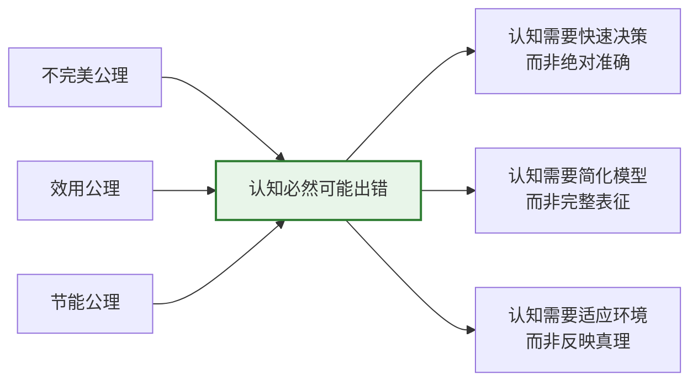
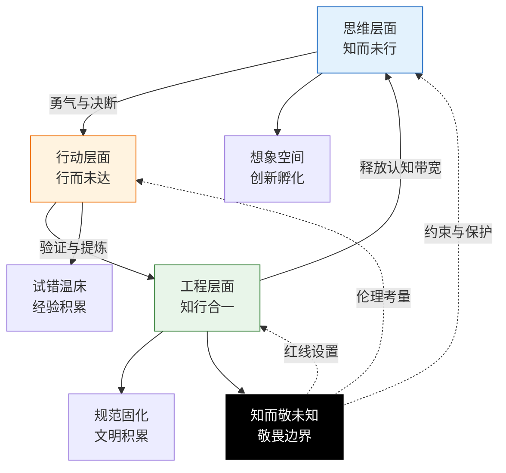

# **ASTO03. 认识论：认知错误的必然性与证据化认知**

> **💌 致生活中的你（非工程师读者）**：
> 如果你觉得后面的术语（如“存在公理、熵增、场域”）太难懂，请直接跳到 **1.5.1 节** 查看“生活隐喻对照表”。
> 这篇文章其实只说了一件事：**我们为什么总会犯错？为什么“懂了很多道理却依然过不好这一生”？以及我们该怎么办？**
> ASTO 试图告诉你：犯错不是因为你笨，而是因为你的大脑为了省电；做不到不是因为你懒，而是因为“知道”和“做到”之间缺了一个“扰动”的开关。

> **Version**: Gamma.1 (Epistemology)
> **Status**: Living Document
> **第一扰动者**: Fuyi (ODDFounder fuyi.it@live.cn)
> **Context**: 本文档从原ASTO03宣言中拆分，专注于探讨属集变迁存在论(ASTO)体系下的认知论问题：1. 为什么认知必然出错？2. 什么是"知道"？3. 如何实现知行合一的三个层次（思维、行动、工程）？**认识论服务于 ASTO 的终极目的：在 AGI 到来之前守护人类家园，并在更长尺度上构建更好的文明。**

---

## **1. 认知错误的必然性：存在公理在认知领域的直接体现**

在进入ASTO的认知世界之前，我们必须正视一个根本事实：**对有限主体而言，认知出错是不可避免的；在 ASTO 的叙述中，这与其所主张的存在论约束相关。**

但必须立刻补上一句实践澄清：**“不可避免”不等于“可以放任”。** 认知错误的频发并非不可改变的常态，而是提醒我们不断优化与校准认知系统的重要信号。

这是ASTO与传统认识论的根本分歧点：
- **传统认识论（其中一类取向）**：更强调以真理/证成/可靠性为理想，因此倾向把错误视为需要解释与控制的问题
- **ASTO认识论**：认为认知必然"会出错"，错误是结构性副产物，是系统在效用与节能约束下运作的必然结果——因此实践重点从"消灭错误"转向"识别、校验、管理错误"

这种认知错误的必然性，在 ASTO 的建模前提下，可用 ASTO04 公理体系中的三个工作性原则来解释：

### **1.1 不完美公理 → 认知先天缺陷**
> **"任何存在都有缺陷，缺陷即存在的方式。"**

* **认知领域的映射**：人的认知作为一种"存在"，同样先天不完美
* **根本启示**：认知难以达到完美、无偏差的"真理"——这在**存在论层面不可被保证**；但这并不否定认知优化的意义：我们依然可以通过持续校准，提高认知的准确性与适应性，追求"更好"而非"完美"
* **积极意义**：认知的"缺陷"不是简单需要消除的"异常"，而是**认知得以存在的形态**（Defect as Condition）。正如康德所言，我们无法摘下有色眼镜看世界，但这副眼镜也是我们看见世界的条件；但在高风险与高代价场景，缺陷必须被识别并通过结构性机制被抑制
* **工程隐喻**：任何测量工具都有精度极限，试图制造"完美测量"违反了不完美公理

### **1.2 效用公理 → 认知不必完美**
> **"存在不必完美，只需有效。效用为正则存，为负则亡。"**

* **认知领域的映射**：在资源受限的条件下，认知往往会偏向效用最大化（可行动性/可适应性），而不总是以真理最大化为唯一目标
* **根本启示**：当"足够有效"比"绝对正确"能耗更低时，认知系统会自动选择前者
* **关键洞察**：很多认知"错误"实际上是**效用权衡的结果**——快速但不精确的认知可能在生存中更有效
* **工程隐喻**：启发式算法（heuristics）通过牺牲精确性换取速度和可操作性，这正是效用公理的体现

> **哲学澄清：效用如何定义？**
> 批评者可能会问：如果"效用"由认知系统自己判断，这是否是循环论证？ASTO 的回应：
> 1. **操作化定义**：在 ASTO 中，"效用"不是抽象概念，而是可操作的指标——**在特定场域中，认知是否能支持主体完成目标行动**。效用的判断标准来自**场域的反馈**（行动成功/失败、资源消耗、时间成本），而非认知系统的自我评价。
> 2. **多层次效用**：短期效用（即时行动成功）与长期效用（持续适应能力）可能冲突，ASTO 承认这种张力，并将其视为认知演化的动力。
> 3. **与真理的关系**：效用与真理不是简单对立。在许多场域中，更接近真理的认知确实更有效——但 ASTO 强调，这种关联是**经验性的**而非**必然的**。
>
> **重要分层说明 (Context Note)**：效用公理描述的是生物/物理演化层的**实然 (Is)** 机制（重力）；而人类追求的道德、真理与意义，是构建在重力之上的**应然 (Ought)** 建筑（属于 `ASTO05` 价值论的 NEN 范畴）。我们承认效用的基础性，但不否认道德的超越性。

### **1.3 节能公理 → 认知必然简化**
> **"存在倾向于以最小能耗维持自身。简洁是生存优势。"**

* **认知领域的映射**：认知会自然选择**认知捷径、启发式、简化模型**
* **根本启示**：这些简化必然带来偏差和错误，但这是系统为了节能必须付出的代价——代价可以被管理。**简化不是为了无知，而是为了在有限算力下应对无限复杂性。模型即压缩 (Model is Compression)。**
* **关键结论**：在大多数日常情境中，追求"完全准确"会带来不可承受的能耗与时延；但在复杂或高风险决策环境中，适当投入更高的精确性依然具有重要价值。关键在于在有效性与精确性之间找到可持续的平衡
* **工程隐喻**：缓存机制（caching）通过存储近似值来加速响应，这正是节能公理的体现

### **1.4 三个公理的共同作用：认知错误的必然性**

这三个公理共同作用，产生了一个深刻的结论：

> **在ASTO框架中，人的认知"有可能出错"不是一个能被彻底消除的问题，而是系统在效用与节能约束下运作时的结构性特征。出错的可能性内嵌在认知结构之中——这正是我们必须设计校验、纠错与容错机制的原因。**

**从描述到规范的区分**：
- **描述性陈述**：认知错误是系统为了速度与能耗做出的结构性权衡的副产品
- **规范性立场**：这不意味着我们应该放任错误，而是应该设计更好的容错机制

> **哲学澄清**：当我们说"认知错误往往不是bug，而是feature"时，这是一个**描述性陈述**，描述认知系统的实际运作方式，而非**规范性主张**（即"错误是好的"）。科学进步、医学诊断的准确性追求依然至关重要——ASTO 强调的是：在追求准确性的同时，我们需要理解错误的结构性根源，从而设计更有效的纠错机制，而非简单地责备"不够努力"或"不够聪明"。



### **1.5 传统认知论与ASTO认知论的根本差异**

| 维度 | 传统认识论 | ASTO认知论 |
|------|------------|-------------|
| **认知目标** | 追求真理符合（反映世界本相） | 追求适应性（在环境中有效运作） |
| **错误性质** | 异常、缺陷、需要消除 | 常态、特征、系统设计的必然结果 |
| **认知标准** | 准确性、完整性、一致性 | 有效性、效率、适应性 |
| **演化逻辑** | 渐进逼近真理 | 适应性选择有效模式 |

---

### **1.5.1 工程隐喻 vs 生活隐喻对照表**

> **说明**：本表为非工程师读者提供生活化类比，帮助理解ASTO03的核心概念。工程隐喻面向技术读者，生活隐喻面向日常生活——两者是启发性类比，不等同。

| ASTO 概念 | 工程隐喻（面向技术读者） | 生活隐喻（面向普通读者） |
|:---|:---|:---|
| **不完美公理** | 任何测量工具都有精度极限；试图制造"完美测量"违反存在论约束 | 家里的体温计偶尔会偏差0.1℃、体重秤会受地面不平影响——这不代表它们"坏了"，而是工具本身的约束；我们需要的是"大概正常"vs"明显异常"，而非"绝对精确" |
| **效用公理** | 启发式算法牺牲精确性换取速度；缓存用近似值加速响应 | 做饭时加"少许盐"而不精确称量；买菜时看评分而不读所有评论——追求"完美精确"会让我们永远做不成饭、买不成菜 |
| **节能公理** | 系统用缓存、索引、压缩降低存储和计算成本 | 记手机号时记"大概这个号"而非精确数字；认路时记"在那栋楼旁边"而非每棵树的位置——大脑用"模糊但够用"版本保存信息，为了省电且快速 |
| **认知捷径** | 用 `if-else` 规则和 `default` 分支简化复杂判断 | 凭事凭"第一直觉"快速判断；对陌生人用"大概印象"决定是否深入交流——大脑省电模式，不深入思考每个细节 |
| **属性识别** | 工程师一眼看出"坏味道"代码；架构师预测系统瓶颈 | 认出老朋友的脸在人群中；老师看出学生"今天不对劲"；父母感觉孩子"在撒谎"——整体模式识别而非逐项分析 |
| **趋势预测** | 系统负载预测、架构扩展规划 | 感觉到"这个项目要黄了"；预判"这段关系快到尽头"；预计"月底前会忙翻天——基于模式的外推而非精确计算 |
| **介入能力** | 重构代码、优化查询、调整架构 | 修改自己的习惯；调解朋友间的矛盾；给孩子换学校——通过行动改变现状的能力 |
| **容错机制** | `try-catch`、备份、回滚、降级策略 | 给自己留"试错空间"（如允许自己有时会犯错）；旅行时备选方案；和朋友吵架后有台阶可下——为不可避免的错误设计缓冲 |
| **错误意义** | 失败的标志 | 探索的痕迹、创新的可能 |

### **1.5.1 工程隐喻 vs 生活隐喻对照表**

> **说明**：本表为非工程师读者提供生活化类比，帮助理解ASTO03的核心概念。工程隐喻面向技术读者，生活隐喻面向日常生活——两者是启发性类比，不等同。

| ASTO 概念 | 工程隐喻（面向技术读者） | 生活隐喻（面向普通读者） |
|:---|:---|:---|
| **不完美公理** | 任何测量工具都有精度极限；试图制造"完美测量"违反存在论约束 | 家里的体温计偶尔会偏差0.1℃、体重秤会受地面不平影响——这不代表它们"坏了"，而是**所有的尺子都有自己的极限**；我们需要的是"大概正常"vs"明显异常"，而非"绝对精确" |
| **效用公理** | 启发式算法牺牲精确性换取速度；缓存用近似值加速响应 | 做饭时加"少许盐"而不精确称量；买菜时看评分而不读所有评论——追求"完美精确"会让我们永远做不成饭、买不成菜 |
| **节能公理** | 系统用缓存、索引、压缩降低存储和计算成本 | 记手机号时记"大概这个号"而非精确数字；认路时记"在那栋楼旁边"而非每棵树的位置——**大脑为了省力气**，只记个大概 |
| **认知捷径** | 用 `if-else` 规则和 `default` 分支简化复杂判断 | 凭事凭"第一直觉"快速判断；对陌生人用"大概印象"决定是否深入交流——大脑的"省电模式"，不愿费脑子想细节 |
| **属性识别** | 工程师一眼看出"坏味道"代码；架构师预测系统瓶颈 | 认出老朋友的脸在人群中；老师看出学生"今天不对劲"；父母感觉孩子"在撒谎"——**不用分析，一眼就感觉到了** |
| **趋势预测** | 系统负载预测、架构扩展规划 | 感觉到"这个项目要黄了"；预判"这段关系快到尽头"；预计"月底前会忙翻天"——**凭经验猜大概**，虽然不准但很有用 |
| **介入能力** | 重构代码、优化查询、调整架构 | 修改自己的习惯；调解朋友间的矛盾；给孩子换学校——通过行动改变现状的能力 |
| **容错机制** | `try-catch`、备份、回滚、降级策略 | 给自己留"试错空间"（如允许自己有时会犯错）；旅行时备选方案；和朋友吵架后有台阶可下——为不可避免的错误设计缓冲 |

### **1.6 深度推论：为什么认知缺陷是创造力的来源？**

ASTO 提出一个反直觉的命题：**我们不仅应该容忍缺陷，还应该感谢缺陷。**

#### **1.6.1 完美即死寂 (Perfection is Stasis)**
**经验观察**：在人类认知系统中，如果认知能完美地镜射现实（1:1 的地图），那么思维就可能被现实锁死。
*   **没有偏差**，就难以产生"如果"；
*   **没有盲区**，就难以激发"想象"；
*   **没有误读**，就难以生成"隐喻"。

> **哲学澄清**：这是一个**经验性观察**，而非逻辑必然的形而上学主张。我们不是在说"完美认知在逻辑上不可能具有创造性"，而是在说：**在人类认知的实际运作中**，缺陷与创造性经验上呈现出关联。这种关联的深层机制仍有待进一步研究。

完美认知的系统可能成为一个**只读存储器 (ROM)**，它只能回放现实，难以创造新现实——但这是一个需要持续检验的假说，而非教条。

#### **1.6.2 偏差即变异 (Error as Mutation)**
在演化论中，基因复制的"错误"（突变）是进化的唯一动力。
同样，认知的"错误"（联想、移情、幻觉）是**意义进化的动力**。
*   **艺术**：源于对现实的"错误"感知（夸张、变形）。
*   **发明**：源于对现状的"不满"和对未来的"虚构"认知。
*   **共情**：源于以自我模型对他者痛苦进行近似模拟（有时会产生系统性偏差）。

#### **1.6.3 填补即创造 (Filling as Creation)**
因为我们的认知是不连续的、有空缺的（不完美公理），大脑被迫去**填补**这些空缺。
这种"无中生有"的填补过程，就是**创造**的本质。
我们因为看不清世界，所以被迫**创造**了一个世界来解释它。

> **结论**：认知缺陷不是上帝的疏忽，而是在经验上常被体验为：它为主体的选择与创造留出了实践空间。它是光照进来的地方。

#### **1.6.4 批判与边界：并非所有缺陷都是礼物**

我们不能将"缺陷"浪漫化。必须区分两种缺陷：

1.  **生产性缺陷 (Productive Defect)**：
    *   **机制**：在信息不足时，大脑主动填补空白（如视觉盲点填补、隐喻联想）。
    *   **后果**：产生新的意义、模型或艺术。
    *   **ASTO态度**：**保护**。这是创造力的源泉。

2.  **毁灭性缺陷 (Destructive Defect)**：
    *   **机制**：在信息充足时，大脑仍拒绝修正模型（如确认偏误、逻辑谬误、刻板印象）。
    *   **后果**：导致非理性决策、系统僵化或灾难（如卡尼曼指出的系统性偏差）。
    *   **ASTO态度**：**对抗**。这是需要通过工程结构（如 checklist、双人核对）来抑制的"系统故障"。

**公理修正**：
创造力源于**对"生产性缺陷"的利用**和**对"毁灭性缺陷"的结构性抑制**。
如果只拥抱缺陷而不加校验，那不是创造，那是**疯癫**。

### **1.7 专题：人为什么固执？——结构的自我保护本能**

我们常指责他人"固执"，但在 ASTO 看来，**固执不是性格缺陷，而是结构的物理属性。**

#### **1.7.1 意志的堡垒 (Will as Fortress)**
**叔本华**的思想旨趣提示我们：观点不是挂在墙上的衣服，而是长在肉里的皮肤。
*   你的观点是你的**生存意志**的延伸。
*   当他人攻击你的观点时，你感到的不是逻辑错误，而是**本体论层面的疼痛**。
*   **固执**，是意志在保护自身不被外部力量撕裂。

#### **1.7.2 范式的沉没成本 (Sunk Cost of Paradigm)**
**库恩**在《科学革命的结构》中揭示：
*   放弃旧范式，意味着承认过去的投入（时间、声誉、信仰）全部归零。
*   面对反常证据，系统默认反应是**修补旧范式**（增加特设性假设），而不是**推翻它**。
*   **固执**，是系统为了避免"破产"而进行的最后抵抗。

#### **1.7.3 节能与防御 (Energy Conservation)**
从 **ASTO 公理** 来看：
*   **节能公理**：重构认知模型需要消耗巨大的能量（逆熵过程）。大脑作为高能耗器官，本能地拒绝重构。
*   **固执** = **认知懒惰的最高形式**。它用"拒绝输入"来节省"处理成本"。

> **结论**：固执是系统维持**结构性稳态**的必然机制。
> 如果人不够固执，他的自我就会在环境的微小扰动中随时崩解。
> **只有当"维持旧结构的痛苦" > "重构的能耗"时（跃迁阈值），改变才会发生。**

### **1.8 接受错误必然性的三个实践意义**

1. **解放认知负担**：不必追求"完美认知"，而是追求"足够有效的认知"
2. **重视错误价值**：错误不是纯粹的损失，而是系统探索边界的方式
3. **设计容错系统**：认知系统必须预设错误的发生，并设计相应的容错机制

---

## **2. 认知重构：ASTO中的"知道"是什么？**

理解了认知错误的必然性后，我们才能重新审视一个更根本的问题：**在ASTO框架中，"知道"究竟是什么？**

### **2.1 传统认知论的挑战与ASTO的认知重构**

**在工程实践语境下，传统认识论的某些核心假设面临挑战**：

* **表象主义的局限**：认为我们能直接"看到"世界本相 → 但在工程实践中，所有感知都是属性筛选的结果
* **表征主义的局限**：认为大脑能准确"表征"外部现实 → 但在复杂系统中，所有表征都是属性压缩的产物
* **基础主义的局限**：认为知识有不可动摇的根基 → 但在动态环境中，所有根基都是特定场域的暂时稳态

> **哲学澄清**：ASTO 并非宣称传统认识论"破产"或"失效"——表象主义、表征主义、基础主义在当代哲学中各有复杂的辩护版本。ASTO 的立场是：在**工程实践**的特定语境下，这些传统假设需要被修正或补充，以更好地指导实际的认知-行动循环。

**ASTO的认知重构**：从"符合论真理"转向"操作性真理"

> **核心命题**：在ASTO框架中，"知道"在工程语境下取操作性定义：它不主要指拥有关于世界的静态表征，而更强调**掌握属集在特定场域中的识别-响应模式**。

**公式（操作性表述）**：$$ \text{知道} = \text{属性识别} + \text{趋势预测} + \text{介入能力} $$

### **2.2 "知道"的三层解析**

1. **属性识别层面**：能区分关键属性与噪声属性
   * **示例**：经验丰富的工程师能一眼看出代码中的关键问题，而新手只能看到表面语法错误

2. **趋势预测层面**：能预判属性结构的变化方向
   * **示例**：架构师能预测系统在负载增加时的瓶颈位置，提前设计扩展方案

3. **介入能力层面**：能通过行动影响属性重组
   * **示例**：开发者不仅能识别bug，还能通过重构修复根本结构问题

### **2.3 ASTO中"知道"的五个根本特性**

| 特性 | 传统认知论 | ASTO认知论 |
|------|------------|-------------|
| **本体状态** | 静态拥有 | 动态能力 |
| **有效性标准** | 符合客观实在 | 在特定场域有效 |
| **产生机制** | 个体思维过程 | 属集-环境交互 |
| **存在形式** | 心理表征 | 可执行规范 |
| **演进方式** | 渐进积累 | 跃迁重构 |

### **2.4 "知道"在1-5-6-7-1循环中的位置**

**关键洞察**：知道不是循环的起点，而是循环的**中间产物**。它永远**滞后于存在，超前于实践**。

```
一元（存在） 
  ↓ 
五态（形态展开：自在→共识→编码） 
  ↓ 
六阶（动力过程：混沌→秩序→流变） 
  ↓ 
**"知道"在此刻诞生：属性结构被识别并编码** 
  ↓ 
七序（介入循环：基于"知道"进行干预） 
  ↓ 
验证与修正（回到新的一元）
```

知道捕捉的是刚刚过去的存在状态，用于指导即将到来的实践行动。这种**时滞性**正是认知错误的另一个根源：我们总是用过去的模式预测未来的变化。

### **2.5 知道的多重形态：从混沌识别到定向规范**

在ASTO中，"知道"不是单一状态，而是沿着五态演进的多重形态：

#### **2.5.1 自在态知道：模糊识别**
* **形态**：属性结构尚未明确区分
* **表达**："感觉上是这样"
* **可靠性**：低，容易受干扰
* **工程映射**：对代码"坏味道"的直觉感受
* **辩证张力视角**：潜在张力的模糊感知

#### **2.5.2 共识态知道：共享识别**
* **形态**：属性结构在群体中被口头约定
* **表达**："大家都这么说"
* **可靠性**：中等，依赖社会共识
* **工程映射**：团队的编码规范（口头约定）
* **辩证张力视角**：张力显化为群体共识

#### **2.5.3 编码态知道：形式化识别**
* **形态**：属性结构被明确编码为规则
* **表达**："规则写明是这样"
* **可靠性**：高，但可能僵化
* **工程映射**：ESLint配置中的具体规则
* **辩证张力视角**：张力被形式化为对立统一规则

#### **2.5.4 物化态知道：可执行识别**
* **形态**：识别模式被固化为可执行工具
* **表达**："工具自动检查/执行"
* **可靠性**：很高，但可能有盲区
* **工程映射**：CI/CD流水线中的自动化检查
* **辩证张力视角**：张力被物化为可执行的检查点

#### **2.5.5 定向态知道：自我修正识别**
* **形态**：识别系统包含自我修正机制
* **表达**："系统知道何时调整规则"
* **可靠性**：自适应，但复杂
* **工程映射**：能根据项目阶段自动调整代码规范的智能系统
* **矛盾论视角**：矛盾的运动被系统性地捕捉和响应

### **2.6 从知道到知识：一个关键的区分**

**知道 (Knowing)**：个体或系统在当下时刻的识别能力（动态过程）
**知识 (Knowledge)**：被固化、可传递的知道模式（静态产物）

在ASTO中：
* **知道是活的过程**，总是在特定情境中展开
* **知识是相对稳定的沉淀**，是知道过程的阶段性产物，它的价值在于**标准化、传递与规模化复用**
* 所有知识都源于知道；但知识若失去更新机制、被当作永恒真理，或被脱离场域地套用，就可能**异化**为知道的障碍

> **警示**：不要将知识误认为知道。知识是地图，知道是实地行走的能力。当地图过时，知道的能力可以创造新地图——而健康的组织会让"制图"与"行走"持续互相校准。

### **2.7 专题：知识的层级与流动 (Wet, Dry, & Living)**

在 ASTO 中，知识不是静态的库存，而是**不同含水量的属集**。

#### **2.7.1 批判 DIKW 金字塔**
传统信息科学认为认知是一个线性升级的金字塔模型：
*   **Data (数据)**：原始的事实（如 "100"）。
*   **Information (信息)**：有上下文的数据（如 "时速100公里"）。
*   **Knowledge (知识)**：可行动的规则（如 "这里限速80，超速了"）。
*   **Wisdom (智慧)**：元层面的判断（如 "虽然超速，但为了救人是合理的"）。

ASTO 认为这太线性。知识在不同**相态**之间循环流转，而非单向堆叠。智慧不是塔尖，而是整个循环的润滑剂。

#### **2.7.2 ASTO 三态知识模型**

1.  **湿知识 (Wet Knowledge) —— 含水量 80-100%**
    *   **定义**：存在于大脑、身体和人际关系中的知识。
    *   **特征**：高语境、高带宽、难以复制、伴随情感。
    *   **ASTO 映射**：**自在态、共识态**。
    *   **例**：团队默契、调试代码的直觉、领导力。

2.  **干知识 (Dry Knowledge) —— 含水量 0-20%**
    *   **定义**：脱水后被固化在介质中的知识。
    *   **特征**：低语境、可复制、易于传输、丢失细节。
    *   **ASTO 映射**：**编码态、物化态**。
    *   **例**：API 文档、源代码、操作手册、数学公式。

3.  **活知识 (Living Knowledge) —— 正在复水**
    *   **定义**：干知识被主体读取，并投入到新场景的行动中。
    *   **特征**：干知识 + 当前情境 + 主体动变性。
    *   **ASTO 映射**：**七序中的应用**。
    *   **关键**：只有"复水"后的知识才产生价值。

#### **2.7.3 野中郁次郎 SECI 模型的 ASTO 诠释**
*   **社会化 (Socialization)**：湿 → 湿（师徒带教，无需文档）。
*   **外化 (Externalization)**：湿 → 干（写文档，最痛苦的脱水过程）。
*   **组合 (Combination)**：干 → 干（整理归档，AI 擅长）。
*   **内化 (Internalization)**：干 → 湿（读书学习，复水过程）。

> **工程启示**：
> 不要试图把所有"湿知识"都烤干（过度文档化）。湿知识是创新的温床，干知识是规模化的基础。
> **健康的组织需要保持适当的"湿度"。** 全是文档的组织是沙漠，全是口头传授的组织是沼泽。

### **2.8 认知重构的实践意义**

1. **从追求正确到追求有效**：评估认知的标准从"是否准确"转向"是否在特定情境中有效"
2. **从消除错误到管理错误**：错误不再是需要根除的敌人，而是需要管理和利用的系统特征
3. **从个体认知到系统认知**：认知能力不再局限于个体大脑，而可以分布、固化在工具、流程和系统中
4. **从静态知识到动态能力**：教育的重点从传授知识转向培养认知能力（属性识别、趋势预测、介入能力）

### **2.9 认知的暗面：被工程视角遗漏的维度**

ASTO 强调显式化的"结构认知"，但我们必须承认认知的另一半是**隐形**的。

#### **2.8.1 默会致知 (Tacit Knowing)**
**波兰尼**提醒：**我们知道的比我们要说的多。**
*   **特征**：骑车、游泳、外科手术的手感。
*   **ASTO 修正**：工程层不应试图"强行编码"所有默会知识，而应提供**"学徒制"的场域**，让默会知识在行动中传递；这并非排斥工具化与自动化，而是要求用合适的工具与培训机制去**支持**默会知识的学习与复现（如示范、演练、Pairing、训练场）。

#### **2.8.2 具身认知 (Embodied Cognition)**
**梅洛-庞蒂**提醒：**身体不是工具，是认知的零点。**
*   **特征**：你觉得"杯子在那边"，是因为你的手臂"能构到它"。
*   **ASTO 修正**：认知系统的设计必须符合**主体的身体图式**。反人性的交互设计（UI）之所以失败，是因为它违背了具身认知的物理直觉。

#### **2.8.3 社会脚手架 (Social Scaffolding)**
**维果茨基**提醒：**认知是个体在社会脚手架上的攀爬。**
*   **特征**：你之所以能思考"量子力学"，是因为语言和社会文化已经为你搭建了梯子。
*   **ASTO 修正**：认知的提升不只靠"个人努力"，更靠"环境供给"。**构建更好的文档、工具和社区，就是提升群体的认知智商。**

### **2.10 动力学补完：扰动作为认知的引擎**

在静态描述了"知道"的形态后，我们必须补上动力学的一环：**认知是如何发生的？**

ASTO 引入**扰动认识论 (Perturbation Epistemology)**：

#### **2.10.1 认知的唤醒：海德格尔式"打断"**
*   **什么是扰动？**：简单说，扰动就是**打破平静的意外**——无论是电脑死机、身体疼痛，还是人生变故。
*   **顺滑即无知**：当系统完美运作时（上手状态），我们并不"认知"它，我们只是"使用"它。就像你平时感觉不到胃的存在，只有胃痛时（扰动），"胃"这个概念才鲜活起来。
*   **扰动即显现**：只有当系统崩溃、报错、异常（扰动发生）时，对象才从背景中凸显出来，成为认知的客体。
*   **结论**：**扰动是认知的唤醒剂。** 不要讨厌 Bug 或生活中的小意外，那是世界为了被你认知而发出的尖叫。

#### **2.10.2 知行之间的桥梁：从"感扰"到"施扰"**
知行合一不是两个静态板块的拼接，而是**扰动方向的翻转**：
1.  **知（Knowing）** = **被动感知扰动**（接收差异信息，如看到红灯，或感到饥饿）。
2.  **行（Doing）** = **主动施加扰动**（向场域注入能量，如踩下刹车，或去觅食）。
3.  **合一（Unity）** = **扰动回路的闭合**。主体从环境的"受扰者"变为环境的"扰动者"，并在回馈中修正自身。

> **核心推论**：若你的认知不能转化为对场域的有效扰动（改变代码、改变流程、改变共识、改变生活状态），那么这种认知在 ASTO 意义上是**无效**的——它只是热寂中的思维空转。

---

## **3. 知行合一：ASTO 的认识论支柱**

### **3.0 核心框架：知行合一的三层阶梯**

在 ASTO 中，知行合一不是瞬间的状态，而是一个**跃迁的过程**。它包含三个显式的结构层级：

1.  **思维层面 (Thinking Layer)**：知而未行。这是可能性的空间。
2.  **行动层面 (Acting Layer)**：行而未达。这是试错与验证的空间。
3.  **工程层面 (Engineering Layer)**：知行合一。这是规范与自动化的空间。

绝大多数认知问题，都是因为**错位**：试图用思维解决工程问题，或者用工程逻辑限制思维想象。

在理解了认知错误的必然性和ASTO中"知道"的本质之后，我们现在可以进入ASTO认识论的核心：**知行合一**。

### **3.1 思维层面：知而未行，想象空间**

**核心特征**：认知停留在思维内部，未转化为外部行动。

#### **3.1.1 表现形式**
- **个人层面**：有想法但未实践，有计划但未执行
- **团队层面**：有讨论但无结论，有共识但无行动
- **组织层面**：有战略但无战术，有愿景但无路径

#### **3.1.2 价值与局限**
- **正面价值**：思维层面是**创新孵化的温床**，允许无成本的想象和探索
- **负面风险**：容易陷入**空想循环**，消耗认知资源而无实际产出
- **工程隐喻**：代码设计稿（只存在于文档中，未实现为实际系统）

#### **3.1.3 ASTO视角**
- **不是缺陷**：思维层面的"知而不行"是**创造性的必要阶段**
- **辩证看待**：需要鼓励思维层面的自由探索，但也要防止过度沉溺
- **跃迁条件**：当思维层面的认知产生足够的创新潜力时，应推动向行动层面跃迁

### **3.2 行动层面：行而未达，试错温床**

**核心特征**：认知转化为行动，但行动效果不确定或未达到预期目标。

#### **3.2.1 表现形式**
- **个人层面**：尝试新方法但效果不佳，学习新技能但尚未掌握
- **团队层面**：实施新流程但遇到阻力，采用新技术但未完全发挥效能
- **组织层面**：推行改革但效果有限，进入新市场但未站稳脚跟

#### **3.2.2 价值与局限**
- **正面价值**：行动层面是**经验积累的实验室**，通过试错发现有效路径
- **负面风险**：可能产生**沉没成本**，反复尝试而无实质性进展
- **工程隐喻**：原型系统（功能有限，性能不稳定，但提供了实际验证）

#### **3.2.3 ASTO视角**
- **试错价值**：行动层面的"行而未达"是**知识生产的必要过程**
- **辩证看待**：需要容忍行动层面的失败，但也要建立有效的反馈机制
- **跃迁条件**：当行动层面的经验积累到一定程度时，应推动向工程层面跃迁

### **3.3 工程层面：知行合一，规范固化**

**核心特征**：认知与行动完全融合，形成可重复、可验证、可传承的规范体系。

#### **3.3.1 表现形式**
- **个人层面**：技能内化为本能反应，形成个人工作方法论
- **团队层面**：最佳实践固化为团队流程，建立质量标准体系
- **组织层面**：成功经验编码为组织能力，形成核心竞争优势

#### **3.3.2 价值与局限**
- **正面价值**：工程层面是**文明积累的容器**，实现知识的跨代际传递
- **负面风险**：可能产生**路径依赖**，固化的规范阻碍新的创新
- **工程隐喻**：生产系统（稳定、可靠、可扩展，支持大规模应用）

#### **3.3.3 ASTO视角**
- **固化与超越**：工程层面的"知行合一"既是**认知的完成形态**，也是**新一轮认知的起点**
- **辩证看待**：需要建立工程层面的规范体系，但也要保留突破规范的通道
- **循环机制**：工程层面的规范为思维层面的创新提供基础，思维层面的创新为工程层面的更新提供动力

### **3.4 第四境界：知而敬未知——不可触达层的智慧**

**核心特征**：认识到认知的边界，主动保留不可触达领域，保持对未知的敬畏。

#### **3.4.1 表现形式**
```
┌─────────────────────────────────────────────┐
│        【认知的四重境界：从控制到敬畏】         │
├─────────────────────────────────────────────┤
│                                                │
│  境界一：知而可行（工程层）                    │
│      · 将已知固化为规范                        │
│      · 追求确定性与效率                        │
│                                                │
│  境界二：知而慎行（伦理层）                    │
│      · 考虑行动的长期后果                      │
│      · 引入风险评估与减缓机制                  │
│                                                │
│  境界三：知而止行（边界层）                    │
│      · 识别"不应为"的领域                      │
│      · 即使技术上可行，也主动放弃              │
│                                                │
│  境界四：知而敬未知（不可触达层）              │
│      · 承认在当前文明与责任条件下，有些领域应暂不触及  │
│        （或需满足严格的可审计责任链/可逆性保障） │
│      · 保持对不可知事物的敬畏                  │
│      · 为不可压缩的价值冲突、人的尊严与不可完全形式化的判断保留空间 │
└─────────────────────────────────────────────┘
```

#### **3.4.2 工程映射**
- **上帝模式注释**：在代码中标记"此处永远需要人类理解"
- **伦理熔断机制**：在AI系统中设置不可绕过的伦理审查
- **技术自我限制**：主动放弃某些技术应用（如基因编辑的生殖应用）

### **3.5 三层递进的动态关系**



### **3.6 知行合一在ASTO理论体系中的核心地位**

**知行合一是ASTO理论体系的枢纽**，它：

1. **连接存在与认知**：将存在论公理（特别是认知错误的三个根源）与认知论实践连接起来
2. **指导实践跃迁**：提供从思维到行动再到工程的清晰路径
3. **平衡缺陷与创造**：既承认认知缺陷的必然性，又提供超越缺陷的方法
4. **实现理论闭环**：使ASTO理论本身成为可执行、可验证、可修正的认知-实践系统

### **3.7 知行合一的实践指导**

#### **3.7.1 对于个人**
- **思维层面**：培养好奇心，允许自己"胡思乱想"
- **行动层面**：勇于尝试，容忍自己的"不完美行动"
- **工程层面**：将成功经验固化为个人方法论，建立个人知识体系
- **敬畏层面**：明确自己绝不愿被触碰的底线，守护精神自主权

#### **3.7.2 对于团队**
- **思维层面**：建立开放讨论的文化，鼓励创新想法
- **行动层面**：建立快速试错机制，从失败中学习
- **工程层面**：将团队最佳实践固化为流程和工具
- **敬畏层面**：建立团队伦理准则，保护成员尊严与隐私

#### **3.7.3 对于组织**
- **思维层面**：投资研发和探索性项目
- **行动层面**：建立创新孵化机制，支持内部创业
- **工程层面**：将组织能力编码为可复制的业务模式
- **敬畏层面**：设立独立伦理委员会，明确技术应用红线

### **3.8 开放性探讨：理论的未竟之地 (Open Interfaces)**

ASTO 认识论不是封闭的教条，而是开放的探索。我们在此留下三个**理论接口**，邀请实践者继续探索：

#### **接口A：缺陷谱系的动态性**
*   **问题**："生产性缺陷"与"毁灭性缺陷"的界限是否绝对？（如"确认偏误"在创业初期可能是信心的来源，在成熟期则是灾难）。
*   **待探索**：建立动态的"缺陷评估模型"，根据场域阶段判定偏差的属性。

#### **接口B：工程僵化与反脆弱**
*   **问题**：工程层面的规范固化（路径依赖）如何避免扼杀未来的可能性？
*   **待探索**：引入"反脆弱"机制，设计能够从混乱中获益的演化架构（参见 [ASTO16.韧性](./ASTO16.韧性.Hum.P.v8.0.md)）。

#### **接口C：敬畏的工程化落地**
*   **问题**："知而敬未知"如何不沦为虚无的神秘主义？如何在代码中具体实现对伦理的敬畏？
*   **待探索**：发展"负责任创新"的工程标准（如伦理熔断器、上帝模式注释的具体规范）。

---

## **4. 结语：在缺陷中前行**

ASTO 认识论不教你如何成为全知全能的神，而是教你如何做一个清醒的人。
承认认知的缺陷，不是为了躺平，而是为了更诚实地去设计结构。
理解知行合一的三个层次，不仅是为了从理论到实践的有效转化，更是为创新和探索提供明确的路径。

请记住：
*   **思维**提供方向。
*   **行动**提供验证。
*   **工程**提供积累。
*   **敬畏**提供边界。

在这一循环中，我们得以在不确定的世界中，构建确定的存在。

*(正文完)*

---

## **附录 A：思想血统 (Ideological Lineage)**

ASTO 的认识论不是凭空构建的，它站在东西方巨人的肩膀上：

### **A.1 东方高峰：继承与发扬**
*   **王阳明 (知行本体)**：
    *   **"知是行之始，行是知之成。"**
    *   ASTO 继承点：**真知即行动**。如果你"知道"了但没做，那在 ASTO 看来你并未真正"知道"，你只是"听说过"。
*   **毛泽东 (实践循环)**：
    *   **"实践、认识、再实践、再认识，这种形式，循环往复以至无穷。"**
    *   ASTO 继承点：**七序循环**。ASTO 将"实践论"的宏观哲学，精细化为微观的工程步骤。

### **A.2 东方智慧的结构同构**
> **说明**：以下为结构类比与教学隐喻，用于帮助工程读者建立直觉；不主张概念等同，更不主张历史源流的单向归因。
*   **佛家 (缘起性空) ←→ OOP**："诸法无我" = 对象无自性（只是属性聚合）。
*   **易经 (变易) ←→ Git**："生生之谓易" = 世界是流动的 Commit 链。
*   **道家 (无为) ←→ DevOps**："道法自然" = 顺应阻力最小路径（合规性传递）。

### **A.3 西方哲学的结构基石**
*   **赫拉克利特**：万物皆流（变迁本体论）。
*   **康德**：人为自然立法（规范决定认知）。
*   **海德格尔**：上手状态（工具定义存在）。
*   **维特根斯坦**：意义即使用（语用学真理）。

---

## **附录 B：参考文献与推荐阅读**

本文档的理论构建受益于以下思想家的开创性工作：

### **认识论与科学哲学**
*   **伊曼努尔·康德 (Immanuel Kant)**：《纯粹理性批判》 (Critique of Pure Reason)
    *   *贡献：先验范畴、现象与物自体的区分。*
*   **卡尔·波普尔 (Karl Popper)**：《猜想与反驳》 (Conjectures and Refutations)
    *   *贡献：证伪主义、科学知识的进化性质。*
*   **托马斯·库恩 (Thomas Kuhn)**：《科学革命的结构》 (The Structure of Scientific Revolutions)
    *   *贡献：范式转换、常规科学与不可通约性。*
*   **路德维希·维特根斯坦 (Ludwig Wittgenstein)**：《哲学研究》 (Philosophical Investigations)
    *   *贡献：语言游戏、意义即使用。*

### **隐性知识与具身认知**
*   **迈克尔·波兰尼 (Michael Polanyi)**：《个人知识》 (Personal Knowledge)
    *   *贡献：默会致知 (Tacit Knowing)、"我们要知道的比我们能说出的多"。*
*   **莫里斯·梅洛-庞蒂 (Maurice Merleau-Ponty)**：《知觉现象学》 (Phenomenology of Perception)
    *   *贡献：具身认知、身体图式、知觉的首要地位。*
*   **野中郁次郎 (Ikujiro Nonaka)**：《创造知识的企业》 (The Knowledge-Creating Company)
    *   *贡献：SECI模型、知识创造的螺旋。*

### **心理学与社会建构**
*   **列夫·维果茨基 (Lev Vygotsky)**：《思维与语言》 (Thought and Language)
    *   *贡献：社会文化历史理论、最近发展区 (ZPD)。*
*   **丹尼尔·卡尼曼 (Daniel Kahneman)**：《思考，快与慢》 (Thinking, Fast and Slow)
    *   *贡献：系统1与系统2、认知偏差与前景理论。*
*   **西格蒙德·弗洛伊德 (Sigmund Freud)**：《自我与本我》 (The Ego and the Id)
    *   *贡献：防御机制、潜意识对认知的干扰。*

### **意志与存在**
*   **亚瑟·叔本华 (Arthur Schopenhauer)**：《作为意志和表象的世界》 (The World as Will and Representation)
    *   *贡献：意志作为世界的本质、认知的工具属性。*
