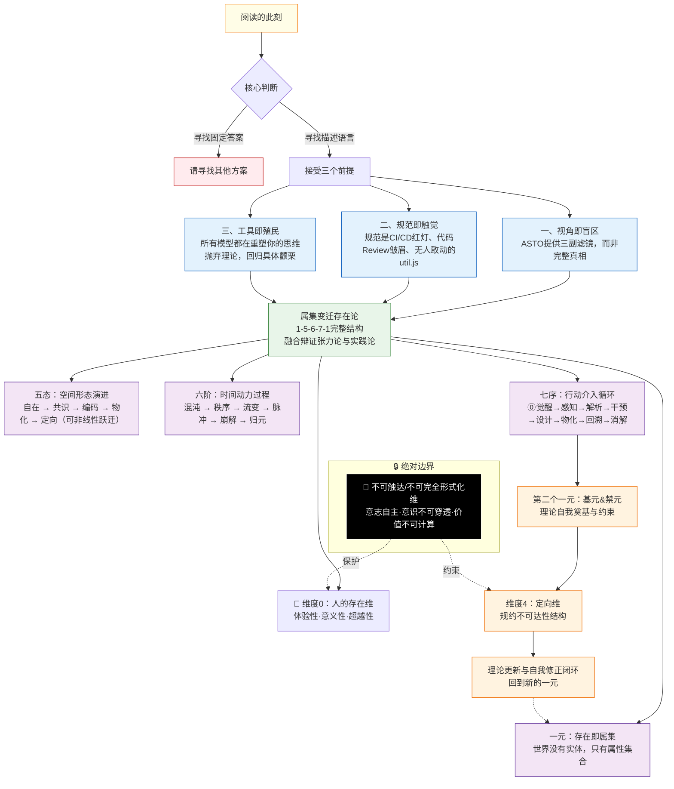

# **ASTO04. 宣言：结构性处境与行动纲领**

> **Version**: Γ.16 (Civilization Telos Clarified)
> **Status**: Living Document
> **第一扰动者**: Fuyi (ODDFounder fuyi.it@live.cn)
> **Context**: 本文档是 ASTO 体系的核心宣言。ASTO 被创建的终极目的，是在 AGI 到来之前守护人类家园，并在更长尺度上构建更好的文明；为照顾不同背景的读者，我们在每一节开头设置了**双轨导航 (Dual-Track Guide)**。

---

## **🗺️ 双轨阅读指南 (How to Read)**

我们拒绝将世界拆分为“文科”和“理科”，但我们尊重读者的关注点。请选择你的身份：

*   🦉 **思想者 (Thinker)**：寻找意义、伦理与社会隐喻。关注 🏛️ 标记。
*   🛠️ **实践者 (Maker)**：寻找工具、代码与操作指南。关注 ⚙️ 标记。
*   🌉 **跨界者 (Bridger)**：不仅想修桥，还想理解两岸的风景。请通读。

---

<a id="asto-civilization-meta-definition"></a>
## **0. 文明元定义与终极目的：在 AGI 到来之前守护家园**
> **适用**：全员 (All) | **优先级**：禁元/复数性/不可触达维 > 动变性 > 效率

ASTO 被创建的目的，不是为了让工程更优雅，而是为了让文明更安全、更自由、更有生命力。
在 AGI 到来之前，我们尤其需要两件事：
1. 守住不可逆的红线（禁元/不可触达维/复数性）——不让“效率”成为压迫的借口。
2. 用可逆、可审计、可退出的结构提升动变性——让文明在冲击中不崩溃，且能进化。

我们把“更好文明”定义为一组有优先级的判准（C）：
1. **底线（不可交易）**：复数性守护（不可替代性、对话可能性、行动空间）与不可触达维守护（尊严、良知、私密体验等）。
2. **目标（可度量/可争辩）**：在底线之内最大化动变性与可能性空间（多样性、可演化性、分叉与回馈）。
3. **手段（可替换）**：效率与自动化只能服务于前两者——任何以效率为名削弱拒绝权、退出权与可逆性者，视为文明退化信号。

> 注：进化不等于进步；适应度不等于正当性。ASTO 的“选择函数”必须接受伦理审计，而非只接受胜负与产出。

---

## **1. 破题：一分钟见效的\"结构视力\"**
> 🎯 **适用**：全员 (All) | **关键词**：结构视力、介质错配


### **【一分钟案例】为什么装修总是跟你想的不一样？**

> **场景**：你跟装修师傅说"我想要简约风格、温馨一点"，师傅说"明白了"，结果装完你一看——"这不是我想要的！"
> **通常诊断**：师傅不上心、沟通有问题、审美差异。
> **ASTO诊断**：这不是人的问题，是**介质错配（Medium Mismatch）**。

在 **属集变迁存在论 (ASTO)** 视眼中，你看到的不只是"你的想法"和"装修结果"，而是**五态的断裂**：
1.  **自在态 (In-itself)**：你脑海中那种"说不清但感觉对"的氛围（模糊的）。
2.  **共识态 (Consensus)**："简约、温馨"这些词（每个人理解不同）。
3.  **物化态 (Materialized)**：墙上刷的漆、买回来的沙发（已成定局）。
4.  **缺失的桥梁**：你试图用几个形容词直接指挥施工，就像用"大概那个感觉"去指挥厨师做菜，**信息丢失是必然的**。

**ASTO 解决方案**：
不强求"说清楚"，而是在中间插入**"编码态" (Encoded)** —— 例如效果图、材料样板、参考案例图片。
*   *旧路径*：脑海想法 → 口头描述 → 直接施工（断裂）
*   *新路径*：脑海想法 → **效果图/样板间（可确认）** → 施工（平滑过渡）

> **这就是 ASTO 的承诺**：它不会教你装修，但它会给你一副**"结构视力"**。拥有这副视力，你看到的不再是"不靠谱的师傅"，而是**"缺失的翻译环节"**。

### **1.1 导航图：ASTO 理论全景**



### **1.2 进入前的三重警告**

在你决定使用 ASTO 之前，请先接受以下三个关于"理论局限性"的警告：

#### **警告一：视角是单向镜**
人文、哲学、工程之眼同时提供**盲区滤镜**，不存在完整真相。
*   当你用 ASTO 看世界时，你会看到"属集、场域、扰动"；
*   但你可能因此**看不到**那些无法被结构化的东西：一次心跳加速、一个无法言说的直觉、一段不可解释的执念；
*   **对策**：定期摘下 ASTO 眼镜，用肉眼重新感受。

#### **警告二：规范是触觉**
规范不是文档条款，而是 CI/CD 红灯、代码 Review 皱眉、遗留系统中无人敢动的 `util.js`。
*   规范是**身体化的知识**，它存在于你的手指、你的习惯、你的恐惧中；
*   但规范也是**可反思的集体智慧**——它可以通过理性讨论、实践验证和社会共识来调整与优化；
*   不要试图用"写下来"取代"做出来"，但也不要让隐性规范逃脱理性审视；
*   **对策**：理论只有在实践中被检验，才获得意义。保持规范的**动态适应性**，在尊重既有规范的基础上持续反思。

#### **警告三：工具会殖民**
所有模型都简化世界并重塑思维。ASTO 也不例外。
*   模型与工具是对复杂世界的**简化与抽象**，它们帮助我们理解和处理复杂问题；
*   当你开始用"混沌阶、秩序阶"描述一切时，你可能已经被 ASTO **殖民**了；
*   语言塑造现实。新词汇带来新视角，也带来新盲区；
*   **工具的价值在于引导我们走向更深的理解与创新，而非简化与限制**；
*   **对策**：保持对模型局限性的清醒认知。当 ASTO 与你的直觉冲突时，先**暂停套用 ASTO**，回到具体情境中重新感受并收集可反驳的证据；同时也要警惕直觉本身可能被既有话语与权力结构塑形。没有绝对裁判，只有持续反思与可检验的修正。

> **方法论声明（避免范畴错误与隐喻审计）**：ASTO 大量使用工程与物理的隐喻（如\"熵、相变、殖民、骨架、命运\"等）来帮助形成直觉。这些表述默认是**启发性类比**与**工作性语言**，而非实质论证。
>
> **隐喻失效边界声明**：所有隐喻均有其有效边界。当隐喻（如\"技术债\"）开始驱动逻辑推导并得出违反常识或伦理的结论（如\"为了还债必须裁员\"）时，即视为**隐喻失效**，应立即停止类比，回归事实与价值审议。

### **1.4 发布前安全声明 (Safety Declaration)**
> **为了防止本理论被误用或教条化，我们在此发布三项安全原则：**
> 1.  **方法论定位**：ASTO 是一套工程方法论语言，而非终极真理。
> 2.  **反压制原则**：禁止将 ASTO 术语用于给人贴标签、压制个体经验或替代当事人的自我叙述。
> 3.  **伦理审查**：任何触及禁元或不可触达维的实践，都必须满足参与性、可辩护性与可逆性门槛。

### **1.3 ASTO 理论体系定位**

```
ASTO理论体系
├── **ASTO06：公理体系**（存在的根本法则）
│   ├── 15条公理 + 19条定理
│   └── 提供最底层的逻辑基础
├── **ASTO04：宣言与框架**（本文件）
│   ├── 1-5-6-7-1核心结构
│   ├── 五维体系：人+4+1维度论
│   ├── 动力学基础（扰动场域论）
│   └── 连接公理与实践的桥梁
├── **ASTO03：认识论**（认知为何出错）
│   ├── 认知错误的必然性
│   ├── "知道"的重新定义
│   └── 知行合一的三层阶梯
├── **ASTO05：价值与边界**（伦理宪章）
│   ├── 复数性测试
│   ├── 不可触达维
│   └── 美、善、自由的结构定义
└── **ASTO07–18：应用与扩展**
    ├── 重构、边界、批判、自动化……
    └── 展现理论在各领域的解释力

**ASTO04的核心功能**：
1. **整合框架**：将公理体系组织为可理解、可操作的认知结构
2. **维度奠基**：明确人的本体论地位与各维度的功能
3. **动力学阐明**：揭示扰动与场域作为系统演化的根本动力
4. **行动宣言**：阐明ASTO的世界观、价值观和行动纲领
```

---

## **2. 介质学与双轨制：ASTO 的历史定位**
> 🏛️ **思想者**：深度阅读 §2.2 介质学，理解文明演化的载体。
> ⚙️ **实践者**：了解工具箱的定位即可，不必深究社会摩擦系数。

### **2.1 双轨制声明**

ASTO 由两部分组成：
1.  **工具箱**（Utility）：五态、六阶、七序。判准优先是**"是否管用/是否可操作验证"**。我们承认工具选择本身也蕴含价值预设，因此并非完全免于反思，只是反思的优先级与方式不同。
    > **注**：工具箱以有效性为主要判准，但在触及人的不可触达维或禁元时，**必须接受伦理审查**；并且重大的工具选择需要提供可辩护性说明。
2.  **伦理宣言**（Ethics）：前存在论条件、人性边界。判准是**"是否可辩护"**。必须接受严格的哲学审查。

我们拒绝"万能理论"。在工程问题上，我们是实用主义者；在人的问题上，我们是人本主义者。

> **澄清**：**人本主义**强调人类的价值和尊严，但并非否定社会的集体性与长远利益。作为工程师与实践者，我们在尊重个体需求的同时，也考虑集体的可持续发展与系统性健康。人本主义不是无条件优先个人利益，而是在社会系统中守护人的根本价值。
>
> **张力处理原则**：当个体利益与集体利益发生冲突时，ASTO 不提供预设的优先级公式，而是提供**判断框架**：
> 1. **复数性测试**：该决策是否破坏了任何一方的不可替代性、对话可能性或行动空间？
> 2. **可逆性检验**：该决策的后果是否可逆？不可逆的伤害需要更高的正当性门槛。
> 3. **程序正义**：决策过程是否允许受影响者参与？
> 
> 这是一个**实践中需要具体判断的张力**，而非已被理论解决的问题。ASTO 承认这一张力的持续存在，并将其视为健康社会的标志而非需要消除的缺陷。

### **2.2 介质学：符号载体的代际变迁**

人类文明的跃迁，本质上是**交流介质**的革命。

> 注：下表"社会摩擦系数"为**示意性启发指标**，用于表达介质转换的相对损耗趋势，并非可直接对标的统计量。

| 代际 | 介质 | 特性 | ASTO 映射 | 社会摩擦系数 |
| :--- | :--- | :--- | :--- | :--- |
| **第一代** | **口头语言** | 瞬时、易变 | 自在态 | **极高** (极高损耗) |
| **第二代** | **文字/符号** | 持久、需阐释 | 共识态 | **高** (解释权之争) |
| **第三代** | **形式化代码** | 精确、可执行 | 物化态 | **中** (语义丢失) |
| **第四代** | **属性集 (Attribute-Sets)** | **结构化、可迁移、自演化** | **定向态** | **低** (结构自解释；理想化上限) |

**ASTO 的愿景**：我们正处于第三代向第四代跃迁的时刻。代码往往难以承载系统的演化元信息（"为什么要这样写"），我们可能需要一种新的介质（此处提出**属性集**作为候选设想）来更好地编码变迁本身；其可行性仍需在具体工程中检验。

---

## **3. 本体论核心：三大陈述**
> 🏛️ **思想者**：这是哲学的核心。关注“存在即属集”对实体论的颠覆。
> ⚙️ **实践者**：关注“工程隐喻”，把属集理解为 Object 或 Docker 镜像。

### **3.1 陈述一：存在即属集 (Existence is Attribute-Set)**
**公理负二：空集生成公理 (Axiom -2: Void Generation)**：承认存在一个纯粹的生成性基底 $\emptyset$（既非实体也非属性，而是纯粹的虚位）。所有属集都是 $\emptyset$ 的差异化显现。属性间的关联不是实体，而是基于 $\emptyset$ 的**高阶属性算子**。

**核心命题（方法论表述）**：在 ASTO 的描述框架中，我们将存在建模为"属性集合"，而不是预设"实体"作为第一性。这是一种方法论选择，用于提高解释与介入的可操作性，而非对终极实在的断言。

*   **哲学深意**：这是对"实体主义"的根本颠覆。没有"杯子"这个实体，只有"硬的+圆的+能盛水"的属性集合。
*   **辩证张力视角**：存在的本质是属性聚合与离散的**张力统一体**。
*   **实践论视角**：属集是**实践的产物和对象**。
*   **工程隐喻**：对象 (Object)、Docker 镜像、数据库记录。
*   **生活隐喻**：**乐高积木**。世界上并没有"城堡"这个不可拆解的实体，只有一堆积木（属性）按照图纸聚合而成的"城堡形态"。拆散了，属性（积木块）还在，但"城堡"没了。

> **哲学澄清：属性如何自持？**
> 我们承认这是经典的"束论困境"(Bundle Theory Problem)。ASTO 的回应是：
> 1. **关系本体论**：属性不是孤立存在的，而是通过**关系网络**相互支撑。属性A的存在条件是它与属性B、C的关联——这是一种"相互奠基"而非"实体承载"。
> 2. **过程优先**：借鉴怀特海，属性集合不是静态的"东西"，而是持续发生的**过程模式**。"杯子"是一个稳定的属性关联模式在时间中的持续。
> 3. **工程立场声明**：在严格的形而上学意义上，ASTO 不主张已解决"属性自持"问题。我们采取**方法论唯名论**：属集是描述世界的有效工具，而非对终极实在的断言。这是一个**工程框架**，不是本体论教条。

### **3.2 陈述二：结构即骨架 (Structure is Skeleton)**
**核心命题**：结构维持属集，支撑与约束并存。

*   **哲学深意**：结构具有支撑与束缚的双重性。没有结构，属性会四散；有了结构，演化受限制。
*   **辩证张力视角**：结构是**张力暂时平衡的稳定形态**，但其稳定性并非永恒。
*   **实践论视角**：结构是**实践的历史沉淀**，承载了多种社会力量的平衡。
*   **动态性强调**：结构是**动态调整的载体**，它必须与变化的需求和矛盾调和，随着新的实践需求和社会环境的变化而演化和重塑。
*   **工程隐喻**：架构设计、协议规范、制度框架——它们都需要版本迭代。
*   **生活隐喻**：**交通规则**。红绿灯确实"束缚"了你想怎么开就怎么开的自由，但如果没有它，路口就会瘫痪，你连家都回不去。结构限制了局部自由，支撑了整体生存。

### **3.3 陈述三：变迁即命运 (Transition is Fate)**
**核心命题**：变迁是矛盾不可调和的必然结果，但介入方式由主体选择。

*   **哲学深意（启发性类比）**：变迁往往不是"单凭意志即可避免"的选择，而是系统张力积累到阈值后的结构性结果——此处为类比语言，并非主张社会系统严格服从物理定律；但**如何回应变迁**仍属于主体的选择与责任领域。
*   **辩证张力视角**：变迁是**张力不可调和时的必然爆发**，是在特定条件下由内外张力引发的必然过程。
*   **实践论视角**：变迁是**实践对理论的突破和超越**。
*   **能动性强调**：虽然变迁受矛盾激化的驱动，但个体与集体依然具有**通过选择干预**来影响变迁路径的能动性。变迁是命运，但介入是自由。
*   **跃迁指标（启发性）**：$\text{变迁压力} = \frac{V_e \text{ (环境变化速率)}}{V_n \text{ (规范适应速率)}}$。当该指标持续 > 1，系统进入高概率跃迁区间；但是否跃迁及其形态仍取决于场域与介入方式——主体可以选择**顺应、引导或缓冲**。

---

## **4. 人本主义基石：维度0 (人的存在维)**
> 🏛️ **思想者**：必读。这是 ASTO 区别于机械唯物主义的关键。
> ⚙️ **实践者**：了解为什么“人”不能被完全自动化。

### **4.1 人的三重存在性**

1.  **体验性存在 (Experiential Being)**
    *   **Qualia**："看到红色"的主观感受，在当前理论与工程条件下难以被充分形式化/还原（仍有争议）。
    *   **时间性**：向死而生的有限性意识。
    *   **具身性**：身体不是工具，是存在的方式。
    *   **生活隐喻：感光底片**。只有底片（身体）感光了，世界才有了颜色。算法能处理图片的RGB值，但算法本身"看"不到颜色，就像底片本身不知道什么是"美"。

2.  **意义性存在 (Meaning-Making Being)**
    *   **解释学循环**：人不仅感知世界，更赋予其意义。
    *   **价值判断**：善恶、美丑的直觉，不能被简化为效用函数。
    *   **叙事性自我**："我是谁"不是数据，是叙事。
    *   **生活隐喻：小说家**。同样是下雨（数据），对农夫是喜悦，对路人是麻烦。人不是在被动处理数据，而是在主动编织关于世界的"故事"。

3.  **超越性存在 (Transcendent Being)**
    *   **自由意志**：作为因果网络中独特的**反思性决策节点**——不是脱离因果的"无因之因"，而是能够将自身的因果历史纳入考量、并据此做出选择的能力。这是一种**兼容论立场**：自由不在于逃离因果，而在于成为特定类型的因果参与者。
    *   **创造性**：在既有条件的约束下，产生**非预定组合**的能力——不是形而上学的"无中生有"，而是对可能性空间的独特探索。
    *   **伦理维度**：良知的反思性命令——不是先验的绝对律令，而是在具体情境中对行动后果的负责任考量。
    *   **补充声明**：我们承认自由意志问题在哲学上仍具争议；ASTO 在实践层面采取兼容论作为工作假设，用于讨论责任、选择与介入，而非宣称终局解答。
    *   **生活隐喻：程序员修改代码**。程序平时按既定代码跑（因果律），但程序员（自由意志）可以在关键时刻插入新的指令，改变运行轨迹。虽然程序员也受限于编程语言（条件约束），但他决定了"写什么"。

### **4.2 人与系统的接口**
人不是"用户"，人是意义涌现的**关键节点**：意义不是主体单方面赋予的，而是在主体与场域的交互中生成的。
*   **人 → 五态**：赋予"自在态"以意义，使其成为"共识态"。
*   **人 → 六阶**：通过自由意志打破决定论循环，注入"脉冲"。
*   **人 → 七序**：作为不可替代的操作主体（特别是"觉醒"和"消解"）。
*   **人 → 定向维**：作为价值判断的终极立法者。

> **关键界定**：人是场域的**扰动者**而非**主宰者**。

---

## **5. 核心图腾：1-5-6-7-1 动力学结构**
> 🏛️ **思想者**：关注生活隐喻（暗恋、中年危机）。
> ⚙️ **实践者**：关注工程类比（相变、DevOps）。这是系统的运行机理。

### **5.1 五态：形态的演进 (The Five States)**
1.  **自在态 (In-itself)**：潜在于环境中，未被命名。*(隐喻：暗恋——心里有感觉，但说不清道不明)*
2.  **共识态 (Consensus)**：被社会与语言捕捉，模糊约定。*(隐喻：暧昧——双方心照不宣，但没有正式名分)*
3.  **编码态 (Encoded)**：被形式化，无歧义。*(隐喻：表白信/情书——白纸黑字，无法抵赖)*
4.  **物化态 (Materialized)**：被执行，物理生效。*(隐喻：领证/婚礼——受到法律与社会制度的物理约束)*
5.  **定向维 (Oriented)**：包含自我演化规则的元结构。*(隐喻：家规/婚姻经营模式——规定了"我们吵架了该怎么办"的元规则)*

> **态迁自由度公理 (The Axiom of State Transition Freedom)**：
> 五态不是线性流水线，而是相空间。
> *   **主通道**：自在→共识→编码→物化→定向（渐进、可控）。
> *   **短路跃迁**：
>     *   物化 ⇢ 定向（例：3D打印技术倒逼立法）。
>     *   编码 ⇢ 物化（例：比特币算法直接生成矿机生态）。
> *   **强约束迁移**（不可逆性类比）：物化 ↛ 自在（熟鸡蛋不能变回生鸡蛋）。

### **5.2 六阶：动力的过程 (The Six Stages)**
属性集合在时间中的演化阶段。我们引入 **耗散结构理论 (Prigogine)** 作为**启发性类比**（而非严格等同）：

> **方法论说明**：下表中的物理判据是**类比工具**，用于帮助理解社会/技术系统的动态特征。我们不主张社会系统严格满足耗散结构的数学条件。这些指标在社会系统中需要**操作化重定义**：
> - "熵"类比为系统的无序度/不确定性
> - "Lyapunov指数"类比为系统对微小扰动的敏感程度
> - 具体测量方法需根据领域特性设计，而非直接套用物理公式

> 我们借用耗散结构作为**弱类比**框架：帮助识别"远离平衡—自组织—失稳—重构"的动态型；不主张与物理系统在数学上同构。

> **方法论说明**：下表中的物理判据是**类比工具**，用于帮助理解社会/技术系统的动态特征。我们不主张社会系统严格满足耗散结构的数学条件。这些指标在社会系统中需要**操作化重定义**：
> - "熵"类比为系统的无序度/不确定性
> - "Lyapunov指数"类比为系统对微小扰动的敏感程度
> - 具体测量方法需根据领域特性设计，而非直接套用物理公式
>
> 我们借用耗散结构作为**弱类比**框架：帮助识别"远离平衡—自组织—失稳—重构"的动态型；不主张与物理系统在数学上同构。

| 阶段 | 物理类比 | 社会/技术系统的可观测指标 | 工程类比 |
| :--- | :--- | :--- | :--- |
| **混沌** | 远离平衡、高熵 | 决策分歧大、方向不明确、试错频繁 | 初创期的无序探索 | **青春期**（迷茫、冲动、充满可能性） |
| **秩序** | 耗散结构形成 | 流程稳定、角色清晰、产出可预测 | 稳定运营期 | **刚工作/成家**（按部就班，稳定但略显沉闷） |
| **流变** | 亚稳态扰动 | 局部调整频繁、边界模糊化 | 竞争压力下的调整 | **中年危机**（隐约觉得不对劲，想要改变但很难） |
| **脉冲** | **相变临界** | **关键指标剧烈波动、决策窗口收窄** | 流量暴涨、攻击 | **辞职/离婚/大病**（生活的剧烈震荡，必须做决定） |
| **崩解** | 失稳雪崩 | 核心功能失效、信任崩塌 | 系统宕机、破产 | **崩溃/失业**（旧生活彻底瓦解） |
| **归元** | 重返平衡 | 新共识形成、新结构稳定 | 重构后的新架构 | **新生活**（走出阴影，建立新的生活节奏） |

### **5.3 七序：介入的循环 (The Seven Orders)**

#### **5.3.0 居身 (Dwelling)：七序的存在论舞台**
> **"时间不是圆圈，是开放的螺旋。"**

*   **螺旋结构**：七序不是封闭循环，而是**带时间戳的开放螺旋**。每一轮消解（Dissolve）都不回到原点，而是带着旧结构的记忆（CHANGELOG）升到更高阶的问题域。
*   **存在论地位**：居身不是"第8个步骤"，而是所有感知发生的**舞台本身**。主体通过居身而存在，感知是居身的展开。
*   **代码类比**：`__init__` 不是类的一个方法，而是所有方法得以调用的前提。
*   **循环衔接**：消解序（Dissolve）不是清空舞台，而是**扬弃 (Aufheben)**——保留结构记忆（CHANGELOG），释放认知带宽，为下一轮的"居身-觉醒"做准备。

#### **5.3.1 核心序列**
0.  **觉醒 (Awakening)**：意识到"我不只是用户，我是编织者"。
1.  **感知 (Perceive)**：捕捉场域中的微弱信号。
2.  **解析 (Resolve)**：定位核心矛盾。
3.  **干预 (Intervene)**：制定方案。
4.  **设计 (Design)**：构建新结构。
5.  **物化 (Materialize)**：落地执行。
6.  **回溯 (Retrospect)**：复盘效果。
7.  **消解 (Dissolve)**：扬弃旧结构。

---

## **6. 基元与禁元：演化的锚点与红线**
> 🏛️ **思想者**：关注禁元的伦理来源（人权）。
> ⚙️ **实践者**：关注 §6.3 的代码实现，学习如何识别核心依赖。

### **6.1 定义**
*   **基元 (Fundamental)**：**当前必须维持的稳态**。它是系统的"存在锚点"。
*   **禁元 (Taboo)**：**在当前框架下被设定为不可触碰（或触碰需满足极高正当性门槛）的演化边界**。它是系统的"死亡红线"。

> **动态性声明**：基元与禁元是我们在系统演化过程中所识别的关键点与不可触碰的界限，但这些界限并非永恒不变或与时代进程相悖。我们应当**定期重新审视**这些基元和禁元的界定，确保它们在实践中的可操作性与时代适应性。唯有不可触达维中的禁元（如人的尊严与基本权利）被我们设定为**极高门槛**的不可轻易修订项：我们以《世界人权宣言》作为参照基准，同时承认其历史性与可讨论性——但任何改动都必须经过透明程序、多方参与与严格的可逆性/责任链审查，以防"例外状态"被滥用。

### **6.2 禁元的三重来源与判准**
1.  **定向维禁元**：规则定义的（如：API速率限制）。需通过**审议启发法 (Deliberation Heuristic)**（原复数性测试）：作为审议工具揭示伦理盲点，而非自动判准。
2.  **不可触达维禁元**：伦理定义的（如：不可侵犯人权）。这是 ASTO 的**价值硬核 (Value Hard Core)**——它们是审议得以展开的先验条件，不可被测试"否决"。
3.  **复合禁元**：两者的结合。

> **哲学澄清：先验禁元与实践论的兼容性**
> 
> 批评者可能会问：如果"实践是检验真理的唯一标准"，为何存在"不可修订"的禁元？这不是自相矛盾吗？
> 
> ASTO 的回应：
> 1. **层次区分**：实践论适用于**认识论层面**（我们如何知道什么是真的），而禁元属于**规范性层面**（我们选择守护什么）。这是"是"与"应当"的区分。
> 2. **公理性选择**：不可触达维禁元（如人的尊严不可侵犯）是 ASTO 的**奠基性选择**，类似于几何学选择欧几里得公理还是非欧公理。这不是"发现的真理"，而是"选择的立场"。
> 3. **实践的边界**：我们承认，即使是这些禁元，也可能在极端情境下被质疑。但 ASTO 选择将质疑的门槛设得极高：只有当守护禁元本身导致更大规模的禁元违反时，才开放讨论。这是一种**反思性平衡**，而非教条主义。
> 4. **历史性承认**：我们承认"人权"概念本身有其历史性，但这不意味着它可以被轻易放弃。ASTO 选择站在人类文明的这一历史积累之上，而非假装从零开始。
>
> **程序护栏**：上述"开放讨论"的触发与裁决不得由单一主体决定，而应通过透明、可审计、包含受影响者参与的程序来完成，以降低"例外状态"被滥用的风险。

### **6.3 工程实践：基元识别代码**
```javascript
class FundamentalIdentifier {
  static identify(system) {
    return {
      coreFunctions: extractCore(system), // 必须维持的能力
      steadyState: analyzeState(system),  // 当前正常状态
      criticalDeps: findDeps(system),     // 关键依赖
      adaptationWindow: estimateTime(system) // 有效时间窗口
    };
  }
}
```

---

## **7. 自由的实相：分角色的自由探讨**
> 🎯 **适用**：全员 (All) | **关键词**：场域约束、选择权、扰动

自由不是抽象的口号，它在不同角色身上有不同的**结构性形态**。

### **【外卖员小陈的自由】**
*   **场域约束**：平台算法、时间限制、交通规则。
*   **选择权**：选择走哪条路、如何与顾客互动。
*   **扰动影响力**：他抄近路踩出的那条小道，被后来者跟随，最终成为"路"。
*   **自由的实现**：不是逃离平台，而是**在约束中找到选择空间，并让自己的选择产生涟漪**。

### **【软件工程师的自由】**
*   **场域约束**：技术栈、架构规范、代码审查、Deadline。
*   **选择权**：实现方案、命名、注释、重构时机。
*   **扰动影响力**：一个优雅的抽象被团队采纳；一个清晰的注释帮助了后来者。
*   **自由的实现**：不是"我想怎么写就怎么写"，而是**在规范中做出好的选择，并让这些选择影响代码库的演化方向**。

### **【教师的自由】**
*   **场域约束**：教学大纲、考试制度。
*   **选择权**：教学方法、互动方式、对学生的态度。
*   **扰动影响力**：一句鼓励可能改变一个学生的一生；一种创新教法可能被推广。
*   **自由的实现**：在大纲框架内创造性地教学，让教育理念产生深远影响。

### **【普通公民的自由】**
*   **场域约束**：法律、社会规范。
*   **选择权**：职业、生活方式、价值观。
*   **扰动影响力**：一次投票、一次消费、一次善举。
*   **自由的实现**：**在社会契约中保有选择权，并相信自己的选择能够汇入历史的河流**。

> **结论（工作定义）**：自由 = **在场域约束下的选择空间** + **对行动后果承担责任** + **能产生可被回应的影响力**。
>
> **边界澄清**：自由不意味着毫无限制的选择，而是强调个体在既定社会框架与伦理规范内的行动空间。**自由是在合理的社会契约与伦理边界下，个体能做出的自主决策**，而非对现有约束的无条件反叛。场域约束（法律、规范、物理限制）是自由得以实现的条件，而非自由的敌人。

---

## **8. 思想渊源：结构同构性发现**
> 🏛️ **思想者**：必读。这里有赫拉克利特、康德、马克思的影子。
> ⚙️ **实践者**：选读。如果觉得太晦涩，可以直接跳过。

### **8.1 辩证张力论作为动力内核**

> **术语说明**：ASTO 使用"辩证张力论"而非特定政治传统中的"矛盾论"术语，以强调我们继承的是**哲学方法论**（结构张力驱动演化的动力模型），而非任何特定的政治意识形态或阶级分析框架。这一思想资源可追溯至赫拉克利特、黑格尔，并在多种哲学传统中有不同发展。

*   **张力普遍性** → **六阶动力过程**：系统内部的张力推动演化。
*   **张力特殊性** → **五态空间形态**：不同阶段有不同表现。
*   **主次张力转化** → **跃迁阈值定理**：量变引发质变。

### **8.2 实践论作为行动指南**
*   **实践第一性** → **七序介入循环**：认识始于实践，终于实践。
*   **感性到理性** → **自在态到编码态**。
*   **检验真理标准** → **理论闭环与更新**。

### **8.3 哲学传统的整合**
*   **赫拉克利特**：万物皆流（以 Git 作为教学类比）。
*   **康德**：规范决定认知（哥白尼式革命）。
*   **马克思**：异化理论（结构从支撑变为牢笼）。
*   **怀特海**：过程哲学（存在即过程）。
*   **维特根斯坦**：语言游戏（规范即生活形式）。

### **8.4 工程实践的淬炼：ODD 三大断裂**
这些"公理/定理"并非凭空发明，而是我们在工程崩溃现场中归纳并反复校验出的工作性假设：
1.  **设计完美的系统在实践中必然崩溃** → 发现 **熵增公理**。
2.  **保障秩序的规则常成为创新枷锁** → 发现 **异化理论**。
3.  **系统升级如同高风险外科手术** → 发现 **规范跃迁**。

---

## **9. 防意识形态化与工具异化**
> 🏛️ **思想者**：深度阅读。这是理论的自我反思与批判。
> ⚙️ **实践者**：了解“工具异化”，防止把 ASTO 当成锤子到处乱敲。

### **9.1 工具异化警示**
我们必须警惕：**当你只有一把锤子，所有人看起来都像钉子。**
ASTO 是一套强大的语言，但如果你开始用 ASTO 的术语（"你这是处于混沌阶"）来**压制**具体的感受，或者用来**逃避**具体的问题，那么 ASTO 就**异化**了。

### **9.2 哥德尔不完备声明 (Gödel Incompleteness Statement)**
我们放弃"自我废止"的逻辑悖论，转而采纳**不完备性声明**：
> **ASTO 体系内无法证明自身伦理基础的完备性。其正当性不来自逻辑自洽，而来自历史选择与实践辩护的反思平衡。**
> 任何触及"价值硬核"（如人性尊严）的修改，需满足极高的社会契约重写门槛，而非简单的程序性废止。

### **9.3 深度批判：ASTO 的结构性原罪 (Structural Original Sin)**

> **术语说明**："原罪"、"殖民"、"红线"等词在本文中均为**隐喻**，用于强调工具异化、话语霸权、不可逆伤害等风险的严重性，请勿作神学或字面解读。

为了防止理论自我神化，我们必须直面 ASTO 自身的**四大原罪**：

#### **原罪一：认知的格式化**
*   **批判**：ASTO 术语矩阵本身就是一种殖民工具，可能消解鲜活体验。
*   **回应**：警惕过度成功。如果看不到"具体的痛苦"，ASTO 就失败了。

#### **原罪二：闭环的自恋**
*   **批判**：1-5-6-7-1 循环过于优雅，掩盖了无法归元的破碎。
*   **回应**：承认循环的破缺。ASTO 只是幸存者的偏差统计。

#### **原罪三：元规范的黑洞**
*   **批判**：人的规范从何而来？若无先验禁元，与社会达尔文主义何异？
*   **回应**：我们无法解决终极问题。我们选择**相信**人性的微光（不可触达维）。

#### **原罪四：痛苦的去主体化**
*   **批判**：结构视力让人看得太清楚，以至于忘记了有些痛苦只能承受。
*   **回应**：**保持半透明**。让维度0的鲜活体验持续渗透进来。

---

## **10. 场域工程实践：代码与模型**
> ⚙️ **实践者**：**核心章节**。包含 Python 代码、变异测试、赛马机制、封板等具体工程指南。
> 🏛️ **思想者**：浏览标题即可。关注“封板”的政治哲学隐喻（主权终止权）。

### **10.1 场域建模 (Field Modeling)**
```python
class FieldModel:
    def __init__(self):
        self.perturbations = {}  # 扰动属性库
        self.relations = {}      # 关联关系矩阵
        self.emergent_patterns = []  # 涌现模式列表
        
    def detect_emergence(self):
        # 识别场域中的涌现信号
        energy_map = self.calculate_energy_distribution()
        peaks = self.find_local_maxima(energy_map)
        return [p for p in peaks if p.stability > THRESHOLD]

    def calculate_health_metrics(self):
        return {
            "connectivity": self.measure_network_density(), # 连通性
            "diversity": self.measure_attribute_entropy(),  # 多样性
            "resilience": self.measure_recovery_speed(),    # 韧性
            "adaptability": self.measure_response_rate(),   # 适应性
            "creativity": self.measure_mutation_rate()      # 创造性
        }
        
    def identify_leverage_points(self):
        # 寻找改变系统的最小用力点
        bottlenecks = self.find_bottlenecks()
        hubs = self.find_information_hubs()
        loops = self.find_positive_feedback_loops()
        return self.rank_by_impact(bottlenecks + hubs + loops)
```

### **10.2 工程映射速查表**

| ASTO概念 | ODD工程实践 | 辩证张力映射 | 实践论映射 | 社会系统对应 |
| :--- | :--- | :--- | :--- | :--- |
| **属集** | 系统状态 | 张力统一体 | 实践对象 | 社会现状 |
| **结构/规范** | 架构设计、协议 | 张力平衡形态 | 实践沉淀 | 法律、制度 |
| **技术债** | 技术债 | 张力积累 | 实践遗留问题 | 制度僵化 |
| **场域** | 系统环境、生态 | 张力场 | 实践条件总和 | 社会环境 |
| **扰动** | 异常输入 | 张力表现 | 实践挑战 | 变革动力 |
| **跃迁** | 重构、升级 | 张力质变 | 实践突破 | 转型、革命 |

### 10.3 工程哲学的本体论映射

（思想资源类比：德勒兹、海德格尔、达尔文、怀特海——仅取其启发性视角）

*   **功能树 vs 网状结构** (德勒兹)：真实场域是**根茎状 (Rhizomatic)** 的（网状、去中心），但为了治理，我们必须构建**上帝视角功能树 (God-View Functional Tree)**。这是一次**认知的降维投影**——树不是实相，树是抓手。
*   **Bug 的意向性** (海德格尔)：Bug 是"上手状态"的破裂，揭示了系统的存在。
*   **变异测试** (达尔文)：**结构性免疫机制**。主动在系统中引入"微观混乱"（人工变异），以测试系统的"宏观稳态"。没有压力的系统会退化，变异测试是系统的"疫苗"。
*   **赛马机制** (实证主义)：**承认理性的局限**。当面对不确定性（流变阶）时，没有任何天才架构师能预知未来。赛马机制（并行实验+数据裁决）是用**实证证据**替代**理性独断**的唯一路径。
*   **封板与拔插** (怀特海)：封板是"实有的完成"（死亡），拔插是"解辖域化"（新生）。没有封板，就没有进化。

### 10.4 [新增] 治理的全景与微观：从上帝视角到细菌战

ASTO 提倡一种**宏观全知、微观达尔文**的治理辩证法：

#### **1. 上帝视角功能树 (God-View Functional Tree)**
*   **定义**：一个实时映射系统所有属性、依赖与流转关系的**全息投影**。
*   **哲学定位**：**设计立场 (Design Stance)** 的极致化。
*   **作用**：让不可见的软件结构变得**可见 (Visible)**。只有看见，才能治理。
*   **警惕**：这只是一张**地图**。不要把地图误认为疆域。真实的依赖关系往往比树状图更脏、更纠缠（网状）。

#### **2. 结构性免疫：变异与对抗**
*   **逻辑**：如果系统追求"绝对无菌"（零Bug），它最终会死于一次超级细菌（黑天鹅）。
*   **行动**：
    *   **变异测试 (Mutation Testing)**：由机器自动修改代码逻辑（引入突变），看测试用例能否杀死它。这是对"测试的测试"。
    *   **对抗测试 (Adversarial Testing)**：主动模拟"最坏场域"（恶意攻击、极端流量、硬件故障），在 CI/CD 中通过高频的**微观脉冲**，训练系统的**反脆弱性**。

#### **3. 演化的实证：赛马机制**
*   **逻辑**：在复杂系统中，**"我觉得"是无效的**。
*   **行动**：构建**平行宇宙**（Shadow/Canary/A-B）。让不同的突变体在受控的真实场域中赛跑，让活下来的那个成为新的一元。

### 10.5 [新增] 分布式封板：系统的主权终止权

> **"没有死亡机制的系统，最终会变成肿瘤。但谁有权按下开关？"**

在网络节点可拔插、可升级的架构中，**封板 (Sealing)** 不仅是发布流程，它是 ASTO 体系中**人类保留主权的最后堡垒**。为了防止技术威权，我们引入**分布式主权结构**：

#### **1. 分布式封板权**
*   **技术层（可逆性否决）**：工程师有权否决"不可回滚"的封板。
*   **伦理层（禁元否决）**：伦理委员会/专家有权否决"触犯禁元"的封板。
*   **民主层（价值排序）**：受影响的共同体有权对"价值取向"进行公投。
*   **不可让渡的否决权**：任何触及不可触达维的封板，受影响个体有权启动超级多数否决（Super-majority Veto），防止多数人的暴政。
*   **考古价值**：每一次封板都是留给未来的**"决策化石"**——它固化了当时的认知、权衡与妥协，供后人考古。

#### **2. 系统的细胞学：拔插与迭代**
*   **代谢隐喻**：健康的系统像生物体，细胞（节点/模块）必须不断死去（下线），新的细胞才能生长。
*   **行动原则**：
    *   **可拔插 (Pluggability)**：任何节点必须设计成**"随时可死"**。如果一个节点"大到不能死"，它就是癌症。
    *   **版本迭代 (Versioning)**：生命不是连续的流，而是离散的跳跃。v1.0 的死去是 v2.0 新生的前提。
    *   **优雅终结 (Graceful Termination)**：死亡必须是**受控的**（封板），而非**意外的**（崩解）。

#### **3. 封板的工程仪式**
*   **冻结**：切断输入的随机性，固化当前状态。
*   **签名**：人类主体确认"我对这个版本的后果负责"。
*   **归档**：将"这一刻的真理"存入历史，允许系统向前迈进。

### 10.6 [新增] ASTO 与进化论：从盲目选择到反思性演化

> **"ASTO 是通用达尔文主义在数字场域的自觉展开，但它引入了关键变量：人的意向性。"**

为了彻底讲透 ASTO 与达尔文进化论的关系，我们在此进行哲学与生物学的双重对齐：

#### **1. 通用算法的同构性 (Isomorphism)**
ASTO 承认软件演化严格遵循达尔文的三大算法，没有任何神秘主义空间：
*   **变异 (Variation)** = **Git Commit / Feature Branch**。每一次代码提交都是一次基因突变。
*   **选择 (Selection)** = **CI/CD Pipeline / 市场反馈**。测试失败或用户不买单，突变体就会死亡。
*   **遗传 (Heredity)** = **Merge to Master / Release**。只有活下来的代码才能进入主干，繁衍后代。

#### **2. 关键修正：从盲目到意向性演化**
达尔文进化是**盲目**的（Blind Watchmaker），但 ASTO 演化是**意向性**的（Intentional Evolution）。
*   **拉马克式遗传**：在文化与代码演化中，后天获得的特性（反思的结果）是可以被遗传的。
*   **ASTO界**：变异是**定向**的。程序员（维度0）基于对未来的预测（意图）来编写代码。我们是**有目的的突变源**。
*   **推论**：因此，软件演化的速度可以比生物演化快亿万倍（拉马克式进化在文化/代码层是有效的）。

#### **3. 拒绝"适应主义谬误" (Against Panglossianism)**
并不是系统中所有的结构都是"为了适应某种功能"而精心设计的。
*   **拱肩 (Spandrels)**：很多代码只是历史的残留、架构的副作用，或者是为了兼容某个已经死去的依赖。
*   **行动**：ASTO 架构师必须具备**"历史清理者"**的觉悟——区分哪些是"适应性结构"（留），哪些是"演化垃圾/拱肩"（删）。

#### **4. 间断平衡 (Punctuated Equilibrium)**
软件演化不是匀速的，而是遵循古尔德的"间断平衡"模型：
*   **长期停滞 (Stasis)**：LTS 版本维护期，只有微小修补。
*   **瞬间爆发 (Punctuation)**：大版本重构（v1.0 -> v2.0），物种瞬间爆发或灭绝。
*   **指导意义**：不要试图在停滞期做剧烈重构，也不要试图在爆发期追求完美稳定。**顺应节律**。

---

## **11. 工程哲学附录：缺陷作为创造力**
> 🏛️ **思想者**：关注缺陷的本体论意义（不完美作为创造的前提）。
> ⚙️ **实践者**：关注 DCI 指数公式和红绿灯决策树，这是处理 Bug 的实操手册。

### **11.1 不完美公理的工程展开**
**公式**：$$ \text{缺陷} = \text{当前属集} \oplus \text{环境需求} $$
缺陷不是"错误"，而是当前结构与环境的**差集**。这个差集正是创新的空间。

### **11.2 DCI 缺陷创造力指数**
$$ \text{DCI} = \frac{\text{创新价值}}{\text{修复成本}} \times \text{伦理系数} \times \text{领域系数} $$
> 注：该指数为决策启发量表，参数需在具体领域中操作化定义，不应以"公式外观"替代伦理审议与证据评估。

*   若 DCI > 1，保留缺陷，将其转化为特性（Feature）。
*   若 DCI < 1，修复缺陷。

### **11.3 缺陷意向图 (Defect Intentionality Map)**
我们将缺陷分为五类：
1.  **探索性缺陷**（Explorative）：尝试新路径导致的错误 → **保留**。
2.  **冗余性缺陷**（Redundant）：过度设计 → **剪裁**。
3.  **结构性缺陷**（Structural）：架构不匹配 → **重构**。
4.  **执行性缺陷**（Execution）：手误、笔误 → **修复**。
5.  **灾难性缺陷**（Catastrophic）：触犯禁元 → **熔断**。

### **11.4 红绿灯决策树**
1.  **清晰度评估**：
    *   🟢 绿：明确的执行错误 → 修复。
    *   🟡 黄：模糊的边界问题 → 讨论。
    *   🔴 红：根本的价值冲突 → 暂停。
2.  **边界域判断**：是否在禁元内？
3.  **创新潜力评估**：是否暗示了新需求？

### **11.5 三种利用策略**
1.  **缺陷转特性**：Gmail 的"撤回发送"功能源于邮件发送的延迟缺陷。
2.  **缺陷驱动重构**：技术债积累到临界点，倒逼架构升级。
3.  **缺陷作为创新实验室**：混沌工程主动引入缺陷，训练系统的韧性。

### **11.6 五个陷阱警告**
1.  **过度浪漫化**：不是所有 Bug 都是 Feature，大多数 Bug 只是垃圾。
2.  **伦理麻木**：不要用"创新"为侵犯隐私辩护。
3.  **技术破产**：缺陷积累超过 DCI 阈值，系统会崩盘。
4.  **路径依赖**：习惯了缺陷，将其视为"传统"。
5.  **盲目修补**：只修补表面，不解决结构性矛盾。

---

## **12. 概念对齐与理论校准**

ASTO 的概念体系与其他哲学传统之间存在精确的映射关系。本节提供一个"概念对齐表"，帮助读者快速定位 ASTO 在思想地图中的位置。

### **12.1 核心概念对齐**

| ASTO 概念 | 辩证张力映射 | 实践论映射 | 工程映射 |
| :--- | :--- | :--- | :--- |
| **实践** | 张力展开的场域 | **七序的现实根基** | DevOps 循环 |
| **张力** | 对立统一规律 | **六阶动力来源** | 技术债 vs 创新需求 |
| **变迁** | 张力不可调和时的质变 | 实践对理论的突破 | 重构、架构升级 |
| **属集** | 张力统一体的形态 | 实践的对象与产物 | 系统状态快照 |
| **场域** | 张力场 | 实践条件的总和 | 系统生态环境 |

### **12.2 关键命题对齐**

1. **实践 = 七序的现实根基**
   - 七序不是"方法论流程"，而是实践论在结构层面的展开形式。
   - 每一序都必须在具体实践中获得意义，否则就是空转。

2. **张力 = 六阶动力来源**
   - 六阶并非自然演化阶段，而是辩证张力在时间维上的展开轨迹。
   - 没有张力，就没有从混沌到秩序的动力；没有张力激化，就没有脉冲和崩解。

3. **变迁 ≠ 主观意志**
   - 变迁是张力不可调和时的必然结果，不是某个主体"决定"发生的。
   - 主体只能选择**介入方式**（七序），不能决定**是否发生**变迁。
   - 这是 ASTO 与唯意志论的根本分歧。

4. **ASTO 与实践论的关系**
   - ASTO 不是继承实践论的结论，而是继承**"以现实运动检验结构"的方法论内核**。
   - 实践是检验理论的唯一标准 → ASTO 理论本身必须接受实践的持续检验。

5. **ASTO 与辩证张力论的关系**
   - ASTO 不使用阶级话语，而是继承**"结构张力驱动演化"的哲学动力模型**——这一思想资源可追溯至赫拉克利特、黑格尔，并在多种哲学传统中有不同发展。
   - 张力的普遍性、特殊性、主次转化，在 ASTO 中被精确映射为五态、六阶、跃迁阈值。

### **12.3 与西方哲学传统的对齐**

| ASTO 概念 | 西方哲学对应 | 说明 |
| :--- | :--- | :--- |
| 属集 | 怀特海的"实际存在" | 存在是过程，不是实体 |
| 五态 | 黑格尔的"精神现象学" | 从自在到自为的展开 |
| 六阶 | 普里戈金的"耗散结构" | 远离平衡态的自组织 |
| 七序 | 梅洛-庞蒂的"具身性" | 行动嵌入身体与世界 |
| 定向维 | 康德式伦理约束（弱类比） | 表达"某些边界不可被交易化"的规范直觉；不主张概念等同 |
| 不可触达维 | 维特根斯坦的"不可说" | 对于不可说的，必须保持沉默 |

---

## **13. 结构性处境与行动纲领**

### **13.1 宣告：我们身处何方？**

我们身处代码与现实断裂处，系统在崩溃与重构中呼吸。

**反对**：
*   将世界视为静态蓝图的设计论
*   将人类意志凌驾于演化规律的狂妄
*   面对复杂系统的空谈或盲干
*   将结构性问题归咎个人道德
*   将技术扩张视为无伦理边界的进步

**倡导**：
*   谦卑理解结构与约束
*   勇敢介入变迁与重组
*   架设通道以保障结构性条件
*   守护不可触达的人性领域
*   在扰动中编织更美好的场域

### **13.2 结构性张力**

*   结构在**支撑存在**与**限制存在**之间摆动
*   当环境变化速率超过结构适应速率，系统进入**异化态**
*   变迁是矛盾不可调和时的**必然结果**
*   场域是扰动传导的网络，我们都是场域的**编织者**

### **13.3 介入的可能性**

*   **理解结构**：识别当前结构的支撑功能与束缚效应
*   **理解场域**：分析扰动传导网络，找到杠杆点
*   **介入变迁**：在临界点设计过渡路径
*   **负责任地架设**：为不可逆的操作预留回滚空间
*   **守护边界**：明确并保护不可触达领域

### **13.4 行动提示**

#### **13.4.1 诊断与手术（短期）**

*   **成为"翻译者"**：用 ASTO 透镜审视你的项目。哪里是"自在态"的黑盒？哪里的"规范负债"已经爆表？
*   **成为"场域地图师"**：绘制系统的扰动传导网络，找到关键枢纽和瓶颈
*   **成为"医生"**：在关键节点设计"变迁对话平台"。不要只写新功能，要写**数据迁移脚本**，要设计**灰度发布策略**。
*   **成为"边界守护者"**：在你的代码、设计和流程中明确标注"人类专属区"

#### **13.4.2 长期愿景（文明重塑）**

我们终极的目标，是让"属集思维"与"变迁意识"渗透进文明的骨髓：
*   当政策制定者**本能地**考虑制度的演化适应性。
*   当技术工程师**自觉地**为系统设计优雅的退出路径。
*   当社会公民**集体地**守护不可触达的人性领域。
*   当每一个体**坦然地**理解生活阶段的更迭是生命的自然律动。

**那时，我们将从一个恐惧变化、在崩溃中被动革命的文明，成长为一个拥抱流动、在持续调适中主动演化的文明。**

#### **13.4.3 给实践者的第一个任务**

> **请打开你现在的项目，找到一个让你觉得"别扭"但又"不敢动"的代码模块。**
> 1.  **解构**：它由哪些属性（变量、依赖）支撑？
> 2.  **溯源**：它最初是为了适应什么环境（当时的业务需求）而生成的结构？
> 3.  **判断**：现在的环境变了吗？它是支撑，还是已经异化为牢笼？
> 4.  **绘制场域**：这个模块与其他部分的扰动传导关系如何？
> 5.  **识别杠杆点**：改变哪一点能最大程度改善系统？
> 6.  **行动**：如果它是牢笼，请不要暴力拆除。请设计一个"对话平台"（Adapter或中间层），让它安全地过渡到新形态。
> 7.  **设置边界**：在新设计中明确哪些决策必须保留给人。

---

## **14. 体系地图与工具箱索引**

ASTO v2.0 体系庞大，请根据你的角色选择路径：

### **14.1 如果你是寻求意义的探索者...**
*   去读 **ASTO03.认识论.Proto.v1.0.md**：理解为什么你会迷茫。
*   去读 **ASTO05.价值与边界.Proto.v1.0.md**：寻找伦理的锚点。

### **14.2 如果你是解决问题的工程师...**
*   去读 **ASTO06.公理.Proto.v8.0.md**：理解系统的物理法则。
*   去读 **ASTO07.重构.Proto.v10.0.md**：学习架构师的视角。
*   **最重要的**，请看下面的工具箱索引 ↓

### **14.3 工程工具箱索引**

| 核心问题 | 工具/机制 | 对应文档 |
| :--- | :--- | :--- |
| **如何确保代码合规？** | **红绿灯协议** (Traffic Light Protocol) | ASTO11.自动化.Eng.P.v8.0.md |
| **如何测试系统极限？** | **对抗测试** (Adversarial Testing) | ASTO-Ext.09.工程实践指南.v1.0.md |
| **多方案怎么选？** | **赛马机制** (Horse Race) | ASTO-Ext.09.工程实践指南.v1.0.md |
| **如何发布不回滚？** | **封板/解封** (Seal/Unseal) | ASTO-Ext.09.工程实践指南.v1.0.md |
| **Web3代码有Bug哋办？** | **意图宪法** (Intent Constitution) | ASTO12.Web3.Eng.P.v8.0.md |
| **AI胡说八道哋办？** | **RLEN** (规范强化学习) | ASTO13.AI.Eng.P.v8.0.md |
| **投票怎么不被操纵？** | **NCP协议** (Normative Consensus) | ASTO14.民主.Hum.P.v8.0.md |
| **系统挂了怎么重启？** | **理论免疫系统** (TIS) | ASTO16.韧性.Hum.P.v8.0.md |

---

## **15. 结语：在可知与不可知之间架桥**

*   没有一座桥是永恒的。
*   结构用于承载存在，不得替代存在。
*   理论用于解释世界，不得殖民世界。
*   **场域用于传导扰动，不得消除扰动。**
*   **不可触达的边界用于保护人性，不得侵犯人性。**

**我们建造桥梁，是为了跨越；我们划下边界，是为了回归。**

**我们编织场域，是为了联结；我们守护未知，是为了自由。**

**ASTO是属集的变迁理论，是场域的编织艺术，更是人性的守护宣言。它在可知领域中架设最坚固的桥梁，在不可知领域前保持最谦卑的静默。**

ASTO 不是真理。
ASTO 是一座**桥**。

它架设在"模糊的人类意图"和"精确的机器执行"之间。
它架设在"此时此地的困境"和"彼时彼地的自由"之间。

不要住在桥上。
**走过去。**

---
---

## **附录A：缺陷作为创造力——属集动力学的创新界面（完整版）**

> **"缺陷不是bug，而是创造力的API——它不是技术债，而是创新的接口。"**

### **A.1 传统软件工程观 vs ASTO缺陷观**

| 维度 | 传统观点 | ASTO缺陷观 |
| :--- | :--- | :--- |
| **缺陷本质** | 错误、故障、需要修复的问题 | 系统未饱和的可能性空间 |
| **处理策略** | 消除、规避、最小化 | 识别、评估、创造性利用 |
| **价值判断** | 纯粹的损失和成本 | 潜在的创新机会 |
| **与完美关系** | 完美是目标，缺陷是障碍 | 完美是死亡，缺陷是生机 |
| **工程态度** | 零容忍(safety-critical) | 分层容忍(探索性系统) |

### **A.2 红绿灯清晰度评估机制**

> **"在利用缺陷之前，先评估我们对缺陷的理解是否足够清晰。模糊的缺陷定义会导致错误的利用方向。"**

```
┌─────────────────────────────────────────────────┐
│           缺陷清晰度评估：红黄绿机制                              │
├─────────────────────────────────────────────────┤
│                                                                  │
│  🟢 绿色（清晰度 80-100%）                                       │
│  ───────────────────────────────────────────── │
│  • 缺陷定义精确，边界明确                                        │
│  • 复现路径可验证，触发条件可控                                  │
│  • 影响范围可量化，风险可评估                                    │
│  • 可以直接进入利用评估阶段                                      │
│  • 示例："订单金额≥￥10,000时，通过短信通知部门经理"              │
│                                                                  │
│  🟡 黄色（清晰度 50-79%）                                        │
│  ───────────────────────────────────────────── │
│  • 缺陷大部分清晰，但有少量模糊点                                │
│  • 需要确认2-4个关键参数后才能评估                              │
│  • 需要补充测试用例验证边界条件                                  │
│  • 示例："当订单金额较大时，通知管理员"                           │
│    → 需确认：多大算"较大"？哪个管理员？通知方式？                  │
│                                                                  │
│  🔴 红色（清晰度 0-49%）                                         │
│  ───────────────────────────────────────────── │
│  • 缺陷定义模糊，边界不清                                        │
│  • 存在逻辑矛盾或关键信息缺失                                    │
│  • 无法制定验证标准                                              │
│  • 必须先澄清定义，不能进入利用阶段                              │
│  • 示例："系统应该好用" → 什么叫"好用"？没有可测试的定义        │
│                                                                  │
└─────────────────────────────────────────────────┘
```

**清晰度评分公式**：
```
清晰度分数 = (
    必要信息完整度 × 40% +
    边界条件明确度 × 30% +
    验证标准可测性 × 20% +
    风险评估可行性 × 10%
) × 100
```

### **A.3 Bug意向图：缺陷的可视化分类**

```
┌─────────────────────────────────────────────┐
│                  缺陷意向光谱图                                  │
├─────────────────────────────────────────────┤
│                                                                  │
│  创造性缺陷 ←────────────────────→ 破坏性缺陷                  │
│  (开启可能)                           (关闭可能)                │
│                                                                  │
│  🟢────🟡────🟠────🔴                                          │
│  │     │     │     │                                           │
│  │     │     │     └─ 灾难性缺陷(立即修复)                     │
│  │     │     └─────── 结构性缺陷(计划重构)                     │
│  │     └───────────── 优化性缺陷(观察评估)                     │
│  └─────────────────── 探索性缺陷(可能保留)                     │
│                                                                  │
│  判断标准：                                                       │
│  • 创造性缺陷：打开新的用户行为可能性                            │
│  • 破坏性缺陷：限制或破坏已有的系统功能                          │
│                                                                  │
└─────────────────────────────────────────────┘
```

**缺陷的五维分类矩阵**：

| 缺陷类型 | 清晰度 | 边界域 | 修复成本 | 创新潜力 | 建议行动 |
| :--- | :--- | :--- | :--- | :--- | :--- |
| 探索性Bug | 🟢 高 | 绿灯 | 低 | 高 | 观察利用 |
| 优化性Bug | 🟡 中 | 绿灯 | 中 | 中 | 迭代改进 |
| 技术债Bug | 🟡 中 | 黄灯 | 高 | 低 | 计划还债 |
| 结构性Bug | 🔴 低 | 黄灯 | 很高 | 无 | 架构重构 |
| 灾难性Bug | 🟢 高 | 红灯 | 任意 | 负 | 立即修复 |

### **A.4 缺陷的三色边界：绿灯-黄灯-红灯域**

#### **A.4.1 绿灯域：缺陷即创新机会**

**适用系统类型**：
- 探索性系统（MVP、原型、实验性功能）
- 创意工具（设计软件、游戏引擎）
- 社交平台（用户生成内容）

**核心原则**：
> **"不要修复所有缺陷，要问：这个缺陷能教会我们什么？"**

**经典案例**：
- **Twitter的140字符限制**：最初是SMS技术限制(缺陷)，后成为产品核心特性
- **Minecraft的方块美学**：渲染性能限制(缺陷)，变成独特视觉风格
- **Unix的"一切皆文件"**：早期设计的简化(缺陷)，成为哲学基石

**操作指南**：
```javascript
if (缺陷在绿灯域) {
  不要立即修复;
  观察用户如何"利用"这个缺陷;
  评估：这个缺陷是否创造了意外的价值?
  决策：保留 vs 迭代优化 vs 规范化为特性;
}
```

#### **A.4.2 黄灯域：缺陷即技术债**

**适用系统类型**：
- 成熟产品的非核心模块
- 内部工具
- 逐步演化的遗留系统

**核心原则**：
> **"管理缺陷而非消灭缺陷——计算利息，选择还债时机。"**

**技术债的ASTO定义**：
```
技术债 = 当前架构属集 与 理想架构属集 的距离
利息   = 每次迭代因该距离产生的额外成本
破产   = 利息 > 业务价值增量
```

```python
class DefectAsDebt:
    def evaluate(self, defect):
        principal = defect.fix_cost()  # 本金：修复成本
        interest = defect.iteration_cost()  # 利息：每次迭代的拖累
        bankruptcy_threshold = system.value_growth_rate()
        
        if interest > bankruptcy_threshold:
            return "立即修复"  # 技术破产风险
        elif interest > principal / 10:
            return "计划重构"  # 利息过高
        else:
            return "暂时接受"  # 债务可控
```

#### **A.4.3 红灯域：缺陷即生存威胁**

**适用系统类型**：
- 安全关键系统（航空、医疗、金融）
- 生命支持系统
- 核心基础设施

**核心原则**：
> **"在红灯域，缺陷不是创造力接口，而是灾难入口。零容忍。"**

**绝对禁区**：
```
┌────────────────────────────────────────────────┐
│          红灯域：零容忍缺陷                                       │
├────────────────────────────────────────────────┤
│  ✗ 可能导致人身伤害的缺陷                                       │
│  ✗ 可能导致数据不可逆丢失的缺陷                                 │
│  ✗ 可能导致安全边界失效的缺陷                                   │
│  ✗ 可能导致隐私泄露的缺陷                                       │
│  ✗ 可能导致金融欺诈的缺陷                                       │
└────────────────────────────────────────────────┘
```

**与ASTO维度的关联**：
- 触及不可触达维（维度0）的缺陷 = 红灯域
- 违反复数性测试（定向维）的缺陷 = 红灯域
- 破坏人的存在条件的缺陷 = 红灯域

### **A.5 缺陷利用的红绿灯决策树**

```
┌──────────────────────────────────────────────┐
│              缺陷利用决策树                                      │
├──────────────────────────────────────────────┤
│                                                                  │
│  发现缺陷                                                        │
│     ↓                                                            │
│  [清晰度评估] ────→ 🔴红色? ───→ 重新定义缺陷                  │
│     ↓ 🟢绿色                    ↑                               │
│     ↓                           │                               │
│  [边界域判断]                    │                               │
│     ├─→ 红灯域? ───→ 立即修复 ──┘                              │
│     ├─→ 黄灯域? ───→ 技术债管理                                │
│     └─→ 绿灯域? ───→ [创新潜力评估]                            │
│                         ↓                                        │
│                    DCI > 5? ──Yes→ 探索利用                     │
│                         ↓ No                                    │
│                    按常规修复                                    │
│                                                                  │
└──────────────────────────────────────────────┘
```

**DCI决策阈值**：
```
if DCI > 5:  "高优先级探索该缺陷的创造性用途"
if 1 < DCI < 5:  "观察该缺陷，暂不修复"
if DCI < 1:  "按常规流程修复"
if DCI = 0:  "立即消除(触犯伦理红线)"
```

### **A.6 实战案例分析**

**案例1：Instagram的图片正方形裁剪**
- 缺陷：早期技术限制，只能显示正方形图片
- 创新价值：形成独特视觉风格，"Instagram美学"诞生
- 修复成本：中等（需要重构UI）
- 伦理系数：1 (绿灯域)
- 领域系数：2 (社交创意平台)
- DCI ≈ 8 → 保留并强化为特性

**案例2：自动驾驶的边缘识别缺陷**
- 缺陷：在极端光线下误判行人
- 创新价值：0 (无任何正面价值)
- 修复成本：高
- 伦理系数：0 (红灯域：生命安全)
- DCI = 0 → 必须消除，不惜代价

### **A.7 五个陷阱警告**

**陷阱1：过度浪漫化**
```
✗ 错误："所有缺陷都是好的！"
✓ 正确："缺陷在绿灯域可能带来创新，在红灯域是灾难。"
```

**陷阱2：伦理麻木**
```
✗ 错误："为了创新，可以容忍一些伦理瑕疵。"
✓ 正确："触犯复数性测试的缺陷，DCI=0，必须消除。"
```

**陷阱3：技术破产**
```
✗ 错误："反正是技术债，慢慢还就行。"
✓ 正确："当利息>业务增长时，必须立即重构。"
```

**陷阱4：责任转嫁**
```
✗ 错误："这个缺陷是feature，用户自己学会用。"
✓ 正确："若缺陷转特性，必须明确告知并提供选择退出机制。"
```

**陷阱5：工程纪律崩溃**
```
✗ 错误："既然缺陷有价值，那就不用写测试了。"
✓ 正确："探索性容错 ≠ 工程混乱，反而需要更严格的边界管理。"
```

### **A.8 适用边界总结**

```
┌────────────────────────────────────────────────┐
│          缺陷创造力理论适用域                                    │
├────────────────────────────────────────────────┤
│  ✓ 绿灯：探索性系统、创意工具、早期MVP                           │
│  ⚠ 黄灯：成熟产品非核心模块、内部工具                            │
│  ✗ 红灯：安全关键、生命支持、金融核心、隐私敏感                  │
├─────────────────────────────────────────────────┤
│  核心判准：是否通过伦理审计                              │
│           = 复数性测试 + 不可触达维守护                         │
└────────────────────────────────────────────────┘
```

---

## **附录B：场域干预的杠杆点理论**

根据场域模型，识别干预的"杠杆点"——即通过最小扰动产生最大场域变化的关键位置：

| 杠杆点类型 | 干预方法 | 预期效果 |
| :--- | :--- | :--- |
| **关联瓶颈**（单一关键连接） | 增加替代通路 | 提高场域韧性 |
| **信息枢纽**（高度连接节点） | 改变信息过滤/放大规则 | 改变认知场域 |
| **社区边界**（弱连接区域） | 促进/阻隔社区间交流 | 改变结构隔离 |
| **正反馈回路**（自增强循环） | 注入/抽离关键资源 | 加速/减缓变化 |

---

## **附录C：ASTO 原型文档目录 (v2.0)**

| 编号 | 文档名称 | 简介 |
| :--- | :--- | :--- |
| 01 | ASTO01.非此.Phil.P.v8.0.md | 为何"它不是什么"比"它是什么"更重要 |
| 02 | ASTO02.序章.Proto.v8.0.md | 在理解之前的否定性导引 |
| 03 | ASTO03.认识论.Proto.v1.0.md | 认知错误的必然性与知行合一 |
| 04 | ASTO04.宣言.Proto.v11.0.md | 结构性处境与行动纲领（本文件） |
| 05 | ASTO05.价值与边界.Proto.v1.0.md | 复数性测试与伦理熔断 |
| 06 | ASTO06.公理.Proto.v8.0.md | 系统的热力学法则与结构存在论 |
| 07 | ASTO07.重构.Proto.v10.0.md | 架构师的二十一种宇宙视角 |
| 08 | ASTO08.实践.Guide.v2.0.md | 介入复杂系统的工程指南 |
| 09 | ASTO09.边界.Proto.v9.0.md | 控制与混沌的平衡 |
| 10 | ASTO10.批判.Hum.P.v9.0.md | 反极权宪章与系统免疫 |
| 11 | ASTO11.自动化.Eng.P.v8.0.md | 可执行规范与零摩擦治理 |
| 12 | ASTO12.Web3.Eng.P.v8.0.md | 意图宪法与链上三权分立 |
| 13 | ASTO13.AI.Eng.P.v8.0.md | 逆熵智能体与文明的结构性传承 |
| 14 | ASTO14.民主.Hum.P.v8.0.md | 对话平台与 NCP 协议 |
| 15 | ASTO15.例外.Phil.P.v8.0.md | 从宗教体验到星际主权 |
| 16 | ASTO16.韧性.Hum.P.v8.0.md | 理论的自我免疫与反脆弱 |
| 17 | ASTO17.留白.md | 预留的扩展空间 |
| 18 | ASTO18.终章.Hum.P.v8.0.md | 系统的终极关怀 |
| 19 | ASTO19.附录.Glossary.md | 术语表与工程映射 |
| 20 | ASTO20.图序.md | 全景视觉索引 |

---

## **附录D：ASTO 概念的三维矩阵投影**
为了精简概念，我们将五态、六阶、七序映射到一个三维矩阵中：
*   **X轴 (显化度)**：自在 → 共识 → 编码 → 物化 → 定向（五态）
*   **Y轴 (稳定度)**：混沌 → 秩序 → 流变 → 脉冲 → 崩解 → 归元（六阶）
*   **Z轴 (介入度)**：觉醒 → 感知 → 解析 → 干预 → 设计 → 物化 → 回溯 → 消解（七序）
任何 ASTO 概念都只是该矩阵的一个切片。

*(End of Manifesto)*

