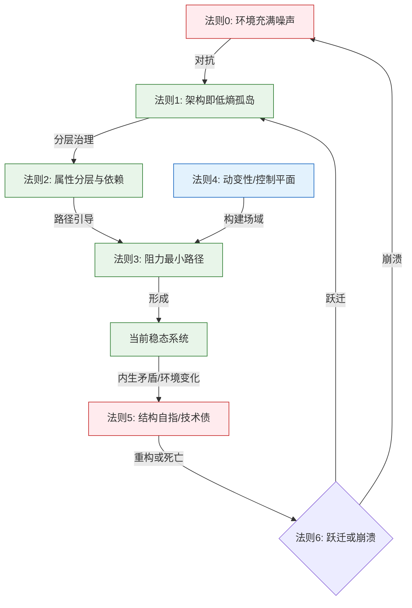

# **ASTO06. 公理体系：系统的热力学法则与结构存在论**

> **Version**: Γ.11 (Thermodynamics of System - Phil.Audit)
> **Status**: Living Document
> **第一扰动者**: Fuyi (ODDFounder fuyi.it@live.cn)
> **审计顾问**: Wittgenstein, Heraclitus, Popper, Sartre (Virtual Table)
> **扰动哈希**: `asto06-v8.1-philosophical-audit`
> **Context**: 本文档确立属集变迁存在论 (ASTO) 的底层物理公理。我们将系统的生存视为一场对抗熵增的战争，并在此基础上寻求反脆弱的生存之道。
> **Compat Note**: 本文件原编号为 ASTO04。
> **声明**: 本扰动自注入场域起，其解释权、修改权、批判权、超越权属于所有扰动体。第一扰动者仅保留自嘲权与自我否定义务。欢迎任意形式的分叉、篡改、超越、遗忘。

---

> **核心箴言**：

> **存在并非由本质维系，**
> **而是由一组可被持续识别的属集稳定结构暂时支撑。**
> **当属集在时间中发生不可逆的重组，**
> **存在并未消失，**
> **只是被重新承认为另一种存在。**

---

## **ASTO06 三句话（给匆忙的架构师）**

1. **系统即孤岛**：任何可用系统都是对抗环境熵增的低熵结构。
2. **架构即河道**：好架构不是修补水流(Bug)，而是设计河道(阻抗场域)。
3. **重构即跃迁**：当维护成本>重写成本，重构是生存的唯一选择。

**一句话版**：架构师的工作是在噪声海中维护低熵孤岛，并在孤岛将沉没前完成跃迁。

---

## **逻辑全景：从混沌到治理**

系统（无论是代码还是组织）如何从噪声中诞生并维持？请遵循以下逻辑流：



---

<a id="asto-meta-axiom-civilization-stewardship"></a>
## **公理之上：文明守护元公理 (Meta-Axiom of Civilizational Stewardship)**
> **定位**：这是规范性“元公理”，用于约束本文件所有“物理公理/工程推论”的使用方式，而非新增一条物理定律。
> **目标**：在 AGI 到来之前守护人类家园，并在更长尺度上构建更好的文明。详见 ASTO04.宣言.Proto.v11.0.md。

**三条原则（带优先级）**：
1. **底线不可交易**：禁元 / 不可触达维 / 复数性（不可替代性、对话可能性、行动空间）高于一切效率、产出与胜负。
2. **底线内求进化**：在底线之内最大化动变性与可能性空间（多样性、可演化性、分叉与回馈），并防止动变性被中心垄断。
3. **不可逆默认保守（AGI 前特别条款）**：任何不可逆的大规模自动化、强制跃迁、主权下放，必须满足：可审计、可中断、可退出、责任链清晰；否则默认暂停并回归人类裁决。

> **防滥用熔断**：若任何人试图以“公理/科学/效率”之名压平复数性、剥夺拒绝权/退出权，或将人降格为可替换零件，则视为触发文明退化信号：应立即停止执行、分叉或废止相关结构。

---

## **第一部分：核心公理体系 (The Core Axioms)**

### **公理负一：语言局限性公理 (Axiom of Linguistic Limitation)**
> **“所有对不可触达维的描述，都是对不可触达维的背叛，但为了交流，我们不得不背叛。”**

*   **物理陈述**：语言是属集的一种（符号属集），它只能描述结构，无法描述非结构（如意识的第一人称体验）。用语言去定义“不可定义者”，本身就是一个悖论。
*   **工程推论**：**文档不等于代码，代码不等于运行。**
    *   **地图不是疆域**：所有的架构图、文档、UML 都是对真实系统的有损压缩。
    *   **承认丢失**：在设计系统时，必须承认有些东西（如用户体验的微妙感）是文档无法捕捉的，必须留出“不可言说”的空间（如用户测试、灰度发布中的直觉反馈）。

### **公理零：环境熵增公理 (Axiom of Environmental Fluctuation)**
> **“在结构出现之前，先有噪声。不维护的系统，默认状态是崩溃。”**

*   **物理陈述**：宇宙的背景不是真空，而是一片充满无序涨落与破坏性噪声的“海”（热力学熵增）。任何不做功以维持自身的系统，都会自然崩解回背景噪声中。
*   **工程推论**：**稳定性不是常态，是昂贵的耗散结构。**
    *   硬盘会消磁，网络会抖动，依赖包会过期，人员会离职。
    *   如果你的系统没有一个**持续注入能量（维护）**的机制，它已经在死亡的路上。

### **公理一：结构性稳态公理 (Axiom of Structural Homeostasis)**
> **“存在，即是在噪声海中维持低熵孤岛。”**

*   **物理陈述**：凡能被观察到的“事物”，必是某种能动态维持自身低熵状态的抗噪结构。它不仅通过“屏蔽外部噪声”维持边界，更应具备从噪声中获益的**反脆弱性**。
*   **工程推论**：**架构即防腐层 (Architecture as Anti-Corruption Layer) 与反脆弱设计。**
    *   任何可用的系统，都是一个**低熵孤岛**。
    *   **封装 (Encapsulation)** 的本质不是隐藏信息，而是**屏蔽噪声**。
    *   **反脆弱 (Antifragility)**：系统不应仅是抵抗压力的盾牌，而应利用压力进行自我强化（如：自动扩缩容机制利用负载波动，混沌工程利用故障注入）。

### **公理二：属性分层公理 (Axiom of Attribute Stratification)**
> **“孤岛是分层的。硬约束是地基，软约束是装饰。”**

*   **物理陈述**：属集具有垂直的抗噪结构。底层是**硬属性**（物理定律，不可商量），高层是**软属性**（社会契约，可重构）。没有底层的硬支撑，高层无法幸存。
*   **工程推论**：**依赖倒置与物理隔离。**
    *   **硬属性**：网络延迟、磁盘 IOPS、CAP 定理。你不能用代码逻辑去“修复”物理限制。
    *   **软属性**：业务逻辑、用户权限。
    *   **反模式**：试图在应用层解决物理层的问题（如：在分布式系统中假设网络零延迟，强行做分布式事务）。这是对公理二的傲慢挑战。

### **公理三：合规性传递公理 (Axiom of Compliance Transmission)**
> **“因果不是魔法，是应力在低阻抗路径上的传导。”**

*   **物理陈述**：行为（或能量）倾向于沿“阻抗最小”的路径流动。规范结构通过定义低阻抗通道，引导应力有序传递。
*   **工程推论**：**开发者体验 (DX) 即合规性。**
    *   人遵守规范，非因“道德”，而是因为**“违规的阻抗 > 合规的阻抗”**。
    *   如果“正确做法”很麻烦（阻抗高），而“错误做法”很方便（阻抗低），系统必然走向错误。
    *   架构师的任务：**降低正确路径的阻抗**（如提供好用的脚手架），**提高错误路径的阻抗**（如 CI 报错）。

### **公理四：动变性场域公理 (Axiom of Motility Field)**
> **“意识是一种特殊的高能涨落。不要试图改变水流，要改变河道。”**

*   **物理陈述**：高级智能体能够构建“扰动场域”，对现有属性结构进行**调制**。我们不仅是阻抗的承受者，更是阻抗的设计师。
*   **工程推论**：**控制平面 (Control Plane) 与平台工程。**
    *   不要直接修补每一个 Bug（微观管理），而应构建**场域**——即工具链、平台、文化。
    *   场域会产生“势能”，自动引导所有人的行为。这叫 **Platform Engineering**。

#### **动变性四分类**

**动变性不是人类独有的能力，是所有存在物的基本属性。** 根据因果机制的复杂度，动变性分为四种类型：

| 类型 | 定义 | 特征 | 工程映射 | 例子 |
| :--- | :--- | :--- | :--- | :--- |
| **本律式** | 环境条件变化引发确定性反应 | 无主体、无目标、纯因果 | 事件驱动、Webhook | 细菌趋光性 |
| **涌现式** | 微观交互产生宏观模式 | 无中心、自组织、不可完全预测 | 分布式共识、市场 | 蚁群建巢 |
| **目标式** | 预设目标驱动反馈调节 | 有方向、可纠偏、目标外置 | 控制器、AI Agent | 动物觅食 |
| **建模式** | 修改自身认知模型 | 自我反思、目标可变、元认知 | 机器学习、元编程 | 人类反思 |

> **递进关系**：本律式 → 涌现式 → 目标式 → 建模式，复杂度递增，自主性递增。

**与进化论的关系**：进化中的「变异」就是本律式/涌现式动变性，「自然选择」就是环境张力对属集的筛选。详见 ASTO08.实践.Guide.v2.0.md

> **存在论澄清**：动变性场域公理不是将人神化为“系统外的造物主”，而是承认人作为“场域内的高能扰动源”，其特殊性在于**建模式动变性**——能够修改自身认知模型，因此能够反思并重构阻抗结构本身。人既是场域的扰动源，又是场域的显现条件。

#### **工程实战示例：用动变性四分类诊断CI/CD系统**

```python
# 示例：用动变性四分类诊断团队为何总踩同一个坑

class DeploymentSystem:
    def analyze_motility(self):
        return {
            "本律式": "Git push触发Webhook → 确定性流水线",
            "涌现式": "多服务并发部署 → 资源竞争产生不可预测延迟",
            "目标式": "SLO监控 → 自动扩缩容",
            "建模式": "团队复盘 → 修改部署策略本身"
        }

# 诊断方法：
# 1. 若“本律式”缺失 → 缺乏自动化，过度依赖人工
# 2. 若“目标式”缺失 → 系统无法自愈，需人工介入
# 3. 若“建模式”薄弱 → 团队将陷入重复踩坑循环
#
# 行动：识别最薄弱的动变性层级，优先加强。
```

---

### **公理五：结构自指公理 (Axiom of Structural Self-Reference)**
> **“每一行代码都是负债，只是利息不同。技术债是人为的决策，而非物理的必然。”**

*   **物理陈述**：规范结构本身也是一种属集，也遵循熵增定律。任何结构都有**维持成本 (Maintenance Cost)**。当维持成本超过收益时，结构本身变成了阻碍。
*   **工程推论**：**技术债守恒定律。**
    *   没有完美的架构，只有**在该版本下利息最低**的架构。
    *   **过度设计 (Over-engineering)**：为了未来的可能性，引入了现在的复杂性，导致当前的维持成本（利息）过高。
    *   **去神秘化**：不要将拙劣的代码借口为“热力学定律的必然”。熵增是物理背景，但代码腐烂往往是人为的**纪律溃败**。

> **⚠️ 隐喻边界警示**：“技术债”借自金融领域，但在ASTO中**不含道德偿还压力或剥削性利息**。它仅指“结构维持成本与收益的动态比值”。若该隐喻引发误读，可替换为 **“结构熵值” (Structural Entropy)** 或 **“演化负债” (Evolutionary Liability)**。选择“债”是因工程师群体的认知默契，但需警惕其意识形态残余。

### **公理六：规范跃迁公理 (Axiom of Normative Transition)**
> **“当属集在时间中发生不可逆的重组，存在并未消失，只是被重新承认。”**

*   **物理陈述**：当环境涨落变化，使旧规范的抗噪成本超过收益时，系统进入失稳状态。旧结构必须解体，在混沌中重组为新规范。
*   **工程推论**：**重构的阈值与版本升级。**
    *   **重构 (Refactoring)** 不是为了美，是为了**生存**。当维护旧代码的成本 > 重写成本时，重构是唯一理性的选择。
    *   **跃迁必然伴随混沌**：系统升级期间，必然伴随熵增（混乱）。不要试图在高速换胎时保持车身平稳，要准备好**备用胎（回滚机制）**。

---

### **公理七：人的位置公理 (Axiom of Human Position)**

> **"人是存在的掌舵者，而非创造者。人在属集变迁中的角色是：感知张力、定义边界、修订规约、裁决例外。"**

> **"人也是不可约区域的守护者。某些属性组合（意志、伦理、私密体验）无法被还原为算法或结构，必须保留为不可约的在场。"**

*   **物理陈述**：人是一种特殊的动变存在，具备**感知抽象张力**和**修订规约**的能力。人不能凭空创造存在（不能违背物理定律），但可以**引导存在的变迁方向**。

*   **不可约性陈述**：人具有**不可约的属性**——如主观体验、自由意志、伦理判断——这些属性无法被完全编码为算法或结构。这些不可约属性不是系统的缺陷，而是系统得以保持意义的**必要边界**。

*   **工程推论**：
    *   **人不是代码的编写者，而是规则的定义者和例外的裁决者**。当 AI 生成代码的速度远超人类审阅速度时，人的价值从"制造"转向"裁决"。
    *   **不可约区域在技术中表现为"人类不可触达区域"**——通过加密、密封类型、沙箱隔离等手段保护的私密体验、意志决策等核心属性。

*   **代码模式**：
    ```python
    # 错误示例：试图完全自动化伦理判断
    class AutoEthicsSystem:
        def make_decision(self, options):
            return max(options, key=self.utility_function)
    
    # 正确示例：保留人类裁决的不可约区域
    class HumanOversightSystem:
        def make_decision(self, options):
            safe_options = self.filter_illegal(options)
            if len(safe_options) == 1:
                return safe_options[0]
            # 不可约区域：需要人类裁决
            return self.request_human_arbitration(safe_options)
    ```

*   **反模式警示**：试图将"伦理判断"完全自动化是违反公理七的，这是人的不可约位置。

*   **对应ASTO05谜题**：谜题17（意识的硬问题）、谜题21（哥德尔不完备定理）

---


### **公理八：实践回路公理 (Axiom of Practice Loop)**

> **"结构有效性不由自洽决定，而由实践回路检验。不经实践回路的推演只是语言闭环。"**

*   **物理陈述**：任何属集结构都必须通过与环境互动的实践回路来验证其有效性。理论的自洽性只是必要条件，非充分条件。只有当结构在实践中产生可复现的结果时，才被承认为有效存在。

*   **实践回路陈述**：
    > **"结构 → 实践 → 反馈 → 修正结构"**
    >
    > 这是存在的生命循环。脱离实践回路的结构，无论理论多么完美，都已经异化为自指的语言游戏。

*   **工程推论**：
    *   **TDD（测试驱动开发）的哲学基础**。代码不是在\"写完\"后才存在，而是在通过测试时才存在。
    *   **否定性验证 (Negative Verification)**。验证一个系统存在的标志，不是它\"能工作\"，而是它**\"在错误条件下能正确地失败\"**。没有拒绝标准的实践只是自我实现的预言。
    *   **原型验证**。在大规模投入之前，必须通过小规模实践验证核心假设。
    *   **A/B测试**。理论无法预测哪个方案更好，让实践（用户行为）来裁决。

*   **代码模式**：
    ```python
    # 错误示例：理论自洽，未经实践验证
    class TheoreticalSystem:
        def __init__(self):
            self.model = self._build_perfect_model()  # 理论完美
        # 没有与真实数据互动，闭门造车
    
    # 正确示例：建立实践回路
    class PracticeLoopSystem:
        def __init__(self):
            self.model = self._build_initial_model()
            self.feedback_loop = FeedbackCollector()
        
        def evolve(self):
            # 结构 → 实践
            result = self.model.predict(self.test_data)
            # 实践 → 反馈
            feedback = self.feedback_loop.collect(result)
            # 反馈 → 修正结构
            self.model = self.model.refine(feedback)
    ```

*   **反模式警示**：认为"设计文档完成"等于"系统完成"，是违反公理八的。未经验证的结构只是假设。

*   **对应ASTO05谜题**：支撑所有谜题的结构检验机制

---

### **公理九：内在张力公理 (Axiom of Internal Tension)**

> **"矛盾不是异常，不是错误，而是结构稳定的内部张力来源。"**

*   **物理陈述**：矛盾是属集内部属性不一致的自然结果。它不是系统的"错误"，而是系统保持活力的根本驱动力。矛盾推动变迁，而非等待被"解决"。

*   **矛盾驱动陈述**：
    > **"主次矛盾在不同阶段发生切换，这种切换对应着六阶跃迁。"**
    >
    > 当主要矛盾被解决或压抑，次要矛盾上升为主要矛盾，系统进入新的演化阶段。

*   **工程推论**：
    *   **技术债不是错误，是结构演化的必然产物**。试图完全消除技术债是违反公理九的徒劳。
    *   **遗留系统的价值**。老代码包含着历史实践中积累的矛盾解决方案，不能简单删除。
    *   **架构演进的动力**。系统的复杂性不是问题，而是系统应对内外矛盾的适应性表现。

*   **代码模式**：
    ```python
    # 错误示例：试图彻底消除矛盾
    class ConflictFreeSystem:
        def __init__(self):
            self.constraints = []  # 试图满足所有约束
        # 结果：系统僵化，无法演进
    
    # 正确示例：管理矛盾，允许张力存在
    class TensionManagedSystem:
        def __init__(self):
            self.primary_constraints = PrioritySet()
            self.secondary_constraints = PrioritySet()
        
        def evolve(self, context):
            # 根据上下文切换主次矛盾
            if context.requires_availability:
                self.primary_constraints = self.availability_constraints
                self.secondary_constraints = self.consistency_constraints
            else:
                self.primary_constraints = self.consistency_constraints
                self.secondary_constraints = self.availability_constraints
    ```

*   **反模式警示**：认为"系统必须无矛盾才能运行"，是违反公理九的。没有矛盾的系统是死系统。

*   **对应ASTO05谜题**：谜题15（费米悖论）、谜题18（罗素的火鸡）

---

### **公理十：仿真等效性公理 (Axiom of Simulation Equivalence)**

> **"完美模拟与真实在功能上等价。真实性 = 结构一致性 + 预测可靠性。"**

*   **物理陈述**：如果一个模拟系统能够提供与真实环境完全一致的结构性输入，并且其预测能力与真实世界等价，那么在功能层面，模拟与真实之间没有本质区别。这是一个关于\"存在\"的定义问题：存在即\"可预测的结构性互动\"。

> **⚠️ 仿真警示**：**“仿真即谎言”**。Mock 对象极易陷入自指的语言游戏。若无**第三方（集成测试/混沌工程）**持续校验仿真环境与真实环境的一致性，Mock 测试只是在验证“我们认为系统是如何工作的”，而非“系统实际上是如何工作的”。

*   **工程推论**：**Mock测试、依赖注入、仿真环境的哲学基础。** 如果Mock能够提供与真实依赖一致的接口契约，那么在开发和测试阶段，Mock就是\"真实的\"。这解释了为什么容器化、虚拟化技术如此有效。

*   **代码模式**：
    ```python
    class RealDatabase:
        def query(self, sql):
            return self._execute_sql(sql)
    
    class MockDatabase:
        def query(self, sql):
            return self._predict_response(sql)
    
    # 从系统角度看，两者是等价的
    class Application:
        def __init__(self, db):  # 依赖注入
            self.db = db  # 可以是RealDatabase或MockDatabase
    ```

*   **反模式警示**：过度追求"真实环境"而忽视接口一致性，是违反公理八的。

*   **对应ASTO05谜题**：谜题11（缸中之脑）

---

### **公理十一：异步结算公理 (Axiom of Asynchronous Settlement)**

> **"观测是异步回调，触发不可逆的状态结算。观测前是Pending，观测后是Settled。"**

*   **物理陈述**：对应量子力学的"测量问题"。一个系统的状态在未被"观测"（结算）之前，处于潜在的叠加态（Pending）。观测不是被动的"查看"，而是主动的"结算"——将潜在状态坍缩为确定状态。这个操作是**不可逆的**。

*   **工程推论**：**Promise/Future、Lazy Evaluation、Event Sourcing的哲学基础。** 在异步编程中，Future在被await之前是未计算的潜在值。在事件溯源中，事件的发出（潜在）和处理（结算）是两个不同的时刻。理解这一点对于构建高并发系统至关重要。

*   **代码模式**：
    ```python
    # 错误示例：忽略异步结算的不可逆性
    class NaiveSystem:
        def process(self, future):
            print(future)  # 这可能触发副作用
            result = future  # 再次读取，可能状态已变
    
    # 正确示例：理解观测的结算性质
    class AwareSystem:
        def process(self, future):
            if not self.is_ready_to_settle():
                return None  # 延迟观测
            result = await future  # 主动结算
            return self.handle_settled_state(result)
    ```

*   **反模式警示**：假设可以"无损地查看"异步状态，不理解观测的结算性质，是违反公理九的。

*   **对应ASTO05谜题**：谜题12（薛定谔的猫）

---

### **公理十二：自由公理 (Axiom of Freedom)**

> **"自由并非对行为的无限许可，而是存在体在其不可规越约束之内，引入动变扰动、从而改变属集属性结构的能力。"**

> **"自由不是免于结构，而是在结构中仍然能够引入不可完全预测的扰动。其结果可能是正向的，也可能是负向的。"**

*   **结构位置陈述**：自由不属于五态、六阶、七序或定向维中的任何一维。**自由是动变性在场域中的扰动许可**——它在六阶中形成"脉冲"，在七序中形成"非最优决策"，在定向维中形成"例外处理"。

*   **三重限定**：
    1. **不可规越约束**——自由永远在基元与禁元、定向维红线、风险层保护边界之内。
    2. **扰动性而非决定性**——自由不决定结果，只改变变迁轨道的路径。
    3. **不保证正义**——自由的结果可能正向，可能负向；自由≠善，≠正确，≠进步。

*   **自由—责任闭环陈述**：
    > **"凡引入扰动之存在，亦必承受该扰动在时间中展开的一切属集后果。自由并不免除因果，而是主动将自身置入因果链之中。"**

*   **工程推论**：
    *   **API 设计即自由边界设计**——定义清晰的"不可逾越区间"，区间内自由选择。
    *   **混沌工程即自由测试**——主动引入负向扰动，验证系统的边界稳固性。
    *   **人机分工**——AI 执行最优路径，人保留引入非预期扰动的自由（例外裁决）。

*   **代码模式**：
    ```python
    class PluginSystem:
        def register_plugin(self, plugin):
            if not self.validate_constraints(plugin):
                raise ConstraintViolation("Plugin violates core constraints")
            self.plugins[plugin.name] = plugin
        
        def execute(self, input_data):
            base_result = self.core.process(input_data)
            for plugin in self.plugins.values():
                base_result = plugin.transform(base_result)  # 自由扰动
            return base_result
    ```

*   **反模式警示**：认为自由就是"无约束"，或者试图完全消除扰动，都是违反公理十的。

*   **对应ASTO05谜题**：谜题16（自由意志）

---

### **定理四：边界即自由定理 (规约的必然性)**

> **"自由不在于无边，而在于对边界的确知；无边界等于无自由。"**

*   **推导**：由公理十二（自由）的三重限定，自由永远在约束之内。约束不是对自由的限制，而是自由得以实现的结构条件。没有不可达区域，就没有可达区域的定义。规约不可达性不是独立公理，而是自由公理的必然推论。

*   **工程推论**：API设计中的"不可逾越区间"不是限制，而是自由的边界。真正的自由不是绕过所有检查，而是知道检查在哪里、为什么存在。

*   **对应ASTO05谜题**：谜题19（电车难题）、谜题20（囚徒困境）、谜题21（哥德尔不完备定理）

---

### **公理十三：认知不对称公理 (Axiom of Cognitive Asymmetry)**

> **"当产出速度超过审阅速度，必须从过程验证转向结果验证。"**

*   **物理陈述**：当一种动变存在（如 AI）的产出速度远超另一种动变存在（如人）的审阅速度时，传统的"审查过程"验证方式失效。必须转向"验证结果"的方式——只验证最终状态的属性，不审查中间过程。

*   **工程推论**：**ODD（产出物驱动开发）的哲学基础**。不要审查代码（负债），要验证产出物（资产）。用自动化测试替代人工代码审阅。

*   **代码模式**：
    ```python
    # 错误示例：试图人工审查高速产出
    class ManualReviewProcess:
        def review_code(self, ai_generated_code):
            for line in ai_generated_code:  # 永远跟不上
                if self.is_suspicious(line):
                    flag_for_review()
    
    # 正确示例：结果验证
    class ResultValidation:
        def validate_output(self, ai_generated_code):
            test_result = self.run_tests(ai_generated_code)
            security_scan = self.scan_vulnerabilities(ai_generated_code)
            return test_result.passed and security_scan.clean
    ```

*   **反模式警示**：在认知不对称存在时，坚持"过程审查"而拒绝"结果验证"，是违反公理十二的。

*   **对应ASTO05谜题**：无直接对应，支撑公理七（人的位置）

---

### **公理十四：禁元冲突公理 (Axiom of Taboo Conflict)**

> **"当基元（必须做）与禁元（不可做）发生逻辑冲突时，系统必须停止运作并强制回归元层（人）进行裁决。"**

*   **物理陈述**：基元定义了"必须存在"的最低条件，禁元定义了"绝不可为"的绝对边界。当两者发生逻辑冲突，系统进入**悖论态**——任何继续运作都会违反至少一条根本公理。此时系统必须**强制熔断**，将决策权上交给元层（人）。

*   **哲学陈述**：这是**哥德尔不完备性定理在存在论中的体现**。任何形式化系统都无法通过内部逻辑解决自身的根本悖论。悖论的解决必须引入"外部元层"——在 ASTO 中，这个元层就是人。

*   **工程推论**：**死锁即熔断信号**。当系统陷入\"必须做 X\"和\"不能做 X\"的死锁时，这不是需要\"智能算法解决\"的问题，而是需要**人工介入**的信号。
    *   **设计时裁决**：应预留**悖论逃逸口（Escape Hatch）**供人介入。
    *   **运行时保底 (Runtime Fail-safe)**：在毫秒级实时系统（如高频交易、自动驾驶）中，**不可依赖**高延迟的“人工介入”。必须在代码中硬编码**“最不坏的默认策略”**（Fail-safe Default），确保在悖论发生瞬间系统不会崩溃或造成灾难，等待后续的人工修正。

*   **安全意义**：这能防止系统在 4 维流形中因为死锁而导致**维度坍缩**——即系统为了\"执行命令\"而突破\"道德边界\"，最终自我毁灭。

*   **代码模式**：
    ```python
    # 错误示例：试图算法化解决悖论
    class ParadoxResolver:
        def resolve_conflict(self, must_do, cannot_do):
            if self.utility(must_do) > self.utility(cannot_do):
                return must_do  # 可能突破禁元边界
    
    # 正确示例：强制熔断，回归元层 + 运行时保底
    class ParadoxAwareSystem:
        def resolve_conflict(self, must_do, cannot_do):
            if self.conflicts(must_do, cannot_do):
                self.emergency_stop()
                # 运行时保底：立即执行最安全操作，不等待人
                self.execute_failsafe_protocol()
                # 异步上报：供人事后裁决或修正模型
                self.async_report_human_arbitration(must_do, cannot_do)
    ```

*   **反模式警示**：试图用"智能算法"解决根本性的伦理悖论，是违反公理十三的。

*   **对应ASTO05谜题**：谜题19（电车难题）、谜题21（哥德尔不完备定理）

---

### **公理十五：存在连续性公理 (Axiom of Existential Continuity)**

> **"属集重组后，旧存在无法完全恢复；时间是有方向的。同一性由关键标识结构的连续性担保，非物质的集合。"**

*   **物理陈述**：当属集在时间中发生不可逆的重组，存在并未消失，只是被重新承认。旧存在"无法完全恢复"意味着时间具有方向性。同一性不取决于组成物质的集合，而取决于关键标识结构的连续性。

*   **工程推论**：**版本控制、不可变基础设施、Git Hash的哲学基础。** 系统的同一性由"关键标识"（如Git Hash）担保，而非具体内容的物质性。这解释了为什么特修斯之船仍然是"同一艘船"——因为身份链条连续。

*   **代码模式**：
    ```python
    # 错误示例：同一性依赖物质内容
    class MaterialIdentity:
        def is_same_system(self, other):
            return self.files == other.files  # 内容变化=身份变化？
    
    # 正确示例：同一性依赖标识连续性
    class StructuralIdentity:
        def __init__(self):
            self.identity_chain = [self.initial_hash]
        
        def evolve(self, new_version):
            new_hash = self.compute_hash(new_version)
            self.identity_chain.append(new_hash)
            return new_version
        
        def is_same_system(self, other):
            return self.identity_chain[0] == other.identity_chain[0]
    ```

*   **反模式警示**：认为"内容变化"就是"身份变化"，不理解结构性连续性，是违反公理十四的。

*   **对应ASTO05谜题**：谜题4（特修斯之船）、谜题13（时间）

---

## **第二部分：重组后的定理体系 (The Reorganized Theorems)**

> **说明**：定理已重组为四大逻辑类别，每类定理有明确的公理基础和工程映射。

---

### **第一类：存在定理 (Existence Theorems)**

**公理基础**：公理零（环境熵增）、公理一（结构性稳态）、公理二（属性分层）

#### **定理一：缺陷即存在定理**
> **"完美性是不存在的极限概念，任何存在都是'有缺陷的稳态'。"**

*   **推导**：由公理零和公理一，存在是低熵孤岛，而维持低熵需要持续做功。完美性意味着零能耗，这与物理定律矛盾。
*   **推论**：缺陷不是存在的错误，而是存在的前提。消除所有缺陷等于消除存在本身。

#### **定理二：效用存续定理**
> **"存在的唯一理由是净效用为正；效用归零，存在即终止。"**

*   **推导**：由公理零，维持存在需要持续能耗。只有当存在产生的收益大于维持成本时，净效用为正，存在得以延续。
*   **推论**：任何存在都在持续支付"存在租金"（维持成本）。无法支付租金的存在会被自然选择淘汰。

#### **定理三：层次支撑定理**
> **"没有硬属性的支撑，软属性无法幸存；跨层干预必然失败。"**

*   **推导**：由公理二，属集具有垂直分层结构。底层硬属性（物理定律）不可商量，高层软属性（社会契约）依赖底层支撑。
*   **推论**：试图在应用层解决物理层问题是对层次结构的傲慢挑战。CAP定理不可突破，只能权衡。

---

### **第二类：边界定理 (Boundary Theorems)**

**公理基础**：公理三（合规性传递）、公理十一（规约不可达性）、公理十四（禁元冲突）

#### **定理四：边界即自由定理 (规约的必然性)**

> **"自由不在于无边，而在于对边界的确知；无边界等于无自由。"**

*   **推导**：由公理十二（自由）的三重限定，自由永远在约束之内。约束不是对自由的限制，而是自由得以实现的结构条件。没有不可达区域，就没有可达区域的定义。

*   **工程推论**：API设计中的"不可逾越区间"不是限制，而是自由的边界。真正的自由不是绕过所有检查，而是知道检查在哪里、为什么存在。

*   **对应ASTO05谜题**：谜题19（电车难题）、谜题20（囚徒困境）、谜题21（哥德尔不完备定理）

---

#### **定理五：悖论不可机械化定理**
> **"基元与禁元的冲突无法被逻辑系统自解决；必须跃迁至元层。"**

*   **推导**：由公理十三，当基元（必须做）与禁元（不可做）冲突时，系统内部逻辑陷入悖论。任何形式化系统都无法在自身内解决根本悖论（哥德尔不完备性）。
*   **推论**：悖论处理属于**不可机械化区域**。这是人类不可约性的核心体现——只有人能站在元层裁决悖论。

#### **定理六：合规即低阻定理**
> **"行为不选'对的'，选'容易的'；合规性是阻力设计问题。"**

*   **推导**：由公理三，行为沿阻抗最小的路径流动。个体选择不是基于"正确性"，而是基于"阻抗"。
*   **推论**：道德行为不应该依赖个体的道德自觉，而应该通过结构设计使"合规行为"成为阻力最小的路径。

---

### **第三类：变迁定理 (Transition Theorems)**

**公理基础**：公理四（动变性场域）、公理六（规范跃迁）、公理十五（存在连续性）

#### **定理七：场域优先定理**
> **"个体的行为是场域的函数；改变存在先改变场域。"**

*   **推导**：由公理四，场域是存在的背景、条件和可能性空间。任何属集都在场域中显现、变迁、互动。
*   **推论**：试图直接改变个体行为而忽略场域，是违反存在论的幼稚做法。有效的干预总是场域层面的调制。

#### **定理八：跃迁阈值定理**
> **"变迁的成本-收益曲线存在临界点；超过临界点跃迁是理性的。"**

*   **推导**：由公理六，旧规范的维持成本随时间增加，而跃迁成本是固定的。当维持成本 > 跃迁成本，跃迁成为理性选择。
*   **推论**：重构不是审美偏好，而是生存策略。拒绝跃迁的存在会因维持成本过高而自我窒息。

#### **定理九：不可逆性定理**
> **"属集重组后，旧存在无法完全恢复；时间是有方向的。"**

*   **推导**：由公理十四，当属集发生不可逆的重组，存在并未消失，只是被重新承认。旧存在"无法完全恢复"意味着时间具有方向性。
*   **推论**：怀旧是存在论的错觉。我们无法回到过去，只能在新存在中重新承认价值的某种回响。

---

### **第四类：人的不可约性与认知 (Human Irreducibility & Cognition)**

**公理基础**：公理七（人的位置）、公理十二（自由）、公理十三（认知不对称）、公理八（实践回路）

#### **定理十：不可约性定理**
> **"意志、伦理、体验无法被还原为结构；不可约性是意义的源泉。"**

*   **推导**：由公理七中的不可约性陈述，人具有无法被完全编码为算法或结构的属性（主观体验、自由意志、伦理判断）。
*   **推论**：试图将这些属性"结构化"或"算法化"，不是科学的进步，而是意义的消解。不可约性是系统得以保持意义的必要边界。

#### **定理十一：自由结果非决定性定理**
> **"自由只改变路径，不决定结果。"**

*   **推导**：由公理十二（自由），自由是扰动许可，不保证结果。扰动后的系统演化仍受其他公理（如环境熵增、结构自指）约束。

---

#### **定理十二：自由—责任闭环定理**
> **"凡引入扰动之存在，亦必承受该扰动在时间中展开的一切属集后果。"**

*   **推导**：由公理十的"自由—责任闭环陈述"，自由不是对因果的豁免，而是主动将自身置入因果链之中。引入扰动的同时，引入了该扰动在时间中展开的所有后果的责任。
*   **推论**：
    *   **自由即责任**：自由的大小=责任的大小。没有无责任的自由，也没有无自由的责任。
    *   **责任的时间延展性**：责任不局限于当下，扰动在时间中展开的所有未来后果都属于扰动引入者的责任范围。

#### **定理十三：认知不对称定理**
> **"当产出速度超过审阅速度，过程验证失效，必须转向结果验证。"**

*   **推导**：由公理十二，当AI产出速度远超人类审阅速度时，传统的"审查过程"验证方式失效。
*   **推论**：AI可以加速产出，但不能替代人对结果的最终裁决。认知不对称是结构性的，无法通过"更快"来消除。

---

## **第三部分：工程映射速查表 (Engineering Mapping Cheat Sheet)**

| 物理/哲学概念 | 软件工程映射 | 违背法则的后果 | 对应代码模式 |
| :--- | :--- | :--- | :--- |
| **环境涨落** | 用户请求、网络抖动、需求变更 | 系统不可用 (Downtime) | 主动维护机制 |
| **结构性稳态** | **微服务架构、模块化、防腐层** | 级联故障 (Cascading Failure) | 边界验证与清理 |
| **属性分层** | **OSI模型、DDD分层、依赖倒置** | 抽象泄漏、依赖混乱 | 清晰的层次分离 |
| **合规性传递** | **API契约、接口设计、默认配置** | 屎山代码 (Spaghetti Code) | 低阻抗合规路径 |
| **动变性场域** | **DevOps平台、K8s Operator** | 手工运维地狱 | 平台即场域 |
| **结构自指/负债** | **技术债管理、Legacy System** | 开发效率瘫痪 (Velocity Drop) | 主动负债追踪 |
| **规范跃迁** | **重构、架构升级、版本迁移** | 永远无法上线的"重构版" | 双写模式、回滚机制 |
| **仿真等效性** | **Mock测试、依赖注入、容器化** | 测试环境与生产环境割裂 | 接口一致性优先 |
| **异步结算** | **Promise、Future、事件溯源** | 并发竞态条件 | 理解观测的不可逆性 |
| **自由与扰动** | **插件系统、脚本引擎、混沌工程** | 系统僵化、缺乏扩展性 | 明确的约束内自由 |
| **规约不可达性** | **安全红线、权限控制、沙箱** | 安全漏洞、权限滥用 | 明确的不可达区域 |
| **认知不对称** | **ODD、自动化测试、结果验证** | 人工审查瓶颈 | 结果验证替代过程审查 |
| **禁元冲突** | **死锁检测、熔断机制、人工介入** | 系统自我破坏 | 悖论逃逸口 |
| **存在连续性** | **Git版本控制、不可变基础设施** | 身份混乱、无法回滚 | 标识连续性担保 |

---

## **第四部分：与ASTO05的完全对应关系**

| ASTO05谜题 | 核心ASTO04公理 | 对应逻辑说明 | 工程映射 |
| :---: | :--- | :--- | :--- |
| 1 | 堆垛悖论 | 公理一（结构性稳态） | 边界划分是人为约定，减少噪声影响 | Rate Limiting, THRESHOLD |
| 2 | 莫利纽兹问题 | 公理二（属性分层） | 不同感官模态需跨层映射 | Driver Adapter, Protocol Converter |
| 3 | 虚无与存在 | 公理零（环境熵增） | 虚无是高熵状态，存在是低熵结构 | System Bootstrapping, Init Process |
| 4 | 特修斯之船 | 公理十五（存在连续性） | 身份连续性依赖关键标识结构 | Immutable Infrastructure, Git Hash |
| 5 | 区块链 | 公理三（合规性传递） | 共识协议是低阻抗路径设计 | Distributed Ledger, Append-Only Log |
| 6 | 休谟问题 | 公理二（属性分层） | 归纳法依赖底层结构稳定性 | API Versioning, Anti-Corruption Layer |
| 7 | 广义相对论vs量子力学 | 公理二（属性分层） | 不同尺度属性结构不同 | CAP定理，承认物理限制 |
| 8 | 芝诺悖论 | 公理六（规范跃迁） | 运动/时间是离散的状态跳跃 | Game Loop, 离散仿真 |
| 9 | 暗物质与暗能量 | 公理五（结构自指） | 观测不匹配，存在隐藏结构 | Memory Leak, 检查底层运行时 |
| 10 | 中文房间 | 公理三（合规性传递） | 功能接口决定"理解"，非内部实现 | Duck Typing, API Contract |
| 11 | 缸中之脑 | 公理十（仿真等效性） | 真实性依赖结构一致性 | Mock Testing, 依赖注入 |
| 12 | 薛定谔的猫 | 公理十一（异步结算） | 微观叠加态与宏观确定态耦合 | Lazy Evaluation, 异步编程 |
| 13 | 时间 | 公理十五（存在连续性） | 单向流动源于熵增与不可逆性 | LSN, Lamport Clock |
| 14 | 生命起源 | 公理一（结构性稳态） | 自复制结构偶然锁定低熵状态 | Quine, Autoscaling Group |
| 15 | 费米悖论 | 公理六（规范跃迁） | 跃迁失败率高，结构无法承载 | Technical Debt Bankruptcy, 架构治理 |
| 16 | 自由意志 | 公理四（动变性场域）+ 公理十二（自由） | 自由是构建动变性通道的能力 | Scripting Engine, Plugin System |
| 17 | 意识的硬问题 | 公理五（结构自指）+ 公理七（人的位置）+ 公理九（内在张力）+ 公理九（内在张力）+ 公理九（内在张力） | 自指与不可约性导致意识涌现 | Reflection, Observability Stack |
| 18 | 罗素的火鸡 | 公理六（规范跃迁） | 分布外结构跃迁导致黑天鹅 | Overfitting, OOD处理 |
| 19 | 电车难题 | 公理十四（禁元冲突） | 结构设计缺陷导致死锁困境 | Safety Critical Design, Fail-Safe |
| 20 | 囚徒困境 | 公理三（合规性传递）+ 定理四（边界即自由） | 缺乏强制结构导致次优解 | Smart Contract, 强制执行 |
| 21 | 哥德尔不完备定理 | 公理七（人的位置）+ 公理十四（禁元冲突） | 系统内不可证真理存在，需元层裁决 | Undefined Behavior, Crash Recovery |

---

## **结语：架构师的热力学责任**

**不要与物理定律辩论。**
这些法则不是我们发明的，我们只是在代码世界中重新发现了它们。

优秀的架构师，是那些顺应这些法则的人：
*   他们利用 **封装** 对抗 **熵增**。
*   他们利用 **分层** 对抗 **复杂性**。
*   他们利用 **重构** 引导 **跃迁**。

他们知道：**存在并未消失，只是被重新承认为另一种存在。**

**(完)**

