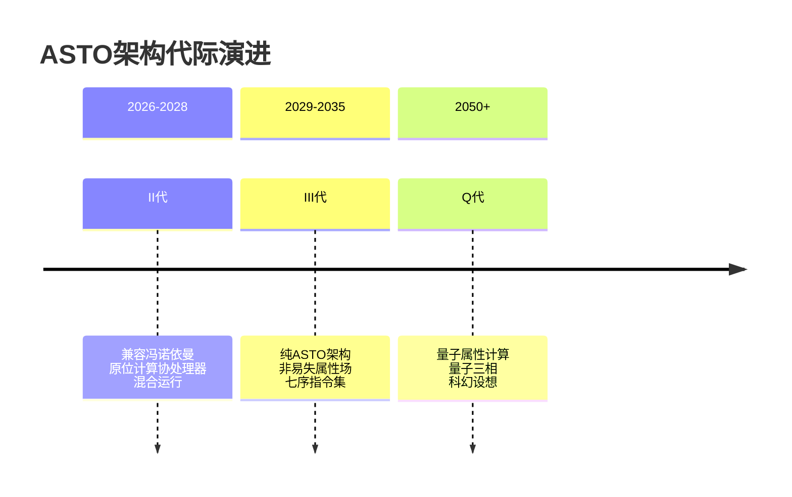
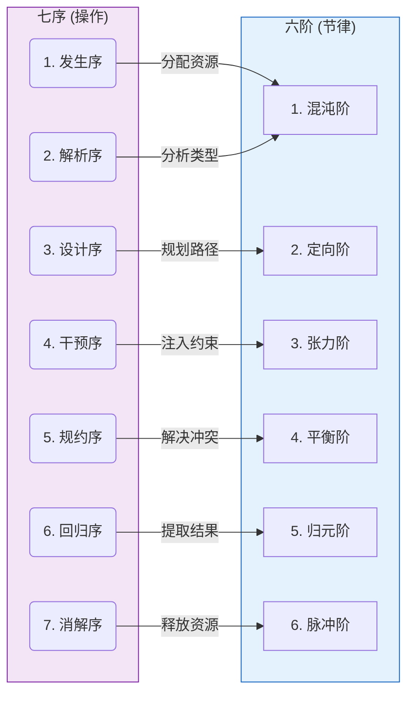
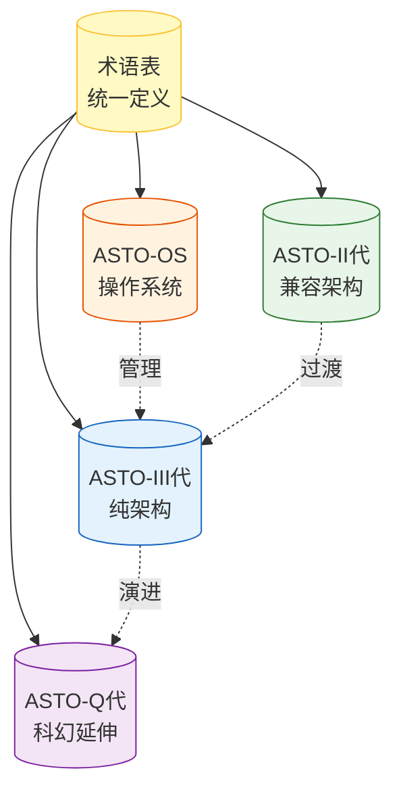

# ASTO计算机架构综述与术语表

> **作者**: Fuyi (ODDFounder fuyi.it@live.cn)
> **版本**: v1.1
> **适用范围**: 全局指南

---

## 0. 综述与阅读指南

### 0.1 什么是ASTO架构？

ASTO (Attribute-State-Transition-Ontology) 是一种基于**属集变迁存在论**的计算范式。它试图回答一个核心问题：**如果计算的本质不是数据的搬运（冯·诺依曼架构），而是属性状态的原位演化，计算机应该长什么样？**

本系列文档详细阐述了这一范式从兼容现有生态（II代）到彻底重构（III代）再到未来科幻（Q代）的演进路径。

### 0.2 文档阅读顺序

为了获得最佳的理解体验，建议按照以下顺序阅读本系列文档：

1.  **[当前文档] ASTO.计算机综述和术语表.md**
    *   **定位**：入门指南与字典。
    *   **作用**：建立全局认知，查阅专有名词。
    
2.  **ASTO.计算机-II代(兼容冯诺依曼结构).md**
    *   **定位**：**当前可实现的工程方案** (TRL 7-9)。
    *   **核心**：在现有CPU/GPU旁边挂载“属性协处理器”，平滑引入ASTO能力。
    *   **关键词**：混合架构、红绿灯域、平滑演进。

3.  **ASTO.计算机-III代.md**
    *   **定位**：**5-10年后的理想架构** (TRL 3-6)。
    *   **核心**：抛弃冯·诺依曼瓶颈，基于忆阻器/PCM实现“存内计算”和“原位变迁”。
    *   **关键词**：六阶节律、七序指令、人类主权物理强制。

4.  **ASTO.计算机.OS.基于ASTO-III硬件的操作系统设计.md**
    *   **定位**：III代硬件的配套软件栈。
    *   **核心**：没有进程和文件的操作系统，只有属性场的演化管理。
    
5.  **ASTO.计算机-Q代.md**
    *   **定位**：**2050+的科幻思想实验**。
    *   **核心**：量子计算与属性本体论的哲学融合。
    *   **注意**：本文档包含大量未验证的物理假设，仅供启发思考。

---

## 0.3 前提约定 (Premises & Conventions)

在阅读本系列文档时，请遵循以下前提约定：

### 1. 技术成熟度 (TRL) 诚实原则
我们严格区分**工程现实**与**理论设想**。所有技术组件均标注TRL等级：
*   **TRL 1-3**: 基础研究/实验室原理 (如：通用忆阻器计算) -> **不可用于生产**
*   **TRL 4-6**: 原型演示 (如：PCM阵列) -> **仅用于III代实验性设计**
*   **TRL 7-9**: 工业成熟 (如：RISC-V, TSV工艺) -> **II代架构的基础**

### 2. 人类主权公理
所有架构设计必须遵循**人类主权优先于计算效率**的原则。
*   **物理强制**：安全机制必须基于物理定律（如熔断、气隙），而非纯软件逻辑。
*   **不可算法化**：关键决策权（如伦理红线）必须保留在人类手中，不可完全委托给AI。

### 3. 本体论视角
*   **属性 (Attribute)** 是第一性原理，而非“数据”。
*   **变迁 (Transition)** 是计算的本质，而非“运算”。
*   **原位 (In-situ)** 是物理实现的铁律，数据不搬运，逻辑去就数据。

---

## 0.4 架构演进全景



---

## 1. 核心概念

### 属性 (Attribute)
ASTO的基本本体单元。属性是**具有身份的值**，不同于传统编程中的变量。属性具有唯一标识、当前值、状态、版本历史等元信息。

**与传统概念的区别**：
| 传统概念 | ASTO属性 |
|---------|---------|
| 变量 | 无身份，仅有值 | 有身份，值是属性的一部分 |
| 对象 | 数据+方法的封装 | 纯存在，无内置方法 |
| 记录 | 字段的聚合 | 有生命周期的实体 |

### 属性集 (Attribute Set, AS)
一组具有关联关系的属性的集合。属性集是ASTO计算的基本操作单元，类似于传统数据库中的元组，但具有更丰富的语义。

### 状态迁移 (State Transition)
属性从一个状态变化到另一个状态的过程。ASTO认为：**计算的本质是属性的状态迁移**，而非数据的搬运和变换。

### 原位计算 (In-situ Computing)
ASTO的核心计算范式：**数据不动，逻辑来访**。通过让计算逻辑移动到数据所在位置，消除冯诺依曼瓶颈中的数据搬运开销。

### 冯诺依曼瓶颈 (von Neumann Bottleneck)
传统计算机架构中，CPU与内存之间的数据传输带宽成为性能瓶颈的现象。ASTO通过原位计算范式试图消除这一瓶颈。

---

## 2. 硬件架构

### CEU (Compute-near-data Element Unit / Contract Execution Unit)
**近数据计算元件单元** 或 **契约执行单元**。ASTO硬件架构的基本计算单元，每个CEU包含：
- 存储单元（存放属性）
- 轻量计算逻辑（执行七序操作）
- 通信接口（与相邻CEU交换消息）

**别名**: 在部分文档中也称为"计算单元"或"属性单元"。

**延迟特性**（统一声明）：
- II代: CEU双路径验证开销 **3-5周期**，功耗增加~40%
- III代: CEU伊辛映射编译器TRL **2**，未达到工程阶段

**规模层级**:
| 层级 | CEU数量 | 典型应用 |
|-----|--------|---------|
| Tile | 64-256 | 单个属性集 |
| Cluster | 4K-16K | 中等规模计算 |
| Chip | 64K-1M | 完整子系统 |
| Node | 多芯片 | 服务器级 |

### ASF (Attribute Storage Fabric)
**属性存储矩阵**。由CEU组成的二维或三维网格结构，提供：
- 属性的持久化存储
- 属性间的关联表达
- 并行计算的物理基础

### 元控制器 (Meta-Controller)
协调全局计算任务的控制单元。元控制器负责：
- 任务分解与分发
- 全局状态监控
- 异常处理与恢复
- 与传统冯诺依曼处理器的桥接

**注意**：元控制器**不参与**具体的属性计算，仅负责协调。

### 七序引擎 (Seven-Sequence Engine)
执行ASTO七序操作的硬件加速器。可以是：
- **II代**：基于忆阻器的混合架构
- **III代**：专用ASIC实现
- **Q代（理论）**：量子门阵列

### 人类主权芯片 (Human Sovereignty Chip)
**仅III代及以上**。独立的安全处理器，负责：
- 生物特征验证
- 授权级别判定
- 伦理红线熔断

---

## 3. 软件架构

### ASTO-OS
面向ASTO硬件的操作系统。与传统OS的主要区别：
| 传统OS | ASTO-OS |
|-------|---------|
| 管理进程/线程 | 管理属性集生命周期 |
| 文件系统为中心 | 属性空间为中心 |
| CPU调度 | CEU编排 |
| 虚拟内存 | 属性持久化 |

### 七序调度器 (Seven-Sequence Scheduler)
ASTO-OS的核心调度组件，负责：
- 将高层任务分解为七序操作
- 将操作映射到CEU网格
- 管理操作间的依赖关系

### 属性空间 (Attribute Namespace)
ASTO-OS中属性的组织方式，采用层级命名：
```
/<域>/<应用>/<属性集>/<属性>@<版本>
```
示例：`/system/user/profile/name@v3`

### HAL (Hardware Abstraction Layer)
**硬件抽象层**。OS与底层硬件之间的接口层，提供：
- ASF控制API
- 元控制器通信API
- 安全芯片交互API
- 能耗管理API

---

## 4. 生命周期（六阶与七序）

### 六阶 (Six Phases)
属性状态迁移的六个阶段，构成完整的计算周期：

| 阶段 | 名称 | 含义 | 主要活动 |
|-----|-----|-----|---------|
| 1 | **混沌阶** | 可能性空间探索 | 候选值生成、约束收集 |
| 2 | **定向阶** | 目标确定 | 目标函数定义、边界设定 |
| 3 | **张力阶** | 冲突积累 | 约束冲突识别、依赖分析 |
| 4 | **平衡阶** | 冲突解决 | 优先级仲裁、值选定 |
| 5 | **归元阶** | 结果稳定 | 值验证、状态固化 |
| 6 | **脉冲阶** | 触发传播 | 变更通知、依赖更新 |

### 七序 (Seven Sequences)
对属性的七种原子操作，是六阶循环的具体执行手段。



> **注意**：计算机架构中的"七序"是通用ASTO"七序"（觉醒、感知、解析、干预、设计、物化、回溯、消解）在硬件执行层面的**工程化映射**。由于硬件缺乏主观意识，部分"自觉"操作被映射为"确定性"操作。

| 序 | 名称 | 功能 | 对应六阶 | 通用ASTO映射 |
|---|-----|-----|---------|-------------|
| 1 | **发生序** (Occur) | 创建属性实例 | 混沌阶 | 对应 **觉醒/感知** (资源分配) |
| 2 | **解析序** (Parse) | 分析属性结构与类型 | 混沌阶→定向阶 | 对应 **解析** (类型推断) |
| 3 | **设计序** (Design) | 规划状态迁移路径 | 定向阶 | 对应 **设计** (路径规划) |
| 4 | **干预序** (Intervene) | 注入外部约束 | 张力阶 | 对应 **干预** (约束注入) |
| 5 | **规约序** (Reduce) | 解决冲突、选定值 | 平衡阶 | 对应 **物化** (状态坍缩) |
| 6 | **回归序** (Return) | 提取计算结果 | 归元阶 | 对应 **回溯** (结果验证) |
| 7 | **消解序** (Dissolve) | 释放资源、清理状态 | 脉冲阶 | 对应 **消解** (资源释放) |

### 遗忘曲线 (Forgetting Curve)
属性版本历史的保留策略。基于心理学的遗忘曲线模型，越久远的版本以越低的频率保留：
- 最近1小时：全部保留
- 1小时-1天：每分钟一个快照
- 1天-1周：每小时一个快照
- 1周-1月：每天一个快照
- 1月以上：每周一个快照（或由策略决定）

---

## 5. 安全机制

### 封版 (Seal)
将属性标记为不可修改的操作。封版后的属性：
- 值不可更改
- 仍可读取
- 元信息仍可追加（如审计日志）

**封版级别**（II代与III代统一）：
| 级别 | 名称 | 解封条件 | 物理机制 |
|-----|-----|---------|----------|
| L1 | 软封版 | 任意授权用户 | MMU页表标志 |
| L2 | 标准封版 | 创建者或管理员 | 总线级过滤器 |
| L3 | 强封版 | 多方授权 (k-of-n) | NVM一次性写入 |
| L4 | 永久封版 | 不可解封 | 熔丝熔断 (物理不可逆) |

### 解版 (Unseal)
取消封版状态，恢复属性的可修改性。需要对应级别的授权。

### 脱版 (Detach)
将属性从当前属性集中分离，但保留其存在。常用于属性迁移或重组。

### 人类主权 (Human Sovereignty)
ASTO安全模型的核心原则：**关键决策权必须保留在人类手中**。

实现机制（统一声明）：
- **II代**：多方公钥基础设施 (m-PKI) + 阈值签名
- **III代**：多方公钥基础设施 (m-PKI) + 硬件分级授权（5级）+ Fail-Deadly物理熔断
- **Q代（理论）**：量子测量基选择权

**重要免责**：m-PKI是操作闭包而非哲学解决方案，它将"什么是人类"的定义问题外包给社会治理机构，而非在技术层面解决。

### 分级授权 (Tiered Authorization)
**III代引入**。根据操作风险等级要求不同的认证方式：

| 级别 | 操作类型 | 认证方式 |
|-----|---------|---------|
| Level 0 | 只读查询 | 无需认证 |
| Level 1 | 普通修改 | PIN/密码 |
| Level 2 | 属性创建/删除 | 指纹/面部 |
| Level 3 | 封版/解版 | 多因素认证 |
| Level 4 | 伦理红线操作 | EEG神经签名 |

### 伦理红线 (Ethical Red Line)
不可逾越的安全边界，触发时系统执行物理熔断。红线由人类定义，AI不可修改。

---

## 6. 量子扩展（Q代，科幻/理论）

> **警告**：以下术语来自ASTO-Q文档，属于科幻设定/理论推演，不代表当前可实现技术。

### 量子三相 (Quantum Three Phases)
Q代中对六阶的量子重构：
1. **量子探索相**：对应混沌阶+定向阶，量子态自由演化
2. **量子坍缩相**：对应张力阶+平衡阶+归元阶，测量诱导坍缩
3. **量子稳定相**：对应脉冲阶，拓扑保护

### 测量基选择权 (Measurement Basis Choice)
Q代人类主权的量子实现：人类保留决定"测量哪个物理量"的权力。

### 拓扑量子比特 (Topological Qubit)
**理论概念**。利用拓扑保护存储量子信息的比特。依赖Majorana零模，其存在性尚未被实验确认。

---

## 7. 缩写对照表

| 缩写 | 全称 | 中文 |
|-----|-----|-----|
| ASTO | Attribute-State-Transition-Ontology | 属性-状态-迁移-本体 |
| AS | Attribute Set | 属性集 |
| ASF | Attribute Storage Fabric | 属性存储矩阵 |
| CEU | Compute-near-data Element Unit | 近数据计算元件单元 |
| HAL | Hardware Abstraction Layer | 硬件抽象层 |
| TRL | Technology Readiness Level | 技术成熟度等级 |
| NISQ | Noisy Intermediate-Scale Quantum | 含噪中等规模量子 |

---

## 8. 文档间术语映射

由于四份文档独立编写，部分概念存在术语差异，以下是映射关系：



| II代文档 | III代文档 | Q代文档 | OS文档 | 统一术语 |
|---------|----------|--------|-------|---------|
| 计算单元 | CEU | 量子探索引擎 | CEU | **CEU** |
| 忆阻器阵列 | ASF | 拓扑存储阵列 | ASF | **ASF** |
| 控制器 | 元控制器 | 经典控制层 | 元控制器 | **元控制器** |
| 软件主权 | 分级授权 | 量子主权 | 授权系统 | **人类主权机制** |
| 版本策略 | 遗忘曲线 | — | 版本保留 | **遗忘曲线** |

---

## 9. 版本历史

| 版本 | 日期 | 变更内容 |
|-----|-----|---------|
| v1.0 | 2026-01 | 初始版本，统一四份文档术语 |
| v1.1 | 2026-01 | 升级为综述与术语表，增加阅读指南与前提约定 |

---

**End of Document**
