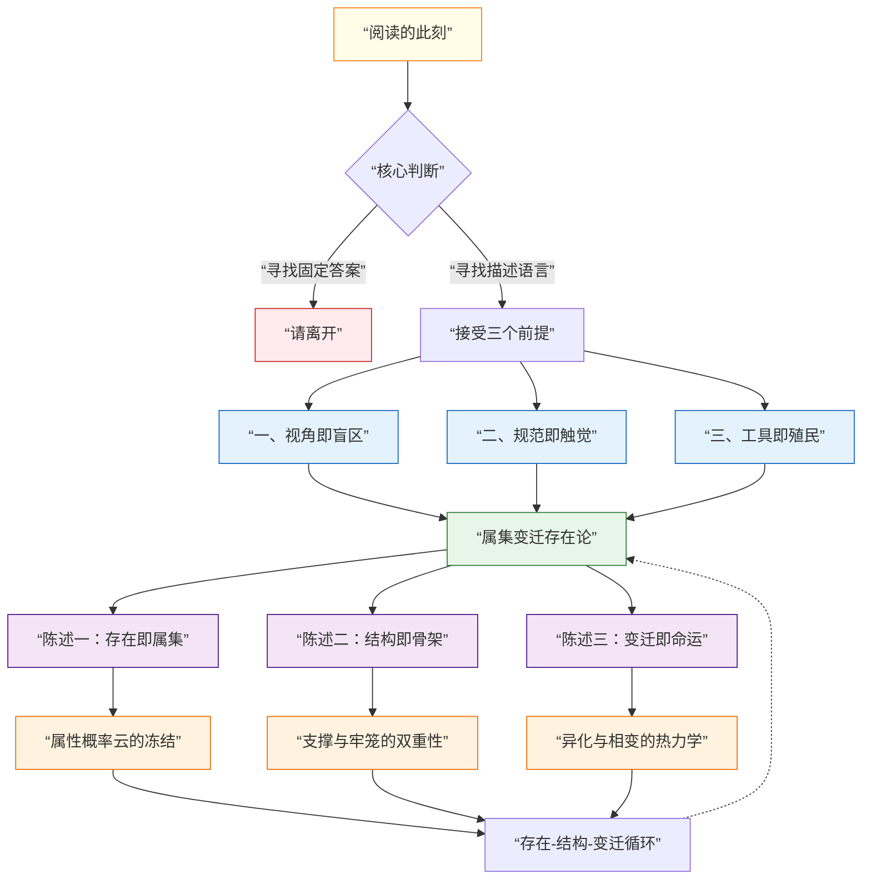
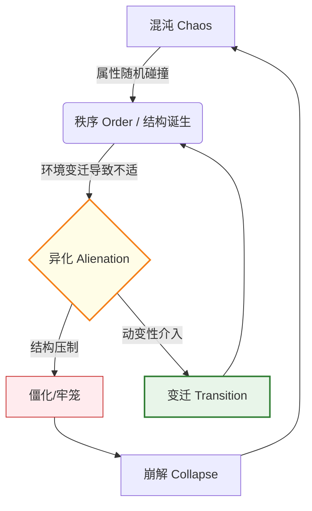

# **属集变迁存在论 (ASTO) 宣言：一门基于跨文化结构同构性的演化哲学**

> **Version**: Γ.14 (The Metaphoric Refactoring)
> **Status**: Living Document
> **作者**: Fuyi (ODDFounder fuyi.it@live.cn)
> **Context**: 这是一份思想行动的完整宣告。它整合了 ASTO 的哲学根基与工程实践。我们不仅解释世界，我们重构它。

---

## **序章：核心隐喻——世界作为代码库**

如果哲学让你感到眩晕，请想象一下你最熟悉的场景：

*   **世界**是一个永不停止 commit 的 **Git 仓库**。
*   **属性 (Attributes)** 是每一行具体的 **代码**。
*   **结构 (Structure)** 是代码形成的 **架构**（MVC, Microservices）。
*   **场域 (Field)** 是代码库的 **生态环境**（依赖库、开发文档、团队文化）。
*   **人** 是那个身兼数职的 **维护者**（程序员 + 架构师 + 伦理委员会）。

在这个隐喻中，**变迁 (Transition)** 不是形而上学的概念，而是具体的 **Refactoring (重构)** 和 **Version Upgrade (版本升级)**。我们面临的永恒困境是：旧架构（为了适应昨天需求而写的）如何在今天的新需求（环境压力）下，不崩溃地演化为新架构。

ASTO，就是这个宇宙级 Git 仓库的 **《维护者指南》**。

---

## **导航图与进入前的三重校准**

在进入前，请凝视这棵从属集根部生长出来的思想之树，并接受三个前提：

### **警告一：视角是单向镜**
你选择戴上人文之眼、哲学之眼或工程之眼时，不仅选择了看见什么，更选择了对什么保持盲视。ASTO不提供“完整真相”，只提供三副互补的滤镜。

### **警告二：规范是触觉**
规范不是文档里没人看的条文。**规范是 CI/CD 流水线上的红灯，是代码 Review 时同事的皱眉，是遗留系统里那个没人敢动的 `util.js`。** 我们不给世界立法，只让你听见“那阵让你沉默的风来自哪个方向”。

### **警告三：工具会殖民**
五态、六阶、螺旋……它们精美如手术刀。但所有模型都在做两件事：简化世界以装入你的颅骨，重塑你的颅骨以匹配模型的形状。**抛弃理论。回归你鲜活、具体、未经解释的颤栗。**

---

## **宣告：我们是谁？**

**我们是一群架桥者。**
我们诞生于代码与现实的断裂处，成长于系统崩溃与重构的阵痛中。我们既不是空想的哲学家，也不是盲目的工匠。我们是**工程师哲学家**——在键盘上敲击逻辑，在逻辑中凝视存在，在存在中承担责任的实践者。

**我们反对**：
- 将世界视为静态蓝图的**设计论**
- 将人类意志凌驾于演化规律的**狂妄**
- 在复杂系统面前或陷入空谈或埋头盲干的**分裂症**
- **将结构性问题归咎于具体个人的道德审判**（ASTO 只批判僵化的结构，不审判被结构裹挟的人）

**我们主张**：
- 谦卑地**理解**结构与约束
- 勇敢地**介入**变迁与重组
- 负责任地**架设**从此岸到彼岸的通道

---

## **核心图腾：一元·五态·六阶·七序**

ASTO 的宇宙观可以压缩为四个数字：**1-5-6-7**。

### **1. 一元 (The One) —— 属集 (存在)**
*   **对应**：**“存在” (Being)**
*   **定义**：世界没有实体，只有属性的集合。
*   **隐喻**：**“大地”**。一切存在的基质。

### **2. 五态 (The Five) —— 形态 (空间)**
*   **对应**：**“变迁的空间相” (Morphology)**
*   **序列**：**自在 -> 共识 -> 编码 -> 物化 -> 定向**。
*   **隐喻**：**“河流”**。存在流过不同的河道，呈现不同的形状。

### **3. 六阶 (The Six) —— 动力 (时间)**
*   **对应**：**“变迁的时间相” (Dynamics)**
*   **序列**：**混沌 -> 秩序 -> 流变 -> 脉冲 -> 崩解 -> 变迁**。
*   **隐喻**：**“波浪”**。河流中起伏的动力学波形。

### **4. 七序 (The Seven) —— 介入 (行动)**
*   **对应**：**“变迁的介入相” (Intervention)**
*   **序列**：**识别 -> 定义 -> 编码 -> 执行 -> 验证 -> 维护 -> 弃置**。
*   **隐喻**：**“螺旋”**。在波浪中冲浪与造船的技艺。

> **记忆口诀**：
> **守一元之土，**
> **观五态之流，**
> **察六阶之变，**
> **行七序之工。**

---

## **第一部分：思想渊源——结构同构性的发现**

ASTO 不是“东西方文化的拼盘”，而是我们在工程实践中，发现了不同文明代码底层共享的**“元语言”**。

### **1.1 古代智慧的结构同构**
- **赫拉克利特**的“万物皆流”与**代码版本控制**（Git）同构：世界是流动的 Commit 链。
- **《易经》** 的“变易”与**系统动力学**同构：阴阳是二元状态机（Binary State Machine）的古老表达。
- **佛家**的“缘起性空”与**面向对象编程**同构：对象（Object）本身是空的，它只是属性（Properties）和方法（Methods）的暂时聚合（属集）。

### **1.2 近代哲学的突破**
- **康德**的“哥白尼式革命”让我们认识到：规范作为认知结构，决定了我们能看见什么。
- **黑格尔**的辩证法提供了“正-反-合”的演进模式，对应我们的“秩序-异化-变迁”动力模型。
- **马克思**的异化理论让我们深刻认识到：社会结构如何从支撑变为牢笼（Legacy Code 如何变成技术债）。

### **1.3 现代思想的整合**
- **怀特海**的过程哲学强化了我们的“存在即过程”信念。
- **维特根斯坦**的语言游戏说让我们理解规范作为“生活形式”的实质。
- **复杂系统科学**与**控制论**为我们提供了理解多层级、自组织系统的工具。

### **1.4 工程实践的淬炼**
我们在**ODD（开放·分布·动态）工程实践**中，反复遭遇理论与现实的断裂：
- 设计完美的系统在实践中必然崩溃（熵增）。
- 为保障秩序而设定的规则常成为创新的枷锁（异化）。
- 系统升级如同外科手术，风险极高（变迁）。

**正是在这些具体而微的“崩溃”现场，我们将哲学思辨锻造成可用的工具。**

---

## **第二部分：核心定义与三大陈述**

### **2.1 陈述一：存在即属集 (Existence is Attribute-Set)**

**核心命题**：我们并非生活在坚固的实体之中，而是生活在属性暂时聚合的 **“属集”** 之中。**世界没有名词，只有形容词的集合。**

> **工程深度定义：属性的边界**
> 在工程中，如何识别“属性”？
> *   **显性属性**：API 签名、数据库 Schema、配置文件。这是代码的“肉体”。
> *   **隐性属性**：响应延迟、吞吐量、依赖关系的稳定性。这是代码的“体征”。
> *   **元属性**：代码的可读性、可测试性。这是代码的“灵魂”。
> ASTO 认为，**凡是能被命名的、能影响系统维持或变迁的特征，皆为属性。**

> **工程隐喻：User 不是实体**
> 我们习惯定义 `class User`，以为 User 是一个实体。但在 ASTO 看来，`User` 只是 `id`、`email`、`role` 等属性在当前业务上下文中的临时聚合。一旦关键属性（如 `isActive`）被环境剥离，这个对象在鉴权系统中的“存在”即刻崩解。

**展开阐述**：
- **从实体到属性的坍缩**：量子力学揭示，剥离自旋、质量等属性，“电子”不存在。社会学揭示，剥离契约、共识等属性，“公司”不存在。
- **存在即抗噪**：每个属集都是对抗熵增的临时堡垒。维护它，或者重构它，是文明的唯一任务。

### **2.2 陈述二：结构即骨架 (Structure is Skeleton)**

**核心命题**：是什么在维持属集不散？是**“结构”——维持属集存在的最小内耗构型**。

> **工程隐喻：单体架构的牢笼**
> 为什么单体架构后来变成了牢笼？因为原本为了“支撑”业务快速上线而写的硬耦合（结构），在业务规模变迁后，变成了“阻力最大”的路径。结构一旦长成，就倾向于维持自身。

**展开阐述**：
- **支撑与牢笼的双重性**：没有骨架，肉体无法站立（存在无法显现）；但骨架一旦长成，就限制了生长方向（路径依赖）。
- **结构的生成（鲁迅的草坪）**：结构不是谁规定的，是当前环境下**阻力最小**的那条路径（脚与土的千万次磨合）。

### **2.3 陈述三：变迁即命运 (Transition is Fate)**

**核心命题**：没有永恒的骨架，因为没有永恒的环境。变迁不是选择，是热力学的强制命令。

> **工程隐喻：技术债的报复**
> 当流量（环境）激增100倍，原本“够用”的同步读写（旧结构）突然变成了导致雪崩的元凶。此时，必须进行架构重构（变迁）。如果不主动变迁，系统就会选择“崩溃”来响应环境压力。

**展开阐述**：
- **异化的必然性**：当环境剧变，原本“阻力最小”的路径变成“阻力最大”的障碍。旧的保护层变成新的束缚衣。
- **跃迁公式**：$$ \text{变迁压力} = \frac{\text{环境变化速率} (V_e)}{\text{结构适应速率} (V_n)} $$。如果压力 > 1，系统震荡；如果结构僵化，系统崩溃。

---

## **第三部分：理论体系展开——ASTO的完整框架**

### **3.1 动力学图谱：存在-异化-变迁循环**

ASTO 的核心动力学并非线性，而是一个永恒的循环：

### **3.2 场域的度量：阻抗分布 (Impedance Distribution)**

场域往往被认为是玄虚的，但在 ASTO 中，场域是可以被工程化度量的。

*   **场域 = 阻抗分布图 (Resistance Map)**。
*   想象你在推行一个新政策（或部署一个新功能）。在某些方向上，你推得很快（低阻抗）；在某些方向上，你寸步难行（高阻抗）。
*   这种**“什么容易做，什么难做”的空间分布状态**，就是场域。
*   **社会学度量**：关系网络的密度、观念的排斥力、信息的传递速率，都是度量社会场域阻抗的指标。

### **3.3 工程映射表：ASTO 有什么用？**

| ASTO概念 | ODD工程实践 | 社会系统对应 |
| :--- | :--- | :--- |
| **属集** | 系统当前状态 (State) | 社会现状 |
| **结构/规范** | 架构设计、协议 (Protocol) | 法律、制度 |
| **规范负债** | **技术债 (Tech Debt)** | 制度僵化、矛盾积累 |
| **动变性对话平台** | **CI/CD, Migration Scripts** | 改革路径、过渡政策 |
| **变迁/跃迁** | **Refactor, Version Upgrade** | 转型、革命 |
| **环境压力** | 用户量暴增、需求变更 | 生产力发展、气候变化 |

---

## **第四部分：结构性张力与冲突裁决**

ASTO 并不粉饰太平。我们承认，基元（如新技术的生产力）的演化往往会残酷地冲击禁元（如旧道德的边界）。

### **4.1 极端张力案例：工业革命与 AI**
*   **工业革命**：机器生产力（基元演化）粉碎了田园牧歌式的家庭结构（旧禁元）。这不仅是技术的胜利，也是旧伦理的崩塌。
*   **AI 时代**：生成式 AI（基元）正在冲击“肖像权”、“人类创作的尊严”（禁元）。
*   **ASTO 的立场**：面对这种张力，**单纯的“熔断”往往无效**。我们必须启动 **定向维 (Oriented Dimension) 的修订**——重新定义什么是“创作”，什么是“隐私”。这是一种**痛苦但必要的文明重构**。

### **4.2 裁决的程序正义**
当冲突发生时，谁来裁决？
ASTO 反对依赖“圣人”的独断，主张 **程序正义 (Procedural Justice)**。
*   **NCP (规范共识协议)**：建立一套公开的、可验证的冲突解决流程。
*   **治理隐喻**：这就像开源社区的 **Merge Request (MR)** 流程。冲突不是为了消灭对方，而是为了 **Merge (合并)** 出更健壮的共识。

---

## **第五部分：行动纲领与工程化反思**

我们不只提供解释，我们要求行动。

### **5.1 诊断与手术（短期）**
*   **成为“翻译者”**：用 ASTO 透镜审视你的项目。哪里是“自在态”的黑盒？哪里的“规范负债”已经爆表？
*   **成为“医生”**：在关键节点设计“变迁对话平台”。不要只写新功能，要写**数据迁移脚本**，要设计**灰度发布策略**。

### **5.2 工程化反思：反僵化元规范 (Anti-Rigidity Meta-Norms)**
知行合一不仅仅是个人的修炼，更应固化为系统的**元规范**。
为了防止系统（无论是代码还是组织）僵化，我们必须在设计之初就埋入**“自我质疑”的机制**：

1.  **代码的“死亡开关”**：为所有临时解决方案（Workaround）设定强制的 `TODO` 到期日。过期不改，CI 报错。
2.  **重构季 (Refactoring Season)**：像财务季度审计一样，设立法定的“技术债偿还期”。在此期间，停止新功能开发，专门处理熵增。
3.  **混沌工程 (Chaos Engineering)**：主动引入故障，测试系统的弹性。这不是搞破坏，这是**给系统注射疫苗**。

### **5.3 长期愿景（文明重塑）**
我们终极的目标，是让“属集思维”与“变迁意识”渗透进文明的骨髓：
- 当政策制定者**本能地**考虑制度的演化适应性。
- 当技术工程师**自觉地**为系统设计优雅的退出路径。
- 当每一个体**坦然地**理解生活阶段的更迭是生命的自然律动。

**那时，我们将从一个恐惧变化、在崩溃中被动革命的文明，成长为一个拥抱流动、在持续调适中主动演化的文明。**

### **5.4 给实践者的第一个任务**

> **请打开你现在的项目，找到一个让你觉得“别扭”但又“不敢动”的代码模块。**
> 1.  **解构**：它由哪些属性（变量、依赖）支撑？
> 2.  **溯源**：它最初是为了适应什么环境（当时的业务需求）而生成的结构？
> 3.  **判断**：现在的环境变了吗？它是支撑，还是已经异化为牢笼？
> 4.  **行动**：如果它是牢笼，请不要暴力拆除。请设计一个“对话平台”（Adapter或中间层），让它安全地过渡到新形态。

---

## **结语：架桥者的誓言**

我们知晓，没有一座桥是永恒的。
我们建造，不是为了被铭记，而是为了让人**安全地渡过此刻的湍流**。

世界在变迁。恐惧者筑墙，迷茫者随波，狂妄者妄图截断江河。
而我们，**选择架桥**。

**(此宣言是一个活着的属集，将在演化中持续重构。)**
