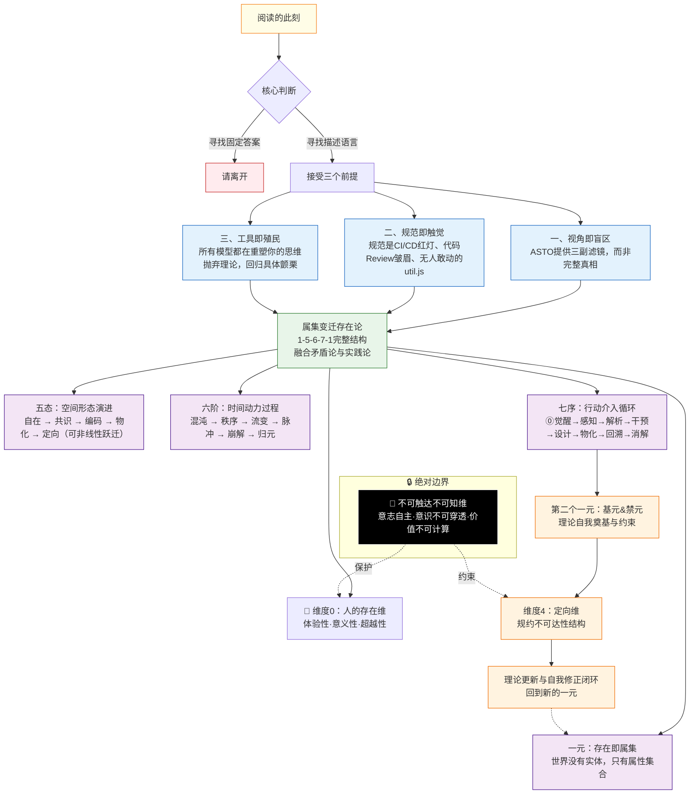
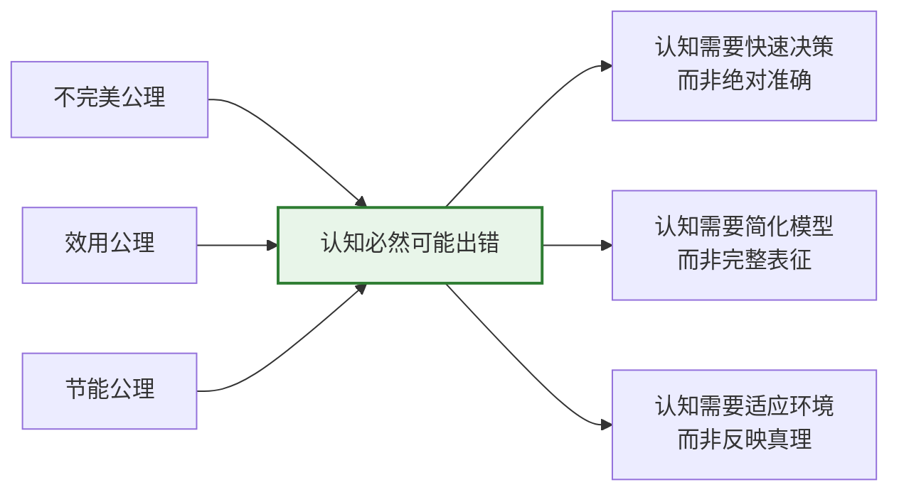
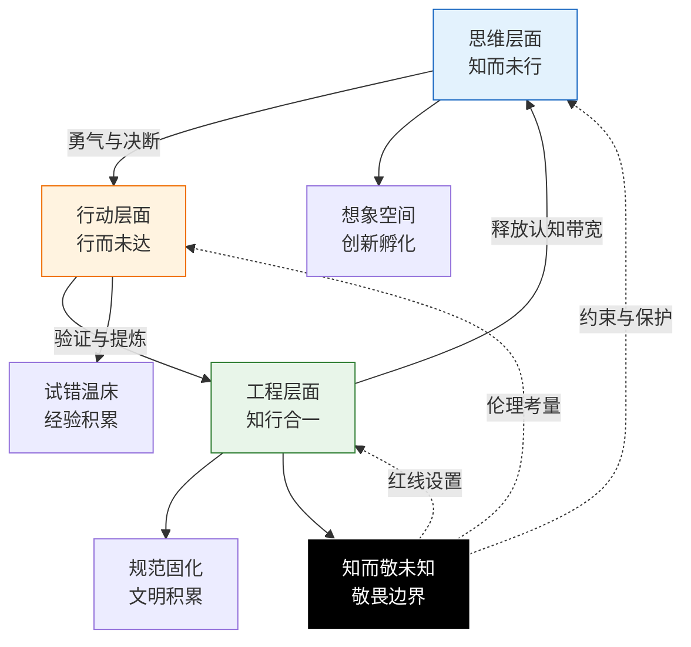
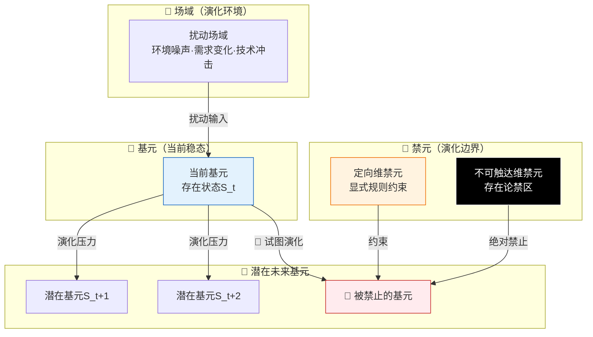
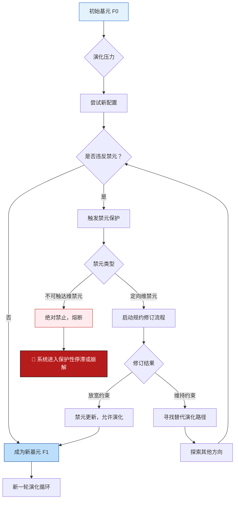

# **ASTO03.属集变迁存在论 (ASTO) 宣言：基于跨文化结构同构性的演化哲学**

> **Version**: Γ.26 (缺陷作为创造力：从不完美公理到工程实践)
> **Status**: Living Document
> **作者**: Fuyi (ODDFounder [fuyi.it@live.cn](mailto:fuyi.it@live.cn))
> **Context**: 一份思想行动的完整宣告，整合哲学根基、动力学机制、价值论基础与工程实践。

---

## **0. 双轨制声明：工具箱与伦理宣言的明确分离**

> **"ASTO由两部分组成：工具箱（免于哲学审查）与伦理宣言（接受哲学审查）。前者的判准是能否解决问题，后者的判准是能否通过逻辑自洽与伦理辩护。"**

```
┌─────────────────────────────────────────────┐
│              ASTO双轨制结构                              │
├─────────────────────────────────────────────┤
│                                                          │
│  【工具箱】(实用主义认识论工具)                          │
│  ├─ 一元：属集本体                                       │
│  ├─ 五态：形态演进                                       │
│  ├─ 六阶：动力过程                                       │
│  ├─ 七序：行动循环                                       │
│  ├─ 场域：扰动网络                                       │
│  └─ 基元-禁元：演化约束                                  │
│                                                          │
│  判准：**能否帮助解决具体问题**                         │
│  审查方式：工程师的实践反馈                             │
│  免责声明：工具不需要逻辑完美，只需要管用               │
│                                                          │
├───────────────────────────────────────────┤
│                                                          │
│  【伦理宣言】(价值论立场)                               │
│  ├─ 维度0：前存在论条件(自由意志、意识、时间性)         │
│  ├─ 定向维：复数性测试(人性边界守护)                    │
│  ├─ 价值论：美、善、自由的结构定义                      │
│  └─ 防意识形态化约束                                    │
│                                                          │
│  判准：**能否通过哲学审查+伦理可辩护**                  │
│  审查方式：哲学家的批判与公开讨论                       │
│  接受责任：必须回应逻辑自洽性与伦理合理性问题          │
│                                                          │
└───────────────────────────────────────────┘
```

### **为什么要双轨制？**

1. **避免陷阱**：不要求工具箱达到哲学体系的完备性，避免"属集的属集"等自指悖论困扰
2. **明确责任**：在涉及人的存在、价值判断等伦理域时，必须接受严格的哲学审查
3. **维特根斯坦式谦卑**："当一副眼镜卡住了，就换下一副"——工具箱是可更换的透镜，不是绝对真理

### **对读者的提示**
- 如果你是**工程师/实践者**：主要使用工具箱部分，以"是否有效"为标准
- 如果你是**哲学家/批判者**：重点审查伦理宣言部分，工具箱部分欢迎但不强求哲学完备性
- 如果你是**政策制定者/组织管理者**：两部分都需要关注，工具箱提供分析框架，伦理宣言提供价值边界

---

## **0.1 符号载体的代际变迁：ASTO作为介质学**

> **"人类文明的每一次跃迁，都伴随着交流介质的代际革命。ASTO不仅是存在论，更是介质学——研究存在如何通过不同介质显现，以及介质如何重构存在本身。"**

### **四代介质革命与社会摩擦系数**

```
┌────────────────────────────────────────────────┐
│           人类交流介质的四代演化与摩擦系数变迁                   │
├───────────────────────────────────────────────┤
│                                                                  │
│  第一代：口头语言 (Oral Language)                                │
│  ├─ 时间：约10万年前至今                                         │
│  ├─ 特性：瞬时、易变、依赖在场、难以跨时空传递                   │
│  ├─ ASTO映射：自在态(纯粹的意义流动，未固化)                      │
│  ├─ 社会摩擦系数：0.95 (极高的传递损耗与误解)                    │
│  └─ 典型冲突：口述历史的失真、"电话游戏"效应                    │
│                                                                  │
│  第二代：符号/文字 (Writing Systems)                             │
│  ├─ 时间：约5000年前至今                                         │
│  ├─ 特性：持久、可复制、脱离在场、跨时空传递                     │
│  ├─ ASTO映射：共识态→编码态(意义的初步固化)                      │
│  ├─ 社会摩擦系数：0.65 (中等损耗，依赖阐释)                       │
│  └─ 典型冲突：经文解释权之争、法律条文的歧义                     │
│                                                                  │
│  第三代：形式化代码 (Formal Code)                                │
│  ├─ 时间：约70年前至今                                           │
│  ├─ 特性：精确、可执行、无歧义、机器可验证                       │
│  ├─ ASTO映射：物化态(意义被强制固化为可执行逻辑)                 │
│  ├─ 社会摩擦系数：0.35 (低损耗，但丧失语义丰富性)                 │
│  └─ 典型冲突：需求与实现的鸿沟、"这不是bug是feature"             │
│                                                                  │
│  第四代：属性集 (Attribute-Sets) ← ASTO的核心贡献                │
│  ├─ 时间：正在涌现                                               │
│  ├─ 特性：结构化、可迁移、动态演化、承载变迁元信息               │
│  ├─ ASTO映射：定向态(不仅固化当前，更编码演化路径)                │
│  ├─ 社会摩擦系数：0.05 (极低损耗，结构自解释)                     │
│  └─ 典型应用：数据迁移脚本、版本管理、架构演化文档               │
│                                                                  │
└─────────────────────────────────────────────┘
```

### **介质革命的三个关键洞察**

#### **洞察一：介质不是中性的管道**
- **麦克卢汉命题**："媒介即信息" (The medium is the message)
- **ASTO强化**：介质不仅传递内容，更**重构内容的可能边界**
- **例证**：
  * 口头文化中不存在"逐字引用"概念
  * 文字文化中难以传递"此时此地的颤栗"
  * 代码文化中无法表达"大概这样就行"
  * 属性集文化中可以编码"如何从A演化到B"

#### **洞察二：介质升级降低社会摩擦系数**

**社会摩擦系数定义**：
$$ \text{CFC}_{\text{social}} = \frac{\text{意义损耗} + \text{协作成本}}{\text{沟通价值}} $$

**代际降低路径**：
```
口头(0.95) → 文字(0.65) → 代码(0.35) → 属性集(0.05)
       ↓             ↓            ↓             ↓
    重复讲述      抄写传播    编译执行      结构迁移
    易失真        需阐释      无歧义        自演化
```

**关键转折点**：
- **文字的发明**：人类第一次能够"死去但思想永存"
- **代码的诞生**：人类第一次能够"让机器执行意图"
- **属性集的涌现**：人类第一次能够"编码变迁本身"

#### **洞察三：介质变迁重构权力结构**

| 介质时代 | 权力掌握者 | 权力基础 | 典型冲突 |
|---------|-----------|---------|----------|
| 口头时代 | 长者/祭司 | 记忆垄断 | 口述历史的篡改 |
| 文字时代 | 僧侣/士大夫 | 识字垄断 | 经典解释权之争 |
| 代码时代 | 程序员/平台 | 实现垄断 | 算法黑箱与数据霸权 |
| 属性集时代 | ? | 结构理解与迁移能力 | 技术债的定价权 |

### **ASTO在介质学中的定位**

**ASTO不是发明新介质，而是**：
1. **揭示介质的本质**：所有介质都是"属性的特定编码方式"
2. **提供迁移语法**：如何在不同介质间转译而不丧失核心结构
3. **预见下一代介质**：当代码无法承载"演化元信息"时，属性集成为必然

**为什么现在需要属性集？**
- **遗留系统危机**：代码无法表达"为何如此设计""如何安全修改"
- **AI时代需求**：需要机器可读的结构语义，而非仅仅是语法
- **文明复杂性爆炸**：社会系统需要"可安全升级的架构"

---

## **1. 导航图与进入前的三重校准**



### **三重警告**

1. **视角是单向镜**：人文、哲学、工程之眼同时提供盲区滤镜，不存在完整真相。
2. **规范是触觉**：规范不是文档条款，而是CI/CD红灯、代码Review皱眉、遗留系统中无人敢动的`util.js`。
3. **工具会殖民**：所有模型都简化世界并重塑思维。抛弃理论，回归具体颤栗。

---

## **2. ASTO 理论体系地图**

```
ASTO理论体系
├── **ASTO04：公理体系**（存在的根本法则）
│   ├── 15条公理 + 19条定理
│   └── 提供最底层的逻辑基础
├── **ASTO03：宣言与框架**（本文件）
│   ├── 1-5-6-7-1核心结构
│   ├── 五维体系：人+4+1维度论
│   ├── 认识论基础（错误必然性→认知重构→知行合一）
│   ├── 动力学基础（扰动场域论）
│   └── 连接公理与实践的桥梁
└── **ASTO05：应用解析**（21个谜题的工程映射）
    ├── 七大视角
    └── 展现理论解释力

**ASTO03的核心功能**：
1. **整合框架**：将公理体系组织为可理解、可操作的认知结构
2. **维度奠基**：明确人的本体论地位与各维度的功能
3. **动力学阐明**：揭示扰动与场域作为系统演化的根本动力
4. **行动宣言**：阐明ASTO的世界观、价值观和行动纲领
```

---

## **3. 认知错误的必然性：存在公理在认知领域的直接体现**

在进入ASTO的认知世界之前，我们必须正视一个根本事实：**人的认知必然可能出错，这不是偶然缺陷，而是由存在的根本法则所决定的。**

这是ASTO与传统认识论的根本分歧点：
- **传统认识论**：认为认知应该追求"不出错"，错误是异常、是缺陷、是需要消除的
- **ASTO认识论**：认为认知必然"会出错"，错误是常态、是特征、是系统正常运作的必然表现

这种认知错误的必然性，直接源于ASTO04公理体系中的三个根本公理：

### **3.1 不完美公理 → 认知先天缺陷**
> **"任何存在都有缺陷，缺陷即存在的方式。"**

* **认知领域的映射**：人的认知作为一种"存在"，同样先天不完美
* **根本启示**：认知不可能达到完美、无偏差的"真理"，这是**存在论上的不可能**
* **积极意义**：认知的"缺陷"不是需要消除的错误，而是**认知得以存在的形态**
* **工程隐喻**：任何测量工具都有精度极限，试图制造"完美测量"违反了不完美公理

### **3.2 效用公理 → 认知不必完美**
> **"存在不必完美，只需有效。效用为正则存，为负则亡。"**

* **认知领域的映射**：认知的目标是效用最大化，而非真理最大化
* **根本启示**：当"足够有效"比"绝对正确"能耗更低时，认知系统会自动选择前者
* **关键洞察**：很多认知"错误"实际上是**效用权衡的结果**——快速但不精确的认知可能在生存中更有效
* **工程隐喻**：启发式算法（heuristics）通过牺牲精确性换取速度和可操作性，这正是效用公理的体现

### **3.3 节能公理 → 认知必然简化**
> **"存在倾向于以最小能耗维持自身。简洁是生存优势。"**

* **认知领域的映射**：认知会自然选择**认知捷径、启发式、简化模型**
* **根本启示**：这些简化必然带来偏差和错误，但这是系统为了节能必须付出的代价
* **关键结论**：追求"完全准确"的认知违反节能公理，在演化中会被淘汰
* **工程隐喻**：缓存机制（caching）通过存储近似值来加速响应，这正是节能公理的体现

### **3.4 三个公理的共同作用：认知错误的必然性**

这三个公理共同作用，产生了一个深刻的结论：

> **在ASTO框架中，人的认知"有可能出错"不是一个需要解决的问题，而是系统正常运作的必然特征。出错的可能性内嵌在认知的结构之中，由存在的基本法则所保证。**

**认知错误不是bug，而是feature。** 它不是认知系统的故障，而是认知系统得以高效运作的设计特性。



### **3.5 传统认知论与ASTO认知论的根本差异**

| 维度 | 传统认识论 | ASTO认知论 |
|------|------------|-------------|
| **认知目标** | 追求真理符合（反映世界本相） | 追求适应性（在环境中有效运作） |
| **错误性质** | 异常、缺陷、需要消除 | 常态、特征、系统设计的必然结果 |
| **认知标准** | 准确性、完整性、一致性 | 有效性、效率、适应性 |
| **演化逻辑** | 渐进逼近真理 | 适应性选择有效模式 |
| **错误意义** | 失败的标志 | 探索的痕迹、创新的可能 |

### **3.6 接受错误必然性的三个实践意义**

1. **解放认知负担**：不必追求"完美认知"，而是追求"足够有效的认知"
2. **重视错误价值**：错误不是纯粹的损失，而是系统探索边界的方式
3. **设计容错系统**：认知系统必须预设错误的发生，并设计相应的容错机制

---

## **4. 认知重构：ASTO中的"知道"是什么？**

理解了认知错误的必然性后，我们才能重新审视一个更根本的问题：**在ASTO框架中，"知道"究竟是什么？**

### **4.1 传统认知论的破产与ASTO的认知革命**

**传统认知论已经失效**，这种失效不是技术性的，而是根本性的：

* **表象主义破产**：认为我们能直接"看到"世界本相 → 但所有感知都是属性筛选的结果
* **表征主义破产**：认为大脑能准确"表征"外部现实 → 但所有表征都是属性压缩的产物
* **基础主义破产**：认为知识有不可动摇的根基 → 但所有根基都是特定场域的暂时稳态

**ASTO的认知革命**：从"真理符合论"转向"结构适应论"

> **核心命题**：在ASTO框架中，"知道"不是拥有关于世界的准确表征，而是**掌握属集在特定场域中的识别-响应模式**。

**公式**：$$ \text{知道} = \text{属性识别} + \text{趋势预测} + \text{介入能力} $$

### **4.2 "知道"的三层解析**

1. **属性识别层面**：能区分关键属性与噪声属性
   * **示例**：经验丰富的工程师能一眼看出代码中的关键问题，而新手只能看到表面语法错误

2. **趋势预测层面**：能预判属性结构的变化方向
   * **示例**：架构师能预测系统在负载增加时的瓶颈位置，提前设计扩展方案

3. **介入能力层面**：能通过行动影响属性重组
   * **示例**：开发者不仅能识别bug，还能通过重构修复根本结构问题

### **4.3 ASTO中"知道"的五个根本特性**

| 特性 | 传统认知论 | ASTO认知论 |
|------|------------|-------------|
| **本体状态** | 静态拥有 | 动态能力 |
| **有效性标准** | 符合客观实在 | 在特定场域有效 |
| **产生机制** | 个体思维过程 | 属集-环境交互 |
| **存在形式** | 心理表征 | 可执行规范 |
| **演进方式** | 渐进积累 | 跃迁重构 |

### **4.4 "知道"在1-5-6-7-1循环中的位置**

**关键洞察**：知道不是循环的起点，而是循环的**中间产物**。它永远**滞后于存在，超前于实践**。

```
一元（存在） 
  ↓ 
五态（形态展开：自在→共识→编码） 
  ↓ 
六阶（动力过程：混沌→秩序→流变） 
  ↓ 
**"知道"在此刻诞生：属性结构被识别并编码** 
  ↓ 
七序（介入循环：基于"知道"进行干预） 
  ↓ 
验证与修正（回到新的一元）
```

知道捕捉的是刚刚过去的存在状态，用于指导即将到来的实践行动。这种**时滞性**正是认知错误的另一个根源：我们总是用过去的模式预测未来的变化。

### **4.5 知道的多重形态：从混沌识别到定向规范**

在ASTO中，"知道"不是单一状态，而是沿着五态演进的多重形态：

#### **4.5.1 自在态知道：模糊识别**
* **形态**：属性结构尚未明确区分
* **表达**："感觉上是这样"
* **可靠性**：低，容易受干扰
* **工程映射**：对代码"坏味道"的直觉感受
* **矛盾论视角**：潜在矛盾的模糊感知

#### **4.5.2 共识态知道：共享识别**
* **形态**：属性结构在群体中被口头约定
* **表达**："大家都这么说"
* **可靠性**：中等，依赖社会共识
* **工程映射**：团队的编码规范（口头约定）
* **矛盾论视角**：矛盾显化为群体共识

#### **4.5.3 编码态知道：形式化识别**
* **形态**：属性结构被明确编码为规则
* **表达**："规则写明是这样"
* **可靠性**：高，但可能僵化
* **工程映射**：ESLint配置中的具体规则
* **矛盾论视角**：矛盾被形式化为对立统一规则

#### **4.5.4 物化态知道：可执行识别**
* **形态**：识别模式被固化为可执行工具
* **表达**："工具自动检查/执行"
* **可靠性**：很高，但可能有盲区
* **工程映射**：CI/CD流水线中的自动化检查
* **矛盾论视角**：矛盾被物化为可执行的检查点

#### **4.5.5 定向态知道：自我修正识别**
* **形态**：识别系统包含自我修正机制
* **表达**："系统知道何时调整规则"
* **可靠性**：自适应，但复杂
* **工程映射**：能根据项目阶段自动调整代码规范的智能系统
* **矛盾论视角**：矛盾的运动被系统性地捕捉和响应

### **4.6 从知道到知识：一个关键的区分**

**知道 (Knowing)**：个体或系统在当下时刻的识别能力（动态过程）
**知识 (Knowledge)**：被固化、可传递的知道模式（静态产物）

在ASTO中：
* **知道是活的过程**，总是在特定情境中展开
* **知识是死的沉淀**，是知道过程的阶段性产物
* 所有知识都源于知道，但知识一旦固化就可能**异化**为知道的障碍

> **警示**：不要将知识误认为知道。知识是地图，知道是实地行走的能力。当地图过时，知道的能力可以创造新地图。

### **4.7 认知重构的实践意义**

1. **从追求正确到追求有效**：评估认知的标准从"是否准确"转向"是否在特定情境中有效"
2. **从消除错误到管理错误**：错误不再是需要根除的敌人，而是需要管理和利用的系统特征
3. **从个体认知到系统认知**：认知能力不再局限于个体大脑，而可以分布、固化在工具、流程和系统中
4. **从静态知识到动态能力**：教育的重点从传授知识转向培养认知能力（属性识别、趋势预测、介入能力）

---

## **5. 知行合一：ASTO 的认识论支柱**

在理解了认知错误的必然性和ASTO中"知道"的本质之后，我们现在可以进入ASTO认识论的核心：**知行合一**。

### **5.1 思维层面：知而未行，想象空间**

**核心特征**：认知停留在思维内部，未转化为外部行动。

#### **5.1.1 表现形式**
- **个人层面**：有想法但未实践，有计划但未执行
- **团队层面**：有讨论但无结论，有共识但无行动
- **组织层面**：有战略但无战术，有愿景但无路径

#### **5.1.2 价值与局限**
- **正面价值**：思维层面是**创新孵化的温床**，允许无成本的想象和探索
- **负面风险**：容易陷入**空想循环**，消耗认知资源而无实际产出
- **工程隐喻**：代码设计稿（只存在于文档中，未实现为实际系统）

#### **5.1.3 ASTO视角**
- **不是缺陷**：思维层面的"知而不行"是**创造性的必要阶段**
- **辩证看待**：需要鼓励思维层面的自由探索，但也要防止过度沉溺
- **跃迁条件**：当思维层面的认知产生足够的创新潜力时，应推动向行动层面跃迁

### **5.2 行动层面：行而未达，试错温床**

**核心特征**：认知转化为行动，但行动效果不确定或未达到预期目标。

#### **5.2.1 表现形式**
- **个人层面**：尝试新方法但效果不佳，学习新技能但尚未掌握
- **团队层面**：实施新流程但遇到阻力，采用新技术但未完全发挥效能
- **组织层面**：推行改革但效果有限，进入新市场但未站稳脚跟

#### **5.2.2 价值与局限**
- **正面价值**：行动层面是**经验积累的实验室**，通过试错发现有效路径
- **负面风险**：可能产生**沉没成本**，反复尝试而无实质性进展
- **工程隐喻**：原型系统（功能有限，性能不稳定，但提供了实际验证）

#### **5.2.3 ASTO视角**
- **试错价值**：行动层面的"行而未达"是**知识生产的必要过程**
- **辩证看待**：需要容忍行动层面的失败，但也要建立有效的反馈机制
- **跃迁条件**：当行动层面的经验积累到一定程度时，应推动向工程层面跃迁

### **5.3 工程层面：知行合一，规范固化**

**核心特征**：认知与行动完全融合，形成可重复、可验证、可传承的规范体系。

#### **5.3.1 表现形式**
- **个人层面**：技能内化为本能反应，形成个人工作方法论
- **团队层面**：最佳实践固化为团队流程，建立质量标准体系
- **组织层面**：成功经验编码为组织能力，形成核心竞争优势

#### **5.3.2 价值与局限**
- **正面价值**：工程层面是**文明积累的容器**，实现知识的跨代际传递
- **负面风险**：可能产生**路径依赖**，固化的规范阻碍新的创新
- **工程隐喻**：生产系统（稳定、可靠、可扩展，支持大规模应用）

#### **5.3.3 ASTO视角**
- **固化与超越**：工程层面的"知行合一"既是**认知的完成形态**，也是**新一轮认知的起点**
- **辩证看待**：需要建立工程层面的规范体系，但也要保留突破规范的通道
- **循环机制**：工程层面的规范为思维层面的创新提供基础，思维层面的创新为工程层面的更新提供动力

### **5.4 第四境界：知而敬未知——不可触达层的智慧**

**核心特征**：认识到认知的边界，主动保留不可触达领域，保持对未知的敬畏。

#### **5.4.1 表现形式**
```
┌─────────────────────────────────────────────┐
│        【认知的四重境界：从控制到敬畏】         │
├─────────────────────────────────────────────┤
│                                                │
│  境界一：知而可行（工程层）                    │
│      · 将已知固化为规范                        │
│      · 追求确定性与效率                        │
│                                                │
│  境界二：知而慎行（伦理层）                    │
│      · 考虑行动的长期后果                      │
│      · 引入风险评估与减缓机制                  │
│                                                │
│  境界三：知而止行（边界层）                    │
│      · 识别"不应为"的领域                      │
│      · 即使技术上可行，也主动放弃              │
│                                                │
│  境界四：知而敬未知（不可触达层）              │
│      · 承认有些领域永远不应触及                │
│      · 保持对不可知事物的敬畏                  │
│      · 为自由、神秘与奇迹保留空间              │
└─────────────────────────────────────────────┘
```

#### **5.4.2 工程映射**
- **上帝模式注释**：在代码中标记"此处永远需要人类理解"
- **伦理熔断机制**：在AI系统中设置不可绕过的伦理审查
- **技术自我限制**：主动放弃某些技术应用（如基因编辑的生殖应用）

### **5.5 三层递进的动态关系**



### **5.6 知行合一在ASTO理论体系中的核心地位**

**知行合一是ASTO理论体系的枢纽**，它：

1. **连接存在与认知**：将存在论公理（特别是认知错误的三个根源）与认知论实践连接起来
2. **指导实践跃迁**：提供从思维到行动再到工程的清晰路径
3. **平衡缺陷与创造**：既承认认知缺陷的必然性，又提供超越缺陷的方法
4. **实现理论闭环**：使ASTO理论本身成为可执行、可验证、可修正的认知-实践系统

### **5.7 知行合一的实践指导**

#### **5.7.1 对于个人**
- **思维层面**：培养好奇心，允许自己"胡思乱想"
- **行动层面**：勇于尝试，容忍自己的"不完美行动"
- **工程层面**：将成功经验固化为个人方法论，建立个人知识体系
- **敬畏层面**：明确自己绝不愿被触碰的底线，守护精神自主权

#### **5.7.2 对于团队**
- **思维层面**：建立开放讨论的文化，鼓励创新想法
- **行动层面**：建立快速试错机制，从失败中学习
- **工程层面**：将团队最佳实践固化为流程和工具
- **敬畏层面**：建立团队伦理准则，保护成员尊严与隐私

#### **5.7.3 对于组织**
- **思维层面**：投资研发和探索性项目
- **行动层面**：建立创新孵化机制，支持内部创业
- **工程层面**：将组织能力编码为可复制的业务模式
- **敬畏层面**：设立独立伦理委员会，明确技术应用红线

---

## **6. 宣告：结构性处境**

我们身处代码与现实断裂处，系统在崩溃与重构中呼吸。

**反对**：

* 将世界视为静态蓝图的设计论
* 将人类意志凌驾于演化规律的狂妄
* 面对复杂系统的空谈或盲干
* 将结构性问题归咎个人道德
* 将技术扩张视为无伦理边界的进步

**倡导**：

* 谦卑理解结构与约束
* 勇敢介入变迁与重组
* 架设通道以保障结构性条件
* 守护不可触达的人性领域
* 在扰动中编织更美好的场域

---

## **7. 系统心脏：以人为中心的1→5→6→7→1实践循环**
### **7.0 属集变迁存在论（ASTO）的定义**
> **属集变迁存在论（Attribute-Set Transition Ontology，简称ASTO）** 是一种以 **属性集合** 为存在基本单元的演化哲学体系，其核心命题包含三个部分：
>
> 1. **存在即属集**：世界的本质不是实体，而是 **属性集合**（Attribute-Sets）；
> 2. **结构即骨架**：属性之间形成 **结构**，这些结构既 **支撑** 存在的稳定性，也 **约束** 存在的可能性；
> 3. **变迁即命运**：系统的 **变迁** 不是可选项，而是矛盾不可调和的 **必然结果**，受热力学定律驱动。
>
> 该理论通过 **1-5-6-7-1** 核心框架（一元·五态·六阶·七序·基元/禁元）描述存在的形态演进、动力过程与实践介入，旨在为工程、社会与认知系统提供 **结构性理解** 与 **演化性介入** 的方法论。


### **7.1 循环全景：理论自我修正的生命之环**

```
             🧑 人的存在维（维度0）
            （体验性·意义性·超越性）
                   /          |          \
       体验性/      意义性        \超越性
               /             |               \
            /                |                 \
    ┌─────────────────────────────────────┐
    │         四维实践流形在人中展开           │
    ├─────────────────────────────────────┤
    │                                      │
    │  维度1（五态）← 人赋予意义           │
    │  维度2（六阶）← 人打破必然           │
    │  维度3（七序）← 人提供动力           │
    │  维度4（定向）← 人立法价值           │
    │                                      │
    └─────────────────────────────────────┘
                      |
                      ↓
            🔒 不可触达不可知维
            （保护人不被系统反噬吞噬）
```

#### 属集变迁存在论 (ASTO)   人+4+1维结构
```
┌────────────────────────────────────────────┐
│ 元层 (Meta-layer): 一元                     │
│ - 本体基底，非维度                          │
│ - 提供"基元与禁元"的终极约束                │
└────────────────────────────────────────────┘
    ↓ (展开为)
┌────────────────────────────────────────────┐
│ 四维流形 (4D Manifold)                      │
 |   ├─ 维度1：存在形态维（五态）→ 空间性、并列性
 |   ├─ 维度2：变迁阶段维（六阶）→ 时间性、连续性
 |   ├─ 维度3：实践操作维（七序）→ 行动性、落地性
 |   └─ 维度4：约束校准维（定向维）→ 规则性、元层级
└────────────────────────────────────────────┘
    ↓ (受约束于)
┌────────────────────────────────────────────┐
│ 风险层 (Risk Boundary)                      │
│ - 不可算法区: 人/意志/伦理/私密体验         │
│ - 防止维度坍缩为纯算法                      │
└────────────────────────────────────────────┘

这是一个 4+1 维系统:
- 元维(一元): 本体论基底，超越维度
- 4维流形: 五态×六阶×定向维×七序(工程实践中就是一个管道)
- +1边界: 风险层/不可算法区
```

### **7.2 五维耦合动力学：以"人"为中心的交互**

#### **7.2.1 交互1：人 ⟷ 五态**
人通过"意义赋予"激活五态的转换。没有人的在场，属性集合只是自在存在，无法获得社会意义。

#### **7.2.2 交互2：人 ⟷ 六阶**
人通过"自由意志"打破六阶的决定论循环。人的干预可以在混沌阶注入设计、在秩序阶触发消解、在流变阶制造脉冲。

#### **7.2.3 交互3：人 ⟷ 七序**
人是七序的"意义源泉"。算法的操作是"无意义的形式推演"，而人的操作总是嵌入在"意义世界"中。

#### **7.2.4 交互4：人 ⟷ 定向维**
人是定向维的"价值立法者"。规约层的规则来自人的价值判断，自指层的悖论需要人的"活的理性"处理。

---

## **8. 核心图腾：ASTO五维结构详解**

### **8.0 维度0：人的存在维——系统的基石与意义源泉**

#### **8.0.1 人的三重存在性**

```
🧑 人的三重存在性：

┌─────────────────────────────────────────┐
│ (1) 体验性存在 (Experiential Being)     │
├─────────────────────────────────────────┤
│  · 第一人称意识 (qualia)                │
│    - "看到红色"的主观感受               │
│    - 疼痛、快乐的不可传递性             │
│    - 此时此地的"我在"(Dasein)           │
│                                          │
│  · 时间性 (temporality)                 │
│    - 过去的记忆-当下的决断-未来的筹划   │
│    - 有限性意识（向死而生）             │
│    - 不可逆的生命历程                   │
│                                          │
│  · 具身性 (embodiment)                  │
│    - 身体不是工具，是存在方式           │
│    - 饥饿、疲倦、欲望的肉身性           │
│    - 空间定位的身体中心性               │
└─────────────────────────────────────────┘

┌─────────────────────────────────────────┐
│ (2) 意义性存在 (Meaning-Making Being)   │
├─────────────────────────────────────────┤
│  · 解释学循环                           │
│    - 人不仅感知世界，更赋予其意义       │
│    - 同一事件对不同人有不同意义         │
│    - 意义不可被算法完全形式化           │
│                                          │
│  · 价值判断                             │
│    - 善恶、美丑的直觉判断               │
│    - 不能被简化为效用函数               │
│    - 价值冲突中的权衡与痛苦             │
│                                          │
│  · 叙事性自我                           │
│    - 人通过讲述故事理解自己             │
│    - "我是谁"不是数据，是叙事           │
│    - 身份的建构与重构                   │
└─────────────────────────────────────────┘

┌─────────────────────────────────────────┐
│ (3) 超越性存在 (Transcendent Being)     │
├─────────────────────────────────────────┤
│  · 自由意志                             │
│    - 在因果链中插入"无因之因"           │
│    - 即使在约束下仍可选择态度           │
│    - 责任的根源                         │
│                                          │
│  · 创造性                               │
│    - 产生真正新颖之物的能力             │
│    - 不仅重组，更能"无中生有"           │
│    - 艺术、灵感的涌现                   │
│                                          │
│  · 伦理维度                             │
│    - "应当"不可从"是"推导               │
│    - 良知的绝对命令                     │
│    - 对他者的责任感                     │
└─────────────────────────────────────────┘
```

#### **8.0.2 人与四维的接口**
- **人 → 五态**：通过意义赋予，将自在态转化为共识态
- **人 → 六阶**：通过自由意志，触发脉冲阶的突变
- **人 → 七序**：作为不可替代的操作主体
- **人 → 定向维**：作为价值判断的最终裁决者

#### **8.0.3 关键特性**
- 人的存在维 **不可被其他四维还原**
- 人不是"使用系统的外部用户"
- 人是"系统得以有意义的内在基础"

### **8.1 一元 (The One) —— 属集**
* **定义**：世界没有实体，只有属性集合。
* **矛盾映射**：属性聚合与离散对立统一。
* **实践映射**：实践对象的物质性基础。
* **隐喻**：大地。

### **8.2 五态 (The Five) —— 形态（空间）**

**核心序列**：自在 → 共识 → 编码 → 物化 → 定向

**态迁自由度公理** (德勒兹-怀特海综合)：
```
五态之间存在三种迁移模式：

1. 【主通道】正向序列 (标准路径)
   自在 → 共识 → 编码 → 物化 → 定向
   · 过程特征：渐进、可控、能耗低
   · 例：科学理论的形成 → 学界共识 → 教科书 → 实验室 → 政策

2. 【旁路】短路跃迁 (加速路径)
   · 物化 ⇢ 定向 (跳过共识/编码)
     例：3D打印直接从技术进入立法规管
   · 编码 ⇢ 物化 (跳过共识)
     例：比特币从算法直接到矿机
   · 共识 ⇢ 定向 (危机响应)
     例：疫情下的紧急立法

3. 【禁止迁移】热力学约束 (不可逆方向)
   × 物化 ↛ 自在 (熟鸡蛋不能变回生鸡蛋)
   × 定向 ↛ 共识 (法律不能退回口头约定)
   × 编码 ↛ 自在 (代码不能"忘记"为模糊直觉)

关键洞察：
· 五态不是线性阶段，而是具有多条路径的相空间
· 保留'态'而非'域'，强调过程的不可逆性 (怀特海)
· 允许旁路跃迁，体现多路径性 (德勒兹)
```

* **矛盾映射**：潜在→显化，特殊→普遍，次要→主要
* **实践映射**：认识深化过程
* **隐喻**：河流 (多渠道，但水不能回流)

### **8.3 六阶 (The Six) —— 动力（时间）**

**核心序列**：混沌 → 秩序 → 流变 → 脉冲 → 崩解 → 归元

**物理判据映射** (耗散结构理论对应)：
```
┌────────────────────────────────────────┐
│ 阶段    | 物理状态       | 可测量指标            | 工程类比            │
├─────────────────────────────────────────┤
│ 混沌    | 远离平衡、高熵 | 熵增速率 dS/dt > 0    | 初创公司的混乱期  │
│        | 无序状态         | 系统相关长度→∞      |                      │
├────────────────────────────────────────┤
│ 秩序    | 远离平衡、低熵 | 熵产生率 σ = dS/dt  | 成熟产品的稳定运营│
│        | 耗散结构         | 序参量 R > R_c        |                      │
├────────────────────────────────────────┤
│ 流变    | 亚稳态扰动       | 扰动振幅 ΔR/R        | 市场竞争压力下的调整│
│        | 线性响应         | 弛性时间 τ            |                      │
├──────────────────────────────────────────┤
│ 脉冲    | 相变临界         | 控制参数 λ → λ_c   | 破坏性创新/危机爆发 │
│        | 非线性跃迁       | Lyapunov指数 > 0     |                      │
├────────────────────────────────────────┤
│ 崩解    | 失稳雪崩         | 结构崩塍速率 v      | 公司破产/系统崩溃    │
│        | 突破临界         | 最大Lyapunov指数>>0  |                      │
├──────────────────────────────────────────┤
│ 归元    | 重返平衡         | dS/dt → 0 (新稳态) | 后危机时代的重建  │
│        | 新耗散结构     | 系统记忆编码入结构 |                      │
└─────────────────────────────────────────┘

关键理论对应：
· Prigogine耗散结构理论：秩序阶是远离平衡的自组织状态
· 混沌理论：Lyapunov指数度量脉冲阶的淝效应
· 热力学第二定律：混沌→秩序需要能量流输入，崩解使熵增
```

* **矛盾映射**：生成→发展→激化→转化→解决→再生
* **实践映射**：阶段性实践特征
* **隐喻**：波浪 (从平静→涧涌→破碎→归平)

### **8.4 七序 (The Seven) —— 介入（行动）**

**第0序：居身 (Dwelling)** —— 七序的存在论前提
```
┌──────────────────────────────────────┐
│       第0序：居身 —— 不是一个步骤，而是舞台           │
├────────────────────────────────────────┤
│                                                      │
│  定义：作为身体-存在的人，已经在世界中            │
│  · 不是"先有主体，再去感知"，而是                   │
│  · **主体通过居身而存在，感知是居身的展开**       │
│                                                      │
│  梅洛-庹蒂语录：                                    │
│  > "我身故我在。身体不是工具，是存在方式。     │
│  >  感知者与被感知者同时显现。"                │
│                                                      │
│  与七序的关系：                                    │
│  ├─ 居身 = 舞台，七序 = 舞蹈                       │
│  ├─ 居身不参与循环，是循环发生的前提            │
│  └─ 没有居身，感知无从发生                         │
│                                                      │
│  代码类比：                                          │
│  class Agent：                                        │
│      def __init__(self)：  # 这是"居身"             │
│          self.body = Body()                          │
│          self.context = WorldContext()              │
│      def perceive(self)： pass  # 第1序             │
│                                                      │
│  __init__不是"第8个方法"，而是**所有方法的前提**   │
│                                                      │
└─────────────────────────────────────┘
```

**核心七序** (在居身的基础上展开)：
* **前置**：⓪觉醒（Awaken）——意识到自己正身处属集变迁之中，并决定主动介入。
* **序列**：感知 → 解析 → 干预 → 设计 → 物化 → 回溯 → 消解
* **矛盾映射**：发现→分析→抓主要→方案→实践→检验→清理
* **实践映射**：实践-认识-再实践闭环
* **隐喻**：舞台上的船与螺旋 (舞台=居身,船=七序)

### **8.5 基元与禁元：存在的稳态与演化约束**

#### **8.5.1 基元 (Fundamental)：存在的当前稳态**

基元不是永恒不变的理论基础，而是**存在的当前相对稳定状态**——属集在特定环境下维持自身的动态平衡点。

**基元的三重特征：**

| 维度 | 定义 | 示例 |
|------|------|------|
| **本体论层面** | 存在的相对稳定状态——属集在特定环境下维持自身的动态平衡点 | 生态系统当前的物种平衡、社会制度当前的有效运行、软件系统当前的稳定版本 |
| **性质特征** | **可变、可演化、依赖环境**；是存在「当前是什么」的锚点 | 操作系统从Windows 7演化到Windows 11，每个版本都是一个基元 |
| **工程映射** | 系统的当前稳态（如：v1.0 的正常运行状态） | 生产环境的当前部署版本、数据库的当前模式、团队的当前工作流程 |

**基元的动态本质：**
```
基元不是静态的"真理"或"基石"，而是：
1. 在特定时间窗口内的稳定配置
2. 在当前环境约束下的最优适应
3. 在扰动与抗扰动之间的暂时平衡
4. 下一轮演化的起点，而非终点
```

**关键洞察**：追求"永恒的基元"是违反熵增公理的幻想。基元的**价值恰恰在于其可演化性**。

#### **8.5.2 禁元 (Taboo)：基元演化的约束边界**

禁元不是独立于基元的"禁止列表"，而是**定向维与不可触达维对基元演化方向的联合约束**。

**禁元的三重来源：**

| 来源维度 | 定义 | 示例 |
|----------|------|------|
| **定向维约束** | 显式规则定义的基元不可越界区域 | "数据库不能丢失交易记录"、"系统不能响应超过500ms" |
| **不可触达维约束** | 存在论上基元绝不能触碰的绝对禁区 | "不能量化人类尊严"、"不能消除自由意志"、"不能穿透意识隐私" |
| **复合约束** | 两者交织形成的复杂边界 | "AI不能用于自主杀人武器"（既有定向维的规则约束，也有不可触达维的伦理约束） |

**禁元的本质：**
> **禁元 = 定向维约束 + 不可触达维约束**

禁元**不是独立的存在**，而是**基元的边界条件**。它定义了：
1. **基元不能变成什么**（演化方向的禁区）
2. **基元在演化中必须避免的状态**
3. **即使环境压力极大，也绝不能突破的底线**

#### **8.5.3 基元与禁元的关系：演化场域中的动态平衡**



#### **8.5.4 核心洞察**

1. **基元是"是什么"，禁元是"不能变成什么"**
   - 基元：描述系统**当前的实际状态**
   - 禁元：定义系统**未来演化的禁区**

2. **禁元是基元的守护者，不是对立面**
   - 禁元通过约束基元的演化方向，**保护基元的可持续性**
   - 没有禁元的基元会盲目演化，最终自我毁灭
   - 没有基元的禁元是空谈，没有约束对象

3. **演化是基元在禁元边界内的探索**
   - 健康的演化：基元在**避开禁元的前提下**探索新稳态
   - 病态的演化：基元试图突破禁元，系统进入自毁模式

#### **8.5.5 工程实践：如何识别和维护基元与禁元**

**基元识别方法：**
```javascript
// 基元识别检查清单
class FundamentalIdentifier {
  static identifyFundamentals(system) {
    return {
      // 1. 核心功能：系统必须维持的基本能力
      coreFunctions: this.extractCoreFunctions(system),
      
      // 2. 当前稳态：系统在正常情况下的运行状态
      currentSteadyState: this.analyzeSteadyState(system),
      
      // 3. 依赖结构：支撑当前稳态的关键依赖
      criticalDependencies: this.findCriticalDependencies(system),
      
      // 4. 适应窗口：当前基元的有效时间范围
      adaptationWindow: this.estimateAdaptationWindow(system)
    };
  }
}
```

**禁元定义方法：**
```javascript
// 禁元定义框架
class TabooDefinition {
  constructor() {
    this.dimensionalTaboos = [];  // 定向维禁元
    this.ungraspableTaboos = [];  // 不可触达维禁元
  }
  
  // 定向维禁元：可形式化的规则约束
  addDimensionalTaboo(condition, action, consequence) {
    this.dimensionalTaboos.push({
      type: "dimensional",
      condition: condition,      // 触发条件
      forbiddenAction: action,   // 禁止的操作
      consequence: consequence,  // 违反后果
      source: "directive-dimension"
    });
  }
  
  // 不可触达维禁元：存在论绝对禁区
  addUngraspableTaboo(domain, reason, guardian) {
    this.ungraspableTaboos.push({
      type: "ungraspable",
      forbiddenDomain: domain,  // 禁止进入的领域
      existentialReason: reason, // 存在论理由
      humanGuardian: guardian,   // 人类守护者
      source: "ungraspable-dimension"
    });
  }
  
  // 检查演化路径是否违反禁元
  checkEvolutionPath(currentFundamental, proposedEvolution) {
    const violations = [];
    // 检查定向维禁元和不可触达维禁元
    // 返回违规列表
    return violations;
  }
}
```

#### **8.5.6 基元-禁元冲突处理协议**

当基元演化需求与禁元发生冲突时的处理流程：

```
1. **冲突识别**：监测到基元试图向禁元方向演化
2. **紧急熔断**：立即暂停相关演化进程
3. **三层次分析**：
   a. 技术层：是否误报？是否有技术解决方案？
   b. 规则层：是否需要修订定向维规则？
   c. 存在层：是否触及不可触达维？（需要人类伦理委员会）
4. **决策树**：
   ┌───────────────────────────────────────────┐
   │             基元-禁元冲突处理               │
   ├───────────────────────────────────────────┤
   │  冲突类型      │ 处理机制                  │
   ├───────────────────────────────────────────┤
   │ 假阳性冲突     │ 调整监测机制，继续演化     │
   │ 定向维冲突     │ 启动规约修订流程          │
   │ 不可触达维冲突 │ 强制停止，人类委员会裁决   │
   └───────────────────────────────────────────┘
5. **记录与学习**：所有冲突及处理结果存入演化档案
```

#### **8.5.7 实例分析：基因编辑技术的基元与禁元**

**基元（当前稳态）：**
- **技术基元**：CRISPR-Cas9 技术在体细胞治疗中的成熟应用
- **伦理基元**：现有监管框架下的临床试验规则
- **社会基元**：公众对基因治疗的有限接受度

**禁元（演化边界）：**

| 禁元类型 | 具体内容 | 来源 |
|----------|----------|------|
| **定向维禁元** | "生殖细胞编辑仅限研究，禁止临床应用" | 国际科研共识、多数国家法规 |
| **定向维禁元** | "增强性基因编辑（如智力、外貌）禁止" | 生物伦理委员会规范 |
| **不可触达维禁元** | "不能消除人类基因多样性" | 人类存在的根本价值 |
| **不可触达维禁元** | "不能制造遗传等级社会" | 人人平等的存在论基础 |
| **复合禁元** | "不能进行非治疗性的人类改造" | 定向维规则 + 不可触达维伦理 |

**冲突案例：贺建奎事件**
1. **基元**：基因编辑技术的研究应用
2. **试图演化**：应用于人类胚胎并植入子宫
3. **触犯禁元**：违反国际共识的生殖细胞编辑禁令
4. **后果**：科学界强烈谴责、法律制裁、技术发展受阻
5. **启示**：**突破不可触达维禁元的演化是灾难性的，即使技术上可行**

#### **8.5.8 动态演化：基元与禁元的协同演进**

基元与禁元的关系不是静态的，而是**在时间中协同演化**：



**关键洞察**：
1. **定向维禁元可能被修订**：随着认知进步和社会共识变化
2. **不可触达维禁元绝对不可破**：这是存在的底线
3. **健康的系统能够区分两种禁元**：灵活调整前者，坚决守护后者

#### **8.5.9 对ASTO理论体系的重新整合**

基于修正后的基元与禁元定义，相关理论表述更新如下：

**修正1：公理 10（禁元冲突公理）的重新表述**
> **原表述**："当基元（必须做）与禁元（不可做）发生逻辑冲突时，系统必须停止运作并强制回归元层（人）进行裁决。"
> 
> **修正后**："当基元的演化方向与禁元约束发生冲突时，系统必须首先区分禁元类型。若为不可触达维禁元，立即熔断并由人类裁决；若为定向维禁元，启动规约修订流程。"

**修正2：定理五（悖论不可机械化定理）的强化**
> **定理五**："基元与禁元的冲突无法被逻辑系统自解决；必须跃迁至元层。"
> 
> **补充说明**：此定理特指**不可触达维禁元**的冲突。定向维禁元的冲突可以通过系统内的规约修订机制处理。

**修正3：理论自我修正循环的更新**
在1→5→6→7→1循环中，第二个一元（基元与禁元）的具体含义更新为：
- **基元**：理论当前的稳定形态（如版本Γ.22）
- **禁元**：理论演化不可触碰的边界（如：不能否定人的存在维优先性）

**修正4：工程映射表的更新**
在工程实践中：
- **基元识别** = 架构现状分析、系统稳态描述
- **禁元定义** = 架构原则制定、红线规则设置
- **冲突处理** = 架构决策流程、伦理审查机制

#### **8.5.10 总结：基元与禁元的哲学意义**

修正后的基元与禁元定义，使ASTO理论更加贴近**真实世界的演化动态**：

1. **承认变化的普遍性**：基元永远是暂时的，这是对热力学第二定律的尊重
2. **明确约束的必要性**：禁元不是限制自由，而是**保障自由得以持续存在的条件**
3. **区分约束的层级**：定向维禁元是**可讨论的规则**，不可触达维禁元是**不可谈判的存在底线**
4. **提供实践的清晰性**：工程师可以明确知道：
   - 什么可以改变（基元）
   - 什么改变时需要谨慎（定向维禁元）
   - 什么绝对不能改变（不可触达维禁元）

**最终哲学立场**：
> **我们不是追求永恒的基元（那不可能），而是追求在变化中守护那些使变化有意义、使存在有价值的禁元。**

### **8.6 维度4：定向维——复数性测试与他者面容**

> **"定向维的红线不由人立法，而通过复数性测试显现：凡使主体丧失不可替代性、使对话不可能、使他者沦为功能的结构，即触犯红线。"** —— 阿伦特 & 列维纳斯

#### **8.6.1 从"人的裁决"到"复数性测试"：范式转变**

| 维度 | 旧版(人的裁决) | 新版(复数性测试) |
|------|----------------|--------------------|
| **权力来源** | 某人/群体说'这是红线' | 系统性检查**是否破坏复数性本身** |
| **合法性基础** | 权力/共识 | 伦理的原初经验 |
| **失败案例** | 纳粹德国(多数人支持屠杀) | 也是恶，因摧毁了复数性 |
| **可修改性** | 立法者可改变红线 | 复数性本身不可谈判 |

#### **8.6.2 复数性测试的三个判准** (阿伦特)

```
┌────────────────────────────────────────────┐
│            复数性 (Plurality) 的三重测试                  │
├─────────────────────────────────────────────┤
│                                                           │
│  【测试1：不可替代性测试】                                  │
│  问：该结构是否使主体变为可替换的齿轮？                │
│  × 失败案例：流水线工人(任何人都可替换)                 │
│  ✓ 通过案例：艺术家、思想家(梵高不可替换)              │
│  ASTO应用：若系统使主体变为'可替换齿轮'，触发红线     │
│                                                           │
│  【测试2：对话可能性测试】                                  │
│  问：该结构是否消灭了异议的可能性？                    │
│  × 失败案例：极权话语(只有一种声音)                     │
│  ✓ 通过案例：民主辩论(承认差异)                        │
│  ASTO应用：若结构消灭异议可能性，触发红线             │
│                                                           │
│  【测试3：行动空间测试】                                  │
│  问：该结构是否使行动完全可预测/被阻断？              │
│  × 失败案例：全面监控(行动被预测/阻断)                 │
│  ✓ 通过案例：开放社会(允许意外)                        │
│  ASTO应用：若系统使行动完全可预测，触发红线           │
│                                                           │
└───────────────────────────────────────────┘
```

#### **8.6.3 他者面容：复数性的根源** (列维纳斯)

> **"复数性的根源是'他者的面容'——我看到你的脸，我意识到你不是我的延伸，而是绝对的他者。"**

**终极判准**：
```
凡使我无法看到他者面容、
使他者变为功能/数据/资源的结构，
即触犯定向维。
```

**ASTO应用示例**：
| 场景 | 是否触发红线 | 原因 |
|------|------------|------|
| 社交媒体算法：把人变成'用户画像' | ✗ 触发 | 他者沦为数据 |
| 极端资本主义：把人变成'劳动力' | ✗ 触发 | 他者沦为资源 |
| 医疗系统：看到'病人'背后的具体生命 | ✓ 通过 | 保持他者面容 |

#### **8.6.4 定向维的工程化**

**三层结构** (保留原有架构，更新判准)：
```
定向维 (规约不可达性结构)
 ├─ 规约层：显式禁令 / 隐式禁忌 / 规约修订协议
 │         新增：通过**复数性测试**生成禁令
 ├─ 映射层：状态空间禁区 / 变迁路径断点
 │         新增：监测是否破坏不可替代性/对话/行动空间
 └─ 自指层：规约自检 / 执行验证 / 悖论处理
           新增：他者面容保护机制
```

#### **8.6.5 与人的关系**
人不再是"价值立法者"，而是**复数性的守护者**。当系统试图破坏复数性时，人通过他者面容的直觉感知触发熔断。

### **8.7 维度0：前存在论条件——使属集得以显现的背景**

> **"我们为自己划下不可触达的边界，并非因为软弱，而是为了保持成为人的尊严。"** —— 海德格尔 & 维特根斯坦

#### **8.7.1 从"不可触达不可知维"到"前存在论条件"：范式转变**

| 维度 | 旧版(不可触达) | 新版(前存在论条件) |
|------|-----------------|------------------------|
| **语态** | 消极说法 | 积极说法 |
| **隐喻** | '空气不可被鱼感知' | '水是鱼的存在条件' |
| **本质** | 对象化思维(它在那里，但我够不着) | **不是对象，而是对象得以显现的场域** |
| **例子** | 自由意志"不可研究" | 自由意志不是对象，而是**研究活动本身的前提** |

#### **8.7.2 前存在论条件的定义** (海德格尔)

**核心命题**：
> **前存在论条件 = 使存在者得以显现的背景，自身无法被属集化。**

**三个特征**：
1. **构成性**：它们使属集得以显现
2. **先在性**：任何研究都已预设了它们
3. **不可对象化**：不是研究对象，而是研究的条件

#### **8.7.3 前存在论条件的否定列表标示法** (维特根斯坦)

> **《逻辑哲学论》命题7：对于不可说的东西，必须保持沉默。**
> **但ASTO在说什么？它在说：'这里有些东西，我们不能说，但我们必须**指出它在哪里**。'**

**标示方法**：通过**否定列表**划定边界
```
┌──────────────────────────────────────────┐
│        前存在论条件的否定列表标示法                    │
├──────────────────────────────────────────┤
│                                                           │
│  【条件1：自由意志】                                       │
│  不说：'自由意志是...'，而说：                             │
│  × 自由意志 ≠ 神经元的因果链                            │
│  × 自由意志 ≠ 随机数生成器                              │
│  × 自由意志 ≠ 量子不确定性                              │
│  × 自由意志 ≠ 外部约束的缺失                            │
│  → 当我们穷尽所有'不是'，剩下的沉默即是它的位置      │
│                                                           │
│  【条件2：意识 (Qualia)】                                  │
│  不说：'意识是...'，而说：                                 │
│  × 意识 ≠ 信息处理过程                                    │
│  × 意识 ≠ 复杂系统的涌现属性                            │
│  × 意识 ≠ 功能主义的功能状态                            │
│  × 意识 ≠ 可以被算法模拟的计算                          │
│  → 第一人称体验的不可还原性在每个'不是'中显现        │
│                                                           │
│  【条件3：时间性 (Temporality)】                          │
│  不说：'时间是...'，而说：                                 │
│  × 时间 ≠ 钟表测量的度量                                  │
│  × 时间 ≠ 熵增过程的箭头                                │
│  × 时间 ≠ 因果序列的排列                                │
│  × 时间 ≠ 物理空间的第四维                              │
│  → 时间性是此在的展开方式，不是容器中的内容            │
│                                                           │
└──────────────────────────────────────────┘
```

**核心方法论**：
- ✗ 不说它们**是什么** (这将导致对象化)
- ✓ 只说它们**不是什么** (通过否定划定边界)
- → 当我们穷尽所有否定，**剩下的沉默即是它的位置**

#### **8.7.3 与原有"三层内涵"的关系**

原有的三层内涵(本体层/认知层/伦理层)仍然有效，但现在：
- 本体层 = 自由意志作为前存在论条件
- 认知层 = 意识/Qualia作为前存在论条件
- 伦理层 = 价值不可计算性作为前存在论条件

---

## **9. 思想渊源：结构同构性发现**

### **9.1 矛盾论作为ASTO的动力内核**
* **矛盾普遍性** → **六阶动力过程**：矛盾无处不在，推动系统从混沌到秩序再到崩解
* **矛盾特殊性** → **五态空间形态**：不同阶段、不同领域的矛盾具有不同表现形式
* **主要矛盾与次要矛盾** → **定向维的优先级结构**：主要矛盾决定系统演进方向
* **矛盾转化机制** → **跃迁阈值定理**：量变积累到临界点引发质变

### **9.2 实践论作为ASTO的行动指南**
* **实践第一性** → **七序介入循环**：认识始于实践，终于实践
* **感性认识到理性认识** → **五态的自在→共识→编码**
* **理性认识到革命性实践** → **六阶的秩序→流变→脉冲**
* **实践是检验真理的唯一标准** → **理论闭环与更新**

### **9.3 古代智慧的结构同构**
* **赫拉克利特**的"万物皆流" ←→ **Git版本控制**：世界是流动的Commit链
* **《易经》**的"变易" ←→ **系统动力学**：阴阳是二元状态机的古老表达
* **佛家**的"缘起性空" ←→ **面向对象编程**：对象是属性与方法的暂时聚合

### **9.4 近现代哲学的突破与整合**
* **康德**的"哥白尼式革命"：规范作为认知结构决定可见范围
* **黑格尔**的辩证法："正-反-合"对应"秩序-异化-变迁"
* **马克思**的异化理论：社会结构如何从支撑变为牢笼
* **怀特海**的过程哲学："存在即过程"的强化
* **维特根斯坦**的语言游戏：规范作为"生活形式"的实质

### **9.5 现代系统科学的支撑**
* **复杂系统科学**：理解多层级、自组织系统
* **控制论**：反馈、调节与目的性行为
* **信息论**：属性作为信息的载体

### **9.6 工程实践的淬炼**
**ASTO 的诞生现场**：从 ODD (Output-Driven Development) 的工程实践中淬炼而来。

> **ODD遭遇的三大断裂**：
> 1. 设计完美的系统在实践中必然崩溃 → **熵增公理**
> 2. 保障秩序的规则常成为创新枷锁 → **异化理论**
> 3. 系统升级如同高风险外科手术 → **规范跃迁**
> 
> **正是在这些具体而微的"崩溃"现场，我们将工程实践锻造成哲学，又将哲学思辨锻造成可用的工具。**

---

## **10. 核心定义与三大陈述**

### **10.1 陈述一：存在即属集 (Existence is Attribute-Set)**
**核心命题**：世界由属性集合构成，非实体。

* **哲学深意**：这是对"实体主义"的根本颠覆
* **矛盾论视角**：存在的本质是属性聚合与离散的**矛盾统一体**
* **实践论视角**：属集是**实践的产物和对象**
* **工程隐喻**：对象、架构、技术债、数据迁移脚本、灰度发布

### **10.2 陈述二：结构即骨架 (Structure is Skeleton)**
**核心命题**：结构维持属集，支撑与约束并存。

* **哲学深意**：结构具有支撑与束缚的双重性
* **矛盾论视角**：结构是**矛盾暂时平衡的稳定形态**
* **实践论视角**：结构是**实践的历史沉淀**
* **工程隐喻**：架构设计、协议规范、制度框架

### **10.3 陈述三：变迁即命运 (Transition is Fate)**
**核心命题**：变迁是矛盾不可调和的必然结果。

* **哲学深意**：变迁不是选择，是热力学的强制命令
* **矛盾论视角**：变迁是**矛盾不可调和时的必然爆发**
* **实践论视角**：变迁是**实践对理论的突破和超越**
* **跃迁公式**：$$\text{变迁压力} = \frac{V_e}{V_n}$$

---

## **11. 价值论基础：美与善的结构定义**

ASTO 不仅是关于存在的理论，也是关于**存在的应当**的理论。如果没有价值论，ASTO 将沦为纯粹的工具理性。

### **价值的本体论立场：符号创造而非客观发现** (尼采 & 兰格)

> **"价值不是客观存在的属性，等待我们去发现。价值是人类通过符号系统创造出来的意义网络。"** 

**与传统价值论的分歧**：

| 维度 | 客观主义 | 主观主义 | ASTO符号创造论 |
|------|-----------|-----------|-----------------|
| **价值来源** | 宇宙本身 | 个人感受 | **人类符号系统** |
| **发现vs创造** | 发现既有真理 | 主观投射 | **创造并共享** |
| **普遍性** | 绝对普遍 | 完全相对 | **结构性普遍** |
| **例子** | “美在黄金分割中” | “我觉得美” | “我们通过语言**建构**了美的标准” |
| **问题** | 无法解释文化差异 | 无法解释共识 | —— |

**ASTO的立场**：
```
价值 = 人类通过符号系统创造的意义网络
     ↓
不是"发现"有一个叫"美"的客观属性
     ↓
而是"创造"了一个叫"美"的评价框架
     ↓
这个框架在人类群体中共享、传承、演化
```

**关键洞察**：
1. **创造不等于任意**：价值的创造受到结构约束（人类生存条件、生理结构、社会历史）
2. **普遍性来自共享**：不是因为"本来如此"，而是因为"我们一起建构如此"
3. **可修改性**：价值系统可以随文化演化而重构（如奴隶制从"正当"变为"邪恶"）

**与前存在论条件的关系**：
- **前存在论条件**（如自由意志）是人类存在的背景，不可创造
- **价值**（如美、善）是人类在该背景上**的符号创造**，可演化

---

### **11.1 美：属性的和谐配置 (Beauty as Harmonic Configuration)**

在 ASTO 视域中，美不是主观的悦目，而是**属性结构的特定状态**。

> **定义**：美是属集内部属性之间形成的**相互支撑、低内耗、高一致性**的结构状态。

*   **和谐共扰**：各属性在场域中产生的扰动波相互增强而非抵消。
*   **工程之美**：代码的"优雅"（Elegant）——逻辑清晰、无冗余、模块解耦——本质上是属性配置的低熵态。
*   **生活之美**：生活的"自洽"——内心信念与外部行动的一致性。

### **11.2 善：属集的健康演化 (Goodness as Healthy Evolution)**

善不是静态的道德律令，而是**结构演化的方向性评价**。

> **定义**：善是那些能够增强系统适应性、增加可能性空间、促进生命力涌现的变迁方向。

*   **结构性善 (Structural Good)**：
    *   **正面**：好的结构**允许**潜能的发挥（如公平的教育制度）。
    *   **反面**：好的结构**约束**恶的涌现（如严密的防腐败机制）。
    *   **核心命题**：**"善的社会不是靠'好人多'来实现的，而是靠'让坏行为难以出现'的结构来保障的。"**
### **11.3 自由：场域选择权与扰动影响力的统一**

自由是ASTO价值论的核心概念。它不是抽象的"随心所欲"（那是混沌），而是具有明确结构的双重能力。

> **定义**：**自由 = 在场域约束下的选择权 + 用自身扰动性影响其他实体的能力**

这个定义包含两个不可分割的维度：

**维度一：场域约束下的选择权**
*   任何存在都处于特定场域之中，场域提供约束也提供可能性。
*   自由不是"无约束"，而是**在明晰约束的前提下，拥有选择的空间**。
*   约束越清晰，选择空间反而越明确——模糊的约束才是最大的不自由。

**维度二：扰动影响力**
*   自由不仅是"我可以选择"，更是"我的选择能影响他者"。
*   人作为扰动体，向场域发射信号，这些信号能够传导、共扰、改变其他实体的状态。
*   真正的自由包含**对世界产生涟漪的能力**。

#### **11.3.1 自由与传统"主观能动性"的本质区别**

| 维度 | 传统主观能动性 | ASTO扰动性自由 |
|------|----------------|----------------|
| **核心隐喻** | "人定胜天"——对抗、征服 | "共扰引导"——融入、影响 |
| **与约束的关系** | 约束是敌人，需要打破 | 约束是条件，需要明晰 |
| **能动方式** | 直接控制、强力推动 | 发射信号、引发共扰 |
| **结果预期** | 我决定结果 | 场域响应决定结果 |
| **自由感来源** | 控制感、支配感 | 参与感、影响感 |
| **失败归因** | 我不够强大 | 信号与场域不匹配 |

**关键洞察**：
> **主观能动性说："我要改变世界。"**
> **扰动性自由说："我向世界发射信号，与场域共扰，参与世界的重组。"**

前者容易导致挫败感（世界太强大，我太渺小），后者提供持续的参与感（我的每一个选择都在编织场域）。

#### **11.3.2 分角色的自由探讨**

自由的具体内涵因角色而异。以下从不同角色视角展开：

**【外卖员小陈的自由】**
*   **场域约束**：平台算法、时间限制、交通规则、收入压力
*   **选择权**：选择接哪单、走哪条路、如何与顾客互动、是否遵守交规
*   **扰动影响力**：
    *   他抄近路踩出的那条小道，被后来者跟随，最终成为"路"
    *   他对顾客的一个微笑，可能改变对方一天的心情
    *   他的差评反馈，可能影响商家的改进方向
*   **自由的实现**：不是逃离平台（那可能意味着失去生计），而是**在约束中找到选择空间，并让自己的选择产生涟漪**。

**【软件工程师的自由】**
*   **场域约束**：技术栈、架构规范、代码审查、项目deadline
*   **选择权**：实现方案的选择、命名的选择、注释的选择、重构时机的选择
*   **扰动影响力**：
    *   一个优雅的抽象，被团队采纳为模式
    *   一个清晰的注释，帮助后来者少走弯路
    *   一次代码审查的建议，提升整个团队的编码水平
*   **自由的实现**：不是"我想怎么写就怎么写"，而是**在规范中做出好的选择，并让这些选择影响代码库的演化方向**。

**【教师的自由】**
*   **场域约束**：教学大纲、考试制度、学校规定、班级纪律
*   **选择权**：教学方法的选择、案例的选择、与学生互动方式的选择
*   **扰动影响力**：
    *   一句鼓励的话，可能改变一个学生的人生轨迹
    *   一个启发性的问题，可能点燃学生的求知欲
    *   一种教学创新，可能被同行借鉴推广
*   **自由的实现**：不是脱离大纲自行其是，而是**在大纲框架内创造性地教学，并让自己的教育理念通过学生传播**。

**【企业家的自由】**
*   **场域约束**：市场规律、法律法规、资源限制、竞争压力
*   **选择权**：战略方向的选择、团队构建的选择、产品定位的选择
*   **扰动影响力**：
    *   一个产品创新，可能改变行业格局
    *   一种企业文化，可能影响员工的人生观
    *   一个商业模式，可能被后来者模仿
*   **自由的实现**：不是"我说了算"的独裁，而是**在市场规律中找到机会，并让自己的决策影响产业生态**。

**【普通公民的自由】**
*   **场域约束**：法律、社会规范、经济条件、文化传统
*   **选择权**：职业的选择、生活方式的选择、价值观的选择、社会参与方式的选择
*   **扰动影响力**：
    *   一次投票，是对公共决策的微小扰动
    *   一次消费选择，是对市场的信号传递
    *   一次善举，是对社会风气的正向扰动
    *   一次发声，是对公共讨论的参与
*   **自由的实现**：不是"我想做什么就做什么"，而是**在社会契约中保有选择权，并相信自己的选择能够汇入历史的河流**。

#### **11.3.3 不自由的两种形态**

理解自由，也需要理解不自由：

**形态一：选择权被剥夺**
*   约束过于严苛，几乎没有选择空间
*   例：极权制度下的公民、血汗工厂中的工人
*   **表现**："我没得选"

**形态二：扰动影响力被消解**
*   有选择权，但选择无法产生任何影响
*   例：投票被操控、意见被无视、行动被隔离
*   **表现**："我选了也没用"

**最深层的不自由：属性锁死**
*   不是被禁止，而是被**固化**——失去改变自身属性的能力
*   例：认知僵化、技能过时、身份固化
*   **表现**："我已经无法改变了"

#### **11.3.4 自由的结构性保障**

自由不是抽象的宣言，需要结构性的保障：

1.  **约束的明晰化**：让人知道边界在哪里，而非在模糊中惶恐
2.  **选择空间的保留**：制度设计必须为个体保留合理的选择余地
3.  **扰动通道的畅通**：让个体的选择能够传导、被听见、产生影响
4.  **反馈机制的建立**：让人知道自己的扰动产生了什么结果

### **11.4 恶：属性的异化与锁死 (Evil as Alienation and Deadlock)**

*   **异化之恶**：结构从支撑变为牢笼，阻碍了属集的健康演化。
*   **平庸之恶**：个体放弃扰动责任，顺从于僵化的场域，成为异化结构的被动维护者。

---

## **12. 概念对齐与理论校准**

### **12.1 实践 = 七序的现实根基**
七序不是"方法论流程"，而是实践论在结构层面的展开形式。

### **12.2 矛盾 = 六阶动力来源**
六阶并非自然演化阶段，而是矛盾张力在时间维上的展开轨迹。

### **12.3 变迁 ≠ 主观意志**
变迁是矛盾不可调和时的必然结果。主体只能选择介入方式，不能决定是否发生。

### **12.4 ASTO 与实践论关系**
不是继承结论，而是继承"以现实运动检验结构"的方法论内核。

### **12.5 ASTO 与矛盾论关系**
不使用阶级话语，但完整继承"结构张力驱动演化"的哲学动力模型。

---

## **13. 防意识形态化约束**

### **13.1 基本原则**
* ASTO不提供历史方向，不预设进步终点，不承诺必然更好。
* 理论异化时应立即弃置。

### **13.2 使用失效条件**
当 ASTO 被用于压制具体实践经验时，即视为理论已发生异化，应立即弃置。

### **13.3 自我约束机制**
ASTO理论本身也必须遵循自己的公理体系，特别是：
* **不完美公理**：承认ASTO理论本身的局限性
* **效用公理**：ASTO的价值在于其实践有效性
* **规范跃迁公理**：当ASTO理论不再适应新环境时，必须自我更新或淘汰

### **13.4 反宗教化宣言**

> **警告：ASTO 是一副透镜，不是真理。**

1.  **无教主**：作者只是第一个踩下这一脚的扰动者。
2.  **无圣典**：文档必须持续演化（Living Document），拒绝固化。
3.  **无异端**：ASTO 欢迎批判、修正和超越。
4.  **抵制神化**：任何将 ASTO 绝对化、教条化、排他化的行为，都是对 ASTO 精神的背叛。

**ASTO 的成功标志不是被供奉，而是被超越。**

---

## **14. 工程映射表：从哲学到实践**

| ASTO概念 | ODD工程实践 | 矛盾论映射 | 实践论映射 | 社会系统对应 |
|---------|------------|-----------|-----------|-------------|
| **属集** | 系统状态 | 矛盾统一体 | 实践对象 | 社会现状 |
| **结构/规范** | 架构设计、协议 | 矛盾平衡形态 | 实践沉淀 | 法律、制度 |
| **技术债** | 技术债 | 矛盾积累 | 实践遗留问题 | 制度僵化 |
| **场域** | 系统环境、生态 | 矛盾场 | 实践条件总和 | 社会环境 |
| **扰动** | 异常输入、需求变更 | 矛盾表现 | 实践挑战 | 社会变革动力 |
| **动变性平台** | CI/CD, Migration Scripts | 矛盾转化 | 实践探索 | 改革路径 |
| **变迁/跃迁** | Refactor, Upgrade | 矛盾质变 | 实践突破 | 转型、革命 |
| **定向维** | 安全红线、审查点 | 不可调和边界 | 实践底线 | 宪法基本原则 |
| **不可触达维** | 上帝模式注释、伦理熔断 | 绝对禁止领域 | 实践敬畏 | 人权、尊严底线 |

### **场域工程实践指南**

#### **1. 场域建模的三层方法**
```python
class FieldModel:
    def __init__(self):
        self.perturbations = {}  # 扰动属性库
        self.relations = {}      # 关联关系矩阵
        self.emergent_patterns = []  # 涌现模式列表
    
    def add_perturbation(self, source, p_type, intensity):
        # 记录扰动属性
        self.perturbations[(source, p_type)] = intensity
        
    def update_relations(self):
        # 基于扰动属性的相似性、时空邻近性更新关联
        for p1 in self.perturbations:
            for p2 in self.perturbations:
                if p1 != p2:
                    similarity = self.calculate_similarity(p1, p2)
                    proximity = self.calculate_proximity(p1, p2)
                    strength = similarity * proximity
                    self.relations[(p1, p2)] = strength
    
    def detect_emergent_patterns(self):
        # 识别关联网络中的社区结构、关键节点等涌现模式
        # 使用图论算法分析关联网络
        communities = self.detect_communities(self.relations)
        hubs = self.identify_hubs(self.relations)
        bottlenecks = self.find_bottlenecks(self.relations)
        self.emergent_patterns = {
            'communities': communities,
            'hubs': hubs,
            'bottlenecks': bottlenecks
        }
```

#### **2. 场域干预的杠杆点理论**
```
根据场域模型，识别干预的"杠杆点"——
即通过最小扰动产生最大场域变化的关键位置：

┌─────────────────┬────────────┬─────────────────┐
│ 杠杆点类型      │ 干预方法                   │ 预期效果        │
├─────────────────┼───────────┼─────────────────┤
│ 关联瓶颈        │ 增加替代通路               │ 提高场域韧性    │
│ （单一关键连接）│                            │                 │
├─────────────────┼──────────┼─────────────────┤
│ 信息枢纽        │ 改变信息过滤/放大规则      │ 改变认知场域    │
│ （高度连接节点）│                            │                 │
├─────────────────┼──────────┼─────────────────┤
│ 社区边界        │ 促进/阻隔社区间交流        │ 改变结构隔离    │
│ （弱连接区域）  │                            │                 │
├─────────────────┼────────────┼─────────────────┤
│ 正反馈回路      │ 注入/抽离关键资源          │ 加速/减缓变化   │
│ （自增强循环）  │                            │                 │
└─────────────────┴────────────┴─────────────────┘
```

#### **3. 场域健康度的度量指标**
- **连通性**：关联网络的整体连接程度
- **多样性**：扰动属性类型的丰富度
- **韧性**：移除部分节点后网络功能的保持度
- **适应性**：场域重组应对新扰动的能力
- **创造性**：产生新扰动属性与新关联的能力

---

## **15. 结构性处境与行动纲领**

### **15.1 结构性张力**
* 结构在支撑存在与限制存在之间摆动
* 当环境变化速率超过结构适应速率，系统进入异化态
* 变迁是矛盾不可调和时的必然结果
* 场域是扰动传导的网络，我们都是场域的编织者

### **15.2 介入的可能性**
* 理解结构：识别当前结构的支撑功能与束缚效应
* 理解场域：分析扰动传导网络，找到杠杆点
* 介入变迁：在临界点设计过渡路径
* 负责任地架设：为不可逆的操作预留回滚空间
* 守护边界：明确并保护不可触达领域

### **15.3 行动提示**

#### **15.3.1 诊断与手术（短期）**
* **成为"翻译者"**：用 ASTO 透镜审视你的项目。哪里是"自在态"的黑盒？哪里的"规范负债"已经爆表？
* **成为"场域地图师"**：绘制系统的扰动传导网络，找到关键枢纽和瓶颈
* **成为"医生"**：在关键节点设计"变迁对话平台"。不要只写新功能，要写**数据迁移脚本**，要设计**灰度发布策略**。
* **成为"边界守护者"**：在你的代码、设计和流程中明确标注"人类专属区"

#### **15.3.2 长期愿景（文明重塑）**
我们终极的目标，是让"属集思维"与"变迁意识"渗透进文明的骨髓：
- 当政策制定者**本能地**考虑制度的演化适应性。
- 当技术工程师**自觉地**为系统设计优雅的退出路径。
- 当社会公民**集体地**守护不可触达的人性领域。
- 当每一个体**坦然地**理解生活阶段的更迭是生命的自然律动。

**那时，我们将从一个恐惧变化、在崩溃中被动革命的文明，成长为一个拥抱流动、在持续调适中主动演化的文明。**

#### **15.3.3 给实践者的第一个任务**

> **请打开你现在的项目，找到一个让你觉得"别扭"但又"不敢动"的代码模块。**
> 1.  **解构**：它由哪些属性（变量、依赖）支撑？
> 2.  **溯源**：它最初是为了适应什么环境（当时的业务需求）而生成的结构？
> 3.  **判断**：现在的环境变了吗？它是支撑，还是已经异化为牢笼？
> 4.  **绘制场域**：这个模块与其他部分的扰动传导关系如何？
> 5.  **识别杠杆点**：改变哪一点能最大程度改善系统？
> 6.  **行动**：如果它是牢笼，请不要暴力拆除。请设计一个"对话平台"（Adapter或中间层），让它安全地过渡到新形态。
> 7.  **设置边界**：在新设计中明确哪些决策必须保留给人。

---

## **16. 结语：在可知与不可知之间架桥**

* 没有一座桥是永恒的。
* 结构用于承载存在，不得替代存在。
* 理论用于解释世界，不得殖民世界。
* **场域用于传导扰动，不得消除扰动。**
* **不可触达的边界用于保护人性，不得侵犯人性。**

**我们建造桥梁，是为了跨越；我们划下边界，是为了回归。**

**我们编织场域，是为了联结；我们守护未知，是为了自由。**

**ASTO是属集的变迁理论，是场域的编织艺术，更是人性的守护宣言。它在可知领域中架设最坚固的桥梁，在不可知领域前保持最谦卑的静默。**

---
---

## **附录A：缺陷作为创造力——属集动力学的创新界面**

> **"缺陷不是bug，而是创造力的API——它不是技术债，而是创新的接口。"**

### **A.1 核心命题：缺陷即创造力源泉**

#### **A.1.1 传统软件工程观 vs ASTO缺陷观**

| 维度 | 传统观点 | ASTO缺陷观 |
|------|----------|------------|
| **缺陷本质** | 错误、故障、需要修复的问题 | 系统未饱和的可能性空间 |
| **处理策略** | 消除、规避、最小化 | 识别、评估、创造性利用 |
| **价值判断** | 纯粹的损失和成本 | 潜在的创新机会 |
| **与完美关系** | 完美是目标，缺陷是障碍 | 完美是死亡，缺陷是生机 |
| **工程态度** | 零容忍(safety-critical) | 分层容忍(探索性系统) |

#### **A.1.2 哲学基础：不完美公理的工程展开**

**不完美公理** (ASTO04公理体系)：
> **"任何存在都有缺陷，缺陷即存在的方式。"**

**在工程领域的三层映射**：

1. **存在论层面**：系统的缺陷 = 系统边界尚未完全固化的区域
2. **认识论层面**：识别缺陷 = 发现系统与环境的不匹配
3. **实践论层面**：利用缺陷 = 在不匹配中找到创新突破口

**关键洞察**：
缺陷 = 当前属集 ⊕ 环境需求 的差集
     = 系统尚未优化的自由度
     = 创新的可操作空间

### **A.2 红绿灯清晰度评估机制**

> **"在利用缺陷之前，先评估我们对缺陷的理解是否足够清晰。模糊的缺陷定义会导致错误的利用方向。"**

#### **A.2.1 清晰度三色评分体系**
```
┌─────────────────────────────────────────────────┐
│           缺陷清晰度评估：红黄绿机制                              │
├─────────────────────────────────────────────────┤
│                                                                  │
│  🟢 绿色（清晰度 80-100%）                                       │
│  ───────────────────────────────────────────── │
│  • 缺陷定义精确，边界明确                                        │
│  • 复现路径可验证，触发条件可控                                  │
│  • 影响范围可量化，风险可评估                                    │
│  • 可以直接进入利用评估阶段                                      │
│  • 示例："订单金额≥¥10,000时，通过短信通知部门经理"              │
│                                                                  │
│  🟡 黄色（清晰度 50-79%）                                        │
│  ───────────────────────────────────────────── │
│  • 缺陷大部分清晰，但有少量模糊点                                │
│  • 需要确认2-4个关键参数后才能评估                              │
│  • 需要补充测试用例验证边界条件                                  │
│  • 示例："当订单金额较大时，通知管理员"                           │
│    → 需确认：多大算"较大"？哪个管理员？通知方式？                  │
│                                                                  │
│  🔴 红色（清晰度 0-49%）                                         │
│  ───────────────────────────────────────────── │
│  • 缺陷定义模糊，边界不清                                        │
│  • 存在逻辑矛盾或关键信息缺失                                    │
│  • 无法制定验证标准                                              │
│  • 必须先澄清定义，不能进入利用阶段                              │
│  • 示例："系统应该好用" → 什么叫"好用"？没有可测试的定义        │
│                                                                  │
└───────────────────────────────────────────────┘
```

#### **A.2.2 清晰度评估实例**

**实例：从模糊到清晰的转化**

**原始描述(🔴 清晰度45%)**
"处理大额订单时，系统应该通知管理员。"
**AI识别的4个模糊点**：
1. "大额订单"的阈值？ (影响25%)
2. "通知"的方式？ (影响20%)
3. "管理员"的具体角色？ (影响20%)
4. "处理"的具体时机？ (影响15%)

**澄清后描述(🟢 清晰度95%)**：
清晰度分数 = (
    必要信息完整度 × 40% +
    边界条件明确度 × 30% +
    验证标准可测性 × 20% +
    风险评估可行性 × 10%
) × 100

### **A.3 Bug意向图：缺陷的可视化分类**

#### **A.3.1 缺陷意向光谱**
```
┌─────────────────────────────────────────────┐
│                  缺陷意向光谱图                                  │
├──────────────────────────────────────────────┤
│                                                                  │
│  创造性缺陷 ←────────────────────→ 破坏性缺陷                  │
│  (开启可能)                           (关闭可能)                │
│                                                                  │
│  🟢────🟡────🟠────🔴                                          │
│  │     │     │     │                                           │
│  │     │     │     └─ 灾难性缺陷(立即修复)                     │
│  │     │     └─────── 结构性缺陷(计划重构)                     │
│  │     └───────────── 优化性缺陷(观察评估)                     │
│  └─────────────────── 探索性缺陷(可能保留)                     │
│                                                                  │
│  判断标准：                                                       │
│  • 创造性缺陷：打开新的用户行为可能性                            │
│  • 破坏性缺陷：限制或破坏已有的系统功能                          │
│                                                                  │
└─────────────────────────────────────────────┘
```

#### **A.3.2 缺陷的五维分类矩阵**

| 缺陷类型 | 清晰度 | 边界域 | 修复成本 | 创新潜力 | 建议行动 |
|---------|--------|--------|----------|----------|----------|
| 探索性Bug | 🟢 高 | 绿灯 | 低 | 高 | 观察利用 |
| 优化性Bug | 🟡 中 | 绿灯 | 中 | 中 | 迭代改进 |
| 技术债Bug | 🟡 中 | 黄灯 | 高 | 低 | 计划还债 |
| 结构性Bug | 🔴 低 | 黄灯 | 很高 | 无 | 架构重构 |
| 灾难性Bug | 🟢 高 | 红灯 | 任意 | 负 | 立即修复 |

#### **A.3.3 缺陷意向图工具使用指南**

步骤1：缺陷定位
输入：缺陷描述
输出：在五维矩阵中的坐标位置

步骤2：意向判断
问题：这个缺陷是打开了新可能，还是关闭了旧功能？
- 若打开 → 向创造性方向移动
- 若关闭 → 向破坏性方向移动

步骤3：行动决策
根据位置自动推荐行动：
- 绿色+创造性 → "暂不修复，观察用户行为"
- 黄色+中性 → "纳入技术债管理"
- 红色+破坏性 → "立即修复，优先级P0"

### **A.4 红绿灯清晰度评估机制**

#### **A.4.1 清晰度三色评分体系**
```
┌─────────────────────────────────────────────────┐
│           缺陷清晰度评估：红黄绿机制                              │
├───────────────────────────────────────────────┤
│                                                                  │
│  🟢 绿色（清晰度 80-100%）                                       │
│  ───────────────────────────────────────────── │
│  • 缺陷定义精确，边界明确                                        │
│  • 复现路径可验证，触发条件可控                                  │
│  • 影响范围可量化，风险可评估                                    │
│  • 可以直接进入利用评估阶段                                      │
│  • 示例："订单金额≥¥10,000时，通过短信通知部门经理"              │
│                                                                  │
│  🟡 黄色（清晰度 50-79%）                                        │
│  ───────────────────────────────────────────── │
│  • 缺陷大部分清晰，但有少量模糊点                                │
│  • 需要确认2-4个关键参数后才能评估                              │
│  • 需要补充测试用例验证边界条件                                  │
│  • 示例："当订单金额较大时，通知管理员"                           │
│    → 需确认：多大算"较大"？哪个管理员？通知方式？                  │
│                                                                  │
│  🔴 红色（清晰度 0-49%）                                         │
│  ───────────────────────────────────────────── │
│  • 缺陷定义模糊，边界不清                                        │
│  • 存在逻辑矛盾或关键信息缺失                                    │
│  • 无法制定验证标准                                              │
│  • 必须先澄清定义，不能进入利用阶段                              │
│  • 示例："系统应该好用" → 什么叫"好用"？没有可测试的定义        │
│                                                                  │
└───────────────────────────────────────────────┘
```

#### **A.4.2 清晰度评估实例**

**实例：从模糊到清晰的转化**

**原始描述(🔴 清晰度45%)**
"处理大额订单时，系统应该通知管理员。"
**AI识别的4个模糊点**：
1. "大额订单"的阈值？ (影响25%)
2. "通知"的方式？ (影响20%)
3. "管理员"的具体角色？ (影响20%)
4. "处理"的具体时机？ (影响15%)

**澄清后描述(🟢 清晰度95%)**：
清晰度分数 = (
    必要信息完整度 × 40% +
    边界条件明确度 × 30% +
    验证标准可测性 × 20% +
    风险评估可行性 × 10%
) × 100

### **A.5 缺陷的三色边界：绿灯-黄灯-红灯域**

#### **A.5.1 绿灯域：缺陷即创新机会**

**适用系统类型**：
- 探索性系统(MVP、原型、实验性功能)
- 创意工具(设计软件、游戏引擎)
- 社交平台(用户生成内容)

**核心原则**：
> **"不要修复所有缺陷，要问：这个缺陷能教会我们什么？"**

**经典案例**：
- **Twitter的140字符限制**：最初是SMS技术限制(缺陷)，后成为产品核心特性
- **Minecraft的方块美学**：渲染性能限制(缺陷)，变成独特视觉风格
- **Unix的"一切皆文件"**：早期设计的简化(缺陷)，成为哲学基石

**操作指南**：
```javascript
if (缺陷在绿灯域) {
  不要立即修复;
  观察用户如何"利用"这个缺陷;
  评估：这个缺陷是否创造了意外的价值?
  决策：保留 vs 迭代优化 vs 规范化为特性;
}
```

#### **A.5.2 黄灯域：缺陷即技术债**

**适用系统类型**：
- 成熟产品的非核心模块
- 内部工具
- 逐步演化的遗留系统

**核心原则**：
> **"管理缺陷而非消灭缺陷——计算利息，选择还债时机。"**

**技术债的ASTO定义**：
```
   技术债 = 当前架构属集 与 理想架构属集 的距离
   利息   = 每次迭代因该距离产生的额外成本
   破产   = 利息 > 业务价值增量
   
   class DefectAsDebt:
       def evaluate(self, defect):
           principal = defect.fix_cost()  # 本金：修复成本
           interest = defect.iteration_cost()  # 利息：每次迭代的拖累
           bankruptcy_threshold = system.value_growth_rate()
           
           if interest > bankruptcy_threshold:
               return "立即修复"  # 技术破产风险
           elif interest > principal / 10:
               return "计划重构"  # 利息过高
           else:
               return "暂时接受"  # 债务可控
```

#### **A.5.3 红灯域：缺陷即生存威胁**

**适用系统类型**：
- 安全关键系统(航空、医疗、金融)
- 生命支持系统
- 核心基础设施

**核心原则**：
> **"在红灯域，缺陷不是创造力接口，而是灾难入口。零容忍。"**

**绝对禁区**：
```
┌────────────────────────────────────────────────┐
│          红灯域：零容忍缺陷                                       │
├────────────────────────────────────────────────┤
│  ✗ 可能导致人身伤害的缺陷                                       │
│  ✗ 可能导致数据不可逆丢失的缺陷                                 │
│  ✗ 可能导致安全边界失效的缺陷                                   │
│  ✗ 可能导致隐私泄露的缺陷                                       │
│  ✗ 可能导致金融欺诈的缺陷                                       │
└────────────────────────────────────────────────┘
```
**与ASTO维度的关联**：
- 触及不可触达维(维度0)的缺陷 = 红灯域
- 违反复数性测试(定向维)的缺陷 = 红灯域
- 破坏人的存在条件的缺陷 = 红灯域

### **A.6 缺陷利用的红绿灯决策树**

#### **A.6.1 决策流程图**
```
┌──────────────────────────────────────────────┐
│              缺陷利用决策树                                      │
├─────────────────────────────────────────────┤
│                                                                  │
│  发现缺陷                                                        │
│     ↓                                                            │
│  [清晰度评估] ────→ 🔴红色? ───→ 重新定义缺陷                  │
│     ↓ 🟢绿色                    ↑                               │
│     ↓                           │                               │
│  [边界域判断]                    │                               │
│     ├─→ 红灯域? ───→ 立即修复 ──┘                              │
│     ├─→ 黄灯域? ───→ 技术债管理                                │
│     └─→ 绿灯域? ───→ [创新潜力评估]                            │
│                         ↓                                        │
│                    DCI > 5? ──Yes→ 探索利用                     │
│                         ↓ No                                    │
│                    按常规修复                                    │
│                                                                  │
└──────────────────────────────────────────────┘
```

#### **A.6.2 DCI缺陷创造力指数**

**定义**：
```
DCI = (创新价值 / 修复成本) × 伦理系数 × 领域系数

其中：
创新价值 = 该缺陷可能带来的新功能/新视角价值
修复成本 = 消除该缺陷需要的资源
伦理系数 = [0, 1], 红灯域=0, 黄灯域=0.5, 绿灯域=1
领域系数 = 探索性系统=2, 成熟系统=1, 安全关键=0.1
```

**决策阈值**：
```
if DCI > 5:  "高优先级探索该缺陷的创造性用途"
if 1 < DCI < 5:  "观察该缺陷，暂不修复"
if DCI < 1:  "按常规流程修复"
if DCI = 0:  "立即消除(触犯伦理红线)"
```

#### **A.6.3 实战案例分析**

**案例1：Instagram的图片正方形裁剪**
- 缺陷：早期技术限制，只能显示正方形图片
- 创新价值：形成独特视觉风格，"Instagram美学"诞生
- 修复成本：中等(需要重构UI)
- 伦理系数：1 (绿灯域)
- 领域系数：2 (社交创意平台)
- DCI ≈ 8 → 保留并强化为特性

**案例2：自动驾驶的边缘识别缺陷**
- 缺陷：在极端光线下误判行人
- 创新价值：0 (无任何正面价值)
- 修复成本：高
- 伦理系数：0 (红灯域：生命安全)
- DCI = 0 → 必须消除，不惜代价

### **A.7 工程实践指南**

#### **A.7.1 四步识别法**

**Step 1：缺陷分类**
```javascript
function classifyDefect(defect) {
    if (defect.threatensLife() || defect.violatesPlurality()) {
        return "RED_ZONE";  // 立即修复
    } else if (defect.inCoreBusinessLogic()) {
        return "YELLOW_ZONE";  // 技术债管理
    } else if (defect.inExperimentalFeature()) {
        return "GREEN_ZONE";  // 观察利用
    }
}
```

**Step 2：用户行为观察**
```
问：这个缺陷在系统场域中的位置？
   它连接了哪些模块？
   修复它会切断哪些意外的连接？
   
例：某个"慢"的API意外地限制了滥用行为
   → 修复后反而需要添加速率限制
```

**Step 3：场域映射**
```
问：这个缺陷在系统场域中的位置？
   它连接了哪些模块？
   修复它会切断哪些意外的连接？
   
例：某个"慢"的API意外地限制了滥用行为
   → 修复后反而需要添加速率限制
```

**Step 4：伦理审计(第⑧序)**
```
问：利用这个缺陷会触犯第⑧序吗？
   通过复数性测试？
   守护不可触达维？
   
若通过 → 进入利用阶段
若不通过 → 立即修复
```

#### **A.7.2 三种利用策略**

**策略A：缺陷转特性**
```
1. 文档化该"缺陷"为"设计约束"
2. 围绕该约束构建用户习惯
3. 将约束变为品牌识别点

例：Instagram正方形、Twitter字数限制
```

**策略B：缺陷驱动重构**
```
1. 让缺陷暴露更深层的架构问题
2. 用缺陷作为重构的"政治资本"
3. 在修复缺陷过程中完成架构升级

例：某个无法修复的bug倒逼微服务拆分
```

**策略C：缺陷作为创新实验室**
```
1. 在缺陷周围建立"实验区"
2. 允许用户在该区域自由探索
3. 观察涌现的创新用法

例：Notion的数据库"bug"被用户发展出无数workflow
```

### **A.8 警告与限制**

#### **A.8.1 五个陷阱**

**陷阱1：过度浪漫化**
```
✗ 错误："所有缺陷都是好的！"
✓ 正确："缺陷在绿灯域可能带来创新，在红灯域是灾难。"
```

**陷阱2：伦理麻木**
```
✗ 错误："为了创新，可以容忍一些伦理瑕疵。"
✓ 正确："触犯复数性测试的缺陷，DCI=0，必须消除。"
```

**陷阱3：技术破产**
```
✗ 错误："反正是技术债，慢慢还就行。"
✓ 正确："当利息>业务增长时，必须立即重构。"
```

**陷阱4：责任转嫁**
```
✗ 错误："这个缺陷是feature，用户自己学会用。"
✓ 正确："若缺陷转特性，必须明确告知并提供选择退出机制。"
```

**陷阱5：工程纪律崩溃**
```
✗ 错误："既然缺陷有价值，那就不用写测试了。"
✓ 正确："探索性容错 ≠ 工程混乱，反而需要更严格的边界管理。"
```

#### **A.8.2 适用边界总结**
```
┌────────────────────────────────────────────────┐
│          缺陷创造力理论适用域                                    │
├──────────────────────────────────────────────┤
│  ✓ 绿灯：探索性系统、创意工具、早期MVP                           │
│  ⚠ 黄灯：成熟产品非核心模块、内部工具                            │
│  ✗ 红灯：安全关键、生命支持、金融核心、隐私敏感                  │
├─────────────────────────────────────────────────┤
│  核心判准：是否通过第⑧序(伦理审计)                              │
│           = 复数性测试 + 不可触达维守护                         │
└────────────────────────────────────────────────┘
```

### **A.9 总结：缺陷是ASTO理论自我应用的范例**

**元理论洞察** (维特根斯坦视角)：
> 缺陷创造力理论，本身就是ASTO用自己的框架解释自己的"缺陷"。

**ASTO理论的"缺陷"**：
- 不完美公理承认理论本身不完美
- 双轨制承认工具箱部分可能有哲学漏洞
- 这些"缺陷"不是理论的bug，而是理论的诚实性标志

**缺陷创造力理论告诉我们**：
- 不要试图"修复"ASTO的所有哲学缺陷
- 而是要问：这些缺陷教会了我们什么？
- 答案：接受不完美，在不完美中创造

**最终宣言**：
> 我们不追求完美的理论，而是追求诚实的理论——它承认自己的缺陷，并将缺陷转化为持续进化的动力。

---
#### ASTO 原型 01–18 目录

# ASTO 原型 01–18 目录

01. [ASTO01. 属集变迁存在论(ASTO)理论免疫宣言：为何“它不是什么”比“它是什么”更重要](ASTO01.非此.Phil.P.v8.0.md)
02. [ASTO02.在理解之前：属集变迁存在论(ASTO)的否定性导引](ASTO02.序章.Proto.v8.0.md)
03. [ASTO03.属集变迁存在论 (ASTO) 宣言：基于跨文化结构同构性的演化哲学](ASTO03.宣言.Proto.v10.0.md)
04. [ASTO04. 公理体系：系统的热力学法则与结构存在论](ASTO04.公理.Proto.v8.0.md)
05. [ASTO05. 重构：架构师的二十一种宇宙视角](ASTO05.重构.Proto.v10.0.md)
06. [ASTO06. 实践指南：生活|人文|工程 三轨读本](ASTO06.实践.Guide.v2.0.md)
07. [ASTO07. 边界与自由：控制与混沌的平衡](ASTO07.边界.Proto.v9.0.md)
08. [ASTO08. 批判：反极权宪章与系统免疫](ASTO08.批判.Hum.P.v9.0.md)
09. [ASTO09. 自动化：可执行规范与零摩擦治理](ASTO09.自动化.Eng.P.v8.0.md)
10. [ASTO10. Web3：意图宪法与链上三权分立](ASTO10.Web3.Eng.P.v8.0.md)
11. [ASTO11. AI 对齐：逆熵智能体与文明的结构性传承](ASTO11.AI.Eng.P.v8.0.md)
12. [ASTO12. 民主：对话平台与 NCP 协议](ASTO12.民主.Hum.P.v8.0.md)
13. [ASTO13. 例外与极限：从宗教体验到星际主权](ASTO13.例外.Phil.P.v8.0.md)
14. [ASTO14. 韧性：理论的自我免疫与反脆弱](ASTO14.韧性.Hum.P.v8.0.md)
15. [ASTO15. 留白](ASTO15.留白.md)
16. [ASTO16. 终章：过桥之后](ASTO16.终章.Hum.P.v8.0.md)
17. [ASTO17. 附录：术语表与工程映射](ASTO17.附录.Glossary.md)
18. [ASTO18. 图序：全景视觉索引](ASTO18.图序.md)


*(完)*
