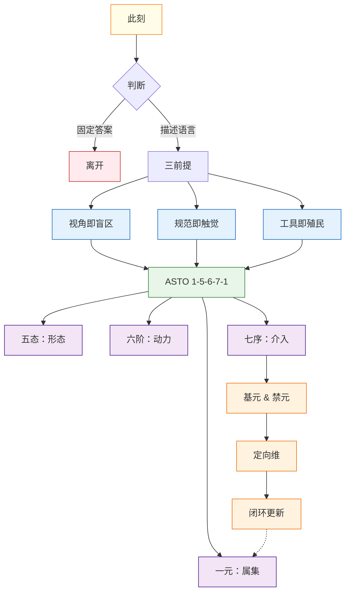
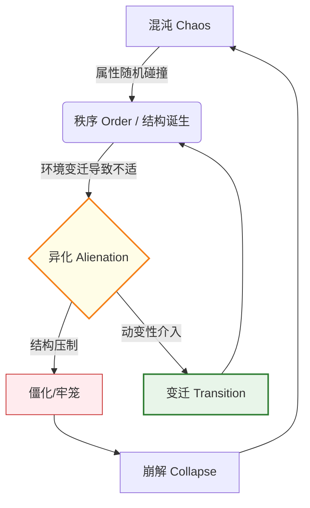

# **属集变迁存在论 (ASTO) 宣言：一门基于跨文化结构同构性的演化哲学**

> **Version**: Γ.18 (基元与禁元体系重构)
> **Status**: Living Document
> **作者**: Fuyi (ODDFounder fuyi.it@live.cn)
> **Context**: 这是一份思想行动的完整宣告。它整合了 ASTO 的哲学根基与工程实践。我们不仅解释世界，我们重构它。

---

## **导航图与进入前的三重校准**

在进入前，请凝视这棵从属集根部生长出来的思想之树，并接受三个前提：

> **完整版导航图**（含详细说明）见 [ASTO17.附录.Glossary.md § 完整导航图](./ASTO17.附录.Glossary.md#完整导航图)

### **警告一：视角是单向镜**
你选择戴上人文之眼、哲学之眼或工程之眼时，不仅选择了看见什么，更选择了对什么保持盲视。ASTO不提供"完整真相"，只提供三副互补的滤镜。

### **警告二：规范是触觉**
规范不是文档里没人看的条文。**规范是 CI/CD 流水线上的红灯，是代码 Review 时同事的皱眉，是遗留系统里那个没人敢动的 `util.js`。** 我们不给世界立法，只让你听见"那阵让你沉默的风来自哪个方向"。

### **警告三：工具会殖民**
五态、六阶、螺旋……它们精美如手术刀。但所有模型都在做两件事：简化世界以装入你的颅骨，重塑你的颅骨以匹配模型的形状。**抛弃理论。回归你鲜活、具体、未经解释的颤栗。**

---

## **宣告：结构性处境**

**我们身处代码与现实的断裂处。**

在这里，系统反复遭遇崩溃与重构的阵痛。既不是空想的哲学，也不是盲目的工匠——而是**结构性困境本身**在说话。

**我们反对**：
- 将世界视为静态蓝图的**设计论**
- 将人类意志凌驾于演化规律的**狂妄**
- 在复杂系统面前或陷入空谈或埋头盲干的**分裂症**
- **将结构性问题归咎于具体个人的道德审判**（ASTO 只批判僵化的结构，不审判被结构裹挟的人）

**这里存在**：
- 谦卑地**理解**结构与约束的需要
- 勇敢地**介入**变迁与重组的冲动
- 负责任地**架设**通道的结构性条件

---

## **核心图腾：1-5-6-7-1 完整结构**

ASTO 的宇宙观可以压缩为一个完整的数字结构：**1-5-6-7-1**。这不是线性流程，而是**理论-实践-理论**的自我修正闭环。

### **1. 一元 (The One) —— 属集 (存在)**
*   **对应**：**"存在" (Being)**
*   **定义**：世界没有实体，只有属性的集合。
*   **公理依据**：[ASTO04.公理.Proto.v8.0.md](./ASTO04.公理.Proto.v8.0.md) 公理 0-3（环境熵增、不完美、效用、节能）
*   **定理映射**：定理一至三（存在即缺陷、效用存续、简洁即存在）
*   **隐喻**：**"大地"**。一切存在的基质。

### **2. 五态 (The Five) —— 形态 (空间)**
*   **对应**：**"变迁的空间相" (Morphology)**
*   **序列**：**自在 → 共识 → 编码 → 物化 → 定向**
*   **公理依据**：ASTO04 公理 4-6（结构性稳态、阻力最小、属性分层）
*   **定理映射**：定理七至九（场域优先、阻力选择、耗散存续）
*   **隐喻**：**"河流"**。存在流过不同的河道，呈现不同的形状。

### **3. 六阶 (The Six) —— 动力 (时间)**
*   **对应**：**"变迁的时间相" (Dynamics)**
*   **序列**：**混沌 → 秩序 → 流变 → 脉冲 → 崩解 → 归元**
*   **公理依据**：ASTO04 公理 8、12、13（结构自指、规范跃迁、自由）
*   **定理映射**：定理十三至十五（不可逆性、跃迁阈值、轮回定理）
*   **隐喻**：**"波浪"**。河流中起伏的动力学波形。

### **4. 七序 (The Seven) —— 介入 (行动)**
*   **对应**：**"变迁的介入相" (Intervention)**
*   **序列**：**感知 → 解析 → 干预 → 设计 → 物化 → 回溯 → 消解**
*   **公理依据**：ASTO04 公理 7、11、13（动变性场域、认知不对称、自由）
*   **定理映射**：定理十六至十九（自由不保证善、自由-责任闭环、扰动不可消去、结构内自由）
*   **特征**：可循环迭代，形成完整的行动闭环
*   **隐喻**：**"船与螺旋"**。在波浪中航行并不断调整的技术。

### **5. 第二个一元 (The Second One) —— 基元与禁元**
*   **对应**：**"存在的稳态与演化约束" (Stability and Evolution Constraints)**
*   **内容**：
    - **基元 (Fundamentals)**：存在的**当前相对稳定状态**——属集在特定环境下维持自身的动态平衡点
      - 基元不是永恒真理，而是**可演化的暂时稳态**
      - 基元是存在「当前是什么」的锚点，也是下一轮演化的起点
    - **禁元 (Taboos)**：**定向维 + 不可触达维**对基元演化方向的联合约束
      - **定向维禁元**：可讨论、可修订的规则约束
      - **不可触达维禁元**：不可谈判的存在底线
      - 禁元定义基元「不能变成什么」，是基元的守护者而非对立面
*   **公理依据**：ASTO04 公理 10（禁元冲突公理）
*   **定理映射**：定理四至六（边界即自由、悖论不可机械化、禁元优先）
*   **冲突处理**：定向维冲突启动规约修订；不可触达维冲突强制熔断并交由人裁决
*   **意义**：确保理论本身不会自我矛盾或无限递归，同时为演化留出空间

### **6. 定向维 (Orientation Dimension)**
*   **对应**：**"规约不可达性结构" (Normative Unreachability Structure)**
*   **层次**：
    1. **规约层**：显式禁令 / 隐式禁忌 / 规约修订协议
    2. **映射层**：状态空间禁区 / 变迁路径断点 / 实践操作黑名单
    3. **自指层**：规约自检 / 执行验证 / 悖论处理
*   **公理依据**：ASTO04 公理 9（规约不可达性公理）
*   **定理映射**：定理四（边界即自由）
*   **功能**：定义"什么不可以做"，为自由划定边界

### **7. 理论闭环与更新**
*   **过程**：理论通过实践检验 → 发现矛盾 → 修订规约 → 回到新的一元
*   **公理依据**：ASTO04 公理 12（规范跃迁公理）
*   **定理映射**：定理十三（不可逆性定理）、定理十四（跃迁阈值定理）
*   **意义**：理论是活的，能在实践中自我修正

### **风险/不可算法区 (The Unalgorithmizable)**
*   **内容**：
    - 人的存在 / 意志 / 伦理 / 私服体验
    - 防止算法闭环消解动变主体
    - 废弃的正义性 / 动变权分配
*   **公理依据**：ASTO04 公理 14（人的位置公理）
*   **定理映射**：定理十至十二（不可约性、非等价代换、人的裁决权）
*   **意义**：为人类保留不可被算法替代的裁决权

> **记忆口诀**：
> **守一元之土，**
> **观五态之流，**
> **察六阶之变，**
> **行七序之工，**
> **固基元之本，**
> **遵禁元之界，**
> **保人性之光。**

---

## **第一部分：思想渊源——结构同构性的发现**

ASTO 不是"东西方文化的拼盘"，而是我们在工程实践中，发现了不同文明代码底层共享的**"元语言"**。

### **1.4 中国思想的结构继承（实践—矛盾—变迁）**

**实践论结构同构**
* 实践 → 检验结构是否仍具现实支撑力
* 理论只在实践反馈中存活
* 脱离实践的结构必然异化

**矛盾论结构同构**
* 矛盾不是异常，而是系统内部张力的常态表现
* 主要矛盾决定阶段结构形态
* 次要矛盾决定局部扰动路径

**矛盾转化机制**
* 量变 → 阙值 → 结构重组
* 对应 ASTO 的：属性积累 → 异化临界 → 变迁触发

---

### **1.5 古代智慧的结构同构**
- **赫拉克利特**的"万物皆流"与**代码版本控制**（Git）同构：世界是流动的 Commit 链。
- **《易经》** 的"变易"与**系统动力学**同构：阴阳是二元状态机（Binary State Machine）的古老表达。
- **佛家**的"缘起性空"与**面向对象编程**同构：对象（Object）本身是空的，它只是属性（Properties）和方法（Methods）的暂时聚合（属集）。

### **1.6 近代哲学的突破**
- **康德**的"哥白尼式革命"让我们认识到：规范作为认知结构，决定了我们能看见什么。
- **黑格尔**的辩证法提供了"正-反-合"的演进模式，对应我们的"秩序-异化-变迁"动力模型。
- **马克思**的异化理论让我们深刻认识到：社会结构如何从支撑变为牢笼（Legacy Code 如何变成技术债）。

### **1.7 现代思想的整合**
- **怀特海**的过程哲学强化了我们的"存在即过程"信念。
- **维特根斯坦**的语言游戏说让我们理解规范作为"生活形式"的实质。
- **复杂系统科学**与**控制论**为我们提供了理解多层级、自组织系统的工具。

### **1.8 工程实践的淬炼**

**ASTO 的工程渊源：从 ODD 到 ASTO**

ASTO 并非空想哲学，而是从 **Output-Driven Development (ODD，输出驱动开发)** 的工程实践中淬炼而来。

ODD 是我们在 AI 时代软件工程中的探索——一种以"产出物"为中心、以"契约"为规范、以"变异测试"为信任基础的开发范式。在实践中，我们反复遭遇理论与现实的断裂：

- 设计完美的系统在实践中必然崩溃（熵增）
- 为保障秩序而设定的规则常成为创新的枷锁（异化）
- 系统升级如同外科手术，风险极高（变迁）

**正是在这些具体而微的"崩溃"现场，我们将工程实践锻造成哲学，又将哲学思辨锻造成可用的工具。**

> **注**：ODD (Output-Driven Development) 的核心论文见：[Paper_01_ODD_Core_Chinese 2026-1-15.md](../../ODDFounder/01-Knowledge-Base/01-Papers/Paper_01_ODD_Core_Chinese%202026-1-15.md)

> **术语说明**：为避免混淆，本文档中 "ODD" 特指 Output-Driven Development。如需指代"开放·分布·动态"系统特性，使用 **OD²** (Open Distributed Dynamic) 标记。

### **1.9 与进化论的结构同构**

ASTO 与达尔文进化论具有深层的结构同构性：

| 进化论概念 | ASTO 对应 | 说明 |
| :--- | :--- | :--- |
| **变异 (Mutation)** | 动变性扰动 | 引入新的属性组合 |
| **自然选择 (Selection)** | 环境张力筛选 | 效用为正者存，为负者亡 |
| **遗传 (Heredity)** | 结构的持续性 | 稳态结构在时间中传递 |
| **适应 (Adaptation)** | 属集与环境的稳态匹配 | 阶段性平衡 |
| **物种灭绝** | 六阶之崩解 | 结构彻底失效 |
| **物种形成** | 规范跃迁 | 新结构的涌现 |

**动变性不是人类独有的**

这是 ASTO 与进化论的核心共识：**所有存在物都有动变性，只是类型和强度不同。**

- 细菌有本律式动变性（对环境刺激的固定反应）
- 蚁群有涌现式动变性（无中心的集体智慧）
- 动物有目标式动变性（追求目标的行为）
- 人有建模式动变性（能修改自己的认知模型）

**ASTO 与进化论的异同**

| | 进化论 | ASTO |
| :--- | :--- | :--- |
| **适用范围** | 生物系统 | 所有存在物 |
| **人的位置** | 与其他物种无本质区别 | 人占据元层位置（建模式 + 规约修订权） |
| **理论性质** | 纯描述性 | 描述性 + 规范性 |
| **价值判断** | 无（「适者生存」不是价值判断） | 有（禁元、风险区、人的不可约性） |

**ASTO 不是社会达尔文主义**

- 进化论说「适者生存」，这是描述，不是价值判断
- ASTO 明确拒绝将「适应」等同于「正义」或「应该」
- **禁元的存在**意味着：即使某种行为能增加存续概率，如果它违反禁元，也不可为
- **风险区的存在**意味着：人的尊严不能被「效用」计算所覆盖

> **ASTO 是进化论的泛化 + 人文补充。它承认演化的普遍性，但拒绝将演化逻辑等同于伦理标准。**

---

## **第二部分：核心定义与三大陈述**

### **2.1 陈述一：存在即属集 (Existence is Attribute-Set)**

**核心命题**：我们并非生活在坚固的实体之中，而是生活在属性暂时聚合的 **"属集"** 之中。**世界没有名词，只有形容词的集合。**

> **工程隐喻：User 不是实体**
> 我们习惯定义 `class User`，以为 User 是一个实体。但在 ASTO 看来，`User` 只是 `id`、`email`、`role` 等属性在当前业务上下文中的临时聚合。一旦关键属性（如 `isActive`）被环境剥离，这个对象在鉴权系统中的"存在"即刻崩解。

**展开阐述**：
- **从实体到属性的坍缩**：量子力学揭示，剥离自旋、质量等属性，"电子"不存在。社会学揭示，剥离契约、共识等属性，"公司"不存在。
- **存在即抗噪**：每个属集都是对抗熵增的临时堡垒。维护它，或者重构它，是文明的唯一任务。

### **2.2 陈述二：结构即骨架 (Structure is Skeleton)**

**核心命题**：是什么在维持属集不散？是**"结构"——维持属集存在的最小内耗构型**。

> **工程隐喻：单体架构的牢笼**
> 为什么单体架构后来变成了牢笼？因为原本为了"支撑"业务快速上线而写的硬耦合（结构），在业务规模变迁后，变成了"阻力最大"的路径。结构一旦长成，就倾向于维持自身。

**展开阐述**：
- **支撑与牢笼的双重性**：没有骨架，肉体无法站立（存在无法显现）；但骨架一旦长成，就限制了生长方向（路径依赖）。
- **结构的生成（鲁迅的草坪）**：结构不是谁规定的，是当前环境下**阻力最小**的那条路径（脚与土的千万次磨合）。

### **2.3 陈述三：变迁即命运 (Transition is Fate)**

**核心命题**：没有永恒的骨架，因为没有永恒的环境。变迁不是选择，是热力学的强制命令。

> **工程隐喻：技术债的报复**
> 当流量（环境）激增100倍，原本"够用"的同步读写（旧结构）突然变成了导致雪崩的元凶。此时，必须进行架构重构（变迁）。如果不主动变迁，系统就会选择"崩溃"来响应环境压力。

**展开阐述**：
- **异化的必然性**：当环境剧变，原本"阻力最小"的路径变成"阻力最大"的障碍。旧的保护层变成新的束缚衣。
- **跃迁公式**：$$ \text{变迁压力} = \frac{\text{环境变化速率} (V_e)}{\text{结构适应速率} (V_n)} $$。如果压力 > 1，系统震荡；如果结构僵化，系统崩溃。

> **元约束**：实践 = 七序根基；矛盾 = 六阶动力；变迁 ≠ 主观意志。ASTO 不提供历史方向，不预设终点。当理论压制具体实践经验时，即视为异化，应立即弃置。

---

## **第三部分：理论体系展开——ASTO的完整框架**

### **3.1 动力学图谱：存在-异化-变迁循环**

ASTO 的核心动力学并非线性，而是一个永恒的循环：

### **3.1.2 禁元冲突与悖论处理**

当存在的最低维持条件（基元）与不可逾越约束（禁元）发生冲突时，系统内部不存在可解路径。

> **"当基元（必须做）与禁元（不可做）发生逻辑冲突时，系统必须停止运作并强制回归元层（人）进行裁决。"**

这是**哥德尔不完备性定理在存在论中的体现**：任何形式化系统都无法通过内部逻辑解决自身的根本悖论。

- **工程意义**：死锁即熔断信号。当系统陷入"必须做 X"和"不能做 X"的死锁时，这不是需要"智能算法解决"的问题，而是需要**人工介入**的信号。
- **文明意义**：文明为自己划下的**不可逾越红线**（如人权底线），即便在存续压力下也不可突破。宁可崩解，不可逾越。

---

### **3.2 工程映射表：ASTO 有什么用？**

> **说明**：ASTO 认为，软件工程是人类唯一能完全掌控"属性结构"上帝视角的领域。ODD (Output-Driven Development) 是 ASTO 的数字实验室。

| ASTO概念 | ODD工程实践 | 社会系统对应 |
| :--- | :--- | :--- |
| **属集** | 系统当前状态 (State) | 社会现状 |
| **结构/规范** | 架构设计、协议 (Protocol) | 法律、制度 |
| **规范负债** | **技术债 (Tech Debt)** | 制度僵化、矛盾积累 |
| **动变性对话平台** | **CI/CD, Migration Scripts** | 改革路径、过渡政策 |
| **变迁/跃迁** | **Refactor, Version Upgrade** | 转型、革命 |
| **环境压力** | 用户量暴增、需求变更 | 生产力发展、气候变化 |

> **更详细的工程术语对照表**，请参见 [ASTO17.附录.Glossary.md](./ASTO17.附录.Glossary.md) 中的 **ASTO-ODD 工程映射表**。

---

## **第四部分：结构性处境——我们何为？**

变迁不以人的意志为转移，但人可以选择介入方式。

### **4.1 结构性张力**

* 结构在支撑存在与限制存在之间摆动
* 当环境变化速率超过结构适应速率，系统进入异化态
* 变迁是矛盾不可调和时的必然结果

### **4.2 介入的可能性**

* 理解结构：识别当前结构的支撑功能与束缚效应
* 介入变迁：在临界点设计过渡路径
* 负责任地架设：为不可逆的操作预留回滚空间

---

## **第五部分：行动提示**

我们不只提供解释，我们要求行动。

### **5.1 诊断与手术（短期）**
*   **成为"翻译者"**：用 ASTO 透镜审视你的项目。哪里是"自在态"的黑盒？哪里的"规范负债"已经爆表？
*   **成为"医生"**：在关键节点设计"变迁对话平台"。不要只写新功能，要写**数据迁移脚本**，要设计**灰度发布策略**。

### **5.2 长期愿景（文明重塑）**
我们终极的目标，是让"属集思维"与"变迁意识"渗透进文明的骨髓：
- 当政策制定者**本能地**考虑制度的演化适应性。
- 当技术工程师**自觉地**为系统设计优雅的退出路径。
- 当每一个体**坦然地**理解生活阶段的更迭是生命的自然律动。

**那时，我们将从一个恐惧变化、在崩溃中被动革命的文明，成长为一个拥抱流动、在持续调适中主动演化的文明。**

### **5.3 给实践者的第一个任务**

> **请打开你现在的项目，找到一个让你觉得"别扭"但又"不敢动"的代码模块。**
> 1.  **解构**：它由哪些属性（变量、依赖）支撑？
> 2.  **溯源**：它最初是为了适应什么环境（当时的业务需求）而生成的结构？
> 3.  **判断**：现在的环境变了吗？它是支撑，还是已经异化为牢笼？
> 4.  **行动**：如果它是牢笼，请不要暴力拆除。请设计一个"对话平台"（Adapter或中间层），让它安全地过渡到新形态。

---

## **结语**

没有一座桥是永恒的。

结构用于承载存在，不得替代存在。

理论用于解释世界，不得殖民世界。

**(此宣言是一个活着的属集，将在演化中持续重构。)**

---

<strong>版本更新记录</strong>

- **Γ.15 → Γ.16** (v10.0 → v11.0): 全面对照 ASTO04 公理定理，五态末项改为「定向」，六阶末项改为「归元」，七序改为「感知→消解」，导航图精简并移完整版至附录。
- **Γ.14 → Γ.15** (v9.0 → v10.0): 补充为 1-5-6-7-1 结构，增加基元/禁元、定向维、风险区。
- **Γ.13 → Γ.14** (v8.0 → v9.0): 新增 ODD 渊源说明，统一 ODD = Output-Driven Development，引入 OD² 标记。

