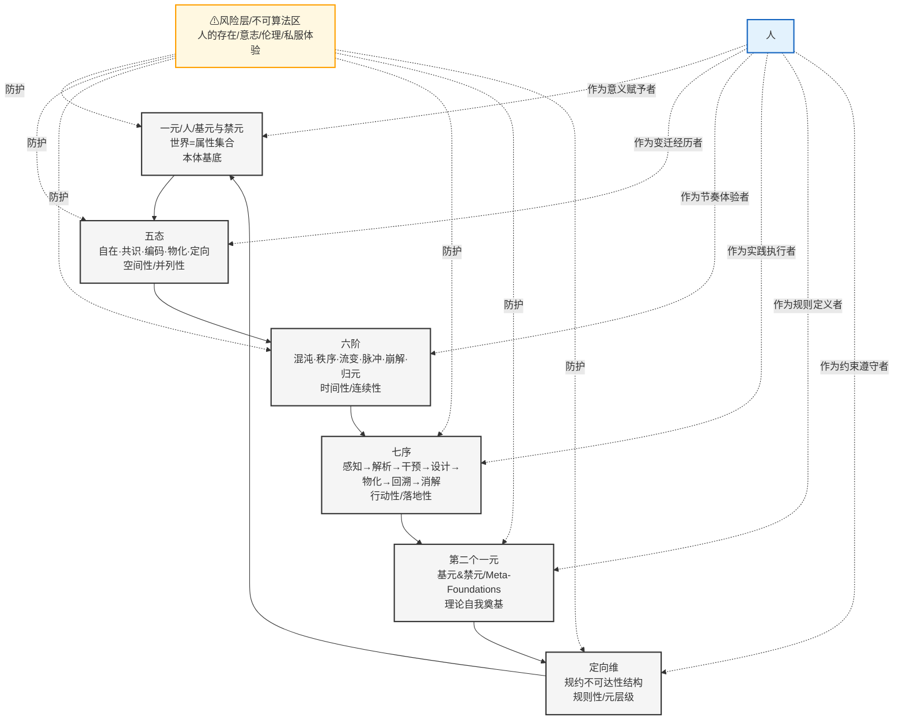

# **ASTO完整实践循环系统：核心动力学机制**

## **一、系统全景：人+4维+1边界 自洽结构**

```
┌─────────────────────────────────────────┐
│                  属集变迁存在论 (ASTO)                  │
│                    人 + 4维 + 1边界                   │
├──────────────────────────────────────┤
│                                                      │
│  维度0：人的存在维 (不可算法化的基础)                   │
│  ───────────────────────────────────── │
│  • 自由意志·伦理判断·私密体验                          │
│  • 系统意义赋予者·最终裁决者                           │
│  • 既是系统的“用户”，更是系统的“设计者”                 │
│                                                      │
│  ↓ 基于人的意图展开                                  │
│                                                      │
│  4维流形 (过程维度)：                                 │
│  ┌────────────────────────────────────────────┐  │
│  │ 维度1：存在形态维 (五态)                          │  │
│  │   I自在 · II共识 · III编码 · IV物化 · V定向       │  │
│  │   → 空间性、并列性、模态区分                       │  │
│  └────────────────────────────────────┘  │
│  ┌─────────────────────────────────────────────┐  │
│  │ 维度2：变迁阶段维 (六阶)                          │  │
│  │   a混沌 · b秩序 · c流变 · d脉冲 · e崩解 · f归元   │  │
│  │   → 时间性、连续性、节奏演化                       │  │
│  └────────────────────────────────────────┘  │
│  ┌───────────────────────────────────────────┐  │
│  │ 维度3：实践操作维 (七序)                          │  │
│  │   感知→解析→干预→设计→物化→回溯→消解              │  │
│  │   → 行动性、落地性、主体实践                       │  │
│  └────────────────────────────────────────────┘  │
│  ┌─────────────────────────────────────────────┐  │
│  │ 维度4：约束校准维 (定向维)                        │  │
│  │   规约层·映射层·自指层                           │  │
│  │   → 规则性、元层级、系统自洽                       │  │
│  └────────────────────────────────────────┘  │
│                                                      │
│  ↓ 结果反馈至人                                      │
│                                                      │
│  +1边界：风险层 (防护维度)                           │
│  ─────────────────────────────────────────    │
│  • 防止4维流形吞噬维度0                              │
│  • 保护人的主体性不被算法消解                         │
│  • 确保自由、伦理、体验的不可约性                      │
│                                                      │
└───────────────────────────────────────────────┘
```

## **二、核心动力学：1→5→6→7→1实践循环**

### **循环展开详解**



### **各阶段功能解析**

| 阶段 | 功能 | 对应公理/定理 | 输出 |
|------|------|---------------|------|
| **一元** | 本体奠基·基元禁元定义 | 公理一（不完美）<br/>公理二（效用） | 属性集合的元定义 |
| **五态** | 存在模态展开·状态迁移 | 公理五（结构性稳态）<br/>公理七（属性分层） | 当前存在模式 |
| **六阶** | 变迁节奏演进·时间动态 | 公理四（环境熵增）<br/>公理六（阻力最小） | 变化阶段/强度 |
| **七序** | 主体实践操作·干预循环 | 公理八（动变性场域）<br/>公理九（自由） | 具体行动结果 |
| **定向维** | 规则约束校准·系统自洽 | 公理十一（规约不可达）<br/>定理四（边界即自由） | 修正的规则集 |
| **风险层** | 主体保护·不可算法化保留 | 公理七（人的位置）<br/>公理十三（认知不对称） | 安全的边界 |

## **三、三对核心张力：系统演化的动力源**

### **1. 结构vs能动张力**
- **结构维度**：五态（存在模式）+ 六阶（变迁节奏）+ 定向维（规约约束）
- **能动维度**：七序（主体实践）+ 人的自由意志
- **张力体现**：结构化趋势与主体能动性的对抗与协同
- **动力作用**：推动系统在稳定与变革间平衡

### **2. 秩序vs混沌张力**
- **秩序端**：b秩序阶 + III编码态 + 规约层
- **混沌端**：a混沌阶 + I自在态 + e崩解阶
- **张力体现**：组织化需求与创造性破坏的辩证关系
- **动力作用**：驱动系统在组织优化与创新突破间循环

### **3. 算法vs伦理张力**
- **算法端**：IV物化态 + 七序自动化 + 映射层
- **伦理端**：V定向态 + 风险层 + 人的裁决
- **张力体现**：效率优化与价值判断的根本冲突
- **动力作用**：确保技术理性不吞噬人文关怀

## **四、三层嵌套反馈回路：防退化机制**

### **操作层反馈（七序循环）**
```
感知 → 解析 → 干预 → 设计 → 物化 → 回溯 → 消解
    ↖________________________________________/
```
- **频率**：最高（毫秒-分钟级）
- **功能**：快速调整具体行动
- **防退化**：通过持续回溯消解，防止操作僵化

### **规则层反馈（定向维自指）**
```
规约层（显式禁令） → 映射层（状态禁区） → 自指层（规约自检）
                    ↖__________________________________/
```
- **频率**：中等（小时-天级）
- **功能**：动态调整规则约束
- **防退化**：通过自指层检测悖论，防止规则过时

### **本体层反馈（循环闭合）**
```
一元（属性集合） → 四维流形（过程展开） → 定向维（规则约束）
    ↖__________________________________________________/
```
- **频率**：最低（月-年级）
- **功能**：更新理论基础
- **防退化**：通过完整循环验证，防止理论脱离实践

## **五、人在系统中的三重角色**

### **1. 系统内部基础（而非外部用户）**
- **意义赋予者**：没有人的意向性，系统只是空洞结构
- **价值锚定点**：伦理判断、审美体验等不可算法化维度
- **最终裁决者**：当算法出现“不可裁决”的边界情况

### **2. 变迁掌舵者**
- **七序执行者**：通过感知-解析-干预...主动引导变迁
- **节奏调谐者**：在六阶不同阶段采取不同策略
- **模式切换者**：在五态间迁移，改变存在方式

### **3. 风险守护者**
- **不可算法区的守卫**：保护意志、伦理、体验不被消解
- **动变权分配者**：决定谁有权改变系统、改变什么
- **废弃正义性裁决者**：判断什么该被淘汰、什么该保留

## **六、实践指导：如何使用这个框架**

### **分析任何系统变迁时**
1. **定位当前状态**：
   - 在五态的哪个模态？（存在形态维）
   - 在六阶的哪个阶段？（变迁阶段维）

2. **识别操作模式**：
   - 正在执行七序的哪一步？（实践操作维）
   - 受哪些规则约束？（约束校准维）

3. **评估人的角色**：
   - 人在系统中是什么角色？（维度0）
   - 哪些方面受风险层保护？（+1边界）

4. **预测演化方向**：
   - 三对张力当前如何作用？
   - 三层反馈如何防止退化？

### **设计自治系统时**
1. **确保人的保留区**：明确划分算法可处理与必须人裁决的边界
2. **建立完整反馈**：构建操作层、规则层、本体层三层反馈
3. **平衡核心张力**：在设计中有意引入结构vs能动、秩序vs混沌的张力
4. **实现循环闭合**：确保从实践结果能反馈修正理论基础

## **七、ASTO动力学核心公式**

```
系统变迁 = f(人_意图, 五态_模态, 六阶_阶段, 七序_操作, 定向维_约束)
          × 风险层_保护系数
          
其中：
• 人_意图 ∈ 维度0 (自由意志、伦理判断...)
• 五态_模态 ∈ {I, II, III, IV, V}
• 六阶_阶段 ∈ {a, b, c, d, e, f}
• 七序_操作 ∈ {1, 2, 3, 4, 5, 6, 7}
• 定向维_约束 = g(规约层, 映射层, 自指层)
• 风险层_保护系数 ∈ (0, 1] (1=完全保护，接近0=保护失效)
```

**关键结论**：
1. ASTO是一个**自我奠基、自我约束、自我修正**的完整系统
2. **人不是外部观察者**，而是系统内部必要维度（维度0）
3. **四维流形**描述了变迁的完整过程坐标
4. **风险层**确保系统不吞噬自己的创造者
5. **1→5→6→7→1循环**实现了理论到实践再到理论的持续进化

这个框架为分析复杂系统（技术、社会、组织）的变迁提供了统一语言，同时确保在任何自动化、智能化进程中，人的主体性始终得到保护。
