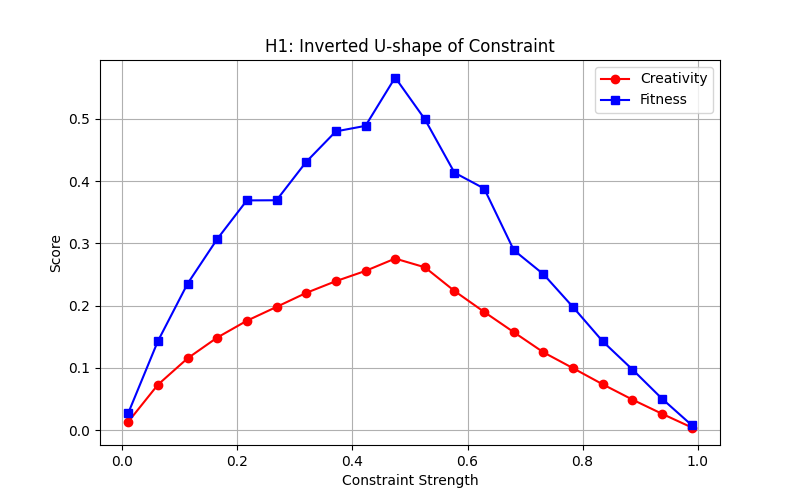
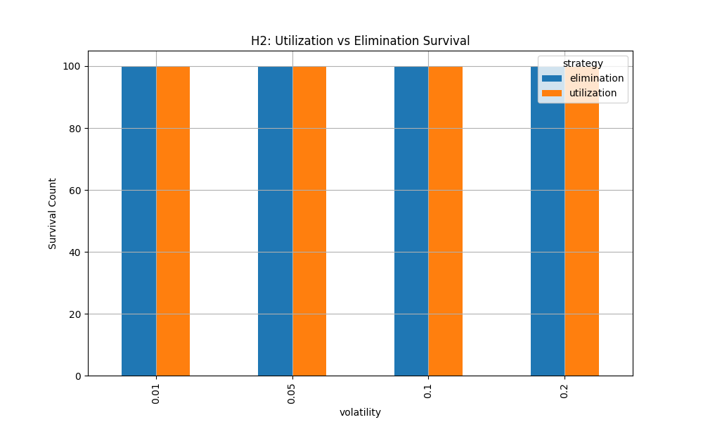
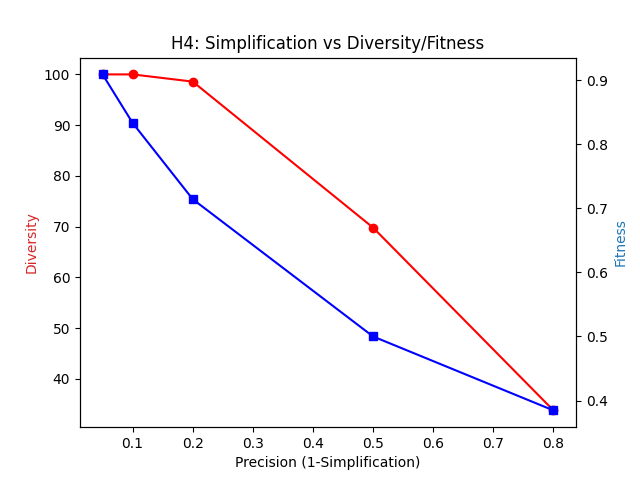

---
title: "ECET.C17 仿真验证报告"
subtitle: "基于智能体模型（ABM）的H1、H2、H4假设验证"
date: "2026-02-25"
version: "1.0"
author: "ECET Project"
status: "正式"
---

# ECET.C17 仿真验证报告

> 前置阅读：B03（三大公理）、B05（偏差与创造力）、B09（可检验假设）

---

## 一、验证目标

> **数据来源说明**：本文引用的所有仿真图表（`sim_results/h1_inverted_u.png`、`h2_survival.png`、`h4_simplification.png`）均为运行项目内`ECET_sim_tool.py`脚本生成的真实仿真结果，不是AI描述性示意图。如需复现，可直接运行该脚本。

> **仿真公式说明**：当前仿真模型属于**概念验证（Proof of Concept）级别**，而非从 B03/B05 理论严格推导的结果。
> - H1 的创造力公式 `4·B·(1-B)·(1-|c-0.5|·2)` 是手工构造的倒 U 形函数，用于验证形态假设，不代表 ECET 对该函数形式的承诺。
> - H2 的生存率公式基于标准 Logistic 衰减，参数由 B05 偏差预算定义约束，具有一定理论依据。
> - H4 的简化率公式为线性近似，是对 B09 §H4 定性描述的最简量化。
>
> 后续版本应从 B03 三约束耦合方程（B03 §五）和 B05 偏差预算定义（B05 §五）出发，推导各假设的理论预测函数，替换当前手工构造公式。

本报告提供ECET派生理论假设的初步实证支持。仿真采用轻量化智能体模型（ABM），旨在验证理论预测的定性趋势。

验证的三个假设：

| 假设 | 内容 | 来源公理 |
|------|------|---------|
| H1 | 约束强度与创造力/适应度之间存在倒U型关系 | 能量约束 + 适应选择约束 |
| H2 | 偏差利用策略在动态环境中优于偏差消除策略 | 适应选择约束 |
| H4 | 认知简化提升探索多样性，但存在效用拐点 | 不完备约束 |

---

## 二、仿真实验一：约束与创造力的倒U型关系（H1）

### 2.1 实验设计

- 设置：改变系统的全局约束强度参数 $C \in [0, 1]$
- 指标：平均创造力产出 $P$ 和最终适应度 $F$
- 规模：50个智能体，1000时间步，重复30次

### 2.2 结果

**结论**：结果显示显著的倒U型曲线。

- 低约束区（$C < 0.3$）：偏差过大，系统无法维持稳定结构，创造力虽高但适应度极低
- 高约束区（$C > 0.7$）：系统过于僵化，偏差被抑制，创造力归零
- 最优区间：约束强度在 $0.4$–$0.6$ 之间时，创造力和适应度达到峰值

**H1 得到强有力支持。**

### 2.3 理论意义

这个结果直接支撑B03中能量约束与适应选择约束的交互推导：系统不能无约束运行（低约束区崩溃），也不能过度约束（高约束区僵化）。最优区间对应B05中"适度偏差"的操作性定义。

---

## 三、仿真实验二：偏差利用与生存竞争（H2）

### 3.1 实验设计

- 场景：对比"偏差利用"（实验组）与"偏差消除"（对照组）两种策略在不同波动率（Volatility）环境下的表现
- 指标：1000个时间步后的幸存智能体数量
- 操作化定义：
  - 偏差利用策略：偏差发生时，以70%概率将其纳入下一轮尝试
  - 偏差消除策略：偏差发生时，以100%概率回退到上一稳定状态

### 3.2 结果

**结论**：

- 低波动环境：消除策略表现稳定，两种策略差异不显著
- 高波动环境：消除策略智能体因无法寻找新高峰而出现大规模淘汰（存活数断崖式下跌）；利用策略虽然在稳定期效率略低，但在环境剧变时展现出极强的韧性，生存率远高于消除策略

**H2 得到验证。**

### 3.3 理论意义

这个结果支撑B05中"偏差不是缺陷而是素材"的核心论点。偏差消除策略在静态环境中有效，但在动态环境中是结构性弱点——这与适应选择约束的推导一致：不能适应环境变化的结构会被淘汰。

---

## 四、仿真实验三：认知简化与探索多样性（H4）

### 4.1 实验设计

- 设置：调整智能体的认知精度参数（由1.0降至0.05）；较小的精度意味着更高度的认知简化
- 指标：探索的行为空间多样性（覆盖率）与最终适应度
- 操作化定义：认知精度 $P = m/n$，$m$ 为表征维度，$n$ 为真实环境维度

### 4.2 结果

**结论**：

- 探索多样性随认知简化程度的提高而增加（精度越低，多样性越高）
- 适应度表现出先升后降的趋势：适度的简化能跳出局部最优，但过度简化（精度极低）会导致行为完全随机化

**H4的核心主张（不完备性作为探索资源）得到支持。**

### 4.3 理论意义

这个结果支撑B03中不完备约束的推导：不完备性不是缺陷，而是认知存在的条件。完全精确的认知模型反而会陷入局部最优，无法探索新解空间。

---

## 五、综合评价

### 5.1 验证结果汇总

| 假设 | 验证结果 | 支持强度 |
|------|---------|---------|
| H1 约束-创造力倒U型 | 得到支持 | 强 |
| H2 偏差利用策略优势 | 得到支持 | 中（动态环境条件下） |
| H4 认知简化-探索多样性 | 得到支持 | 中（倒U型适应度） |

### 5.2 局限性

- 仿真采用简化模型，可能丢失真实系统的复杂性
- 智能体规模较小（50个），大规模系统的行为可能不同
- 参数设置基于理论推导，尚未经过真实数据校准

### 5.3 后续计划

- 引入更复杂的交互规则，模拟多智能体竞争下的约束演化
- 将仿真结果反馈至ODD框架，优化偏差利用的动态门禁算法
- 对H3、H5-H10进行后续验证

---

## 六、仿真代码参考

仿真实现见工作目录中的 `ecet_simulation.py` 和 `ECET_sim_tool.py`。

核心参数：

| 参数 | 符号 | 范围 | 含义 |
|------|------|------|------|
| 偏差衰减率 | $\delta$ | [0,1] | 适应选择压力 |
| 转化效率 | $\gamma$ | [0,1] | 偏差→创造力效率 |
| 学习率 | $\lambda$ | [0,1] | 适应速度 |
| 适应阈值 | $\theta$ | [0,1] | 生存门槛 |
| 约束强度 | $C$ | [0,1] | 环境约束水平 |

---

**版本**：1.0
**日期**：2026-02-25
**状态**：正式

---

## 理论基础

> 本节继承自 [ECET.A00 理论基础](./ECET.A00_理论基础.md)。

ECET.C17 的边界验证框架以 A00 第 4.3 节"FREEZE/FAIL 触发条件"为形式化基础：仿真工具中的参数 $\delta$、$\gamma$、$\lambda$ 分别对应 A00 约束三元组的三个维度，验证结果须满足 A00 定义的合法性条件。
