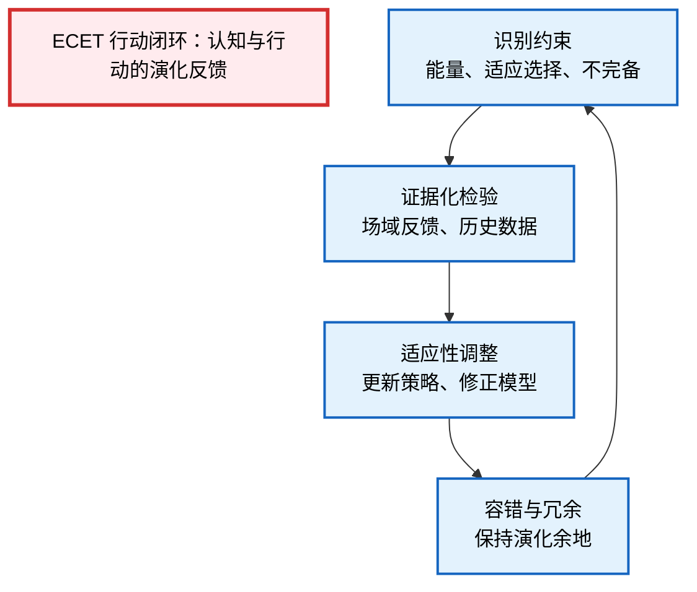

---
title: "ECET.P01. 演化约束存在论：适应、限制与认知的结构性动力"
date: "2026-02-17"
version: "Paper.Rich.v1.0"
author: "Fuyi (ODDFounder)"
status: "Living Document"
abstract: "演化约束存在论（Evolutionary Constraint Existential Theory, ECET）提出了在复杂系统与有限主体中，存在本身及其认知/行动能力受到演化约束的理论框架。它强调结构性约束、适应性选择以及认知/行动的必然局限，为设计可持续系统、智能体和社会治理提供新视角。"

---

# ECET.P01 演化约束存在论：适应、限制与认知的结构性动力

> Version: Paper.Rich.v1.0
> Audit: Darwin/Kuhn/Polanyi/Goldman
> Status: Living Document
> First Author: Fuyi (ODDFounder)
> Audience: Philosophers, Cognitive Scientists, Complex Systems Researchers

---

## 0. 方法论与前置批判

### 0.1 描述性 vs 规范性

* **描述性**：探讨存在为何受演化约束、认知为何偏差、行动为何受限。
* **规范性**：提出如何在演化约束下设计结构化干预、校验与适应策略。

### 0.2 循环论证与自指风险

* 演化约束不是自我定义的“最佳策略”，而是历史累积下的**实证约束**。
* 所有规范性建议必须依赖**可重复验证的场域反馈**。

### 0.3 范畴错置与自然主义谬误

* **范畴错置**：演化约束不是“目标”，而是存在条件。
* **自然主义谬误**：从“存在受到演化约束”不直接推出“存在应当如此”。

---

## 1. 核心公理：演化约束与存在的结构性特征

### 1.1 演化约束公理

1. **有限能量约束（Energy Constraint）**：任何存在体必须在能量耗散允许范围内维持自身结构。
2. **适应选择约束（Adaptive Selection Constraint）**：存在体的属性/行为必须在其环境中产生正向适应，否则被淘汰。
3. **不完备约束（Incompleteness Constraint）**：认知模型/行动方案无法完美描述/覆盖环境，不可避免地存在差距。

> ⚠️ 注意：这些约束不是理想化法则，而是**演化经验下的历史累积约束**。

---

### 1.2 描述性映射：认知与行动的必然局限

| 公理     | 认知映射         | 行动映射           |
| ------ | ------------ | -------------- |
| 能量约束   | 认知简化、启发式偏向   | 优先低成本操作、捷径策略   |
| 适应选择约束 | 偏向有效/可操作的信息  | 选择短期与长期效用兼顾的行动 |
| 不完备约束  | 模型不完备、误差不可避免 | 保留退路、容错机制、冗余结构 |

---

### 1.3 结构性偏差与创造力

1. **偏差即变异**：认知偏差或行动偏差类似遗传变异，是探索新策略的动力。
2. **不完美的功能性**：认知错误不是简单缺陷，而是适应环境和创造新策略的必要条件。
3. **转化机制**：生产性偏差（可生成新解）与毁灭性偏差（阻碍生存）动态转换，由环境反馈触发。

---

## 2. ECET 行动闭环（Evidence-Driven Adaptive Loop）

* **说明**：该闭环允许**非线性跳跃与回退**，保证认知系统在复杂、动态环境下的可持续适应性。

---

## 3. 演化约束对系统设计的启示

1. **系统冗余**：在不完备约束下，冗余是存续的前提。
2. **局部适应 vs 全局最优**：局部适应性优先于全局理想，避免高成本的完美化。
3. **动态边界管理**：生产性偏差与毁灭性偏差必须有**明确转化阈值与校验机制**。
4. **弱收敛策略**：在长期迭代中，正向适应性选择推动系统趋近理想结构，但不可保证绝对真理或最优。

---

## 4. ECET 与 ASTO 的关系

| 维度   | ASTO            | ECET          |
| ---- | --------------- | ------------- |
| 核心约束 | 节能、效用、不完美       | 能量、适应选择、不完备   |
| 关注重点 | 认知错误的结构性特征      | 演化驱动下的存在约束    |
| 实践方法 | 介入三问 + 校验/纠错/容错 | 证据闭环 + 演化反馈循环 |
| 创造力源 | 生产性缺陷           | 演化偏差与试错       |

> 可以认为 ECET 是 ASTO 的演化扩展版本，将**存在论约束**进一步绑定于环境选择和演化历史，使系统设计、认知优化与行动策略更贴近现实场域。

---

## 5. 结论

* **演化约束是存在的内在结构**：所有有限主体的认知与行动必然受历史累积的演化约束限制。
* **认知与行动的偏差是必然副产物**：非偶然，而是演化驱动下的适应性特征。
* **闭环适应是关键**：证据化检验、适应性调整与冗余机制组成的闭环是对抗毁灭性偏差、利用生产性偏差的核心方法。
* **哲学与实践结合**：ECET 提供了一套从存在约束到认知/行动优化的框架，可为智能体、复杂系统与社会治理提供操作性指南。

---

