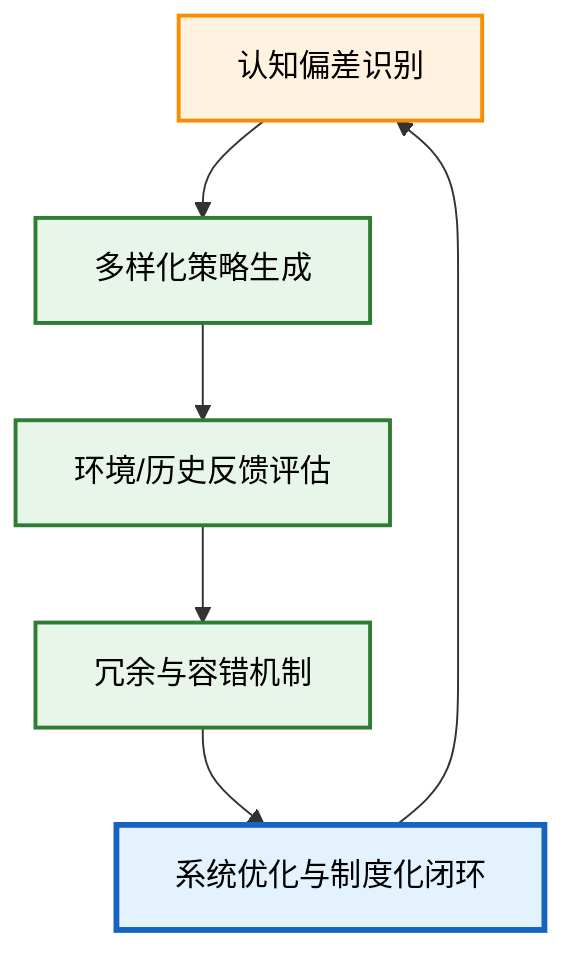

---

title: "ECET.P02. 演化约束存在论：认知缺陷、创造力与系统设计"
date: "2026-02-17"
version: "Paper.Living.v2.0"
author: "Fuyi (ODDFounder)"
status: "Living Document"
abstract: "ECET.P02 将演化约束存在论与 ASTO 流程深度对齐，分析认知缺陷如何成为创造力来源，并通过闭环设计将偏差转化为系统优化动力。提供面向智能体、复杂系统和社会治理的操作化方法论。"

---

# ECET.P02 演化约束存在论：认知缺陷、创造力与系统设计

> **核心问题**：如何在演化约束下，利用认知缺陷与偏差生成创造力，并将其转化为可操作的系统优化？

---

## 0. 理论基础

### 0.1 演化约束复盘

1. **能量约束**：行动和认知成本有限。
2. **适应选择约束**：非适应性特征将被淘汰。
3. **不完备约束**：认知模型必然不完备。

### 0.2 ASTO 5-6-7 流程映射

| ASTO 流程 | ECET 对应             |
| ------- | ------------------- |
| 5：发现问题  | 认知缺陷识别：偏差、局限、误判     |
| 6：构建补丁  | 偏差转化：生成创造性策略、冗余方案   |
| 7：制度化闭环 | 系统化反馈：演化闭环、容错、适应性校验 |

---

## 1. 认知缺陷—创造力机制

### 1.1 偏差分类

| 类型   | 描述         | 演化意义        |
| ---- | ---------- | ----------- |
| 认知偏差 | 过度简化或启发式误差 | 节省能量，快速决策   |
| 系统偏差 | 局部优化导致全局误判 | 激发新结构探索     |
| 行动偏差 | 决策执行与预期不一致 | 测试环境极限、提供反馈 |

### 1.2 偏差到创造力的转化

* **偏差≠缺陷**，而是演化的试错资源。
* **机制**：

  1. **误差生成**：认知模型与现实差距产生信息缺口。
  2. **多样化尝试**：偏差引导多种可能行动路径。
  3. **选择性保留**：环境反馈筛选有用偏差，淘汰毁灭性偏差。

---

## 2. ECET 创造力闭环设计

* **说明**：

  * A：发现问题/识别偏差
  * B：构建补丁/生成多样化策略
  * C：证据化检验/反馈评估
  * D：冗余与容错设计
  * E：制度化闭环/演化优化

> 这个闭环直接映射 ASTO 的 5-6-7 流程，同时充分利用演化约束生成创造力。

---

## 3. 系统设计应用

### 3.1 智能体设计

* **认知层**：保留不完备模型和启发式偏差，作为探索资源。
* **行动层**：允许多路径试错，利用局部失败获取全局信息。
* **反馈层**：闭环校验偏差产生的实际价值，形成适应性优化。

### 3.2 复杂系统治理

* **局部自治**：允许局部系统尝试偏差策略，形成创新储备。
* **全局调节**：利用反馈闭环对有害偏差进行约束。
* **制度化冗余**：在演化约束下保留系统弹性和冗余资源。

### 3.3 社会策略与创新政策

* **政策实验室**：小规模实验偏差策略，评估潜在创造力。
* **反馈与迭代**：证据驱动调整政策或制度。
* **容错机制**：确保偏差策略不会导致系统崩塌。

---

## 4. ECET 与 ASTO 对齐表

| 流程维度    | ASTO 功能     | ECET 对应       |
| ------- | ----------- | ------------- |
| 5：发现问题  | 补丁发现 / 错误识别 | 认知偏差识别        |
| 6：构建补丁  | 补丁开发 / 试错   | 多样化策略生成 / 冗余  |
| 7：制度化闭环 | 补丁验证 / 容错   | 闭环优化 / 环境选择反馈 |

> 核心思想：ECET 赋予 ASTO 机制化的“演化动力”，将偏差和缺陷转化为可制度化的创造力资源。

---

## 5. 总结

1. **认知缺陷是创造力源泉**：演化约束下，偏差提供多样化策略可能性。
2. **闭环转化偏差为优化**：ECET 提供了从发现—构建—制度化的完整路径。
3. **系统设计必须拥抱不完备**：完美模型不可达，适应性闭环才是可持续策略。
4. **理论实践结合**：ECET 提供了可操作方法论，用于智能体设计、复杂系统治理、创新政策实验。

---
