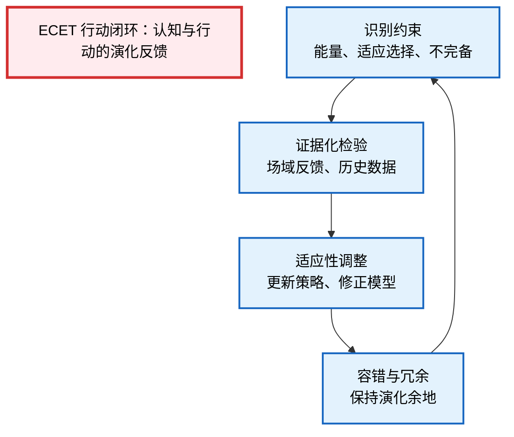

---
title: "ECET.P06 闭环设计图"
date: "2026-02-18"
version: "1.0"
author: "ECET Project"
status: "Draft"
abstract: "本文档提供 ECET 闭环系统结构图，详细展示认知-行动-反馈循环的架构、各阶段功能与交互关系。"

---

# ECET.P06 闭环设计图

## 1. 闭环系统总览

### 1.1 ECET 行动闭环定义

**ECET 行动闭环（Evidence-Driven Adaptive Loop）** 是系统的核心运行机制：

> 通过持续识别演化约束、证据化检验、适应性调整和容错冗余，实现系统在复杂动态环境下的可持续适应性。

### 1.2 闭环的四个阶段



**说明**：该闭环允许**非线性跳跃与回退**，保证认知系统在复杂、动态环境下的可持续适应性。

---

## 2. 闭环架构详解

### 2.1 三层闭环结构

ECET 闭环分为三个层次，从抽象到具体：

```
┌─────────────────────────────────────┐
│      元闭环层（Meta-Loop）           │
│  监控闭环性能，调整闭环参数           │
│  对应：P17 证据驱动迭代               │
└─────────────┬───────────────────────┘
              │
┌─────────────▼───────────────────────┐
│      战略闭环层（Strategic Loop）    │
│  长期目标设定、策略选择、路径规划     │
│  对应：P07-P09 系统与行动设计         │
└─────────────┬───────────────────────┘
              │
┌─────────────▼───────────────────────┐
│      操作闭环层（Operational Loop）  │
│  实时感知、决策、执行、反馈          │
│  对应：P08-P10 认知、行动、反馈闭环   │
└─────────────────────────────────────┘
```

### 2.2 阶段一：识别约束

**功能**：识别并量化系统受到的演化约束

**输入**：
- 环境状态 \(S_t\)
- 历史数据
- 系统资源状态

**处理过程**：

```
能量约束评估：
  C_energy = 当前资源消耗 / 可用资源
  如果 C_energy > 阈值 → 触发节约机制

适应选择约束评估：
  C_adapt = 当前策略的适应度得分
  如果 C_adapt < 阈值 → 触发策略调整

不完备约束评估：
  C_incomplete = 模型预测误差 / 实际观测值
  如果 C_incomplete > 阈值 → 触发模型更新
```

**输出**：约束状态向量 \(C_t = [C_{energy}, C_{adapt}, C_{incomplete}]\)

### 2.3 阶段二：证据化检验

**功能**：通过场域反馈和历史数据验证当前策略的有效性

**输入**：
- 行动输出 \(A_t\)
- 环境反馈 \(F_t\)
- 预期结果 \(\hat{F}_t\)

**处理过程**：

```
偏差计算：
  B_t = F_t - \hat{F}_t

证据收集：
  - 定量数据：性能指标、资源消耗
  - 定性数据：用户反馈、专家评估

统计检验：
  - 显著性检验：效果是否显著
  - 稳健性检验：结果是否稳定
```

**输出**：
- 证据报告 \(E_t\)
- 偏差评估 \(B_t\)

### 2.4 阶段三：适应性调整

**功能**：基于证据更新策略和模型

**输入**：
- 证据报告 \(E_t\)
- 当前策略 \(\pi_t\)
- 当前模型 \(M_t\)

**处理过程**：

```
策略更新：
  如果 B_t 有利（生产性偏差）：
    π_{t+1} = π_t + α·B_t  （强化）
  如果 B_t 不利（毁灭性偏差）：
    π_{t+1} = π_t - β·B_t  （修正）
  否则：
    π_{t+1} = π_t  （保持）

模型更新：
  M_{t+1} = M_t + γ·(F_t - M_t(S_t))
```

**输出**：
- 更新后的策略 \(\pi_{t+1}\)
- 更新后的模型 \(M_{t+1}\)

### 2.5 阶段四：容错与冗余

**功能**：保持系统演化余地，防止单点失效

**机制**：

```
冗余设计：
  - 功能冗余：多个组件可执行相同功能
  - 信息冗余：多源信息交叉验证
  - 路径冗余：多路径并行探索

容错机制：
  - 异常检测：实时监测系统异常
  - 快速切换：故障时快速切换到备用方案
  - 回滚机制：必要时回退到之前状态

演化余地：
  - 资源储备：保持一定比例的备用资源
  - 时间缓冲：为调整预留时间
  - 空间弹性：允许系统结构适度变化
```

**输出**：安全状态确认

---

## 3. 闭环的动态特性

### 3.1 非线性反馈

闭环不是简单的线性循环，而是具有以下特征：

- **跳跃**：在某些条件下，系统可能跳过某些阶段直接响应
- **回退**：当策略失效时，系统可以回退到之前的状态
- **分叉**：在关键节点，系统可能分化出多条路径
- **收敛**：长期来看，适应性选择推动系统趋近理想结构

### 3.2 时间尺度

不同层次闭环有不同的时间尺度：

| 闭环层次 | 时间尺度 | 典型周期 |
|---------|---------|---------|
| 操作闭环 | 实时-小时 | 毫秒到小时 |
| 战略闭环 | 天-月 | 日到月 |
| 元闭环 | 月-年 | 月到年 |

### 3.3 振荡与稳定

闭环系统可能表现出：

- **收敛振荡**：逐渐稳定在平衡点
- **极限环**：在稳定范围内周期性波动
- **混沌**：看似随机但确定性的动态
- **发散**：系统失控（需要干预）

**稳定条件**：
\[|\frac{\partial S_{t+1}}{\partial S_t}| < 1\]

---

## 4. 闭环设计原则

### 4.1 完整性原则

- 闭环必须完整，不能有断裂
- 每个阶段都必须有明确的输入和输出
- 反馈信号必须能回到起点

### 4.2 及时性原则

- 反馈周期要足够短
- 延迟过大会导致系统振荡或发散
- 理想延迟：小于系统响应时间的一半

### 4.3 准确性原则

- 反馈信号要准确反映系统状态
- 噪声过大会导致错误调整
- 需要信号滤波和校验机制

### 4.4 鲁棒性原则

- 闭环要能在一定范围内适应变化
- 关键节点要有冗余备份
- 异常情况要有应急预案

---

## 5. 闭环性能指标

### 5.1 响应性指标

- **上升时间（Rise Time）**：从初始状态到达目标比例的时间
- **峰值时间（Peak Time）**：到达第一个峰值的时间
- **调节时间（Settling Time）**：稳定在目标范围内的所需时间

### 5.2 稳定性指标

- **超调量（Overshoot）**：超过目标值的最大偏差
- **稳态误差（Steady State Error）**：长期偏离目标的平均值
- **稳定性裕度（Stability Margin）**：系统距离失稳的边界

### 5.3 效率指标

- **收敛速度**：单位时间的改进幅度
- **资源效率**：单位改进所需的资源
- **学习率**：单位时间的经验积累

---

## 6. 与 ECET 其他文档的关系

- **P07-P10**：闭环的工程实现
- **P22**：闭环反馈的量化方法
- **P30**：闭环策略的操作手册
- **FIGURES**：闭环流程图的可视化

---

## 7. 参考文献

1. Sterman, J.D. (2000). *Business Dynamics*
2. Forrester, J.W. (1961). *Industrial Dynamics*
3. Wiener, N. (1948). *Cybernetics*
4. Ashby, W.R. (1956). *An Introduction to Cybernetics*

---

**Version**: 1.0  
**Last Updated**: 2026-02-18  
**Status**: Draft

---

**注意**：本文档描述的闭环是概念模型，具体实现见 P07-P10。
