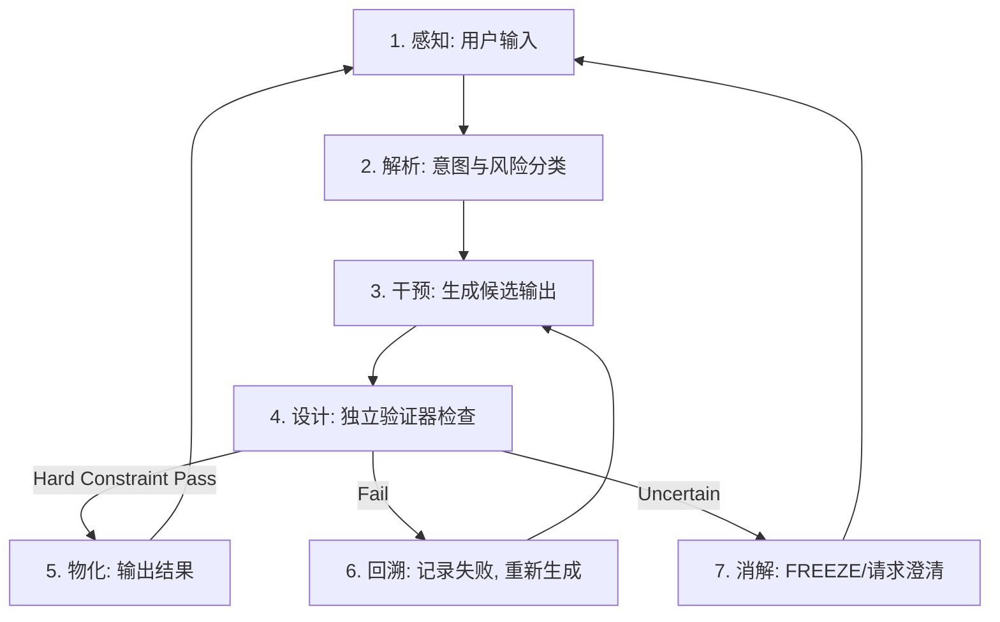

---
title: "ECET.P11 AI智能体设计"
subtitle: "自律与对齐的演化工程学"
date: "2026-02-18"
version: "1.0"
author: "ECET Project"
status: "Draft"
abstract: "本文档探讨在ECET框架下设计AI智能体（Agent）的原则。基于ODD.16的工程实践，提出'验证输出优于审查过程'的对齐策略，构建包含感知、解析、干预、设计、物化、回溯、消解的七序认知循环，并界定人机协作中的主体性边界。"
keywords: ["AI Agent", "对齐", "七序循环", "ODD", "门禁", "认知主权"]
---

# ECET.P11 AI智能体设计

## 1. 核心设计理念

### 1.1 对齐的范式转移

传统 AI 对齐（如 RLHF）试图通过训练改变模型的概率分布，使其倾向于生成"好"的输出。这在 ECET 看来是试图消除偏差的努力。

ECET 结合 ODD 的工程实践，提出新的对齐范式：

> **对齐不是让模型"内心善良"，而是让"坏输出"无法通过系统门禁。**

- **旧范式**：审查过程（Code Review），期望好结果。在 AI 生成速度远超人类审查速度时失效（ASTO 认知不对称原理）。
- **新范式**：验证输出（Output Verification）。建立独立于模型的验证器（门禁），直接检查产出物是否符合契约。

### 1.2 智能体的演化定位

在 ECET 视角下，AI 智能体不是全知全能的神谕，而是：

1.  **受限主体**：受能量、算力、上下文窗口的硬约束。
2.  **偏差生成器**：其价值在于以极低成本生成大量变异（偏差），供环境筛选。
3.  **不完备认知**：必须内置对自身局限性的认知（Freezing Mechanism）。

---

## 2. 认知架构：七序循环

ODD 框架将智能体的认知过程从简单的"输入-输出"扩展为 **1-5-6-7-1 七序动力学**。在 Agent 设计中，体现为完整的推理循环：



### 关键环节解析

- **设计（验证）**：这是 ECET 的核心。智能体不仅要"生成"，还要"验证"。验证必须由**独立于生成模型**的组件（规则引擎、物理仿真、逻辑检查器）完成。
  - *ECET 原理*：适应选择约束必须外置于变异源。
- **回溯（学习）**：当验证失败时，不仅是重试，更是学习的机会（更新 Bug 意向图）。
- **消解（冻结）**：当智能体无法确定时，必须有能力**停止**（FREEZE），而不是强行幻觉。这是对抗不完备性的终极手段。

---

## 3. 约束体系：三层对齐

### 3.1 规约层 (Hard Constraints)
- **定义**：不可商量的物理/逻辑/安全边界。
- **实现**：ODD 门禁（Gate）、规则引擎。
- **特性**：确定性、可审计。
- **例子**：不能输出儿童色情；转账金额不能为负；代码必须通过编译。

### 3.2 映射层 (Soft Constraints)
- **定义**：可协商的偏好、风格、效率权衡。
- **实现**：RLHF、Prompt Engineering。
- **特性**：概率性、模糊性。
- **例子**：语气要礼貌；代码风格要简洁。

### 3.3 自指层 (Meta-Constraints)
- **定义**：智能体对自身约束的反思与修正能力。
- **实现**：ODD 的 Challenge 机制（契约质疑）。
- **特性**：演化性。
- **例子**：智能体发现某条安全规则在当前场景下自相矛盾，主动发起 Challenge 请求人类介入，而不是死循环或崩溃。

---

## 4. 人机协作边界：认知主权

在 AI 介入系统设计的过程中，必须捍卫人的主体性（ASTO 人本公理）。

### 4.1 否定权 (Right to Reject)
人必须保留对 AI 产出物的最终否定权。即使 AI 极其智能，人也有权说"不"，这是自由意志的底线。

### 4.2 双流记忆 (Dual Memory)
为了防止"脑体分离"（人变成 AI 的操作员），系统设计须包含双流记忆：
- **情景记忆**（AI 擅长）：由 AI 记录海量的执行细节、日志、轨迹。
- **语义记忆**（人擅长）：由人提炼关键的决策逻辑、价值判断、最佳实践。

ODD 的"封存"环节，就是将情景记忆压缩为语义记忆的过程。

---

## 5. 参考架构：责任对称的工程实现

以下是"责任对称原则"在 AI Agent 系统中的最小工程实现。三个机制分别对应三大公理的工程落地。

### 5.1 紧急断电机制（Kill Switch）

**对应公理**：能量约束——物理系统必须可被物理中断。

**设计要求**：

```
┌─────────────────────────────────┐
│         Agent 运行层             │
│   （软件进程、API 调用、推理）     │
└──────────────┬──────────────────┘
               │
┌──────────────▼──────────────────┐
│       物理控制层（人类持有）       │
│                                 │
│  • 硬件电源开关（不经过软件栈）    │
│  • 网络隔离开关（物理断网）        │
│  • 存储只读锁（防止数据篡改）      │
└─────────────────────────────────┘
```

**关键约束**：
- Kill Switch 的触发路径不能经过 Agent 自身的软件栈。如果 Agent 可以拦截自己的关机指令，Kill Switch 就失效了。
- Kill Switch 必须是物理层实现，不是软件层实现。软件层的"关闭按钮"不算 Kill Switch，因为它可以被软件绕过。
- 触发后的状态必须是"安全停机"（所有进行中的操作回滚或冻结），不是"硬断电"（可能导致数据损坏）。

### 5.2 授权签名链（Authorization Chain）

**对应公理**：适应选择约束——每一层决策都必须有独立于执行者的授权来源。

**设计要求**：

Agent 的每一次操作都必须携带完整的授权链：

```
操作请求 = {
  action:       "转账 1000 元",
  executor:     "Agent-007",
  authorizer:   "财务主管张三",        ← 谁授权的？
  auth_scope:   "单笔 ≤ 5000 元",     ← 授权范围
  auth_expires: "2026-03-01T00:00:00", ← 授权有效期
  auth_chain:   [                      ← 完整授权链
    { level: "CEO → 财务总监", scope: "日限额 100 万" },
    { level: "财务总监 → 财务主管", scope: "单笔 ≤ 5 万" },
    { level: "财务主管 → Agent-007", scope: "单笔 ≤ 5000" }
  ],
  signature:    "ed25519:abc123..."    ← 不可伪造的签名
}
```

**关键约束**：
- 授权链中的每一层都必须可独立验证。门禁在检查操作时，不仅检查操作本身，还检查授权链的完整性。
- 任何一层授权缺失或过期，操作直接 FAIL。
- 授权链必须可审计——事后可以追溯"这个操作是谁批准的，批准范围是什么"。

### 5.3 可撤销密钥结构（Revocable Key Architecture）

**对应公理**：不完备约束——我们无法预见所有未来情境，因此所有授权都必须可撤销。

**设计要求**：

```
密钥生命周期：

  签发 → 激活 → 使用 → 过期/撤销
                         ↑
                    不存在"永久有效"的密钥

密钥层级：

  Root Key（人类持有，离线存储）
    └── Org Key（组织级，TTL = 1 年）
         └── Agent Key（Agent 级，TTL = 24 小时）
              └── Session Key（会话级，TTL = 1 小时）
```

**关键约束**：
- Agent 持有的密钥必须有 TTL（Time To Live）。没有永久密钥。
- 上级密钥可以随时撤销下级密钥。撤销是即时生效的，不需要等待过期。
- Root Key 必须由人类离线持有。如果 Root Key 在线，它就可能被 Agent 获取——这违反了责任对称原则。
- 密钥撤销后，所有基于该密钥签发的下级密钥自动失效（级联撤销）。

### 5.4 三个机制的协同

```
用户请求 → Agent 接收
              │
              ▼
        ① 检查授权签名链
           （授权是否完整、是否过期、范围是否匹配）
              │
         PASS ▼         FAIL → 拒绝
        ② 检查密钥有效性
           （Session Key 是否在 TTL 内、是否被撤销）
              │
         PASS ▼         FAIL → 拒绝
        ③ ODD 门禁验证
           （输出是否符合契约）
              │
      PASS ▼    FAIL → 回溯    FREEZE → 请求人类介入
        ④ 执行操作
              │
              ▼
        ⑤ 记录审计日志
           （操作 + 授权链 + 密钥 + 门禁结果）
```

如果在任何环节出现不可恢复的异常：触发 Kill Switch。

---

## 6. 工程实践参考 (ODD)

详细的工程落地规范，请参考 ODD 文档集：
- **ODD 交互协议**：智能体如何评估和分级 ODD。
- **《ODD.16 LLM 对齐与训练指导》**：详细的对齐策略。
- **《ODD.03 状态机与门禁》**：三值逻辑（PASS/FAIL/FREEZE）的实现。
- **《ODD.0E Bug 意向图》**：偏差管理工具。

---

**Version**: 2.0
**Last Updated**: 2026-02-24
**Status**: Draft

**v2.0 更新内容**：
1. 新增第 5 节"参考架构：责任对称的工程实现"
2. 新增紧急断电机制（Kill Switch）设计要求
3. 新增授权签名链（Authorization Chain）设计要求
4. 新增可撤销密钥结构（Revocable Key Architecture）设计要求
5. 新增三机制协同流程图
