---
title: "ECET概念图集"
subtitle: "Mermaid格式关键概念可视化"
date: "2026-02-18"
version: "1.0"
author: "ECET Project"
document_type: "可视化"
---

# ECET概念图集

> 使用Mermaid格式绘制ECET理论的关键概念图

---

## 一、理论整体架构

### 1.1 三层学术架构

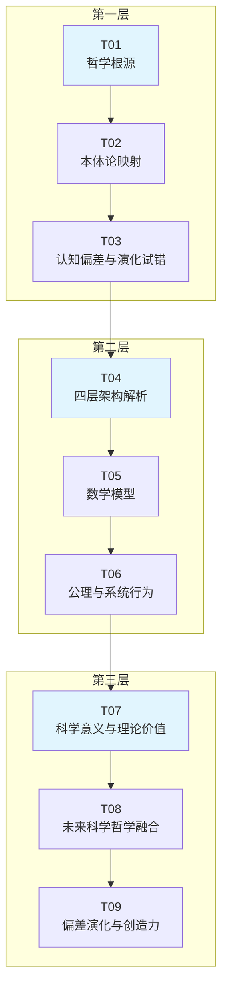

### 1.2 文档依赖关系

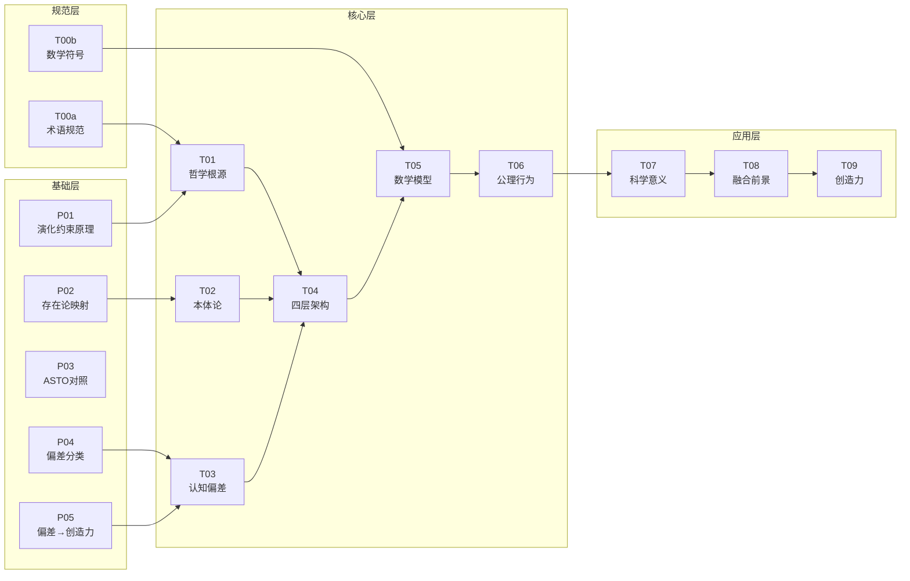

---

## 二、核心概念关系

### 2.1 三大演化约束公理

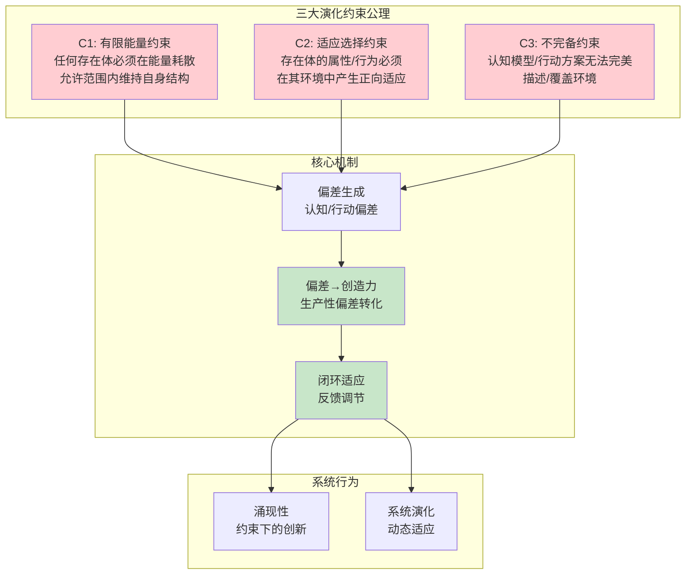

### 2.2 偏差-创造力转化机制

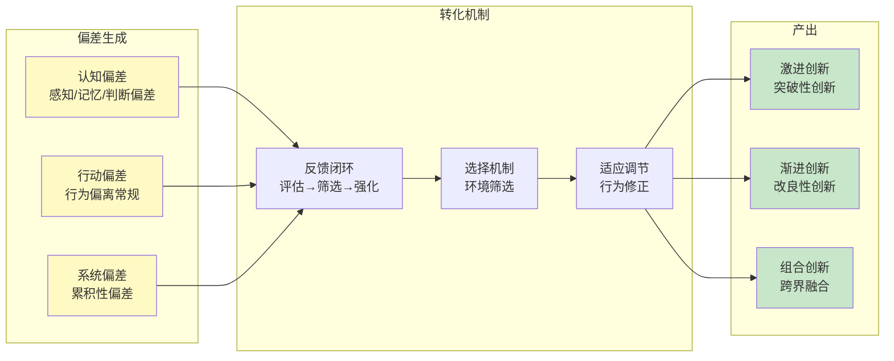

---

## 三、系统动力学

### 3.1 闭环适应流程

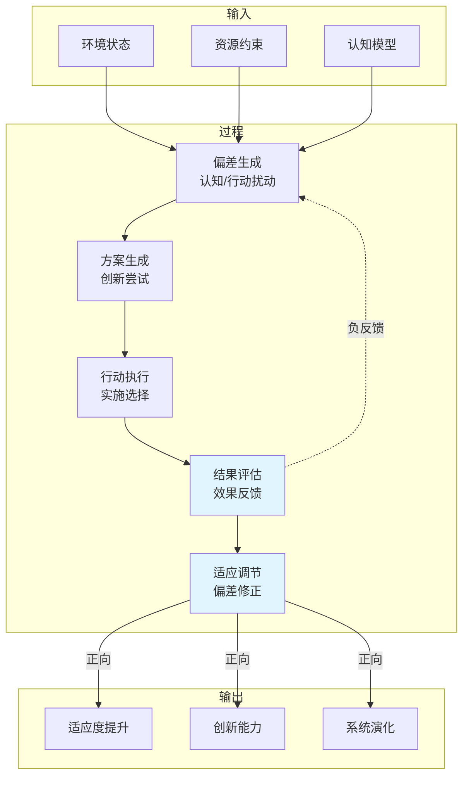

### 3.2 约束-创造力动态

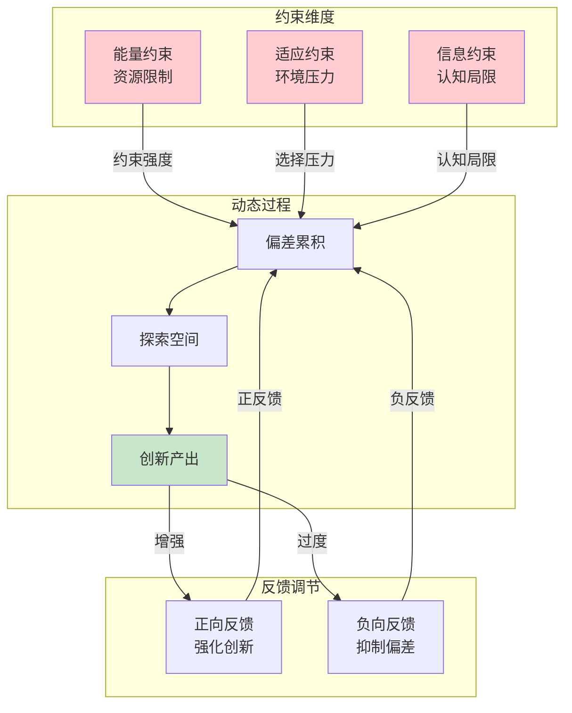

---

## 四、ECET与其他理论的关系

### 4.1 理论对比图

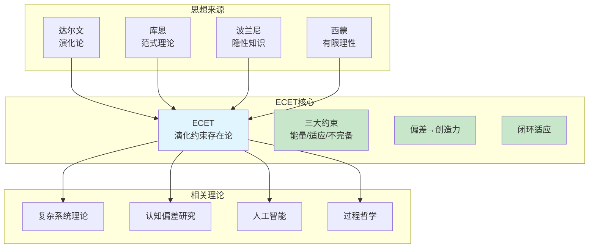

---

## 五、ECET应用框架

### 5.1 派生理论架构

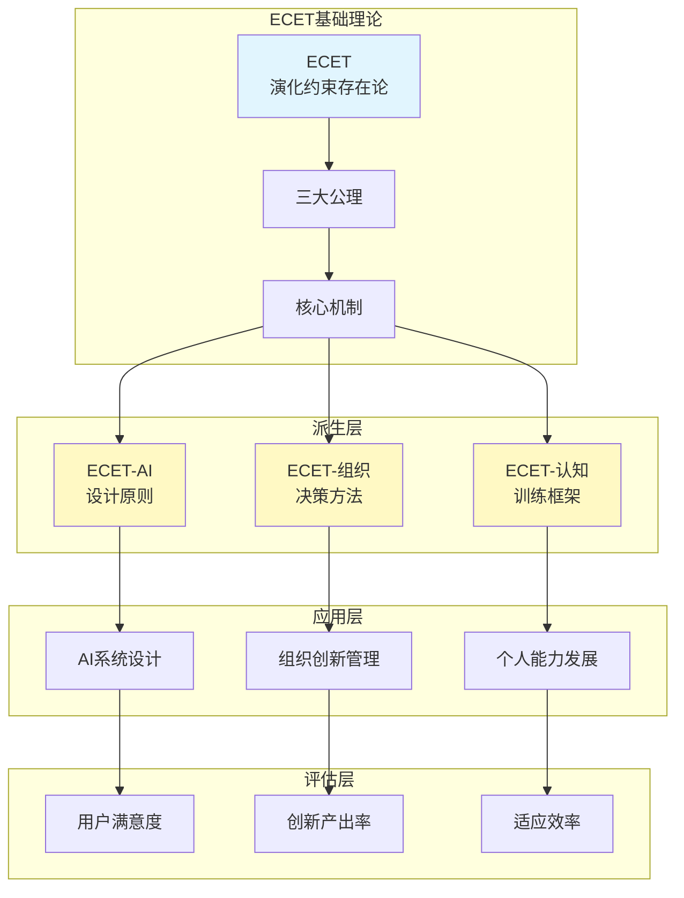

---

## 六、ECET关键洞见

### 6.1 范式转换

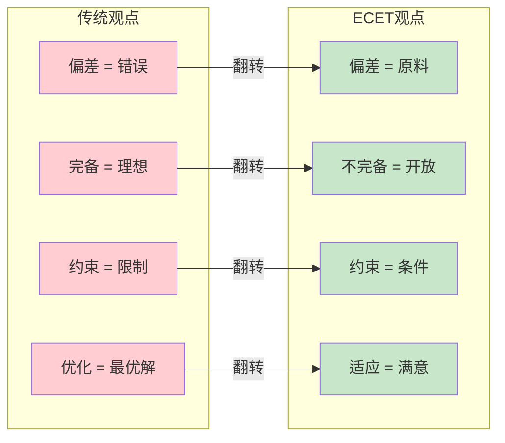

---

## 七、ECET适用边界

### 7.1 适用范围

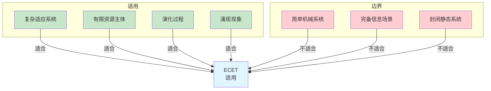

---

## 八、验证逻辑

### 8.1 假设检验流程

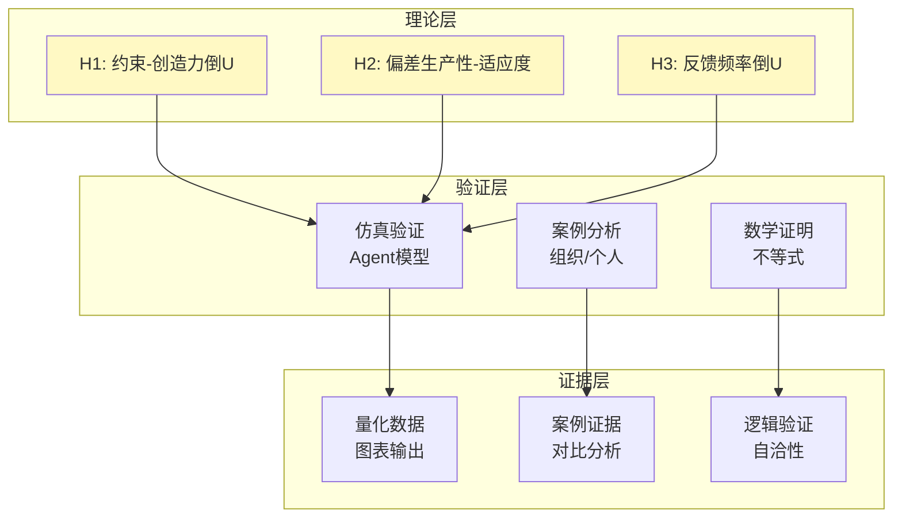

---

**文档版本**：1.0  
**最后更新**：2026-02-18  
**状态**：完成

**使用说明**：可将以上Mermaid代码复制到支持Mermaid的编辑器（如Notion、Obsidian、GitHub）中进行渲染。
