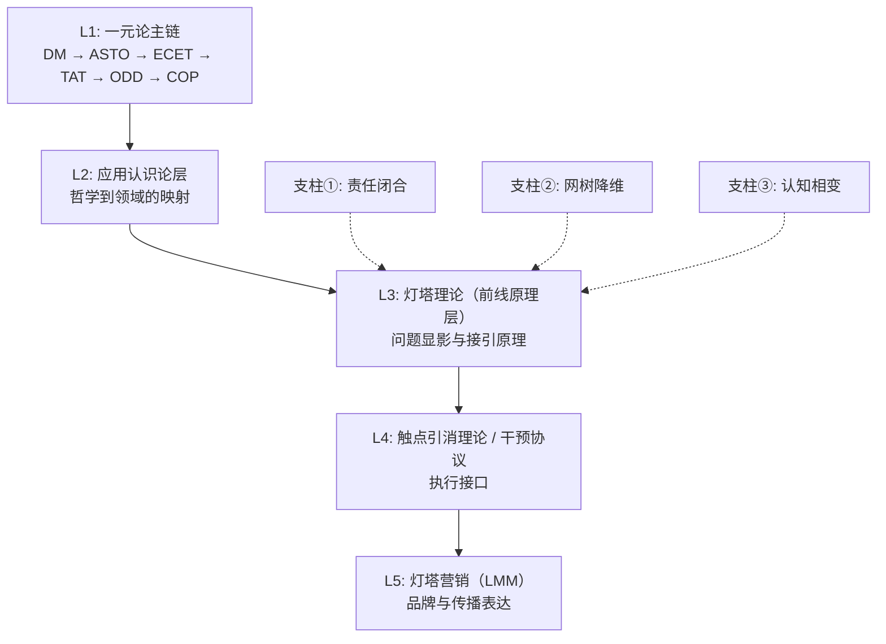

# LMM.理论.003 — 灯塔理论基础与系统架构

> **版本**：v2.4（职责同步版） | 日期：2026-03-27
> **核心属性**：定义 LMM 通用理论的位阶、架构与干预红线。

---

## 术语公约 (Theoretical Lexicon)

| 范畴 | 唯一学术术语 | 定义 |
|:---|:---|:---|
| **本体系名称** | **灯塔理论 (Lighthouse Theory)** | 面向系统逻辑的公共理论名 |
| **操作协议层** | **触点引消理论 / 干预协议 (Intervention Protocol)** | 原理层下沉为执行指令的接口 |
| **体系缩写** | **LMM** | `Lighthouse Marketing Methodology` 的历史缩写；在本库中默认作为**全体系索引缩写**使用，而非单独指代某一层 |
| **传播品牌** | **灯塔营销 (LMM Brand)** | L5 对外传播层的品牌表达；仅在传播语境下可单独指代 L5 |
| **三大支柱** | ① 责任闭合 ② 网树降维 ③ 认知相变 | 理论支撑的物理基础 |
| **动力学模型** | **场-路-人 (Field-Path-Person)** | 描述干预矢量与决策轨迹的三体运动 |
| **质量红线** | **R=1 责任闭合** | 对抗认知熵增与责任逃逸的强制机制 |
| **前端链条** | **灯塔 -> 自测 -> 港口** | 描述前台照明、弱测量与承接的最小合法顺序 |

---

## 一、灯塔理论核心命题

**灯塔理论不是关于“广而告之”的宣发技巧，而是关于在高熵场域中，通过建立“唯一责任锚点”实现认知资源重组，并对重组后的结果实施物理接管。**

其核心逻辑：不通过主观劝诱改变他人，而是通过结构扰动触发其认知系统的稳定性跃迁。

---

## 二、五级逻辑架构 (Logical Architecture)

灯塔理论并非孤立存在，而是从一元论主链逐层下沉到现实前线的显影、弱测量、港口接引与责任回流协议。

| 层级 | 名称 | 功能定义 | 位阶 |
|:---:|:---|:---|:---|
| **L1** | 一元论主链 (`DM / ASTO / ECET / TAT / ODD / COP`) | 提供边界、责任、执行与诊断的上位继承链 | 上位法源 |
| **L2** | 应用认识论层 | 哲学逻辑向领域逻辑的过渡 | 转换器 |
| **L3** | **灯塔理论（前线原理层）** | 说明问题显影、场域进入、港口接引为何成立 | **原理层** |
| **L4** | **触点引消理论 / 干预协议** | 扰动信号的布置、Kairos识别、弱测量、自测分流、承接与回流 | **操作协议层** |
| **L5** | **灯塔营销 (LMM)** | 面向公众的品牌表达与传播投射 | **传播层** |

### 2.1 跨层接口纪律

为防止 `LMM` 继续把上游职责全部吞掉，

本文件固定以下分工：

- `BOS` 评估的是问题场是否值得进入，不是主体诊断器。
- `COP` 评估的是具体主体当前处于什么结构状态，并给出 `UNKNOWN / FREEZE / REFER / MIXED / RESOLVE` 之类的分流状态。
- `LMM` 负责在可进入场域中安排显影、弱测量、港口接引与责任回流节律。
- `TAT` 负责高影响责任门槛、责任主体与闭门责任裁决。
- `ODD` 负责把承诺、材料、确认单、验证与审计压成可封存的工程接口。

---

## 三、干预红线守则 (The Guardrails)

在进行任何系统干预动作时，必须遵守以下四条物理铁律：

1. **扰动契机 (Trigger Gate)**：只有观察到主体系统出现“认知别扭”或“流变信号”时方可发出干预信号。严禁无差别主动推销。
2. **网树降维 (Reduction)**：禁止提供复杂的路径网。必须将网状可能性压缩为具备明确节点的单主干导航树。
3. **熔断机制 (Stop Rule)**：如果首个干预信号（探针）未触发主体系统的共鸣反馈，立即撤出所有资源。禁止解释，保护品牌信用（Entropy Protection）。
4. **责任接管 (R=1 Capture)**：任何形式的价值交换必须伴随责任闭合。实现风险从决策主体向引渡者（灯塔）的完全转嫁。

### 3.1 执行层补充纪律

为防止前线把理论直接滑回传统漏斗，

本文件补充以下执行纪律：

- 前端最小合法链条是：`灯塔内容 -> 自测 -> 港口承接 -> 责任闭合`
- `BOS` 的高分不等于主体已可承接；主体是否进入下一步，优先回引 `COP`
- `自测` 的理论身份是弱测量过滤器，不是报价入口
- `港口承接` 只在主体完成初步自识别并出现物理接近动作后才启动
- 在高争议、高影响或高风险场景中，`R=1` 应配套 `R-Eval` 客观校验，并在高影响边界回引 `TAT / ODD`

### 3.2 自动化边界

LMM 不排斥自动化，

但自动化的合法职责仅限于：

- 问题场初筛
- 节律识别
- 内容调度
- 自测分流
- 退出序列

自动化不得替代：

- 首次责任闭合
- 深度共建判断
- 责任移交的最终裁定

---

## 四、层级使用补注

为防止跨文件阅读时产生混乱，

本库统一执行以下口径：

- 当说 `灯塔理论` 时，默认指 `L3`
- 当说 `触点引消理论` 或 `干预协议` 时，默认指 `L4`
- 当说 `灯塔营销` 时，默认指 `L5`
- 当说 `LMM 体系` 时，默认指整个 `L1-L5` 的索引总称

补充说明：

- 当说 `灯塔` 时，优先指问题显影层
- 当说 `自测` 时，优先指弱测量过滤层
- 当说 `港口承接` 时，优先指责任边界、确认单、首诊、正式承接与闭合入口

---

## 五、本体论映射：LMM 作为 ASTO 的具象化操作台 (Ontological Mapping)

LMM 的底层动力学是 ASTO（属集变迁存在论）中“三凹结构”在具体市场场域中的投影，它确立了干预实施的正当性：
- **场 (Field) = 认知凹**的集体化呈现。旧有认知结界已经兜不住现实的复杂性而发生坍塌。
- **路 (Path) = 实践凹**中的阻力最小通道。干预信号流向现实、重构属集的确定性物理轨迹。
- **人 (Person) = 价值凹**深处的主体锚定。那些感知摩擦力最敏锐的高耗散决策节点。

**推论**：LMM 的“网树降维”，本质上是将这三个凹陷进行架构上的架叠压缩，以一根责任引渡管，贯穿完成高压状态下的属集重塑。

---

## 六、与总盘资产的集成关系

| 资产名 | 在灯塔框架中的位阶 |
|:---|:---|
| **思维越狱** | 初始扰动触点 + 认知空位探测 |
| **goodmem** | 节点接管 + 责任承接接口 |
| **TAT** | 高阶复杂问题的诊断解法 |
| **2KeyRun** | 轻量级干预工具实现 |
| **DeBorn** | 存量高熵系统的深度改造工程 |

