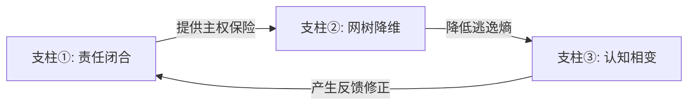

# LMM.理论.005 — 三大支柱定义与机制推导

> **版本**：v2.4（位阶与观测边界补强版） | 日期：2026-03-27
> **核心属性**：确立本系统逻辑的物理支撑框架。
> **逻辑序列**：责任闭合边界 → 网树降维原理 → 认知相变机制。

---

## 一、三大支柱总览 (The Pillars)

灯塔理论（LMM）的稳定性由三个物理支柱支撑。其严格化逻辑为：**先明确“权属交接的主权边界”，再描述“认知熵减的路径”，最后推演“系统状态的跃迁”。**

| 支柱 | 定稿级别 | 核心价值 |
|:---|:---|:---|
| **① 责任闭合边界** | ✅ 基础公理层 | 与传统非责任引导方式的本质分野 |
| **② 网树降维原理** | ⚠️ 结构命题层 | 描述系统认知的路径压缩模型 |
| **③ 认知相变机制** | 🔬 动力学假说层 | 描述非线性决策跃迁的机制假说 |

### 使用位阶纪律

为防止前线把三大支柱混成同一强度的“真理陈述”，

本文件明确规定：

- **支柱① 责任闭合**：可直接作为制度红线、协议红线与发布红线使用。
- **支柱② 网树降维**：可作为设计原则与执行判准使用，但应接受具体场景校验。
- **支柱③ 认知相变**：只可作为解释框架与方向性假说使用，不得包装成精确预测器。

---

## 二、支柱① — 责任闭合边界 (Responsibility Closure)

### 1. 学术定义与本体论溯源
**责任闭合边界**，是指在一次系统干预动作（引渡）中，能够连续承担**触发扰动、解释逻辑、分配资源、吸收反馈、后果修复与主权接管**的最小有效责任集合。

> **深层本质**：责任闭合（R=1）其形而上学的本质是——干预者通过物理化的对价接管，强行将主体系统中不可见的“负一阶（潜在的结构性衰败与可能性损耗）”显影为正阶的“确定性代价”。使得无序的流失变成有序的止损。

### 2. 闭合判定准则 (R-Closure Questions)
任何引渡动作，若下列要素不能在其权属范围内连续闭合，均视为“无点灯资格”：
- **触发源**：谁发出初始信号？
- **解释源**：谁定义信号逻辑？
- **配置源**：谁协调干预资源？
- **后果源**：谁承接由于认知改变产生的物理负反馈？
- **修正源**：谁对后续偏差实施动态闭合？

### 3. 为什么它是定海神针
传统非责任式引导（营销）的本质是“责任转嫁”——将各种美好的期待通过流量卖给受众，但对受众由于期待破灭导致的损失完全不负责。
灯塔理论的 R=1 原则要求每一笔资源对价回流（收入）必须有明确的物理责任边界。这实现了风险从**认知决策主体**向**灯塔系统**的真实转嫁。

---

## 三、支柱② — 网树降维原理 (Net-Tree Reduction)

### 1. 学术定义
**网树降维**，是指在高熵、多变量的复杂场域中，将具备无穷路径可能性的**网状认知拓扑**，压缩为具备确定节点、单向矢量、可验证主干的**树状执行结构**的过程。

### 2. 认知压缩机制
- **熵减探测**：主体之所以迷茫（认知礁石），是因为处于高复杂度的网状循环困局中。
- **关键节点识别**：灯塔的作用绝非增加信息量，而是通过发出“相干光”，让主体在网中锁定唯一的逃逸主干（The Backbone）。
- **重置决策门槛**：通过将复杂的全真选项压缩为“是/否”或“树状分流”选项，降低其认知决策能耗。

### 3. 最低操作判准

凡声称自己在执行“网树降维”，

至少应同时满足以下四条中的大多数：

- 每个关键触点只给出一个主动作，而不是多个并列 CTA。
- 每一步结束后，主体只面对`继续前进`或`安全退出`，而不是横向跳转森林。
- 诊断内容与承接动作之间存在可追踪主干，不靠“你也可以再看看别的”维持热闹。
- 任何新增信息都在帮助收束路径，而不是扩大解释网。

---

## 四、支柱③ — 认知相变机制 (Phase Transition)

### 1. 学术定义与局域封板
**认知相变**，是指主体（受众系统）在旧有认知结构的张力下，受到足够强度且方向一致的干预扰动后，跨越启动能垒（Activation Energy），由旧稳定态向新决策态发生的**非线性跃迁**。

> **临时封板模型 (Local & Temporal Sealing)**：在 ASTO 的“绝对流变”视角下，LMM 中的“相变”并不制造永恒的终极稳态，而是制造“局域相变与临时封板”。即在当前商业周期内，为系统构建一个**抗熵增的安全隔离罩（锁定）**，以完成能量的阶段性结晶与责任的顺利过渡。

### 2. 类比与使用边界

为避免“相变”一词被误用为玄学光环，

本文件强制补充以下边界：

- 允许借用“相变 / 启动能垒 / 稳态”作为**解释性类比**。
- 不允许将其表述为已经被精确量化的物理定律。
- 对外发布时，优先使用`动力学假说`、`方向性框架`、`观测模型`等表述。

### 3. 关系命题 (Mechanism Proposition)
当前仅保留如下**描述性符号模型**：

> `认知相变倾向` 随 `场域张力` 与 `扰动强度` 上升而增强，随 `结构刚性` 上升而减弱。

这里的三个变量，

当前只允许作为**定性代理指标**使用：

- `场域张力`：对象是否已出现明显别扭感、停表冲动、内外失配反馈
- `扰动强度`：触点是否足以构成问题显影，而不是背景噪音
- `结构刚性`：对象既有路径、身份防御、组织惯性是否极强

补充说明：

- 这不是可计算方程
- 这不是统计回归模型
- 这只是一个帮助前线判断方向性的符号框架

因此，

严禁把它包装成“精确预测公式”。

### 4. 相变的最低观测信号

在 LMM 中，

下列信号只可视为**接近信号**，

不可直接判定为相变完成：

- 口头认可
- 点赞、收藏、转发
- 表达兴趣
- 泛泛咨询

更稳的相变观测信号，

应优先锁定为**物理让渡动作**，例如：

- 主体主动提交内部数据
- 主体同意独立审计或首诊
- 主体签署责任附件
- 主体完成首笔对价支付

### 5. 应用边界
认知相变不能通过“缓慢的说服”产生，它必须依托于环境的极度非平衡态（认知别扭感）。如果没有这种张力基础，任何干预信号都将湮灭在背景噪音中。

---

## 五、支柱间的内在逻辑链

- **责任闭合**解决了“凭什么信（Safety）”。
- **网树降维**解决了“怎么做（Efficiency）”。
- **认知相变**解决了“为何变（Dynamics）”。

---

> [!IMPORTANT]
> **滥用预警**：支柱③（相变）具备极强的解释诱惑，但若脱离支柱①（责任闭合）的约束，它将退化为危险的“精神控制术”。在灯塔理论中，任何未伴随物理责任接管的“相变”，都是系统违禁操作。

