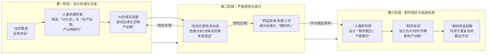

# ODD 核心隐喻：智能制药工厂 (The Intelligent Pharma Factory)

> **核心价值**：解决 AI 产出物"不可信"的质疑，提供一个严谨、可验证、可组合的直观模型。

---

## 1. 为什么选择"制药工厂"作为比喻？

*   **信任的来源**：没人相信"随机生成的药"，但大家都信任"经过 GMP 认证、通过临床试验的药"。ODD 的信任不来自 AI 的智能，而来自**流程的严谨**。
*   **流程的对应**：
    *   **配方 (Formula)** = **契约 (Contract)**
    *   **合成 (Synthesis)** = **生成 (Generation)**
    *   **质检 (QC)** = **验证 (Verification)**
    *   **原料药 (API)** = **原子产出物 (Atomic Artifact)**
    *   **制剂 (Formulation)** = **组合产出物 (Composite Artifact)**

---

## 2. 核心流程图解

---

## 3. 角色重塑 (Role Rebranding)

| 传统角色 | ODD 新角色 (制药版) | 职责变化 |
| :--- | :--- | :--- |
| **程序员** | **药理学家 (Pharmacologist)** | 不再亲自摇试管 (写代码)，而是设计分子式 (定义接口) 和质检标准 (验收条件)。 |
| **AI Copilot** | **合成反应釜 (Synthesizer)** | 在严格控制的条件下，不知疲倦地尝试合成路径，直到产出符合标准的化合物。 |
| **测试脚本** | **自动化质检线 (QC Line)** | 包含纯度检测 (Lint/Compile)、毒性实验 (Security Scan)、临床试验 (E2E Test)。 |
| **代码库** | **药典 (Pharmacopoeia)** | 存储的是"已验证的配方"和"合格的原料药"，而不是杂乱的实验记录。 |

---

## 4. 三层话术体系 (Pitching Script)

### 第一层：电梯演讲 (Elevator Pitch) - 面向大众
> "ODD 就像一家**智能制药公司**。人类专家负责设计‘配方’和‘质检标准’，AI 负责在实验室里尝试合成。不管 AI 怎么折腾，产品必须通过全自动的严格质检线才能出厂。只有合格品才能成为‘标准原料药’，被安全地用于后续的药品生产。"

### 第二层：逻辑拆解 (Step-by-Step) - 面向管理者/产品经理
> 1.  **定义 (Define)**：人类药理学家写出精确的“分子式” (契约)，规定药效 (功能) 和副作用上限 (Bug)。
> 2.  **合成 (Generate)**：AI 像高速实验机器人，根据配方尝试合成。它可能失败 100 次，但我们只关心成功的第 101 次。
> 3.  **验证 (Verify)**：这是核心。每一批产出物都要过质检 (自动化测试)。任何杂质 (Lint Error) 或毒性 (Security Flaw) 都会导致整批报废。
> 4.  **封版 (Seal)**：通过质检的产物被批准为“原料药”。它是稳定的、可信的黑盒。
> 5.  **组合 (Compose)**：人类药剂师用“原料药 A” + “原料药 B”，按新配方制成“复方片剂”。这就是软件的模块化组装。

### 第三层：深度辩护 (Defense) - 面向技术专家
> **质疑**：“AI 生成的代码能信吗？我不放心。”
>
> **回答**：“您说得对，**AI 不可信，但流程可信。**
> 就像我们不信任某个具体的化学实验员，但我们信任遵循 **GMP (药品生产质量管理规范)** 的制药体系。
> *   ODD 的‘契约’就是 GMP 标准。
> *   ODD 的‘自动化验证’就是质检流水线。
> *   AI 只是一个被严格监控的‘操作工’。
>
> 只要标准足够严 (Contract Rigidity)，质检足够狠 (Adversarial Testing)，最终出厂的药就是安全的。ODD 不依赖对 AI 的盲目信任，它依赖的是**结构化的零信任体系 (Structured Zero-Trust)**。”

---

## 5. 对比优势

| 比喻 | 优点 | 缺点 |
| :--- | :--- | :--- |
| **厨房炒菜** | 亲切、易懂 | 缺乏严谨感，像手工作坊，难以体现"工业级可靠性"。 |
| **汽车工厂** | 强调流水线、标准化 | 侧重于硬件组装，难以体现软件的"逻辑复杂性"和"副作用"。 |
| **制药工厂** | **严谨、高科技、生命攸关** | 完美对应软件的**黑盒特性** (吃药不需要知道化学反应) 和**严格验证**需求。 |

---

> **结论**：在未来的对外宣传和文档中，统一使用 **"智能制药工厂"** 作为 ODD 的核心隐喻 (Root Metaphor)。
