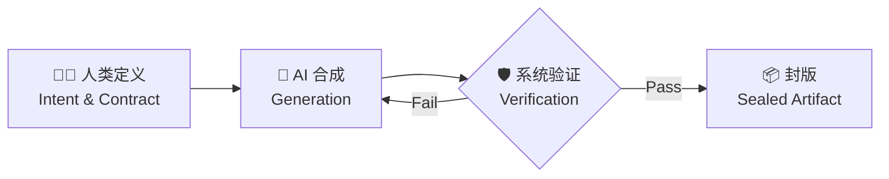

# **ODD: 给 AI 时代的软件开发装上“方向盘”**

### 从“审查每一行代码”到“验收最终结果”的范式跃迁

**Speaker Name**
*ODDFounder*

---

# **挑战：我们共同的新困局**

### 💀 AI 生成代码的速度 >> 人类审查代码的速度

*   **Left**: 🤖 AI (Copilot/ChatGPT) 1秒钟生成 500行代码。
*   **Right**: 🧑‍💻 人类开发者 1小时只能审查 200行代码。

**结果**：
1.  **审查崩溃**：人类开始 "Rubber Stamping"（盖章通过），不再仔细看代码。
2.  **信任危机**：生产环境 Bug 频发，没人知道 AI 到底写了什么。

> **"旧的‘人审代码’模式已崩溃，我们需要新模式。"**

---

# **新范式：智能制药工厂**

### 💊 不做“厨师”，做“药理学家”

| 传统模式 (厨房炒菜) | ODD 模式 (制药工厂) |
| :--- | :--- |
| **角色** | 厨师 (亲自掌勺) | **药理学家** (设计配方) |
| **输入** | "想吃顿好的" (模糊) | **精准分子式** (契约) |
| **过程** | 手工烹饪 | **AI 自动化合成** |
| **验证** | 尝一口 (主观) | **GMP 流水线** (客观质检) |
| **输出** | 一盘菜 | **标准原料药** (封版产出物) |

---

# **核心流程：从定义到封版**



1.  **定义 (Define)**: 人类只写契约 (Contract)，不写代码。
2.  **合成 (Generate)**: AI 负责实现，失败了就重试。
3.  **验证 (Verify)**: 变异测试、对抗攻击、安全扫描。
4.  **封版 (Seal)**: 通过验证即为"合法"，加密存档。

---

# **人类角色的升级**

### 🚀 从 "Code Reviewer" 到 "Value Architect"

*   **Before**:
    *   盯着 `if (x == null)` 发愁。
    *   纠结于变量命名风格。
    *   **"我是 AI 的保姆。"**

*   **After (ODD)**:
    *   定义业务价值 (Value)。
    *   设计系统边界 (Constraints)。
    *   裁决高风险决策 (L4 Governance)。
    *   **"我是 AI 的指挥官。"**

---

# **核心机制 I：CAP (对抗生成)**

### ⚔️ 质量不是写出来的，是“辩”出来的

**"Proposer" (鲁班)** vs **"Challenger" (李冰)**

*   **鲁班**: "我生成了这个登录接口契约。"
*   **李冰**: "攻击！你没定义 Token 过期时间。我可以伪造永久 Token。"
*   **鲁班**: "修复！增加 `expiry: 3600s` 约束。"
*   **人类**: "批准。"

> **消除模糊性，从源头阻断 Bug。**

---

# **核心机制 II：L1-L4 风险分级**

### 🚦 不是所有代码都需要“三堂会审”

*   **L1 (Low)**: UI 颜色微调 -> **生成即发布**
*   **L2 (Medium)**: 一般业务逻辑 -> **自动化测试 + 变异测试**
*   **L3 (High)**: 核心算法 -> **对抗性攻击验证**
*   **L4 (Critical)**: 支付/鉴权 -> **多 Agent 交叉审核 + 人类签字**

**原则**：让简单任务快，通过；让关键任务稳，可信。

---

# **产出物管道：从“原料药”到“制剂”**

### 🧱 可靠性来自“封版产出物”可复用、可组合

```mermaid
flowchart TD
    subgraph A [阶段一：定义]
        A1[“业务意图”] --> A2[“人类药理学家/设计师\n定义『初始产出物契约』\n规定规格、接口与验收标准”]
    end

    subgraph B [阶段二：生成与验证]
        A2 --> B1[“AI合成实验室\n根据契约生成\n『产出物A』(模块/服务等)”]
        B1 --> B2[“自动化质检流水线\n严格检验『产出物A』\n是否符合契约”]
        B2 -- “质检通过” --> B3[“封版\n成为可信的『产出物A』”]
        B2 -- “质检失败” --> B1
    end

    subgraph C [阶段三：组合与提升]
        B3 -- “作为稳定输入” --> C1[“人类药剂师/架构师\n定义『下游契约』\n约定如何加工『产出物A』\n以得到『产出物B』”]
        C1 --> C2[“新的生成与验证循环\n以封版的『产出物A』为输入\n生成并验证『产出物B』”]
        C2 --> C3[“封版产出物B\n可继续作为更复杂产出物的输入”]
    end

    A --> B --> C
```

---

# **为什么能信任？**

### ✅ 信任不来自“相信AI”，而来自“GMP式质控体系”

*   我们不要求 AI “永远正确”。
*   我们要求：**任何产出物必须通过可验证的门禁**，否则就不能进入下一阶段。

对应关系：
*   **契约** = 配方 / 生产标准
*   **验证流水线** = 质检
*   **封版产出物** = 批准上市的原料药

---

# **带来的三大价值**

1.  **对企业 (Enterprise)**:
    *   **Risk Control**: 每一行代码都有据可查，符合审计要求。
    *   **Velocity**: 解放审查瓶颈，恢复交付速度。

2.  **对开发者 (Developer)**:
    *   **Liberation**: 告别枯燥的 Review，回归创造性思考。
    *   **Focus**: 专注于 "What" (要什么)，而不是 "How" (怎么写)。

3.  **对系统 (System)**:
    *   **Resilience**: 系统通过不断的“对抗”自我进化，越用越强。

---

# **ODD 不是什么？**

*   ❌ **不是要取代程序员**
    *   它需要更高阶的程序员（架构师/领域专家）。
*   ❌ **不是全自动魔法**
    *   它依赖于严谨的契约定义，垃圾输入 = 垃圾输出。
*   ❌ **不适合所有场景**
    *   不适合：早期探索、创意原型（Draft 阶段）。
    *   适合：核心业务、长期维护的系统（Production 阶段）。

---

# **一个极简案例：Secure Login**

1.  **人类**: "我要一个登录框，要安全。"
2.  **CAP**: AI 互博，补充了 "Rate Limiting", "Audit Log", "JWT Expiry"。
3.  **Risk**: 系统判定为 **L3 (High Risk)**。
4.  **Workshop**:
    *   Builder 生成 Python 代码。
    *   Breaker 发起 10,000 次 SQL 注入攻击 -> **全部拦截**。
5.  **Delivery**: 交付封版构件 `Login_v1.0`。

---

# **何时考虑 ODD？**

✅ 适合：
* 需求相对明确的核心业务模块
* 高可靠 / 可审计场景（金融、合规、平台能力）
* 希望规模化使用 AI（但不想失控）的团队

❌ 不适合：
* 早期创意探索、强不确定原型

---

# **如何开始（3 步）**

1. 选一个小而明确的需求（例如：一个 API / 一个数据转换）。
2. 用 ODD 写出 **契约**（输入/输出/验收/边界/威胁）。
3. 接入验证流水线（至少：自动化测试；可选：变异测试 / 对抗测试）。

---

# **一起完善 ODD**

### 软件工程正在工业化，但这套“方向盘”需要更多人一起打磨。

* 📄 阅读完整版：Paper I–V + S1
* 🧪 从一个真实项目开始试用
* 💬 欢迎提出反例、边界条件、和改进建议

（在这里放二维码 / 链接）
* GitHub: [ODDFounder/Progee](#)
* Paper V: [Autonomous Software Factories](#)

---

# Q&A

谢谢。

---
