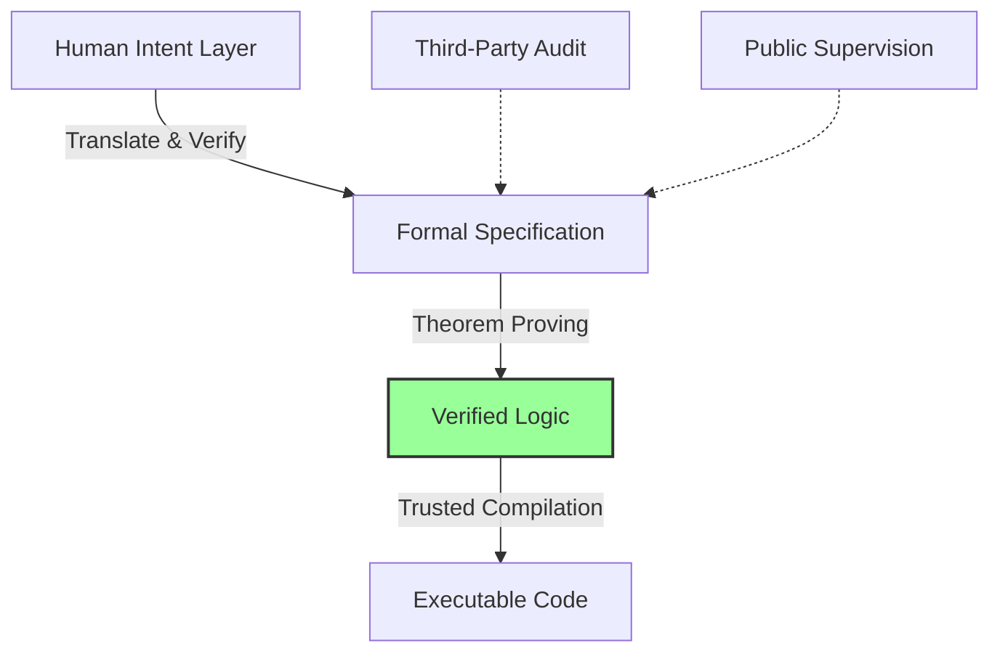
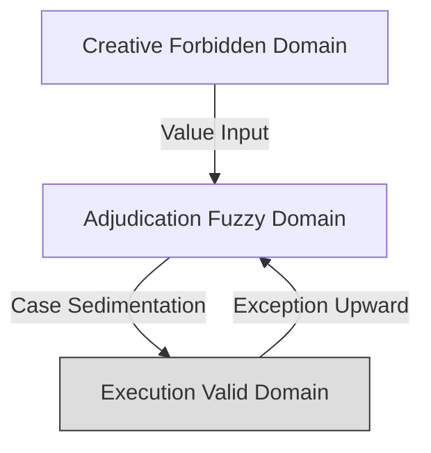

# **Executable Normativism: A New Paradigm for Digital Governance**

**Authors**: Yi Fu  (ODDFounder [fuyi.it@live.cn](mailto:fuyi.it@live.cn))

**Abstract**:
In the digital age, traditional governance systems based on natural language laws and bureaucratic hierarchies are failing to cope with the complexity and speed of modern society, resulting in an unsustainably high **"Social Friction Coefficient."** This manifesto proposes **Executable Normativism**, a new paradigm that transforms parts of the social contract from ambiguous texts into precise, real-time, verifiable computational entities. Drawing from the engineering practices of the **ODD (Open Digital Democracy)** platform and the **ODD (Output-Driven Development) [1]** methodology, this paradigm advocates for **Code Constitutionalism** and **Embedded Compliance** to shift governance from ex-post punishment to ex-ante prevention. Preliminary prototype experiments demonstrate significant reduction in social friction, higher compliance, and faster multi-agent coordination. This framework constructs a **"rational exoskeleton"** for civilization where **Rule by Logic** structurally replaces human arbitrariness, while strictly preserving human sovereignty in creative and ethical domains.
This document is a manifesto for the paradigm of Executable Normativism, proposing a new approach to digital governance.

**Keywords**: Executable Norms, Social Friction Coefficient, Code Constitutionalism, Digital Social Contract, Embedded Compliance, ODD

---

## **Preamble: Reconstructing the Social Contract in the Digital Age**

We live in an era where **social complexity** and **governance efficiency** are undergoing a severe rupture. This is not just about Artificial Intelligence or agents, but about the **political survival of humanity itself**.

Traditional governance systems based on **natural language laws + bureaucratic hierarchies** are showing systemic fatigue:

* Ambiguity of natural language generates enormous **social friction**.
* Discretionary power leads to **execution deviation**.

**Executable Normativism declares**: governance lies not in "control" but in the **deterministic execution of norms**. Parts of the social contract can be transformed into **precise, real-time, verifiable computational entities**, creating a **"zero-friction"** civilizational order.

> This is not the rule of machines over humans, but the structural substitution of **"Rule by Logic"** for human arbitrariness; it is the compilation of human will into immutable logical contracts.

---

## **Chapter 1: The Revolution of Governance Media – Physics of Social Friction Coefficient**

The efficiency of human collaboration depends on the **physical properties of normative media**. We define **Social Friction Coefficient** as the resistance generated by trust, verification, and execution in social operations.

1. **Oral Tradition Era**

   * Relied on memory and interpersonal trust.
   * Collaboration limited to acquaintances; friction rises exponentially with distance.

2. **Textual Code Era**

   * Relied on natural language + bureaucracy.
   * Enabled long-distance governance but **interpretive openness** created high noise; intermediaries (lawyers, judges) were necessary.

3. **Executable Norm Era**

   * Norms formalized in **code**.
   * **Zero Trust Friction**: Execution depends on logic verification, not human moral trust.
   * **Real-time Response**: Actions and behaviors are synchronous; collaboration enters a "superconducting" state.

---

## **Chapter 2: Core Philosophy – From Punishment to Prevention, From Process to Asset**

### **2.1 Embedded Compliance**

* **Old Paradigm**: Walk randomly, punish if stepping on the red line (**Deterrence Logic**).
* **New Paradigm**: Paths leading to violations are blocked in the system (**Blocking Logic**).
* **Insight**: `"Violation"` becomes a technical **Invalid State**, not a legal punishment.

### **2.2 Asset View**

* **Process is Liability**: Unconstrained processes (messy code or messy administration) are future hidden costs.
* **Output is Asset**: Results that pass **norm verification, sealing, and compliance stamps** become **civilizational assets**, inheritable and reusable.
* **Goal**: Transform social order from constraint into **accumulatable and tradable social infrastructure**.

---

## **Chapter 3: Code Constitutionalism and Pipeline Architecture**

To prevent technical personnel from becoming new dictators, we establish **Code Constitutionalism** with a **Promotion Pipeline**.

### **3.1 Intent Layer vs. Implementation Layer**

* **Intent Layer**: Natural language law texts deliberated by humans; the **only legitimate source**.
* **Implementation Layer**: DSL code mapping the intent; no independent will.

### **3.2 Promotion Pipeline**

* **Translation as Notarization**: Any code deviation or hidden logic is automatically flagged.

---

## **Chapter 4: Layered Governance and Traffic Light Logic**

### **4.1 Execution Valid Domain (Green Light: Automation)**

* Scope: Repetitive, high-certainty tasks (e.g., tax calculation, qualification review).
* Logic: Fully automated; machines hold **full authority**.

### **4.2 Adjudication Fuzzy Domain (Yellow/Red Light: Human-Machine Collaboration)**

* Scope: Complex value judgments and exceptions (e.g., custody disputes).
* Logic:

  * **Yellow Light**: Requests human guidance for borderline cases.
  * **Red Light**: Violations trigger **sovereignty circuit breaker**; evidence collected by machines, adjudication returned to humans.

### **4.3 Creative Forbidden Domain (Human Exclusive)**

* Scope: Aesthetics, thought, emotions, ultimate values.
* Logic: **Strictly no formal norm intervention**, preserving human freedom.

### **4.4 Boundaries of Executability**

1. Not full coverage; applies only to formalizable, repeatable behaviors.
2. Non-formalizable values remain human-exclusive.
3. Executable Norms are **tools**, not values themselves.

---

## **Chapter 5: Methodology and Prototype Validation**

* **Platform**: ODD (Open Digital Democracy) and **Progee Engine**.
* **Scenario**: Community resource leasing, welfare distribution, multi-agent coordination.
* **Results**:

  * Transaction completion rate between strangers increased by **>10×**.
  * Violating operations approached **0%** due to embedded compliance.
  * Manual intervention reduced by **~90%**.

### **5.1 Limitations**

* Cannot cover **all human behavior**.
* Creative, subjective, and emergent contexts remain human-only.
* Infrastructure and social adoption challenges exist; break-glass mechanisms are required.

---

## **Chapter 6: Building the "Exoskeleton of Reason"**

* Establishes **trust on logical necessity**, not human discretion.
* Privilege is leveled by code, black boxes opened by transparency, efficiency boosted by computation.
* Protects **human subjectivity**, enabling large-scale collaboration without arbitrariness.

> Executable Normativism is a **full-stack governance paradigm** based on formal media and human-machine symbiosis.

---

## **References**

[1] Yi Fu. (2026). *ODD: Output-Driven Development - A Novel Methodology for AI-Assisted Software Engineering*. Zenodo. doi:10.5281/zenodo.18207648

[2] Lessig, L. (1999). *Code and Other Laws of Cyberspace*. Basic Books.

[3] Szabo, N. (1996). *Smart Contracts: Building Blocks for Digital Markets*. Unpublished manuscript.

[4] Buterin, V.; Weyl, E.G.; Ohlhaver, P. (2022). *Decentralized Society: Finding Web3's Soul*.

